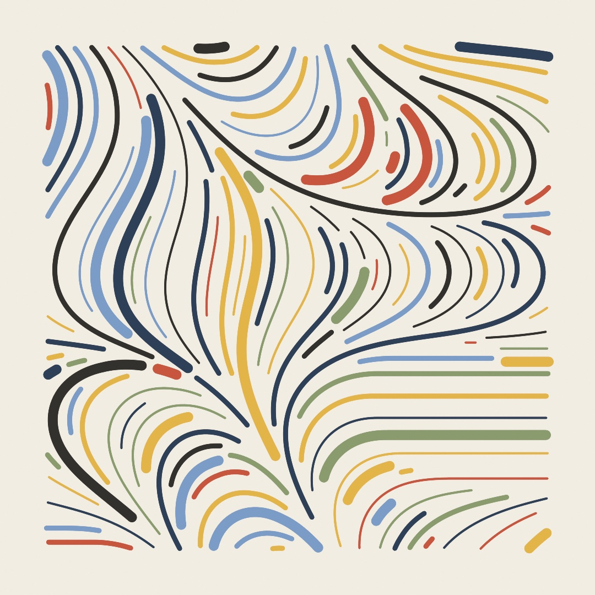
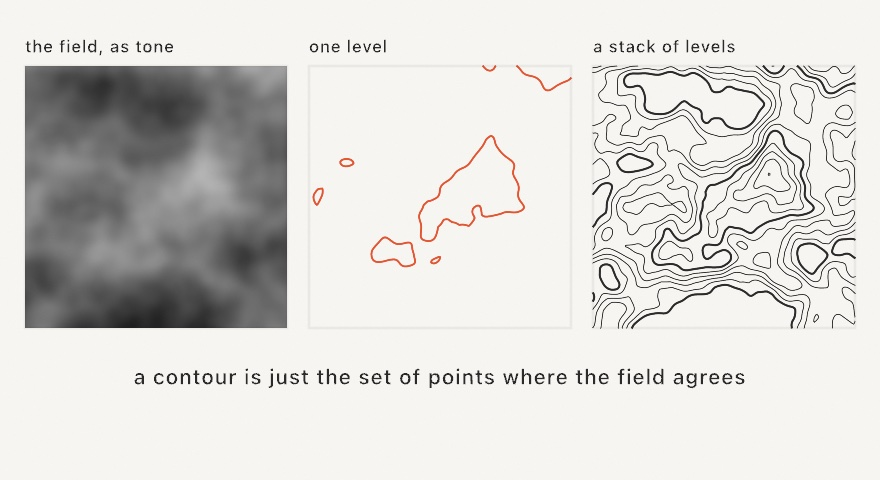
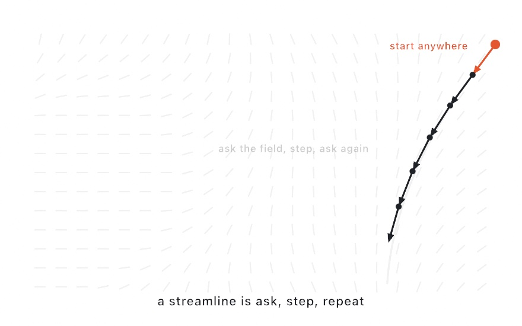
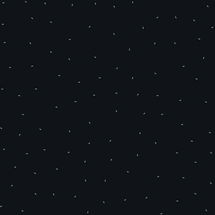
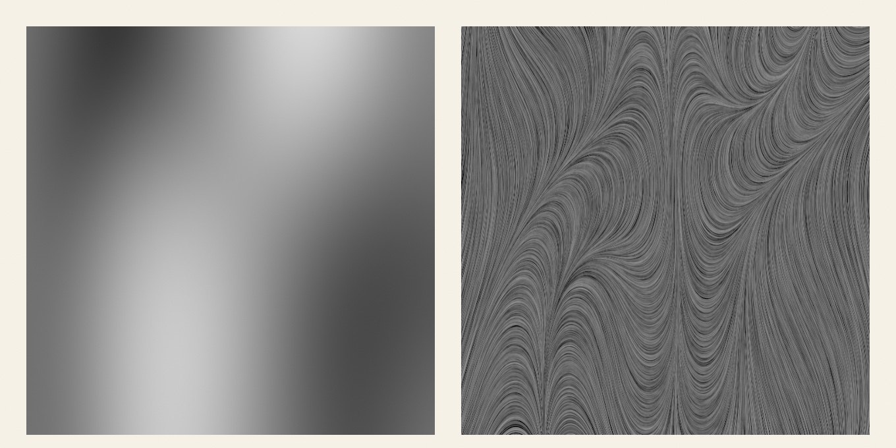
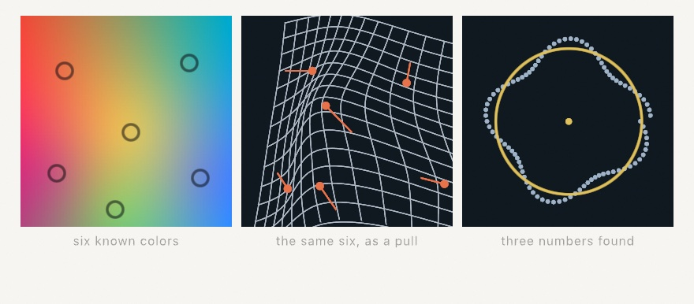

#### <sup>[Ollin](../README.md) → [Guide](README.md) → Chapter 14</sup>

---

# 14. Fields and flow



Most tricks in this guide do one job. This chapter teaches one that keeps working everywhere. It is the **field**, a question you can ask at every point of the canvas and always get an answer. Noise was your first field, a number at every point. Give the answer a *direction* instead and you get flow. Lines comb themselves into currents, particles ride invisible rivers, and the print above draws itself out of one function. The same mental model comes back per-pixel in [Chapter 17](17-YourFirstShader.md) and as sculpting material in [Chapter 26](26-SculptingWithFields.md). What you learn here keeps working long after this chapter.

## An answer at every point

A **flow field** is a direction at every point of the plane. It isn't a grid of stored directions, just a rule. Hand it any point and it hands back an angle. In Ollin a `FlowField` is exactly that, a wrapped function. The easiest way to make a good one is to let noise pick the angles, which is what the `flowField(...)` helper does. Because noise changes smoothly ([Chapter 5](05-Noise.md)'s whole point), nearby points get nearby directions, and the field organizes into weather.

You can't see a function, but you can interview it. Put down a grid of points, ask the field for its direction at each one, and draw a needle. Make `MySketches/Compass.swift`:

```swift
import Ollin

final class Compass: Sketch {
    override func draw() {
        background(Color(hex: 0x101318))
        seed(7)
        let field = flowField(scale: 0.0016, z: time * 0.04)

        stroke(Color(hex: 0xC9D4E0))
        strokeWeight(2.5)
        strokeCap(.round)
        noFill()
        for point in grid(columns: 24, rows: 24, padding: 70).points {
            let dir = field.direction(at: point.position)
            drawLine(point.position - dir * 11, point.position + dir * 11)
        }
        noStroke()
        fill(Color(hex: 0xE8B44A))
        for point in grid(columns: 24, rows: 24, padding: 70).points {
            let dir = field.direction(at: point.position)
            drawCircle(center: point.position + dir * 11, radius: 3)
        }
    }
}
```


`field.angle(p)` is the raw answer in radians, and `field.direction(at: p)` is the same answer as a unit vector, ready for [Chapter 10](10-Vectors.md)'s arithmetic. The `z` argument is the third noise dimension doing its usual job from [Chapter 5](05-Noise.md). Nudge it over time and the whole weather system drifts. Two things are worth noticing before moving on. The needles are only *samples*, and the field has an answer between them too, at every point you could ever ask. The field is also cheap, because nothing is simulated or stored, so asking is all it ever costs.

One habit keeps the sugar honest. `flowField` reads the sketch's seeded noise, so call `seed(...)` first and build the field fresh each frame. You can also trace what you need once and keep the *results*. It's a lens over the noise, not a stored grid.

## Where the field equals something

A `FlowField` answers with a direction. The other kind of field answers with a number, and you already have one. [Chapter 5](05-Noise.md)'s noise hands back a value at every point. Fields like that invite a different question. Instead of asking which way to go, you ask where the field equals some particular value, and the answer is a set of curves.

Those curves are **level curves**, or contours, and you have read thousands of them on maps. A contour line on a map is the set of places at exactly 400 meters. Walking along one is flat, and crossing several quickly means the slope is steep.

<picture>
  <source media="(prefers-color-scheme: dark)" srcset="Images/14-FieldsAndFlow/Isolines-dark.jpg">
  
</picture>

```swift
let rings = isolines(at: 0.55, in: frame, resolution: 200) { p in
    fbm(p.x * 0.006, p.y * 0.006, octaves: 4)
}
noFill()
for ring in rings { drawPolyline(ring.points, closed: ring.isClosed) }
```

The method is worth a sentence, because it's unusually easy to picture. Sample the field on a grid, then look at one little square at a time. Note which of its four corners are above the level and which are below. There are only sixteen ways that can come out, and each one tells you exactly how the curve crosses that square. Do that everywhere and stitch the crossings together, and the contours fall out. It's called marching squares. `resolution` is how many cells go across the longer side, so raising it tightens the curves at a proportional cost in samples.

For a map you want many levels, and there's a form for that which matters more than it looks:

```swift
let levels = Array(stride(from: 0.3, through: 0.75, by: 0.045))
for (i, group) in isolines(at: levels, in: frame, field: terrain).enumerated() {
    strokeWeight(i % 5 == 0 ? 2 : 0.8)      // heavy every fifth, like a real map
    for curve in group { drawPolyline(curve.points, closed: curve.isClosed) }
}
```

Passing all the levels at once samples the field a single time and traces them all from that one pass. Since evaluating the field is nearly all of the work, ten levels cost barely more than one. That is the difference between a contour map you can animate and one you can't.

Two details show up the moment you use this. Curves come back **closed** when they close inside your region and **open** when they run off its edge. That is why `drawPolyline` wants `isClosed` rather than guessing. And there's a version that reads a picture instead of a function, `isolines(of: image, at:)`, which treats the image's tone as the field. That's how you get a contour map of a photograph, or clean vector outlines from anything you can draw.

This is also the general answer to "how do I get a real outline out of a field". Metaball silhouettes, the boundary of a simulation, and the nodal lines of the vibrating plate in [Chapter 19](19-GridSimulations.md) are all one `isolines` call. What comes back is ordinary geometry you can stroke, offset, or send to a plotter.

## Following the flow

The field becomes drawing the moment you stop interviewing it and start obeying it. Put a point down anywhere. Ask the field which way. Take a small step that way. Ask again from where you landed:

<picture>
  <source media="(prefers-color-scheme: dark)" srcset="Images/14-FieldsAndFlow/TraceSteps-dark.jpg">
  
</picture>

The path this walk leaves is a **streamline**. `field.streamline(from: start)` traces one for you with properly small steps. It walks both directions from the start, so your point sits in the middle of the curve rather than at its end. Trace a handful from random starts and you have instant calligraphy. The `stepLength` is the accuracy parameter, since big steps cut corners on tight curves, exactly like the exaggerated arrows in the diagram.

## Lines that keep their distance

Streamlines from scattered starts have one flaw as art, which is that nothing stops them from crossing or bunching into ropes. The fix, from scientific visualization, is a single added rule, and the difference is the whole flow-field look:

<picture>
  <source media="(prefers-color-scheme: dark)" srcset="Images/14-FieldsAndFlow/EvenSpacing-dark.jpg">
  
</picture>

Pass a `separation` and each line is traced watching all the lines drawn before it. The moment it comes within that distance of any of them, it stops and yields. Lines never cross, density stays even, and the field reads as combed fiber:

```swift
let lines = field.streamlines(from: poissonDisk(radius: 24),
                              stepLength: 6, steps: 140,
                              bounds: bounds, separation: 21)
```

The starts come from `poissonDisk`, [Chapter 13](13-GrowingThings.md)'s well-spread scatter ([Chapter 15](15-ShapesAsMaterial.md) finally opens it up), because evenly spaced lines deserve evenly spread beginnings. Each traced line is an ordinary `[Vector2]`, so everything you know applies. Stroke it, vary its weight, or feed it to an export.

## Particles that ride

A streamline is the whole journey drawn at once. Sometimes you want the journey *lived* instead. Keep a population of particles, and each frame move every one a small step along the field at its own position. That's **advection**, and it's one call:

```swift
particles = field.advected(particles, stepLength: 7)
```



The figure gives each particle a short stored trail ([Chapter 12](12-FlocksAndSwarms.md)'s array trick) and respawns any swimmer that leaves the canvas. It rides `curlField`, a second field builder worth knowing. Curl noise is built so the flow only ever swirls, never piling up or draining away. That keeps a drifting population evenly spread forever. It's the field of choice for smoke, ink, and anything that should feel fluid without simulating fluid.

## The whole field at once

Streamlines trace the field one line at a time, and you choose where each line starts. There is a way to show every point of the field in one pass, with nothing chosen. Fill a layer with fine grain. Then, at every pixel, average the grain along the streamline that runs through that pixel, a short way in both directions. Grain that sits on the same streamline gets the same average, so it smears into a thread. Grain on neighboring streamlines gets a different average. The field turns into combed fiber.

That pass is **line integral convolution**, and it is one step on a composed layer. The field it follows is an `aside { }`, a layer drawn only to steer the streaks and never shown:

```swift
compose {
    layer { background(Color(white: 0.55)) }
        .post(.grain(amount: 1))
        .streaked(along: aside { drawImage(generate(.noise(scale: 3)).image, 0, 0) },
                  length: 0.08, field: .angle(turns: 2))
}
```



`field:` says how the aside's colors encode a direction. `.angle(turns:)` reads gray as a heading, black to white sweeping that many full turns, which is the natural reading for a noise layer. `.contour` follows the aside's contour lines, so streaks circle every bright blob. `.vector` reads red and green as a direction, which is what a normal map holds. `length` is the streak from end to end, as a fraction of the canvas. Raise it and the picture melts into strokes.

The walk stops at the layer's edge and at any pixel where the field is zero. A hard edge in the field traps the walk on one side of it, so keep the steering layer smooth, or read it as `.contour`. The base does not have to be grain. Feed a photo in and the picture is brushed along the field.

## A field you pin down yourself

Every field so far came out of noise. You turned parameters on it, but you never told it what to be at any particular place. Sometimes that is exactly backwards. You know what you want at a few spots, and you want something sensible everywhere else.

If those spots sat on a grid you could interpolate between the neighbors. Scattered points have no neighbors to speak of, so the answer has to come from all of them at once. `RadialBasis` does that. Each known point gets a bump centered on it, and the bumps are weighted so their sum lands exactly on every value you gave.

```swift
let field = RadialBasis(points: anchors, values: inks)!
fill(field.value(at: Vector2(x, y)))
```

<picture>
  <source media="(prefers-color-scheme: dark)" srcset="Images/14-FieldsAndFlow/Fitting-dark.jpg">
  
</picture>

The left panel is six colors at six places, read back at every pixel. It looks like a gradient and it is not one. Nothing was blended between two stops; every pixel is a weighted sum of all six. Look at the rings marking the points: what shows inside each one is the field's own color there, and it matches the color that point was given. **A field that passes through its data is interpolating. One that merely heads in the right direction is blurring.**

The values do not have to be colors. Give the same call `Vector2`s and each known point says "this place should move to *there*", which makes the field a warp. That is the middle panel: a straight grid, with each of its points read through the warp, bending around six pulls. Read a shape's outline through it instead and the shape bends.

You can ask it not to be so obedient. `smoothing:` lets the field miss its values in exchange for fewer wobbles between them, which is what noisy data usually wants:

```swift
RadialBasis(points: samples, values: readings, smoothing: 0.05)
```

One habit. Fitting solves a system that grows with the cube of how many points you give it, and reading the field costs one term per point every single time. Fit in `setup()`, read in `draw()`. Six points read over a whole canvas is nothing; six thousand is a different program.

### Going the other way

The third panel is the reverse trick, and it is worth knowing about even though it is not a field at all.

Those pale dots are scattered around a circle. Nothing in the sketch knows where that circle is. `Fit.minimize` takes three numbers, a middle and a radius, and a way of saying how wrong they are, and walks them downhill until they stop being wrong:

```swift
let best = Fit.minimize(from: [width / 2, height / 2, 100]) { p in
    marks.reduce(0.0) { total, mark in
        let off = Vector2(p[0], p[1]).distance(to: mark) - p[2]
        return total + off * off
    }
}
drawCircle(best.values[0], best.values[1], best.values[2])
```

The closure is the whole of it. You never say how to search, only how to score. Squared distance is the usual scoring: it punishes one badly placed mark much harder than several slightly off ones, which is what makes the answer settle in the middle of the crowd.

It walks *downhill from where you start*. A problem with several separate answers hands back whichever one your starting guess was nearest, so when that matters, run it from a few different starts and keep the best. It also measures the slope by trying each parameter a little either side of where it stands, so your closure gets called a couple of thousand times over a walk of any length. Keep it cheap.

## Putting it together: the print

Everything above compresses into a surprisingly short piece with a long pedigree. It uses evenly spaced streamlines, three ribbon weights, a warm palette, and cream paper. Make `MySketches/FlowPrint.swift`:

```swift
import Ollin

final class FlowPrint: Sketch {
    override func draw() {
        background(Color(hex: 0xF2EDE3))
        seed(12)

        let margin = bounds.inset(by: .all(84))
        let field = flowField(scale: 0.0011, z: 0.4)
        let seeds = poissonDisk(in: margin, radius: 24)
        let lines = field.streamlines(from: seeds, stepLength: 6, steps: 140,
                                      bounds: margin, separation: 21)

        let palette = [Color(hex: 0xC8553D), Color(hex: 0xE3B448), Color(hex: 0x8A9B6E),
                       Color(hex: 0x2E4057), Color(hex: 0x7A9CC6), Color(hex: 0x33312E)]
        let weights = [4.0, 4, 9, 9, 9, 18]

        noFill()
        strokeCap(.round)
        for line in lines where line.count > 3 {
            stroke(randomChoice(palette))
            strokeWeight(randomChoice(weights))
            drawPolyline(line)
        }
    }
}
```

Everything happens in `draw()` with a fixed seed, so the piece is a still that redraws identically every frame. Change the seed and a new print rolls off the press. The `weights` list is a quiet trick from [Chapter 4](04-Randomness.md), where repeating `9` three times makes medium ribbons three times as likely as heavy ones.

Then make it yours:

- Roll seeds until one composes. This is how flow-field artists actually work, in that the field does the drawing and the artist does the choosing.
- Swap `flowField` for `curlField` and the print turns from wind-combed to whirlpooled.
- Give the palette a bias by picking the color from the line's *position*, its first point's `y` mapped into the palette. The print then develops horizons.
- Replace `drawPolyline` with a dot walked along each line every few points, and the ribbons become stitched embroidery.
- Print it for real by adding `--export-svg print.svg` when you run it. Every ribbon exports as a true vector path, and [Chapter 15](15-ShapesAsMaterial.md) goes deeper into plotter territory.

## Where this comes from

Vector fields are old mathematics, since fluid dynamics and electromagnetism both run on them. Creative coding borrowed the flow field as a drawing device, and Processing-era sketches passed the recipe around. The evenly spaced tracing is Bruno Jobard and Wilfrid Lefer's 1997 streamline-placement algorithm from scientific visualization. Curl noise as a graphics tool is Robert Bridson's 2007 formulation. The combed-fiber picture is line integral convolution, which Brian Cabral and Leith Leedom published in 1993 for showing vector fields. The print at the top tips its hat to Tyler Hobbs, whose flow-field work defined the look for a generation. The best known of that work is *Fidenza* (2021), and the essay "Flow Fields" generously teaches the craft. The same cascade appears in the sine map and in dripping faucets. Marching squares is the two-dimensional version of the marching cubes algorithm. William Lorensen and Harvey Cline published that algorithm in 1987 for medical imaging. A great many of these techniques were born there before artists found them. Full credits are in the project's [attribution notes](../ATTRIBUTION.md).

## Go deeper

- [Flow fields](../Docs/Generators/FlowField.md): the full `FlowField` reference, including advection and the transient-sugar rule.
- [Noise](../Docs/Generators/Noise.md): the field the flow is made of.
- [Isolines](../Docs/Generators/Isolines.md): the single-level and stacked-level forms, the image form, resolution, and what open versus closed contours mean.
- [Steering](../Docs/Generators/Steering.md): creatures that *follow* a field instead of riding it ([Chapter 12](12-FlocksAndSwarms.md)'s `follow(_:)`).
- [Fitting](../Docs/Drawing/Fitting.md): the kernels `RadialBasis` can use, fields of vectors and colors, smoothing, and everything `Fit.minimize` takes.
- [Layered effects](../Docs/Drawing/Effects.md): `.streaked(along:length:field:)` and the `.lineIntegralConvolution` combine, with the three field readings.
- Appendix B draws this chapter's math, one picture per idea: [Fields and following them](B-JustEnoughMath.md#fields-and-following-them).
- Worked examples: [`Examples/Patterns/Streamlines`](../Examples/Patterns/Streamlines/Sketch.swift) (evenly spaced, hue drifting along the flow), [`Examples/Effects/FlowStreaks`](../Examples/Effects/FlowStreaks/Sketch.swift) (a grained sheet brushed along a field, three readings on a parameter), [`Examples/Shapes/Scattered`](../Examples/Shapes/Scattered/Sketch.swift) (a field, a warp, and a circle recovered from marks), and [`Examples/Motion/FlowField`](../Examples/Motion/FlowField/Sketch.swift) (a curl field of drifting needles).

---

[Contents](README.md#contents) · Previous: [Chapter 13, Growing things](13-GrowingThings.md) · Next: [Chapter 15, Shapes as material](15-ShapesAsMaterial.md)
