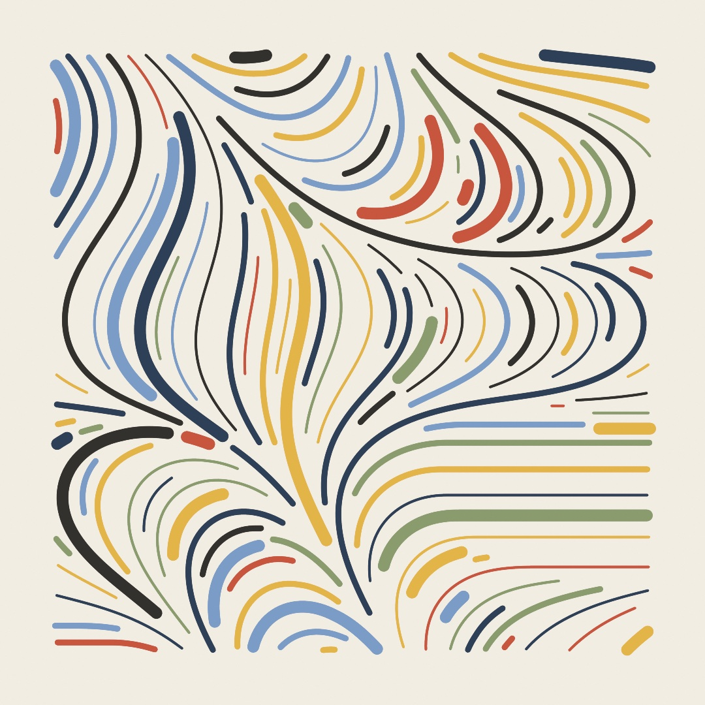
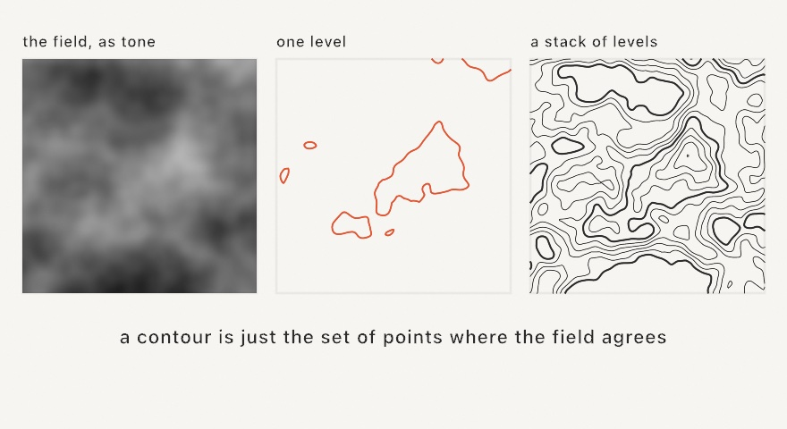
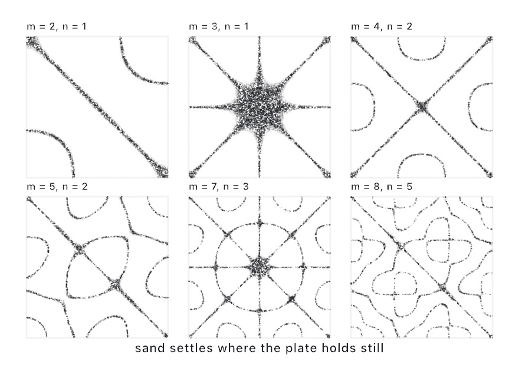
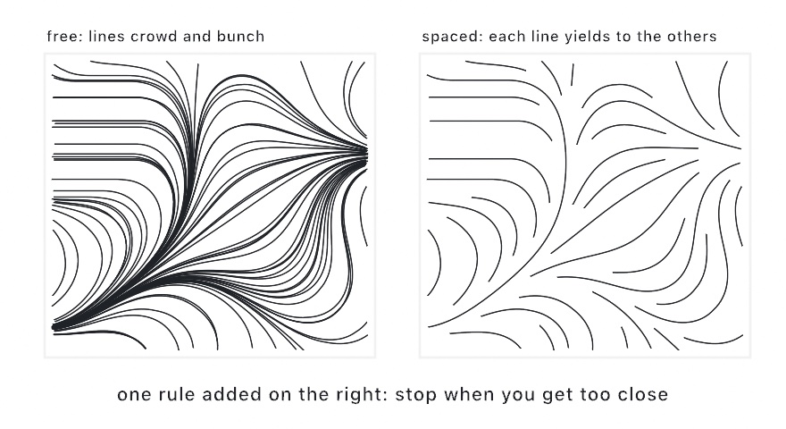
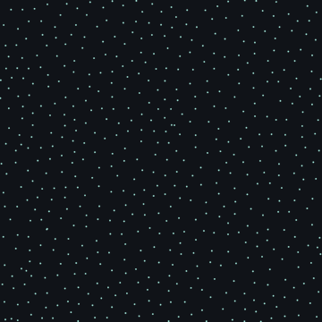
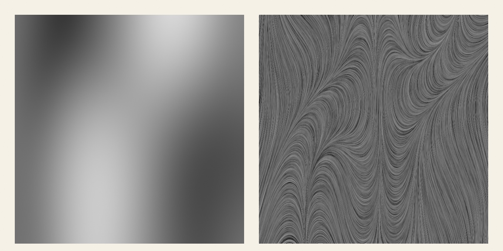
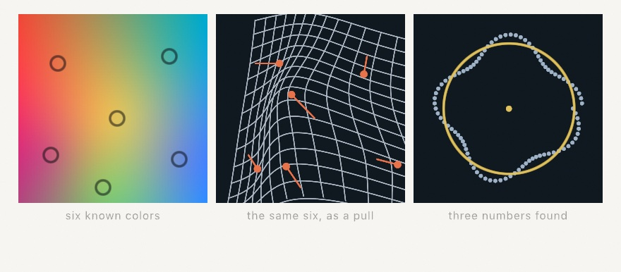

#### <sup>[Ollin](../README.md) → [Guide](README.md) → Chapter 14</sup>

---

# 14. Fields and flow



A field is a question you can ask at every point of the canvas, and its answer is a number or a direction. You draw both kinds, from the lines where a number field equals something to streamlines spaced evenly through a direction field. The print at the top draws itself out of one function that way. Past the print, a field carries particles, combs a whole layer at once, and passes through values you set by hand.

## Two kinds of field: a number or a direction at every point

A field is a rule, not a grid of stored values. Hand it any point of the plane and it hands back an answer. It has an answer at every point you could ever ask, between the samples as well as at them. Two kinds of answer make two kinds of field.

A **number field** answers with a number. [Chapter 5](05-Noise.md)'s `noise` is one, and so is any function you write that takes a point and returns a value. A number field makes two kinds of picture. Painted as tone, it is the cloudy gray you know from noise. Traced where it equals some chosen value, it is a set of curves, and those curves are the first thing this chapter draws.

A **direction field** answers with a direction, a *which way* at every point. The print at the top of the chapter is made of one. Lines that follow the answers gather into currents, and particles set loose on it drift along them. The chapter turns to the direction field after [the vibrating plate](#standing-waves-chladni-figures), and most of what follows is built on one.

## Where the field equals something: contours

You already have a number field, so start there. Instead of asking a noise field how bright it is at a point, ask where it equals some particular value. The answer is a set of curves.

Those curves are **level curves**, or contours, and you have read thousands of them on maps. A contour line on a map is the set of places at exactly 400 meters. Walking along one is flat, and crossing several quickly means the slope is steep.

<picture>
  <source media="(prefers-color-scheme: dark)" srcset="Images/14-FieldsAndFlow/Isolines-dark.jpg">
  
</picture>

In a sketch, one level is one call. `isolines` takes the level, the region to search, and the field as a closure, and hands back the curves:

```swift
let rings = isolines(at: 0.55, in: bounds, resolution: 200) { p in
    fbm(p.x * 0.006, p.y * 0.006, octaves: 4)
}
noFill()
for ring in rings { drawPolyline(ring.points, closed: ring.isClosed) }
```

The method is easy to picture. Sample the field on a grid, then look at one little square at a time. Note which of its four corners are above the level and which are below. There are only sixteen ways that can come out, and each one tells you how the curve crosses that square. Do that everywhere and stitch the crossings together, and the contours fall out. It is called marching squares. `resolution` is how many cells go across the longer side, so raising it tightens the curves at a proportional cost in samples.

For a map you want many levels, and there is a form for that:

```swift
let levels = Array(stride(from: 0.3, through: 0.75, by: 0.045))
for (i, group) in isolines(at: levels, in: bounds, field: terrain).enumerated() {
    strokeWeight(i % 5 == 0 ? 2 : 0.8)      // heavy every fifth, like a printed map
    for curve in group { drawPolyline(curve.points, closed: curve.isClosed) }
}
```

Passing all the levels at once samples the field a single time and traces them all from that one pass. Evaluating the field is nearly all of the work, so ten levels cost barely more than one, and a contour map can animate. `stride` counts from one number to another in steps, and `Array(...)` collects the steps into a list. `terrain` stands for the closure from the first listing, given a name and passed with the `field:` label.

Two details show up the moment you use this. Curves come back **closed** when they close inside your region and **open** when they run off its edge. That is why `drawPolyline` wants `isClosed` rather than guessing. And there is a version that reads a picture instead of a function, `isolines(of: image, at:)`, which treats the image's tone as the field. That is how you get a contour map of a photograph, or clean vector outlines from anything you can draw.

This is also how you get an outline out of any field. Metaball silhouettes, the boundary of a simulation, and the nodal lines of the vibrating plate in the next section are all one `isolines` call. What comes back is ordinary geometry you can stroke, offset, or send to a plotter.

## Standing waves: Chladni figures

The noise contours above sit at whatever level you pick. Some fields come with a level that means something on its own, and zero is the usual one. A vibrating plate is the classic example. In 1787 Ernst Chladni scattered sand on a metal plate and drew a bow across its edge. The sand skipped away from the parts that were moving, and settled along the lines that were not. Those lines are the plate's **nodes**, the places where it does not move at all. Chladni toured Europe showing the figures they make.

The square plate's movement has a closed form, so Ollin gives you the value at any point directly instead of a simulation:

```swift
let s = chladni(u, v, m: 5, n: 2)      // -1…1, over plate coordinates 0…1
```

`u` and `v` run `0...1` across the plate, and `m` and `n` are the mode numbers, which say how the plate was driven. The result is how far the plate is displaced at that spot, so sand settles wherever the value is near zero. The recipe follows from that. Scatter grains, and keep the ones sitting near a nodal line.

<picture>
  <source media="(prefers-color-scheme: dark)" srcset="Images/14-FieldsAndFlow/ChladniModes-dark.jpg">
  
</picture>

One rule matters. Setting `m` equal to `n` cancels the whole expression to zero, and the plate's diagonal is nodal in every mode. Both are properties of the physics rather than bugs to work around. Keep `m` and `n` apart and every mode gives you a figure.

`m` and `n` do not have to be whole numbers, and that is how you animate one. Fractional modes morph continuously from one figure to the next. A slow tour through mode space makes the sand rearrange itself, the way it does when the bow moves. Keep `m` above `n` at every stop along the way, or the tour crosses the degenerate diagonal and the figure blinks out.

The grains are a picture of the zero level, and the section above already has the tool for the lines themselves. Hand the same function to `isolines` at zero, and the nodal lines come back as contours you can stroke or plot:

```swift
let plate = Rectangle(x: 90, y: 90, width: 900, height: 900)
let lines = isolines(at: 0, in: plate, resolution: 240) { p in
    let uv = plate.uv(of: p)
    return chladni(uv.x, uv.y, m: 5, n: 2)
}
noFill()
for line in lines { drawPolyline(line.points, closed: line.isClosed) }
```

`plate.uv(of:)` turns a point on the canvas into the plate's own `0...1` coordinates, which is what `chladni` reads. To fill a whole layer with the plate instead, [Chapter 18](18-YourFirstShader.md#closed-forms-at-every-pixel-the-pattern-fields) evaluates the same closed form on the GPU, once for every pixel.

## A direction at every point: `FlowField`

The two sections above drew where a number field equals something. The other kind of field answers with a direction, and it is the kind the print is made of. A **flow field** is a direction at every point of the plane. Hand it any point and it hands back an angle. In Ollin a `FlowField` is that rule, a wrapped function. The easiest way to make a good one is to let noise pick the angles, which is what the `flowField(...)` helper does. Because noise changes smoothly, nearby points get nearby directions, and the field forms currents.

You cannot see a function, but you can ask it questions. Put down a grid of points, ask the field for its direction at each one, and draw a needle. Make `MySketches/Compass.swift`:

```swift
import Ollin

final class Compass: Sketch {
    override func draw() {
        background(Color(hex: 0x101318))
        seed(7)
        let field = flowField(scale: 0.0016, z: time * 0.04)

        stroke(Color(hex: 0xC9D4E0))
        strokeWeight(2.5)
        strokeCap(.round)
        noFill()
        for point in grid(columns: 24, rows: 24, padding: 70).points {
            let dir = field.direction(at: point.position)
            drawLine(point.position - dir * 11, point.position + dir * 11)
        }
        noStroke()
        fill(Color(hex: 0xE8B44A))
        for point in grid(columns: 24, rows: 24, padding: 70).points {
            let dir = field.direction(at: point.position)
            drawCircle(center: point.position + dir * 11, radius: 3)
        }
    }
}
```


The second loop puts a gold dot on the forward end of each needle, so you can tell which way it points. `field.angle(p)` is the raw answer in radians, and `field.direction(at: p)` is the same answer as a unit vector, ready for [Chapter 10](10-Vectors.md)'s arithmetic. The `z` argument is the third noise dimension doing its usual job from [Chapter 5](05-Noise.md). Nudge it over time and the whole field drifts. Two things to notice before moving on. The needles are only *samples*, and the field has an answer between them too. The field is also cheap, because nothing is simulated or stored, so asking is all it ever costs.

One habit follows from that. `flowField` reads the sketch's seeded noise, so call `seed(...)` first and build the field fresh each frame. You can also trace what you need once and keep the *results*. The field is a function laid over the noise rather than a stored grid.

## Following the flow: streamlines

The compass asked the field a question at each point of a grid. The field becomes drawing the moment you stop asking and start obeying. Put a point down anywhere. Ask the field which way. Take a small step that way. Ask again from where you landed:

<picture>
  <source media="(prefers-color-scheme: dark)" srcset="Images/14-FieldsAndFlow/TraceSteps-dark.jpg">
  
</picture>

The path this walk leaves is a **streamline**. `field.streamline(from: start)` traces one for you with small steps. It walks both directions from the start, so your point sits in the middle of the curve rather than at its end. Trace a handful from random starts and you have a sheet of flowing lines. The `stepLength` argument sets the accuracy, since big steps cut corners on tight curves, like the enlarged arrows in the diagram.

## Lines that keep their distance: evenly spaced streamlines

Streamlines from scattered starts have one flaw as art. Nothing stops them from crossing or bunching into ropes. The fix, from scientific visualization, is a single added rule, and it is what gives a flow-field print its look:

<picture>
  <source media="(prefers-color-scheme: dark)" srcset="Images/14-FieldsAndFlow/EvenSpacing-dark.jpg">
  
</picture>

Pass a `separation` and each line is traced watching all the lines drawn before it. The moment it comes within that distance of any of them, it stops. Lines never cross, density stays even, and the field reads as combed fiber:

```swift
let lines = field.streamlines(from: poissonDisk(radius: 24),
                              stepLength: 6, steps: 140,
                              bounds: bounds, separation: 21)
```

The starts come from `poissonDisk`, the even scatter from [Chapter 4](04-Randomness.md#chance-spread-evenly-blue-noise-and-low-discrepancy-sequences), because evenly spaced lines need evenly spread beginnings. Each traced line is an ordinary `[Vector2]`, so everything you know applies. Stroke it, vary its weight, or feed it to an export.

## Putting it together: the print

The print composes three of the steps: the direction field made from noise, the blue-noise starts, and the evenly spaced streamlines. Three ribbon weights, a warm palette, and cream paper finish it. Make `MySketches/FlowPrint.swift`:

```swift
import Ollin

final class FlowPrint: Sketch {
    override func draw() {
        background(Color(hex: 0xF2EDE3))
        seed(12)

        let margin = bounds.inset(by: .all(84))
        let field = flowField(scale: 0.0011, z: 0.4)
        let seeds = poissonDisk(in: margin, radius: 24)
        let lines = field.streamlines(from: seeds, stepLength: 6, steps: 140,
                                      bounds: margin, separation: 21)

        let palette = [Color(hex: 0xC8553D), Color(hex: 0xE3B448), Color(hex: 0x8A9B6E),
                       Color(hex: 0x2E4057), Color(hex: 0x7A9CC6), Color(hex: 0x33312E)]
        let weights = [4.0, 4, 9, 9, 9, 18]

        noFill()
        strokeCap(.round)
        for line in lines where line.count > 3 {
            stroke(randomChoice(palette))
            strokeWeight(randomChoice(weights))
            drawPolyline(line)
        }
    }
}
```

Everything happens in `draw()` with a fixed seed, so the sketch is a still that redraws identically every frame. Change the seed and a new print rolls off the press. `bounds.inset(by: .all(84))` is the canvas rectangle with a margin taken off every side, and the lines are traced inside it. `randomChoice` is [Chapter 4](04-Randomness.md)'s pick from a list. The `weights` list repeats `9` three times, so medium ribbons come up three times as often as heavy ones. That is what Chapter 4's `weights:` did with numbers. `where line.count > 3` skips the lines that stopped almost as soon as they started, the loop filter from [Chapter 11](11-ForcesAndPhysics.md).

Then make it yours:

- Roll seeds until one composes. This is how flow-field artists work, in that the field does the drawing and the artist does the choosing.
- Swap `flowField` for `curlField`, a second field builder that only ever swirls, and the print turns from wind-combed to whirlpooled.
- Give the palette a bias by picking the color from the line's *position*, its first point's `y` mapped into the palette. The print then develops horizons.
- Replace `drawPolyline` with a dot walked along each line every few points, and the ribbons become stitched embroidery.

A print is a still, and the way to keep this one is as a vector file. Add `--export-svg print.svg` when you run it, and every ribbon exports as a true vector path a pen plotter can draw. [Chapter 15](15-ShapesAsMaterial.md) covers the plotter side.

## What else a field can do: advection, line integral convolution, and radial basis functions

The print traced a direction field one line at a time, from starts you chose. Three more things a field can do belong to the same idea, and none of them is in the print. A direction field can carry a population of particles along, one step per frame. A layer can be combed along the field everywhere at once, with no start chosen. And a number field can be built the other way round, from values you set at a few places, so that it passes through them.

### Points the field carries: advection

**Advection** is moving a set of points along a direction field, each by one small step from its own position, every frame. A streamline is the whole journey drawn at once. Advection is the journey lived instead, and it is for smoke, ink, and anything that should read as fluid without simulating fluid. The word is borrowed from fluid dynamics, where it names what a flow carries along. In Ollin it is one call, `advected`, which takes the points and hands back the moved points. Make `MySketches/Drift.swift`:

```swift
import Ollin

final class Drift: Sketch {
    var dots: [Vector2] = []

    override func setup() {
        seed(7)
        dots = poissonDisk(radius: 36)
        background(Color(hex: 0x101318))
        noClear()
    }

    override func draw() {
        let field = curlField(scale: 0.0022)
        dots = field.advected(dots, stepLength: 3)
        for i in dots.indices where !bounds.contains(dots[i]) {
            dots[i] = Vector2(random(width), random(height))
        }

        // Fade the last frame a little instead of erasing it: trails.
        noStroke()
        fill(Color(hex: 0x101318).withAlpha(0.06))
        drawRect(bounds)

        fill(Color(hex: 0x9AD9CE))
        drawCircles(dots, radius: 2.4)
    }
}
```



The dots start on a blue-noise scatter and take a step each frame. A dot that leaves the canvas is put back at a random spot. The trails come from the fade of [Chapter 12](12-FlocksAndSwarms.md). `noClear()` runs in `setup()`, and a faint wash of the background covers the last frame instead of erasing it. The seed is set once, in `setup()`, so the field is the same every frame and the respawns keep drawing from the sketch's own stream. The field is `curlField`, the second builder. Curl noise is built so the flow only ever swirls. The dots never pile up or drain away, and the respawns only fill in what leaves. `bounds.contains` asks whether a point is inside the canvas rectangle. `!` in front of a test means *not*, so the loop visits only the dots outside it. The [flow-field reference](../Docs/Generators/FlowField.md#advect) covers `advected` beside `noClear()`.

### The whole field at once: line integral convolution

**Line integral convolution** shows every point of a direction field in one pass, with nothing chosen. Fill a layer with fine grain. Then, at every pixel, average the grain along the streamline that runs through that pixel, a short way in both directions. Grain that sits on the same streamline gets the same average, so it smears into a thread. Grain on neighboring streamlines gets a different average. The field shows as fine threads. It is for showing a whole field as texture, and for brushing a picture along a field. Brian Cabral and Leith Leedom published it in 1993, for showing vector fields in scientific visualization.

In Ollin it is one step on a composed layer, and the layers themselves are [Chapter 19](19-LayersAndEffects.md)'s. `compose`, `layer`, `.post`, and `generate` are all taught there. Read the call now for the idea, and come back to type it once you have them. The field it follows is an `aside { }`, a layer drawn only to steer the streaks and never shown:

```swift
compose {
    layer { background(Color(white: 0.55)) }
        .post(.grain(amount: 1))
        .streaked(along: aside { drawImage(generate(.noise(scale: 3)).image, 0, 0) },
                  length: 0.08, field: .angle(turns: 2))
}
```



`field:` says how the aside's colors encode a direction. `.angle(turns:)` reads gray as a heading, black to white sweeping that many full turns, which is the natural reading for a noise layer. `.contour` follows the aside's contour lines, so streaks circle every bright blob. `.vector` reads red and green as a direction, which is what a normal map holds. `length` is the streak from end to end, as a fraction of the canvas. Raise it and the picture melts into strokes.

The walk stops at the layer's edge and at any pixel where the field is zero. A hard edge in the field traps the walk on one side of it, so keep the steering layer smooth, or read it as `.contour`. The base does not have to be grain. Feed a photo in and the picture is brushed along the field. The `Effects/FlowStreaks` example brushes a grained sheet along a field with the three readings on a parameter.

### A field you pin down yourself: radial basis functions

A **radial basis function** field is a number field built from values you know at a few scattered places. It is made so that it passes through every one of them. Every field so far came out of noise or out of a formula. You adjusted its arguments, but you never told it what to be at any particular place. Sometimes you want the reverse. You know what you want at a few spots, and you want something sensible everywhere else. That is what this field is for: a smooth color, number, or vector field through scattered readings. Rolland Hardy introduced the method in 1971, to draw the surface of the ground from scattered survey points.

If those spots sat on a grid you could interpolate between the neighbors. Scattered points have no fixed neighbors, so the answer has to come from all of them at once. `RadialBasis` does that. Each known point gets a bump centered on it, and the bumps are weighted so their sum lands exactly on every value you gave:

```swift
let field = RadialBasis(points: anchors, values: inks)!
fill(field.value(at: Vector2(x, y)))
```

<picture>
  <source media="(prefers-color-scheme: dark)" srcset="Images/14-FieldsAndFlow/Fitting-dark.jpg">
  
</picture>

The `!` after the call takes the value out of an optional and stops the sketch if there is none. It is the same promise [Chapter 2](02-Color.md)'s `try!` made about a file. The fit fails when two points share a place or all of them sit on one line, and here you know they do neither. The left panel is six colors at six places, read back at every pixel. It looks like a gradient and it is not one. Nothing was blended between two stops. Every pixel is a weighted sum of all six. Look at the rings marking the points. What shows inside each one is the field's own color there, and it matches the color that point was given. A field that passes through its data is interpolating, and one that only heads in the right direction is blurring.

The values do not have to be colors. Give the same call `Vector2`s and each known point says "this place should move to *there*", which makes the field a warp. That is the middle panel: a straight grid, with each of its points read through the warp, bending around six pulls. Read a shape's outline through it instead and the shape bends. The third panel runs the other way, fitting a circle to scattered marks, and [Chapter 15](15-ShapesAsMaterial.md#the-circle-they-were-scattered-around-fitminimize) explains it beside the hulls.

You can let the field miss its values a little. `smoothing:` trades hitting every value for fewer wobbles between them, which is what noisy data usually wants:

```swift
RadialBasis(points: samples, values: readings, smoothing: 0.05)
```

One habit keeps it cheap. Fitting solves a system that grows with the cube of how many points you give it. Reading the field costs one term per point every single time. Fit in `setup()`, read in `draw()`. Six points read over a whole canvas costs nothing you can measure. Six thousand is a different program. The `Shapes/Scattered` example shows a field, a warp, and a circle recovered from marks.

## Where this comes from

Vector fields are old mathematics, since fluid dynamics and electromagnetism both run on them. Creative coding borrowed the flow field as a drawing device, and Processing-era sketches passed the recipe around. The evenly spaced tracing is Bruno Jobard and Wilfrid Lefer's 1997 streamline-placement algorithm from scientific visualization. Curl noise as a graphics tool is Robert Bridson's 2007 formulation. The print at the top follows Tyler Hobbs, whose flow-field work is the reference for the look. The best known of that work is *Fidenza* (2021), and his essay "Flow Fields" explains the craft. The plate figures are Ernst Chladni's, from *Entdeckungen über die Theorie des Klanges* (1787). The closed form Ollin evaluates follows Paul Bourke's "Chladni Plate Mathematics". Marching squares is the two-dimensional version of the marching cubes algorithm, which William Lorensen and Harvey Cline published in 1987 for medical imaging. The entries after the print name their own sources. Line integral convolution, like the even spacing, came from scientific visualization before artists took it up. Full credits are in the project's [attribution notes](../ATTRIBUTION.md).

## Go deeper

- [Flow fields](../Docs/Generators/FlowField.md): the full `FlowField` reference, including advection and the rule about rebuilding the field each frame.
- [Noise](../Docs/Generators/Noise.md): the field the flow is made of.
- [Isolines](../Docs/Generators/Isolines.md): the single-level and stacked-level forms, the image form, resolution, and what open versus closed contours mean.
- [Chladni figures](../Docs/Generators/Chladni.md): the mode numbers, the amplitude mix that opens up more figures, the nodal lines as geometry, and particles walked down to the nodes. The [`Patterns/Chladni`](../Examples/Patterns/Chladni/Sketch.swift) example tours the modes.
- [Steering](../Docs/Generators/Steering.md): creatures that *follow* a field instead of being carried by it ([Chapter 12](12-FlocksAndSwarms.md)'s `follow(_:)`).
- [Fitting](../Docs/Drawing/Fitting.md): the kernels `RadialBasis` can use, fields of vectors and colors, smoothing, and everything `Fit.minimize` takes.
- [Layered effects](../Docs/Drawing/Effects.md): `.streaked(along:length:field:)` and the `.lineIntegralConvolution` combine, with the three field readings.
- Appendix B draws this chapter's math, one picture per idea: [Fields and following them](B-JustEnoughMath.md#fields-and-following-them).
- Worked examples: [`Examples/Patterns/Streamlines`](../Examples/Patterns/Streamlines/Sketch.swift) (evenly spaced, hue drifting along the flow), [`Examples/Effects/FlowStreaks`](../Examples/Effects/FlowStreaks/Sketch.swift) (a grained sheet brushed along a field, three readings on a parameter), [`Examples/Shapes/Scattered`](../Examples/Shapes/Scattered/Sketch.swift) (a field, a warp, and a circle recovered from marks), and [`Examples/Motion/FlowField`](../Examples/Motion/FlowField/Sketch.swift) (a curl field of drifting needles).

---

[Contents](README.md#contents) · Previous: [Chapter 13, Growing things](13-GrowingThings.md) · Next: [Chapter 15, Shapes as material](15-ShapesAsMaterial.md)
