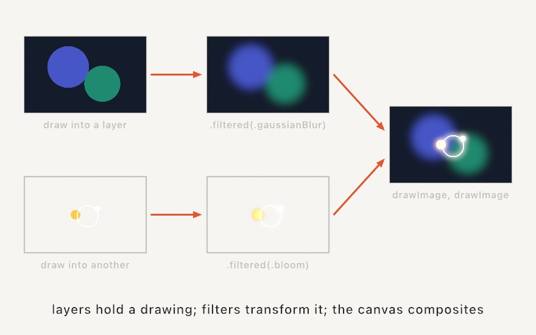
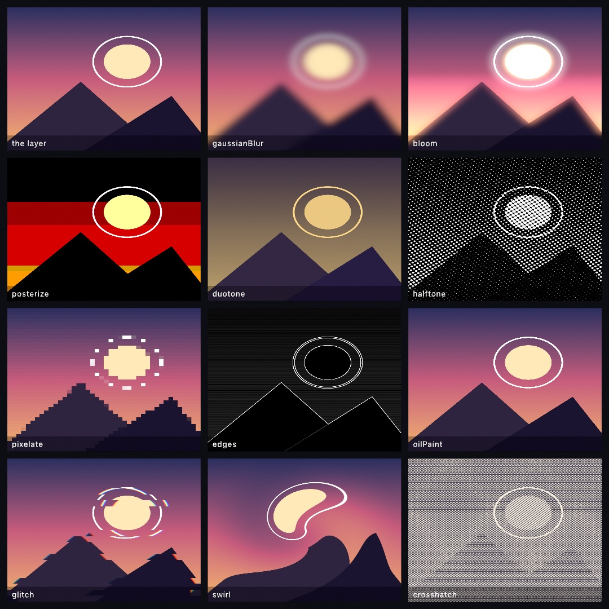
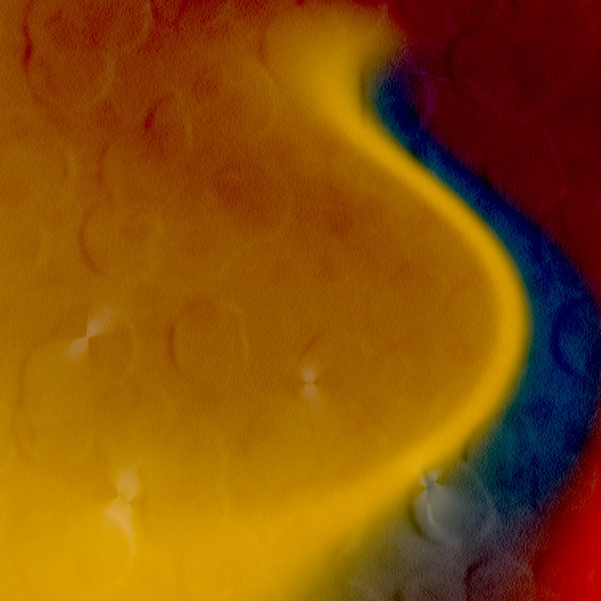
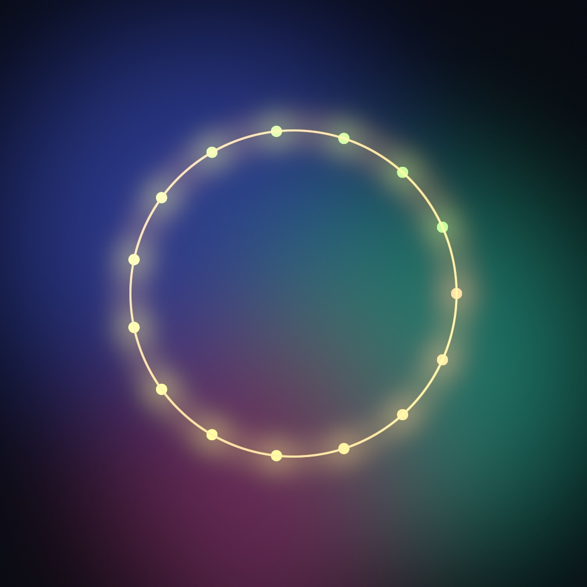
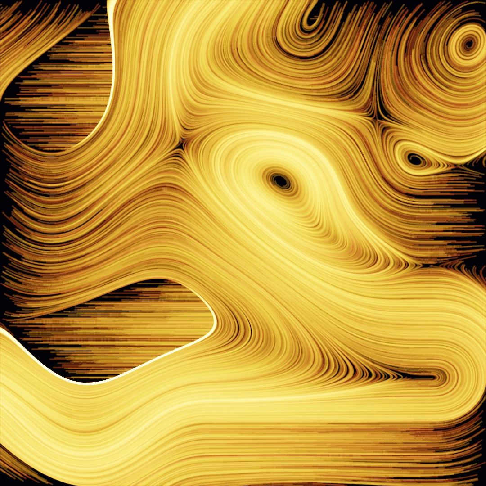
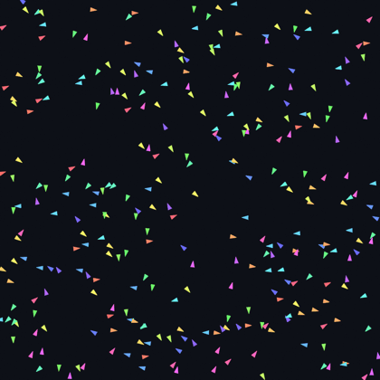

#### <sup>[Ollin](../README.md) → [Guide](README.md) → Chapter 14</sup>

---

# 14. Layers and effects


Every sketch so far has drawn onto one surface. This chapter adds more of them: off-screen layers you can hold, blur, glow, feed back into themselves, and stack like sheets of film. By the end, Chapter 10's flock comes back rebuilt out of light, and along the way the canvas learns three tricks a single surface can't do: remembering, accumulating, and being brighter than the screen.

## A drawing you can hold

A layer is a second canvas that lives off screen. You make one, aim your drawing at it, and nothing appears; the drawing is *held*, waiting for you to decide what happens to it. Make `MySketches/FirstLayer.swift`:

```swift
import Ollin

final class FirstLayer: Sketch {
    override func draw() {
        background(.black)

        let art = renderTarget()
        withTarget(art) {
            background(Color(hex: 0x0E1B33))
            noStroke()
            for i in 0 ..< 14 {
                let t = Double(i) / 14
                fill(Color(hue: 0.52 + t * 0.38, saturation: 0.7, brightness: 0.95))
                drawCircle(width * (0.16 + 0.68 * t),
                           height * 0.5 + sin(t * .tau * 1.5) * height * 0.2, 64)
            }
        }

        drawImage(art.filtered(.gaussianBlur(radius: 45)).image, 0, 0)   // soft, everywhere
        drawImage(art.image, in: bounds.inset(by: .all(200)))            // sharp, in front
    }
}
```


Three calls carry the whole idea. `renderTarget()` makes the layer. `withTarget(art) { }` redirects everything drawn inside the block into it, the way `withState { }` scopes a transform; a `background(_:)` inside clears just the layer. And `art.image` hands the finished layer back as an image for Chapter 7's `drawImage`, so the same drawing can appear twice: once blurred across the whole canvas, once sharp in a card floating over its own ghost. One drawing, two appearances. That's the move everything else in this chapter builds on.

Two habits worth forming now. A `renderTarget()` is per-frame scaffolding: make it fresh inside `draw()`, don't store it. And a layer that isn't composited never shows up; `withTarget` records the drawing, `drawImage` is what puts it on screen.

Here's the same idea as a picture, one thumbnail per stage:



## Filters

That `.filtered(.gaussianBlur(radius: 45))` in the first listing was a **filter**: an operation that reads a layer and hands back a new, transformed layer, with the original untouched. Filters run on the GPU, so they cost almost nothing you'd notice, and they chain:

```swift
let moody = art.filtered(.posterize(levels: 5)).filtered(.vignette())
```

Ollin ships fifty-some of them, in families: blur and glow, color and tone, stylize, retro, and warps that bend the image's coordinates. Here is one scene through a sample, one tile per family:



The one to meet properly is **bloom**, because it's the chapter's workhorse. `.bloom(threshold:intensity:radius:)` finds the parts of the image brighter than `threshold`, blurs them, and adds the blur back, so bright marks bleed light into their surroundings the way a streetlight bleeds into fog. It's the difference between a white dot and a *glowing* dot, and you'll reach for it constantly.

A few notes for the road. Filters are values you pass around, so a `[Filter]` array or a `@Param`-driven choice works the way you'd hope. `postProcess(.bloom())` applies a filter to the whole finished frame, no layer needed, which is the quick way to glow everything. And some filters want particular food: `.relight` reads a layer as a height map and lights it like embossed physical matter (feed it a noise field and it turns to hammered gold; the `Effects/Relight` example shows all five finishes), and the two-tone `.dither(dark:light:)` screens an image into exactly two colors, the newsprint look in any palette. The [effects reference](../Docs/Drawing/Effects.md#filter) has the full catalog with every knob.

## Layers from nowhere

A layer doesn't have to start from your drawing. `generate(_:)` fills one with a procedural pattern, and the result is an ordinary layer you can filter and composite:

```swift
let sky = generate(.meshGradient(colors: [Color(hex: 0xE4572E), Color(hex: 0x2B6C8C),
                                          Color(hex: 0xE8B44A), Color(hex: 0x7C3B5E)],
                                 phase: 5.1))
drawImage(sky.filtered(.paperTexture()).image, 0, 0)
```



Three lines, and the canvas is a printed poster: a mesh gradient (soft color blobs melting into each other) laid onto a synthesized sheet of paper, crumples and all. The generator catalog runs from plain checkers and noise up through designer patterns (god rays, spirals, pulsing borders), and the design filters (`.paperTexture`, `.flutedGlass`, `.water`, `.liquidMetal`) are their finishing counterparts. Most take a `phase` you can feed `time`, so any of them animates. They make good backdrops for everything else in this chapter, and the `Effects/DesignPatterns` and `Effects/DesignFilters` examples tour the whole set.

## How new paint meets old

So far every mark has simply covered what was under it. `blendMode(_:)` changes the arithmetic of that meeting, and it's ordinary drawing state like `fill`, saved by `withState { }`, applying to shapes and composited layers alike:


The one that changes how you think is `.add`. It sums colors the way light sums: two faint marks make a brighter one, a thousand make a glow. Because Ollin blends color as physical amounts of light, the sum behaves like real lamps overlapping, and against a dark background additive drawing stops reading as paint and starts reading as luminance. `.multiply` is the opposite temperament, stacking color like layered ink or gels, at home on light backgrounds. The rest are variations on lighter and darker; the figure is the honest catalog.

The pairing to remember: bloom output composited with `blendMode(.add)` reads as added light instead of a covering sticker. The payoff uses exactly that.

## The whole stack in one block

By now a frame might be: draw a backdrop layer, blur it, draw a lights layer, bloom it, composite one normally and one additively. You can wire that by hand, or declare it as one `compose { }` block where each `layer { }` carries its own filters and blend mode:

```swift
import Ollin

final class ComposeStack: Sketch {
    override func draw() {
        background(Color(hex: 0x080B12))
        compose {
            layer {                                   // beneath: a soft color field
                noStroke()
                fill(Color(hex: 0x2C3A8C)); drawCircle(width * 0.35, height * 0.4, 330)
                fill(Color(hex: 0x1F7A6B)); drawCircle(width * 0.68, height * 0.62, 300)
                fill(Color(hex: 0x6B2C58)); drawCircle(width * 0.45, height * 0.78, 240)
            }
            .post(.gaussianBlur(radius: 60))
            .scale(0.5)

            layer {                                   // on top: lights that glow
                noStroke()
                for i in 0 ..< 15 {
                    let a = Double(i) / 15 * .tau
                    fill(Color(hue: 0.08 + Double(i) * 0.014, saturation: 0.5, brightness: 1))
                    drawCircle(width / 2 + cos(a) * 300, height / 2 + sin(a) * 300, 10)
                }
                stroke(Color(hex: 0xFFD98A)); strokeWeight(3); noFill()
                drawCircle(width / 2, height / 2, 300)
            }
            .post(.bloom(threshold: 0.4, intensity: 1.8, radius: 26))
            .blend(.add)
        }
    }
}
```



Layers composite bottom to top in the order written. `.post(_:)` filters a layer, `.blend(_:)` sets its mode, and `.scale(0.5)` renders it at half resolution, which is free money for a layer a blur will soften anyway. It's pure shorthand: everything `compose` does, the calls you already know can do by hand. When an effect needs *two* layers (a mask, a displacement map), the same block takes an `aside { }`, a helper layer drawn only to feed another one; that's a rabbit hole for another day, and the [effects reference](../Docs/Drawing/Effects.md#aside) goes all the way down.

## The canvas that keeps everything

Chapter 10 sneaked a preview of this: `noClear()` stops the canvas from being wiped between frames, and from then on drawing *piles up*. Pair it with `.add` and faint marks become deposits of light, arriving frame after frame, the long-exposure photograph as a drawing style. Make `MySketches/Sandpainting.swift`:

```swift
import Ollin

final class Sandpainting: Sketch {
    var grains: [Vector2] = []

    override func setup() {
        seed(6)
        background(Color(hex: 0x05070C))
        noClear()
        toneMap(.aces, exposure: 1.5)
    }

    override func draw() {
        if grains.isEmpty {
            grains = (0 ..< 2600).map { _ in Vector2(random(width), random(height)) }
        }
        let field = curlField(scale: 0.0021)
        grains = field.advected(grains, stepLength: 2.4)

        blendMode(.add)
        noStroke()
        for (i, grain) in grains.enumerated() {
            if !bounds.contains(grain) {
                grains[i] = Vector2(random(width), random(height))
                continue
            }
            let warm = Double(i % 5) / 5
            fill(Color(hue: 0.06 + warm * 0.07, saturation: 0.75, brightness: 1, alpha: 0.045))
            drawCircle(center: grain, radius: 1.6)
        }
    }
}
```



Each frame draws only 2,600 dots at 4% opacity, barely visible alone. Six hundred frames later the canvas holds more than a million deposits, and the curl field's eddies (Chapter 12's, advecting grains exactly as it advected walkers) emerge as rivers of light. Nothing here is drawn as a line; the lines are where light kept landing.

Two practical notes. While accumulating, `background(_:)` becomes the reset: call it on the frame you want to wipe, or never. And a perfectly still additive scene just brightens toward white forever, so keep something moving; the glow finds its level when light flows across the canvas instead of parking.

## Brighter than the screen

That `toneMap(.aces, exposure: 1.5)` line needs its own moment, because it solves a problem you now have. Additive light doesn't stop at "full brightness": three overlapping lamps sum to three times what the screen can show. Ollin composites every frame in a high-precision format that keeps those too-bright values, and `toneMap(_:)` decides what happens when the frame finally meets the screen. The default rounds every too-bright value to white, which is honest and abrupt:


Same lamps, same brightness, one line different. `.aces` runs the frame through the S-shaped response of film, which rolls highlights off gradually instead of chopping them, keeping color alive inside the glare. Set it once in `setup()`; `exposure` is the brightness dial applied before the curve, like a camera's. For any glow, accumulation, or additive piece, `toneMap(.aces)` is the difference between light and chalk. The details live in the [HDR reference](../Docs/Drawing/HDR.md).

## The canvas that remembers itself

Accumulation piles new marks onto a canvas that otherwise sits still. **Feedback** is stranger and livelier: each frame you get last frame's *finished picture* back as an image, transform it however you like, draw it into the new frame, and add this frame's marks on top. The transformed past becomes the new present, over and over. Point a camera at its own monitor and you've built one out of hardware; the fade-zoom-rotate you choose is the whole personality of the effect:


A `Feedback` layer is made once in `setup()` and kept, because its identity is what carries the picture from frame to frame:

```swift
var trail: Feedback?
override func setup() { trail = feedback() }
```

Then, each frame, the loop: read, transform, redraw, add. This is the heart of the payoff below:

```swift
withFeedback(trail) { prev in                 // prev = last frame, as an image
    withState {
        translate(width / 2, height / 2)      // zoom + turn the past, about the center
        scale(1.006)
        rotate(0.0025)
        translate(-width / 2, -height / 2)
        tint(Color(white: 1, alpha: 0.93))    // and fade it a little
        drawImage(prev, 0, 0)
        noTint()
    }
    // ...then draw this frame's new marks on top
}
drawImage(trail.image, 0, 0)                  // composite the result
```

The `tint` alpha is the decay: at 0.93, each pass keeps 93% of the past, so marks take dozens of frames to melt away. The tiny zoom and rotation mean the past doesn't just fade, it *drifts*, and moving things leave wakes that curve. How is this different from `noClear`? Accumulation adds to a fixed canvas; feedback hands you the past as an image to warp first. The warp is the difference between a long exposure and a hall of mirrors.

## The payoff: comets

Chapter 10 ended with a flock of triangles trailing fading paint. Here is the same society rebuilt with this chapter's whole toolkit: the boids draw as bright dots into a feedback layer (wakes that drift and curl), the layer comes back bloomed and added as light, and ACES rolls the hot cores off like film. For contrast, the before:



Make `MySketches/Comets.swift`:

```swift
import Ollin

final class Comets: Sketch {
    var flock: Boids?
    var trail: Feedback?

    override func setup() {
        toneMap(.aces, exposure: 1.3)
        trail = feedback()
    }

    override func draw() {
        background(Color(hex: 0x04060B))
        if flock == nil {
            flock = Boids(count: 430, in: bounds, seed: 11,
                          maxSpeed: 3.4 * scale, maxForce: 0.14 * scale,
                          perceptionRadius: 78 * scale, separationRadius: 24 * scale,
                          margin: 100 * scale)
        }
        guard let flock, let trail else { return }
        flock.step()

        withFeedback(trail) { prev in
            withState {
                translate(width / 2, height / 2)
                scale(1.006)
                rotate(0.0025)
                translate(-width / 2, -height / 2)
                tint(Color(white: 1, alpha: 0.93))
                drawImage(prev, 0, 0)
                noTint()
            }
            noStroke()
            for i in 0 ..< flock.count {
                let heading = flock.heading(i)
                fill(Color(hue: (heading + .pi) / .tau + 0.52,
                           saturation: 0.62, brightness: 1))
                drawCircle(center: flock.positions[i], radius: 3.6 * scale)
            }
        }

        blendMode(.add)
        drawImage(trail.filtered(.bloom(threshold: 0.25, intensity: 1.5, radius: 16)).image, 0, 0)
        blendMode(.normal)
    }
}
```


Read it as three acts. The flock is untouched Chapter 10, still steering by the same three rules. The middle act is the feedback loop from the last section, with the boids drawn inside it so their light lands *in* the layer that remembers. And the final act is one line of compositing: the trail layer, bloomed, added as light, rolled off by the tone map set back in `setup()`. Every hue still means a heading; now it also smears into a wake that shows where the heading has been.

Then make it yours:

- Turn the feedback knobs: `alpha: 0.85` gives short nervous tails, `0.97` fills the sky with fog; flip `scale(1.006)` to `0.994` and the wakes fall inward instead of blooming outward.
- Put a `@Param` on the bloom `intensity` and `exposure` and grade the piece live, like color-timing film.
- Swap the flock for anything that moves: Chapter 12's advected particles, Chapter 9's bouncing bodies, or just your mouse.
- Add a second `compose` layer beneath with a dim `generate(.meshGradient(...))` and the comets fly over weather.

## Where this comes from

Off-screen layers are as old as computer graphics has had memory to spare; the shape they take here, layers plus a filter catalog plus explicit compositing, follows the model OPENRNDR refined for creative coding. The compositing arithmetic descends from Thomas Porter and Tom Duff's 1984 paper *Compositing Digital Images*, and the everyday blend-mode vocabulary (multiply, screen, and friends) was standardized by image editors in the decades after. Tone mapping comes from photography by way of Erik Reinhard and colleagues' 2002 *Photographic Tone Reproduction for Digital Images*; the film-like curve Ollin uses is the Academy's ACES, in Krzysztof Narkowicz's widely used approximation. Video feedback is the analog ancestor of the `Feedback` layer: point a camera at its own monitor, as Nam June Paik and the Vasulkas did in the 1960s and 70s, and the transform is whatever the room does to the signal. Full credits are in the project's [attribution notes](../ATTRIBUTION.md).

## Go deeper

- [Layered effects](../Docs/Drawing/Effects.md): every filter, generator, combine op, and the full `compose` grammar.
- [Accumulation](../Docs/Drawing/Accumulation.md) and [HDR & tone-mapping](../Docs/Drawing/HDR.md): the persistent canvas and the float pipeline underneath it.
- [Blend modes](../Docs/Drawing/Drawing.md#blendMode): the arithmetic of each mode.
- Worked examples: [`Examples/Effects/Bloom`](../Examples/Effects/Bloom/Sketch.swift), [`Examples/Effects/Compose`](../Examples/Effects/Compose/Sketch.swift), [`Examples/Effects/Feedback`](../Examples/Effects/Feedback/Sketch.swift), [`Examples/Effects/Relight`](../Examples/Effects/Relight/Sketch.swift), [`Examples/Rendering/Accumulation`](../Examples/Rendering/Accumulation/Sketch.swift), and [`Examples/Rendering/ToneMapping`](../Examples/Rendering/ToneMapping/Sketch.swift).

---

[Contents](README.md#contents) · Previous: [Chapter 13, Shapes as material](13-ShapesAsMaterial.md) · Next: [Chapter 15, Your first shader](15-YourFirstShader.md)
