#### <sup>[Ollin](../README.md) → [Guide](README.md) → Chapter 15</sup>

---

# 15. Shapes as material

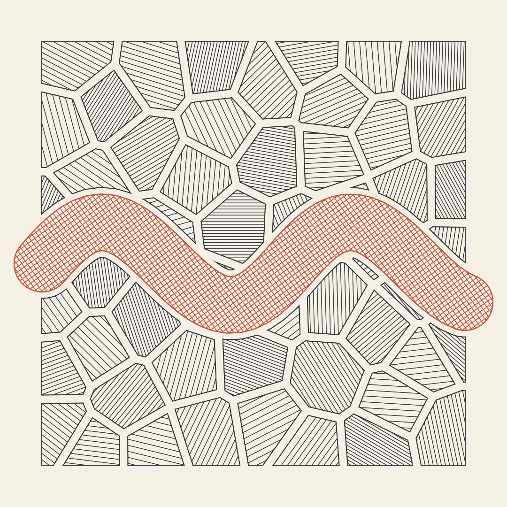

So far shapes have mostly been things you *draw*, appearing on the canvas and ending there. This chapter treats shapes as things you *have*, meaning geometry you can hold in a variable. Cut it with other geometry, grow it, shrink it, thicken it, and only then draw it. Or skip the screen entirely and hand it to a pen plotter. Everything in the plate above is line work a real pen could follow. By the end of the chapter you'll have exported it as exactly that.

## Shapes you can hold

This first stretch treats geometry as a value. It covers the types that hold an outline, a few ways to get one, and the verbs that edit whatever you're holding.

### Contours, shapes, and holes

Two types carry all the geometry in this chapter, and you've already brushed against both. A `Contour` is a run of points, open (a polyline with two ends) or closed (a loop). A `Shape` is one or more contours plus a rule for what counts as inside. Its everyday superpower is that a contour *nested inside another* becomes a hole. That is how an `o` or a donut is one shape, not two.

For shapes that curve, build them with the path closure, which collects moves, lines, and curves and hands back the finished geometry. Make `MySketches/Leaf.swift`:

```swift
import Ollin

final class Leaf: Sketch {
    override func draw() {
        background(Color(hex: 0x101318))

        noStroke()
        fill(Color(hex: 0x7FB069))
        drawShape { p in
            p.move(to: Vector2(540, 180))
            p.cubicCurve(to: Vector2(540, 900),
                         control1: Vector2(860, 380), control2: Vector2(700, 740))
            p.cubicCurve(to: Vector2(540, 180),
                         control1: Vector2(380, 740), control2: Vector2(220, 380))
            p.close()
        }

        noFill()
        stroke(Color(hex: 0x2F4A2C))
        strokeWeight(6)
        strokeCap(.round)
        drawCurve([Vector2(540, 210), Vector2(560, 420),
                   Vector2(530, 640), Vector2(540, 870)])
    }
}
```


A cubic curve bends from one point to the next, steered by two control points it leans toward but never touches. Two of them, mirrored, make the leaf. The vein uses the friendlier `drawCurve`, which threads a smooth curve *through* the points you give it, no control points to manage. One honest gotcha, learned the honest way. A fill needs a *closed* contour, and ending a path back where it started isn't enough. Forget `p.close()` and the leaf silently refuses to fill, leaving only the vein.

### Curves you can write down

The leaf was drawn by hand, one control point at a time. Some outlines don't need that, because somebody already found the formula, and the formula is shorter than the drawing. Nine of them come with Ollin, all deterministic and none of them touching randomness.

<picture>
  <source media="(prefers-color-scheme: dark)" srcset="Images/15-ShapesAsMaterial/ClassicCurves-dark.jpg">
  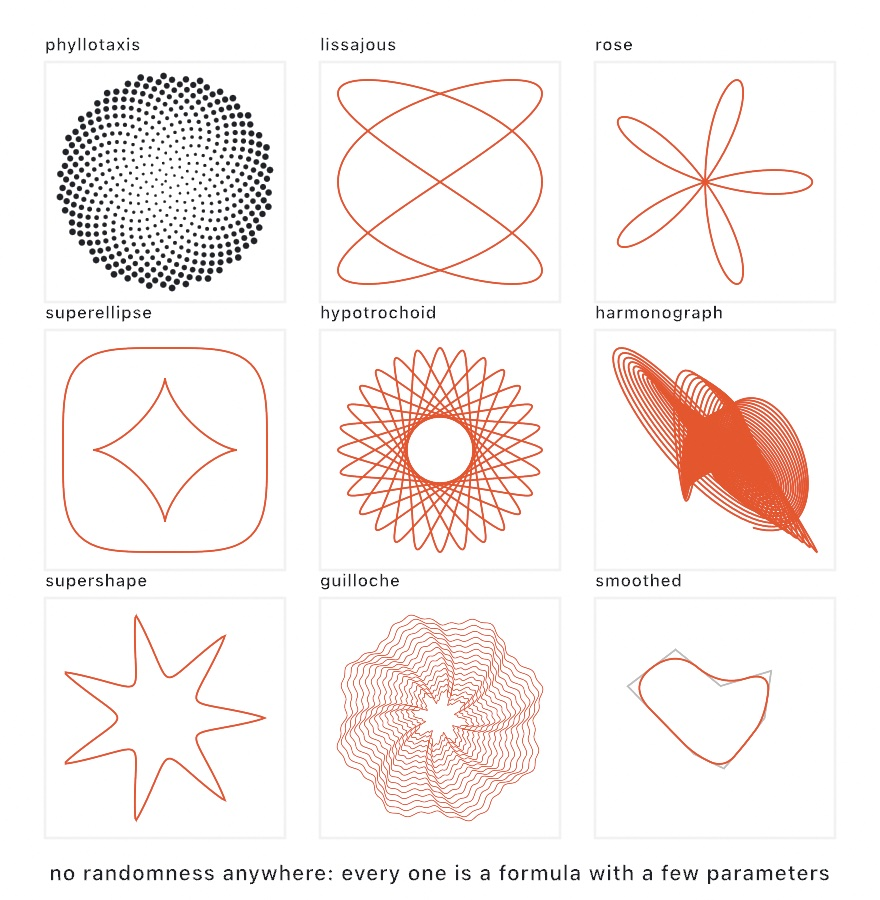
</picture>

```swift
phyllotaxis(count: 520, spacing: 7)                   // [Vector2]
lissajous(a: 3, b: 2, width: 200)                     // Contour
rose(n: 5, radius: 100)
hypotrochoid(ring: 84, wheel: 33, pen: 26)
superellipse(width: 200, n: 4)                        // the squircle
supershape(radius: 100, m: 7)
guilloche(rings: 36, innerRadius: 90, outerRadius: 320,
          bumps: 8, amplitude: 24)                    // [Contour], one per ring
```

**Phyllotaxis** is how a sunflower packs its seeds. Seed number `i` sits `i` golden angles around the center and `spacing * sqrt(i)` out from it. That one rule fills the disk evenly at any count. The golden angle, about 137.5 degrees, is doing all the work here. It's the fraction of a turn that never lines back up with itself, so no seed ever lands behind an earlier one. Nudge the angle by a hundredth of a degree and the whole thing collapses into spokes. That is worth trying once just to watch it happen.

**Lissajous figures** are what two sine waves make when one drives the horizontal and the other the vertical. A point swings side to side `a` times while it bobs up and down `b` times. The ratio between them is the whole character of the figure. **Roses** come from one polar equation, `r = radius * cos(k * theta)`. An odd `n` gives you `n` petals, and an even `n` gives you `2n`.

**Hypotrochoids and epitrochoids** are the toy gear set from childhood. A wheel rolls around a ring, inside for the first and outside for the second. A pen sits in a hole `pen` units from the wheel's center. Whole numbers for the gears are what guarantee the pen eventually returns to where it started. Ollin samples exactly the number of laps that closes the curve once, so nothing is drawn twice.

**Superellipses** put the whole family between diamond and rectangle on one exponent. `n: 2` is the ellipse, `n: 4` the squircle of app icons, `n: 1` the diamond, and lower values pinch into a four-point star. Animate `n` and a mark breathes between round and square; the `Shapes/Superellipse` example sweeps a whole wall of them. The **supershape** generalizes further. One formula with a lobe count `m` and three shaping numbers covers stars, flowers, gears, and organic blobs. It's the same formula behind the 3D `Mesh.supershape`. Keep `m` a whole number, since the curve only closes in one turn for integer `m`. The `Shapes/Supershape` example morphs one through its family.

**Guilloche** is the engraved ornament on watch faces and banknotes, and it too was a machine. A lathe's cams rocked the cutter while the piece turned: one wavy ring per pass, the piece nudged a hair between passes. `guilloche` returns those rings as a list of contours. The nudging is the `twist:` parameter, and it's what braids neighboring rings into the woven moiré. Stack a coarse `Rosette` and a fine one and the ripple rides the wave. The `Patterns/Guilloche` example lets the braid crawl.

**Harmonographs** were real Victorian machines: pendulums swinging under a pen, drawing while they slowly died away. Ollin's takes a list of pendulums per axis, each with its own amplitude, frequency, phase, and damping. Near-but-not-quite matching frequencies are where the good tangles come from.

The last panel isn't a curve at all. `smoothed(iterations:)` is Chaikin's corner cutting. It repeatedly replaces every corner with two points partway along its edges. Do it three or four times and a rough polygon becomes a soft curve. Open contours keep their exact endpoints, so a line still starts and ends where you put it.

One habit applies to all of them. These come back in their own coordinates, and the way to fit one to your canvas is `fitted(points, in: rect)`, which scales the *points*. Reaching for `scale()` instead would scale your stroke width along with the geometry, which is rarely what you want on a drawing made of lines.

### A walk that comes home

Not every figure worth drawing has a formula. Here is one with a rule instead, and the rule is short enough to say out loud. Step one length, turn a quarter turn, step two lengths, turn again, and keep going up to some number. Then start the whole run over.

```swift
let figure = spirolateral(order: 7, step: 26)
drawPolyline(fitted(figure.points, in: bounds.inset(by: 60)), closed: figure.closes)
```

<picture>
  <source media="(prefers-color-scheme: dark)" srcset="Images/15-ShapesAsMaterial/Spirolaterals-dark.jpg">
  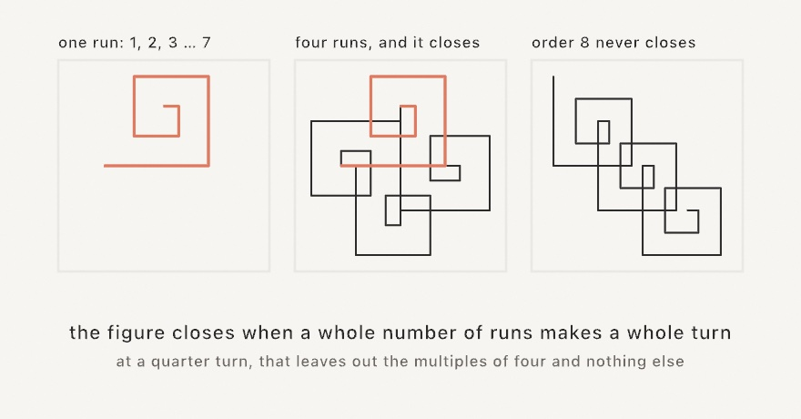
</picture>

That is a spirolateral, named by Frank Odds in 1973. The interesting part is that it sometimes comes home and sometimes doesn't, and you can tell which before you draw a single line.

Follow one run and you turn seven times, which leaves you facing a quarter turn from where you started. So the second run is the first one turned a quarter turn, and the third is turned a half. After four runs you have gone all the way around and closed the ring. That is the middle panel, with the first run left in orange inside it.

Now try an order of eight. Eight quarter turns is two full turns, so the run ends facing exactly the way it set off. Every repeat leaves in the same direction as the last, and the walk marches off the page forever. **At a quarter turn, the orders that never close are the multiples of four, and nothing else.** `closes` tells you, `closingRepeats` says how many runs it takes, and `center` is the point the figure turns about, which is nil when there isn't one.

One warning worth having before you animate it: the turn has to be an exact fraction of a full turn. Sweep it smoothly from a quarter to a third and nothing in between closes at all. Animate the order instead. Or hand `reversed:` a set of steps whose turns go the other way, which changes both the figure and the count.

### The curve a family of lines draws

Some curves are not drawn at all. They are what a moving line leans on.

<picture>
  <source media="(prefers-color-scheme: dark)" srcset="Images/15-ShapesAsMaterial/RaysLeanOnACurve-dark.jpg">
  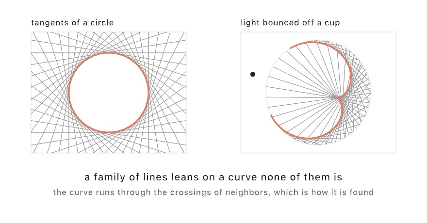
</picture>

```swift
for run in envelope(of: rays) { drawPolyline(run.points) }
```

Take the tangent lines of a circle, as on the left. No line is the circle, and every line touches it once. Ask where each line crosses the next and those crossings *are* the circle. That is an **envelope**, and the crossing-your-neighbor construction is the whole method.

The right-hand panel is the same idea wearing its most famous hat. Light crosses a cup, bounces off the far wall, and the bounced rays crowd along a bright curve. That curve is their envelope, and it is called a **caustic**. You have seen it in the bottom of a mug on a sunny morning.

```swift
let rays = reflectedRays(off: wall, from: .point(lamp))
drawCaustic(off: wall, from: .point(lamp))
```

Two answers are worth knowing, because they tell you whether your picture came out right. A circle lit from far away draws a **nephroid**, with two cusps, reaching from half the radius out to the mirror. A circle lit from a point on its own rim draws a **cardioid**, with one. A source at the dead center gives no curve at all, since every ray comes straight back.

One trap is worth naming, because it makes a picture look broken rather than wrong. **Hand in only the stretch of wall the light reaches.** A whole circle has two families of bounces, the near side and the far side, and they lean on different curves. Filtering a ring down to the lit part also has to keep it *unbroken*: if the lit stretch wraps around the end of your array, the two ends land next to each other and the lines between them are not rays at all.

`refractedRays` does the same job for light bending into glass instead of bouncing off it, and a ray that meets the surface too steeply is left out rather than faked, which is total internal reflection doing what it does.

The same idea with circles instead of lines is how a wave gets where it is going. Every point of a wavefront sends out a little wave of its own, and a moment later the front is the curve those wavelets lean on. That is Huygens' construction, from 1690, and `huygensFront(from:advancing:)` is it.

```swift
for step in stride(from: 30.0, through: 400, by: 30) {
    for run in huygensFront(from: shore, advancing: -step) { drawPolyline(run.points) }
}
```

It is not the same as moving every point sideways, and the difference is the whole point. Where the front curves back on itself the sideways move folds over, and the folded piece is *inside* its neighbors' wavelets rather than on the front. Those pieces are dropped, so the front tears and comes to a sharp point. That point is a focus, and it appears exactly when the front has travelled the radius the curve bends at. The `Patterns/Wavefront` example sends a wave off a headland and lets it happen.

### A corner a car could take

Chaikin rounds a corner, and for most drawings that is the end of it. But a rounded corner can be asked a second question, and it is the one a road engineer asks. Not "is the outline smooth" but "is the *turning* smooth".

They are not the same question. An arc is a perfectly smooth outline, and it is also a corner where the bend arrives out of nowhere. Along the straight you are not turning at all. One step later you are turning at `1 / radius`, and there was no room in between for anything else to happen.

<picture>
  <source media="(prefers-color-scheme: dark)" srcset="Images/15-ShapesAsMaterial/ClothoidCorner-dark.jpg">
  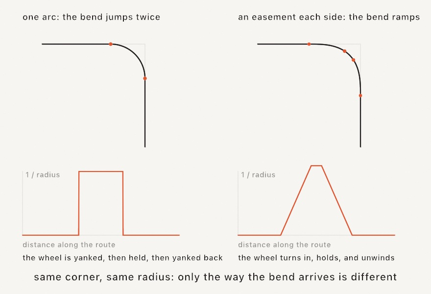
</picture>

Ollin has the curve that answers it. A **clothoid** is written as a turn rate rather than as a position. Face a direction, and turn a little more sharply with every step you take. Its bend is then a straight line in the distance traveled, which is exactly the ramp the left-hand graph is missing.

```swift
let route = clothoidCorners(waypoints, radius: 90, easement: 70)
drawPolyline(route.contour().points)
```

Every corner becomes three pieces: a clothoid bending in, an arc, and a clothoid bending back out. `easement` is how much travel the bend is given to arrive over. Set it to zero and you have the plain arc back, which is what the left panel is.

This is how roads, railways, and roller coasters are laid out. It is part of why a motorway curve feels different from a curve drawn with a compass. It matters again to anything that physically follows your drawing. A pen plotter, a laser, or a cutting head has to slow down for a direction that changes all at once. An eased corner gives it nothing to slow down for.

Two more things fall out of the same curve. `clothoidSpline(through:)` fits one clothoid to each gap in a list of points, so the path goes through every point and never kinks at one. And a whole chain of them reads as a single path measured by length, which is what makes it drivable:

```swift
let along = (time * 260).truncatingRemainder(dividingBy: route.length)
let here = route.point(at: along)         // where you are
let facing = route.heading(at: along)     // which way you face
let bend = route.curvature(at: along)     // where the wheel is
```

Steady time in, steady ground covered. Read `curvature(at:)` while you drive and you are holding the steering wheel. That is the whole idea again, from the driver's seat rather than the graph's.

Drawn whole, the curve is the Cornu spiral: two arms winding into two eyes they never reach, because the bend keeps on growing. `eulerSpiral(size: 700, turns: 2.5)` returns it as points.

### Circles all the way down

Here is a fact that sounds false. Any closed outline at all, however irregular, is exactly a sum of circles. Each spins at a whole-number rate, riding on the tip of the one before it. That's Fourier's idea, and Ollin will do the decomposition for you.

<picture>
  <source media="(prefers-color-scheme: dark)" srcset="Images/15-ShapesAsMaterial/EpicycleTerms-dark.jpg">
  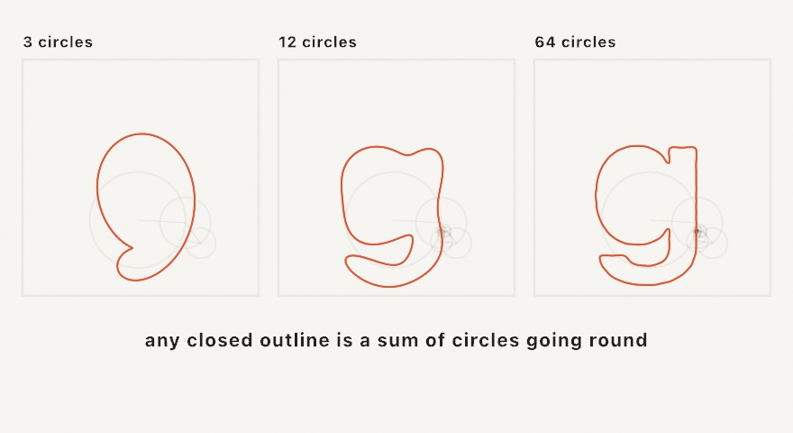
</picture>

```swift
let chain = Epicycles(outline, samples: 512)
drawPolygon(chain.path(samples: 600, terms: 64).points)   // the reconstruction
drawEpicycles(chain, at: phase, terms: 64)                // the construction itself
```

`terms` is the dial, and it takes the largest circles first. That ordering is what makes the figure above work. Three circles already give you the outline's gross shape, because the big circles were always doing most of the work. The rest are adding detail. At the full term count the reconstruction is exact, not approximate.

Two ways to use it. `path(samples:terms:)` hands you the whole traced outline as geometry. A deliberately under-termed version of a shape is then a way to *simplify* it that keeps it smooth. The call `point(at:terms:)` gives one position, which is what you animate. `drawEpicycles` draws the whole nest of circles and spokes at a moment, so the machine is visible. The `Motion/Epicycles` example traces a whale that way, with the pen leaving a fading trail.

### One shape becoming another

Two shapes and a number between them gives you every shape in between.

<picture>
  <source media="(prefers-color-scheme: dark)" srcset="Images/15-ShapesAsMaterial/MorphSteps-dark.jpg">
  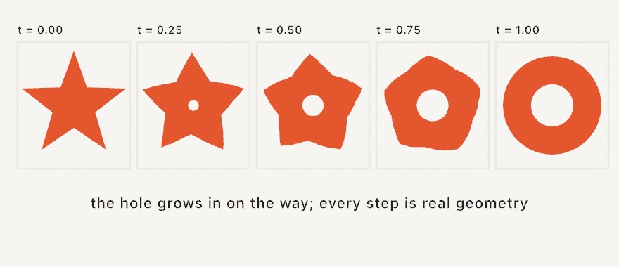
</picture>

```swift
var morph: ShapeMorph?

override func setup() {
    morph = ShapeMorph(from: star, to: ring)
}

override func draw() {
    if let morph { drawShape(morph.shape(at: pingPong(over: 4))) }
}
```

Build it once and keep it. Working out which part of the first shape corresponds to which part of the second is the expensive step. Doing it in `setup()` makes every frame afterward cheap. At `0` and `1` you get your original shapes back exactly, not a re-derived approximation of them.

The holes are the part worth watching. When the two shapes don't have the same number of contours, the unmatched ones grow out of their own center, or shrink into it. That is why the ring's hole opens from nothing in the middle, instead of flying in from off-screen. Timing lives outside the morph, so pass it an eased phase, a `pingPong` for there-and-back, or a `Timeline`'s progress. For a one-off blend with no state to keep, `star.morphed(toward: ring, 0.5)` gives you the single shape.

### A drawing only a mirror can read

Every transform so far has kept the drawing readable. This one throws that away on purpose.

Wrap a picture around a mirrored cylinder standing on your page. Then work out where each point of it must be *drawn* for the reflection to put it back where you wrapped it. What lands on the page says nothing. Stand the cylinder on the circle and put your eye in the one place the map was told about. The smear gathers itself into the picture, upright on the glass.

<picture>
  <source media="(prefers-color-scheme: dark)" srcset="Images/15-ShapesAsMaterial/MirrorReads-dark.jpg">
  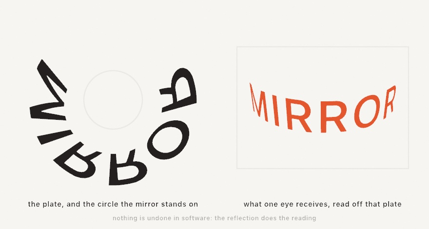
</picture>

Painters were doing this in the 1600s, ruling the construction out by hand. Nothing is undone in software here either. The plate is a real drawing, and the reflection does the reading.

```swift
let mirror = Anamorphosis(
    center: Vector2(540, 480), radius: 130,      // where the cylinder stands
    eye: Vector3(540, 910, 250),                 // and where you will be
    picture: Rectangle(center: Vector2(540, 480), width: 280, height: 70),
    lift: 40
)
let plate = mirror.plate(of: emblem)             // an ordinary Shape in, an ordinary Shape out
drawShape(plate)
drawCircle(mirror.footprint)                     // the circle to stand it on
```

`eye` is a `Vector3` because the height matters as much as the distance. The rule behind every mark is one ray run backwards: from the eye to the glass, bounce, and follow the bounce down to the page.

Two things follow from that, and you can read both off the picture. The marks land on the near side, between the glass and you, so you read the plate by looking *over* it at the mirror. And they spread as they go out. A point higher up the picture is reached by a shallower bounce, and a shallower bounce travels farther before it meets the page.

There is a limit worth knowing before you compose rather than after. Two tangent lines run from your eye to the cylinder, and everything past them is turned away. So the picture has an arc it must live inside. `mirror.widestPicture` is that arc in your own units and `mirror.fits` is the yes or no. Standing closer takes some of it away. That is the trade the whole piece is made of: the nearer the viewer, the less of the mirror they can use.

`plate(of:)` takes a point, a `Contour`, or a `Shape`. The map bends straight lines, so a contour is walked at an even spacing first and the bend is carried by the extra points. What comes back is ordinary geometry, so a plate prints. A real mirrored tube standing on a real printed circle is the whole apparatus.

### Shape arithmetic

Held shapes can be combined like quantities. Four operations do it all:

<picture>
  <source media="(prefers-color-scheme: dark)" srcset="Images/15-ShapesAsMaterial/BooleanOps-dark.jpg">
  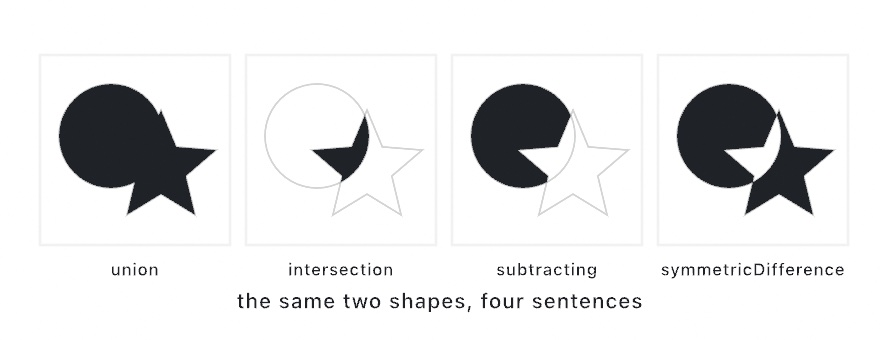
</picture>

```swift
let badge = circle.union(star)            // either
let bite = circle.intersection(star)      // both
let cut = circle.subtracting(star)        // this one, minus that one
let rind = circle.symmetricDifference(star)   // either, but not both
```

These are the **shape booleans**, and they turn drawing into sentence-building. A window is a wall subtracting a rectangle, and a crescent is a circle subtracting a shifted circle. The plate at the top is a mosaic subtracting a ribbon. Holes come along correctly, results are ordinary `Shape`s, and you can chain as deep as the sentence needs. When a boolean's result looks unexpectedly *solid* or *hollow*, the shape's winding rule is usually the reason. The [geometry reference](../Docs/Drawing/Geometry.md#shape-booleans) covers the two rules, and when each reads more naturally.

### Growing, shrinking, and thickening

Three more verbs finish the shape-editing vocabulary. `offset(by:)` grows a region outward on a positive number and shrinks it inward on a negative one, with holes moving the opposite way. Shrinking a region repeatedly reads as topographic contour lines, until it pinches apart and disappears. The `Patterns/Topography` example is exactly that loop. New in the toolbox, `stroked(width:)` turns a *line* into a *region*. It gives the closed shape a pen stroke of that width would cover, round or square or butt ends included. A closed contour comes back as a band:

```swift
let ribbon = Contour(wave, closed: false).stroked(width: 120, join: .round, cap: .round)
```

That one call is the hinge of this chapter's finished piece. Once a stroke is a region, everything above applies to it. You can subtract it from a mosaic, inset rings inside it, or hatch it. You can also export it as a filled outline, instead of a fragile stroke attribute. The `Shapes/InkRibbon` example strokes a drifting brush line and rings contour bands inside it, live.

## Marks and brushes

The next three tools shape the stroke itself, and each answers a different question. A profile shapes a finished path's width, dynamics respond to the hand mid-gesture, and a brush decides what tip lays the ink down.

### A mark, not a line: strokeProfile

Every stroke so far has been one width from end to end. That is the honest look of a machine drawing a line. It is the wrong look for a hand making a mark. `strokeProfile` gives the width a shape of its own along the path.

The profile is a multiplier, not a width. `strokeWeight` still says how fat the mark gets. The profile says what fraction of that it uses at each point:

```swift
strokeWeight(17)
strokeProfile(.taper())
drawPolyline(curve)
```

`.taper()` is a brush pressed down and lifted: nothing at either end, full width in the middle. Its two arguments are the widths *at* the ends, so `.taper(start: 1)` starts blunt and lifts off at the finish. A straight wedge is `.ramp(from:to:)`, and `.values([...])` takes a width curve you write out yourself. `.nib(angle:)` is the odd one, because it ignores where you are along the path entirely. It holds a flat calligraphy pen at a fixed angle. The mark is fattest where the path runs across the nib, and a hairline where it runs along it. That is why the third panel below is an S-curve: a straight line would only ever show one nib width.

<picture>
  <source media="(prefers-color-scheme: dark)" srcset="Images/15-ShapesAsMaterial/MarkWidth-dark.jpg">
  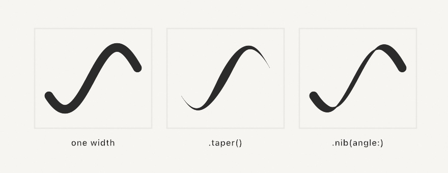
</picture>

Two practical notes. The width is read at every point of the path, measured along the path's length. A shape with four points changes width in four steps. Sample your curves densely enough to give the profile somewhere to go. And the analytic shapes (`drawCircle`, `drawRect`, and the rest of that family) carry a single width by construction, so a profile does nothing to them. Profiles are for paths.

The mark survives the trip out, too. Run the sketch with `--export-svg` and a profiled stroke is written as the region it actually covers, rather than a line with one width attribute. What the plotter draws is what you saw.

### Painting as it happens: stroke dynamics

A profile asks one question at every point: where am I along this path? That works because the path is finished before you draw it. Now think about painting. You drag the mouse, and the stroke has to appear *as it grows*. There is no finished path, so there is no fraction, and the whole idea falls apart.

What is available instead is everything the hand just did: how fast it was moving, how hard it was pressing, which way it was heading. That is what **stroke dynamics** reads.

```swift
var mark = StrokeMark(.speed(fast: 0.15))

override func draw() {
    background(.white)
    if mouseIsPressed { record(into: &mark) }
    stroke(.black)
    strokeWeight(24)
    drawMark(mark)
}
```

Ten lines, and you can paint. `record(into:)` hands the mark where the pointer is and how long this frame took. The mark works out the speed, smooths it, and stores a width for that point. `drawMark` strokes what has been recorded so far, which is why the line appears under the cursor instead of when you let go.

<picture>
  <source media="(prefers-color-scheme: dark)" srcset="Images/15-ShapesAsMaterial/MarkDynamics-dark.jpg">
  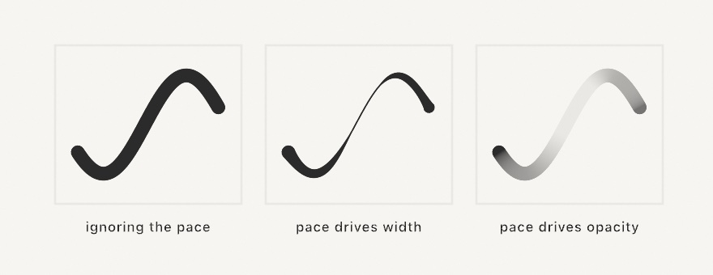
</picture>

The figure is one curve walked three times by the same pretend hand, nearly still at the ends and flicking through the middle. Only what the pace is allowed to *drive* changes.

Which is the thing worth remembering here: **width and opacity are separate axes, and you say so.**

```swift
StrokeDynamics(width: .pressure(light: 0.1),      // press for a fat mark
               opacity: .speed(fast: 0.4))        // hurry for a faint one
```

An axis you don't name isn't driven, so nothing moves behind your back. `.speed(fast:)` and `.pressure(light:)` on their own are shorthands for the everyday brush. They drive width only.

`.pressure` needs a device that can feel it. Every MacBook trackpad since 2015 can, and so can a pen tablet. A plain mouse cannot, and reports full force the whole time. So a pressure brush on a mouse comes out at a single weight, rather than not drawing. `pressureIsAvailable` tells you which you have. Ask it in `mousePressed()` rather than `setup()`, because the answer arrives with the first press:

```swift
override func mousePressed() {
    mark = StrokeMark(pressureIsAvailable ? .pressure(light: 0.1) : .speed(fast: 0.15))
}
```

Three practical notes. A mark is an ordinary value, so finishing one is `strokes.append(mark)` and `mark.clear()`. The `smoothing` parameter matters more than it looks. Raw frame-to-frame speed is far too jumpy to drive a width directly. The default sits where a mark feels deliberate without lagging the pointer. And profiles compose with dynamics rather than competing, so `strokeProfile(.taper(start: 1))` still gives a dynamic mark a clean lift-off at the end.

`Examples/Shapes/Brushwork` is the whole thing to drag around in, and [Marks](../Docs/Drawing/Marks.md) has the rest.

### Stamps along the path: brushes

Both tools so far shape one continuous ribbon. A real brush is not continuous. It is a tip pressed down over and over, close enough that the prints run together. `strokeBrush` works that way too.

```swift
strokeWeight(20)
strokeBrush(.spray())
drawPolyline(points)
```

It is drawing state, like `strokeCap` or a profile, and `noStrokeBrush()` puts the ribbon back. It applies to everything that strokes a path, `drawMark` included.

<picture>
  <source media="(prefers-color-scheme: dark)" srcset="Images/15-ShapesAsMaterial/BrushStamps-dark.jpg">
  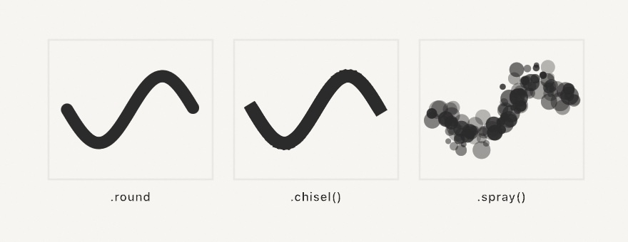
</picture>

The first panel is the thing worth noticing. Those are separate circles, spaced a fifth of their own width apart, and they read as one solid stroke. Spacing is the parameter that decides whether a brush is a mark or a scatter. It is measured in *stamp sizes* rather than pixels, so a brush keeps its texture when you change `strokeWeight`. Twice the weight is the same mark, twice as big.

The rest of the parameters are what you would guess. `sizeJitter` and `opacityJitter` vary each print, and `angle` faces it down the path, at a fixed angle, or anywhere. `scatter` throws it off the line, and `count` lays down several at each step. Every one of them is a fraction of the stamp's size. Everything random comes from a `seed`, so a mark stays exactly where it was frame after frame.

The tip does not have to be a circle. `.square` turns with the path, and `.shape` and `.image` take anything you can draw or load. A trail of leaves is a shape tip with a little angle jitter.

Brushes multiply with the two previous tools rather than replacing them. A profile still sizes the stamps along the path, so a spray that fades out at both ends is one more line:

```swift
strokeBrush(.spray())
strokeProfile(.taper())
```

And each stamp is a real shape rather than a stretch of ribbon. So `--export-svg` writes every one of them as a circle or a polygon a plotter can follow. `Examples/Shapes/Brushes` has the family side by side.

## Scatters and territories

Here the material turns from single outlines to populations. Points that spread themselves evenly come first, because nearly everything after them wants a well-mannered scatter to work on.

### The well-mannered scatter

[Chapter 13](13-GrowingThings.md) and [Chapter 14](14-FieldsAndFlow.md) borrowed `poissonDisk` with a promise to explain it here. Here is the problem it solves. Plain `random` placement clumps and leaves bare patches, because independent rolls have no manners about each other ([Chapter 4](04-Randomness.md) warned you). Blue noise is the fix, and the recipe, Robert Bridson's, is charmingly physical. Throw a dart, then keep throwing darts *near existing ones*, keeping only throws that land at least `radius` from everybody placed so far. When a dart can't find room after thirty tries, its neighborhood is full. The result is even but never gridded:

<picture>
  <source media="(prefers-color-scheme: dark)" srcset="Images/15-ShapesAsMaterial/ScatterCompare-dark.jpg">
  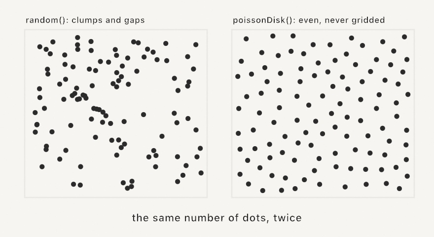
</picture>

```swift
let scatter = poissonDisk(radius: 26)             // over the whole canvas
let some = poissonDisk(in: region, radius: 26)    // or a region
```

One number, `radius`, sets the density. Nearly every technique in this chapter eats these points, which is why the scatter came first.

There's a second kind of even, and it earns its place by being *incremental*.

```swift
let points = haltonPoints(count: 500)
let finer = sobolPoints(count: 5000, in: frame)
```

<picture>
  <source media="(prefers-color-scheme: dark)" srcset="Images/15-ShapesAsMaterial/HaltonGrowth-dark.jpg">
  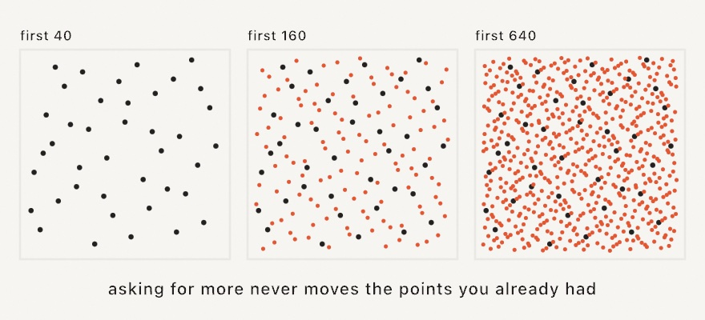
</picture>

These are **low-discrepancy sequences**, and they are not random at all. Each one is a fixed list of positions, computed from an index, so point number 57 is always in the same place. That sounds like a limitation until you see what it buys, which the figure shows. Asking for more points never moves the ones you already had. Every new point simply lands in the largest gap left so far.

Blue noise can't do that. Adding a dart to a Poisson-disk scatter means running the whole process again and getting a different arrangement. So this is the tool when you want to keep adding detail to something already on screen. It also suits rendering progressively, or sampling a picture more finely without starting over. It also never touches your sketch's `random`, being pure arithmetic on the index, so mixing it into a seeded piece changes nothing else.

`halton(i, base:)` is the one-dimensional version, and it pays off well away from scatters. Space hues around a wheel, offset animation phases, or choose sample times. It suits anywhere you want values that spread out evenly, no matter how many you end up taking.

### Territories and neighbors

A scatter of points hides two structures, and they're each other turned inside out:

<picture>
  <source media="(prefers-color-scheme: dark)" srcset="Images/15-ShapesAsMaterial/Duals-dark.jpg">
  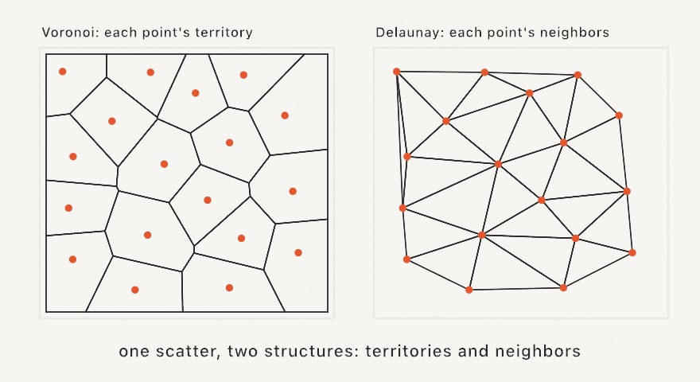
</picture>

The **Voronoi diagram** gives each point its territory, the region of the canvas closer to it than to any other point. The **Delaunay triangulation** joins each point to its natural neighbors. Ollin builds both from any point list:

```swift
let mosaic = voronoi(sites, in: bounds)     // mosaic.cells is one Shape per site
let mesh = delaunay(sites)                  // mesh.triangles, each a real Triangle
```

Every Voronoi cell is a `Shape`, so the whole chapter applies per cell. You can inset them for grout lines, subtract things from them, or hatch them, and the plate does all three. One companion helper is worth naming. `lloyd(sites, in: bounds)` nudges every site to its cell's center and re-tessellates. Each pass makes the mosaic calmer and more even, like a pan of bubbles settling.

There is one question a Voronoi diagram answers badly, and it comes up as soon as the things being divided have sizes. A boundary halfway between two centers is fair between two points. Between a large circle and a small one it is not: it falls inside the large one.

<picture>
  <source media="(prefers-color-scheme: dark)" srcset="Images/15-ShapesAsMaterial/WeightedTerritories-dark.jpg">
  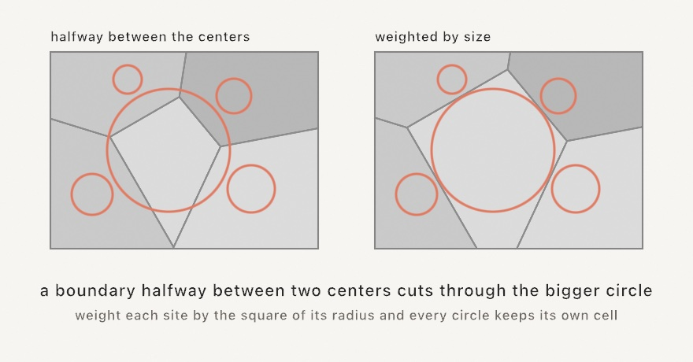
</picture>

```swift
let cells = powerDiagram(of: circles).cells   // one per circle, some possibly empty
```

A **power diagram** gives every site a weight and subtracts it from the squared distance. Weight each circle by the square of its radius, as `powerDiagram(of:)` does, and the boundaries land where the two circles would meet if they grew. Every circle that touches no other then sits inside its own cell.

The cells are still convex and they still tile the region exactly, so everything you do to a Voronoi cell you can do to these. One thing is new: a site can lose. A small circle inside a large one gets no cell at all, and its entry in `cells` is an empty `Shape` that draws nothing.

### Packing

Packing goes the other way around. Instead of carving space between points, you grow shapes until they claim it. The classic form scatters candidate seeds and grows each circle until it touches whatever arrived first:

<picture>
  <source media="(prefers-color-scheme: dark)" srcset="Images/15-ShapesAsMaterial/PackingLapse-dark.jpg">
  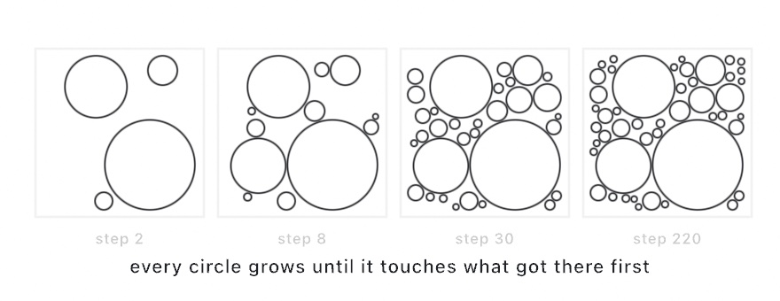
</picture>

```swift
let circles = packCircles(count: 300, minRadius: 4, maxRadius: 120)
```

The big-first, small-fill rhythm is the signature of the technique, and the finished foam feeds anything that eats circles or shapes.

### Packing shapes, not circles

Circles are the easy case. Two circles touch when the distance between their centers equals the sum of their radii, and that's one line of arithmetic. Real shapes are harder and much more interesting, because a star is mostly *not* there. It is five points and a lot of empty air between them. `packShapes` takes a bag of shapes and grows each one against its neighbors' **actual outlines**:

```swift
let bag = [triangle, square, hexagon, star]
let packed = packShapes(bag, count: 160, minRadius: 7, maxRadius: 62, padding: 2)
```

<picture>
  <source media="(prefers-color-scheme: dark)" srcset="Images/15-ShapesAsMaterial/ShapePacking-dark.jpg">
  
</picture>

Both panels are the same packing. The left one also draws each shape's bounding circle, and the giveaway is that **those circles overlap**, which a circle packing could never allow. That overlap is the whole feature. The fit was measured to the outlines. A small star can settle into a big star's notch, or lie along a triangle's edge. It uses space a circle would have reserved and wasted.

The parameters beyond `count` and the radius range are worth knowing, because they change the character rather than just the density. `padding` opens a consistent gap between shapes, which helps when they'll be cut or plotted. `rotation` is the range each placement is randomly turned within. So `0 ... 0` keeps everything upright and gives a much stiffer, more typographic result. And `scale` is how much of its own bounding circle a shape fills. Anything under `1` shrinks every placement a little and loosens the whole field.

The output is `[Shape]`, so it flows straight into everything earlier in this chapter. Fill it, stroke it, boolean it, hatch it, or export it as SVG. Compute the packing once and hold it, then animate something visual like each shape's color, or the shapes will jump every frame.

`ContinuousPacking` is the same engine held open instead of run to completion. You `step()` it each frame and the region fills in as you watch. The big gaps go first, so each new shape is smaller than the last. Paired with `noClear()` from [Chapter 16](16-LayersAndEffects.md) it costs almost nothing per frame, because a placed shape never moves and only the new ones need drawing. That's what the `Patterns/ShapePacking` example does, densifying forever.

## Outlines and bones

A scatter or a shape carries structure you can read back out. Hulls wrap a point set from the outside, and the two skeletons describe a shape from the inside.

### What shape are these points?

A scatter usually has an outline you need for something. It may be the footprint of a drifting herd, or the ground a blue-noise scatter covers. It may be an outline to offset, hatch, or clip against. Three tools answer that question, and they differ in what each one is allowed to do.

`convexHull(of:)` returns the smallest convex polygon containing every point, the shape a rubber band would snap to around a handful of pins. It is quick and it always comes back as one simple loop. It also can never dip inward, which is the limit as much as the strength. A ring of points comes back as a filled blob. A rubber band has no way to reach into the middle.

`concaveHull(of:concavity:)` lets the band sink into the gulfs between clusters while staying one simple polygon with every point inside it. The `concavity` parameter runs `0...1`, where 0 gives you exactly the convex hull and 1 hugs the points as tightly as their spacing allows. Around 0.5 to 0.8 it reads as following the scatter. Pushed near 1 it erodes every bridge it can, and starts to look like a maze.

`alphaShape(of:alpha:)` asks a different question, and it's the one that can say "these are two things". Picture rolling a disk of radius `alpha` over the points and keeping only the parts the disk can't get into. Nothing requires the answer to be a single piece. A clustered scatter can come back as several islands, and a ring comes back as a ring.

<picture>
  <source media="(prefers-color-scheme: dark)" srcset="Images/15-ShapesAsMaterial/HullTrio-dark.jpg">
  
</picture>

```swift
let band = convexHull(of: scatter)                        // [Vector2]
let snug = concaveHull(of: scatter, concavity: 0.65)      // [Vector2]
let islands = alphaShape(of: scatter, alpha: 40)          // [Shape]
```

The two hulls hand back boundary points in order, so wrap them in a `Contour` or pass them straight to `drawPolygon`. The alpha shape hands back finished `Shape`s, holes included, ready for `drawShape` and for everything earlier in this chapter.

Choosing between them comes down to what you'll do next. When the result has to be one simple polygon, because it's a plotter path or a region you'll offset, use a hull. When you want the honest footprint of a scatter that really is clumpy, use the alpha shape.

The one number that needs care is `alpha`, which is a radius in the same units as your points. It wants to sit a bit above the typical gap between neighbors, and set much below that the shape crumbles into dust. All three are deterministic, so the same points and the same parameter give the same outline every run. The `Shapes/Hulls` example breathes `concavity` from 0 to tight so you can watch the band sink into the gulf.

### The skeleton inside: the medial axis

Hulls describe a region from the outside. The **medial axis** describes it from the inside by finding its middle. Take every disk that fits within the shape while touching the boundary in two or more places. The centers of those disks trace a skeleton. A blob collapses to the veins running down its lobes, and a letterform collapses to the stroke a pen would have made to write it.

<picture>
  <source media="(prefers-color-scheme: dark)" srcset="Images/15-ShapesAsMaterial/Skeleton-dark.jpg">
  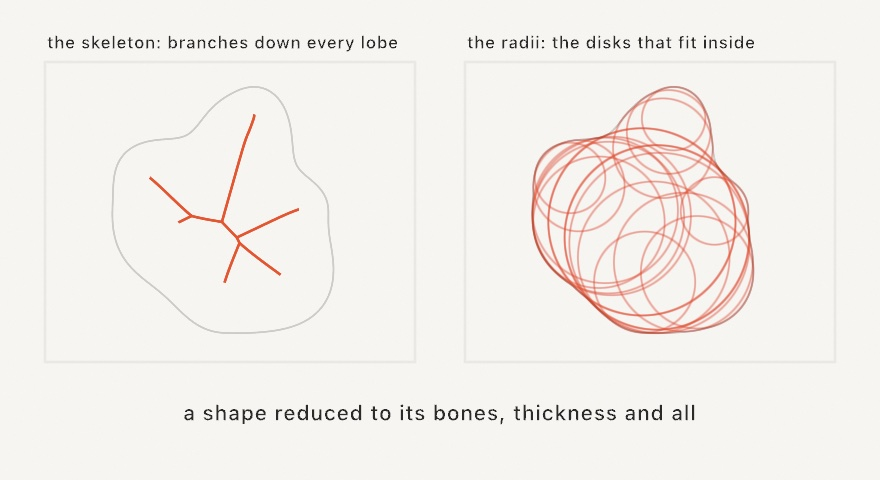
</picture>

```swift
let skeleton = medialAxis(of: blob, spacing: 3, prune: 8)
noFill()
for branch in skeleton.branches {
    drawPolyline(branch.points, closed: branch.isClosed)
}
```

Two parameters shape the result. `spacing` is how finely the boundary gets sampled, so smaller means a more faithful skeleton and more work. Halving it roughly quadruples the cost. `prune` trims whiskers, removing terminal twigs shorter than the value you give. You want some pruning almost always, because every convex corner of the outline honestly grows a twig. A couple of spacings clears the fuzz while keeping the trunk. Branches come back as polylines, open runs between forks, or closed rings around holes, which is why `drawPolyline` takes `branch.isClosed`.

What makes this more than a line drawing is that the skeleton remembers thickness. Each branch carries `radii` alongside `points`, one radius per vertex, holding the size of the disk that fits there. So the skeleton knows how fat the shape is at every step along itself. Walk a branch drawing a circle from each pair and you rebuild the region as a train of disks. Size marks by the radius and a drawing swells through the thick parts, then thins into the tips. The largest radius anywhere marks the deepest point of the shape, the spot furthest from any edge.

Skeletons are setup work rather than per-frame work, so extract once and hold the result. Glyph shapes from [Chapter 8](08-Words.md)'s `textToShapes` skeletonize as they are, counters and all. That is what the `Shapes/MedialAxis` example does, to spell a word in bones.

### The straight skeleton

There is a second skeleton, built from a different thought experiment. Shrink the boundary inward at a steady pace, every edge sliding parallel to itself, and watch the corners. Each one travels in a straight line, edges shorten and vanish, and narrow places pinch shut. The paths the corners trace are the **straight skeleton**. Where the medial axis curves around a reflex corner, this one is made entirely of straight segments. Where the medial axis is approximated from a boundary sampling, this one is exact.

<picture>
  <source media="(prefers-color-scheme: dark)" srcset="Images/15-ShapesAsMaterial/InsetLadder-dark.jpg">
  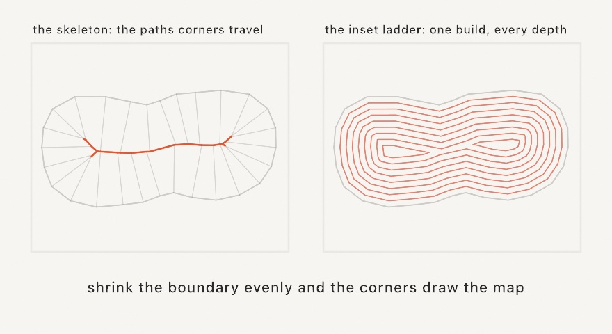
</picture>

```swift
let skeleton = straightSkeleton(of: island)
for arc in skeleton.arcs {
    drawLine(arc.start, arc.end)
}
```

Arcs whose `startDistance` is 0 rise off the boundary, one per corner. The rest are interior ridges, the creases where shrinking fronts met. Every arc endpoint carries the shrink distance at which the boundary arrived there. `skeleton.maxInset` is the depth where the last of the shape disappears.

The reason to reach for this skeleton is what that distance buys you. The shrinking boundary at depth `d` is your shape inset by `d`, corners still sharp. `inset(by:)` cuts it straight out of the finished skeleton:

```swift
noFill()
for d in stride(from: 8.0, to: skeleton.maxInset, by: 8) {
    drawShape(skeleton.inset(by: d))
}
```

That loop is a topographic contour map of any polygon, which is a classic way to fill a region on a pen plotter. The rings split on their own where the shape pinches, ring a hole as the region around it thins, and run out at `maxInset`. You met `offset(by:)` earlier in this chapter doing something similar, and the difference is worth knowing. `offset` is the general tool, outward as happily as inward, with a choice of corner joins, and it does fresh work per ring. The skeleton's inset is inward only and exact, every corner keeping its true miter. A ladder of twelve rings costs one build, and each ring after it is nearly free. The skeleton also hands you `faces`, one flat panel per boundary edge with depths attached, so a shape can be shaded like folded paper.

One habit carries over from the medial axis. Every boundary corner grows an arc, so a traced or resampled outline grows one arc per sample point. That is the honest answer, but for clean line work, simplify the outline first. The `Shapes/StraightSkeleton` example grows an island with a lake, and lets the contour ladder drift inward forever. Every ring is a mitered inset read off one skeleton.

## Ink and paint

Two wet media come next, and neither involves a drop of simulated fluid. Both are the chapter's dry geometry, bent and stacked until it reads as paint.

### Ink on water

Paper marbling has a few hundred years of craft behind it and a simple physical setup. Ink floats on a bath of thickened water. Because it floats instead of mixing, anything done to the surface moves the ink around without blending it. You drop fresh ink in, and you rake the surface with a stylus or a comb. Then you lay a sheet of paper on top to lift the pattern off.

`Marbling` reproduces that in closed form, which means every move is an exact transform applied to outlines rather than a simulation of fluid. Ink regions are ordinary vector shapes, and each operation bends them. Because the outlines only ever deform, ink never tears and never mixes, exactly as on a real bath.

<picture>
  <source media="(prefers-color-scheme: dark)" srcset="Images/15-ShapesAsMaterial/MarblingSteps-dark.jpg">
  
</picture>

Nearly every classic pattern starts from the bull's-eye in the first panel. A bull's-eye is just concentric drops of alternating color.

```swift
var bath = Marbling()
for i in 0 ..< 20 {
    bath.drop(at: center, radius: 200 - Double(i) * 9,
              color: i.isMultiple(of: 2) ? navy : cream)
}
```

A drop pushes every floating point straight away from its own center, sending a point at distance `d` out to `sqrt(d * d + r * r)`. That particular rule keeps the area around the drop unchanged. It is why earlier rings thin into crescents rather than getting wiped out. Since paper-colored ink displaces just like any other, dropping the color of your background carves negative space.

Then you rake the bath. Four tools do it, and all of them share one rule for how the pull fades with distance. A point `d` away from the tool moves by `strength · 2^(−d / falloff)`, always parallel to the direction the tool traveled. So `strength` is how far the tool itself drags, and `falloff` is the distance at which the pull halves.

```swift
bath.tine(through: center, direction: .unitY, strength: 120, falloff: 48)
bath.comb(through: edge, direction: .unitY, spacing: 110, strength: 260, falloff: 30)
bath.tine(around: center, radius: 200, strength: 300, falloff: 48)
bath.swirl(at: center, strength: 400, falloff: 96)
```

`tine` pulls one stylus along a line, and that is the stroke that drags a bull's-eye into a heart. `comb` pulls a whole row of teeth spaced `spacing` apart. It feathers rows of drops into the pattern marblers call nonpareil. Keep a comb's `falloff` well under its tooth spacing, or the teeth blur together into one broad shear. The circular `tine` drags the stylus around a ring. `swirl` stirs a vortex that spins hardest at its middle, which is the tight curl at the heart of French-curl papers.

Stirring a vortex at the exact center of a bull's-eye does nothing whatsoever. That is worth knowing before you spend an evening wondering why the swirl has no effect. Spinning a set of concentric circles about their shared center maps every circle onto itself. The fourth panel above is stirred slightly off-center, which is what a real hand would have done anyway.

`bath.add(shape, color:)` floats an outline you already have, so text outlines can go into the bath and get combed with their counters intact. Nothing in here is random either, so the same operations always produce the same sheet. Randomize the drop positions with the sketch's seeded `random` and the whole paper still comes back from its seed.

```swift
noStroke()
drawMarbling(bath)      // fills every ink in its own color, oldest first
```

Later drops sit above earlier ones and drawing runs oldest first, so the stack reads exactly as it was poured. Every ink is a plain `Shape`, which means a marbled sheet leaves through `--export-svg` as real paths like everything else in this chapter.

### Pigment from a polygon

Watercolor is the least geometric-looking thing in this chapter, and that is exactly why it belongs here. A pool of paint on wet paper has a dense middle and an edge that wanders, blooming in some places and staying crisp in others. Ollin gets that look from nothing but polygon deformation and translucency.

Start with one irregular polygon. Split every edge at its midpoint, jump that midpoint a small random distance, and repeat. Each edge carries its own variance and passes a decayed share of it to the two edges it splits into. Some stretches of outline bloom, while others stay nearly straight. That inheritance is what keeps the result from looking like a uniformly fuzzy circle. Paint one such outline at about four percent opacity and almost nothing shows. Stack forty independently deformed copies and the middle saturates while the fringe stays uneven, which is what the eye reads as pigment.

<picture>
  <source media="(prefers-color-scheme: dark)" srcset="Images/15-ShapesAsMaterial/WatercolorLayers-dark.jpg">
  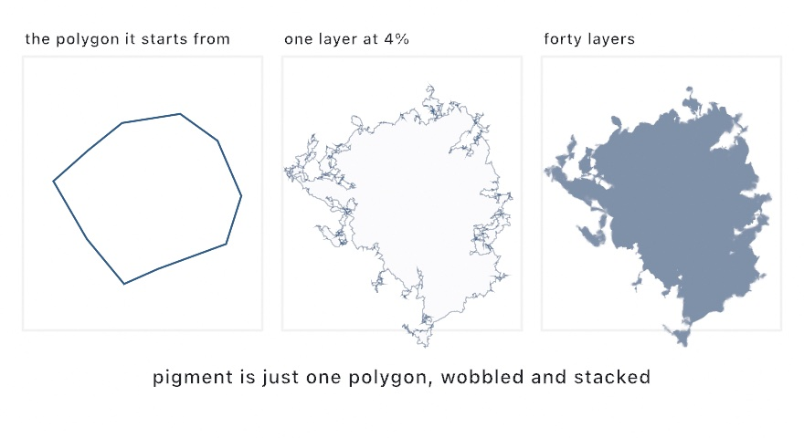
</picture>

One call does the whole thing:

```swift
fill(Color(hex: 0x2B5D8A))
drawWatercolor(center: center, radius: 300)
drawWatercolor(center: center, radius: 300, layers: 60, opacity: 0.03, variance: 40)
```

`layers` and `opacity` trade against each other, and more layers at a lower opacity looks smoother and wetter. If a blob reads thin and translucent everywhere, add layers rather than raising opacity. The flat saturated core is most of what sells it as paint. `variance` sets how far the edge is free to wander, and it defaults to a fifth of the radius. All of it rides the sketch's seeded `random`. So `seed(_:)` reproduces a painting exactly, and every variation pours a different one.

This is deliberately heavy drawing, since each layer is a full concave fill. Paint in `setup()` or behind `noLoop()` rather than every frame. The cost is one reason, and the other is that regenerating every frame re-rolls the layers and makes the blob shimmer.

Two moves are worth knowing once the basic pool works. For two pigments that mix instead of one covering the other, build a typed `Watercolor` base per pool. Interleave their layers a few at a time, so overlaps glaze in both directions. And for the grainy look of pigment settling into paper, speckle small translucent circles inside a `withClip` of the pool's own outline.

## Toward the pen

The chapter opened by promising a pen plotter, and these last tools close the loop. Fills become line work a pen can follow, and vector files flow in and back out.

### Lines for a pen

Everything so far draws filled regions on a screen. A pen plotter changes the terms, since it offers no fills and no gray, only lines. The bridge is **hatching**, which converts a filled region into parallel line work, and it's a type you can use directly:

```swift
let hatch = Hatching(spacing: 6.5, angle: .pi / 4)
for line in hatch.lines(filling: shape) {
    drawPolyline(line)
}
```

<picture>
  <source media="(prefers-color-scheme: dark)" srcset="Images/15-ShapesAsMaterial/HatchTones-dark.jpg">
  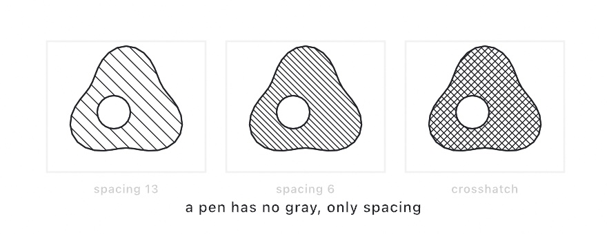
</picture>

Spacing is the pen's whole idea of tone. Holes and concavities are respected, because the lines are clipped by the shape's own inside rule. For getting work *out*, every sketch already knows how. Run it with `--export-svg plate.svg` and the recorded geometry writes as true vector paths. Add `--hatch` and the exporter converts every fill to hatch line work by itself, spacing scaled by each fill's tone. Either way the file opens in any vector tool and feeds any plotter.

### Shapes from a file

There's one more source of material before the finished piece, which is shapes you didn't draw at all. SVG is the plain-text vector format every design tool exports. `loadSVG` reads a file into the same types this chapter has been editing. Each element arrives as a `Shape` carrying the fill and stroke it was authored with:

```swift
if let art = loadSVG("boat.svg") {
    drawSVG(art, in: bounds.inset(by: .all(140)))
}
```

`drawSVG` draws the file the way its author saw it, fills, strokes, and stacking order intact. But the reason it lives in this chapter is what happens when you ignore the authored look. `art.shapes` and `art.contours` hand over the bare geometry, and everything above applies to it. Subtract the artwork from a mosaic, or shrink it into nested outlines. Respace its contours into even dots, the [Chapter 8](08-Words.md) trick, or hatch it for the pen.

<picture>
  <source media="(prefers-color-scheme: dark)" srcset="Images/15-ShapesAsMaterial/ImportMined-dark.jpg">
  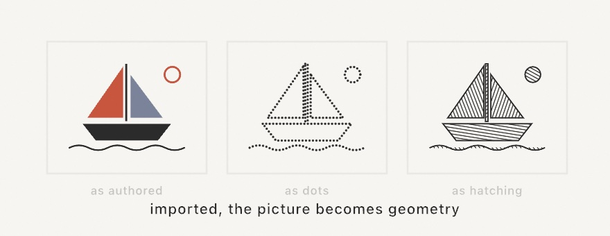
</picture>

```swift
let fitted = art.fitted(in: frame)      // a scaled copy, in canvas coordinates
for (i, shape) in fitted.shapes.enumerated() {
    let hatch = Hatching(spacing: 4.5, angle: 0.5 + Double(i) * 0.7)
    for line in hatch.lines(filling: shape) {
        drawPolyline(line)
    }
}
```

A logo, a scanned drawing auto-traced to paths, a file another sketch exported, and they all arrive the same way. They can leave again through `--export-svg`, so a sketch can import a file, rework it, and hand the result to a plotter. Two things are worth knowing before you lean on it. Text doesn't import, so convert it to outlines in the design tool first. A gradient fill falls back to flat gray, so the form stays visible. The [SVG import reference](../Docs/Drawing/SVG.md) lists exactly what the importer reads and skips.

## Record it once: batches

One habit has come up in section after section: build the geometry once, hold it, and let `draw()` only replay it. There's a last step available when even the replaying gets heavy. `draw()` still walks your arrays and re-issues every line to the GPU, sixty times a second, for a picture that never changes.

```swift
var drawing: Batch?

override func setup() {
    drawing = makeBatch {
        // any drawing calls that don't change between frames
    }
}

override func draw() {
    background(.white)
    if let drawing { drawBatch(drawing) }
}
```

`makeBatch { }` records your drawing once into a `Batch` you hold, and `drawBatch` replays it from the GPU's own memory. For static work at scale the difference is not subtle. A hundred and fifty thousand circles cost around thirteen milliseconds a frame drawn the ordinary way, and effectively nothing replayed. The transform in force when you call `drawBatch` still applies, so one recorded batch can be stamped at several positions or sizes.

The rule of thumb is simple. If the drawing doesn't change between frames, it belongs in a batch. If it does change, leave it alone. A few things can't be recorded, namely 3D meshes, particles, layer blocks, and clipping. Rather than silently dropping them, Ollin refuses at the point you draw them and tells you why.

## Putting it together: the plate

The plate brings the whole chapter to one piece of paper. A blue-noise scatter is relaxed once, and its Voronoi mosaic is inset cell by cell. A stroked ribbon is subtracted from every cell with a halo of breathing room, over two pens' worth of hatching. Make `MySketches/Plate.swift`:

```swift
import Ollin

final class Plate: Sketch {
    var inkLines: [[Vector2]] = []
    var inkOutlines: [[Vector2]] = []
    var penLines: [[Vector2]] = []
    var penOutlines: [[Vector2]] = []

    override func setup() {
        seed(9)
        let margin = bounds.inset(by: .all(80))

        // The ribbon: a wavy open line, stroked into a region.
        let wave = (0 ... 50).map { i -> Vector2 in
            let t = Double(i) / 50
            return Vector2(90 + t * (width - 180),
                           height * 0.52 + signedNoise(t * 1.7, 3.0) * 300)
        }
        let ribbon = Contour(wave, closed: false).stroked(width: 120, join: .round, cap: .round)

        // The mosaic: blue-noise sites, relaxed once, cut by the ribbon's halo.
        let sites = lloyd(poissonDisk(in: margin, radius: 105), in: margin, iterations: 1)
        let mosaic = voronoi(sites, in: margin)
        let halo = ribbon.offset(by: 14, join: .round)

        for (i, cell) in mosaic.cells.enumerated() {
            let piece = cell.offset(by: -9, join: .miter).subtracting(halo)
            guard !piece.contours.isEmpty else { continue }
            let hatch = Hatching(spacing: 6.5 + Double(i % 4) * 2,
                                 angle: Double(i) * 0.83)
            inkLines.append(contentsOf: hatch.lines(filling: piece))
            inkOutlines.append(contentsOf: piece.contours.map(\.points))
        }

        // The ribbon in the second pen, crosshatched.
        let hatch = Hatching(spacing: 9, angle: -.pi / 5, crossHatches: true)
        penLines = hatch.lines(filling: ribbon)
        penOutlines = ribbon.contours.map(\.points)
    }

    override func draw() {
        background(Color(hex: 0xF4F0E6))

        noFill()
        strokeWeight(1.4)
        stroke(Color(hex: 0x2F3440))
        for line in inkLines { drawPolyline(line) }
        strokeWeight(2)
        for outline in inkOutlines { drawPolygon(outline) }

        strokeWeight(1.6)
        stroke(Color(hex: 0xC8553D))
        for line in penLines { drawPolyline(line) }
        strokeWeight(2.4)
        for outline in penOutlines { drawPolygon(outline) }
    }
}
```

All the geometry happens once in `setup()` and lands in four plain arrays, and `draw()` only replays lines. That split *is* the plotter mindset, a piece reduced to strokes a machine could follow. It also keeps the sketch fast, no matter how elaborate the geometry gets. And nothing in `draw()` changes between frames, so the plate is exactly what `makeBatch` records. Wrap the loops and the whole piece replays as one `Batch`.

Then make it yours:

- Export it: `swift run` your sketch with `--export-svg plate.svg` and open the file in a vector editor. Every hatch line is really there.
- Re-roll `seed(9)` until the ribbon and the mosaic argue well. The composition is the choosing.
- Give every third cell a solid fill instead of hatching, and the plate gains ink-block weight.
- Swap the ribbon for text: [Chapter 8](08-Words.md)'s `textToShapes` returns shapes, and shapes are what everything here eats. Hatched letters parting a mosaic make a poster.
- Work in three pens by hatching the cells nearest the ribbon in a middle color, picked by distance from the wave's points.
- Give the plate a deckled edge. Intersect every cell with `Shape(concaveHull(of: sites, concavity: 0.4))` instead of trimming to the margin rectangle. The mosaic then stops at the scatter's own outline.
- Trade hatching for bones. Run `medialAxis` on each cell piece and stroke its branches, and the plate reads as a nervous system rather than a mosaic.
- Float the ribbon instead of stroking it: `bath.add(ribbon, color:)` into a `Marbling`, comb it, and hatch the inks that come out. It still exports as plotter line work.

## Where this comes from

The territories are named for Georgy Voronoy and the triangulation for Boris Delaunay, mathematicians a century apart from the generative artists who adopted them. The settling pass is Stuart Lloyd's algorithm from 1957 signal processing. The dart-throwing scatter is Robert Bridson's 2007 fast Poisson-disk sampling. Grow-until-touching circle packing entered the generative canon through Jared Tarbell's work in the early 2000s. The shape booleans and offsets are powered by Angus Johnson's Clipper2 library. It is one of the few pieces of bundled code in Ollin, credited in full in the project notices.

The named curves each carry a person with them. Lissajous figures are Jules Antoine Lissajous's, from 1857, though Nathaniel Bowditch drew them first. Roses are Guido Grandi's rhodonea, named in the 1720s for their resemblance to flowers. The trochoids are the mathematics behind the Spirograph toy. The harmonograph was a real Victorian instrument, a pen hung from swinging pendulums. And the sunflower packing is Helmut Vogel's 1979 model. Spirolaterals were named and studied by Frank Odds in 1973, and Harold Abelson and Andrea diSessa set them as a turtle-geometry exercise in 1981. The curve a family of lines leans on is classical differential geometry, and the caustics of a circle were worked out in the seventeenth century, with Ehrenfried Walther von Tschirnhaus and Christiaan Huygens among the names attached. Corner cutting is George Chaikin's, from 1974. The clothoid was described by Leonhard Euler in 1744, and rediscovered by Augustin-Jean Fresnel, whose integrals give its shape. Arthur Talbot brought it into railway practice in 1890. The fit that joins two points and two headings follows Enrico Bertolazzi and Marco Frego's 2015 reduction. Mirror anamorphosis is older than the mathematics that describes it: Renaissance workshops ruled the construction out by hand, and Jean-Francois Niceron wrote it down in 1638. Drawing with epicycles goes back through Fourier to the Greek astronomers, who used circles riding on circles to explain the wandering of the planets. The two even-sampling sequences are John Halton's and Ilya Sobol's, both from the early 1960s. Both were invented for numerical integration rather than for drawing. The convex hull uses A. M. Andrew's monotone-chain construction from 1979. The concave hull is the characteristic-shape construction of Matt Duckham, Lars Kulik, Mike Worboys, and Antony Galton, from 2008. The alpha shape is Herbert Edelsbrunner, David Kirkpatrick, and Raimund Seidel's, from 1983.

The skeleton is Harry Blum's medial axis, proposed in 1967 as a way to describe biological shape. It is approximated here by the Voronoi method of J. W. Brandt and V. R. Algazi. The straight skeleton is Oswin Aichholzer, Franz Aurenhammer, David Alberts, and Bernd Gärtner's, from 1995. It is computed by the shrinking-wavefront method that Petr Felkel and Štěpán Obdržálek formulated, and Tom Kelly hardened against simultaneous events. Roofers and origami folders knew the construction long before it had a name. The marbling equations are Aubrey Jaffer's closed-form model of a craft that predates all of it. The watercolor recipe is Tyler Hobbs', from a generous written guide to simulating paint with generative art. And hatching itself is far older than any of this, since it's how engravers and etchers made tone from lines for centuries. The plotter just holds the pen steadier. Full credits are in the project's [attribution notes](../ATTRIBUTION.md).

## Go deeper

- [Geometry](../Docs/Drawing/Geometry.md): `Contour`, `Shape`, `Path`, the booleans, offsetting, stroke-as-shape, and the convex hull, with every signature.
- [SVG import](../Docs/Drawing/SVG.md): loading, drawing, the element list, and what the importer reads and skips.
- [Fourier epicycles](../Docs/Drawing/Epicycles.md): the `Term` list, the joint and path readers, and resampling requirements. The [`Examples/Motion/Epicycles`](../Examples/Motion/Epicycles/Sketch.swift) example traces a whale with them.
- [Shape morphing](../Docs/Drawing/Morphing.md): the correspondence rules, `spacing`, and `Tweenable` geometry inside a `Timeline`. The [`Examples/Motion/Morphing`](../Examples/Motion/Morphing/Sketch.swift) example loops a star through a blob and a donut.
- [Classic curves](../Docs/Drawing/Curves.md): every parameter of all nine, including what closes each curve exactly once.
- [Envelopes and caustics](../Docs/Drawing/Envelopes.md): `envelope` and the `Ray2` it works on, reflected and bent rays, and the two caustics of a circle worth recognizing.
- [Anamorphosis](../Docs/Drawing/Anamorphosis.md): the setup, the map for points, contours and shapes, what an eye can see of a cylinder, reading a plate back, and standing a real mirror on a printed one. The [`Examples/Patterns/Anamorphosis`](../Examples/Patterns/Anamorphosis/Sketch.swift) example spells a word around one and shows what the eye receives.
- [Clothoid](../Docs/Drawing/Clothoid.md): the four numbers, the easement, the single curve that fits two points and two headings, corner rounding, and driving a chain by distance.
- [Low-discrepancy sampling](../Docs/Generators/LowDiscrepancy.md): Halton bases, Sobol, `startIndex`, and the scalar `halton`.
- [Stroke profiles](../Docs/Drawing/Drawing.md#strokeProfile): `.taper`, `.ramp`, `.nib` and `.values` with every argument, the by-hand closure form, which primitives honor a profile, and what vector export writes.
- [Marks](../Docs/Drawing/Marks.md): `StrokeMark`, the response and dynamics types, what the smoothing and spacing parameters do, building a mark without a pointer, and what survives vector export.
- [Retained batches](../Docs/Drawing/Batches.md): what a `Batch` can and can't record, how transforms apply at replay, and the measured numbers.
- [Voronoi & Delaunay](../Docs/Drawing/Voronoi.md): cells, triangles, neighbors, and Lloyd relaxation.
- [Hulls](../Docs/Generators/Hulls.md): `concaveHull` and `alphaShape`, with the parameter ranges that read well and the cost of each.
- [Medial axis](../Docs/Generators/MedialAxis.md): the skeleton, the `Branch` type, and what the radii guarantee.
- [Straight skeleton](../Docs/Generators/StraightSkeleton.md): arcs, faces, `inset(by:)`, and when to pick it over the medial axis or `offset`.
- [Marbling](../Docs/Generators/Marbling.md): the bath, every raking tool, and floating your own outlines as ink.
- [Watercolor](../Docs/Generators/Watercolor.md): the sugar, the typed base, and how the deformation actually runs.
- [Blue noise](../Docs/Generators/BlueNoise.md) and [circle packing](../Docs/Generators/Packing.md) / [shape packing](../Docs/Generators/ShapePacking.md), which also covers packing around a set of points you already have and the practical notes on building a shape bag.
- [Export](../Docs/Output/Export.md): the whole `--export-svg` and `--hatch` surface, plus stills, sequences, video, and GIF.
- Appendix B draws this chapter's math, one picture per idea: [Randomness](B-JustEnoughMath.md#randomness), [Shapes as regions](B-JustEnoughMath.md#shapes-as-regions).
- Worked examples: [`Examples/Shapes/Booleans`](../Examples/Shapes/Booleans/Sketch.swift), [`Examples/Patterns/Topography`](../Examples/Patterns/Topography/Sketch.swift), [`Examples/Shapes/InkRibbon`](../Examples/Shapes/InkRibbon/Sketch.swift), [`Examples/Patterns/Voronoi`](../Examples/Patterns/Voronoi/Sketch.swift), [`Examples/Patterns/Delaunay`](../Examples/Patterns/Delaunay/Sketch.swift) (the triangle half of the same pair, reading its own adjacency back), [`Examples/Patterns/CirclePacking`](../Examples/Patterns/CirclePacking/Sketch.swift), [`Examples/Shapes/SVGImport`](../Examples/Shapes/SVGImport/Sketch.swift), [`Examples/Shapes/Hulls`](../Examples/Shapes/Hulls/Sketch.swift), [`Examples/Shapes/MedialAxis`](../Examples/Shapes/MedialAxis/Sketch.swift), [`Examples/Shapes/StraightSkeleton`](../Examples/Shapes/StraightSkeleton/Sketch.swift), [`Examples/Patterns/Marbling`](../Examples/Patterns/Marbling/Sketch.swift), [`Examples/Shapes/Watercolor`](../Examples/Shapes/Watercolor/Sketch.swift), and [`Examples/Shapes/Brushwork`](../Examples/Shapes/Brushwork/Sketch.swift).

---

[Contents](README.md#contents) · Previous: [Chapter 14, Fields and flow](14-FieldsAndFlow.md) · Next: [Chapter 16, Layers and effects](16-LayersAndEffects.md)
