#### <sup>[Ollin](../README.md) → [Guide](README.md) → Chapter 15</sup>

---

# 15. Shapes as material

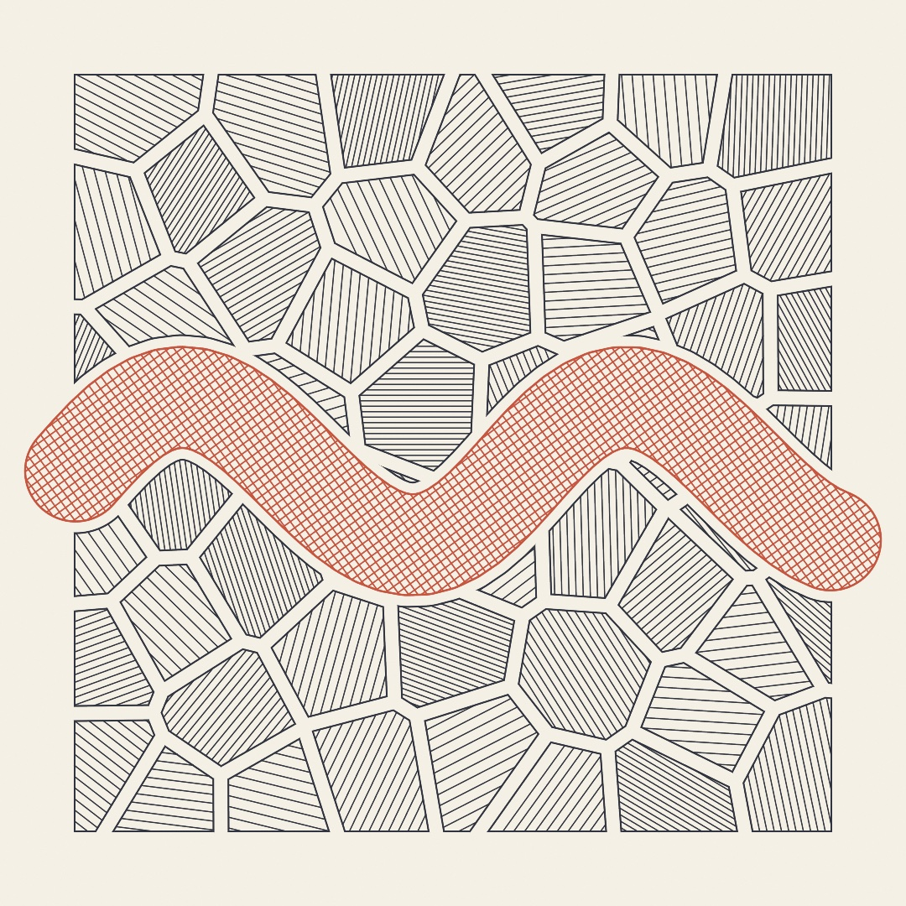

Shapes become material once you hold them in a variable and edit them before you draw. This chapter cuts shapes with other shapes, grows and shrinks them, divides a scatter into territories, and hatches the results for a pen. Everything in the plate above is line work a pen plotter could draw, and its section ends by exporting it for one. Past the plate, shapes pack, answer questions, and arrive from files, and line work can tell a blade where to score and cut.

## Shapes you can hold

This first stretch treats geometry as a value. It covers the types that hold an outline, a few ways to get one, and the verbs that edit whatever you are holding.

### Contours, shapes, and holes

Two types carry all the geometry in this chapter, and you have met both. A `Contour` is a run of points, open (a polyline with two ends) or closed (a loop). A `Shape` is one or more contours plus a rule for what counts as inside. Its most useful property is that a contour *nested inside another* becomes a hole. That is how an `o` or a donut is one shape rather than two.

For shapes that curve, build them with the path closure, which collects moves, lines, and curves and hands back the finished geometry. Make `MySketches/Leaf.swift`:

```swift
import Ollin

final class Leaf: Sketch {
    override func draw() {
        background(Color(hex: 0x101318))

        noStroke()
        fill(Color(hex: 0x7FB069))
        drawShape { p in
            p.move(to: Vector2(540, 180))
            p.cubicCurve(to: Vector2(540, 900),
                         control1: Vector2(860, 380), control2: Vector2(700, 740))
            p.cubicCurve(to: Vector2(540, 180),
                         control1: Vector2(380, 740), control2: Vector2(220, 380))
            p.close()
        }

        noFill()
        stroke(Color(hex: 0x2F4A2C))
        strokeWeight(6)
        strokeCap(.round)
        drawCurve([Vector2(540, 210), Vector2(560, 420),
                   Vector2(530, 640), Vector2(540, 870)])
    }
}
```


`drawShape { p in }` hands you a path `p`. `move(to:)` puts the pen down, and each curve draws from where the pen is to its end point. `close()` joins the line back to the start. A cubic curve bends from one point to the next, steered by two control points it leans toward but never touches. Two of them, mirrored, make the leaf. The vein uses `drawCurve`, which threads a smooth curve *through* the points you give it, with no control points to manage. A fill needs a *closed* contour, and ending a path back where it started is not enough. Forget `p.close()` and the leaf does not fill, leaving only the vein.

### Shape arithmetic: the booleans

A held shape can be combined with another like a quantity. Four operations do it all:

<picture>
  <source media="(prefers-color-scheme: dark)" srcset="Images/15-ShapesAsMaterial/BooleanOps-dark.jpg">
  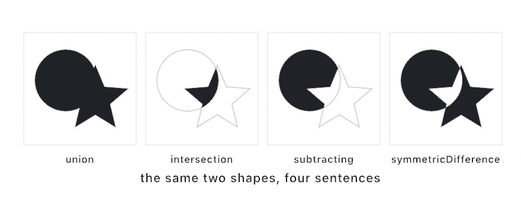
</picture>

```swift
let badge = circle.union(star)            // either
let bite = circle.intersection(star)      // both
let cut = circle.subtracting(star)        // this one, minus that one
let rind = circle.symmetricDifference(star)   // either, but not both
```

These are the **shape booleans**, and they let you build a drawing the way you build a sentence. A window is a wall subtracting a rectangle, and a crescent is a circle subtracting a shifted circle. The plate at the top is a mosaic subtracting a ribbon. Holes come along correctly, results are ordinary `Shape`s, and you can chain as deep as the sentence needs. When a boolean's result looks unexpectedly *solid* or *hollow*, the shape's winding rule is usually the reason. The [geometry reference](../Docs/Drawing/Geometry.md#shape-booleans) covers the two rules, and when each reads more naturally.

### Growing, shrinking, and thickening: `offset` and `stroked`

Three more verbs finish the shape-editing vocabulary. `offset(by:)` grows a region outward on a positive number and shrinks it inward on a negative one, with holes moving the opposite way. Shrinking a region repeatedly reads as topographic contour lines, until it pinches apart and disappears. The `Patterns/Topography` example is that loop. `stroked(width:)` turns a *line* into a *region*. It gives the closed shape that a pen stroke of that width would cover, round or square or butt ends included. An open contour comes back as a thick line with ends, and a closed one as a band. The ribbon is the open case:

```swift
let ribbon = Contour(wave, closed: false).stroked(width: 120, join: .round, cap: .round)
```

The plate rests on that one call. Once a stroke is a region, it is an ordinary `Shape`, and the chapter's shape tools all work on it. You can subtract it from a mosaic, inset rings inside it, or hatch it. You can also export it as a filled outline, instead of a stroke attribute a tool may read differently. The `Shapes/InkRibbon` example strokes a drifting brush line and rings contour bands inside it, live.

## Scatters and territories

So far each shape was one outline. Here the material turns into populations, and the territories start from `poissonDisk(radius:)`, the even scatter from [Chapter 4](04-Randomness.md#chance-spread-evenly-blue-noise-and-low-discrepancy-sequences).

### Territories and neighbors: Voronoi and Delaunay

A scatter of points hides two structures, and each is the other turned inside out:

<picture>
  <source media="(prefers-color-scheme: dark)" srcset="Images/15-ShapesAsMaterial/Duals-dark.jpg">
  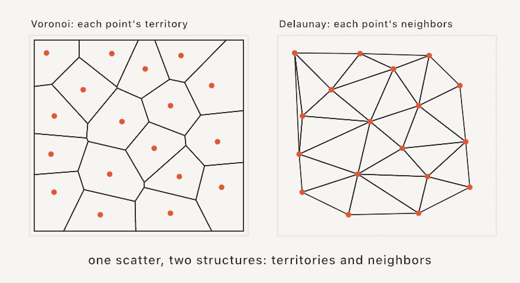
</picture>

The **Voronoi diagram** gives each point its territory, the region of the canvas closer to it than to any other point. The **Delaunay triangulation** joins each point to its natural neighbors. Ollin builds both from any point list:

```swift
let mosaic = voronoi(sites, in: bounds)     // mosaic.cells is one Shape per site
let mesh = delaunay(sites)                  // mesh.triangles, each a Triangle value
```

Every Voronoi cell is a `Shape`, so every shape tool in the chapter applies per cell. You can inset them for grout lines, subtract things from them, or hatch them, and the plate does all three. A companion helper comes with it. `lloyd(sites, in: bounds)` nudges every site to its cell's center and re-tessellates. Each pass makes the mosaic calmer and more even, like a pan of bubbles settling.

A Voronoi diagram answers one question badly, and it comes up as soon as the things being divided have sizes. A boundary halfway between two centers is fair between two points. Between a large circle and a small one it is not, because it falls inside the large one.

<picture>
  <source media="(prefers-color-scheme: dark)" srcset="Images/15-ShapesAsMaterial/WeightedTerritories-dark.jpg">
  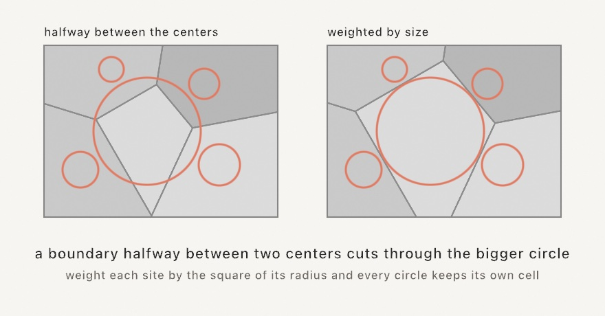
</picture>

```swift
let cells = powerDiagram(of: circles).cells   // one per circle, some possibly empty
```

A **power diagram** gives every site a weight and subtracts it from the squared distance. Weight each circle by the square of its radius, as `powerDiagram(of:)` does. The boundary between two circles then becomes the line where a point is equally far outside both. When two circles overlap, that line runs through their crossing points. Every circle that touches no other then sits inside its own cell. Franz Aurenhammer worked the diagram out in 1987.

The cells are still convex and they still tile the region exactly, so everything you do to a Voronoi cell you can do to these. What is new is that a site can lose. A small circle inside a large one gets no cell at all, and its entry in `cells` is an empty `Shape` that draws nothing.

## Outlines and bones

The Voronoi mosaic divided a scatter into territories. A scatter or a shape also carries structure you can read back out. Hulls wrap a point set from the outside, and the medial axis describes a shape from the inside.

### What shape are these points? Hulls and alpha shapes

A scatter usually has an outline you need for something. It may be the footprint of a drifting herd, or the ground a blue-noise scatter covers. It may be an outline to offset, hatch, or clip against. Three tools answer that question, and they differ in what each one is allowed to do.

`convexHull(of:)` returns the smallest convex polygon containing every point, the shape a rubber band would snap to around a handful of pins. It is quick and it always comes back as one simple loop. It also can never dip inward, which is the limit as much as the strength. A ring of points comes back as a filled blob. A rubber band has no way to reach into the middle.

`concaveHull(of:concavity:)` lets the band sink into the gulfs between clusters while staying one simple polygon with every point inside it. The `concavity` argument runs `0...1`, where 0 gives the convex hull itself and 1 hugs the points as tightly as their spacing allows. Around 0.5 to 0.8 it reads as following the scatter. Pushed near 1 it erodes every bridge it can, and starts to look like a maze.

`alphaShape(of:alpha:)` asks a different question, and it is the one that can say "these are two things". Picture rolling a disk of radius `alpha` over the points and keeping only the parts the disk cannot get into. Nothing requires the answer to be a single piece. A clustered scatter can come back as several islands, and a ring comes back as a ring.

<picture>
  <source media="(prefers-color-scheme: dark)" srcset="Images/15-ShapesAsMaterial/HullTrio-dark.jpg">
  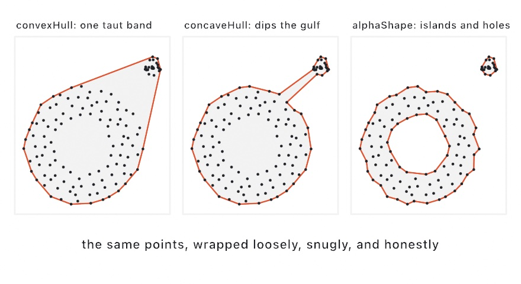
</picture>

```swift
let band = convexHull(of: scatter)                        // [Vector2]
let snug = concaveHull(of: scatter, concavity: 0.65)      // [Vector2]
let islands = alphaShape(of: scatter, alpha: 40)          // [Shape]
```

The two hulls hand back boundary points in order, so wrap them in a `Contour` or pass them straight to `drawPolygon`. The alpha shape hands back finished `Shape`s, holes included, ready for `drawShape` and for everything earlier in this chapter.

Choosing between them depends on what you will do next. When the result has to be one simple polygon, because it is a plotter path or a region you will offset, use a hull. When you want the true footprint of a clumpy scatter, use the alpha shape.

The number that needs care is `alpha`, which is a radius in the same units as your points. It wants to sit a bit above the typical gap between neighbors, and set much below that the shape crumbles into dust. All three are deterministic, so the same points and the same argument give the same outline every run. The `Shapes/Hulls` example moves `concavity` from 0 to tight so you can watch the band sink into the gulf.

### The skeleton inside: the medial axis

Hulls describe a region from the outside. The **medial axis** describes it from the inside by finding its middle. Take every disk that fits within the shape while touching the boundary in two or more places. The centers of those disks trace a skeleton. A blob collapses to the veins running down its lobes, and a letterform collapses to the stroke a pen would have made to write it.

<picture>
  <source media="(prefers-color-scheme: dark)" srcset="Images/15-ShapesAsMaterial/Skeleton-dark.jpg">
  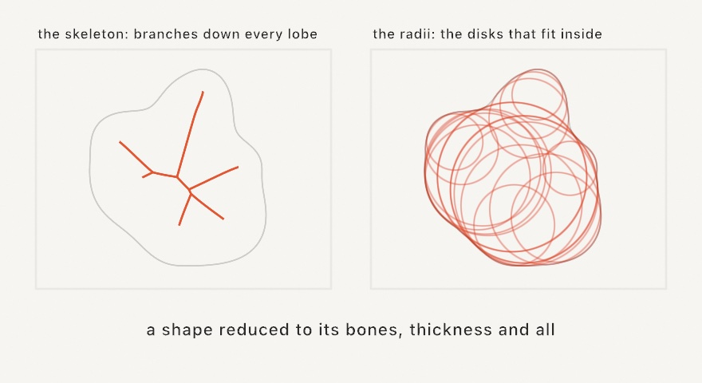
</picture>

```swift
let skeleton = medialAxis(of: blob, spacing: 3, prune: 8)
noFill()
for branch in skeleton.branches {
    drawPolyline(branch.points, closed: branch.isClosed)
}
```

Two arguments shape the result. `spacing` is how finely the boundary gets sampled, so smaller means a more faithful skeleton and more work. Halving it roughly quadruples the cost. `prune` trims whiskers, removing terminal twigs shorter than the value you give. You want some pruning almost always, because every convex corner of the outline grows a twig. A couple of spacings clears the fuzz while keeping the trunk. Branches come back as polylines, open runs between forks, or closed rings around holes, which is why `drawPolyline` takes `branch.isClosed`.

The skeleton also remembers thickness. Each branch carries `radii` alongside `points`, one radius per vertex, holding the size of the disk that fits there. So the skeleton knows how fat the shape is at every step along itself. Walk a branch drawing a circle from each pair and you rebuild the region as a train of disks. Size marks by the radius and a drawing swells through the thick parts, then thins into the tips. The largest radius anywhere marks the deepest point of the shape, the spot furthest from any edge.

Skeletons are setup work rather than per-frame work, so extract once and hold the result. Glyph shapes from [Chapter 8](08-Words.md)'s `textToShapes` skeletonize as they are, counters and all. That is what the `Shapes/MedialAxis` example does, to spell a word in bones.

## Toward the pen: hatching

The chapter opened by promising a pen plotter, and hatching is what takes a shape to one.

### Lines for a pen: hatching

The fills so far went to a screen. A pen plotter changes the terms, since it offers no fills and no gray, only lines. The bridge is **hatching**, which converts a filled region into parallel line work, and it is a type you can use directly:

```swift
let hatch = Hatching(spacing: 6.5, angle: .pi / 4)
for line in hatch.lines(filling: shape) {
    drawPolyline(line)
}
```

<picture>
  <source media="(prefers-color-scheme: dark)" srcset="Images/15-ShapesAsMaterial/HatchTones-dark.jpg">
  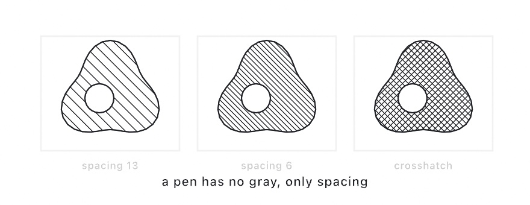
</picture>

Spacing is the pen's whole idea of tone. Holes and concavities are respected, because the lines are clipped by the shape's own inside rule. For getting work *out*, every sketch already knows how. Run it with `--export-svg plate.svg` and the recorded geometry writes as true vector paths. Add `--hatch` and the exporter converts every fill to hatch line work by itself, spacing scaled by each fill's tone. Either way the file opens in any vector tool and feeds any plotter.

## Putting it together: the plate

The plate composes the held shapes, the boolean and the offsets, the scatter and its Voronoi mosaic, and the hatching. A blue-noise scatter is relaxed once, and its Voronoi mosaic is inset cell by cell. A stroked ribbon is subtracted from every cell with a halo of breathing room, over two pens' worth of hatching. Make `MySketches/Plate.swift`:

```swift
import Ollin

final class Plate: Sketch {
    var inkLines: [[Vector2]] = []
    var inkOutlines: [[Vector2]] = []
    var penLines: [[Vector2]] = []
    var penOutlines: [[Vector2]] = []

    override func setup() {
        seed(9)
        let margin = bounds.inset(by: .all(80))

        // The ribbon: a wavy open line, stroked into a region.
        let wave = (0 ... 50).map { i -> Vector2 in
            let t = Double(i) / 50
            return Vector2(90 + t * (width - 180),
                           height * 0.52 + signedNoise(t * 1.7, 3.0) * 300)
        }
        let ribbon = Contour(wave, closed: false).stroked(width: 120, join: .round, cap: .round)

        // The mosaic: blue-noise sites, relaxed once, cut by the ribbon's halo.
        let sites = lloyd(poissonDisk(in: margin, radius: 105), in: margin, iterations: 1)
        let mosaic = voronoi(sites, in: margin)
        let halo = ribbon.offset(by: 14, join: .round)

        for (i, cell) in mosaic.cells.enumerated() {
            let piece = cell.offset(by: -9, join: .miter).subtracting(halo)
            guard !piece.contours.isEmpty else { continue }
            let hatch = Hatching(spacing: 6.5 + Double(i % 4) * 2,
                                 angle: Double(i) * 0.83)
            inkLines.append(contentsOf: hatch.lines(filling: piece))
            inkOutlines.append(contentsOf: piece.contours.map(\.points))
        }

        // The ribbon in the second pen, crosshatched.
        let hatch = Hatching(spacing: 9, angle: -.pi / 5, crossHatches: true)
        penLines = hatch.lines(filling: ribbon)
        penOutlines = ribbon.contours.map(\.points)
    }

    override func draw() {
        background(Color(hex: 0xF4F0E6))

        noFill()
        strokeWeight(1.4)
        stroke(Color(hex: 0x2F3440))
        for line in inkLines { drawPolyline(line) }
        strokeWeight(2)
        for outline in inkOutlines { drawPolygon(outline) }

        strokeWeight(1.6)
        stroke(Color(hex: 0xC8553D))
        for line in penLines { drawPolyline(line) }
        strokeWeight(2.4)
        for outline in penOutlines { drawPolygon(outline) }
    }
}
```

All the geometry happens once in `setup()` and lands in four plain arrays, and `draw()` only replays lines. That split is the plotter mindset, a drawing reduced to strokes a machine could follow. It also keeps the sketch fast, no matter how elaborate the geometry gets. And nothing in `draw()` changes between frames, so the whole plate could be recorded once and replayed. That is what the batches in [Chapter 19](19-LayersAndEffects.md#record-it-once-batches) do.

> **Swift note.** `(0 ... 50).map { i -> Vector2 in ... }` runs the closure once for each number from 0 to 50 and collects the results. It is the `map` from [Chapter 6](06-GridsAndRepetition.md), with its result type written out so the closure's result reads at a glance. The `contentsOf:` form of `append` adds a whole list to the end of another. `\.points` is the key path from [Chapter 7](07-Tiles.md), naming the property to pull out of each contour.

Then make it yours:

- Re-roll `seed(9)` until the ribbon and the mosaic sit well together. The composition is the choosing.
- Swap the ribbon for text: [Chapter 8](08-Words.md)'s `textToShapes` returns shapes, and shapes are what everything here takes. Hatched letters parting a mosaic make a poster.
- Give the plate a deckled edge. Intersect every cell with `Shape(concaveHull(of: sites, concavity: 0.4))` instead of trimming to the margin rectangle. The mosaic then stops at the scatter's own outline.
- Trade hatching for bones. Run `medialAxis` on each cell piece and stroke its branches, and the plate reads as a nervous system rather than a mosaic.

### How a plot runs

The way to keep this sketch is as a file for the pen. `swift run OllinLive MySketches/Plate.swift --export-svg plate.svg` writes every hatch line and outline as a vector path, and opening the file in a vector editor shows each one is there. From that file to paper takes four decisions, and they are the same for every plotter.

**One file per pen.** A plotter holds one pen at a time, so it wants the ink lines and the ribbon lines in separate files. The simplest way is a parameter that names the pen. Declare `@Param("Pen", 0...2) var pen = 0`, wrap the ink loops in `if pen != 2` and the ribbon loops in `if pen != 1`, and export twice: `--export-svg ink.svg --param pen=1` and then `--export-svg ribbon.svg --param pen=2`. `--param` sets a declared parameter for that one run. At `0` the window still shows both pens.

**Pen order.** Plot the file with the most lines first, change the pen when the machine stops, and plot the second. Where two pens would cross, the darker one goes last so it sits on top. The plate keeps the pens apart with the halo, so here the order changes nothing.

**Spacing from the nib.** The hatch spacing is in canvas units, and the sheet decides what a unit is. On a sheet 200 millimeters wide, this canvas puts about 0.19 millimeters in a unit. The tightest cells, hatched at 6.5, then get 1.2 millimeters between lines, and the loosest, at 12.5, get 2.3 millimeters. A 0.3 millimeter nib covers a quarter of the tighter gap, which reads as a light gray. A working rule: lines one nib apart fill solid, two nibs apart read dark, and four to six read light. Every `strokeWeight` in the listing is for the screen, because the pen draws every line at its own width.

**A test plot.** Before the full plate, plot a strip on the same paper with the same pen. Give it the hatch at three spacings and one outline. Check the tone, and check whether the ink bleeds or the pen skips on the sheet. Then change the spacing in the sketch, never the pen. To make the file a true sheet rather than a scaled drawing, declare the canvas as a paper size. Then export the same recording as a PDF. [Chapter 41](41-FinishingASketch.md#sized-for-the-output-fractions-of-the-canvas-and-paper-sizes) covers paper-sized canvases, and the rest of the export surface.

## More from a held outline: contour questions and points in a shape

The plate held its shapes to cut, grow, and hatch them, and a held outline can do more than that. It can tell you where its line goes, and it can keep a scatter of points inside itself. The plate asks neither of it.

### Asking an outline where it goes: contour questions

A contour is a list of points, but it can answer questions about the line those points make. Ask it where it runs closest to the mouse, or which way it heads at some fraction along. Ask where it crosses another line, or itself.

<picture>
  <source media="(prefers-color-scheme: dark)" srcset="Images/15-ShapesAsMaterial/OutlineQuestions-dark.jpg">
  
</picture>

Every answer is measured along the walk, as a fraction from 0 to 1 of the contour's length, the number `point(at:)` below takes. So the answers fit into each other:

```swift
let t = path.fraction(of: mouse)                 // how far along the nearest place is
let foot = path.point(at: t)                     // that place
let heading = path.tangent(at: t)                // which way the line runs there
let side = path.normal(at: t)                    // a quarter turn to its right
let walked = path.piece(from: 0, to: t)          // the stretch up to it
```

The left panel is those five lines. `fraction(of:)` undoes `point(at:)`: one turns a fraction into a place, the other a place into a fraction. `nearestPoint(to:)` does the first two lines in one call, when the fraction itself is not needed. `piece(from:to:)` cuts out a stretch as its own open contour. On a closed outline it may run through the start, so `piece(from: 0.9, to: 0.1)` is the fifth of a ring around its seam.

Crossings come back as a list, sorted along the outline you asked:

```swift
for crossing in road.crossings(with: river) {
    drawCircle(center: crossing.point, radius: 10)
}
```

Each one carries its `point`, and how far along each line it sits (`fraction` on this one, `otherFraction` on the other). That is enough to cut either line there.

The middle panel asks a loop about itself with `crossings()`. Walk once round and you pass through every crossing twice. Call every second pass "under" and cut a short gap out of the line there, and the loop weaves like a knot. The alternation always works out, because a closed curve passes an even number of crossings between its two visits to one. So every crossing gets one over and one under. The `Shapes/OverUnder` example tangles its loop a little differently every frame and weaves it again.

The right panel shows three edits. `simplified(tolerance:)` thins a dense trace, like a mouse stroke or a traced edge, to the points it needs. Every original point stays within the tolerance of what is left. `rounded(_:)` turns every corner into an arc, and `chamfered(_:)` cuts every corner flat. Both stop where two corners would run into each other, so a radius that is too big still gives a clean shape. The [geometry reference](../Docs/Drawing/Geometry.md#contour-questions) lists the rest, including `reversed()` and the same edits on a whole `Shape`.

### Chance inside an outline: points in a shape

A shape can also be the place chance is confined to. `randomPoints(in:count:)` scatters points evenly over its fill, with holes left out and every island given its share. The points come from the same triangles the fill is made of, not from the box around the shape. `randomPoints(along:count:)` scatters them along the outline, even by length. And `poissonDisk(in:radius:)` is [Chapter 4](04-Randomness.md#darts-that-keep-their-distance-poissondisk)'s blue noise kept inside a shape, no two points closer than the radius, every island filled:

```swift
seed(4)
let letter = textToShapes("O", 540, 700)[0]
let stipple = poissonDisk(in: letter, radius: 9)     // inside the letter, none in its counter
let rim = randomPoints(along: letter, count: 80)     // on the outline, even by length
noStroke(); fill(.black)
drawPoints(stipple, size: 3)
drawPoints(rim, size: 6)
```

Three lines and a glyph is a stipple. The plate scattered its sites over a whole rectangle, and this confines the same scatter to a shape. That is how a stipple, a hatch of dots, or a flock that starts inside a letter begins. The [geometry reference](../Docs/Drawing/Geometry.md#shape-points) has the forms that take any random source.

## Filling space by packing: circles, fractions, and shapes

The plate's mosaic carved a space into territories around its points. Packing divides a space too, and the plate does not use it. A circle for every fraction belongs here as well, since those circles pack themselves with no rule asking them to.

### Packing: circles that grow until they touch

Packing reverses the mosaic. Instead of carving space between points, you grow shapes until they claim it. The common form scatters candidate seeds and grows each circle until it touches whatever arrived first:

<picture>
  <source media="(prefers-color-scheme: dark)" srcset="Images/15-ShapesAsMaterial/PackingLapse-dark.jpg">
  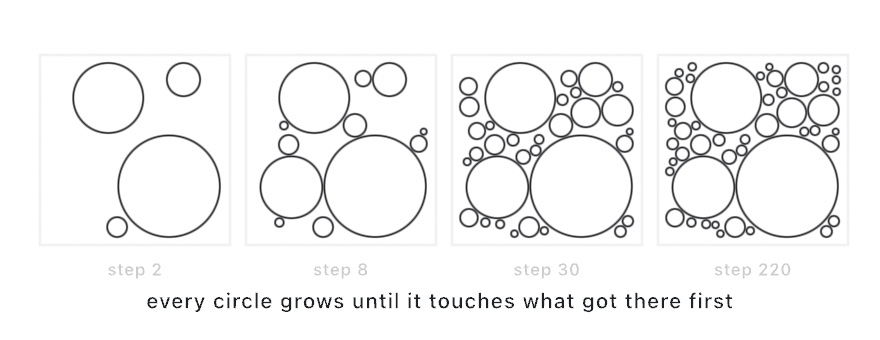
</picture>

```swift
let circles = packCircles(count: 300, minRadius: 4, maxRadius: 120)
```

The big-first, small-fill rhythm is the signature of the technique, and the finished foam feeds anything that takes circles or shapes.

A packing can also be exact. `apollonianGasket(in:minRadius:)` fills a circle with a foam of ever-smaller kissing circles, each one the single circle that touches its three neighbors. There is no randomness in it at all, so the same circle always gives the same foam. The circles come back in the order they were created, so their index doubles as an age you can color by.

### A circle for every fraction: Ford circles

The gasket's circles touch because each one is built to touch its neighbors. In this one, nothing arranges the touching at all.

Take any fraction `p/q` in lowest terms. Give it a circle of radius `1/(2q²)`, sitting on the number line at `p/q`. Do that for every fraction at once, so a second fraction `r/s` gets its own circle beside the first.

<picture>
  <source media="(prefers-color-scheme: dark)" srcset="Images/15-ShapesAsMaterial/CircleForEveryFraction-dark.jpg">
  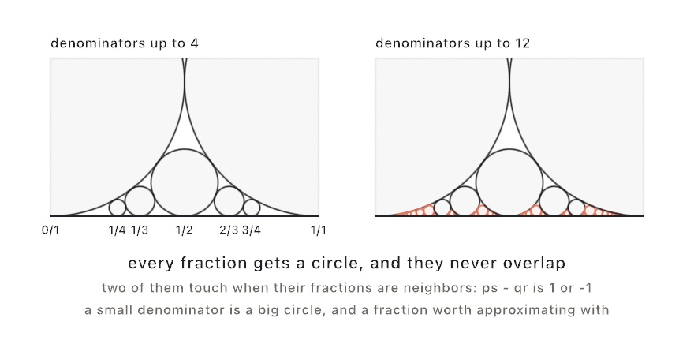
</picture>

```swift
noFill(); stroke(.white)
for ford in fordCircles(order: 12) { drawCircle(ford.circle) }
```

**No two of them ever overlap**, though nothing in the rule asks it. Two of them touch exactly when their fractions `p/q` and `r/s` are neighbors, which means `ps - qr` is `1` or `-1`. Lester Ford wrote this down in 1938.

Read the sizes and the picture tells you something. A small denominator gets a big circle, and a big circle is a fraction that stays close to everything near it. That is what "a good approximation" means, drawn.

The fractions come from `fareySequence(order:)`, which is useful on its own. It hands you every fraction from 0 to 1 with a denominator inside the order, in order. Any two terms next to each other are neighbors. The first fraction ever to appear between two of them is their mediant, `(p+r)/(q+s)`. That is the wrong way to add fractions and the right way to grow this sequence.

Growing `order` over a loop is the animation, and it is arrival rather than motion. No circle ever moves, and each new denominator drops its circles into the gaps between the old ones. The `Patterns/FordCircles` example does that, and draws a line between every touching pair on a mouse hold.

### Packing shapes, not circles

Circles are the easy case. Two circles touch when the distance between their centers equals the sum of their radii, and that is one line of arithmetic. Other shapes are harder, because a star is mostly *not* there. It is five points and a lot of empty air between them. `packShapes` takes a bag of shapes and grows each one against its neighbors' **outlines**:

```swift
let bag = [triangle, square, hexagon, star]
let packed = packShapes(bag, count: 160, minRadius: 7, maxRadius: 62, padding: 2)
```

<picture>
  <source media="(prefers-color-scheme: dark)" srcset="Images/15-ShapesAsMaterial/ShapePacking-dark.jpg">
  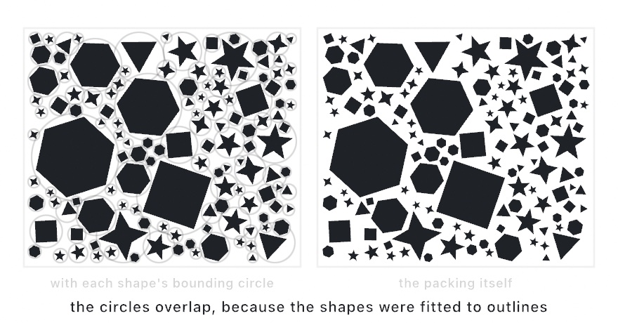
</picture>

Both panels are the same packing, from a bag with more shapes in it than the listing's four. The left one also draws each shape's bounding circle, and **those circles overlap**, which a circle packing could never allow. That overlap is the point. The fit was measured to the outlines. A small star can settle into a big star's notch, or lie along a triangle's edge. It uses space a circle would have reserved and wasted.

The arguments beyond `count` and the radius range change the character rather than the density. `padding` opens a consistent gap between shapes, which helps when they will be cut or plotted. `rotation` is the range each placement is randomly turned within. So `0 ... 0` keeps everything upright and gives a much stiffer, more typographic result. And `scale` is how much of its own bounding circle a shape fills. Anything under `1` shrinks every placement a little and loosens the whole field.

The output is `[Shape]`, so every shape tool in the chapter takes it. Fill it, stroke it, boolean it, hatch it, or export it as SVG. Compute the packing once and hold it, then animate something visual like each shape's color, or the shapes will jump every frame.

`ContinuousPacking` is the same engine held open instead of run to completion. You `step()` it each frame and the region fills in as you watch. The big gaps go first, so each new shape is smaller than the last. Paired with `noClear()` from [Chapter 12](12-FlocksAndSwarms.md) it costs almost nothing per frame, because a placed shape never moves and only the new ones need drawing. That is what the `Patterns/ShapePacking` example does, filling in for as long as it runs.

## More outlines and bones: fitting and the straight skeleton

The plate's variations wrap a scatter in a hull and trace a cell's medial axis. A fit and a second skeleton read structure out of the same material, and the plate uses neither.

### The circle they were scattered around: `Fit.minimize`

The hulls wrap a scatter. Sometimes you want the shape it was scattered around instead, and the scatter is all you have. Say a set of marks sits roughly on a circle, and nothing in the sketch knows where that circle is. `Fit.minimize` takes three numbers, a middle and a radius, and a way of saying how wrong they are. It walks them downhill until they stop being wrong:

```swift
let best = Fit.minimize(from: [width / 2, height / 2, 100]) { p in
    marks.reduce(0.0) { total, mark in
        let off = Vector2(p[0], p[1]).distance(to: mark) - p[2]
        return total + off * off
    }
}
drawCircle(best.values[0], best.values[1], best.values[2])
```

The closure is the whole of it. You never say how to search, only how to score. `reduce` adds up one number over a list, starting from the value you give it. The closure inside it runs once per mark and returns the running total. Squared distance is the usual scoring. It punishes one badly placed mark much harder than several slightly off ones. That is what makes the answer settle in the middle of the crowd.

It walks *downhill from where you start*. A problem with several separate answers hands back whichever one your starting guess was nearest. So when that matters, run it from a few different starts and keep the best. It also measures the slope by trying each number a little either side of where it stands. So your closure gets called a couple of thousand times over a walk of any length. Keep it cheap.

The third panel of the fitting figure in [Chapter 14](14-FieldsAndFlow.md#a-field-you-pin-down-yourself-radial-basis-functions) is this call, a circle fitted through the middle of a ring of pale marks.

### The straight skeleton

There is a second skeleton, built from a different thought experiment. Shrink the boundary inward at a steady pace, every edge sliding parallel to itself, and watch the corners. Each one travels in a straight line, edges shorten and vanish, and narrow places pinch shut. The paths the corners trace are the **straight skeleton**. Where the medial axis curves around a reflex corner, this one is made entirely of straight segments. Where the medial axis is approximated from a boundary sampling, this one is exact.

<picture>
  <source media="(prefers-color-scheme: dark)" srcset="Images/15-ShapesAsMaterial/InsetLadder-dark.jpg">
  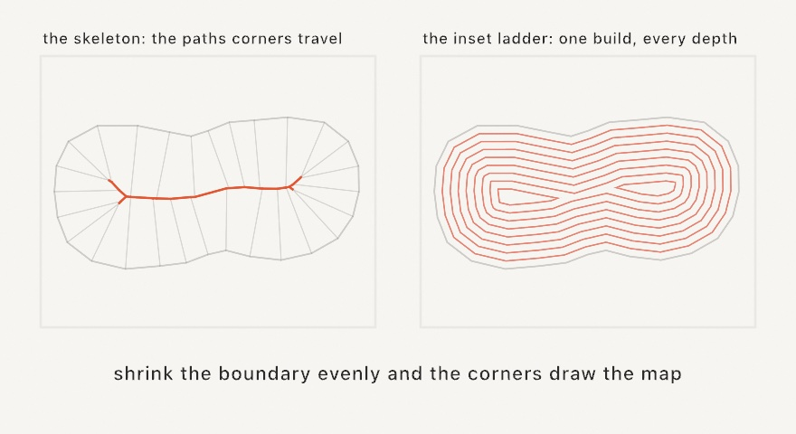
</picture>

```swift
let skeleton = straightSkeleton(of: island)
for arc in skeleton.arcs {
    drawLine(arc.start, arc.end)
}
```

Arcs whose `startDistance` is 0 rise off the boundary, one per corner. The rest are interior ridges, the creases where shrinking fronts met. Every arc endpoint carries the shrink distance at which the boundary arrived there. `skeleton.maxInset` is the depth where the last of the shape disappears.

The reason to reach for this skeleton is what that distance gives you. The shrinking boundary at depth `d` is your shape inset by `d`, corners still sharp. `inset(by:)` cuts it straight out of the finished skeleton:

```swift
noFill()
for d in stride(from: 8.0, to: skeleton.maxInset, by: 8) {
    drawShape(skeleton.inset(by: d))
}
```

That loop is a topographic contour map of any polygon, which is a common way to fill a region on a pen plotter. The rings split on their own where the shape pinches, ring a hole as the region around it thins, and run out at `maxInset`. You met `offset(by:)` earlier in this chapter doing something similar, and the difference matters. `offset` is the general tool, outward as well as inward, with a choice of corner joins, and it does fresh work per ring. The skeleton's inset is inward only and exact, every corner keeping its true miter. A ladder of twelve rings costs one build, and each ring after it is nearly free. The skeleton also hands you `faces`, one flat panel per boundary edge with depths attached, so a shape can be shaded like folded paper.

The same habit carries over from the medial axis. Every boundary corner grows an arc, so a traced or resampled outline grows one arc per sample point. That is correct behavior, but for clean line work, simplify the outline first. The `Shapes/StraightSkeleton` example grows an island with a lake, and lets the contour ladder drift inward for as long as it runs. Every ring is a mitered inset read off one skeleton.

## Shapes from a file: SVG import

The plate built every shape it used in code. Shapes can also come from a file you did not draw at all, and the plate has no need of one. SVG is the plain-text vector format every design tool exports. `loadSVG` reads a file into the same types this chapter has been editing. Each element arrives as a `Shape` carrying the fill and stroke it was authored with:

```swift
if let art = try? loadSVG("boat.svg") {
    drawSVG(art, in: bounds.inset(by: .all(140)))
}
```

`drawSVG` draws the file the way its author saw it, fills, strokes, and stacking order intact. But the reason it lives in this chapter is what happens when you ignore the authored look. `art.shapes` and `art.contours` hand over the bare geometry, and everything above applies to it. Subtract the artwork from a mosaic, or shrink it into nested outlines. Respace its contours into even dots, the [Chapter 8](08-Words.md) move, or hatch it for the pen.

<picture>
  <source media="(prefers-color-scheme: dark)" srcset="Images/15-ShapesAsMaterial/ImportMined-dark.jpg">
  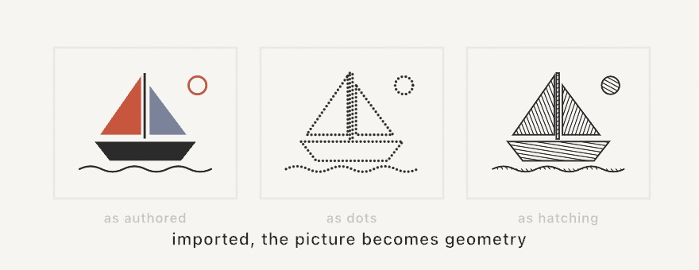
</picture>

```swift
let fitted = art.fitted(in: frame)      // a scaled copy, in canvas coordinates
for (i, shape) in fitted.shapes.enumerated() {
    let hatch = Hatching(spacing: 4.5, angle: 0.5 + Double(i) * 0.7)
    for line in hatch.lines(filling: shape) {
        drawPolyline(line)
    }
}
```

A logo, a scanned drawing auto-traced to paths, a file another sketch exported, and they all arrive the same way. They can leave again through `--export-svg`, so a sketch can import a file, rework it, and hand the result to a plotter. Two things matter before you rely on it. Text does not import, so convert it to outlines in the design tool first. A gradient fill falls back to flat gray, so the form stays visible. The [SVG import reference](../Docs/Drawing/SVG.md) lists what the importer reads and skips.

## A pattern that folds: creases and cuts

The plate leaves as lines for a pen. Lines can also tell a blade where to score and where to cut, and then the paper itself takes the shape. Three things belong here that the plate does not use. The first is the pattern that writes a fold down. The others are a sheet that opens all at once, and a sheet that is cut instead of folded.

### Mountains and valleys: `CreasePattern` and the two laws

A **crease pattern** is how a folded thing is written down. Every fold is a straight line on the flat sheet, and there are only two kinds. A **mountain** points up out of the sheet. A **valley** points down into it. Draw those lines and you have said everything about the finished form. It is for anything that will be folded from a flat sheet, from a lamp to a map. The mathematics comes from origami. Toshikazu Kawasaki and Jun Maekawa wrote it down in the 1980s, and Jacques Justin found the first law independently.

A crease pattern can be wrong, which a hatched shape cannot. A hatched shape draws whatever you hand it. A crease pattern is a set of instructions, and the paper is the test it has to pass.

Two laws test it, and both look at a single vertex. **Kawasaki's law**: walk around the vertex and list the angles between one fold and the next. Add the first, take away the second, add the third, and keep going all the way around. The answer has to come to zero. **Maekawa's law**: count the mountains and the valleys meeting there. One count is always two more than the other. `isFlatFoldable` asks both, at every vertex inside the sheet. A pattern that fails them cannot fold flat. One that passes can still fail, if the sheet would have to pass through itself.

<picture>
  <source media="(prefers-color-scheme: dark)" srcset="Images/15-ShapesAsMaterial/CreaseAndFold-dark.jpg">
  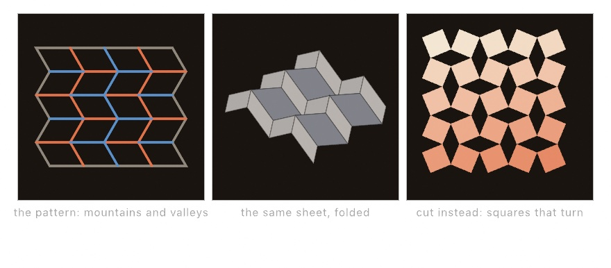
</picture>

### A sheet that opens all at once: the Miura fold

The pattern on the left is the **Miura fold**, a pattern of leaning parallelograms that folds flat and opens in one pull. It is for anything that has to travel folded and open without a sequence of moves. Maps, medical stents, and the solar arrays that open in orbit all use it. The astrophysicist Koryo Miura devised it in 1970 for packing solar arrays into a rocket. It flew on Japan's Space Flyer Unit in 1995:

```swift
var sheet = MiuraFold(columns: 8, rows: 5, angle: .pi / 3)
let pattern = sheet.pattern.fitted(in: bounds)
stroke(.orange)
drawCreases(pattern, .mountain)
stroke(.blue)
drawCreases(pattern, .valley)
```

`drawCreases` strokes the folds of one kind, so a pattern takes two calls, one per pen. You can read the pattern off the picture. The zigzag folds running down the sheet are each one kind for their whole length, and they take turns across the sheet. The straight folds running across it change kind at every step. That is what a Miura pattern looks like.

The middle panel is the same sheet folded. `fold` runs from 0, the flat sheet, to 1, a flat packet, and `facets` hands back the panels in three dimensions:

```swift
sheet.fold = 0.5 * (1 - cos(time))
for panel in sheet.facets { ... }
```

Pull two opposite corners of a Miura sheet and the whole thing opens at once, in both directions together. There is no order of operations to remember.

It does one more thing. The sheet gets narrower as it gets shorter. Squeeze a rubber band and it bulges out. This does the opposite, and `poissonRatio` is the negative number that says so. Mark Schenk and Simon Guest worked out how the fold behaves as a material. Their account gives the Poisson's ratio from the fold's angles alone, and it is always negative.

### Origami allowed to cut: rotating squares

The right panel is the other half of the craft. **Kirigami** is origami that is allowed to cut. **Rotating squares** is its plainest pattern, a grid of squares cut apart except for a thread of material at each corner. It is for a sheet that stretches in both directions at once when you pull it. That is how it reaches wearable materials and stretchable electronics. Joseph Grima and Kenneth Evans published it in 2000, and its Poisson's ratio of -1 is as far as a flat material can go. `RotatingSquares` cuts the grid, leaving a ligament at each corner. The squares then turn one way and the next as the sheet is pulled:

```swift
var lattice = RotatingSquares(columns: 6, rows: 6, side: 90, ligament: 6)
lattice.opening = 0.5 * (1 - cos(time))
for square in lattice.squares { drawPolygon(square.points) }
```

Nothing stretches there either. The squares only turn, so the sheet grows the same amount in both directions at once.

Both patterns come out as ordinary geometry, like everything else in this chapter. Run the sketch with `--export-svg`, as the plate did, and the fold lines go to a scoring blade or a pen. The cut lines go to a cutter.

## Where this comes from

The territories are named for Georgy Voronoy and the triangulation for Boris Delaunay, mathematicians a century apart from the generative artists who adopted them. The settling pass is Stuart Lloyd's algorithm from 1957 signal processing. Grow-until-touching circle packing entered the generative canon through Jared Tarbell's work in the early 2000s. The shape booleans and offsets are powered by Angus Johnson's Clipper2 library, one of the bundled libraries credited in full in the project notices. The power diagram is Franz Aurenhammer's, from 1987.

The circle foam is the oldest idea in the chapter by far. Apollonius of Perga asked which circle touches three given circles, around 200 BC. René Descartes worked out the arithmetic relating their sizes, in a 1643 letter to Princess Elisabeth of Bohemia. That is why the relation carries his name. The circles on the number line are Lester Ford's, from a 1938 paper about approximating numbers with fractions. The sequence under them is named for John Farey, who noticed the mediant rule in 1816. Charles Haros had published the same thing in 1802, and Augustin-Louis Cauchy supplied the proof Farey did not.

The convex hull uses A. M. Andrew's monotone-chain construction from 1979. The concave hull is the characteristic-shape construction of Matt Duckham, Lars Kulik, Mike Worboys, and Antony Galton, from 2008. The alpha shape is Herbert Edelsbrunner, David Kirkpatrick, and Raimund Seidel's, from 1983.

The skeleton is Harry Blum's medial axis, proposed in 1967 as a way to describe biological shape. It is approximated here by the Voronoi method of J. W. Brandt and V. R. Algazi. The straight skeleton is Oswin Aichholzer, Franz Aurenhammer, David Alberts, and Bernd Gärtner's, from 1995. It is computed by the shrinking-wavefront method that Petr Felkel and Štěpán Obdržálek formulated, and Tom Kelly hardened against simultaneous events. Roofers and origami folders knew the construction long before it had a name. Hatching itself is far older than any of this, since it is how engravers and etchers made tone from lines for centuries. The plotter just holds the pen steadier. The crease patterns after the plate name their own sources. Full credits are in the project's [attribution notes](../ATTRIBUTION.md).

## Go deeper

- [Geometry](../Docs/Drawing/Geometry.md): `Contour`, `Shape`, `Path`, the booleans, offsetting, stroke-as-shape, and the convex hull, with every signature.
- [SVG import](../Docs/Drawing/SVG.md): loading, drawing, the element list, and what the importer reads and skips.
- [Voronoi & Delaunay](../Docs/Drawing/Voronoi.md): cells, triangles, neighbors, and Lloyd relaxation.
- [Hulls](../Docs/Generators/Hulls.md): `concaveHull` and `alphaShape`, with the argument ranges that read well and the cost of each.
- [Fitting by walking downhill](../Docs/Drawing/Fitting.md#minimize): everything `Fit.minimize` takes, and what it hands back.
- [Medial axis](../Docs/Generators/MedialAxis.md): the skeleton, the `Branch` type, and what the radii guarantee.
- [Straight skeleton](../Docs/Generators/StraightSkeleton.md): arcs, faces, `inset(by:)`, and when to pick it over the medial axis or `offset`.
- [Circle packing](../Docs/Generators/Packing.md) and [shape packing](../Docs/Generators/ShapePacking.md), which also covers packing around a set of points you already have and the practical notes on building a shape bag.
- [The Apollonian gasket](../Docs/Drawing/Tiling.md#apollonianGasket): the circle it fills, `minRadius`, and the order the circles come back in.
- [Ford circles](../Docs/Generators/FordCircles.md): the circles, the Farey sequence and its mediant rule, and the `Fraction` type both rest on.
- [Export](../Docs/Output/Export.md): the whole `--export-svg` and `--hatch` surface, `--param`, the paper sizes, plus stills, sequences, video, and GIF.
- [Crease patterns](../Docs/Drawing/CreasePattern.md): `CreasePattern` and the two laws, `MiuraFold` with its rigid folding in three dimensions, `RotatingSquares`, joining creases into pen strokes, and taking a sheet to a cutter.
- The Farmanfarmaian homage [`BehindGlass`](../Examples/Recreations/MonirFarmanfarmaian/BehindGlass/Sketch.swift): a spiral built from a kite. Each side moves in a little further than the last, and the corners are taken where the moved lines meet. The spiral is painted in the order reverse-glass painting needs. Its `--export-svg` writes the marks in that order, so a frame from behind and one from the front compare mark for mark.
- The Felguérez homage [`EspacioMultiple`](../Examples/Recreations/ManuelFelguerez/EspacioMultiple/Sketch.swift): a vocabulary of five outlines, each a plain point list. They are painted flat with `drawPolygon` and raised into a relief with `drawExtrude` from the same points, so the exported plan is what stands off the wall. Its sibling `RelieveLacado` has one concave outline, a quarter ring, and that one goes through `drawShape`. `drawPolygon` fans, and a fan fills a ring's inner arc with a chord.
- The Rojo homage [`PiramidesYVolcanes`](../Examples/Recreations/VicenteRojo/PiramidesYVolcanes/Sketch.swift): a stream of lava is one middle line with a closed outline drawn a fixed distance either side, round at both ends. Two or three outlines at even distances make a band outlined twice or three times. The middle line never turns tighter than the band's half width, which keeps every outline from crossing itself.
- The Sato homage [`TotemBuilder`](../Examples/Recreations/OsamuSato/TotemBuilder/Sketch.swift): a figure made of circles and circles cut by circles. A crescent is `drawMoon`, a disk with a disk taken out of it, and an eye is `drawVesica`, the overlap of two disks. Everything but the tail is built on one side and reflected to the other.
- Appendix B draws this chapter's math, one picture per idea: [Randomness](B-JustEnoughMath.md#randomness), [Shapes as regions](B-JustEnoughMath.md#shapes-as-regions).
- Worked examples: [`Examples/Shapes/Booleans`](../Examples/Shapes/Booleans/Sketch.swift), [`Examples/Patterns/Topography`](../Examples/Patterns/Topography/Sketch.swift), [`Examples/Shapes/InkRibbon`](../Examples/Shapes/InkRibbon/Sketch.swift), [`Examples/Patterns/Voronoi`](../Examples/Patterns/Voronoi/Sketch.swift), [`Examples/Patterns/Delaunay`](../Examples/Patterns/Delaunay/Sketch.swift) (the triangle half of the same pair, reading its own adjacency back), [`Examples/Patterns/CirclePacking`](../Examples/Patterns/CirclePacking/Sketch.swift), [`Examples/Shapes/SVGImport`](../Examples/Shapes/SVGImport/Sketch.swift), [`Examples/Shapes/Hulls`](../Examples/Shapes/Hulls/Sketch.swift), [`Examples/Shapes/MedialAxis`](../Examples/Shapes/MedialAxis/Sketch.swift), [`Examples/Shapes/StraightSkeleton`](../Examples/Shapes/StraightSkeleton/Sketch.swift), and [`Examples/Patterns/CreasePattern`](../Examples/Patterns/CreasePattern/Sketch.swift) (a Miura sheet folding and unfolding beside its pattern, with the cut sheet a switch away).

---

[Contents](README.md#contents) · Previous: [Chapter 14, Fields and flow](14-FieldsAndFlow.md) · Next: [Chapter 16, Curves and figures](16-CurvesAndFigures.md)
