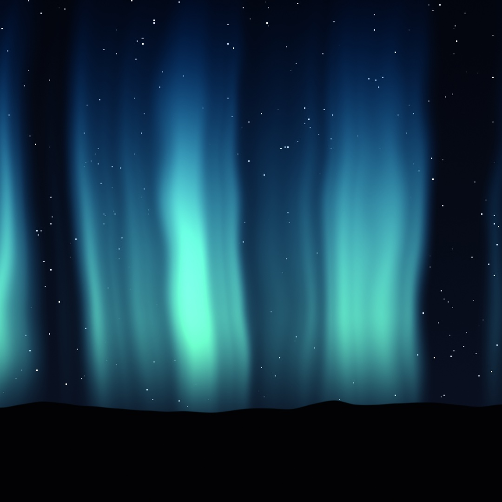
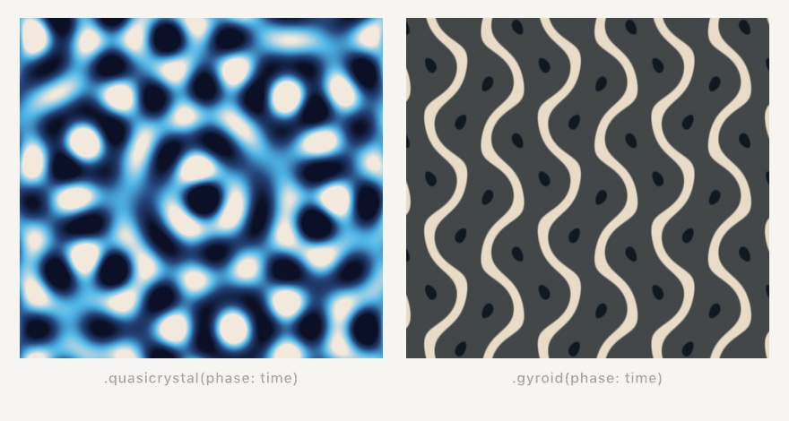

#### <sup>[Ollin](../README.md) → [Guide](README.md) → Chapter 15</sup>

---

# 15. Your first shader



That aurora is about forty lines of code and no assets, and it runs at full resolution at full frame rate because the drawing isn't happening one shape at a time. It's a **shader**: a small function the GPU runs at every pixel of the canvas at once. This chapter teaches you to write one, and by the end most of what you'll need was already taught chapters ago; it just changes costume.

## One question, a million times

Chapter 12 gave you the mental model without saying so: a field is an answer at every point. A flow field answered with a direction. A shader is a field that answers with a **color**, and the GPU is hardware built to ask it at every pixel simultaneously:


That's the whole shift. Until now, `draw()` has been imperative: *put a circle here, a line there*. A shader is one small function with the opposite job: *given a position, say what color lives there*. No loops over shapes, no order of operations, just position in, color out, everywhere, at once. The million evaluations per frame are why the aurora costs nothing; the "at once" is why a shader can't know what its neighbor pixels decided.

## The first shader

Make `MySketches/FirstShader.swift`:

```swift
import Ollin

final class FirstShader: Sketch {
    let coordinates = Shader("""
    float4 shade(float2 uv, ShaderInfo info) {
        return float4(uv.x, uv.y, 0.6, 1.0);
    }
    """)

    override func draw() {
        drawImage(generate(coordinates).image, 0, 0)
    }
}
```


The string is the shader; everything around it is plumbing you already know (Chapter 14's `generate` makes a layer, `drawImage` shows it). The function is the contract: Ollin calls your `shade` once per pixel, handing it that pixel's `uv` position, and whatever color you return is what that pixel becomes. Here red is `uv.x` and green is `uv.y`, so the image *is* the coordinate system:


`uv` runs `0...1` across the layer whatever its pixel size, top-left origin like the rest of the canvas. Painting coordinates as color looks like a toy, but it's the debugging tool you'll use forever: when a shader misbehaves, return the thing you're unsure about as a color and look at it.

> **Metal note.** The shader is written in Metal, the GPU's language, which is C-flavored: statements end with `;`, there are no argument labels, and the vector types are `float2`, `float3`, `float4` instead of `Vector2` and `Color`. A `float4` color is red, green, blue, alpha, each `0...1`, and constructors nest: `float4(col, 1.0)` packs a `float3` color plus an alpha. The math vocabulary (`sin`, `cos`, `length`, `mix`, `smoothstep`) is the one you've used all along, with the same meanings.

> **Swift note.** The triple-quoted `"""` string is a multiline string literal: everything between the quotes, line breaks included, is one string. The shader lives inside it, which is why a typo in the shader is reported at this file's own line numbers. And a broken shader never crashes the sketch: the pass is skipped, the error prints (or shows in OllinLive's overlay), and it clears when you fix it.

## Drawing with distance

To draw a *shape* with a function, describe the shape as a question about distance. A disc is "how far is this pixel from the center, and is that less than the radius?":

```swift
let disc = Shader("""
float4 shade(float2 uv, ShaderInfo info) {
    float2 p = uv - 0.5;                       // center the coordinates
    float d = length(p);                       // distance from the middle
    float v = smoothstep(0.35, 0.34, d);       // 1 inside, 0 outside, soft rim
    float3 col = mix(float3(0.06, 0.09, 0.14), float3(1.0, 0.79, 0.29), v);
    return float4(col, 1.0);
}
""")
```

Look at the third line. `smoothstep` is Chapter 3's easing curve, the one you watched as a graph and used to cushion motion. Here it answers a different question with the same shape: as `d` crosses from 0.35 down to 0.34, the result ramps smoothly from 0 to 1, and that one-percent ramp is the disc's anti-aliased rim. Widen the ramp and the rim becomes a glow; collapse it and the edge goes hard and pixelated:


This is the sentence at the heart of nearly every shader ever written: *measure a distance, shape it with smoothstep, turn it into color.* Everything else is choosing more interesting distances and more interesting colors.

## Time, mouse, and knobs

The `info` argument carries the outside world in: `info.time` (seconds, so anything you feed it moves), `info.mouse` (in canvas points), `info.resolution` (the layer's pixel size), and `info.frame`. A pulsing disc is the disc shader with one line changed:

```metal
float r = 0.3 + 0.05 * sin(info.time * 2.0);
float v = smoothstep(r, r - 0.01, d);
```

Your own numbers ride along as `params`, read back inside as `param(info, 0)`, `param(info, 1)`, and so on. Pair them with `@Param` and a computed property, and the shader gets live knobs:

```swift
@Param(0...0.4) var sway = 0.18

var sky: Shader {
    Shader(shaderSource, params: [Float(sway)])   // rebuilt each read, cached by source
}
```

Rebuilding the `Shader` value every frame is the normal pattern and costs nothing: the compiled pipeline is cached by the source text, so only the numbers travel. (The payoff below uses exactly this shape.)

## The library in your pocket

Ollin splices its own shader library into every shader you write, so the helpers its built-in effects use are yours too, with no import. The ones you already know by other names: `fbm` is Chapter 5's layered noise as one call, and the rest of that chapter's field family (`simplexNoise`, `worley`, `ridgedFbm`, `turbulence`, `warpedFbm`) is here under the same names; `hash12` is a random number that never changes between frames (feed it a cell and it's Chapter 4's seeded random, per pixel); the `sd*` family measures distance to ellipses, stars, hearts, and béziers the way `length` measured distance to a point; and `palette(t, a, b, c, d)` turns a `0...1` value into color along a designed gradient (four `float3`s shape the ramp; steal starting values from its documentation and nudge). The [shader library reference](../Docs/Shaders/ShaderLibrary.md) lists every function.

You've also been *using* shaders all along: every Chapter 14 filter and generator is one. The pattern fields are the purest examples, each a few lines of the math this chapter teaches:

```swift
drawImage(generate(.quasicrystal(phase: time)).image, 0, 0)
```



The quasicrystal is a handful of `cos` waves summed at evenly spaced angles; the gyroid is one line of `sin` and `cos` products. When a built-in look is close to what you want, take it; when it isn't, you now know how they're made.

## Chains: patching without typing Metal

Sometimes you want a shader's texture without writing one. A `Visual` chain composes per-pixel imagery the way you compose anything else in Swift: start from a source, warp it, color it, and patch chains into each other:

```swift
drawVisual(
    .oscillator(frequency: 24, colorShift: 0.12)
        .kaleidoscope(6)
        .displaced(by: .noise(scale: 3), amount: 0.12)
)
```


The signature move is the last step: one chain's *color* drives another chain's *coordinates*, per pixel. That `displaced(by:)` is the same idea as Chapter 14's displacement combine, but the driver is any chain, and the whole expression, drivers included, compiles into a single GPU pass. Everything animates by default, every number can ride a knob or a beat without recompiling, and `generate(chain)` hands the result back as an ordinary layer for the rest of the effect graph. The [chains reference](../Docs/Shaders/Visuals.md) has the full vocabulary (sources, warps, color ops, blends, and the feedback loop).

## The payoff: aurora

Now the sky. Curtains of light are vertical noise bands whose x position is bent by more noise; height fades them in above the horizon; a cosine palette colors them green at the core and violet at altitude; hashed stars and a noise ridge finish the scene. Make `MySketches/Aurora.swift`:

```swift
import Ollin

final class Aurora: Sketch {
    @Param(0...0.4) var sway = 0.18
    @Param(0.5...2.5) var strength = 1.4

    // A computed property, so each frame's shader carries the knobs' current
    // values; the compiled pipeline is cached by source, so this is free.
    var sky: Shader {
        Shader("""
    float4 shade(float2 uv, ShaderInfo info) {
        float t = info.time * 0.1;
        float sway = param(info, 0);
        float strength = param(info, 1);

        // The curtains: vertical bands whose x is bent by drifting noise, so
        // they ripple like fabric. y1 is height above the horizon.
        float y1 = 1.0 - uv.y;
        float bend = fbm(float2(uv.x * 2.4 + t, uv.y * 1.2 - t * 0.7)) - 0.5;
        float x = uv.x + bend * sway;
        float band = fbm(float2(x * 5.0, t * 1.6));
        band = smoothstep(0.45, 0.85, band) * strength;
        float height = smoothstep(0.1, 0.38, y1) * smoothstep(1.15, 0.4, y1);
        float glow = band * height;

        // Aurora colors from a cosine palette: green cores fading violet as
        // the curtain climbs.
        float3 aurora = palette(0.5 + glow * 0.22 - y1 * 0.3,
                                float3(0.16, 0.5, 0.38), float3(0.24, 0.5, 0.45),
                                float3(1.0, 0.7, 0.6), float3(0.35, 0.5, 0.75));

        // A cold night gradient, stars hashed per cell, brighter ones rarer.
        float3 col = mix(float3(0.01, 0.02, 0.05), float3(0.04, 0.07, 0.14), uv.y);
        float2 cell = floor(uv * info.resolution / 3.0);
        float star = step(0.997, hash12(cell)) * hash12(cell + 7.0);
        col += star * smoothstep(0.6, 0.1, glow);             // curtains outshine stars
        col += aurora * glow;

        // The ridge: a noise horizon, solid black below it.
        float ridge = 0.82 + (fbm(float2(uv.x * 3.0, 4.7)) - 0.5) * 0.12;
        float ground = smoothstep(ridge, ridge + 0.003, uv.y);
        col = mix(col, float3(0.005, 0.008, 0.012), ground);

        return float4(col, 1.0);
    }
    """, params: [Float(sway), Float(strength)])
    }

    override func draw() {
        drawImage(generate(sky).image, 0, 0)
    }
}
```


Read the shader top to bottom and count the old friends: `fbm` (Chapter 5) bends and builds the curtains, `smoothstep` (Chapter 3) shapes every transition, from the curtain edges to the height fade to the two-pixel horizon line, `hash12` (Chapter 4's determinism, per pixel) places the stars, `palette` designs the color, and `mix` (lerp by another name) blends every layer of the picture. Nothing new happened here except *where the code runs*.

Then make it yours:

- Run it under OllinLive and drag `sway` and `strength` while it plays. Then break a line on purpose and watch the error point at your own file, at the right line, while the sketch keeps running.
- Reflect it: draw the sky into the top half and again below, flipped and darkened, and there's a lake.
- Feed `info.mouse` into the palette so the colors follow your hand.
- Chain it: `generate(sky).filtered(.bloom())` glows the curtains; a `Visual` reading `.layer(generate(sky))` can kaleidoscope the whole night.

## Where this comes from

Shaders come out of computer graphics research and the demoscene, but the reason a creative coder in this century can learn them at all is largely two projects. *The Book of Shaders*, by Patricio Gonzalez Vivo and Jen Lowe, taught a generation the per-pixel mental model (this chapter's distance-and-smoothstep sentence is its heart, and if you want a deeper, GLSL-flavored second pass, it remains wonderful). And Shadertoy, built by Inigo Quilez and Pol Jeremias, made shaders a shared, remixable culture; Quilez's articles are also the source of half the techniques in Ollin's shader library, including the cosine `palette` and the `sd*` distance functions. The fractal noise behind `fbm` descends from Ken Perlin's Oscar-winning noise. The chain idiom of `Visual` is inspired by Olivia Jack's Hydra, the browser live-coding instrument whose patching model made combining visuals feel like playing an instrument. Full credits are in the project's [attribution notes](../ATTRIBUTION.md).

## Go deeper

- [User shaders](../Docs/Shaders/Shaders.md): the full contract, filters and combines that read layers, `.metal` file loading, and the error model.
- [The shader library](../Docs/Shaders/ShaderLibrary.md): every spliced-in helper with its signature.
- [Visual chains](../Docs/Shaders/Visuals.md): all sources, warps, color ops, combines, and modulations.
- [Compute](../Docs/Shaders/Compute.md): the sibling world where kernels update buffers of particles instead of pixels, waiting in Chapter 16.
- Worked examples: [`Examples/Shaders/HelloShader`](../Examples/Shaders/HelloShader/Sketch.swift), [`Examples/Shaders/ShaderFilter`](../Examples/Shaders/ShaderFilter/Sketch.swift), [`Examples/Shaders/ShaderFile`](../Examples/Shaders/ShaderFile/Sketch.swift) (hot-reloading `.metal`), [`Examples/Shaders/VisualSynth`](../Examples/Shaders/VisualSynth/Sketch.swift), and [`Examples/Effects/PatternFields`](../Examples/Effects/PatternFields/Sketch.swift).

---

[Contents](README.md#contents) · Previous: [Chapter 14, Layers and effects](14-LayersAndEffects.md) · Next: [Chapter 16, Simulations](16-Simulations.md)
