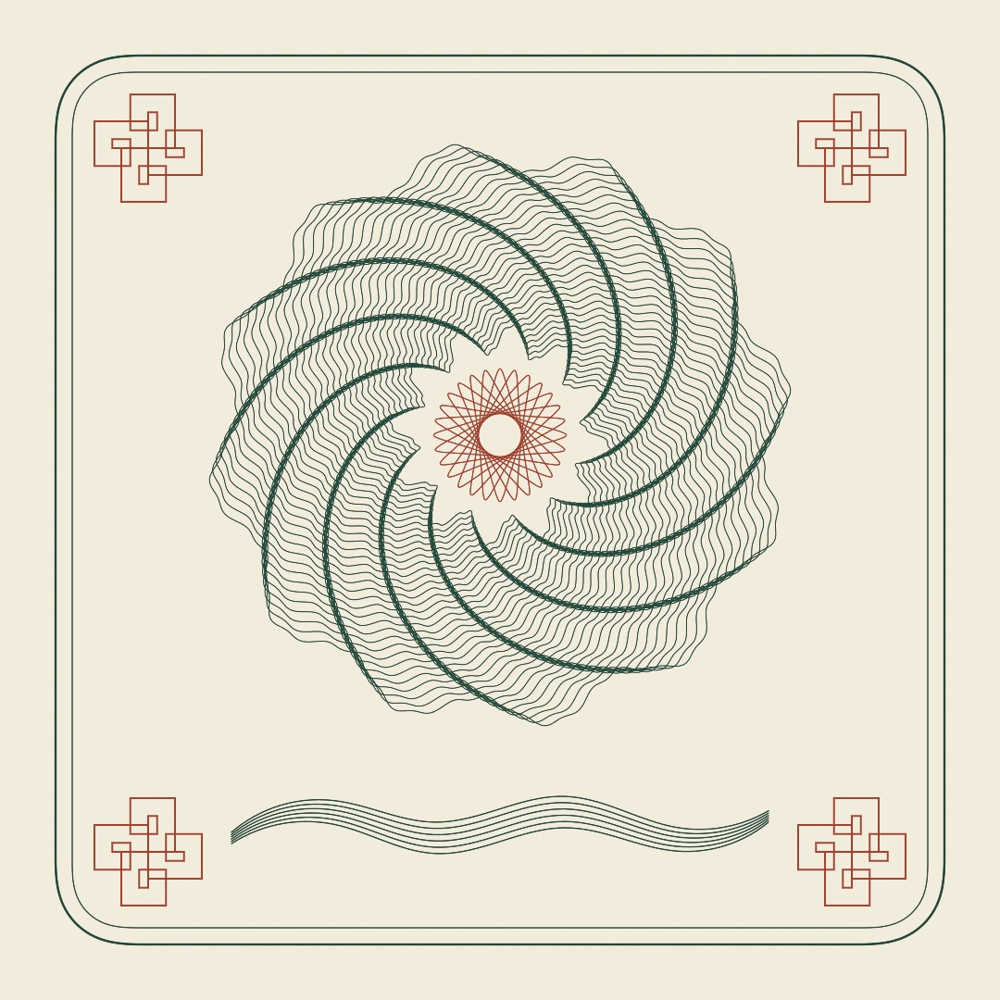
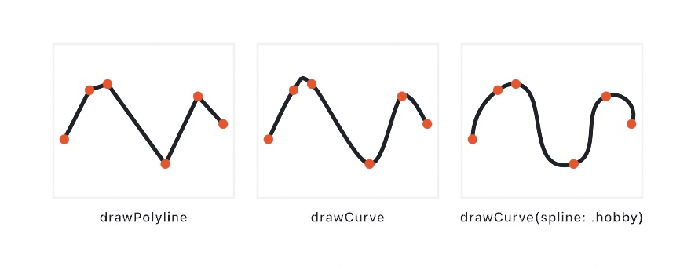
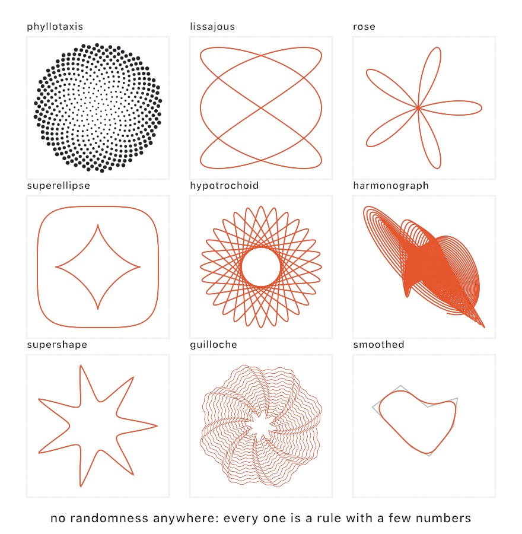
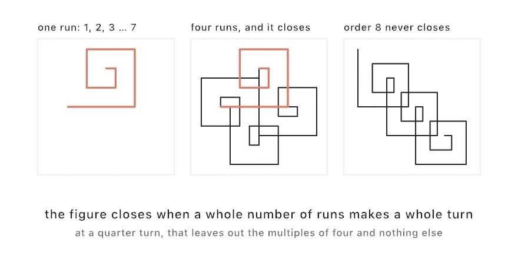
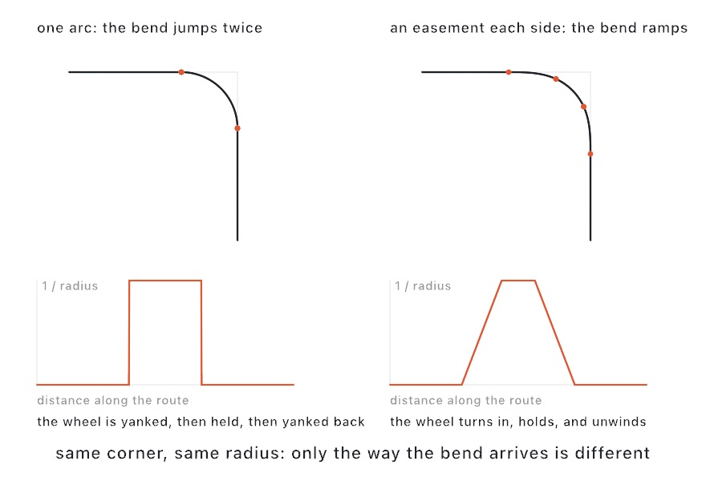
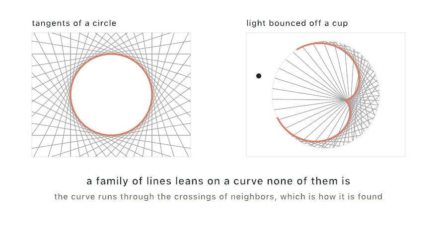
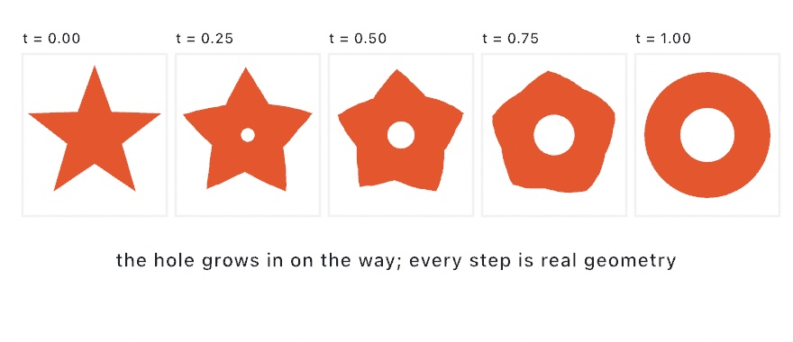
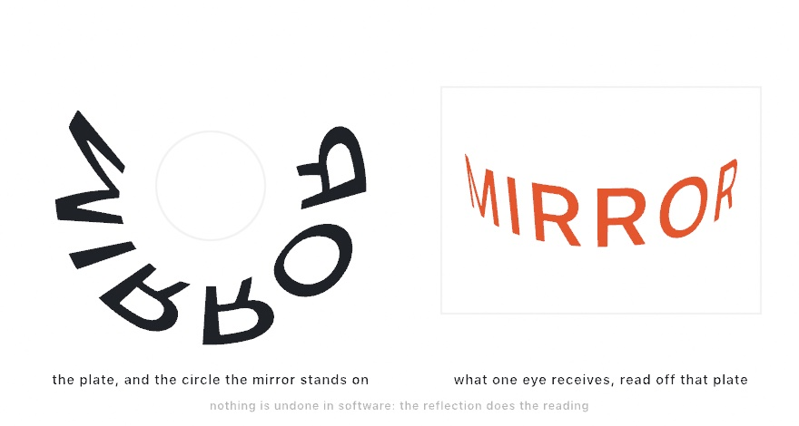

#### <sup>[Ollin](../README.md) → [Guide](README.md) → Chapter 16</sup>

---

# 16. Curves and figures



Some figures come from a rule instead of a hand, like the Lissajous figure two sine waves weave. Ollin has rules like that as calls, from Hobby's spline through your own points to spirolaterals and corners eased like a road's. The engraving above holds a guilloche rosette with a spirograph in its eye, a knot in each corner, and a ribbon on Hobby's spline. Envelopes, epicycles, morphs, and a drawing that reads only in a mirror come after it.

## A curve that reads as drawn: Hobby's spline

[Chapter 15](15-ShapesAsMaterial.md#contours-shapes-and-holes) drew the vein of its leaf with `drawCurve`. That call threads a smooth curve through the points you give it, and it decides the curve one point at a time. At each point it takes a direction from the two neighbors, and that is all it knows. Space the points evenly and the result looks fine. Put two points close together and a third far away, and the curve swells at the near pair and runs flat across the gap. The middle panel below shows it.

<picture>
  <source media="(prefers-color-scheme: dark)" srcset="Images/16-CurvesAndFigures/HobbyFit-dark.jpg">
  
</picture>

The right panel is the same six dots under a different fit. `spline: .hobby` solves every direction at once, so the bend arriving at a point matches the bend leaving it. This is John Hobby's spline, from his 1986 paper. It is the curve Donald Knuth's METAFONT draws through the points of a letter. It is close to what a practiced hand draws through a few dots. Four dots on a circle come out as that circle.

```swift
drawCurve(dots, spline: .hobby)                       // the natural fit
drawCurve(dots, spline: .hobby(tension: 2))           // pulled toward the straight lines
drawCurve(dots, closed: true, spline: .hobby)         // a loop you can fill
```

Two settings shape the fit. `tension` pulls the curve toward the straight lines between the points. A tension of 1 is the natural fit, and 2 hugs the lines. `curl` says how the ends of an open curve bend. A curl of 1 gives an end the same bend as its neighbor, and 0 lets it run straight out. When you want the Béziers themselves, `HobbySpline(through:)` is the typed form. Its `segments` are the cubic curves the fit chose, control points included, and its `path` is the same curve as a `Path`.

## Curves you can write down: the classic curves

Hobby's spline needs your points first. Some outlines need no points at all, because somebody found their formula, and the formula is shorter than the drawing. The nine panels below show the ones that come with Ollin. Eight come with a formula, and the ninth is a smoothing you can apply to any outline. Each is a plain function of its numbers, so the same call always draws the same curve.

<picture>
  <source media="(prefers-color-scheme: dark)" srcset="Images/16-CurvesAndFigures/ClassicCurves-dark.jpg">
  
</picture>

```swift
phyllotaxis(count: 520, spacing: 7)                   // [Vector2]
lissajous(a: 3, b: 2, width: 200)                     // Contour
rose(n: 5, radius: 100)
hypotrochoid(ring: 84, wheel: 33, pen: 26)
superellipse(width: 200, n: 4)                        // the squircle
supershape(radius: 100, m: 7)
guilloche(rings: 36, innerRadius: 90, outerRadius: 320,
          bumps: 8, amplitude: 24)                    // [Contour], one per ring
guilloche(rings: 36, innerRadius: 90, outerRadius: 320,
          rosettes: [Rosette(bumps: 8, amplitude: 24),
                     Rosette(bumps: 40, amplitude: 4)]) // two cams stacked
Harmonograph(x: [.init(frequency: 3)],
             y: [.init(frequency: 2.02)]).contour(duration: 60)
```

**Phyllotaxis** is how a sunflower packs its seeds, in Helmut Vogel's 1979 model of the flower head. Seed number `i` sits `i` golden angles around the center and `spacing * sqrt(i)` out from it. That one rule fills the disk evenly at any count. The golden angle, about 137.5 degrees, is the fraction of a turn that never lines back up with itself. So no seed lands behind an earlier one. Nudge the angle by a few hundredths of a degree and the seeds fall into spokes.

**Lissajous figures** are what two sine waves make when one drives the horizontal and the other the vertical. A point swings side to side `a` times while it bobs up and down `b` times. The ratio of `a` to `b` decides the figure. Jules Antoine Lissajous studied them in 1857, and Nathaniel Bowditch had drawn them earlier. **Roses** come from one polar equation, `r = radius * cos(n * theta)`. Here `theta` is the angle around the center, and `r` is how far out the curve sits at that angle. Guido Grandi named them rhodonea in the 1720s for their resemblance to flowers. An odd `n` gives `n` petals, and an even `n` gives `2n`.

**Hypotrochoids and epitrochoids** are the curves of the spirograph toy. A wheel rolls around a ring, inside for the first and outside for the second. A pen sits in a hole `pen` units from the wheel's center. Whole numbers for the two gears guarantee that the pen comes back to where it started. Ollin samples the number of laps that closes the curve once, so nothing is drawn twice.

**Superellipses** put every shape between a diamond and a rectangle on one exponent, `n`. `n: 2` is the ellipse, `n: 4` the squircle of app icons, `n: 1` the diamond, and lower values pinch into a four-point star. Animate `n` and a mark breathes between round and square. The `Shapes/Superellipse` example sweeps a wall of them. Gabriel Lamé wrote the curve down in 1818, and the designer Piet Hein made it famous in the 1950s. The **supershape** takes the idea further. One formula with a lobe count `m` and three shaping numbers covers stars, flowers, gears, and rounded blobs. It is Johan Gielis's superformula, from 2003, and the same formula is behind the 3D `Mesh.supershape`. Keep `m` a whole number, since the curve closes in one turn only then. The `Shapes/Supershape` example morphs one through its family.

**Guilloche** is the engraved ornament on watch faces and banknotes, and a lathe called a rose engine cut it. The lathe's cams rocked the cutter while the plate turned, one wavy ring per pass, with the plate turned a little between passes. `guilloche` returns those rings as a list of contours. The nudge between passes is the `twist:` parameter, and it is what braids neighboring rings into the woven pattern. A `Rosette` is one cam, its `bumps` and `amplitude`, and the `rosettes:` form of the call stacks several. Stack a coarse one and a fine one and the ripple follows the wave. The `Patterns/Guilloche` example lets the braid crawl.

**Harmonographs** were Victorian drawing machines: pendulums swinging under a pen, drawing while they slowly died away. Ollin's takes a list of pendulums per axis, each with its own amplitude, frequency, phase, and damping. Frequencies that nearly match are where the good tangles come from.

The last panel shows a smoothing rather than a formula. `smoothed(iterations:)` is George Chaikin's corner cutting, from 1974. Each pass replaces every corner with two points partway along its edges. Two or three passes turn a rough polygon into a soft curve. Open contours keep their exact endpoints, so a line still starts and ends where you put it.

One habit applies to all of them. The curves come back in their own coordinates, and the way to fit one to your canvas is `fitted(points, in: rect)`, which scales the points. `scale()` would scale your stroke width along with the geometry, which is rarely what you want on a drawing made of lines.

## A walk that comes home: spirolaterals

The curves above each have a formula. A spirolateral has a rule instead, and the rule is short enough to say out loud. Step one length, turn a quarter turn, step two lengths, turn again, and keep going up to some number. Then start the run over.

```swift
let figure = spirolateral(order: 7, step: 26)
drawPolyline(fitted(figure.points, in: bounds.inset(by: .all(60))), closed: figure.closes)
```

<picture>
  <source media="(prefers-color-scheme: dark)" srcset="Images/16-CurvesAndFigures/Spirolaterals-dark.jpg">
  
</picture>

Frank Odds named the spirolateral in 1973. It sometimes comes home and sometimes does not, and you can tell which before you draw a line. Follow one run of order seven and you turn seven times, which leaves you facing a quarter turn from where you started. So the second run is the first one turned a quarter turn, and the third is turned a half. After four runs you have gone all the way around and closed the ring. That is the middle panel, with the first run left in orange inside it.

Now try an order of eight. Eight quarter turns is two full turns, so the run ends facing the way it set off. Every repeat leaves in the same direction as the last, and the walk marches off the page. At a quarter turn, the orders that never close are the multiples of four, and no others. `closes` tells you whether a figure closes, and `closingRepeats` says how many runs it takes. `center` is the point the figure turns about, which is `nil` when there is none.

One warning before you animate it. The turn has to be an exact fraction of a full turn. Sweep it smoothly from a quarter to a third and almost nothing in between closes. Animate the order instead. Or hand `reversed:` a set of step numbers whose turns go the other way, which changes both the figure and the count.

## A corner a car could take: clothoids

Chaikin's corner cutting rounds a corner, and for most drawings that is all the rounding they need. A road engineer asks a second question of a rounded corner: whether the turning is smooth. For an arc it is not. An arc is a smooth outline, and it is also a corner where the bend arrives all at once. Along the straight you are not turning at all. One step later you are turning at `1 / radius`, and nothing happened in between.

<picture>
  <source media="(prefers-color-scheme: dark)" srcset="Images/16-CurvesAndFigures/ClothoidCorner-dark.jpg">
  
</picture>

The **clothoid** is the curve that answers the second question. It is written as a turn rate rather than as a position. Face a direction, and turn a little more sharply with every step you take. Its bend is then a straight ramp in the distance traveled, which is the ramp the left-hand graph is missing. Leonhard Euler described the curve in 1744, and Arthur Talbot brought it into railway practice in 1890 as the transition curve.

```swift
let route = clothoidCorners(waypoints, radius: 90, easement: 70)
drawPolyline(route.contour().points)
```

Every corner becomes three pieces: a clothoid bending in, an arc, and a clothoid bending back out. `easement` is how much travel the bend is given to arrive over. Shrink it toward zero and the corner collapses back to the plain arc, which is what the left panel shows. At zero itself the call hands the sharp corners back.

This is how roads, railways, and roller coasters are laid out. It matters again to anything that physically follows your drawing. A pen plotter, a laser, or a cutting head has to slow down for a direction that changes all at once. An eased corner gives it nothing to slow down for.

Two more things come from the same curve. `clothoidSpline(through:)` fits one clothoid to each gap in a list of points, so the path goes through every point and never kinks at one. And a chain of clothoids reads as a single path measured by length, which is what makes it drivable:

```swift
let along = (time * 260).truncatingRemainder(dividingBy: route.length)
if let here = route.point(at: along),           // where you are
   let facing = route.heading(at: along),       // which way you face
   let bend = route.curvature(at: along) {      // where the wheel is
    // draw the vehicle at `here`, turned to `facing`
}
```

> **Swift note.** `truncatingRemainder` is the `%` of [Chapter 1](01-HelloOllin.md) for a `Double`. It is what wraps `along` back to zero at the end of the route. An `if let` can bind several optionals at once, separated by commas. Its body runs only when every one of them has a value.

The three reads are optional because an empty chain has nothing to read. A distance past the end reads the end, and `along` wraps on `route.length` anyway, so one `if let` over the three reads covers it. Steady time in gives steady ground covered. Read `curvature(at:)` while you drive and you are holding the steering wheel, which is the graph above seen from the driver's seat.

Drawn whole, the curve is the Cornu spiral, two arms winding into two eyes they never reach, because the bend keeps growing. `eulerSpiral(size: 700, turns: 2.5)` returns it as points.

## Putting it together: the engraving

The engraving is a plate in two inks, laid out like a banknote, and every line on it comes from a rule. It composes the four steps above. The rosette at its center is `guilloche` with two cams, and a spirograph from `hypotrochoid` turns in its eye. A spirolateral of order seven holds each corner as a square knot. The frame is a rectangle whose corners `clothoidCorners` eases in, drawn twice. Under the rosette, a ribbon of six lines fans apart in the middle and draws closer at the ends. Hobby's spline threads each line through its own six dots. Make `MySketches/Engraving.swift`:

```swift
import Ollin

final class Engraving: Sketch {
    let paper = Color(hex: 0xF2ECDD)
    let green = Color(hex: 0x1F4A3C)
    let red = Color(hex: 0xA3402B)
    let middle = Vector2(540, 470)

    var frames: [[Vector2]] = []
    var knots: [[Vector2]] = []
    var eye: [Vector2] = []

    override func setup() {
        // Two frames, their corners eased in the way a road takes a turn.
        frames = []
        for (inset, radius) in [(60.0, 70.0), (78.0, 52.0)] {
            let edge = bounds.inset(by: .all(inset))
            let corners = [edge.topLeft, edge.topRight, edge.bottomRight, edge.bottomLeft]
            let route = clothoidCorners(corners, radius: radius, easement: radius * 0.8,
                                        closed: true)
            frames.append(route.contour(closed: true).points)
        }

        // A square knot of seven steps in each corner.
        let walk = spirolateral(order: 7).points
        knots = [Vector2(160, 160), Vector2(920, 160),
                 Vector2(160, 920), Vector2(920, 920)].map { spot in
            fitted(walk, in: Rectangle(center: spot, width: 116, height: 116))
        }

        // The spirograph for the rosette's eye, scaled to sit inside it.
        eye = hypotrochoid(ring: 84, wheel: 33, pen: 26).points.map { $0 * 0.93 }
    }

    override func draw() {
        background(paper)
        noFill()

        stroke(green)
        strokeWeight(2.4)
        drawPolyline(frames[0], closed: true)
        strokeWeight(1.2)
        drawPolyline(frames[1], closed: true)

        stroke(red)
        strokeWeight(1.8)
        for knot in knots { drawPolyline(knot, closed: true) }

        // The rosette: a coarse cam and a fine one, the braid crawling slowly.
        let rings = guilloche(rings: 40, innerRadius: 105, outerRadius: 300,
                              rosettes: [Rosette(bumps: 12, amplitude: 16, phase: time * 0.1),
                                         Rosette(bumps: 48, amplitude: 2.5)],
                              twist: .pi / 90 + sin(time * 0.2) * 0.01)
        stroke(green)
        strokeWeight(1)
        withState(at: middle) {
            for ring in rings { drawPolyline(ring.points, closed: true) }
        }

        stroke(red)
        strokeWeight(1.2)
        withState(at: middle, rotation: time * 0.05) {
            drawPolyline(eye, closed: true)
        }

        // The ribbon: six lines through the same six dots, spread apart in
        // the middle and drawn together at the ends.
        stroke(green)
        strokeWeight(1.3)
        let xs: [Double] = [250, 360, 470, 610, 730, 830]
        let ys: [Double] = [905, 872, 900, 878, 912, 886]
        for line in 0..<6 {
            let dots = xs.indices.map { i -> Vector2 in
                let along = Double(i) / Double(xs.count - 1)
                let spread = (Double(line) - 2.5) * 7 * (0.35 + 0.65 * sin(.pi * along))
                let wave = sin(time * 0.8 + Double(i) * 1.1) * 6
                return Vector2(xs[i], ys[i] + spread + wave)
            }
            drawCurve(dots, spline: .hobby)
        }
    }
}
```

> **Swift note.** `withState(at:)` is [Chapter 6](06-GridsAndRepetition.md#moving-the-paper-translate-rotate-and-scale)'s `withState` with a `translate` to that point built in. `rotation:` adds a `rotate`. `edge.topLeft` and its three siblings are a rectangle's corners as points. `for (inset, radius) in [(60.0, 70.0), (78.0, 52.0)]` loops over pairs written in place, the way [Chapter 13](13-GrowingThings.md) looped over the ends of a segment. `let xs: [Double] = [250, 360, …]` names the list's type. So its whole numbers are read as `Double` without a decimal on any of them.

The work splits the way [Chapter 15](15-ShapesAsMaterial.md#putting-it-together-the-plate)'s plate split it. Everything that holds still is built once in `setup()`: the two frames, the four knots, and the eye. The rosette is rebuilt every frame, because two of its numbers follow `time`. The coarse cam's `phase` carries its wave around the dial, and the `twist` swells and eases back. So the braid crawls while every ring stays one closed curve. The eye's points never change, so turning it takes only a `rotation:` on `withState`.

The ribbon is where Hobby's spline does its work. Its dots bob on a sine each frame, and the fit bends evenly through them wherever they land. At six dots a line, refitting every frame costs very little.

Nothing here reads `random` or `noise`, so the sketch needs no seed. The same frame always draws the same plate.

Then make it yours:

- Put a third cam under the other two. `Rosette(bumps: 3, amplitude: 30)` pushes every ring toward a rounded triangle, and the braid follows it around.
- Hang a harmonograph in the eye in place of the spirograph. Build a `Harmonograph` in `setup()` with frequencies that nearly match, and fit its `contour(duration: 60).points` into `Rectangle(center: .zero, width: 150, height: 150)`. It turns the way the spirograph did.
- Change the knots. An order of 6 comes home in two runs rather than four, so each corner holds a figure with two-fold symmetry.

An engraving is line work, so keep it as line work. `swift run OllinLive MySketches/Engraving.swift --export-svg engraving.svg --frame 600` writes the plate as it is ten seconds in. Each ink is its own stroke color in the file. A two-pen plot is then the green lines, a pen change, and the red. [Chapter 15](15-ShapesAsMaterial.md#how-a-plot-runs) walks through the plotter's side of that, and its one-file-per-pen parameter works here too.

## More figures from a rule: envelopes, epicycles, morphs, and anamorphosis

The engraving used a spline, two of the formula curves, a walk, and an eased corner. Four more figures come from a rule the same way, and the plate uses none of them. A family of straight lines can trace a curve they only touch, which is how light draws the bright curve in a cup. Any closed outline can be rebuilt from circles spinning on circles. One shape can become another over a number between 0 and 1. And a drawing can be built so that only a mirror standing on it reads it. Each comes back as the same geometry as the rest of the chapter, so it strokes, fills, and plots the same way.

### The curve a family of lines leans on: envelopes and caustics

An **envelope** is the curve a family of lines leans on. Take the tangent lines of a circle, as on the left below. No line is the circle, and every line touches it once. Ask where each line crosses the next, and those crossings trace the circle. That crossing-your-neighbor construction is the method. It is for drawing a curve out of the straight lines that touch it, the look of string art and of light. The idea is classical differential geometry.

<picture>
  <source media="(prefers-color-scheme: dark)" srcset="Images/16-CurvesAndFigures/RaysLeanOnACurve-dark.jpg">
  
</picture>

```swift
let rays = (0..<40).map { i -> Ray2 in
    let a = Double(i) / 40 * 2 * .pi                    // around the circle
    let spot = Vector2(cos(a), sin(a)) * 200           // a point on it
    return Ray2(origin: spot, direction: Vector2(-sin(a), cos(a)))
}
for run in envelope(of: rays) { drawPolyline(run.points) }
```

Each line is a `Ray2`, a start point and a direction. The tangent at a point on a circle runs at a right angle to the spoke that reaches it. That is what the direction above says. `envelope(of:)` hands back the curve as contours, one per unbroken run.

The right-hand panel is the same idea applied to light. Light crosses a cup, bounces off the far wall, and the bounced rays crowd along a bright curve. That curve is their envelope, and it is called a **caustic**. It is the bright curve in the bottom of a mug in sunlight.

```swift
let rays = reflectedRays(off: wall, from: .point(lamp))
drawCaustic(off: wall, from: .point(lamp))
```

`.point(lamp)` is the light, a `LightSource` that is either a point or a parallel beam from a direction. `reflectedRays` bounces it off the wall's points and hands back the rays, and `drawCaustic` draws their envelope in one call.

Two answers tell you whether your picture came out right. A circle lit from far away draws a **nephroid**, with two cusps, reaching from half the radius out to the mirror. A circle lit from a point on its own rim draws a **cardioid**, with one. The caustics of a circle were worked out in the seventeenth century, with Ehrenfried Walther von Tschirnhaus and Christiaan Huygens among the names attached. A source at the center gives no curve at all, since every ray comes straight back.

One trap makes a picture look broken rather than wrong. Hand in only the stretch of wall the light reaches. A whole circle has two families of bounces, the near side and the far side, and they lean on different curves. Filtering a ring down to the lit part also has to keep it unbroken. If the lit stretch wraps around the end of your array, the two ends land next to each other. The lines between them are then not rays.

`refractedRays` does the same job for light bending into glass instead of bouncing off it. A ray that meets the surface too steeply is left out rather than faked, which is total internal reflection.

The same idea with circles instead of lines says where a wave gets to next. Every point of a wavefront sends out a small wave of its own. A moment later, the front is the curve those wavelets lean on. That is Huygens' construction, from his 1690 treatise on light, and `huygensFront(from:advancing:)` is it.

```swift
for step in stride(from: 30.0, through: 400, by: 30) {
    for run in huygensFront(from: shore, advancing: -step) { drawPolyline(run.points) }
}
```

The result differs from moving every point sideways. Where the front curves back on itself, the sideways move folds over. The folded piece then lies inside its neighbors' wavelets rather than on the front. Those pieces are dropped, so the front tears and comes to a sharp point. That point is a focus, and it appears when the front has traveled the radius the curve bends at. The `Patterns/Wavefront` example sends a wave off a headland and lets it happen.

### Circles on circles: Fourier epicycles

Where an envelope built a curve out of lines, epicycles build one out of circles. Any closed outline, however irregular, is a sum of circles. Each spins at a whole-number rate, centered on the tip of the one before it. That is Fourier's idea applied to a drawing. It is for rebuilding an outline as a machine you can watch, or for simplifying one while keeping it smooth. The construction goes back through Fourier to the Greek astronomers, who used circles turning on circles to explain the wandering of the planets. Ollin does the decomposition for you.

<picture>
  <source media="(prefers-color-scheme: dark)" srcset="Images/16-CurvesAndFigures/EpicycleTerms-dark.jpg">
  
</picture>

```swift
let chain = Epicycles(outline, samples: 512)
drawPolygon(chain.path(samples: 600, terms: 64).points)   // the reconstruction
drawEpicycles(chain, at: phase, terms: 64)                // the construction itself
```

`terms` is the dial, and it takes the largest circles first. That ordering is what makes the figure above work. Three circles already give the outline's rough shape, because the big circles were always doing most of the work, and the rest add detail. At the full term count the reconstruction is exact.

There are two ways to use it. `path(samples:terms:)` hands you the traced outline as geometry, so an outline rebuilt from too few terms is a smooth simplification of it. `point(at:terms:)` gives one position, which is what you animate. `drawEpicycles` draws the nest of circles and spokes at a moment, so the machine is visible. The `Motion/Epicycles` example traces a whale that way, with the pen leaving a fading trail.

### One shape becoming another: shape morphing

A **morph** takes two shapes and a number between 0 and 1 and gives the shape that far along from one to the other. It is for animating one outline into another, a star into a ring or a letter into a blob. Every in-between is geometry you can fill and stroke. Ollin's follows the usual practical recipe. Give both outlines the same number of points, turn them the same way round, and start each where the trip is shortest. Noah Veltman's flubber library was studied for it, and pairing holes with holes is Ollin's own.

<picture>
  <source media="(prefers-color-scheme: dark)" srcset="Images/16-CurvesAndFigures/MorphSteps-dark.jpg">
  
</picture>

```swift
var morph: ShapeMorph?

override func setup() {
    morph = ShapeMorph(from: star, to: ring)
}

override func draw() {
    if let morph { drawShape(morph.shape(at: pingPong(over: 4))) }
}
```

Build it once and keep it. Working out which part of the first shape corresponds to which part of the second is the expensive step. Doing it in `setup()` makes every frame afterward cheap. At `0` and `1` you get your original shapes back, unchanged.

The holes are the part to watch. When the two shapes have different numbers of contours, a contour without a partner grows out of its own center or shrinks into it. That is why the ring's hole opens from nothing in the middle instead of flying in from off-screen. Timing lives outside the morph, so pass it an eased phase, a `pingPong` for there-and-back, or a `Timeline`'s progress. For a one-off blend with no state to keep, `star.morphed(toward: ring, 0.5)` gives you the single shape.

### A drawing only a mirror can read: anamorphosis

A mirror **anamorphosis** is a drawing built to be read in a curved mirror standing on it. Wrap a picture around a mirrored cylinder on your page. Then work out where each point must be drawn for the reflection to put it back where you wrapped it. What lands on the page reads as a smear. Stand the cylinder on its circle, put your eye where the map was told it would be, and the picture stands upright on the glass. It is for a printed plate with a mirror on it, an object rather than a screen. Renaissance workshops ruled the construction out by hand, and Jean-Francois Niceron wrote it down in 1638.

<picture>
  <source media="(prefers-color-scheme: dark)" srcset="Images/16-CurvesAndFigures/MirrorReads-dark.jpg">
  
</picture>

The software bends the drawing and never unbends it. The plate is an ordinary drawing, and the reflection does the reading.

```swift
let mirror = Anamorphosis(
    center: Vector2(540, 480), radius: 130,      // where the cylinder stands
    eye: Vector3(540, 910, 250),                 // and where you will be
    picture: Rectangle(center: Vector2(540, 480), width: 280, height: 70),
    lift: 40
)
let plate = mirror.plate(of: emblem)             // an ordinary Shape in, an ordinary Shape out
drawShape(plate)
drawCircle(mirror.footprint)                     // the circle to stand it on
```

`eye` is a `Vector3`, a point with a third number for height, because the height matters as much as the distance. The rule behind every mark is one ray run backwards: from the eye to the glass, bounce, and follow the bounce down to the page.

Two things follow from that, and both show on any finished plate. The marks land on the near side, between the glass and you, so you read the plate by looking over it at the mirror. And they spread as they go out. A point higher up the picture is reached by a shallower bounce, and a shallower bounce travels farther before it meets the page.

There is a limit, and it is better met before you compose than after. Two tangent lines run from your eye to the cylinder, and everything past them is turned away. So the picture has an arc it must live inside. `mirror.widestPicture` is that arc in your own units, and `mirror.fits` is the yes or no. Standing closer takes some of it away. That is the trade: the nearer the viewer, the less of the mirror they can use.

`plate(of:)` takes a point, a `Contour`, or a `Shape`. The map bends straight lines, so a contour is walked at an even spacing first, and the extra points carry the bend. What comes back is ordinary geometry, so a plate prints. A mirrored tube standing on the printed circle is all the apparatus you need.

## Where this comes from

Hobby's spline is John Hobby's, from a 1986 paper, and it is the curve Donald Knuth's METAFONT draws through its points.

The named curves each carry a person with them. Lissajous figures are Jules Antoine Lissajous's, from 1857, though Nathaniel Bowditch drew them first. Roses are Guido Grandi's rhodonea, named in the 1720s for their resemblance to flowers. The superellipse is Gabriel Lamé's, from 1818, and the designer Piet Hein made it famous in the 1950s. The supershape is Johan Gielis's superformula, from 2003.

The trochoids are the mathematics behind the Spirograph toy. Guilloche is the work of the rose engine, a lathe whose cams rocked the cutter as the plate turned. The harmonograph was a Victorian instrument, a pen hung from swinging pendulums. The sunflower packing is Helmut Vogel's 1979 model, and corner cutting is George Chaikin's, from 1974.

Spirolaterals were named and studied by Frank Odds in 1973, and Harold Abelson and Andrea diSessa set them as a turtle-geometry exercise in 1981.

The clothoid was described by Leonhard Euler in 1744, and rediscovered by Augustin-Jean Fresnel, whose integrals give its shape. Arthur Talbot brought it into railway practice in 1890. The fit that joins two points and two headings follows Enrico Bertolazzi and Marco Frego's 2015 reduction.

The envelope, the epicycles, the morph, and the anamorphosis name their sources where they are taught, after the engraving.

Full credits are in the project's [attribution notes](../ATTRIBUTION.md).

## Go deeper

- [Hobby's spline](../Docs/Drawing/Geometry.md#hobby): the typed `HobbySpline`, the Béziers it chooses, and what `tension` and `curl` do. The [`Examples/Shapes/HobbySpline`](../Examples/Shapes/HobbySpline/Sketch.swift) example sets the fit beside the default curve, open and closed.
- [Classic curves](../Docs/Drawing/Curves.md): every parameter of all nine, including what closes each curve once. The [`Examples/Patterns/Guilloche`](../Examples/Patterns/Guilloche/Sketch.swift) example lets a rosette's braid crawl, and [`Examples/Shapes/Superellipse`](../Examples/Shapes/Superellipse/Sketch.swift) sweeps a wall of plates from a pinched star to a near-rectangle.
- [Envelopes and caustics](../Docs/Drawing/Envelopes.md): `envelope` and the `Ray2` it works on, reflected and bent rays, and the two caustics of a circle to recognize. The [`Examples/Patterns/Wavefront`](../Examples/Patterns/Wavefront/Sketch.swift) example sends a wave off a headland until its front folds to a point.
- [Clothoid](../Docs/Drawing/Clothoid.md): the four numbers, the easement, the single curve that fits two points and two headings, corner rounding, and driving a chain by distance. The [`Examples/Patterns/Clothoid`](../Examples/Patterns/Clothoid/Sketch.swift) example draws a route's bend as a comb along its outside.
- [Fourier epicycles](../Docs/Drawing/Epicycles.md): the `Term` list, the joint and path readers, and resampling requirements. The [`Examples/Motion/Epicycles`](../Examples/Motion/Epicycles/Sketch.swift) example traces a whale with them.
- [Shape morphing](../Docs/Drawing/Morphing.md): the correspondence rules, `spacing`, and `Tweenable` geometry inside a `Timeline`. The [`Examples/Motion/Morphing`](../Examples/Motion/Morphing/Sketch.swift) example loops a star through a blob and a donut.
- [Anamorphosis](../Docs/Drawing/Anamorphosis.md): the setup, the map for points, contours and shapes, what an eye can see of a cylinder, reading a plate back, and standing a real mirror on a printed one. The [`Examples/Patterns/Anamorphosis`](../Examples/Patterns/Anamorphosis/Sketch.swift) example spells a word around one and shows what the eye receives.

---

[Contents](README.md#contents) · Previous: [Chapter 15, Shapes as material](15-ShapesAsMaterial.md) · Next: [Chapter 17, Marks and media](17-MarksAndMedia.md)
