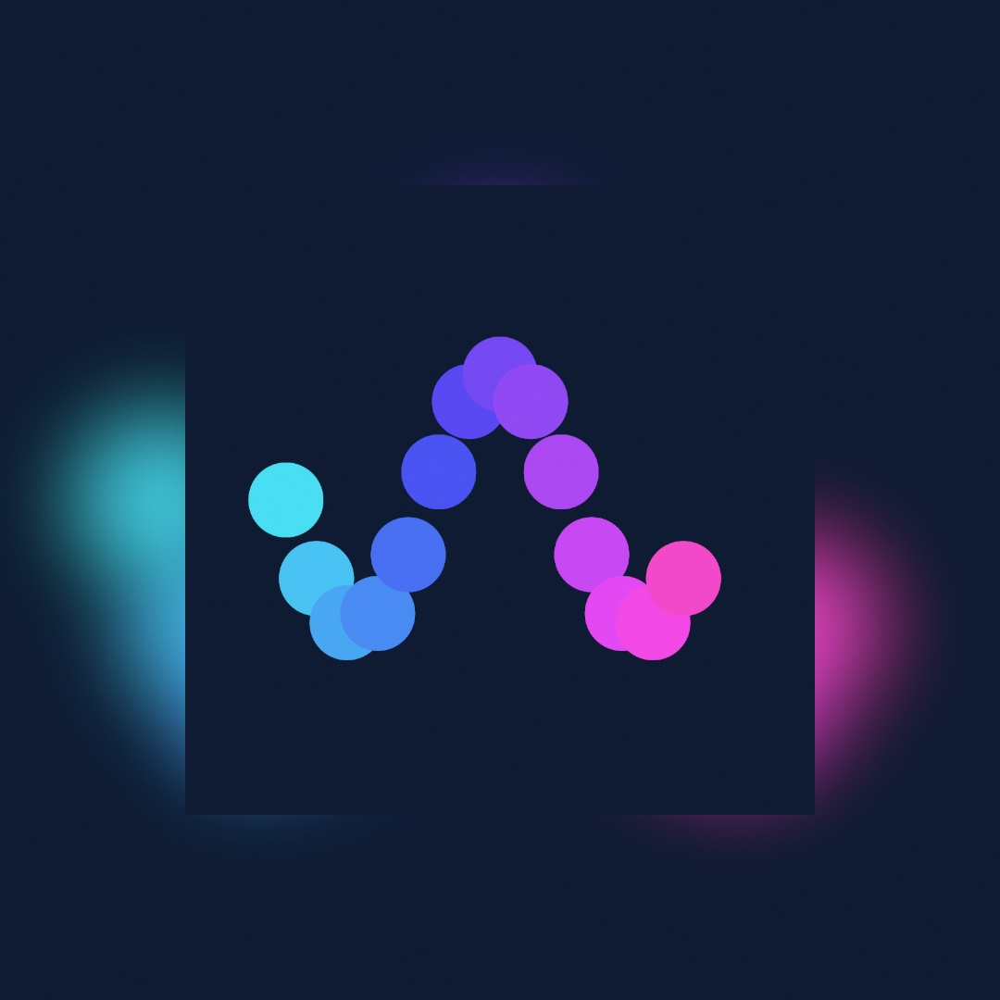
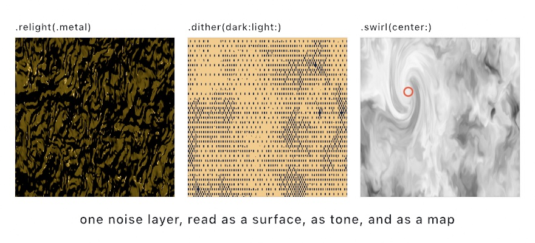
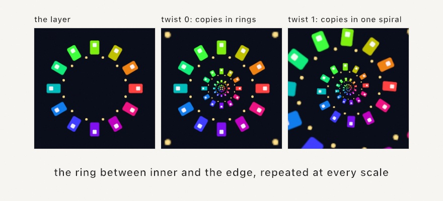
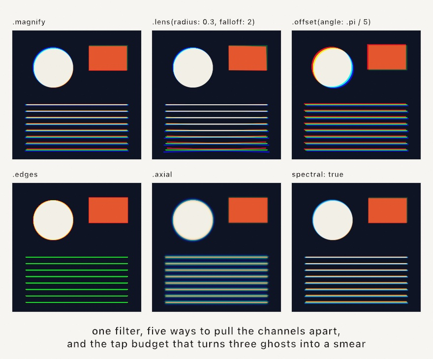
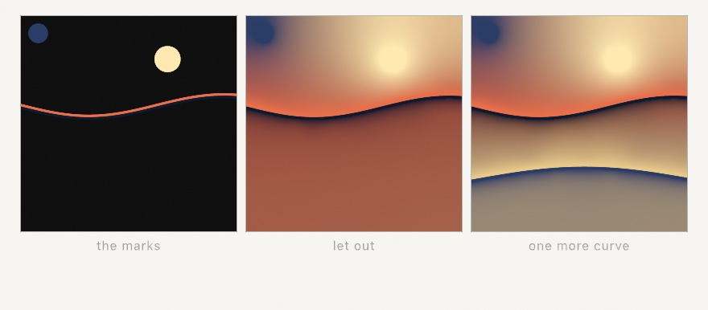
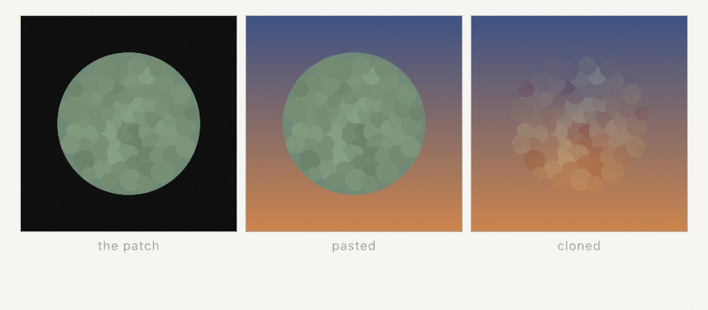
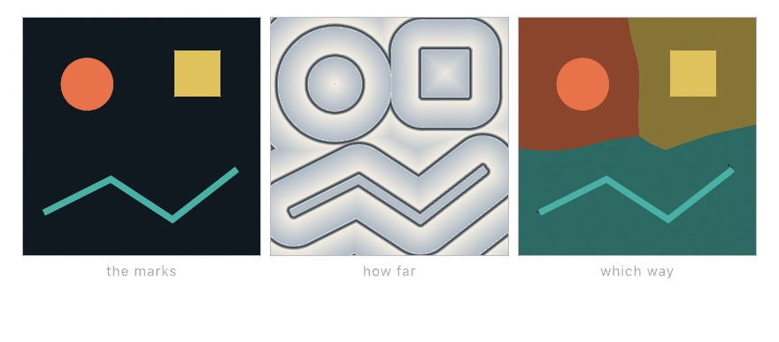
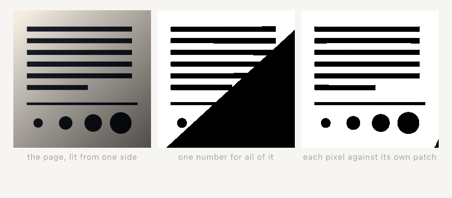
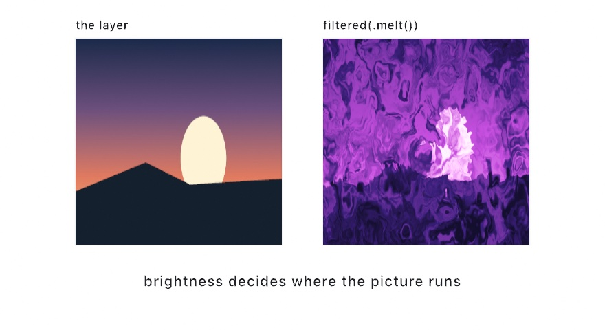
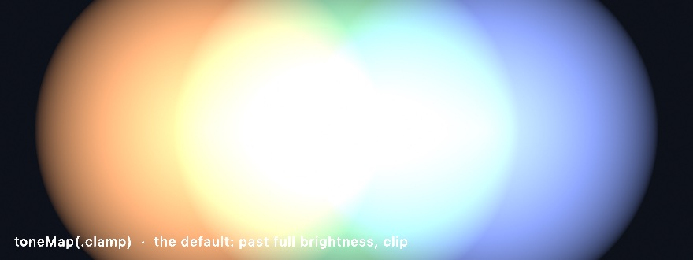

#### <sup>[Ollin](../README.md) → [Guide](README.md) → Chapter 16</sup>

---

# 16. Layers and effects


Every sketch so far has drawn onto one surface. This chapter adds more of them, off-screen layers you can hold, blur, glow, feed back into themselves, and stack like sheets of film. By the end, [Chapter 12](12-FlocksAndSwarms.md)'s flock comes back rebuilt out of light. Along the way the canvas learns three tricks a single surface can't do. It remembers, it accumulates, and it goes brighter than the screen.

## A drawing you can hold

A layer is a second canvas that lives off screen. You make one, aim your drawing at it, and nothing appears, because the drawing is *held*, waiting for you to decide what happens to it. Make `MySketches/FirstLayer.swift`:

```swift
import Ollin

final class FirstLayer: Sketch {
    override func draw() {
        background(.black)

        let art = renderTarget()
        withTarget(art) {
            background(Color(hex: 0x0E1B33))
            noStroke()
            for i in 0 ..< 14 {
                let t = Double(i) / 14
                fill(Color(hue: 0.52 + t * 0.38, saturation: 0.7, brightness: 0.95))
                drawCircle(width * (0.16 + 0.68 * t),
                           height * 0.5 + sin(t * .tau * 1.5) * height * 0.2, 64)
            }
        }

        drawImage(art.filtered(.gaussianBlur(radius: 45)).image, 0, 0)   // soft, everywhere
        drawImage(art.image, in: bounds.inset(by: .all(200)))            // sharp, in front
    }
}
```



Three calls carry the whole idea. `renderTarget()` makes the layer. `withTarget(art) { }` redirects everything drawn inside the block into it, the way `withState { }` scopes a transform, and a `background(_:)` inside clears just the layer. Then `art.image` hands the finished layer back as an image for [Chapter 8](08-Words.md)'s `drawImage`. The same drawing can now appear twice, once blurred across the whole canvas and once sharp in a card floating over its own ghost. One drawing, two appearances. That's the move everything else in this chapter builds on.

Two habits worth forming now. A `renderTarget()` is per-frame scaffolding, so make it fresh inside `draw()` rather than storing it. And a layer that isn't composited never shows up, because `withTarget` records the drawing and `drawImage` is what puts it on screen.

Here's the same idea as a picture, one thumbnail per stage:


## Filters

That `.filtered(.gaussianBlur(radius: 45))` in the first listing was a **filter**. A filter reads a layer and hands back a new, transformed layer, with the original untouched. Filters run on the GPU, so they cost almost nothing you'd notice, and they chain:

```swift
let moody = art.filtered(.posterize(levels: 5)).filtered(.vignette())
```

Ollin ships fifty-some of them, grouped into families. The families are blur and glow, color and tone, stylize, retro, and the warps that bend an image's coordinates. Here is one scene through a sample, one tile per family:


The one to meet properly is **bloom**, because it's the chapter's workhorse. `.bloom(threshold:intensity:radius:)` finds the parts of the image brighter than `threshold`, blurs them, and adds the blur back. Bright marks then bleed light into their surroundings the way a streetlight bleeds into fog. It's the difference between a white dot and a *glowing* dot, and you'll reach for it constantly.

A few notes for the road. Filters are values you pass around, so a `[Filter]` array or a `@Param`-driven choice works the way you'd hope. `postProcess(.bloom())` applies a filter to the whole finished frame with no layer needed. That is the quick way to glow everything.

## Filters that read the layer as something else

Most filters treat your layer as a picture and adjust it. A few instead treat the same pixels as *information about something else*. Those are worth meeting individually, because what you feed them matters more than the knobs.



```swift
layer.filtered(.relight(.metal, angle: -.pi * 0.7, elevation: 0.55))
layer.filtered(.dither(dark: navy, light: sand, pixelSize: 3))
layer.filtered(.swirl(angle: 4.2, radius: 0.42, center: Vector2(0.3, 0.34)))
```

**`.relight` reads brightness as height.** It treats a bright pixel as a high point and a dark one as a low point. It then works out which way the resulting surface faces and lights it from an angle you choose. Hand it a photograph and you get an odd embossed thing. Hand it a noise field, as the first panel does, and you get hammered metal. Noise makes a plausible bumpy surface. Five finishes change how the material responds, from `.matte` through `.metal` and `.glass` to `.sand` and `.liquid`. [Chapter 19](19-GridSimulations.md)'s ripple pool uses it to turn a height field into water.

**`.dither(dark:light:)` reads brightness as tone.** It screens the layer into exactly two colors of your choosing. Each pixel comes from a repeating pattern, the way [Chapter 2](02-Color.md)'s ordered dither did. Gradients survive as texture rather than collapsing into two flat regions. `pixelSize` makes the grain coarser, which is how you get the look of cheap newsprint or an early screen in any two colors you like.

**The warp filters read a center.** `.swirl`, `.bulge`, `.ripple`, and their relatives all distort around the middle of the layer by default. Each takes a `center` given in `0...1` layer coordinates. That one argument is what turns a symmetric effect into a composition, and feeding it `uv(of: mouse)` puts the distortion under the pointer. The marked circle in the third panel is the center that swirl was given.

The [effects reference](../Docs/Drawing/Effects.md#filter) has the full catalog with every knob, and the `Effects/Relight` example shows all five finishes side by side.

## A picture inside itself

One warp deserves a section of its own, because it does something none of the others do. It makes the picture contain itself.



```swift
layer.filtered(.droste(inner: 0.42, twist: 1, zoom: time * 0.2))
```

The idea is easier than the picture looks. Take the ring between `inner` and the edge of the layer, and imagine straightening it into a strip, the way you would cut a rubber band and pull it flat. A strip can be repeated end to end forever. Curl the repeated strip back into a ring and each copy comes out smaller than the last. That is a picture with a smaller copy of itself in the middle, and a smaller copy in the middle of that one.

`inner` is the radius of the hole, and it is also how much smaller each copy is than the one around it. `twist` is the part Escher used. At 0 the copies sit in plain concentric rings. At 1, going once around the middle also steps you one copy down in size. The rings wind into a single spiral, and there is no longer any place where one copy ends and the next starts.

`zoom` slides the picture into itself, counted in copies. Add exactly 1 and you are back where you began, which makes this the rare animation that loops with nothing to hide. `zoom: time * 0.2` falls forever and repeats every five seconds.

One thing to design for. The filter reads a ring, and the outer edge of that ring has to meet the inner edge of the next copy along. If your content runs to both edges, the join shows up as a hard circle. Keep the content clear of both, or let the ring end on flat color at each end. The layer in the figure does the second thing: plain dark ground inside and outside, windows only in between.

## One filter, five pictures: chromatic aberration

Most filters have a strength knob. Chromatic aberration has a strength knob and a **mode**, and the modes are not one look at five strengths. They are five different pictures.

The idea underneath is always the same. Pull the color channels apart a little, so a white edge grows a colored rim. What the mode decides is *where* they get pulled.



```swift
layer.filtered(.chromaticAberration(amount: 0.018))                        // the default
layer.filtered(.chromaticAberration(amount: 0.05, mode: .lens(radius: 0.3, falloff: 2)))
layer.filtered(.chromaticAberration(amount: 0.012, mode: .offset(angle: .pi / 5)))
layer.filtered(.chromaticAberration(amount: 0.03, mode: .edges))
layer.filtered(.chromaticAberration(amount: 0.022, mode: .axial))
layer.filtered(.chromaticAberration(amount: 0.018, spectral: true))
```

**`.magnify` is the default, and it scales each channel about the middle of the frame.** The middle does not split at all, and the split grows the further out you go. Straight lines stay straight. This is the honest form of what a lens does, and it is the one to reach for first.

**`.lens(radius:falloff:)` shapes that growth.** `radius` says how far out the fringe starts to show, and `falloff` says how fast it grows past there. About 2 reads like glass. In the second panel nothing happens near the middle at all, and the bottom of the frame comes apart.

**`.offset(angle:)` moves every pixel by the same vector.** The middle splits as much as the corner, which no lens on earth does. That is the point: this is a plate printed a hair off, an anaglyph, a scan that slipped.

**`.edges` puts the fringe only where there is an edge.** It slides along the local brightness gradient and scales by how strong that gradient is, so flat areas keep their exact color. Real fringing is only visible at high-contrast edges. Putting it there and nowhere else is what stops it reading as a filter laid over the picture. The thin lines go green because a three-pixel line is all edge. Red slides off one side, blue off the other, and green is what stays.

**`.axial` changes focus instead of position.** One end of the spectrum stays sharp while the other softens, which is most of the look of a fast lens wide open. A positive amount keeps red sharp, and a negative one keeps blue sharp. That sign is the difference between a highlight going green and going magenta, and it is worth trying both.

Two more things worth knowing. Every mode hands the layer straight back at `amount: 0`, so an A/B costs nothing and the knob never lies to you. And `spectral: true` takes the split over a whole set of wavelengths instead of three. That is the difference between the last panel and the first: three hard ghosts become one continuous smear. It costs more taps, and `quality:` sets how many.

There is a two-layer version too. `.dispersed(by:)` in a `compose` block, or `Combine.disperse` on its own, scales the amount by a second layer's brightness. Draw white where you want the color to come apart and black everywhere else, and the fringe lands only there.

## Layers from nowhere

A layer doesn't have to start from your drawing. `generate(_:)` fills one with a procedural pattern, and the result is an ordinary layer you can filter and composite:

```swift
let sky = generate(.meshGradient(colors: [Color(hex: 0xE4572E), Color(hex: 0x2B6C8C),
                                          Color(hex: 0xE8B44A), Color(hex: 0x7C3B5E)],
                                 phase: 5.1))
drawImage(sky.filtered(.paperTexture()).image, 0, 0)
```


Three lines, and the canvas is a printed poster. It is a mesh gradient of soft color blobs melting into each other, laid onto a synthesized sheet of paper, crumples and all.

## A picture made of a few marks: diffusion

Every filter so far took a picture and did something to it. This one makes the picture.

Draw a few marks into a layer. `.diffuse` holds each drawn pixel as a color source and lets the color out into the empty space between them until it settles:

```swift
let marks = renderTarget()
withTarget(marks) {
    drawDiffusionCurve(horizon, left: Color(hex: 0xE86F4A), right: Color(hex: 0x101A2E))
    noStroke(); fill(Color(hex: 0xFFE9B0))
    drawCircle(width * 0.7, height * 0.2, 26)
}
drawImage(marks.filtered(.diffuse()).image, 0, 0)
```



The rule the solve follows is worth knowing, because everything the picture does follows from it. **Away from the marks, every pixel ends up the average of its four neighbors.** That is the rule a soap film obeys when you dip a bent wire in it. Nothing overshoots, no color appears that was not put there, and a mark's influence falls away smoothly in every direction at once.

`drawDiffusionCurve` is the form the technique is named for. It draws the same path twice, a hair apart, with a different color on each side. The field jumps across the curve and stays smooth everywhere else. Left and right are named from walking the path in the order its points come, so reversing the points swaps the colors.

Now compare it to a gradient, which is the tool you would otherwise reach for. A gradient needs a direction and two ends. This needs neither. The shape of the field is decided by where you put the marks. That is why the third panel remakes the whole lower half of the picture with one added curve. You are not filling a shape with a ramp. You are placing a few colors and letting the space between them work itself out.

Two practical notes. A pixel counts as a source when its alpha reaches `threshold`. A half-opaque mark pulls half as hard as a solid one, so a soft brush mark is a suggestion rather than a rule. And `sharpness` decides how much of the work happens at full size. Turn it down for speed while composing, up when a thin mark's color must stay crisp against it.

## Putting a piece of one picture into another

The same settling does a second job, and it is worth meeting here because the trick behind it is the same one.

You have a patch you want to drop into a picture: a slab of texture, a cut-out, something from elsewhere. Paste it and it reads as pasted. The rim gives it away, and so does the color, because the patch was lit differently wherever it came from.

`.seamlessClone` fixes both without touching the patch's detail:

```swift
let backdrop = renderTarget()
withTarget(backdrop) { drawImage(wall, 0, 0) }

let patch = renderTarget()
withTarget(patch) { drawImage(stones, 240, 180) }   // transparent everywhere else

drawImage(backdrop.combined(with: patch, .seamlessClone()).image, 0, 0)
```



Where the patch layer is opaque is where it lands, so the shape you draw is the shape that gets cloned. Draw it where you want it and that is the whole positioning story.

Here is what it does, in one sentence, because everything else follows from it. **Around the rim it measures how far the patch's color sits from the backdrop's. It spreads that difference across the inside as smoothly as it can, and adds it back.** On the rim that lands exactly on the backdrop, so there is no join left to see. Inside, the patch is nudged by the gentlest correction that reaches it. The stones survive because only the slow, low part of the color is replaced.

Spreading a difference as smoothly as possible is the diffusion above, wearing a different hat. The marks are the rim, and the field between them is the correction.

Two things follow, and both are worth meeting here rather than by surprise. The patch keeps its own **range of tone** and only moves where that range sits. Drop a contrasty patch somewhere much darker than itself and its shadows go below black. And the rim is where the entire answer comes from, so a rim laid across a **hard edge** drags that edge inward. Keep the rim on quiet ground and neither one comes up.

`amount` runs from 0 to 1. One is the full clone. Zero leaves the seam in, which is the picture you want beside it when you are deciding whether it worked.

## A field you measure: how far is the nearest edge

The two sections above both did the same trick from different sides. They treated the layer as something to be *solved* rather than something to be looked at. This one goes further and treats it as something to be *measured*.

Draw your marks into a layer. Then ask every pixel in it a question: how far away is the nearest edge of anything drawn, and which way is it?

```swift
let field = marks.filtered(.distanceField())
```



That layer is no longer a picture. Its red channel holds the distance in pixels, running negative inside a shape and positive outside it, and its green and blue hold the direction to that nearest edge. **A picture of a thing, turned into the measurement of where that thing is.**

The two answers fit together into one line worth remembering:

```
    nearest edge  =  pixel + direction * abs(distance)
```

`.fieldMap` reads the field back as something you can see, by running the distance through a color ramp over a window you give in pixels. The middle panel above is one call:

```swift
field.filtered(.fieldMap(bands, from: 0, to: 34, repeating: true))
```

`repeating` wraps the ramp instead of stretching it, so the same colors come around every 34 pixels and the marks wear contour lines like a map. Look at where two shapes meet in that panel: their rings run into each other and stop along a crease. That crease is every place equally far from both, and you did not have to work it out.

Change the window and the same call does other jobs. A ramp that turns over at one distance grows the shape by exactly that much, and shrinks it at a negative one:

```swift
field.filtered(.fieldMap(Ramp([ink, .clear]), from: 26, to: 27.5))
```

That is a dilate. Blobs that were separate merge as they grow into each other, which is how you get a soft mass out of scattered marks. A ramp that is dark in a narrow band draws an outline at any offset you like, inside or outside.

The third panel is the direction channel doing its work. Each pixel walks to its nearest edge, steps a little past it, and brings back the color it finds:

```metal
float4 shade(float2 uv, ShaderInfo info) {
    float4 field = sampleRaw(info, uv);
    float2 here = uv * info.resolution;
    float2 inside = here + field.gb * (abs(field.r) + 4.0 * sign(field.r));
    return sampleAux(info, inside / info.resolution);
}
```

Every pixel ends up wearing the color of whichever mark is nearest to it. That is a Voronoi diagram, built out of the shapes themselves rather than out of a list of points, and it costs one lookup per pixel. Run it with `field.combined(with: marks, .shader(...))`.

Note `sampleRaw` rather than the `sample` you met in the filters above. The ordinary read hands a layer over as a color, and a distance in pixels is not one. `sampleRaw` gives you the stored numbers untouched.

One practical note. Measuring the whole canvas costs a few milliseconds, because the measurement works outward in steps and needs one step per doubling of the distance it carries. When you only care about a band near the marks, say so and it gets shorter:

```swift
marks.filtered(.distanceField(maxDistance: 64))
```

Past that distance the field reads flat, with a zero direction, which is its way of saying nothing is within reach.

## Averages of a neighborhood, at a flat price

The section above asked every pixel how far away something was. Here is a different question, and a cheaper answer than you would expect. **What does the neighborhood around this pixel look like?**

The obvious way to answer costs more the wider you look. A 5-pixel square is 25 reads, a 500-pixel square is 250,000, and a blur that reaches across the canvas is out of the question. There is another way, and it turns the cost into a flat fee.

Build one table first. Every texel in it holds the sum of everything above and to the left of it. Then the sum over *any* rectangle is a bit of arithmetic on four corners of that table:

```
      A ─────────── B          the shaded box
      │             │            =  D − B − C + A
      │      ┌──────┤
      │      │//////│          four lookups, wherever the box is
      C ─────┼──────D          and however big it is
             │//////│
```

That table is a **summed-area table**, and once you have one, two useful filters cost almost nothing.

The first is a blur:

```swift
layer.filtered(.boxBlur(radius: 4))     // these two
layer.filtered(.boxBlur(radius: 400))   // cost the same
```

It is the plainest blur there is, just the average of the square around each pixel, and it is not as good-looking as `gaussianBlur`. Reach for it when the reach is large. Reach for it too when the radius changes while the sketch runs, and you do not want the frame rate changing with it. Three of them in a row look near enough Gaussian that you will stop being able to tell, and that is still three fixed-price passes.

The second one is the interesting one.



The left panel is a page with a light falling across it. Try to cut it to black and white with `threshold` and you have to pick one number, and there is no number that works. Pick one that keeps the shadowed corner and you flood the lit one. Pick one that keeps the lit corner and the shadow goes solid black, which is the middle panel.

`adaptiveThreshold` compares each pixel with the average of its own surroundings instead:

```swift
page.filtered(.adaptiveThreshold())
```

That is the right panel. Every mark survives, in shadow and in light alike. **Hard contrast is local, and uneven light is not, so comparing locally keeps the first and throws away the second.**

The knob that matters is `window`, how wide that neighborhood is in pixels. It wants to be big enough to hold both ink and paper. Set it smaller than your marks and the middle of a thick stroke sees nothing but more stroke. It decides that must be what paper looks like here, and comes out hollow. Since widening it is free, err wide. Left alone it is an eighth of the layer.

There is one more knob, `bias`, which is how far below the local average a pixel has to fall before it goes dark. It is a *fraction* rather than a fixed amount, and that is not fussiness. Light falling on a page multiplies what comes back off it. Only a test that scales along with the average is unmoved when somebody turns the lamp down.

Two costs, and neither one grows with the window. Building the table is about twenty passes over the layer, a few milliseconds for a full canvas. One of these in a frame is comfortable. A dozen are not. And the running totals get large, which eats into a float's precision and leaves a small error behind. That error is a fixed amount divided by the size of your window, so it fades away as the window grows. It only shows up at tiny radii, which is where you would reach for a Gaussian anyway.

## The design family

Two lines of that listing came from a set worth knowing as a set. Alongside the plain generators (checkers, noise, gradients) there's a **design** family. It is built to look like the finished graphics you'd meet on a product page rather than like test patterns. It comes in two halves, generators that invent a picture and filters that transform one, and they behave differently enough to meet separately.

### The design generators

The generator half is `.meshGradient`, `.filaments`, `.smokeRing`, `.colorPanels`, `.spiral`, `.waves`, `.dotOrbit`, `.grainGradient`, `.pulsingBorder`, and `.godRays`. Each comes with defaults that already look composed, so `generate(.godRays())` is a usable backdrop with nothing configured. Each also takes colors plus a handful of knobs when you want it to be yours. There's a third group, the pattern fields, with a more mathematical flavor. [Chapter 17](17-YourFirstShader.md) picks those up, because by then you'll be able to read how they work.

Nearly all of them take a **`phase`**, and that is the one detail to remember. They have no clock of their own, so nothing moves until you feed it one.

```swift
generate(.gyroid(phase: time * 0.4))     // animated
generate(.gyroid())                      // a still, and the same still every run
```

That's deliberate rather than an oversight. Because the motion is a number you pass, a frame export is reproducible. You can also drive a pattern from audio, a slider, or a scroll position as easily as from `time`.

### The design filters

The filters' design set splits into two rows that work in opposite directions:


The bottom row is what you'd expect from a filter. Hand it a picture, and get the picture back changed. `.flutedGlass` puts ribbed glass in front of it, `.water` refracts it through ripples, `.paperTexture` lays it onto a sheet with tooth and creases.

The top row works the other way, and this is the part that isn't obvious from the names. `.liquidMetal`, `.heatmap`, and `.gemSmoke` mostly ignore your layer's colors and read its **alpha**, the silhouette. All three tiles above started as one white heart on a transparent layer, and each filter built a whole material out of that outline. So the working method for these is simple. Draw a shape into a layer, then filter the layer.

```swift
let shape = renderTarget()
withTarget(shape) {
    noStroke(); fill(.white)
    drawHeart(width / 2, height / 2, width * 0.5)
}
drawImage(shape.filtered(.liquidMetal(phase: time)).image, 0, 0)
```

Any silhouette works, which is the interesting part. It can be text from [Chapter 8](08-Words.md), a shape you built in [Chapter 15](15-ShapesAsMaterial.md), or a tracked hand from [Chapter 30](30-Seeing.md). The filter never knows or cares where the outline came from.

One practical warning, since it cost the figure above a few attempts. These filters are tuned for **full-canvas** use. On a small layer the defaults can look like almost nothing. Push them hard and the distortion reaches past the layer's edge, and drags the transparent surround in as dark smears. The `edges` knob on the distorting ones controls how close to the border they're allowed to work. A continuous field takes a strong refraction more gracefully than a pattern of separate marks does.

The `Effects/DesignPatterns` and `Effects/DesignFilters` examples tour both sets in full.

### melt: the picture poured

One of the design filters deserves singling out, because it does something the others don't. `.melt` liquifies a layer by its own brightness.



```swift
drawImage(scene.filtered(.melt(phase: time)).image, 0, 0)
```

Underneath, the filter builds a swirling noise field and uses one displacement vector for two jobs at once. That vector warps the field's own coordinates, and it also shifts where the filter reads your layer. Because the same vector does both, the picture and the swirl move together instead of one sliding over the other. The result reads as the image having been *dyed* rather than just smeared. The layer's brightness mixes back into the field before it goes through a color ramp, so bright regions stay bright and structural. The sun in the figure is still recognizably the sun.

It is a strong effect at its defaults, and `liquify`, `warp`, and `blend` dial back how far it takes the picture. The sway that animates it uses frequencies that don't divide evenly into each other, so it never perfectly repeats. It drifts forever, but it won't give you a seamless loop.

## How new paint meets old

So far every mark has simply covered what was under it. `blendMode(_:)` changes the arithmetic of that meeting, and it's ordinary drawing state like `fill`, saved by `withState { }`, applying to shapes and composited layers alike:


The one that changes how you think is `.add`. It sums colors the way light sums, so two faint marks make a brighter one and a thousand make a glow. Because Ollin blends color as physical amounts of light, the sum behaves like real lamps overlapping. Against a dark background, additive drawing stops reading as paint and starts reading as luminance. `.multiply` is the opposite temperament, stacking color like layered ink or gels, at home on light backgrounds. The rest are variations on lighter and darker, and the figure is the honest catalog.

Here's the pairing to remember. Bloom output composited with `blendMode(.add)` reads as added light instead of a covering sticker. The finished piece uses exactly that.

## The whole stack in one block

By now a frame might go like this. Draw a backdrop layer, blur it, draw a lights layer, bloom it, then composite one normally and one additively. You can wire that by hand, or declare it as one `compose { }` block where each `layer { }` carries its own filters and blend mode:

```swift
import Ollin

final class ComposeStack: Sketch {
    override func draw() {
        background(Color(hex: 0x080B12))
        compose {
            layer {                                   // beneath: a soft color field
                noStroke()
                fill(Color(hex: 0x2C3A8C)); drawCircle(width * 0.35, height * 0.4, 330)
                fill(Color(hex: 0x1F7A6B)); drawCircle(width * 0.68, height * 0.62, 300)
                fill(Color(hex: 0x6B2C58)); drawCircle(width * 0.45, height * 0.78, 240)
            }
            .post(.gaussianBlur(radius: 60))
            .scale(0.5)

            layer {                                   // on top: lights that glow
                noStroke()
                for i in 0 ..< 15 {
                    let a = Double(i) / 15 * .tau
                    fill(Color(hue: 0.08 + Double(i) * 0.014, saturation: 0.5, brightness: 1))
                    drawCircle(width / 2 + cos(a) * 300, height / 2 + sin(a) * 300, 10)
                }
                stroke(Color(hex: 0xFFD98A)); strokeWeight(3); noFill()
                drawCircle(width / 2, height / 2, 300)
            }
            .post(.bloom(threshold: 0.4, intensity: 1.8, radius: 26))
            .blend(.add)
        }
    }
}
```


Layers composite bottom to top in the order written. `.post(_:)` filters a layer, `.blend(_:)` sets its mode, and `.scale(0.5)` renders it at half resolution. That is free money for a layer a blur will soften anyway. It's pure shorthand, since everything `compose` does, the calls you already know can do by hand. When an effect needs *two* layers, a mask or a displacement map, the same block takes an `aside { }`. That is a helper layer drawn only to feed another one. That's a rabbit hole for another day, and the [effects reference](../Docs/Drawing/Effects.md#aside) goes all the way down.

## The canvas that keeps everything

[Chapter 12](12-FlocksAndSwarms.md) sneaked a preview of this: `noClear()` stops the canvas from being wiped between frames, and from then on drawing *piles up*. Pair it with `.add` and faint marks become deposits of light, arriving frame after frame, the long-exposure photograph as a drawing style. Make `MySketches/Sandpainting.swift`:

```swift
import Ollin

final class Sandpainting: Sketch {
    var grains: [Vector2] = []

    override func setup() {
        seed(6)
        background(Color(hex: 0x05070C))
        noClear()
        toneMap(.aces, exposure: 1.5)
    }

    override func draw() {
        if grains.isEmpty {
            grains = (0 ..< 2600).map { _ in Vector2(random(width), random(height)) }
        }
        let field = curlField(scale: 0.0021)
        grains = field.advected(grains, stepLength: 2.4)

        blendMode(.add)
        noStroke()
        for (i, grain) in grains.enumerated() {
            if !bounds.contains(grain) {
                grains[i] = Vector2(random(width), random(height))
                continue
            }
            let warm = Double(i % 5) / 5
            fill(Color(hue: 0.06 + warm * 0.07, saturation: 0.75, brightness: 1, alpha: 0.045))
            drawCircle(center: grain, radius: 1.6)
        }
    }
}
```


Each frame draws only 2,600 dots at 4% opacity, barely visible alone. Six hundred frames later the canvas holds more than a million deposits. The curl field's eddies emerge as rivers of light, advecting grains exactly as [Chapter 14](14-FieldsAndFlow.md) advected walkers. Nothing here is drawn as a line. The lines are simply where light kept landing.

Two practical notes. While accumulating, `background(_:)` becomes the reset, so call it on the frame you want to wipe, or never. And a perfectly still additive scene just brightens toward white forever, so keep something moving. The glow finds its level when light flows across the canvas instead of parking.

## Brighter than the screen: toneMap

That `toneMap(.aces, exposure: 1.5)` line needs its own moment, because it solves a problem you now have. Additive light doesn't stop at "full brightness", because three overlapping lamps sum to three times what the screen can show. Ollin composites every frame in a high-precision format that keeps those too-bright values. `toneMap(_:)` decides what happens when the frame finally meets the screen. The default rounds every too-bright value to white, which is honest and abrupt:




Same lamps, same brightness, one line different. `.aces` runs the frame through the S-shaped response of film. It rolls highlights off gradually instead of chopping them, and keeps color alive inside the glare. Set it once in `setup()`, and `exposure` is the brightness dial applied before the curve, like a camera's. For any glow, accumulation, or additive piece, `toneMap(.aces)` is the difference between light and chalk. The details live in the [HDR reference](../Docs/Drawing/HDR.md).

## Genuinely brighter: HDR output

Tone-mapping is what you do when the screen cannot go any higher. Sometimes it can.

A modern Apple display holds two things back from an ordinary sketch. It can show colors more saturated than sRGB describes, and it can, for a while, make small areas genuinely brighter than white. Both are switched on by one declared line:

```swift
final class Lamps: Sketch {
    override var colorOutput: ColorOutput { .extended }
}
```

Now the too-bright values stop being a problem to solve. A value of 2.0 is drawn twice as bright as white, and the caption beside it stays white while the lamp core glows. Leave `toneMap` alone here: `.aces` exists to squash those values back under 1.0, which is exactly what you no longer want.

The other half is the color. `Color` stays an sRGB type, and a color outside that gamut is named in the wider one:

```swift
fill(Color(displayP3: 1, green: 0, blue: 0))    // a red sRGB cannot make
```

Its stored components come out slightly outside 0…1, which is how a color says "further than sRGB goes". Nothing clamps it on the way through. On a `.standard` sketch it simply lands on the nearest sRGB red at the end, so naming one is always safe.

One honest limit. The brightness half depends on the display having headroom to spare at that moment. The system gives and takes it as screen brightness changes. Read `displayHeadroom` to see what you actually got, where 1.0 means none.

Getting it out of the window is a question of format. An exported PNG keeps the wide color but not the brightness, because PNG stops at white. Two formats do not. An `.extended` sketch's `--export-video` is written as HDR10 with no extra flags, and a still asked for by name keeps its highlights:

```sh
swift run --package-path Examples Example-Rendering-ColorOutput --export lamp.heic
# Ollin: exported frame 0 → lamp.heic (1080×1080, highlights to 2.70x white in a gain map)
```

The picture inside that file is the PNG, so anything at all can open it. Beside it sits a record of the light that was clipped away, called a gain map. A display with headroom puts it back.

You cannot see either one in this page's figures, which is the point. Run [`Examples/Rendering/ColorOutput`](../Examples/Rendering/ColorOutput/Sketch.swift) on a recent Mac laptop instead, and turn the screen brightness down while you watch.

## The canvas that remembers itself

Accumulation piles new marks onto a canvas that otherwise sits still. **Feedback** is stranger and livelier. Each frame you get last frame's *finished picture* back as an image. Transform it however you like, draw it into the new frame, and add this frame's marks on top. The transformed past becomes the new present, over and over. Point a camera at its own monitor and you've built one out of hardware. The fade-zoom-rotate you choose is the whole personality of the effect:


A `Feedback` layer is made once in `setup()` and kept, because its identity is what carries the picture from frame to frame:

```swift
var trail: Feedback?
override func setup() { trail = feedback() }
```

Then each frame runs the loop. It reads, transforms, redraws, and adds. This is the heart of the finished piece below:

```swift
withFeedback(trail) { prev in                 // prev = last frame, as an image
    withState {
        translate(width / 2, height / 2)      // zoom + turn the past, about the center
        scale(1.006)
        rotate(0.0025)
        translate(-width / 2, -height / 2)
        tint(Color(white: 1, alpha: 0.93))    // and fade it a little
        drawImage(prev, 0, 0)
        noTint()
    }
    // ...then draw this frame's new marks on top
}
drawImage(trail.image, 0, 0)                  // composite the result
```

The `tint` alpha is the decay. At 0.93 each pass keeps 93% of the past, so marks take dozens of frames to melt away. The tiny zoom and rotation mean the past doesn't just fade, it *drifts*, and moving things leave wakes that curve. How is this different from `noClear`? Accumulation adds to a fixed canvas, while feedback hands you the past as an image to warp first. The warp is the difference between a long exposure and a hall of mirrors.

## Putting it together: comets

[Chapter 12](12-FlocksAndSwarms.md) ended with a flock of triangles trailing fading paint. Here is the same society rebuilt with this chapter's whole toolkit. The boids draw as bright dots into a feedback layer, giving wakes that drift and curl. The layer comes back bloomed and added as light, and ACES rolls the hot cores off like film. For contrast, here is the before:


Make `MySketches/Comets.swift`:

```swift
import Ollin

final class Comets: Sketch {
    var flock: Boids?
    var trail: Feedback?

    override func setup() {
        toneMap(.aces, exposure: 1.3)
        trail = feedback()
    }

    override func draw() {
        background(Color(hex: 0x04060B))
        if flock == nil {
            flock = Boids(count: 430, in: bounds, seed: 11,
                          maxSpeed: 3.4 * scale, maxForce: 0.14 * scale,
                          perceptionRadius: 78 * scale, separationRadius: 24 * scale,
                          margin: 100 * scale)
        }
        guard let flock, let trail else { return }
        flock.step()

        withFeedback(trail) { prev in
            withState {
                translate(width / 2, height / 2)
                scale(1.006)
                rotate(0.0025)
                translate(-width / 2, -height / 2)
                tint(Color(white: 1, alpha: 0.93))
                drawImage(prev, 0, 0)
                noTint()
            }
            noStroke()
            for i in 0 ..< flock.count {
                let heading = flock.heading(i)
                fill(Color(hue: (heading + .pi) / .tau + 0.52,
                           saturation: 0.62, brightness: 1))
                drawCircle(center: flock.positions[i], radius: 3.6 * scale)
            }
        }

        blendMode(.add)
        drawImage(trail.filtered(.bloom(threshold: 0.25, intensity: 1.5, radius: 16)).image, 0, 0)
        blendMode(.normal)
    }
}
```


Read it as three acts. The flock is untouched [Chapter 12](12-FlocksAndSwarms.md), still steering by the same three rules. The middle act is the feedback loop from the last section. The boids are drawn inside it, so their light lands *in* the layer that remembers. And the final act is one line of compositing. The trail layer comes back bloomed, added as light, and rolled off by the tone map set back in `setup()`. Every hue still means a heading, and now it also smears into a wake that shows where the heading has been.

Then make it yours:

- Turn the feedback knobs. An `alpha: 0.85` gives short nervous tails, while `0.97` fills the sky with fog. Flipping `scale(1.006)` to `0.994` makes the wakes fall inward instead of blooming outward.
- Put a `@Param` on the bloom `intensity` and `exposure` and grade the piece live, like color-timing film.
- Swap the flock for anything that moves: [Chapter 14](14-FieldsAndFlow.md)'s advected particles, [Chapter 11](11-ForcesAndPhysics.md)'s bouncing bodies, or just your mouse.
- Add a second `compose` layer beneath with a dim `generate(.meshGradient(...))` and the comets fly over weather.

## Where this comes from

Off-screen layers are as old as computer graphics has had memory to spare. The shape they take here, layers plus a filter catalog plus explicit compositing, follows the model OPENRNDR refined for creative coding. The compositing arithmetic descends from Thomas Porter and Tom Duff's 1984 paper *Compositing Digital Images*. Image editors standardized the everyday blend-mode vocabulary of multiply, screen, and friends in the decades after. Tone mapping comes from photography by way of Erik Reinhard and colleagues' 2002 *Photographic Tone Reproduction for Digital Images*. The film-like curve Ollin uses is the Academy's ACES, in Krzysztof Narkowicz's widely used approximation. The picture inside itself is named after a Dutch cocoa tin from 1904, whose label showed a nurse holding a tray with the same tin on it. Escher took the idea somewhere stranger in *Print Gallery* (1956), where a man in a gallery looks at a picture that contains the gallery, and left a hole in the middle he signed rather than finished. Hendrik Lenstra and Bart de Smit worked out in 2003 what belonged in the hole, and the straighten-repeat-curl construction the filter runs is theirs. Video feedback is the analog ancestor of the `Feedback` layer. Point a camera at its own monitor, as Nam June Paik and the Vasulkas did in the 1960s and 70s. The transform is whatever the room does to the signal. Full credits are in the project's [attribution notes](../ATTRIBUTION.md).

## Go deeper

- [Layered effects](../Docs/Drawing/Effects.md): every filter, generator, combine op, and the full `compose` grammar.
- [Accumulation](../Docs/Drawing/Accumulation.md) and [HDR & tone-mapping](../Docs/Drawing/HDR.md): the persistent canvas and the float pipeline underneath it.
- [Wide gamut & HDR output](../Docs/Drawing/ColorOutput.md): `colorOutput`, colors outside sRGB, and what each export format carries.
- [Measured distance fields](../Docs/Drawing/DistanceFields.md): what the field holds, reading it back, and the jump flood underneath it.
- [Local averages](../Docs/Drawing/LocalAverages.md): the box blur, the adaptive threshold, choosing the window, and what the summed-area table costs.
- [Blend modes](../Docs/Drawing/Drawing.md#blendMode): the arithmetic of each mode.
- Appendix B draws this chapter's math, one picture per idea: [Shaping a value](B-JustEnoughMath.md#shaping-a-value), [Color and light as numbers](B-JustEnoughMath.md#color-and-light-as-numbers).
- Worked examples: [`Examples/Effects/Bloom`](../Examples/Effects/Bloom/Sketch.swift), [`Examples/Effects/Compose`](../Examples/Effects/Compose/Sketch.swift), [`Examples/Effects/Feedback`](../Examples/Effects/Feedback/Sketch.swift), [`Examples/Effects/Relight`](../Examples/Effects/Relight/Sketch.swift), [`Examples/Effects/DiffusionCurves`](../Examples/Effects/DiffusionCurves/Sketch.swift), [`Examples/Effects/DistanceField`](../Examples/Effects/DistanceField/Sketch.swift), [`Examples/Effects/Droste`](../Examples/Effects/Droste/Sketch.swift), [`Examples/Effects/SummedArea`](../Examples/Effects/SummedArea/Sketch.swift), [`Examples/Rendering/Accumulation`](../Examples/Rendering/Accumulation/Sketch.swift), and [`Examples/Rendering/ToneMapping`](../Examples/Rendering/ToneMapping/Sketch.swift).

---

[Contents](README.md#contents) · Previous: [Chapter 15, Shapes as material](15-ShapesAsMaterial.md) · Next: [Chapter 17, Your first shader](17-YourFirstShader.md)
