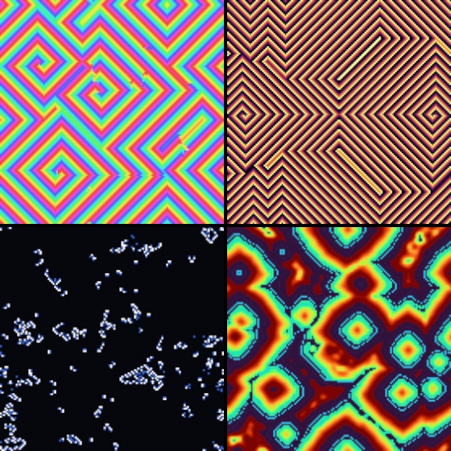
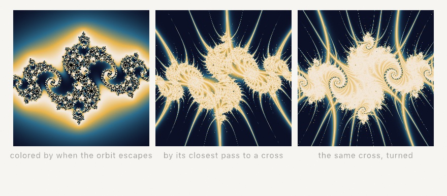
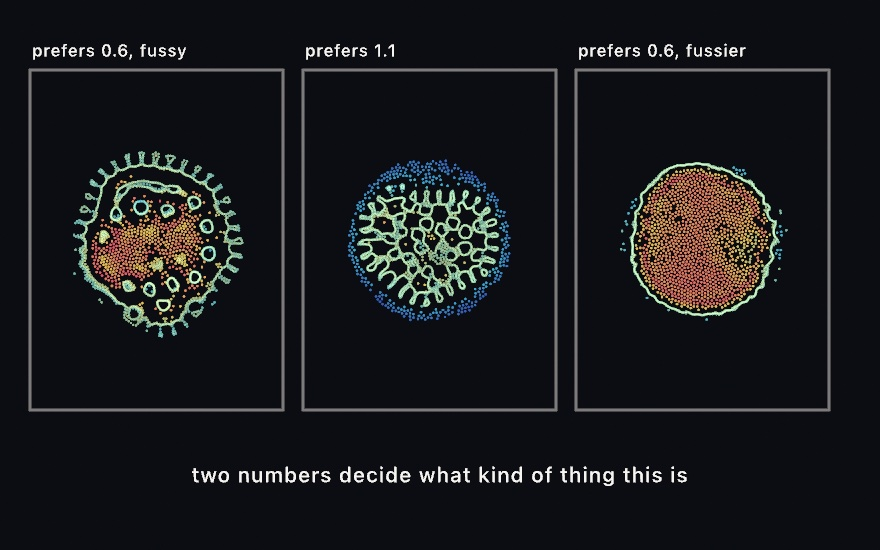
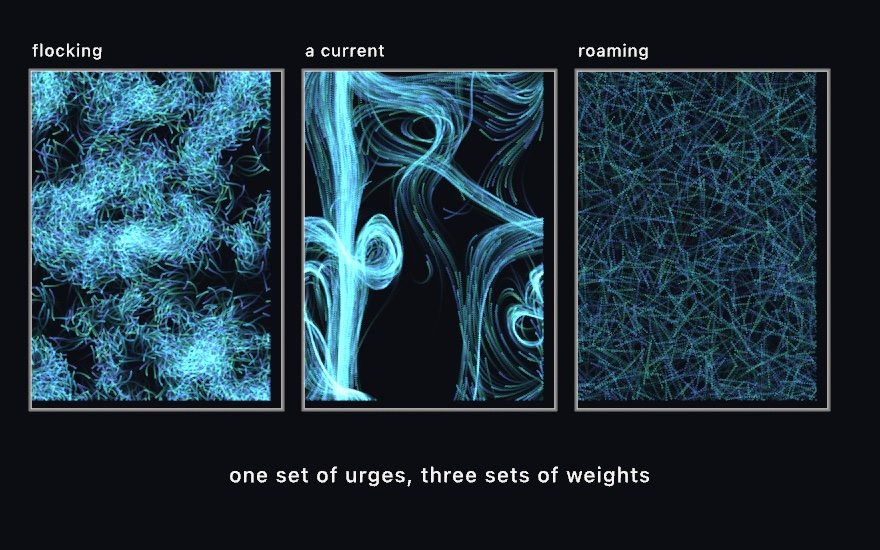
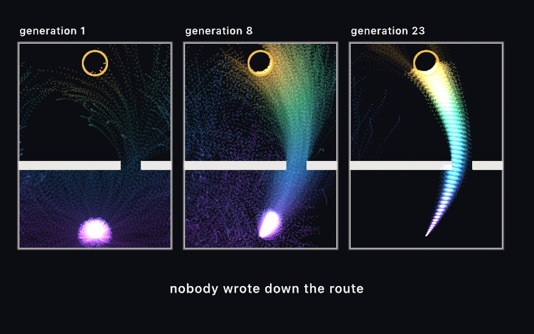
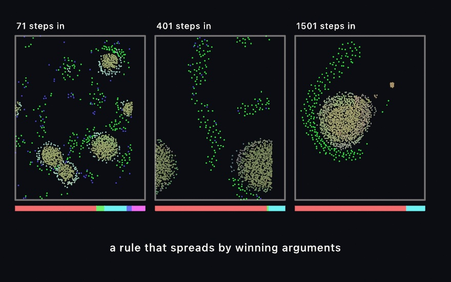

#### <sup>[Ollin](../README.md) → [Guide](README.md) → Chapter 16</sup>

---

# 16. Simulations


Nobody drew those corridors. They grew, over six hundred frames, from a scatter of dots and two chemical rules. Run the sketch, drag the mouse, and your marks would grow the same way. This chapter is about **simulations**, fields that carry their own state on the GPU and evolve it every frame by simple local rules. You bring the seed. The rules do the drawing.

## State that lives on the GPU

Chapter 14's feedback layer was the first taste, a picture fed its transformed self back in, frame after frame. A simulation field replaces "transform the whole picture" with something more local and more alive. Every cell of the field computes its next value *from its neighbors*, all at once, every frame. It's Chapter 15's per-pixel function, plus the one addition that changes everything. That addition is memory.

In Ollin that's a `SimField`. Like `Feedback`, it's persistent, so make it once and keep it. You never write the kernel for the built-in ones. Pick a `Sim`, draw into the field to seed it, and composite its `image`:

```swift
var life: SimField?
override func setup() { }                     // created on first draw, held forever

override func draw() {
    if life == nil { life = simField(.gameOfLife(), scale: 0.08) }
    guard let life else { return }
    withField(life) {
        if mouseIsPressed { fill(.white); drawCircle(mouseX, mouseY, 20) }
    }
    drawImage(life.image, 0, 0)
}
```

`withField` works like Chapter 14's `withTarget`, and what a drawn mark *means* depends on the simulation. For the Game of Life, white means alive.

## The Game of Life

Conway's Game of Life is the classic proof that simple local rules make worlds. Each cell of a grid is alive or dead, and one generation to the next it only ever asks about its eight neighbors:


That's the entire rulebook. No cell knows about the picture. There is no picture, as far as any cell is concerned. And yet seed a field with a random soup and structures appear. You get stable blocks, blinking pairs, and now and then a *glider* that walks off across the grid on its own:

```swift
withField(life) {
    noStroke()
    fill(.white)
    if frameCount == 1 {                       // a random soup, once
        for _ in 0 ..< 700 {
            drawCircle(width * 0.5 + random(-260, 260),
                       height * 0.5 + random(-260, 260), 7)
        }
    }
}
```


The `scale: 0.08` matters, because a sim field's `scale` sets its internal resolution. For a cellular automaton one texel is one cell, so a low scale gives cells you can see. For the other sims, a lower scale just means broader, cheaper features.

## More ways to be an automaton

The Game of Life is one rule on one grid, and the same recipe runs in several other shapes. Two of them are cheap enough to run on the CPU. They hand you plain arrays instead of a field, and you draw the result however you like.

**Wolfram's elementary rules** shrink the grid to a single row. Each cell looks only at itself and its two neighbors, so there are eight possible neighborhoods. A rule is nothing more than which of those eight leave a cell alive, and that packs into one number from 0 to 255. `elementaryCA` runs one and hands back a row per generation. Drawing time downward then turns a one-dimensional automaton into a two-dimensional picture:

```swift
let rows = elementaryCA(rule: 30, width: 161, generations: 161)
```


Rule 30, on the left, is the famous one, because a rule that small has no business producing something that irregular. Wolfram used its middle column as a source of random numbers for years. Rule 90 draws the Sierpinski triangle, and rule 110 turns out to be complicated enough to compute anything a computer can. `totalisticCA` is the same idea with more colors, where a cell reads the *sum* of its neighborhood rather than the exact pattern.

**A turmite** is an ant on a grid instead of a whole row of cells. It reads the color under it, writes a new one, turns, steps forward, and adopts a new state. That is the entire creature. Langton's ant, the classic, spends about ten thousand steps making an incoherent blot. Then, with no warning at all, it starts laying a perfectly regular diagonal highway and walks off along it forever. Nobody has a satisfying explanation for why. You hold one and step it, the way you held a `DifferentialGrowth` in Chapter 10:

```swift
let ant = Turmite(.langton, columns: 260, rows: 260)

// each frame:
ant.step(500)
for painted in ant.paintedCells { /* draw a cell */ }
```

**Lenia** goes the other way and makes the Game of Life *continuous*. Instead of cells that are alive or dead, every texel carries a smooth mass between 0 and 1. And instead of counting eight neighbors, each texel weighs a soft ring of neighborhood around it. It then grows or starves, depending on how close that weight lands to a target. It's a `Sim` like the others:

```swift
dish = simField(.lenia(radius: 13), scale: 0.55)
```


Those knobs are the model's whole personality. `radius` is how far the ring reaches. The growth center and width are the target mass, and how forgiving the rule is about missing it. The one thing to know before running it is that **Lenia needs a dense seed**. Sparse mass starves and fades to nothing, which looks like a bug and isn't. So give it a generous soup of soft marks, and a few hundred frames. What grows are colonies with soft glowing edges, and at the right settings, small self-contained creatures that swim.

## The medium that has to rest

There is a family of automata built on one restriction: a cell that fires cannot fire again until it has rested. That is the whole secret of an *excitable medium*, which is how nerve fibers, heart muscle, and certain chemical reactions carry their signals. An excitable medium remembers where a wave has just been, and that memory is what pushes the wave forward. A spark cannot spread back into the spent cells behind it, so it has nowhere to go but outward.

The plainest member is the Greenberg-Hastings model, `.excitable`. A resting cell fires when a neighbor is firing. A fired cell then climbs alone through a refractory tail, one step per frame, and comes back ready. The field starts at rest, so you draw to spark it:

```swift
medium = simField(.excitable(states: 5), scale: 0.25)

// in draw(), inside withField(medium) { }:
if mouseIsPressed { fill(.white); drawCircle(mouseX, mouseY, 8) }
```

A dab makes a ring. Two rings erase each other where they meet, because each runs into the other's spent wake. And the famous move is to grow one large ring, then wipe half the plane with black. The two cut ends have nothing spent behind them anymore, so they curl. What you get is a pair of counter-rotating spirals that turn forever, re-lighting the medium on every lap. The wave trains filling the top-right panel below all pour out of one such pair.



Griffeath's cyclic automaton, `.cyclic`, wires the same idea into a loop. Every cell wears one of fourteen colors. Each color is eaten by the color after it, around a circle with no rest state at all. The field is an argument nobody can win: every color loses to the next one, forever. Like the Turing field, it needs no seeding, so it fills itself with seeded random states. From there it plays four acts in order: colored static, growing droplets, the first spiral defects, and then spirals that own the whole field. That is the top-left panel.

Brian's Brain, `.briansBrain()`, is the family's live wire. A ready cell fires when *exactly two* of its eight neighbors are firing, rests for one step, and is ready again. Almost any loose sprinkle explodes into gliders that race the grid forever, which is the bottom-left panel's permanent traffic. The one thing to know: a solid painted blob dies on the spot. Its interior rests all at once, and along a flat edge every outside cell sees three firing neighbors where a birth needs exactly two. So sprinkle loose soup, never a disc.

The hodgepodge machine, `.hodgepodge`, is the family's chemist, in the bottom-right panel. Cells run from healthy to fully ill and back to healthy in one step. The healthy catch infection from sick neighbors, and the sick climb by their neighborhood's average plus a constant `g`, the speed of infection. Turn `g` up and the field locks into curling waves that look uncannily like the Belousov-Zhabotinsky reaction. (That reaction, a chemical clock, was so implausible that Belousov couldn't get the paper published; the automaton was built to argue his side.) All four fields are one `simField` call each, recolored through `.gradientMap` like every other sim in this chapter.

## A pile of sand

One more automaton belongs in this family, and it comes with the best origin story in the chapter. Drop grains of sand on a grid. A cell can hold three. The moment it holds four it topples, sending one grain to each of its four neighbors. A neighbor that was sitting at three is now at four, so it topples too. One grain landing in the wrong place can send an avalanche across the whole field. The order you process the topplings in turns out not to matter at all, because the pile always settles into exactly the same configuration. That theorem is what puts the *Abelian* in the Abelian sandpile. It is also why Ollin can topple every unstable cell at once on the GPU:

```swift
var pile: SimField!
let counts = Ramp(stops: [(0.00, Color(hex: 0x10141F)),
                          (0.25, Color(hex: 0x2C6E91)),
                          (0.50, Color(hex: 0xE3A857)),
                          (0.75, Color(hex: 0xF2E9DC)),
                          (1.00, .white)])

override func setup() {
    pile = simField(.sandpile(pour: 1024), scale: 0.5)
}

override func draw() {
    background(.black)
    withField(pile) {
        if frameCount == 1 {          // drop a mountain, once
            noStroke()
            fill(.white)
            drawCircle(width / 2, height / 2, 16)
        }
    }
    drawImage(pile.filtered(.gradientMap(counts)).image, 0, 0)
}
```

Drawing pours. A mark adds `pour` grains to every texel it covers, scaled by its brightness, every frame it's there. Nothing erases, because the only way sand leaves is by toppling off the field's open edge. This sketch pours on the first frame only, which is the classic protocol. Drop a mountain on one spot and let it collapse. The state is the grain count in quarters, so a settled cell reads 0, ¼, ½, or ¾ gray, four flat levels. That is why the `Ramp` puts a color at each quarter, one per count. It saves the top of the ramp for cells caught mid-topple:


Everything in that figure came out of the rule. Nobody drew the circle, the fourfold symmetry, or the lace of self-similar triangles. A mountain of identical grains and one threshold made all of it. And the picture wasn't even the discovery. Bak, Tang, and Wiesenfeld noticed that a pile fed slowly organizes itself to the edge of collapse and stays there. The next grain might do nothing, or might set off an avalanche of any size, with the sizes following a power law. Nobody had to tune anything to get it there. They named the idea *self-organized criticality*. It became the standard first model for earthquakes, forest fires, and every other system that arranges its own instability.

`topplings` is the pacing dial. An avalanche front moves one cell per pass, so `.sandpile(topplings: 1)` lets you watch each wave roll across the pile, and 128 hurries a collapse. And a mark you *hold* is a torrent rather than a drop. Its middle stays molten for as long as you keep pouring, with cells at four grains and above churning at the top of the ramp. It crystallizes into lacework when you stop. The `Simulation/Sandpile` example is exactly that piece, a mountain collapsing in front of you, and a torrent wherever you hold the mouse.

## Two chemicals

Reaction-diffusion is the Game of Life's continuous cousin, and the engine of this chapter's finished piece. The idea comes from Alan Turing. Two chemicals spread through a surface and react, one feeding the pattern and one killing it. In the balance between those two rates, patterns *make themselves*. Ollin ships it as `.reactionDiffusion(feed:kill:)`, and those two numbers are the whole temperament of the system:


Read the map honestly, because most of the parameter space is quiet. Life, in this system, is a narrow band where feeding and killing balance. Every regime along that band has its own signature. There are dividing dots, which are the defaults, plus worm mazes and coral walls. Put `feed` and `kill` on `@Param` knobs and you can walk the map live, and the `Simulation/GrayScott` example is exactly that.

The regime doesn't have to be one choice for the whole dish. Give the sim two settings: `.reactionDiffusion(feed: 0.046, kill: 0.065, toFeed: 0.055, toKill: 0.062)`. Then attach any layer as `dish.modulation`, and that layer's brightness picks the spot on the map for every texel: black runs the first pair, white the second. **A picture can choose the chemistry, place by place.** It stays one simulation, so the two patterns grow into each other instead of meeting at a mask's hard edge. The `Vision/TuringMirror` example draws the camera's person matte into that layer. The field grows maze walls on your silhouette and spots everywhere else, and it reorganizes as you move.

Seeding is drawing, same as before, and it's worth watching what one mark becomes:


One more habit is worth forming here. The raw field is *data*, not a picture. Reaction-diffusion's state reads as dim red-green, so you give it a look by filtering. The catalog is the same one as everything else. Try `dish.filtered(.gradientMap(.viridis))`, a `.threshold` for hard ink, or Chapter 14's `.relight` to light it as matter.

## The same rule at many sizes

Turing's idea has another descendant worth knowing, and it takes a different turn. Instead of two chemicals, it uses one substance, and instead of one scale, it runs several at once.

Start with the single-scale version, because the whole thing is built from it. Take an average of the field over a small disc, take another over a larger disc, and compare them. Where the small average is the greater, brighten the pixel a little. Otherwise darken it. The small disc is called the *activator*, and the large one the *inhibitor*. That one comparison, run over and over, grows the stripes on a zebra.

Now run five of those rules side by side, with radii doubling from small to large. At every pixel, every step, you ask which of the five has its two averages closest together, and let only that one act. Jonathan McCabe's insight is that "closest together" means *this is the scale that has the least to say here*. Letting it act is what lets each part of the picture settle at its own size:


```swift
var field: SimField!

override func setup() {
    field = simField(.multiScaleTuring(), scale: 0.5)
}

override func draw() {
    background(.black)
    drawImage(field.filtered(.relight(height: 0.35)).image, 0, 0)
}
```

That's the whole sketch, and the missing piece is the point. There's no `withField` block, because this is the first sim in the chapter that needs no seeding. It starts from noise and organizes itself. Reading the field is what keeps it stepping, so `drawImage` alone is enough. Draw into it if you want to *disturb* a settled pattern, and it will heal around the mark.

The look is worth a word. People usually reach for `.gradientMap` on a grayscale field, but try `.relight` first here. The algorithm is flat and two-dimensional and knows nothing about light, yet the result reads convincingly like something photographed under a microscope. McCabe noticed this too, and the resemblance to electron micrographs of diatoms is what the pictures are known for.

Two knobs repay understanding, because each one is the difference between the pattern and a near-miss. Keep the **amounts equal** across scales. Every step renormalizes the field to fill its range, so whichever scale pushes hardest sets that range. It squeezes the others toward mid gray, leaving you one scale's pattern with the rest as a faint wash. And **`variationRadius`** decides how large a region a scale can claim, by setting how far each scale's disagreement is averaged before the scales are compared. Read at a single point, a fine scale's disagreement passes through zero along every contour of its own structure. And since *least* disagreement wins, it takes a dense web of pixels across the whole field, burying the coarse scales entirely.

Add `symmetry` and the field folds around its center. `.rosette(n)` does it to every rung at once, which is where the diatom resemblance becomes uncanny:

```swift
field = simField(.multiScaleTuring(scales: .rosette(9)), scale: 0.5)
```

## Water you can stir

The third built-in sim is a real fluid: an incompressible flow that carries color. Marks inject dye, and `withField`'s `force:` pushes the flow where the marks land, so a moving brush stirs what it paints:

```swift
var fluid: SimField?

override func draw() {
    background(Color(hex: 0x05070C))
    if fluid == nil { fluid = simField(.fluid(curl: 34), scale: 0.5) }
    guard let fluid else { return }

    let a = time * 1.4
    let brush = Vector2(width / 2 + cos(a) * width * 0.27,
                        height / 2 + sin(a * 1.3) * height * 0.27)
    let push = Vector2(-sin(a), cos(a * 1.3)) * 7      // along the brush's motion
    withField(fluid, force: push) {
        noStroke()
        fill(Color(hue: time * 0.07, saturation: 0.85, brightness: 1))
        drawCircle(center: brush, radius: 15)
    }
    drawImage(fluid.filtered(.bloom(threshold: 0.4, intensity: 1.1, radius: 14)).image, 0, 0)
}
```


`curl` sets how much fine swirling detail the flow keeps, the dissipations how fast motion and color fade, and a mouse delta makes the obvious `force`. Hand this sketch a trackpad and it disappears people for a while.

## A pool you can drop things into

The fluid above carries color around. The fourth built-in sim is water of a different kind, a surface that goes up and down. That is the 2D wave equation running on a height field. It's the interactive ripple pool, and it's the sim with the most direct relationship between what you draw and what happens.


```swift
var pool: SimField!

override func setup() {
    pool = simField(.ripples(damping: 0.995))
}

override func draw() {
    background(.black)
    withField(pool) {
        if mouseIsPressed { dab(mouseX, mouseY, radius: 16, strength: 0.5) }
    }
    let water = pool.filtered(.relight(.liquid, angle: -.pi * 0.7, elevation: 0.7,
                                       height: 9, intensity: 1.15,
                                       color: Color(hex: 0x3D6E8F)))
    drawImage(water.image, 0, 0)
}

func dab(_ x: Double, _ y: Double, radius: Double, strength: Double) {
    fill(.radial(center: Vector2(x, y), radius: radius,
                 [Color(white: 1, alpha: strength), Color(white: 1, alpha: 0)]))
    drawCircle(x, y, radius)
}
```

A mark you draw into this field doesn't set the surface, it *adds* to it. The brightness of what you draw becomes height poured onto the water, and that bump collapses under its own weight. Rings spread out, cross each other, reflect gently off a soft rim, and die away at the rate `damping` sets.

Two things about dropping follow from that, and both are easy to get wrong. The drop should be **soft**, which is why `dab` paints a radial gradient fading to nothing rather than a plain circle. A hard-edged disc is a step in the surface, and a step contains every frequency at once. So it rings like a struck plate instead of splashing like a drop. And a drop should be **brief**. Holding an opaque mark in place pours water into the pool every single frame, and the surface climbs away from you.

The other thing worth knowing is that this field's raw `image` is not a picture of water. It stores height in the red channel and velocity in green, both signed, which makes it a debugging view. Shading it is a separate step, and `.relight` is the natural one because it reads the height as a real surface and lights it.

## Paint that behaves

Every sim so far has been a system you seed and watch. The watercolor field is a sim about a *material*. It is a sheet of rough paper where water flows, carries pigment, and dries the way real paint does. You don't imitate watercolor's look with filters. You lay down wet paint, and the physics produces the look.

```swift
var paint: WatercolorField!

override func setup() {
    paint = watercolor(pigments: [.frenchUltramarine, .quinacridoneRose])
}

override func draw() {
    withField(paint) {
        noStroke()
        if mouseIsPressed { fill(paint.ink(0)); drawCircle(mouseX, mouseY, 24) }
    }
    drawImage(paint.image, 0, 0)
}
```

Painting is drawing into the field, with the palette riding the color channels. Red is the first pigment, green the second, blue the third, and **alpha is water**. `paint.ink(0)` builds the brush color for the first pigment, and `paint.water()` is a clean wet brush. `noStroke()` matters more than usual, because a stroked mark would ring every stamp with its stroke color. And black is water with no pigment in it.


Leave a stroke alone and its edge darkens on its own. The wet rim sheds water and the interior refills it, and that slow one-way traffic ferries pigment to the boundary. It is the dark rim every real wet-on-dry stroke dries with. Paint a loaded stroke into a wash that's still wet and it spreads soft and feathery instead. Each pigment keeps its own habits along the way. Dense paints settle where you put them. Granulating ones like `.frenchUltramarine` collect in the paper's hollows and dry speckled, and staining ones grip and won't lift.

Two verbs manage the sheet between washes. `paint.dry()` bakes everything so far into a fixed glaze. The next wash paints over it without disturbing it, and the layers mix like light through stained glass rather than like ink. Hansa yellow over ultramarine makes the muted green those real paints actually mix. `paint.blot()` lifts only the standing water and leaves the pigment sitting damp, which is the state a *backrun* wants. Hold a clean-water touch in a blotted wash and the water floods back through the damp paint. It shoves pigment ahead of it into a pale bloom with a dark branching rim. A single tap only nudges. Holding the wet brush is what blooms. The water does the painting, and your job is deciding where it lands.

There are knobs for the paper too. `dryBrush` above zero makes strokes skip across the raised tooth and break up, `grain` sizes the tooth, and `paperSeed` picks the sheet. A pigment you can't find in the twelve presets you can invent by describing it. `WatercolorPigment(overWhite:overBlack:)` takes the color a layer shows over white and over black paper, and works out the optics from those two swatches. The full model, effect by effect, is on the [watercolor page](../Docs/Simulation/Watercolor.md).

## Standing waves

Not every wave needs simulating. In 1787 Ernst Chladni scattered sand on a metal plate and drew a bow across its edge. The sand skipped away from the parts that were moving, and settled along the lines that weren't. Those lines are the plate's nodes, and the figures they make are beautiful enough that Chladni toured Europe demonstrating them.

The square plate's answer has a closed form, so Ollin gives you the value directly instead of a simulation:

```swift
let s = chladni(u, v, m: 5, n: 2)      // -1…1, over plate coordinates 0…1
```

`u` and `v` run `0...1` across the plate, and `m` and `n` are the mode numbers, which is to say how the plate was driven. The result is how far the plate is displaced at that spot, so sand settles wherever the value is near zero. That's the whole recipe. Scatter grains, and keep the ones sitting near a nodal line.


One rule saves an afternoon. Setting `m` equal to `n` cancels the whole expression to zero, and the plate's diagonal is nodal in every mode. Those are properties of the physics rather than bugs to work around. Keep `m` larger than `n` and every mode gives you a figure.

`m` and `n` don't have to be whole numbers, which is the door to animation. Fractional modes morph continuously from one figure to the next. A slow tour through mode space then makes the sand rearrange itself, in a way that looks like the bow moving. Keep `m` above `n` at every stop along the way, or the tour crosses the degenerate diagonal and the figure blinks out.

For a whole plate at once there's a GPU version, which is the faster way to fill the canvas:

```swift
drawImage(generate(.chladni(m: 5, n: 2)).image, 0, 0)
drawImage(generate(.chladni(m: 7, n: 3, style: .wave, phase: time)).image, 0, 0)
```

`.sand` gathers grains onto the nodes like the figure above, and `.wave` shows the plate swinging through its cycle instead. And the nodal lines are just where the field crosses zero, so the vector version of a Chladni figure is a contour extraction away. The [isolines reference](../Docs/Generators/Isolines.md) covers it.

The natural next step is to stop choosing the mode numbers by hand. [Chapter 20](20-SoundAndControl.md) listens to sound. Pick `m` and `n` by which pitches are actually loud, and a piece of music turns into the plate that would have produced it. The `Audio/ChladniResonance` example does exactly that.

## Iteration without memory

Does everything that iterates need a field that persists? No, and the counterexample is the most famous iteration in mathematics. The **escape-time fractals** run their whole life inside a single frame:

```swift
drawImage(generate(.mandelbrot(phase: time * 0.03)).image, 0, 0)
```

Here is the entire method. Every pixel stands for a complex number, and the pixel runs one tiny loop of its own. Square the number you have, add a fixed one, and repeat. Some starting points stay near home forever. Others eventually run away to infinity, and the only thing the fractal records is **how many steps that took**. That count, turned into a color, is the picture. The regions that never escape are the set itself, painted in `interior`.


The first two panels are the same loop, differing only in which of its two numbers is held still. In the **Mandelbrot set**, the added number varies from pixel to pixel and the orbit always starts at zero. In a **Julia set**, that added number is fixed for the whole image, and you pass it as `c`. Each pixel then starts its orbit at its own position instead.

That is why the red mark matters. It sits at `c = -0.79 + 0.15i`, and the middle panel is the Julia set for exactly that `c`. Move the mark and you get a different Julia set. The rule of thumb worth keeping is that points near the Mandelbrot set's *edge* give the richest ones. Deep inside gives a plain blob, far outside gives dust. Every Julia set is a portrait of one point of the Mandelbrot set.

The bands look stepless rather than like contour lines, because the coloring uses a smoothed escape count rather than a whole number. `cycles` sets how many times the palette repeats across the range. `phase` walks the colors along the bands, which is the drifting-color animation. It costs nothing, because it recolors rather than recomputes.

There is one thing to get right, and it's the third panel:

```swift
generate(.mandelbrot(center: Vector2(-0.7463, 0.1102), zoom: 900, iterations: 400))
```

**`zoom` and `iterations` have to climb together.** The iteration cap is how long you're willing to wait before calling a point "trapped". As you magnify the boundary, more points need more steps to reveal that they do escape after all. Leave `iterations` at its default while zooming and the fine filigree fills in as a flat blob, because everything is being declared trapped too early. If a zoom looks like it lost its detail, raise the cap before you suspect anything else.

There is a second question you can ask the same loop. Instead of recording when the orbit escaped, record how close it ever came to a shape you hold in the plane. That is an **orbit trap**. Hold a cross of two lines there and every orbit that grazes it leaves a bright filament, so the picture grows stalks:

```swift
drawImage(generate(.orbitTrap(.cross(.zero), c: Vector2(-0.79, 0.15), zoom: 1.2)).image, 0, 0)
```



All three panels are the same Julia set. Only the question changes. The first asks each orbit when it escaped. The other two ask how near the cross it passed, and then turn the cross a little with `angle`. Feed `angle` your `time` and the stalks sweep through the filigree while the set holds still. The traps on offer are a point, a cross, a circle, and a square, and `glow` sets how far their light reaches. `Examples/Effects/OrbitTraps` shows all four side by side.

Which brings the sidebar back to the chapter. The simulation fields spread their iteration across *frames*, because their rules need neighbors and memory. A Gray-Scott pattern at frame 900 genuinely required the 899 before it. The fractal needs neither, so its whole life fits in one evaluation and any frame can be computed on its own. Both are the same lesson at different speeds. Iterate something simple, and structure appears. `Examples/Effects/Fractals` sets a Julia's `c` drifting so the filigree morphs continuously, which is the best argument for the technique that exists.

## A million grains

The fields so far evolved *textures*. The other half of GPU simulation evolves *particles*. That is a buffer of hundreds of thousands of individuals, each updated by a small program, none of them ever touching the CPU. In Ollin that's `Particles`, and the update is a snippet of Metal, the same language as Chapter 15's shaders. It is presented here as a recipe you can adapt without ceremony:

```swift
lazy var sand = Particles(count: 1_000_000, step: """
    if (life <= 0.0) {                       // (re)spawn the dead
        position = hash22(float2(float(id), float(u.frameCount))) * u.resolution;
        life = 1.0;
    }
    position += curlNoise(position * 0.002 + u.time * 0.05) * 80.0 * u.dt;
    life -= u.dt;
    color = float4(0.6, 0.8, 1.0, 0.4);
    size = 1.4;
""")

override func draw() {
    background(.black)
    blendMode(.add)         // particles sum as light
    updateParticles(sand)   // one GPU simulation step
    drawParticles(sand)     // a million additive discs
}
```

Inside the snippet, each particle's `position`, `color`, `size`, and `life` are yours to read and write. `u` carries time and resolution, and the helpers you know, `hash22`, `curlNoise` and `fbm`, are already in scope. What does count buy? Exactly what it looks like:


Each grain sheds the same faint light, and density does the drawing. At ten thousand you see individuals, at a million you see a *material*. Pair this with Chapter 14's `noClear()` and `toneMap(.aces)`, and the grains deposit into the long-exposure sandpainting look. The `Rendering/DepthOfField` example pushes it all the way to a photographic bokeh field. The [compute reference](../Docs/Shaders/Compute.md) has the full snippet vocabulary, `.metal`-file loading, and the typed core underneath.

## Crowds that organize themselves

The grains in the last section never noticed each other. Making a hundred thousand particles *aware* of their neighbors is a harder problem than it looks. Asking "who is near me" the obvious way means comparing everyone against everyone, which is billions of comparisons a frame. The standard fix is to sort the particles into a grid of cells first, so each one only ever checks the nine cells around it. Ollin ships that sort as `SpatialHash`, and it's public, so you can build your own neighbor-aware system on it. Three classic ones come already built.


**Particle Life** gives you a few *kinds* of particle and one attraction number for every ordered pair of kinds. That's the whole model. Red is drawn to green, green flees blue, and out of that asymmetry come membranes, cells, chasers, and worms that nobody designed:

```swift
life = particleLife(count: 24_000, kinds: 6, radius: 46)

// each frame:
updateParticleLife(life)
drawParticles(life)
```

The matrix is rolled at build, and `life.randomizeMatrix(seed:)` rolls a fresh one. Most rolls are dull and a few are alive, which makes this another seed-hunting system in the spirit of Chapter 4.

**The Primordial Particle System** is leaner still. Each particle counts its neighbors, and notices whether more of them sit to its left or its right. Then it turns toward the busier side, by a fixed amount plus a crowd-proportional one. From that single rule come cells that grow, divide, and die. The middle panel above is a few seconds in, with yellow marking the crowded cell walls and blue the free wanderers.

**Physarum** models slime mold and needs no neighbor search at all, because its agents talk through the floor instead of to each other. Each one sniffs three points ahead, turns toward the strongest trail, steps forward, and deposits a little trail of its own. The trail map blurs and fades a touch each frame. What emerges is the branching transport network on the right, the same kind of network real slime mold famously uses to solve mazes:

```swift
slime = physarum(agents: 220_000, resolution: 1024)

// each frame:
updatePhysarum(slime)
drawImage(slime.image, in: bounds)
```

One honest caveat covers all three. The neighbor sort settles ties with a race between GPU threads, and these systems are chaotic, so a run is not reproducible frame for frame. Seed them for a repeatable *starting* layout, but don't expect two exports to match.

Physarum's talk-through-the-floor trick has a CPU cousin that actually finishes something. **Ant-colony optimization** points the pheromone at a task: visit every city once, briefly. Each `step()` the whole colony walks a tour, choosing the next city by trail strength and closeness. Then the map evaporates a little, and every ant lays trail along its route, more for shorter tours. Draw `trails` each frame and you watch a haze over every pair condense onto an answer:

```swift
let colony = AntColony(cities: points, seed: 7)

// each frame:
colony.step()
for trail in colony.trails {
    stroke(Color.white.withAlpha(trail.strength * 0.8))
    drawLine(trail.a, trail.b)
}
drawPolyline(colony.bestTourPoints, closed: true)   // the answer so far
```

Unlike its GPU cousins this one runs on the CPU and reproduces exactly from its seed. `bestTour` never worsens, so you can stop whenever the web looks done. The `Patterns/AntColony` example watches the condensation live; the [reference](../Docs/Generators/AntColony.md) has the knobs.

## Matter that decides what shape to be

The three systems above are written as forces: something pushes, something pulls. **Particle Lenia** is written a different way, and it is worth seeing because the difference is the whole idea. There is no force law. There is a landscape, and particles walk downhill on it.

Each particle adds up a ring-shaped kernel over its neighbors to get one number, how crowded it is. A growth function scores that crowding. There is a level of company a particle likes, and the further from it in either direction, the worse things are. A repulsion term makes being stood on very bad indeed. Add those into one energy, and a particle simply moves whichever way that energy improves.



```swift
lenia = particleLenia(count: 6000, spacing: 9)

// each frame:
updateParticleLenia(lenia)
drawParticles(lenia)
```

The three panels above are that same code. The only difference between them is which crowding the growth function is asking for and how fussy it is about getting it: `muG` and `sigmaG`. Two numbers are the difference between a cell with a fringed skin, a coral, and a smooth solid body.

It is worth knowing which term does what, because they pull against each other on the same thing. Growth is the only term that attracts, so with it switched off, particles drift apart. Repulsion is the only term with an opinion at very short range, so with *it* switched off, they end up standing on each other. That second one surprises people. The kernel is a *ring*, so two particles in exactly the same place add almost nothing to each other's crowding. Growth is perfectly happy to let them coincide.

The color in those panels is the crowding itself, measured against what the rule asked for. That is why the membrane reads differently from the inside. Particles on the rim have nobody beyond them, so their field is permanently short of the target, however well the rule is working. The membrane is not a feature anybody wrote. It is just where the population runs out.

One thing you never set is the kernel's weight. It is not a free number. It is whatever makes the kernel add up to one over the whole plane, so Ollin works it out from the ring you asked for. That is what keeps `muG` meaning the same crowding when you move the ring. It is also why the sketch above names no constants you would have to look up.

## The flock, a thousand times bigger

Chapter 10 gave one creature a short list of urges and let a few hundred of them flock. That work was done on the CPU, one agent at a time, which is why the counts stayed small. `Swarm` is the same list of urges run on the GPU, over the neighbor sort above. So the same rules carry tens or hundreds of thousands of agents.



Every behavior is a number, and a number of zero means that behavior is switched off:

```swift
flock = swarm(count: 30_000, perceptionRadius: 16)
flock.separation = 1.5     // don't crowd
flock.alignment = 1.5      // go the way your neighbors go
flock.cohesion = 0.8       // stay with them

// each frame:
updateSwarm(flock)
drawParticles(flock)
```

That's the left panel. Turn those three off and turn on `flow` instead and a noise field carries everyone, which is the middle panel. Turn on `wander` alone and each agent roams by itself, which is the right one. `seek`, `flee`, and `arrive` steer at a `target` you can move with the mouse. Each behavior works out where it *wants* to be going, and subtracts where the agent is already going. The weighted total is capped before it moves anything, exactly as in Chapter 10.

Three numbers are tied to each other, and a swarm that looks wrong is usually one of them rather than a weight. An agent should see about twenty others, which is what `perceptionRadius` decides against how crowded the canvas is. See far more and every agent is averaging over most of the swarm, so the structure washes out. `separationRadius` wants to be about the gap between neighbors, since a personal space larger than that means everyone shoves everyone forever. And the turning circle, `maxSpeed²/maxForce`, should be a few times the perception radius, or agents orbit inside their own neighborhood instead of travelling through it.

One more, which is not in the original model: `minSpeed`. Left to itself, a steering agent pushed at from every side simply stops. In a crowd the stopped ones become a wall the rest jam against, until the whole thing sets like concrete. A floor under the speed keeps it moving, on the grounds that a bird cannot hover.

A still frame of a swarm is a picture of where everyone is, not of how they are moving. That is why all three panels above are drawn as trails. Use `noClear()`, then a nearly transparent rectangle over the whole canvas each frame, so old marks fade instead of vanishing. Use a rectangle rather than `background`, which wipes the canvas outright no matter how little alpha its color carries.

## Liquids and jellies

That same neighbor search carries two more systems, and these two behave like matter.


**`ParticleFluid`** is smoothed-particle hydrodynamics, a long name for a simple bargain. Represent a liquid as thousands of particles, have each one measure how crowded it is, and push it away from wherever it's crowded. Density becomes pressure, pressure becomes motion, and a free surface, splashes, and sloshing all come out without anyone modelling them:

```swift
fluid = particleFluid(count: 26_000, radius: 12)

// each frame:
if mouseIsPressed { fluid.pull(at: Vector2(mouseX, mouseY)) }
updateParticleFluid(fluid)
drawParticles(fluid)
```

`gravity` tilts the box, and `stiffness` sets how hard the liquid resists being squeezed. `nearStiffness` is an extra short-range pressure that stops particles clumping, and gives the surface its tension. Grabbing a handful with `pull(at:)` and flinging it is most of the fun.

**`SoftBodies`** is the jelly counterpart, and it works by *shape matching*. Each body remembers the shape it was born with. Every step it works out where that shape would be now, its center and its rotation. Then it pulls its particles back toward those remembered positions. `squish` is how firmly it pulls, and that one knob is the difference between a bouncing ball and a slime:

```swift
blobs = softBodies(count: 12, radius: 80)

// each frame:
updateSoftBodies(blobs)
drawParticles(blobs)
```

Bodies collide with each other and flatten where they press together, which is the pile on the right. Both systems run fixed substeps against a clamped clock, so a dropped frame slows them down rather than detonating them. Both carry the same reproducibility caveat as the last section.

## Letting the sketch find it

Every other system in this chapter runs a *rule*. This one runs a *search*.

Thirty thousand individuals set off from the same spot at the same moment. Each carries a genome, which here is a short list of pushes played back in order over a few seconds. A genome is a plan for a journey, and the flight is what that plan turns out to be worth. When the time is up, everyone is scored on how close they came to a target. The whole population is then replaced by the children of whoever did best. Then it happens again.



```swift
run = evolution(count: 30_000, genes: 28,
                from: Vector2(540, 990), to: Vector2(540, 110))
run.obstacles = [Rectangle(x: 0, y: 620, width: 640, height: 34),
                 Rectangle(x: 800, y: 620, width: 280, height: 34)]

// each frame:
updateEvolution(run)
drawParticles(run)
```

Nowhere in that do you say how to get there. You place a start, a target, and the walls; the route is the one thing you leave out, and the route is what comes back.

The three panels are the same search a few seconds apart. Generation 1 is a spray with no idea. By generation 8 a plume has found the gap and is pouring through it. By generation 23 the population is a single arc that threads the gap and ends in the ring. Nothing improved a genome. All that happened is that the ones that did badly had fewer children.

Choosing the parents is the interesting part. Each parent is picked by holding a small tournament. Grab four individuals at random, and keep whichever scored highest. That sounds like a shortcut for the fairer method, where a genome's share of the parents is its share of everyone's total score. It is better suited here, for a reason worth knowing. A tournament never adds anything up. It only ever asks *which of these two is higher*. So thirty thousand children can each pick their own parents at the same instant, with nothing to agree on and nothing to wait for. That is exactly what a GPU is. It also means the scale of a score is irrelevant. Only its order matters.

The pace comes out of the geometry rather than out of numbers you tune. Top speed crosses the distance to the target in about two seconds, and the trial is long enough to go the long way round. One gene pushes hard enough to reach top speed in a quarter of a trial. All of it is worked out from how far apart the two points are. That is why the sketch above names a population, a genome length, and two points, and nothing else. It is also why dragging the target repaces the whole run.

One decision in there is easy to overlook, and it decides whether any of this works. That is what the first generation is made of. Pick every gene at random and a genome is a random walk, whose steps mostly cancel. The entire population would mill about the start, all of them equally hopeless. Selection would have nothing to tell apart for a very long time. So a genome starts as a smooth arc instead, a random heading with each gene a small turn from the one before. Generation 1 is then already a spray of paths going somewhere different. Evolution's job is then to bend the promising ones, which takes a dozen generations rather than a hundred.

Mutation is what keeps that going. Each gene, as it is copied into a child, has a small chance of being nudged. And it really is a nudge, a random amount added to what the gene already held rather than a fresh random value. Turn mutation off and a run still improves for a while, on the variety generation 1 happened to contain. Then it stops, because copying can only ever narrow. Selection chooses. It never invents.

## Sixteen things and no opinion about them

The other half of evolution has no score at all.

`Population` is a handful of genomes, each just a bag of numbers between 0 and 1 that your sketch reads however it likes. You draw them, somebody picks the ones they like, and those breed:

```swift
pool = population(count: 16, genes: 8)      // in setup()

// a genome, read as a drawing:
let arms  = g.value(0, in: 3 ... 11)
let hue   = g.value(1, in: 0.0 ... 1.0)
let rings = g.value(2, in: 1 ... 4)

// when someone has picked their favorites:
pool.breed(from: chosen)
```

Nothing in a `Genome` knows what its numbers mean, which is exactly what lets the framework mate and mutate one without knowing what is being evolved. Sixteen ornaments become sixteen slightly different ornaments, then sixteen variations on the two you liked. After a dozen rounds the grid is full of things you would not have thought to draw.

The mutation rate here defaults far higher than the scored version's, and the reason is arithmetic about people. A search you judge by eye gets maybe twenty candidates a generation, and maybe twenty generations before you get bored. So a few hundred looks have to cover ground a scored run covers in millions. Variation has to arrive fast enough to be worth looking at. For the same reason the genomes you picked are carried into the next generation untouched. One breeding is a big step when a person is doing the judging. The thing you just chose should not vanish the moment you choose it.

The two halves are not the same tool at two sizes. A scored search can only ever find what the score was written to want. A search judged by eye can arrive somewhere you did not know you were going, because you are allowed to change your mind between generations.

## A rule that spreads by winning arguments

Both halves above have generations: everybody flies, everybody is judged, everybody is replaced. **Swarm chemistry** takes the generation away and sees what is left.

Every particle carries its own copy of the rule it moves by, eight numbers called a recipe. Those are how far it sees, the speed it likes, and the speed it can reach. Then come the strengths of cohesion, alignment, separation, random steering, and pace-keeping. When two particles touch, one recipe overwrites the other. Nothing is scored and nothing is aimed at. A recipe spreads because the particles holding it keep meeting particles holding something else and winning.



```swift
chem = swarmChemistry(count: 4000, kinds: 6)

// each frame:
updateSwarmChemistry(chem)
drawParticles(chem)
```

The world opens with six random recipes shared out evenly, and the bars under the panels are who is left. Six lines, then two, then very nearly one. Nobody chose the winner, and nobody could have told you in advance which it would be.

`competition` is the one knob that says what winning even means, and it is the whole character of a run. Under `.faster` the recipes that spread are the ones whose particles keep moving. Under `.slower` it is the ones that settle. Under `.majority`, whoever is already surrounded by more of its own kind, which makes the thing at stake territory. Setting `transmits` to false freezes every recipe, and gives you the model before any of this was added. That is a fixed mixture of six kinds, worth looking at on its own.

Mutation here is a chance *per contact*, not per generation, and a particle in a crowd makes contact several times a second. So the rate is far below the one `Evolution` uses. Set it as high as a generational search would, and the recipes take dozens of nudges inside a single takeover. They arrive as noise, which you see immediately. The structures dissolve, and the whole thing flattens into an even gas.

The color is the recipe itself, three of its numbers read as red, green and blue. So a takeover reads as one color eating the others, and a mutation as a shift in shade rather than a new color. When one line has won and the picture keeps changing shade, that is the line still drifting inside itself.

## Putting it together: the organism

The finished piece grows a culture. A scatter of spores seeds a reaction-diffusion dish in its mitosis regime, and whatever you draw while it runs joins the chemistry. The display pipeline is pure Chapter 14, a levels stretch, a gradient map for the skin, and a liquid relight so the ridges catch light. Make `MySketches/Organism.swift`:

```swift
import Ollin

final class Organism: Sketch {
    var dish: SimField?

    override func setup() {
        seed(7)
        toneMap(.aces, exposure: 1.15)
    }

    override func draw() {
        background(Color(hex: 0x04070B))
        if dish == nil { dish = simField(.reactionDiffusion(feed: 0.055, kill: 0.062), scale: 0.5) }
        guard let dish else { return }

        withField(dish) {
            noStroke()
            fill(.white)
            if frameCount == 1 {                       // the culture's first spores
                for p in poissonDisk(radius: 170) { drawCircle(center: p, radius: 5) }
            }
            if mouseIsPressed {                        // and whatever you draw
                drawCircle(mouseX, mouseY, 9)
            }
        }

        let skin = Ramp([Color(hex: 0x06131F), Color(hex: 0x0E4C5C),
                         Color(hex: 0x3FA893), Color(hex: 0xF2E3C2)])
        drawImage(dish.filtered(.levels(blackPoint: 0.16, whitePoint: 0.42))
                      .filtered(.gradientMap(skin))
                      .filtered(.relight(.liquid, height: 1.4)).image, 0, 0)
    }
}
```


Run it live and draw. Your marks don't appear on the canvas; they enter the chemistry, and thirty frames later something is growing where your hand was. That's the strange, slightly gardening-like pleasure of simulation pieces. You don't control the picture, you control the conditions.

Then make it yours:

- Walk the map by putting `feed` and `kill` on knobs, and steer the culture between mitosis, worms, and coral while it grows.
- Recolor the skin ramp. The same labyrinth reads as coral, lichen, or circuitry depending entirely on four colors.
- Seed with meaning. Chapter 7's `drawText` into the field grows a word into a labyrinth that slowly forgets it was a word.
- Swap `.relight(.liquid)` for `.relight(.metal, color:)` and the organism becomes an engraving.

## Where this comes from

The Game of Life is John Horton Conway's, from 1970, and reached the world through Martin Gardner's *Scientific American* column. It remains the standard demonstration that computation and life-like behavior need almost nothing to start. The sandpile is Per Bak, Chao Tang, and Kurt Wiesenfeld's 1987 model, the paper that introduced self-organized criticality. Deepak Dhar proved in 1990 that its topplings commute. That is why the settled pile ignores the order they run in, and why Ollin can run them all at once on the GPU. Reaction-diffusion begins with Alan Turing's 1952 paper *The Chemical Basis of Morphogenesis*. The two-chemical model Ollin ships is the Gray-Scott variant. The feed/kill map figure follows the territory John Pearson charted in his 1993 classification of its patterns. Karl Sims' interactive tutorial later made that map a creative-coding staple. The real-time fluid descends from Jos Stam's 1999 *Stable Fluids* and the GPU formulation popularized by Mark Harris. The Mandelbrot set is named for Benoit Mandelbrot, who first plotted it in 1980, on the mathematics of Gaston Julia's 1918 sets. GPU particle systems are a demoscene and games inheritance, and the additive light-deposit rendering they power here is as old as long-exposure photography.

The multi-scale patterns are Jonathan McCabe's, from his 2010 Bridges paper "Cyclic Symmetric Multi-Scale Turing Patterns". It takes Turing's idea in a different direction from Gray-Scott. There is one substance rather than two, and several scales competing to act rather than one. He has been making artwork from the method for years, and it is his images, not the algorithm, that made it well known.

The newer arrivals have their own names attached. The 256 elementary rules were catalogued and numbered by Stephen Wolfram in 1983, and turmites generalize Christopher Langton's 1986 ant. Lenia is Bert Wang-Chak Chan's continuous generalization of the Game of Life, from his 2019 paper "Lenia: Biology of Artificial Life". Ollin implements the exponential kernel and growth rule it describes, with the paper's Orbium creature as the defaults. Particle Life descends from Jeffrey Ventrella's *Clusters*. The Primordial Particle System is Thomas Schmickl, Martin Stefanec, and Karl Crailsheim's, published in *Scientific Reports* in 2016. The slime-mold agents follow Jeff Jones's 2010 model of *Physarum polycephalum* transport networks. The fluid is Matthias Müller and colleagues' 2003 particle-based formulation. Its near-density anti-clumping term is the one Simon Clavet, Philippe Beaudoin, and Pierre Poulin added in 2005. The jellies use Müller's 2005 meshless shape matching.

The genetic algorithm is John Holland's, set out in 1975 in *Adaptation in Natural and Artificial Systems*. David Goldberg's 1989 book made it practical for the rest of us. That book is where crossover, mutation, and the roulette-wheel and tournament ways of choosing parents are all laid out. Breeding pictures by eye is Karl Sims', from his 1991 paper *Artificial Evolution for Computer Graphics*. The *Genetic Images* installation came out of it, where visitors stood in front of the images they liked. Those became the parents of the next generation. The flying-toward-a-target version is the one Daniel Shiffman teaches as smart rockets in *The Nature of Code*. It follows an earlier sketch by Jer Thorp.

The two waves in this chapter are older than any of it. The ripple pool integrates the 2D wave equation, which Jean le Rond d'Alembert wrote down for a vibrating string in 1747. The interactive-water form of it circulated widely as demoscene and graphics-tutorial code through the 1990s. The plate figures are Ernst Chladni's, first published in 1787. The closed form Ollin evaluates comes from the standard treatment of a square plate driven at its center. Chladni's own demonstrations of them helped earn him the title of the father of acoustics. Full credits are in the project's [attribution notes](../ATTRIBUTION.md).

## Go deeper

- [Simulation fields](../Docs/Drawing/Effects.md#simfield): the `Sim` catalog with every knob, seeding semantics, and field scale.
- [Compute & GPU particles](../Docs/Shaders/Compute.md): the full `Particles` snippet vocabulary, texture kernels, `.metal` files, and the typed core.
- [Escape-time fractals](../Docs/Drawing/Effects.md#generate): `.mandelbrot` / `.julia` framing, iterations, and coloring, plus the `.orbitTrap` traps, `glow`, and `angle`.
- [Cellular automata](../Docs/Generators/CellularAutomata.md): every elementary and totalistic rule, random start rows, the `Turmite` preset catalog, and writing your own rule table.
- [Artificial life](../Docs/Simulation/ArtificialLife.md): all three systems with every knob, plus building your own on the public `SpatialHash`.
- [Ant colony](../Docs/Generators/AntColony.md): the trail and closeness pulls, evaporation, elitism, and drawing the web and the answer.
- [Swarm](../Docs/Simulation/Swarm.md): all eight steering behaviors, every knob, and how to pick the three numbers that are tied together.
- [Fluids & soft bodies](../Docs/Simulation/Fluids.md): the SPH and shape-matching knobs, grabbing, and the substep model.
- [Evolution](../Docs/Simulation/Evolution.md): the scoring and selection in full, the pacing you can take over, and the interactive `Population` with its three ways of mixing two parents.
- [Chladni figures](../Docs/Generators/Chladni.md): the closed form, the `.chladni` generator's two styles, the degenerate cases, and pulling nodal lines out as vector contours.
- Worked examples: [`Examples/Simulation/GrayScott`](../Examples/Simulation/GrayScott/Sketch.swift), [`Examples/Simulation/GameOfLife`](../Examples/Simulation/GameOfLife/Sketch.swift), [`Examples/Simulation/MultiScaleTuring`](../Examples/Simulation/MultiScaleTuring/Sketch.swift), [`Examples/Simulation/Sandpile`](../Examples/Simulation/Sandpile/Sketch.swift), [`Examples/Simulation/Fluid`](../Examples/Simulation/Fluid/Sketch.swift), [`Examples/Simulation/Ripples`](../Examples/Simulation/Ripples/Sketch.swift), [`Examples/Simulation/Watercolor`](../Examples/Simulation/Watercolor/Sketch.swift), [`Examples/Patterns/Chladni`](../Examples/Patterns/Chladni/Sketch.swift), [`Examples/Audio/ChladniResonance`](../Examples/Audio/ChladniResonance/Sketch.swift), [`Examples/Effects/Fractals`](../Examples/Effects/Fractals/Sketch.swift), [`Examples/Compute/CurlField`](../Examples/Compute/CurlField/Sketch.swift), and [`Examples/Compute/ReactionDiffusion`](../Examples/Compute/ReactionDiffusion/Sketch.swift).

---

[Contents](README.md#contents) · Previous: [Chapter 15, Your first shader](15-YourFirstShader.md) · Next: [Chapter 17, 3D, gently](17-3DGently.md)
