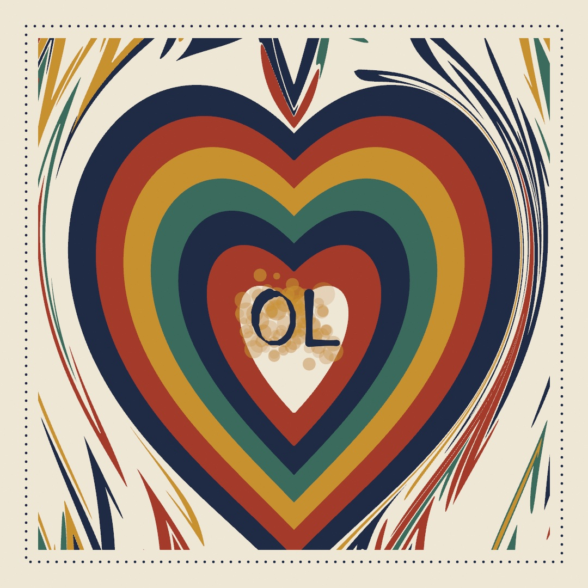
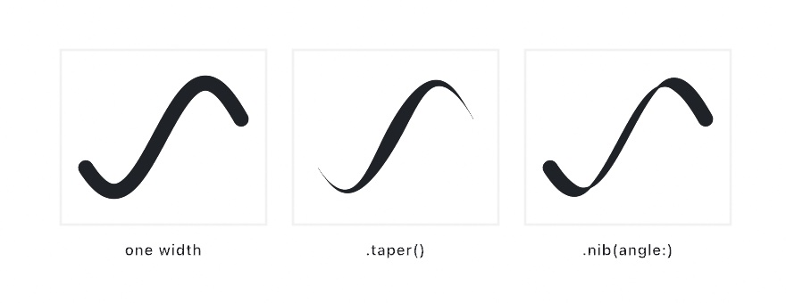
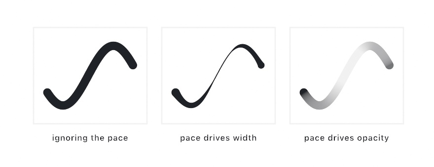
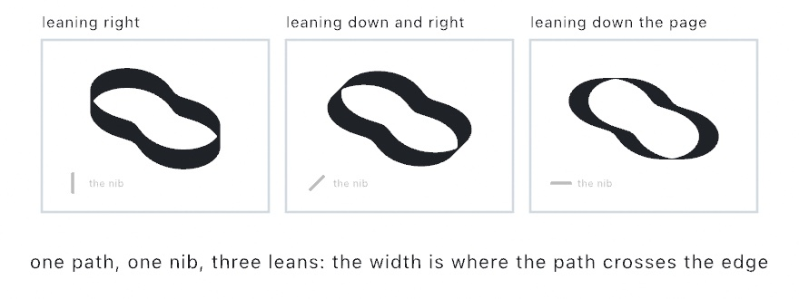
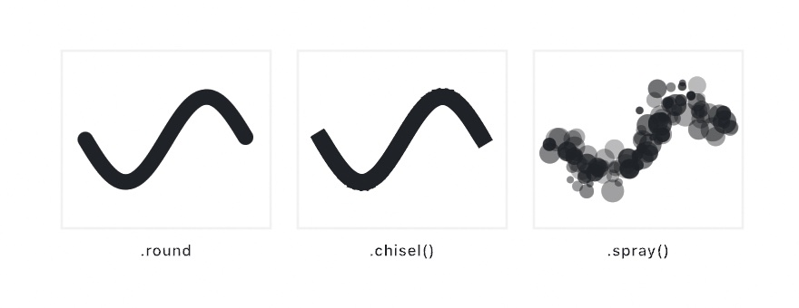
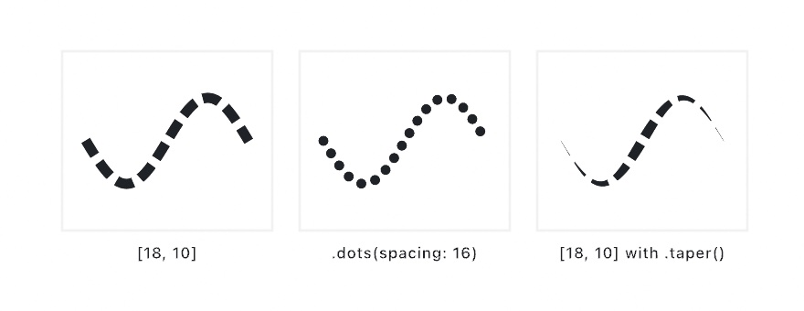
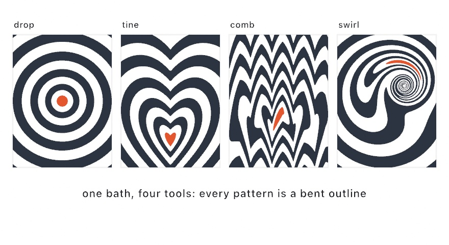
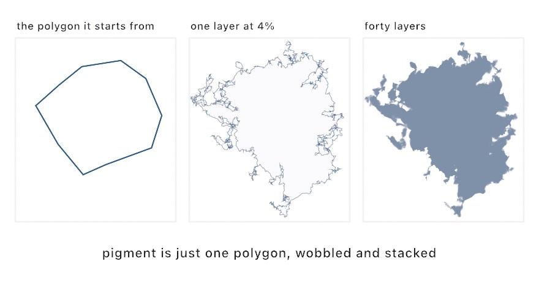

#### <sup>[Ollin](../README.md) → [Guide](README.md) → Chapter 17</sup>

---

# 17. Marks and media



A line drawn by hand swells and thins as it answers to speed and pressure. This chapter teaches strokes with a hand in them: width profiles, stroke dynamics, brushes, dashes, and a marbled sheet poured from bent outlines. In the monogram above, a broad nib writes your initials into the pale heart of that sheet. After it comes watercolor, pigment made from one polygon deformed and stacked.

## A width that changes along the path: strokeProfile

Every stroke so far has been one width from end to end, which is how a machine draws a line. A hand making a mark presses down and lifts off. `strokeProfile` gives the width a shape of its own along the path. Four tools in this chapter shape the stroke itself. A profile shapes a finished path's width, and dynamics respond to the hand mid-gesture. A brush decides what tip lays the ink down, and a dash pattern cuts the ribbon.

The profile is a multiplier on `strokeWeight`. `strokeWeight` still says how fat the mark gets, and the profile says what fraction of that it uses at each point:

```swift
strokeWeight(17)
strokeProfile(.taper())
drawPolyline(curve)
```

`.taper()` is a brush pressed down and lifted: nothing at either end, full width in the middle. Its two arguments are the widths at the ends, so `.taper(start: 1)` starts blunt and lifts off at the finish. A straight wedge is `.ramp(from:to:)`, and `.values([...])` takes a width curve you write out yourself. `.nib(angle:)` is different, because it ignores where you are along the path. It holds a flat calligraphy pen at a fixed angle. The mark is fattest where the path runs across the nib, and a hairline where it runs along it. So try it on a curve, since a straight line shows one nib width only. The third panel below is that curve.

<picture>
  <source media="(prefers-color-scheme: dark)" srcset="Images/17-MarksAndMedia/MarkWidth-dark.jpg">
  
</picture>

Two practical notes follow. The width is read at every point of the path, measured along the path's length. A shape with four points changes width in four steps, so sample your curves densely enough to give the profile somewhere to go. And the analytic shapes are drawn from a formula rather than a list of points (`drawCircle`, `drawRect`, and the rest of that family). They carry a single width by construction. So a profile does nothing to them on their own. Profiles are for paths.

The profile survives export. Run the sketch with `--export-svg` and a profiled stroke is written as the region it covers, rather than a line with one width attribute. What the plotter draws is what you saw.

## Painting as it happens: stroke dynamics

A profile asks one question at every point: how far along the path am I? That works because the path is finished before you draw it. Painting is different. You drag the mouse, and the stroke has to appear as it grows. There is no finished path yet, so there is no fraction along it to read. What is available instead is everything the hand just did: how fast it was moving, how hard it was pressing, which way it was heading. That is what **stroke dynamics** reads.

```swift
var mark = StrokeMark(.speed(fast: 0.15))

override func draw() {
    background(.white)
    if mouseIsPressed { record(into: &mark) }
    stroke(.black)
    strokeWeight(24)
    drawMark(mark)
}
```

With that, you can paint. `record(into:)` hands the mark where the pointer is, how hard it is pressed, and how long this frame took. The mark works out the speed, smooths it, and stores a width for that point in its `samples`. `drawMark` strokes what has been recorded so far, which is why the line appears under the cursor instead of when you let go.

<picture>
  <source media="(prefers-color-scheme: dark)" srcset="Images/17-MarksAndMedia/MarkDynamics-dark.jpg">
  
</picture>

The figure is one curve walked three times by the same pretend hand, nearly still at the ends and quick through the middle. Only what the pace is allowed to drive changes. Width and opacity are separate axes, and you name the one you want driven:

```swift
StrokeDynamics(width: .pressure(light: 0.1),      // press for a fat mark
               opacity: .speed(fast: 0.4))        // hurry for a faint one
```

An axis you do not name is not driven. `.speed(fast:)` and `.pressure(light:)` on their own are shorthands for the everyday brush, and they drive width only. The number is the fraction of `strokeWeight` left at a fast pace or the lightest touch, so `fast: 0.15` thins a quick stroke to 0.15 of its weight.

`.pressure` needs a device that can feel it. A Force Touch trackpad can, and so can a pen tablet. A plain mouse cannot, and it reports full force while the button is down. So a pressure brush on a mouse comes out at a single weight, and it still draws. `pressureIsAvailable` tells you which you have. Ask it in `mousePressed()` rather than `setup()`, because the answer arrives with the first press:

```swift
override func mousePressed() {
    mark = StrokeMark(pressureIsAvailable ? .pressure(light: 0.1) : .speed(fast: 0.15))
}
```

A tablet says more than how hard. `stylus` carries the rest of it. `tilt` is how far the pen leans, `-1...1` on each axis and zero when it is upright. `twist` is how far an art pen's barrel has been turned. `isEraser` is whether the end on the tablet is the eraser. `isNearby` is whether the pen is over the tablet at all, hovering or drawing. The lean is what a broad-edged nib is made of. A chisel laid across the direction of the lean draws thick one way and thin the other:

```swift
let angle = stylus.tiltIsAvailable ? atan2(stylus.tilt.y, stylus.tilt.x) + .pi / 2 : .pi / 4
```

> **Swift note.** `atan2` turns the lean's two numbers into the angle they point at. It is what [Chapter 10](10-Vectors.md)'s `angle` read off an arrow. The `? :` is the compact if from [Chapter 6](06-GridsAndRepetition.md). It gives the angle from the lean when a pen has been seen, and an eighth of a turn otherwise.

<picture>
  <source media="(prefers-color-scheme: dark)" srcset="Images/17-MarksAndMedia/NibAndLean-dark.jpg">
  
</picture>

`stylus.tiltIsAvailable` is the same kind of answer `pressureIsAvailable` is. It latches on once a pen has been used, so lifting the stylus out of range does not take the pen path away mid-stroke. Under a mouse everything in `stylus` is zero and false, so a sketch written for a stylus still runs. [`Examples/Input/Pen`](../Examples/Input/Pen/Sketch.swift) is a chisel nib that reads all of it, with a panel that says what the tablet is sending.

Three more practical notes follow. A mark is an ordinary value, so finishing one is `strokes.append(mark)` and `mark.clear()`. `StrokeMark` also takes a `smoothing:` argument, and it matters, because raw frame-to-frame speed is far too jumpy to drive a width directly. The default sits where a mark feels deliberate without lagging the pointer. And profiles compose with dynamics rather than competing, so `strokeProfile(.taper(start: 1))` still gives a dynamic mark a clean lift-off at the end. [`Examples/Shapes/Brushwork`](../Examples/Shapes/Brushwork/Sketch.swift) is a canvas to drag around in, and [Marks](../Docs/Drawing/Marks.md) has the rest.

## Stamps along the path: brushes

Both tools so far shape one continuous ribbon. A brush is for the textures a ribbon cannot give: chalk, spray, a trail of leaves. It is a tip pressed down over and over, close enough that the prints run together, and `strokeBrush` works that way.

```swift
strokeWeight(20)
strokeBrush(.spray())
drawPolyline(points)
```

It is drawing state, like `strokeCap` or a profile, and `noStrokeBrush()` puts the ribbon back. It applies to everything that strokes a path, `drawMark` included.

<picture>
  <source media="(prefers-color-scheme: dark)" srcset="Images/17-MarksAndMedia/BrushStamps-dark.jpg">
  
</picture>

The first panel is the one to look at. Those are separate circles, spaced a fifth of their own width apart, and they read as one solid stroke. Spacing is the argument that decides whether a brush is a mark or a scatter. It is measured in stamp sizes rather than pixels, so a brush keeps its texture when you change `strokeWeight`. Twice the weight is the same mark, twice as big.

The other arguments vary the prints. `sizeJitter` and `opacityJitter` vary each one, and `angle` faces it down the path, at a fixed angle, or anywhere. `scatter` throws it off the line, and `count` lays down several at each step. `spacing`, `sizeJitter`, and `scatter` are fractions of the stamp's size. Everything random comes from a `seed`, so a mark stays where it was frame after frame.

The tip does not have to be a circle. `.square` turns with the path, and `.shape` and `.image` take anything you can draw or load. A trail of leaves is a shape tip with a little angle jitter.

Brushes compose with the two previous tools. A profile still sizes the stamps along the path, so a spray that fades out at both ends is one more line:

```swift
strokeBrush(.spray())
strokeProfile(.taper())
```

And each stamp is a shape of its own rather than a stretch of ribbon. So `--export-svg` writes every one of them as a circle, a polygon, or a path a plotter can follow. [`Examples/Shapes/Brushes`](../Examples/Shapes/Brushes/Sketch.swift) has the family side by side.

## A line with gaps: strokeDash

The profile, the dynamics, and the brush all decide how the ink lands. A dash pattern decides where it does not. `strokeDash` cuts the ribbon into dashes:

```swift
strokeWeight(11)
strokeDash([18, 10])
drawPolyline(curve)
```

The list is dash, gap, dash, gap, in the same units as the path, and it repeats. It is drawing state like the rest, and `noStrokeDash()` puts the line back unbroken. Every dash is a little stroke of its own, so `strokeCap` finishes both ends of each one. That is what makes a dotted line one more line. `.dots(spacing:)` lays down dashes of length zero, and under `strokeCap(.round)` each of those is a dot.

<picture>
  <source media="(prefers-color-scheme: dark)" srcset="Images/17-MarksAndMedia/DashPatterns-dark.jpg">
  
</picture>

The third panel is the one to notice. The taper from the profile step is still reading its place on the uncut path. So the dashes shrink together toward the ends, rather than each one tapering on its own. The cut happens before any of the other tools see the path, which is why they compose. A brush stamps each dash and skips the gaps, and a gradient runs on through them.

A pattern also has a `phase`, how far it has slid along the path. Give it the clock and the dashes walk:

```swift
strokeDash([18, 10], phase: time * 60)
```

That is the marching outline every selection tool draws, and it costs one argument. The analytic shapes join in while a dash is on. `drawCircle`, `drawRect`, `drawStar`, and a few more of the analytic family hand their outline over to the path stroke. So a dashed ring is `strokeDash` followed by `drawCircle`. In an export, `--export-svg` writes every dash as its own subpath, so a plotter lifts the pen in every gap. [`Examples/Shapes/DashedStrokes`](../Examples/Shapes/DashedStrokes/Sketch.swift) has the family moving.

## Ink on water: marbling

The four tools above shape a stroke. The monogram also needs a ground to write on, and its ground is a marbled sheet, a wet medium made from the same dry geometry. Paper marbling has a few hundred years of craft behind it and a simple physical setup. Ink floats on a bath of thickened water. Because it floats instead of mixing, anything done to the surface moves the ink around without blending it. You drop fresh ink in, and you rake the surface with a stylus or a comb. Then you lay a sheet of paper on top to lift the pattern off.

`Marbling` reproduces that in closed form, in Aubrey Jaffer's mathematical model of the craft. Every move is a transform applied to outlines rather than a simulation of fluid. Ink regions are ordinary vector shapes, and each operation bends them. Because the outlines only ever deform, ink never tears and never mixes, as ink on a bath never does.

<picture>
  <source media="(prefers-color-scheme: dark)" srcset="Images/17-MarksAndMedia/MarblingSteps-dark.jpg">
  
</picture>

Nearly every classic pattern starts from the bull's-eye in the first panel. A bull's-eye is concentric drops of alternating color.

```swift
var bath = Marbling()
for i in 0 ..< 20 {
    bath.drop(at: center, radius: 200 - Double(i) * 9,
              color: i.isMultiple(of: 2) ? navy : cream)
}
```

> **Swift note.** `isMultiple` asks whether `i` divides evenly by 2, which is `i % 2 == 0` from [Chapter 1](01-HelloOllin.md) written as a question. So the drops alternate navy and cream.

A drop pushes every floating point straight away from its own center. A point at distance `d` from that center goes out to `sqrt(d * d + r * r)`, where `r` is the drop's radius. That rule keeps the area around the drop unchanged, which is why earlier rings thin into crescents rather than being wiped out. Since paper-colored ink displaces like any other, dropping the color of your background carves negative space.

Then you rake the bath. Four tools do it, and all of them share one rule for how the pull fades with distance. A point moves parallel to the direction the tool traveled. It moves by `strength` at the tool itself, and by half as much for every `falloff` of distance away from it. So `strength` is how far the tool drags, and `falloff` is the distance at which the pull halves. `.unitY` is the unit arrow pointing down the canvas, so `direction: .unitY` pulls downward.

```swift
bath.tine(through: center, direction: .unitY, strength: 120, falloff: 48)
bath.comb(through: center, direction: .unitY, spacing: 110, strength: 260, falloff: 30)
bath.tine(around: center, radius: 200, strength: 300, falloff: 48)
bath.swirl(at: center, strength: 400, falloff: 96)
```

`tine` pulls one stylus along a line, and that is the stroke that drags a bull's-eye into a heart. `comb` pulls a whole row of teeth spaced `spacing` apart. It feathers rows of drops into the pattern marblers call nonpareil. Keep a comb's `falloff` well under its tooth spacing, or the teeth blur together into one broad shear. The circular `tine` drags the stylus around a ring. `swirl` stirs a vortex that spins hardest at its middle, which is the tight curl at the heart of French-curl papers. A swirl centered on a bull's-eye does nothing, because spinning concentric circles about their shared center maps every circle onto itself. So stir off-center, as the fourth panel does.

`bath.add(shape, color:)` floats an outline you already have, so text outlines can go into the bath and get combed. Their counters, the holes inside an O or an A, stay intact. The bath itself uses no randomness, so the same operations always produce the same sheet. Randomize the drop positions with the sketch's seeded `random` and the sheet still comes back from its seed.

```swift
noStroke()
drawMarbling(bath)      // fills every ink in its own color, oldest first
```

Later drops sit above earlier ones, and drawing runs oldest first, so the stack reads as it was poured. Every ink is a plain `Shape`, which means a marbled sheet leaves through `--export-svg` as paths like everything else in this chapter.

## Putting it together: the monogram

The monogram writes a pair of initials into the heart of a marbled sheet, and it composes every step above. The sheet comes first, poured with the bath's own moves. A scatter of stones, which is what marblers call plain drops, goes down first and is combed down and back up into a feathered ground. A bull's-eye goes over it, with a core of paper color. One `tine` pulled down through the eye bends every ring into a heart. Then the initials are written into that pale core, one pen line at a time. Each line is a `StrokeMark` recorded by a pretend hand, drawn through a broad nib over a spray of gold. So the dynamics, the profile, and the brush all write. A dotted rule from `strokeDash` frames the sheet. Make `MySketches/Monogram.swift`:

```swift
import Ollin

final class Monogram: Sketch {
    @Param var initials = "OL"

    let paper = Color(hex: 0xEFE7D6)
    let navy = Color(hex: 0x1F2A44)
    let red = Color(hex: 0xA43B2A)
    let gold = Color(hex: 0xC8912F)
    let green = Color(hex: 0x3A6B5C)

    var bath = Marbling()
    var strokes: [StrokeMark] = []
    var written = ""

    var sheet: Rectangle { bounds.inset(by: .all(70)) }

    override func setup() {
        seed(4)
        bath = Marbling()
        let inks = [navy, red, gold, green]

        // The ground: stones scattered over the sheet, combed down and back up.
        for _ in 0 ..< 70 {
            bath.drop(at: randomVector(in: sheet), radius: random(20, 55),
                      color: randomChoice(inks))
        }
        bath.comb(through: Vector2(0, height / 2), direction: .unitY,
                  spacing: 90, strength: 200, falloff: 26)
        bath.comb(through: Vector2(45, height / 2), direction: -.unitY,
                  spacing: 90, strength: 140, falloff: 20)

        // The bull's-eye, with a core of paper color to write in. Every drop
        // pushes the ground outward, so a small eye keeps the feathering in view.
        let eye = Vector2(540, 420)
        for ring in 0 ..< 6 {
            bath.drop(at: eye, radius: 200 - Double(ring) * 15, color: inks[ring % 4])
        }
        bath.drop(at: eye, radius: 100, color: paper)

        // One stylus pulled down through the eye makes the heart.
        bath.tine(through: eye, direction: .unitY, strength: 240, falloff: 160)
    }

    // A pretend hand: slow into each stroke and out of it, quick through the
    // middle, so the speed brush swells the ends and thins the run.
    func handwrite(_ path: Contour) -> StrokeMark {
        var mark = StrokeMark(.speed(reference: 1200, fast: 0.45), smoothing: 0.4)
        let points = path.resampled(spacing: 3).points
        for (i, p) in points.enumerated() {
            let t = Double(i) / Double(max(1, points.count - 1))
            let pause = 1 + 3 * (1 - sin(.pi * t))
            mark.record(p, deltaTime: pause / 400)
        }
        return mark
    }

    // The initials as single pen lines, each line written by the hand.
    func letter() {
        textFont(StrokeFont.builtIn)
        textSize(120)
        textAlign(.center, .middle)
        strokes = textToShapes(initials, 540, 600)
            .flatMap { $0.contours }
            .map { handwrite($0) }
        written = initials
    }

    override func draw() {
        if written != initials { letter() }
        background(paper)

        noStroke()
        withClip(sheet) { drawMarbling(bath) }

        // A dotted rule around the sheet.
        noFill()
        stroke(navy)
        strokeWeight(5)
        strokeCap(.round)
        strokeDash(.dots(spacing: 16))
        drawRect(bounds.inset(by: .all(48)))
        noStrokeDash()

        // The hand writes for four seconds, rests for four, and starts again.
        let lap = time.truncatingRemainder(dividingBy: 8)
        let total = strokes.reduce(0) { $0 + $1.samples.count }
        var left = Int(min(1, lap / 4) * Double(total))
        var shown: [StrokeMark] = []
        for mark in strokes where left > 1 {
            let part = StrokeMark(samples: Array(mark.samples.prefix(left)))
            shown.append(part)
            left -= part.samples.count
        }

        // Gold dust first, then the ink through a broad nib.
        stroke(gold.withAlpha(0.6))
        strokeWeight(34)
        strokeBrush(.spray(seed: 7))
        for part in shown { drawMark(part) }
        noStrokeBrush()

        stroke(navy)
        strokeWeight(22)
        strokeProfile(.nib(angle: .pi / 5))
        for part in shown { drawMark(part) }
        noStrokeProfile()
    }
}
```

> **Swift note.** `@Param var initials = "OL"` is a parameter that holds text, so the inspector shows a box to type in. `var sheet: Rectangle { … }` is a computed property, worked out each time it is read, like [Chapter 2](02-Color.md)'s. `-.unitY` is the unit arrow pointing up the canvas, since `y` grows downward. In `handwrite`, `-> StrokeMark` says the function hands back a mark, and `return` is where it does. The `_` before `path` lets a call leave the label off. `mark.record(p, deltaTime:)` is the call `record(into:)` makes for you, here with the point and the time given by hand. `flatMap` maps every shape to its list of contours and joins those lists into one. In `reduce`, `$0` is the running total and `$1` the next mark. `!=` is not-equal. `prefix(left)` is the first `left` samples of a list, and `left -= n` takes `n` off `left`. `truncatingRemainder` is the `%` for a `Double` from [Chapter 16](16-CurvesAndFigures.md#a-corner-a-car-could-take-clothoids).

The bath is poured once in `setup()`, because every drop and every comb bends all the ink already floating. The order is the one a marbler follows: the ground, then the eye, then the stylus. The combs run before the eye goes down, so the stones feather while the heart's rings stay clean.

The letters come from the pen font of [Chapter 8](08-Words.md). With `StrokeFont.builtIn` active, `textToShapes` hands back each letter as open pen lines rather than outlines, which are paths a hand could follow. `handwrite` plays the hand. It records the points at an even spacing and changes only how long each step takes. The steps are slow at both ends of a line and quick through the middle. So the speed brush swells a line where a pen would pause and thins it through the run. Its `reference:` is the speed, in points per second, at which the mark reaches `fast`. `initials` is a parameter, so type your own into the inspector. `draw()` compares it with the letters it last wrote and writes new ones when it changes.

The animation is the writing itself. Each frame, `draw()` works out how many recorded points the hand has reached. It copies that many into a new mark with `StrokeMark(samples:)` and draws only those. The samples keep the widths they were recorded with, so a half-written letter already swells and thins. Both passes draw the same partial marks. The spray goes first, wider and in gold, and then the ink, narrower and through the nib. The nib multiplies the widths the hand recorded, the way a profile does with any mark.

Then make it yours:

- Float the initials instead of writing them. Take them from an outline font, `bath.add` each shape before the `tine`, and the stylus bends the letters along with the rings.
- Change the tool in the ink pass. `strokeBrush(.chisel())` in place of the nib stamps squares that turn with the path, and the letters read as cut rather than written.
- Pool a watercolor wash in the core, with the typed `Watercolor` from the section after the monogram. Build forty layers from it in `setup()` and fill them faintly each frame before the gold. Painting the wash inside `draw()` would roll new layers every frame and make it shimmer.

The sketch has two halves to keep: the writing, which moves, and the sheet, which prints. The writing is what moves, so `swift run OllinLive MySketches/Monogram.swift --export-gif monogram.gif --seconds 8 --gif-width 480 --fps 15` keeps one full lap as a GIF. The sheet is what prints, and `--export-svg monogram.svg --frame 420` writes it as paths once the letters are finished. Every ink is a filled shape, each letter the region its width covered, and each speck of gold its own circle.

## Paint from geometry: watercolor

The monogram's sheet is a wet medium made from dry geometry, outlines bent by exact transforms. One more medium works the same way, and the monogram uses it only in a variation. Watercolor is a pool of paint built from one polygon, deformed and stacked until it reads as pigment.

### Pigment from a polygon: drawWatercolor

A **watercolor** pool in Ollin is one irregular polygon, deformed many times over and painted in translucent layers. It is for the look of paint on wet paper. A pool of paint has a dense middle and an edge that wanders, blooming in some places and staying crisp in others. The recipe is Tyler Hobbs's, from his written guide to simulating watercolor with generative art.

Start with one irregular polygon. Split every edge at its midpoint, jump that midpoint a small random distance, and repeat. Each edge carries its own variance and passes a decayed share of it to the two edges it splits into. Some stretches of outline bloom, while others stay nearly straight. That inheritance is what keeps the result from looking like a uniformly fuzzy circle. Paint one such outline at about four percent opacity and almost nothing shows. Stack forty independently deformed copies and the middle saturates while the fringe stays uneven, which is what the eye reads as pigment.

<picture>
  <source media="(prefers-color-scheme: dark)" srcset="Images/17-MarksAndMedia/WatercolorLayers-dark.jpg">
  
</picture>

One call does it:

```swift
fill(Color(hex: 0x2B5D8A))
drawWatercolor(center: center, radius: 300)
drawWatercolor(center: center, radius: 300, layers: 60, opacity: 0.03, variance: 40)
```

`layers` and `opacity` trade against each other, and more layers at a lower opacity looks smoother and wetter. If a blob reads thin and translucent everywhere, add layers rather than raising opacity. The flat saturated core is most of what reads as paint. `variance` sets how far the edge is free to wander, and it defaults to a fifth of the radius. All of it comes from the sketch's seeded `random`. So `seed(_:)` reproduces a painting, and every variation pours a different one.

This is deliberately heavy drawing, since each layer is a full concave fill. Paint it behind `noLoop()`, or once into a retained batch, which [Chapter 19](19-LayersAndEffects.md#record-it-once-batches) teaches, rather than every frame. The cost is one reason, and the other is that regenerating every frame re-rolls the layers and makes the blob shimmer.

Two more moves open up once the basic pool works. For two pigments that mix instead of one covering the other, build a typed `Watercolor` base per pool. Interleave their layers a few at a time, so overlaps glaze in both directions. And for the grainy look of pigment settling into paper, speckle small translucent circles inside a `withClip` of the pool's own outline. `Examples/Shapes/Watercolor` pours several pools that way, and [Watercolor](../Docs/Generators/Watercolor.md) has the typed base.

## Where this comes from

Stroke dynamics follow the brush engines of digital painting, which turn how fast a hand moves into how heavy a mark it leaves. Krita and Procreate offer it as a speed setting, and Steve Ruiz's perfect-freehand library estimates pressure from how far apart the points land. The speed a mark measures here is smoothed by the 1€ filter of Géry Casiez, Nicolas Roussel, and Daniel Vogel. The broad nib a stylus leans across is the calligrapher's edged pen, far older than any tablet. The monogram's letters are Hershey Sans. It descends from the single-line faces Allen Hershey digitized in the late 1960s for a plotter to write. [Chapter 8](08-Words.md) tells that story.

The marbling equations are Aubrey Jaffer's closed-form model of a craft that predates all of it. The watercolor after the monogram names its own source. Full credits are in the project's [attribution notes](../ATTRIBUTION.md).

## Go deeper

- [Stroke profiles](../Docs/Drawing/Drawing.md#strokeProfile): `.taper`, `.ramp`, `.nib` and `.values` with every argument, the by-hand closure form, which primitives honor a profile, and what vector export writes.
- [Dashed strokes](../Docs/Drawing/Drawing.md#strokeDash): the pattern and its phase, dots from zero-length dashes, what the cut does to a profile, a brush, and a gradient, which shapes hand their outline over, and what vector export writes.
- [Marks](../Docs/Drawing/Marks.md): `StrokeMark`, the response and dynamics types, what the smoothing and spacing arguments do, building a mark without a pointer, the brushes, and what survives vector export.
- [The stylus](../Docs/Helpers/Input.md#stylus): the lean, the barrel turn, the eraser end, and hovering, read beside `pressure`.
- [Stroke fonts](../Docs/Drawing/Text.md#strokefont): the single-line pen font the monogram is written in, and loading more of them.
- [Marbling](../Docs/Generators/Marbling.md): the bath, every raking tool, and floating your own outlines as ink.
- [Watercolor](../Docs/Generators/Watercolor.md): the sugar, the typed base, and how the deformation runs.
- The Mohamedi homage [`Diagonals`](../Examples/Recreations/NasreenMohamedi/Diagonals/Sketch.swift): a chevron is one polyline through its corner with a `.values` profile. It is full width at the corner and a fraction of it at each tip. That is the mark a loaded ruling pen leaves as its ink runs out. Its `--export-svg` writes each chevron as the filled outline of the stroke rather than a line with one width, so the thinning reaches the paper. It writes every hairline of its wakes and fans as a plain line.
- Worked examples: [`Examples/Shapes/StrokeProfiles`](../Examples/Shapes/StrokeProfiles/Sketch.swift), [`Examples/Shapes/Brushwork`](../Examples/Shapes/Brushwork/Sketch.swift), [`Examples/Input/Pen`](../Examples/Input/Pen/Sketch.swift), [`Examples/Shapes/Brushes`](../Examples/Shapes/Brushes/Sketch.swift), [`Examples/Shapes/DashedStrokes`](../Examples/Shapes/DashedStrokes/Sketch.swift), [`Examples/Patterns/Marbling`](../Examples/Patterns/Marbling/Sketch.swift), and [`Examples/Shapes/Watercolor`](../Examples/Shapes/Watercolor/Sketch.swift).

---

[Contents](README.md#contents) · Previous: [Chapter 16, Curves and figures](16-CurvesAndFigures.md) · Next: [Chapter 18, Your first shader](18-YourFirstShader.md)
