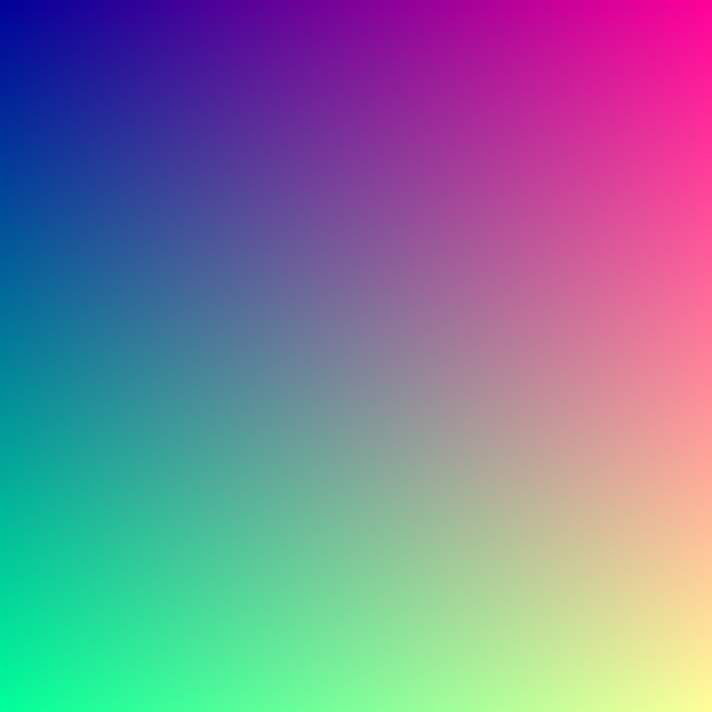
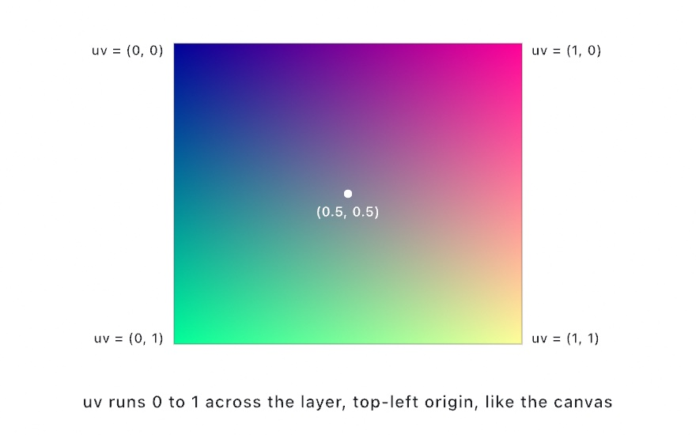
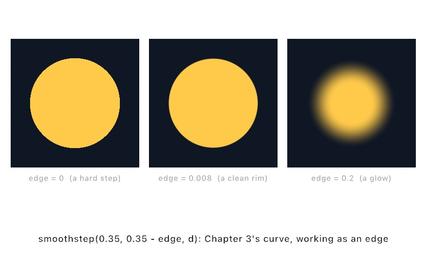
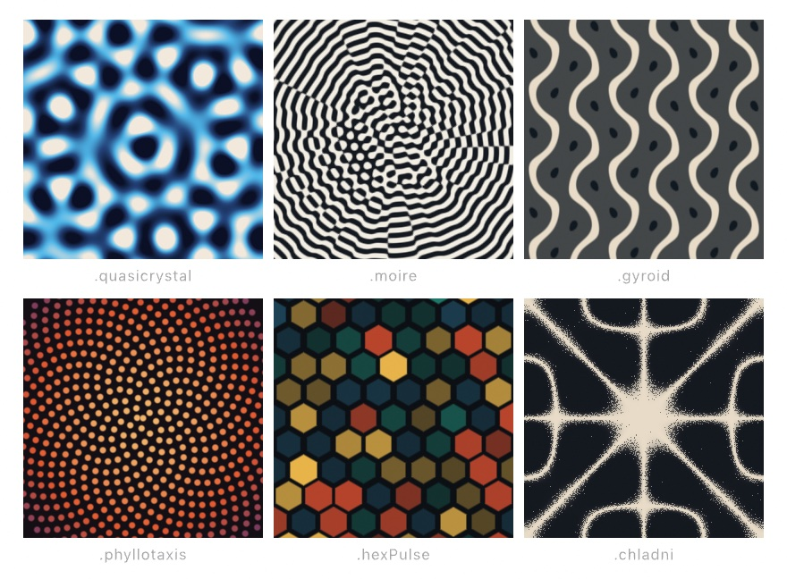
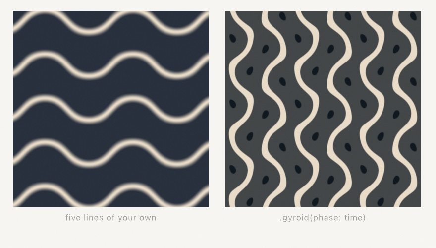
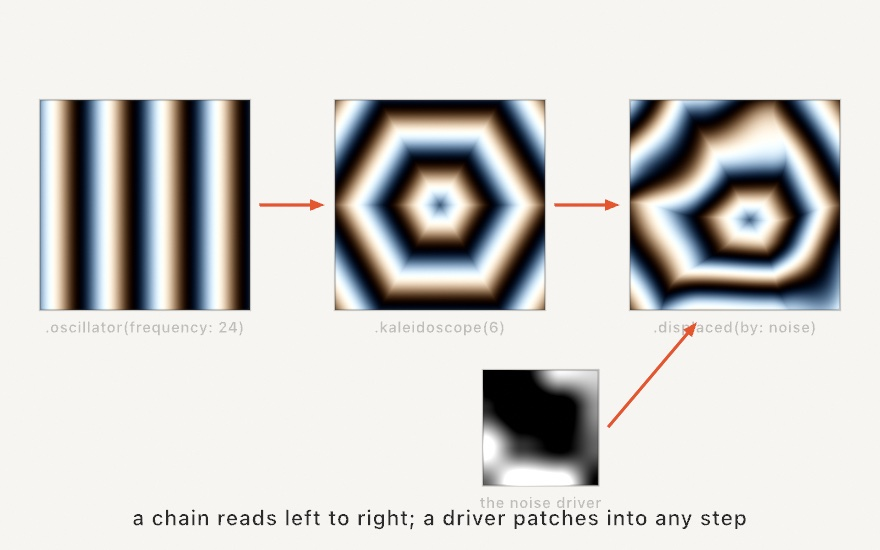
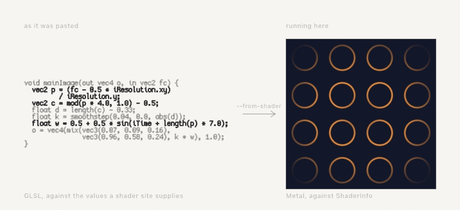
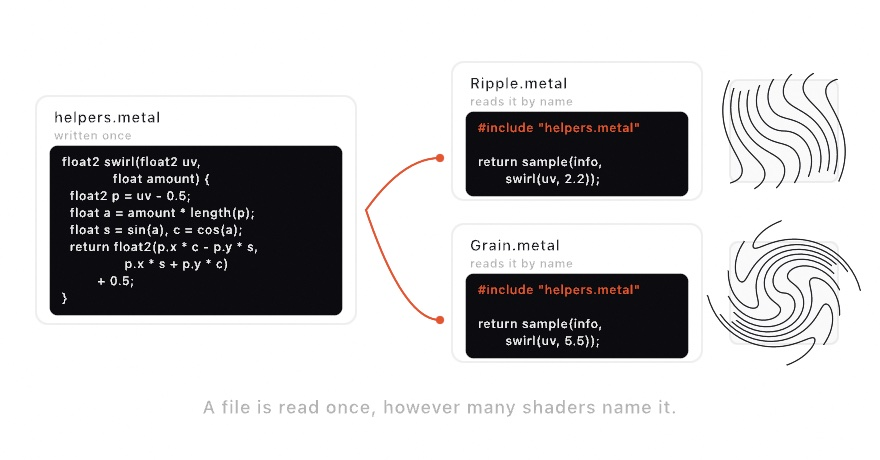

#### <sup>[Ollin](../README.md) → [Guide](README.md) → Chapter 17</sup>

---

# 17. Your first shader


That aurora is about forty lines of code and no assets, and it runs at full resolution at full frame rate because the drawing isn't happening one shape at a time. It's a **shader**, a small function the GPU runs at every pixel of the canvas at once. This chapter teaches you to write one, and by the end you'll find that most of what you need was already taught chapters ago. It just changes costume.

## One question, a million times

[Chapter 14](14-FieldsAndFlow.md) gave you the mental model without saying so, in that a field is an answer at every point. A flow field answered with a direction. A shader is a field that answers with a **color**, and the GPU is hardware built to ask it at every pixel simultaneously:

<picture>
  <source media="(prefers-color-scheme: dark)" srcset="Images/17-YourFirstShader/PixelGrid-dark.jpg">
  
</picture>

That's the whole shift. Until now `draw()` has been imperative, telling the canvas to put a circle here and a line there. A shader is one small function with the opposite job: *given a position, say what color lives there*. No loops over shapes, no order of operations, just position in, color out, everywhere, at once. The million evaluations per frame are why the aurora costs nothing, and the "at once" is why a shader can't know what its neighbor pixels decided.

## The first shader

Make `MySketches/FirstShader.swift`:

```swift
import Ollin

final class FirstShader: Sketch {
    let coordinates = Shader("""
    float4 shade(float2 uv, ShaderInfo info) {
        return float4(uv.x, uv.y, 0.6, 1.0);
    }
    """)

    override func draw() {
        drawImage(generate(coordinates).image, 0, 0)
    }
}
```



The string is the shader, and everything around it is plumbing you already know, since [Chapter 16](16-LayersAndEffects.md)'s `generate` makes a layer and `drawImage` shows it. The function is the contract. Ollin calls your `shade` once per pixel, handing it that pixel's `uv` position, and whatever color you return is what that pixel becomes. Here red is `uv.x` and green is `uv.y`, so the image *is* the coordinate system:

<picture>
  <source media="(prefers-color-scheme: dark)" srcset="Images/17-YourFirstShader/UVSpace-dark.jpg">
  
</picture>

`uv` runs `0...1` across the layer whatever its pixel size, top-left origin like the rest of the canvas. Painting coordinates as color looks like a toy, but it's the debugging tool you'll use forever. When a shader misbehaves, return the thing you're unsure about as a color and look at it.

> **Metal note.** The shader is written in Metal, the GPU's language, which is C-flavored. Statements end with `;`, there are no argument labels, and the vector types are `float2`, `float3`, and `float4` instead of `Vector2` and `Color`. A `float4` color is red, green, blue, alpha, each `0...1`, and constructors nest, so `float4(col, 1.0)` packs a `float3` color plus an alpha. The math vocabulary (`sin`, `cos`, `length`, `mix`, `smoothstep`) is the one you've used all along, with the same meanings.

> **Swift note.** The triple-quoted `"""` string is a multiline string literal, so everything between the quotes, line breaks included, is one string. The shader lives inside it, which is why a typo in the shader is reported at this file's own line numbers. And a broken shader never crashes the sketch. The pass is skipped, the error prints (or shows in OllinLive's overlay), and it clears when you fix it.

## Drawing with distance

To draw a *shape* with a function, describe the shape as a question about distance. A disc is "how far is this pixel from the center, and is that less than the radius?":

```swift
let disc = Shader("""
float4 shade(float2 uv, ShaderInfo info) {
    float2 p = uv - 0.5;                       // center the coordinates
    float d = length(p);                       // distance from the middle
    float v = smoothstep(0.35, 0.34, d);       // 1 inside, 0 outside, soft rim
    float3 col = mix(float3(0.06, 0.09, 0.14), float3(1.0, 0.79, 0.29), v);
    return float4(col, 1.0);
}
""")
```

Look at the third line. `smoothstep` is [Chapter 3](03-MotionAndTime.md)'s easing curve, the one you watched as a graph and used to cushion motion. Here it answers a different question with the same shape, because as `d` crosses from 0.35 down to 0.34 the result ramps smoothly from 0 to 1, and that one-percent ramp is the disc's anti-aliased rim. Widen the ramp and the rim becomes a glow; collapse it and the edge goes hard and pixelated:

<picture>
  <source media="(prefers-color-scheme: dark)" srcset="Images/17-YourFirstShader/EdgeStep-dark.jpg">
  
</picture>

This is the sentence at the heart of nearly every shader ever written: *measure a distance, shape it with smoothstep, turn it into color.* Everything else is choosing more interesting distances and more interesting colors.

## Time, mouse, and knobs

The `info` argument carries the outside world in: `info.time` (seconds, so anything you feed it moves), `info.mouse` (in canvas points), `info.resolution` (the layer's pixel size), and `info.frame`. A pulsing disc is the disc shader with one line changed:

```metal
float r = 0.3 + 0.05 * sin(info.time * 2.0);
float v = smoothstep(r, r - 0.01, d);
```

Your own numbers ride along as `params`, read back inside as `param(info, 0)`, `param(info, 1)`, and so on. Pair them with `@Param` and a computed property, and the shader gets live knobs:

```swift
@Param(0...0.4) var sway = 0.18

var sky: Shader {
    Shader(shaderSource, params: [Float(sway)])   // rebuilt each read, cached by source
}
```

Rebuilding the `Shader` value every frame is the normal pattern and costs nothing, because the compiled pipeline is cached by the source text, so only the numbers travel. (The finished piece below uses exactly this shape.)

## The library in your pocket

Ollin splices its own shader library into every shader you write, so the helpers its built-in effects use are yours too, with no import. Several you already know by other names. `fbm` is [Chapter 5](05-Noise.md)'s layered noise as one call, and the rest of that chapter's field family (`simplexNoise`, `worley`, `ridgedFbm`, `turbulence`, `warpedFbm`) is here under the same names. `hash12` is a random number that never changes between frames, so feed it a cell and it's [Chapter 4](04-Randomness.md)'s seeded random, per pixel. The `sd*` family measures distance to ellipses, stars, hearts, and béziers the way `length` measured distance to a point. And `palette(t, a, b, c, d)` turns a `0...1` value into color along a designed gradient, where four `float3`s shape the ramp, so steal starting values from its documentation and nudge.

The word "splices" in that first sentence is doing real work, and it's worth a moment because it explains why the names never drift. There is one library file, and it gets pasted into three different places: the framework's own effect shaders, every shader you write, and every compute kernel from [Chapter 19](19-GridSimulations.md). So `fbm` in your filter, `fbm` in Ollin's built-in noise generator, and `fbm` in a particle kernel are not three implementations that happen to agree. They are the same source text compiled three times, which is why a field you prototype in a shader behaves identically when you move it into a kernel.

Splicing the whole library into every shader would make every compile larger than it needs to be, so there's an opt-out:

```swift
Shader(source, using: [.noise, .sdf])   // keep only these sections
```

Leave it off and you get everything, which is the right default while you're exploring. Reach for it when a sketch has many shaders and compiles start to feel slow. The [shader library reference](../Docs/Shaders/ShaderLibrary.md) lists every function and which section it lives in.

## The pattern fields

You've also been *using* shaders all along, since every [Chapter 16](16-LayersAndEffects.md) filter and generator is one. [Chapter 16](16-LayersAndEffects.md) introduced the design generators, and held one group back for here: the **pattern fields**, because they're the ones this chapter has just taught you to read.

What makes them a group is a property, not a style. A pattern field is **closed form**: it has no state, no source picture, and it reads no textures. Every pixel is a small piece of arithmetic on its own coordinates, exactly like the shaders you've been writing. Three consequences follow, and they're the reason to reach for one.

- It costs the same at any size, so a pattern field fills a 4K poster as happily as a thumbnail, and there's nothing to load.
- It has no history, so frame 900 doesn't depend on frames 1 through 899. That's what makes them safe to export, scrub, or jump around in.
- It's a pure function of `phase`, so the same phase gives the same picture, forever.

```swift
drawImage(generate(.quasicrystal(phase: time)).image, 0, 0)
```

<picture>
  <source media="(prefers-color-scheme: dark)" srcset="Images/17-YourFirstShader/Fields-dark.jpg">
  
</picture>

There are six. `.quasicrystal` sums plane waves at evenly spaced angles, so it's ordered but never repeats. `.moire` overlaps ring gratings and shows you their beat, which travels much faster than the rings themselves. `.gyroid` slices a famous minimal surface. `.phyllotaxis` is the sunflower's golden-angle spiral from [Chapter 15](15-ShapesAsMaterial.md), drawn per pixel. `.hexPulse` gives every cell of a hex lattice its own hashed heartbeat. `.chladni` is a ringing plate's standing wave, which [Chapter 19](19-GridSimulations.md) comes back to and [Chapter 28](28-SoundAndControl.md) plays with sound.

Here's the part worth doing rather than reading. Take the gyroid, which is genuinely one line: a sum of three `sin` and `cos` products, read at a fixed slice through space.

```swift
let mine = Shader("""
float4 shade(float2 uv, ShaderInfo info) {
    float2 p = (uv - 0.5) * 14.0;
    float z = info.time;
    float g = sin(p.x) * cos(p.y) + sin(p.y) * cos(z) + sin(z) * cos(p.x);
    float band = 1.0 - smoothstep(0.0, 0.55, abs(g));
    return float4(mix(float3(0.16, 0.19, 0.24), float3(0.91, 0.86, 0.78), band), 1.0);
}
""")
```

<picture>
  <source media="(prefers-color-scheme: dark)" srcset="Images/17-YourFirstShader/HandRolledField-dark.jpg">
  
</picture>

Not identical, and the differences are instructive. The bands run a different way because the built-in slices along another axis, and it adds a dimmed second copy behind the first to suggest depth, which is where those little dark seeds come from. But it's plainly the same animal, and you wrote it with five lines of vocabulary from earlier in this chapter: coordinates recentered, `sin` and `cos`, `smoothstep` for the edge, `mix` for the color.

Nothing about `z = info.time` is special either. Reading a 3D field at a moving slice is a general trick worth keeping: it's why the bands crawl and reconnect instead of just sliding.

Two conventions apply across the whole design and pattern-field set. Their palettes blend in **sRGB**, the space design tools work in, so mixes look like what a design tool would show rather than what physically correct light would do. And centered compositions stay centered and round whatever the canvas shape, so a tall layer doesn't get a squashed crystal.

So: when a built-in is close to what you want, take it and turn its knobs. When it isn't, you now know what's inside one.

## Chains: patching without typing Metal

Sometimes you want a shader's texture without writing one. A `Visual` chain composes per-pixel imagery the way you compose anything else in Swift. You start from a source, warp it, color it, and patch chains into each other:

```swift
drawVisual(
    .oscillator(frequency: 24, colorShift: 0.12)
        .kaleidoscope(6)
        .displaced(by: .noise(scale: 3), amount: 0.12)
)
```

<picture>
  <source media="(prefers-color-scheme: dark)" srcset="Images/17-YourFirstShader/ChainGraph-dark.jpg">
  
</picture>

The signature move is the last step, where one chain's *color* drives another chain's *coordinates*, per pixel. That `displaced(by:)` is the same idea as [Chapter 16](16-LayersAndEffects.md)'s displacement combine, but the driver is any chain, and the whole expression, drivers included, compiles into a single GPU pass. Everything animates by default, every number can ride a knob or a beat without recompiling, and `generate(chain)` hands the result back as an ordinary layer for the rest of the effect graph. The [chains reference](../Docs/Shaders/Visuals.md) has the full vocabulary (sources, warps, color ops, blends, and the feedback loop).

## Somebody else's shader

You now know the shape well enough to read other people's. Shadertoy holds tens of thousands of fragment shaders. Nearly all of them are the two moves you just made: a pixel position in, a color out. Only the spelling differs. Theirs is called `mainImage`, it takes the position in pixels rather than a 0-to-1 `uv`, and it reads the clock from a global named `iTime`. Ollin will do that translation for you:

```sh
ollin new Plasma --from-shader plasma.glsl
```

<picture>
  <source media="(prefers-color-scheme: dark)" srcset="Images/17-YourFirstShader/ImportedShader-dark.jpg">
  
</picture>

That writes a project with the translated shader in `imported.metal` beside the sketch, ready to build. A shader you have just copied can go straight in with `pbpaste | ollin new Plasma --from-shader -`. How many inputs it reads decides what it becomes. One that reads nothing is a generator. One that reads `iChannel0` is a filter over a layer, which is [Chapter 16](16-LayersAndEffects.md)'s vocabulary again.

Most of the translation is renaming. `vec3` becomes `float3`, `atan(y, x)` becomes `atan2(y, x)`. Three of the changes are worth knowing, because they change what you *see* rather than whether the file compiles.

**`mod` rounds the other way.** GLSL floors the quotient where Metal truncates it, so the two disagree the moment either side goes negative. That is the ordinary case. Tiling a plane that reaches left of the origin is the first thing this kind of shader does. So the translation writes the flooring version out by hand instead of calling Metal's built-in.

**The vertical axis turns over.** A texture is measured from its bottom edge and an Ollin layer from its top. Any shader that reads a layer gets its coordinate flipped on the way in, or it arrives upside down.

**`iTime` is a global, and Metal has none.** Any function in a GLSL shader can reach for the clock. In Metal, `info` has to be handed along as a parameter. The translation adds it to the functions that read the clock, and to the functions that call those. Helpers that only do arithmetic, like the distance functions, are left alone.

Whatever cannot come over is written into the file as a comment. A `NOTE(ollin)` tells you something changed on the way. A `TODO(ollin)` marks something left for you, and the shader will not compile until you deal with it. A shader built on four buffer passes gets one of those, since only the image pass comes across.

Then there is the part no tool can decide for you. **A shader belongs to whoever wrote it.** Shadertoy's default is CC BY-NC-SA, and many authors write their own terms into a comment at the top. So the translated file keeps a header naming the shader, its author, and the address it came from. Leave that header where it is, and read the terms before you publish anything made from it.

What you get back is Metal source sitting in your own project, with Ollin's shader library already spliced in. You can call `palette` or `fbm` inside somebody else's plasma and watch what happens. That is the difference between bringing a shader over and admiring it in a browser tab.

## One helper, two shaders

Sooner or later you write a small function you want in more than one shader. A swirl, a mask, a curve you tuned by hand. Copying it into the second file works until you change one copy and forget the other.

Put it in a file of its own and name it:

```metal
#include "helpers.metal"

float4 shade(float2 uv, ShaderInfo info) {
    return sample(info, swirl(uv, param(info, 0)));
}
```

<picture>
  <source media="(prefers-color-scheme: dark)" srcset="Images/17-YourFirstShader/SharedHelper-dark.jpg">
  
</picture>

The path is relative to the file that names it, so a helper sitting in the same folder is just its name. It works from an inline Swift string too. The folder there is the one your `.swift` file is in. A [compute kernel](../Docs/Shaders/Compute.md) can do it as well, so a kernel and a shader can share one file.

Three things are worth knowing.

A file is read once, however many times it is named. Two shaders that both include the same helper do not end up defining it twice.

A mistake inside the helper is reported against the helper, at its own line. That is the whole point. An include that made errors point at the wrong file would be worse than copying the function by hand.

A file that is not there is reported before the compiler is asked. So is a loop of files that include each other. Either one, left to the compiler, would arrive as a page of undeclared identifiers pointing anywhere but at the real mistake.

You do not need an include for Ollin's own library. `palette`, `fbm`, `smin` and the rest are already there in every shader.

## Trying a shader on its own

A shader is compiled by the sketch that uses it. So the usual way to find out whether it compiles is to launch something that draws it, and the first sign that it does not is a layer that stays blank.

You can ask directly instead:

```sh
ollin check Ripple.metal
```

```
Ripple.metal: ok
  a filter, because it reads one layer
  reads parameters 0, 1, so pass 2 floats
  includes /Users/you/Sketches/helpers.metal
```

It compiles the file on this machine's GPU, the same way a sketch would, and reports at your own line numbers when something is wrong. It also says three things you cannot see by reading the file quickly.

What the shader is. A shader that reads no layer is a generator, one layer makes it a filter, two make it a combine, and the check works that out from the readers you call. It is worth seeing before you wire the shader into a chain that expects something else. You can name the shape yourself with `--as filter` if you want it compiled a particular way.

Which parameters it reads, so you know how many floats to pass. A gap gets called out, because an index nothing writes reads as zero and is usually a slip.

Which files it pulled in, in the order it read them.

Pass several files at once and each is reported on its own. The command exits nonzero if any of them failed, which is what you want in a script.

## Standing waves: Chladni figures

Not every wave needs simulating, and this one is a formula you can evaluate at a pixel. In 1787 Ernst Chladni scattered sand on a metal plate and drew a bow across its edge. The sand skipped away from the parts that were moving, and settled along the lines that weren't. Those lines are the plate's nodes, and the figures they make are beautiful enough that Chladni toured Europe demonstrating them.

The square plate's answer has a closed form, so Ollin gives you the value directly instead of a simulation:

```swift
let s = chladni(u, v, m: 5, n: 2)      // -1…1, over plate coordinates 0…1
```

`u` and `v` run `0...1` across the plate, and `m` and `n` are the mode numbers, which is to say how the plate was driven. The result is how far the plate is displaced at that spot, so sand settles wherever the value is near zero. That's the whole recipe. Scatter grains, and keep the ones sitting near a nodal line.

<picture>
  <source media="(prefers-color-scheme: dark)" srcset="Images/17-YourFirstShader/ChladniModes-dark.jpg">
  
</picture>

One rule saves an afternoon. Setting `m` equal to `n` cancels the whole expression to zero, and the plate's diagonal is nodal in every mode. Those are properties of the physics rather than bugs to work around. Keep `m` larger than `n` and every mode gives you a figure.

`m` and `n` don't have to be whole numbers, which is the door to animation. Fractional modes morph continuously from one figure to the next. A slow tour through mode space then makes the sand rearrange itself, in a way that looks like the bow moving. Keep `m` above `n` at every stop along the way, or the tour crosses the degenerate diagonal and the figure blinks out.

For a whole plate at once there's a GPU version, which is the faster way to fill the canvas:

```swift
drawImage(generate(.chladni(m: 5, n: 2)).image, 0, 0)
drawImage(generate(.chladni(m: 7, n: 3, style: .wave, phase: time)).image, 0, 0)
```

`.sand` gathers grains onto the nodes like the figure above, and `.wave` shows the plate swinging through its cycle instead. And the nodal lines are just where the field crosses zero, so the vector version of a Chladni figure is a contour extraction away. The [isolines reference](../Docs/Generators/Isolines.md) covers it.

The natural next step is to stop choosing the mode numbers by hand. [Chapter 28](28-SoundAndControl.md) listens to sound. Pick `m` and `n` by which pitches are actually loud, and a piece of music turns into the plate that would have produced it. The `Audio/ChladniResonance` example does exactly that.

## Putting it together: aurora

Now the sky. Curtains of light are vertical noise bands whose x position is bent by more noise. Height fades them in above the horizon, a cosine palette colors them green at the core and violet at altitude, and hashed stars and a noise ridge finish the scene. Make `MySketches/Aurora.swift`:

```swift
import Ollin

final class Aurora: Sketch {
    @Param(0...0.4) var sway = 0.18
    @Param(0.5...2.5) var strength = 1.4

    // A computed property, so each frame's shader carries the knobs' current
    // values; the compiled pipeline is cached by source, so this is free.
    var sky: Shader {
        Shader("""
    float4 shade(float2 uv, ShaderInfo info) {
        float t = info.time * 0.1;
        float sway = param(info, 0);
        float strength = param(info, 1);

        // The curtains: vertical bands whose x is bent by drifting noise, so
        // they ripple like fabric. y1 is height above the horizon.
        float y1 = 1.0 - uv.y;
        float bend = fbm(float2(uv.x * 2.4 + t, uv.y * 1.2 - t * 0.7)) - 0.5;
        float x = uv.x + bend * sway;
        float band = fbm(float2(x * 5.0, t * 1.6));
        band = smoothstep(0.45, 0.85, band) * strength;
        float height = smoothstep(0.1, 0.38, y1) * smoothstep(1.15, 0.4, y1);
        float glow = band * height;

        // Aurora colors from a cosine palette: green cores fading violet as
        // the curtain climbs.
        float3 aurora = palette(0.5 + glow * 0.22 - y1 * 0.3,
                                float3(0.16, 0.5, 0.38), float3(0.24, 0.5, 0.45),
                                float3(1.0, 0.7, 0.6), float3(0.35, 0.5, 0.75));

        // A cold night gradient, stars hashed per cell, brighter ones rarer.
        float3 col = mix(float3(0.01, 0.02, 0.05), float3(0.04, 0.07, 0.14), uv.y);
        float2 cell = floor(uv * info.resolution / 3.0);
        float star = step(0.997, hash12(cell)) * hash12(cell + 7.0);
        col += star * smoothstep(0.6, 0.1, glow);             // curtains outshine stars
        col += aurora * glow;

        // The ridge: a noise horizon, solid black below it.
        float ridge = 0.82 + (fbm(float2(uv.x * 3.0, 4.7)) - 0.5) * 0.12;
        float ground = smoothstep(ridge, ridge + 0.003, uv.y);
        col = mix(col, float3(0.005, 0.008, 0.012), ground);

        return float4(col, 1.0);
    }
    """, params: [Float(sway), Float(strength)])
    }

    override func draw() {
        drawImage(generate(sky).image, 0, 0)
    }
}
```


Read the shader top to bottom and count the old friends: `fbm` ([Chapter 5](05-Noise.md)) bends and builds the curtains, `smoothstep` ([Chapter 3](03-MotionAndTime.md)) shapes every transition, from the curtain edges to the height fade to the two-pixel horizon line, `hash12` ([Chapter 4](04-Randomness.md)'s determinism, per pixel) places the stars, `palette` designs the color, and `mix` (lerp by another name) blends every layer of the picture. Nothing new happened here except *where the code runs*.

Then make it yours:

- Run it under OllinLive and drag `sway` and `strength` while it plays. Then break a line on purpose and watch the error point at your own file, at the right line, while the sketch keeps running.
- Reflect it. Draw the sky into the top half and again below, flipped and darkened, and there's a lake.
- Feed `info.mouse` into the palette so the colors follow your hand.
- Chain it. `generate(sky).filtered(.bloom())` glows the curtains, and a `Visual` reading `.layer(generate(sky))` can kaleidoscope the whole night.

## Where this comes from

Shaders come out of computer graphics research and the demoscene, but the reason a creative coder in this century can learn them at all is largely two projects. *The Book of Shaders*, by Patricio Gonzalez Vivo and Jen Lowe, taught a generation the per-pixel mental model (this chapter's distance-and-smoothstep sentence is its heart, and if you want a deeper, GLSL-flavored second pass, it remains wonderful). And Shadertoy, built by Inigo Quilez and Pol Jeremias, made shaders a shared, remixable culture. Quilez's articles are also the source of half the techniques in Ollin's shader library, including the cosine `palette` and the `sd*` distance functions. The fractal noise behind `fbm` descends from Ken Perlin's Oscar-winning noise. The chain idiom of `Visual` is inspired by Olivia Jack's Hydra, the browser live-coding instrument whose patching model made combining visuals feel like playing an instrument. Full credits are in the project's [attribution notes](../ATTRIBUTION.md).

## Go deeper

- [Chladni figures](../Docs/Generators/Chladni.md): the mode numbers, the closed form behind the plate, and the knobs on the pattern. The [`Patterns/Chladni`](../Examples/Patterns/Chladni/Sketch.swift) example sweeps the modes, and [`Audio/ChladniResonance`](../Examples/Audio/ChladniResonance/Sketch.swift) drives them from a live signal.
- [User shaders](../Docs/Shaders/Shaders.md): the full contract, filters and combines that read layers, `.metal` file loading, and the error model.
- [Bringing a shader over](../Docs/Tools/ShaderImport.md): `ollin new --from-shader` translates a GLSL fragment shader into Metal and writes the project around it, with the `mod` rounding difference, the flipped vertical axis, and the license header explained.
- [Checking a shader](../Docs/Tools/ShaderCheck.md): `ollin check` on the command line, with what it reports, naming the shape yourself, and checking several files in one go.
- [The shader library](../Docs/Shaders/ShaderLibrary.md): every spliced-in helper with its signature.
- [Generators](../Docs/Drawing/Effects.md#generate): `Generator` and `generate(_:)`, the whole pattern-field catalog with every knob, and how a generated layer feeds the rest of an effect chain.
- [Visual chains](../Docs/Shaders/Visuals.md): all sources, warps, color ops, combines, and modulations.
- [Compute](../Docs/Shaders/Compute.md): the sibling world where kernels update buffers of particles instead of pixels, waiting in [Chapter 19](19-GridSimulations.md).
- Appendix B draws this chapter's math, one picture per idea: [Where things are](B-JustEnoughMath.md#where-things-are), [Per-pixel thinking and distance](B-JustEnoughMath.md#per-pixel-thinking-and-distance).
- Worked examples: [`Examples/Shaders/HelloShader`](../Examples/Shaders/HelloShader/Sketch.swift) (inline and hot-reloading `.metal`-file forms), [`Examples/Shaders/ShaderFilter`](../Examples/Shaders/ShaderFilter/Sketch.swift), [`Examples/Shaders/VisualSynth`](../Examples/Shaders/VisualSynth/Sketch.swift), [`Examples/Shaders/VisualCatalog`](../Examples/Shaders/VisualCatalog/Sketch.swift) (every chain family on one contact sheet), and [`Examples/Effects/GeneratorCatalog`](../Examples/Effects/GeneratorCatalog/Sketch.swift).

---

[Contents](README.md#contents) · Previous: [Chapter 16, Layers and effects](16-LayersAndEffects.md) · Next: [Chapter 18, Iterated forms](18-IteratedForms.md)
