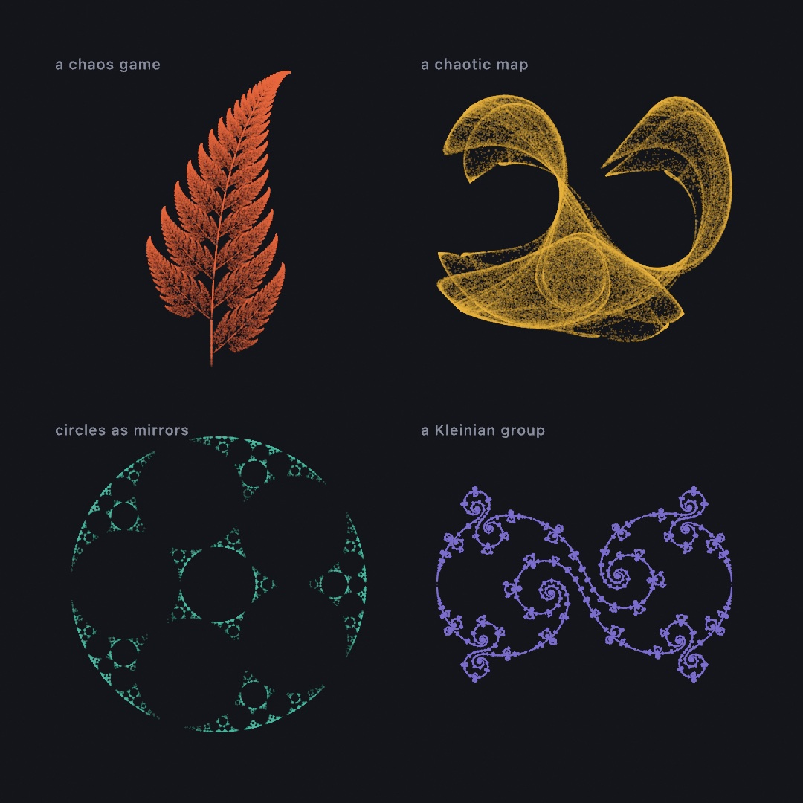
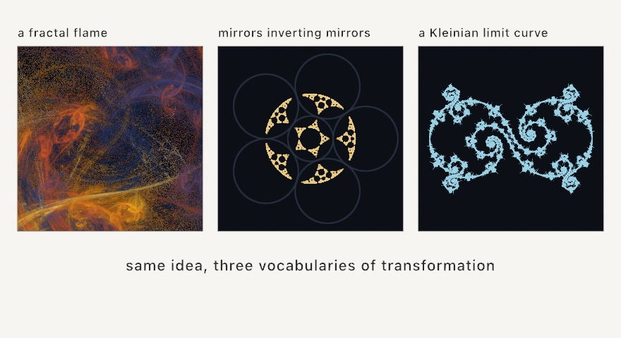
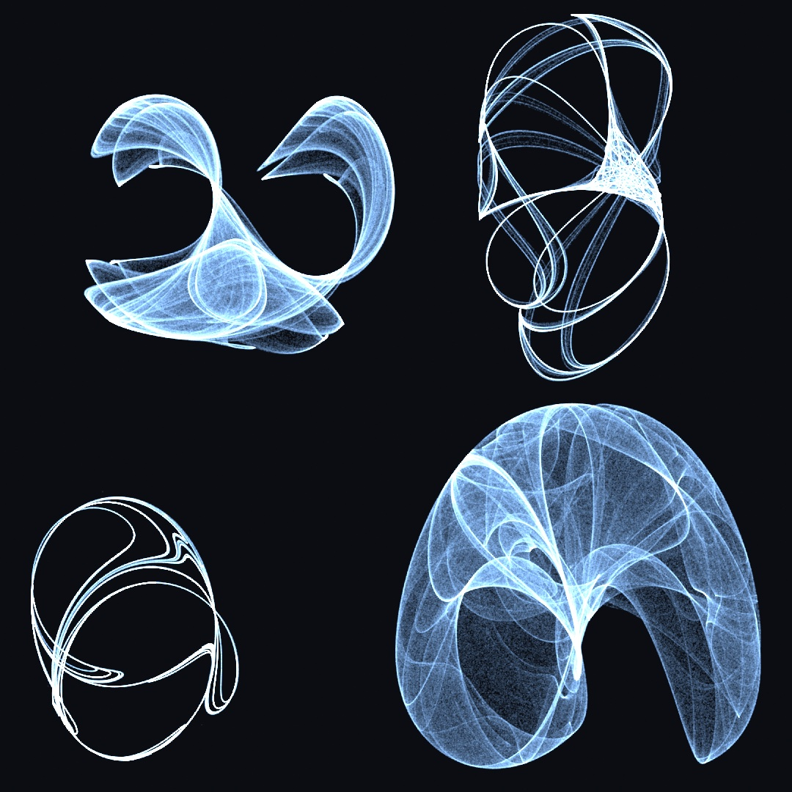
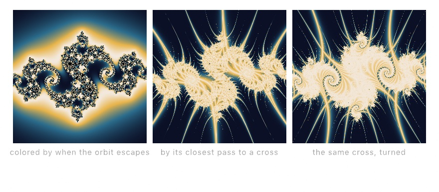

#### <sup>[Ollin](../README.md) → [Guide](README.md) → Chapter 18</sup>

---

# 18. Iterated forms



Four pictures up there, and one idea underneath all of them. Take a point, apply a rule, and plot where it lands. Then apply the same rule to the result and plot that, a hundred thousand times over. Nobody drew the fern, or the folded ribbon, or the lace. What you are looking at is a record of where a single wandering point spent its time.

The rules vary enormously: a coin flip between four affine maps, a pair of trigonometric formulas, a ring of circles used as mirrors, a group built out of two Möbius transformations. What sits around them does not vary at all, which is why the plate above is one plotting function called four times. That is the shape of this chapter, and by the end you'll have built the plate.

A word on where this sits. [Chapter 13](13-GrowingThings.md) grew things that spread through space, and [Chapter 14](14-FieldsAndFlow.md) followed fields across it. These systems do neither. They have no neighbors, no field, and nowhere to spread. They just iterate, and the picture is the leftovers.

## The same fern, played as a game: the chaos game

[Chapter 13](13-GrowingThings.md) grew a fern by rewriting a sentence and walking it with a turtle. There is a completely different way to get the same plant, and it is strange enough to be worth seeing. You play a game of chance with a handful of transformations.

Take four rules, each of which squashes, tilts, and shifts the entire plane. One draws the fern's main body slightly smaller and rotated. One draws the left frond, one the right, one the stem. Now put a dot anywhere at all, pick one of the four rules at random, move the dot by it, and mark where it lands. Then do that again, sixty thousand times.


```swift
let cloud = ifsPoints(.barnsleyFern, count: 60_000)
    .map { Vector2($0.x, -$0.y) }        // the fern's own y grows upward
noStroke()
fill(Color(hex: 0x2E5E3A))
drawPoints(fitted(cloud, in: canvasRectangle.inset(by: .all(80))), size: 1.5)
```

The reason this works is worth sitting with for a second, because it feels like it shouldn't. Every one of the four rules *shrinks* the plane. So wherever your dot started, a few jumps later that starting position has been squashed down to nothing and forgotten. What's left is the only set of points that the four rules, taken together, map exactly onto itself. The dot can't escape it and can't stay away from it, so given enough jumps it traces it out. That set is called the attractor, and the collection of rules is an **iterated function system**.

The picture also explains what the weights are for. The fern's rules aren't chosen with equal probability. The one drawing the main body gets picked about 85 percent of the time. That keeps the fine tip as well drawn as the base. Ollin ships `.barnsleyFern`, `.sierpinskiTriangle`, and `.sierpinskiCarpet`, and a system of your own is six numbers per rule plus a weight.

Two small practical notes come with it. The points arrive in the system's own coordinate space rather than canvas pixels. `fitted` scales and centers them into any rectangle you name. The fern also needs its y negated, because it grows upward while the canvas counts downward.

## Four more games worth knowing

The same move (play transformations at random, see where the orbit lives) generalizes further than ferns, and Ollin ships four of the places it goes.



A **fractal flame** is the chaos game with two additions. Each rule finishes with a nonlinear twist, a swirl or a fold or a turning-inside-out. Instead of plotting dots, you have every pixel *count* how many times the orbit visited it. Displaying the logarithm of those counts is what lets the blazing core and the faintest veil appear in one image. The color comes from which rules carried the orbit there, rather than from where it landed.

```swift
var source = SplitMix64(seed: 6)
let flame = FractalFlame.random(using: &source)
drawImage(flame.render(width: 900, height: 900, quality: 90, using: &source),
          in: canvasRectangle)
```

`quality` is how many samples each output pixel gets, so a few dozen previews and a few hundred makes a clean still. There's also a progressive `Renderer` you feed a slice of samples per frame. That is how flames are meant to be watched, rising out of the noise. Rolling a random flame is genuinely a roll, and some come out muddy. Rerolling until one sings is part of the practice, not a sign you did it wrong.

The flame's counting trick has a famous cousin. Square a number, add the point you started from, and repeat. Some starting points fly off to infinity. The ones that never do make up the Mandelbrot set, which [Chapter 19](19-GridSimulations.md) zooms into. The **Buddhabrot** is what the escapers leave behind. Test random starting points, and every time one escapes, let its whole path brighten each pixel it passed through. The piled-up visits, developed like a photographic plate, form a seated figure that was hiding in the set all along. Melinda Green found it in 1993.

```swift
let plate = Buddhabrot()      // three caps: long orbits red, short ones blue
let renderer = Buddhabrot.Renderer(plate, width: 560, height: 560, seed: 7)
// each frame:
renderer.accumulate(samples: 20_000)
drawImage(renderer.image(), in: canvasRectangle)
```


The `iterations` list does the coloring. Give it a single cap and the plate develops in gray. Give it three and the red, green, and blue channels expose at different orbit lengths, so color reads as orbit depth. A plate this deep resolves over many frames, the same way the flame does. Feed the `Renderer` a slice of samples per frame and let the figure rise. `Examples/Patterns/Buddhabrot` leaves one running.

**Inversion** is a different transformation to play with. Inverting a point in a circle turns the plane inside out around that circle. The rim stays exactly where it is, points near the center fly far away, and points far away land near the center. Take an arrangement of circles, repeatedly invert in one picked at random, and the orbit settles onto the arrangement's limit set. The one rule is never to pick the same circle twice in a row, because inverting twice in the same circle just undoes itself.

```swift
drawPoints(inversionLimitSet(of: mirrors, count: 26_000), size: 1.5)
```

Since the circles are in canvas coordinates, the dust needs no fitting. It lands among the mirrors that produced it, which is what the middle panel shows. Tangent rings give lace, separated circles give scattered dust, and overlapping ones tear the lace apart.

The third has no randomness in it at all. A **Kleinian limit set** comes from two Möbius transformations, which are the maps that send circles to circles. The set is built from the group of everything you can combine out of them. Walking that group systematically traces the boundary its orbits pile up against.

```swift
let curve = kleinianLimitSet(.lace)
noFill()
drawPolygon(fitted(curve.points, in: canvasRectangle.inset(by: .all(60))))
```

What makes this one immediately useful is the return type. It's a single `Contour`, one ordered closed curve with evenly spaced points. So it strokes, exports, and plots like any other geometry in this guide, rather than being a cloud you can only splat.

## Circles that pair off: Schottky

Those Möbius maps have a second use, and this one hands you circles rather than a curve.

Start with four circles and pair them up, two and two. A pairing is the map that turns everything outside one circle into the inside of its partner. Whatever you give it comes back smaller, and sitting in the partner. Hand a pairing the other three circles and you get three smaller circles nested inside one of them. Do it again with every pairing and its inverse, in every order, and those nest again, forever. The group you have built is a **Schottky group**, and the lace it leaves behind is that whole group drawn at once.


```swift
let pairings = schottkyCuspedPairs(in: canvasRectangle.inset(by: .all(60)))
noFill()
drawCircles(schottkyCircles(pairing: pairings))
```

One thing decides whether that picture comes out full or nearly empty, and it is worth knowing before you touch any of the numbers. When a pairing's two circles *touch*, its map holds the point where they touch perfectly still. Near that point it barely shrinks anything at all. So the orbit keeps handing back large circles generation after generation. They pile into the fan you can see at the left and right of the third panel. Separate that pair by even a third of its radius and every application shrinks harder. The arrangement that gave back nine thousand circles gives back fewer than three thousand. Same code, same four circles, and most of the picture is gone.

That is why `schottkyCuspedPairs` builds its four circles as two touching pairs. It also tells you which dial to reach for when you want motion. `lean` swings each pair around its own tangency point, so the pair goes on touching however far it swings. The picture stays full while the figure opens and closes. `twist`, which rotates a pairing off that setting, gives you spirals instead, and thins the lace as it goes. The `Patterns/Schottky` example walks `lean` back and forth and never drops below ten thousand circles.

What comes back is `[Circle]`, not a cloud of points. A Möbius map sends a circle to a circle, so nothing has to be flattened on the way. The lace exports as real circles, so a pen plotter draws it with the same round strokes you see on screen.

The circles and the Kleinian curves are two views of one thing, and the bridge between them is a pair of numbers. `schottkyCircles(ta:tb:in:)` takes the same two traces that `kleinianLimitSet` takes, and builds the same group. It draws the whole orbit as circles, instead of tracing its boundary as a curve. At traces `(2, 2)` the orbit is the Apollonian gasket. Every nearby pair of traces is another member of the same family. Bend the traces complex and the packing wobbles, or loosen them and it opens.


```swift
noFill()
drawCircles(schottkyCircles(.gasket, in: canvasRectangle.inset(by: .all(60))))
```

The named presets are the same ones the Kleinian curves use, so `.gasket` here and `.gasket` there are the same group wearing different clothes. The `Patterns/Schottky` example animates a small arc of this family, out from the gasket and back.

## Motion found in a formula

The games so far pick their next move with a coin. This family needs no coin at all. A **chaotic map** is a formula that takes a point and returns the next point. No noise, no canvas, just algebra folding the plane onto itself. Iterate one from any start and the visits trace a ghostly shape called a strange attractor, the formula's own signature. Plot a few million visits as faint additive dots and the shape develops like a photograph:



```swift
let map = ChaoticMap.clifford()          // x' = sin(a·y) + c·cos(a·x), y' = sin(b·x) + d·cos(b·y)
var p = Vector2(0.1, 0.1)
for _ in 0 ..< 30_000 {
    p = map.next(p)
    // scale p (it lives within about ±2) onto the canvas and plot it
}
```

The plates accumulate on a canvas that never clears, with `blendMode(.add)`. Instead of painting over what's below, each faint dot *adds* its light. The places the orbit revisits glow brighter, a first taste of the additive layering [Chapter 16](16-LayersAndEffects.md) develops. Every constant in `clifford(a:b:c:d:)` reshapes the ghost completely. Most values collapse to a dot or explode into static. Part of the craft is collecting constants that sing, and the four plates are four such finds. Three more maps wait in the same family, each with its own temperament. `.gumowskiMira()` wanders a sea of islands into a many-petaled blossom; plot it from the start with no settling, since the long wander *is* the picture. `.ikeda()` folds everything into one layered swirl. `.hopalong()` hops around nested rings that keep widening as it runs. The [attractors reference](../Docs/Drawing/Attractors.md) has all six forms. The 3D members of this family, Lorenz and friends, live in `StrangeAttractor` and wait for a camera, which [Chapter 23](23-Landscapes.md) gives them. That chapter is also where a million particles ride one at once.

## One dial away from chaos

The maps above have fixed constants. Give a map a single dial instead and you can ask a bigger question. The bigger question is not "what does this formula draw" but "*when* does it fall apart". That's what the one-dimensional `IteratedMap` family is for. Its famous member is the logistic map, `x' = r·x·(1 − x)`, a toy model of a population. `x` is this year's crowding, and `r` is how fast it breeds. Sweep the dial, let the orbit settle at each position, and plot where it landed:

```swift
let map = IteratedMap.logistic()                            // x' = r·x·(1 − x)
let plate = map.bifurcationImage(width: 800, height: 460)   // sweeps r = 2.4...4
```


The picture is the **bifurcation diagram**, and it reads left to right like a story. At low `r` the population settles to one steady value, a single line. At 3 the line forks, and the orbit flips between two values forever. The forks come faster and faster until, just past 3.57, they never stop coming and the orbit never repeats again. Nothing random was added anywhere in this picture. Chaos here is a dial turned too far. The pale slots inside the gray are windows where order briefly returns. The wide one near 3.83 holds the entire diagram again in miniature (sweep `over: 3.82...3.87` and see).

Two companions complete the toolkit. `cobweb(at:steps:)` traces one orbit as the classic staircase between the map's curve and the diagonal. It is the way to *watch* a single dial position think. `lyapunovExponent(at:)` scores one, where negative means settling and positive means chaos. The [`Examples/Patterns/Bifurcation`](../Examples/Patterns/Bifurcation/Sketch.swift) example prints the diagram with the exponent traced beneath it, dipping below zero at every window.

## Iteration without memory: escape-time fractals

Every orbit so far has been plotted where it went. The most famous iteration in mathematics is asked a different question, one pixel at a time. The **escape-time fractals** run their whole life inside a single frame:

```swift
drawImage(generate(.mandelbrot(phase: time * 0.03)).image, 0, 0)
```

Here is the entire method. Every pixel stands for a complex number, and the pixel runs one tiny loop of its own. Square the number you have, add a fixed one, and repeat. Some starting points stay near home forever. Others eventually run away to infinity, and the only thing the fractal records is **how many steps that took**. That count, turned into a color, is the picture. The regions that never escape are the set itself, painted in `interior`.


The first two panels are the same loop, differing only in which of its two numbers is held still. In the **Mandelbrot set**, the added number varies from pixel to pixel and the orbit always starts at zero. In a **Julia set**, that added number is fixed for the whole image, and you pass it as `c`. Each pixel then starts its orbit at its own position instead.

That is why the red mark matters. It sits at `c = -0.79 + 0.15i`, and the middle panel is the Julia set for exactly that `c`. Move the mark and you get a different Julia set. The rule of thumb worth keeping is that points near the Mandelbrot set's *edge* give the richest ones. Deep inside gives a plain blob, far outside gives dust. Every Julia set is a portrait of one point of the Mandelbrot set.

The bands look stepless rather than like contour lines, because the coloring uses a smoothed escape count rather than a whole number. `cycles` sets how many times the palette repeats across the range. `phase` walks the colors along the bands, which is the drifting-color animation. It costs nothing, because it recolors rather than recomputes.

There is one thing to get right, and it's the third panel:

```swift
generate(.mandelbrot(center: Vector2(-0.7463, 0.1102), zoom: 900, iterations: 400))
```

**`zoom` and `iterations` have to climb together.** The iteration cap is how long you're willing to wait before calling a point "trapped". As you magnify the boundary, more points need more steps to reveal that they do escape after all. Leave `iterations` at its default while zooming and the fine filigree fills in as a flat blob, because everything is being declared trapped too early. If a zoom looks like it lost its detail, raise the cap before you suspect anything else.

There is a second question you can ask the same loop. Instead of recording when the orbit escaped, record how close it ever came to a shape you hold in the plane. That is an **orbit trap**. Hold a cross of two lines there and every orbit that grazes it leaves a bright filament, so the picture grows stalks:

```swift
drawImage(generate(.orbitTrap(.cross(.zero), c: Vector2(-0.79, 0.15), zoom: 1.2)).image, 0, 0)
```



All three panels are the same Julia set. Only the question changes. The first asks each orbit when it escaped. The other two ask how near the cross it passed, and then turn the cross a little with `angle`. Feed `angle` your `time` and the stalks sweep through the filigree while the set holds still. The traps on offer are a point, a cross, a circle, and a square, and `glow` sets how far their light reaches. `Examples/Effects/OrbitTraps` shows all four side by side.

Which brings the sidebar back to the chapter. The simulation fields spread their iteration across *frames*, because their rules need neighbors and memory. A Gray-Scott pattern at frame 900 genuinely required the 899 before it. The fractal needs neither, so its whole life fits in one evaluation and any frame can be computed on its own. Both are the same lesson at different speeds. Iterate something simple, and structure appears. `Examples/Effects/Fractals` sets a Julia's `c` drifting so the filigree morphs continuously, which is the best argument for the technique that exists.

## Putting it together: a plate of four orbits

Now you can build the plate at the top. It is a naturalist's specimen sheet, four systems laid out under one hand, and the reason it works as a finished piece rather than a figure is that the four panels really do share their machinery. One function turns a rule into a cloud of points. One other function fits that cloud into a panel and lays it down. Make a new file, `MySketches/OrbitPlate.swift`:

```swift
import Ollin

final class OrbitPlate: Sketch {
    @Param("Points per panel", 20_000...220_000) var budget = 90_000
    @Param("Dot size", 0.6...3.0) var dotSize = 1.1
    @Param("Ink", 0.05...0.6) var inkAlpha = 0.18

    let paper = Color(hex: 0x14151A)
    let ramp = Ramp([
        Color(hex: 0xE8663C), Color(hex: 0xE8B23C),
        Color(hex: 0x49B8A0), Color(hex: 0x7C6FD1),
    ])

    override func draw() {
        seed(3)
        background(paper)
        noStroke()

        let panels = grid(columns: 2, rows: 2, padding: 70, gutter: 44)
        for (index, cell) in panels.cells.enumerated() {
            let inner = cell.frame.inset(by: .all(26))
            plot(orbit(index), in: inner, ink: ramp.color(at: Double(index) / 3))
            label(index, in: cell.frame)
        }
    }

    // Four rules, four clouds of points. Nothing below this line knows which
    // rule made the cloud it is drawing.
    func orbit(_ index: Int) -> [Vector2] {
        switch index {
        case 0:
            return ifsPoints(.barnsleyFern, count: budget).map { Vector2($0.x, -$0.y) }
        case 1:
            let map = ChaoticMap.clifford()
            var p = Vector2(0.1, 0.1)
            var trail: [Vector2] = []
            trail.reserveCapacity(budget)
            for _ in 0 ..< budget {
                p = map.next(p)
                trail.append(p)
            }
            return trail
        case 2:
            // A ring of mutually tangent mirrors, plus one filling their hole.
            // Tangency is the whole game: overlap them and the lace tears.
            let count = 5
            let r = sin(.pi / Double(count))
            var mirrors = (0 ..< count).map { i -> Circle in
                let a = .tau * Double(i) / Double(count)
                return Circle(center: Vector2(cos(a), sin(a)), radius: r)
            }
            mirrors.append(Circle(center: .zero, radius: 1 - r))
            return inversionLimitSet(of: mirrors, count: budget / 3)
        default:
            return kleinianLimitSet(.lace).points
        }
    }

    // The one plotting function. Fit the cloud to its panel, then lay every
    // point down at the same low alpha so that crowding is what makes a
    // region bright.
    func plot(_ cloud: [Vector2], in frame: Rectangle, ink: Color) {
        fill(ink.withAlpha(inkAlpha))
        drawPoints(fitted(cloud, in: frame), size: dotSize)
    }

    func label(_ index: Int, in frame: Rectangle) {
        let names = ["a chaos game", "a chaotic map", "circles as mirrors", "a Kleinian group"]
        fill(Color(hex: 0x8A8FA0))
        textFont(OutlineFont.systemMedium)
        textSize(20)
        textAlign(.left, .top)
        drawText(names[index], frame.x + 4, frame.y + 4)
    }
}
```

Run it, then pull the ink alpha down and the point budget up. What each piece contributes:

- `orbit(_:)` is where the four systems live, and it is the only place they differ. Three of them return a cloud they generated; the Kleinian one returns a curve's points, which is the same list of `Vector2` and so plots identically.
- `plot(_:in:ink:)` never asks what it is drawing. `fitted` measures whatever it is handed and scales it into the panel, which is why the fern's own coordinates and the Clifford map's plus-or-minus-two range both land correctly with no per-system numbers anywhere.
- The low alpha is the whole reason these read as forms rather than scribble. A single dot is nearly invisible. Where the orbit returns often the dots stack, and the density becomes the image. Turn `Ink` up to 0.6 and the picture flattens into a silhouette, which is the same information with the interesting part thrown away.
- `grid` and `Ramp` do the layout and the color, from [Chapter 6](06-GridsAndRepetition.md) and [Chapter 2](02-Color.md). The plate is a grid piece that happens to be full of orbits.

Before moving on, make it yours:

- Swap `ChaoticMap.clifford()` for `.deJong()`, `.gumowskiMira()`, or `.ikeda()`. Each has its own temperament, and the panel is one word wide.
- Give the fern panel `.sierpinski` or one of the other systems, and watch `fitted` absorb the change with no other edit.
- Feed the ring in panel three six mirrors instead of five, then separate them slightly. The lace tears, exactly as the section promised.
- Drop to one panel at the full canvas and raise the budget to its ceiling. These are density plates, and they keep rewarding samples long past the point where a shape would be finished.

## Where this comes from

The chance games have their own shelf. Iterated function systems and the chaos game are Michael Barnsley's, from *Fractals Everywhere* (1988), and the fern uses his published four-map table. The fractal flame is Scott Draves and Erik Reckase's algorithm, which Draves began in 1992. It ran for years as a distributed screensaver that evolved flames by popular vote. The Buddhabrot is Melinda Green's 1993 discovery, and the three-cap false-color reading is hers too, named after the astronomical plates it resembles. Circle-inversion limit sets follow Michael Frame and Tatiana Cogevina's 2000 rendering method, and Frame's Yale course pages explain them clearly. The Kleinian curves and the paired circles both come from David Mumford, Caroline Series, and David Wright's *Indra's Pearls*. It runs four hundred pages, making Felix Klein's groups visible. Friedrich Schottky described the paired-circle groups in 1877.

The formula-driven maps come from elsewhere again. The Clifford attractor is named for Clifford Pickover, and the de Jong attractor for Peter de Jong. Paul Bourke's long-running fractal pages popularized both. The Gumowski-Mira map came out of particle-beam physics at CERN, and the Ikeda map out of laser optics. Barry Martin's hopalong reached everyone through A. K. Dewdney's *Scientific American* column. Robert May's 1976 *Nature* paper "Simple mathematical models with very complicated dynamics" made the logistic map and its bifurcation diagram famous, and the universal rhythm of its forks is Mitchell Feigenbaum's discovery. The Mandelbrot set is named for Benoit Mandelbrot, who first plotted it in 1980, on the mathematics of Gaston Julia's 1918 sets. Full credits are in the project's [attribution notes](../ATTRIBUTION.md).

## Go deeper

- [Fractals](../Docs/Generators/Fractals.md): the `IFS` type and its presets, the whole `FractalFlame` surface including the progressive renderer, inversion limit sets, the Kleinian trace presets, the Schottky circle orbit with both family builders and why a tangent pair keeps the picture full, and the escape-time family with its orbit traps.
- [Attractors](../Docs/Drawing/Attractors.md): every `ChaoticMap`, the `IteratedMap` family, `bifurcationImage`, and the GPU tier that carries a million orbits at once, which [Chapter 23](23-Landscapes.md) puts to work as a field of drifting points.
- [Chaotic maps and bifurcation](../Docs/Generators/Bifurcation.md): the one-dimensional families, the diagram's dot and density forms, cobwebs, and Lyapunov exponents.
- Appendix B draws the idea underneath all of this, one picture per entry: [Local rules, global structure](B-JustEnoughMath.md#local-rules-global-structure), and [Where things are](B-JustEnoughMath.md#where-things-are) for the coordinates the orbits live in.
- Worked examples: [`Patterns/FractalFlame`](../Examples/Patterns/FractalFlame/Sketch.swift), [`Patterns/Buddhabrot`](../Examples/Patterns/Buddhabrot/Sketch.swift), [`Patterns/Kleinian`](../Examples/Patterns/Kleinian/Sketch.swift), [`Patterns/Schottky`](../Examples/Patterns/Schottky/Sketch.swift) (the lean swung back and forth), [`Patterns/CliffordAttractor`](../Examples/Patterns/CliffordAttractor/Sketch.swift) (the density bloom), [`GumowskiMira`](../Examples/Patterns/GumowskiMira/Sketch.swift), [`Bifurcation`](../Examples/Patterns/Bifurcation/Sketch.swift), and [`Effects/Fractals`](../Examples/Effects/Fractals/Sketch.swift) (the escape-time pair as a shader).

---

[Contents](README.md#contents) · Previous: [Chapter 17, Your first shader](17-YourFirstShader.md) · Next: [Chapter 19, Simulations on a grid](19-GridSimulations.md)
