#### <sup>[Ollin](../README.md) → [Guide](README.md) → Chapter 18</sup>

---

# 18. Sculpting with fields

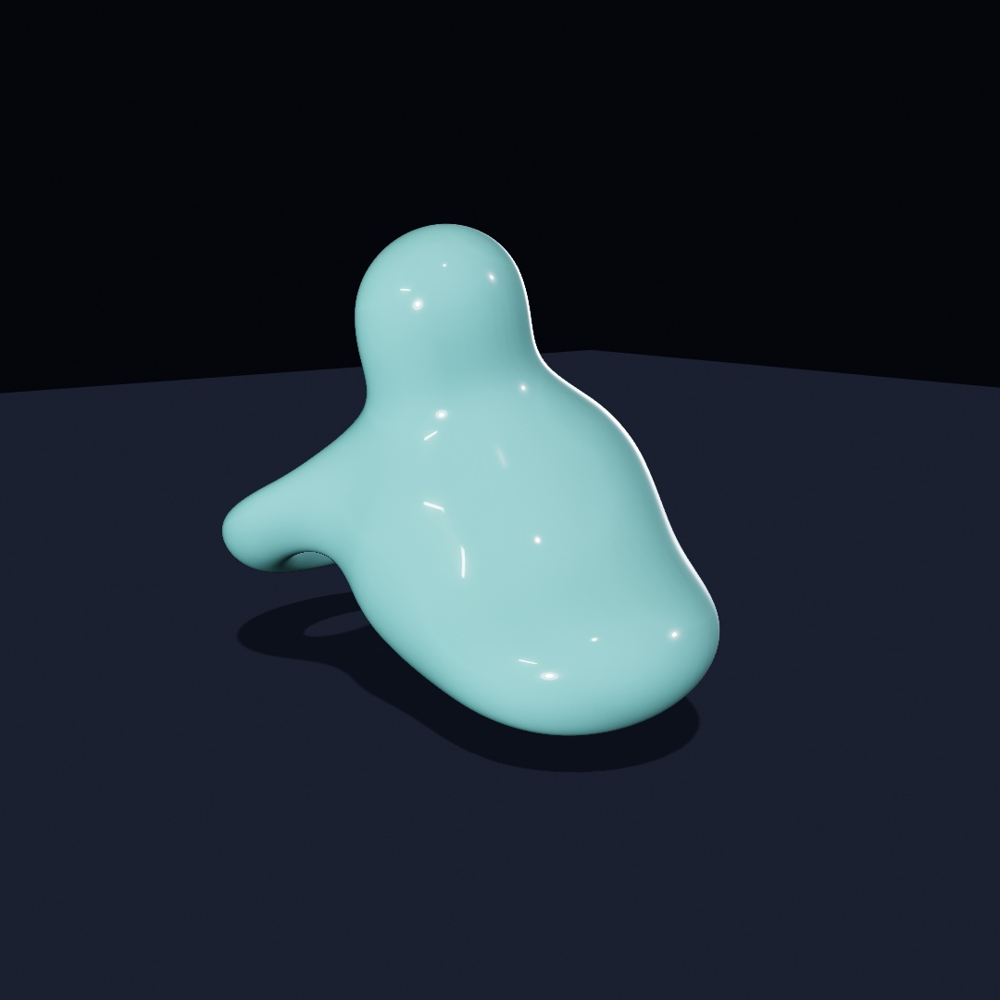

Chapter 13 treated shapes as outlines you cut and joined, like paper. This chapter treats them as something closer to wax: shapes that melt into each other, carve each other, and hold together as one surface no matter how you push them. The tool is the **signed distance field**, an idea you've already met twice without the name, and it ends in the sculpture above: one body made of four melted lobes, slowly breathing, orbitable with the mouse.

## A shape as a question

Chapter 12 defined a field as an answer at every point. A **signed distance field** is a shape stored that way. Ask any point of the canvas and it answers with one number, *how far is the nearest surface*. The sign carries which side you're on: positive outside, negative inside, zero exactly on the boundary.

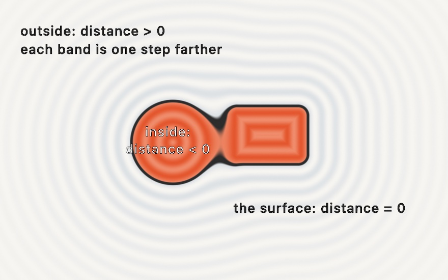

That's the whole idea, and it's worth a slow look. The shape is not stored as an outline, and the *bold line* is only the places where the field happens to answer zero. Chapter 15 used this trick per pixel (a circle was "all the points within `radius`", and `smoothstep` softened its edge). What's new here is what the representation makes possible, because if two shapes are each a distance function, then *combining the answers* combines the shapes.

## Melting

The everyday container for this is the `SDF` value type, and the first verb to learn is `smoothUnion`:

```swift
import Ollin

final class Melt: Sketch {
    override func draw() {
        background(Color(hex: 0x101318))
        noStroke()
        let k = 20 + (sin(time) * 0.5 + 0.5) * 90

        let blob = SDF.circle(radius: 130).colored(Color(hex: 0xE4572E))
            .smoothUnion(SDF.rect(width: 240, height: 140, cornerRadius: 28)
                .colored(Color(hex: 0x3A6EA5))
                .at(x: 130, y: 40), k: k)

        drawSDF(blob.at(x: width / 2, y: height / 2))
    }
}
```

Run it and watch the seam. `SDF.circle` and `SDF.rect` are field *values*, like a `Shape` or a `Color`. From there `.at` moves one, `.colored` paints one, `.smoothUnion` merges two into a new field, and `drawSDF` rasterizes whatever field you hand it in a single pass. The knob `k` is the width of the melt, in canvas points:

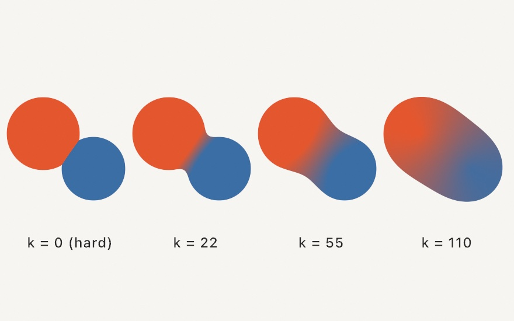

At `k = 0` the union is hard, two shapes overlapping like Chapter 13. As `k` grows, the seam becomes a fillet, then a neck, then the pair is one body. Look at the colors, because the smooth union blends the two operands' colors across the melt, and that is what makes the result read as one object rather than a trick. This one knob is most of the medium, so put it on a `@Param` slider and you'll feel it immediately.

One habit is worth setting early, and it's that **order matters in the chain**. Every call wraps the field before it, so `circle.at(p).scaled(2)` scales the *moved* circle (it lands twice as far out), while `circle.scaled(2).at(p)` scales in place and then moves. Read chains inside out and they always make sense.

## The verbs

Melting is one verb of six:

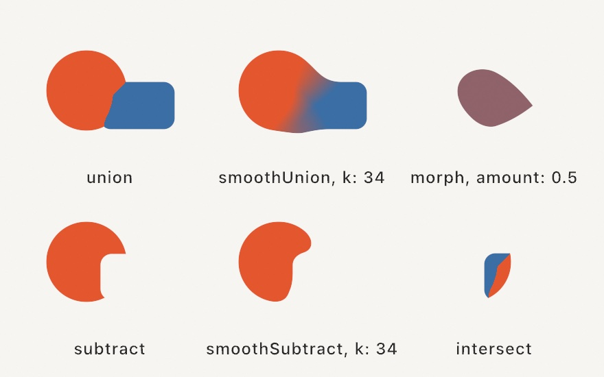

```swift
a.union(b)               // either
a.smoothUnion(b, k: 34)  // either, melted
a.subtract(b)            // a with b carved away
a.smoothSubtract(b, k: 34)
a.intersect(b)           // only the overlap
a.morph(b, amount: 0.5)  // a shape halfway between the two
```

These are Chapter 13's booleans reborn on fields, plus two things outlines can't do. The smooth forms are one. The other is `morph`, which blends the *boundary itself*, so at `0.5` you get a genuinely in-between shape rather than a crossfade. Two modifiers round out the kit: `.rounded(12)` inflates any field with soft corners, and `.onion(8)` hollows it into a shell. And past the melted family there's a whole *machined* family (`chamferUnion`, `stairsUnion`, `columnsUnion`, plus engrave, groove, tongue, and pipe detailing) that shapes the seam like joinery instead of wax. The [combinators reference](../Docs/Drawing/Combinators.md#combining) has the full bench.

## Writing it like drawing

Building chains is precise, but sometimes you just want to draw. The block form captures ordinary draw calls and merges them:

```swift
translate(width / 2, height / 2)
fill(Color(hex: 0xE4572E))
smoothUnion(k: 18) {
    drawCircle(0, 0, 110)
    drawRect(center: Vector2(120, 30), width: 190, height: 80, cornerRadius: 20)
    drawNgon(-105, 40, 62, sides: 6)
}
```

Everything drawable with a fill can join a block, including shapes the `SDF` type doesn't name (hearts, stars, trapezoids), and each call's own `fill` becomes its color in the melt. It reads like normal drawing, and the block simply holds the shapes open until it closes, then merges them all.

## Into space

Everything above lifts into 3D nearly unchanged. `SDF3D` builds fields in space, and `drawSDF3D` draws the merged surface through Chapter 17's camera, lit by its lights, wearing its materials:

```swift
final class FirstMarch: Sketch {
    override func draw() {
        background(Color(hex: 0x0D1017))
        camera(.orbiting(target: .zero, radius: 5.2, azimuth: 0.5,
                         elevation: 0.3, fieldOfView: .pi / 4))
        material(.jade)

        let blob = SDF3D.sphere(radius: 1).colored(Color(hex: 0x39D0C8))
            .smoothUnion(SDF3D.sphere(radius: 0.72)
                .at(x: 1.0, y: 0.42, z: 0.1)
                .colored(Color(hex: 0xFF4F97)), k: 0.5)
            .smoothSubtract(SDF3D.sphere(radius: 0.55).at(x: -0.45, y: 0.75, z: 0.5), k: 0.25)

        drawSDF3D(blob)
    }
}
```

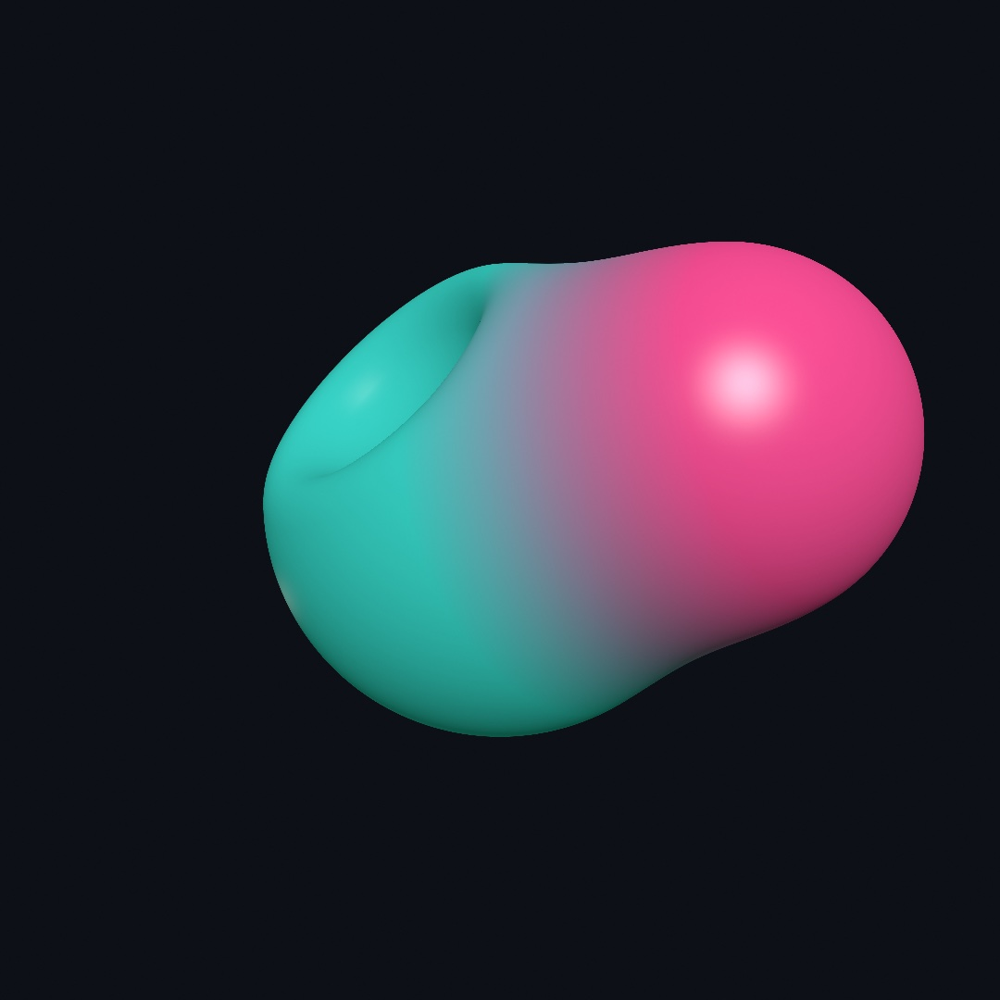

Try building that from triangle meshes and you'll appreciate what just happened: the two spheres aren't two surfaces cleverly joined, they are *one* surface, because the field underneath is one function. The leaf catalog matches the mesh primitives (sphere, box, torus, capsule, cylinder, cone, octahedron, and more, plus `line(from:to:radius:)`, a stroke between two points that's perfect for sketching limbs and branches for the melt to flesh out). Fields and meshes coexist in one scene and correctly hide each other, and the [combinators reference](../Docs/Drawing/Combinators.md#fields-3d) has the whole catalog.

## How the picture gets made

A mesh is triangles, and the GPU knows how to draw triangles. A field is just a function, so how does it become pixels? By *asking it the right question, repeatedly*. For each pixel, a ray leaves the camera, and the field is asked: how far is the nearest surface? The answer is a promise, nothing is closer than this, so the ray can safely hop exactly that far. Ask again, hop again:

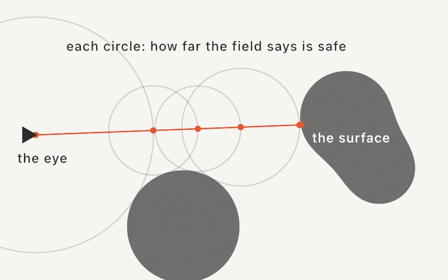

The hops shrink as the ray nears a surface (watch them tighten as the ray passes over the lower shape) and grow again in open space, and the ray lands on the surface without ever stepping through it. This is called **sphere tracing**, and it's the second big advantage of the representation: the same number that let shapes melt is what steers the rays that draw them.

You get all of this without writing any of it. The one practical knob is `raymarchQuality(_:)`. Tracing costs by the pixel, so the live window traces at a resolution budget by default while exports always render at full quality. If a heavy field stutters while you sketch, `raymarchQuality(.performance)` loosens that budget further.

## The other way out

Everything so far turns a field into pixels. Sometimes you want it to turn into an object instead.

`isosurface` walks a grid of cubes through space, asks the field for a value at every cube corner, and stitches the crossings into triangles. What comes back is an ordinary `Mesh`, so it lights, takes materials and shadows, and exports like anything else you draw.

The field worth reaching for first is `Metaballs`: soft spheres whose values add up.

```swift
var blobs = Metaballs()
blobs.add(at: Vector3(-0.9, 0.25, 0), radius: 0.62)
blobs.add(at: Vector3(0.5, -0.2, 0.15), radius: 0.52)
blobs.add(at: Vector3(1.4, 0.45, -0.2), radius: 0.40)
drawMesh(blobs.mesh())
```

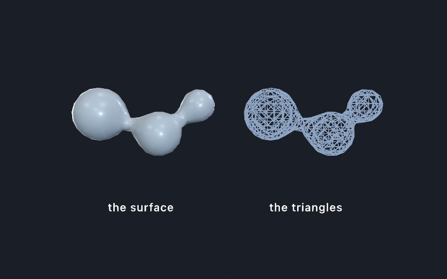

`radius` is the size a ball reads at on its own. Put two within reach of each other and the values in the gap add up to more than either one makes there, so the surface swells across it and the pair runs together. Move them apart and the bridge necks down and snaps. `level` is the value the surface is drawn at, so lowering it fattens everything and makes blobs merge from further away, and raising it thins them until they separate. A negative `strength` carves into a neighbour instead of joining it.

The right panel is that same form with `wireframe()` on, marched deliberately coarse so the cells show. The left one is the same coarse mesh, and it still looks smooth, because the shading normals come from the field rather than from the flat faces.

Any field works here, not just metaballs. The one thing to know is which side it treats as solid: the surface wraps the region where the field runs *above* the level, so a distance function, which is negative inside, needs a minus sign in front of it.

So there are two ways out of a field, and they cost differently. `drawSDF3D` shades straight to pixels and pays by the pixel; `isosurface` makes geometry and pays by the volume, cubically in `resolution`. Reach for the mesh when you need a real object, and for the traced field when you just want it on screen.

## Sculpting like clay

For forms you build up rather than compose, the `sculpt { }` block turns the operators into working state. Shapes `add()` on or `carve()` away, melting by the current `blend(_:)` amount, and the block reads top to bottom like a session at a potter's wheel:

```swift
sculpt {
    blend(0.3)                 // melt amount for what follows
    fill(Color(hex: 0xD96F4E))
    drawSphere(radius: 1.0)                                        // the body
    withState { translate(0, 0.95, 0)
                drawTorus(radius: 0.5, tube: 0.16) }               // a lip melts on
    carve()                    // now shapes cut away
    withState { translate(0, 1.1, 0); drawSphere(radius: 0.52) }   // the hollow
    add(); blend(0.05)         // back to adding, nearly hard
    withState { translate(0, 0.35, 1.05); rotateX(.pi / 2)
                drawTorus(radius: 0.34, tube: 0.09) }              // a handle
}
```

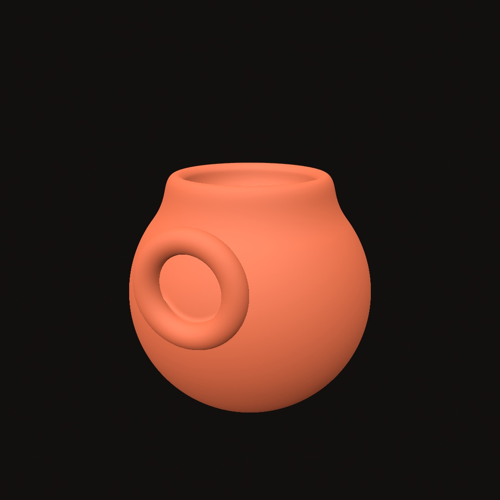

Flip one `add()` to `carve()` and a bump becomes a dent, which is exactly the kind of edit live coding thrives on. A further set of distortions bends whole forms: `.twisted(1.2)` screws a shape around its axis, `.bent(0.6)` curls it, and `.displaced` / `.roughened` ripple or roughen the surface (the rock look). They're all safe to stack, because the tracer compensates for the distortion on its own.

## Folding space

The last trick is the strangest one. Instead of copying a shape, you can fold the *space it lives in*, so one shape answers for many:

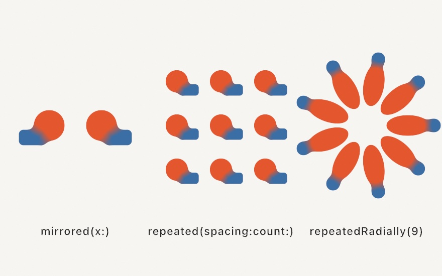

```swift
cluster.mirrored(x: true)                             // a facing pair
cluster.repeated(spacing: Vector2(88, 88), count: 1)  // a 3×3 tiling
petal.at(x: 82, y: 0).repeatedRadially(count: 9)      // a rosette
```

There is still only one cluster, because the domain operator rewrites each query point before the field answers, folding it across the mirror, wrapping it into a cell, or rotating it into a wedge. Copies are free, so a thousand-copy tiling costs what one copy costs. All three work in 3D too, where `repeatedRadially` fans a wedge around an axis and a mirrored melt becomes a symmetric creature. One honest caveat is worth knowing. The radial fold is exact when the repeated content is symmetric within its wedge, and an asymmetric cluster can show a faint seam where the wedges meet, which is why the rosette panel uses a symmetric petal.

## The finish

A field shades like a mesh, so all of Chapter 17 applies: `material(.jade)` gives a melt its glow, and `castShadows()` grounds it (a field even self-shadows, and trades shadows with the meshes around it). But there is one family of finishes Chapter 17 deliberately left for here, because it doesn't work without something this chapter's sculptures finally give it a reason to set up.

### Two numbers for most real surfaces

The materials in Chapter 17 were named looks: velvet, jade, toon. The **physically based** ones are different in kind. Instead of a name, you give two properties, and the renderer works out how light should behave:

```swift
material(.metal(roughness: 0.12))         // a metal, nearly polished
material(.dielectric(roughness: 0.4))     // a non-metal, satin
```

**Metal or not** is the first question, and it's close to binary in the real world. Metals tint the light they reflect (gold reflects gold) and have no color of their own underneath. Everything else, called a *dielectric* (plastic, glass, skin, paint, stone), reflects white highlights and shows its own color through them. **Roughness** is the second, and it's the one you'll actually reach for: how scattered the reflection is, from `0` for a mirror to `1` for chalk.

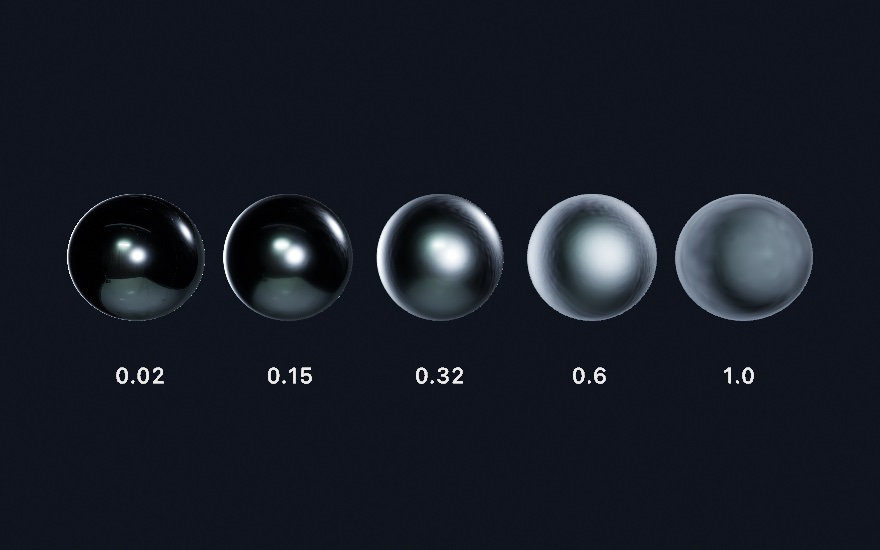

That is one material with one number changed. The leftmost sphere is a mirror, so what you see on it is mostly a reflection of the room it's standing in, which is why it's dark with one small bright highlight. As roughness grows, that reflection smears out into a wide sheen, and by `1.0` it has spread so far that the sphere just reads as its average brightness. `fill` still sets the color, exactly as before; roughness only decides how the surface handles light.

There are ready-made ones for the common cases (`.brushedMetal`, `.polishedMetal`, `.smoothPlastic`, `.roughPlastic`), and they're all the same two properties underneath. Watch the naming, though: plain `.plastic` is one of the *stylized* finishes from Chapter 17, not a physically based one, so reach for `.smoothPlastic` when you want this family.

### Surroundings as the light

Here's the catch that makes this a Chapter 18 topic. A mirror reflects its surroundings, so **a physically based surface with no surroundings has almost nothing to work with** and goes dark and dull. Named lights don't fix it, because a point light is a point: it makes a highlight, not a reflection.

What fixes it is an **environment**: a photograph of a whole place, wrapped around your scene as a sphere, used as the light.

```swift
environment(.sunset)
material(.metal(roughness: 0.12))
drawSDF3D(body)
```

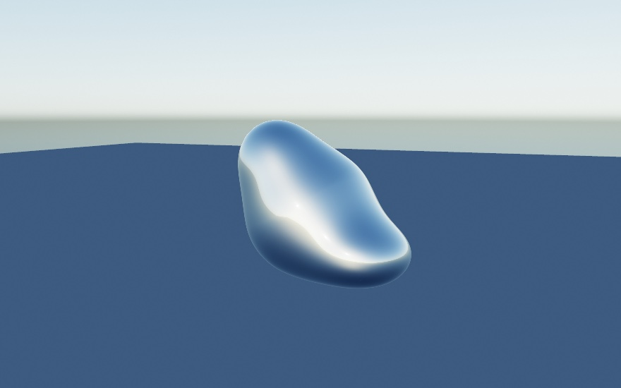

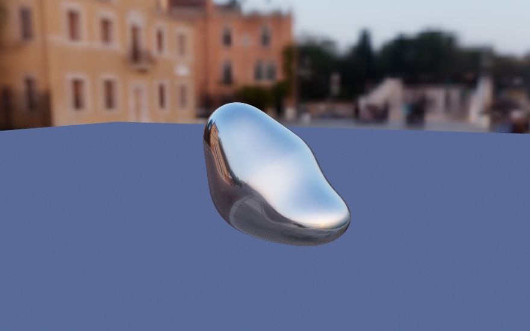

Those two images are the same field, the same material, the same camera, and the same floor. The only difference is one word. Look at the left flank of the second blob and you can read the buildings in it, which is the whole idea in one glance: the surroundings *are* the reflection, and they are also the light. The floor is lit by the sky in the first and by an ochre evening in the second, without a single light being placed.

Twenty environments come curated. Eight of them (`.studio`, `.city`, `.courtyard`, `.forest`, `.interior`, `.night`, `.sunrise`, `.sunset`) are bundled, so they work offline and instantly; the other twelve download the first time you use one and cache from then on. They range enormously in real brightness, so each is exposed to a consistent level for you, and they pair well with `toneMap(.aces)` from Chapter 14 for a filmic rolloff on the highlights.

The first image uses none of them. **`.sky(...)`** builds a daylight sky at runtime with nothing to load:

```swift
environment(.sky(sunElevation: 0.35))       // no asset, and the sun can move
```

It takes a sun elevation and a `turbidity` for how hazy the air is, and because it's computed rather than loaded, you can animate the sun and watch the whole scene's light follow. It's the one to reach for when you want good lighting and don't want to think about assets at all.

Two knobs come up immediately in practice. An environment paints itself **behind** your scene as a backdrop, which is usually what you want, since the reflections then match what you can see. When you'd rather keep your own `background(_:)`, `.lightingOnly()` keeps the light and drops the picture. And `.backgroundBlur(_:)` softens just the backdrop, which pushes it back behind the subject; both figures above use a little.

`SDF3D.plane()` is worth knowing about here too, since it's an infinite floor you can merge into the field for true horizon-to-horizon self-shadowing.

## Mirrors that see off screen

Chapter 17 finished with screen-space reflections and an honest limit: they reflect what is on the screen, so they cannot show you anything the camera can't already see. `rayTracedReflections()` is the answer to that, and it works differently enough to be worth understanding.

Instead of searching the finished picture for what a reflection should show, it fires an actual ray off each reflective surface and asks what the ray hits, using the real geometry. Off-screen objects appear. Hidden faces appear. The underside of a ball resting on a mirrored floor appears, because the ray goes there and looks. It integrates into the environment lighting rather than sitting on top as a post-process, so a traced hit simply replaces what the environment would have contributed, and a ray that hits nothing shows the sky.

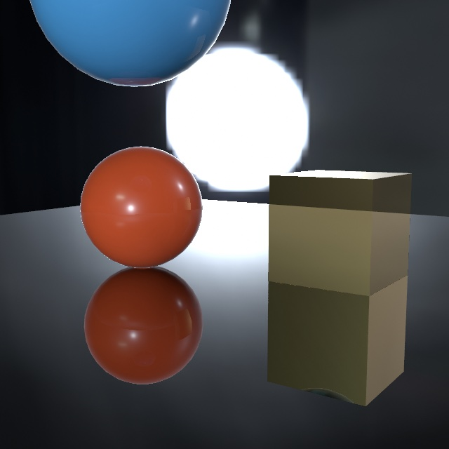

Look at the box's reflection rather than the sphere's. You can see its underside, the face resting toward the floor, which the camera never sees from where it stands. That face exists in the geometry, so a ray sent to it comes back with an answer. A screen-space reflection has no pixels of that face to borrow, because the picture simply doesn't contain it, and has to approximate.

```swift
environment(.studio)
rayTracedReflections()          // needs a ray-tracing GPU; a no-op elsewhere
material(.metal(roughness: 0.08))
```

Three conditions come with it. It needs an `environment(_:)` to fall back to, it only affects physically based materials, and it needs a GPU that can trace rays. Every Apple silicon Mac can, though the M3 generation and later do it in dedicated hardware and earlier chips do it in software, so the same scene costs more frames on an M1 or M2. Anywhere it isn't available the call does nothing at all rather than failing, so a sketch that asks for it still runs and simply looks plainer, which is why you can leave the call in.

There's one behavior worth expecting rather than being puzzled by. Reflections are traced with a limited number of rays and cleaned up over time while the camera holds still, so a fresh view can look faintly noisy for a moment before it settles. Exports don't have that problem, because there Ollin averages several rays within each frame instead of across frames, which is also why a video export can't flicker.

When you want the map of which finish applies to which kind of geometry, meshes and fields differing in a few places, the [combining reference](../Docs/3D/Combining.md) is the table for it.

## Light that bounces

Every light in the last two chapters worked the same way: it left the lamp, hit a surface, and stopped. Real light doesn't stop. The sun patch on your floor lights your ceiling from below, a red wall tints the white shelf beside it, and the dark side of everything in the room is filled in by light arriving second-hand. **Direct light only ever explains half a picture**; the other half has bounced at least once. One call turns that half on:

```swift
spotLight(.white, at: Vector3(0, 3.8, 0), direction: Vector3(0, -1, 0), intensity: 3)
castShadows()
globalIllumination()        // needs a ray-tracing GPU; a no-op elsewhere
```

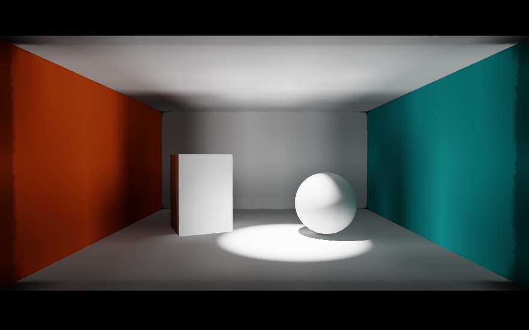

Everything in this room except the pool itself is bounce. The spot never touches the ceiling, and the ceiling glows anyway, lit from below by the floor. The walls were never lit directly either, yet the orange one reads orange, because floor-light reached it and came back stained. The sphere's shadow side isn't black; it's filled by the bright floor beside it. Cover the figure with your hand except the pool, and you're looking at what the direct-only version showed.

Under the hood, Ollin scatters a grid of invisible **light probes** through the scene and re-asks them, every frame, what light is arriving from every direction, by firing rays at the actual geometry. Lit surfaces then read their neighborhood's probes for the light the lamps couldn't deliver directly. Because the probes are re-traced live, a swinging lamp or a moving shape keeps bouncing correctly, and nothing is baked ahead of time. Three practical notes fall out of that:

- **It composes with what you already know.** With `castShadows()` on, bounce respects the same shadows the direct light does, so light doesn't sneak through a wall on the second hop (a sealed box stays dark inside). With an `environment(_:)`, the probes carry the sky in *with occlusion*, so a room lit through a doorway darkens with distance from the door instead of glowing evenly, which the plain environment ambient can't do.
- **It's the diffuse half.** Matte surfaces gather bounce; a mirror's sharp image of the scene is `rayTracedReflections()`, the specular half from the previous section, and the two are made to run together.
- **`intensity` is an artistic dial, not a lie detector.** `1` is physical. The figure runs `1.6` because the picture wanted it, and that's the whole job of the knob.

Like the reflections, the probe field settles over a few frames live (a sudden lighting change fades in, like your eyes adjusting) and converges fully inside each frame on export, so a still or a video reproduces exactly. And like the reflections, it needs a ray-tracing GPU and does nothing at all elsewhere, so the call can stay in the sketch.

The [`GlobalIllumination` example](../Examples/3D/Lighting/GlobalIllumination/Sketch.swift) is this room with the lamp swinging, and the space bar toggles the bounce, which is the clearest before-and-after you can give yourself. The bounce follows the picture wherever it goes: a wall seen *inside a mirror* carries the same second-hand light as the wall itself, and a scene drawn into a layer for depth of field gathers it like the canvas does. If a heavy scene stutters while you sketch, `globalIlluminationQuality(.performance)` trades a grainier bounce for frame rate, the same kind of dial shadows have; exports always take the fine end on their own. Scale isn't your problem either: on a terrain-sized scene, where the scene-wide probe grid would spread too thin, finer probe volumes gather around the camera on their own and travel with it, so the bounce near what you're looking at stays room-quality with nothing to configure.

## Edges that settle

The last two sections shared a trick worth naming: render a slightly different estimate every frame, and average. The reflections jitter their rays; the probes rotate their fans. `temporalAntialiasing()` applies the same idea to **every edge in the 3D picture**:

```swift
camera(.orbiting(target: .zero, radius: 8, azimuth: time * 0.05, elevation: 0.3))
temporalAntialiasing()      // any Metal GPU; edges refine as frames accumulate
```

Every 3D frame already takes eight samples per pixel, but always at the *same* eight positions, so a thin bright edge at a shallow angle still lands as a fixed staircase, and the steps crawl when the camera drifts. With the call on, the camera's projection is nudged by a sub-pixel offset that changes every frame and the frames fold into a running average, so each pixel has soon been sampled at dozens of positions instead of eight: the staircase melts into a gradient, the crawling stops, and the leftover shimmer of the traced effects above calms down with it. It follows the camera (orbiting keeps the accumulated detail), leaves 2D drawing untouched (that path is already exact), and, like everything in this chapter, an export doesn't wait for frames: it renders the scene several times at fixed offsets inside each frame and averages, so a still is finished immediately and a video can't flicker. Unlike the mirrors and the bounce, it doesn't need a ray-tracing GPU; any Mac that runs Ollin can do it.

One thing the average can't know on its own is where a *moving object* was last frame. The camera's motion is followed automatically, but a mesh spinning or flying through the scene on its own refreshes its history instead (no ghost trails, at the price of its edges reading rawer mid-flight). Wrap its drawing in `withMotion { }` and Ollin remembers the block's placement from frame to frame, handing the average each mover's exact screen motion, so its edges keep their refinement while they move; name the block (`withMotion("rotor") { }`) if the code path that draws it changes between frames.

The [`TemporalAA` example](../Examples/3D/Effects/TemporalAA/Sketch.swift) is a trellis of thin tilted rods under a slow camera sway, with the toggle on a knob, plus an orbiting bar whose `withMotion` has a knob of its own; flip them mid-motion and watch the edges stop crawling. The scenes where it makes the most difference are exactly that kind: hairline geometry, high contrast, movement.

## Glass

There has been a way to make a surface see-through since Chapter 17: give the `fill` some alpha, and the surface fades. Glass is a different thing. The surface stays fully there, with its highlights and reflections, and the *light* comes through instead, bent and tinted on the way. That's transmission, and it's one material call:

```swift
environment(.studio)                  // something to transmit
fill(.white)
material(.glass(thickness: 1.8))      // a solid body: a sphere of radius 0.9
drawSphere(radius: 0.9)
```

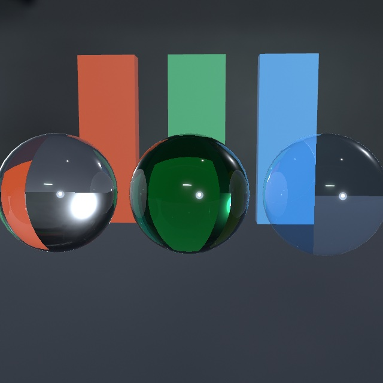

The one distinction that matters is `thickness`. At `0` the body is a thin wall, a pane or a soap bubble: what's behind passes through nearly straight, just tinted by the `fill` and dimmed at the edges where the surface turns away. Give it a thickness (a sphere's diameter is the natural number) and the body becomes solid: now the light refracts on the way in and again on the way out, so a solid ball shows the world behind it flipped and gathered, the crystal-ball look. **A solid ball is a lens; a thin wall is a window.** The middle sphere in the figure adds the other solid-body knob: `attenuationColor` with an `attenuationDistance`, which is Beer-Lambert absorption under a friendlier name. You say what white light should become after traveling that far inside, and thicker paths get more of it, which is exactly why real bottle glass is palest at its center and deepest green at the rim.

Two more knobs do what you'd hope: `roughness` frosts the glass (the view through it blurs into a glow), and `ior` sets how strongly the body bends light, from `1.33` for water through `1.5` for glass to `2.42` for diamond.

Glass needs an `environment(_:)`, for the same reason a mirror did: there has to be something on the other side to show. On its own it refracts the environment, and that already reads as glass. Add `rayTracedReflections()` on a Mac that traces and the view through the glass upgrades to the actual scene, which is what the figure shows: those bars appear *through* the spheres because rays really pass through and hit them. One call upgrades mirrors and glass together.

And the one glass object everyone knows is a soap bubble, which is thin glass plus one more idea: a *film* whose thickness drains and swirls, coloring the surface with marbled interference bands that drift while you watch. That's the iridescence finish's soap-film mode, `iridescenceFlow`, composed straight onto the glass (`iridescencePhase` is the clock, and you drive it with `time`, so exports reproduce). The [`SoapBubble` example](../Examples/3D/Materials/SoapBubble/Sketch.swift) is a handful of them rising and wobbling.

Two honest edges, so they don't puzzle you later: glass still casts a solid shadow, and glass seen *inside a mirror* (or through other glass) reads as a shiny opaque ball, because a traced ray doesn't re-enter the transmission math. Both are the standard real-time compromises, and both have follow-ups on the roadmap.

## Paint and cloth

Two more finishes are built by *layering* rather than by choosing numbers for one surface, because that's how the real things are made. Car paint is a metallic base under a thin polished lacquer. Velvet is a matte body under a haze of stray fibers. Each layer gets its own knob on the physically based material, and each has presets so you can start from the name.

```swift
fill(Color(hue: 0.99, saturation: 0.8, brightness: 0.7))
material(.carPaint(roughness: 0.45))    // a satin red metal under a polished coat

fill(Color(hue: 0.62, saturation: 0.6, brightness: 0.42))
material(.felt)                         // a dry, fuzzy blue
```

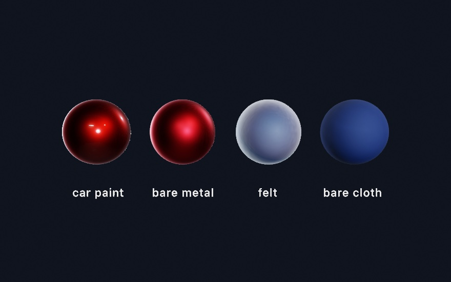

Look at the first pair. The bare metal has one soft satin highlight, the widest its roughness allows. The coated one keeps that satin body and adds a second, sharper reflection floating over it: **two finishes on one surface, which no single roughness can make.** That's `clearcoat`, and the same idea covers piano lacquer (`.lacquer`: a near-black matte body under a deep gloss film) and varnished wood. `clearcoatRoughness` sets the film's own polish, independent of the base, and the base dims slightly under a coat, by exactly the light the film reflects away, so the layering never invents brightness. Add `sparkle` from Chapter 17 on top of `.carPaint` and you have metal-flake paint.

Now the second pair. The felt sphere is the same blue as its neighbor, but its silhouette glows: fabric is covered in fibers that lean every direction, and where the surface turns away from you those fibers catch the light edge-on. That's `sheen`. The face stays matte while the rim brightens, and the body gives up a little light to pay for it. `sheenRoughness` sets how tight the rim band is (`.satin` pulls it close to the edge, `.felt` spreads it into a haze), and `sheenColor` tints it: leave it white for dusty cloth, or tint it away from the `fill` for shot fabric, the deep red velvet rimmed in orange that the [`CoatAndCloth` example](../Examples/3D/Materials/CoatAndCloth/Sketch.swift) ends on.

Both layers work under ordinary lights, under the area-light panels of Chapter 17, and from an environment; under `rayTracedReflections()` the coat's reflection upgrades to the traced scene along with everything else. The one honest edge matches glass: seen *inside a mirror*, a coated or fuzzed surface shows only its base there.

## Skin, wax, and stone

Every surface so far bounces light off its outside. Skin doesn't. Hold a flashlight against your fingers and the flesh glows red around it: some of the light went *in*, wandered a little way under the surface, and came back out somewhere else. Marble, wax, milk, and jade all do this, and the eye is remarkably good at noticing when a render of them doesn't. **A surface without it reads as painted plastic no matter how carefully it's colored.**

```swift
fill(Color(red: 0.92, green: 0.72, blue: 0.62))
material(.skin(radius: 0.34))    // radius: how far light travels, world units
drawSphere(radius: 0.72)
```


Look at each pair at the line where light gives way to shadow. The bare balls cut off the way a painted surface does. The scattering ones carry light a little way past that line, because light that entered on the lit side is re-emerging on the dark one, and on the skin ball the carried light is *red*: red travels farthest through flesh, which is why shadow edges on faces are warm. That per-channel reach is the `scatteringColor`, and its default is the skin ratio. Near-equal channels give the neutral softening of `.marble`; a green-dominant color makes a jade whose glow is green.

`scatteringRadius` is the one number you must set, and it's in world units because it's a physical distance: how far light gets before it's absorbed. A head-sized form wants roughly 1% of its width. Make it too big and the material slides toward wax, then toward glowing from within, which is a nice dial to know about. `scattering` (`0…1`) is how much of the surface's light takes the trip at all. It layers on any material, needs no other calls, and costs nothing in a frame that doesn't use it. Two honest edges: it applies to solid meshes on the main canvas (a raymarched field or a mesh inside a render target keeps its plain shading), and it's a different thing from the stylized `subsurface` glow Chapter 17's jade used, which fakes back-light cheaply and can still layer on top for ears and edges.

There's a second half, and it asks for one more call. Turn on `castShadows()` and the same material starts *transmitting*: light that strikes the far side of a thin body comes through it, which is the flashlight-through-fingers trick from the top of this section done for real. It works because the shadow machinery already knows the one thing the material needs. A shadow map records where the light first landed; the surface being shaded knows where it is; the gap between the two is how far the light traveled inside the body. **The shadow map was a thickness gauge all along.**

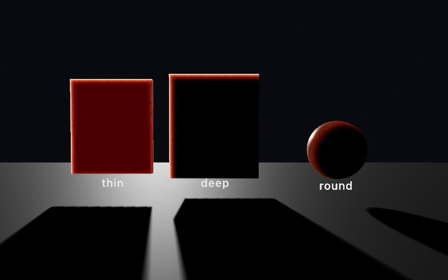

Put the light behind your subject and this carries the picture. A body about one `scatteringRadius` thick passes mostly red (the blood-red of a hand against the sun); the deep slab goes dark except at its rim, where the crossing is short; the ball keeps a warm crescent along its thinning edge. There are no new knobs, because the material already says everything: the radius sets what counts as thin, and `scatteringColor` decides what survives the trip. One edge to know: only the shadow-casting light transmits, since its depth is the one that's known, and a directional, spot, or point caster all work.

## Putting it together: molten

The finished piece is a single body of four melted lobes, twisted a little, finished as glass under studio light, breathing slowly over a floor that catches its shadow. Make `MySketches/Molten.swift`:

```swift
import Ollin

final class Molten: Sketch {
    override func setup() { seed(9) }

    override func draw() {
        background(Color(hex: 0x0D1017))
        cameraShowcase(target: Vector3(0, 1.0, 0), radius: 6.4,
                       elevation: 0.2, fieldOfView: .pi / 4.2)
        environment(.studio.lightingOnly())
        toneMap(.aces, exposure: 1.05)
        directionalLight(Color(white: 0.85), direction: Vector3(-0.5, -1, -0.35),
                         intensity: 0.55)
        castShadows()

        // The floor that catches the sculpture's shadow.
        material(.matte)
        fill(Color(hex: 0x30343F))
        drawPlane(width: 30, depth: 30)

        // The glass: four lobes melting into one body, breathing.
        let breathe = 0.42 + signedNoise(time * 0.25) * 0.1
        let glass = Color(hex: 0x9FDCD3)
        let body = SDF3D.sphere(radius: 0.8).at(x: 0, y: 0.85, z: 0)
            .smoothUnion(SDF3D.ellipsoid(rx: 0.62, ry: 0.4, rz: 0.62)
                .at(x: 0.72, y: 0.5, z: 0.25), k: breathe)
            .smoothUnion(SDF3D.torus(radius: 0.6, tube: 0.19)
                .at(x: -0.55, y: 1.25, z: -0.1).rotatedZ(0.5), k: 0.4)
            .smoothUnion(SDF3D.sphere(radius: 0.4).at(x: -0.2, y: 1.95, z: 0.3), k: 0.5)
            .twisted(0.3)
            .colored(glass)

        material(.dielectric(roughness: 0.07))
        drawSDF3D(body)
    }
}
```


The whole sculpture is four primitive lobes, three smooth unions, one twist, and a glassy finish, and the breathing comes from `signedNoise` easing the first melt radius in and out. Notice the mesh floor and the traced field sharing the frame. The field drops its shadow onto the plane, and each would hide the other if they overlapped. That's the everyday reality of this chapter: fields aren't a separate world, they're one more kind of thing your scene draws.

Then make it yours:

- Replace a lobe with `SDF3D.line(from:to:radius:)` and grow the drop a limb. A few chained lines plus a big `k` is how creatures start.
- Wrap the body in `.repeatedRadially(count: 5)` (offset it from the axis first) and the drop becomes a chandelier.
- Trade the glass for `.metal(roughness: 0.15)` with `environment(.sunset)`, and add `rayTracedReflections()` if your Mac traces.
- Carve it, since one `smoothSubtract` of a big sphere turns the sculpture into a grotto.

## Where this comes from

Distance fields as a drawing medium are the craft of the demoscene and Shadertoy communities, and above all of Inigo Quilez, whose catalogs of distance functions, the polynomial smooth minimum, and raymarching articles underlie nearly everything here and are credited throughout Ollin's implementation. Sphere tracing was formalized by John C. Hart in 1996, and the blobby, merging-spheres idea is much older, going back to Jim Blinn's 1982 "blobby model" and the metaballs of 1980s Japanese graphics research. The space-folding domain operators follow the hg_sdf library by the demogroup Mercury. The sculpt-block idea of building form by adding and carving under a melt radius is the working model of digital clay tools, studied from Shader Park's composable API. Full credits are in the project's [attribution notes](../ATTRIBUTION.md).

## Go deeper

- [SDF combinators](../Docs/Drawing/Combinators.md): the complete reference, including the machined joint family, gradient paint on merged fields, per-axis stretching, the infinite plane, and the quality dials.
- [Isosurfaces and metaballs](../Docs/Generators/Isosurface.md): the mesh route in full, including all three merge knobs, how the marching handles the faces that could be joined two ways, and the resolution and cost rules.
- [Combining 3D features](../Docs/3D/Combining.md): what fields take (materials, shadows, environments) and where they differ from meshes.
- [Environment lighting](../Docs/3D/3D.md#environment-lighting): all twenty curated environments listed by mood, which eight are bundled offline, `highRes` backdrops, loading your own `.exr` or `.hdr`, where downloads cache, and the full procedural-sky knobs.
- [Physically based materials](../Docs/3D/3D.md): the metallic-roughness model in full, plus the ready-made metals and dielectrics and how they combine with the stylized finishes.
- [Glass](../Docs/3D/3D.md#glass): every transmission knob with its units, the environment requirement, and the honest edges spelled out.
- [Subsurface scattering](../Docs/3D/3D.md#subsurface-scattering): the three scattering knobs, the presets, and the envelope; worked example [`Examples/3D/Materials/Subsurface`](../Examples/3D/Materials/Subsurface/Sketch.swift) (hold space to compare against the plain surfaces).
- Worked examples for this section: [`Examples/3D/Materials/PhysicalMaterials`](../Examples/3D/Materials/PhysicalMaterials/Sketch.swift), [`Examples/3D/Materials/Glass`](../Examples/3D/Materials/Glass/Sketch.swift) (hold space to drop the traced view through the glass), [`Examples/3D/Environments/ImageBasedLighting`](../Examples/3D/Environments/ImageBasedLighting/Sketch.swift), [`EnvironmentGallery`](../Examples/3D/Environments/EnvironmentGallery/Sketch.swift) (steps through all twenty), and [`ProceduralSky`](../Examples/3D/Environments/ProceduralSky/Sketch.swift).
- Worked example for the mesh route: [`Examples/3D/Geometry/Metaballs`](../Examples/3D/Geometry/Metaballs/Sketch.swift), a cluster that keeps fusing and parting, with the merge level and the grid detail on knobs.
- Worked examples: [`Examples/Shapes/Combinators`](../Examples/Shapes/Combinators/Sketch.swift) and [`CombinatorsGradient`](../Examples/Shapes/CombinatorsGradient/Sketch.swift) in 2D; in 3D, [`Examples/3D/Raymarching/RaymarchedSDF`](../Examples/3D/Raymarching/RaymarchedSDF/Sketch.swift), [`RaymarchedShapes`](../Examples/3D/Raymarching/RaymarchedShapes/Sketch.swift), [`RaymarchedSculpt`](../Examples/3D/Raymarching/RaymarchedSculpt/Sketch.swift), [`RaymarchedClay`](../Examples/3D/Raymarching/RaymarchedClay/Sketch.swift), [`RaymarchedDomain`](../Examples/3D/Raymarching/RaymarchedDomain/Sketch.swift), [`RaymarchedRadial`](../Examples/3D/Raymarching/RaymarchedRadial/Sketch.swift), [`RaymarchedPlane`](../Examples/3D/Raymarching/RaymarchedPlane/Sketch.swift), and [`RaymarchedEnvironment`](../Examples/3D/Raymarching/RaymarchedEnvironment/Sketch.swift).

---

[Contents](README.md#contents) · Previous: [Chapter 17, 3D, gently](17-3DGently.md) · Next: [Chapter 19, Depth and the iPhone as a sensor](19-DepthAndThePhone.md)
