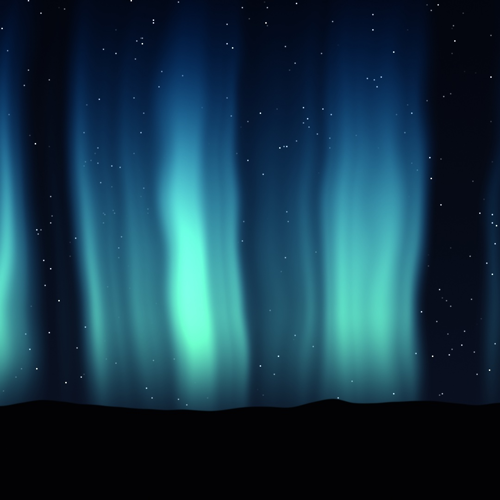
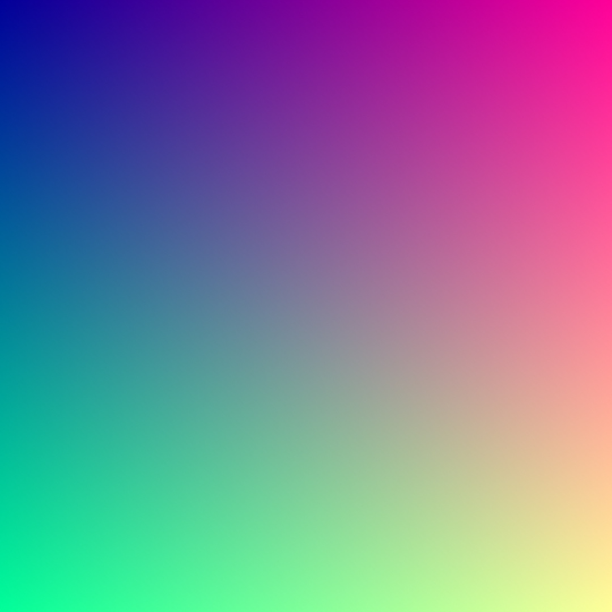
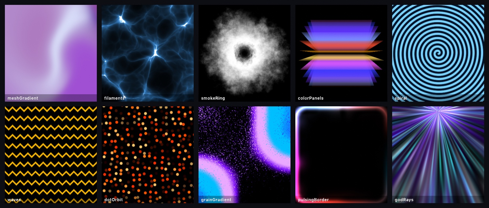
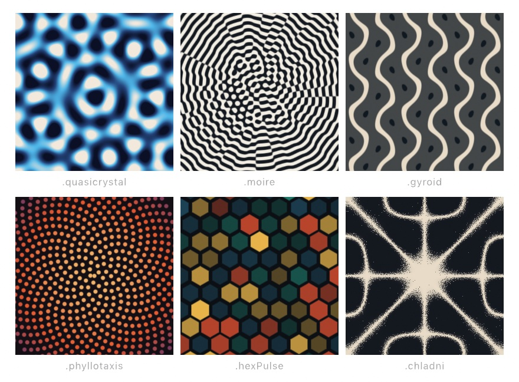
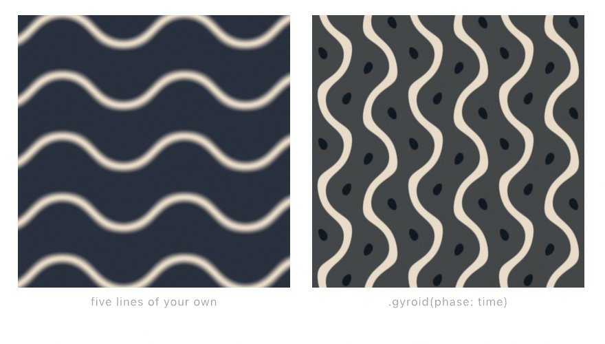
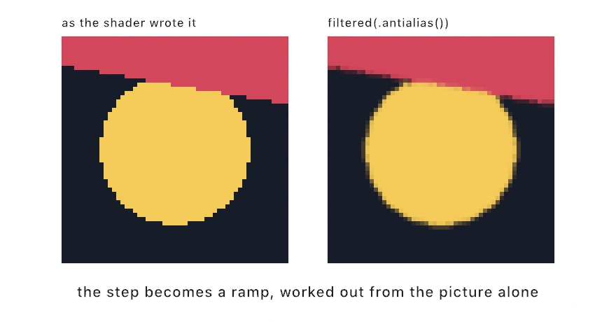
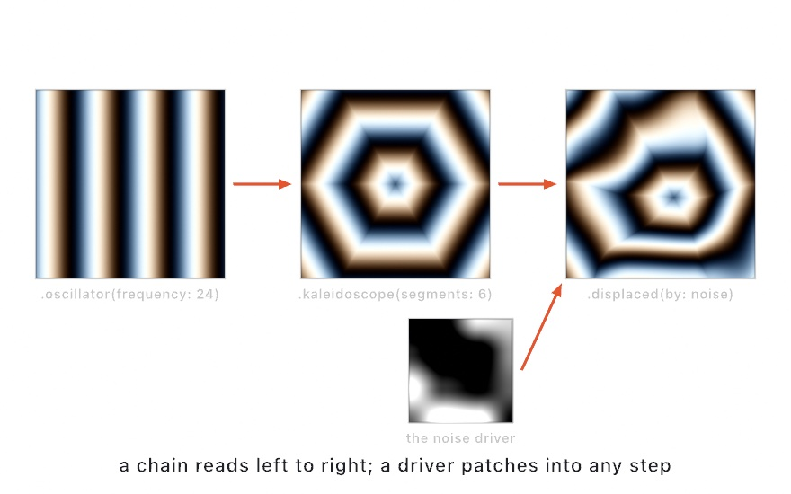
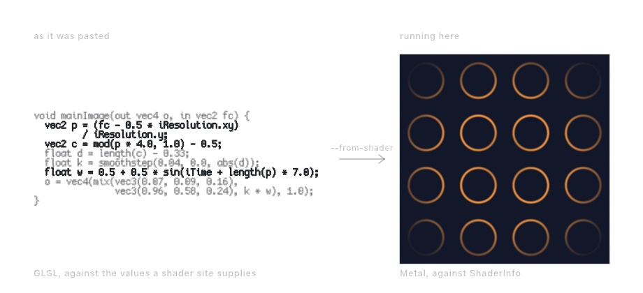
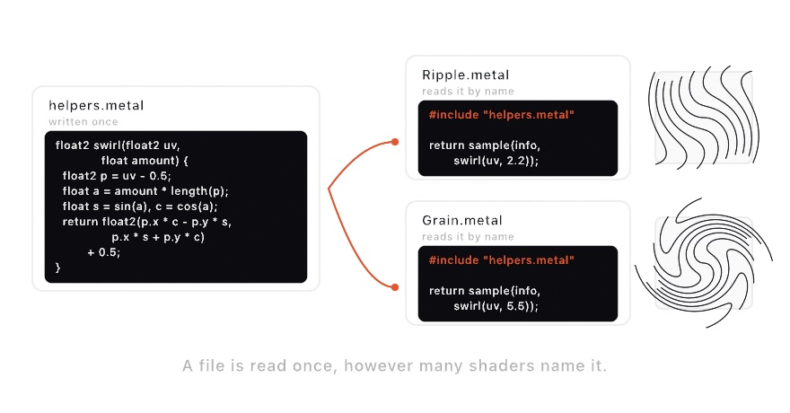

#### <sup>[Ollin](../README.md) → [Guide](README.md) → Chapter 18</sup>

---

# 18. Your first shader



The GPU can run a small function at every pixel of the canvas at once, and that function is a shader. You learn to write one: per-pixel thinking, a `shade` function, distance shaped by `smoothstep`, time and parameters, and the library Ollin splices in. Under forty lines of shader and no assets make the aurora at the top. The shaders Ollin ships follow it, with other ways to a shader, such as chains patched in Swift and GLSL brought over.

## One question, a million times: per-pixel thinking

[Chapter 14](14-FieldsAndFlow.md) defined a field as an answer at every point, and its flow field answered with a direction. A shader is a field that answers with a **color**. The GPU is hardware built to ask it at every pixel at the same time:

<picture>
  <source media="(prefers-color-scheme: dark)" srcset="Images/18-YourFirstShader/PixelGrid-dark.jpg">
  
</picture>

That is the shift. Until now `draw()` has told the canvas what to do, a circle here and a line there. A shader is one small function with the opposite job: given a position, say what color lives there. Position goes in and color comes out, everywhere, at once. The million answers per frame are why the aurora costs so little. And "at once" is why a shader cannot know what its neighbor pixels decided.

## The first shader: shade, uv, and generate

Here is that function, as short as it can be. Make `MySketches/FirstShader.swift`:

```swift
import Ollin

final class FirstShader: Sketch {
    let coordinates = Shader("""
    float4 shade(float2 uv, ShaderInfo info) {
        return float4(uv.x, uv.y, 0.6, 1.0);
    }
    """)

    override func draw() {
        drawImage(generate(coordinates).image, 0, 0)
    }
}
```



The string is the shader. `generate` runs it over a whole layer, a second canvas off screen that [Chapter 19](19-LayersAndEffects.md) teaches in full. `.image` hands that layer to `drawImage` as a picture. The function is the contract. Ollin calls your `shade` once per pixel, handing it that pixel's `uv` position, and whatever color you return is what that pixel becomes. The `float4` you return is that color, as red, green, blue, and alpha. Here red is `uv.x` and green is `uv.y`, so the image is the coordinate system:

<picture>
  <source media="(prefers-color-scheme: dark)" srcset="Images/18-YourFirstShader/UVSpace-dark.jpg">
  
</picture>

`uv` runs `0...1` across the layer whatever its pixel size, with the top-left origin of the rest of the canvas. Painting coordinates as color is also the first debugging tool. When a shader misbehaves, return the value you are unsure about as a color and look at it.

> **Metal note.** The shader is written in Metal, the GPU's language, which is C-flavored. Statements end with `;`, there are no argument labels, and the vector types are `float2`, `float3`, and `float4` instead of `Vector2` and `Color`. A `float4` color is red, green, blue, alpha, each `0...1`, and constructors nest, so `float4(col, 1.0)` packs a `float3` color plus an alpha. A number beside a vector applies to every component, so `uv - 0.5` shifts both coordinates. The math vocabulary (`sin`, `cos`, `length`, `smoothstep`) is the one you have used all along, with the same meanings. `mix` is `lerp` taken one channel at a time. On colors it gives [Chapter 2](02-Color.md)'s RGB row rather than the OKLab one `Color.mix` gives.

> **Swift note.** The triple-quoted `"""` string is [Chapter 8](08-Words.md)'s multiline string literal. Everything between the quotes, line breaks included, is one string. The shader lives inside it, which is why a typo in the shader is reported at this file's own line numbers. And a broken shader never crashes the sketch. The pass is skipped, the error prints (or shows in OllinLive's overlay), and it clears when you fix it.

## Drawing with distance: smoothstep as an edge

The first shader painted a gradient. To draw a shape with a function, describe the shape as a question about distance. A disc is "how far is this pixel from the center, and is that less than the radius?":

```swift
let disc = Shader("""
float4 shade(float2 uv, ShaderInfo info) {
    float2 p = uv - 0.5;                       // center the coordinates
    float d = length(p);                       // distance from the middle
    float v = smoothstep(0.35, 0.34, d);       // 1 inside, 0 outside, soft rim
    float3 col = mix(float3(0.06, 0.09, 0.14), float3(1.0, 0.79, 0.29), v);
    return float4(col, 1.0);
}
""")
```

Look at the third line. `smoothstep` is [Chapter 3](03-MotionAndTime.md)'s easing curve, the one you watched as a graph and used to cushion motion. Here it answers a different question with the same shape. As `d` crosses from 0.35 down to 0.34 the result ramps smoothly from 0 to 1. That one-percent ramp is the disc's anti-aliased rim. Widen the ramp and the rim becomes a glow. Collapse it and the edge goes hard and pixelated:

<picture>
  <source media="(prefers-color-scheme: dark)" srcset="Images/18-YourFirstShader/EdgeStep-dark.jpg">
  
</picture>

Most shaders repeat this one sentence: measure a distance, shape it with `smoothstep`, turn it into color. Everything else is choosing more interesting distances and more interesting colors.

## Time, mouse, and parameters: info and params

The disc holds still because nothing in it changes. The `info` argument carries the outside world in. These are the four you reach for first:

- `info.time` is seconds, so anything you feed it moves.
- `info.mouse` is the cursor, in canvas points. Divide it by `info.resolution` and it is in the pixel's own `0...1` uv.
- `info.resolution` is the layer's pixel size.
- `info.frame` is the frame count.

The [user shaders](../Docs/Shaders/Shaders.md) page lists the rest. A pulsing disc is the disc shader with one line changed:

```metal
float r = 0.3 + 0.05 * sin(info.time * 2.0);
float v = smoothstep(r, r - 0.01, d);
```

Your own numbers travel with the shader as `params`, read back inside as `param(info, 0)`, `param(info, 1)`, and so on. Pair them with `@Param` and a computed property, and the shader gets live parameters:

```swift
@Param(0...0.4) var sway = 0.18

var sky: Shader {
    Shader(shaderSource, params: [Float(sway)])   // rebuilt each read, cached by source
}
```

> **Swift note.** `Float(sway)` narrows the parameter's `Double` to the 32-bit `Float` a shader reads, the way `Double(i)` widened an `Int` in [Chapter 1](01-HelloOllin.md). `params` takes a list of them, and `param(info, 0)`, `param(info, 1)`, and so on read them back in that order.

`shaderSource` stands for the string you wrote. Rebuilding the `Shader` value every frame is the normal pattern, and it costs nothing. The compiled pipeline is cached by the source text, so only the numbers travel. The aurora uses this shape.

## The shader library: fbm, hash12, palette, and the distance functions

A disc, a pulse, and a parameter are enough to draw with. The aurora needs three more things: noise, randomness per pixel, and a designed palette. Ollin splices its own shader library into every shader you write, so the helpers its built-in effects use are yours too, with no import. Several you already know by other names. `fbm` is [Chapter 5](05-Noise.md)'s layered noise as one call, the same idea over a simpler noise. The rest of that chapter's field family (`simplexNoise`, `worley`, `ridgedFbm`, `turbulence`, `warpedFbm`) is here under the same names. `hash12` is a random number that never changes between frames. Feed it a cell and it is [Chapter 4](04-Randomness.md)'s seeded random, per pixel. The `sd*` family measures distance to ellipses, stars, hearts, and Béziers the way `length` measured distance to a point. And `palette(t, a, b, c, d)` turns a `0...1` value into color along a designed gradient, where four `float3`s shape the ramp. It is the formula behind [Chapter 2](02-Color.md#kits-you-carry-palette-and-ramp)'s `CosinePalette`, with its four numbers open to you. Take starting values from its documentation and nudge them.

The library is one source file. It is spliced into the framework's own effects, every shader you write, and every compute kernel of [Chapter 23](23-GridSimulations.md). So `fbm` means the same thing in all three places. A field you prototype in a shader behaves the same way when you move it into a kernel. The [shader library reference](../Docs/Shaders/ShaderLibrary.md) lists every function by section and says how to splice in only the sections you use. One section, `.complex`, reads a `float2` as a number you can multiply. [Chapter 22](22-IteratedForms.md#multiplying-turns-the-complex-plane) paints with it.

## Putting it together: aurora

The aurora is one shader, and it composes the steps above. Curtains of light are vertical noise bands whose x position is bent by more noise, from the library's `fbm`. Height fades them in above the horizon through `smoothstep`. A cosine `palette` colors them green at the core and blue at altitude, and `hash12` places the stars. Two parameters come in as `params`, and `info.time` moves it all. Make `MySketches/Aurora.swift`:

```swift
import Ollin

final class Aurora: Sketch {
    @Param(0...0.4) var sway = 0.18
    @Param(0.5...2.5) var strength = 1.4

    // A computed property, so each frame's shader carries the parameters' current
    // values; the compiled pipeline is cached by source, so this is free.
    var sky: Shader {
        Shader("""
    float4 shade(float2 uv, ShaderInfo info) {
        float t = info.time * 0.1;
        float sway = param(info, 0);
        float strength = param(info, 1);

        // The curtains: vertical bands whose x is bent by drifting noise, so
        // they ripple like fabric. y1 is height above the horizon.
        float y1 = 1.0 - uv.y;
        float bend = fbm(float2(uv.x * 2.4 + t, uv.y * 1.2 - t * 0.7)) - 0.5;
        float x = uv.x + bend * sway;
        float band = fbm(float2(x * 5.0, t * 1.6));
        band = smoothstep(0.45, 0.85, band) * strength;
        float height = smoothstep(0.1, 0.38, y1) * smoothstep(1.15, 0.4, y1);
        float glow = band * height;

        // Aurora colors from a cosine palette: green cores fading blue as
        // the curtain climbs.
        float3 aurora = palette(0.5 + glow * 0.22 - y1 * 0.3,
                                float3(0.16, 0.5, 0.38), float3(0.24, 0.5, 0.45),
                                float3(1.0, 0.7, 0.6), float3(0.35, 0.5, 0.75));

        // A cold night gradient, stars hashed per cell, brighter ones rarer.
        float3 col = mix(float3(0.01, 0.02, 0.05), float3(0.04, 0.07, 0.14), uv.y);
        float2 cell = floor(uv * info.resolution / 3.0);
        float star = step(0.997, hash12(cell)) * hash12(cell + 7.0);
        col += star * smoothstep(0.6, 0.1, glow);             // curtains outshine stars
        col += aurora * glow;

        // The ridge: a noise horizon, solid black below it.
        float ridge = 0.82 + (fbm(float2(uv.x * 3.0, 4.7)) - 0.5) * 0.12;
        float ground = smoothstep(ridge, ridge + 0.003, uv.y);
        col = mix(col, float3(0.005, 0.008, 0.012), ground);

        return float4(col, 1.0);
    }
    """, params: [Float(sway), Float(strength)])
    }

    override func draw() {
        drawImage(generate(sky).image, 0, 0)
    }
}
```

> **Metal note.** Two calls are new here. `floor` rounds down, so `cell` names the three-pixel square a pixel sits in, and every pixel in that square hashes to the same star. `step(edge, x)` is 0 below `edge` and 1 at or above it, the hard-edged version of `smoothstep`. So only the rare cells whose hash passes 0.997 get a star.

Read the shader top to bottom and count what you already know. `fbm`, from [Chapter 5](05-Noise.md), bends and builds the curtains. `smoothstep`, from [Chapter 3](03-MotionAndTime.md), shapes every transition, from the curtain edges to the height fade to the horizon line a few pixels wide. `hash12`, [Chapter 4](04-Randomness.md)'s seeded random per pixel, places the stars. `palette` designs the color, and `mix` blends every layer of the picture. The only new thing is where the code runs.

Then make it yours:

- Run it under OllinLive and drag `sway` and `strength` while it plays. Then break a line on purpose and watch the error point at your own file, at the right line, while the sketch keeps running.
- Reflect it. Draw the sky into the top half and again below, flipped and darkened, and there is a lake.
- Feed `info.mouse` into the palette so the colors follow your hand.
- Chain it. `generate(sky).filtered(.bloom())` glows the curtains, with `.filtered` the filter call the anti-aliasing entry below explains. A `Visual` chain, the chains entry below, can read that layer with `.layer(generate(sky))` and kaleidoscope the night.

An aurora is motion, so keep it as a loop. `swift run OllinLive MySketches/Aurora.swift --export-gif aurora.gif --seconds 6 --gif-width 480` keeps six seconds of it. Nothing here reads `random`, so a still is reproducible too, and `--export aurora.png --frame 200` writes the frame at the top of this chapter.

## The shaders Ollin ships: the design generators, the pattern fields, and anti-aliasing

The aurora was a shader you wrote and `generate` ran. Ollin's own built-in patterns are shaders written with the same library, and `generate` runs them the same way. Two groups come with it. The design generators look like finished graphics at their defaults. The pattern fields are closed forms, one piece of arithmetic per pixel, which you now know how to read. A generated layer carries no coverage, the record of how much of each edge pixel a shape fills. So a filter, a pass over the finished layer, repairs the stair-stepped edges any of them leaves.

### Backdrops that come composed: the design generators

A **design generator** is a built-in shader that draws a finished graphic: a mesh gradient, filaments, a smoke ring, god rays. It is for a backdrop or a border that looks composed with nothing configured. A sketch then has a ground to draw on before its own drawing arrives. The set was cross-read against Paper Shaders, the design-shader library from paper.design with shaders by Ksenia Kondrashova. Each one was then written from its underlying technique. The mesh gradient, for one, blends its colors by Donald Shepard's 1968 inverse-distance weighting over Inigo Quilez's domain warping.

```swift
drawImage(generate(.godRays()).image, 0, 0)
```



The family is `.meshGradient`, `.filaments`, `.smokeRing`, `.colorPanels`, `.spiral`, `.waves`, `.dotOrbit`, `.grainGradient`, `.pulsingBorder`, and `.godRays`. Each comes with defaults that already look composed, so `generate(.godRays())` is a usable backdrop with nothing configured. Each also takes colors plus a handful of other arguments when you want it to be yours. The same family has filters that transform a picture instead of inventing one, and [Chapter 20](20-PicturesRestyled.md#the-design-filters-paper-glass-water-and-a-material-from-a-silhouette) meets those.

Each of them takes a **`phase`**, and so do the pattern fields in the next entry. They have no clock of their own, so nothing moves until you feed one in:

```swift
generate(.meshGradient(phase: time * 0.4))     // animated
generate(.meshGradient())                      // a still, and the same still every run
```

That is deliberate. Because the motion is a number you pass, a frame export is reproducible. You can also drive a pattern from audio, a slider, or a scroll position as easily as from `time`.

### Closed forms at every pixel: the pattern fields

A **pattern field** is a built-in shader with no state, no source picture, and no textures to read. Every pixel is a small piece of arithmetic on its own coordinates, like the shaders you have been writing. It is for a pattern that needs nothing loaded and keeps no history, and the three consequences below are the reason to reach for one. Each is written from its published form. The quasicrystal is the summed-wave construction Keegan McAllister popularized in 2011, and the gyroid slices Alan Schoen's minimal surface of 1970. The phyllotaxis field is Vogel's sunflower model again, and the moiré is textbook two-grating interference. The hex pulse is the shader community's two-lattice construction. The Chladni plate is Ernst Chladni's, the ringing plate of [Chapter 14](14-FieldsAndFlow.md#standing-waves-chladni-figures). Three things follow from a field being closed form.

- It costs the same at any size, so a pattern field fills a 4K poster as easily as a thumbnail. There is nothing to load.
- It has no history, so frame 900 does not depend on frames 1 through 899. That is what makes them safe to export, scrub, or start at any frame.
- It is a pure function of `phase`, so the same phase gives the same picture, forever.

```swift
drawImage(generate(.quasicrystal(phase: time)).image, 0, 0)
```

<picture>
  <source media="(prefers-color-scheme: dark)" srcset="Images/18-YourFirstShader/Fields-dark.jpg">
  
</picture>

There are six. `.quasicrystal` sums plane waves at evenly spaced angles, so it is ordered but never repeats. `.moire` overlaps ring gratings and shows you their beat, which travels much faster than the rings themselves. `.gyroid` slices a famous minimal surface, a shape with the least area it can have, like a soap film. `.phyllotaxis` is the sunflower's golden-angle spiral from [Chapter 16](16-CurvesAndFigures.md), drawn per pixel. `.hexPulse` gives every cell of a hex lattice its own hashed heartbeat. `.chladni` is the ringing plate, the same closed form evaluated at every pixel.

The plate has two readings:

```swift
drawImage(generate(.chladni(m: 5, n: 2)).image, 0, 0)
drawImage(generate(.chladni(m: 7, n: 3, style: .wave, phase: time)).image, 0, 0)
```

`.sand` gathers grains onto the nodes, like the scattered sand in Chapter 14. `.wave` shows the plate swinging through its cycle instead. The same rule about `m` and `n` holds here: keep them apart, since equal modes cancel the plate to nothing. The mode numbers can also come from sound. [Chapter 37](37-Listening.md) teaches listening. The `Audio/ChladniResonance` example picks `m` and `n` by which pitches are loud. A piece of music then turns into the plate that would have produced it.

This is the part to do rather than read. Take the gyroid, which is one line: a sum of three `sin` and `cos` products, read at one slice through space, the one `info.time` picks.

```swift
let mine = Shader("""
float4 shade(float2 uv, ShaderInfo info) {
    float2 p = (uv - 0.5) * 14.0;
    float z = info.time;
    float g = sin(p.x) * cos(p.y) + sin(p.y) * cos(z) + sin(z) * cos(p.x);
    float band = 1.0 - smoothstep(0.0, 0.55, abs(g));
    return float4(mix(float3(0.16, 0.19, 0.24), float3(0.91, 0.86, 0.78), band), 1.0);
}
""")
```

<picture>
  <source media="(prefers-color-scheme: dark)" srcset="Images/18-YourFirstShader/HandRolledField-dark.jpg">
  
</picture>

The two differ, and the differences show what a built-in adds. The bands run a different way because the built-in reads the slice at a different depth, its `phase`, and at a different scale. It also adds a dimmed second copy behind the first to suggest depth, which is where those small dark seeds come from. But it is the same field, and you wrote it with five lines of vocabulary from earlier in this chapter. The coordinates are recentered, `sin` and `cos` make the field, `smoothstep` makes the edge, and `mix` picks the color.

`z = info.time` reads a 3D field at a moving slice, which is a general trick to keep. It is why the bands crawl and reconnect instead of sliding.

Two conventions apply across the design and pattern-field sets. Their palettes blend in sRGB, the plain screen RGB of [Chapter 2](02-Color.md#mixing-you-can-trust)'s RGB row. That is the space design tools work in. So mixes look like what a design tool would show rather than what physically correct light would do. And centered compositions stay centered and round whatever the canvas shape, so a tall layer does not get a squashed crystal. When a built-in is close to what you want, take it and adjust its arguments. When it is not, you now know what is inside one.

### The edges a shader leaves: post-process anti-aliasing

`.antialias` is a **filter** that smooths the stair-stepped edges of a generated layer from the finished picture alone. A filter is a pass that reads a layer and hands back a new one, and `.filtered(_:)` applies it. [Chapter 19](19-LayersAndEffects.md#filters) meets the rest of them. It is for a generated layer, a raymarched field, an imported shader, or a chain with a hard edge in it. A raymarched field is a shape drawn from distance alone, which [Chapter 32](32-SculptingWithFields.md#how-the-picture-gets-made-sphere-tracing) teaches. None of those carries coverage. When you draw a circle, Ollin knows it is a circle. It works out how much of each edge pixel the shape covers and paints that pixel part-way. That keeps the edge smooth instead of built out of small squares. A design generator, a pattern field, or a shader you wrote yourself each runs arithmetic per pixel and writes a color. No shape stands behind the answer, so there is no coverage to work out, and a hard edge inside one comes out as a staircase. The filter is Timothy Lottes's FXAA, from 2009.

```swift
let field = generate(myShader).filtered(.antialias())
```

<picture>
  <source media="(prefers-color-scheme: dark)" srcset="Images/18-YourFirstShader/Antialias-dark.jpg">
  
</picture>

Both panels are magnified, so you are looking at the pixels themselves rather than a photograph of a screen. On the left, each edge jumps a whole pixel at a time. On the right, the pixels along the edge have taken in-between tones, and the jump reads as a slope.

What the filter does is close to what your own eye does with that picture. It looks at brightness around each pixel. Where it is flat, it moves on, which is most of a frame. Where there is a step, it works out which way the edge runs, across or down. Then it follows that edge in both directions until the edge ends. Finally it reads the layer back a fraction of a pixel, toward the side the step falls away on. A pixel in the middle of a long edge barely moves. One near the end of a step moves half a pixel. That gradient along the run is the ramp.

Three things follow from working on the image alone:

- **It cannot tell a stair-step from detail the picture meant to have.** One pixel of deliberate speckle looks like one pixel of aliasing, and both get softened. That is why it is a filter you place rather than something every layer gets.
- **Place it right after whatever wrote the layer.** Put it before a warp, which would smear the ramp it just made.
- **It halves the stray.** On a measured shallow edge, the filter halves how far the edge strays from the straight line it should lie on. Half rather than none is what a pass reading the finished image can do.

It takes three arguments, and two of them matter most. `threshold` is the contrast an edge needs before the filter touches it at all. Raising it leaves faint edges alone, and lowering it reaches them. `amount` is how much of the result to keep. `amount: 0` hands the layer back as it came, which makes an A and B comparison free. `quality` is how far the pass may follow one edge. [`Examples/Effects/Antialias`](../Examples/Effects/Antialias/Sketch.swift) sets the two side by side.

## Other ways to a shader: chains, GLSL import, a shared helper, and a check

The aurora was typed as Metal in a string. Three more ways lead to a shader without starting from an empty string, and one command checks a file before any sketch draws it. A chain composes per-pixel imagery in Swift with no Metal at all. A shader written for the web comes over by one command. A helper you want in two shaders lives in a file of its own. And `ollin check` compiles a file on its own.

### Patching without typing Metal: Visual chains

A **`Visual` chain** composes per-pixel imagery the way you compose anything else in Swift. You start from a source, warp it, color it, and patch chains into each other. It is for the look of a shader without writing one, and for combining visuals live. Every number in a chain can follow a parameter or a beat without recompiling. The idiom is inspired by Olivia Jack's Hydra, the browser live-coding instrument, and its patching model is what lets visuals be combined live.

```swift
drawVisual(
    .oscillator(frequency: 24, colorShift: 0.12)
        .kaleidoscope(segments: 6)
        .displaced(by: .noise(scale: 3), amount: 0.12)
)
```

<picture>
  <source media="(prefers-color-scheme: dark)" srcset="Images/18-YourFirstShader/ChainGraph-dark.jpg">
  
</picture>

The move to notice is the last step, where one chain's color drives another chain's coordinates, per pixel. That `displaced(by:)` is the same idea as the displacement map [Chapter 19](19-LayersAndEffects.md#the-whole-stack-in-one-block-compose) mentions, but the driver is any chain. The expression, drivers included, compiles into a single GPU pass. Everything animates by default, and `generate(chain)` hands the result back as an ordinary layer for the rest of the effect graph. The [chains reference](../Docs/Shaders/Visuals.md) has the full vocabulary: sources, warps, color ops, blends, and the feedback loop.

### Somebody else's shader: GLSL import

A **GLSL import** translates a fragment shader written for the web into Metal and writes a project around it. A fragment shader is the web's name for a per-pixel function like `shade`, written in GLSL, the browser's shader language. It is for the tens of thousands of shaders on Shadertoy, the site Inigo Quilez and Pol Jeremias built. That site made shaders a shared, remixable culture. Nearly all of them are the two moves you just made, a pixel position in and a color out, and only the spelling differs. Theirs is called `mainImage`, and it takes the position in pixels rather than a 0-to-1 `uv`. It reads the clock from a global named `iTime`. Ollin does the translation for you:

```sh
ollin new Plasma --from-shader plasma.glsl
```

<picture>
  <source media="(prefers-color-scheme: dark)" srcset="Images/18-YourFirstShader/ImportedShader-dark.jpg">
  
</picture>

That writes a project with the translated shader in `imported.metal` beside the sketch, ready to build. A shader you have just copied can go straight in with `pbpaste | ollin new Plasma --from-shader -`. `pbpaste` prints what is on the clipboard, and the `-` tells the command to read that instead of a file. How many inputs it reads decides what it becomes. One that reads nothing is a generator. One that reads `iChannel0` is a filter over a layer, which is [Chapter 19](19-LayersAndEffects.md)'s vocabulary again.

Most of the translation is renaming, and three changes matter because they change what you see. `mod` rounds the other way in GLSL, which floors the quotient where Metal truncates it, so the translation writes the flooring version out by hand. The vertical axis turns over, because a texture is measured from its bottom edge and an Ollin layer from its top. And `iTime` is a global Metal does not have, so `info` is handed along to the functions that read the clock. Whatever cannot come over is written into the file as a comment. A `NOTE(ollin)` says something changed on the way. A `TODO(ollin)` marks something left for you, and the shader will not compile until you deal with it.

Then there is the part no tool can decide for you. A shader belongs to whoever wrote it. Shadertoy's default is CC BY-NC-SA, and many authors write their own terms into a comment at the top. So the translated file keeps a header naming the shader, its author, and the address it came from. Leave that header where it is, and read the terms before you publish anything made from it. What you get back is Metal source in your own project, with Ollin's shader library already spliced in. So you can call `palette` or `fbm` inside somebody else's plasma. [Bringing a shader over](../Docs/Tools/ShaderImport.md) has the full table of what is renamed.

### One helper, two shaders: the include line

A shader can name another file with an `#include` line, and that file's functions become its own. The line is C's `#include`, which Metal inherits, and Ollin resolves the path itself, since the runtime compiler has no search path of its own. It is for a swirl, a mask, or a curve you tuned by hand and want in more than one shader. Copying it into the second file works until you change one copy and forget the other. The path is relative to the file that names it, so a helper in the same folder is named by its file name alone. It works from an inline Swift string too, where the folder is the one your `.swift` file is in.

```metal
#include "helpers.metal"

float4 shade(float2 uv, ShaderInfo info) {
    return sample(info, swirl(uv, param(info, 0)));
}
```

<picture>
  <source media="(prefers-color-scheme: dark)" srcset="Images/18-YourFirstShader/SharedHelper-dark.jpg">
  
</picture>

`sample(info, uv)` reads the layer the shader was handed, at that point, so this one is a filter rather than a generator. A file is read once, however many shaders name it. A mistake inside the helper is reported against the helper, at its own line. [`Examples/Shaders/BlackHole`](../Examples/Shaders/BlackHole/Sketch.swift) keeps its physics in one file and its picture in another, so a test can load the physics alone. Ollin's own library needs no include, since `palette`, `fbm`, and the rest are already in every shader. The [reference](../Docs/Shaders/Shaders.md#pulling-in-another-file) has the rest. It covers a file that is not there, a loop of files that include each other, and a compute kernel sharing the same helper.

### Trying a shader on its own: ollin check

`ollin check` compiles a `.metal` file on this machine's GPU without launching a sketch. It is for finding out whether a shader compiles before anything draws it. Otherwise the first sign of a mistake is a layer that stays blank. The command is Ollin's own, over the Metal compiler.

```sh
ollin check Ripple.metal
```

```
Ripple.metal: ok
  a filter, because it reads one layer
  reads parameters 0, 1, so pass 2 floats
  includes /Users/you/Sketches/helpers.metal
```

Errors come back at your own line numbers. The report also says what the shader is, read from the layers it samples: a generator reads none, a filter one, and a combine two. It lists the parameters it reads and the files it pulled in. [Checking a shader](../Docs/Tools/ShaderCheck.md) covers naming the shape yourself with `--as` and the gap in a parameter list it calls out. It also covers several files at once, which exits nonzero if any of them failed, for a script.

## Where this comes from

Shaders come out of computer graphics research and the demoscene, and two projects taught creative coders to write them. *The Book of Shaders*, by Patricio Gonzalez Vivo and Jen Lowe, taught the per-pixel model. Its heart is this chapter's distance-and-smoothstep sentence. Shadertoy, built by Inigo Quilez and Pol Jeremias, made shaders a shared, remixable culture. Quilez's articles are the source of many techniques in Ollin's shader library, the cosine `palette` and the `sd*` distance functions among them. Chapter 5's `fbm` layers Ken Perlin's noise, and the shader library's `fbm` layers the simpler value noise The Book of Shaders teaches. The generators, the anti-aliasing filter, the chains, and the import after the aurora name their own sources. Full credits are in the project's [attribution notes](../ATTRIBUTION.md).

## Go deeper

- [Chladni figures](../Docs/Generators/Chladni.md): the mode numbers, the closed form behind the plate, and the arguments the pattern takes. The [`Patterns/Chladni`](../Examples/Patterns/Chladni/Sketch.swift) example sweeps the modes, and [`Audio/ChladniResonance`](../Examples/Audio/ChladniResonance/Sketch.swift) drives them from a live signal.
- [User shaders](../Docs/Shaders/Shaders.md): the full contract, filters and combines that read layers, `.metal` file loading, and the error model.
- [Bringing a shader over](../Docs/Tools/ShaderImport.md): `ollin new --from-shader` translates a GLSL fragment shader into Metal and writes the project around it, with the `mod` rounding difference, the flipped vertical axis, and the license header explained.
- [Checking a shader](../Docs/Tools/ShaderCheck.md): `ollin check` on the command line, with what it reports, naming the shape yourself, and checking several files at once.
- [The shader library](../Docs/Shaders/ShaderLibrary.md): every spliced-in helper with its signature, and the `using:` option that splices in only the sections you name.
- [Generators](../Docs/Drawing/Effects.md#generate): `Generator` and `generate(_:)`, the pattern-field catalog with every argument, and how a generated layer feeds the rest of an effect chain.
- [Visual chains](../Docs/Shaders/Visuals.md): all sources, warps, color ops, combines, and modulations.
- [Compute](../Docs/Shaders/Compute.md): the sibling world where kernels update buffers of particles instead of pixels, waiting in [Chapter 25](25-ParticleSimulations.md).
- Appendix B draws this chapter's math, one picture per idea: [Where things are](B-JustEnoughMath.md#where-things-are), [Per-pixel thinking and distance](B-JustEnoughMath.md#per-pixel-thinking-and-distance).
- Worked examples: [`Examples/Shaders/HelloShader`](../Examples/Shaders/HelloShader/Sketch.swift) (inline and hot-reloading `.metal`-file forms), [`Examples/Shaders/ShaderFilter`](../Examples/Shaders/ShaderFilter/Sketch.swift), [`Examples/Shaders/VisualSynth`](../Examples/Shaders/VisualSynth/Sketch.swift), [`Examples/Shaders/VisualCatalog`](../Examples/Shaders/VisualCatalog/Sketch.swift) (every chain family on one contact sheet), [`Examples/Effects/GeneratorCatalog`](../Examples/Effects/GeneratorCatalog/Sketch.swift), and [`Examples/Shaders/BlackHole`](../Examples/Shaders/BlackHole/Sketch.swift) (the heaviest shader in the set, split across two files).

---

[Contents](README.md#contents) · Previous: [Chapter 17, Marks and media](17-MarksAndMedia.md) · Next: [Chapter 19, Layers and effects](19-LayersAndEffects.md)
