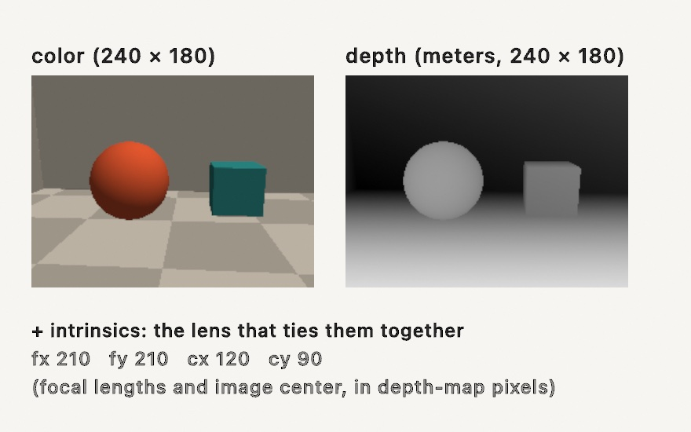
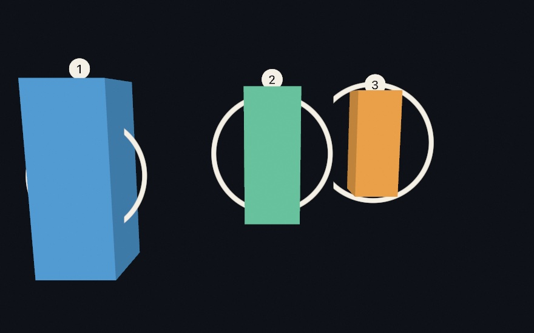
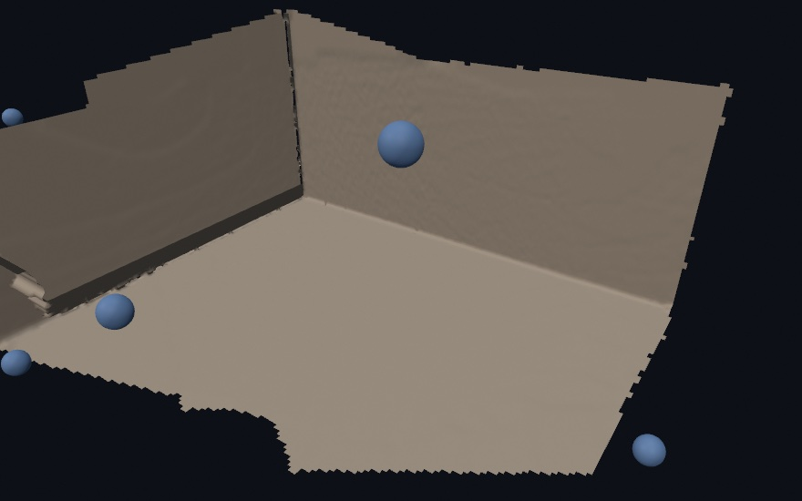

#### <sup>[Ollin](../README.md) → [Guide](README.md) → Chapter 19</sup>

---

# 19. Depth and the iPhone as a sensor


A camera flattens the world, while a depth camera keeps one more number per pixel, and that number is enough to un-flatten it. This chapter is about that number: what a depth frame is, how a flat picture stands up into a point cloud, how many pictures fuse into one scanned room, and how a tethered iPhone becomes a live 3D sensor for your sketches. The scan above was made by the chapter's own code, and every figure here runs on any Mac with no phone required. The phone is the upgrade, not the entry fee.

## What a depth camera sees

Every depth source, whatever the hardware, hands you the same three things: a color image, a depth map holding one metric distance per pixel in meters, and the **intrinsics**, which are a handful of numbers describing the lens that took them.



In Ollin that bundle is one value type, `RGBDFrame`, and there's nothing mysterious inside it. This is the entire construction:

```swift
RGBDFrame(color: color, depth: depths, confidence: nil,
          depthWidth: 240, depthHeight: 180, intrinsics: intrinsics)
```

Where did this chapter's frames come from, with no depth camera attached? We fake one. The committed figure [`Anatomy.swift`](Figures/19-DepthAndThePhone/Anatomy.swift) ends with `StageCamera`, under eighty lines that march rays through a tiny staged room (Chapter 18's sphere tracing, run on the CPU) and fill exactly those arrays, colors from the scene and depths from how far each ray flew. It's a pretend camera, but the frame it produces is a real `RGBDFrame`, so everything else in this chapter treats it exactly as it would treat a LiDAR. That's the point of the type: whatever fills the arrays, the rest of the pipeline doesn't care.

> **Swift note.** `depth` is a plain `[Float]`, row by row from the top left, `0` where the sensor had no answer. Real depth maps are full of those holes, especially along silhouettes, and the API that reads them is built to shrug holes off.

## Standing the picture up

One pixel plus one depth is a 3D point. The recipe is small enough to say in a sentence: slide the pixel off the image center, scale by depth over focal length, and step out along the ray.


That's called **unprojection**, and the intrinsics (`cx`, `cy` the image center, `fx`, `fy` the focal lengths) are exactly the numbers the recipe needs. You'll rarely do it per pixel yourself, because `RGBDFrame` does it wholesale. `pointCloud()` unprojects *every* valid depth pixel, colors each from the color image, and hands back the `PointCloud` you met in Chapter 17.

```swift
let frame = StageCamera.capture(eye: Vector3(0.2, 1.05, 1.7),
                                target: Vector3(0, 0.45, -1.1))
let cloud = frame.pointCloud(pointSize: 0.013)
// …each frame:
camera(.orbiting(target: Vector3(0, 0, -2.9), radius: 4.4,
                 azimuth: 0.85, elevation: 0.35, fieldOfView: .pi / 4))
drawPointCloud(cloud)
```


Look at what the new viewpoint reveals. The picture has become geometry you can orbit, and behind the ball and the crate hang black voids: the parts of the room the camera never saw, shadows cast not by light but by *not knowing*. Every real scan has these, and they're the honest signature of the medium. (For one point instead of all of them, `frame.unproject(normalized:)` lifts a single image position to its metric 3D spot, with a median window so a stray hole doesn't spoil it. That's the tool that lifts a tracked 2D skeleton to true depth, and the [RGBD reference](../Docs/3D/RGBD.md) shows it paired with the body tracker.)

## Drawing inside the picture

A depth frame isn't only a source of geometry. It's also a *stage you can draw into*. `drawDepthScene(frame)` draws the color image as the backdrop and writes the depth map into the depth buffer, and a camera built from the frame's own lens (`camera(.fromIntrinsics(...))`) puts your 3D drawing in the same metric space, so the scene occludes what you place behind it:

```swift
camera(.fromIntrinsics(frame.intrinsics))
drawDepthScene(frame)

// A run of marbles marching into the room, in meters.
for i in 0 ..< 6 {
    withState {
        translate(-1.3 + Double(i) * 0.44, -0.32, -1.85 - Double(i) * 0.34)
        fill(Color(hue: 0.09 + Double(i) * 0.035, saturation: 0.75, brightness: 1))
        specular(0.5); shininess(60)
        drawSphere(radius: 0.12)
    }
}
```


Count the marbles. Six were drawn, and the crate's depth swallows the last two and slices one mid-body. Nothing here is compositing trickery: the marbles are ordinary solids from Chapter 17, z-tested against depths that came from a camera (well, our pretend one, and with a phone the real one).

## Flat drawing that knows where it is

Solids were the easy case, because they already live in space. The more useful trick is putting *2D* drawing into the same depth buffer, and it's the one worth learning properly, because labels, tags, halos, and sprites are what you actually want to put into a scanned room.

By default, 2D drawing lays over a 3D frame completely. That's right for a caption and wrong for anything that belongs in the scene. Three calls change it:

```swift
withState {
    depth(at: anchor)                        // this mark now sits at a world point's depth
    if let screen = project(anchor) {        // and here is where that point lands on the canvas
        drawCircle(center: screen, radius: 96)
    }
}
```



Those rings are `drawCircle`. Not tubes, not meshes: flat 2D circles that were handed a depth and are now in the queue with everything else, hidden wherever a pillar stands nearer than they do.

The three calls divide the job cleanly, and keeping them separate in your head saves confusion later:

- **`depth(at: worldPoint)`** sets the *depth* of subsequent 2D drawing, and nothing else. The mark still lands wherever its canvas coordinates say. `noDepth()` puts it back on top.
- **`project(worldPoint)`** answers the other half: where does this world point land on the canvas? It returns `nil` when the point is behind the camera, which is a case worth handling rather than forcing.
- **`withBillboard(at: worldPoint) { }`** does both at once and moves the origin there, so inside the block you draw around `(0, 0)` and it lands on the point at the right depth. The numbered tags above are billboards, and it's the same call that labeled the shapes in Chapter 17's figures.

Notice what the rings do *not* do: they don't get smaller with distance. All three are 96 points across, because a 2D mark keeps its canvas size. Depth changes what hides it, not how big it is. That's usually exactly what you want from a label (readable at any distance, correctly occluded), and it's the thing to remember when a sprite refuses to shrink.

For a depth *feed* rather than 3D geometry you drew, there's no world point to hand `depth(at:)`, so `depth(0.5)` takes a fraction of the map's own near-to-far range instead. Everything else behaves the same.

Like the camera itself, all of this is per-frame, so it goes in `draw()` after the camera, and without a camera it quietly does nothing. The [depth compositing reference](../Docs/3D/DepthCompositing.md) covers both scene kinds side by side.

## The real sensors

This is where real hardware comes in, and the reassuring part is that the code stays the same from here on. Only the source of the frames changes.

The gentlest entry is a **recorded clip**. The Record3D iPhone app records LiDAR (or TrueDepth) footage into `.r3d` files, and Ollin opens them directly, every frame an `RGBDFrame`:

```swift
import Ollin
import OllinRecord3D

final class Replay: Sketch {
    var scan: Record3DRecording?

    override func setup() {
        scan = try? Record3DRecording(path: "/path/to/scan.r3d")
    }

    override func draw() {
        background(Color(white: 0.04))
        guard let scan, scan.frameCount > 0 else { return }
        let i = Int(time * 30) % scan.frameCount
        guard let cloud = try? scan.pointCloud(at: i) else { return }
        camera(.orbiting(radius: 2.5, azimuth: time * 0.3, elevation: 0.2))
        drawPointCloud(cloud)
    }
}
```

A recorded clip is depth footage you can edit against, re-render, and export deterministically, and it's the medium the "volumetric filmmaking" scene works in. The same app also streams **live over USB**. Plug the phone in and `Record3DDevice` delivers `latestFrame` continuously, so the person in front of the phone becomes a live point cloud in your sketch.

The deeper option is **Ollin Capture**, Ollin's own iPhone app, which runs ARKit on the phone and streams typed results the sketch reads like any other input: a 3D **body skeleton**, up to three **faces** (a deforming mesh plus 52 expression values each), rear-LiDAR **world depth** with the camera's own position and orientation, a **person segmentation** matte, and **device motion**:

```swift
import OllinPhone

let device = PhoneDevice()
device.start()                  // in setup()
// …in draw():
device.latestBody               // a skeleton in meters
device.latestDepthFrame         // an RGBDFrame from the LiDAR
device.latestPose               // where the phone is, and which way it looks
```

Everything these produce lands in types you've already used this chapter, and that's the design. The phone is a sensor array, and the sketch never knows or cares which sensor filled the frame. The [Record3D](../Docs/3D/Record3D.md) and [Phone](../Docs/3D/Phone.md) references cover the setup (both need only a cable), and the `3D/Depth` and `3D/Phone` example groups are live starting points for each stream.

## One world from many frames

A single frame is a slice of the world, whatever the lens saw plus voids. The way past that is the last idea of the chapter, and it needs one new ingredient, the **pose**, meaning where the camera stood and which way it looked, written as a transform. Given a frame's cloud (in camera space) and its pose, `transformed(by:)` places the points where they really are in the room, and `WorldCloud` accumulates those placed points, thinning duplicates so overlapping frames don't pile up:

```swift
var world = WorldCloud(voxelSize: 0.02)

let frame = StageCamera.capture(eye: eye, target: room)
world.add(frame.pointCloud(pointSize: 0.016),
          transformedBy: StageCamera.pose(eye: eye, target: room))
// …repeat from other eyes, then:
drawPointCloud(world.cloud)
```


Each capture is tinted (coral, green, blue) so you can see who saw what: three partial views, one room. The small spheres are the three camera positions, and the walls each frame couldn't see are filled in by the frames that could. On a real phone this is exactly the `PhoneWorldScan` example. ARKit supplies the pose (`device.latestPose`), you sweep the room, and the slices stack into a scan. (Over a long sweep, small pose errors slowly build up, and drift correction for long scans is on the [roadmap](../ROADMAP.md#iphone-as-a-sensor-array).)

## From the cloud to a surface

A fused cloud is still dust: beautiful, but nothing in it has a face, a shadow, or a material. **`reconstructSurface`** turns the sweep into a solid. It fits a small plane to every point's neighborhood, uses the sweep's own camera positions to decide which side of each plane faces the room, and pulls one mesh out of the whole thing:

```swift
let mesh = reconstructSurface(of: world.cloud, spacing: world.voxelSize * 2,
                              orientedToward: eyes)
material(.dielectric(roughness: 0.55))
drawMesh(mesh)
```



The torn rim is the honest part: where no camera reached, the surface simply stops, and nothing is guessed. That honesty has a practical reading, and it is the one rule worth carrying to a real scan: **the mesh can only be as complete as the sweep**. A body you only arc in front of keeps an unobserved back, and the rebuilt surface frays just past where its data stops, so walk around the things you care about. Doorways and windows stay open, which is the truthful shape of a room.

The camera path does double duty here. Every fitted plane has two sides, and the reconstruction turns each toward the cameras that plausibly saw it, so pass the sweep's positions in `orientedToward:` whenever you have them (they are the same `eyes` the capture loop already collects). Without them, orientation propagates point to point across the cloud, which works on a smooth single surface and struggles exactly where a camera would have known better.

What comes back is an ordinary `Mesh`, so everything Chapter 17 taught applies: materials, lighting, cast shadows, even `subdivided(_:)` to soften the scan. And when points are not a scan at all but material of their own (a splash, a swarm dense enough to read as a body), the sibling `particleSurface` skins them as one blended form with no cameras involved. The [reference page](../Docs/Generators/SurfaceReconstruction.md) covers both, and the `3D/Geometry/SurfaceFromPoints` example puts the two side by side on one cloud.

## Putting it together: the ghost room

The finished piece turns the sweep itself into the artwork. Nine frames of the staged room join the world one per second, drawn as additive light while the camera orbits. It reads as a room scanning itself into existence. Make `MySketches/GhostRoom.swift` (bring `StageCamera` along from [`Anatomy.swift`](Figures/19-DepthAndThePhone/Anatomy.swift), plus the `pose` helper from [`GhostRoom.swift`](Figures/19-DepthAndThePhone/GhostRoom.swift), the committed figure with the complete listing):

```swift
import Ollin
import simd

final class GhostRoom: Sketch {
    let room = Vector3(-0.1, 0.4, -1.2)
    var world = WorldCloud(voxelSize: 0.012)
    var fused = 0

    override func draw() {
        background(Color(hex: 0x05070C))

        // One more frame of the sweep joins the world every 60 frames.
        let due = min(9, frameCount / 60 + 1)
        while fused < due {
            let a = -1.15 + Double(fused) * 0.29
            let eye = Vector3(room.x + sin(a) * 3.0, 1.1 + Double(fused % 3) * 0.25,
                              room.z + cos(a) * 3.0)
            let frame = StageCamera.capture(eye: eye, target: room)
            world.add(frame.pointCloud(pointSize: 0.011),
                      transformedBy: StageCamera.pose(eye: eye, target: room))
            fused += 1
        }

        cameraShowcase(target: room + Vector3(0, 0.2, 0), radius: 5.8,
                       elevation: 0.4, fieldOfView: .pi / 4)
        blendMode(.add)
        drawPointCloud(world.cloud)
        blendMode(.normal)
    }
}
```


The woven texture is the scan lines of nine viewpoints interleaving, the solid patches are where many frames agree, and the voids are what no camera reached. Watch it run live and the room knits itself together, then the orbit lets you wander what was scanned.

Then make it yours:

- Point it at reality. With a LiDAR iPhone, swap `StageCamera` for `device.latestDepthFrame` and `device.latestPose` and sweep your actual room (the `3D/Phone/PhoneWorldScan` example is this piece with the pretend camera removed).
- Restage the set. `StageCamera.scene` is a distance field, so everything Chapter 18 taught works in it, and you can melt a blob into the room and scan that.
- Color by height instead of by image, rebuilding the cloud with each point tinted by its `y`, and the scan becomes a contour map.
- Slow the reveal to one frame every five seconds and export a video, because the assembly is the piece.
- Rebuild it solid. Hand the finished world cloud to `reconstructSurface(of:spacing:orientedToward:)` with the nine eyes, and the ghost becomes a room you can light, shadow, and walk a camera through.

## Where this comes from

Depth capture entered art practice when the Microsoft Kinect shipped in 2010 and was promptly opened up by hackers. The point-cloud look it popularized was seeded two years earlier by Radiohead's *House of Cards* video (directed by James Frost with data artist Aaron Koblin), shot entirely with lidar and structured light. Tools like the RGBDToolkit (James George and Jonathan Minard) and the volumetric-film work that followed turned depth footage into an editable medium, the spirit of the `.r3d` clip workflow here (Record3D is Marek Šimoník's iPhone app). The unprojection math is the pinhole camera model, the foundation stone of photogrammetry and computer vision, and fusing posed depth frames into one model descends from SLAM research and KinectFusion (Newcombe and colleagues, 2011), of which `WorldCloud`'s voxel accumulation is the gentlest possible relative. Full credits are in the project's [attribution notes](../ATTRIBUTION.md).

## Go deeper

- [RGBD frames](../Docs/3D/RGBD.md): the frame type, unprojection, depth-lifted pose (a 2D-tracked skeleton placed at its true depth).
- [3D](../Docs/3D/3D.md#point-clouds): `PointCloud` itself, its point sizing and colors, and how it sits beside the rest of the 3D path.
- [Record3D](../Docs/3D/Record3D.md): recorded `.r3d` clips and the live USB stream, frame by frame.
- [The iPhone capture app](../Docs/3D/Phone.md): body, faces, world depth with pose, segmentation, motion, and world fusion.
- [Depth compositing](../Docs/3D/DepthCompositing.md): `depth(at:)`, billboards, `drawDepthScene`, and the metric camera.
- [Surface reconstruction](../Docs/Generators/SurfaceReconstruction.md): rebuilding a scanned cloud as a mesh, skinning particle sets, and the holes and orientation details.
- Worked examples: [`Examples/3D/Depth/DepthCloud`](../Examples/3D/Depth/DepthCloud/Sketch.swift) (a webcam depth model, no phone needed), [`Examples/3D/Depth/Record3DCloud`](../Examples/3D/Depth/Record3DCloud/Sketch.swift), [`Examples/3D/Depth/Record3DLiveCloud`](../Examples/3D/Depth/Record3DLiveCloud/Sketch.swift), [`Examples/3D/Depth/DepthLiftedPose`](../Examples/3D/Depth/DepthLiftedPose/Sketch.swift), [`Examples/3D/Phone/PhoneDepthCloud`](../Examples/3D/Phone/PhoneDepthCloud/Sketch.swift), [`Examples/3D/Phone/PhoneWorldScan`](../Examples/3D/Phone/PhoneWorldScan/Sketch.swift), [`Examples/3D/Geometry/SurfaceFromPoints`](../Examples/3D/Geometry/SurfaceFromPoints/Sketch.swift), and [`Examples/3D/Depth/DepthOcclusion`](../Examples/3D/Depth/DepthOcclusion/Sketch.swift).

---

[Contents](README.md#contents) · Previous: [Chapter 18, Sculpting with fields](18-SculptingWithFields.md) · Next: [Chapter 20, Sound and control](20-SoundAndControl.md)
