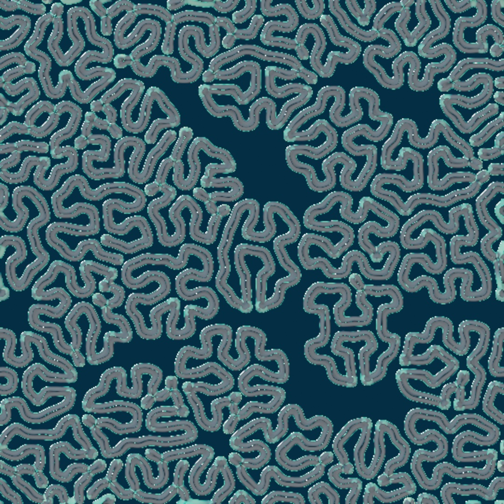
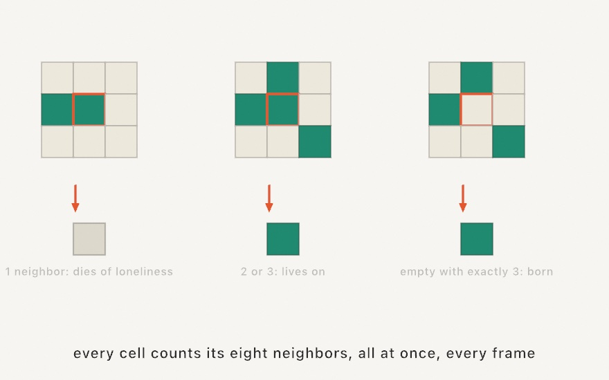
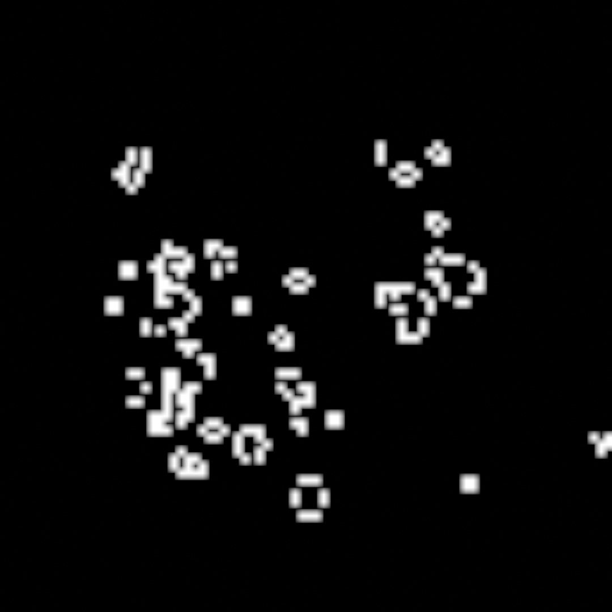
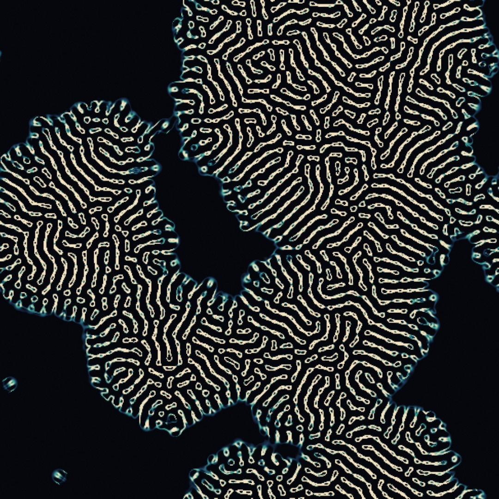
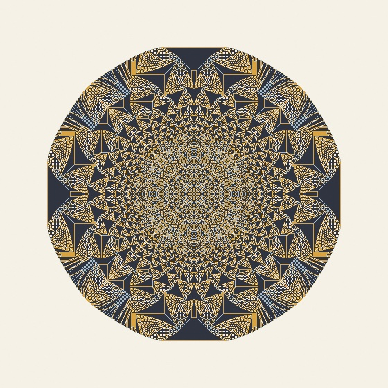
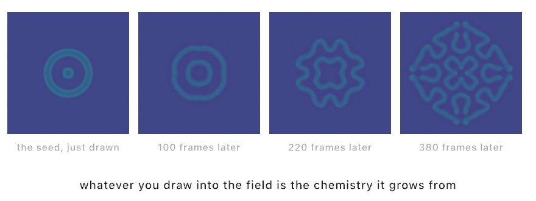
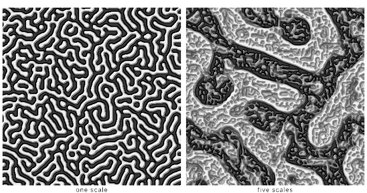
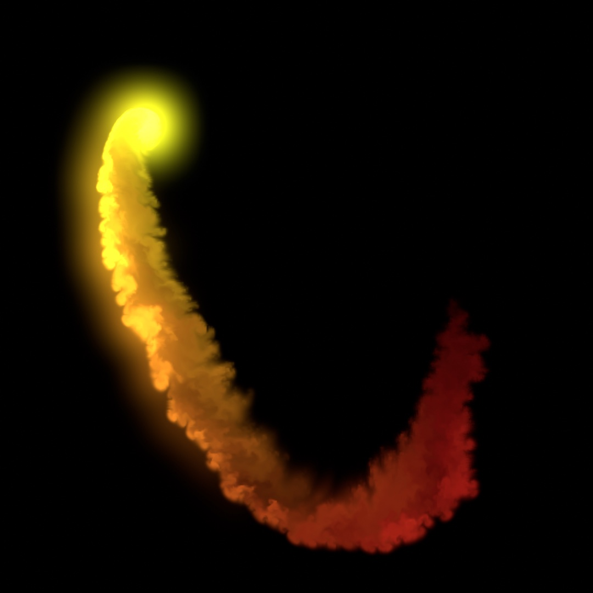
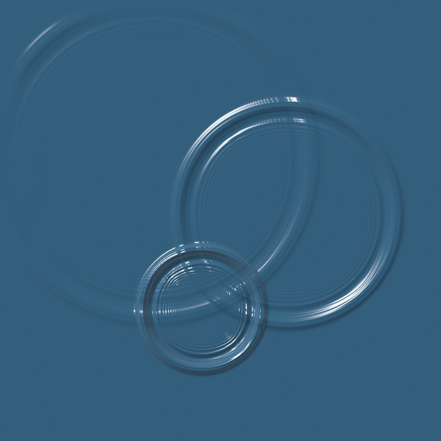
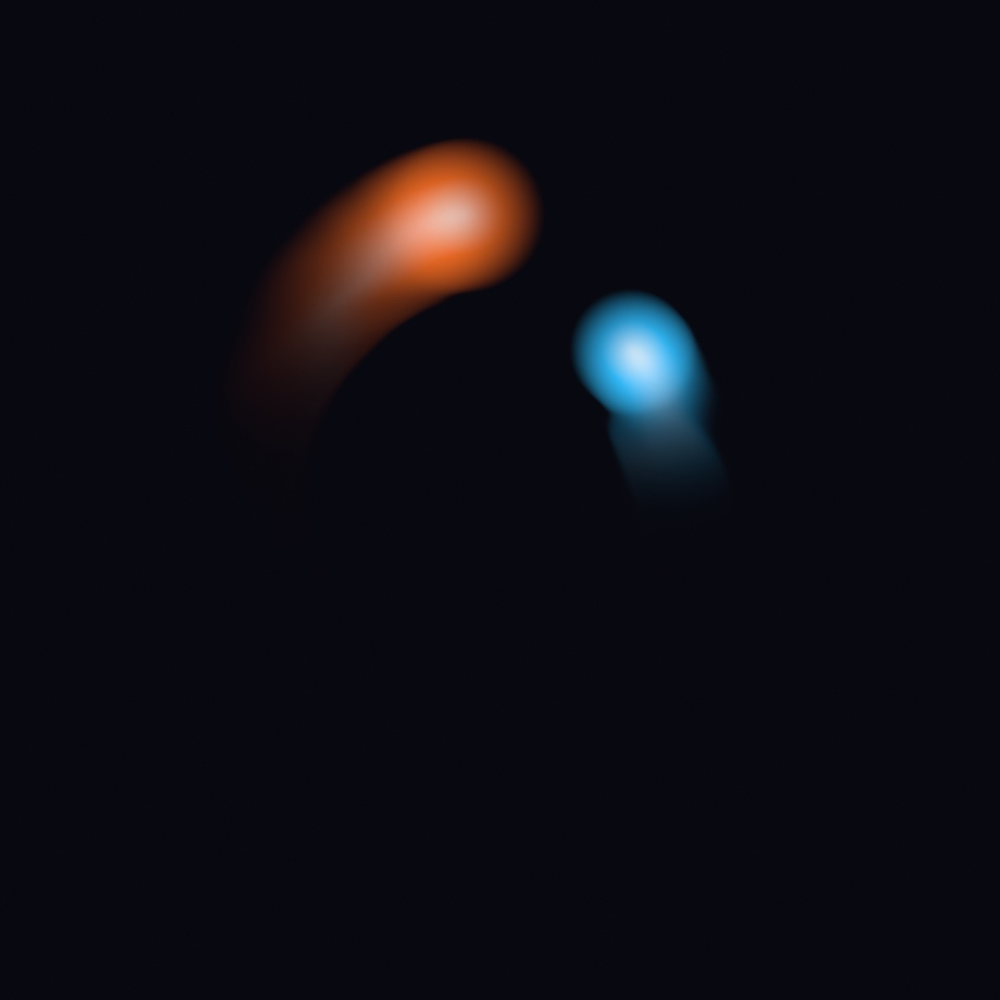

#### <sup>[Ollin](../README.md) → [Guide](README.md) → Chapter 19</sup>

---

# 19. Simulations on a grid



Nobody drew those corridors. They grew, over six hundred frames, from a scatter of dots and two chemical rules. Run the sketch, drag the mouse, and your marks would grow the same way. This chapter is about the first half of GPU simulation: **fields** that carry their own state on the GPU and evolve it every frame by simple local rules. Every one of them lives on a grid, and every cell asks only about its neighbors. You bring the seed. The rules do the drawing.

## State that lives on the GPU

[Chapter 16](16-LayersAndEffects.md)'s feedback layer was the first taste, a picture fed its transformed self back in, frame after frame. A simulation field replaces "transform the whole picture" with something more local and more alive. Every cell of the field computes its next value *from its neighbors*, all at once, every frame. It's [Chapter 17](17-YourFirstShader.md)'s per-pixel function, plus the one addition that changes everything. That addition is memory.

In Ollin that's a `SimField`. Like `Feedback`, it's persistent, so make it once and keep it. You never write the kernel for the built-in ones. Pick a `Sim`, draw into the field to seed it, and composite its `image`:

```swift
var life: SimField?
override func setup() { }                     // created on first draw, held forever

override func draw() {
    if life == nil { life = simField(.gameOfLife(), scale: 0.08) }
    guard let life else { return }
    withField(life) {
        if mouseIsPressed { fill(.white); drawCircle(mouseX, mouseY, 20) }
    }
    drawImage(life.image, 0, 0)
}
```

`withField` works like [Chapter 16](16-LayersAndEffects.md)'s `withTarget`, and what a drawn mark *means* depends on the simulation. For the Game of Life, white means alive.

## The Game of Life

Conway's Game of Life is the classic proof that simple local rules make worlds. Each cell of a grid is alive or dead, and one generation to the next it only ever asks about its eight neighbors:

<picture>
  <source media="(prefers-color-scheme: dark)" srcset="Images/19-GridSimulations/LifeRules-dark.jpg">
  
</picture>

That's the entire rulebook. No cell knows about the picture. There is no picture, as far as any cell is concerned. And yet seed a field with a random soup and structures appear. You get stable blocks, blinking pairs, and now and then a *glider* that walks off across the grid on its own:

```swift
withField(life) {
    noStroke()
    fill(.white)
    if frameCount == 1 {                       // a random soup, once
        for _ in 0 ..< 700 {
            drawCircle(width * 0.5 + random(-260, 260),
                       height * 0.5 + random(-260, 260), 7)
        }
    }
}
```



The `scale: 0.08` matters, because a sim field's `scale` sets its internal resolution. For a cellular automaton one texel is one cell, so a low scale gives cells you can see. For the other sims, a lower scale just means broader, cheaper features.

## More ways to be an automaton

The Game of Life is one rule on one grid, and the same recipe runs in several other shapes. Two of them are cheap enough to run on the CPU. They hand you plain arrays instead of a field, and you draw the result however you like.

**Wolfram's elementary rules** shrink the grid to a single row. Each cell looks only at itself and its two neighbors, so there are eight possible neighborhoods. A rule is nothing more than which of those eight leave a cell alive, and that packs into one number from 0 to 255. `elementaryCA` runs one and hands back a row per generation. Drawing time downward then turns a one-dimensional automaton into a two-dimensional picture:

```swift
let rows = elementaryCA(rule: 30, width: 161, generations: 161)
```

<picture>
  <source media="(prefers-color-scheme: dark)" srcset="Images/19-GridSimulations/WolframAndTurmite-dark.jpg">
  
</picture>

Rule 30, on the left, is the famous one, because a rule that small has no business producing something that irregular. Wolfram used its middle column as a source of random numbers for years. Rule 90 draws the Sierpinski triangle, and rule 110 turns out to be complicated enough to compute anything a computer can. `totalisticCA` is the same idea with more colors, where a cell reads the *sum* of its neighborhood rather than the exact pattern.

**A turmite** is an ant on a grid instead of a whole row of cells. It reads the color under it, writes a new one, turns, steps forward, and adopts a new state. That is the entire creature. Langton's ant, the classic, spends about ten thousand steps making an incoherent blot. Then, with no warning at all, it starts laying a perfectly regular diagonal highway and walks off along it forever. Nobody has a satisfying explanation for why. You hold one and step it, the way you held a `DifferentialGrowth` in [Chapter 12](12-FlocksAndSwarms.md):

```swift
let ant = Turmite(.langton, columns: 260, rows: 260)

// each frame:
ant.step(500)
for painted in ant.paintedCells { /* draw a cell */ }
```

**Lenia** goes the other way and makes the Game of Life *continuous*. Instead of cells that are alive or dead, every texel carries a smooth mass between 0 and 1. And instead of counting eight neighbors, each texel weighs a soft ring of neighborhood around it. It then grows or starves, depending on how close that weight lands to a target. It's a `Sim` like the others:

```swift
dish = simField(.lenia(radius: 13), scale: 0.55)
```



Those knobs are the model's whole personality. `radius` is how far the ring reaches. The growth center and width are the target mass, and how forgiving the rule is about missing it. The one thing to know before running it is that **Lenia needs a dense seed**. Sparse mass starves and fades to nothing, which looks like a bug and isn't. So give it a generous soup of soft marks, and a few hundred frames. What grows are colonies with soft glowing edges, and at the right settings, small self-contained creatures that swim.

## The medium that has to rest: excitable media

There is a family of automata built on one restriction: a cell that fires cannot fire again until it has rested. That is the whole secret of an *excitable medium*, which is how nerve fibers, heart muscle, and certain chemical reactions carry their signals. An excitable medium remembers where a wave has just been, and that memory is what pushes the wave forward. A spark cannot spread back into the spent cells behind it, so it has nowhere to go but outward.

The plainest member is the Greenberg-Hastings model, `.excitable`. A resting cell fires when a neighbor is firing. A fired cell then climbs alone through a refractory tail, one step per frame, and comes back ready. The field starts at rest, so you draw to spark it:

```swift
medium = simField(.excitable(states: 5), scale: 0.25)

// in draw(), inside withField(medium) { }:
if mouseIsPressed { fill(.white); drawCircle(mouseX, mouseY, 8) }
```

A dab makes a ring. Two rings erase each other where they meet, because each runs into the other's spent wake. And the famous move is to grow one large ring, then wipe half the plane with black. The two cut ends have nothing spent behind them anymore, so they curl. What you get is a pair of counter-rotating spirals that turn forever, re-lighting the medium on every lap. The wave trains filling the top-right panel below all pour out of one such pair.


Griffeath's cyclic automaton, `.cyclic`, wires the same idea into a loop. Every cell wears one of fourteen colors. Each color is eaten by the color after it, around a circle with no rest state at all. The field is an argument nobody can win: every color loses to the next one, forever. Like the Turing field, it needs no seeding, so it fills itself with seeded random states. From there it plays four acts in order: colored static, growing droplets, the first spiral defects, and then spirals that own the whole field. That is the top-left panel.

Brian's Brain, `.briansBrain()`, is the family's live wire. A ready cell fires when *exactly two* of its eight neighbors are firing, rests for one step, and is ready again. Almost any loose sprinkle explodes into gliders that race the grid forever, which is the bottom-left panel's permanent traffic. The one thing to know: a solid painted blob dies on the spot. Its interior rests all at once, and along a flat edge every outside cell sees three firing neighbors where a birth needs exactly two. So sprinkle loose soup, never a disc.

The hodgepodge machine, `.hodgepodge`, is the family's chemist, in the bottom-right panel. Cells run from healthy to fully ill and back to healthy in one step. The healthy catch infection from sick neighbors, and the sick climb by their neighborhood's average plus a constant `g`, the speed of infection. Turn `g` up and the field locks into curling waves that look uncannily like the Belousov-Zhabotinsky reaction. (That reaction, a chemical clock, was so implausible that Belousov couldn't get the paper published; the automaton was built to argue his side.) All four fields are one `simField` call each, recolored through `.gradientMap` like every other sim in this chapter.

## A pile of sand

One more automaton belongs in this family, and it comes with the best origin story in the chapter. Drop grains of sand on a grid. A cell can hold three. The moment it holds four it topples, sending one grain to each of its four neighbors. A neighbor that was sitting at three is now at four, so it topples too. One grain landing in the wrong place can send an avalanche across the whole field. The order you process the topplings in turns out not to matter at all, because the pile always settles into exactly the same configuration. That theorem is what puts the *Abelian* in the Abelian sandpile. It is also why Ollin can topple every unstable cell at once on the GPU:

```swift
var pile: SimField!
let counts = Ramp(stops: [(0.00, Color(hex: 0x10141F)),
                          (0.25, Color(hex: 0x2C6E91)),
                          (0.50, Color(hex: 0xE3A857)),
                          (0.75, Color(hex: 0xF2E9DC)),
                          (1.00, .white)])

override func setup() {
    pile = simField(.sandpile(pour: 1024), scale: 0.5)
}

override func draw() {
    background(.black)
    withField(pile) {
        if frameCount == 1 {          // drop a mountain, once
            noStroke()
            fill(.white)
            drawCircle(width / 2, height / 2, 16)
        }
    }
    drawImage(pile.filtered(.gradientMap(counts)).image, 0, 0)
}
```

Drawing pours. A mark adds `pour` grains to every texel it covers, scaled by its brightness, every frame it's there. Nothing erases, because the only way sand leaves is by toppling off the field's open edge. This sketch pours on the first frame only, which is the classic protocol. Drop a mountain on one spot and let it collapse. The state is the grain count in quarters, so a settled cell reads 0, ¼, ½, or ¾ gray, four flat levels. That is why the `Ramp` puts a color at each quarter, one per count. It saves the top of the ramp for cells caught mid-topple:



Everything in that figure came out of the rule. Nobody drew the circle, the fourfold symmetry, or the lace of self-similar triangles. A mountain of identical grains and one threshold made all of it. And the picture wasn't even the discovery. Bak, Tang, and Wiesenfeld noticed that a pile fed slowly organizes itself to the edge of collapse and stays there. The next grain might do nothing, or might set off an avalanche of any size, with the sizes following a power law. Nobody had to tune anything to get it there. They named the idea *self-organized criticality*. It became the standard first model for earthquakes, forest fires, and every other system that arranges its own instability.

`topplings` is the pacing dial. An avalanche front moves one cell per pass, so `.sandpile(topplings: 1)` lets you watch each wave roll across the pile, and 128 hurries a collapse. And a mark you *hold* is a torrent rather than a drop. Its middle stays molten for as long as you keep pouring, with cells at four grains and above churning at the top of the ramp. It crystallizes into lacework when you stop. The `Simulation/Sandpile` example is exactly that piece, a mountain collapsing in front of you, and a torrent wherever you hold the mouse.

## Two chemicals: reaction-diffusion

Reaction-diffusion is the Game of Life's continuous cousin, and the engine of this chapter's finished piece. The idea comes from Alan Turing. Two chemicals spread through a surface and react, one feeding the pattern and one killing it. In the balance between those two rates, patterns *make themselves*. Ollin ships it as `.reactionDiffusion(feed:kill:)`, and those two numbers are the whole temperament of the system:

<picture>
  <source media="(prefers-color-scheme: dark)" srcset="Images/19-GridSimulations/FeedKillMap-dark.jpg">
  
</picture>

Read the map honestly, because most of the parameter space is quiet. Life, in this system, is a narrow band where feeding and killing balance. Every regime along that band has its own signature. There are dividing dots, which are the defaults, plus worm mazes and coral walls. Put `feed` and `kill` on `@Param` knobs and you can walk the map live, and the `Simulation/GrayScott` example is exactly that.

The regime doesn't have to be one choice for the whole dish. Give the sim two settings: `.reactionDiffusion(feed: 0.046, kill: 0.065, toFeed: 0.055, toKill: 0.062)`. Then attach any layer as `dish.modulation`, and that layer's brightness picks the spot on the map for every texel: black runs the first pair, white the second. **A picture can choose the chemistry, place by place.** It stays one simulation, so the two patterns grow into each other instead of meeting at a mask's hard edge. The `Vision/TuringMirror` example draws the camera's person matte into that layer. The field grows maze walls on your silhouette and spots everywhere else, and it reorganizes as you move.

Seeding is drawing, same as before, and it's worth watching what one mark becomes:

<picture>
  <source media="(prefers-color-scheme: dark)" srcset="Images/19-GridSimulations/Seeding-dark.jpg">
  
</picture>

One more habit is worth forming here. The raw field is *data*, not a picture. Reaction-diffusion's state reads as dim red-green, so you give it a look by filtering. The catalog is the same one as everything else. Try `dish.filtered(.gradientMap(.viridis))`, a `.threshold` for hard ink, or [Chapter 16](16-LayersAndEffects.md)'s `.relight` to light it as matter.

## The same rule at many sizes: multi-scale Turing

Turing's idea has another descendant worth knowing, and it takes a different turn. Instead of two chemicals, it uses one substance, and instead of one scale, it runs several at once.

Start with the single-scale version, because the whole thing is built from it. Take an average of the field over a small disc, take another over a larger disc, and compare them. Where the small average is the greater, brighten the pixel a little. Otherwise darken it. The small disc is called the *activator*, and the large one the *inhibitor*. That one comparison, run over and over, grows the stripes on a zebra.

Now run five of those rules side by side, with radii doubling from small to large. At every pixel, every step, you ask which of the five has its two averages closest together, and let only that one act. Jonathan McCabe's insight is that "closest together" means *this is the scale that has the least to say here*. Letting it act is what lets each part of the picture settle at its own size:



```swift
var field: SimField!

override func setup() {
    field = simField(.multiScaleTuring(), scale: 0.5)
}

override func draw() {
    background(.black)
    drawImage(field.filtered(.relight(height: 0.35)).image, 0, 0)
}
```

That's the whole sketch, and the missing piece is the point. There's no `withField` block, because this is the first sim in the chapter that needs no seeding. It starts from noise and organizes itself. Reading the field is what keeps it stepping, so `drawImage` alone is enough. Draw into it if you want to *disturb* a settled pattern, and it will heal around the mark.

The look is worth a word. People usually reach for `.gradientMap` on a grayscale field, but try `.relight` first here. The algorithm is flat and two-dimensional and knows nothing about light, yet the result reads convincingly like something photographed under a microscope. McCabe noticed this too, and the resemblance to electron micrographs of diatoms is what the pictures are known for.

Two knobs repay understanding, because each one is the difference between the pattern and a near-miss. Keep the **amounts equal** across scales. Every step renormalizes the field to fill its range, so whichever scale pushes hardest sets that range. It squeezes the others toward mid gray, leaving you one scale's pattern with the rest as a faint wash. And **`variationRadius`** decides how large a region a scale can claim, by setting how far each scale's disagreement is averaged before the scales are compared. Read at a single point, a fine scale's disagreement passes through zero along every contour of its own structure. And since *least* disagreement wins, it takes a dense web of pixels across the whole field, burying the coarse scales entirely.

Add `symmetry` and the field folds around its center. `.rosette(n)` does it to every rung at once, which is where the diatom resemblance becomes uncanny:

```swift
field = simField(.multiScaleTuring(scales: .rosette(9)), scale: 0.5)
```

## Water you can stir: fluid

The third built-in sim is a real fluid: an incompressible flow that carries color. Marks inject dye, and `withField`'s `force:` pushes the flow where the marks land, so a moving brush stirs what it paints:

```swift
var fluid: SimField?

override func draw() {
    background(Color(hex: 0x05070C))
    if fluid == nil { fluid = simField(.fluid(curl: 34), scale: 0.5) }
    guard let fluid else { return }

    let a = time * 1.4
    let brush = Vector2(width / 2 + cos(a) * width * 0.27,
                        height / 2 + sin(a * 1.3) * height * 0.27)
    let push = Vector2(-sin(a), cos(a * 1.3)) * 7      // along the brush's motion
    withField(fluid, force: push) {
        noStroke()
        fill(Color(hue: time * 0.07, saturation: 0.85, brightness: 1))
        drawCircle(center: brush, radius: 15)
    }
    drawImage(fluid.filtered(.bloom(threshold: 0.4, intensity: 1.1, radius: 14)).image, 0, 0)
}
```



`curl` sets how much fine swirling detail the flow keeps, the dissipations how fast motion and color fade, and a mouse delta makes the obvious `force`. Hand this sketch a trackpad and it disappears people for a while.

## A pool you can drop things into: ripples

The fluid above carries color around. The fourth built-in sim is water of a different kind, a surface that goes up and down. That is the 2D wave equation running on a height field. It's the interactive ripple pool, and it's the sim with the most direct relationship between what you draw and what happens.



```swift
var pool: SimField!

override func setup() {
    pool = simField(.ripples(damping: 0.995))
}

override func draw() {
    background(.black)
    withField(pool) {
        if mouseIsPressed { dab(mouseX, mouseY, radius: 16, strength: 0.5) }
    }
    let water = pool.filtered(.relight(.liquid, angle: -.pi * 0.7, elevation: 0.7,
                                       height: 9, intensity: 1.15,
                                       color: Color(hex: 0x3D6E8F)))
    drawImage(water.image, 0, 0)
}

func dab(_ x: Double, _ y: Double, radius: Double, strength: Double) {
    fill(.radial(center: Vector2(x, y), radius: radius,
                 [Color(white: 1, alpha: strength), Color(white: 1, alpha: 0)]))
    drawCircle(x, y, radius)
}
```

A mark you draw into this field doesn't set the surface, it *adds* to it. The brightness of what you draw becomes height poured onto the water, and that bump collapses under its own weight. Rings spread out, cross each other, reflect gently off a soft rim, and die away at the rate `damping` sets.

Two things about dropping follow from that, and both are easy to get wrong. The drop should be **soft**, which is why `dab` paints a radial gradient fading to nothing rather than a plain circle. A hard-edged disc is a step in the surface, and a step contains every frequency at once. So it rings like a struck plate instead of splashing like a drop. And a drop should be **brief**. Holding an opaque mark in place pours water into the pool every single frame, and the surface climbs away from you.

The other thing worth knowing is that this field's raw `image` is not a picture of water. It stores height in the red channel and velocity in green, both signed, which makes it a debugging view. Shading it is a separate step, and `.relight` is the natural one because it reads the height as a real surface and lights it.

## Paint that behaves: watercolor

Every sim so far has been a system you seed and watch. The watercolor field is a sim about a *material*. It is a sheet of rough paper where water flows, carries pigment, and dries the way real paint does. You don't imitate watercolor's look with filters. You lay down wet paint, and the physics produces the look.

```swift
var paint: WatercolorField!

override func setup() {
    paint = watercolor(pigments: [.frenchUltramarine, .quinacridoneRose])
}

override func draw() {
    withField(paint) {
        noStroke()
        if mouseIsPressed { fill(paint.ink(0)); drawCircle(mouseX, mouseY, 24) }
    }
    drawImage(paint.image, 0, 0)
}
```

Painting is drawing into the field, with the palette riding the color channels. Red is the first pigment, green the second, blue the third, and **alpha is water**. `paint.ink(0)` builds the brush color for the first pigment, and `paint.water()` is a clean wet brush. `noStroke()` matters more than usual, because a stroked mark would ring every stamp with its stroke color. And black is water with no pigment in it.


Leave a stroke alone and its edge darkens on its own. The wet rim sheds water and the interior refills it, and that slow one-way traffic ferries pigment to the boundary. It is the dark rim every real wet-on-dry stroke dries with. Paint a loaded stroke into a wash that's still wet and it spreads soft and feathery instead. Each pigment keeps its own habits along the way. Dense paints settle where you put them. Granulating ones like `.frenchUltramarine` collect in the paper's hollows and dry speckled, and staining ones grip and won't lift.

Two verbs manage the sheet between washes. `paint.dry()` bakes everything so far into a fixed glaze. The next wash paints over it without disturbing it, and the layers mix like light through stained glass rather than like ink. Hansa yellow over ultramarine makes the muted green those real paints actually mix. `paint.blot()` lifts only the standing water and leaves the pigment sitting damp, which is the state a *backrun* wants. Hold a clean-water touch in a blotted wash and the water floods back through the damp paint. It shoves pigment ahead of it into a pale bloom with a dark branching rim. A single tap only nudges. Holding the wet brush is what blooms. The water does the painting, and your job is deciding where it lands.

There are knobs for the paper too. `dryBrush` above zero makes strokes skip across the raised tooth and break up, `grain` sizes the tooth, and `paperSeed` picks the sheet. A pigment you can't find in the twelve presets you can invent by describing it. `WatercolorPigment(overWhite:overBlack:)` takes the color a layer shows over white and over black paper, and works out the optics from those two swatches. The full model, effect by effect, is on the [watercolor page](../Docs/Simulation/Watercolor.md).

## The picture dragging its past: self-warp

Every sim so far evolves a state of its own. The last one has no chemistry inside it at all; its state is the picture itself. A self-warp field watches what you draw, works out which way every part of it just moved, and carries everything it has already shown along that motion. Whatever moves smears. Whatever holds still stays sharp.

```swift
var warp: SimField!

override func setup() {
    warp = simField(.selfWarp(strength: 0.55, refresh: 0.05))
}

override func draw() {
    withField(warp) {
        background(Color(hex: 0x08080F))
        noStroke()
        let c = bounds.center
        orb(at: c + Vector2(cos(time * 1.15), sin(time * 1.15)) * 310,
            radius: 84, Color(red: 1.0, green: 0.45, blue: 0.15))
        orb(at: c + Vector2(cos(-time * 0.74 + 2.1), sin(-time * 0.74 + 2.1)) * 215,
            radius: 66, Color(red: 0.2, green: 0.75, blue: 1.0))
    }
    drawImage(warp.image, 0, 0)
}

func orb(at center: Vector2, radius: Double, _ color: Color) {
    fill(.radial(center: center, radius: radius,
                 [.white, color, color.withAlpha(0)]))
    drawCircle(center: center, radius: radius)
}
```



You draw the whole scene into the field, background and all, and composite the field instead of the scene. The measuring is the sim's job: it compares this frame's drawing with the last one, so anything that visibly moves, moves the history. Notice the sketch never declares a velocity. The fluid needed a `force:`; this field reads the push off the picture itself.

`strength` picks the look. At 1 the carried ghost lands exactly back under whatever moved, and the effect nearly vanishes. Below 1 the picture outruns its history and stretches it into the ribbons above. Above 1 the history overshoots, and glitchy echoes race ahead of the motion. Negative drags the past against the motion. `refresh` is how much of the fresh drawing wins back each frame, so low values leave long-lived smears, and `decay` a touch under 1 sinks old trails toward black.

One practical note: the motion is measured from the picture's own shading, so the field reads best on content with soft gradients, edges, or texture. The gradient-cored orbs above are ideal, and a camera or video frame drawn into the field works just as well, smearing along whatever moves in it. A flat shape on a flat ground gives the fit nothing to hold.

## Putting it together: the organism

The finished piece grows a culture. A scatter of spores seeds a reaction-diffusion dish in its mitosis regime, and whatever you draw while it runs joins the chemistry. The display pipeline is pure [Chapter 16](16-LayersAndEffects.md), a levels stretch, a gradient map for the skin, and a liquid relight so the ridges catch light. Make `MySketches/Organism.swift`:

```swift
import Ollin

final class Organism: Sketch {
    var dish: SimField?

    override func setup() {
        seed(7)
        toneMap(.aces, exposure: 1.15)
    }

    override func draw() {
        background(Color(hex: 0x04070B))
        if dish == nil { dish = simField(.reactionDiffusion(feed: 0.055, kill: 0.062), scale: 0.5) }
        guard let dish else { return }

        withField(dish) {
            noStroke()
            fill(.white)
            if frameCount == 1 {                       // the culture's first spores
                for p in poissonDisk(radius: 170) { drawCircle(center: p, radius: 5) }
            }
            if mouseIsPressed {                        // and whatever you draw
                drawCircle(mouseX, mouseY, 9)
            }
        }

        let skin = Ramp([Color(hex: 0x06131F), Color(hex: 0x0E4C5C),
                         Color(hex: 0x3FA893), Color(hex: 0xF2E3C2)])
        drawImage(dish.filtered(.levels(blackPoint: 0.16, whitePoint: 0.42))
                      .filtered(.gradientMap(skin))
                      .filtered(.relight(.liquid, height: 1.4)).image, 0, 0)
    }
}
```


Run it live and draw. Your marks don't appear on the canvas; they enter the chemistry, and thirty frames later something is growing where your hand was. That's the strange, slightly gardening-like pleasure of simulation pieces. You don't control the picture, you control the conditions.

Then make it yours:

- Walk the map by putting `feed` and `kill` on knobs, and steer the culture between mitosis, worms, and coral while it grows.
- Recolor the skin ramp. The same labyrinth reads as coral, lichen, or circuitry depending entirely on four colors.
- Seed with meaning. [Chapter 8](08-Words.md)'s `drawText` into the field grows a word into a labyrinth that slowly forgets it was a word.
- Swap `.relight(.liquid)` for `.relight(.metal, color:)` and the organism becomes an engraving.

## Where this comes from

The Game of Life is John Horton Conway's, from 1970, and reached the world through Martin Gardner's *Scientific American* column. It remains the standard demonstration that computation and life-like behavior need almost nothing to start. The sandpile is Per Bak, Chao Tang, and Kurt Wiesenfeld's 1987 model, the paper that introduced self-organized criticality. Deepak Dhar proved in 1990 that its topplings commute. That is why the settled pile ignores the order they run in, and why Ollin can run them all at once on the GPU. Reaction-diffusion begins with Alan Turing's 1952 paper *The Chemical Basis of Morphogenesis*. The two-chemical model Ollin ships is the Gray-Scott variant. The feed/kill map figure follows the territory John Pearson charted in his 1993 classification of its patterns. Karl Sims' interactive tutorial later made that map a creative-coding staple. The real-time fluid descends from Jos Stam's 1999 *Stable Fluids* and the GPU formulation popularized by Mark Harris.

The multi-scale patterns are Jonathan McCabe's, from his 2010 Bridges paper "Cyclic Symmetric Multi-Scale Turing Patterns". It takes Turing's idea in a different direction from Gray-Scott. There is one substance rather than two, and several scales competing to act rather than one. He has been making artwork from the method for years, and it is his images, not the algorithm, that made it well known.

The newer arrivals have their own names attached. The 256 elementary rules were cataloged and numbered by Stephen Wolfram in 1983, and turmites generalize Christopher Langton's 1986 ant. Lenia is Bert Wang-Chak Chan's continuous generalization of the Game of Life, from his 2019 paper "Lenia: Biology of Artificial Life". Ollin implements the exponential kernel and growth rule it describes, with the paper's Orbium creature as the defaults.


The two waves in this chapter are older than any of it. The ripple pool integrates the 2D wave equation, which Jean le Rond d'Alembert wrote down for a vibrating string in 1747. The interactive-water form of it circulated widely as demoscene and graphics-tutorial code through the 1990s. The closed form Ollin evaluates comes from the standard treatment of a square plate driven at its center. The self-warp's motion measurement is Bruce Lucas and Takeo Kanade's 1981 least-squares optical flow, run coarse to fine, and its history carry is the same semi-Lagrangian step the fluid uses. Full credits are in the project's [attribution notes](../ATTRIBUTION.md).

## Go deeper

- [Simulation fields](../Docs/Drawing/Effects.md#simfield): the `Sim` catalog with every knob, seeding semantics, and field scale.
- [Cellular automata](../Docs/Generators/CellularAutomata.md): every elementary and totalistic rule, random start rows, the `Turmite` preset catalog, and writing your own rule table.
- Appendix B draws this chapter's math, one picture per idea: [Local rules, global structure](B-JustEnoughMath.md#local-rules-global-structure).
- Worked examples: [`Examples/Simulation/GrayScott`](../Examples/Simulation/GrayScott/Sketch.swift), [`Examples/Simulation/GameOfLife`](../Examples/Simulation/GameOfLife/Sketch.swift), [`Examples/Simulation/MultiScaleTuring`](../Examples/Simulation/MultiScaleTuring/Sketch.swift), [`Examples/Simulation/Sandpile`](../Examples/Simulation/Sandpile/Sketch.swift), [`Examples/Simulation/Fluid`](../Examples/Simulation/Fluid/Sketch.swift), [`Examples/Simulation/SelfWarp`](../Examples/Simulation/SelfWarp/Sketch.swift), [`Examples/Simulation/Ripples`](../Examples/Simulation/Ripples/Sketch.swift), [`Examples/Simulation/Watercolor`](../Examples/Simulation/Watercolor/Sketch.swift), [`Examples/Compute/CurlField`](../Examples/Compute/CurlField/Sketch.swift), and [`Examples/Compute/ReactionDiffusion`](../Examples/Compute/ReactionDiffusion/Sketch.swift).

---

[Contents](README.md#contents) · Previous: [Chapter 18, Iterated forms](18-IteratedForms.md) · Next: [Chapter 20, Simulations made of particles](20-ParticleSimulations.md)
