#### <sup>[Ollin](../README.md) → [Guide](README.md) → Chapter 19</sup>

---

# 19. Layers and effects

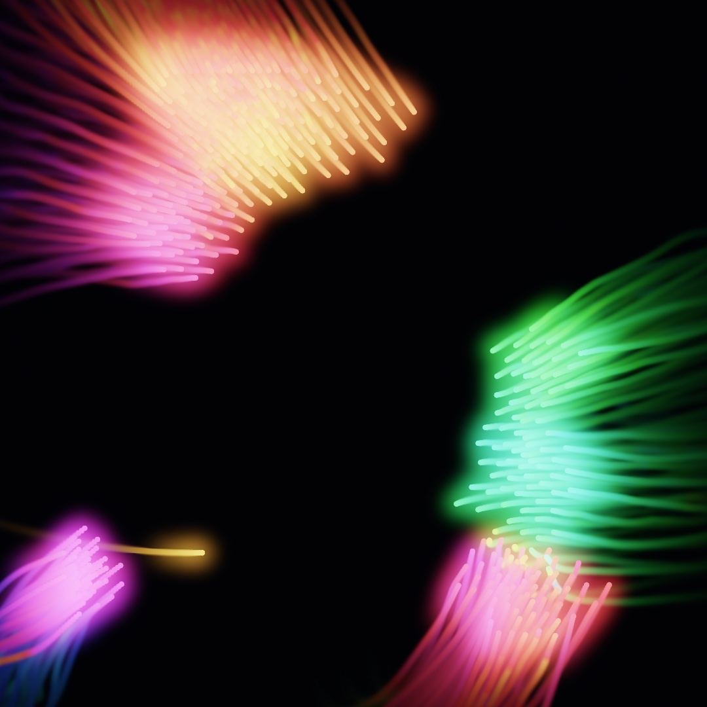

A layer is a second canvas off screen, one you can filter, blend, and keep from frame to frame. This chapter teaches all three, from the filter catalog to a canvas that feeds its own past back in. The comets above are the flock of [Chapter 12](12-FlocksAndSwarms.md), drawn into a feedback layer that comes back bloomed and added as light. After them comes what to do when a frame gets slow.

## A drawing you can hold: render targets

[Chapter 18](18-YourFirstShader.md) handed you a layer that a shader had filled, and `.image` put it on the canvas. Here you draw into a layer yourself, with the same calls you have used since [Chapter 1](01-HelloOllin.md). You make one and aim your drawing at it. Nothing appears yet, because the drawing is *held*, waiting for you to decide what happens to it. Make `MySketches/FirstLayer.swift`:

```swift
import Ollin

final class FirstLayer: Sketch {
    override func draw() {
        background(.black)

        let art = makeRenderTarget()
        withTarget(art) {
            background(Color(hex: 0x0E1B33))
            noStroke()
            for i in 0 ..< 14 {
                let t = Double(i) / 14
                fill(Color(hue: 0.52 + t * 0.38, saturation: 0.7, brightness: 0.95))
                drawCircle(width * (0.16 + 0.68 * t),
                           height * 0.5 + sin(t * .tau * 1.5) * height * 0.2, 64)
            }
        }

        drawImage(art.filtered(.gaussianBlur(radius: 45)).image, 0, 0)   // soft, everywhere
        drawImage(art.image, in: bounds.inset(by: .all(200)))            // sharp, in front
    }
}
```

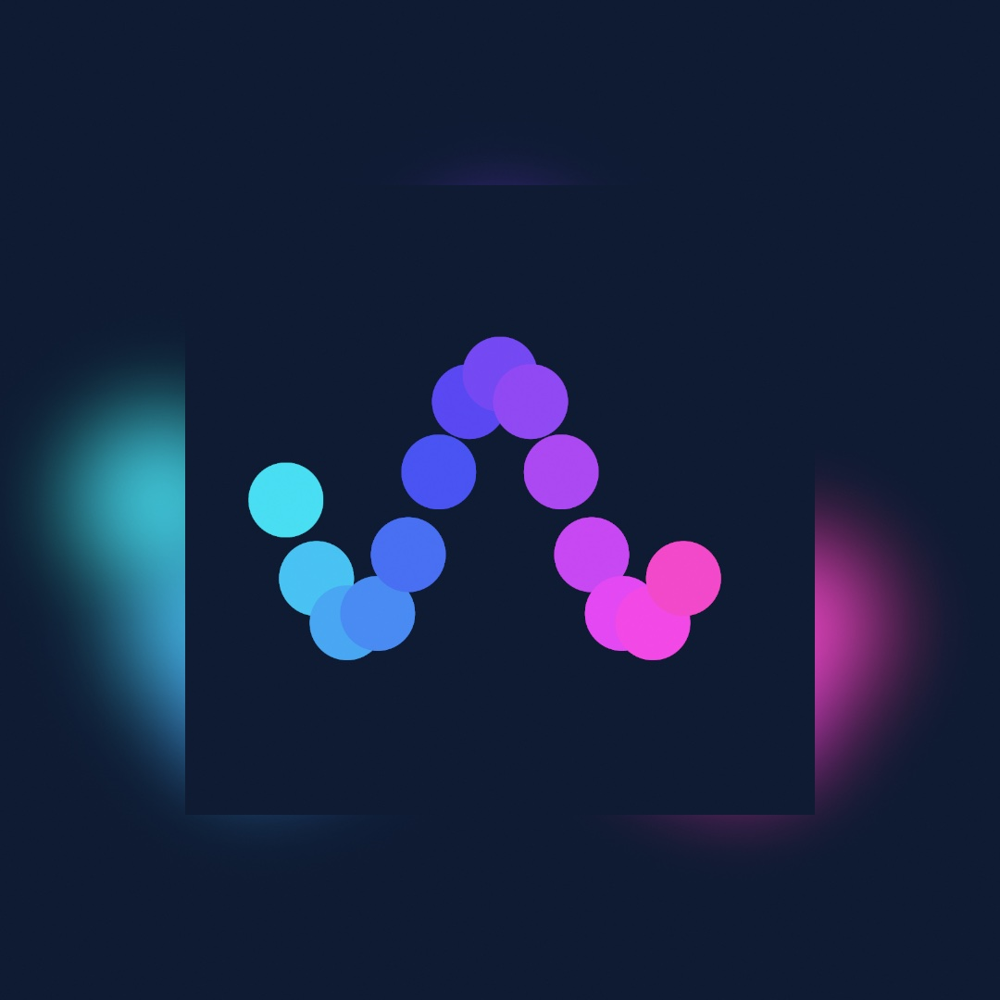

Three calls carry the idea. `makeRenderTarget()` makes the layer. `withTarget(art) { }` sends everything drawn inside the block into it, the way `withState { }` scopes a transform, and a `background(_:)` inside clears just the layer. Then `art.image` hands the finished layer back as an image for [Chapter 9](09-Pictures.md)'s `drawImage`. So the same drawing can appear twice, once blurred across the whole canvas and once sharp in a card in front of its own blur. One drawing, held and then used, is what every section of this chapter builds on.

Two habits follow from that. A `makeRenderTarget()` is a per-frame handle, so make it fresh inside `draw()` rather than storing it. The texture behind it is pooled and reused, so making one each frame costs nothing. And a layer that is never drawn back stays invisible, because `withTarget` only records the drawing, and `drawImage` is what puts it on screen.

Here is the same idea as a picture, one thumbnail per stage. Two drawings each land in a layer, and each layer goes through a filter. The second filter is the glow the Filters section names. Then the canvas composites the results:

<picture>
  <source media="(prefers-color-scheme: dark)" srcset="Images/19-LayersAndEffects/Layers-dark.jpg">
  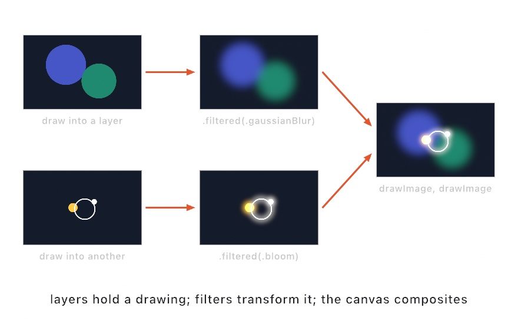
</picture>

## Filters

That `.filtered(.gaussianBlur(radius: 45))` in the first listing was a **filter**. A filter reads a layer and hands back a new, transformed layer, with the original untouched. Each one is a pass or a few over the layer's pixels on the GPU. So a filter costs by the pixel and never by the number of marks. Filters also chain:

```swift
let moody = art.filtered(.posterize(levels: 5)).filtered(.vignette())
```

Ollin ships dozens of them, in six families. The families are blur and glow, color and tone, stylize, retro, distortion (the warps that bend an image's coordinates), and design. Here is one photograph, a young woman in a lace headdress, through eleven of them:

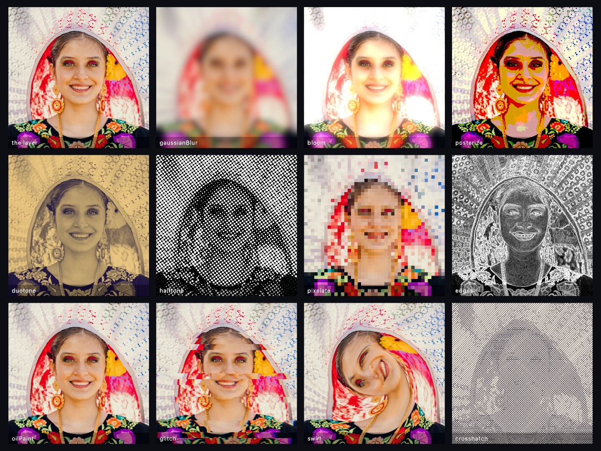

A sheet like this can be one call. `drawSheet` takes a list of labeled items and lays them into a near-square grid of tiles. It draws each one through a closure you give it, and sets each label on its tile. So comparing a family of filters is a list and a line. [Chapter 20](20-PicturesRestyled.md) turns photographs into other kinds of picture with the stylize and design families.

The one to meet properly now is **bloom**, because the finished sketch rests on it. `.bloom(threshold:amount:radius:)` finds the parts of the image brighter than `threshold`, blurs them, and adds the blur back. A bright mark then bleeds light into its surroundings the way a streetlight bleeds into fog. That is the difference between a white dot and a glowing dot.

Filters are also values, so you can keep several in a `[Filter]` array and pick one by index from a `@Param`. And `postProcess(.bloom())` applies a filter to the whole finished frame with no layer at all, which is the quick way to make everything glow.

A filter does not care where its layer came from. [Chapter 18](18-YourFirstShader.md)'s `generate(_:)` ran a shader over a whole layer, your own or one of the design generators Ollin ships. What came back was this same kind of layer. So a generated sky filters and composites like one you drew:

```swift
let sky = generate(.meshGradient(colors: [Color(hex: 0xE4572E), Color(hex: 0x2B6C8C),
                                          Color(hex: 0xE8B44A), Color(hex: 0x7C3B5E)],
                                 phase: 5.1))
drawImage(sky.filtered(.paperTexture()).image, 0, 0)
```

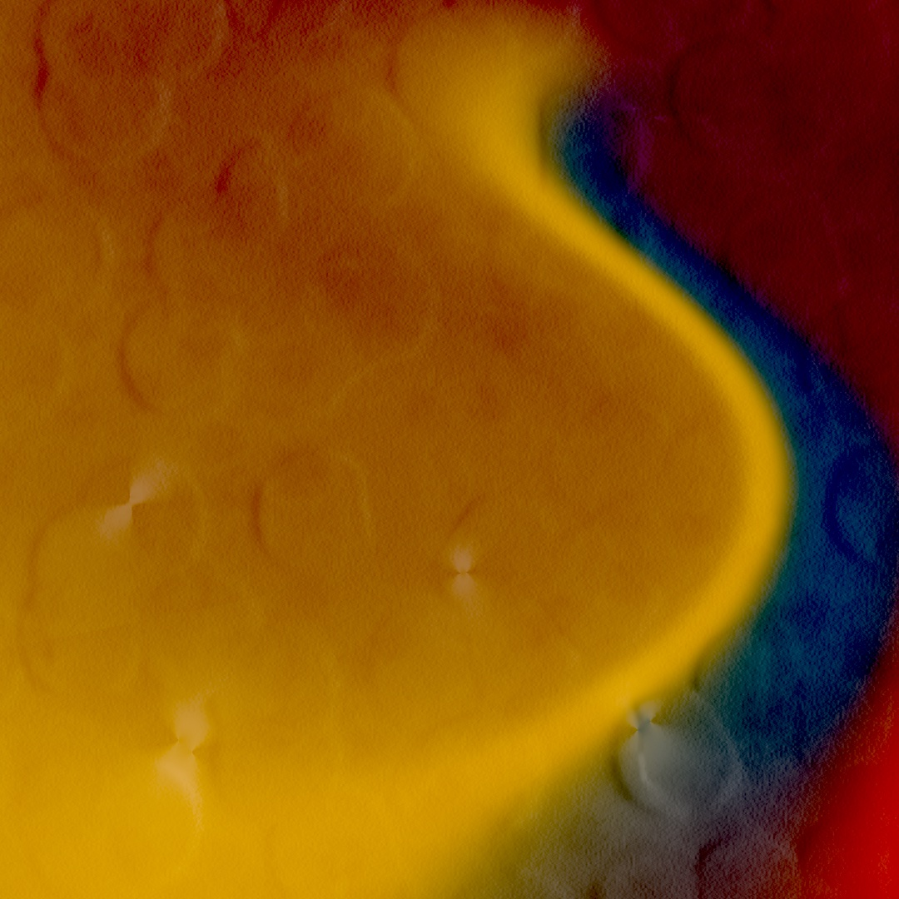

One generator and one filter, and the canvas is a printed poster. The generator makes a mesh gradient of soft color blobs melting into each other. Then `.paperTexture()` lays it onto a sheet of paper it synthesizes, with its crumples.

## How new paint meets old: blend modes

So far every mark, on the canvas or in a layer, has covered what was under it. That is one way for new paint to meet old, and there are others. `blendMode(_:)` changes the arithmetic of that meeting. It is ordinary drawing state like `fill`, saved by `withState { }`, and it applies to shapes and to composited layers alike:

<picture>
  <source media="(prefers-color-scheme: dark)" srcset="Images/19-LayersAndEffects/BlendModes-dark.jpg">
  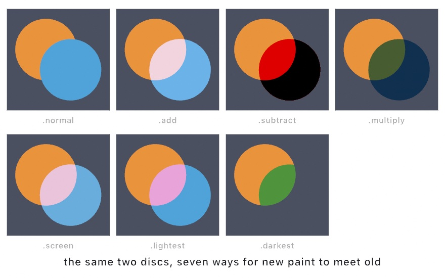
</picture>

The one to learn first is `.add`. It sums colors the way light sums, so two faint marks make a brighter one and a thousand make a glow. Ollin blends color as physical amounts of light, in the linear space [Chapter 9](09-Pictures.md) met when it averaged pixels. So the sum behaves like lamps overlapping. Against a dark background, additive drawing stops reading as paint and starts reading as light. `.multiply` does the opposite. It stacks color like layered ink or gels, and it works on light backgrounds. The rest are variations on lighter and darker, and the figure shows each of the seven on the same two discs.

One pairing comes back through the chapter. A bloomed layer drawn with `blendMode(.add)` reads as added light rather than as a sticker laid over the scene. The finished sketch composites its comets that way.

## The whole stack in one block: compose

By now a frame might go like this. Draw a backdrop layer, blur it, draw a lights layer, bloom it, then composite one normally and one additively. You can wire that by hand with the calls above. Or you can declare it as one `compose { }` block, where each `layer { }` carries its own filters and blend mode:

```swift
import Ollin

final class ComposeStack: Sketch {
    override func draw() {
        background(Color(hex: 0x080B12))
        compose {
            layer {                                   // beneath: a soft color field
                noStroke()
                fill(Color(hex: 0x2C3A8C)); drawCircle(width * 0.35, height * 0.4, 330)
                fill(Color(hex: 0x1F7A6B)); drawCircle(width * 0.68, height * 0.62, 300)
                fill(Color(hex: 0x6B2C58)); drawCircle(width * 0.45, height * 0.78, 240)
            }
            .post(.gaussianBlur(radius: 60))
            .scaled(0.5)

            layer {                                   // on top: lights that glow
                noStroke()
                for i in 0 ..< 15 {
                    let a = Double(i) / 15 * .tau
                    fill(Color(hue: 0.08 + Double(i) * 0.014, saturation: 0.5, brightness: 1))
                    drawCircle(width / 2 + cos(a) * 300, height / 2 + sin(a) * 300, 10)
                }
                stroke(Color(hex: 0xFFD98A)); strokeWeight(3); noFill()
                drawCircle(width / 2, height / 2, 300)
            }
            .post(.bloom(threshold: 0.4, amount: 1.8, radius: 26))
            .blended(.add)
        }
    }
}
```

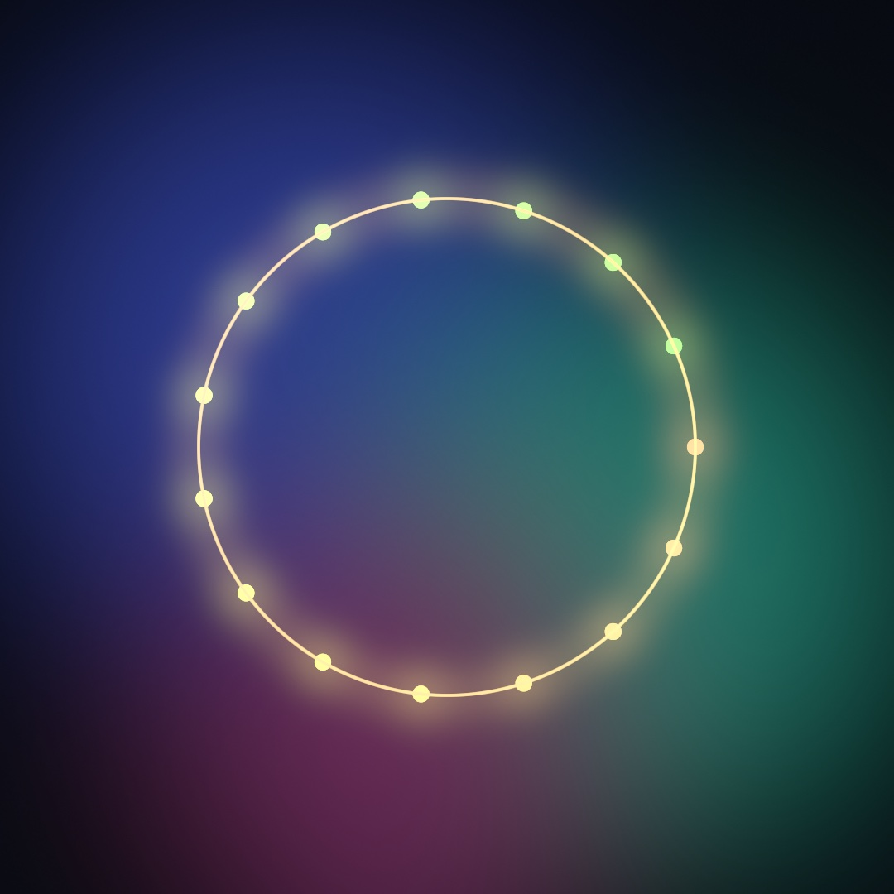

Layers composite bottom to top in the order written. `.post(_:)` filters a layer, `.blended(_:)` sets its mode, and `.scaled(0.5)` renders it at half resolution, which a layer about to be blurred can afford. All of it is shorthand, since everything `compose` does, the calls you already know can do by hand. What the block adds is that it holds the in-between layers for you. Some effects need *two* layers, a mask or a displacement map. For those the same block takes an `aside { }`, a helper layer drawn only to feed another one. The [effects reference](../Docs/Drawing/Effects.md#aside) covers it.

## The canvas that keeps everything: noClear

Every layer so far was made for one frame and thrown away with it. The rest of the chapter is about what a canvas can keep from one frame to the next. The plainest case is the canvas itself. [Chapter 12](12-FlocksAndSwarms.md) gave a first look: `noClear()` stops the canvas from being wiped between frames, and from then on drawing *piles up*. Pair it with `.add` and faint marks become deposits of light, arriving frame after frame, the long-exposure photograph as a drawing style. Make `MySketches/Sandpainting.swift`:

```swift
import Ollin

final class Sandpainting: Sketch {
    var grains: [Vector2] = []

    override func setup() {
        seed(6)
        background(Color(hex: 0x05070C))
        noClear()
        toneMap(.aces, exposure: 1.5)
    }

    override func draw() {
        if grains.isEmpty {
            grains = (0 ..< 2600).map { _ in Vector2(random(width), random(height)) }
        }
        let field = curlField(scale: 0.0021)
        grains = field.advected(grains, stepLength: 2.4)

        blendMode(.add)
        noStroke()
        for (i, grain) in grains.enumerated() {
            if !bounds.contains(grain) {
                grains[i] = Vector2(random(width), random(height))
                continue
            }
            let warm = Double(i % 5) / 5
            fill(Color(hue: 0.06 + warm * 0.07, saturation: 0.75, brightness: 1, alpha: 0.045))
            drawCircle(center: grain, radius: 1.6)
        }
    }
}
```

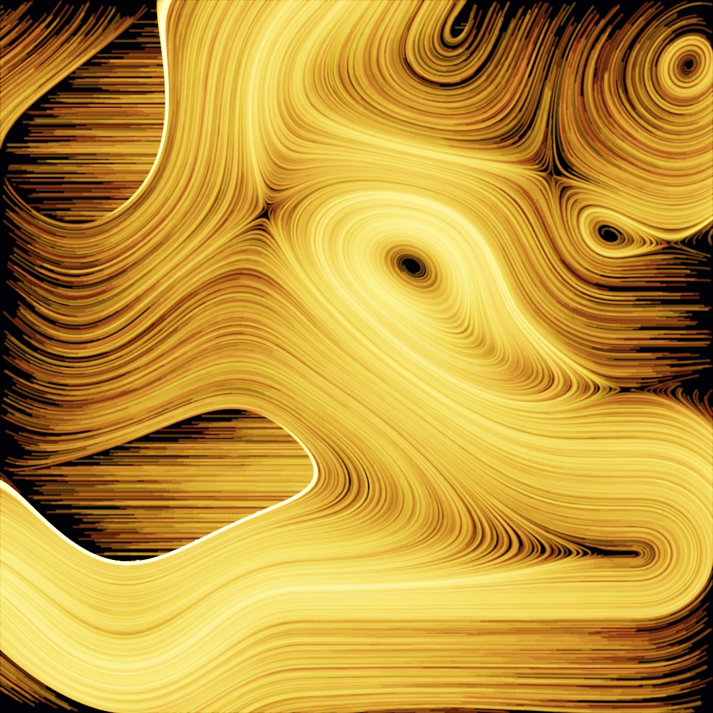

Each frame draws only 2,600 dots, each at an alpha of 0.045, barely visible alone. Six hundred frames later the canvas holds more than a million deposits. The curl field's eddies emerge as rivers of light, with `advected` carrying the grains the way it carried [Chapter 14](14-FieldsAndFlow.md)'s riders. Nothing here is drawn as a line. The lines are where light kept landing.

> **Swift note.** `grains.isEmpty` is true while the list has nothing in it, so the scatter is rolled on the first frame only. `continue` skips the rest of the loop body for this grain and goes on to the next one. [Chapter 11](11-ForcesAndPhysics.md)'s `guard` used it the same way.

While accumulating, `background(_:)` is the reset, so call it on the frame you want to wipe, or never. And a still additive scene only brightens, toward white, for as long as it runs, so keep something moving.

## Converging instead of brightening: the running mean

That second note is a limit of the pile. A `noClear` canvas holds a *sum*, and a sum only grows. What a still scene wants is the *mean*: the sum divided by how many passes went into it. A mean settles at one brightness however long it runs, and only gets smoother. `makeAccumulator()` keeps that for you. Draw each frame's samples into it with `withAccumulator`, and read `image` for the average so far:

```swift
var light: Accumulator!

override func setup() {
    light = makeAccumulator()
}

override func draw() {
    background(Color(hex: 0x05070C))
    withAccumulator(light) {                          // one more pass
        blendMode(.add)
        noStroke()
        for _ in 0 ..< 4000 {
            let p = Vector2(random(width), random(height))
            let hue = noise(p.x * 0.004, p.y * 0.004)
            fill(Color(hue: hue, saturation: 0.7, brightness: 1, alpha: 0.5))
            drawCircle(center: p, radius: 1.2)
        }
    }
    drawImage(light.developed(exposure: 3, ground: Color(hex: 0x05070C)).image, 0, 0)
}
```

The first frame is four thousand random dots. After a few hundred, the dots have averaged into the smooth noise field they were sampling, at the brightness one frame had. Nothing saturates, because nothing accumulates: the accumulator holds the sum in single-precision float and the count beside it, and `image` is their ratio. `light.reset()` starts it over when the scene changes. `developed(exposure:ground:)` prints the mean the way a photograph is printed, with an exposure, a Reinhard roll-off, and the paper's own tone added after the curve. The `Rendering/DepthOfField` example uses this to turn a million scattered samples a frame into a photograph with a lens. [Chapter 31](31-TracedLight.md#a-lens-made-of-samples-depth-of-field-from-light) picks it up with the 3D camera. The `Accumulator!` is [Chapter 12](12-FlocksAndSwarms.md)'s `Boids!` again, a property filled in `setup()` before anything reads it.

## Brighter than the screen: toneMap

That `toneMap(.aces, exposure: 1.5)` line in the sandpainting needs explaining, because it solves a problem you now have. Additive light does not stop at full brightness. Three overlapping lamps sum to three times what the screen can show. Ollin composites every frame in a high-precision format that keeps those too-bright values, and `toneMap(_:)` decides what happens when the frame finally meets the screen. The default clips every too-bright value to white, which is simple and abrupt:

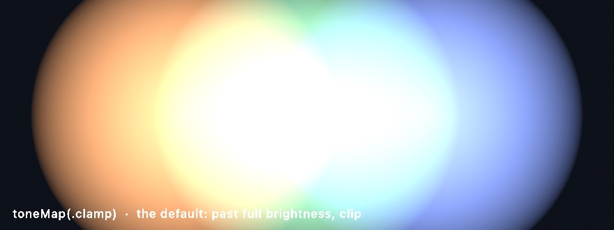

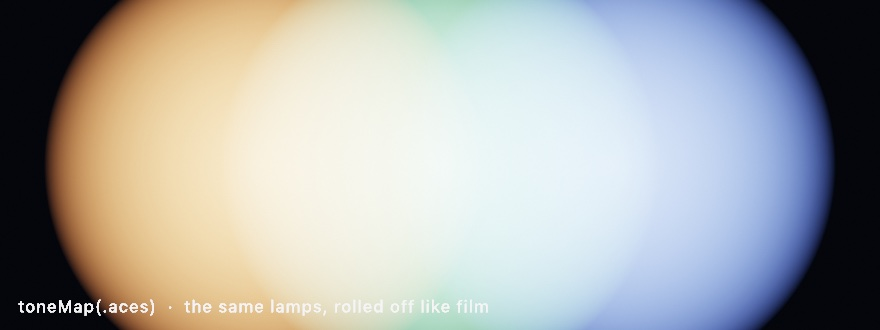

Same lamps, same brightness, one line different. `.aces` runs the frame through the S-shaped response of film. It rolls highlights off gradually instead of chopping them, and keeps color alive inside the glare. Set it once in `setup()`, and `exposure` is the brightness dial applied before the curve, like a camera's. For any glow, accumulation, or additive sketch, set `toneMap(.aces)` first, because without it the bright cores flatten to white. The details live in the [HDR reference](../Docs/Drawing/HDR.md). Some displays can show a little light above white, and [Chapter 38](38-FinishingASketch.md#brighter-than-white-hdr-output) keeps it in the files a sketch exports.

## The canvas that remembers itself: feedback

Accumulation and the running mean both add new marks to a picture that otherwise sits still. **Feedback** hands you the picture itself. Each frame you get the layer's last picture back as an image. You transform it however you like, draw it into the new frame, and add this frame's marks on top. The transformed past becomes the new present, over and over. The transform you choose, a fade, a zoom, a turn, or all three, decides what the effect looks like:

<picture>
  <source media="(prefers-color-scheme: dark)" srcset="Images/19-LayersAndEffects/FeedbackSteps-dark.jpg">
  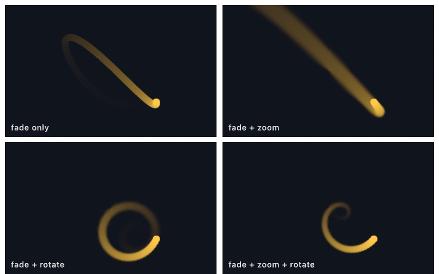
</picture>

A `Feedback` layer is made once in `setup()` and kept, because its identity is what carries the picture from frame to frame. The layer itself starts every frame cleared, so if you never draw `prev` back, the past is gone:

```swift
var trail: Feedback!
override func setup() { trail = makeFeedback() }
```

The `!` is the same promise as the `Accumulator!` above. The finished sketch uses `Feedback?` with a `guard let` instead.

Then each frame runs the loop. It reads the past, transforms it, draws it back, and adds the new marks. This is the heart of the finished sketch below:

```swift
withFeedback(trail) { prev in                 // prev = last frame, as an image
    withState {
        translate(width / 2, height / 2)      // zoom + turn the past, about the center
        scale(1.006)
        rotate(0.0025)
        translate(-width / 2, -height / 2)
        tint(Color(white: 1, alpha: 0.93))    // and fade it a little
        drawImage(prev, 0, 0)
        noTint()
    }
    // ...then draw this frame's new marks on top
}
drawImage(trail.image, 0, 0)                  // composite the result
```

The `tint` alpha is the decay ([Chapter 9](09-Pictures.md) used `tint` to fade a picture the same way). At 0.93 each pass keeps 93% of the past, so marks take dozens of frames to melt away. The small zoom and rotation mean the past does not only fade, it *drifts*, and moving things leave wakes that curve. The difference from `noClear` is where the past goes. Accumulation adds to a fixed canvas, while feedback hands you the past as an image to warp first. The warp is the difference between a long exposure and a hall of mirrors.

## Putting it together: comets

[Chapter 12](12-FlocksAndSwarms.md) ended with a flock of triangles trailing fading paint. Here is the same flock rebuilt from four of this chapter's steps. They are the feedback loop, the bloom filter, the `.add` blend mode, and the ACES tone map. The boids draw as bright dots into a feedback layer, which gives them wakes that drift and curl. The layer comes back bloomed and added as light, and the tone map rolls the hot cores off like film. For contrast, here is the before:


Make `MySketches/Comets.swift`:

```swift
import Ollin

final class Comets: Sketch {
    var flock: Boids?
    var trail: Feedback?

    override func setup() {
        toneMap(.aces, exposure: 1.3)
        trail = makeFeedback()
    }

    override func draw() {
        background(Color(hex: 0x04060B))
        if flock == nil {
            flock = Boids(count: 430, in: bounds, seed: 11,
                          maxSpeed: 3.4 * scale, maxForce: 0.14 * scale,
                          perceptionRadius: 78 * scale, separationRadius: 24 * scale,
                          margin: 100 * scale)
        }
        guard let flock, let trail else { return }
        flock.step()

        withFeedback(trail) { prev in
            withState {
                translate(width / 2, height / 2)
                scale(1.006)
                rotate(0.0025)
                translate(-width / 2, -height / 2)
                tint(Color(white: 1, alpha: 0.93))
                drawImage(prev, 0, 0)
                noTint()
            }
            noStroke()
            for i in 0 ..< flock.count {
                let heading = flock.heading(i)
                fill(Color(hue: (heading + .pi) / .tau + 0.52,
                           saturation: 0.62, brightness: 1))
                drawCircle(center: flock.positions[i], radius: 3.6 * scale)
            }
        }

        blendMode(.add)
        drawImage(trail.filtered(.bloom(threshold: 0.25, amount: 1.5, radius: 16)).image, 0, 0)
        blendMode(.normal)
    }
}
```

Read it in three parts. The flock is [Chapter 12](12-FlocksAndSwarms.md)'s `Boids`, retuned for comets with fewer birds that see further, and still steering by the same three rules. The middle part is the feedback loop, as the feedback section wrote it. The boids are drawn inside it, so their light lands *in* the layer that remembers. The last part is one line of compositing. The trail layer comes back bloomed, added as light, and rolled off by the tone map set back in `setup()`. Every hue still means a heading, and now it also smears into a wake that shows where the heading has been.

> **Swift note.** `guard let flock, let trail else { return }` unwraps two optionals in one `guard`, the way [Chapter 16](16-CurvesAndFigures.md)'s `if let` bound two at once. `flock.heading(i)` is the boid's direction in radians, from `-.pi` to `.pi`, so `(heading + .pi) / .tau` turns it into a hue from 0 to 1.

Then make it yours:

- Adjust the feedback. An `alpha: 0.85` gives short nervous tails, while `0.97` fills the sky with fog. Flipping `scale(1.006)` to `0.994` makes the wakes fall inward instead of spreading outward.
- Put a `@Param` on the bloom's `amount` and the tone map's `exposure` and grade the sketch live, like color-timing film.
- Swap the flock for anything that moves: [Chapter 14](14-FieldsAndFlow.md)'s advected riders, [Chapter 11](11-ForcesAndPhysics.md)'s bouncing bodies, or just your mouse.
- Draw a dim `generate(.meshGradient(...))` layer where the flat `background` is, and the comets fly over weather.

The comets are motion, so keep them as a few seconds of video:

```sh
swift run OllinLive MySketches/Comets.swift --export-video comets.mp4 --seconds 8
```

## When it gets slow

The comets add passes to the frame, one for the feedback layer and a few for the bloom, and still fit with room to spare. Sooner or later a sketch will not. A chapter that just added layers, filters, and more passes over every pixel is the place to say what to do then. The useful question is which half of the frame is behind, the drawing your code does or the pixels the card fills. The inspector's cost row answers that, and a batch is the usual fix when the drawing is the slow half.

### Which half is slow: the cost row

The cost row is the last row of the inspector, and it measures one frame. Press **⌘/** for the inspector. The cell grid ends with three counts, and two bars sit under it.

<picture>
  <source media="(prefers-color-scheme: dark)" srcset="Images/19-LayersAndEffects/CostRow-dark.jpg">
  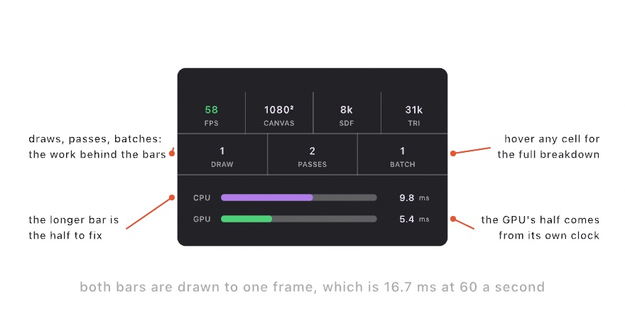
</picture>

The **CPU** bar is your `draw()` plus the encoding that turns it into GPU commands. Tessellation lives there. A polygon, a curve, or a stroke is cut into triangles before the GPU sees it, while a closed shape like a circle or a rectangle is one instance. The **GPU** bar is what the card spent on the frame, taken from its own clock.

Both bars are drawn to the same scale, which is the length of one frame. At 60 frames a second that is 16.7 ms. So the longer bar is your problem, and two short bars mean you have room.

The bars are kept apart on purpose. The CPU is already building the next frame while the GPU draws this one, so the two overlap in time rather than adding up.

The counts say what the frame asked for. **Draws** is the draw calls. **Passes** is the render passes, which is two for a plain sketch and one more for every layer and filter. **Batches** is the runs the drawer recorded, and a run breaks whenever the blend mode, the texture, the clip, or the kind of drawing changes.

The batch count is the one to watch. Ten thousand circles in a row cost one draw call. Ten circles that each change the blend mode cost ten. If the batch count is close to the shape count, group the shapes that share a state.

The rest of the reading is short:

- **CPU bar long?** You are making geometry. Hover Draws for the vertex count. Static geometry belongs in a batch, recorded once and replayed from the card, which the batches entry shows.
- **GPU bar long?** You are filling pixels. Look at the pass count, and give soft layers a smaller `makeRenderTarget(scale:)`.
- **Both short and still slow?** Something outside the drawing is holding the frame, like a file read in the middle of `draw()`.

When you need to know which pass, hand the frame to Xcode:

```sh
MTL_CAPTURE_ENABLED=1 swift run OllinLive MySketches/Comets.swift
```

Then **View ▸ Capture GPU Frame (⌘⇧G)**, or `captureGPUFrame()` from your own code. Ollin writes a `.gputrace` file that opens in Xcode's GPU debugger, and prints the frame's passes in order as it writes the file. Often that printed list answers it.

### Record it once: batches

A **batch** is a recording of drawing calls, kept on the graphics card and replayed on demand. It is for a picture that does not change between frames, which is where a long CPU bar is easiest to fix. Every sketch so far has been immediate-mode drawing, the model Processing, p5.js, and openFrameworks share, where every frame re-issues every mark. [Chapter 15](15-ShapesAsMaterial.md)'s habit was to build the geometry once, hold it, and let `draw()` only replay it. Even the replaying costs something. `draw()` still walks your arrays and re-issues every line to the GPU, sixty times a second, for a picture that never changes. A batch is the retained exception to that model:

```swift
var drawing: Batch?

override func setup() {
    drawing = makeBatch {
        // any drawing calls that don't change between frames
    }
}

override func draw() {
    background(.white)
    if let drawing { drawBatch(drawing) }
}
```

`makeBatch { }` records your drawing once into a `Batch` you hold, and `drawBatch` replays it from the GPU's own memory. For static work at scale the difference is large. A hundred and fifty thousand circles cost about 13.5 ms of CPU a frame drawn the ordinary way, and about 0.003 ms replayed. The [`Rendering/RetainedBatch`](../Examples/Rendering/RetainedBatch/Sketch.swift) example has a parameter that switches between the two paths, so you can watch the difference in the inspector. The transform in force when you call `drawBatch` still applies to the whole recording, so one batch can be stamped at several positions or sizes.

The rule of thumb: if the drawing does not change between frames, it belongs in a batch, and if it does change, leave it alone. A few things are per-frame by nature and cannot be recorded, namely 3D meshes and fields, GPU particles, layer blocks like `withTarget`, clipping, and `background`. The recording leaves them out, and Ollin prints a note once, at the call inside `makeBatch`, saying where to draw them instead.

## Where this comes from

The shape the layers take here, a filter catalog and explicit compositing in a `compose` block, follows OPENRNDR's model, on Ollin's own Metal core. The compositing arithmetic descends from Thomas Porter and Tom Duff's 1984 paper *Compositing Digital Images*. The everyday blend-mode vocabulary of multiply, screen, lightest, and darkest is the image editors' tradition that grew up after it.

Tone mapping comes from photography by way of Erik Reinhard, Michael Stark, Peter Shirley, and James Ferwerda's 2002 *Photographic Tone Reproduction for Digital Images*. The film-like curve behind `.aces` is the Academy Color Encoding System's response, in Krzysztof Narkowicz's fitted approximation.

The filter catalog reimplements published image-processing techniques, each written from its method. The menu was cross-read against OPENRNDR's orx-fx, openFrameworks' ofxFX, and AsyncGraphics for which effects exist and how they are approached. The running mean and its print follow Anders Hoff's depth-of-field essays and Domenico Bruzzese's Blurry, read for approach and written independently.

Video feedback is the analog ancestor of the `Feedback` layer. Video artists pointed a camera at its own monitor from the late 1960s on, Nam June Paik and Steina and Woody Vasulka among them. There the transform is whatever the room does to the signal. Full credits are in the project's [attribution notes](../ATTRIBUTION.md).

## Go deeper

- [Layered effects](../Docs/Drawing/Effects.md): every filter, generator, combine op, and the full `compose` grammar.
- [Layers](../Docs/Concepts/Layers.md): one screen on what a layer is, what one costs, and when you do not need one.
- [What survives a frame](../Docs/Concepts/Persistence.md): the list of what carries into the next frame, from the ink state to a checkpoint on disk.
- [Accumulation](../Docs/Drawing/Accumulation.md) and [HDR & tone mapping](../Docs/Drawing/HDR.md): the persistent canvas, the `Accumulator` that keeps a running mean, and the float pipeline underneath both.
- [Depth of field from light](../Docs/Drawing/DepthOfField.md): the `develop` print filter, and the lens built on the running mean.
- [Blend modes](../Docs/Drawing/Drawing.md#blendMode): the arithmetic of each mode.
- [Profiling](../Docs/Tools/Profiling.md): reading the cost row, what to do about each answer, and capturing a frame for a closer look.
- [Retained batches](../Docs/Drawing/Batches.md): what a `Batch` can and can't record, how transforms apply at replay, and the measured numbers.
- Appendix B draws this chapter's math, one picture per idea: [Shaping a value](B-JustEnoughMath.md#shaping-a-value), [Color and light as numbers](B-JustEnoughMath.md#color-and-light-as-numbers).
- Worked examples: [`Examples/Effects/Layers`](../Examples/Effects/Layers/Sketch.swift), [`Examples/Effects/Feedback`](../Examples/Effects/Feedback/Sketch.swift), [`Examples/Effects/PigmentMix`](../Examples/Effects/PigmentMix/Sketch.swift) (`.paintMix` and `.mix` over the same two layers at once), [`Examples/Rendering/Accumulation`](../Examples/Rendering/Accumulation/Sketch.swift), [`Examples/Rendering/DepthOfField`](../Examples/Rendering/DepthOfField/Sketch.swift) (a running mean of a million samples a frame), [`Examples/Rendering/ToneMapping`](../Examples/Rendering/ToneMapping/Sketch.swift), and [`Examples/Rendering/RetainedBatch`](../Examples/Rendering/RetainedBatch/Sketch.swift) (the same field drawn directly or replayed, on a switch).

---

[Contents](README.md#contents) · Previous: [Chapter 18, Your first shader](18-YourFirstShader.md) · Next: [Chapter 20, Pictures restyled](20-PicturesRestyled.md)
