#### <sup>[Ollin](../README.md) → [Guide](README.md) → Chapter 20</sup>

---

# 20. 3D, gently

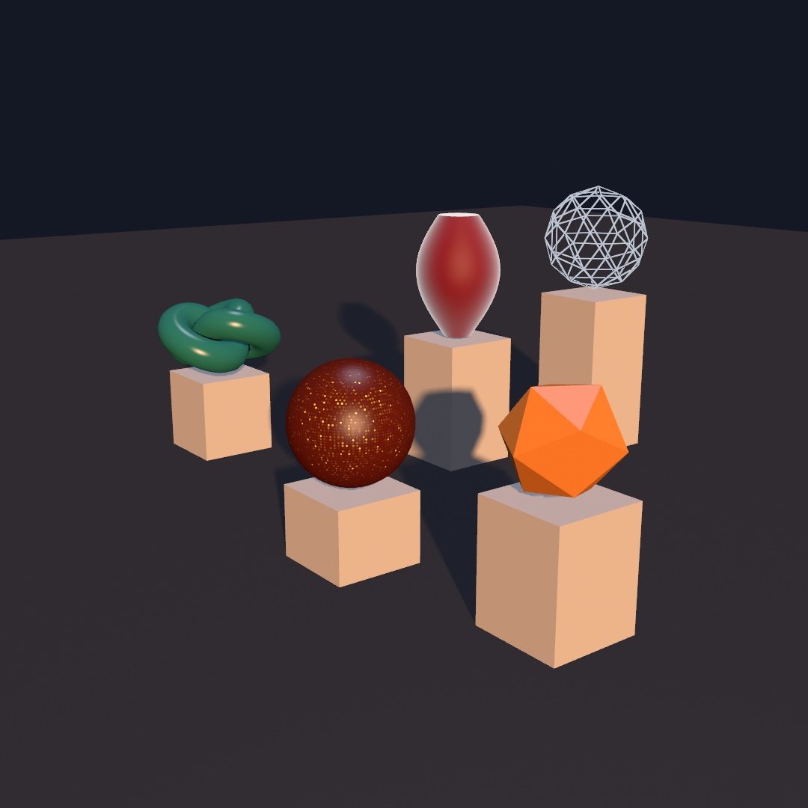

Every sketch so far lived on a flat canvas. This chapter adds the third axis, and the surprising part is how little changes. You keep the same `draw()`, the same `fill` and `translate`, and the same motion by default. What's new is a camera, a handful of solid shapes, and light. By the end you'll have built that sculpture court, and you'll be able to grab it with the mouse and walk around it.

## The world behind the canvas

3D drawing doesn't happen *on* the canvas. It happens in a world of its own, and a **camera** photographs that world onto the canvas each frame. The world has three axes, where x runs right, y runs **up**, and z runs toward you. Positions in it are `Vector3`s, which are exactly [Chapter 10](10-Vectors.md)'s `Vector2` with a third number:

```swift
let p = Vector3(2, 1, -3)     // 2 right, 1 up, 3 away
```

Two habits from the canvas need resetting. First, in the world **y goes up**, the opposite of the canvas, where y grows downward, so a tower rises toward positive y. Second, there are no pixels here. World distances are **world units**, and a unit means whatever your scene wants it to mean. That's a meter for a room, or a sphere-width for an abstract piece. Sizes on screen come from where the camera stands.

## A camera and a sphere

A sketch becomes 3D by setting a camera. That's the entire opt-in, and the friendliest camera is one call:

```swift
import Ollin

final class FirstSphere: Sketch {
    override func draw() {
        background(Color(hex: 0x10141B))
        cameraShowcase(radius: 5)
        fill(Color(hex: 0xF25F5C))
        drawSphere(radius: 1)
    }
}
```


Run it live and drag. The sphere isn't a flat disc, it's a shaded ball, and the mouse orbits around it. `cameraShowcase` gives you the camera most 3D sketches want with no wiring at all. It circles the scene slowly on its own, and you can grab it any time. Drag to orbit, scroll to move closer or farther, and right-drag to slide the view. After ten seconds of being left alone it drifts back to the opening shot and resumes. That way a sketch on a wall keeps moving and a curious viewer can always explore. When you'd rather the camera hold still until you move it, `cameraControl()` gives you the same gestures without the automatic orbit.

Notice you set up no lights. Solids are lit by a default rig automatically, so a shape looks three-dimensional out of the box. We'll take the lights over ourselves in a few pages.

The camera's home position is three numbers. The picture to keep in mind is an eye riding a sphere around a target:

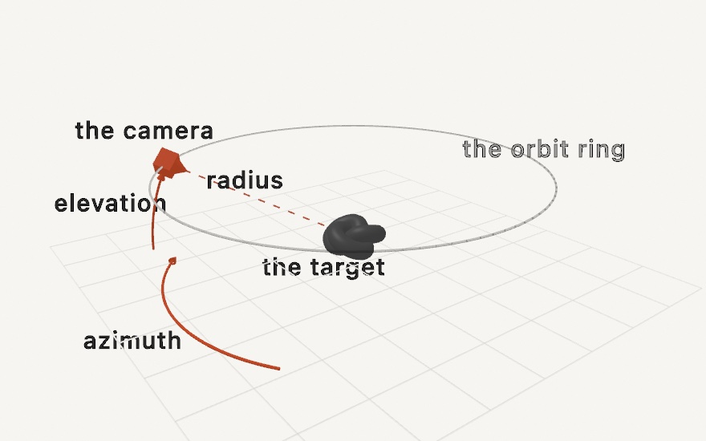

**Radius** is how far away the eye sits. **Azimuth** is how far around it has walked, an angle in radians like every angle since [Chapter 3](03-MotionAndTime.md). **Elevation** is how high it has climbed above the horizon. Every camera motion in this chapter, the automatic orbit and your mouse drags alike, is just these three numbers changing. The camera is per-frame state, like the things you draw, so it's set inside `draw()`.

> **Swift note.** `cameraShowcase(radius: 5)` fills in defaults for everything you don't mention: target, elevation, lens. The framing arguments only apply on the first call; after that, the viewer and the auto-orbit own the pose, which is why passing the same numbers every frame doesn't fight the mouse.

## Depth is real

Place a few spheres at different distances and the second new thing appears:

```swift
override func draw() {
    background(Color(hex: 0x10141B))
    cameraShowcase(target: Vector3(0, 0.4, -1), radius: 13,
                   elevation: 0.3, fieldOfView: .pi / 4)

    fill(Color(white: 0.75))
    drawPlane(width: 40, depth: 40)

    for i in 0 ..< 6 {
        withState {
            translate(Double(i) * 0.9 - 2.1, 0.7, 2.4 - Double(i) * 2.0)
            fill(Color(hue: 0.55 + Double(i) * 0.06, saturation: 0.55, brightness: 0.95))
            drawSphere(radius: 0.7)
        }
    }
}
```


Three things happened at once. `translate` grew a third argument, so it moves things in space now. The spheres get smaller as they get farther away, because the camera has perspective. And each sphere *hides* the ones behind it. That hiding is the **depth test**, which means the renderer remembers, per pixel, how far away the nearest surface was, and anything farther loses. You never sort anything by hand. Draw in any order and the world works it out.

`drawPlane` is the floor, a flat sheet on the ground, and it's the stage most scenes stand on. `fieldOfView` is the lens. Smaller angles are telephoto, which reads calm and flat and suits product shots, while bigger angles are wide-angle, dramatic and stretched at the edges. The default is a fairly wide lens, so this sketch tightens it to a quarter turn.

## A catalog of solids

The catalog runs well past spheres and boxes. Each of these is one call, shaded and depth-tested like everything else:

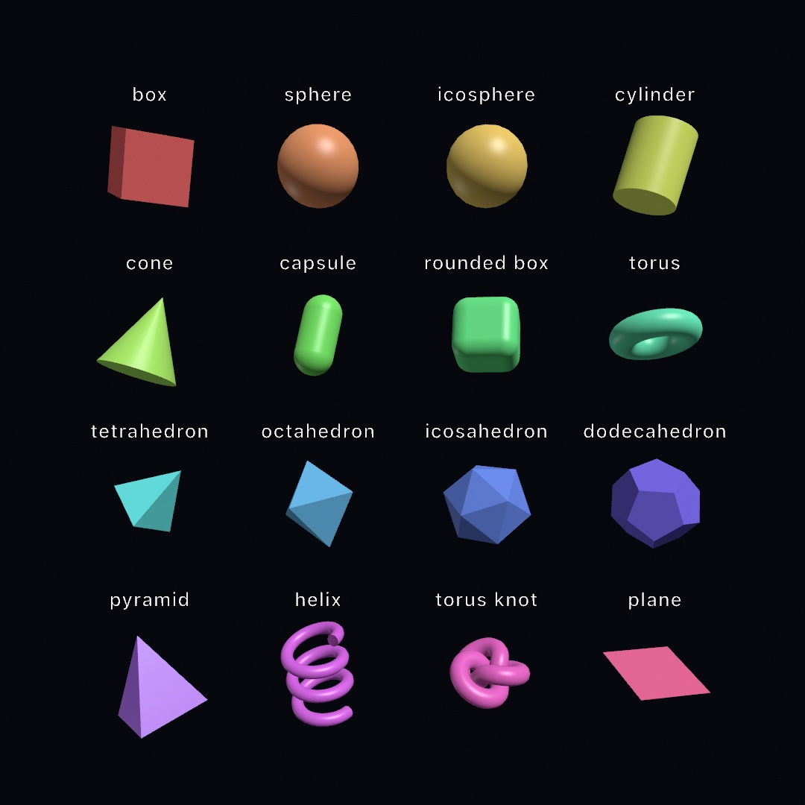

The names are what you'd guess: `drawBox(size: 1.5)`, `drawTorus(radius: 0.6, tube: 0.25)`, `drawCone(radius: 0.7, height: 1.5)`, and so on. Past the everyday ones there's also a small shape *factory*. `drawSupershape` and `drawSuperellipsoid` sweep whole families of organic and gem-like forms from a few numbers. `drawExtrude` pushes any flat 2D shape into depth. `drawLathe` revolves a side profile into a vase, and `drawTube` sweeps a tube along any 3D path. The `3D/ShapeFactory` example is the tour.

Under every one of these calls is a **`Mesh`**, the shape as a cloud of triangles, which is what all 3D surfaces are made of here. The `draw*` calls rebuild their mesh every frame, which is fine for a box and wasteful for a dense knot. The pattern for anything heavy is the one you know from images and fonts, build once, draw forever:

```swift
let knot = Mesh.torusKnot(radius: 0.62, tube: 0.2, segments: 220, sides: 14)
// …each frame:
drawMesh(knot)
```

## Placing things: transforms compose

You've been using `withState` and `translate` since [Chapter 6](06-GridsAndRepetition.md), and in 3D they're joined by `rotateX`, `rotateY`, `rotateZ` (each spins around one axis), and the same `scale`. The important idea hasn't changed: **every move builds on the moves before it**. In 3D that compounding is where structures come from:

```swift
override func draw() {
    background(Color(hex: 0x10141B))
    camera(.orbiting(target: Vector3(0, 4.4, 0), radius: 15,
                     azimuth: 0.7, elevation: 0.22, fieldOfView: .pi / 4))

    // The center post the treads wind around.
    withState {
        translate(0, 4.4, 0)
        fill(Color(white: 0.35))
        drawCylinder(radius: 0.22, height: 9.4)
    }

    for i in 0 ..< 26 {
        translate(0, 0.34, 0)          // each tread builds on the last:
        rotateY(0.34)                  // a step up and a turn
        withState {
            translate(1.25, 0, 0)      // out to the side, this tread only
            fill(Color(hue: 0.55 + Double(i) * 0.012, saturation: 0.5, brightness: 0.95))
            drawBox(width: 2.1, height: 0.15, depth: 0.85)
        }
    }
}
```


Read the loop closely, because it uses both halves of the tool. The climb and the turn sit *outside* any `withState`, so they accumulate, step after step, and that accumulation is the spiral. The sideways step to hang each tread off the post sits *inside* a `withState`, so it applies to one tread and is forgotten. One repeated move-and-turn, and a staircase happens.

This sketch also shows the plain `camera(.orbiting(...))` call, a fixed pose you specify completely, with no mouse involved. Reach for it when you want to compose a shot exactly, and for `cameraShowcase` when you want the scene alive and explorable.

Nesting `withState` blocks builds solar systems. Translate to a planet and draw it, then translate again and draw its moon, and the moon inherits the planet's motion for free. The `3D/Transforms` example is exactly that, three transforms deep.

## Light, by playing

Everything so far wore the default lighting. Taking over is one call before you draw, and the fastest way to feel what lighting does is to swap whole moods:


```swift
lightingPreset(.goldenHour)     // one call relights the whole scene
```

The six presets (`.standard`, `.threePoint`, `.goldenHour`, `.noir`, `.studio`, `.moonlight`) are each an ambient wash plus a few placed lights, tuned like film rigs. Play with them first, because the mood of a 3D piece is mostly its light. Swapping presets on a knob teaches you more in a minute than any paragraph.

When you're ready to place your own, there are three kinds of light, and one scene can carry all of them:

```swift
ambientLight(Color(white: 0.1))                                     // a floor for the shadows
directionalLight(Color(hex: 0xFFD9A8), direction: Vector3(-0.6, -1, -0.35))
pointLight(Color(hex: 0x39D8E8), at: Vector3(2.7, 1.7, 1.9))
spotLight(Color(hex: 0xE85FD0), at: Vector3(-3.4, 4.6, 2.6),
          direction: Vector3(0, -1, 0), angle: .pi / 5, penumbra: 0.4)
castShadows()
```


A **directional** light is the sun, parallel rays from a direction, with no position of its own, lighting everything evenly. A **point** light is a bulb at a place, so nearby things catch it strongly. A **spot** is a point light narrowed to an aimed cone, with a `penumbra` for how soft its edge falls. The `ambientLight` is a flat wash added to every surface so the unlit sides aren't pure black. Each light takes an `intensity`, and in the figure each has its own color so you can see who's doing what. The warm key shades everything, the cyan bulb blooms on the surfaces near it, and the magenta cone pools on the floor.

Two smaller dials finish the surface's response to light: `specular(_:)` sets how strong the highlight is (0 is matte) and `shininess(_:)` how tight. But mostly you won't set those by hand, because of the materials library below. First, though, there is that one extra line in the listing above to account for.

## Shadows, and what they tell you

**`castShadows()`** is what plants objects in a scene. Without it, a floating sphere and a resting sphere look the same, because nothing in the picture says where either one is. A shadow answers that.

```swift
directionalLight(.white, direction: Vector3(-0.22, -1, -0.16))
castShadows()
shadowSoftness(1)

drawPlane(width: 14, depth: 8)                                  // something to catch them
withState { translate(0, 3.4, 0); drawSphere(radius: 0.5) }     // and something to cast one
```

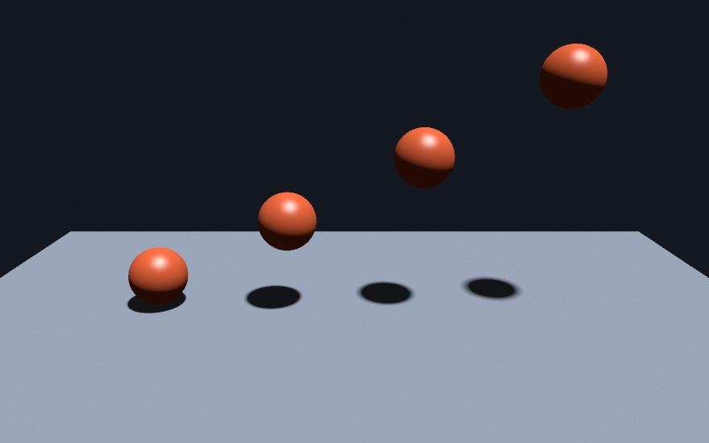

Four identical spheres, one floor, one light. You know instantly which one is resting and which is highest, and the only thing telling you is the shadow. Two things change as a sphere climbs. The shadow drifts away from it, and the edge gets softer. The one on the left, touching down, has a tight ellipse with a crisp edge. The one on the right, three and a bit units up, has a blurry patch with a wide grey skirt.

That softening is worth knowing about because it is the thing that makes rendered shadows look real. Shadows here are **contact-hardening** by default, so they are sharp where an object meets a surface and softer as the shadow falls away. `shadowSoftness(_:)` sets how strong the effect is, from `0` for a hard edge, the classic look, through the `0.5` default to `1`. The figure asks for `1` so the difference is easy to see at this size. At the default it is subtler and usually what you want.

Some practical notes, in the order they tend to bite:

- **You need something to catch a shadow.** A sphere alone in space casts into nothing. A floor, or another object, is what makes the shadow visible.
- **It's opt-in and per-frame.** A sketch that never calls `castShadows()` pays nothing at all, so shadows cost you only when you ask. Call it in `draw()` alongside the lights, and `noShadows()` turns it back off.
- **One light does the casting**, chosen for you. It's the first directional light, or a spot if there's no directional, or a point light failing that. A glowing panel can cast too, which is the next section. The default rig's key light is directional, so a scene you haven't relit already works.
- **Nothing needs aiming.** The shadow's frame auto-fits around whatever the camera is looking at.

The three kinds of light cast by different routes, which mostly matters because it explains the cost. A directional or spot light renders the scene once from the light's own viewpoint and darkens whatever that view can't see. A point light casts in every direction at once. So on Apple silicon it traces actual rays from each lit pixel toward the light, which is exact, with no bias artifacts, and the most expensive of the three. On a GPU that can't trace rays it falls back to a depth map sampled by direction. Point shadows still work everywhere, and your sketch doesn't change either way.

If a penumbra looks grainy rather than smooth, that's the sample count, not the softness. `shadowQuality(.detail)` asks for more samples relative to whatever GPU is running, and `shadowSamples(16)` sets an exact number.

There is one place even a good shadow map falls short, and it is the most important few pixels in the picture. That's the exact line where an object touches the ground. A map has finite resolution, and the bias that keeps its speckle off nudges its shadow slightly away from the caster. The last sliver of contact opens up, and a resting box can read as floating a hair above the floor. **`contactShadows()`** closes that seam. For each pixel the renderer walks a short ray toward the casting light through the scene's own depth. It darkens the pixel where something nearby blocks the way, which draws the fine dark line a map can't hold at any resolution.

```swift
castShadows()
shadowSoftness(0.9)   // a wide, soft look: lovely, but every base goes loose
contactShadows()      // the short march that seats them again
```


The three resting solids each get the tight dark line at their base. The hovering sphere, the one thing genuinely off the ground, gets only the soft drifted blob a real gap produces. That difference is the whole feature. It refines whatever caster `castShadows()` picked, works on any Mac, and takes one optional dial. `contactShadows(length: 8)` sets the ray's reach in world units, and with no length a short reach comes from the scene's own scale. The honest limit is that the march can only consult what the camera sees. Off-screen geometry casts no contact shadow, and a curved surface can pick up a touch of extra shading just inside its silhouette. For the seam under a resting thing, which is what it's for, it simply works.

## A light with a body

The three kinds above are infinitesimal points. A fourth family gives light a *body*. `rectLight` is a glowing panel, a softbox or a window. `diskLight` is a glowing circle, and `tubeLight` is a glowing cylinder strung between two points, a neon. `intensity` means something different here, and it's worth a moment. It is the glow of the surface itself, so brightness falls off with distance on its own. A bigger panel pours more light at the same glow, and a thin neon needs an intensity in the tens, because a thin tube is a small piece of sky.

What a body buys you is easiest to see by changing its size and nothing else:

```swift
let side = 1.0 + pingPong(over: 6) * 2.2
let facing = Vector3(0.55, -0.58, 0.6)          // aimed down across the set
rectLight(Color(hue: 0.09, saturation: 0.22, brightness: 1.0),
          at: Vector3(-3.4, 4.8, -1.2), direction: facing,
          width: side, height: side, intensity: 70 / (side * side))
castShadows()
```

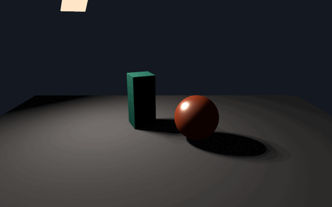

The listing divides the panel's glow by its area as it grows. The light poured on the set never changes, so you can watch what size alone does. Three things move together. The highlight on the sphere is the panel's own reflection, so it grows from a small window into a broad sheen. The shading wraps further around each form, because more of each surface can see some part of the panel. And the cast shadows, sharp when the panel is small, spread into soft-edged pools. They stay crisp where the box meets the floor and widen the farther they fall. The size of the light is the softness of the picture, and here it's one number.

Shadows work the way the last section said, with the panel's size standing in for a light's position. A rect or disk panel is picked as the caster when no punctual light claims the job, and its penumbra comes from the panel's real extent, nothing to set. `shadowSoftness(_:)` scales that extent rather than some separate size, so `0` is hard, the `0.5` default is the panel's true size, and `1` is twice as soft. A tube never casts. It glows in every direction, so there is no side to draw a shadow from. One practical note comes from the figure's own listing. Lights are invisible, so the glowing slab you see is a drawn prop, placed a step *behind* the emitting plane. A casting panel treats any geometry in front of that plane, its own prop included, as an occluder.

The `3D/Lighting/AreaLights` example stages all three shapes over a glossy floor. Put it beside `3D/Lighting/Lighting` and the difference between a bulb and a panel is the whole studio-photography look. `3D/Lighting/AreaShadows` is the breathing softbox.

## The shape of the throw

A bare point light pours the same brightness in every direction, and a spot is just that pour with a cone cut into it. Real fixtures are choosier. A recessed downlight pools a hot disc with a faint ring of spill around it. A street lamp throws sideways in two wings, so the bright spot isn't the foot of its own pole. A wallwasher climbs the wall and leaves the room alone. Lighting manufacturers measure exactly where each fixture sends its light. They publish the measurement as an **IES file**, a small text file of brightness-by-angle, and a light can wear one:

```swift
let ring = IESProfile(string: ringFile)!     // or IESProfile(resource: "downlight", in: .module)!

pointLight(Color(hue: 0.09, saturation: 0.35, brightness: 1.0),
           at: Vector3(-2.6, 2.4, 0.4), intensity: 1.4, profile: ring)

let rock = sin(loopProgress(over: 6) * .tau) * 0.16
spotLight(Color(hue: 0.12, saturation: 0.25, brightness: 1.0),
          at: Vector3(3.6, 4.6, 4.2), direction: Vector3(-0.32, -0.66, -0.55),
          angle: 0.85, penumbra: 0.12, intensity: 1.25,
          cookie: window, roll: rock)
```


The left pool is the profile at work, a hot center, a dip, then the spill ring, all read from a dozen numbers in the file. The profile's `0°` aims along the light's axis. A spot uses its `direction`, and a point light takes an `axis:`, straight down unless you say otherwise. Its brightest direction is normalized to `1`, so `intensity` still means what it always means, and anywhere the file didn't measure is dark, exactly as the fixture is. Parse the file once in `setup()` and keep it, since it's plain data. `IESProfile(resource:in:)`, `(contentsOf:)`, `(data:)`, and `(string:)` all read the same format. The throw is the fixture's signature, and the file is how you borrow a real one.

The window on the right is the second shaper, a **cookie**, an image a spot projects through its cone. Stage crews call the physical version a gobo, a stencil slid in front of the light. `LightCookie(image)` wraps any `Image` once, in `setup()`. Black blocks, white passes, and color tints like a gel. The image's edges land at the spot's outer cone, so a wider cone throws the same picture larger. The `roll:` in the listing is what rocks the panes. One knob spins an asymmetric profile and the cookie together about the beam, the way a fixture turns in its yoke.

Two habits worth keeping. A profile ends where its measurements end, so a downlight file that stops at 90° sends nothing above the fixture's own horizon. To wash a wall, tilt the light's `axis:` at it, the way the real fixture would be aimed. And both shapers are made-once values. The profile parses its file and the cookie resamples its image at construction, so build them in `setup()` and hand the same value to the light every frame. The `3D/Lighting/LightShaping` example stages a downlight, a batwing, a wallwasher, and this same window over one floor. Its three `.ies` files ride beside the sketch as bundled resources.

## Air you can see

Everything so far shows a light only where it lands. Real air shows the light on its way. Dust and haze catch a beam mid-flight, which is why a projector's cone hangs visibly over a cinema audience. It's why sun through a window is a slanted block of bright air. Two calls give a scene that air.

```swift
fog(Color(hex: 0xB4BDC9), density: 0.16, heightFalloff: 0.55)
```

`fog` fades every surface toward its color with distance, so near things stay crisp while far things dissolve, and depth reads at a glance. `density` is the thickness. The `heightFalloff` thins it with altitude, which is the morning-mist look, mist pooling low while tall things rise clear of it. It costs almost nothing, since the fade is an exact formula rather than a blur pass, so animating the density is just a number moving. The `3D/Effects/Fog` example is a colonnade standing in exactly this mist.

Fog paints every distance toward one color, which is right for a room. Outdoor air is choosier. It takes the blue out of a far ridge's own light, and it adds sunlight scattered into the path, blue from the side, brighter and whiter toward the sun. That is aerial perspective, the cue that makes mountains read as mountains, and it needs to know where the sun sits. So first give the scene a sky. `environment(.sky)` wraps the world in a computed one, with `turbidity` for how dusty the air is and `sunElevation` for how high the sun rides. An environment can light a whole scene, which is the next chapter's territory. Here its job is handing the haze its sun, and with the sky in place the perspective itself is one call:

```swift
environment(.sky(turbidity: 2.4, sunElevation: 0.34))
aerialPerspective()
```

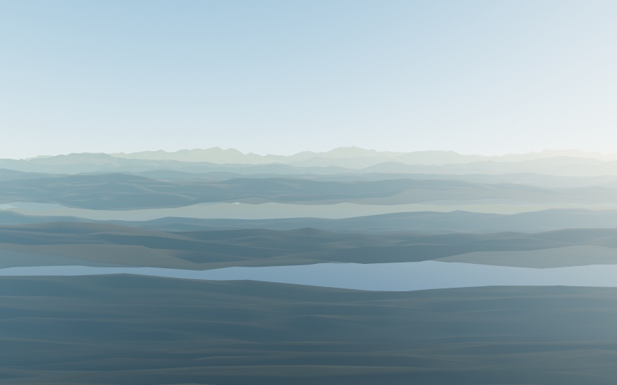

With a `.sky` environment it follows the sky's own sun, rotation and all, so dropping the sun to the horizon reddens the haze by itself. `density` is how much air the scene spans, and bare it sizes itself to the camera framing. `haziness` trades the crisp blue of a clear day for the gray veil and sun halo of a humid one. It replaces `fog` for the frame, the last call wins, and the beams below ride it exactly as they ride fog. The `3D/Effects/AerialPerspective` example puts all of it on knobs.

```swift
castShadows()
volumetricLight()
fog(Color(hex: 0x0A0E18), density: 0.02)   // a whisper of haze for the beams to live in
```

`volumetricLight()` is the beam half. It watches the air along every line of sight and adds the light the haze scatters toward you, so directional and spot lights become *visible in flight*. The point is that everything a light already carries shapes its beam. The spot's cone becomes the projector cone. A cookie's panes read as tilted bars of bright air before they land as a window on the floor, and an IES profile's throw shows its real shape. And with `castShadows()` on, anything standing in the beam carves a dark shaft out of it, the crepuscular rays of a forest morning.


The `anisotropy` knob runs −1…1 and sets how strongly the haze throws light forward. Near 1, a beam flares when the view swings toward its source, the headlights-in-fog effect. At 0 it glows evenly from every side. And the two calls compose either way. With `fog`, the beams live in the fog's own thickness. Without it, the air stays clear and *only* the beams appear, which is the dark-stage look of `3D/Lighting/VolumetricLight`. **The air is part of the scene, and light crossing it is something you can draw.**

One habit is worth knowing. The beam march has a quality dial like the shadows do, `volumetricQuality` with three tiers. The default already does the right thing, frame-rate-safe live, lifted to full quality on export.

## Materials

A material is a surface's whole way of catching light, picked by name. The color still comes from `fill`; the *finish* comes from `material`:

```swift
fill(Color(hex: 0x2C8C86))      // the color
material(.velvet)               // the finish
drawSphere(radius: 1)
```

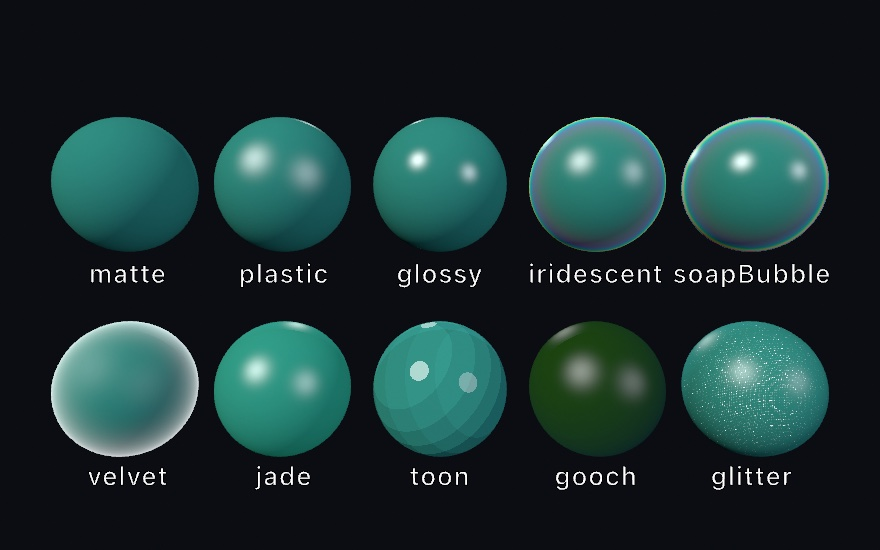

That's ten finishes on one color. The library runs from matte through glossy to the showpieces. `.iridescent` and `.soapBubble` shift hue as the view moves, `.velvet` glows at the edges, and `.jade` lets light through thin parts. `.toon` and `.gooch` are the stylized cartoon and warm-to-cool looks, and `.glitter` is full of tiny mirror flakes that flash as anything moves. `material(_:)` is drawing state like `fill`, saved by `withState`, so every shape in a frame can wear its own.

A `Material` is also a plain value you can tweak. Car paint is the classic recipe, gold flakes over a deep red:

```swift
var paint = Material.glitter
paint.sparkleColor = Color(hue: 0.12, saturation: 0.75, brightness: 1)
material(paint)
fill(Color(hue: 0.02, saturation: 0.8, brightness: 0.4))
drawSphere(radius: 0.62)
```

There's a further tier, the physically based metals and plastics (`material(.metal(roughness: 0.2))`), that really comes alive once a scene has surroundings to reflect. That's the next chapter's territory, where environments light the scene, so treat it as a pointer for now.

## Shading from a picture: matcaps

Matcaps are the shortcut of the sculpting world. Instead of lights and materials, the entire look, lighting included, is painted into one photograph of a sphere. Every surface point borrows the color the sphere would have there.

```swift
matcap(.chrome)
drawMesh(knot)
```

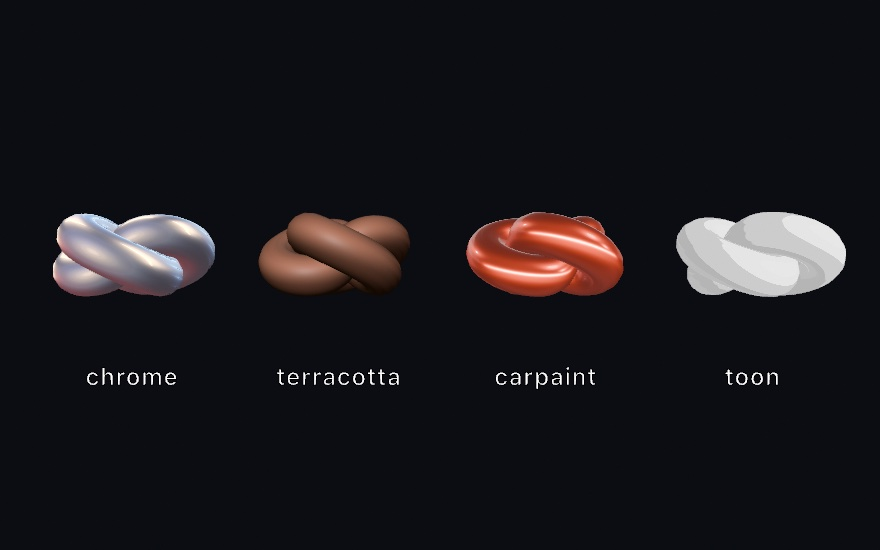

One call, no lights to place, and the look is total, from chrome and clay to car paint and cel shading. It works by asking, for each point on the surface, which way that point is facing relative to you. Then it reads the color from the matching spot on the sphere picture. Point straight at the camera and you get the middle of the picture. Face away toward the edge and you get the rim. Because the picture was lit once, all of that lighting comes along for free. That's why the highlights slide as the view turns, and why it reads as a real material rather than a paint job.

The trade is the same fact seen from the other side. **A matcap ignores your lights, your `material(_:)`, and your shadows**, because it isn't lit at all. The light is a photograph. That makes matcaps a separate axis rather than another finish. They are the wrong choice when an object needs to belong to a scene, matched to its lighting and grounded by a shadow. They are the right one when you want a good-looking surface with no lighting work, which is most of the time you're sketching a form.

There are 26 built in, real studio captures grouped by family. There are metals like `.chrome` and `.bronze`, clays like `.terracotta` and `.sage`, ceramics like `.pearl`, and translucents like `.wax`. Then there is the neutral studio set, `.toon` and `.toonDark`, and a handful of diagnostic ones, `.checkNormal` and `.checkGradient`, meant for reading geometry rather than looking good. Beyond those, `matcap(loadImage("my-matcap.png"))` wears any sphere image you find or paint. `Matcap.shaded(baseColor:metallic:roughness:)` bakes one on the spot with no asset at all, which is the option to reach for when you want a specific color and don't want to ship a file.

Two smaller things. The current `fill` tints the result, so keep it `.white` to see a matcap as captured. And `matcap(_:)` is drawing state like `fill`, so `withState` scopes it and `noMatcap()` returns to the lit path.

## A mesh from a file

Any model you make in a 3D tool can join a sketch. `loadMesh` reads the common formats (`.usdz`, `.obj`, `.gltf`/`.glb`, `.stl`, `.ply`) into a `Mesh`, materials and textures included:

```swift
final class Loaded: Sketch {
    var model: Mesh?

    override func setup() {
        model = loadMesh("/Users/you/Downloads/rubber-duck.usdz")?.normalized(scale: 3)
    }

    override func draw() {
        background(Color(hex: 0x10141B))
        cameraShowcase(radius: 6)
        if let model {
            fill(.white)
            withState { rotateY(time * 0.3); drawMesh(model) }
        }
    }
}
```

The one habit that saves confusion is **`normalized(scale:)`**. A file arrives at whatever size and position its author saved, anywhere from millimeters to kilometers. Normalizing recenters it and scales its longest side to the world units you ask for. Keep the `fill` white so the model's own colors show, because a colored fill tints it. Models you build yourself are yours to ship, while downloaded ones carry licenses worth checking before you bundle them.

> **Swift note.** `loadMesh(...)?.normalized(scale: 3)` chains with `?.` because loading can fail: if the file isn't there, `loadMesh` returns `nil`, the chain stops, and `model` stays `nil`. The `if let model` in `draw()` then simply skips drawing, so a missing file never crashes the sketch.

`loadMesh` deliberately flattens a file into one mesh you place yourself. Sometimes the file *is* the placement: a whole scene composed in the design tool, with a camera framing it and lights already set. For that there's `loadScene`, which keeps the file's structure instead of merging it:

```swift
stage = loadScene("Stage.gltf")!            // in setup()

camera(stage.camera ?? .orbiting(radius: 6))   // the file's own framing
for l in stage.lights { light(l) }             // and its lighting
stage["sculpture"]?.rotate(deltaTime, axis: .unitY)
drawScene(stage)                               // every node, in its authored place
```

A scene is a tree of named nodes, and everything unpacks into things you already know. The file's camera is a `Camera3D`, its lights are `Light`s, and each node's geometry is a `Mesh`. `drawScene` draws the whole layout where the tool put it. `stage["sculpture"]` reaches one node by name, so a single piece moves while the rest holds still. Bring the set over from the design tool, and keep the choreography in the sketch. The `3D/Geometry/LoadedScene` example is a small stage to poke at, and [Scenes](../Docs/3D/Scenes.md) has the details.

If the file was animated in the tool, that motion carries over too. `stage.animations` holds the authored keyframe tracks, and applying one poses the scene at whatever moment you ask for:

```swift
if let spin = stage.animation("spin") {
    stage.apply(spin, at: time.truncatingRemainder(dividingBy: spin.duration))
}
```

The file remembers its motion; the sketch decides when time passes. `apply` takes any time you hand it, so wrapping `time` loops the animation, `time * 0.5` plays it at half speed, and a knob's value scrubs it. The `3D/Geometry/AnimatedScene` example plays a small orrery's authored spin this way, one seamless 8-second lap.

Tracks like the orrery's move whole nodes, rigid pieces on a hierarchy. A file can also carry motion that bends the geometry itself. A *skin* ties each vertex to a few joint nodes with blend weights, so a blade of kelp or an arm flexes smoothly as its joints turn. *Morph targets* store alternate shapes for a mesh, and the node's `weights` mix them, the way faces animate between expressions. Both play through the same `apply`, and `drawScene` poses them without any extra calls. The `3D/Geometry/SkinnedScene` example is a small tidepool doing both at once, kelp swaying on skins while an anemone pulses on two morph targets. And since `weights` is just a node property, `tank["anemone"]?.weights = [1, 0]` poses a blend shape from any signal you like.

Whether a mesh came from a file or a generator, there are two other ways to dress it besides lighting a solid surface.


```swift
withState { fill(teal); material(.glossy); drawMesh(globe) }     // solid
withState { stroke(pale); wireframe(); drawMesh(globe) }         // edges only
withState { fill(.white); drawMesh(globe.textured(checker)) }    // wrapped in an image
```

**`wireframe()`** draws the mesh as its triangle edges instead of filled faces, taking the current `stroke` color and `strokeWeight`. It's how you see what a mesh is actually made of, which is genuinely useful when a generator gives you something odd. It's also just a look, the standard way to show a form that's still a proposal rather than a finished object. Because the faces are see-through, a wireframe doesn't light, so lights and materials have nothing to do.

**`textured(_:)`** returns a copy of a mesh wrapped in an `Image`. Every built-in generator emits the texture coordinates that decide where each part of the picture lands, and the checker above is chosen to make those readable. The squares stay square around the middle and narrow to slivers at the poles. That's what wrapping a flat rectangle onto a ball does, and you'll meet it whenever you texture a sphere. A textured mesh still lights normally, so it takes materials and shadows like any other surface. Keep the `fill` white unless you want the image tinted, the same rule as a loaded model.

Both are ordinary drawing state, saved by `withState`, so one frame holds all three treatments (the figure is a single render).

## A scene you can take apart

Loading a scene keeps the file in charge. Re-export from the tool and the sketch picks up the change, which is what you want while the model is still moving. There is a moment when you want the opposite: the layout is settled, and now you want to *work* on it. For that, ask for the sketch itself.

```sh
ollin new Yard --from-scene yard.usdz
```

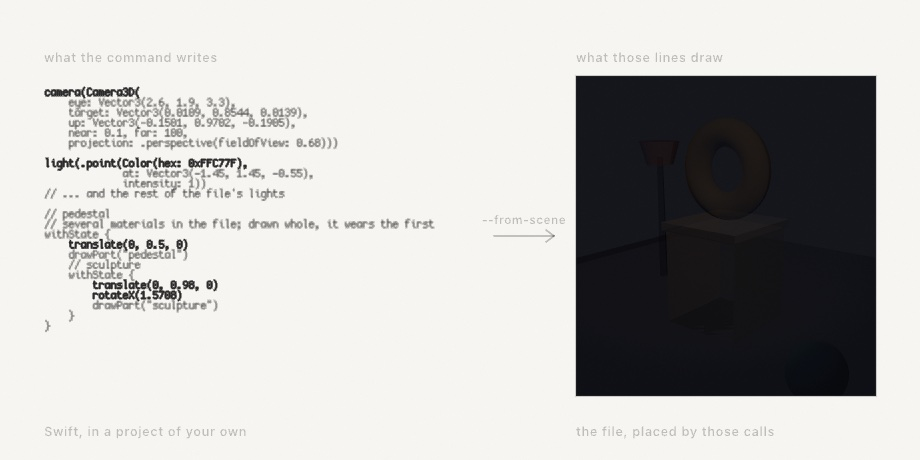

That writes a project whose `draw()` is the scene, spelled out. The camera is a `Camera3D` with its own numbers. Each light is the factory that makes it. Every node is a `withState` block holding the moves that put it where the tool put it, nested the way the file nests them.

What does not become source is the geometry. A mesh is not something anybody edits as text. The sketch reads the file once for its meshes and places them itself. That is what `drawPart` does. Materials ride their meshes for the same reason. No `fill` appears anywhere.

So this is the lossy direction, and it says what it lost. Animation stays behind, along with the skins and blend shapes that bend geometry, since nothing in a written-out placement drives them. A mesh wearing several materials draws in the first, and its block is marked. Everything else is a line in your own sketch now.

Both directions are worth having. `loadScene` is for a set that is still being built. This one is for the moment the file stops being the piece and becomes the material. [Bringing a scene over](../Docs/Tools/SceneImport.md) has the details.

## Relief from a picture: normal maps

A texture changes a surface's color. A **normal map** changes how it catches light. Each texel stores a surface direction instead of a color, and at shading time the lighting normal bends by it. The result is relief without geometry.

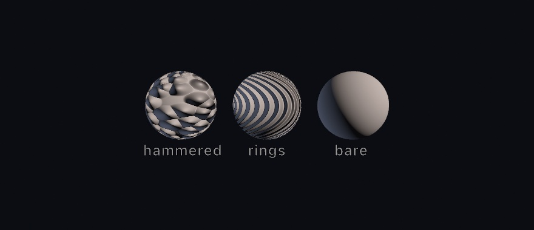

```swift
let hammered = Mesh.sphere(radius: 1).normalMapped(dents)
```

All three spheres are the same 96-segment sphere, and only the middle of the picture knows about dents and rings. Look at the silhouettes, which are perfect circles. That's the tell, and the trade. The bumps exist only in how the light lands, so they cost a texture sample instead of a million triangles. The edge of the object never learns about them. Games have leaned on this for twenty years, which is why a cobblestone street in one can be six polygons.

**`normalMapped(_:scale:)`** hangs a map on any mesh that carries texture coordinates. It quietly sets up the frame of reference the map's directions are expressed in, a *tangent basis*. It's the same standard one other tools bake maps against, so a map made elsewhere lights the same way here. `scale` is a relief dial, where 0 flattens it off, 1 is as authored, and more exaggerates. Loaded models bring their own normal maps along without being asked.

Where do maps come from? Anywhere images do, and one particularly satisfying place, which is math. Start with a height function, take its slopes, and encode them. The `3D/Materials/NormalMaps` example builds hammered metal, woven cloth, and engraved rings this way in a couple dozen lines, no files involved. One convention matters when authoring by hand. Green marks the slope that faces *up the image*. If a map from elsewhere lights upside down, its green channel is inverted, so flip it and it's home.

## What the surface is, per texel

A normal map changes how light lands. The rest of the standard map set changes what the surface *is* from texel to texel, and `surfaceMapped(...)` hangs any of them on a mesh:

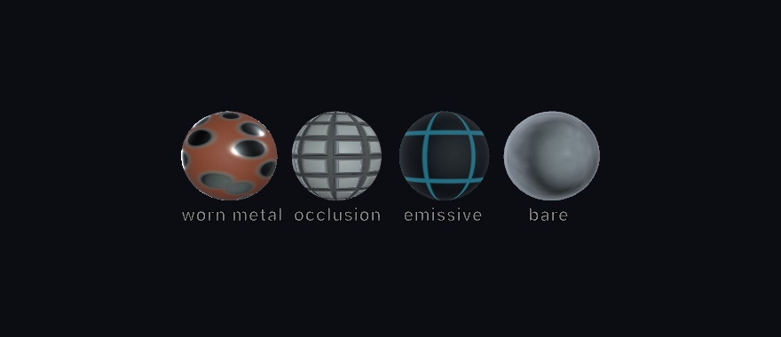

```swift
let panel = Mesh.sphere(radius: 1)
    .textured(paint)
    .surfaceMapped(metallicRoughness: wear,   // roughness in g, metallic in b
                   occlusion: cavity,         // its red channel
                   emissive: seams)           // an ordinary color image
```

A **metallic-roughness map** packs two dials into one image, with roughness on green and metallic on blue, the packing every glTF exporter uses. Per pixel it multiplies the finish you draw under. `.physicallyBased` is the measured tier the materials section pointed ahead to. Both dials at 1 make it a blank the map can write on, so `material(.physicallyBased(metallic: 1, roughness: 1))` shows the map as authored. That multiply is the whole trick of the first sphere. One map says where the paint has rubbed through to bare polished metal, and the base texture colors the same patches silver.

An **occlusion map** is baked shadow for the crevices geometry doesn't have, and it dims only the *steady* light, the ambient and the environment. A lamp shining straight into a groove still lights it, which is exactly how real crevices behave and why the convention exists. The second sphere pairs it with a normal map made from the same height field, the usual recipe. The relief catches the light, and the occlusion keeps its grooves dark.

An **emissive map** makes texels give off light of their own, tinted and dimmed by an `emissiveColor` factor. It works with no lights at all, which is what the third sphere leans on, a nearly black shell whose engraved seams glow. Emission is the surface's own radiance, so fog veils it with distance like everything else. One line of housekeeping is worth knowing. A glowing surface doesn't light its neighbors unless global illumination is on, at which point it does.

Loaded glTF and USD models carry all of these in and out without being asked, and the round trip through `saveScene` keeps them. Like the normal maps above, every map in the figure is authored from a function in `setup()`. The `3D/Materials/SurfaceMaps` example is the worked version with a glow knob.

## Depth from a picture: height maps

A normal map tilts the light. A **height map** goes one further and stores the depth itself. The red channel is height, white is the surface, and darker is carved in below it. One image, and Ollin reads it two ways.

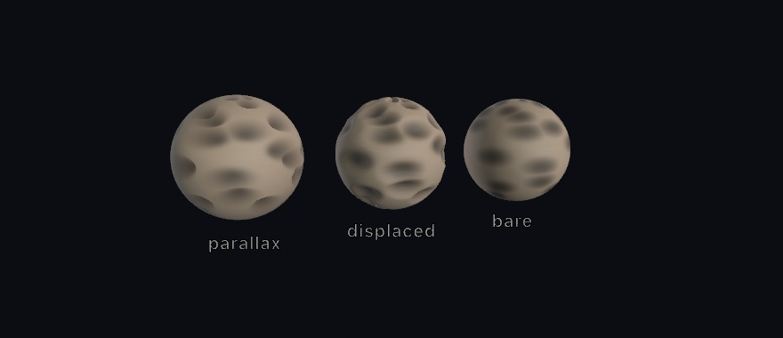

```swift
let moon = base.textured(dust).parallaxMapped(craterHeights, scale: 0.06)
let rock = base.displaced(by: craterHeights, scale: 0.13).textured(dust)
```

**`parallaxMapped(_:scale:)`** is the shading read. At every pixel the renderer marches your line of sight down into the height field and finds where it lands. Then it reads the base texture, the normal map, and every other map *there* instead of at the flat surface. Crevices sink, slide against their rims as the view moves, and hide their far walls, everything real carving does. And still not one vertex has moved. `scale` is the depth of the relief as a fraction of the picture's tile. It needs the same texture coordinates and tangent basis a normal map does, and it sets the basis up itself the same way.

**`displaced(by:scale:)`** is the geometry read. Every vertex really moves along its normal by the height at its spot on the picture, normals are recomputed, and the relief becomes true of the mesh, with `scale` now in the mesh's own units. It's honest work done once, so do it in `setup()` and keep the result. The detail you get is the *mesh's* to give, since a plane with more `segments` carves finer.

Look at the outlines in the figure, because they are the entire lesson. The parallax sphere's silhouette is a perfect circle however deep the craters read. The shading is fiction, and the outline, the cast shadow, and a mirror all keep telling the geometric truth. The displaced sphere's rim is genuinely cratered, in shadow and reflection too. Inside the outline the two are nearly twins, which is exactly why parallax is worth having, all of the depth and none of the triangles. When the edge matters, displace. When it doesn't, march.

White stays put in both readings, one convention doing quiet work. A height map's white regions *are* the authored surface, so the two spheres agree about where the relief lives, and you can hand one map to both calls. The `3D/Materials/Parallax` example is the worked version with the parallax depth on a knob. USD files carry the map in and out, since `saveScene` writes it to the preview surface's displacement slot, while glTF simply has no place to put one.

## Smooth from a cage

There is a third way to get a mesh, and it's the one character artists live in. Build something crude out of a few boxes and extrusions, then let the computer round it. `subdivided(levels:)` takes any mesh as a **control cage**, splits every face, and eases every vertex toward its neighbors, once per level.

```swift
let cage = Mesh.extrude(Profile.star(), depth: 0.75)
let smooth = cage.subdivided(levels: 2)
```

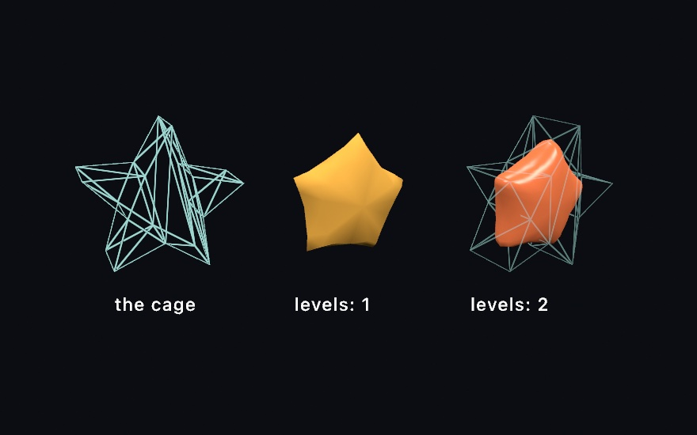

You model the cage, and the smoothness is computed. One level already turns the slab-sided star into something you'd want to hold. By two the form has melted well inside its cage, which is the thing to internalize. The smooth surface eases *toward the averages* of the cage, so it always sits inside it, and pointy features round off the fastest. If a shape comes out softer than you wanted, the fix is a chunkier cage, not fewer levels.

Any mesh works as a cage with no preparation. Take the primitives, an extrusion, a lathe, or a loaded model. `subdivided` welds their shared corners and recovers their intended faces before refining, so a box rounds as one closed surface rather than six drifting plates. Open sheets keep their rims, and a subdivided `plane` smooths along its edge instead of shrinking away from it. Triangle-native meshes like an icosphere or a marching-cubes blob have their own refinement rules a scheme argument away, `subdivided(.loop, levels: 2)`. The [reference page](../Docs/Generators/SubdivisionSurfaces.md) covers when to pick which.

Like erosion below, this is `setup()`-shaped work: each level roughly quadruples the face count, so refine once, keep the mesh, and let `draw()` just draw it. Two or three levels is almost always enough.

## A surface that outgrows itself

Subdividing takes a shape you designed and smooths it. This does the opposite. It hands you a shape nobody designed, out of a rule you can say in one sentence.

Take a mesh. Push its vertices apart, and split any triangle that stretches so the triangles stay a fixed size. The surface now has more area than it started with, and here is the part that matters. **Nothing is pushing it outward.** The forces run along its own edges, and those lie in the surface. It cannot get bigger the way a balloon does. So the new area has to go somewhere, and the only direction left is sideways. It folds.

```swift
// setup(), and keep it:
growth = MeshGrowth(mesh: .icosphere(subdivisions: 3), driver: .uniform, seed: 7)

// draw():
growth.step()
drawMesh(growth.mesh)
```

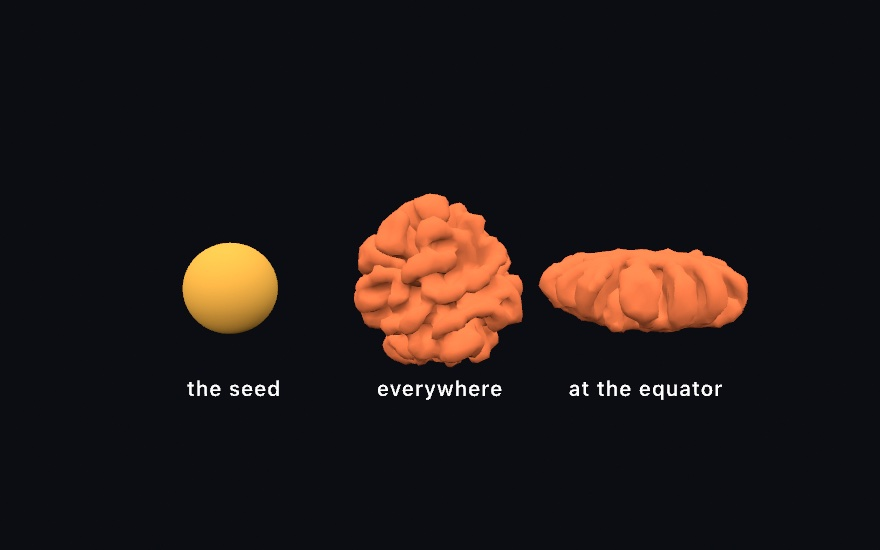

That middle one is a plain sphere that grew evenly, and it is worth sitting with, because nobody told it to make lobes. Grow a ball uniformly and it does not become a bigger ball. It becomes a brain. Every fold in it is the surface running out of room.

The `driver` decides *where* the growth is fastest, and since every driver folds, what you are really choosing is **where the folds go**:

```swift
MeshGrowth(mesh: seed, driver: .uniform)      // evenly, all over
MeshGrowth(mesh: seed, driver: .curvature)    // wherever it already bulges

// Only near the equator, the way a leaf grows along its margin.
MeshGrowth(mesh: seed, driver: .field { position, _ in
    1 - smoothstep(0.1, 0.5, abs(position.y))
})
```

The third panel is that last one. The poles never grew, so they stayed smooth, and everything the band made had to ruffle. It is the same rule as the lettuce leaf and the kale edge. They grow faster along the rim than through the middle, and they buckle for exactly this reason.

The two knobs worth knowing early. `edgeLength` is the triangle size, so it sets the finest fold the surface can hold and it is where the cost lives. `stiffness` is how much the surface resists bending, and it decides how *big* the folds come out. A sheet with no stiffness buckles at the smallest scale it can and reads as crumpled paper, while more of it gathers the same growth into broader waves. If a result looks like foil someone sat on, that is the knob.

There is a fourth driver, `.chemical`, that runs a reaction-diffusion pattern in the surface and grows where the pattern collects. The chemistry decides where to add area, and the new area gives the chemistry more room to spread. That is the branching-coral one, and the [reference page](../Docs/Generators/MeshGrowth.md) has it along with self-avoidance, open sheets that keep their rims, and the cost.

Growth is slow on purpose. A form takes hundreds of steps, and stepping once a frame while you watch it develop is most of the pleasure. `maxVertices` is the ceiling that keeps it interactive, and it also decides how far a form gets before it settles.

## A picture from three sides: triplanar

The last two sections left you holding a small problem. A texture maps through uv coordinates, a little address on every vertex saying where on the picture it sits. The surfaces you just made have none. Nobody unwrapped the grown ball, a subdivided cage comes back without its uvs, and the marched blobs of the next chapter are the same way. `textured(_:)` has nothing to hold onto.

`triplanarTextured` sidesteps the question instead of answering it. Rather than asking the mesh where the picture goes, it projects the picture through the world three times, once along each axis, like three slide projectors aimed down x, y, and z. Every point on the surface blends the three by how squarely it faces each projector. A wall takes nearly everything from the projector facing it. A 45-degree slope takes half and half, and the handoff is gradual enough that you cannot find the line.

```swift
drawMesh(grown.triplanarTextured(stone, normal: veins, scale: 0.9))
```

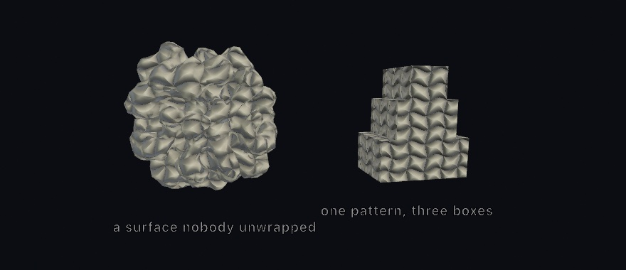

`scale` is the size of one tile in world units, and a `normal:` map rides the same projection. So the veins in the figure are engraved relief, not just darker paint. Notice what you did *not* do. There are no uvs, no tangent basis, and no unwrapping, and the projection works on any mesh you can make or load.

The picture stands still and the surface moves through it. That is the one thing to understand about triplanar, and it cuts both ways. The cairn is three separate boxes drawn one after another, and the pattern runs unbroken across all three, because they stand in the same standing field. That is why the technique is beloved for terrain and rockwork. But a mesh you animate through the transform stack slides through the pattern rather than carrying it along, so a body that travels should wear uvs. A form that grows or morphs in place, like the blob in the `3D/Materials/Triplanar` example, flows through the pattern like a shape turning under falling light, which is its own kind of beautiful.

The projection carries the base texture and a normal map, while the rest of the map set stays with uvs. The [reference page](../Docs/3D/3D.md#triplanar) has the edges of the envelope. The example puts the tile size and the relief on knobs.

## Texture that survives a close look

Every texture has a budget. A picture sized to cover a whole boulder spends all its texels on the big shapes. The moment the camera leans in, the surface runs out of information and dissolves into soft nothing. Real rock does not do that. Get closer and there is always another scale of grain waiting.

`detailMapped` fakes that second scale honestly. It tiles a much finer texture pair across the base one, a color map and a normal map. They repeat several times per base tile, so the close look finds grain the base never carried.

```swift
drawMesh(boulder
    .textured(rock)
    .normalMapped(rockBumps)
    .detailMapped(grain, normal: grainBumps, scale: 12))
```

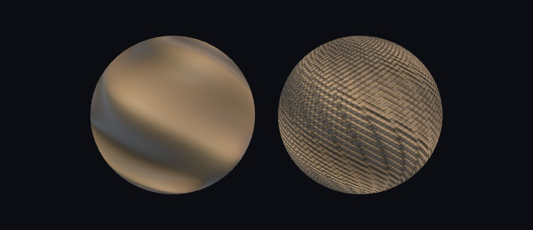

Two conventions make the pair behave. The detail color map multiplies the base with middle gray as its neutral, value 128 in the image. Darker speckles darken, lighter ones lighten, and a flat gray image changes nothing. Author it as texture swinging around gray and the overall tone of your surface holds. And the detail normal map is *reoriented onto* the base relief rather than replacing it. The fine bumps ride the large forms the base map already shaped, the way real grain follows the rock it is part of.

`scale` is how many times the pair repeats across the base, and `strength` fades it out, with zero the honest off switch. One caution is worth keeping. The detail maps carry no mips, so a very high tile count can shimmer when the surface gets small on screen. Keep the scale in the range your framing actually shows, which is what the `3D/Materials/Detail` example is for. It puts the same base maps on two spheres, the detail pair on one of them, and the tile count and strength on knobs while the camera sways close.

## A picture stamped onto the scene: decals

Everything so far dressed one mesh. A sticker does not care about meshes. Slap it on a crate and it wraps whatever it lands on, the crate, the pallet under it, half of the wall behind.

A `Decal` works like that. Wrap an image once, then place it each frame as a small projection box. Every surface inside the box receives the picture, composited over the surface's own color before lighting, so it shades like paint rather than a glowing overlay.

```swift
let sticker = Decal(loadImage("label.png")!)!

override func draw() {
    // camera, lights, floor, crates ...
    decal(sticker, at: dropPoint, width: 140)   // projects straight down by default
}
```

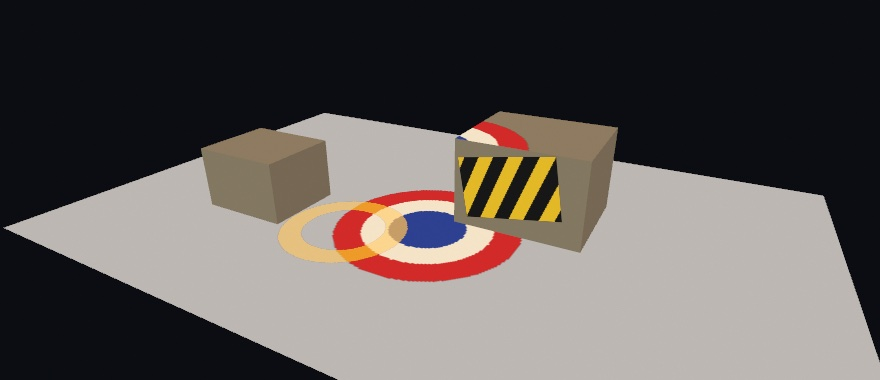

The box has a direction, a width and height, and a depth. The placement is per-frame state like a light, which is the quietly powerful part. Move `at:` and the stamp slides across the scene, crossing from the floor up onto a crate and over its far edge, conforming to whatever it touches. Transparency in the image is honored, and later decals composite over earlier ones. A surface standing edge-on to the projection fades the stamp out instead of smearing it down the side, which is the failure you would otherwise get on every wall.

A decal is paint, so it takes the finish of the surface it lands on. Stamp a rough floor and the mark is matte. Stamp polished metal and it sits under the shine. The [reference page](../Docs/3D/3D.md#decals) has the envelope. That's eight per frame, which surfaces receive them, and what mirrors show. The `3D/Materials/Decals` example slides a roundel across floor and crates on a loop, with the size, a roll, and a see-through ring on knobs.

## A landscape you grow

Loading a mesh gets you a shape somebody else made. Generating one gets you a shape nobody has seen. Terrain is the friendliest place to start. A landscape is just a height for every point on a grid, and Ollin has a type for exactly that.

```swift
let land = Heightfield.diamondSquare(size: 257, roughness: 0.55, seed: 7)
drawMesh(land.mesh(width: 10, depth: 10, height: 2.2))
```

A `Heightfield` holds heights between 0 and 1, and you can grow one from any field you like, including everything [Chapter 5](05-Noise.md) taught. `Heightfield(columns: 257, rows: 257) { u, v in fbm(u * 3, v * 3, octaves: 6) }` rolls hills, and swapping in `ridgedFbm` creases them into ridges. The `diamondSquare` form above is the classic terrain fractal instead. Set the four corners, then repeatedly fill in each square's center and each edge's midpoint with the average of its neighbors plus a random nudge. The grid step halves and the nudge shrinks each round. `roughness` controls how fast the nudges shrink, and around 0.55 reads as landscape. The `size` rounds up to the grid the subdivision needs, which is why it wants numbers like 129, 257, or 513.

Here is the thing that separates a terrain from a cloud of noise, though. Real land doesn't look the way it does because of the rock. It looks that way because water has been running down it for a very long time.

```swift
let weathered = land
    .eroded(.hydraulic(drops: 50_000), seed: 7)
    .eroded(.thermal(talus: 0.012, iterations: 30))
```

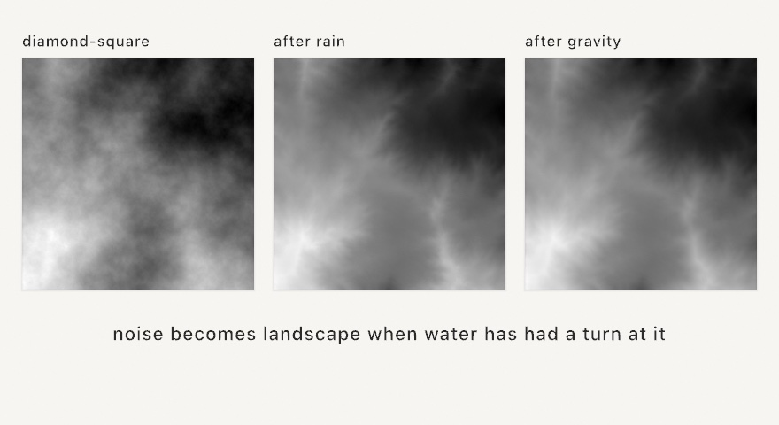

`.hydraulic` drops tens of thousands of simulated raindrops on the terrain. Each one lands somewhere random and rolls downhill. It picks up sediment while it's moving fast, and drops that sediment again as it slows down or dries out. No single drop does much. Fifty thousand of them agree with each other about where the valleys are. Branching drainage networks appear that no amount of layered noise will give you. The middle panel above is the whole argument for the technique.

`.thermal` is gravity's half of the job. Wherever two neighboring samples differ by more than `talus`, some of that excess slides to the lower one. Cliffs shed into scree slopes, and spikes settle to an angle they can actually hold. It's a smaller change than rain. The third panel shows a gentler version of the second rather than a different landscape, which is exactly what weathering looks like.


Once the field is shaped, it reads out three ways. `mesh(width:depth:height:)` gives you a solid mesh with proper normals. `image()` gives you the grayscale heightmap, which is what the three panels are. And `value(atU:v:)` samples any point for placing trees, routing a path, or driving something else entirely. The picture above wears a texture built by walking each height up a `Ramp` from valley green to snow, which is the whole coloring recipe.

One practical note carries all of this. Erosion is genuine work, tens of thousands of drops each walking dozens of steps, so it belongs in `setup()`. Grow the field, weather it, keep the mesh, and let `draw()` just draw it.

## A million riding the same field

[Chapter 14](14-FieldsAndFlow.md) plotted strange attractors as flat ghosts and left the 3D ones, Lorenz and his relatives, waiting for a camera. Here they are. A continuous system like Lorenz is a **velocity field**. Hand it a point in space and it tells you which way that point is moving. `StrangeAttractor` integrates one starting point through that field and hands back the path, which you draw as a curve. That is the left half of the picture below.

The right half is the same field with six hundred thousand particles in it. Each follows it from wherever it happens to be, and all of them step every frame on the GPU.


```swift
var flow: AttractorFlow!

override func setup() {
    flow = attractorFlow(count: 1_000_000, .lorenz())
}

override func draw() {
    background(.black)
    blendMode(.add)
    toneMap(.aces)
    cameraShowcase(target: flow.center, radius: flow.extent * 3.4)
    updateAttractorFlow(flow)
    drawParticles(flow)
}
```

That is the whole thing. A flow is 3D and rides the camera like a point cloud, so `drawParticles` does nothing without one. A million particles step and draw at 55 frames a second on an M2, at two tenths of a millisecond of CPU work per frame. Every particle reads only its own position and nothing else, so there is no neighbor search here, unlike the flock in [Chapter 19](19-Simulations.md).

Notice what the sketch never says. It never says where the attractor is, how big it is, or how fast to run it. Lorenz spans about fifty units and Aizawa about three, and their natural clocks differ by more than an order of magnitude. Hard-coding any of that would tie the sketch to one system. Instead the flow integrates a single CPU orbit when you build it and reads the answers off that. It takes `center` and `extent` for the camera, a splat size, a color range, and a pace that crosses the attractor about once a second. Swap `.lorenz()` for `.aizawa()` and everything re-measures.

The colors are worth a sentence, because they carry a second fact. A particle's color comes from how fast it is moving, which is what separates the fast outer sweeps from the slow, crowded core. But the picture is drawn additively, so brightness already means *how many particles are here*. **Color is speed, brightness is crowd.** The default ramp shifts hue while holding its brightness roughly level, so those two facts stay on separate channels. A ramp that ran dark to light as well would make a slow crowded region and a fast empty one look the same.

One more decision shows in the picture. The particles start spread over the attractor itself, sampled from a settled orbit, and then nudged off it by a hair. The nudge is the part that matters. Sitting exactly on the orbit, every particle rides the same trajectory forever, and the picture can only ever be that one curve with dots sliding along it. A hair off, and chaos separates them within a few laps into a million trajectories, which is the whole reason to run this many. Sensitivity to initial conditions is usually the thing that makes chaotic systems hard to work with. Here it is the mechanism.

## Ten thousand of the same thing

The particles above are points. Sooner or later you want the same abundance out of *solids*: a plaza of columns, a hillside of trees, a scatter of ten thousand rocks. The loop you would naturally write, `drawMesh` inside a `for`, pays the mesh's full cost once per copy, every frame, on the CPU. Ten thousand copies of even a small mesh is millions of vertices rebuilt per frame, and the frame rate goes where you would expect.

Instancing is the escape. Hand `drawMesh` the mesh once and a list of **placements**, and the GPU puts every copy where it goes. **The mesh uploads once; only the placements travel.**


```swift
let pillar = Mesh.box(width: 0.16, height: 1, depth: 0.16)

override func draw() {
    background(Color(hex: 0x0E1016))
    cameraShowcase(target: Vector3(0, 0.9, 0), radius: 15)
    directionalLight(.white, direction: Vector3(-0.5, -0.85, -0.35))
    castShadows()

    var copies: [MeshInstance] = []
    for seat in seats {                              // built once in setup()
        let h = 0.25 + wave(at: seat) * 2.8          // the animation lives here
        copies.append(MeshInstance(position: Vector3(seat.x, h / 2, seat.z),
                                   scale: Vector3(1, h, 1),
                                   color: Color.mix(low, high, t: h / 3)))
    }
    drawMesh(pillar, instances: copies)              // one call, one draw
}
```

A `MeshInstance` is a position, a rotation, a scale, and an optional tint, applied in the order the names suggest: place it, turn it, size it. Rebuilding the list every frame is the normal way to animate a field; twelve thousand small structs is nothing next to the twelve thousand mesh expansions it replaces. And the copies are not a special cheap kind of object. They take the current `fill` and material, the scene's lights, the environment, and the fog, and they drop real shadows, exactly as if you had drawn each one yourself.

This is the same division of labor as the retained `Batch` in [Chapter 15](15-ShapesAsMaterial.md) and the particle flow above, applied to solid geometry: keep the heavy thing on the GPU, send only what changed. The numbers land where you would hope: recording this field costs the per-copy loop about 12 ms of CPU per frame on an M2, and the instanced call about a quarter of a millisecond, a 53x drop, while the GPU does the same work either way. The [`InstancedMesh`](../Examples/Rendering/InstancedMesh/Sketch.swift) example has a knob that flips between the two, so you can watch the inspector's CPU frame time tell the story. And when even the placement list is too much CPU, a compute kernel can write the placements into a buffer that never visits the CPU at all; the [instancing reference](../Docs/3D/Instancing.md) shows that form.

## A world the camera trims

Rebuilding twelve thousand placements a frame is cheap. Rebuilding a quarter of a million is not, and drawing a quarter of a million is worse when the camera can only ever see a corner of them. That is what a **`MeshField`** is for: a world you build once and draw with one call, where the GPU itself decides, every frame, which copies the camera can see. **Place it once; the camera argues for the rest.**

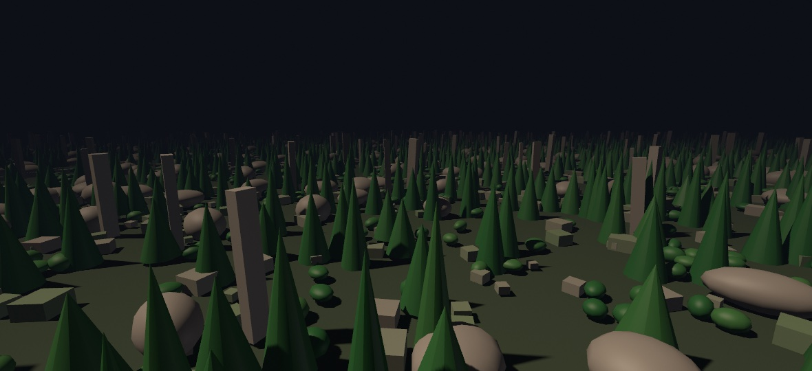

```swift
let field = MeshField()

override func setup() {
    field.place(stone, at: stoneSpots)     // [MeshInstance], as before
    field.place(pine, at: pineSpots)       // any number of meshes
    field.place(boulder, at: boulderSpots)
}

override func draw() {
    camera(Camera3D(eye: eye, target: ahead, far: 110))
    drawMeshField(field)                   // one call for the whole world
}
```

The picture above holds 240,000 solids. Each frame, a small compute pass tests every copy's bounding sphere against the camera and writes the draws itself; the CPU issues one draw per *kind* of mesh and never meets a copy again. Point the camera at the ground and the rest of the plain simply is not drawn. The part worth trusting: culling can never change the picture, because everything it skips was outside the view to begin with. The [`MeshField`](../Examples/Rendering/MeshField/Sketch.swift) example wires the culling to a knob so you can watch the frame rate move while the picture holds still, and the test suite pins exactly that.

A field bakes its colors when you place it (each copy's own tint on top), shades through whatever `material(_:)` is current, and still drops real shadows, including from copies *behind* you, which is the sort of detail you only notice when it is wrong. The shadow pass culls too, against the light's own view instead of yours. On an M2, this world costs 18.5 ms of GPU per frame with culling on and 50.8 ms with it off, a 2.7x win, and the one `drawMeshField` call costs the CPU nothing worth printing. The [instancing reference](../Docs/3D/Instancing.md) has the field's fine print.

## Grass that was never built

One kind of geometry defeats every trick so far. A meadow needs half a million blades, and each blade needs its own curve: its own height, its own lean, its own bend along its length, its own sway in the wind. Instancing cannot do that. An instanced draw moves rigid copies of one fixed shape, and a blade's whole character is that it is *not* rigid. The answer is to stop storing geometry at all. A **`StrandField`** grows every blade inside the draw call itself. **The geometry is born inside the draw and gone when it ends.**

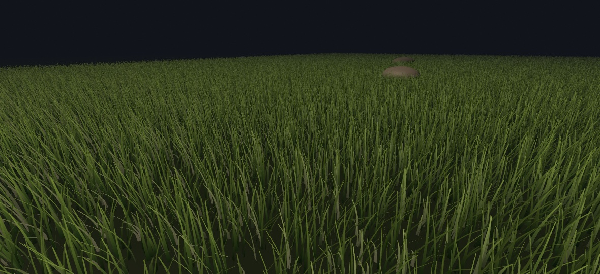

```swift
var meadow = StrandField(width: 90, depth: 90, count: 500_000)

override func draw() {
    camera(...)
    directionalLight(...)
    castShadows()
    drawStrands(meadow)        // half a million blades, zero buffers
}
```

There is no vertex buffer and no instance list behind that call, and `setup()` built nothing. A GPU stage looks at each tile of the patch, skips the ones the camera cannot see, and decides how much detail the rest deserve; a second stage synthesizes the visible ribbons from hashes of each blade's index, four segments near the camera and one far away. Where a blade roots, how it bends, how it sways on the sketch clock: all of it is arithmetic that happens during the draw and is never written down anywhere.

And the blades are not a special effect painted over the scene. They shade on the same lit path as every solid, so the boulders' cast shadows fall across the grass, the fog takes the far rows, and your `material(_:)` finish applies. The meadow above draws in about 22.5 ms on an M2, from zero bytes of geometry and zero per-frame CPU. The [`Grassland`](../Examples/Rendering/Grassland/Sketch.swift) example is that meadow with a knob on the distance grading; the [strand reference](../Docs/3D/Strands.md) has the blade knobs and the fine print (blades receive shadows but cast none; nothing exists for an exporter to record).

## Things with weight

[Chapter 11](11-ForcesAndPhysics.md) dropped flat shapes into a physics world and let gravity do the animating. The same world exists in 3D, and it fits the scene you've been building all chapter. Crates stack, balls roll, and chains swing, with real contact response, under the same lights and shadows as everything else. It comes with `import OllinPhysics`, like its 2D sibling, and it keeps the shape you already know. Build a `World3D` once, add bodies, and step it every frame.

```swift
let world = World3D()

override func setup() {
    world.ground = 0                     // a static floor at y = 0
    for level in 0 ..< 6 {
        world.addBody(.box(width: 1, height: 1, depth: 1),
                      at: Vector3(0, 0.6 + Double(level) * 1.04, 0))
    }
}

override func draw() {
    background(.black)
    cameraShowcase()
    world.step(dt: deltaTime)
    for body in world.bodies {
        withBody(body) { drawBox(width: 1, height: 1, depth: 1) }
    }
}
```

The one new move is `withBody`. In [Chapter 11](11-ForcesAndPhysics.md) you drew a body by translating to its `position` and rotating by its `angle`. A 3D body's orientation is a full spatial rotation, not one number, so `withBody(body) { }` moves the whole transform stack to the body's pose and lets the block draw in body-local space. Whatever you draw there rides the body, whether that's a box matched to the collider, a loaded mesh, or a whole small assembly. It stays ordinary drawing, so materials, shadows, and export all apply untouched.


The figure is the whole idea in one frame. A crate pyramid is built in `setup()`, each crate one `addBody` with a `.box` collider. A dense steel ball is thrown at it with an opening `velocity`, and this is frame 92 of the collapse. Nothing in it is animated by hand, and nothing in it is random either. The solver is deterministic, so this exact wreck replays every run.

Colliders come from a small catalog: `.box`, `.sphere`, `.capsule`, `.cylinder`, their tapered cousins (`.cone`, `.taperedCylinder`, `.taperedCapsule`), a convex `.hull` of your own points, and a static `.mesh` for scenery a body can't be. `connect` links bodies with joints, the 2D kinds plus `.ball`, the free-swiveling socket a hanging chain is made of. And the cursor reaches through the camera. `grabBody(at:in:)` ray-picks the body under the mouse, and `dragGrab(_:to:)` slides it across the view at the depth it was picked. That's how you rummage through a pile in a running sketch.

A body doesn't have to be one shape, either. `.compound` fuses several colliders into a single rigid body, each part posed in the body's local space. The mass, balance, and spin all come from the whole assembly:

```swift
var parts: [Collider3D.Part] = [
    .part(.cylinder(height: 0.2, radius: 0.32),
          rotated: .pi / 2, axis: .unitX, density: 2),   // the metal hub
]
for arm in 0 ..< 4 {
    let angle = Double(arm) * .pi / 2
    parts.append(.part(.box(width: 1.5, height: 0.26, depth: 0.08),
                       at: Vector3(cos(angle), sin(angle), 0) * 1.11,
                       rotated: angle, axis: .unitZ))    // a blade
}
let cross = world.addBody(.compound(parts), at: hubCenter)
```

That's a windmill's blade cross, five shapes in one body. A part's own `density` weighs it against the rest, which is how a hammer gets a head that leads its swing. `withBody` still draws the whole thing, so translate to each part's pose inside the block and draw its shape.

Hinges and sliders can also be *powered*. Give one `limits` when you connect it, measured from the pose it was built in, so 0 means "as built". The returned joint carries a small motor. `drive(at: 2.5)` turns it at a steady rate, `drive(to: 0)` is a spring servo that seeks a pose and holds it, `stopMotor()` cuts the power, and `friction` is the drag that winds a freewheeling hinge down. The servo's `strength` is a torque cap, and a weak one is a *character* knob rather than a compromise. It's what makes a door closer something a thrown ball can still barge through.


One motored hinge does all the animating here. The compound blade cross from above rides a `.revolute` driven at a constant rate. The balls it bats away shove through swing gates on either side, each a limited hinge with springy stops (`softenLimits`), held shut by a `drive(to: 0)` closer too weak to argue with a rolling ball. The interactive version is the [`3D/Physics/Windmill`](../Examples/3D/Physics/Windmill/) example, where the space bar cuts the motor and you can watch hinge friction coast the mill to a stop.

And the landscape you grew a few pages back can hold all of this up. `.heightfield` takes a `Heightfield` directly, sized exactly like its `mesh(width:depth:height:)`, so the collider and the drawn mesh trace one surface:

```swift
world.addBody(.heightfield(land, width: 14, depth: 14, height: 4.2),
              at: .zero, kind: .static)
```

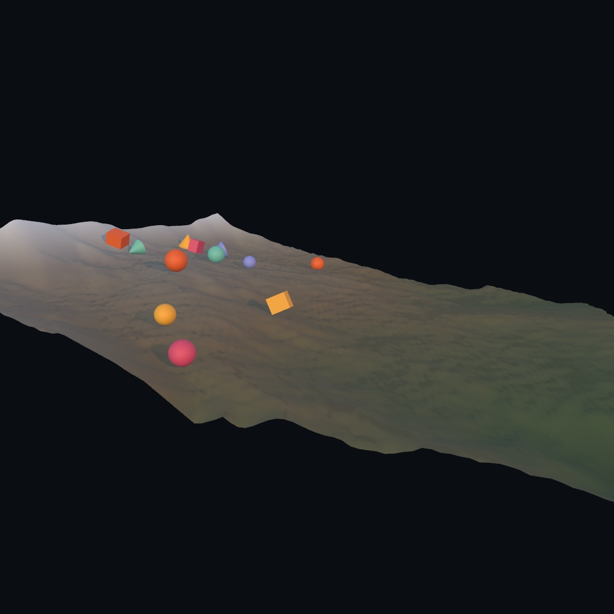

The rocks are spheres, boxes, and cones dropped along the ridge, and the ravines the rain carved are the same ravines that funnel them down. For scenery that arrives as a file instead of a field, `world.addStaticColliders(from: scene)` walks a loaded `Scene`. It turns every mesh into a static collider at its authored place, so a ball can roll through the hall you imported. The interactive slide, with its perpetual rock feed and a dice knob that regrows the mountain, is the [`3D/Physics/Rockslide`](../Examples/3D/Physics/Rockslide/) example.

## Asking what hit what

So far the world has been something to watch. To make it something to *play*, you need to know when things happen. A ball reached the goal, a crate landed hard, or the plate has something on it. Ollin hands that over the way it hands over the mouse. Every `step` leaves a list on the world, and `draw()` reads it:

```swift
world.step(dt: deltaTime)
for contact in world.contacts where contact.phase == .began {
    knocks.append(Knock(at: contact.point, strength: contact.speed))
}
```

No callbacks, and nothing that fires at an awkward moment. It's just a list that belongs to the step that filled it. Each `Contact3D` says which two bodies met, as `a` and `b`, with `contact.other(than: ball)` to save you the guessing. It also says where, which way the surfaces faced, and `speed`, how fast they were closing when they met. That last one is the useful one. It's measured before the solver answers the collision, so it's the size of the *impact*. One number can then set the volume of a clink, the size of a spark, or the brightness of a flash. Touches are per pair of bodies, so a crate landing on a mesh floor is one arrival, not one per triangle it happens to rest on.

The other half is a body that isn't solid at all. Pass `isSensor: true` and you get a region. Things fall through it untouched, and it tells you who's inside.

```swift
let goal = world.addBody(.cylinder(height: 0.5, radius: 1),
                         at: hoopCenter, isSensor: true)

score += goal.entered.count           // crossed during this step
let crossing = !goal.touching.isEmpty // one is in there right now
```


The hoop in the figure is two bodies in the same place, which is the trick worth stealing. There's a solid rim of beads a ball can clatter off, and a sensor disc filling the hole. Only a ball that gets *through* enters the sensor, so `goal.entered` is a scoreboard, and the ring lights while one is crossing. The tray below is a sensor too, and its color is `touching.count`.

That tray is also why sensors are built the way they are. A ball that settles in it stops moving, and the solver, sensibly, puts anything that has stopped moving to sleep to save the work. A sleeping body reports no contacts, so a still stack reads as touching nothing. A sensor never sleeps, so it goes on counting what's parked in it long after the balls have dozed off. Events are for the moment something happens, and a sensor is for the standing question of what's in here. The playable version, where you can drag a ball and post it through the hoop by hand, is the [`3D/Physics/Trigger`](../Examples/3D/Physics/Trigger/) example.

You don't animate a pile; you drop one.

## Asking what is there

Contacts tell you what the solver noticed while it was stepping. Often you want something it was never asked. Can the lamp see a crate? How far is the floor below a point in mid-air? What is standing inside a circle you just made up? It knows all of that, because working out what is where is what a collision solver does all day. You just have to ask, and you ask between steps.

Three questions, three calls. **A ray** is a line with a start and an end, and it comes back holding the first thing in the way.

```swift
if let hit = world.raycast(from: lamp, to: crate.position) {
    lit = hit.body === crate        // nothing got in first
}
```

That second line is the whole of line of sight. The crate is visible when the crate *is* what the ray found. Put a pillar between them and the ray comes back holding the pillar instead.

A `Hit3D` says which body it found and where it touched, the `point`. It says which way the surface faces there, the `normal`, which is what a bounce or a scorch mark is built from. And it says how far along the query the touch was, the `distance`. Aim the same call downward and that last one is the height of the drop:

```swift
let drop = world.raycast(from: p, to: p - Vector3(0, 20, 0))?.distance
```

**A sweep** is a ray with a body. It slides a whole shape along the line and reports what the shape runs into.

```swift
let below = world.sweep(.sphere(radius: 0.55), from: overhead, to: patrol)
```

A ray asks what is in the way, and a sweep asks whether something fits. That is usually the question you meant. A ray threads a gap a shoulder would never get through, and a ray drops between two crates onto the floor a drone would never have reached. Anything a body can wear works as the probe, turned however you like with `rotated:`. The two exceptions are the colliders that describe scenery rather than a thing, a mesh and a height field.

**An overlap** asks what is inside a region right now.

```swift
for caught in world.bodiesOverlapping(.sphere(radius: 4), at: blast) {
    guard let body = caught as? Body3D else { continue }   // only a solid takes one
    body.applyImpulse((body.position - blast).normalized * 12)
}
```

A blast radius in four lines, and the sphere it asked with never existed. You could build a sensor body there and read `touching` instead, and for a *standing* question, the pressure plate from the last section, you should. But a sensor has to exist before the moment, sit somewhere, and be cleared away after. An overlap is a question asked once, anywhere, with a shape invented on the spot. `bodiesContaining(point)` is the same question with no shape at all.


All three are in that yard. The beams are one ray per crate, so the two crates behind the pillars stay dark. The drone is holding its height with a sweep straight down, and the disc under it is where the sweep stopped. The ring is the sphere an overlap just asked with, drawn at its own radius as it fades. A pulse does not spread, and everything inside it was caught at once.

Three habits worth having early. Queries see solid bodies, so a sensor is invisible to them unless you pass `includingSensors: true`. So is a soft body, which has no single pose to hand back. `ignoring:` is how something casts from inside itself, which you will want the first time a robot's own chassis blocks its view. And none of this steps the world, so you can ask fourteen times a frame, once per crate, and find everything exactly where you left it.

The [`3D/Physics/Sightlines`](../Examples/3D/Physics/Sightlines/) example is the playable version, where you can drag a crate into cover and watch its beam go out.

A query is a question, not a move.

## Someone to be in there

Everything so far you watch. A **character** is something you *are*. It's a figure that walks where you steer it, climbs what it can climb, and stops at what it can't.

You might reach for a body with a capsule collider and start pushing it around with forces. Don't. A body is at the mercy of the simulation, which is the whole point of a body and exactly wrong here. Shove it and it tips over. Land it awkwardly and it rolls away, and you spend the evening fighting torques to keep a person upright. A character is a different thing on purpose. It has a shape and it collides, but nothing tumbles it and nothing knocks it down. You hand it a direction and it goes.

```swift
walker = world.addCharacter(radius: 0.3, height: 1.8, at: Vector3(0, 2, 0))
```

Steering it is a `draw()` poll, like the mouse:

```swift
var east = 0.0, south = 0.0
if isKeyDown(.leftArrow)  { east -= 1 }
if isKeyDown(.rightArrow) { east += 1 }
if isKeyDown(.upArrow)    { south -= 1 }
if isKeyDown(.downArrow)  { south += 1 }

let heading = Vector3(east, 0, south)
walker.move(heading.length > 0 ? heading.normalized * 3 : .zero)
if isKeyDown(" ") { walker.jump() }

world.step(dt: deltaTime)
withCharacter(walker) { drawCapsule(radius: 0.3, height: 1.2) }
```

That's a walkable scene, eight lines and a `step`. The same `world.step` moves the character along with the crates, so there's no second update to forget. `move` sets the speed it's *trying* to walk at and keeps it until you say otherwise. Falling and jumping stay the world's business, which is why you only give it a horizontal direction. `jump` is granted only if it's on the ground when the step comes round, so holding the key hops rather than flies.


`withCharacter` is `withBody`'s twin, and it puts the origin at the character's **feet**. That's the detail that makes drawing one pleasant. Model your figure standing on the floor at the origin, and it stands on the floor in the world.

Three numbers decide what the scenery does to it, and each is worth meeting by breaking it:

```swift
walker.stepHeight = 0.4        // the tallest step it walks up: a kerb, a stair
walker.maxSlope = 50 * .pi / 180  // the steepest hill it can climb
walker.pushStrength = 100      // how hard it can shove a crate, in newtons
```

Set `stepHeight` to zero and the stairs in the figure become a wall it stands against forever. Wind `maxSlope` down and a hill it strolled up last run holds it halfway. Set `pushStrength` to zero and those two crates stop being scenery it walks through and start being furniture it walks around. None of that is scripted anywhere; it's the same walk meeting different limits.

Two velocities are worth telling apart. `walker.velocity` is what it's *trying* to do, and `walker.actualVelocity` is what the world let it do. Walk into a wall and the first still reads a brisk pace while the second reads nothing. Drive a walk cycle from the second and the legs stop when the figure stops. That's the difference between a character and a puppet skating on the spot:

```swift
let pace = Vector2(walker.actualVelocity.x, walker.actualVelocity.z).length
stride += pace * deltaTime * 3.4
```

One last thing, and it's the one that connects this section to the last. A character is swept through the world by hand rather than simulated, so strictly it isn't in the scene. It carries a stand-in that is: `walker.body`, an ordinary kinematic body riding inside the capsule. That's what lets everything else notice it, sensors included:

```swift
if lookout.isTouching(walker.body) { /* you're on the platform */ }
```

So the trigger you built for balls works for people, unchanged. The playable version, an eroded island with stairs up to a lookout that lights as you arrive, is the [`3D/Physics/Stroll`](../Examples/3D/Physics/Stroll/) example.

## Something to drive

A character walks. A **vehicle** is the other thing you operate: a body carried on sprung wheels, with an engine behind the pedal. Same idea as the character, one step further out. You don't push it and you don't steer it by force. You press things.

```swift
car = world.addVehicle(.box(width: 1.8, height: 0.7, depth: 4),
                       at: Vector3(0, 2, 0),
                       wheels: [
                           .wheel(at: Vector3( 0.9, -0.15,  1.3), steers: true),
                           .wheel(at: Vector3(-0.9, -0.15,  1.3), steers: true),
                           .wheel(at: Vector3( 0.9, -0.15, -1.3), driven: true, handBrake: true),
                           .wheel(at: Vector3(-0.9, -0.15, -1.3), driven: true, handBrake: true),
                       ])
```

Read that list once and you have the whole machine. Four wheels, bolted where you say, in the chassis's own coordinates. The front two turn. The back two are the ones the engine reaches, and the ones the hand brake grabs. Nothing else about a car needs saying, and the two flags you did say are the ones that decide how it feels.

Driving it is the same shape as walking:

```swift
car.throttle = isKeyDown(.upArrow) ? 1 : (isKeyDown(.downArrow) ? -1 : 0)
car.steering = (isKeyDown(.rightArrow) ? 1 : 0) - (isKeyDown(.leftArrow) ? 1 : 0)
car.handBrake = isKeyDown(" ") ? 1 : 0

world.step(dt: deltaTime)

withBody(car.body) { drawBox(width: 1.8, height: 0.7, depth: 4) }
for wheel in car.wheels {
    withWheel(wheel) { drawCylinder(radius: wheel.radius, height: wheel.width) }
}
```

`withWheel` is `withBody` for a wheel, and it knows where the suspension put it, how far it has rolled, and which way it is pointing. Draw a cylinder in that block and you get a tire, turned and spinning, without ever computing any of it.

Press the throttle and hold a full lock, and the thing you were about to type by hand happens on its own. The car leans, the inside front wheel goes light, the back tires start sliding, and it comes round. Pull the hand brake in the middle of it and only the back wheels lock, because they are the ones you gave a hand brake to. That's the figure below, one frame out of a scripted lap.

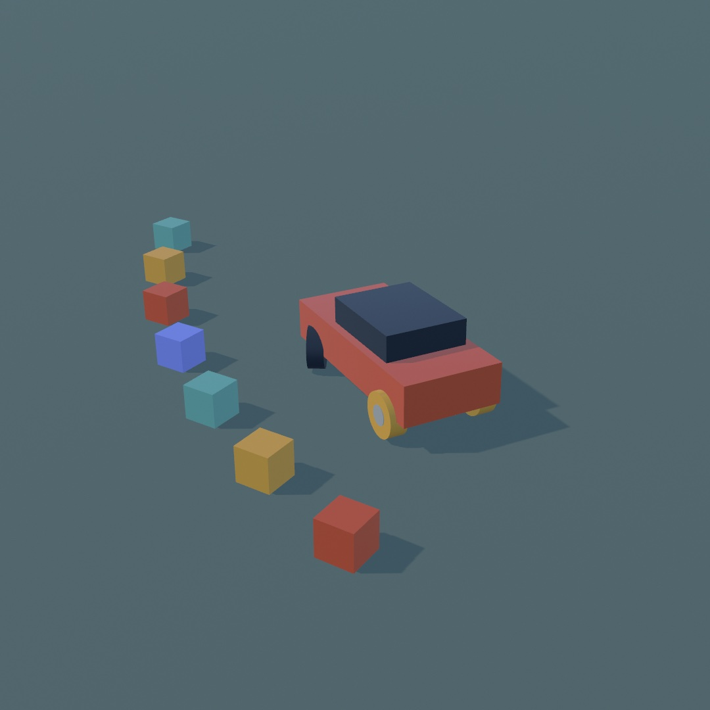

The glowing tire is one line. `wheel.slip` is how much that tire is sliding rather than rolling, and coloring by it turns a number into something you can feel.

```swift
fill(Color.mix(Color(hex: 0x232B36), Color(hex: 0xF2A93B),
               t: min(1, wheel.slip)))
```

The car drives along its chassis's **+z**, so model whatever you draw facing that way. Two settings are worth breaking things with. `suspensionFrequency` on each wheel is the spring, in hertz, where around 1.5 is a road car and at 3 you feel every stone. `topSpeed` is the gearing rather than a promise, the speed the machine tops out at on a flat straight. Wind it down and the car pulls harder off the line and runs out of legs sooner. Both can be changed while you drive, so put them on `@Param` sliders and feel the same corner three ways.

Two wheels work too. `balances: true` adds the controller that holds a motorcycle up and leans it into turns. The one thing it needs that a car doesn't is a raked front fork, `casterAngle` around 30°. Without the rake it flops over at the first correction. That is also true of real bicycles, and it is the nicest small piece of physics in this chapter.

The driveable version, a car over the same kind of eroded island the walker got, is the [`3D/Physics/Joyride`](../Examples/3D/Physics/Joyride/) example.

## Turning without steering

There is a third machine, and it is the same call again with `tracked: true`. The wheels stop being wheels and become road wheels, split into a left and a right band by which side of the hull you put them on. There is no list to keep in order and no pairs to declare. A wheel at positive x is on the left track, and that is the whole of it.

```swift
var wheels: [Wheel3D] = []
for side in [1.3, -1.3] {
    for i in 0 ..< 5 {
        wheels.append(.wheel(at: Vector3(side, -0.28, -1.8 + Double(i) * 0.9),
                             radius: 0.44, width: 0.6))
    }
}
let crawler = world.addVehicle(.box(width: 2, height: 0.9, depth: 5.2),
                               at: Vector3(0, 1.2, 0), wheels: wheels,
                               mass: 4200, topSpeed: 9, tracked: true)!
```

Throttle and brake mean exactly what they did. Steering is the interesting one, because a track has nothing to turn. Instead the number runs the inside band slower: at half lock it stops, and the machine turns about its own stopped track. At full lock it runs *backwards*, one band forward and one back, and the machine spins where it stands.

**A tracked machine steers with its drivetrain, so it needs throttle to turn at all.** Idle the engine and there is nothing to run one band against the other. That is true of the real thing too, and it is the first thing to try:

```swift
crawler.throttle = 1
crawler.steering = 1        // turn on the spot
```

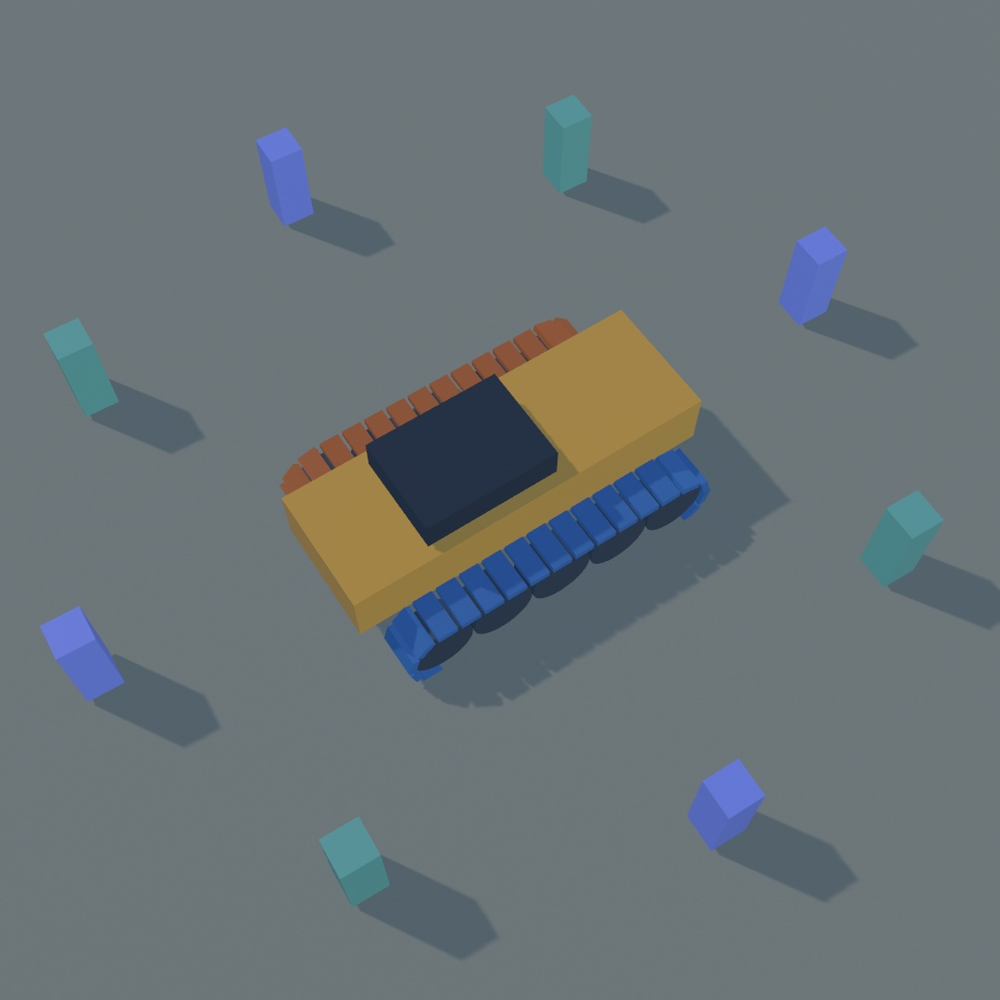

The posts are there to say it stayed put. It drove up to the middle, then held the throttle with the stick over, and it is turning between them rather than driving past them. The colors are the two bands. `trackSpeed(.left)` and `trackSpeed(.right)` read how fast each one is running over the ground. Painting one warm when that number is positive and cool when it is negative makes a still picture of a turn readable.

```swift
for side in [Vehicle3D.TrackSide.left, .right] {
    fill(crawler.trackSpeed(side) < 0 ? Color(hex: 0x3F6FA8) : Color(hex: 0xC4622A))
    // …draw that band's links…
}
```

Those two numbers are also what you scroll a drawn track by. `wheels(on:)` hands you one band's road wheels, front first, to lay it around.

Most of what a wheel knows carries over. The suspension is the same suspension. Two things change meaning, and both are worth knowing. `driven` marks the **sprocket** its band is turned at rather than one of a driven pair, and with none marked each band takes its rearmost wheel. And `grip` scales a flat pair of numbers rather than a tire's slip curve, which is the real difference between a track and a wheel. A tire loses grip once it starts spinning, and a band does not. That is why a crawler walks up a bank a car would sit at the bottom of turning its wheels.

The machine on tracks working a quarry is the [`3D/Physics/Crawler`](../Examples/3D/Physics/Crawler/) example.

## Letting a figure fall

Back in "A mesh from a file" a skinned figure moved because a keyframe track told every joint where to be. That's animation, the same pose every time, whatever else is happening. A **ragdoll** is the other answer. Hand `addRagdoll` the same loaded scene and it reads the skeleton. It builds a rigid body for every joint, and hangs each one off its parent on a cone-limited ball joint. Then the world decides where the limbs go.

```swift
figure = loadScene("figure.gltf")!
ragdoll = world.addRagdoll(from: figure, at: Vector3(0, 3, 0))
```

Each limb's shape is fitted to the figure's own mesh rather than guessed from bone lengths. The vertices a joint pulls hardest on get gathered up, and a capsule is laid along the way they spread. That's why a torso comes out thick and a forearm thin, from two bones of similar length. You never say how wide anything is.

Then the loop, which is one line longer than an animation's:

```swift
world.step(dt: deltaTime)
figure.apply(ragdoll)     // the pose the solver just found
drawScene(figure)
```

`figure.apply(ragdoll)` is `apply(_:at:)` run backwards. Instead of a keyframe track posing the joints, the simulated bodies do. Everything downstream carries on as if a track had, including the skin, the materials, and the shadows. Drop the figure and it falls like something with weight in it, because it is.

That figure will lie where it lands forever, which is the thing people mean by "ragdoll" and also its limit. `drive(toward:)` is the other half:

```swift
target.apply(walk, at: time)             // where the animation wants the limbs
ragdoll.drive(toward: target, strength: effort)
world.step(dt: deltaTime)
figure.apply(ragdoll)                    // where they actually ended up
```

Every joint grows a motor pulling toward the pose the target scene is holding. Now the animation is a *request*, and the world gets a vote. Push the figure and it resists, gives, and comes back. The figure below is one drop, run twice, changing exactly one thing.

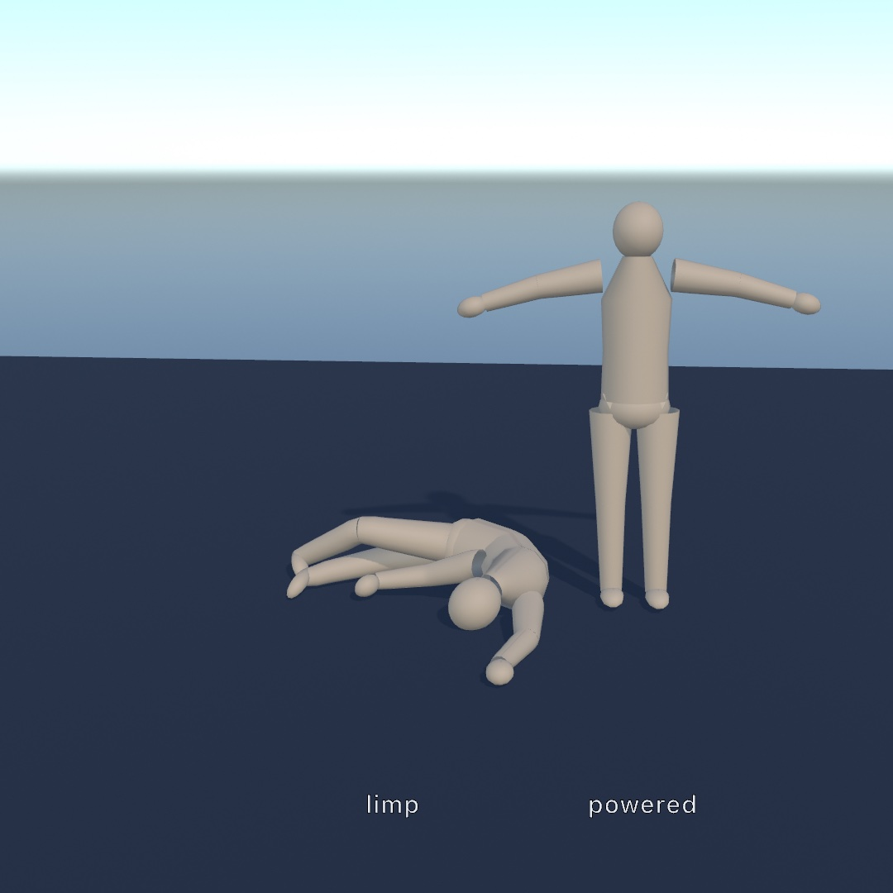

Keep two copies of the scene. The animation poses one, the target, and the solver poses the other, the drawn one. A `Scene` is a value type, so that's one assignment. It matters, because a figure driven toward the scene it was just posed from has nowhere left to pull.

`strength` is the knob to play with. It's the most torque a joint may use, in newton-metres. High, and the figure will not be moved. Low, and the heavy limbs sag out of the pose, which is how a figure reads as tired rather than switched off. Sweep it and you get a whole range of characters out of one number.

Nothing drives the root, so a powered figure still falls over as a whole. The motors hold its shape, not its place. Pin the hips (`ragdoll.limbs[0].body.kind = .kinematic`) and it stands there like a puppet on a hook, which is what the [`3D/Physics/Ragdoll`](../Examples/3D/Physics/Ragdoll/) example does. Press space there and the hips let go.

Two more things worth knowing. Every limb is an ordinary body, so you can grab one with the mouse and drag the figure around by an arm. And each figure gets its own collision group. A thigh never fights the pelvis it sits inside, while two figures still knock into each other properly.

## Cloth that finds its own shape

Everything in this chapter so far moves as one solid piece. A crate can be anywhere, but it is always crate-shaped. A **soft body** is the other kind of thing. Its mesh's vertices *are* the simulation, held to each other by springs, so it arrives at a shape rather than carrying one around.

You build one from any mesh you already know how to draw.

```swift
cloth = world.addSoftBody(from: .plane(width: 3, depth: 3, segments: 24),
                          at: Vector3(0, 3, 0))
```

Then the loop, which has one new call in it:

```swift
world.step(dt: deltaTime)
fill(.beige)
drawSoftBody(cloth)
```

`drawSoftBody` draws the mesh the simulation just arrived at. It is the same mesh you handed over, with new positions and new normals. Its uvs, its colors, and its material all carry through, and shadows and reflections treat it like any other mesh. Drop that sheet on a sphere and it drapes over it. A hundred particles each found somewhere to be, and the springs between them argued about it.

Two knobs decide what fabric it is, and they are separate for a good reason.

```swift
stiffness: 1     // how hard it resists being stretched
bend: 0          // how hard it resists being folded
```

A bedsheet barely stretches at all and folds freely, which is exactly `stiffness: 1, bend: 0` (the defaults). Card is stiff in both. A rubber sheet is the odd one, low stiffness and low bend. Reach for `bend` when a cloth is crumpling more than it should, and for `stiffness` when it is sagging like a net.

Nothing holds a sheet up unless you say so, and the way you say so is `pinned:`. It gets handed every vertex of the mesh, in the mesh's own coordinates, and answers yes or no:

```swift
pinned: { $0.z < -1.4 }      // hold the far edge, let the rest hang
```

That closure is the whole hanging story. Two corners make a flag, one edge makes a curtain, and a patch in the middle makes a handkerchief held up by its middle. You can change your mind later too, with `pin`, `unpin`, and `move(_:to:)`, which drags a particle to a point and lets the rest of the cloth follow.

A **closed** mesh can do something a sheet cannot. It holds air.

```swift
ball = world.addSoftBody(from: .icosphere(radius: 0.5, subdivisions: 3),
                         at: Vector3(0, 2, 0), pressure: 3)
```

`pressure` is in gravities. At `1` the air inside pushes out just hard enough to hold the ball's own weight up, and `2` to `4` reads as a firm ball that still dents when it lands. Zero is an empty bag. It is a live number, so a ball can deflate under your hand mid-frame. On a sheet it does nothing, since a sheet has no inside, and Ollin will say so once rather than quietly inventing a shape.


One last move, because a soft body has no single pose for a force to push on. Impulses do nothing to one. `applyForce` does, spread over all its particles, and it is how you make wind.

```swift
banner.applyForce(Vector3(0, 0, gust))
```

The [`3D/Physics/Drape`](../Examples/3D/Physics/Drape/) example puts all of it in one scene. There's a banner pegged to a washing line, a sheet thrown over a crate, and a ball you can let the air out of, all three draggable. One thing is worth knowing before you build on this. Soft bodies collide with the rigid world but not with each other or themselves, so a sheet folded double will pass through its own layers.

## A cape on someone's back

`pinned:` holds a corner of cloth *still*. A cape needs the other thing, held to something that is moving and left to hang off it. Your figure from a page ago already has the moving thing in it, a skeleton. So you can name which joint of it carries which part of the cloth.

```swift
cape = world.addSoftBody(from: sheet, at: Vector3(0, 0.85, -0.13),
                         rotation: .pi / 2, axis: Vector3(1, 0, 0),
                         pinned: { $0.z < -0.55 },      // clasped at the neck
                         skinnedTo: figure,
                         carriedBy: { _ in "chest" })
```

Then one call a frame, after the figure is posed and before the world steps:

```swift
figure.apply(ragdoll)
cape.follow(figure)
world.step(dt: deltaTime)
```

Nothing was painted in a modelling tool to make that work. **The pose the figure is standing in when you build the cloth is the bind pose.** So you hang the cape where it belongs and name the joints, and everything the figure does from then on is read as the motion since. `carriedBy:` is handed a vertex in the mesh's own coordinates, the same ones `pinned:` gets. It answers with a joint's name, or `nil` for a part that is just cloth.

Notice that `pinned:` is doing something new here without changing its meaning. **A pinned vertex is held by whatever holds it.** A joint carries it, so it is held to the figure. If no joint does, it is held to the world, exactly as your banner's top edge was.


Both figures there are walking the same path. The only difference between them is that one cape names a joint and the other does not.

Three numbers shape what the loose part may do, and all three are plain distances in world units:

```swift
sway: { 0.05 },        // how far from the skin it may get
backStop: 0.04,        // how far into the figure's back it may be pushed
maxStretch: 1.02       // how far it may reach from what holds it
```

`sway` is a leash. At `0` it welds that part to the skin, the default of `.infinity` lets it swing freely, and `0.05` really does mean five centimetres. `backStop` keeps the cape out of the back it hangs on without waiting for a collision to sort it out. `maxStretch` is the one worth remembering even for cloth no figure carries. A heavy sheet hung from one edge stretches under its own weight however stiff you make it, and `1`, its own rest length and no more, fixes that for almost nothing.

Two knobs work while it runs: `cape.swayScale` multiplies every leash at once, and `cape.followsSkin = false` drops the leashes entirely, leaving only the clasp. The [`3D/Physics/Cape`](../Examples/3D/Physics/Cape/) example has both on keys, and a figure you can knock over so the cape comes down with it.

## A line that knows how it is turned

Cloth is a surface. Plenty of what you want to hang in a scene is not one. A rope, a cable, a chain, a vine, or the stem of a plant are all curves, and you build one from a list of points.

```swift
let rope = world.addRope(through: (0 ..< 40).map { Vector3(0, -Double($0) * 0.1, 0) },
                         at: Vector3(0, 3, 0),
                         thickness: 0.04,
                         pinned: { $0.y > -0.001 })      // hung from the top
```

Anything that makes points makes a rope, so that list could as easily be a `Contour`, a sampled `Path`, a `randomWalk`, or a ridge you read off a `Heightfield`. The points become the particles one for one, so `pin`, `move(_:to:)`, and `positions` all speak in indices into the list you handed over. `drawSoftBody(rope)` sweeps a tube of `thickness` along it. Everything from the last few pages still applies. It lands on things, turns up in `world.contacts`, floats, takes `applyForce` for wind, and can be dragged with `grabSoftBody`.

Two knobs shape it, and both mean the same thing on a twig and on a mooring line:

```swift
stiffness: 1,      // how much it resists being stretched
bend: 0            // how much it resists being bent
```

`bend` is the one that decides what the rope *is*. At `0` it is limp rope. Around `0.5` a length sticking out sideways droops about a third of its own length, which reads as heavy cable. Near `1` it holds itself out like a stem.


The three on the left were built as the same straight line sticking out from their posts, and differ in that one number.

The fourth is where a rope stops being a line of points. **Every segment carries an orientation of its own**, which you read with `rope.segments`. `withSegment(_:)` stands the transform stack in the middle of one with +y running along the rope, the same way `withBody(_:)` stands it on a body. A cylinder or a capsule drawn inside the block already lies the right way:

```swift
for segment in chain.segments {
    withSegment(segment) {
        rotate(.pi / 2, axis: Vector3(1, 0, 0))       // lay the ring across the rope
        if segment.index.isMultiple(of: 2) {
            rotate(.pi / 2, axis: Vector3(0, 0, 1))   // roll every other link
        }
        drawTorus(radius: segment.length * 0.6, tube: 0.028)
    }
}
```

That second `rotate` is the whole point. Rolling every other link a quarter turn about the rope's own axis is what makes a chain interlock. You can only ask that of something that knows how it is rolled. **Three points in a row tell you which way a line is going and nothing about which way is up.** Leaves along a stem, rings on a flag, beads on a string, and it's the same move each time.

Two things worth knowing before you build something long. `maxStretch: 1` caps how far a rope may reach from what holds it, which stops a heavy one creeping longer under load. And stiffness travels one segment per solver pass, so a long rope divided finely needs more passes than the default five before a high `bend` really holds. Forty points over six units wants about twenty.

A rope does not collide with itself, so a coil passes through its own turns. It also has no surface for a ray to hit, so `raycast` and the other queries look straight through one, though the mouse still finds it. And it is a single strand, so a plant with three stems is three ropes. The [`3D/Physics/Rigging`](../Examples/3D/Physics/Rigging/) example has a rope, a chain, and a leafy vine hanging in the same wind.

## Water, and what it holds up

A world can have water the same way it has ground. One property, and nothing has to opt in.

```swift
world.water = Water(level: 0)
```

Everything already in the world starts floating. You do not mark a crate as floatable, and you do not pick how high it rides. You have already said it, in the `density` you built it with.

```swift
world.addBody(.box(width: 1, height: 1, depth: 1), at: Vector3(0, 4, 0),
              density: 0.3)   // cork
world.addBody(.box(width: 1, height: 1, depth: 1), at: Vector3(2, 4, 0),
              density: 3)     // stone
```

The cork bobs, the stone goes to the bottom, and the interesting part is what happens in between. A body of density `0.5` settles with exactly half of itself under the surface. One at `0.8` rides low with a fifth of it dry. **The waterline is not a setting, it is an answer.** A body sinks until the water it has pushed out of the way weighs the same as it does, which is the whole of buoyancy in one sentence.

Here are four identical crates that differ in nothing but that number.


`Water` has a `density` of its own, on the same scale, where `1` is water and also the default body material. Push it to `1.3` for brine and every crate in the scene rides higher, without touching any of them.

The knob you will actually reach for first is drag.

```swift
world.water = Water(level: 0, linearDrag: 0.5)   // the default
```

At `0` a crate dropped in oscillates about its waterline and never stops, which looks less like water than like a trampoline. The default dips, comes back, and settles in about a second. `angularDrag` does the same for turning, which is what stops a long shape rocking all afternoon after it lands.

Give the surface a shape and it carries whatever is riding it:

```swift
world.water = Water(level: 0, waves: Water.Waves(amplitude: 0.25,
                                                 wavelength: 8, speed: 1.5))
```

Now you have a problem you would have had to solve yourself, drawing water that matches the water. `waterMesh` hands back the surface the bodies are floating on, as an ordinary mesh. The swell you can see and the swell they ride are then the same one.

```swift
if let surface = world.waterMesh(extent: 40) {
    fill(Color(hex: 0x2C7C96))
    material(.dielectric(roughness: 0.3))
    drawMesh(surface)
}
```

`.dielectric` is the physically based tier's smooth nonmetal, the finish of water and varnish. It reflects more the flatter the view grazes it, and the next chapter opens the family up properly. Keep a little roughness in it. A perfect mirror reflects the lower half of the environment wherever a wave tilts the reflection below the horizon, which lays flat grey patches along the troughs. A sea is not a mirror anyway.

Two things worth knowing before you build on this. `world.water` is an ocean rather than a pool. Everything below `level` is water, out to the horizon, so a harbour is what you get by putting static walls in it. And the water does not reach everything, on purpose. Sensors, static bodies, and a walking character go where you put them rather than where the water would.

The [`3D/Physics/Flotsam`](../Examples/3D/Physics/Flotsam/) example is the whole thing in one scene. Crates from cork to nearly waterlogged ride a swell at their own depths, a stone anchor sits on the bottom, and a current carries the lot past. Drag one under and let go.

## A raft made of cloth

The sheet from two sections ago floats too. It is worth a section of its own because it is where the two halves of this chapter meet. The thing with no pose turns out to be an ordinary member of the world.

Floating it is one number.

```swift
raft.density = 0.3           // rides high; above 1 it sinks
```

That reads exactly like a crate's `density`, and it means the same thing, how heavy this is for its size against the water. A *closed* soft body does not even need telling, because a mass and a volume are all it takes and a beach ball has both. A sheet has no inside, so there is nothing to work it out from. It starts as heavy as water, lying awash in the surface the way a wet sheet does. The line above is what makes it a raft.


Cloth in water behaves like cloth. Its area for its weight is enormous, and drag is what measures that. So a heavy sheet sinks slowly, and a floating one is carried along by a current rather than left standing in it.

The second half is that a cloth turns up in `world.contacts`, the list from "Asking what hit what". A crate landing on the deck reports where it hit and how hard, exactly like a crate landing on the floor.

```swift
for contact in world.contacts where contact.phase == .began {
    splash(at: contact.point, size: contact.speed)
}
```

The one thing to notice is that a contact names `any Colliding3D`, not `Body3D`. That is deliberate, and it is the type telling you the truth. Either side may be a cloth, and a cloth is not something you can push with an impulse or hang a joint from. When you want to act on what you found, say which kind you were after.

```swift
if let crate = contact.other(than: raft) as? Body3D {
    crate.applyImpulse(Vector3(0, 3, 0))
}
```

Everything else about touching works the way it did. `raft.touching` is what is aboard, a sensor sees the raft sail into it, and `raycast` stops at cloth. So a curtain blocks a sightline, and a sounding line drops onto a deck.

One asymmetry is worth keeping in mind, because it is useful rather than annoying. A settled *pile of crates* falls asleep and stops reporting its touches, while a settled cloth keeps its list. The solver stops asking a sleeping soft body who it is against, which is not the same as it having let go.

The [`3D/Physics/Raft`](../Examples/3D/Physics/Raft/) example is the three of them in one scene. A cloth raft rides a swell with cargo on it, a sounding line shortens onto her deck when you sail her under it, and a harbour gate lights when she passes through. Drag the deck to steer.

## Things that pass through each other

So far everything in a world collides with everything else, which is the honest default and is usually what you want. But a lot of scenes need the opposite of a wall somewhere. Sparks drift through the machine that threw them, a ghost walks through the door, confetti does not pile on itself, and a laser is stopped by only some things.

You could reach for that with logic, checking who touched what and undoing it. Ollin gives you the other way round. Put things in a named **group**, then tell the world that two groups never touch.

```swift
let bead = world.addBody(.sphere(radius: 0.2), at: p, group: "beads")
world.ignoreCollisions(between: "beads", and: "grating")
```

That is the whole thing. There's a word where you build something, and one sentence saying what it does not touch. Here are two identical tubes with identical gratings and the same beads poured into each. The only difference is that the right pour is in a group the grating was told to ignore.


Three things about that sentence are worth having straight.

**It reads both ways.** `ignoreCollisions(between: "beads", and: "grating")` is a fact about a pair, not a direction. There is no version of this where the beads ignore the grating and the grating still stops the beads.

**Naming a group is not a rule.** A world where nobody has written an `ignoreCollisions` behaves exactly like a world with no groups at all. So you can tag things as you build them and decide later what any of it means. That also means a typo in a group name does nothing at all rather than something surprising. It is worth remembering when a rule seems to have been ignored. `world.collisionGroups` prints what the world actually heard.

**A group still collides with itself.** Two crates in one group stack normally. If you want confetti that drifts through its own drift, say so:

```swift
world.ignoreCollisions(between: "confetti", and: "confetti")
```

Everything you can add to a world takes a group, the same way it takes a density. That covers bodies, characters, vehicles, ragdolls, soft bodies, and the static scenery you import from a `Scene`. And a rule holds everywhere the pair could have met, which matters more than it sounds. A filtered pair does not collide, does not turn up in `contacts`, and is not seen by a sensor. It is walked through by a character, another character included, and is not felt by a vehicle's wheels. There is no corner of the world where the rule half-applies.

Groups also change what a question sees. Every query from earlier in this chapter takes `as:`, which asks it the way a body of that group would ask it:

```swift
world.ignoreCollisions(between: "bullets", and: "glass")

world.raycast(from: muzzle, to: target)                  // stops at the pane
world.raycast(from: muzzle, to: target, as: "bullets")   // goes right through
```

That is the piece that turns filtering from a physics trick into something you can aim with. Think of a sight line that ignores foliage, a ground probe that ignores the character doing the probing, or a targeting ray that only sees what its own shot would hit.

You can move something between groups while it runs, too. `body.group = "debris"` takes effect on the next step. Things already settled on each other are woken so the world looks at the pair again, which is how a crate that was scenery a moment ago becomes something to fall through.

The [`3D/Physics/Sieve`](../Examples/3D/Physics/Sieve/) example is a sorting machine built out of nothing else. Beads of three colors roll down one ramp with three windows set into it, and each window is told to ignore one color. Press space and the three rules are withdrawn, and the same machine stops sorting.

## Taking a direction away

A rigid body can do six things. It travels along three axes and turns about three. You can take any of them away.

That sounds like a small setting. The first thing it buys is not. A lot of sketches want a flat world, like a pin table, a side-on machine, or a puzzle of tiles that slide. Building one in 2D means giving up lighting, shadows, and solid shapes. Building it in 3D means every collision quietly pushes things toward and away from the camera until the whole thing stops reading as flat. So say the bodies may not go that way.

```swift
let bead = world.addBody(.sphere(radius: 0.2), at: p, freedom: .plane())
```

Below are two identical pin boards. The same beads are poured down each, one at a time, and every bead is given the same careless sideways nudge on the way down. The beads on the left are held to the board's plane. The ones on the right are not.

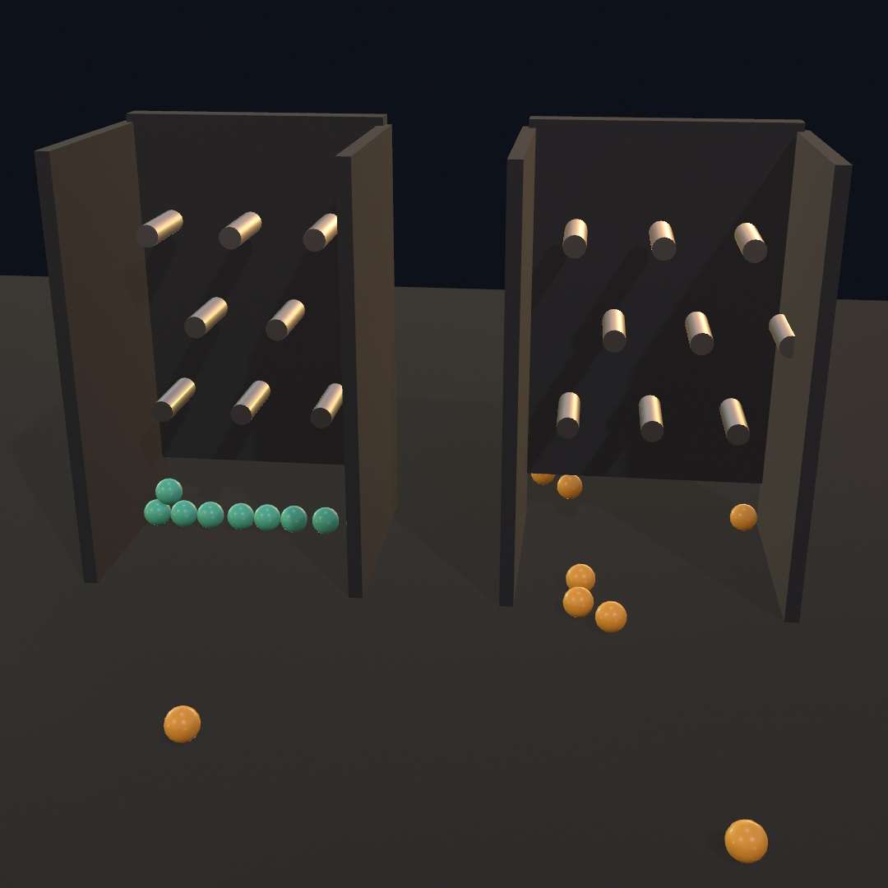

The left beads had nowhere to put that nudge, so they landed in one flat sheet. The right ones took it and left. **A locked direction is not a rule the body tries to obey. It is a direction the body no longer has.** Nothing can move it that way, not gravity, not a contact, not a joint, not even a velocity you set on it yourself.

There are names for the combinations worth wanting, and you can spell out anything else:

```swift
.all                        // the default
.plane()                    // travels in x and y, turns about z: a flat world
.plane(normal: .unitY)      // travels in x and z, turns about y: a top view
.upright                    // travels any way, turns only about up, never tips
.noTurning                  // slides and is shoved, never spins
.noMoving                   // spins where it is, never travels
[.moveX, .turnZ]
```

`.upright` is the other one you'll reach for. It suits a fridge on a dolly, a chess piece, or anything that should slide and turn without ever falling over. The one thing you cannot ask for is a tilted plane. What the solver takes away is whole world axes, so `.plane(normal:)` rounds its normal to the nearest one.

Two smaller knobs live next to it. **`gravityScale`** is how hard the world pulls on one body against the `1` everything else feels, which is a balloon and a feather in the same world:

```swift
balloon.gravityScale = -0.3      // rises
feather.gravityScale = 0.15      // falls a sixth as far in the same second
```

And **`checksPath`** is for things that are small and quick. A body that covers more than its own width between two steps can be in front of a thin wall at one step and past it at the next. It touched nothing on the way. Turn this on and the solver sweeps the body's shape along its whole path instead of only testing where it ended up:

```swift
let pellet = world.addBody(.sphere(radius: 0.05), at: muzzle, checksPath: true)
pellet.velocity = Vector3(0, 0, 120)
```

It is off by default because it is not free, though it is close. The check only runs once a body is actually moving fast for its size, so an ordinary throw lands in exactly the same spot either way. Turn it on for bullets, pellets, and anything you fire, and leave it alone for everything else.

All three can be set when you add a body and changed while it runs. The [`3D/Physics/Bagatelle`](../Examples/3D/Physics/Bagatelle/) example is a pin table with all three on a knob. Flatten the balls or free them, make them heavy or weightless, and fire a shot quick enough to leave through a thin rail the moment you stop checking its path.

## Machines out of joints

A hinge and a slider will get you a door and a drawer. A machine wants more, and the joints left over are each one idea.

**A track.** Hand `.path` a ring of points and the second body is threaded onto the smooth curve through them, free to travel along it and nothing else. A rollercoaster car, a bead on a wire, a camera on a dolly rail:

```swift
let ride = world.connect(rails, cart,
                         .path(through: points, looping: true,
                               alignment: .followsPath))
ride.drive(at: 6)          // world units per second along the track
ride.progress              // 0 at the first point, 1 at the last
```

The curve runs *through* the points rather than between them, so a dozen of them describe a long smooth track. `alignment` decides how much of the body's turning the track takes over. `.free` leaves it tumbling, and `.followsPath` banks it into every bend. A flat `Contour` becomes a track on the ground in one call, so you can draw the route with the curve tools from [Chapter 15](15-ShapesAsMaterial.md) and then ride it.

**A rope over two hooks.** `.pulley` ties two bodies to one length of rope, so one side rising is the other falling. Read it the way you would trace it with a finger:

```swift
world.connect(tray, counterweight,
              .pulley(from: trayTop, over: leftHook,
                      and: rightHook, to: weightTop))
```

Rope behaves like rope. It resists being pulled longer and gives when it is let slack, so both ends can drop together but neither can stretch. `ratio: 2` threads the second side twice, which is a block and tackle. That side moves half as far and lifts twice as much.

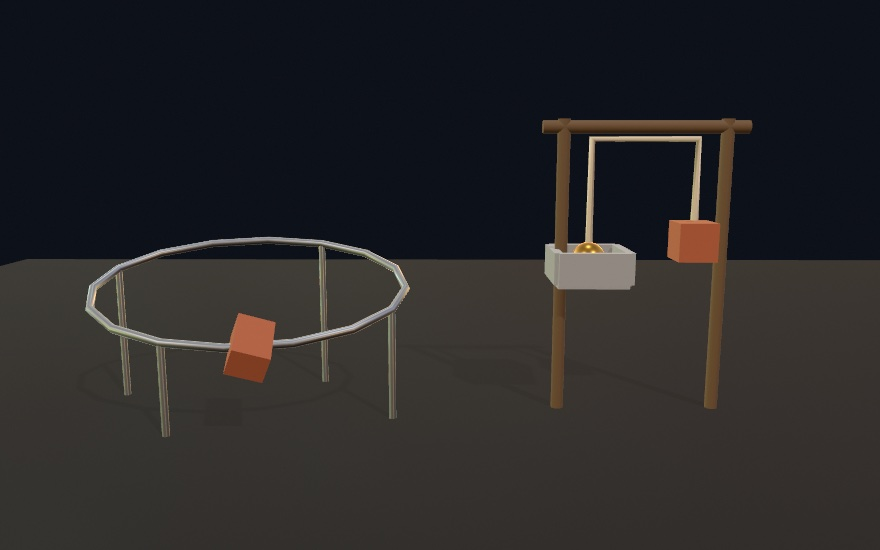

Both machines are the joint doing all the work. The cart is banked because `.followsPath` turned it into the bend, and the tray and counterweight are passing each other because one rope ties their motions together.

**The joint that is just a list of freedoms.** Every kind so far is a choice out of the six things a body can do, the same six the last section took away. When none of the named kinds fits, say which ones you're keeping:

```swift
// A post a platter rides: it may rise and it may spin, and nothing else.
world.connect(post, platter,
              .allowing([.moveY, .turnY], at: top, travel: 0...1.4))
```

`.allowing([])` is a weld. `.allowing([.turnX, .turnY, .turnZ])` is a ball joint. One turn with a range is a hinge. It is worth writing those three out once, because it shows what the whole set is made of.

**And two joints that tie other joints together.** Here is the shift worth slowing down for. **A gear does not connect two wheels. It connects two hinges.** What is tied together is not the bodies but the *motion the joints allow*, so that is what you name:

```swift
let small = world.connect(frame, pinion, .revolute(at: hub, axis: .unitZ))
let big = world.connect(frame, wheel, .revolute(at: farHub, axis: .unitZ))
world.connect(small, big, .gear(teeth: 20, and: 40))
```

Turn either hinge now and the other turns, the opposite way, at the ratio you asked for. Its sibling ties a hinge to a slider, so turning becomes sliding:

```swift
world.connect(big, rack, .rackAndPinion(travelPerTurn: 2 * .pi * pinionRadius))
```

`travelPerTurn` is how far the bar runs for one full turn of the pinion, which for a pinion of radius `r` is its own circumference. Both links compose: the machine below is one motor, two links, and four bodies.

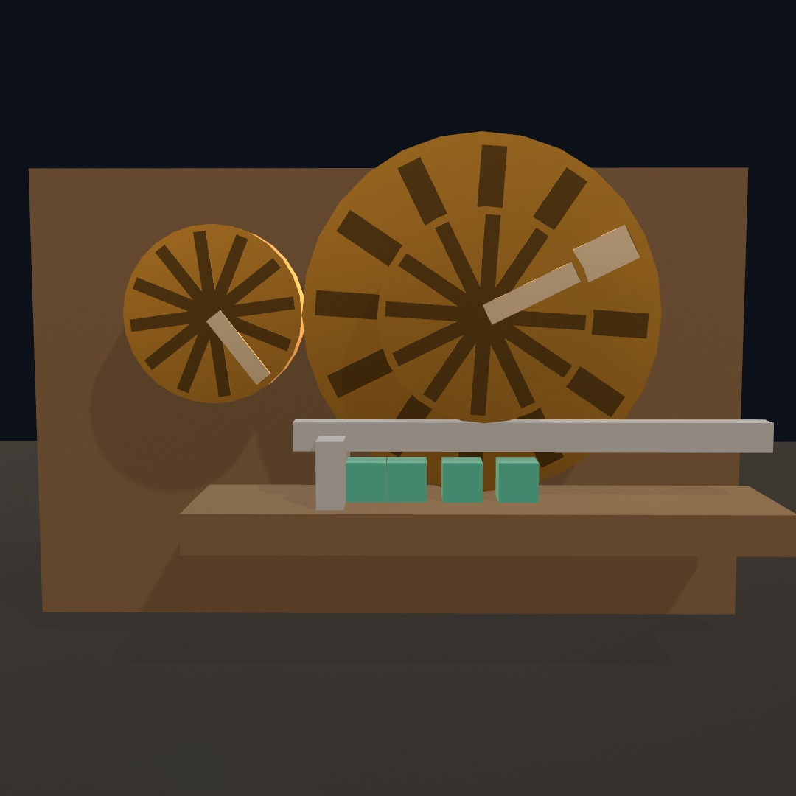

The motor only ever turns the small wheel. The big wheel is turning because the gear link says it must, half as fast and the other way. The bar is sliding because the rack link says a turn of that same shaft is a distance along the shelf. The pale spokes are there so you can see the two wheels are not at the same angle.

One gotcha will be your first one. Real gear teeth mesh, and plain cylinders just jam into each other. Tell them not to collide.

```swift
world.ignoreCollisions(between: "gears", and: "gears")
```

The [`3D/Physics/Contraption`](../Examples/3D/Physics/Contraption/) example is a workshop with one of each. There's that drive train, a hoist you can load, a platter allowed only to rise and spin, and a cart on a track. Drag any of it.

## Keeping what settled

Some arrangements you don't design, you find. A heap of stones tipped in one at a time and left to rock itself quiet is one of them. Four hundred steps of falling and leaning went into it, and there is no way to write it down as code. It only exists in the world's memory, and closing the sketch loses it.

So save it. `snapshot()` takes the whole world as it stands, and `restore(_:)` puts it back:

```swift
let settled = world.snapshot()      // once the heap has come to rest
// …knock it over, drag stones out of it, wreck it…
world.restore(settled)              // exactly the heap you had
```

A snapshot is a value you can keep, so it also goes to a file, which is how a heap survives quitting:

```swift
override func setup() {
    world.ground = 0
    if !world.load(contentsOf: file) {   // nothing there the first time
        buildTheHeap()
        try? world.save(to: file)
    }
}
```

Restoring is not "roughly where things were". Every body comes back in the same pose, moving at the same speed and spinning the same way. If it had gone to sleep it is still asleep, so a saved heap doesn't shudder back into shape as it arrives. A door saved standing half open is still half open, and still stops where it used to. A joint remembers the pose it was made in, and the snapshot remembers that too.

Now, you might reasonably ask why any of this is needed. If the code that built the heap is right there, why not run it again?

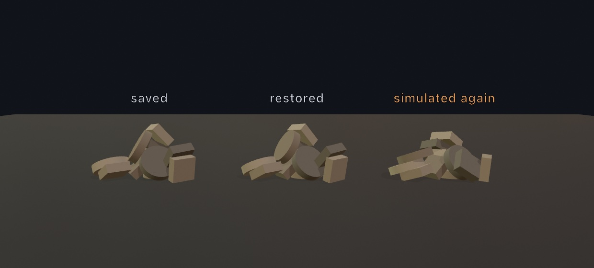

Three heaps, all from the same code. The first was simulated and captured. The second is that capture restored, which is exact. The third was simulated again with one stone released a ten-millionth of a unit higher, and that is the whole difference in the setup. Stones landing on stones magnify it: one lands a little differently, which tips the next, and by the twelfth you have a different heap.

That is not a bug, it is what falling stones are. It does mean the same code can give you a slightly different heap on a machine whose floating point rounds one bit differently. That is exactly the situation a committed figure, or a piece you want to keep, is in. **Simulating it again gives you *a* heap; only saving gives you *that* heap.**

A snapshot holds every body with its collider and all its knobs, every joint between them, gears and racks, and the collision groups and their rules. It holds the world's gravity, ground, bounce, and water. It also holds the things you built on top of those. A character comes back mid-stride. A vehicle comes back drivable and still under power, with its engine turning at the speed it was turning and its wheels already spinning. A truck restored at speed carries on rather than pulling away from rest. A ragdoll comes back where it fell.

That last one is worth a moment, because it is the one that looks impossible. A ragdoll was built from a skinned figure loaded off disk, and a file of physics has no business carrying a mesh. It doesn't. What the solver actually holds is a shape per limb, the tree they hang in, and how far each joint may bend. *That* is small enough to write down. The skin stays where it always was, your asset, in your sketch, loaded the ordinary way. So the snapshot and the sketch each keep the half they are good at, and `figure.apply(ragdoll)` puts them back together:

```swift
world.restore(saved)
figure = world.ragdolls.first     // the bodies are new ones
skin.apply(figure)                // your mesh, over the restored pose
```

One thing to watch throughout. Restoring empties the world first, so any `Body3D`, `Vehicle3D`, or `Character3D` you were holding onto is gone. Take them from `world.bodies`, `world.vehicles`, and `world.characters` again. They come back in the order they were saved, and each body still knows its own `collider`, which is usually all a drawing loop needs.

There is one more thing worth saying about size, and it follows the same idea one step further. Almost everything in a world is small. A box is three numbers. But a terrain collider is thousands of samples, and a cloth is a whole mesh. Those get written into the file every single time you save. So name them instead:

```swift
island.assetName = "island"
banner?.assetName = "banner"
```

and say what the names mean on the way back in:

```swift
world.restore(saved) { name in
    name == "island" ? .heightfield(terrain) : .mesh(sheet)
}
```

On a yard with a terrain floor in it that is the difference between a hundred kilobytes and one. The trade is real, though, and it goes both ways. A snapshot that names nothing is self-contained, which is what lets you commit it beside the sketch and open it anywhere. So that stays the default. A name the resolver doesn't recognize costs you that one body and a note, not the restore. And a cloth needs a name to be saved at all, because a cloth is nothing but its mesh.

That is one direction, keeping a world you found. The other is picking up one somebody else made. A `.usd` file can say which of its prims are physical, and `world.addBodies(from: scene)` reads the lot. A sketch that loads such a file writes no physics of its own:

```swift
let scene = loadScene("yard.usda")!
world.addBodies(from: scene)
```

Bodies, colliders, joints, masses, materials, gravity. Reading it is lossy, and that is exactly why it works. A file's description of a body is a description, and anything it leaves out has a sensible answer waiting. Writing the same format would not be, which is why the two jobs use two formats. Import to pick up an arrangement, and snapshot to keep one.

The [`3D/Physics/Cairn`](../Examples/3D/Physics/Cairn/) example is a heap of stones laid one at a time. Wreck it by dragging, then press R and it is back exactly. Press S, quit, and run it again, and the same cairn is standing there. [`3D/Physics/Yard`](../Examples/3D/Physics/Yard/) does the same for a yard with a truck in it, a figure pacing across, and another lying where it fell. Its terrain floor and its banner are named by the file rather than held in it. And [`3D/Physics/Imported`](../Examples/3D/Physics/Imported/) goes the other way. Its `yard.usda` is hand-written, and the sketch is a camera and a drawing loop.

## What the depth buffer is for

[Chapter 16](16-LayersAndEffects.md) filtered layers by their color. A 3D scene drawn into a layer carries something extra that a flat drawing never has. For every pixel, it knows how far away the thing at that pixel is. That's the **depth buffer**, and three effects exist purely to use it.

```swift
let scene = renderTarget()
withTarget(scene) { /* your 3D scene */ }

drawImage(scene.combined(with: scene.depth,
                         .ambientOcclusion(radius: 0.7, intensity: 1.5)).image, 0, 0)
```

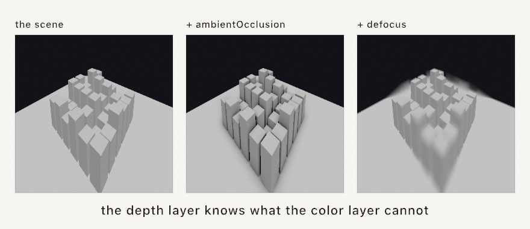

`scene.depth` is an ordinary layer whose brightness is distance, so it feeds `combined(with:)` like any other, and everything else in [Chapter 16](16-LayersAndEffects.md) still applies.

**`.ambientOcclusion`** darkens the places light struggles to reach. Those are crevices, the gaps between objects, and the line where something meets the ground. Compare the first two panels and the blocks stop floating. That single change is most of what makes a render read as solid rather than pasted together. It costs one line, because the depth layer already knows where the crevices are.

**`.defocus`** is a camera lens. It keeps a band of distance sharp, set by `focus` and `range`, and blurs everything else more the further it is from that band, up to `maxBlur`. It's how you point at one thing in a busy scene. Both `focus` and `range` are read against the depth layer's `0...1`, so they depend on the camera's `near` and `far`. That is why setting those to actually bracket your scene matters, rather than leaving them enormous.

**`.screenSpaceReflections`** makes a floor glossy by reflecting the scene in it, and it runs on any Mac. It has one limit worth understanding rather than being surprised by. It reflects what is on the screen, and a picture does not contain the back of anything. Where the true reflection would be of a surface the camera cannot see, such as the underside of a ball resting on a floor, it can only approximate. That shows as a soft zone right at the contact. A touch of `roughness` hides it, and [Chapter 21](21-SculptingWithFields.md) has the exact alternative.

All three take a `quality` tier, `.performance`, `.default`, or `.detail`, which trades frame rate for smoothness. The tier is relative to your machine rather than an absolute setting, so `.default` means "the balanced choice for this GPU" and buys more samples on a faster one. Raising it to `.detail` for a final export is the usual move, since the export doesn't have to keep up with a display.

## Keeping your bearings

3D scenes are easy to get lost in, so the tools for finding yourself again are built in. `cameraView(.front)` snaps the camera to a canonical angle, like front, top, left, or isometric, and `resetCamera()` returns to the opening shot. The host apps put the same snaps in a **Camera** menu, ⌘0 through ⌘7, so they work on any running sketch without a line of code. Two more calls help while you build. `cameraAxis()` shows a small clickable x-y-z compass, and `groundGrid()` lays a faint reference floor. Both are development chrome, drawn only in the live window and never in an export, which is why you won't find them in any figure in this chapter.

One more thing to keep straight as you combine features. Ollin draws several *kinds* of 3D thing, and they don't all take the same finishes. Solid meshes are the fullest citizens, taking materials, textures, shadows, and reflections. The raymarched fields of [Chapter 21](21-SculptingWithFields.md) take materials, environments, and shadows but arrive by a different route. Point clouds are camera-facing splats and take neither lighting nor shadows, which is exactly right for what they are. None of this is arbitrary, since each kind is a different way of getting pixels on screen, but it does mean a material that transforms a mesh may do nothing to a cloud. When something you expected to apply doesn't, the [combining reference](../Docs/3D/Combining.md) is a table of what stacks with what.

## Putting it together: the plaza

The finished piece is a small sculpture court you curate yourself. There are five plinths and five pieces, each wearing a different finish, under golden-hour light with soft shadows. The camera orbits until you take over. Make `MySketches/Plaza.swift`:

```swift
import Ollin

final class Plaza: Sketch {
    // Built once; drawn every frame.
    let knot = Mesh.torusKnot(radius: 0.62, tube: 0.2, segments: 220, sides: 14)
    let vase = Mesh.lathe((0...24).map { i in
        let t = Double(i) / 24
        return Vector2(0.16 + 0.36 * sin(t * .pi * 0.92), (t - 0.5) * 1.5)
    }, segments: 44)
    let pearl = Mesh.sphere(radius: 0.62, segments: 48, rings: 32)
    let gem = Mesh.icosahedron(radius: 0.55)
    let sketchWork = Mesh.icosphere(radius: 0.66, subdivisions: 1)

    override func draw() {
        background(Color(hex: 0x141824))
        cameraShowcase(target: Vector3(0, 1.15, 0), radius: 12,
                       elevation: 0.26, fieldOfView: .pi / 4.4)
        lightingPreset(.goldenHour)
        castShadows()

        // The court floor.
        fill(Color(hex: 0x3A3D45))
        specular(0.05)
        drawPlane(width: 60, depth: 60)

        // Each piece: move to its plinth, draw the plinth, lift, spin, draw.
        withState {
            translate(-3.2, 0, 0.6); plinth(1.0)
            translate(0, 1.5, 0); rotateY(time * 0.24)
            material(.glossy); fill(Color(hex: 0x2C8C86))
            drawMesh(knot)
        }
        withState {
            translate(-1.0, 0, -1.6); plinth(1.55)
            translate(0, 2.32, 0)
            material(.velvet); fill(Color(hex: 0x8C1F35))
            drawMesh(vase)
        }
        withState {
            translate(1.0, 0, 1.4); plinth(0.75)
            translate(0, 1.4, 0)
            var paint = Material.glitter
            paint.sparkleColor = Color(hue: 0.12, saturation: 0.75, brightness: 1)
            material(paint); fill(Color(hue: 0.02, saturation: 0.8, brightness: 0.4))
            drawMesh(pearl)
        }
        withState {
            translate(3.3, 0, 0.9); plinth(1.2)
            translate(0, 1.7, 0); rotateY(time * 0.3); rotateX(0.15)
            material(.toon); fill(Color(hex: 0xE08A3C))
            drawMesh(gem)
        }
        withState {
            translate(-0.4, 0, -3.4); plinth(2.0)
            translate(0, 2.72, 0); rotateY(time * -0.2)
            wireframe()                       // one piece still being imagined
            stroke(Color(hex: 0xBFC7D5)); strokeWeight(1.2)
            drawMesh(sketchWork)
        }
    }

    // A stone block whose top lands at `height`.
    func plinth(_ height: Double) {
        withState {
            translate(0, height / 2, 0)
            material(.matte); fill(Color(white: 0.88))
            drawBox(width: 0.95, height: height, depth: 0.95)
        }
    }
}
```


Everything in it is this chapter. Meshes are built once, and plinths are placed with the transform stack. Note how each block translates to its spot, draws the plinth, then keeps translating upward for the piece. There's one preset for the light, one `castShadows()`, and a different material per sculpture. The last piece is drawn with `wireframe()`, mesh edges only, the standard look for a form that's still a proposal.

Then make it yours:

- Recast the show by swapping in a supershape, a lathe of your own profile, or a loaded model on the tallest plinth.
- Relight it. `.noir` turns the court into a crime scene, and `.moonlight` into a garden at night. Put the preset on a `@Param` menu knob.
- Give the pearl's plinth a slow `rotateY` of its own and let the whole pedestal turn.
- Try `matcap(.chrome)` on the gem and notice what stops responding. Lights and shadows go quiet, and only the view still matters.

## Where this comes from

The camera-on-an-orbit model is the shared convention of 3D tools everywhere, from CAD turntables to the orbit controls of three.js. The lighting model under the materials is Blinn-Phong shading, Jim Blinn's 1977 refinement of Bui Tuong Phong's specular model, the workhorse of real-time graphics for decades. The toon and warm-to-cool finishes descend from the non-photorealistic rendering literature, notably Amy Gooch and colleagues' 1998 technical illustration shading. The three-point lighting behind the presets is a film-set convention nearly as old as film. Matcaps grew up in the digital-sculpting world, where painters bake a whole studio into one sphere image. The supershape formula is Johan Gielis's superformula (2003), while the lathe and extrude are as old as pottery and pasta. Diamond-square terrain comes from Alain Fournier, Don Fussell, and Loren Carpenter's 1982 paper on stochastic models. That is the same line of work that put fractal mountains in *Star Trek II*. The droplet erosion follows Hans Theobald Beyer's 2015 thesis on hydraulic erosion for procedural terrain. Thermal weathering is the talus-angle relaxation from Ken Musgrave, Craig Kolb, and Robert Mace's 1989 paper on eroded fractal terrains. Full credits are in the project's [attribution notes](../ATTRIBUTION.md).

## Go deeper

- [3D](../Docs/3D/3D.md): the full reference for cameras, primitives, meshes, lights, materials, matcaps, shadows, and loading models, including the environment lighting and ray-traced reflections this chapter only waved at.
- [Camera control](../Docs/3D/Camera.md): `cameraShowcase`, the cinematic move catalog, view snaps, and the input surface underneath.
- [Combining 3D features](../Docs/3D/Combining.md): the practical map of what stacks with what (which geometry takes materials, casts shadows, appears in reflections).
- Lens and grounding effects: draw a 3D scene into a render target and its depth layer feeds [Chapter 16](16-LayersAndEffects.md)'s combine effects, `.defocus` for camera-like depth of field, `.ambientOcclusion` to darken contacts and crevices, `.screenSpaceReflections` for glossy floors on any Mac. See [Effects](../Docs/Drawing/Effects.md#combined) and the `3D/SceneDefocus` example.
- [Shadows in full](../Docs/3D/3D.md#shadows): how each caster kind works, the soft-shadow quality dials, and the frustum fitting you never have to touch.
- [Atmosphere](../Docs/3D/Atmosphere.md): the full fog and volumetric-light reference, what participates and what sits out, and the quality dial's exact step counts.
- [Scenes](../Docs/3D/Scenes.md): the full `loadScene` reference, what carries over from a glTF file (nodes, cameras, punctual lights, animations, skins, and morph targets) and from a USD file (nodes, cameras, its UsdLux lights, area kinds included, its transform animation, timeSamples arriving as one animation `apply(_:at:)` plays, and its UsdSkel skins and blend shapes, joints arriving as nodes you can pose by name), how intensities are normalized, and building a `Scene` in code.
- [Bringing a scene over](../Docs/Tools/SceneImport.md): `ollin new --from-scene` writes the sketch instead of loading the file, so the camera, the lights and every placement become source you own. What it leaves behind, and why, is listed there.
- Textures and wireframes: [`Mesh.textured(_:)`](../Docs/3D/3D.md#textures) also takes a `baseColor` for tinting a shared texture, and [`Mesh.uvs`](../Docs/3D/3D.md) is where the coordinates live if you're generating your own geometry.
- [The 26 built-in matcaps](../Docs/3D/3D.md#the-built-in-matcaps), listed by family, plus `Matcap.shaded` for baking one from a color.
- [Terrain](../Docs/Generators/Terrain.md): building heightfields from noise or subdivision, every erosion knob, and reading a field out as a mesh, an image, or samples.
- [Strange attractors](../Docs/Drawing/Attractors.md): all eight systems with their constants, the `AttractorFlow` knobs, and the velocity fields as [shader-library functions](../Docs/Shaders/ShaderLibrary.md#chaotic-systems-compute-only) you can ride in a compute kernel of your own, with the [`Simulation/Attractor`](../Examples/Simulation/Attractor/Sketch.swift) example.
- [3D physics](../Docs/Simulation/Physics3D.md): the full `World3D` reference, every collider and joint kind, forces and impulses, the camera-grab machinery, and [saving a world](../Docs/Simulation/Physics3D.md#snapshots) to load back later, with the `3D/Physics` examples (a tower under cannon fire, a pile you can rummage through, a wrecking ball on a chain).
- Appendix B draws this chapter's math, one picture per idea: [Where things are](B-JustEnoughMath.md#where-things-are), [Moving the paper](B-JustEnoughMath.md#moving-the-paper), [Into three dimensions](B-JustEnoughMath.md#into-three-dimensions).
- Worked examples: [`Examples/3D/Geometry/Solids`](../Examples/3D/Geometry/Solids/Sketch.swift), [`Examples/3D/Geometry/ShapeFactory`](../Examples/3D/Geometry/ShapeFactory/Sketch.swift), [`Examples/3D/Geometry/Transforms`](../Examples/3D/Geometry/Transforms/Sketch.swift), [`Examples/3D/Lighting/LightingPresets`](../Examples/3D/Lighting/LightingPresets/Sketch.swift), [`Examples/3D/Lighting/Shadows`](../Examples/3D/Lighting/Shadows/Sketch.swift), [`Examples/3D/Materials/Materials`](../Examples/3D/Materials/Materials/Sketch.swift), [`Examples/3D/Materials/Matcap`](../Examples/3D/Materials/Matcap/Sketch.swift), [`Examples/3D/Geometry/LoadedMesh`](../Examples/3D/Geometry/LoadedMesh/Sketch.swift), [`Examples/3D/Geometry/LoadedScene`](../Examples/3D/Geometry/LoadedScene/Sketch.swift), and [`Examples/3D/Geometry/Terrain`](../Examples/3D/Geometry/Terrain/Sketch.swift).

---

[Contents](README.md#contents) · Previous: [Chapter 19, Simulations](19-Simulations.md) · Next: [Chapter 21, Sculpting with fields](21-SculptingWithFields.md)
