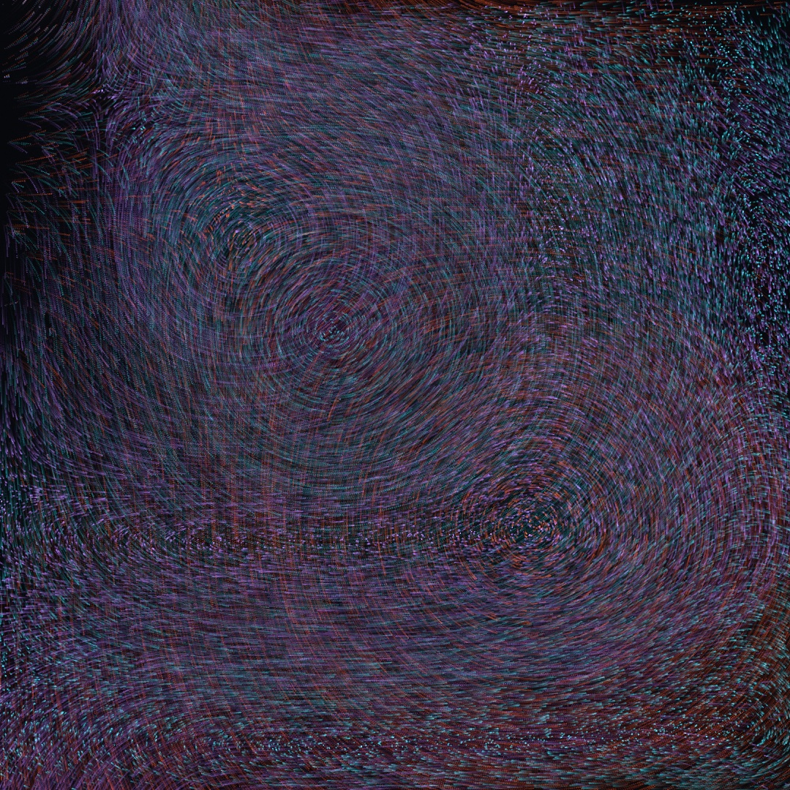
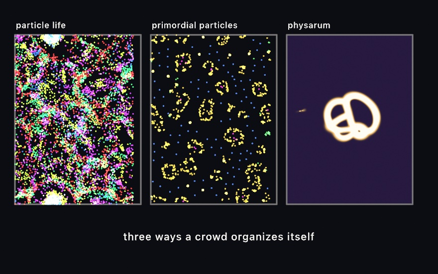
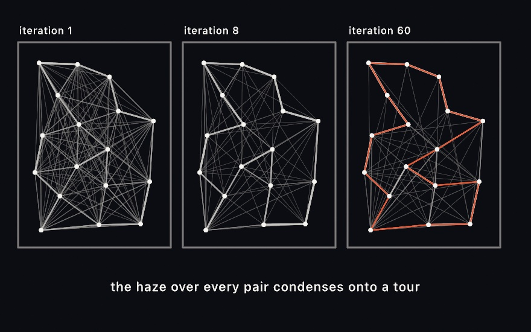
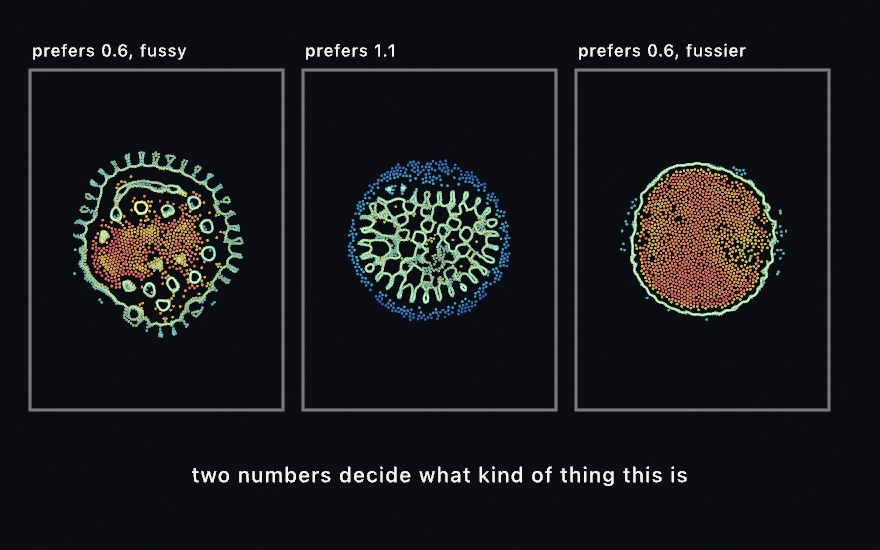
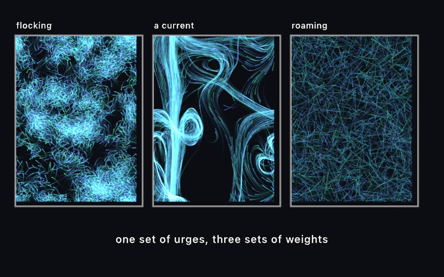
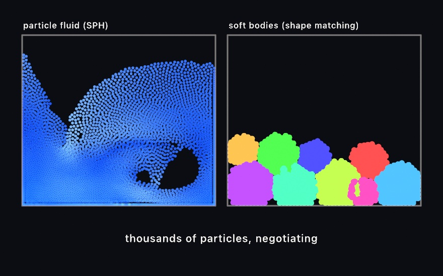
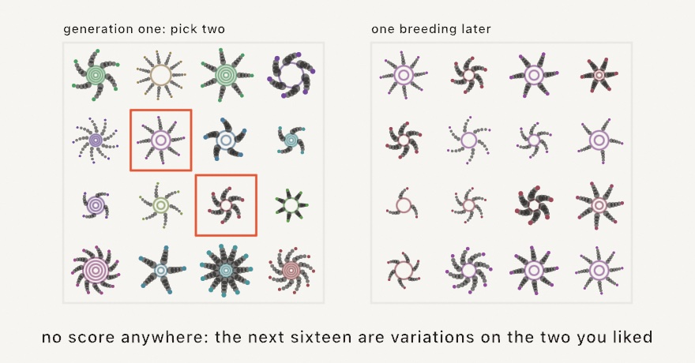
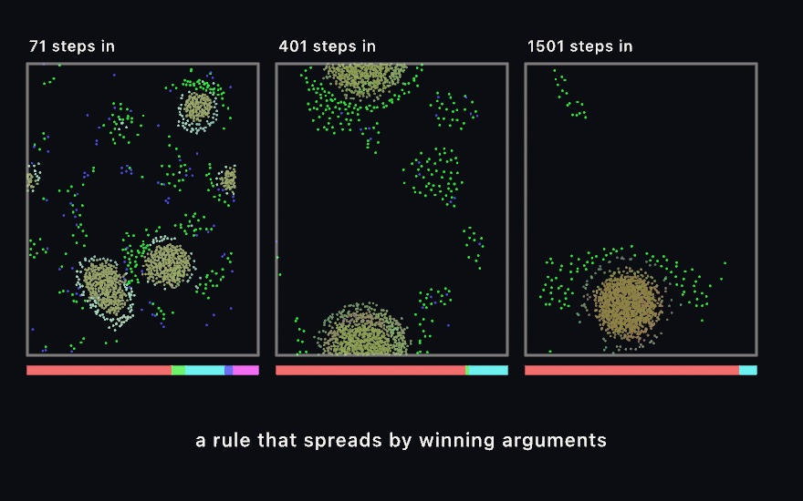

#### <sup>[Ollin](../README.md) → [Guide](README.md) → Chapter 20</sup>

---

# 20. Simulations made of particles



[Chapter 19](19-GridSimulations.md) evolved textures. Every cell sat still on a grid and asked its neighbors what to do. This chapter evolves the other kind of thing on the GPU, a buffer of hundreds of thousands of *individuals*, each carrying its own position and updated by one small program that never touches the CPU.

That one change opens a lot of doors. Individuals can carry a species, so a rule can treat its own kind differently from everyone else's. They can talk by leaving marks on the floor and reading them back. They can be scored, sorted, and bred. The drift above is the simplest end of it: a quarter of a million particles reading one field at three different zooms, summed as light on a canvas that keeps its own past. By the end you'll have built it, and you'll have met the systems that put those individuals to much stranger work.

## A million grains: GPU particles

The fields so far evolved *textures*. The other half of GPU simulation evolves *particles*. That is a buffer of hundreds of thousands of individuals, each updated by a small program, none of them ever touching the CPU. In Ollin that's `Particles`, and the update is a snippet of Metal, the same language as [Chapter 17](17-YourFirstShader.md)'s shaders. It is presented here as a recipe you can adapt without ceremony:

```swift
lazy var sand = Particles(count: 1_000_000, step: """
    if (life <= 0.0) {                       // (re)spawn the dead
        position = hash22(float2(float(id), float(u.frameCount))) * u.resolution;
        life = 1.0;
    }
    position += curlNoise(position * 0.002 + u.time * 0.05) * 80.0 * u.dt;
    life -= u.dt;
    color = float4(0.6, 0.8, 1.0, 0.4);
    size = 1.4;
""")

override func draw() {
    background(.black)
    blendMode(.add)         // particles sum as light
    updateParticles(sand)   // one GPU simulation step
    drawParticles(sand)     // a million additive discs
}
```

Inside the snippet, each particle's `position`, `color`, `size`, and `life` are yours to read and write. `u` carries time and resolution, and the helpers you know, `hash22`, `curlNoise` and `fbm`, are already in scope. What does count buy? Exactly what it looks like:


Each grain sheds the same faint light, and density does the drawing. At ten thousand you see individuals, at a million you see a *material*. Pair this with [Chapter 16](16-LayersAndEffects.md)'s `noClear()` and `toneMap(.aces)`, and the grains deposit into the long-exposure sandpainting look.

When the grains are meant as *light* rather than ink, draw them as light: `drawParticles(sand, style: .light)`. The default style is tuned for marks over a light ground, and it lifts a dot that straddles a pixel corner to more than twice the light of one that lands on a center, which a sum of a million dots then bakes in. The light style deposits each grain's `color × alpha × area` wherever it falls, and a grain at or under one pixel costs one fragment instead of twenty-five. Put those into Chapter 16's `Accumulator` and the picture converges instead of brightening:

```swift
withAccumulator(light) {
    blendMode(.add)
    drawParticles(sand, style: .light)
}
drawImage(light.developed(exposure: 20).image, 0, 0)
```

The `Rendering/DepthOfField` example pushes this all the way to a photograph with a real lens: a million samples a frame, each pushed into a ball that grows with its distance from the plane of focus, projected through the sketch's own camera by a kernel (`cameraParams()` packs the matrices, `ballSample` scatters, `ollin_project_eye` lands the point), averaged until bokeh emerges. For a scene made of lines, `LineSpray` is that whole pipeline in one call, and the `Rendering/LineSpray` example is a sphere of a hundred and fifty rings seen through it. The [depth of field page](../Docs/Drawing/DepthOfField.md) has the lens and the rules; the [compute reference](../Docs/Shaders/Compute.md) has the full snippet vocabulary, `.metal`-file loading, the multi-buffer dispatch, and the typed core underneath.

## Crowds that organize themselves: Physarum

The grains in the last section never noticed each other. Making a hundred thousand particles *aware* of their neighbors is a harder problem than it looks. Asking "who is near me" the obvious way means comparing everyone against everyone, which is billions of comparisons a frame. The standard fix is to sort the particles into a grid of cells first, so each one only ever checks the nine cells around it. Ollin ships that sort as `SpatialHash`, and it's public, so you can build your own neighbor-aware system on it. Three classic ones come already built.



**Particle Life** gives you a few *kinds* of particle and one attraction number for every ordered pair of kinds. That's the whole model. Red is drawn to green, green flees blue, and out of that asymmetry come membranes, cells, chasers, and worms that nobody designed:

```swift
life = makeParticleLife(count: 24_000, kinds: 6, radius: 46)

// each frame:
updateParticleLife(life)
drawParticles(life)
```

The matrix is rolled at build, and `life.randomizeMatrix(seed:)` rolls a fresh one. Most rolls are dull and a few are alive, which makes this another seed-hunting system in the spirit of [Chapter 4](04-Randomness.md).

**The Primordial Particle System** is leaner still. Each particle counts its neighbors, and notices whether more of them sit to its left or its right. Then it turns toward the busier side, by a fixed amount plus a crowd-proportional one. From that single rule come cells that grow, divide, and die. The middle panel above is a few seconds in, with yellow marking the crowded cell walls and blue the free wanderers.

**Physarum** models slime mold and needs no neighbor search at all, because its agents talk through the floor instead of to each other. Each one sniffs three points ahead, turns toward the strongest trail, steps forward, and deposits a little trail of its own. The trail map blurs and fades a touch each frame. What emerges is the branching transport network on the right, the same kind of network real slime mold famously uses to solve mazes:

```swift
slime = makePhysarum(agents: 220_000, resolution: 1024)

// each frame:
updatePhysarum(slime)
drawImage(slime.image, in: bounds)
```

One honest caveat covers all three. The neighbor sort settles ties with a race between GPU threads, and these systems are chaotic, so a run is not reproducible frame for frame. Seed them for a repeatable *starting* layout, but don't expect two exports to match.

## A search you can watch: ant colony optimization

Physarum's talk-through-the-floor trick has a CPU cousin that actually finishes something. **Ant-colony optimization** points the pheromone at a task: visit every city once, briefly. Each `step()` the whole colony walks a tour, choosing the next city by trail strength and closeness. Then the map evaporates a little, and every ant lays trail along its route, more for shorter tours.



The three panels are one seeded search at three moments. After one iteration the map is a haze, because every ant's tour deposited somewhere. Edges that keep landing in short tours are walked again and grow stronger, and the rest fade. By iteration sixty the web has settled, and the best tour found so far rides on top in orange. Draw `trails` each frame and you watch that condensation happen live:

```swift
let colony = AntColony(cities: points, seed: 7)

// each frame:
colony.step()
for trail in colony.trails {
    stroke(Color.white.withAlpha(trail.strength * 0.8))
    drawLine(trail.a, trail.b)
}
drawPolyline(colony.bestTourPoints, closed: true)   // the answer so far
```

Two parameters set the search's temperament. `evaporation` is the forgetting rate: high keeps exploring, low commits early, sometimes to a rut. `elitism` re-lays the best tour every iteration, which sharpens the web onto the current answer. Unlike its GPU cousins this one runs on the CPU and reproduces exactly from its seed. `bestTour` never worsens, so you can stop whenever the web looks done. The `Patterns/AntColony` example runs the whole search as a living sketch; the [reference](../Docs/Generators/AntColony.md) has the rest of the parameters.

## Matter that decides what shape to be: Particle Lenia

The three systems above are written as forces: something pushes, something pulls. **Particle Lenia** is written a different way, and it is worth seeing because the difference is the whole idea. There is no force law. There is a landscape, and particles walk downhill on it.

Each particle adds up a ring-shaped kernel over its neighbors to get one number, how crowded it is. A growth function scores that crowding. There is a level of company a particle likes, and the further from it in either direction, the worse things are. A repulsion term makes being stood on very bad indeed. Add those into one energy, and a particle simply moves whichever way that energy improves.



```swift
lenia = makeParticleLenia(count: 6000, spacing: 9)

// each frame:
updateParticleLenia(lenia)
drawParticles(lenia)
```

The three panels above are that same code. The only difference between them is which crowding the growth function is asking for and how fussy it is about getting it: `muG` and `sigmaG`. Two numbers are the difference between a cell with a fringed skin, a coral, and a smooth solid body.

It is worth knowing which term does what, because they pull against each other on the same thing. Growth is the only term that attracts, so with it switched off, particles drift apart. Repulsion is the only term with an opinion at very short range, so with *it* switched off, they end up standing on each other. The reason for that second one is the kernel's shape. It is a *ring*, so two particles in exactly the same place add almost nothing to each other's crowding. Growth is perfectly happy to let them coincide.

The color in those panels is the crowding itself, measured against what the rule asked for. That is why the membrane reads differently from the inside. Particles on the rim have nobody beyond them, so their field is permanently short of the target, however well the rule is working. The membrane is not a feature anybody wrote. It is just where the population runs out.

One thing you never set is the kernel's weight. It is not a free number. It is whatever makes the kernel add up to one over the whole plane, so Ollin works it out from the ring you asked for. That is what keeps `muG` meaning the same crowding when you move the ring. It is also why the sketch above names no constants you would have to look up.

## The flock, a thousand times bigger

[Chapter 12](12-FlocksAndSwarms.md) gave one creature a short list of urges and let a few hundred of them flock. That work was done on the CPU, one agent at a time, which is why the counts stayed small. `Swarm` is the same list of urges run on the GPU, over the neighbor sort above. So the same rules carry tens or hundreds of thousands of agents.



Every behavior is a number, and a number of zero means that behavior is switched off:

```swift
flock = makeSwarm(count: 30_000, perceptionRadius: 16)
flock.separation = 1.5     // don't crowd
flock.alignment = 1.5      // go the way your neighbors go
flock.cohesion = 0.8       // stay with them

// each frame:
updateSwarm(flock)
drawParticles(flock)
```

That's the left panel. Turn those three off and turn on `flow` instead and a noise field carries everyone, which is the middle panel. Turn on `wander` alone and each agent roams by itself, which is the right one. `seek`, `flee`, and `arrive` steer at a `target` you can move with the mouse. Each behavior works out where it *wants* to be going, and subtracts where the agent is already going. The weighted total is capped before it moves anything, exactly as in [Chapter 12](12-FlocksAndSwarms.md).

Three numbers are tied to each other, and a swarm that looks wrong is usually one of them rather than a weight. An agent should see about twenty others, which is what `perceptionRadius` decides against how crowded the canvas is. See far more and every agent is averaging over most of the swarm, so the structure washes out. `separationRadius` wants to be about the gap between neighbors, since a personal space larger than that means everyone shoves everyone forever. And the turning circle, `maxSpeed²/maxForce`, should be a few times the perception radius, or agents orbit inside their own neighborhood instead of traveling through it.

One more, which is not in the original model: `minSpeed`. Left to itself, a steering agent pushed at from every side simply stops. In a crowd the stopped ones become a wall the rest jam against, until the whole thing sets like concrete. A floor under the speed keeps it moving, on the grounds that a bird cannot hover.

A still frame of a swarm is a picture of where everyone is, not of how they are moving. That is why all three panels above are drawn as trails. Use `noClear()`, then a nearly transparent rectangle over the whole canvas each frame, so old marks fade instead of vanishing. Use a rectangle rather than `background`, which wipes the canvas outright no matter how little alpha its color carries.

## Liquids and jellies: SPH and soft bodies

That same neighbor search carries two more systems, and these two behave like matter.



**`ParticleFluid`** is smoothed-particle hydrodynamics, a long name for a simple bargain. Represent a liquid as thousands of particles, have each one measure how crowded it is, and push it away from wherever it's crowded. Density becomes pressure, pressure becomes motion, and a free surface, splashes, and sloshing all come out without anyone modeling them:

```swift
fluid = makeParticleFluid(count: 26_000, radius: 12)

// each frame:
if mouseIsPressed { fluid.pull(at: Vector2(mouseX, mouseY)) }
updateParticleFluid(fluid)
drawParticles(fluid)
```

`gravity` tilts the box, and `stiffness` sets how hard the liquid resists being squeezed. `nearStiffness` is an extra short-range pressure that stops particles clumping, and gives the surface its tension. Grabbing a handful with `pull(at:)` and flinging it is most of the fun.

**`SoftBodies`** is the jelly counterpart, and it works by *shape matching*. Each body remembers the shape it was born with. Every step it works out where that shape would be now, its center and its rotation. Then it pulls its particles back toward those remembered positions. `squish` is how firmly it pulls, and that one parameter is the difference between a bouncing ball and a slime:

```swift
blobs = makeSoftBodies(bodies: 12, radius: 80)

// each frame:
updateSoftBodies(blobs)
drawParticles(blobs)
```

Bodies collide with each other and flatten where they press together, which is the pile on the right. Both systems run fixed substeps against a clamped clock, so a dropped frame slows them down rather than detonating them. Both carry the same reproducibility caveat as the last section.

## Letting the sketch find it: evolution

Every other system in this chapter runs a *rule*. This one runs a *search*.

Thirty thousand individuals set off from the same spot at the same moment. Each carries a genome, which here is a short list of pushes played back in order over a few seconds. A genome is a plan for a journey, and the flight is what that plan turns out to be worth. When the time is up, everyone is scored on how close they came to a target. The whole population is then replaced by the children of whoever did best. Then it happens again.


```swift
run = makeEvolution(count: 30_000, genes: 28,
                from: Vector2(540, 990), to: Vector2(540, 110))
run.obstacles = [Rectangle(x: 0, y: 620, width: 640, height: 34),
                 Rectangle(x: 800, y: 620, width: 280, height: 34)]

// each frame:
updateEvolution(run)
drawParticles(run)
```

Nowhere in that do you say how to get there. You place a start, a target, and the walls; the route is the one thing you leave out, and the route is what comes back.

The three panels are the same search a few seconds apart. Generation 1 is a spray with no idea. By generation 8 a plume has found the gap and is pouring through it. By generation 23 the population is a single arc that threads the gap and ends in the ring. Nothing improved a genome. All that happened is that the ones that did badly had fewer children.

Choosing the parents is the interesting part. Each parent is picked by holding a small tournament. Grab four individuals at random, and keep whichever scored highest. That sounds like a shortcut for the fairer method, where a genome's share of the parents is its share of everyone's total score. It is better suited here, for a reason worth knowing. A tournament never adds anything up. It only ever asks *which of these two is higher*. So thirty thousand children can each pick their own parents at the same instant, with nothing to agree on and nothing to wait for. That is exactly what a GPU is. It also means the scale of a score is irrelevant. Only its order matters.

The pace comes out of the geometry rather than out of numbers you tune. Top speed crosses the distance to the target in about two seconds, and the trial is long enough to go the long way round. One gene pushes hard enough to reach top speed in a quarter of a trial. All of it is worked out from how far apart the two points are. That is why the sketch above names a population, a genome length, and two points, and nothing else. It is also why dragging the target repaces the whole run.

One decision in there is easy to overlook, and it decides whether any of this works. That is what the first generation is made of. Pick every gene at random and a genome is a random walk, whose steps mostly cancel. The entire population would mill about the start, all of them equally hopeless. Selection would have nothing to tell apart for a very long time. So a genome starts as a smooth arc instead, a random heading with each gene a small turn from the one before. Generation 1 is then already a spray of paths going somewhere different. Evolution's job is then to bend the promising ones, which takes a dozen generations rather than a hundred.

Mutation is what keeps that going. Each gene, as it is copied into a child, has a small chance of being nudged. And it really is a nudge, a random amount added to what the gene already held rather than a fresh random value. Turn mutation off and a run still improves for a while, on the variety generation 1 happened to contain. Then it stops, because copying can only ever narrow. Selection chooses. It never invents.

## Sixteen things and no opinion about them: interactive evolution

The other half of evolution has no score at all.

`Population` is a handful of genomes, each just a bag of numbers between 0 and 1 that your sketch reads however it likes. You draw them, somebody picks the ones they like, and those breed:

```swift
pool = population(count: 16, genes: 8)      // in setup()

// a genome, read as a drawing:
let arms  = g.value(0, in: 3 ... 11)
let hue   = g.value(1, in: 0.0 ... 1.0)
let rings = g.value(2, in: 1 ... 4)

// when someone has picked their favorites:
pool.breed(from: chosen)
```

<picture>
  <source media="(prefers-color-scheme: dark)" srcset="Images/20-ParticleSimulations/PickAndBreed-dark.jpg">
  
</picture>

Nothing in a `Genome` knows what its numbers mean, which is exactly what lets the framework mate and mutate one without knowing what is being evolved. Sixteen ornaments become sixteen slightly different ornaments, then sixteen variations on the two you liked. After a dozen rounds the grid is full of things you would not have thought to draw.

The mutation rate here defaults far higher than the scored version's, and the reason is arithmetic about people. A search you judge by eye gets maybe twenty candidates a generation, and maybe twenty generations before you get bored. So a few hundred looks have to cover ground a scored run covers in millions. Variation has to arrive fast enough to be worth looking at. For the same reason the genomes you picked are carried into the next generation untouched. One breeding is a big step when a person is doing the judging. The thing you just chose should not vanish the moment you choose it.

The two halves are not the same tool at two sizes. A scored search can only ever find what the score was written to want. A search judged by eye can arrive somewhere you did not know you were going, because you are allowed to change your mind between generations.

## A rule that spreads by winning arguments: swarm chemistry

Both halves above have generations: everybody flies, everybody is judged, everybody is replaced. **Swarm chemistry** takes the generation away and sees what is left.

Every particle carries its own copy of the rule it moves by, eight numbers called a recipe. Those are how far it sees, the speed it likes, and the speed it can reach. Then come the strengths of cohesion, alignment, separation, random steering, and pace-keeping. When two particles touch, one recipe overwrites the other. Nothing is scored and nothing is aimed at. A recipe spreads because the particles holding it keep meeting particles holding something else and winning.



```swift
chem = makeSwarmChemistry(count: 4000, kinds: 6)

// each frame:
updateSwarmChemistry(chem)
drawParticles(chem)
```

The world opens with six random recipes shared out evenly, and the bars under the panels are who is left. Six lines, then two, then very nearly one. Nobody chose the winner, and nobody could have told you in advance which it would be.

`competition` is the one parameter that says what winning even means, and it is the whole character of a run. Under `.faster` the recipes that spread are the ones whose particles keep moving. Under `.slower` it is the ones that settle. Under `.majority`, whoever is already surrounded by more of its own kind, which makes the thing at stake territory. Setting `transmits` to false freezes every recipe, and gives you the model before any of this was added. That is a fixed mixture of six kinds, worth looking at on its own.

Mutation here is a chance *per contact*, not per generation, and a particle in a crowd makes contact several times a second. So the rate is far below the one `Evolution` uses. Set it as high as a generational search would, and the recipes take dozens of nudges inside a single takeover. They arrive as noise, which you see immediately. The structures dissolve, and the whole thing flattens into an even gas.

The color is the recipe itself, three of its numbers read as red, green and blue. So a takeover reads as one color eating the others, and a mutation as a shift in shade rather than a new color. When one line has won and the picture keeps changing shade, that is the line still drifting inside itself.

## Putting it together: the drift

Now you can build the sketch at the top. It is the plainest thing in the chapter, deliberately, because the point is to see the machinery with nothing in the way. One field, one update program, and three kinds that differ by a single number. Make a new file, `MySketches/Drift.swift`:

```swift
import Ollin

final class Drift: Sketch {
    @Param("Field scale", 0.0004...0.0030) var fieldScale = 0.0011
    @Param("Speed", 40.0...260.0) var speed = 150.0
    @Param("Lifespan", 1.0...12.0) var lifespan = 7.0
    @Param("Fade", 0.01...0.20) var fade = 0.13

    lazy var dust = Particles(count: 250_000, step: """
        uint kind = id % 3u;

        // Respawn the dead anywhere on the canvas, with a staggered lifespan
        // so the three kinds never pulse together.
        if (life <= 0.0) {
            position = hash22(float2(float(id), float(u.frameCount))) * u.resolution;
            life = custom.z * (0.35 + hash12(float2(float(id), 11.0)) * 0.9);
        }

        // One field, read at a different zoom per kind. That difference is the
        // whole of what separates them.
        float zoom = custom.x * (1.0 + float(kind) * 0.6);
        position += curlNoise(position * zoom + u.time * 0.03) * custom.y * u.dt;
        life -= u.dt;

        float3 tint = kind == 0u ? float3(0.98, 0.40, 0.20)
                    : kind == 1u ? float3(0.18, 0.80, 0.88)
                                 : float3(0.70, 0.50, 0.99);
        color = float4(tint, 0.055);
        size = 1.0;
    """)

    override func setup() {
        noClear()
        background(Color(hex: 0x07080C))
    }

    override func draw() {
        // The canvas keeps its own past, so a thin wash of the ground color is
        // what stops the trails filling in completely.
        blendMode(.normal)
        noStroke()
        fill(Color(hex: 0x07080C, alpha: fade))
        drawRect(0, 0, width, height)

        blendMode(.add)
        updateParticles(dust, custom: SIMD4<Float>(Float(fieldScale), Float(speed), Float(lifespan), 0))
        drawParticles(dust)
    }
}
```

Give it a few seconds to settle, then pull the fade down. What each piece contributes:

- The step body is the entire simulation. Four lines of it are the physics; the rest is birth and color. It runs a quarter of a million times per frame, and nothing in it can see any other particle, which is why it scales the way it does.
- `id % 3` is the whole species system here. One number changes, and the three kinds read the same field at three zooms, which is enough to make them separate visually without any of them knowing the others exist.
- `custom` is how a parameter reaches the GPU. Everything a `@Param` changes has to arrive through those four floats, which is a real constraint and worth feeling early.
- `noClear()` plus the wash is the trail. Without it you get confetti, because a particle's position tells you nothing and its *path* tells you everything. The wash sets how long the canvas remembers; drop `Fade` to 0.02 and the trails run nearly forever.
- The additive blend is what turns overlapping trails into light rather than paint. Where many particles have crossed, the color climbs toward white, which is the same crowding-is-brightness idea the field simulations used on a grid.

Before moving on, make it yours:

- Give each kind its own speed as well as its own zoom, by folding `kind` into the `custom.y` multiplier. They stop looking like one system in three colors.
- Replace `curlNoise` with `valueNoise` read as a height, and step along its gradient instead. The character changes completely for a one-line edit.
- Push the count to a million and the alpha to 0.02. The picture gets quieter and much finer, which is usually the better trade.
- Seed the respawn on a circle rather than the whole canvas, and watch the field carry the ring apart.

## Where this comes from

GPU particle systems are a demoscene and games inheritance, and the additive light-deposit rendering they power here is as old as long-exposure photography. The systems built on top of them have names attached. Particle Life descends from Jeffrey Ventrella's *Clusters*. The Primordial Particle System is Thomas Schmickl, Martin Stefanec, and Karl Crailsheim's, published in *Scientific Reports* in 2016. The slime-mold agents follow Jeff Jones's 2010 model of *Physarum polycephalum* transport networks. Particle Lenia carries the continuous-automaton idea of Bert Wang-Chak Chan's Lenia onto moving individuals. The ant colony is the Ant System of Marco Dorigo, Vittorio Maniezzo, and Alberto Colorni, from their 1996 paper. The fluid is Matthias Müller and colleagues' 2003 particle-based formulation, and its near-density anti-clumping term is the one Simon Clavet, Philippe Beaudoin, and Pierre Poulin added in 2005. The jellies use Müller's 2005 meshless shape matching.

The breeding half has its own lineage. The genetic algorithm is John Holland's, set out in 1975 in *Adaptation in Natural and Artificial Systems*. David Goldberg's 1989 book made it practical for the rest of us. That book is where crossover, mutation, and the roulette-wheel and tournament ways of choosing parents are all laid out. Breeding pictures by eye is Karl Sims', from his 1991 paper *Artificial Evolution for Computer Graphics*. The *Genetic Images* installation came out of it, where visitors stood in front of the images they liked. Those became the parents of the next generation. The flying-toward-a-target version is the one Daniel Shiffman teaches as smart rockets in *The Nature of Code*. It follows an earlier sketch by Jer Thorp. Full credits are in the project's [attribution notes](../ATTRIBUTION.md).

## Go deeper

- [Compute and GPU particles](../Docs/Shaders/Compute.md): the full `Particles` snippet vocabulary, every local in scope, the `custom` parameters, dropping to a raw `ComputeKernel` when the built-in layout is not enough, binding up to ten buffers, and projecting through the sketch's camera from a kernel.
- [Depth of field from light](../Docs/Drawing/DepthOfField.md): `LineSpray` and the `Bokeh` lens, the light particle style's deposit rules, and the `develop` print.
- [Artificial life](../Docs/Simulation/ArtificialLife.md): all three systems with every parameter, plus the matrix rolling and the reproducibility caveat.
- [Ant colony](../Docs/Generators/AntColony.md): the trail and closeness pulls, evaporation, elitism, and reading the best tour back out.
- [Swarm](../Docs/Simulation/Swarm.md): all eight steering behaviors, every parameter, and how to pick a temperament rather than a number.
- [Fluids and soft bodies](../Docs/Simulation/Fluids.md): the SPH and shape-matching parameters, grabbing with the mouse, and what each solver is and is not good for.
- [Evolution](../Docs/Simulation/Evolution.md): the scoring and selection in full, the pacing you can control, and the interactive form.
- Appendix B draws the idea underneath all of this: [Local rules, global structure](B-JustEnoughMath.md#local-rules-global-structure).
- Worked examples: [`Examples/Simulation/ParticleLife`](../Examples/Simulation/ParticleLife/Sketch.swift), [`PrimordialParticles`](../Examples/Simulation/PrimordialParticles/Sketch.swift), [`Physarum`](../Examples/Simulation/Physarum/Sketch.swift), [`ParticleLenia`](../Examples/Simulation/ParticleLenia/Sketch.swift), [`Swarm`](../Examples/Simulation/Swarm/Sketch.swift), [`SwarmChemistry`](../Examples/Simulation/SwarmChemistry/Sketch.swift), [`ParticleFluid`](../Examples/Simulation/ParticleFluid/Sketch.swift), [`SoftBodies`](../Examples/Simulation/SoftBodies/Sketch.swift), [`Evolution`](../Examples/Simulation/Evolution/Sketch.swift), [`Breeding`](../Examples/Simulation/Breeding/Sketch.swift), [`Examples/Rendering/DepthOfField`](../Examples/Rendering/DepthOfField/Sketch.swift), and [`Examples/Rendering/LineSpray`](../Examples/Rendering/LineSpray/Sketch.swift).

---

[Contents](README.md#contents) · Previous: [Chapter 19, Simulations on a grid](19-GridSimulations.md) · Next: [Chapter 21, 3D, gently](21-3DGently.md)
