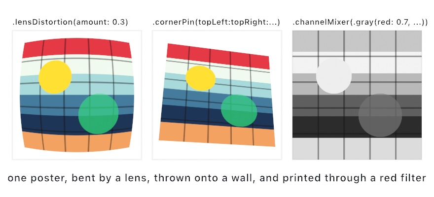

#### <sup>[Ollin](../README.md) → [Guide](README.md) → Chapter 20</sup>

---

# 20. Pictures restyled


One photograph can become a painting, a pen drawing, a colorist's grade, or a print on paper. You learn the filters that do it, each one call on a layer, so they chain and take arguments. Five of them, stacked, turn the street photograph above into a hand-colored print. More of the stylize shelf follows it, with filters that read a layer as height, tone, a center, a ring, or a pour.

## Paint that follows the picture: brushwork

The first filter turns the layer into a painting. `.brushwork()` lays the picture on as paint. Detail flattens into patches, edges stay crisp, and the patches run along the picture's own contours.

<picture>
  <source media="(prefers-color-scheme: dark)" srcset="Images/20-PicturesRestyled/Brushwork-dark.jpg">
  
</picture>

Draw the photograph into a layer, `scene`, the way [Chapter 19](19-LayersAndEffects.md) drew into `art`, and filter it:

```swift
drawImage(scene.filtered(.brushwork()).image, 0, 0)
```

Underneath is a brush divided into eight overlapping sectors, like slices of a pie. For each pixel the filter takes the average color of every sector and measures how much each one varies. The flattest sectors win. So a pixel beside an edge takes its color from the sectors on its own side, and the edge never smears. Away from any edge every sector is much the same, and the pixel becomes a broad average. That is what flattens detail into patches.

The part that makes the patches read as strokes is the shape of the brush. For that, the filter first works out which way the picture runs at each pixel. It measures how the brightness changes in every direction around the pixel and keeps the direction along which it changes least. That direction is the picture's **flow**. Along a blade of grass the flow runs along the blade, and in a flat sky there is no clear flow at all. The table of changes the flow is read from is called the structure tensor, a term you will meet in the papers. Where the flow is clear, the brush is drawn out along it and squeezed across it. It is at most four times as long as it is wide. Along the blade the patch is a stroke along the blade. In the sky the brush stays round. `stretch` is the most an edge can draw the brush out. Set it to 1 and the brush is always round, which is a useful thing to see once: the picture turns into square dabs.

Three more filters in this chapter read the same flow: hatching, next, and the ink lines and flat regions after the print. `radius` and `sharpness` are the other two dials, and the [effects reference](../Docs/Drawing/Effects.md#filter) describes all three. [`Examples/Effects/Brushwork`](../Examples/Effects/Brushwork/Sketch.swift) paints the photograph of a woman before a wall of marigolds, with every dial on a parameter.

## Strokes that follow the picture: hatching

Brushwork gave the picture its color as paint. The print also needs its line, and the same flow can draw that. `.hatching()` lays strokes along the flow, and lays down as many of them as the tone is dark. So the drawing keeps its light and shade with nothing but line.

<picture>
  <source media="(prefers-color-scheme: dark)" srcset="Images/20-PicturesRestyled/Hatched-dark.jpg">
  
</picture>

```swift
drawImage(scene.filtered(.hatching()).image, 0, 0)
```

Look at where the marks go. They ring the sphere, because every ring of equal light on a sphere is a circle. They run down the pot, because its light changes across it and not along it. They lie flat on the wall and the table. Nothing told them to. The direction comes out of the picture, the way it did for `brushwork`.

The tone is the other half. Under the strokes is a stroke texture, made by combing noise along the flow. The filter inks every mark of that texture that is darker than the pixel under it. Because the texture is even, the share of paper the ink covers comes out as the share the picture is dark. A quarter-dark tone gets a quarter of the page. A picture with light and shade in it arrives with light and shade in the line work.

`spacing`, `length`, and `directions` are the dials, and a transparent `background` leaves the page bare where the picture was empty. The [effects reference](../Docs/Drawing/Effects.md#filter) describes each. [`Examples/Effects/Hatching`](../Examples/Effects/Hatching/Sketch.swift) puts every one on a parameter over an engraved landscape with the sun crossing it.

## A look from a colorist's suite: ColorLUT

Brushwork and hatching change what the picture is made of. A print shop's next step changes its color. The tool for that is a **look**, a table that says, for every color, which color to show instead. Color tools trade them as `.cube` files. A colorist builds one in a grading suite and hands it over. A film stock's character ships as one, and a camera maker publishes one for its footage. Ollin reads that file into a `ColorLUT`, and `.lut` applies it to a layer or to the whole frame.


```swift
var look = ColorLUT.warmPrint                       // the bundled look, a warm print

override func setup() {
    look = try! ColorLUT(resource: "kodachrome", withExtension: "cube", in: .module)
}

override func draw() {
    drawImage(photo, 0, 0)
    postProcess(.lut(look, amount: 0.8))
}
```

Read the two strips before the portrait. The gray ramp says what the look does to tone. This one lifts black off the floor, holds white short of paper, and bends the middle into a gentle S. The sweep of hues says what it does to color: warm at the bright end, cool at the dark. Every look is those two things, and a ramp and a sweep through it tell you more than a portrait does.

A word on how the table is read, because it decides whether a neutral stays neutral. A `.cube` holds a color at every node of a lattice. An input between nodes has to be interpolated from the corners of its cell. Ollin cuts the cell into six tetrahedra along its gray diagonal, the way a grading suite does. It then weighs the four corners of the one that holds the point. Every one of those tetrahedra has the cell's black and white corners. So a gray input meets only the two gray corners, and a look that leaves gray alone does so between its nodes too. The plain trilinear read of a texture sampler would mix the colored corners in and tint a neutral.

Two more things to know. A file that is not a `.cube` is refused with the line that stopped it, so a bad download says where. And the table runs the other way as well. `ColorLUT(size:title:_:)` builds a cube from a function of color, and `write(to:)` saves it as a `.cube` that any grading tool reads. So a look you tune in a sketch can travel out. [`Examples/Color/Look`](../Examples/Color/Look/Sketch.swift) wipes the bundled look across a portrait, beside one written in code, and takes any `.cube` dropped on the window.

## A film look: halation and grain

A look grades the color. Two more filters give a frame the *texture* of film, the two things a stock does to a picture that a sensor does not.


The first is **halation**, the warm fringe film shows around its brightest highlights. Light that gets through the emulsion reflects off the base and exposes the layers again around the point it entered. The red-sensitive layer sits deepest, so it takes most of that second exposure, and the fringe comes out orange. `.halation(threshold:radius:tint:amount:)` builds it the way `.bloom` builds a glow. The pixels above `threshold` are blurred by `radius`, colored by `tint`, and added back. The difference is where the halo lands. Scattered light changes nothing in a layer that is already fully exposed. So each channel takes the halo in proportion to how far it sits below white. A white lamp keeps its white core and gains a ring, where a glow would have tinted the core too. Under the pictures, the same lamp is magnified four times, plain and halated, so you can see the core hold. A frame with nothing above the threshold comes back untouched, byte for byte.

The second is **film grain**. A developed frame is a scatter of grains, each one developed or not, and that is what makes its noise follow the tone. Where nothing developed there is nothing to vary, and where every grain did there is nothing either. The grain lives in the middle, and its spread goes as the square root of the tone times what is left to white. `.filmGrain(amount:size:seed:)` applies that rule to each channel on the displayed picture. `amount` is the spread at mid-gray as a fraction of the way to white, so 0.05 is about twelve levels of a display byte. `size` is how many pixels across a clump is, and a coarser grain is not a fainter one. The mean of any flat region is kept, so grain never lifts or darkens a picture. The ramp along the bottom shows the rule: nothing at the black end, nothing at white, the most in the middle. Feed `seed` your `frameCount` and every frame gets the fresh grain a film has. The older `.grain` is plain per-pixel noise, the same at every tone. It is still the right call for a static or a signal look.

```swift
override func draw() {
    background(.black)
    fill(.white)
    drawCircle(width / 2, height / 2, 40)
    postProcess(.halation(threshold: 0.8, radius: 24))
    postProcess(.filmGrain(amount: 0.06, size: 2, seed: Double(frameCount)))
}
```

[`Examples/Effects/FilmLook`](../Examples/Effects/FilmLook/Sketch.swift) draws a night street of lamps through both. Every dial is a parameter, and a switch shows the raw frame on the left half.

## The design filters: paper, glass, water, and a material from a silhouette

The last thing a print meets is the sheet it is printed on, and the filter for that belongs to the design family. The design filters are built to look like the finished graphics on a product page. They split into two rows that work in opposite directions:


The bottom row takes a picture and hands it back changed. These three tiles hand it a bundled photograph of a hillside town. `.flutedGlass` puts ribbed glass in front of it, `.water` refracts it through ripples, and `.paperTexture` lays it onto a sheet with tooth and creases.

The top row works the other way. `.liquidMetal`, `.heatmap`, and `.gemSmoke` mostly ignore your layer's colors and read its **alpha**, the silhouette. All three tiles above started as one white heart on a transparent layer, and each filter built a whole material out of that outline. So the working method for these is to draw a shape into a layer, then filter the layer:

```swift
let shape = makeRenderTarget()
withTarget(shape) {
    noStroke(); fill(.white)
    drawHeart(width / 2, height / 2, width * 0.5)
}
drawImage(shape.filtered(.liquidMetal(phase: time)).image, 0, 0)
```

`drawHeart` is one of the analytic shapes beside `drawCircle`, and it takes a center and a size the same way. Any silhouette works. It can be text from [Chapter 8](08-Words.md), a shape you built in [Chapter 15](15-ShapesAsMaterial.md), or a tracked hand from [Chapter 34](34-Seeing.md). The filter never knows where the outline came from.

One practical note. A strong distortion reads past the layer's edge, and `edges` decides what happens there. On `.flutedGlass` it softens the samples pushed off the layer, and on `.water` it lets the distortion reach the borders. A continuous field takes a strong refraction better than a pattern of separate marks does.

[`Examples/Effects/FilterCatalog`](../Examples/Effects/FilterCatalog/Sketch.swift) tours the design filters in full, and [`Examples/Effects/GeneratorCatalog`](../Examples/Effects/GeneratorCatalog/Sketch.swift) does the same for [Chapter 18](18-YourFirstShader.md)'s design generators.

## Putting it together: the hand-colored print

The hand-colored print turns a photograph into the kind of picture a print shop once sold, an engraving tinted by hand. It stacks five of this chapter's steps. `brushwork` paints the color, and `hatching` draws the line work over it under [Chapter 19](19-LayersAndEffects.md)'s `.multiply`. Then a look grades the frame warm, film grain gives it a texture, and `paperTexture` presses it into a sheet. Make `MySketches/HandColored.swift`:

```swift
import Ollin
import OllinSamplePhotos

final class HandColored: Sketch {
    var photo = Image(width: 1, height: 1)

    override func setup() {
        photo = SamplePhoto.city.load()
    }

    override func draw() {
        // The view drifts across the photograph, which is drawn a little wider
        // than the canvas so the drift never shows an edge.
        let drift = Vector2(sin(time * 0.07) * 40, cos(time * 0.05) * 20)
        let scene = makeRenderTarget()
        withTarget(scene) {
            drawImage(photo, in: Rectangle(center: center + drift, width: width * 1.1,
                                           height: height * 1.1), fit: .cover)
        }

        // The color, painted: detail flattened into patches along the picture.
        drawImage(scene.filtered(.brushwork(radius: 7)).image, 0, 0)

        // The line work, multiplied over the color, so its white paper drops out.
        blendMode(.multiply)
        drawImage(scene.filtered(.hatching(spacing: 4, length: 20,
                                           foreground: Color(hex: 0x3B2A20))).image, 0, 0)
        blendMode(.normal)

        // The finish: a warm grade, the grain of film, and the sheet it is printed on.
        postProcess(.lut(.warmPrint, amount: 0.85))
        postProcess(.filmGrain(amount: 0.04, size: 2, seed: Double(frameCount)))
        postProcess(.paperTexture(folds: 0.4))
    }
}
```

The photograph is one of the bundled sample photographs from [Chapter 9](09-Pictures.md), a hillside town under a warm sky. `try! loadImage("/path/to/yours.jpg")` in its place, as [Chapter 9](09-Pictures.md) wrote it, is the whole change for a picture of your own.

One layer feeds everything. The photograph is drawn into `scene` once a frame, and both the color and the line are read from it. `brushwork` flattens the detail into patches that follow the picture's own contours, so the color stays inside the shapes rather than running across them. `hatching` reads the same picture and lays as many strokes as each tone is dark.

The line work goes down under `.multiply`. Multiplying by white changes nothing, so the paper between the strokes drops out and only the brown ink darkens the color under it.

The rest runs on the whole frame through `postProcess`, and each call works on what the calls before it left. The look grades first, and the grain lands on the graded color. The paper comes last, since the sheet is the last thing a print meets.

The frame moves because the view does. `drift` slides the photograph a little each second, and both filters read it afresh every frame. So the strokes re-flow as the picture passes under them, and the grain changes with `frameCount`. The paper holds still, since its texture is static by design.

> **Swift note.** `var photo = Image(width: 1, height: 1)` gives the property a one-pixel placeholder until `setup()` loads the photograph, which is the plain alternative to [Chapter 12](12-FlocksAndSwarms.md)'s `!`. `Rectangle(center:width:height:)` is [Chapter 13](13-GrowingThings.md)'s rectangle placed by its middle, and `center + drift` is [Chapter 10](10-Vectors.md)'s vector addition.

Then make it yours:

- Trade the colorist for a poster printer. `.shock(iterations: 6)`, from the family after this section, in place of `brushwork` flattens the color into bands with crisp edges.
- Ink it instead of hatching it. `.xdog()`, from the same family, in place of `hatching` gives pen lines and solid shadows, and they multiply over the color the same way.
- Grade it with a look of your own. Load a `.cube` file in `setup()` with `ColorLUT(resource:withExtension:in:)`, as the look step did, and hand it to `.lut` in place of `.warmPrint`.

A print is a still, so keep it as one. `swift run OllinLive MySketches/HandColored.swift --export print.png --frame 600` writes the frame ten seconds in. The grain is new on every frame, so try a few frame numbers and keep the one you like.

## More from the shelf: ink lines, flat regions, chromatic aberration, a lens, a wall, and a mixer

The print painted its color with brushwork and drew its line with hatching. Both belong to the stylize family, the filters that turn a picture into a drawing or a painting. Three more of that family belong here. Two of them read the same flow as brushwork. `xdog` draws the picture as pen and ink, and `shock` flattens it into regions with crisp edges. Either can stand in for a step of the print. The third, chromatic aberration, pulls the picture's colors apart the way a lens does. Three more tools close the family. They are a lens's barrel, a picture pinned onto four points, and a mixer that weighs every color channel from all of them.

### A line where there is an edge: xdog

`.xdog()` draws the layer as pen and ink. A line goes wherever the picture has an edge, solid ink goes where the picture is dark, and everything else is left as paper. It is for a drawing rather than an adjustment, a photograph turned into the kind of line an illustrator would ink. The method is the extended difference of Gaussians that Holger Winnemöller, Jan Eric Kyprianidis, and Sven C. Olsen published in 2012.

<picture>
  <source media="(prefers-color-scheme: dark)" srcset="Images/20-PicturesRestyled/InkLines-dark.jpg">
  
</picture>

```swift
drawImage(scene.filtered(.xdog()).image, 0, 0)
```

Underneath is a difference of two blurs. Blur the brightness a little, then blur it a little more. The two agree everywhere except at an edge, where the wider blur reaches across and the narrower one does not. Subtracting them leaves the edges. The filter pushes that difference hard over the picture's own tone, then cuts the result at a threshold: paper above it, ink below. The cut is what puts solid ink into the shadows. A dark region sits under the threshold on its own, with no edge needed.

The part that makes the lines read as drawn rather than detected is the flow. It is the same idea brushwork used, read here from the brightness rather than the color. Before the blur is taken, the filter works out which way each edge runs. It then takes the blur *across* that direction and gathers the response *along* it. A line then runs the length of its edge instead of breaking into the speckle a plain edge detector leaves on a noisy picture. `flow` is how far along the edge it gathers. Setting it to 0 turns that off, so do it once to see what it does.

`radius`, `sharpening`, `threshold`, `softness`, `foreground`, and `background` are the other dials, and the [effects reference](../Docs/Drawing/Effects.md#filter) describes each. [`Examples/Effects/InkDrawing`](../Examples/Effects/InkDrawing/Sketch.swift) puts every one on a parameter over the photograph of the woman in the yellow scarf.

### Regions with crisp edges: shock

`.shock()` smooths the layer along its own flow and sharpens it across that flow, round after round. Soft shading snaps into flat regions with crisp edges. Anything that runs in a direction, grain, hair, or grass, is drawn out into one coherent stroke. It is for a poster or a cel look, a picture reduced to a few flat shapes without losing where its edges were. The method is the coherence-enhancing filtering that Jan Eric Kyprianidis and Henry Kang published in 2011.

<picture>
  <source media="(prefers-color-scheme: dark)" srcset="Images/20-PicturesRestyled/FlatRegions-dark.jpg">
  
</picture>

```swift
drawImage(scene.filtered(.shock()).image, 0, 0)
```

Underneath are two moves, repeated. The first is the flow. At every pixel the filter takes the direction along which the picture changes least, the flow brushwork read. It averages the pixel with its neighbors along that direction only. It walks a curve that follows the picture rather than a straight line. Grain smooths along the grain and an edge along the edge. Nothing is smoothed across.

The second move is the shock. Across that direction the filter reads whether the brightness is bending toward bright or toward dark. On the bright side of a soft edge, each pixel takes the brightest pixel within reach. On the dark side, it takes the darkest. The two sides march toward each other and meet at a step. That is what turns a soft shadow into a flat band with a crisp edge. It is also why the filter never invents a color. Every pixel is either a blend along its own contour or a pixel the layer already had.

`iterations` is how many times the pair runs, and so the level of abstraction, and `flow`, `radius`, `smoothing`, and `threshold` are the other dials. The [effects reference](../Docs/Drawing/Effects.md#filter) describes each, with `smoothing` as the one to raise on a noisy picture. [`Examples/Effects/Coherence`](../Examples/Effects/Coherence/Sketch.swift) puts every one on a parameter over the lace-headdress portrait.

### One filter, five pictures: chromatic aberration

Chromatic aberration pulls the color channels apart a little, so a white edge grows a colored rim. It is for the look of glass: a cheap lens, or a fast lens wide open. The name is the lens fault it imitates, where glass bends each wavelength by a slightly different amount and the colors land apart. Most filters have a strength argument. This one has a strength argument and a **mode**. Each mode is a different picture, because what the mode decides is *where* the channels get pulled.

<picture>
  <source media="(prefers-color-scheme: dark)" srcset="Images/20-PicturesRestyled/Dispersion-dark.jpg">
  
</picture>

```swift
layer.filtered(.chromaticAberration(amount: 0.018))                        // the default
layer.filtered(.chromaticAberration(amount: 0.05, mode: .lens(radius: 0.3, falloff: 2)))
layer.filtered(.chromaticAberration(amount: 0.012, mode: .offset(angle: .pi / 5)))
layer.filtered(.chromaticAberration(amount: 0.03, mode: .edges))
layer.filtered(.chromaticAberration(amount: 0.022, mode: .axial))
layer.filtered(.chromaticAberration(amount: 0.018, spectral: true))
```

**`.magnify` is the default, and it scales each channel about the middle of the frame.** The middle does not split at all, and the split grows the further out you go. Straight lines stay straight. This is the form a lens produces, and it is the one to reach for first.

**`.lens(radius:falloff:)` shapes that growth.** `radius` says how far out the fringe starts to show, and `falloff` says how fast it grows past there. About 2 reads like glass. In the second panel nothing happens near the middle at all, and the bottom of the frame comes apart.

**`.offset(angle:)` moves every pixel by the same vector.** The middle splits as much as the corner, which no lens does. That is the point. This is a plate printed a hair off, an anaglyph, a scan that slipped.

**`.edges` puts the fringe only where there is an edge.** It slides along the local brightness gradient and scales by how strong that gradient is, so flat areas keep their exact color. Fringing on a lens is only visible at high-contrast edges. Putting it there and nowhere else is what stops it reading as a filter laid over the picture. The thin lines go green because a three-pixel line is all edge. Red slides off one side, blue off the other, and green is what stays.

**`.axial` changes focus instead of position.** One end of the spectrum stays sharp while the other softens, which is most of the look of a fast lens wide open. A positive amount keeps red sharp, and a negative one keeps blue sharp. That sign is the difference between a highlight going green and going magenta, so try both.

Two more things to know. Every mode hands the layer straight back at `amount: 0`, so an A/B costs nothing. And `spectral: true` takes the split over a whole set of wavelengths instead of three. That is the difference between the last panel and the first: three hard ghosts become one continuous smear. It costs more taps, and `quality:` sets how many.

There is a two-layer version too. `.dispersed(by:)` in a `compose` block, or `Combine.disperse` on its own, scales the amount by a second layer's brightness. Draw white where you want the color to come apart and black everywhere else, and the fringe lands only there.

### Through a lens, onto a wall, and through a mixer: lensDistortion, cornerPin, and channelMixer

Three more filters take one poster somewhere else. Two of them are warps with a physical model behind them, and the third is the color tool a darkroom printer would ask for first.

<picture>
  <source media="(prefers-color-scheme: dark)" srcset="Images/20-PicturesRestyled/LensPinMixer-dark.jpg">
  
</picture>

```swift
layer.filtered(.lensDistortion(amount: 0.3, quartic: 0.1))
layer.filtered(.cornerPin(topRight: Vector2(0.9, 0.2), bottomRight: Vector2(0.95, 0.9)))
layer.filtered(.channelMixer(.gray(red: 0.7, green: 0.2, blue: 0.1)))
```

**`.lensDistortion` bends the picture the way a real lens does.** A point some distance from the center reads the layer a little further out than itself. The factor grows with the square of that distance. That one rule is the radial part of the lens model photogrammetry fits to real glass, and it makes straight lines bow. A positive `amount` is a barrel, in the first panel. The lines bow outward, and the corners read past the layer's edge, so they come back empty. A negative amount is a pincushion. The lines bow inward and the corners pull in from the edge. `quartic` adds a second term that grows with the fourth power of the distance. It bends the corners and leaves the middle alone. The empty corners are honest, and sometimes what you want. When they are not, `fillsFrame: true` scales the read so the frame stays full, at the cost of the outermost strip of the picture.

**`.cornerPin` lays the picture onto four points.** Give it where the four corners should land, in `0...1` layer coordinates, and every point between follows. Straight lines stay straight, and parallel edges may meet, the way a picture thrown onto a wall from an angle does. Each corner defaults to its own place, so moving one is one argument. In the second panel the right edge leans away and the top and bottom edges converge toward it. Outside the four points the layer is not there at all. [Installation mode](../Docs/Output/Installation.md) runs the same map over the whole output to fit a projector to a wall. Here it runs over one layer at a time. That is how you put a picture into a picture in perspective: a poster on a drawn wall, a screen inside a drawn room.

**`.channelMixer` weighs every channel from all of them.** A `ColorMatrix` has a row for each output channel. The row says how much of the input's red, green, blue, and alpha goes into it, plus a number added at the end. `ColorMatrix.gray` is the gray a display makes, and `.gray(red:green:blue:)` is a gray mixed to your own recipe. The third panel is a red filter's monochrome, with red weighted heavily and blue hardly at all. The red bars come out light and the blue ones dark. That is what a black-and-white photographer's red filter does to a sky. `.swapping(.red, .blue)` trades two channels. A matrix built by hand does the rest, one row per channel. `ColorMatrix(red: [1, 0, 0, 0, 0.1])` lifts red by a tenth and leaves the other channels as they were. The arithmetic runs in linear light. An offset of a tenth is a tenth of the light, not a tenth of the code value.

## Filters that read the layer as something else: height, tone, a center, a ring, and a pour

Every filter in the print and in the family before it read the layer as a picture and handed back a changed picture. A few filters read the same pixels as *information about something else*. They read a height, a tone, a point to warp around, a ring to repeat, or a brightness to pour by. What you feed them then matters more than their arguments, so each is met on its own here.

### Height, tone, and a center: relight, the two-tone dither, and the warps

`.relight` reads the layer's brightness as height and lights it as a surface. The two-tone `.dither` reads the brightness as tone and screens it into two colors. The warps read a center you give and distort around it. They are for a bumpy material from a noise field, a newsprint look in any two inks, and a distortion placed where you want it. Relight lights the slope it reads with Jim Blinn's highlight model. The dither is Bryce Bayer's ordered matrix, and the radial warps follow the lens warps Inigo Quilez published. Each starts from the same noise layer in the figure:

<picture>
  <source media="(prefers-color-scheme: dark)" srcset="Images/20-PicturesRestyled/SpecialFilters-dark.jpg">
  
</picture>

```swift
layer.filtered(.relight(.metal, angle: -.pi * 0.7, elevation: 0.55))
layer.filtered(.dither(dark: navy, light: sand, pixelSize: 3))
layer.filtered(.swirl(angle: 4.2, radius: 0.42, center: Vector2(0.3, 0.34)))
```

**`.relight` reads brightness as height.** It treats a bright pixel as a high point and a dark one as a low point. It then works out which way the resulting surface faces, and lights it from an angle you choose. Hand it a photograph and you get an odd embossed thing. Hand it a noise field, as the first panel does, and you get hammered metal, because noise makes a plausible bumpy surface. Five finishes change how the material responds, from `.matte` through `.metal` and `.glass` to `.sand` and `.liquid`. [Chapter 23](23-GridSimulations.md)'s ripple pool uses it to turn a height field into water.

**`.dither(dark:light:)` reads brightness as tone.** It screens the layer into exactly two colors of your choosing. Each pixel comes from a repeating pattern, the ordered dither [Chapter 9](09-Pictures.md) met when it cut a photograph down to a few colors. Gradients survive as texture rather than collapsing into two flat regions. `pixelSize` makes the grain coarser, which is how you get the look of cheap newsprint or an early screen in any two colors you like.

**The warp filters read a center.** `.swirl`, `.bulge`, and `.ripple` all distort around the middle of the layer by default. Each takes a `center` given in `0...1` layer coordinates. That one argument is what turns a symmetric effect into a composition. Feed it `bounds.uv(of: mouse)`, the mouse as a fraction of the canvas, and the distortion sits under the pointer. The marked circle in the third panel is the center that swirl was given.

The [effects reference](../Docs/Drawing/Effects.md#filter) has every argument, and [`Examples/Effects/Relight`](../Examples/Effects/Relight/Sketch.swift) shows all five finishes side by side.

### A picture inside itself: droste

One warp does something none of the others do. `.droste` makes the picture contain itself. It is for the picture that goes on forever, a frame with a smaller copy of itself in its middle. It takes its name from a Dutch cocoa tin whose label showed a nurse carrying a tray with the same tin on it. The construction it runs is the one Escher used in *Print Gallery*, which Hendrik Lenstra and Bart de Smit analyzed and completed in 2003.

<picture>
  <source media="(prefers-color-scheme: dark)" srcset="Images/20-PicturesRestyled/PictureInsideItself-dark.jpg">
  
</picture>

```swift
layer.filtered(.droste(inner: 0.42, twist: 1, zoom: time * 0.2))
```

Take the ring between `inner` and the edge of the layer. Imagine straightening it into a strip, the way you would cut a rubber band and pull it flat. A strip can be repeated end to end forever. Curl the repeated strip back into a ring and each copy comes out smaller than the last. That is a picture with a smaller copy of itself in the middle, and a smaller copy in the middle of that one.

`inner` is the radius of the hole, and it is also how much smaller each copy is than the one around it. `twist` is the part Escher used. At 0 the copies sit in plain concentric rings. At 1, going once around the middle also steps you one copy down in size. The rings wind into a single spiral, and there is no longer any place where one copy ends and the next starts.

`zoom` slides the picture into itself, counted in copies. Add exactly 1 and you are back where you began, which makes this the rare animation that loops with nothing to hide. `zoom: time * 0.2` falls forever and repeats every five seconds.

One thing to design for. The filter reads a ring, and the outer edge of that ring has to meet the inner edge of the next copy along. If your content runs to both edges, the join shows up as a hard circle. Keep the content clear of both, or let the ring end on flat color at each end. The layer in the figure does the second thing: plain dark ground inside and outside, windows only in between.

### The picture poured: melt

`.melt` liquifies a layer by its own brightness. It is a design filter, for a picture poured into marbling that still reads as the picture. It is built on Inigo Quilez's domain warping, noise that bends the coordinates other noise is read at.

<picture>
  <source media="(prefers-color-scheme: dark)" srcset="Images/20-PicturesRestyled/Melt-dark.jpg">
  
</picture>

```swift
drawImage(scene.filtered(.melt(phase: time)).image, 0, 0)
```

Underneath, the filter builds a swirling noise field and uses one displacement vector for two jobs at once. That vector warps the field's own coordinates, and it also shifts where the filter reads your layer. Because the same vector does both, the picture and the swirl move together instead of one sliding over the other. The result reads as the image having been *dyed* rather than smeared. The layer's brightness mixes back into the field before it goes through a color ramp, so bright regions stay bright and structural. The lit sky in the figure comes through the pour as the pale half of the picture, with the dark shore still holding the bottom.

It is a strong effect at its defaults, and `liquify`, `warp`, and `blend` dial back how far it takes the picture. The sway that animates it uses frequencies that do not divide evenly into each other, so it never repeats. It drifts forever, and it will not give you a seamless loop.

## Where this comes from

The stylizing filters each rebuild a published method. The brushwork is the anisotropic Kuwahara filter of Jan Eric Kyprianidis, Henry Kang, and Jürgen Döllner, from 2009. The hatching walks its strokes by Brian Cabral and Leith Casey Leedom's line integral convolution, from 1993. Its tone follows Georges Winkenbach and David H. Salesin's stroke-density rule, from 1994. The film grain is the stochastic model of Alasdair Newson, Julie Delon, and Bruno Galerne, from 2017. Halation is written from the photographic physics in T. H. James's *The Theory of the Photographic Process*. In the film it describes, the red-sensitive layer lies nearest the base.

A look is read from Adobe's Cube LUT format. The tetrahedral read between its nodes goes back to a 1981 patent by Sakamoto and Itooka. The design filters were cross-read against Paper Shaders, the design-shader library from paper.design with shaders by Ksenia Kondrashova. The liquid metal and the fluted glass follow its published parameterization closely, re-expressed in Ollin's own Metal. The paper texture is Jim Blinn's bump lighting over a height field of noise.

The entries after the print name their own sources. The ink line is the extended difference of Gaussians of Holger Winnemöller, Jan Eric Kyprianidis, and Sven C. Olsen, from 2012. The flat regions are Kyprianidis and Kang's coherence-enhancing filter, from 2011. The picture inside itself is named after a Dutch cocoa tin from 1904. Its label showed a nurse holding a tray with a cup of cocoa and the same tin on it. Escher took the idea somewhere stranger in *Print Gallery* (1956), where a man in a gallery looks at a picture that contains the gallery. He left a hole in the middle, which he signed rather than finished. Hendrik Lenstra and Bart de Smit worked out in 2003 what belonged in it. The straighten-repeat-curl construction the filter runs is Escher's, completed by them. The melt is Inigo Quilez's domain warping, with the picture read through the same warp as the swirl. Its shared displacement and its sway follow *fluid*, an open-source generative-background studio credited in the attribution notes. Full credits are in the project's [attribution notes](../ATTRIBUTION.md).

## Go deeper

- [Layered effects](../Docs/Drawing/Effects.md#filter): the whole filter catalog with every argument, the stylizing, look, film, warp and design filters among it.
- [Looks](../Docs/Drawing/Looks.md): the `.cube` format in both forms, the reader's refusals, the tetrahedral read, and writing a look of your own.
- [Sample photographs](../Docs/Drawing/SamplePhotos.md): the bundled pictures the chapter's figures and its print start from, and what each one is good for.
- Worked examples: [`Examples/Effects/InkDrawing`](../Examples/Effects/InkDrawing/Sketch.swift) (the scarf photograph as pen and ink), [`Examples/Effects/Brushwork`](../Examples/Effects/Brushwork/Sketch.swift) (the marigolds photograph painted as brushwork, every dial on a parameter), [`Examples/Effects/Coherence`](../Examples/Effects/Coherence/Sketch.swift) (the portrait flattened into regions by the shock filter), [`Examples/Effects/Hatching`](../Examples/Effects/Hatching/Sketch.swift) (an engraved landscape with the sun crossing it), [`Examples/Color/Look`](../Examples/Color/Look/Sketch.swift) (a look from a `.cube` file wiped across a portrait), [`Examples/Effects/FilmLook`](../Examples/Effects/FilmLook/Sketch.swift) (a night street through halation and grain), [`Examples/Effects/Relight`](../Examples/Effects/Relight/Sketch.swift), [`Examples/Effects/Droste`](../Examples/Effects/Droste/Sketch.swift), and [`Examples/Effects/FilterCatalog`](../Examples/Effects/FilterCatalog/Sketch.swift).

---

[Contents](README.md#contents) · Previous: [Chapter 19, Layers and effects](19-LayersAndEffects.md) · Next: [Chapter 21, Pictures you solve](21-PicturesYouSolve.md)
