#### <sup>[Ollin](../README.md) → [Guide](README.md) → Chapter 20</sup>

---

# 20. Pictures restyled

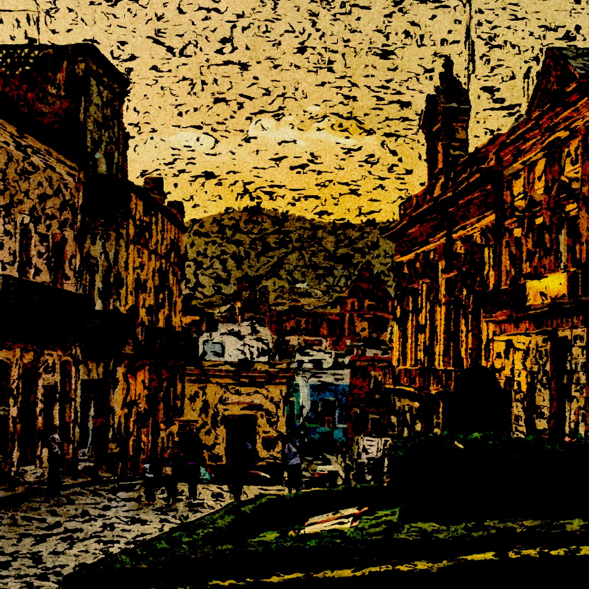

A photograph is a place to start rather than a place to stop. This chapter's filters make a picture into another kind of picture. Pen and ink finds its edges, brushwork and flat regions follow its flow, and hatching draws it for a pen. A colorist's look grades it, film adds halation and grain, and a warp folds it into itself. Then come chromatic aberration's five pictures and the design filters that ripple, pour, and melt it. Each is one `.filtered(...)` on a layer from [Chapter 19](19-LayersAndEffects.md), so they chain, take a `@Param`, and move with `time`. The chapter ends by stacking several of them into a hand-colored print.

## A line where there is an edge: xdog

One filter in the stylize family deserves a closer look, because it turns a picture into a drawing rather than adjusting it. `.xdog()` draws the layer as pen and ink. A line goes wherever the picture has an edge, solid ink goes where the picture is dark, and everything else is left as paper.

<picture>
  <source media="(prefers-color-scheme: dark)" srcset="Images/20-PicturesRestyled/InkLines-dark.jpg">
  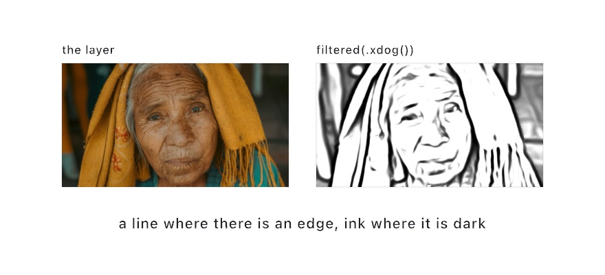
</picture>

```swift
drawImage(scene.filtered(.xdog()).image, 0, 0)
```

Underneath is a difference of two blurs. Blur the brightness a little, then blur it a little more. The two agree everywhere except at an edge, where the wider blur reaches across and the narrower one does not. Subtracting them leaves the edges. The filter pushes that difference hard over the picture's own tone, then cuts the result at a threshold: paper above it, ink below. The cut is what puts solid ink into the shadows. A dark region sits under the threshold on its own, with no edge needed.

The part that makes the lines read as drawn rather than detected is the flow. Before the blur is taken, the filter works out which way each edge runs. It then takes the blur *across* that direction and gathers the response *along* it. A line then runs the length of its edge instead of breaking into the speckle a plain edge detector leaves on a noisy picture. `flow` is how far along the edge it gathers. Setting it to 0 turns that off, so do it once to see what it buys.

The dials: `radius` is the line scale in pixels, and `sharpening` how far the edges are pushed over the tone. `threshold` is where paper turns to ink, and `softness` the ramp under that cut. At 0 the cut is a hard two-tone print. The default of 0.2 keeps a gray wash below the threshold, which is the look the technique is known for. `foreground` and `background` are the ink and the paper. The filter reads the picture as the brightness a display would show. An edge in a shadow then counts as much as one in the light. Empty space on a transparent layer reads as paper rather than ink, so a shape drawn alone gets an outline and nothing else. [`Examples/Effects/InkDrawing`](../Examples/Effects/InkDrawing/Sketch.swift) puts every dial on a parameter over a still life with a moving lamp.

## Paint that follows the picture: brushwork

A second stylize filter turns the layer into a painting rather than a drawing. `.brushwork()` lays the picture on as paint. Detail flattens into patches, edges stay crisp, and the patches run along the picture's own contours.

<picture>
  <source media="(prefers-color-scheme: dark)" srcset="Images/20-PicturesRestyled/Brushwork-dark.jpg">
  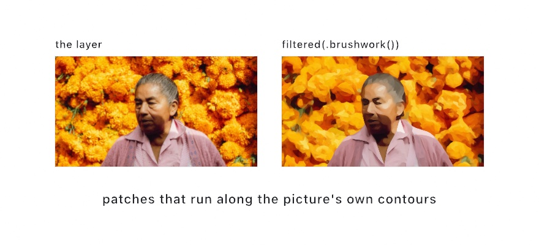
</picture>

```swift
drawImage(scene.filtered(.brushwork()).image, 0, 0)
```

Underneath is a brush divided into eight overlapping sectors, like slices of a pie. For each pixel the filter takes the average color of every sector and measures how much each one varies. The flattest sectors win. So a pixel beside an edge takes its color from the sectors on its own side, and the edge never smears. Away from any edge every sector is much the same, and the pixel becomes a broad average. That is what flattens detail into patches.

The part that makes the patches read as strokes is the shape of the brush. The filter first works out which way the picture runs at each pixel, from the same structure tensor `xdog` follows. Where there is a clear direction, the brush is drawn out along it and squeezed across it. At most it is four times as long as it is wide. Along a blade of grass the patch is a stroke along the blade. In a flat sky the brush stays round. `stretch` is the most an edge can draw the brush out. Set it to 1 and the brush is always round, which is a useful thing to see once. The picture turns into square dabs.

The dials: `radius` is the brush size in pixels, and the cost grows with its square. `sharpness` is how decisively the flattest sector wins. Higher is flatter and more poster-like. At 0 every sector counts alike, and the filter is only a soft blur. The picture is read as the colors a display shows over white paper. Empty space on a transparent layer counts as paper, and the result keeps the layer's alpha. [`Examples/Effects/Brushwork`](../Examples/Effects/Brushwork/Sketch.swift) paints a hillside in a breeze with every dial on a parameter.

## Regions with crisp edges: shock

A third stylize filter flattens the picture rather than drawing or painting it. `.shock()` smooths the layer along its own flow and sharpens it across that flow, round after round. Soft shading snaps into flat regions with crisp edges. Anything that runs in a direction, grain, hair, or grass, is drawn out into one coherent stroke.

<picture>
  <source media="(prefers-color-scheme: dark)" srcset="Images/20-PicturesRestyled/FlatRegions-dark.jpg">
  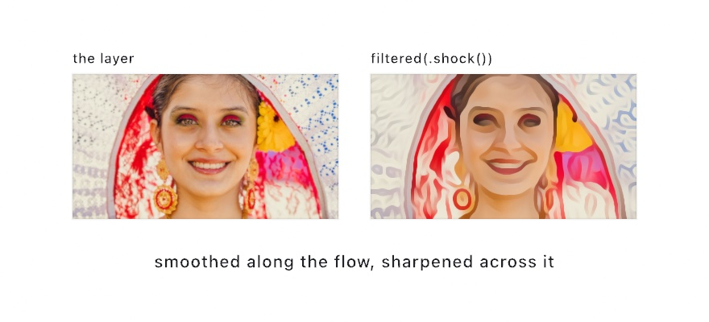
</picture>

```swift
drawImage(scene.filtered(.shock()).image, 0, 0)
```

Underneath are two moves, repeated. The first is the flow. At every pixel the filter works out the direction along which the picture changes least, from the same structure tensor `xdog` and `brushwork` read. It then averages the pixel with its neighbors along that direction only, walking a curve that follows the picture rather than a straight line. Grain smooths along the grain and an edge along the edge. Nothing is smoothed across.

The second move is the shock. Across that direction the filter reads whether the brightness is bending toward bright or toward dark. On the bright side of a soft edge, each pixel takes the brightest pixel within reach. On the dark side, it takes the darkest. The two sides march toward each other and meet at a step. That is what turns a soft shadow into a flat band with a crisp edge. It is also why the filter never invents a color: every pixel is either a blend along its own contour or a pixel the layer already had.

The dials: `iterations` is how many times the pair runs, and so the level of abstraction. One or two rounds clean a picture up, and ten make a poster. `flow` is how far along the flow each round smooths, in pixels, and the filter adapts it. A clear straight edge gets the whole reach, a flat or curved neighborhood a quarter of it. `radius` is how far across an edge the shock reaches, which sets the edge scale, and anything thinner than that is fattened to it. `smoothing` blurs the brightness the shock reads its sign from, so texture finer than it stops making edges. That is the dial to raise on a noisy or grainy picture, where the flow otherwise follows the noise into a maze. `threshold` is the bend under which nothing is sharpened, which keeps nearly flat regions quiet. Empty space on a transparent layer counts as paper, and the result keeps the layer's alpha. [`Examples/Effects/Coherence`](../Examples/Effects/Coherence/Sketch.swift) puts every dial on a parameter over fruit on a grained table under a moving lamp.

## Strokes that follow the picture: hatching

The fourth of these draws the picture as pen work. `.hatching()` lays strokes along the same flow, and lays down as many of them as the tone is dark, so the drawing keeps its light and shade with nothing but line.

<picture>
  <source media="(prefers-color-scheme: dark)" srcset="Images/20-PicturesRestyled/Hatched-dark.jpg">
  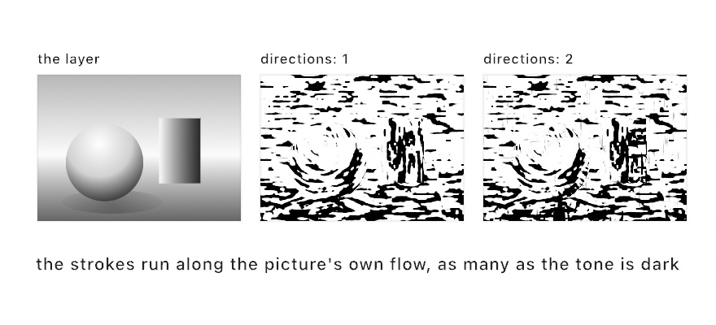
</picture>

```swift
drawImage(scene.filtered(.hatching()).image, 0, 0)
```

Look at where the marks go. They ring the sphere, because every ring of equal light on a sphere is a circle. They run down the pot, because its light changes across it and not along it. They lie flat on the wall and the table. Nothing told them to; the direction comes out of the picture, the way it does for `brushwork` and `shock`.

The tone is the other half. Under the strokes is a stroke texture made by combing noise along the flow, and the filter inks every mark darker than the pixel it sits under. Because that texture is even, the share of paper the ink covers comes out as the share the picture is dark. A quarter-dark tone gets a quarter of the page, and a picture with light and shade in it arrives with light and shade in the line work.

The dials: `spacing` is the distance between strokes, and so how fine the pen is. `length` is how far one runs before it ends, with a short length making a stipple of dashes and a long one a comb. `directions` is how many layers stack as the tone darkens. One hatches a single way, which turns the deepest tones into fat merged marks; two crosses the first at right angles once one direction has laid all it may, which is what a pen does when a tone goes past what one direction can hold; three lays a third between them. Ink and paper are yours: `background: .clear` leaves the page bare where the picture was empty, so a hatched shape drops onto whatever is under it. [`Examples/Effects/Hatching`](../Examples/Effects/Hatching/Sketch.swift) puts every dial on a parameter over an engraved landscape with the sun crossing it.

## A look from a colorist's suite

The color filters above are dials. A **look** is the other way to grade: a table that says, for every color, which color to show instead. Color tools trade them as `.cube` files. A colorist builds one in a grading suite and hands it over, a film stock's character ships as one, a camera maker publishes one for its footage. Ollin reads that file into a `ColorLUT`, and `.lut` applies it to a layer or to the whole frame.

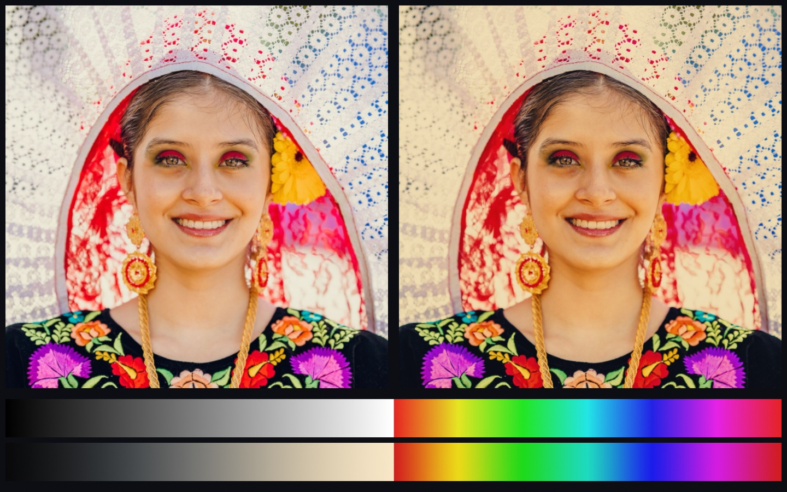

```swift
var look = ColorLUT.warmPrint                       // the bundled look, a warm print

override func setup() {
    look = try! ColorLUT(resource: "kodachrome", withExtension: "cube", in: .module)
}

override func draw() {
    drawImage(photo, 0, 0)
    postProcess(.lut(look, amount: 0.8))
}
```

Read the two strips before the portrait. The gray ramp says what the look does to tone: this one lifts black off the floor, holds white short of paper, and bends the middle into a gentle S. The sweep of hues says what it does to color: warm at the bright end, cool at the dark. Every look is those two things, and a ramp and a sweep through it tell you more than a portrait does.

A word on how the table is read, because it decides whether a neutral stays neutral. A `.cube` holds a color at every node of a lattice, and an input between nodes has to be interpolated from the corners of its cell. Ollin cuts the cell into six tetrahedra along its gray diagonal and weighs the four corners of the one that holds the point, the way a grading suite does. Every one of those tetrahedra has the cell's black and white corners, so a gray input meets only the two gray corners, and a look that leaves gray alone does so between its nodes too. The plain trilinear read of a texture sampler would mix the colored corners in and tint a neutral.

Two more things are worth knowing. A file that is not a `.cube` is refused with the line that stopped it, so a bad download says where. And the table runs the other way as well: `ColorLUT(size:title:_:)` builds a cube from a function of color, and `write(to:)` saves it as a `.cube` that any grading tool reads, so a look you tune in a sketch can travel out. [`Examples/Color/Look`](../Examples/Color/Look/Sketch.swift) wipes the bundled look across a portrait, beside one written in code, and takes any `.cube` dropped on the window.

## A film look: halation and grain

A look grades the color. Two more filters give a frame the *texture* of film, the two things a stock does to a picture that a sensor does not.

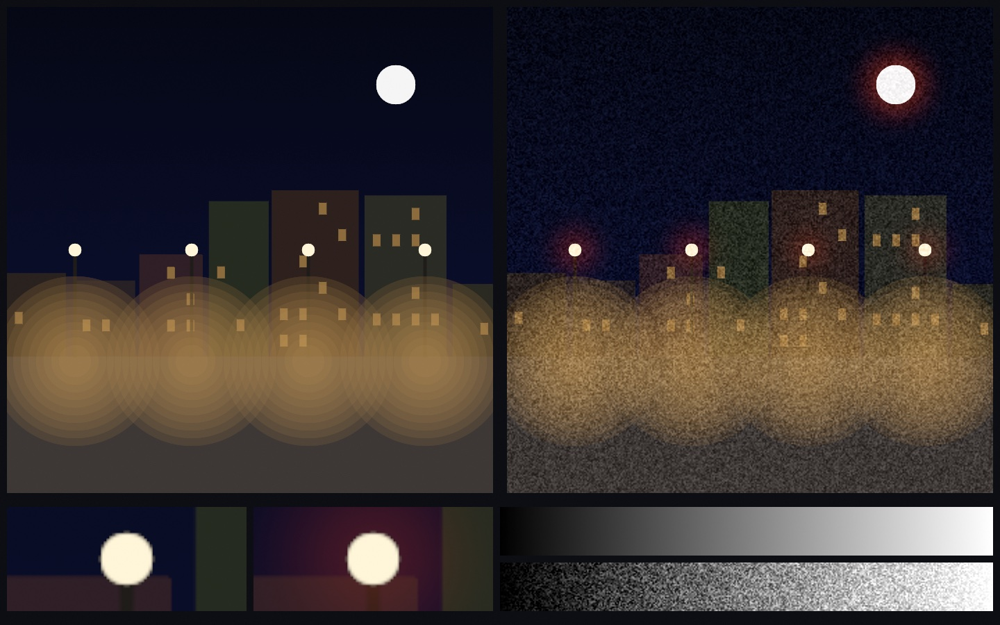

The first is **halation**, the warm fringe film wears around its brightest highlights. Light that gets through the emulsion reflects off the base and exposes the layers again around the point it entered. The red-sensitive layer sits deepest, so it takes most of that second exposure, and the fringe comes out orange. `.halation(threshold:radius:tint:amount:)` builds it the way `.bloom` builds a glow. The pixels above `threshold` are blurred by `radius`, colored by `tint`, and added back. The difference is where the halo lands. Scattered light changes nothing in a layer that is already fully exposed, so each channel takes the halo in proportion to how far it sits below white. A white lamp keeps its white core and wears a ring, where a glow would have tinted the core too. Under the pictures, the same lamp is magnified four times, plain and halated, so you can see the core hold. A frame with nothing above the threshold comes back untouched, byte for byte.

The second is **film grain**. A developed frame is a scatter of grains, each one developed or not, and that is what makes its noise follow the tone. Where nothing developed there is nothing to vary, and where every grain did there is nothing either. The grain lives in the middle, and its spread goes as the square root of the tone times what is left to white. `.filmGrain(amount:size:seed:)` applies that law to each channel on the displayed picture. `amount` is the spread at mid-gray as a fraction of the way to white, so 0.05 is about twelve levels of a display byte. `size` is how many pixels across a clump is, and a coarser grain is not a fainter one. The mean of any flat region is kept, so grain never lifts or darkens a picture. The ramp along the bottom shows the law: nothing at the black end, nothing at white, the most in the middle. Feed `seed` your `frameCount` and every frame gets the fresh grain a film has. The older `.grain` is plain per-pixel noise, the same at every tone, and it is still the right call for a static or a signal look.

```swift
override func draw() {
    background(.black)
    fill(.white)
    drawCircle(width / 2, height / 2, 40)
    postProcess(.halation(threshold: 0.8, radius: 24))
    postProcess(.filmGrain(amount: 0.06, size: 2, seed: Double(frameCount)))
}
```

[`Examples/Effects/FilmLook`](../Examples/Effects/FilmLook/Sketch.swift) draws a night street of lamps through both, with every dial a parameter and a switch that shows the raw frame on the left half.

## Filters that read the layer as something else

Most filters treat your layer as a picture and adjust it. A few instead treat the same pixels as *information about something else*. Those repay meeting individually, because what you feed them matters more than the parameters.

<picture>
  <source media="(prefers-color-scheme: dark)" srcset="Images/20-PicturesRestyled/SpecialFilters-dark.jpg">
  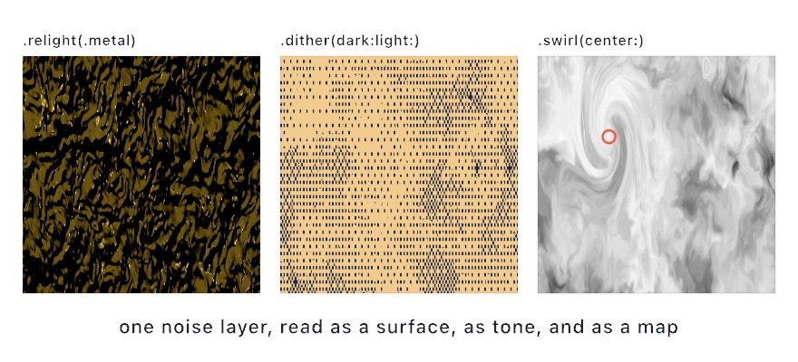
</picture>

```swift
layer.filtered(.relight(.metal, angle: -.pi * 0.7, elevation: 0.55))
layer.filtered(.dither(dark: navy, light: sand, pixelSize: 3))
layer.filtered(.swirl(angle: 4.2, radius: 0.42, center: Vector2(0.3, 0.34)))
```

**`.relight` reads brightness as height.** It treats a bright pixel as a high point and a dark one as a low point. It then works out which way the resulting surface faces and lights it from an angle you choose. Hand it a photograph and you get an odd embossed thing. Hand it a noise field, as the first panel does, and you get hammered metal. Noise makes a plausible bumpy surface. Five finishes change how the material responds, from `.matte` through `.metal` and `.glass` to `.sand` and `.liquid`. [Chapter 23](23-GridSimulations.md)'s ripple pool uses it to turn a height field into water.

**`.dither(dark:light:)` reads brightness as tone.** It screens the layer into exactly two colors of your choosing. Each pixel comes from a repeating pattern, the way [Chapter 2](02-Color.md)'s ordered dither did. Gradients survive as texture rather than collapsing into two flat regions. `pixelSize` makes the grain coarser, which is how you get the look of cheap newsprint or an early screen in any two colors you like.

**The warp filters read a center.** `.swirl`, `.bulge`, `.ripple`, and their relatives all distort around the middle of the layer by default. Each takes a `center` given in `0...1` layer coordinates. That one argument is what turns a symmetric effect into a composition, and feeding it `uv(of: mouse)` puts the distortion under the pointer. The marked circle in the third panel is the center that swirl was given.

The [effects reference](../Docs/Drawing/Effects.md#filter) has the full catalog with every parameter, and the `Effects/Relight` example shows all five finishes side by side.

## A picture inside itself

One warp deserves a section of its own, because it does something none of the others do. It makes the picture contain itself.

<picture>
  <source media="(prefers-color-scheme: dark)" srcset="Images/20-PicturesRestyled/PictureInsideItself-dark.jpg">
  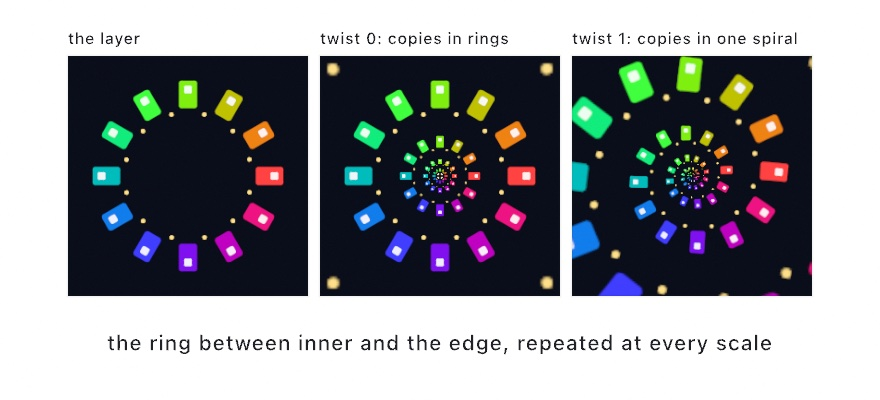
</picture>

```swift
layer.filtered(.droste(inner: 0.42, twist: 1, zoom: time * 0.2))
```

The idea is easier than the picture looks. Take the ring between `inner` and the edge of the layer, and imagine straightening it into a strip, the way you would cut a rubber band and pull it flat. A strip can be repeated end to end forever. Curl the repeated strip back into a ring and each copy comes out smaller than the last. That is a picture with a smaller copy of itself in the middle, and a smaller copy in the middle of that one.

`inner` is the radius of the hole, and it is also how much smaller each copy is than the one around it. `twist` is the part Escher used. At 0 the copies sit in plain concentric rings. At 1, going once around the middle also steps you one copy down in size. The rings wind into a single spiral, and there is no longer any place where one copy ends and the next starts.

`zoom` slides the picture into itself, counted in copies. Add exactly 1 and you are back where you began, which makes this the rare animation that loops with nothing to hide. `zoom: time * 0.2` falls forever and repeats every five seconds.

One thing to design for. The filter reads a ring, and the outer edge of that ring has to meet the inner edge of the next copy along. If your content runs to both edges, the join shows up as a hard circle. Keep the content clear of both, or let the ring end on flat color at each end. The layer in the figure does the second thing: plain dark ground inside and outside, windows only in between.

## One filter, five pictures: chromatic aberration

Most filters have a strength parameter. Chromatic aberration has a strength parameter and a **mode**, and the modes are not one look at five strengths. They are five different pictures.

The idea underneath is always the same. Pull the color channels apart a little, so a white edge grows a colored rim. What the mode decides is *where* they get pulled.

<picture>
  <source media="(prefers-color-scheme: dark)" srcset="Images/20-PicturesRestyled/Dispersion-dark.jpg">
  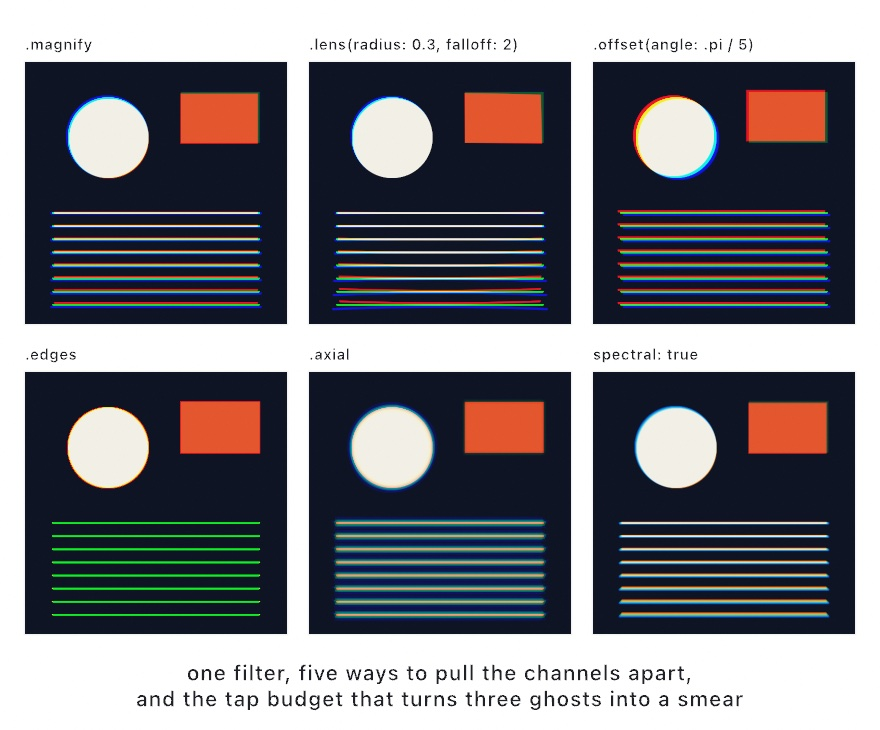
</picture>

```swift
layer.filtered(.chromaticAberration(amount: 0.018))                        // the default
layer.filtered(.chromaticAberration(amount: 0.05, mode: .lens(radius: 0.3, falloff: 2)))
layer.filtered(.chromaticAberration(amount: 0.012, mode: .offset(angle: .pi / 5)))
layer.filtered(.chromaticAberration(amount: 0.03, mode: .edges))
layer.filtered(.chromaticAberration(amount: 0.022, mode: .axial))
layer.filtered(.chromaticAberration(amount: 0.018, spectral: true))
```

**`.magnify` is the default, and it scales each channel about the middle of the frame.** The middle does not split at all, and the split grows the further out you go. Straight lines stay straight. This is the honest form of what a lens does, and it is the one to reach for first.

**`.lens(radius:falloff:)` shapes that growth.** `radius` says how far out the fringe starts to show, and `falloff` says how fast it grows past there. About 2 reads like glass. In the second panel nothing happens near the middle at all, and the bottom of the frame comes apart.

**`.offset(angle:)` moves every pixel by the same vector.** The middle splits as much as the corner, which no lens on earth does. That is the point: this is a plate printed a hair off, an anaglyph, a scan that slipped.

**`.edges` puts the fringe only where there is an edge.** It slides along the local brightness gradient and scales by how strong that gradient is, so flat areas keep their exact color. Real fringing is only visible at high-contrast edges. Putting it there and nowhere else is what stops it reading as a filter laid over the picture. The thin lines go green because a three-pixel line is all edge. Red slides off one side, blue off the other, and green is what stays.

**`.axial` changes focus instead of position.** One end of the spectrum stays sharp while the other softens, which is most of the look of a fast lens wide open. A positive amount keeps red sharp, and a negative one keeps blue sharp. That sign is the difference between a highlight going green and going magenta, so try both.

Two more things to know. Every mode hands the layer straight back at `amount: 0`, so an A/B costs nothing and the parameter never lies to you. And `spectral: true` takes the split over a whole set of wavelengths instead of three. That is the difference between the last panel and the first: three hard ghosts become one continuous smear. It costs more taps, and `quality:` sets how many.

There is a two-layer version too. `.dispersed(by:)` in a `compose` block, or `Combine.disperse` on its own, scales the amount by a second layer's brightness. Draw white where you want the color to come apart and black everywhere else, and the fringe lands only there.


## The design filters

The design filters are built to look like the finished graphics on a product page rather than like test patterns, and they split into two rows that work in opposite directions:

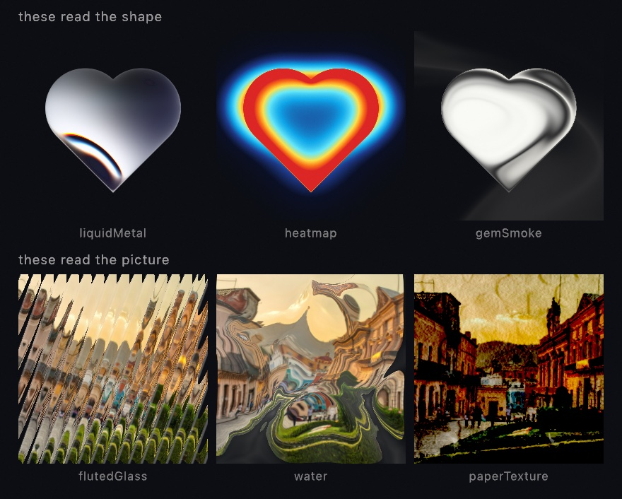

The bottom row is what you'd expect from a filter. Hand it a picture, a bundled photograph of a hillside town in these three tiles, and get the picture back changed. `.flutedGlass` puts ribbed glass in front of it, `.water` refracts it through ripples, `.paperTexture` lays it onto a sheet with tooth and creases.

The top row works the other way, and this is the part that isn't obvious from the names. `.liquidMetal`, `.heatmap`, and `.gemSmoke` mostly ignore your layer's colors and read its **alpha**, the silhouette. All three tiles above started as one white heart on a transparent layer, and each filter built a whole material out of that outline. So the working method for these is simple. Draw a shape into a layer, then filter the layer.

```swift
let shape = makeRenderTarget()
withTarget(shape) {
    noStroke(); fill(.white)
    drawHeart(width / 2, height / 2, width * 0.5)
}
drawImage(shape.filtered(.liquidMetal(phase: time)).image, 0, 0)
```

Any silhouette works, which is the interesting part. It can be text from [Chapter 8](08-Words.md), a shape you built in [Chapter 15](15-ShapesAsMaterial.md), or a tracked hand from [Chapter 32](32-Seeing.md). The filter never knows or cares where the outline came from.

One practical warning, since it cost the figure above a few attempts. These filters are tuned for **full-canvas** use. On a small layer the defaults can look like almost nothing. Push them hard and the distortion reaches past the layer's edge, and drags the transparent surround in as dark smears. The `edges` parameter on the distorting ones controls how close to the border they're allowed to work. A continuous field takes a strong refraction more gracefully than a pattern of separate marks does.

The design families of `Effects/GeneratorCatalog` and `Effects/FilterCatalog` tour both sets in full.

## melt: the picture poured

One of the design filters deserves singling out, because it does something the others don't. `.melt` liquifies a layer by its own brightness.

<picture>
  <source media="(prefers-color-scheme: dark)" srcset="Images/20-PicturesRestyled/Melt-dark.jpg">
  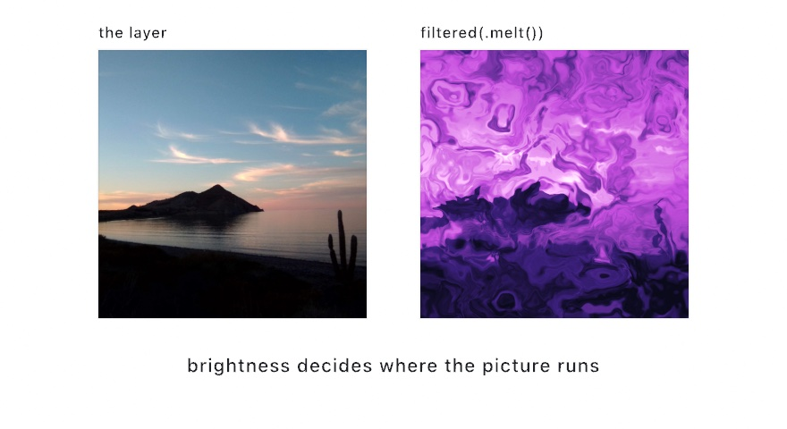
</picture>

```swift
drawImage(scene.filtered(.melt(phase: time)).image, 0, 0)
```

Underneath, the filter builds a swirling noise field and uses one displacement vector for two jobs at once. That vector warps the field's own coordinates, and it also shifts where the filter reads your layer. Because the same vector does both, the picture and the swirl move together instead of one sliding over the other. The result reads as the image having been *dyed* rather than just smeared. The layer's brightness mixes back into the field before it goes through a color ramp, so bright regions stay bright and structural. The lit sky in the figure comes through the pour as the pale half of the picture, with the dark shore still holding the bottom.

It is a strong effect at its defaults, and `liquify`, `warp`, and `blend` dial back how far it takes the picture. The sway that animates it uses frequencies that don't divide evenly into each other, so it never perfectly repeats. It drifts forever, but it won't give you a seamless loop.

## Putting it together: the hand-colored print

The hand-colored print turns a photograph into the kind of picture a print shop once sold, an engraving tinted by hand. It is a stack of this chapter's filters. `brushwork` paints the color and `hatching` draws the line work over it. Then a look grades the frame warm, film grain gives it a texture, and `paperTexture` from the design filters presses it into a sheet. Make `MySketches/HandColored.swift`:

```swift
import Ollin
import OllinSamplePhotos

final class HandColored: Sketch {
    var photo = Image(width: 1, height: 1)
    var scene: RenderTarget?

    override func setup() {
        photo = SamplePhoto.city.load()
        scene = makeRenderTarget()
    }

    override func draw() {
        guard let scene else { return }

        // The view drifts across the photograph, which is drawn a little wider
        // than the canvas so the drift never shows an edge.
        let drift = Vector2(sin(time * 0.07) * 40, cos(time * 0.05) * 20)
        withTarget(scene) {
            drawImage(photo, in: Rectangle(center: center + drift, width: width * 1.1,
                                           height: height * 1.1), fit: .cover)
        }

        // The color, painted: detail flattened into patches along the picture.
        drawImage(scene.filtered(.brushwork(radius: 7)).image, 0, 0)

        // The line work, multiplied over the color, so its white paper drops out.
        blendMode(.multiply)
        drawImage(scene.filtered(.hatching(spacing: 4, length: 20,
                                           foreground: Color(hex: 0x3B2A20))).image, 0, 0)
        blendMode(.normal)

        // The finish: a warm grade, the grain of film, and the sheet it is printed on.
        postProcess(.lut(.warmPrint, amount: 0.85))
        postProcess(.filmGrain(amount: 0.04, size: 2, seed: Double(frameCount)))
        postProcess(.paperTexture(folds: 0.4))
    }
}
```

The photograph is one of the bundled sample photographs from [Chapter 9](09-Pictures.md), a hillside town under a warm sky. `loadImage("/path/to/yours.jpg")` in its place is the whole change for a picture of your own.

One layer feeds everything. The photograph is drawn into `scene` once a frame, and both the color and the line are read from it. `brushwork` flattens the detail into patches that follow the picture's own contours, so the color stays inside the shapes rather than running across them. `hatching` reads the same picture and lays as many strokes as each tone is dark.

The line work goes down under `.multiply`, the blend mode from [Chapter 19](19-LayersAndEffects.md). Multiplying by white changes nothing, so the paper between the strokes drops out and only the brown ink darkens the color under it.

The rest runs on the whole frame through `postProcess`, and each call works on what the calls before it left. The look grades first, and the grain lands on the graded color. The paper comes last, since the sheet is the last thing a print meets.

The frame moves because the view does. `drift` slides the photograph a little each second, and both filters read it afresh every frame. So the strokes re-flow as the picture passes under them, and the grain changes with `frameCount`. The paper holds still, since its texture is static by design.

Then make it yours:

- Trade the colorist for a poster printer. `.shock(iterations: 6)` in place of `brushwork` flattens the color into bands with crisp edges.
- Ink it instead of hatching it. `.xdog()` in place of `hatching` gives pen lines and solid shadows, and they multiply over the color the same way.
- Grade it with a look of your own. `ColorLUT(resource:withExtension:in:)` loads any `.cube` file, and the grade is the only line that changes.

A print is a still, so keep it as one. `swift run OllinLive MySketches/HandColored.swift --export print.png --frame 600` writes the frame ten seconds in. The grain is new on every frame, so try a few frame numbers and keep the one you like.

## Where this comes from

The picture inside itself is named after a Dutch cocoa tin from 1904. Its label showed a nurse holding a tray with the same tin on it. Escher took the idea somewhere stranger in *Print Gallery* (1956), where a man in a gallery looks at a picture that contains the gallery. He left a hole in the middle, which he signed rather than finished. Hendrik Lenstra and Bart de Smit worked out in 2003 what belonged in the hole. The straighten-repeat-curl construction the filter runs is theirs.

The stylizing filters each rebuild a published method. The ink line is the extended difference of Gaussians of Holger Winnemöller, Jan Eric Kyprianidis, and Sven C. Olsen, from 2012. The brushwork is the anisotropic Kuwahara filter of Jan Eric Kyprianidis, Henry Kang, and Jürgen Döllner, from 2009. The flat regions are Kyprianidis and Kang's coherence-enhancing filter, from 2011. The hatching walks its strokes by Brian Cabral and Leith Casey Leedom's line integral convolution, from 1993. The film grain is the stochastic model of Alasdair Newson, Julie Delon, and Bruno Galerne, from 2017. Halation is written from the photographic physics of light reflected back through the emulsion.

A look is read from Adobe's Cube LUT format. The tetrahedral read between its nodes goes back to a 1981 patent by Sakamoto and Itooka. The design filters were cross-read against Paper Shaders, the design-shader library from paper.design with shaders by Ksenia Kondrashova. Each was then written from its underlying technique. The paper texture, for one, is Jim Blinn's bump lighting over a height field of noise. The melt is Inigo Quilez's domain warping, with the picture read through the same warp as the swirl. Full credits are in the project's [attribution notes](../ATTRIBUTION.md).

## Go deeper

- [Layered effects](../Docs/Drawing/Effects.md#filter): the whole filter catalog with every parameter, the stylizing, look, film, warp and design filters among it.
- [Looks](../Docs/Drawing/Looks.md): the `.cube` format in both forms, the reader's refusals, the tetrahedral read, and writing a look of your own.
- [Sample photographs](../Docs/Drawing/SamplePhotos.md): the bundled pictures the chapter's figures and its print start from, and what each one is good for.
- Worked examples: [`Examples/Effects/InkDrawing`](../Examples/Effects/InkDrawing/Sketch.swift) (a still life as pen and ink), [`Examples/Effects/Brushwork`](../Examples/Effects/Brushwork/Sketch.swift) (a hillside painted as brushwork, every dial on a parameter), [`Examples/Effects/Coherence`](../Examples/Effects/Coherence/Sketch.swift) (fruit on a grained table flattened into regions by the shock filter), [`Examples/Effects/Hatching`](../Examples/Effects/Hatching/Sketch.swift) (an engraved landscape with the sun crossing it), [`Examples/Color/Look`](../Examples/Color/Look/Sketch.swift) (a look from a `.cube` file wiped across a portrait), [`Examples/Effects/FilmLook`](../Examples/Effects/FilmLook/Sketch.swift) (a night street through halation and grain), [`Examples/Effects/Relight`](../Examples/Effects/Relight/Sketch.swift), [`Examples/Effects/Droste`](../Examples/Effects/Droste/Sketch.swift), and [`Examples/Effects/FilterCatalog`](../Examples/Effects/FilterCatalog/Sketch.swift).

---

[Contents](README.md#contents) · Previous: [Chapter 19, Layers and effects](19-LayersAndEffects.md) · Next: [Chapter 21, Pictures you solve](21-PicturesYouSolve.md)
