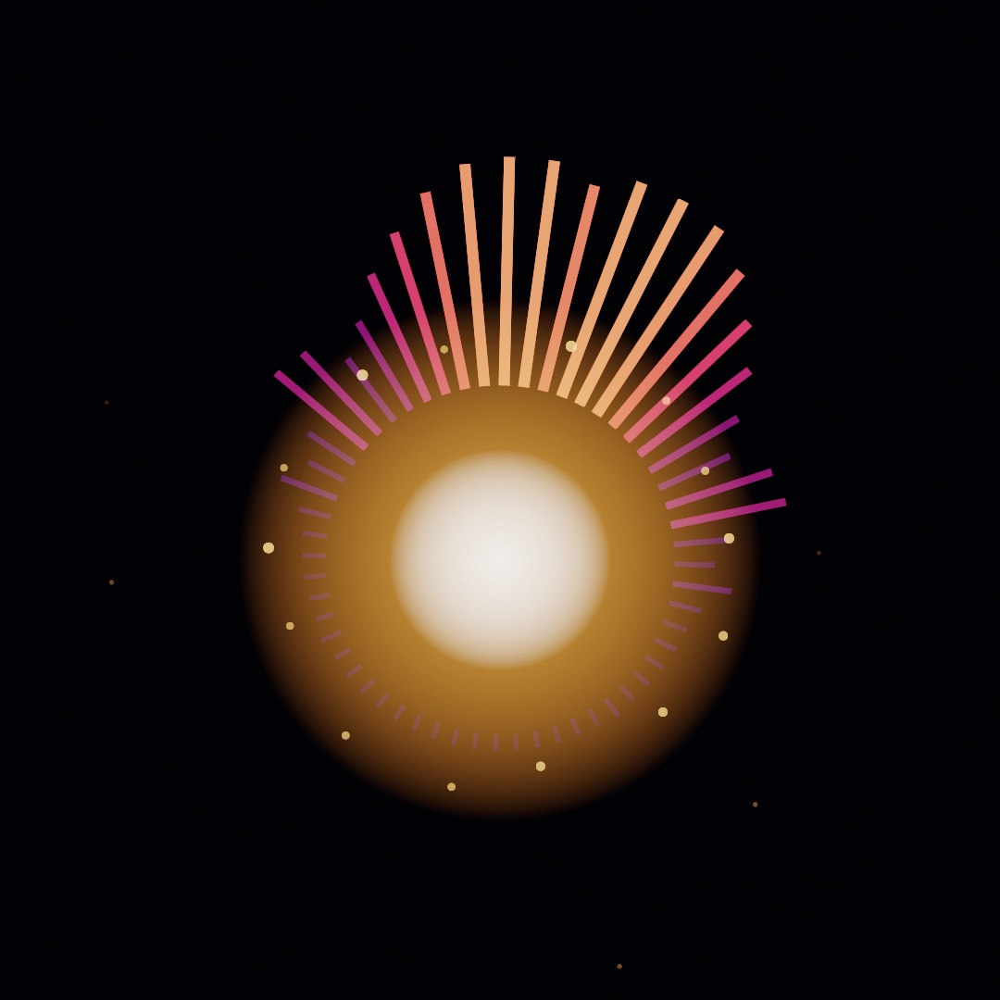
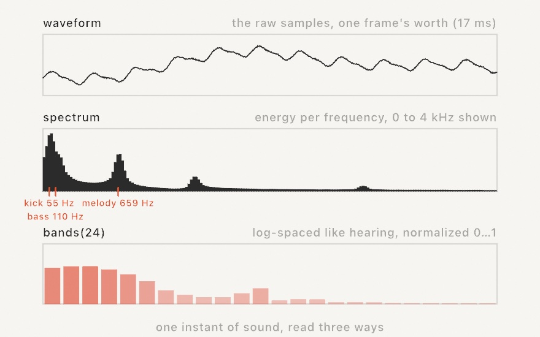
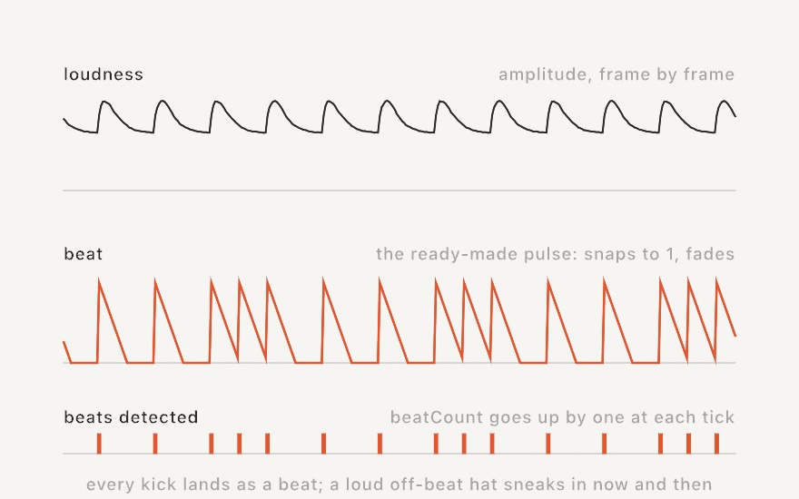
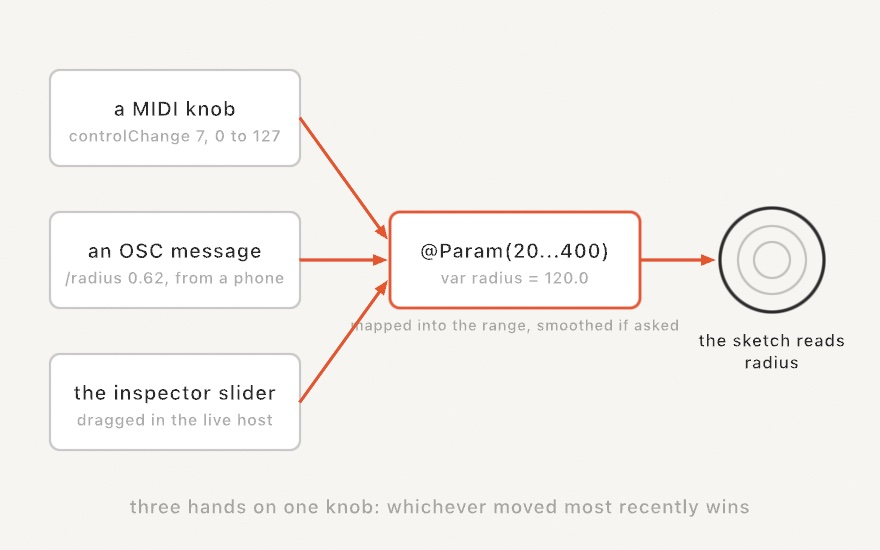

#### <sup>[Ollin](../README.md) → [Guide](README.md) → Chapter 20</sup>

---

# 20. Sound and control



Every sketch so far has listened to two things: the clock and the mouse. This chapter adds ears and hands. Ears first: a microphone or a song becomes a handful of numbers you read in `draw()`, so the picture moves with the music. Then hands: a hardware knob, a phone fader, or the inspector slider drives the same parameters, so a running sketch becomes something you play. The piece above is doing both at once, and by the end you'll have built it.

## The first listening sketch

Sound reaches a sketch through `OllinAudio`, a small library you import alongside the framework. The simplest start is the microphone and one number, `amplitude`: how loud things are right now, roughly `0...1`, smoothed so it doesn't flicker.

```swift
import Ollin
import OllinAudio

final class Pulse: Sketch {
    let mic = AudioInput()

    override func setup() { try? mic.start() }

    override func draw() {
        background(.black)
        fill(.white)
        drawCircle(width / 2, height / 2, (60 + Double(mic.amplitude) * 700) * scale)
    }
}
```

Run it with `swift run OllinLive` like any sketch, say yes when macOS asks about the microphone (it asks once), and hum. The circle breathes with you. That's the whole shape of audio-reactive work: make a source in `setup()`, keep it in a property, read its values every frame. The rest of the chapter is just richer values to read.

> **Swift note.** `amplitude` is a `Float`, because audio hardware speaks 32-bit floats. Drawing wants `Double`, so you'll see `Double(mic.amplitude)` around every audio read. It's a conversion, not a calculation; nothing is lost that your eyes could see.

## A microphone we can print

A guide has a problem a live sketch doesn't: every figure in these pages must render the same way on any machine, and no two rooms sound alike. Chapter 19 solved this with a pretend depth camera; this chapter fakes a microphone. `StageMic`, about thirty lines at the bottom of the committed figure [`Anatomy.swift`](Figures/20-SoundAndControl/Anatomy.swift), synthesizes a little band (a kick drum every half second, a hat between the kicks, a held bass note, a slow four-note arpeggio, a whisper of hiss) and feeds the samples into a real `AudioAnalyzer`, the same analysis engine behind `AudioInput`. Every audio number in this chapter comes out of that analyzer, exactly as it would from the air; only the air is missing. Swap `StageMic` for `AudioInput()` in any figure and it listens to your room instead.

The analyzer is worth meeting directly, because it's also the seam for sounds Ollin hasn't heard of: it's public, and anything that can produce a stream of samples can feed one.

## What the analyzer hears

Sound arrives as **samples**: measurements of air pressure, 44,100 of them per second. A microphone hands the analyzer that stream, and the analyzer answers three questions about the most recent instant.



The top panel is the **waveform**, the samples themselves: one big slow swell (the kick's low thump mid-decay) with fast wiggles riding on it (the melody). It's the honest raw material, and mostly you'll draw it only when you want an oscilloscope look.

The middle panel is the **spectrum**, and it's the reason audio-reactive visuals work at all. Sound is vibration, and pitch is how fast the vibration is: a low note shakes the air few times a second (measured in hertz, cycles per second), a high note many. The spectrum splits the instant into how much energy sits at each speed, like a prism splitting light into colors. Suddenly the mix is legible: the kick's 55 Hz thump, the bass note at 110 Hz, the melody near 659 Hz, each its own spike you can watch independently. The tool that computes this split is the Fourier transform; the analyzer runs it for you every frame, and `spectrum` is the result, an array of magnitudes from low frequencies to high.

Raw spectra are awkward to draw, though: the values are unnormalized, and the interesting musical action crowds into the first few bins because hearing is logarithmic (every doubling of frequency sounds like one equal step, which is what an octave is). So the bottom panel is the read you'll actually use, **`bands(_:)`**:

```swift
for (i, level) in source.bands(24).enumerated() {
    let h = Double(level) * 300 * scale           // level is already 0...1
    drawRect(Double(i) * 34 * scale, height - h, 30 * scale, h)
}
```

`bands(24)` gives 24 bars spread the way hearing is (log-spaced, so the bass isn't crammed into one bar), each normalized to roughly `0...1` by a gain that adapts to the material, each rising fast and falling gently so bars look alive instead of jittery. A bar's height becomes a plain map to pixels, no hand-tuned scaling. Ask once per frame, with a fixed count.

Between the raw spectrum and the shaped bands sit three named conveniences, `bass`, `mid`, and `treble` (energy in the low, middle, and high ranges), and `magnitude(in: 40...120)` for a range you pick yourself. Those are unnormalized like the spectrum, so scale them to taste.

## Hearing the beat

Loudness and spectrum answer "how much"; the other thing music has is **arrivals**. A drum hit is a moment, not a level, and a visual that flashes on the drum reads as listening in a way a level meter never does.



The detector behind this compares each instant's spectrum with the one just before and adds up the rises. A sudden brightening across many frequencies at once (a drum hit, a plucked string, a note starting) spikes that sum, and the analyzer counts it as a beat. Three reads surface it:

```swift
source.beat            // a 0...1 pulse: snaps to 1 on each beat, fades over ~0.25 s
source.beatCount       // how many beats so far
source.timeSinceBeat   // seconds since the last one
```

`beat` is the ready-made value: multiply a radius by it and the picture throbs. `beatCount` is for firing something exactly once per beat, by comparing against a stored count, the way the payoff spawns sparks. And when the detector is too eager or too deaf for your material, `beatSensitivity` is the knob: higher fires on fewer, stronger arrivals. The timeline above runs at sensitivity 3, and it's honest about what detection is: every kick lands, and a loud off-beat hat sneaks in now and then. Onset detection hears *arrivals*, not "the beat" a drummer would tap; for most visuals that's exactly what you want, and for the rest, tune the sensitivity until the piece feels right.

## Four places sound comes from

Everything above reads the same off any source, so choosing a source is one line:

```swift
let mic = AudioInput()                                         // the room
let song = try AudioPlayer(resource: "track", withExtension: "m4a", in: .module)
let tone = Tone(frequency: 220, waveform: .sine)               // a note of your own
let sound = Soundtrack(of: player)                             // a playing video's audio
```

`AudioInput` is the microphone, permission and all. `AudioPlayer` plays a file (`.m4a`, `.mp3`, `.wav`, and friends) and analyzes it as it sounds; the `Audio/FilePlayer` example ships with a violin recording and shows the shape. `Tone` is a modest oscillator that both sounds and feeds the analyzer, which makes it the self-contained option: the `Audio/Spectrum` example generates a gliding sawtooth and draws its own harmonics, no permission, no file. And `Soundtrack` taps the audio of a playing `VideoPlayer` from Chapter 21's territory, so footage can drive visuals with its own music. One habit applies to all four: an audio file you bundle follows the same license care as any asset, so credit what you ship.

## Knobs from anywhere

Now the hands. Since Chapter 1 you've tuned sketches with `@Param` knobs in the inspector; the news here is that the inspector is only one of the hands that can hold those knobs.

**MIDI** is the protocol music hardware has spoken since 1983: knob boxes, fader banks, pad grids, keyboards. A controller sends small messages (a knob is a *control change* carrying a number `0...127`; a pad is a *note* with a velocity), and `OllinMIDI` reads them:

```swift
import OllinMIDI

let midi = MIDIInput()
override func setup() { try? midi.start() }
override func draw() {
    let level = midi.controlValue(7, default: 0)          // a knob, 0...127
    if midi.isNoteOn(60) { flash() }                      // a held pad
    for message in midi.messages() where message.isNoteOn {
        spawn(message.note ?? 0)                           // each strike, once
    }
}
```

`start()` connects to every device on the system, including ones plugged in later. Which control sends what is the controller's business, so the first thing to do with new hardware is run the `Integration/MIDIMonitor` example and touch everything: it draws each message as it arrives, and your controller introduces itself.

**OSC** is the networked cousin, the protocol of TouchOSC, Max/MSP, TouchDesigner, and most of the performance world. Messages are named by slash-paths and travel over the network, which means the fader can be a phone on the same Wi-Fi:

```swift
import OllinOSC

let osc = OSCReceiver(port: 8000)
override func setup() { try? osc.start() }
override func draw() {
    let level = osc.float("/fader1", default: 0)          // usually 0...1
}
```

Point TouchOSC (or anything that speaks OSC) at your Mac's IP and port 8000, and its controls land in the sketch. There's an `OSCSender` for the other direction, so a sketch can drive a mixer or a lighting desk too. And you can rehearse all of it with no hardware at all: the `Integration/MIDILoopback` and `Integration/OSCLoopback` examples send to themselves, so the round-trip is visible on any bare Mac.

## One knob, three hands

Reading `controlValue` every frame works, but there's a nicer arrangement. A `@Param` already is a named, ranged value with a control in the inspector. Binding wires an outside source straight onto it:

```swift
@Param(20...400) var radius = 120.0

override func setup() {
    try? midi.start(); try? osc.start()
    midi.bind(controlChange: 7, to: $radius)   // hardware knob, 0...127 → 20...400
    osc.bind("/radius", to: $radius)           // phone fader, 0...1 → 20...400
}
```



Each incoming value is mapped into the parameter's own range and assigned; the sketch keeps reading plain `radius` and never knows who moved it. The inspector slider, the hardware, the phone, and plain assignment in code all stay live at once, and whichever moved most recently wins. One more line makes hardware feel good: give the parameter a `smoothing:` (`.eased(0.3)` for a fixed glide, `.smoothed` for the adaptive filter that stays steady at rest and opens up under a moving hand), and every source glides instead of stepping, because the softening belongs to the knob, not to the wire.

## The payoff: a playable instrument

The payoff wires the whole chapter into one piece: `bands` worn as a crown of spokes, a core that throbs on `beatCount`, sparks flung on each arrival, and two `@Param` knobs waiting for whatever hands you have. Make `MySketches/Resonator.swift` (bring `StageMic` along from [`Anatomy.swift`](Figures/20-SoundAndControl/Anatomy.swift); the committed figure with everything together is [`Resonator.swift`](Figures/20-SoundAndControl/Resonator.swift)):

```swift
import Ollin
import OllinAudio

final class Resonator: Sketch {
    let mic = StageMic()

    @Param(24...96) var spokes = 56
    @Param(0.6...2.4) var brightness = 1.4

    struct Spark {
        var position: Vector2
        var velocity: Vector2
        var life: Double
    }

    var sparks: [Spark] = []
    var lastBeat = 0
    var pulse = 0.0

    /// Where the instrument sits: a touch below center, to leave the crown room.
    var mid: Vector2 { center + Vector2(0, 60 * scale) }

    override func setup() {
        seed(20)                              // the sparks re-fly the same way
        mic.analyzer.beatSensitivity = 3      // fire on the kick, not every ripple
    }

    override func draw() {
        mic.listen()
        let audio = mic.analyzer

        background(Color(hex: 0x06040E))
        toneMap(.aces)
        blendMode(.add)

        // The beat: snap the pulse up when a new one lands, let it fade.
        pulse *= exp(-deltaTime * 5)
        if audio.beatCount > lastBeat {
            lastBeat = audio.beatCount
            pulse = 1
            spawnSparks()
        }

        // The spectrum, worn as a ring of spokes: bass at the top, treble at
        // the bottom, mirrored left and right so the ring stays symmetric.
        let levels = audio.bands(spokes / 2 + 1)
        withState {
            translate(mid)
            rotate(time * 0.06)
            for i in 0 ..< spokes {
                let band = i <= spokes / 2 ? i : spokes - i
                let level = Double(levels[band])
                let angle = Double(i) / Double(spokes) * .tau - .pi / 2
                let dir = Vector2(cos(angle), sin(angle))
                let inner = 175 * scale
                let len = (14 + level * 290) * scale
                fill(Colormap.magma.color(at: 0.2 + level * 0.75)
                    .withAlpha(0.25 + level * 0.75 * brightness))
                drawOrientedBox(dir * inner, dir * (inner + len),
                                thickness: (3.5 + level * 9) * scale)
            }
        }

        // Sparks from past beats, flying and fading.
        for i in sparks.indices {
            sparks[i].position += sparks[i].velocity * deltaTime
            sparks[i].life -= deltaTime
        }
        sparks.removeAll { $0.life <= 0 }
        noStroke()
        for spark in sparks {
            let a = max(0, spark.life / 0.8)
            fill(Color(hue: 0.09, saturation: 0.5, brightness: 1).withAlpha(a * 0.9))
            drawCircle(spark.position.x, spark.position.y, (1.5 + a * 5) * scale)
        }

        // The core: a warm glow that swells on the beat, a hot center.
        let ember = Color(hex: 0xFFB65C)
        let glowRadius = (185 + pulse * 150) * scale
        fill(.radial(center: mid, radius: glowRadius,
                     Ramp([ember.withAlpha(0.3 + pulse * 0.5), ember.withAlpha(0)])))
        drawCircle(center: mid, radius: glowRadius)
        let coreRadius = (80 + pulse * 60) * scale
        fill(.radial(center: mid, radius: coreRadius,
                     Ramp([Color.white.withAlpha(0.95), Color.white.withAlpha(0)])))
        drawCircle(center: mid, radius: coreRadius)

        blendMode(.normal)
    }

    func spawnSparks() {
        for i in 0 ..< 14 {
            let angle = Double(i) / 14 * .tau + random(-0.15, 0.15)
            let speed = random(200, 380) * scale
            let dir = Vector2(cos(angle), sin(angle))
            sparks.append(Spark(position: mid + dir * 180 * scale,
                                velocity: dir * speed,
                                life: random(0.45, 0.8)))
        }
    }
}
```


The additive blend and the ACES tone map from Chapter 14 are what make the glow feel like light instead of paint; the mirrored bands are an old trick that keeps a spectrum symmetric and calm. Watch it run and the crown breathes with the arpeggio while the core keeps time.

Then make it yours:

- Give it your ears: swap `StageMic` for `AudioInput()`, start it in `setup()`, and delete the `mic.listen()` line (a live source feeds itself). Then play music at your Mac.
- Give it your hands: `midi.bind(controlChange: 7, to: $brightness)`, or bind `/brightness` over OSC and play it from a phone on the sofa.
- Give it your music: an `AudioPlayer` with a favorite track, and `beatSensitivity` tuned until the sparks land on the drums.
- Rebuild the crown: the spokes are just `bands` and trigonometry, so try concentric rings, a horizon of bars, or Chapter 12's flow field with its strength driven by `bass`.

## Where this comes from

The idea that any sound splits into pure vibrations is Joseph Fourier's (1822); the fast algorithm that made it real-time, the FFT, is Cooley and Tukey's (1965), and Ollin runs Apple's implementation. Detecting arrivals by spectral flux is a standard technique from music information retrieval, surveyed well in Bello and colleagues' onset-detection tutorial (2005). MIDI was created in 1983 by Dave Smith and Ikutaro Kakehashi so rival instruments could talk to each other, a rare act of industry peace that still works four decades later. Open Sound Control came from Matt Wright and Adrian Freed at CNMAT, Berkeley (1997), built for the networked, higher-resolution rigs MIDI predates. And the audio-reactive visual itself has a long lineage, from Oskar Fischinger's hand-drawn sound films through the oscilloscope and music-visualizer traditions to today's VJ and live-coding scenes. Full credits are in the project's [attribution notes](../ATTRIBUTION.md).

## Go deeper

- [Audio](../Docs/Helpers/Audio.md): every source and read, `bands`, beats, and feeding the `AudioAnalyzer` yourself.
- [MIDI](../Docs/Integration/MIDI.md): messages, the three reads, binding, and sending MIDI out.
- [OSC](../Docs/Integration/OSC.md): addresses and arguments, bundles, binding, and testing with a phone.
- [Parameters](../Docs/Helpers/Parameters.md): the typed `@Param` family, smoothing, and the binding surface.
- Worked examples: [`Examples/Audio/Spectrum`](../Examples/Audio/Spectrum/Sketch.swift) (self-contained tone analysis), [`Examples/Audio/Microphone`](../Examples/Audio/Microphone/Sketch.swift), [`Examples/Audio/FilePlayer`](../Examples/Audio/FilePlayer/Sketch.swift), [`Examples/Video/SoundReactive`](../Examples/Video/SoundReactive/Sketch.swift) (a video's own soundtrack), [`Examples/Integration/MIDILoopback`](../Examples/Integration/MIDILoopback/Sketch.swift), [`Examples/Integration/MIDIMonitor`](../Examples/Integration/MIDIMonitor/Sketch.swift), [`Examples/Integration/OSCLoopback`](../Examples/Integration/OSCLoopback/Sketch.swift), and [`Examples/Integration/OSCMonitor`](../Examples/Integration/OSCMonitor/Sketch.swift).

---

[Contents](README.md#contents) · Previous: [Chapter 19, Depth and the iPhone as a sensor](19-DepthAndThePhone.md) · Next: [Chapter 21, Seeing](21-Seeing.md)
