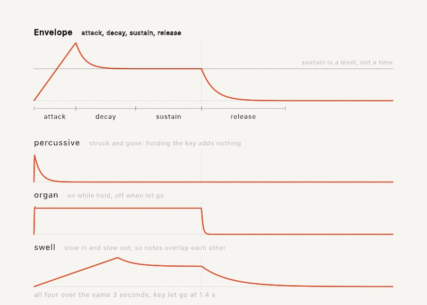
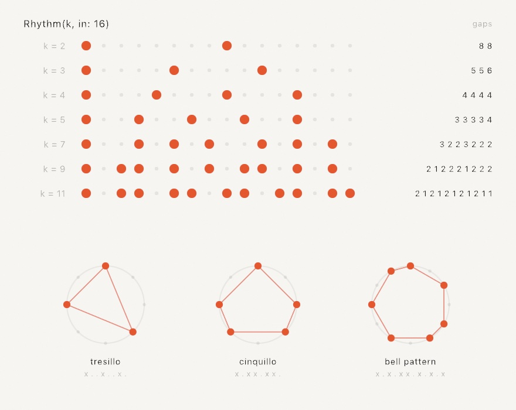
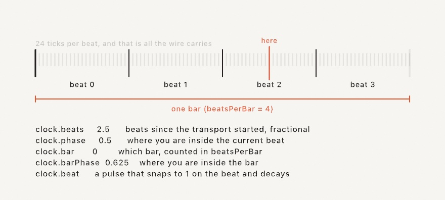

#### <sup>[Ollin](../README.md) → [Guide](README.md) → Chapter 20</sup>

---

# 20. Sound and control


Every sketch so far has listened to two things, the clock and the mouse. This chapter adds ears and hands. The ears come first, so a microphone or a song becomes a handful of numbers you read in `draw()` and the picture moves with the music. Then come the hands, where a hardware knob, a phone fader, or the inspector slider drives the same parameters and a running sketch becomes something you play. The piece above is doing both at once, and by the end you'll have built it.

## The first listening sketch

Sound reaches a sketch through `OllinAudio`, a small library you import alongside the framework. The simplest start is the microphone and one number, `amplitude`, which is how loud things are right now, roughly `0...1`, smoothed so it doesn't flicker.

```swift
import Ollin
import OllinAudio

final class Pulse: Sketch {
    let mic = AudioInput()

    override func setup() { try? mic.start() }

    override func draw() {
        background(.black)
        fill(.white)
        drawCircle(width / 2, height / 2, (60 + Double(mic.amplitude) * 700) * scale)
    }
}
```

Run it with `swift run OllinLive` like any sketch, say yes when macOS asks about the microphone (it asks once), and hum. The circle breathes with you. That's the whole shape of audio-reactive work: make a source in `setup()`, keep it in a property, read its values every frame. The rest of the chapter is just richer values to read.

> **Swift note.** `amplitude` is a `Float`, because audio hardware speaks 32-bit floats. Drawing wants `Double`, so you'll see `Double(mic.amplitude)` around every audio read. It's a conversion, not a calculation; nothing is lost that your eyes could see.

## A microphone we can print

A guide has a problem a live sketch doesn't. Every figure in these pages must render the same way on any machine, and no two rooms sound alike. Chapter 19 solved this with a pretend depth camera, and this chapter fakes a microphone. `StageMic`, about thirty lines at the bottom of the committed figure [`Anatomy.swift`](Figures/20-SoundAndControl/Anatomy.swift), synthesizes a little band (a kick drum every half second, a hat between the kicks, a held bass note, a slow four-note arpeggio, a whisper of hiss) and feeds the samples into a real `AudioAnalyzer`, the same analysis engine behind `AudioInput`. Every audio number in this chapter comes out of that analyzer, exactly as it would from the air, and only the air is missing. Swap `StageMic` for `AudioInput()` in any figure and it listens to your room instead.

The analyzer is worth meeting directly, because it's also the seam for sounds Ollin hasn't heard of. It's public, so anything that can produce a stream of samples can feed one.

## What the analyzer hears

Sound arrives as **samples**, which are measurements of air pressure, 44,100 of them per second. A microphone hands the analyzer that stream, and the analyzer answers three questions about the most recent instant.


The top panel is the **waveform**, the samples themselves, one big slow swell (the kick's low thump mid-decay) with fast wiggles riding on it (the melody). It's the honest raw material, and mostly you'll draw it only when you want an oscilloscope look.

The middle panel is the **spectrum**, and it's the reason audio-reactive visuals work at all. Sound is vibration, and pitch is how fast the vibration is, so a low note shakes the air few times a second (measured in hertz, cycles per second) and a high note many more. The spectrum splits the instant into how much energy sits at each speed, like a prism splitting light into colors. Suddenly the mix is legible: the kick's 55 Hz thump, the bass note at 110 Hz, the melody near 659 Hz, each its own spike you can watch independently. The tool that computes this split is the Fourier transform. The analyzer runs it for you every frame, and `spectrum` is the result, an array of magnitudes from low frequencies to high.

Raw spectra are awkward to draw, though. The values are unnormalized, and the interesting musical action crowds into the first few bins because hearing is logarithmic (every doubling of frequency sounds like one equal step, which is what an octave is). So the bottom panel is the read you'll actually use, **`bands(_:)`**:

```swift
for (i, level) in source.bands(24).enumerated() {
    let h = Double(level) * 300 * scale           // level is already 0...1
    drawRect(Double(i) * 34 * scale, height - h, 30 * scale, h)
}
```

`bands(24)` gives 24 bars spread the way hearing is (log-spaced, so the bass isn't crammed into one bar), each normalized to roughly `0...1` by a gain that adapts to the material, each rising fast and falling gently so bars look alive instead of jittery. A bar's height becomes a plain map to pixels, no hand-tuned scaling. Ask once per frame, with a fixed count.

Between the raw spectrum and the shaped bands sit three named conveniences, `bass`, `mid`, and `treble` (energy in the low, middle, and high ranges), and `magnitude(in: 40...120)` for a range you pick yourself. Those are unnormalized like the spectrum, so scale them to taste.

## Hearing the beat

Loudness and spectrum answer "how much", but the other thing music has is **arrivals**. A drum hit is a moment, not a level, and a visual that flashes on the drum reads as listening in a way a level meter never does.


The detector behind this compares each instant's spectrum with the one just before and adds up the rises. A sudden brightening across many frequencies at once (a drum hit, a plucked string, a note starting) spikes that sum, and the analyzer counts it as a beat. Three reads surface it:

```swift
source.beat            // a 0...1 pulse: snaps to 1 on each beat, fades over ~0.25 s
source.beatCount       // how many beats so far
source.timeSinceBeat   // seconds of audio since the last one
```

`beat` is the ready-made value, so multiply a radius by it and the picture throbs. `beatCount` is for firing something exactly once per beat, by comparing against a stored count, the way the finished piece spawns sparks. Look at the timeline, where every kick lands and so does the quiet off-beat hat, with the same confidence. That's what the detector really is: onset detection hears *arrivals*, sudden changes in the sound, not loudness and not "the beat" a drummer would tap. A soft hat is as sudden as a loud kick, so both count. For most visuals that's exactly what you want; when it isn't, `beatSensitivity` is the knob (higher asks for stronger arrivals before firing), and the detector is deliberately steady the rest of the time, so held chords and drones don't drift into false triggers, and the same recording always beats in the same places.

## Four places sound comes from

Everything above reads the same off any source, so choosing a source is one line:

```swift
let mic = AudioInput()                                         // the room
let song = try AudioPlayer(resource: "track", withExtension: "m4a", in: .module)
let tone = Tone(frequency: 220, waveform: .sine)               // a note of your own
let sound = Soundtrack(of: player)                             // a playing video's audio
```

`AudioInput` is the microphone, permission and all. `AudioPlayer` plays a file (`.m4a`, `.mp3`, `.wav`, and friends) and analyzes it as it sounds, and the `Audio/FilePlayer` example ships with a violin recording and shows the shape. It's also the source that survives export, because during a headless render it follows the export clock through the file, so an audio-reactive piece writes the same frames every time (Chapter 22 has the whole export story). `Tone` is a modest oscillator that both sounds and feeds the analyzer, which makes it the self-contained option, and the `Audio/Spectrum` example generates a gliding sawtooth and draws its own harmonics, with no permission and no file. And `Soundtrack` taps the audio of a playing `VideoPlayer` from Chapter 21's territory, so footage can drive visuals with its own music. One habit applies to all four. An audio file you bundle follows the same license care as any asset, so credit what you ship.

## A sketch that plays

`Tone` sounds one note forever, which is enough to feed the analyzer and not much else. When you want the sketch to actually play something, the instrument is `Synth`, and asking it for a note is one line:

```swift
let synth = Synth(.pluck)

override func mousePressed() {
    synth.play("C4", for: 0.4)
}
```

Nothing was started. The first note starts the engine, because forgetting to is otherwise the most common way to end up staring at a silent sketch. Pitches are written however you already think of them: `"C4"` by name, `60` as a MIDI number, `60.5` for the quarter tone between the keys. And `for:` is how long to hold it, so the note ends without being told to again.

Notes that outlive one call are the other half, which is what a held key wants:

```swift
synth.noteOn("C4")     // sounds until told otherwise
synth.noteOff("C4")
```

A `Synth` plays several notes at once, sixteen by default, so chords and overlapping tails work without any bookkeeping from you. When they run out, the next note takes one from whatever is already fading rather than from anything you are still holding, so a melody over a held chord takes its voices from its own earlier notes.

**What a note is made of** is a `Voice`, and the presets are the quick way in: `.pluck`, `.bass`, `.pad`, `.bell`, `.stab`, `.breath`, `.sine`. Assigning a new one leaves sounding notes alone, so you can change instrument between notes:

```swift
synth.voice = .bell
```

Inside a voice, the part worth understanding first is the envelope, because it is what makes a bell a bell and an organ an organ using the same wave underneath.



Four numbers, and only three of them are times. `attack` is how long the note takes to arrive, `decay` how long it takes to settle, `release` how long it takes to go once let go. `sustain` is the odd one out: it is the *level* the note rests at while held, not a duration. Set it to zero and holding the key adds nothing at all, which is exactly what struck things do, and why `.percussive` sounds like a drum however long you lean on it.

You can draw the shape you designed, which is what the figure above does:

```swift
Envelope.swell.level(at: 0.7, heldFor: 1.4)   // where a note has got to
```

The other half of a voice is the `filter`, and it is most of what people mean when they say something sounds like a synthesizer. A note that is bright when struck and darkens as it fades is not the wave changing, it is a filter closing over it. `Voice.Filter.sweep(from:by:)` is that gesture, and `.pluck` is built from it.

Finally, a `Synth` is an `AudioSource` like the microphone is, so everything earlier in this chapter reads off the sketch's own playing:

```swift
drawCircle(width / 2, height / 2, 100 + Double(synth.amplitude) * 900)
```

That closes the loop the chapter opened with. A sketch that listens to the room can listen to itself instead, and then the picture and the sound are the same decision made once. The `Audio/Synth` example is a playable keyboard doing exactly that.

## A string, worked out rather than drawn

Every voice so far starts with a wave: a shape an oscillator traces over and over, which you then carve with an envelope and a filter until it sounds like something. That works, and it is what most synthesizers are. But it is a description of a result, and there is another way in.

```swift
let synth = Synth(.steel)
synth.play("E3", for: 3)
```

That is a string. Not a recording of one and not a wave shaped to resemble one: a length of something under tension with a disturbance running up and down it, worked out sample by sample as it goes.


The top of that picture is the whole model. A delay line one period long is the disturbance travelling; a filter in the loop is what the string loses at each end, taking more off the top than the bottom; and a little less comes back each time round than went out. Feed a burst of noise into it and it turns into a note by itself.

What makes this worth the trouble is what you get without asking. The note attacks like a string because that is what a disturbance settling into a loop does. It darkens as it rings, because the top is lost faster than the bottom, so a long note changes color with nothing moving. And it responds to *where you pluck it*:

```swift
var string = PluckedString.steel
string.pick = 0.5              // halfway along
synth.voice = Voice(string: string)
```

The lower half of the picture is why. A string held at a point cannot move there, so every mode with a node under your finger gets nothing. Pluck halfway along and every even mode is missing, which is the hollow tone in the top row's gaps. Pluck near the end and they are all there, thinly, which is the nasal sound of a guitar played by the bridge. The shape on the left and the bars on the right are the same fact drawn twice.

`Examples/Audio/Strings` is six strings you click on, wherever you want to pluck them, and the shape it draws on each one is those same modes.

Three more things are worth knowing. `hardness` is how quickly you let go, which decides how much of the string you set moving; `decay` is how long the note rings; `damping` is how much sooner the bright part goes than the low part. And a string decides its own fade, so the envelope's job is to stay out of the way: ask for a note long enough to let it finish, or the release will cut it off mid-ring.

The tuning is the part you would never think to check and would certainly hear. A loop has to come out exactly one period long, and a whole number of samples cannot do that. At the bottom of the keyboard the rounding error hides in a loop hundreds of samples long. At the top, where a period is ten samples, rounding is out by most of a semitone. So the fraction left over is handled by a filter that supplies a fraction of a sample, and the loop filter's own delay is counted into the same budget, which is why turning `damping` up cannot pull the note flat.

## A shape you can hit

A string is one length of one thing, and its model is one loop. Something struck is different: hit a plate or a bell or a sheet of glass and it does not make a wave at all. It makes a handful of pure tones at once, each fading at its own rate.

Which tones is the interesting part, because it is decided by the object's shape and by nothing else.

```swift
let synth = Synth(.chime)
synth.play("C4", for: 4)
```

That is a bell, from a list of ratios a bell founder would recognize, and `.drum`, `.bar`, `.wood`, and `.glass` are beside it. But a list is not the point. The point is that the list can come from an outline you drew:

```swift
let outline = textToShapes("O").first!
let bell = StruckShape(outline)                 // once, in setup()

override func mousePressed() {
    synth.voice = Voice(body: bell!.body(struckAt: Vector2(mouseX, mouseY)))
    synth.play("C4", for: 3)
}
```


Nothing in that picture was chosen. Each row is the outline beside it, measured. The circle comes back at 1, 1.59, 2.13, 2.30, which are the zeros of the Bessel functions, which is what a real drumhead rings at. The square comes back at 1, 1.58, 2, 2.24, which is what a real square membrane rings at. The blob comes back at whatever a blob rings at, and nobody has a name for that.

The reason it works is that a flat thing held at its edge can only vibrate in the shapes that fit inside its outline with nothing moving at the rim. Ask which those are and you have asked an eigenvalue problem, and the frequencies are the square roots of its answers. Ollin measures the outline onto a grid and solves it.

Look again at the pairs. The circle, the square, and the triangle each show most of their lines doubled up, and the blob shows none. That is symmetry: a pattern that fits a circle at one rotation fits it at another, so there are two of them and they ring at the same frequency. An outline with no symmetry has nothing to double. A real drum does this too, and because a real drum is never quite round, its pairs sit fractionally apart and beat against each other, which is part of why a drum sounds alive.

Two practical things. **Measuring is the expensive part and striking is free**, so measure in `setup()` and keep the `StruckShape`. And **where you hit it decides which tones answer**: a tone that holds still under your finger gets nothing, which is the pick position again in a different costume. Hit a circle exactly in the middle and most of its tones stay silent, because most of them have a line of stillness straight through the center.

`Examples/Audio/StruckShapes` is six of these you can click, and the bars under each one move as you move where you hit it.

## Music the sketch works out for itself

A synth answers what a note sounds like. It says nothing about which notes there are, or when. That half is the composition types, and the thing they have in common is that not one of them can tell the time.

Each answers a step number. Step 0, step 1, step 2, forever. Turning the sketch's clock into step numbers is one small counter's job:

```swift
var counter = StepCounter(perBeat: 4)

override func draw() {
    for step in counter.steps(upTo: time * 2) {     // 120 beats a minute
        synth.play(60, for: 0.1)
    }
}
```

It hands back a range rather than a single step, because at any real tempo a frame lasts longer than a step, and a step that fell inside the frame still has to be played.

Keeping the clock outside is what makes the rest portable. `time * 2` today; a beat detected in whatever is playing in the room; a drum machine's own clock arriving over MIDI later in this chapter. None of what follows changes.

**`Rhythm` decides when.** Ask for a number of strikes over a number of steps and it spreads them as evenly as whole steps allow:

```swift
let rhythm = Rhythm(5, in: 16)
if rhythm[step] { synth.play(60, for: 0.1) }
```



Read the gaps column. However many strikes you divide over sixteen steps, the gaps come out in at most two lengths, and those two differ by one. That is the whole idea. What falls out of it is the surprise: `Rhythm(3, in: 8)` is the Cuban tresillo, `Rhythm(5, in: 8)` the cinquillo, and `Rhythm(7, in: 12)` begun three strikes in is the bell pattern played across west Africa and, after it, much of the Americas. An algorithm written for timing pulses in a particle accelerator turns out to produce the rhythms people were already playing.

The named ones are on the type, so you rarely have to remember which numbers: `.tresillo`, `.cinquillo`, `.bellPattern`, `.bossaNova`, `.samba`, `.aksak`, and a few more. Or write one out, which is what you want when the pattern is already in your head:

```swift
let clave: Rhythm = "x..x..x...x.x..."
```

**`Scale` decides which.** It turns whole numbers into notes, so a number arrived at any way at all stays in key:

```swift
let key = Scale(.minorPentatonic, root: "A3")
synth.play(key[step])
```

Degrees run past both ends: `key[5]` is an octave up, `key[-1]` the note below the root. This is the piece that does the most work for the least code. Feed a wandering number through a scale and it cannot play a wrong note.

When the number came from somewhere that is not music, a mouse position or a sensor reading, `snap` moves it to the nearest note of the scale instead:

```swift
synth.play(key.snap(Pitch(40 + mouseY / 12)))
```

**`Chord` and `Arpeggio` decide what goes together.** A chord can be named, `Chord("A3", .minorSeventh)`, or built out of the scale by taking every other note:

```swift
key.chord(on: 0)     // a triad on the root
key.chord(on: 1)     // a triad on the second degree
```

On a major scale those come out major and minor from the same call. That is the point of building a chord out of a key: the quality follows from where in the scale you started, so changing the key changes the chords along with it rather than fighting them.

An `Arpeggio` plays a chord one note at a time, and like a rhythm it answers a step number:

```swift
let arp = Arpeggio(Chord("A3", .minorSeventh), .upDown, octaves: 2)
synth.play(arp[step], for: 0.1)
```

Reading it at the step, rather than counting the notes you have played so far, is what keeps the figure in its place in the bar instead of restarting every time the rhythm strikes.

**`MarkovChain` decides what next.** Show it a phrase and it learns what tends to follow what:

```swift
var melody = MarkovChain(learning: [0, 2, 4, 2, 0, -3], seed: 4, loops: true)
melody.start(at: 0)

synth.play(key[melody.next() ?? 0])
```

`order` is how far back it looks. At 1 each element is picked from whatever followed the one before it; at 2 it looks at the last two, which tracks the source more closely and invents less. It is seeded, and it keeps its own generator rather than borrowing the sketch's, so adding one cannot shift anything else you were drawing at random.

Four small pieces, and together they are a piece of music:

```swift
for step in counter.steps(upTo: time * 104 / 60) {
    if pulse[step] { bass.play(key[melody.next() ?? 0], for: 0.34) }
    if figure[step] { chords.play(key.snap(arp[step]), velocity: 0.55, for: 0.22) }
}
```

That is `Examples/Audio/Generative`, drawn as three of those rings turning on one step count, with the key and the figure and the tempo as knobs you move while it plays. All of it repeats: the same seed gives the same melody, the same two numbers give the same rhythm. A generated piece is something you can come back to, not something you had to be there to catch.

## Knobs from anywhere

The hands come next. Since Chapter 1 you've tuned sketches with `@Param` knobs in the inspector, and the news here is that the inspector is only one of the hands that can hold those knobs.

**MIDI** is the protocol music hardware has spoken since 1983: knob boxes, fader banks, pad grids, keyboards. A controller sends small messages (a knob is a *control change* carrying a number `0...127`, and a pad is a *note* with a velocity), and `OllinMIDI` reads them:

```swift
import OllinMIDI

let midi = MIDIInput()
override func setup() { try? midi.start() }
override func draw() {
    let level = midi.controlValue(7, default: 0)          // a knob, 0...127
    if midi.isNoteOn(60) { flash() }                      // a held pad
    for message in midi.messages() where message.isNoteOn {
        spawn(message.note ?? 0)                           // each strike, once
    }
}
```

`start()` connects to every device on the system, including ones plugged in later. Which control sends what is the controller's business, so the first thing to do with new hardware is run the `Integration/MIDIMonitor` example and touch everything. It draws each message as it arrives, and your controller introduces itself.

Knobs aren't the only thing MIDI carries. Gear with a play button (a DAW, a drum machine, a DJ mixer) also broadcasts its beat as *MIDI clock*, and a `TempoClock` reads that into musical time, so motion lands on the beat instead of near it.

The wire itself is almost comically simple, and knowing that makes everything else make sense. A MIDI clock master sends one tick, twenty-four times per beat, forever. There is no tempo number in the message, no bar count, no position. Twenty-four ticks per beat is the entire protocol, and everything musical you want is derived by counting them.



```swift
lazy var clock = TempoClock(from: midi)
// in draw():
let throb = 1 + 0.3 * clock.beat     // snaps on each beat, eases off
let lap = clock.progress(over: 8)    // a 0...1 ramp every eight beats
```

Counting is why the grid can't drift. Each tick is exactly one twenty-fourth of a beat by definition, so the position is arithmetic rather than an estimate, and a sketch left running for an hour is still on the beat. The tempo is estimated (it has to be, since nobody sends it), but that estimate only smooths motion *between* ticks and never moves the grid itself.

The readers in the figure cover most of what you'll want. `beats` is the running count with a fraction, `phase` is where you sit inside the current beat as `0...1`, and `bar` and `barPhase` are the same idea one level up, over however many beats you declare a bar to be. `progress(over:)` is the one to reach for most, giving you a ramp that resets every N beats, which is how you make a slow sweep that lands exactly on the downbeat.

`clock.beat` is the same ready-made pulse the analyzer's `beat` gave you earlier in this chapter, so a beat-reactive sketch can swap between hearing the room and reading the wire, which is worth knowing when the room is loud and the wire is honest.

Two behaviors to expect from real gear. Pressing play on the master arms the clock and it starts on the *next* tick rather than immediately, which is the MIDI convention and keeps the first beat exact. And some gear, DJ mixers especially, never sends a transport message at all and simply free-runs its clock, so `TempoClock` starts following from the first tick it hears. The `Integration/TempoSync` example rehearses all of this with no hardware, by having the sketch send clock to itself, and [the MIDI reference](../Docs/Integration/MIDI.md#tempo-sync-tempoclock) has the full surface.

**OSC** is the networked cousin, the protocol of TouchOSC, Max/MSP, TouchDesigner, and most of the performance world. Messages are named by slash-paths and travel over the network, which means the fader can be a phone on the same Wi-Fi:

```swift
import OllinOSC

let osc = OSCReceiver(port: 8000)
override func setup() { try? osc.start() }
override func draw() {
    let level = osc.float("/fader1", default: 0)          // usually 0...1
}
```

Point TouchOSC (or anything that speaks OSC) at your Mac's IP and port 8000, and its controls land in the sketch. There's an `OSCSender` for the other direction, so a sketch can drive a mixer or a lighting desk too. And you can rehearse all of it with no hardware at all, because the `Integration/MIDILoopback` and `Integration/OSCLoopback` examples send to themselves, so the round-trip is visible on any bare Mac.

## One knob, three hands

Reading `controlValue` every frame works, but there's a nicer arrangement. A `@Param` already is a named, ranged value with a control in the inspector. Binding wires an outside source straight onto it:

```swift
@Param(20...400) var radius = 120.0

override func setup() {
    try? midi.start(); try? osc.start()
    midi.bind(controlChange: 7, to: $radius)   // hardware knob, 0...127 → 20...400
    osc.bind("/radius", to: $radius)           // phone fader, 0...1 → 20...400
}
```


Each incoming value is mapped into the parameter's own range and assigned, and the sketch keeps reading plain `radius` without ever knowing who moved it. The inspector slider, the hardware, the phone, and plain assignment in code all stay live at once, and whichever moved most recently wins. One more line makes hardware feel good. Give the parameter a `smoothing:` (`.eased(0.3)` for a fixed glide, `.smoothed` for the adaptive filter that stays steady at rest and opens up under a moving hand), and every source glides instead of stepping, because the softening belongs to the knob rather than to the wire.

## Putting it together: a playable instrument

The finished piece wires the whole chapter together: `bands` worn as a crown of spokes, a core that throbs on `beatCount`, sparks flung on each arrival, and two `@Param` knobs waiting for whatever hands you have. Make `MySketches/Resonator.swift` (bring `StageMic` along from [`Anatomy.swift`](Figures/20-SoundAndControl/Anatomy.swift); the committed figure with everything together is [`Resonator.swift`](Figures/20-SoundAndControl/Resonator.swift)):

```swift
import Ollin
import OllinAudio

final class Resonator: Sketch {
    let mic = StageMic()

    @Param(24...96) var spokes = 56
    @Param(0.6...2.4) var brightness = 1.4

    struct Spark {
        var position: Vector2
        var velocity: Vector2
        var life: Double
    }

    var sparks: [Spark] = []
    var lastBeat = 0
    var pulse = 0.0

    /// Where the instrument sits: a touch below center, to leave the crown room.
    var mid: Vector2 { center + Vector2(0, 60 * scale) }

    override func setup() {
        seed(20)                              // the sparks re-fly the same way
    }

    override func draw() {
        mic.listen()
        let audio = mic.analyzer

        background(Color(hex: 0x06040E))
        toneMap(.aces)
        blendMode(.add)

        // The beat: snap the pulse up when a new one lands, let it fade.
        pulse *= exp(-deltaTime * 5)
        if audio.beatCount > lastBeat {
            lastBeat = audio.beatCount
            pulse = 1
            spawnSparks()
        }

        // The spectrum, worn as a ring of spokes: bass at the top, treble at
        // the bottom, mirrored left and right so the ring stays symmetric.
        let levels = audio.bands(spokes / 2 + 1)
        withState {
            translate(mid)
            rotate(time * 0.06)
            for i in 0 ..< spokes {
                let band = i <= spokes / 2 ? i : spokes - i
                let level = Double(levels[band])
                let angle = Double(i) / Double(spokes) * .tau - .pi / 2
                let dir = Vector2(cos(angle), sin(angle))
                let inner = 175 * scale
                let len = (14 + level * 290) * scale
                fill(Colormap.magma.color(at: 0.2 + level * 0.75)
                    .withAlpha(0.25 + level * 0.75 * brightness))
                drawOrientedBox(dir * inner, dir * (inner + len),
                                thickness: (3.5 + level * 9) * scale)
            }
        }

        // Sparks from past beats, flying and fading.
        for i in sparks.indices {
            sparks[i].position += sparks[i].velocity * deltaTime
            sparks[i].life -= deltaTime
        }
        sparks.removeAll { $0.life <= 0 }
        noStroke()
        for spark in sparks {
            let a = max(0, spark.life / 0.8)
            fill(Color(hue: 0.09, saturation: 0.5, brightness: 1).withAlpha(a * 0.9))
            drawCircle(spark.position.x, spark.position.y, (1.5 + a * 5) * scale)
        }

        // The core: a warm glow that swells on the beat, a hot center.
        let ember = Color(hex: 0xFFB65C)
        let glowRadius = (185 + pulse * 150) * scale
        fill(.radial(center: mid, radius: glowRadius,
                     Ramp([ember.withAlpha(0.3 + pulse * 0.5), ember.withAlpha(0)])))
        drawCircle(center: mid, radius: glowRadius)
        let coreRadius = (80 + pulse * 60) * scale
        fill(.radial(center: mid, radius: coreRadius,
                     Ramp([Color.white.withAlpha(0.95), Color.white.withAlpha(0)])))
        drawCircle(center: mid, radius: coreRadius)

        blendMode(.normal)
    }

    func spawnSparks() {
        for i in 0 ..< 14 {
            let angle = Double(i) / 14 * .tau + random(-0.15, 0.15)
            let speed = random(200, 380) * scale
            let dir = Vector2(cos(angle), sin(angle))
            sparks.append(Spark(position: mid + dir * 180 * scale,
                                velocity: dir * speed,
                                life: random(0.45, 0.8)))
        }
    }
}
```


Each spoke is a `drawOrientedBox`, which fills a thick bar between two points at whatever angle they happen to lie, so a band level turns straight into a spike pointing out from the center. The additive blend and the ACES tone map from Chapter 14 are what make the glow feel like light instead of paint, and the mirrored bands are an old trick that keeps a spectrum symmetric and calm. Watch it run and the crown breathes with the arpeggio while the core keeps time.

Then make it yours:

- Give it your ears by swapping `StageMic` for `AudioInput()`, starting it in `setup()`, and deleting the `mic.listen()` line (a live source feeds itself). Then play music at your Mac.
- Give it your hands: `midi.bind(controlChange: 7, to: $brightness)`, or bind `/brightness` over OSC and play it from a phone on the sofa.
- Give it your music with an `AudioPlayer` and a favorite track, then tune `beatSensitivity` until the sparks land on the drums.
- Rebuild the crown, since the spokes are only `bands` and trigonometry. Try concentric rings, a horizon of bars, or Chapter 12's flow field with its strength driven by `bass`.

## Where this comes from

The idea that any sound splits into pure vibrations is Joseph Fourier's (1822), and the fast algorithm that made it real-time, the FFT, is Cooley and Tukey's (1965), and Ollin runs Apple's implementation. Detecting arrivals by spectral flux is a standard technique from music information retrieval, surveyed well in Bello and colleagues' onset-detection tutorial (2005), and the real-time recipe Ollin follows is Böck, Krebs, and Schedl's online method (2012). Hearing a shape has a mathematical name, from Mark Kac's 1966 question "Can one hear the shape of a drum?", and an answer: not always, since two different outlines can ring identically, but you can certainly hear a great deal of it. Working the frequencies out from the outline is modal synthesis, set out for sound by Jean-Marie Adrien and developed for struck objects by Kees van den Doel and Dinesh Pai. The plucked string is Kevin Karplus and Alex Strong's algorithm (1983), a discovery in the literal sense: they were building a wavetable synthesizer, noticed that a bug which averaged the table as it played turned a burst of noise into a plucked string, and worked out afterwards why. David Jaffe and Julius Smith published the extensions the same year, and it is their version, tuned by an allpass and plucked at a position, that Ollin implements. The even spread behind `Rhythm` is Eric Bjorklund's algorithm for timing pulses in a spallation neutron source, which Godfried Toussaint connected to musical timelines in 2005, along with the names of the rhythms it produces. MIDI was created in 1983 by Dave Smith and Ikutaro Kakehashi so rival instruments could talk to each other, a rare act of industry peace that still works four decades later. Open Sound Control came from Matt Wright and Adrian Freed at CNMAT, Berkeley (1997), built for the networked, higher-resolution rigs MIDI predates. And the audio-reactive visual itself has a long lineage, from Oskar Fischinger's hand-drawn sound films through the oscilloscope and music-visualizer traditions to today's VJ and live-coding scenes. Full credits are in the project's [attribution notes](../ATTRIBUTION.md).

## Go deeper

- [Audio](../Docs/Helpers/Audio.md): every source and read, `bands`, beats, and feeding the `AudioAnalyzer` yourself.
- [Synthesis](../Docs/Helpers/Synthesis.md): `Synth`, pitches, the `Voice` presets and what is inside one, envelopes, filters, delay and reverb.
- [Synthesis](../Docs/Helpers/Synthesis.md#physical-models): both models, their settings, why the string's tuning is exact, and how a shape is measured.
- [Composition](../Docs/Helpers/Composition.md): rhythms, scales, chords, arpeggios, chains, and the counter that joins them to time.
- [MIDI](../Docs/Integration/MIDI.md): messages, the three reads, binding, and sending MIDI out.
- [OSC](../Docs/Integration/OSC.md): addresses and arguments, bundles, binding, and testing with a phone.
- [Parameters](../Docs/Helpers/Parameters.md): the typed `@Param` family, smoothing, and the binding surface.
- Worked examples: [`Examples/Audio/Synth`](../Examples/Audio/Synth/Sketch.swift) (a playable keyboard), [`Examples/Audio/Generative`](../Examples/Audio/Generative/Sketch.swift) (three Euclidean rings deciding what to play), [`Examples/Audio/Strings`](../Examples/Audio/Strings/Sketch.swift) (six strings you pluck where you click), [`Examples/Audio/StruckShapes`](../Examples/Audio/StruckShapes/Sketch.swift) (shapes that sound like the shape they are), [`Examples/Audio/Spectrum`](../Examples/Audio/Spectrum/Sketch.swift) (self-contained tone analysis), [`Examples/Audio/Microphone`](../Examples/Audio/Microphone/Sketch.swift), [`Examples/Audio/FilePlayer`](../Examples/Audio/FilePlayer/Sketch.swift), [`Examples/Video/SoundReactive`](../Examples/Video/SoundReactive/Sketch.swift) (a video's own soundtrack), [`Examples/Integration/MIDILoopback`](../Examples/Integration/MIDILoopback/Sketch.swift), [`Examples/Integration/MIDIMonitor`](../Examples/Integration/MIDIMonitor/Sketch.swift), [`Examples/Integration/OSCLoopback`](../Examples/Integration/OSCLoopback/Sketch.swift), and [`Examples/Integration/OSCMonitor`](../Examples/Integration/OSCMonitor/Sketch.swift).

---

[Contents](README.md#contents) · Previous: [Chapter 19, Depth and the iPhone as a sensor](19-DepthAndThePhone.md) · Next: [Chapter 21, Seeing](21-Seeing.md)
