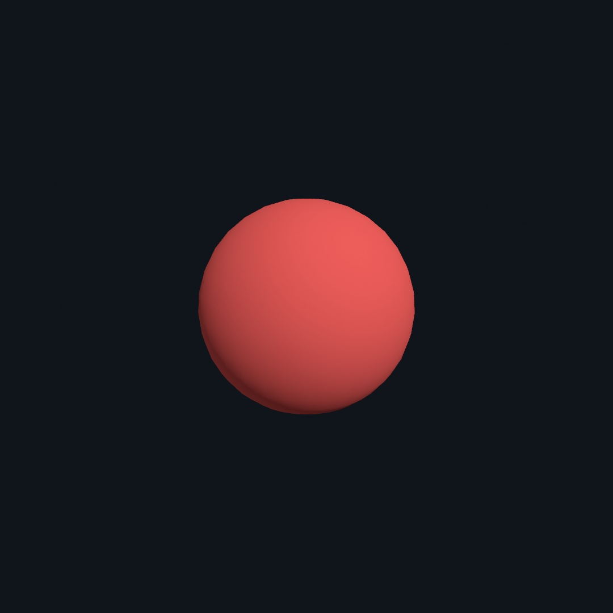
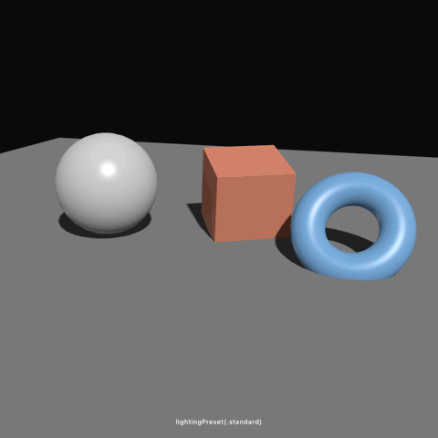
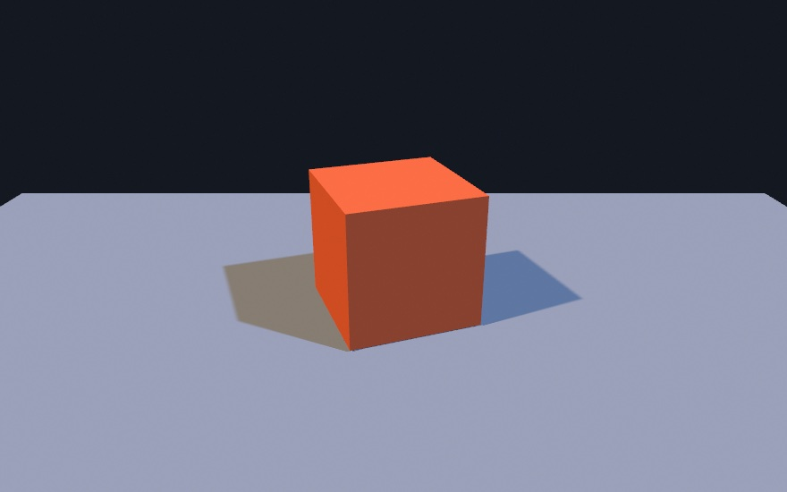
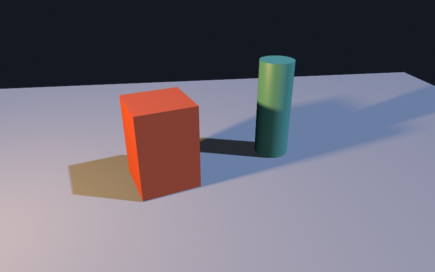
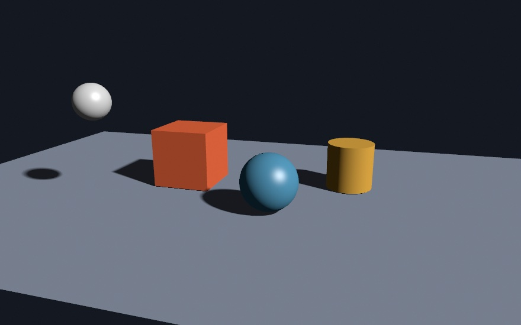
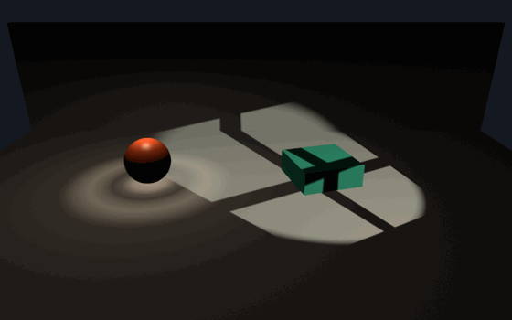
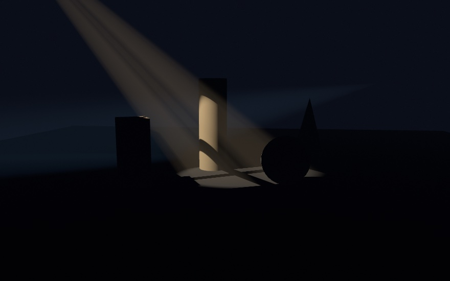
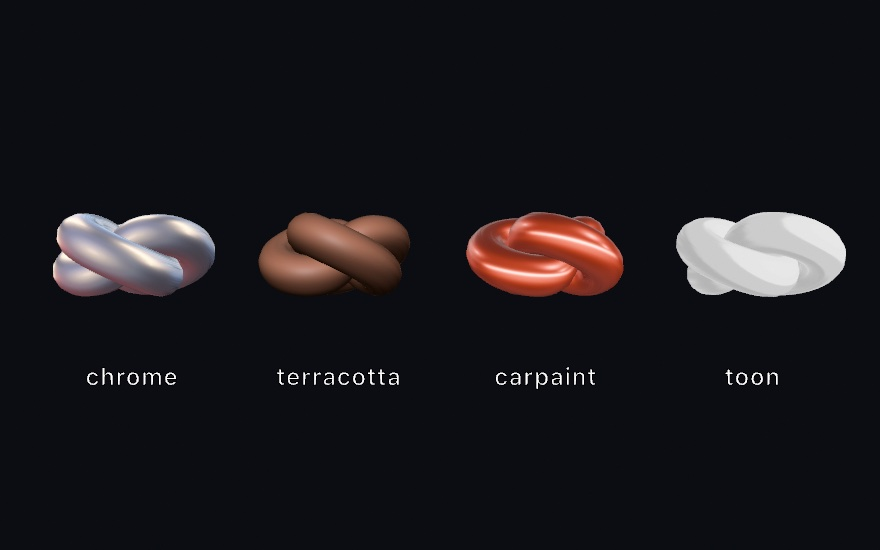
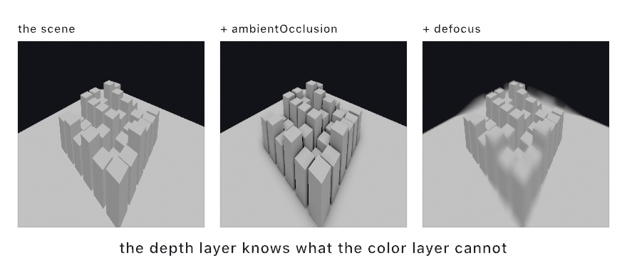
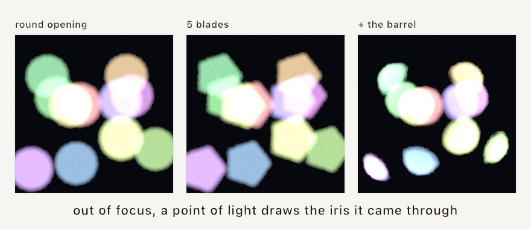

#### <sup>[Ollin](../README.md) → [Guide](README.md) → Chapter 21</sup>

---

# 21. 3D, gently


Every sketch so far lived on a flat canvas. This chapter adds the third axis, and the surprising part is how little changes. You keep the same `draw()`, the same `fill` and `translate`, and the same motion by default. What's new is a camera, a handful of solid shapes, and light. By the end you'll have built that sculpture court, and you'll be able to grab it with the mouse and walk around it.

## The world behind the canvas

3D drawing doesn't happen *on* the canvas. It happens in a world of its own, and a **camera** photographs that world onto the canvas each frame. The world has three axes, where x runs right, y runs **up**, and z runs toward you. Positions in it are `Vector3`s, which are exactly [Chapter 10](10-Vectors.md)'s `Vector2` with a third number:

```swift
let p = Vector3(2, 1, -3)     // 2 right, 1 up, 3 away
```

Two habits from the canvas need resetting. First, in the world **y goes up**, the opposite of the canvas, where y grows downward, so a tower rises toward positive y. Second, there are no pixels here. World distances are **world units**, and a unit means whatever your scene wants it to mean. That's a meter for a room, or a sphere-width for an abstract piece. Sizes on screen come from where the camera stands.

## A camera and a sphere

A sketch becomes 3D by setting a camera. That's the entire opt-in, and the friendliest camera is one call:

```swift
import Ollin

final class FirstSphere: Sketch {
    override func draw() {
        background(Color(hex: 0x10141B))
        cameraShowcase(radius: 5)
        fill(Color(hex: 0xF25F5C))
        drawSphere(radius: 1)
    }
}
```



Run it live and drag. The sphere isn't a flat disc, it's a shaded ball, and the mouse orbits around it. `cameraShowcase` gives you the camera most 3D sketches want with no wiring at all. It circles the scene slowly on its own, and you can grab it any time. Drag to orbit, scroll to move closer or farther, and right-drag to slide the view. After ten seconds of being left alone it drifts back to the opening shot and resumes. That way a sketch on a wall keeps moving and a curious viewer can always explore. When you'd rather the camera hold still until you move it, `cameraControl()` gives you the same gestures without the automatic orbit.

Notice you set up no lights. Solids are lit by a default rig automatically, so a shape looks three-dimensional out of the box. We'll take the lights over ourselves in a few pages.

The camera's home position is three numbers. The picture to keep in mind is an eye riding a sphere around a target:

<picture>
  <source media="(prefers-color-scheme: dark)" srcset="Images/21-3DGently/Orbit-dark.jpg">
  
</picture>

**Radius** is how far away the eye sits. **Azimuth** is how far around it has walked, an angle in radians like every angle since [Chapter 3](03-MotionAndTime.md). **Elevation** is how high it has climbed above the horizon. Every camera motion in this chapter, the automatic orbit and your mouse drags alike, is just these three numbers changing. The camera is per-frame state, like the things you draw, so it's set inside `draw()`.

> **Swift note.** `cameraShowcase(radius: 5)` fills in defaults for everything you don't mention: target, elevation, lens. The framing arguments only apply on the first call; after that, the viewer and the auto-orbit own the pose, which is why passing the same numbers every frame doesn't fight the mouse.

## Depth is real

Place a few spheres at different distances and the second new thing appears:

```swift
override func draw() {
    background(Color(hex: 0x10141B))
    cameraShowcase(target: Vector3(0, 0.4, -1), radius: 13,
                   elevation: 0.3, fieldOfView: .pi / 4)

    fill(Color(white: 0.75))
    drawPlane(width: 40, depth: 40)

    for i in 0 ..< 6 {
        withState {
            translate(Double(i) * 0.9 - 2.1, 0.7, 2.4 - Double(i) * 2.0)
            fill(Color(hue: 0.55 + Double(i) * 0.06, saturation: 0.55, brightness: 0.95))
            drawSphere(radius: 0.7)
        }
    }
}
```


Three things happened at once. `translate` grew a third argument, so it moves things in space now. The spheres get smaller as they get farther away, because the camera has perspective. And each sphere *hides* the ones behind it. That hiding is the **depth test**, which means the renderer remembers, per pixel, how far away the nearest surface was, and anything farther loses. You never sort anything by hand. Draw in any order and the world works it out.

`drawPlane` is the floor, a flat sheet on the ground, and it's the stage most scenes stand on. Its sibling `drawGround()` is the same stage as a thin slab, its top at `y = 0` and an optional color and material scoped to it. Reach for it once shadows and reflections should read a real thickness. `fieldOfView` is the lens. Smaller angles are telephoto, which reads calm and flat and suits product shots, while bigger angles are wide-angle, dramatic and stretched at the edges. The default is a fairly wide lens, so this sketch tightens it to a quarter turn.

## A catalog of solids

The catalog runs well past spheres and boxes. Each of these is one call, shaded and depth-tested like everything else:


The names are what you'd guess: `drawBox(size: 1.5)`, `drawTorus(radius: 0.6, tube: 0.25)`, `drawCone(radius: 0.7, height: 1.5)`, and so on. Past the everyday ones there's also a small shape *factory*. `drawSupershape` and `drawSuperellipsoid` sweep whole families of organic and gem-like forms from a few numbers. `drawExtrude` pushes any flat 2D shape into depth. `drawLathe` revolves a side profile into a vase, and `drawTube` sweeps a tube along any 3D path. The `3D/ShapeFactory` example is the tour.

Under every one of these calls is a **`Mesh`**, the shape as a cloud of triangles, which is what all 3D surfaces are made of here. The `draw*` calls rebuild their mesh every frame, which is fine for a box and wasteful for a dense knot. The pattern for anything heavy is the one you know from images and fonts, build once, draw forever:

```swift
let knot = Mesh.torusKnot(radius: 0.62, tube: 0.2, segments: 220, sides: 14)
// …each frame:
drawMesh(knot)
```

## Placing things: transforms compose

You've been using `withState` and `translate` since [Chapter 6](06-GridsAndRepetition.md), and in 3D they're joined by `rotateX`, `rotateY`, `rotateZ` (each spins around one axis), and the same `scale`. The important idea hasn't changed: **every move builds on the moves before it**. In 3D that compounding is where structures come from:

```swift
override func draw() {
    background(Color(hex: 0x10141B))
    camera(.orbiting(target: Vector3(0, 4.4, 0), radius: 15,
                     azimuth: 0.7, elevation: 0.22, fieldOfView: .pi / 4))

    // The center post the treads wind around.
    withState {
        translate(0, 4.4, 0)
        fill(Color(white: 0.35))
        drawCylinder(radius: 0.22, height: 9.4)
    }

    for i in 0 ..< 26 {
        translate(0, 0.34, 0)          // each tread builds on the last:
        rotateY(0.34)                  // a step up and a turn
        withState {
            translate(1.25, 0, 0)      // out to the side, this tread only
            fill(Color(hue: 0.55 + Double(i) * 0.012, saturation: 0.5, brightness: 0.95))
            drawBox(width: 2.1, height: 0.15, depth: 0.85)
        }
    }
}
```


Read the loop closely, because it uses both halves of the tool. The climb and the turn sit *outside* any `withState`, so they accumulate, step after step, and that accumulation is the spiral. The sideways step to hang each tread off the post sits *inside* a `withState`, so it applies to one tread and is forgotten. One repeated move-and-turn, and a staircase happens.

This sketch also shows the plain `camera(.orbiting(...))` call, a fixed pose you specify completely, with no mouse involved. Reach for it when you want to compose a shot exactly, and for `cameraShowcase` when you want the scene alive and explorable.

Nesting `withState` blocks builds solar systems. Translate to a planet and draw it, then translate again and draw its moon, and the moon inherits the planet's motion for free. The `3D/Transforms` example is exactly that, three transforms deep.

## Light, by playing

Everything so far wore the default lighting. Taking over is one call before you draw, and the fastest way to feel what lighting does is to swap whole moods:



```swift
lightingPreset(.goldenHour)     // one call relights the whole scene
```

The six presets (`.standard`, `.threePoint`, `.goldenHour`, `.noir`, `.studio`, `.moonlight`) are each an ambient wash plus a few placed lights, tuned like film rigs. Play with them first, because the mood of a 3D piece is mostly its light. Swapping presets on a knob teaches you more in a minute than any paragraph.

When you're ready to place your own, there are three kinds of light, and one scene can carry all of them:

```swift
ambientLight(Color(white: 0.1))                                     // a floor for the shadows
directionalLight(Color(hex: 0xFFD9A8), direction: Vector3(-0.6, -1, -0.35))
pointLight(Color(hex: 0x39D8E8), at: Vector3(2.7, 1.7, 1.9))
spotLight(Color(hex: 0xE85FD0), at: Vector3(-3.4, 4.6, 2.6),
          direction: Vector3(0, -1, 0), coneAngle: .pi / 5, penumbra: 0.4)
castShadows()
```


A **directional** light is the sun, parallel rays from a direction, with no position of its own, lighting everything evenly. A **point** light is a bulb at a place, so nearby things catch it strongly. A **spot** is a point light narrowed to an aimed cone, with a `penumbra` for how soft its edge falls. The `ambientLight` is a flat wash added to every surface so the unlit sides aren't pure black. Each light takes an `intensity`, and in the figure each has its own color so you can see who's doing what. The warm key shades everything, the cyan bulb blooms on the surfaces near it, and the magenta cone pools on the floor.

Two smaller dials finish the surface's response to light: `specular(_:)` sets how strong the highlight is (0 is matte) and `shininess(_:)` how tight. But mostly you won't set those by hand, because of the materials library below. First, though, there is that one extra line in the listing above to account for.

## Shadows, and what they tell you

**`castShadows()`** is what plants objects in a scene. Without it, a floating sphere and a resting sphere look the same, because nothing in the picture says where either one is. A shadow answers that.

```swift
directionalLight(.white, direction: Vector3(-0.22, -1, -0.16))
castShadows()
shadowSoftness(1)

drawPlane(width: 14, depth: 8)                                  // something to catch them
withState { translate(0, 3.4, 0); drawSphere(radius: 0.5) }     // and something to cast one
```


Four identical spheres, one floor, one light. You know instantly which one is resting and which is highest, and the only thing telling you is the shadow. Two things change as a sphere climbs. The shadow drifts away from it, and the edge gets softer. The one on the left, touching down, has a tight ellipse with a crisp edge. The one on the right, three and a bit units up, has a blurry patch with a wide gray skirt.

That softening is worth knowing about because it is the thing that makes rendered shadows look real. Shadows here are **contact-hardening** by default, so they are sharp where an object meets a surface and softer as the shadow falls away. `shadowSoftness(_:)` sets how strong the effect is, from `0` for a hard edge, the classic look, through the `0.5` default to `1`. The figure asks for `1` so the difference is easy to see at this size. At the default it is subtler and usually what you want.

Some practical notes, in the order they tend to bite:

- **You need something to catch a shadow.** A sphere alone in space casts into nothing. A floor, or another object, is what makes the shadow visible.
- **It's opt-in and per-frame.** A sketch that never calls `castShadows()` pays nothing at all, so shadows cost you only when you ask. Call it in `draw()` alongside the lights, and `noShadows()` turns it back off.
- **Every light casts**, up to four of them, and the section below is about what that means. The default rig's key light is directional, so a scene you haven't relit already works.
- **Nothing needs aiming.** The shadow's frame auto-fits around whatever the camera is looking at.

The three kinds of light cast by different routes, which mostly matters because it explains the cost. A directional or spot light renders the scene once from the light's own viewpoint and darkens whatever that view can't see. A point light casts in every direction at once. So on Apple silicon it traces actual rays from each lit pixel toward the light, which is exact, with no bias artifacts, and the most expensive of the three. On a GPU that can't trace rays it falls back to a depth map sampled by direction. Point shadows still work everywhere, and your sketch doesn't change either way.

If a penumbra looks grainy rather than smooth, that's the sample count, not the softness. `shadowQuality(.detail)` asks for more samples relative to whatever GPU is running, and `shadowSamples(16)` sets an exact number.

### Two lights, two shadows

Stand under a streetlight with a lit shop window behind you and you have two shadows. So does a sketch. `castShadows()` casts from every light in the frame, and each shadow lands where its own light puts it:

```swift
directionalLight(Color(hex: 0xFFD9A8), direction: Vector3(0.62, -0.72, -0.3))    // warm, from the left
directionalLight(Color(hex: 0xA8CCFF), direction: Vector3(-0.62, -0.72, -0.3))   // cool, from the right
castShadows()
```



Two shadows, one per light, fanning apart. Nothing chose between the lights. Now look at their color. The left shadow is warm and the right one is blue. A shadow is not an absence of light. It is what is left when one light is blocked. The patch on the left has lost the cool light and kept the warm one. That is worth more than the two shadows themselves, and a second caster gives it to you for free.

Now the part worth learning, because it is the dial you will actually reach for. **A light can be told not to cast:**

```swift
directionalLight(Color(white: 0.7), direction: Vector3(0, -1, 0.5), intensity: 0.25,
                 castsShadow: false)          // a fill: it lifts the dark faces and throws nothing
```

Reach for that on a fill light. A fill exists to open up the shadow side, so a shadow of its own works against it. The picture usually reads better with one clear shadow than with three faint ones fighting. It is also where the cost sits. Every caster renders the scene again from its own point of view, so three casters is three passes. The rigs `lightingPreset(_:)` installs already do this: the key casts, the fill and rim do not. That is why a preset gives you one clean shadow rather than a thicket.

Mixing kinds is fine. A point light standing beside a directional key throws its own shadow, and so does a second point light beside the first:

```swift
directionalLight(.white, direction: Vector3(0, -1, 0))   // straight down: its shadow hides under the box
pointLight(.white, at: Vector3(-3, 6, 0))                // from the left: its shadow reaches right
castShadows()
```



Read the colors again. The patch on the left is warm because the lamp still reaches it, and the band on the right is cool because the key does. Where the two cross, neither does.

A point light is the expensive kind, since it casts every way at once, and a frame can hold several of them. That cost is the reason for the last limit: a frame casts from **four** lights at most, the ones you set first. The rest still light the scene.

And the shadow on the floor is only the visible half. Everything else that reads a shadow follows every caster too. Lit air is carved by each beam. A resting thing gets its own seam under each light, and a translucent body passes each one through. So a second caster does not just add a shadow. It doubles all of that, which is what the limit of four is really protecting.

One thing to watch for. A light is a position, not an object, so nothing stops you drawing a small ball there to show where it sits. Do that with a casting point light and the ball wraps the light in its own shadow, and the scene goes dark. Either mark it with something the light stands clear of, or tell that light not to cast.


There is one place even a good shadow map falls short, and it is the most important few pixels in the picture. That's the exact line where an object touches the ground. A map has finite resolution, and the bias that keeps its speckle off nudges its shadow slightly away from the caster. The last sliver of contact opens up, and a resting box can read as floating a hair above the floor. **`contactShadows()`** closes that seam. For each pixel the renderer walks a short ray toward each casting light through the scene's own depth. It darkens the pixel where something nearby blocks the way, which draws the fine dark line a map can't hold at any resolution.

```swift
castShadows()
shadowSoftness(0.9)   // a wide, soft look: lovely, but every base goes loose
contactShadows()      // the short march that seats them again
```



The three resting solids each get the tight dark line at their base. The hovering sphere, the one thing genuinely off the ground, gets only the soft drifted blob a real gap produces. That difference is the whole feature. It seats an object under every light that casts, works on any Mac, and takes one optional dial. `contactShadows(length: 8)` sets the ray's reach in world units, and with no length a short reach comes from the scene's own scale. The honest limit is that the march can only consult what the camera sees. Off-screen geometry casts no contact shadow, and a curved surface can pick up a touch of extra shading just inside its silhouette. For the seam under a resting thing, which is what it's for, it simply works.

## A light with a body

The three kinds above are infinitesimal points. A fourth family gives light a *body*. `rectLight` is a glowing panel, a softbox or a window. `diskLight` is a glowing circle, and `tubeLight` is a glowing cylinder strung between two points, a neon. `intensity` means something different here, and it's worth a moment. It is the glow of the surface itself, so brightness falls off with distance on its own. A bigger panel pours more light at the same glow, and a thin neon needs an intensity in the tens, because a thin tube is a small piece of sky.

What a body buys you is easiest to see by changing its size and nothing else:

```swift
let side = 1.0 + pingPong(over: 6) * 2.2
let facing = Vector3(0.55, -0.58, 0.6)          // aimed down across the set
rectangleLight(Color(hue: 0.09, saturation: 0.22, brightness: 1.0),
          at: Vector3(-3.4, 4.8, -1.2), direction: facing,
          width: side, height: side, intensity: 70 / (side * side))
castShadows()
```


The listing divides the panel's glow by its area as it grows. The light poured on the set never changes, so you can watch what size alone does. Three things move together. The highlight on the sphere is the panel's own reflection, so it grows from a small window into a broad sheen. The shading wraps further around each form, because more of each surface can see some part of the panel. And the cast shadows, sharp when the panel is small, spread into soft-edged pools. They stay crisp where the box meets the floor and widen the farther they fall. The size of the light is the softness of the picture, and here it's one number.

Shadows work the way the last section said, with the panel's size standing in for a light's position. A rect or disk panel is picked as the caster when no punctual light claims the job, and its penumbra comes from the panel's real extent, nothing to set. `shadowSoftness(_:)` scales that extent rather than some separate size, so `0` is hard, the `0.5` default is the panel's true size, and `1` is twice as soft. A tube never casts. It glows in every direction, so there is no side to draw a shadow from. One practical note comes from the figure's own listing. Lights are invisible, so the glowing slab you see is a drawn prop, placed a step *behind* the emitting plane. A casting panel treats any geometry in front of that plane, its own prop included, as an occluder.

The `3D/Lighting/AreaLights` example stages all three shapes over a glossy floor, its softbox breathing so the shadows harden and soften with it. Put it beside `3D/Lighting/Lighting` and the difference between a bulb and a panel is the whole studio-photography look.

## The shape of the throw

A bare point light pours the same brightness in every direction, and a spot is just that pour with a cone cut into it. Real fixtures are choosier. A recessed downlight pools a hot disc with a faint ring of spill around it. A street lamp throws sideways in two wings, so the bright spot isn't the foot of its own pole. A wallwasher climbs the wall and leaves the room alone. Lighting manufacturers measure exactly where each fixture sends its light. They publish the measurement as an **IES file**, a small text file of brightness-by-angle, and a light can wear one:

```swift
let ring = IESProfile(string: ringFile)!     // or IESProfile(resource: "downlight", in: .module)!

pointLight(Color(hue: 0.09, saturation: 0.35, brightness: 1.0),
           at: Vector3(-2.6, 2.4, 0.4), intensity: 1.4, profile: ring)

let rock = sin(loopProgress(over: 6) * .tau) * 0.16
spotLight(Color(hue: 0.12, saturation: 0.25, brightness: 1.0),
          at: Vector3(3.6, 4.6, 4.2), direction: Vector3(-0.32, -0.66, -0.55),
          coneAngle: 0.85, penumbra: 0.12, intensity: 1.25,
          cookie: window, roll: rock)
```



The left pool is the profile at work, a hot center, a dip, then the spill ring, all read from a dozen numbers in the file. The profile's `0°` aims along the light's axis. A spot uses its `direction`, and a point light takes an `axis:`, straight down unless you say otherwise. Its brightest direction is normalized to `1`, so `intensity` still means what it always means, and anywhere the file didn't measure is dark, exactly as the fixture is. Parse the file once in `setup()` and keep it, since it's plain data. `IESProfile(resource:in:)`, `(contentsOf:)`, `(data:)`, and `(string:)` all read the same format. The throw is the fixture's signature, and the file is how you borrow a real one.

The window on the right is the second shaper, a **cookie**, an image a spot projects through its cone. Stage crews call the physical version a gobo, a stencil slid in front of the light. `LightCookie(image)` wraps any `Image` once, in `setup()`. Black blocks, white passes, and color tints like a gel. The image's edges land at the spot's outer cone, so a wider cone throws the same picture larger. The `roll:` in the listing is what rocks the panes. One knob spins an asymmetric profile and the cookie together about the beam, the way a fixture turns in its yoke.

Two habits worth keeping. A profile ends where its measurements end, so a downlight file that stops at 90° sends nothing above the fixture's own horizon. To wash a wall, tilt the light's `axis:` at it, the way the real fixture would be aimed. And both shapers are made-once values. The profile parses its file and the cookie resamples its image at construction, so build them in `setup()` and hand the same value to the light every frame. The `3D/Lighting/LightShaping` example stages a downlight, a batwing, a wallwasher, and this same window over one floor. Its three `.ies` files ride beside the sketch as bundled resources.

## Air you can see

Everything so far shows a light only where it lands. Real air shows the light on its way. Dust and haze catch a beam mid-flight, which is why a projector's cone hangs visibly over a cinema audience. It's why sun through a window is a slanted block of bright air. Two calls give a scene that air.

```swift
fog(Color(hex: 0xB4BDC9), density: 0.16, heightFalloff: 0.55)
```

`fog` fades every surface toward its color with distance, so near things stay crisp while far things dissolve, and depth reads at a glance. `density` is the thickness. The `heightFalloff` thins it with altitude, which is the morning-mist look, mist pooling low while tall things rise clear of it. It costs almost nothing, since the fade is an exact formula rather than a blur pass, so animating the density is just a number moving. The fog half of the `3D/Effects/Atmosphere` example is a colonnade standing in exactly this mist.

Fog paints every distance toward one color, which is right for a room. Outdoor air is choosier. It takes the blue out of a far ridge's own light, and it adds sunlight scattered into the path, blue from the side, brighter and whiter toward the sun. That is aerial perspective, the cue that makes mountains read as mountains, and it needs to know where the sun sits. So first give the scene a sky. `environment(.sky)` wraps the world in a computed one, with `turbidity` for how dusty the air is and `sunElevation` for how high the sun rides. An environment can light a whole scene, which is the next chapter's territory. Here its job is handing the haze its sun, and with the sky in place the perspective itself is one call:

```swift
environment(.sky(turbidity: 2.4, sunElevation: 0.34))
aerialPerspective()
```


With a `.sky` environment it follows the sky's own sun, rotation and all, so dropping the sun to the horizon reddens the haze by itself. `density` is how much air the scene spans, and bare it sizes itself to the camera framing. `haziness` trades the crisp blue of a clear day for the gray veil and sun halo of a humid one. It replaces `fog` for the frame, the last call wins, and the beams below ride it exactly as they ride fog. The `3D/Effects/Atmosphere` example puts all of it on knobs (hold space to switch over from fog).

```swift
castShadows()
volumetricLight()
fog(Color(hex: 0x0A0E18), density: 0.02)   // a whisper of haze for the beams to live in
```

`volumetricLight()` is the beam half. It watches the air along every line of sight and adds the light the haze scatters toward you, so directional and spot lights become *visible in flight*. The point is that everything a light already carries shapes its beam. The spot's cone becomes the projector cone. A cookie's panes read as tilted bars of bright air before they land as a window on the floor, and an IES profile's throw shows its real shape. And with `castShadows()` on, anything standing in the beam carves a dark shaft out of it, the crepuscular rays of a forest morning.



The `anisotropy` knob runs −1…1 and sets how strongly the haze throws light forward. Near 1, a beam flares when the view swings toward its source, the headlights-in-fog effect. At 0 it glows evenly from every side. And the two calls compose either way. With `fog`, the beams live in the fog's own thickness. Without it, the air stays clear and *only* the beams appear, which is the dark-stage look of `3D/Lighting/VolumetricLight`. **The air is part of the scene, and light crossing it is something you can draw.**

One habit is worth knowing. The beam march has a quality dial like the shadows do, `volumetricQuality` with three tiers. The default already does the right thing, frame-rate-safe live, lifted to full quality on export.

## Materials

A material is a surface's whole way of catching light, picked by name. The color still comes from `fill`; the *finish* comes from `material`:

```swift
fill(Color(hex: 0x2C8C86))      // the color
material(.velvet)               // the finish
drawSphere(radius: 1)
```


That's ten finishes on one color. The library runs from matte through glossy to the showpieces. `.iridescent` and `.soapBubble` shift hue as the view moves, `.velvet` glows at the edges, and `.jade` lets light through thin parts. `.toon` and `.gooch` are the stylized cartoon and warm-to-cool looks, and `.glitter` is full of tiny mirror flakes that flash as anything moves. `material(_:)` is drawing state like `fill`, saved by `withState`, so every shape in a frame can wear its own.

A `Material` is also a plain value you can tweak. Car paint is the classic recipe, gold flakes over a deep red:

```swift
var paint = Material.glitter
paint.sparkleColor = Color(hue: 0.12, saturation: 0.75, brightness: 1)
material(paint)
fill(Color(hue: 0.02, saturation: 0.8, brightness: 0.4))
drawSphere(radius: 0.62)
```

There's a further tier, the physically based metals and plastics (`material(.metal(roughness: 0.2))`), that really comes alive once a scene has surroundings to reflect. That's the next chapter's territory, where environments light the scene, so treat it as a pointer for now.

## Shading from a picture: matcaps

Matcaps are the shortcut of the sculpting world. Instead of lights and materials, the entire look, lighting included, is painted into one photograph of a sphere. Every surface point borrows the color the sphere would have there.

```swift
matcap(.chrome)
drawMesh(knot)
```



One call, no lights to place, and the look is total, from chrome and clay to car paint and cel shading. It works by asking, for each point on the surface, which way that point is facing relative to you. Then it reads the color from the matching spot on the sphere picture. Point straight at the camera and you get the middle of the picture. Face away toward the edge and you get the rim. Because the picture was lit once, all of that lighting comes along for free. That's why the highlights slide as the view turns, and why it reads as a real material rather than a paint job.

The trade is the same fact seen from the other side. **A matcap ignores your lights, your `material(_:)`, and your shadows**, because it isn't lit at all. The light is a photograph. That makes matcaps a separate axis rather than another finish. They are the wrong choice when an object needs to belong to a scene, matched to its lighting and grounded by a shadow. They are the right one when you want a good-looking surface with no lighting work, which is most of the time you're sketching a form.

There are 26 built in, real studio captures grouped by family. There are metals like `.chrome` and `.bronze`, clays like `.terracotta` and `.sage`, ceramics like `.pearl`, and translucents like `.wax`. Then there is the neutral studio set, `.toon` and `.toonDark`, and a handful of diagnostic ones, `.checkNormal` and `.checkGradient`, meant for reading geometry rather than looking good. Beyond those, `matcap(loadImage("my-matcap.png"))` wears any sphere image you find or paint. `Matcap.shaded(baseColor:metallic:roughness:)` bakes one on the spot with no asset at all, which is the option to reach for when you want a specific color and don't want to ship a file.

Two smaller things. The current `fill` tints the result, so keep it `.white` to see a matcap as captured. And `matcap(_:)` is drawing state like `fill`, so `withState` scopes it and `noMatcap()` returns to the lit path.

## What the depth buffer is for

[Chapter 16](16-LayersAndEffects.md) filtered layers by their color. A 3D scene drawn into a layer carries something extra that a flat drawing never has. For every pixel, it knows how far away the thing at that pixel is. That's the **depth buffer**, and three effects exist purely to use it.

```swift
let scene = makeRenderTarget()
withTarget(scene) { /* your 3D scene */ }

drawImage(scene.combined(with: scene.depth,
                         .ambientOcclusion(radius: 0.7, amount: 1.5)).image, 0, 0)
```

<picture>
  <source media="(prefers-color-scheme: dark)" srcset="Images/21-3DGently/DepthEffects-dark.jpg">
  
</picture>

`scene.depth` is an ordinary layer whose brightness is distance, so it feeds `combined(with:)` like any other, and everything else in [Chapter 16](16-LayersAndEffects.md) still applies.

**`.ambientOcclusion`** darkens the places light struggles to reach. Those are crevices, the gaps between objects, and the line where something meets the ground. Compare the first two panels and the blocks stop floating. That single change is most of what makes a render read as solid rather than pasted together. It costs one line, because the depth layer already knows where the crevices are.

**`.defocus`** is a camera lens. It keeps a band of distance sharp, set by `focus` and `range`, and blurs everything else more the further it is from that band, up to `maxBlur`. It's how you point at one thing in a busy scene. Both `focus` and `range` are read against the depth layer's `0...1`, so they depend on the camera's `near` and `far`. That is why setting those to actually bracket your scene matters, rather than leaving them enormous.

A blur has a shape, and it is not always a circle. Out of focus, a point of light is not a smudge. It is a picture of the opening its light came through. Hand `.defocus` a `blades` count and every highlight becomes a polygon of that many sides. That is what the iris of a real lens is made of. `catsEye` adds the barrel around that iris. The barrel clips the opening away from the middle of the frame. So a highlight that is whole in the middle lies down into a lemon toward the corners.

<picture>
  <source media="(prefers-color-scheme: dark)" srcset="Images/21-3DGently/TheOpening-dark.jpg">
  
</picture>

Leaving `blades` unsaid is not the same as asking for nothing. A scene defocused by its own depth takes the count from the camera that drew it. So one line, `camera.apertureBlades = 6`, shapes this blur, the flare ghosts of [Chapter 26](26-SculptingWithFields.md), and the path-traced export together. Name `blades` at the call only for a blur no camera knows about, such as a tilt-shift over a ramp you drew by hand. One practical note. The blur gathers a fixed number of samples. A light smaller than the space between them shows the pattern of the gather instead of a clean edge, so keep a light a few pixels across, or raise `quality`.

**`.screenSpaceReflections`** makes a floor glossy by reflecting the scene in it, and it runs on any Mac. It has one limit worth understanding rather than being surprised by. It reflects what is on the screen, and a picture does not contain the back of anything. Where the true reflection would be of a surface the camera cannot see, such as the underside of a ball resting on a floor, it can only approximate. That shows as a soft zone right at the contact. A touch of `roughness` hides it, and [Chapter 26](26-SculptingWithFields.md) has the exact alternative.

All three take a `quality` tier, `.performance`, `.default`, or `.detail`, which trades frame rate for smoothness. The tier is relative to your machine rather than an absolute setting, so `.default` means "the balanced choice for this GPU" and buys more samples on a faster one. Raising it to `.detail` for a final export is the usual move, since the export doesn't have to keep up with a display.

## Keeping your bearings

3D scenes are easy to get lost in, so the tools for finding yourself again are built in. `cameraView(.front)` snaps the camera to a canonical angle, like front, top, left, or isometric, and `resetCamera()` returns to the opening shot. The host apps put the same snaps in a **Camera** menu, ⌘0 through ⌘7, so they work on any running sketch without a line of code. Two more calls help while you build. `cameraAxis()` shows a small clickable x-y-z compass, and `groundGrid()` lays a faint reference floor. Both are development chrome, drawn only in the live window and never in an export, which is why you won't find them in any figure in this chapter.

One more thing to keep straight as you combine features. Ollin draws several *kinds* of 3D thing, and they don't all take the same finishes. Solid meshes are the fullest citizens, taking materials, textures, shadows, and reflections. The raymarched fields of [Chapter 26](26-SculptingWithFields.md) take materials, environments, and shadows but arrive by a different route. Point clouds are camera-facing splats and take neither lighting nor shadows, which is exactly right for what they are. None of this is arbitrary, since each kind is a different way of getting pixels on screen, but it does mean a material that transforms a mesh may do nothing to a cloud. When something you expected to apply doesn't, the [combining reference](../Docs/3D/Combining.md) is a table of what stacks with what.

## Putting it together: the plaza

The finished piece is a small sculpture court you curate yourself. There are five plinths and five pieces, each wearing a different finish, under golden-hour light with soft shadows. The camera orbits until you take over. Make `MySketches/Plaza.swift`:

```swift
import Ollin

final class Plaza: Sketch {
    // Built once; drawn every frame.
    let knot = Mesh.torusKnot(radius: 0.62, tube: 0.2, segments: 220, sides: 14)
    let vase = Mesh.lathe((0...24).map { i in
        let t = Double(i) / 24
        return Vector2(0.16 + 0.36 * sin(t * .pi * 0.92), (t - 0.5) * 1.5)
    }, segments: 44)
    let pearl = Mesh.sphere(radius: 0.62, segments: 48, rings: 32)
    let gem = Mesh.icosahedron(radius: 0.55)
    let sketchWork = Mesh.icosphere(radius: 0.66, subdivisions: 1)

    override func draw() {
        background(Color(hex: 0x141824))
        cameraShowcase(target: Vector3(0, 1.15, 0), radius: 12,
                       elevation: 0.26, fieldOfView: .pi / 4.4)
        lightingPreset(.goldenHour)
        castShadows()

        // The court floor.
        fill(Color(hex: 0x3A3D45))
        specular(0.05)
        drawPlane(width: 60, depth: 60)

        // Each piece: move to its plinth, draw the plinth, lift, spin, draw.
        withState {
            translate(-3.2, 0, 0.6); plinth(1.0)
            translate(0, 1.5, 0); rotateY(time * 0.24)
            material(.glossy); fill(Color(hex: 0x2C8C86))
            drawMesh(knot)
        }
        withState {
            translate(-1.0, 0, -1.6); plinth(1.55)
            translate(0, 2.32, 0)
            material(.velvet); fill(Color(hex: 0x8C1F35))
            drawMesh(vase)
        }
        withState {
            translate(1.0, 0, 1.4); plinth(0.75)
            translate(0, 1.4, 0)
            var paint = Material.glitter
            paint.sparkleColor = Color(hue: 0.12, saturation: 0.75, brightness: 1)
            material(paint); fill(Color(hue: 0.02, saturation: 0.8, brightness: 0.4))
            drawMesh(pearl)
        }
        withState {
            translate(3.3, 0, 0.9); plinth(1.2)
            translate(0, 1.7, 0); rotateY(time * 0.3); rotateX(0.15)
            material(.toon); fill(Color(hex: 0xE08A3C))
            drawMesh(gem)
        }
        withState {
            translate(-0.4, 0, -3.4); plinth(2.0)
            translate(0, 2.72, 0); rotateY(time * -0.2)
            wireframe()                       // one piece still being imagined
            stroke(Color(hex: 0xBFC7D5)); strokeWeight(1.2)
            drawMesh(sketchWork)
        }
    }

    // A stone block whose top lands at `height`.
    func plinth(_ height: Double) {
        withState {
            translate(0, height / 2, 0)
            material(.matte); fill(Color(white: 0.88))
            drawBox(width: 0.95, height: height, depth: 0.95)
        }
    }
}
```


Everything in it is this chapter. Meshes are built once, and plinths are placed with the transform stack. Note how each block translates to its spot, draws the plinth, then keeps translating upward for the piece. There's one preset for the light, one `castShadows()`, and a different material per sculpture. The last piece is drawn with `wireframe()`, mesh edges only, the standard look for a form that's still a proposal.

Then make it yours:

- Recast the show by swapping in a supershape, a lathe of your own profile, or a loaded model on the tallest plinth.
- Relight it. `.noir` turns the court into a crime scene, and `.moonlight` into a garden at night. Put the preset on a `@Param` menu knob.
- Give the pearl's plinth a slow `rotateY` of its own and let the whole pedestal turn.
- Try `matcap(.chrome)` on the gem and notice what stops responding. Lights and shadows go quiet, and only the view still matters.

## Where this comes from

The camera-on-an-orbit model is the shared convention of 3D tools everywhere, from CAD turntables to the orbit controls of three.js. The lighting model under the materials is Blinn-Phong shading, Jim Blinn's 1977 refinement of Bui Tuong Phong's specular model, the workhorse of real-time graphics for decades. The toon and warm-to-cool finishes descend from the non-photorealistic rendering literature, notably Amy Gooch and colleagues' 1998 technical illustration shading. The three-point lighting behind the presets is a film-set convention nearly as old as film. Matcaps grew up in the digital-sculpting world, where painters bake a whole studio into one sphere image. The supershape formula is Johan Gielis's superformula (2003), while the lathe and extrude are as old as pottery and pasta. Full credits are in the project's [attribution notes](../ATTRIBUTION.md).

## Go deeper

- [3D](../Docs/3D/3D.md): the full reference for cameras, primitives, meshes, lights, materials, matcaps, shadows, and loading models, including the environment lighting and ray-traced reflections this chapter only waved at.
- [Camera control](../Docs/3D/Camera.md): `cameraShowcase`, the cinematic move catalog, view snaps, and the input surface underneath.
- [Combining 3D features](../Docs/3D/Combining.md): the practical map of what stacks with what (which geometry takes materials, casts shadows, appears in reflections).
- Lens and grounding effects: draw a 3D scene into a render target and its depth layer feeds [Chapter 16](16-LayersAndEffects.md)'s combine effects, `.defocus` for camera-like depth of field, `.ambientOcclusion` to darken contacts and crevices, `.screenSpaceReflections` for glossy floors on any Mac. See [Effects](../Docs/Drawing/Effects.md#combined) and the `3D/SceneDefocus` example.
- [Shadows in full](../Docs/3D/3D.md#shadows): how each caster kind works, the soft-shadow quality dials, and the frustum fitting you never have to touch.
- [Atmosphere](../Docs/3D/Atmosphere.md): the full fog and volumetric-light reference, what participates and what sits out, and the quality dial's exact step counts.
- [The 26 built-in matcaps](../Docs/3D/3D.md#the-built-in-matcaps), listed by family, plus `Matcap.shaded` for baking one from a color.
- [3D physics](../Docs/Simulation/Physics3D.md): the full `World3D` reference, every collider and joint kind, forces and impulses, the camera-grab machinery, and [saving a world](../Docs/Simulation/Physics3D.md#snapshots) to load back later, with the `3D/Physics` examples (a tower under cannon fire, a pile you can rummage through, a wrecking ball on a chain).
- Appendix B draws this chapter's math, one picture per idea: [Where things are](B-JustEnoughMath.md#where-things-are), [Moving the paper](B-JustEnoughMath.md#moving-the-paper), [Into three dimensions](B-JustEnoughMath.md#into-three-dimensions).
- Worked examples: [`Examples/3D/Geometry/Solids`](../Examples/3D/Geometry/Solids/Sketch.swift), [`Examples/3D/Geometry/ShapeFactory`](../Examples/3D/Geometry/ShapeFactory/Sketch.swift), [`Examples/3D/Geometry/Transforms`](../Examples/3D/Geometry/Transforms/Sketch.swift), [`Examples/3D/Lighting/LightingPresets`](../Examples/3D/Lighting/LightingPresets/Sketch.swift), [`Examples/3D/Lighting/Shadows`](../Examples/3D/Lighting/Shadows/Sketch.swift), [`Examples/3D/Materials/Materials`](../Examples/3D/Materials/Materials/Sketch.swift), [`Examples/3D/Materials/Matcap`](../Examples/3D/Materials/Matcap/Sketch.swift), and [`Examples/3D/Lighting/AreaLights`](../Examples/3D/Lighting/AreaLights/Sketch.swift).

---

[Contents](README.md#contents) · Previous: [Chapter 20, Simulations made of particles](20-ParticleSimulations.md) · Next: [Chapter 22, Meshes, maps, and materials](22-Meshes.md)
