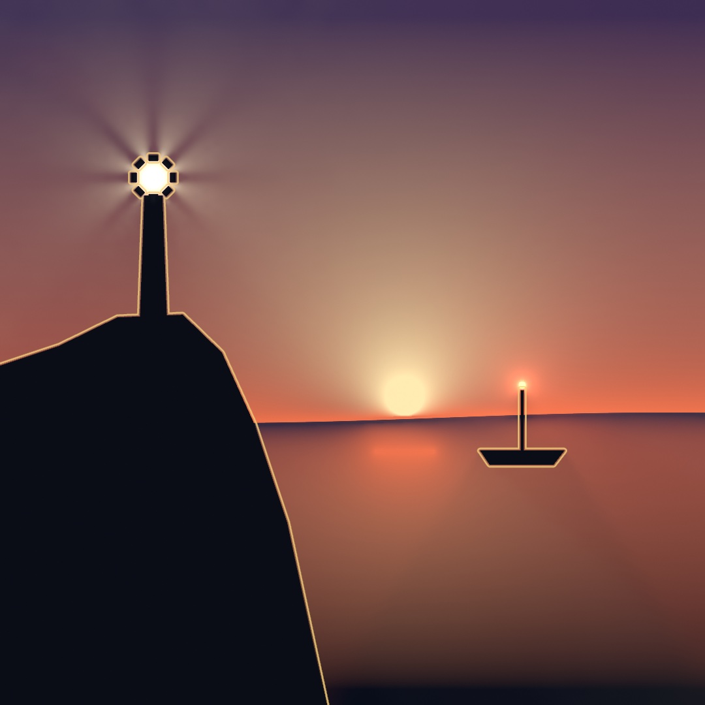
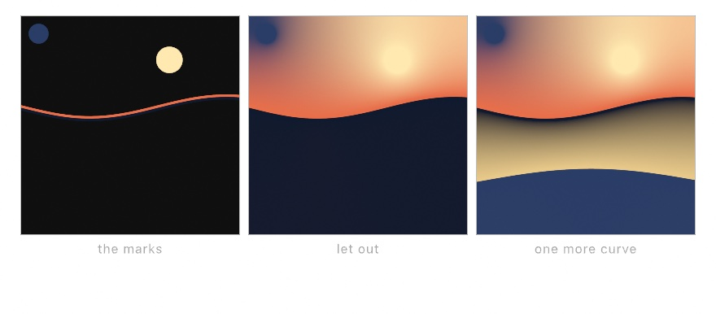
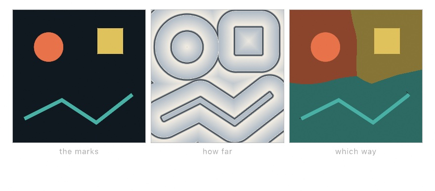
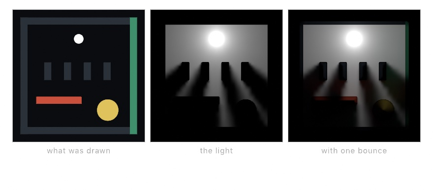
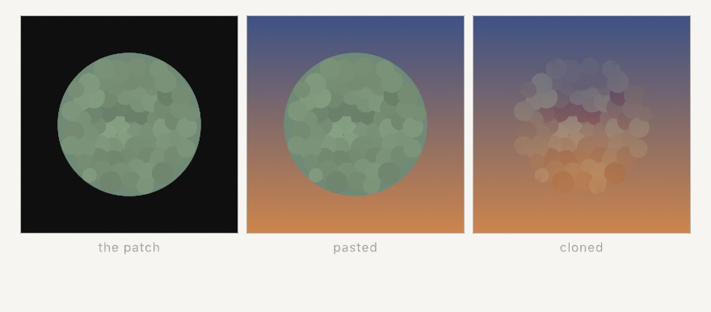
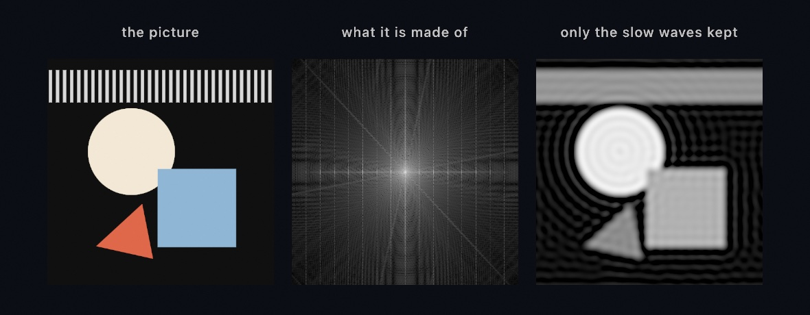
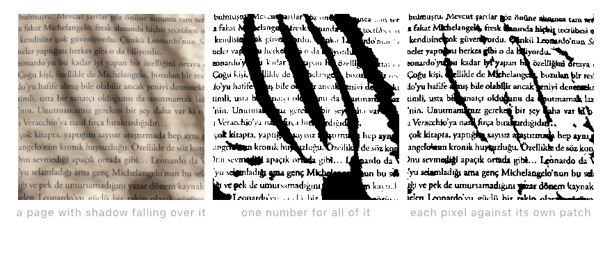

#### <sup>[Ollin](../README.md) → [Guide](README.md) → Chapter 21</sup>

---

# 21. Pictures you solve



Some filters solve a problem instead of changing a picture. Diffusion paints from a few marks, a distance field measures every pixel against an edge, and light works itself out from its lamps. In the lighthouse above, the sky is diffused, the outlines are measured, and the beams are worked out. Past it, a pasted patch loses its seam, a picture is read as waves, and a window's average costs the same at any size.

## A picture made of a few marks: diffusion

Every filter in [Chapter 20](20-PicturesRestyled.md) took a picture and did something to it. This one makes the picture.

Draw a few marks into a layer. `.diffuse` holds each drawn pixel as a color source and lets the color out into the empty space between them until it settles:

```swift
let marks = makeRenderTarget()
withTarget(marks) {
    drawDiffusionCurve(horizon, left: Color(hex: 0xE86F4A), right: Color(hex: 0x101A2E))
    noStroke(); fill(Color(hex: 0xFFE9B0))
    drawCircle(width * 0.7, height * 0.2, 26)
    fill(Color(hex: 0x2A3D66))
    drawCircle(width * 0.08, height * 0.08, 20)
}
drawImage(marks.filtered(.diffuse(sharpness: 1)).image, 0, 0)
```

<picture>
  <source media="(prefers-color-scheme: dark)" srcset="Images/21-PicturesYouSolve/Diffusion-dark.jpg">
  
</picture>

The rule the solve follows matters, because everything the picture does follows from it. Away from the marks, every pixel ends up the average of its four neighbors. That is the rule a soap film obeys when you dip a bent wire in it. Nothing overshoots, no color appears that was not put there, and a mark's influence falls away smoothly in every direction at once.

`drawDiffusionCurve` is the form the technique is named for. It takes a list of points, which is what `horizon` holds in the listing above. It draws that path twice, a small distance apart, with a different color on each side. The field jumps across the curve and stays smooth everywhere else. Left and right are named from walking the path in the order its points come, so reversing the points swaps the colors.

Now compare it to a gradient, the usual tool for a smooth field. A gradient needs a direction and two ends. This needs neither. The shape of the field is decided by where you put the marks. That is why the third panel remakes the whole lower half of the picture with one added curve. You place a few colors and let the space between them work itself out.

Two arguments matter early. A pixel counts as a source when its alpha reaches `threshold`. A half-opaque mark pulls half as hard as a solid one, so a soft brush mark is a suggestion rather than a rule. And `sharpness` decides how much of the work happens at full size. Turn it down for speed while composing, and up when a thin mark's color must stay crisp right up to the mark.

## A field you measure: the distance field

Diffusion treated the layer as something to be *solved* rather than something to be looked at. This step goes further and treats it as something to be *measured*, which is what the lighthouse's outlines are read from.

Draw your marks into a layer. Then ask every pixel in it a question: how far away is the nearest edge of anything drawn, and which way is it?

```swift
let field = marks.filtered(.distanceField())
```

<picture>
  <source media="(prefers-color-scheme: dark)" srcset="Images/21-PicturesYouSolve/MeasuredField-dark.jpg">
  
</picture>

That layer is no longer a picture. Its red channel holds the distance in pixels, running negative inside a shape and positive outside it. Its green and blue hold the direction to that nearest edge. A picture of a thing has turned into the measurement of where that thing is.

The two answers fit together into one line:

```
    nearest edge  =  pixel + direction * abs(distance)
```

`.fieldMap` reads the field back as something you can see, by running the distance through a color ramp over a window you give in pixels. The middle panel above is one call, with `bands` a ramp of a few stops, dark at the edge and pale after it:

```swift
field.filtered(.fieldMap(bands, from: 0, to: 34, repeating: true))
```

`repeating` wraps the ramp instead of stretching it. So the same colors come around every 34 pixels, and the marks carry contour lines like a map. Look at where two shapes meet in that panel. Their rings run into each other and stop along a crease. That crease is every place equally far from both, and you did not have to work it out.

Change the window and the same call does other jobs. A ramp that turns over at one distance grows the shape by that much, and shrinks it at a negative one. Here `ink` is the fill color you want:

```swift
field.filtered(.fieldMap(Ramp([ink, .clear]), from: 26, to: 27.5))
```

That grows the shape, which image tools call a dilate. Blobs that were separate merge as they grow into each other, which is how you get a soft mass out of scattered marks. A ramp that is dark in a narrow band draws an outline at any offset you like, inside or outside. That is the lighthouse's outline.

The third panel is the direction channel doing its work. Each pixel walks to its nearest edge, steps a little past it, and brings back the color it finds:

```metal
float4 shade(float2 uv, ShaderInfo info) {
    float4 field = sampleRaw(info, uv);
    float2 here = uv * info.resolution;
    float2 inside = here + field.gb * (abs(field.r) + 4.0 * sign(field.r));
    return sampleAux(info, inside / info.resolution);
}
```

Every pixel ends up with the color of whichever mark is nearest to it. That is a Voronoi diagram, built out of the shapes themselves rather than out of a list of points. It costs one lookup per pixel. `combined(with:_:)` is `filtered` for an effect that reads a second layer, and `.shader` wraps a `Shader` as one, so the call is `field.combined(with: marks, .shader(...))`. The panel dims the territories and draws the marks back on top, so the shapes stay visible.

> **Metal note.** A shader given two layers reads the first with `sampleRaw` and the second with `sampleAux`. It is `sampleRaw` rather than `sample`, the ordinary read of a layer, because the ordinary read hands a layer over as a color. A distance in pixels is not one. `sampleRaw` gives you the stored numbers untouched. `field.r` and `field.gb` pick channels out of [Chapter 18](18-YourFirstShader.md)'s `float4` by letter, the red one and the green-and-blue pair. `sign` is 1 or -1 by the sign of its argument, so the four-pixel step goes past the edge from either side. `info.resolution` is the layer's pixel size, from the same `info`.

One practical note is the cost. Measuring the whole canvas costs a few milliseconds. The measurement works outward in steps, and it needs one step per doubling of the distance it carries. When you only care about a band near the marks, say so and it gets shorter:

```swift
marks.filtered(.distanceField(maxDistance: 64))
```

Past that distance the field reads flat, with a zero direction, which is its way of saying nothing is within reach.

## Light that works itself out: `.light`

The measured field is the hard half of a bigger trick, and the trick is what throws the lighthouse's beams. Draw a scene into one layer and some lamps into another, and ask what light reaches every pixel.

```swift
let lit = scene.combined(with: lamps, .light())
drawImage(lit.image, 0, 0)
```

<picture>
  <source media="(prefers-color-scheme: dark)" srcset="Images/21-PicturesYouSolve/LightField-dark.jpg">
  
</picture>

The base layer is **the scene**: whatever you draw there is solid, and its alpha is how much of a ray it stops. The aux layer, the second one `combined(with:_:)` takes, is **the lamps**: whatever you draw there gives light off, in its own color. What comes back is the light itself, which is why you draw it as the frame instead of over the scene.

Look at what nobody drew. The comb's four teeth throw four shadows, with light through the gaps, and the shadows fan out. Each is hard where it meets the tooth that casts it, and soft further down. A pixel further down can see more of the lamp. The light thins out with distance, and it thins out at the rate a lamp's does. In the third panel the red bar reddens the floor beside it and the green wall greens its own corner of the room. Those all come from one measurement.

The argument for that third panel is `bounces`:

```swift
scene.combined(with: lamps, .light(brightness: 5, bounces: 1))
```

At `0` every surface stays black and only the lamps are seen. That is the middle panel, and a look you may want on its own. At `1`, the default, light comes back off whatever it lands on, carrying that surface's color with it. Each further bounce costs another full pass of the solve, and more is softer.

`sky` and `reach` are the two arguments to know next. `sky` is the light arriving from beyond the reach of the field. A color there turns a dark room into a lit one with a window in it. `reach` is how far light travels in pixels, which is both an answer ("this is a small room") and the argument that sets the speed.

The cost needs saying plainly. This is among the most expensive effects in the chapter. A `quality:` argument sets how closely the light is measured, as `.performance`, `.default`, or `.detail`. At the default it costs about what diffusion costs, and at `.detail` far more. Its cost does *not* follow how much you drew. One lamp and two hundred cost the same, and so do ten shapes and ten thousand. What costs is the size of the layer and how far light may travel. If a sketch needs its frame rate back, draw the light into a half-size layer first (`makeRenderTarget(scale: 0.5)`), or pass `quality: .performance`.

Underneath, the answer is a ladder of light fields. Each one holds a single ring of distance around every point it samples. Close in there are many places and few directions; further out there are few places and many directions, over a span four times as long. That trade is why one lamp on the far side of the room costs no more than one beside you. The rays are walked against the measured field from the step above, each step as long as the distance the field reads there. That is why an empty room is crossed in a single step.

## Putting it together: the lighthouse

The lighthouse is a harbor at dusk, and very little of it is painted. It composes the three steps above. A handful of marks diffuse into the whole sky and sea. Two lamps and a scene give back the light, with its beams and soft shadows worked out by `.light`. And every silhouette gets an outline read off its measured distance field. Make `MySketches/Lighthouse.swift`:

```swift
import Ollin

final class Lighthouse: Sketch {
    let night = Color(hex: 0x2A2350)
    let dusk = Color(hex: 0xE86F4A)
    let sea = Color(hex: 0x16233F)
    let deep = Color(hex: 0x080D1A)
    let sun = Color(hex: 0xFFE9B0)
    let land = Color(hex: 0x0A0D16)
    let rim = Color(hex: 0xF2C879)

    let lantern = Vector2(235, 272)

    override func draw() {
        let boat = Vector2(800, 700 + sin(time * 0.9) * 5)

        // The marks: a horizon warm above and deep below, a band of night at the
        // top, a low sun, and its path on the water. Diffusion fills in the rest.
        let marks = makeRenderTarget()
        withTarget(marks) {
            background(.clear)
            let horizon = stride(from: -20.0, through: width + 20, by: 12).map { x in
                Vector2(x, 640 + sin(x / width * 5 + time * 0.4) * 8)
            }
            drawDiffusionCurve(horizon, left: dusk, right: sea, width: 4)
            noStroke()
            fill(night)
            drawRect(0, 0, width, 24)
            fill(deep)
            drawRect(0, height - 24, width, 24)
            fill(sun)
            drawCircle(620, 606, 30)
            fill(dusk)
            drawRect(575, 690, 90, 4)
        }

        // The scene: everything the light meets. The shutter around the lamp
        // turns, and the gaps between its blades cut the light into beams.
        let scene = makeRenderTarget()
        withTarget(scene) {
            noStroke()
            fill(land)
            drawPolygon([Vector2(0, 1080), Vector2(0, 560), Vector2(90, 530),
                         Vector2(180, 486), Vector2(280, 482), Vector2(340, 540),
                         Vector2(390, 650), Vector2(440, 800), Vector2(500, 1080)])
            drawPolygon([Vector2(214, 490), Vector2(256, 490),
                         Vector2(249, 300), Vector2(221, 300)])
            for blade in 0 ..< 8 {
                let angle = time * 0.5 + Double(blade) * .tau / 8
                withState(at: lantern + Vector2(cos(angle), sin(angle)) * 30, rotation: angle) {
                    drawRect(center: .zero, width: 8, height: 13)
                }
            }
            drawPolygon([boat + Vector2(-65, -10), boat + Vector2(65, -10),
                         boat + Vector2(48, 12), boat + Vector2(-50, 12)])
            drawRect(boat.x - 2, boat.y - 104, 4, 96)
        }

        // The lamps: the lighthouse lamp, and a small one at the masthead.
        let lamps = makeRenderTarget()
        withTarget(lamps) {
            noStroke()
            fill(Color(hex: 0xFFF1C8))
            drawCircle(lantern.x, lantern.y, 12)
            fill(Color(hex: 0xFF7A50))
            drawCircle(boat.x, boat.y - 110, 6)
        }

        // The sky, then the silhouettes, then the light laid over both.
        drawImage(marks.filtered(.diffuse()).image, 0, 0)
        drawImage(scene.image, 0, 0)
        blendMode(.add)
        drawImage(scene.combined(with: lamps, .light(brightness: 6)).image, 0, 0)
        blendMode(.normal)

        // An outline a few pixels out from every silhouette, read off the field.
        let field = scene.filtered(.distanceField(maxDistance: 32))
        let band = Ramp([rim.withAlpha(0), rim, rim.withAlpha(0)])
        drawImage(field.filtered(.fieldMap(band, from: 1, to: 5)).image, 0, 0)
    }
}
```

The sketch builds three layers each frame and reads the picture out of them. `marks` holds the diffusion's sources. The horizon is a curve with dusk above and sea below. A band of night runs along the top, and deep water along the bottom. The sun and its path on the water are marks too. `.diffuse()` settles everything between them. The horizon's wave is part of the curve, so the sky and the sea swell with it.

`scene` does two jobs. `.light` reads it as the solid things that stop a ray, and `.distanceField` reads the same layer as shapes to measure. `lamps` holds the two lights. What `.light` hands back is the light alone. So the sketch draws the sky and the silhouettes first, and adds the light over them under [Chapter 19](19-LayersAndEffects.md)'s `.add`. Adding black changes nothing, so wherever no lamp reaches, the sky shows through untouched.

The beams come from the shutter. Its eight blades turn with `time`, and the gaps between them let the lamp's light out in spokes. Nothing in the sketch draws a beam. It is the comb from the room above, bent into a ring.

The outline is a `fieldMap` whose ramp runs from clear to gold and back to clear, over a window from 1 to 5 pixels. That lights a thin band just outside every silhouette, the mast and the shutter blades included. The field is measured again every frame, so the band follows the boat as it rocks on the swell.

> **Swift note.** The horizon is built by `stride`, which [Chapter 14](14-FieldsAndFlow.md) used to make a list of levels. Here a `.map` turns each x into a point. `withState(at:rotation:)` is [Chapter 16](16-CurvesAndFigures.md)'s move-and-turn scope, so each blade is drawn at its own place around the lamp. `drawRect(center:width:height:)` places a rectangle by its middle, and `rim.withAlpha(0)` is [Chapter 9](09-Pictures.md)'s way to make a color transparent.

Then make it yours:

- Put the sun on the pointer. Its disc is a mark like any other, so `drawCircle(mouseX, mouseY, 30)` in its place re-solves the whole sky around wherever you point.
- Chart the water. Measure a second field out to a `maxDistance` of 120, and map it with `repeating: true` over a window of about 18 pixels. It rings the boat and the headland like ripples on a map.
- Give the land a color. Fill it a dark green instead of near-black, and with the default single bounce the light that lands on the headland comes back green.

The lighthouse is about motion, since the beams sweep and the boat rocks on the swell, so keep it as a movie. `swift run OllinLive MySketches/Lighthouse.swift --export-video lighthouse.mp4 --seconds 16` writes sixteen seconds of it. An export raises the light to its detail quality, so the file takes longer to write than the window takes to draw.

## Other problems a layer can solve: a seamless paste, the frequency domain, and local averages

The lighthouse solved three problems: colors settled between a few marks, distance measured from every silhouette, and light traced from lamps. Three more filters treat a layer the same way, as a problem rather than a picture, and none of them is in the lighthouse. The first settles a pasted patch into its new picture the way diffusion settles a color. The second reads a picture as the waves that add up to it. The third answers any window's average at a flat price.

### Putting a piece of one picture into another: `.seamlessClone`

`.seamlessClone` drops a patch from one picture into another without its seam. It is for a slab of texture, a cut-out, or anything from elsewhere that would otherwise read as pasted. The rim gives a paste away, and so does the color, since the patch was lit differently wherever it came from. The method is the Poisson image editing that Patrick Pérez, Michel Gangnet, and Andrew Blake published in 2003. It fixes both without touching the patch's detail:

```swift
let backdrop = makeRenderTarget()
withTarget(backdrop) { drawImage(wall, 0, 0) }

let patch = makeRenderTarget()
withTarget(patch) { drawImage(stones, 240, 180) }   // transparent everywhere else

drawImage(backdrop.combined(with: patch, .seamlessClone()).image, 0, 0)
```



Where the patch layer is opaque is where it lands, so the shape you draw is the shape that gets cloned. Draw it where you want it, and that is the whole of the positioning.

Here is what it does. Around the rim it measures how far the patch's color sits from the backdrop's. It spreads that difference across the inside as smoothly as it can, and adds it back. On the rim that lands on the backdrop, so there is no join left to see. Inside, the patch is nudged by the gentlest correction that reaches it. The stones survive because only the slow, low part of the color is replaced.

Spreading a difference as smoothly as possible is the diffusion from the first step, under another name. The marks are the rim, and the field between them is the correction.

Two things follow, and both are better known in advance. The patch keeps its own **range of tone** and only moves where that range sits. Drop a contrasty patch somewhere much darker than itself and its shadows go below black. And the rim is where the entire answer comes from, so a rim laid across a **hard edge** drags that edge inward. Keep the rim on quiet ground and neither one comes up.

`amount` runs from 0 to 1. One is the full clone. Zero leaves the seam in, which is the picture you want beside it when you are deciding whether it worked. [`Examples/Effects/SeamlessClone`](../Examples/Effects/SeamlessClone/Sketch.swift) does the paste live.

### A picture read as waves: the Fourier transform

A grid of pixels is one reading of a drawing. A **sum of waves** is another, and the two hold the same information. The Fourier transform is how you get from one to the other. It is for the jobs that are awkward on the pixel side and easy on the wave side. Those are filtering a picture by scale, and making a field out of a spectrum. The idea is Joseph Fourier's, read to the Paris Institute in 1807 and published in 1822. The fast form every computer runs is James W. Cooley and John W. Tukey's, from 1965, and in Ollin it runs on the GPU:

```swift
let spectrum = plate.filtered(.fourier())
drawImage(spectrum.filtered(.spectrum()).image, 0, 0)   // the view of it
```



The middle panel is that spectrum, drawn through `.spectrum()`, the view that makes its faint values visible. It is a map of the drawing's *scales* rather than a picture of the drawing. Slow, wide gradients sit near the middle, and fine detail out at the edges. The star through it is the shapes' straight edges. The evenly spaced vertical lines are the stripes. One wavelength, repeated, lands at one spacing along the middle line. The stripe band is short, so each of those points stretches into a vertical line.

The reason to make the trip is that filtering by scale, which is awkward on the pixel side, is a multiplication on this side. Draw a shape over the spectrum and you have a filter:

```swift
let soft = plate.filtered(.fourier())
    .combined(with: mask, .mask())     // white circle in the middle of a black layer
    .filtered(.inverseFourier())
```

`.mask()` keeps the base where the second layer is white and drops it where it is black, which is the multiplication. Keep the middle and the fine detail is gone. That is the third panel, and the stripes have become one flat band. Invert the mask and the opposite happens, leaving the edges and nothing else. A ring keeps one band of scales and drops both the coarse and the fine, which no ordinary blur can do.

There are three things to know before you reach for it. The layer has to be square with a side that is a power of two, 256, 512, or 1024, because the transform works by halving. `makeRenderTarget(width: 512, height: 512)` makes one. It reads one channel, the brightness unless you name another, so what comes back is gray. And a hard-edged mask *rings*. The ripples around every shape in the third panel are the price of cutting a band off sharply. Soften the mask's own edge to soften them.

It also runs the other way on its own. Write a spectrum, transform it, and a field comes out that nobody drew. The physics of a sea is written as a spectrum, and that is how [Chapter 29](29-Landscapes.md) makes an ocean. The [reference](../Docs/Drawing/Fourier.md) has the cost and the rest of the rules, and [`Examples/Effects/Fourier`](../Examples/Effects/Fourier/Sketch.swift) filters a picture by scale live.

### Averages of a neighborhood, at a flat price: the summed-area table

The [distance field](#a-field-you-measure-the-distance-field) asked every pixel how far away something was. Here is a different question, and a cheaper answer: what does the neighborhood around this pixel look like? It is for a blur that reaches across the canvas. It is also for cutting a page to black and white under light that falls unevenly across it. The table that answers it is Franklin C. Crow's summed-area table, from 1984.

The obvious way to answer costs more the wider you look. A 5-pixel square is 25 reads and a 500-pixel square is 250,000. A blur that reaches across the canvas costs too much to run each frame. The table turns the cost into a flat fee.

Build one table first. Every cell of the table holds the sum of everything above and to the left of it. Then the sum over *any* rectangle is a bit of arithmetic on four corners of that table:

```
      A ─────────── B          the shaded box
      │             │            =  D − B − C + A
      │      ┌──────┤
      │      │//////│          four lookups, wherever the box is
      C ─────┼──────D          and however big it is
             │//////│
```

That table is a **summed-area table**, and once you have one, two useful filters cost almost nothing.

The first is a blur:

```swift
layer.filtered(.boxBlur(radius: 4))     // these two
layer.filtered(.boxBlur(radius: 400))   // cost the same
```

It is the plainest blur there is, the average of the square around each pixel, and it is not as good-looking as `gaussianBlur`. Reach for it when the reach is large. Reach for it too when the radius changes while the sketch runs, and you do not want the frame rate changing with it. Three of them in a row come close enough to a Gaussian to pass for one, and that is still three fixed-price passes.

The second filter, `adaptiveThreshold`, is the reason to build the table.

<picture>
  <source media="(prefers-color-scheme: dark)" srcset="Images/21-PicturesYouSolve/LocalAverages-dark.jpg">
  
</picture>

The left panel is a page with bands of shadow falling across it. `.threshold(0.3)` is the filter that sends every pixel brighter than one number to white and the rest to black. Try to cut the page with it and you have to pick that number, and there is no number that works. Pick one that keeps the shadowed bands and you flood the lit paper. Pick one that keeps the lit paper and the bands go solid black, which is the middle panel.

`adaptiveThreshold` compares each pixel with the average of its own surroundings instead. The rule is Derek Bradley and Gerhard Roth's, from 2007:

```swift
page.filtered(.adaptiveThreshold(window: 16))
```

That is the right panel. The text comes back through the shadow, and only the darkest band edges keep a streak. Hard contrast is local, and uneven light is not, so comparing locally keeps the first and throws away the second.

The argument that matters is `window`, how wide that neighborhood is in pixels. It wants to be big enough to hold both ink and paper. Set it smaller than your marks and the middle of a thick stroke sees nothing but more stroke. It decides that must be what paper looks like here, and comes out hollow. It is bounded on the other side too. A window wider than a shadow band averages the lit paper around it, and the band comes out solid ink. So the window wants to be wider than the marks and narrower than the lighting you want to see past. A line height or two suits a page of text, which is the 16 pixels above. Left alone it is an eighth of the layer, which suits a page lit unevenly from edge to edge.

There is one more argument, `bias`, which is how far below the local average a pixel has to fall before it goes dark. It is a *fraction* rather than a fixed amount, for a reason. Light falling on a page multiplies what comes back off it. So only a test that scales along with the average is unmoved when somebody turns the lamp down.

There are two costs, and neither grows with the window. Building the table is about twenty passes over the layer, a few milliseconds for a full canvas. One of these in a frame is comfortable. A dozen are not. And the running totals get large, which eats into a float's precision and leaves a small error behind. That error is a fixed amount divided by the area you asked for, so it fades away as the window grows. It only shows up at tiny radii, which is where you would reach for a Gaussian anyway. [`Examples/Effects/SummedArea`](../Examples/Effects/SummedArea/Sketch.swift) runs both filters over a page.

## Where this comes from

Each of the lighthouse's three steps solves a problem somebody published. Diffusion curves are Alexandrina Orzan, Adrien Bousseau, Holger Winnemöller, Pascal Barla, Joëlle Thollot, and David Salesin's, from 2008. The measured field floods the layer by Guodong Rong and Tiow-Seng Tan's jump flooding, from 2006. The light rebuilds Alexander Sannikov's radiance cascades, from 2024.

The entries after the lighthouse name their own sources. The seamless paste is Pérez, Gangnet, and Blake's Poisson image editing from 2003. Its correction settles by the convolution pyramids of Zeev Farbman, Raanan Fattal, and Dani Lischinski, from 2011. The waves are Cooley and Tukey's fast Fourier transform from 1965. The local averages stand on Crow's summed-area table from 1984, with Bradley and Roth's adaptive threshold from 2007 on top of it. Full credits are in the project's [attribution notes](../ATTRIBUTION.md).

## Go deeper

- [Diffusion](../Docs/Drawing/Effects.md#generate) and the [seamless paste](../Docs/Drawing/Effects.md#combined): `.diffuse` and `drawDiffusionCurve` with their arguments, and what `.seamlessClone` keeps and where its rim should sit.
- [Measured distance fields](../Docs/Drawing/DistanceFields.md): what the field holds, reading it back, and the jump flood underneath it.
- [The frequency domain](../Docs/Drawing/Fourier.md): the transform both ways, filtering by scale, building a field from its spectrum, and what the ladder costs.
- [Light in a flat sketch](../Docs/Drawing/Light.md): the two layers, every argument, the cost at each quality tier, what it will not do, and the ladder underneath it.
- [Local averages](../Docs/Drawing/LocalAverages.md): the box blur, the adaptive threshold, choosing the window, and what the summed-area table costs.
- Worked examples: [`Examples/Effects/DiffusionCurves`](../Examples/Effects/DiffusionCurves/Sketch.swift), [`Examples/Effects/SeamlessClone`](../Examples/Effects/SeamlessClone/Sketch.swift), [`Examples/Effects/DistanceField`](../Examples/Effects/DistanceField/Sketch.swift), [`Examples/Effects/Fourier`](../Examples/Effects/Fourier/Sketch.swift), [`Examples/Effects/Light`](../Examples/Effects/Light/Sketch.swift), and [`Examples/Effects/SummedArea`](../Examples/Effects/SummedArea/Sketch.swift).

---

[Contents](README.md#contents) · Previous: [Chapter 20, Pictures restyled](20-PicturesRestyled.md) · Next: [Chapter 22, Iterated forms](22-IteratedForms.md)
