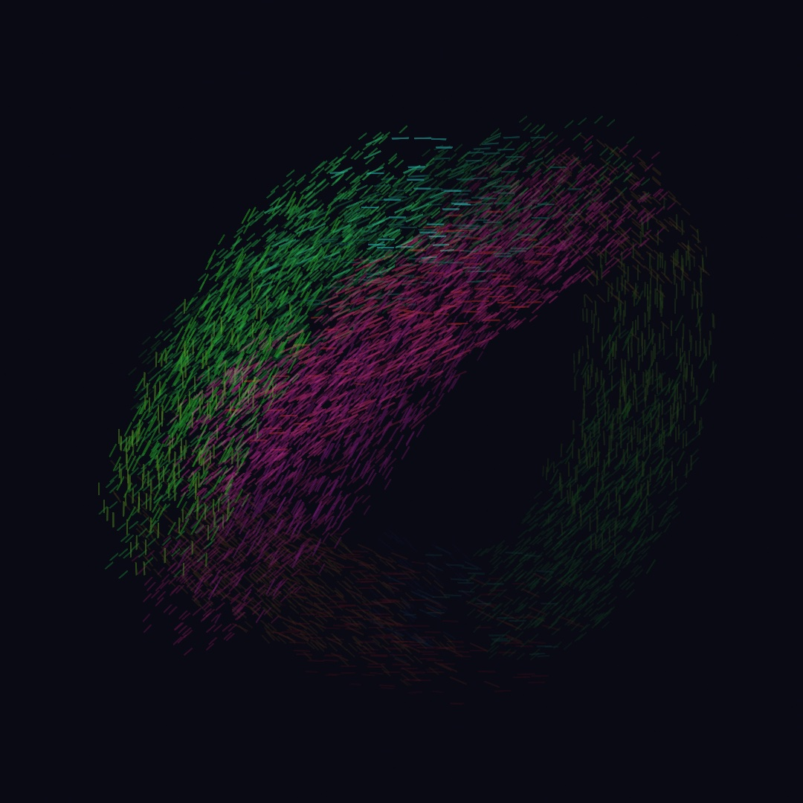
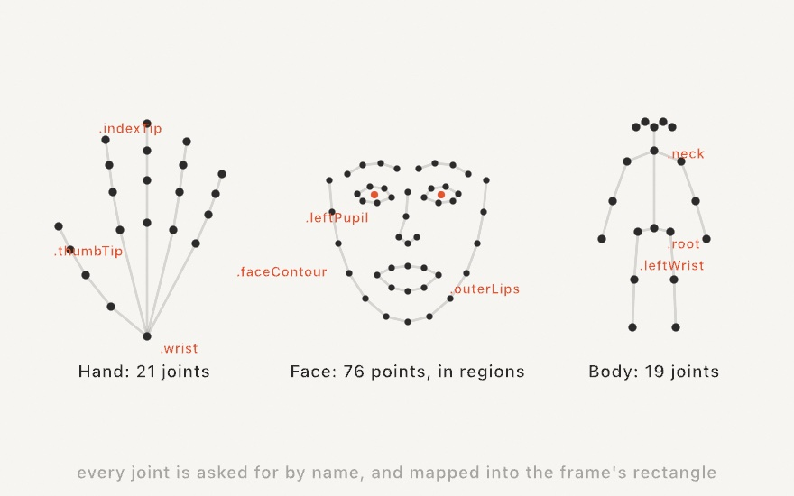
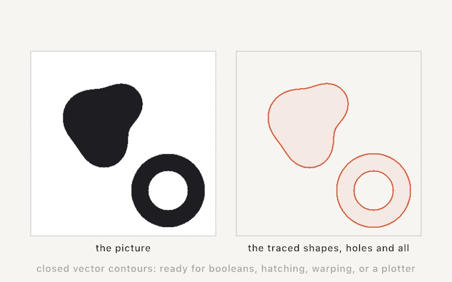
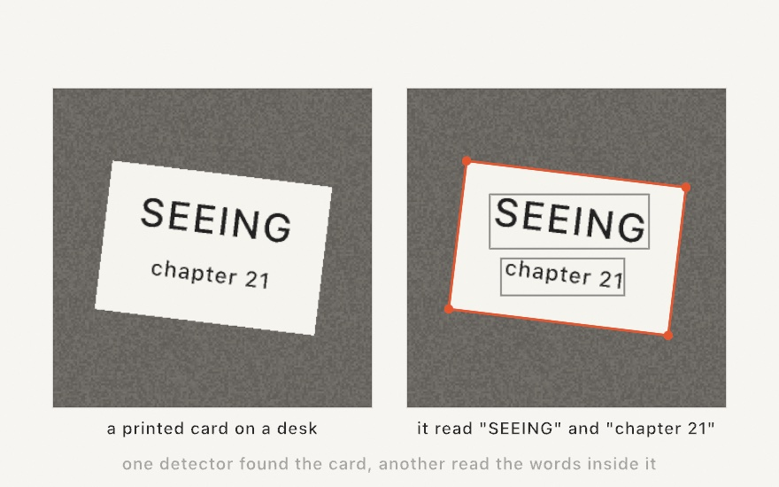
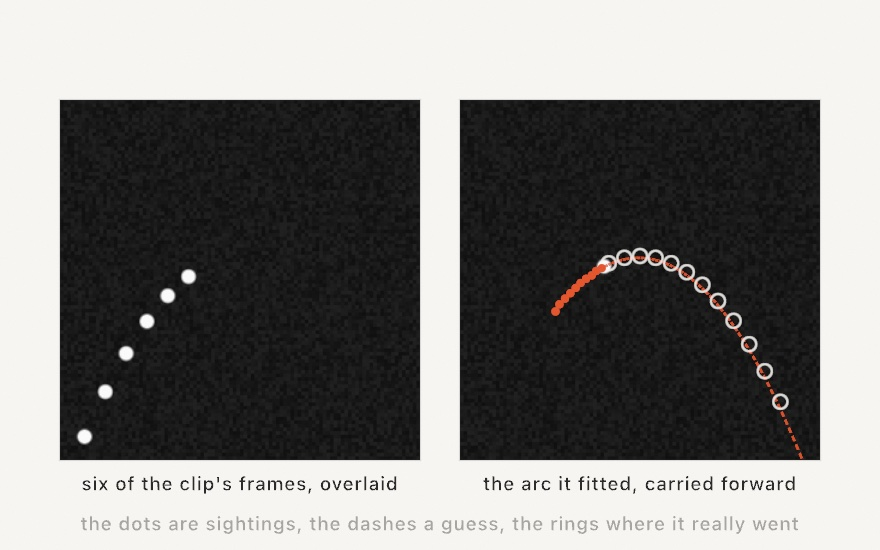
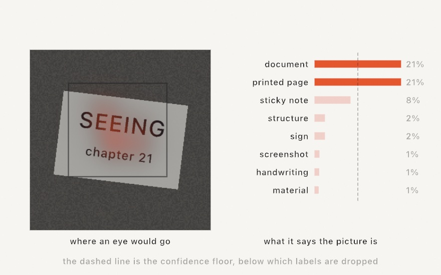
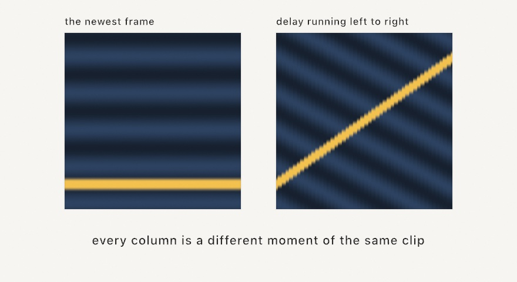

#### <sup>[Ollin](../README.md) → [Guide](README.md) → Chapter 21</sup>

---

# 21. Seeing



A camera pointed at the world is the richest input a sketch can have, because whoever stands in front of it brings their face, their hands, their whole moving body to the piece. This chapter is about reading that. The Mac already knows how to find faces, hands, bodies, edges, text, and motion in a picture, on the machine, with no cloud in the loop, and Ollin wraps that perception as values you read in `draw()`, the same way you read the mouse. The painting above was made by motion alone, and by the end you'll have built it.

## The webcam is an image

Everything starts with `OllinVision`'s `Camera`, a frame source you start once and then draw like any image.

```swift
import Ollin
import OllinVision

final class Mirror: Sketch {
    let camera = Camera()

    override func setup() { try? camera.start() }

    override func draw() {
        background(.black)
        drawFrame(camera)
    }
}
```

Run it and you're on the canvas. `drawFrame(camera)` draws the latest frame letterboxed into the canvas (fitted without stretching, like a photo in a mat), shows a standard "Waiting for camera…" notice until the first frame arrives, and returns the rectangle the picture landed in. Keep that rectangle, because it matters more than it looks. Using the camera needs permission, like the microphone did, and macOS asks once, the first time `start()` runs. `Camera(.continuity)` uses a nearby iPhone as the camera, and `.external` a USB webcam.

## Trackers: attach, then read

Seeing more than pixels is the job of the **trackers**. Each one attaches to a frame source and runs one kind of perception over its frames, publishing typed results your sketch reads every frame:


```swift
final class Faces: Sketch {
    let camera = Camera()
    lazy var faces = FaceTracker(camera)

    override func setup() { try? camera.start() }

    override func draw() {
        background(.black)
        guard let rect = drawFrame(camera) else { return }

        noFill(); stroke(.green); strokeWeight(2)
        for face in faces.faces {
            drawRect(face.bounds(in: rect))
            drawPolyline(face.landmarks(.faceContour, in: rect))
        }
    }
}
```

That's the whole model, and every tracker follows it. The analysis runs on a background thread, throttled to what the machine keeps up with (analysis frames are skipped under load, never queued, and the *displayed* frame is never dropped), so your `draw()` stays smooth and simply reads the most recent result.

The second half of the diagram is the part that bites everyone once. Trackers report geometry in **normalized** coordinates: `0...1` across the frame, origin at the *lower left*, y pointing *up*. The canvas is pixels from the *top left*, y pointing *down*, and the frame usually landed letterboxed somewhere inside it. So every result must be flipped and scaled into the rectangle you drew the frame in. You never do that math yourself, because every result type carries `in:` helpers (`bounds(in: rect)`, `point(_:in:)`, `landmarks(_:in:)`) that take the rectangle `drawFrame` returned and answer in canvas terms. Pass `mirrored: true` to them when you draw the feed flipped like a bathroom mirror, which is usually what feels right for a piece you stand in front of.

> **Swift note.** `lazy var faces = FaceTracker(camera)` builds the tracker the first time it's touched, which is what lets its declaration mention `camera`, another property of the same class. Plain `let` properties initialize too early for that.

## Hands, faces, bodies

Three trackers carry most interactive pieces, and they all speak in named parts:



**`HandTracker`** finds up to two hands (ask for more with `maximumHandCount:`), each a `Hand` of 21 joints, the wrist plus four joints per finger, base to tip. `hand.point(.indexTip, in: rect)` is a fingertip as a canvas point, `finger(.index, in: rect)` one finger as a polyline, `bones(in: rect)` the whole skeleton as line segments. Gestures fall out of arithmetic on a few joints: thumb tip near index tip is a pinch, five spread tips are an open hand, the index tip alone is a cursor that needs no mouse.

**`FaceTracker`** finds every face with its head pose (`roll`/`yaw`/`pitch`) and 76 landmark points grouped into named regions: `.faceContour`, the brows, the eyes, `.nose`, the lips, the pupils. Each region comes back ready to `drawPolyline`, which is why the five-minute face overlay is a creative-coding classic.

**`BodyTracker`** finds every person as a 19-joint pose skeleton, head to ankles. Joints it can't see are simply absent (often the legs, at a desk), so what you get is what the camera saw.

**`BodyTracker3D`** reads a person as positions in space instead. From the same ordinary webcam it places 17 joints in *meters*, so the sketch knows how far away someone is standing and what their pose looks like from the side. You read it in whichever of three spaces suits what you're drawing. `point(_:in:)` and `bones(in:)` behave exactly like the flat tracker's, for an overlay on the feed. `position(_:)` and the no-argument `bones()` give meters with the pelvis at the origin, so plotting `(z, y)` draws the person from the side and `(x, z)` from above, views no camera was at. And `cameraRelativePosition(_:)` gives meters from the lens, which makes a joint's z its distance, with `body.distance` as the shortcut for the whole person's.

```swift
lazy var pose = BodyTracker3D(camera)
// in draw(), with `rect` from drawFrame and `side` a spot to draw the side view:
if let body = pose.body {
    for (a, b) in body.bones(in: rect) { drawLine(a, b) }        // over the feed
    for (a, b) in body.bones() {                                 // seen from the side
        drawLine(side + Vector2(a.z, -a.y) * 200, side + Vector2(b.z, -b.y) * 200)
    }
}
```

Those meters drop straight into Chapter 17's world, which is what `Examples/Vision/BodyPose3D` does with them. It behaves differently from the flat tracker in ways worth knowing before you reach for it. It follows only one person, so `body` is a single optional rather than a list, and it always places the whole skeleton, guessing at the joints it can't see, with no per-joint confidence. The 2D tracker is the opposite on both counts. There's also `body.height`, an estimate of how tall the person is, and `heightEstimation` tells you whether that came from real depth data or from scaling the skeleton to a standard height, which is all a plain webcam can offer.

Two practical notes are worth keeping. These are neural models, and the heavier ones (body pose, segmentation) want Apple silicon. Every tracker exposes `isAvailable` and `unavailableReason`, and `drawStatus(reason, style: .warning)` turns the reason into the standard on-canvas notice instead of a silent nothing. And every tracker also runs one-shot on a still picture with no camera at all. `try await FaceTracker.detect(in: image)` analyzes a loaded `Image`, which is how you analyze photos, and how this chapter's figures were made honest.

## Edges and motion

Two more trackers see *qualities* of the picture rather than things in it, and both connect straight back to ideas you already have.

**`ContourDetector`** traces the boundaries between dark and light into closed vector contours, and hands them back as Chapter 13's `Shape`s, holes and all:



The picture on the left was built pixel by pixel by the committed figure, standing in for a camera frame, and the shapes on the right are what `ContourDetector.detect(in:)` traced out of it. Once a camera frame is `Shape`s, everything from Chapter 13 applies: boolean it, offset it, hatch it, warp it, export it as SVG for a plotter. A webcam pointed at high-contrast subjects becomes a live vectorizer.

**`FlowTracker`** measures **optical flow**, meaning how every part of the picture moved since the previous frame. Chapter 12 taught fields as "an answer at every point", and this is that exact idea, except the answers are measured from the world instead of computed from noise:


```swift
lazy var flow = FlowTracker(camera)
// in draw():
if let field = flow.field {
    let push = field.vector(at: particle.position, in: rect)   // canvas-space motion
}
```

`field` is `nil` until the second analyzed frame (flow needs a pair), then you can ask it anywhere: `vector(at:in:)` for the motion under a point, `samples(in:every:)` for a grid of arrows, `averageFlow(in:)` for the whole picture's drift. Look closely at the figure and you'll see that only one hand grew arrows. The other was turning around at that instant, nearly still, and flow reports *motion*, not presence, so a hand at rest is invisible to it.

Motion is also only measurable where the picture has texture, and a featureless area (a blank wall, a solid backdrop) doesn't politely read as zero. It reads as noise, because there is nothing to match from one frame to the next. If your scene is mostly flat, give it some texture before trusting the field there. Treat the magnitudes as a signal to scale by a gain of your own rather than a calibrated speed. The measured field has its own name, `MotionField`, so you won't confuse it with Chapter 12's generative `FlowField`: one is a rule you invent, the other is motion the camera actually saw.

## Lifting the subject

One more pair reads the picture as foreground and background. **`PersonSegmenter`** finds the people in the frame, **`SubjectSegmenter`** finds whatever stands out whether or not it's a person, and both hand back the same two pictures.

```swift
lazy var people = PersonSegmenter(camera)

override func draw() {
    background(.black)                       // or anything: this is the new backdrop
    guard let rect = drawFrame(camera) else { return }
    if let cutout = people.cutout { drawImage(cutout, in: rect) }
}
```

Where the pose trackers reduce a person to joints, these give you their pixels. `matte` is a soft white silhouette whose alpha says how much each pixel belongs to the subject, so `tint(_:)` turns it into a shadow, a glow, or a flat colored figure. `cutout` is the frame's own pixels with the background gone, ready to composite over whatever your sketch has already drawn. Both come back as ordinary `Image`s, so draw them into the same rectangle as the frame and they land exactly on the picture.

Stamp the matte every frame without clearing and you have a trail of yourself, which is Chapter 14's accumulation with a person as the brush. `PersonSegmenter` takes a `quality:` that trades edge detail for speed, and `SubjectSegmenter` adds a `count` of how many separate subjects it found, going to `nil` and `0` while nothing in the picture stands out. Both need Apple silicon, like the pose trackers.

## Reading what's printed

The next three trackers aren't looking for people. They look for the flat printed things the world is full of, and none of them needs Apple silicon. Two are classical computer vision with no neural model at all, and the third, the text reader, runs on a model every Mac already has.



**`RectangleDetector`** finds rectangular things, a sheet of paper, a screen, a card on a desk, and reports each one's four corners. It works on them at an angle, so the corners come back in perspective rather than as an upright box, which is what a document scanner needs to flatten a page.

```swift
lazy var cards = RectangleDetector(camera)

// in draw(), after `guard let rect = drawFrame(camera) else { return }`
noFill(); stroke(.green)
for card in cards.rectangles { drawPolygon(card.corners(in: rect)) }
```

A `DetectedRectangle` also offers `center(in:)`, `bounds(in:)` (the upright box around those corners) and a `confidence`, and the initializer takes aspect, size and confidence limits when you want to be fussy about what counts as one.

**`TextRecognizer`** reads text off the feed with Apple's on-device OCR. `reader.lines` is one `DetectedText` per line, each carrying its `text` and its `bounds(in:)`, and `reader.text` joins every line into a single string. The `level:` argument trades speed for thoroughness, so `.fast` keeps up with a live feed while `.accurate` reads more and is the default for a still image.

**`BarcodeScanner`** decodes barcodes and QR codes. A `DetectedBarcode` gives you the decoded `payload`, the `symbology` that says which kind of code it was, and `corners(in:)` for where it sits. Pointing a webcam at a QR code is a friendly way to hand a running installation some input, since anyone in the room can make one on their phone.

The figure above used no camera and no photograph. The committed figure [`ReadingACard.swift`](Figures/21-Seeing/ReadingACard.swift) draws the desk, the card and the type into a picture pixel by pixel (the letters are Chapter 7's `textToShapes` outlines, filled in by hand), then hands that picture to the two real detectors through `waitFor`. Its right-hand caption is written from the words that came back, so if the reader ever came back with something else, the figure would say so rather than keep the old claim.

## Following one thing

Detecting and tracking sound like the same job, and they're not. A detector looks at each frame fresh and finds whatever it has a model for. A tracker is handed one thing and keeps up with it, whether or not anything knows what that thing is.

**`ObjectTracker`** is the second kind. You give it a box and it follows that patch of picture from frame to frame, which is how you keep tabs on something no recognizer has ever heard of.

```swift
lazy var tracker = ObjectTracker(camera)
var view = Rectangle(x: 0, y: 0, width: 1, height: 1)

override func draw() {
    guard let rect = drawFrame(camera) else { return }
    view = rect
    if let object = tracker.trackedObject {
        noFill(); stroke(.green)
        drawRect(object.bounds(in: view))
    }
}

override func mousePressed() {
    tracker.track(centeredAt: Vector2(mouseX, mouseY), size: 160, in: view)
}
```

Click something and the sketch follows it. Alongside its box, `trackedObject` carries a `confidence` that falls as the patch is hidden, leaves the frame, or moves too fast to keep up with. That's a good number to fade an overlay by, and a good one to threshold on so the sketch can decide it has lost the thing and ask for a new box.

**`TrajectoryTracker`** waits for things that fly. Rather than being pointed at something, it watches for the signature of ballistic motion, so a thrown ball or a bouncing pebble arrives on its own as a `DetectedTrajectory`: a run of sightings, and the parabola fitted through them.



The dashed line is the part worth staying with. `equationCoefficients` is that fitted parabola in normalized coordinates, `y = c.x · x² + c.y · x + c.z`, and nothing stops you sampling it past the last sighting, which is a guess about where the thing is going.

```swift
for arc in tracker.trajectories {
    drawPolyline(arc.projectedPoints(in: view))              // the path so far
    let c = arc.equationCoefficients
    drawPolyline(stride(from: 0.5, through: 1, by: 0.02).map { x in
        VisionSpace.point(x, c.x * x * x + c.y * x + c.z, in: view)
    })                                                       // where it's headed
}
```

In the figure the detector was shown the first 24 frames of a made-up flight, all of them on the way up, and the pale rings are where the ball actually went in the frames it never saw. The dashed curve runs through them. A parabola has only three numbers in it, so once the detector holds a handful of sightings, the rest of the flight follows.

It asks two things of you. Hold the camera still, because a moving camera turns the whole scene into motion, and be patient, because an arc is only reported once its object has been seen `trajectoryLength` times (ten by default). Call `reset()` after the scene jumps, like a clip looping back to its start, so the jump isn't read as something flying. Each arc also keeps a stable `id` as more of it comes into view, so you can gather sightings into trails that outlive any single frame. And `detectedPoints(in:)` gives the raw sightings where `projectedPoints(in:)` gives them projected onto the fitted curve, which is the smoother of the two and usually the one to draw.

## What the picture is about

Two trackers answer a question about the whole picture rather than finding things inside it. Both are neural models, so both want Apple silicon.



**`ImageClassifier`** names what's in view, from a fixed vocabulary of about 1,300 everyday words. It reports no positions at all, only labels and how confident it is about each, which is the right shape for a sketch that reacts to its surroundings instead of drawing on top of them.

```swift
lazy var classifier = ImageClassifier(camera)

// in draw():
for (i, found) in classifier.labels.prefix(5).enumerated() {
    drawText("\(found.name) \(Int(found.confidence * 100))%", 40, 60 + Double(i) * 32)
}
```

The bars on the right of the figure are that list, drawn for the made-up card. The vocabulary is hierarchical, so one clear subject lights up its whole family at once, which is why `document` and `printed page` tie. And the classifier scores every word it knows on every frame, nearly all of them near zero, so `minimumConfidence` (`0.1` by default) is what keeps `labels` down to the few worth reading. The figure asked for a much lower floor so that the tail shows, and the dashed line marks where the default would have cut.

The other way to read the same result suits knobs better. `confidence(of: "plant")` answers for any word in the vocabulary whether or not it cleared the floor, so "how much does this look like a plant" can drive a color or a speed straight from the room.

**`SaliencyTracker`** maps where an eye would go. `heatMap` is a white image whose alpha is the salience, so a `tint(_:)` turns it into a glow over the picture. `regions` are the boxes it peaks in. And `salience(at:in:)` answers for one canvas point, which is the field-shaped reading of Chapter 12: a density for stippling, a weight for where to spend detail, an attractor for particles.

In the figure the attention piles onto the words rather than onto the card as a whole. That's the model doing exactly what it was trained on, since type and contrast are what people look at. There are two flavors, chosen with `mode:`. The default `.attention` predicts human gaze, while `.objectness` highlights regions likely to hold discrete objects whether or not they draw the eye. The mode is fixed when you make the tracker, so read both by making two.

## Bringing your own model

When the built-ins run out, **`ModelTracker`** runs a Core ML model of your own over the same frames, with the same attach-and-read shape. That opens the whole published-model world: depth estimators, object detectors, style transfer, semantic segmentation, anything that converts to Core ML.

It fills whichever read surfaces match what your model puts out. A classifier gives you `labels` and `top` and `confidence(of:)`, over your own vocabulary rather than Apple's. A detector gives you `objects`, labeled boxes you map with `bounds(in:)`. An image-to-image model, a depth estimator say, shows up in two forms at once, since `map` reads its output as a value field (white-alpha and tintable, with `value(at:in:)` for the number under a point) while `outputImage` reads the same output as a picture, which is what you want from a model that paints rather than measures. And a semantic segmenter fills `classMask`, which knows which classes are in frame, which one sits under a point, and how to hand you any of them as a drawable mask.

```swift
lazy var depth = ModelTracker(camera, modelAt: URL(fileURLWithPath:
    "Models/DepthAnythingV2SmallF16.mlpackage"))

override func draw() {
    guard let rect = drawFrame(camera) else { return }
    if let map = depth.map { drawImage(map, in: rect) }
    let near = depth.value(at: Vector2(mouseX, mouseY), in: rect)   // 0 far … 1 near
}
```

This is the one corner of the chapter with a download step, because Ollin ships no weights. `Scripts/fetch-models.sh` pulls the ones the examples use, and `Examples/Vision/DepthRelief`, `ObjectDetection`, `DigitReader` and `PaintByClass` each show a different one of the four surfaces above. `StyleMirror` is the odd one out and trains its own model from a style image you pick, so nobody's weights are involved.

Loading runs in the background off the frame loop, and `isLoaded` flips when the model is ready, with frames simply passing by until then. Expect the first launch of a freshly built sketch to sit for a few seconds while Core ML specializes the model for your Mac; every later launch of that same build starts immediately. A model file that's missing or won't load reports through the same `isAvailable` and `unavailableReason` pair the built-in trackers use, so you can tell the person in front of the screen what to do about it.

## Footage as material

Everything above also works on recorded video, because `VideoPlayer` is a frame source exactly like the camera:

```swift
import OllinVideo

let player = try VideoPlayer(path: "/path/to/clip.mp4")
lazy var contours = ContourDetector(player)     // traces the clip as it plays

override func setup() { player.loops = true; player.play() }
override func draw() { drawFrame(player) }
```

Frames arrive as GPU textures (drawing them costs almost nothing), `drawFrame` letterboxes them the same way, trackers analyze the footage as it plays, and `snapshot()` hands you a CPU still for the one-shot `detect(in:)` calls. Chapter 20's `Soundtrack(of: player)` completes the loop: one clip can drive a piece with its pixels *and* its music. The `Video/VideoPlayback` example ships with a short clip of the *Voladores de Papantla* to play with, and `Vision/VideoTrace` runs a contour tracker over it live. One export note is worth carrying forward. Headless exports drive the player deterministically (frame `k` of the export always shows the clip at `k/fps`), but a *tracker* attached to it analyzes nothing during an export, since analysis rides the live clock.

## The past as material

Everything so far reads the frame in front of you. Keeping the *previous* frames around opens a different technique, and it's one of the oldest tricks in camera art.

A `SlitScan` is a rolling history of frames. You push the newest one every time you draw, it keeps the last few dozen, and then you ask it for a picture in which each pixel comes from a different moment.

```swift
let history = Ollin.SlitScan(frames: 48)

override func draw() {
    history.push(camera.snapshot())
    if let warped = history.image(delay: { uv in uv.x }) {
        drawImage(warped, in: canvasRectangle)
    }
}
```

The closure is the whole idea. It receives a pixel's position as fractions across the picture and returns how far back to read there, where 0 is the newest frame and 1 is the oldest one still held. Returning `uv.x` means the left edge shows a moment ago and the right edge shows now, so time runs left to right across the image.



The figure uses a made-up clip rather than a webcam so it can be reproduced, and it shows what the delay actually does. A bright band that was sweeping down the frame becomes a diagonal line, because each column caught it at a different height. Any delay map works, so `1 - uv.y` puts now at the bottom, and `dist(uv.x, uv.y, 0.5, 0.5) / 0.71` makes time ripple outward from the center. There's also a form that takes an `Image` as the delay map, which means you can paint where time runs slow.

Two practical notes. The history costs width times height times four bytes per frame, so push modest sizes rather than full-resolution stills. And the first push fixes the size, after which differently sized frames are skipped with a one-time note in the console.

> **Swift note.** The type is written `Ollin.SlitScan` in the listing above because the example sketch that ships with this technique is itself named `SlitScan`, and a class shadows a type of the same name. Qualifying with the module name is how you say "I mean the framework's one", the same move SwiftUI code makes for `Image`.

## Putting it together: motion paints

The finished piece is the interactive mirror promised at the top, where you stand in front of the camera and your motion is the brush. Where the picture moved, strokes appear, colored by the direction of the movement and sized by its speed. Stillness paints nothing, and old gestures sink slowly into the dark. Make `MySketches/MotionBrush.swift` (the committed figure [`MotionBrush.swift`](Figures/21-Seeing/MotionBrush.swift) carries `StagePerformer`, the pretend dancer that stands in for a webcam so the figure renders without you, while the listing below is the sketch as you'd run it live):

```swift
import Ollin
import OllinVision

final class MotionBrush: Sketch {
    let camera = Camera()
    lazy var flow = FlowTracker(camera)

    override func setup() {
        try? camera.start()
        seed(21)                    // the brush dabs land the same way every run
        noClear()
        background(Color(hex: 0x0A0A14))
    }

    override func draw() {
        // A faint veil each frame, so old strokes sink slowly into the dark.
        noStroke()
        fill(Color(hex: 0x0A0A14, alpha: 0.007))
        drawRect(0, 0, width, height)

        guard let field = flow.field else { return }

        // Fling brushes at random spots; paint only where the picture moved.
        for _ in 0 ..< 900 {
            let p = Vector2(random(0, width), random(0, height))
            let v = field.vector(at: p, in: bounds, mirrored: true)
            let strength = v.length
            guard strength > 4 else { continue }
            let hue = v.angle / .tau + 0.5              // direction picks the color
            stroke(Color(hue: hue, saturation: 0.75, brightness: 1)
                .withAlpha(min(0.5, strength * 0.02)))
            strokeWeight((1.2 + min(5, strength * 0.07)) * scale)
            drawLine(p, p + v.limited(to: 110 * scale) * 3)
        }
    }
}
```


The committed figure swaps the camera block for the pretend dancer (`StagePerformer.step()` stands where `flow.field` stands, feeding the same kind of field from a synthesized dance, with nobody to mirror), and the painting code is identical. Chapter 14's accumulation (`noClear` plus the faint veil) is what turns instants of motion into a painting with a memory.

Then make it yours:

- Change what motion means by using `field.averageFlow(in: bounds)` to steer one big brush instead of thousands of small ones, and the piece becomes a single line that follows the room.
- Paint with yourself instead of your motion. Swap the flow for `PersonSegmenter` and stamp the `matte`, tinted, wherever you stand, so motion leaves silhouettes.
- Give the brush a hand by driving it with `HandTracker`'s `.indexTip` instead of flow, and you're drawing in the air.
- Trace the room instead, with a `ContourDetector` over the same camera drawn as strokes that jitter with Chapter 5's noise, which makes the mirror a live etching.

## Where this comes from

Camera-as-instrument art is older than the personal computer: Myron Krueger's *Videoplace* (mid-1970s) let people play with their own silhouettes, David Rokeby's *Very Nervous System* (1986) turned body motion into sound, and Camille Utterback and Romy Achituv's *Text Rain* (1999) let falling letters rest on your outline. That lineage runs straight through today's interactive mirrors, and Golan Levin's writing on computer vision for artists is a fine map of it. Optical flow goes back to Berthold Horn and Brian Schunck, and Bruce Lucas and Takeo Kanade, in the same year (1981). Slit scanning started as a photographic technique with a physical slit and moving film, gave *2001: A Space Odyssey* its stargate sequence, and became a per-pixel delay map once video was digital; Golan Levin's informal catalogue of slit-scan works is the map of that history. The perception itself here is Apple's Vision framework and Core ML, running on the machine, and Ollin's contribution is the typed, canvas-mapped reading surface. Full credits are in the project's [attribution notes](../ATTRIBUTION.md).

## Go deeper

- [Vision](../Docs/Vision/Vision.md): every tracker in detail, coordinate mapping, still images, availability.
- [Video](../Docs/Video/Video.md): loading and playing footage, analysis, the soundtrack, deterministic export.
- [Slit scan](../Docs/Video/SlitScan.md): the frame history, both delay forms, memory cost, and the delay maps worth trying.
- Worked examples, people first: [`FaceTracking`](../Examples/Vision/FaceTracking/Sketch.swift), [`HandTracking`](../Examples/Vision/HandTracking/Sketch.swift), [`BodyPose`](../Examples/Vision/BodyPose/Sketch.swift), [`BodyPose3D`](../Examples/Vision/BodyPose3D/Sketch.swift), [`PersonSegmentation`](../Examples/Vision/PersonSegmentation/Sketch.swift), [`SubjectLift`](../Examples/Vision/SubjectLift/Sketch.swift).
- Then the picture itself: [`ContourTrace`](../Examples/Vision/ContourTrace/Sketch.swift), [`OpticalFlow`](../Examples/Vision/OpticalFlow/Sketch.swift), [`RectangleScan`](../Examples/Vision/RectangleScan/Sketch.swift), [`TextScan`](../Examples/Vision/TextScan/Sketch.swift), [`BarcodeReader`](../Examples/Vision/BarcodeReader/Sketch.swift), [`ObjectTracking`](../Examples/Vision/ObjectTracking/Sketch.swift), [`TrajectoryTracking`](../Examples/Vision/TrajectoryTracking/Sketch.swift), [`SceneLabels`](../Examples/Vision/SceneLabels/Sketch.swift), [`EyeCatcher`](../Examples/Vision/EyeCatcher/Sketch.swift).
- Models of your own: [`DepthRelief`](../Examples/Vision/DepthRelief/Sketch.swift), [`ObjectDetection`](../Examples/Vision/ObjectDetection/Sketch.swift), [`PaintByClass`](../Examples/Vision/PaintByClass/Sketch.swift), [`StyleMirror`](../Examples/Vision/StyleMirror/Sketch.swift), and [`DigitReader`](../Examples/Vision/DigitReader/Sketch.swift), which points a model at the sketch's own pixels with no camera anywhere. The rest live in [`Examples/Vision/`](../Examples/Vision).
- Footage and history: [`Examples/Video/VideoPlayback`](../Examples/Video/VideoPlayback/Sketch.swift), [`Examples/Vision/VideoTrace`](../Examples/Vision/VideoTrace/Sketch.swift), and [`Examples/Images/SlitScan`](../Examples/Images/SlitScan/Sketch.swift).

---

[Contents](README.md#contents) · Previous: [Chapter 20, Sound and control](20-SoundAndControl.md) · Next: [Chapter 22, Sharing and performing](22-SharingAndPerforming.md)
