#### <sup>[Ollin](../README.md) → [Guide](README.md) → Chapter 22</sup>

---

# 22. Iterated forms

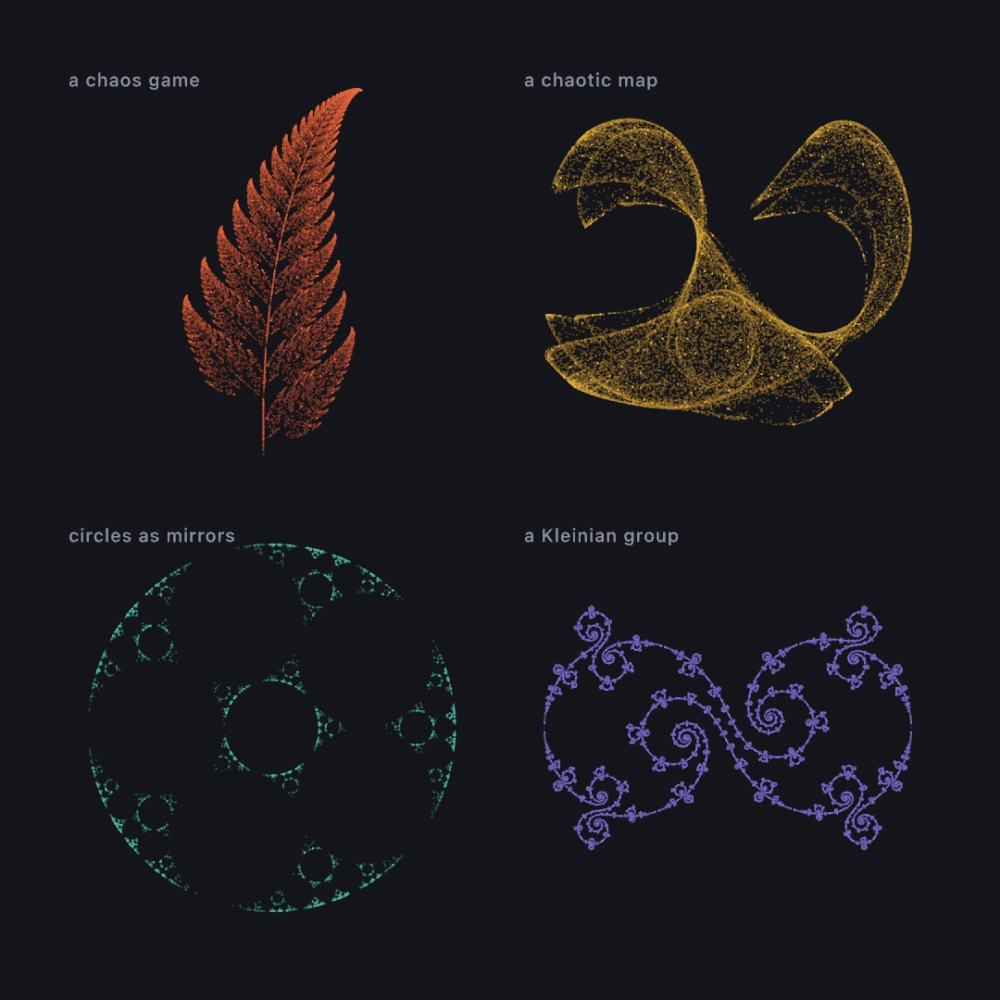

This chapter teaches pictures made by iteration. Take a point, apply a rule to it, and mark where it lands. Then apply the same rule to the result, and again, a hundred thousand times over. The picture is a record of where that one wandering point spent its time. The four rules behind the plate above differ a great deal. One is a coin flip between four squashing maps, and one is a pair of trigonometric formulas. One is a ring of circles used as mirrors, and one is a group built out of two Möbius transformations. What sits around them is the same, which is why the plate is one plotting function called four times. Building it is the spine of this chapter. After it come the relatives the plate does not use. The fractal flame and the Schottky circles are two more games with transformations. The bifurcation diagram, a ball in a room, and the double pendulum show where iteration turns from order into chaos. And escape time, the Buddhabrot, Newton's basins, and domain coloring ask a question of the plane one pixel at a time. The complex arithmetic under them ends the chapter in a shader of your own.

[Chapter 13](13-GrowingThings.md) grew things that spread through space, and [Chapter 14](14-FieldsAndFlow.md) followed fields across it. The forms here do neither. They have no neighbors and no field. They iterate, and the picture is what the iteration leaves behind.

## The same fern, played as a game: the chaos game

[Chapter 13](13-GrowingThings.md) grew a fern by rewriting a sentence and walking it with a turtle. There is a second way to get the same plant, and it is a game of chance played with four transformations.

Each of the four rules squashes, tilts, and shifts the whole plane. One draws the fern's main body slightly smaller and turned. One draws the left frond, one the right, and one the stem. Now put a dot anywhere at all, pick one of the four rules at random, move the dot by it, and mark where it lands. Then do that again, sixty thousand times.

<picture>
  <source media="(prefers-color-scheme: dark)" srcset="Images/22-IteratedForms/ChaosGame-dark.jpg">
  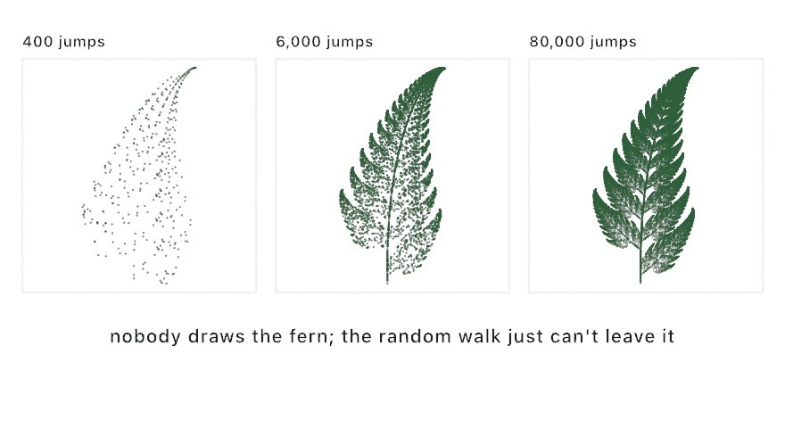
</picture>

```swift
let cloud = ifsPoints(.barnsleyFern, count: 60_000)
    .map { Vector2($0.x, -$0.y) }        // the fern's own y grows upward
noStroke()
fill(Color(hex: 0x2E5E3A))
drawPoints(fitted(cloud, in: canvasRectangle.inset(by: .all(80))), size: 1.5)
```

Here is why the game draws a fern. Every one of the four rules *shrinks* the plane. So wherever your dot started, a few jumps later that starting position has been squashed down to nothing and forgotten. What is left is the one set of points that the four rules, taken together, map onto itself. The dot cannot leave that set and cannot stay away from it, so given enough jumps it traces the set out. The set is called the **attractor**, and the collection of rules is an **iterated function system**.

The picture also explains what the weights are for. The four rules are not picked with equal probability. The one that draws the main body is picked 85 percent of the time, which keeps the fine tip as well drawn as the base. Ollin ships `.barnsleyFern`, `.sierpinskiTriangle`, and `.sierpinskiCarpet`, and a system of your own is six numbers per rule plus a weight.

Three practical notes come with the call. `drawPoints` puts one dot at every point in the list, `size` pixels across. The points arrive in the system's own coordinates rather than in canvas pixels, and `fitted` scales and centers them into any rectangle you name. The fern also needs its y negated, because it grows upward while the canvas counts downward. The points come from the sketch's own random generator, so `seed` from [Chapter 4](04-Randomness.md#seeds-randomness-you-can-keep) makes the same cloud every run.

## A formula that folds the plane: chaotic maps

The chaos game picks its next move with a coin. The second panel of the plate needs no coin at all. A **chaotic map** is a formula that takes a point and returns the next point, with nothing random in it. Iterate one from any start and the visits trace a shape called a **strange attractor**, the formula's own signature. Where the chaos game's points fill the fern evenly, these pile up. The orbit returns to some places far more often than to others, and the picture is in that unevenness. So instead of solid dots, lay every visit down faint, and let the crowded places grow bright on their own:

```swift
let map = ChaoticMap.clifford()          // x' = sin(a·y) + c·cos(a·x), y' = sin(b·x) + d·cos(b·y)
var p = Vector2(0.1, 0.1)
var trail: [Vector2] = []
for _ in 0 ..< 200_000 {
    p = map.next(p)
    trail.append(p)
}
noStroke()
fill(Color(red: 0.55, green: 0.75, blue: 1.0, alpha: 0.12))
drawPoints(fitted(trail, in: bounds.inset(by: .all(80))), size: 1)
```

`next` applies the formula once, and the loop is the whole iteration. `map.orbit(count:)` does the same loop in one call. The points live within about plus or minus two, so `fitted` places them the way it placed the fern. The low alpha is what makes a **density plate**: one dot is nearly invisible, and where the orbit returns often the dots stack. Turn the alpha up to 1 and the same points flatten into a silhouette.

For a plate with millions of visits, let the canvas keep every frame's dots. Call `noClear()` in `setup()`, as [Chapter 12](12-FlocksAndSwarms.md#roaming-wander-and-trails-from-noclear) did for its trails. Then draw each frame's new points with `blendMode(.add)` from [Chapter 19](19-LayersAndEffects.md#how-new-paint-meets-old-blend-modes), so a faint dot adds its light to what is under it rather than painting over it. Draw tens of thousands of new points a frame at a very low alpha, and after a few seconds each plate holds well over a million visits:

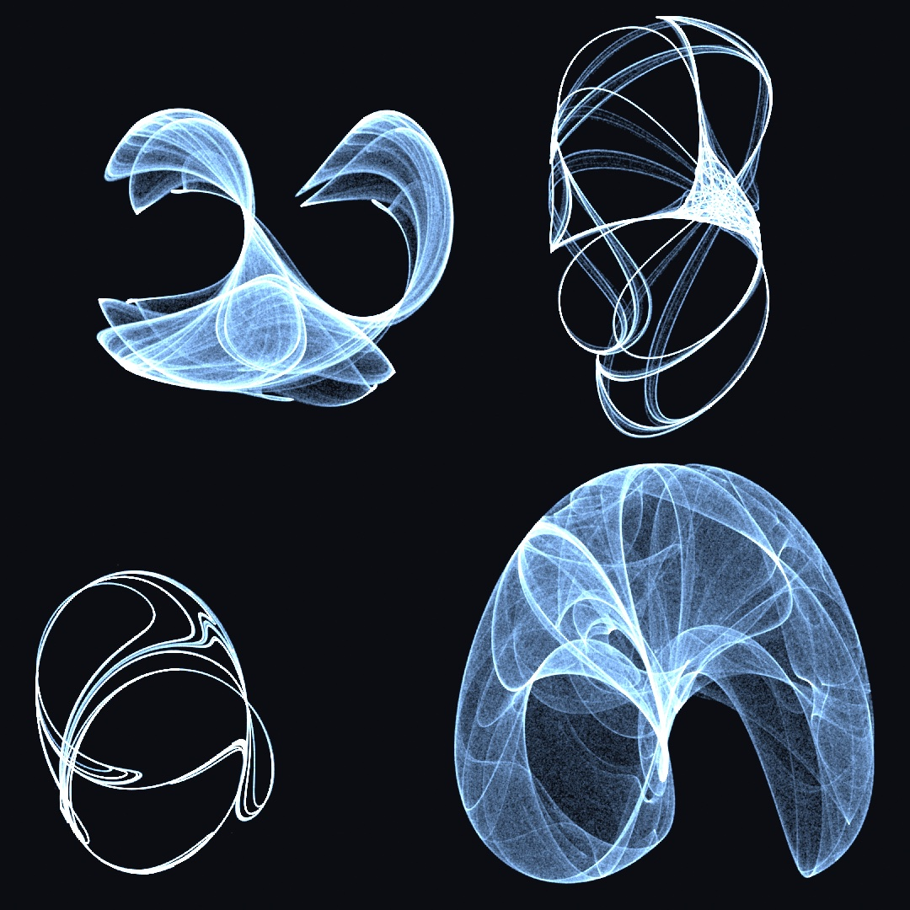

Every constant in `clifford(a:b:c:d:)` reshapes the form completely. Most values collapse to a dot or explode into static, and part of the craft is collecting constants that work. The four plates are four such finds, two Clifford maps above and two de Jong maps below. The same family holds `.gumowskiMira()`, which wanders a sea of islands into a many-petaled blossom. `orbit(count:settle:)` can drop the first steps of an orbit; give it none here, since the long wander *is* the picture. `.ikeda()` folds everything into one layered swirl. `.hopalong()` hops around nested rings that keep widening as it runs, and `.henon()` folds the plane into one thin bent band. The [attractors reference](../Docs/Drawing/Attractors.md) has every form with its formula. The 3D members of this family, Lorenz and its relatives, live in `StrangeAttractor` and need a camera. [Chapter 24](24-ParticleSimulations.md#a-million-riding-the-same-field-attractor-flow) sets a million particles riding one.

## Circles used as mirrors: inversion limit sets

The third panel comes from a chance game again, with a different kind of move. **Inverting** a point in a circle turns the plane inside out around that circle. The rim stays where it is, points near the center fly far away, and points far away land near the center. The circle acts as a mirror. Take an arrangement of circles, invert the dot in one picked at random, mark where it lands, and repeat. The orbit settles onto the arrangement's **limit set**, the set of points the mirrors, taken together, send onto itself, the way the fern's four rules did. The one rule of the game is never to pick the same circle twice in a row, because inverting twice in the same circle undoes itself.

<picture>
  <source media="(prefers-color-scheme: dark)" srcset="Images/22-IteratedForms/FractalFamily-dark.jpg">
  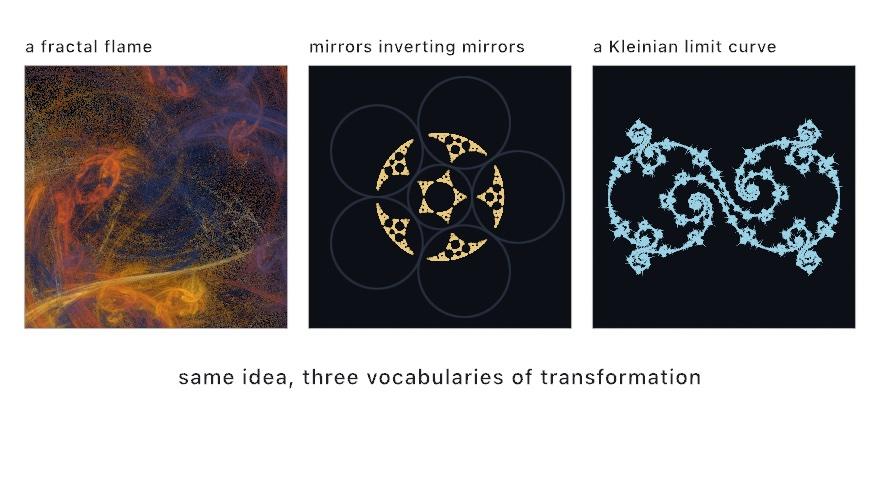
</picture>

The left panel is a fractal flame, a relative that comes after the plate. The middle panel is a ring of five circles, each touching its two neighbors, with a sixth filling the hole they leave. In canvas coordinates:

```swift
let center = Vector2(width / 2, height / 2)
let ring = 300.0, count = 5
let r = ring * sin(.pi / Double(count))
var mirrors = (0 ..< count).map { i -> Circle in
    let a = .tau * Double(i) / Double(count)
    return Circle(center: center + Vector2(cos(a), sin(a)) * ring, radius: r)
}
mirrors.append(Circle(center: center, radius: ring - r))
noFill()
stroke(Color(hex: 0x2A3242))
drawCircles(mirrors)
noStroke()
fill(Color(hex: 0xE8C97D, alpha: 0.55))
drawPoints(inversionLimitSet(of: mirrors, count: 26_000), size: 1.4)
```

The five centers sit on a circle of radius `ring`, a fifth of a turn apart. A radius of `ring * sin(.pi / 5)` is what makes each one touch the next. Since the circles are in canvas coordinates, the dust needs no fitting. It lands among the mirrors that produced it. Tangency decides the picture: circles that touch give lace, separated circles give scattered dust, and overlapping ones tear the lace apart. The points come from the sketch's random generator, like the fern's, so a seed pins them.

## A group drawn as one curve: Kleinian limit sets

The last panel has no randomness in it at all. It comes from two **Möbius transformations**, which are the maps that send circles to circles. The **group** they generate is everything you can combine out of them: one map, then the other, then the first one backwards, in every order and to every depth. A **Kleinian limit set** is the boundary all those combinations pile up against. Walking the group in order, rather than at random, traces that boundary as one line:

```swift
let curve = kleinianLimitSet(.lace)
noFill()
drawPolygon(fitted(curve.points, in: canvasRectangle.inset(by: .all(60))))
```

The return type is what sets this one apart from the clouds. `kleinianLimitSet` hands back a single `Contour`, the value [Chapter 15](15-ShapesAsMaterial.md#contours-shapes-and-holes) held: one ordered closed curve with roughly evenly spaced points. So it strokes, exports, and plots like any other geometry in this guide. Its `points` are a list of `Vector2` like the other three panels' clouds, which is what lets the plate treat it the same. The right panel of the figure above is `.lace`, and `.gasket`, `.cusp`, and `.doubleCusp` are among the other presets. The Schottky entry after the plate shows the same groups as circles.

## Putting it together: a plate of four orbits

Now you can build the plate at the top. It is a specimen sheet, four systems laid out under one hand. The four steps above each made a cloud of points, and the plate composes them. The chaos game's fern, a chaotic map's orbit, the dust of a ring of mirrors, and a Kleinian curve's points each get a panel. Each is fitted into it and laid down faint. One function turns a rule into a cloud of points. One other function fits that cloud into a panel and draws it. Make a new file, `MySketches/OrbitPlate.swift`:

```swift
import Ollin

final class OrbitPlate: Sketch {
    @Param("Points per panel", 20_000...220_000) var budget = 90_000
    @Param("Dot size", 0.6...3.0) var dotSize = 1.1
    @Param("Ink", 0.05...0.6) var inkAlpha = 0.18

    let paper = Color(hex: 0x14151A)
    let ramp = Ramp([
        Color(hex: 0xE8663C), Color(hex: 0xE8B23C),
        Color(hex: 0x49B8A0), Color(hex: 0x7C6FD1),
    ])
    var clouds: [[Vector2]] = []
    var builtFor = 0

    override func setup() {
        build()
    }

    override func draw() {
        if builtFor != budget { build() }
        background(paper)
        noStroke()

        let panels = grid(columns: 2, rows: 2, padding: 70, gutter: 44)
        for (index, cell) in panels.cells.enumerated() {
            let inner = cell.frame.inset(by: .all(26))
            plot(clouds[index], in: inner, ink: ramp.color(at: Double(index) / 3))
            label(index, in: cell.frame)
        }
    }

    // The four clouds are built once, and again only when the point budget
    // moves. The same seed makes the same clouds every time.
    func build() {
        seed(3)
        clouds = (0 ..< 4).map { orbit($0) }
        builtFor = budget
    }

    // Four rules, four clouds of points. Nothing below this line knows which
    // rule made the cloud it is drawing.
    func orbit(_ index: Int) -> [Vector2] {
        switch index {
        case 0:
            return ifsPoints(.barnsleyFern, count: budget).map { Vector2($0.x, -$0.y) }
        case 1:
            let map = ChaoticMap.clifford()
            var p = Vector2(0.1, 0.1)
            var trail: [Vector2] = []
            trail.reserveCapacity(budget)
            for _ in 0 ..< budget {
                p = map.next(p)
                trail.append(p)
            }
            return trail
        case 2:
            // A ring of mutually tangent mirrors, plus one filling their hole.
            // Tangency is the whole game: overlap them and the lace tears.
            let count = 5
            let r = sin(.pi / Double(count))
            var mirrors = (0 ..< count).map { i -> Circle in
                let a = .tau * Double(i) / Double(count)
                return Circle(center: Vector2(cos(a), sin(a)), radius: r)
            }
            mirrors.append(Circle(center: .zero, radius: 1 - r))
            return inversionLimitSet(of: mirrors, count: budget / 3)
        default:
            return kleinianLimitSet(.lace).points
        }
    }

    // The one plotting function. Fit the cloud to its panel, then lay every
    // point down at the same low alpha so that crowding is what makes a
    // region bright.
    func plot(_ cloud: [Vector2], in frame: Rectangle, ink: Color) {
        fill(ink.withAlpha(inkAlpha))
        drawPoints(fitted(cloud, in: frame), size: dotSize)
    }

    func label(_ index: Int, in frame: Rectangle) {
        let names = ["a chaos game", "a chaotic map", "circles as mirrors", "a Kleinian group"]
        fill(Color(hex: 0x8A8FA0))
        textFont(OutlineFont.systemMedium)
        textSize(20)
        textAlign(.left, .top)
        drawText(names[index], frame.x + 4, frame.y + 4)
    }
}
```

> **Swift note.** `switch index` picks one branch by a value. Each `case` is one value, `default` is every other, and a `return` inside a case leaves the function with that branch's answer. `trail.reserveCapacity(budget)` asks the list to set room aside before the loop fills it, so it never has to grow. `clouds` is a list of lists, like the trails in [Chapter 10](10-Vectors.md)'s chasers, and `(0 ..< 4).map { orbit($0) }` builds it with the `$0` form from [Chapter 6](06-GridsAndRepetition.md).

Run it, then pull the ink alpha down and the point budget up. What each function does:

- `build()` makes the four clouds once, in `setup()`, and makes them again only when `Points per panel` moves. Building them every frame would cost the same work sixty times a second for a picture that never changes. `seed(3)` inside it is what keeps the fern and the mirrors' dust the same from one build to the next. The mirrors get a third of the budget, since their dust crowds faster, and the Kleinian curve has a point count of its own and ignores it.
- `orbit(_:)` is where the four systems live, and it is the only place they differ. Three of them return a cloud they generated. The Kleinian one returns a curve's points, which is the same list of `Vector2` and so plots identically.
- `plot(_:in:ink:)` never asks what it is drawing. `fitted` measures whatever it is handed and scales it into the panel. That is why the fern's own coordinates and the Clifford map's plus-or-minus-two range both land correctly, with no per-system numbers anywhere.
- The low alpha is the reason these read as forms rather than scribble. A single dot is nearly invisible. Where the orbit returns often the dots stack, and the density becomes the image. Turn `Ink` up to 0.6 and the picture flattens into a silhouette, which is the same information with the interesting part thrown away.
- `grid` and `Ramp` do the layout and the color, from [Chapter 6](06-GridsAndRepetition.md) and [Chapter 2](02-Color.md). The plate is a grid sketch that happens to be full of orbits.

Before moving on, make it yours:

- Swap `ChaoticMap.clifford()` for `.deJong()`, `.gumowskiMira()`, or `.ikeda()`. Each has its own temperament, and the panel is one word wide.
- Give the fern panel `.sierpinskiTriangle` or one of the other systems, and watch `fitted` absorb the change with no other edit.
- Feed the ring in panel three six mirrors instead of five, then let them overlap slightly. The lace tears, as the mirrors step said it would, and pulling them apart instead scatters it into dust.
- Drop to one panel at the full canvas and raise the budget to its ceiling. These are density plates, and they keep gaining from samples long past the point where a drawn shape would be finished.

The plate is a still, so keep it as one. `swift run OllinLive MySketches/OrbitPlate.swift --export plate.png` writes the canvas at its full size, with the parameter values in the file.

## More games with transformations: fractal flames and Schottky circles

The plate plays two chance games and walks one group. The same move, play transformations and see where the orbit lives, gives two more pictures. The fractal flame is a chaos game whose rules bend as well as squash, and the Schottky circles are the paired circles behind the Kleinian curve.

### The chaos game with a twist: fractal flames

A **fractal flame** is the chaos game with two additions. Each rule finishes with a nonlinear twist, a swirl or a fold or a turning inside out, so the copies are bent as well as shrunk. And instead of plotting dots, every pixel *counts* how many times the orbit visited it, and the picture shows the logarithm of those counts. A logarithm compresses a range. A pixel visited a million times comes out only a few steps brighter than one visited a thousand. That is what lets the blazing core and the faintest veil appear in one image. The color comes from which rules carried the orbit there, rather than from where it landed. Flames are for pictures with a range of tone no fill can give, and for watching a picture rise out of noise. The algorithm is Scott Draves's, begun in 1992 and written up with Erik Reckase. It ran for years as a screensaver that evolved flames by popular vote. The left panel of the figure in the mirrors step is one:

```swift
var source = SplitMix64(seed: 6)
let flame = FractalFlame.random(using: &source)
drawImage(flame.render(width: 900, height: 900, quality: 90, using: &source),
          in: canvasRectangle)
```

`source` is a random generator of your own, seeded, and handed in with `&` the way [Chapter 4](04-Randomness.md) handed `randomness`. `quality` is how many samples each output pixel gets, so a few dozen previews and a few hundred make a clean still. There is also a progressive `Renderer` you feed a slice of samples per frame. That is how flames are meant to be watched, rising out of the noise. Some rolls come out muddy. Reroll until one works, since that is how flames are found. [`Examples/Patterns/FractalFlame`](../Examples/Patterns/FractalFlame/Sketch.swift) keeps one rising.

### Circles that pair off: Schottky groups

A **Schottky group** starts with four circles paired two and two. A pairing is a Möbius map that turns everything outside one circle into the inside of its partner. Whatever you hand it comes back smaller, sitting in the partner. Hand a pairing the other three circles and you get three smaller circles nested inside one of them. Do it again with every pairing and its inverse, in every order, and those nest again, forever. The group is everything you can combine out of the pairings, and the lace it leaves is the group drawn at once. It is for lace you can plot, since what comes back is circles rather than dust. It is also for the family of pictures that runs from the lace to the Apollonian gasket, a disc filled with circles that all touch. Friedrich Schottky described the paired-circle groups in 1877, and the way to draw them comes from *Indra's Pearls*, the same book the Kleinian curves come from.

<picture>
  <source media="(prefers-color-scheme: dark)" srcset="Images/22-IteratedForms/CirclesPairOff-dark.jpg">
  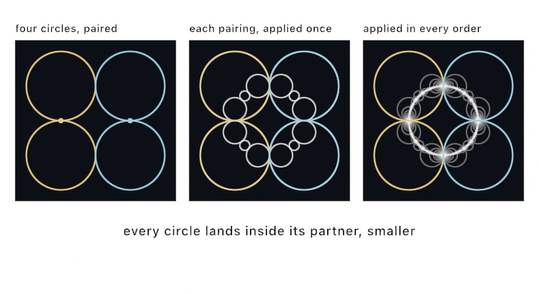
</picture>

```swift
let pairings = schottkyCuspedPairs(in: canvasRectangle.inset(by: .all(60)))
noFill()
drawCircles(schottkyCircles(pairing: pairings, minRadius: 0.4, maxDepth: 60))
```

`maxDepth` caps the generations, and `minRadius` stops a branch once its circle is too small to see, since everything below it nests inside. Whether that picture comes out full or nearly empty depends on one thing. When a pairing's two circles *touch*, its map holds the point where they touch perfectly still. Near that point it barely shrinks anything at all. So the orbit keeps handing back large circles generation after generation. They pile into the fan you can see at the left and right of the third panel. Separate that pair, even a little, and every application shrinks harder. The lace thins to a dust, with the same code and the same four circles.

So `schottkyCuspedPairs` builds its four circles as two touching pairs, and that also tells you which dial to reach for when you want motion. `lean` swings each pair around its own tangency point, so the pair goes on touching however far it swings. The picture stays full while the figure opens and closes. `twist` rotates a pairing off that setting, which gives spirals instead and thins the lace as it goes. `SchottkyPreset` names five landmark arrangements of the four circles: `.kissing`, `.leaning`, `.cusped`, `.spiral`, and `.dust`. `schottkyCircles(.kissing, in:)` takes one in place of the pairings.

What comes back is `[Circle]`, not a cloud of points. A Möbius map sends a circle to a circle, so nothing has to be flattened on the way. The lace exports as circles, so a pen plotter draws it with the same round strokes you see on screen.

The circles and the Kleinian curves are two views of one thing, and the bridge between them is a pair of numbers. A group of this kind is picked by two numbers called its **traces**, and the Kleinian presets are names for pairs of them. `schottkyCircles(ta:tb:in:)` takes the same two traces that `kleinianLimitSet` takes under its preset, and builds the same group. It draws the orbit as circles, instead of tracing its boundary as a curve. At traces `(2, 2)` the orbit is the Apollonian gasket. Every nearby pair of traces is another member of the same family. Give a trace a second number beside its first and the packing wobbles, or loosen them and it opens.

<picture>
  <source media="(prefers-color-scheme: dark)" srcset="Images/22-IteratedForms/GasketFamily-dark.jpg">
  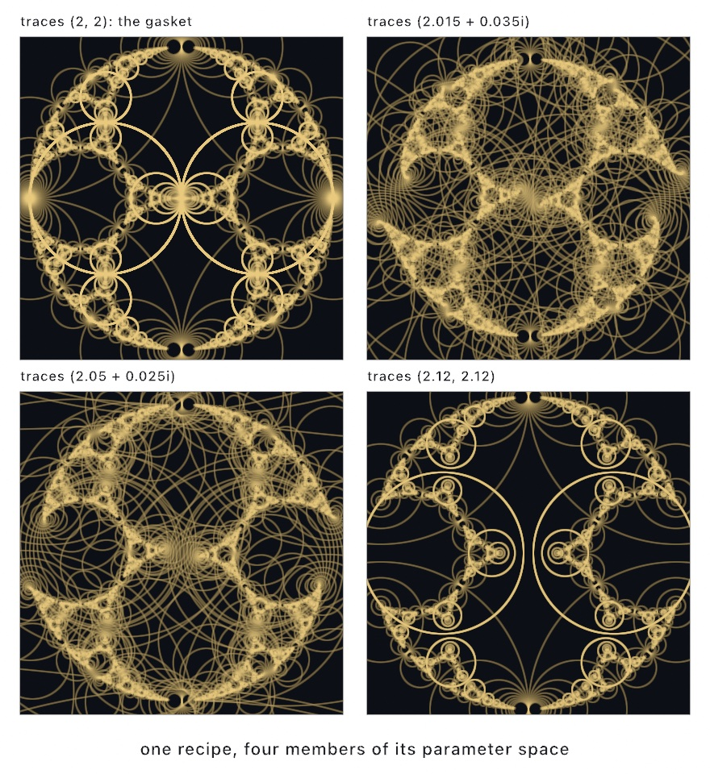
</picture>

```swift
noFill()
drawCircles(schottkyCircles(ta: Vector2(2, 0), tb: Vector2(2, 0),
                            in: canvasRectangle.inset(by: .all(60)), maxDepth: 100))
```

A trace travels as a `Vector2`, its two numbers side by side, and the complex-plane entry at the end of the chapter says what the second one means. The gasket is deep enough to want more generations than the default. The Kleinian presets name the same traces, so `schottkyCircles(.gasket, in:)` is this call. `.gasket` here and `.gasket` there are the same group, drawn two ways. The [`Patterns/Schottky`](../Examples/Patterns/Schottky/Sketch.swift) example animates a small arc of this family, out from the gasket and back.

## Order into chaos: the bifurcation diagram, billiards, and the double pendulum

Every system so far was plotted where its orbit went, and each settled onto one shape. The entries in this family are about when iteration stops settling. The bifurcation diagram sweeps a formula's one dial from order into chaos. A ball in a room does the same with the shape of the wall, and the double pendulum does it with nothing but gravity.

### One dial away from chaos: the bifurcation diagram

A **bifurcation diagram** shows what a map with one dial does at every setting of the dial. Sweep the dial, let the orbit settle at each position, and plot where it landed. It is for a question the chaotic maps could not ask, since their constants were fixed: when does a formula fall apart? The one-dimensional `IteratedMap` family answers it. Its famous member is the **logistic map**, `x' = r·x·(1 − x)`, a toy model of a population, where `x` is this year's crowding and `r` is how fast it breeds. Robert May's 1976 paper in *Nature* made the map and its diagram famous, and the rhythm of its forks is Mitchell Feigenbaum's discovery.

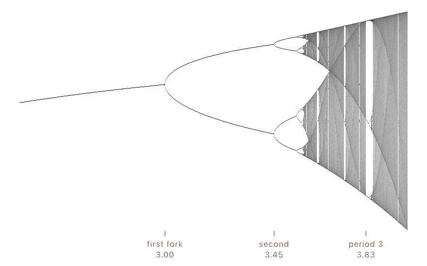

```swift
let map = IteratedMap.logistic()                            // x' = r·x·(1 − x)
let plate = map.bifurcationImage(width: 800, height: 452, samplesPerColumn: 12_000)   // sweeps r = 2.4...4
```

Each column of the image is one position of the dial, and `samplesPerColumn` is how many settled orbit points it plots. Twelve thousand, six times the default, fills the band of chaos to a smooth gray.

The diagram reads left to right like a story. At low `r` the population settles to one steady value, a single line. At 3 the line forks, and the orbit flips between two values forever. The forks come faster and faster until, just past 3.57, they never stop coming and the orbit never repeats again. Nothing random was added anywhere in this picture. Chaos here is a dial turned too far. The pale slots inside the gray are windows where order briefly returns, and the wide one near 3.83 holds the entire diagram again in miniature. Sweep `over: 3.82...3.87` and see.

Two companions go with the diagram. `cobweb(at:steps:)` traces one orbit as the classic staircase between the map's curve and the diagonal, which is the way to *watch* a single dial position. `lyapunovExponent(at:)` scores one, where negative means settling and positive means chaos. The [`Examples/Patterns/Bifurcation`](../Examples/Patterns/Bifurcation/Sketch.swift) example prints the diagram with the exponent traced beneath it, dipping below zero at every window.

### A ball in a room: billiards

A **billiard** is the same question with no formula in it. Let a ball loose in a room. It goes straight until it meets the wall, then leaves at the angle it arrived at, forever. That is the entire rule, and it is iteration in the plainest form there is. It is for finding out how much of a picture comes from the rule and how much from the room, because here the rule never changes. The study goes back to a question of Birkhoff's. The two disorderly rooms below are Leonid Bunimovich's stadium and Yakov Sinai's square with a post in it.

<picture>
  <source media="(prefers-color-scheme: dark)" srcset="Images/22-IteratedForms/BallInARoom-dark.jpg">
  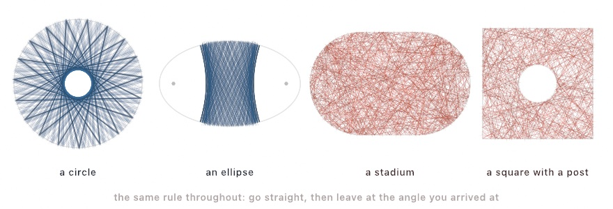
</picture>

```swift
let room = Billiard(.circle(Circle(center: middle, radius: 380)))
drawPolyline(room.path(from: start, heading: 0.7, bounces: 400))
```

Nothing changes across those four panels except the wall, and the pictures are not related.

A **circle** keeps a hole. Each straight run between two bounces is a chord. A bounce turns the path about the radius, which leaves untouched how far the chord passes from the middle. So every chord of the path misses the middle by the same distance. The path wraps a smaller circle it can never enter, and that circle is the hole. Every chord is the same length as every other, too, and each bounce moves the ball the same way around the rim. So a turn that is a whole fraction of a circle closes exactly into a star.

An **ellipse** sorts paths into two kinds. Its two foci are the two points whose distances to any point on the rim add up to the same total. The product of the distances from the two foci to a chord is the same for every chord of a path. So a path that passes between the foci keeps passing between them, and one that misses keeps missing. The two dots in the second panel are the foci, and the band is a path that never gets past them.

A **stadium** keeps nothing. Cut the circle through the middle and pull the halves apart, and the hole goes. The path fills the room, and two balls let go a tiny distance apart are on unrelated paths within a few dozen bounces. A **post** in the middle of a square does the same thing for the same reason. A round wall that curves the wrong way pulls neighboring paths apart instead of holding them together.

That last pair is the point. The rule never changed. The ball does the same thing in all four rooms. The difference between a pattern and a scribble is entirely the shape of what it bounces off. It is the same lesson as the dial above, reached from the other side.

```swift
Billiard(.stadium(center: middle, straight: 380, radius: 240))
Billiard(.polygon(walls), obstacles: [Circle(center: middle, radius: 150)])
```

Where a ball is let go matters as much as the room. In a circle it decides how big the hole is, and a ball let go at the exact middle leaves no hole at all. `room.contains(start)` is the first thing to ask, since the middle of a room with a post in it is inside the post.

### The classic chaos machine: DoublePendulum

A **double pendulum** is two weights on two rigid arms, hinged end to end, with nothing acting on them but gravity. A run of it is repeatable and impossible to predict at the same time. It is for showing that pair of facts in one picture, and for a trace that never repeats. Ollin integrates the standard equations of motion in the form Erik Neumann documents at myphysicslab, and checks itself against the energy it should be conserving. You set the arm lengths, the masses, and the starting angles. Then call `advance()` each frame and read `bob1` and `bob2`, both measured from the pivot. Tracing `bob2` is where the drama is.

<picture>
  <source media="(prefers-color-scheme: dark)" srcset="Images/22-IteratedForms/PendulumFan-dark.jpg">
  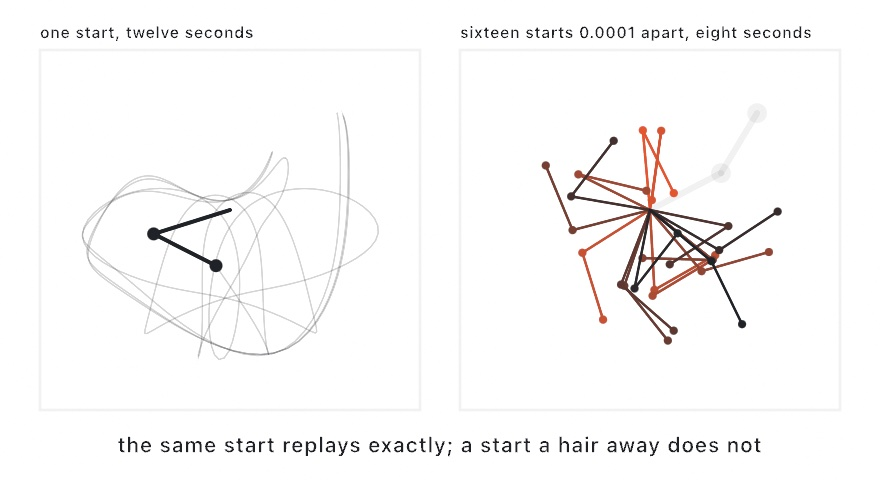
</picture>

This machine is *deterministic*. `advance()` moves one 60 fps frame on in fixed substeps, so a run is a pure function of where you started. The same start replays the same tangle every time. Start a second pendulum a ten-thousandth of a radian away, though, and within a few seconds the two are doing completely different things. That gap between perfectly repeatable and impossible to predict is what chaos means, here, in the stadium, and in the gray band of the logistic map. A fan of near-identical pendulums is the cheapest way to watch it happen. [`Examples/Motion/DoublePendulum`](../Examples/Motion/DoublePendulum/Sketch.swift) draws one: twenty-four pendulums that swing as one line, then pull apart.

## Iteration at every pixel: escape time, Newton's basins, and domain coloring

Every orbit so far was plotted where it went, one wandering point at a time. The other way to iterate is to give every pixel a loop of its own and ask it one question, the per-pixel model of [Chapter 18](18-YourFirstShader.md#one-question-a-million-times-per-pixel-thinking). Escape time asks each pixel when its orbit left. The Buddhabrot keeps the paths escape time throws away. Newton's basins ask where an orbit lands, and domain coloring asks about a single step instead of a loop. The complex-plane entry hands the arithmetic under them to a shader of your own.

### Iteration without memory: escape-time fractals and orbit traps

The **escape-time fractals** run one small loop at every pixel: square the number you have, add a fixed one, and repeat. Some starting points stay near home forever. Others eventually run away, and the only thing the picture records is **how many steps that took**. That count, turned into a color, is the fractal, and the regions that never escape are the set itself, painted in `interior`. They are for the boundary between the two, which holds detail at every zoom. Gaston Julia worked out the mathematics in 1918, and Benoit Mandelbrot first plotted the set that carries his name in 1980.

The loop treats a pixel's position as one number. You can add two of these by adding their coordinates, the way [Chapter 10](10-Vectors.md) added arrows. Squaring one is the new move. It squares the point's distance from the middle and doubles its angle around it. So a point inside the circle of radius 1 around the middle spirals inward when squared, and a point outside flies out. The fixed number added each time drags the orbit somewhere new. That is all the loop needs. The complex-plane entry, at the end of this family, draws the rule and hands it to a shader.

<picture>
  <source media="(prefers-color-scheme: dark)" srcset="Images/22-IteratedForms/FractalPair-dark.jpg">
  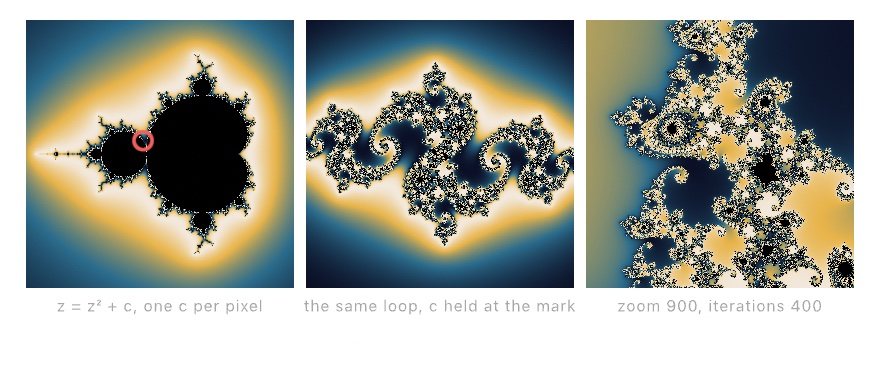
</picture>

```swift
drawImage(generate(.mandelbrot(phase: time * 0.03)).image, 0, 0)
```

The first two panels are the same loop, differing only in which of its two numbers is held still. In the **Mandelbrot set**, the added number varies from pixel to pixel and the orbit always starts at zero. In a **Julia set**, that added number is fixed for the whole image, and you pass it as `c`. Each pixel then starts its orbit at its own position instead.

So the red mark matters. It sits at the point the code writes as `Vector2(-0.79, 0.15)`, and the middle panel is the Julia set for that `c`. Move the mark and you get a different Julia set. The rule of thumb is that points near the Mandelbrot set's *edge* give the richest ones. Deep inside gives a plain blob, far outside gives dust. Every Julia set is a portrait of one point of the Mandelbrot set.

To mark a `c` on the set, ask the generator for its framing. Every generator that paints the plane hands it back as `plane`. Its `canvasPoint(of:in:)` says where a number lands in the rectangle the picture was drawn in. So a mark on a `c`, a root, or a zero never redoes the arithmetic:

```swift
let set = Generator.mandelbrot()
drawImage(generate(set).image, 0, 0)
if let plane = set.plane {
    drawCircle(center: plane.canvasPoint(of: Vector2(-0.79, 0.15), in: bounds), radius: 9)
}
```

The other way round, `planePoint(at:in:)` reads the number under the pointer, which is how a sketch lets you pick a `c` by clicking on the set.

The bands look stepless rather than like contour lines, because the coloring uses a smoothed escape count rather than a whole number. `cycles` sets how many times the palette repeats across the range. `phase` walks the colors along the bands, which is the drifting-color animation, and it costs nothing because it recolors rather than recomputes.

The third panel shows the one setting to get right:

```swift
generate(.mandelbrot(center: Vector2(-0.7463, 0.1102), zoom: 900, iterations: 400, phase: 0.4))
```

**`zoom` and `iterations` have to climb together.** The iteration cap is how long you are willing to wait before calling a point "trapped". As you magnify the boundary, more points need more steps to reveal that they do escape after all. Leave `iterations` at its default while zooming and the fine filigree fills in as a flat blob, because everything is being declared trapped too early. If a zoom looks like it lost its detail, raise the cap before you suspect anything else.

There is a second question you can ask the same loop. Instead of recording when the orbit escaped, record how close it ever came to a shape you hold in the plane. That is an **orbit trap**. Hold a cross of two lines there and every orbit that grazes it leaves a bright filament, so the picture grows stalks. Clifford Pickover introduced the trap, and the cross is his; the form used here dates to Fractint in 1989.

<picture>
  <source media="(prefers-color-scheme: dark)" srcset="Images/22-IteratedForms/TrappedOrbits-dark.jpg">
  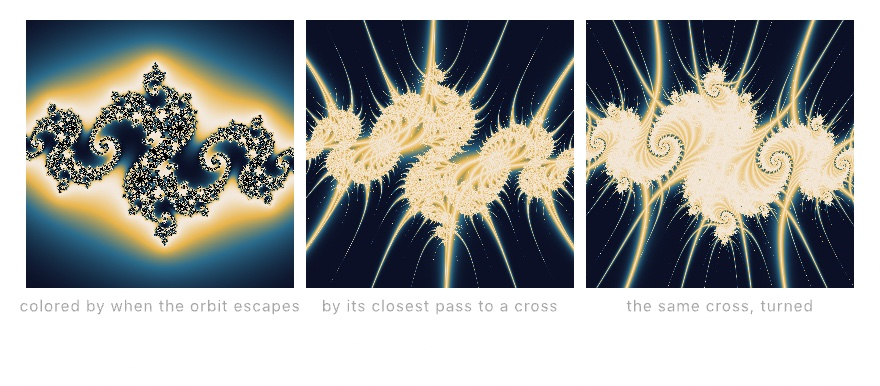
</picture>

```swift
drawImage(generate(.orbitTrap(.cross(.zero), c: Vector2(-0.79, 0.15), zoom: 1.2)).image, 0, 0)
```

All three panels are the same Julia set. Only the question changes. The first asks each orbit when it escaped. The other two ask how near the cross it passed, and then turn the cross a little with `angle`. Feed `angle` your `time` and the stalks sweep through the filigree while the set holds still. The traps on offer are a point, a cross, a circle, and a square, and `glow` sets how far their light reaches. [`Examples/Effects/EscapeTime`](../Examples/Effects/EscapeTime/Sketch.swift) shows all four beside the escape-time pair, and sets a Julia's `c` drifting so the filigree changes shape without a break.

The escape-time picture needs no memory. Its whole loop runs inside one frame, so any frame can be computed on its own. The simulations of the [next chapter](23-GridSimulations.md) iterate the other way, across frames, because their rules need neighbors and the frame before.

### What the escapers leave behind: the Buddhabrot

The escape-time loop throws the escapers' paths away and keeps only a count. The **Buddhabrot** keeps the paths. Test random starting points, and every time one escapes, let its whole path brighten each pixel it passed through. The piled-up visits, developed like a photographic plate, form a seated figure that was hiding in the set all along. It is a density plate, like the chaotic map's, made from the orbits the Mandelbrot set rejects. It is for a picture that resolves slowly over many frames, and for false color that reads as orbit depth. Melinda Green found it in 1993, and the three-cap false-color reading is hers too.

<picture>
  <source media="(prefers-color-scheme: dark)" srcset="Images/22-IteratedForms/BuddhaPlate-dark.jpg">
  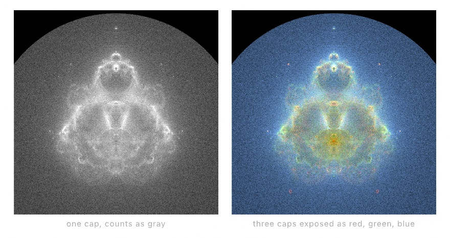
</picture>

```swift
let plate = Buddhabrot()      // three caps: long orbits red, short ones blue
let renderer = Buddhabrot.Renderer(plate, width: 560, height: 560, seed: 7)
// each frame:
renderer.accumulate(samples: 20_000)
drawImage(renderer.image(), in: canvasRectangle)
```

The `iterations` list does the coloring. Give it a single cap and the plate develops in gray. Give it three and the red, green, and blue channels expose at different orbit lengths, so color reads as orbit depth. A plate this deep resolves over many frames, the same way the flame does. Feed the `Renderer` a slice of samples per frame and let the figure rise. [`Examples/Patterns/Buddhabrot`](../Examples/Patterns/Buddhabrot/Sketch.swift) leaves one running.

### Where it lands: Newton's basins

Escape time asks an orbit when it left. **Newton's method** asks where it ends up. The method is the step many numeric solvers take. Guess a root, which is a place where a function comes out as zero. Slide down the tangent line, the straight line that touches the curve at your guess, and guess again. Near a root it lands in a few steps. `.newton` runs that step from every pixel and colors the pixel by the root it reaches, so every root owns a **basin**. The basins are for their borders, where the method cannot make up its mind. Arthur Cayley asked what those borders look like in 1879, for a cubic, a formula built from powers of z up to the third. The color plates in Heinz-Otto Peitgen and Peter H. Richter's *The Beauty of Fractals* (1986) are where most people first saw the answer.

<picture>
  <source media="(prefers-color-scheme: dark)" srcset="Images/22-IteratedForms/NewtonBasins-dark.jpg">
  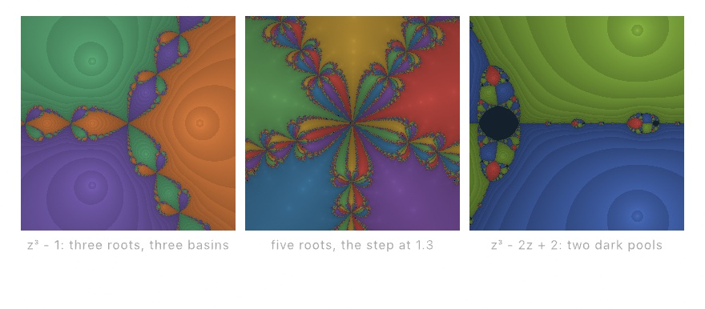
</picture>

```swift
drawImage(generate(.newton()).image, 0, 0)
```

The left panel is the cubic with the three cube roots of one, the picture Cayley asked about. Three roots make three basins, and their borders are not straight lines. Look at the border between any two colors. The third color is there too, as a chain of beads, and each bead wears the other two along its own border. Wherever two basins meet, all three do. That holds at every scale, so the boundary is dust rather than a line. It is the set of points the method never decides, folded over itself all the way down.

You place the roots yourself, up to eight. The palette spreads around them in order. `shading` darkens each pixel by how many steps it took, bright at the root and dark toward the edge, with a faint contour per step. `phase` turns the palette without recomputing anything, so it costs nothing to animate.

The middle panel changes the step. `relaxation` scales it. Below 1 the method creeps and the basins fatten. Above 1 it overshoots, and the basins spiral and throw off islands. Five roots at 1.3 is what the panel shows. Feed the dial a slow sine and the whole plane breathes. [`Examples/Effects/NewtonBasins`](../Examples/Effects/NewtonBasins/Sketch.swift) holds the dial still and sends its roots riding orbits of their own instead.

The right panel is the warning. Newton's method is not promised to land. For the cubic z³ - 2z + 2 the step sends 0 to 1 and 1 back to 0, and that cycle pulls in everything near it. Those pixels are painted `trapped`, the two dark pools in the panel, one at 0 and one at 1. With a plain polynomial and the dial at 1, pools are rare. Move the dial and they open everywhere.

### A picture of a function: domain coloring

Everything so far in this family asked a question about a **loop**. **Domain coloring** asks about a single step. A complex function takes a point of the plane and hands back another point. Graphing it the way you graph a sine wave would need four axes, two for what goes in and two for what comes out. Nobody has four axes. So domain coloring spends the two you have on the input and paints the answer as a color. The *direction* the answer points picks the hue, and its size waits, because direction is the part that carries the structure. It is for seeing at a glance where a function is zero and where it blows up. The method and its name come from Frank A. Farris in 1998, and the ruled forms follow Elias Wegert's phase portraits.

<picture>
  <source media="(prefers-color-scheme: dark)" srcset="Images/22-IteratedForms/DomainColoring-dark.jpg">
  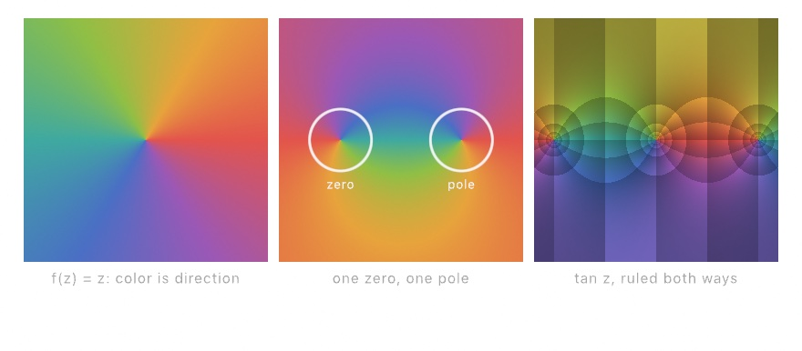
</picture>

```swift
drawImage(generate(.domainColoring(.power(1), shading: .phase)).image, 0, 0)
```

The left panel is the simplest function there is, `.power(1)`: hand back whatever you were given. Its picture is the wheel itself, and it is how you read the other two. `shading: .phase` asks for the direction alone. Leave `shading` out and rings come with it, as the paragraph on shading below explains. Red points right, and the colors run counter-clockwise from there, the way the plane is drawn on paper.

Now look at the middle panel. Two places show the entire wheel at once. The left one is a **zero**, where the function comes out as nothing, and the right one is a **pole**, where it blows up. They look alike until you follow the colors around. Then they are opposites. The wheel turns one way around a zero, and the other way around a pole. Count the wheels and you have counted the zeros and the poles. That is a theorem, drawn instead of proved, and a repeated zero draws its wheel twice.

You place them yourself, which is what lets you rearrange the field:

```swift
.domainColoring(.rational(zeros: [Vector2(-0.55, 0)], poles: [Vector2(0.55, 0)]), shading: .phase, zoom: 1.35)
```

Move a zero and the whole field reorganizes around it. Repeat a point for a double zero. Leave the poles out and you have a polynomial. There are named functions too: `.power`, `.exponential`, `.sine`, `.tangent`, and `.logarithm`. A fractional `.power` and the `.logarithm` both leave a **branch cut**, a line where the colors jump. The answer there had to pick one of two equally good values.

The size you set aside can come back as shading. `.modulus`, the default, ramps from dark to light between one doubling of the value and the next, which draws contour rings. `.conformal` rules the direction the same way, and the two rulings cross. That is the right panel, and away from the interesting points its tiles are little squares. The squares are not a coincidence. A function like this one turns and stretches small shapes but never shears them, and the grid is that fact made visible.

`phase` turns the palette around the wheel without recomputing anything, so `phase: time * 0.05` costs nothing and the color drifts forever. [`Examples/Effects/DomainColoring`](../Examples/Effects/DomainColoring/Sketch.swift) swims a pair of zeros around a pair of poles. The field pours from one arrangement into the next, and nothing was animated except two points.

### Multiplying turns: the complex plane

The generator paints the named functions and a rational one. A function of your own is a shader, and a shader works with `float2` points. Add two points and you add their coordinates. Nothing in a shader says what it means to *multiply* two of them, and there is no single answer. Escape time and Newton's method both lean on one particular answer, and the shader library carries it in its `complex` section.

The **complex plane** reads a point as a number, `x + y·i`, where `i` is the square root of minus one. Multiplying two of these multiplies their lengths and **adds their angles**, and the rest of this entry follows from that one rule. It is for writing a function of the plane yourself, and for seeing why the squaring step of escape time behaves as it does. The arithmetic here follows the textbook, with one shader function per operation, after Harley Turan's walkthrough of it in GLSL.

`cmul(z, z)` sends every point to twice its angle, so the plane wraps around the origin twice. It also squares the length, so a point outside the circle of radius 1 moves farther out and a point inside it moves in. That is the step escape time repeats at every pixel, with a fixed number added each time. `cmul(z, cpolar(1.0, a))` turns the whole plane by `a`. The other functions build on the same rule: `cdiv`, `cexp`, `clog`, `cpow`, `csin`, and their relatives. Each name matches a function on the CPU value [`Complex`](../Docs/Helpers/Complex.md), so a number you work out in `draw()` means the same thing in a shader. The three tiles below are three such functions painted this way:

<picture>
  <source media="(prefers-color-scheme: dark)" srcset="Images/22-IteratedForms/ComplexPlane-dark.jpg">
  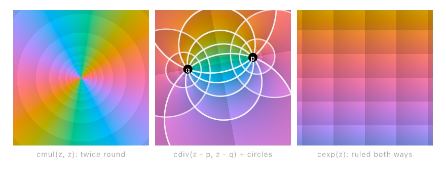
</picture>

```metal
float4 shade(float2 uv, ShaderInfo info) {
    float2 z = complexPlane(uv, info.resolution, float2(0.0), 3.0);
    float2 p = cpolar(0.8, info.time), q = cpolar(0.8, info.time + 2.3);
    float2 f = cdiv(z - p, z - q);
    return float4(domainColor(f, 2, 0.7), 1.0);
}
```

Two helpers do the framing and the coloring. `complexPlane` reads the layer as a piece of the plane, with `center` in the middle and `span` units across the shorter side. The imaginary axis points up, since a `uv` runs down the canvas and mathematics runs up. `domainColor` paints the answer the way the generator did, with the direction picking the hue. The `2` asks for both rulings, the size and the direction drawn as bands, and `0.7` sets how dark they go.

The left tile is `cmul(z, z)`, the wheel twice around, which is what adding the angles looks like. The right tile is `cexp(z)`, the exponential function, ruled both ways. Its rulings come out straight, because the answer's size depends only on x and its angle only on y. The middle tile is the shader above, with `p` and `q` held at the angles 0.6 and 2.9 instead of turning with time. Two families of circles are drawn over it. The family nested around each point comes from `draw()`, worked out with `Complex`:

```swift
let p = Complex(magnitude: 0.8, argument: 0.6)
let q = Complex(magnitude: 0.8, argument: 2.9)
let d = (p - q).magnitude
let scale = width / 3
for n in [-2, -1, 1, 2] {
    let k = pow(2.0, Double(n))
    let center = (p - k * k * q) / (1 - k * k)     // where the ratio has size k
    let radius = k * d / abs(1 - k * k)
    drawCircle(center: Vector2(width / 2 + center.real * scale, height / 2 - center.imaginary * scale),
               radius: radius * scale)
}
```

> **Swift note.** `pow(2.0, Double(n))` raises 2 to the power `n`, so `k` runs through a quarter, a half, two, and four. `abs` is a number's size with its sign dropped. `for n in [-2, -1, 1, 2]` walks a list written out in place, as [Chapter 16](16-CurvesAndFigures.md) walked its pairs.

Each of these is a circle of Apollonius, the set of points where the ratio has one size. Each is written in the same arithmetic the shader used. Drawn over the layer, each one lands on a ruling. The two halves agree, so you can reason on whichever side is easier and paint on the other. [`Examples/Shaders/ComplexPlane`](../Examples/Shaders/ComplexPlane/Sketch.swift) moves the two points and draws both families of circles. Two more take the same ratio somewhere else. [`ImaginaryLog`](../Examples/Shaders/ImaginaryLog/Sketch.swift) feeds the imaginary part of its `clog` to a cosine palette that never completes a cycle. The branch cut between the points then shows as a soft seam. [`Meromorphic`](../Examples/Shaders/Meromorphic/Sketch.swift) builds a ratio of two cubics from six moving roots and turns the palette's frequency up until the bands pile up around the poles.

## Where this comes from

The plate's four systems come first. Iterated function systems and the chaos game are Michael Barnsley's, from *Fractals Everywhere* (1988), and the fern uses his published four-map table. The Clifford attractor is named for Clifford Pickover, and the de Jong attractor for Peter de Jong, and Paul Bourke's long-running fractal pages popularized both. The Gumowski-Mira map came out of particle-beam physics at CERN, the Ikeda map out of laser optics, and Barry Martin's hopalong reached everyone through A. K. Dewdney's *Scientific American* column. Circle-inversion limit sets follow Michael Frame and Tatiana Cogevina's 2000 rendering method, and Frame's Yale course pages explain them clearly. The Kleinian curves come from David Mumford, Caroline Series, and David Wright's *Indra's Pearls*, which made Felix Klein's groups visible. The entries after the plate name their own sources: Draves and Reckase, Schottky and *Indra's Pearls* again, May and Feigenbaum, Birkhoff, Bunimovich, and Sinai, Neumann, Julia and Mandelbrot, Green, Cayley and Peitgen and Richter, Farris and Wegert, and Turan. Full credits are in the project's [attribution notes](../ATTRIBUTION.md).

## Go deeper

- [Fractals](../Docs/Generators/Fractals.md): the `IFS` type and its presets, the `FractalFlame` surface including the progressive renderer, inversion limit sets, the Kleinian trace presets, the Schottky circle orbit with both family builders and why a tangent pair keeps the picture full, and the escape-time family with its orbit traps.
- [Billiards](../Docs/Generators/Billiards.md): the four rooms, letting a ball go, what each room draws and why, posts standing in a room, and drawing the room itself. The [`Examples/Patterns/Billiards`](../Examples/Patterns/Billiards/Sketch.swift) example puts all four side by side with a fan of balls.
- [Attractors](../Docs/Drawing/Attractors.md): every `ChaoticMap`, the `IteratedMap` family, `bifurcationImage`, and the GPU tier that carries a million orbits at once, which [Chapter 24](24-ParticleSimulations.md#a-million-riding-the-same-field-attractor-flow) puts to work as a field of drifting points.
- [Chaotic maps and bifurcation](../Docs/Generators/Bifurcation.md): the one-dimensional families, the diagram's dot and density forms, cobwebs, and Lyapunov exponents.
- [The double pendulum](../Docs/Simulation/Motion.md#pendulum): its settings, the `energy` check, and why a live `deltaTime` gives up the exact replay.
- [Escape time as a generator](../Docs/Drawing/Effects.md#generate): `.mandelbrot`, `.julia`, and `.orbitTrap` as layers a chain can filter, with the center, zoom, iteration, and banding parameters.
- [Newton's basins](../Docs/Drawing/Effects.md#generate): `.newton` with its placeable roots, the palette spread around them, the shading by step count, the `relaxation` dial, and the trapped color.
- [Domain coloring](../Docs/Drawing/Effects.md#generate): `.domainColoring` with its placeable zeros and poles, the named functions, and the modulus and conformal rulings.
- [Complex numbers](../Docs/Helpers/Complex.md): the CPU value behind the `complex` section, with literals, the polar form, `Complex.exp` and its relatives, and the `Vector2` bridge. The section's own functions are on the [shader library](../Docs/Shaders/ShaderLibrary.md#complex-numbers) page.
- Appendix B draws the ideas under this chapter, one picture per entry: [Iterated maps: orbits that pile up](B-JustEnoughMath.md#iterated-maps-orbits-that-pile-up), [Escape time](B-JustEnoughMath.md#escape-time), and [Density as tone](B-JustEnoughMath.md#density-as-tone).
- Worked examples: [`Patterns/IteratedFunctions`](../Examples/Patterns/IteratedFunctions/Sketch.swift), [`Patterns/FractalFlame`](../Examples/Patterns/FractalFlame/Sketch.swift), [`Patterns/Buddhabrot`](../Examples/Patterns/Buddhabrot/Sketch.swift), [`Patterns/InversionFractal`](../Examples/Patterns/InversionFractal/Sketch.swift), [`Patterns/Kleinian`](../Examples/Patterns/Kleinian/Sketch.swift), [`Patterns/Schottky`](../Examples/Patterns/Schottky/Sketch.swift) (the traces swung out from the gasket and back), [`Patterns/ChaoticMaps`](../Examples/Patterns/ChaoticMaps/Sketch.swift) (the density bloom, all six presets on a parameter), [`Bifurcation`](../Examples/Patterns/Bifurcation/Sketch.swift), and [`Effects/EscapeTime`](../Examples/Effects/EscapeTime/Sketch.swift) (the pair and the four traps as generator tiles).

---

[Contents](README.md#contents) · Previous: [Chapter 21, Pictures you solve](21-PicturesYouSolve.md) · Next: [Chapter 23, Simulations on a grid](23-GridSimulations.md)
