#### <sup>[Ollin](../README.md) → [Guide](README.md) → Chapter 22</sup>

---

# 22. Meshes, maps, and materials

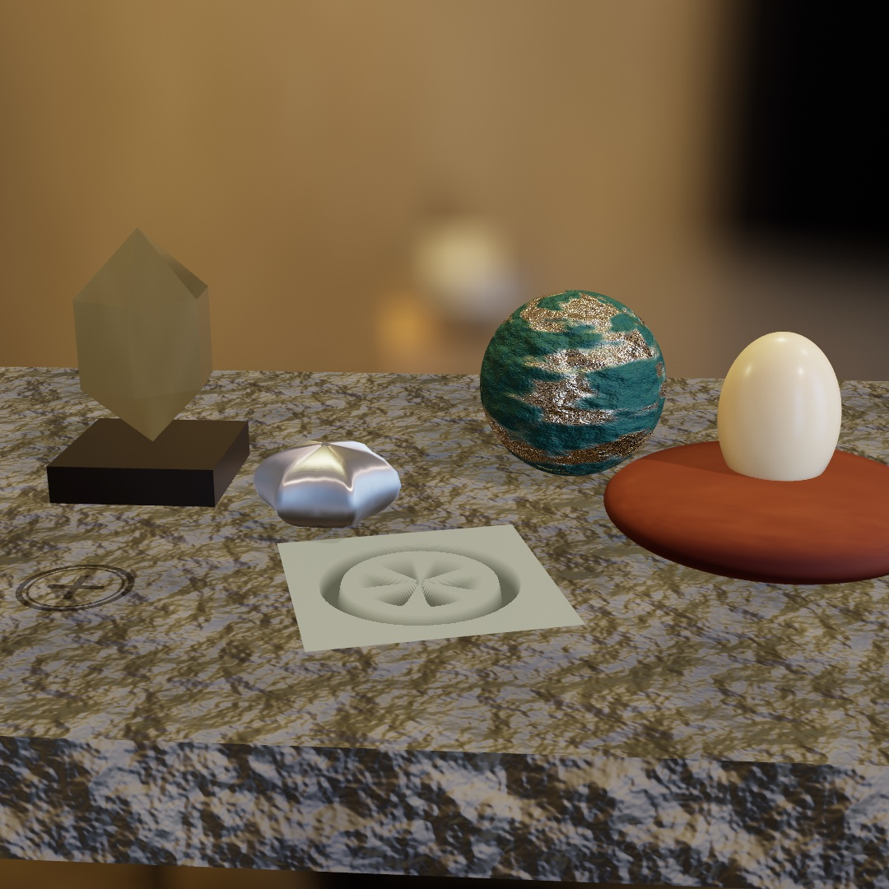

Not one of those five is shaped the way it looks. The slab was never unwrapped, so its stone is projected onto it from three directions at once. The paint on the teal ball has worn back to metal because a picture says where. The wheel in the pale tile is a picture too, and the tile is flat. The crystal came out of a file, the silver cushion started as a crude six-pointed slab, and the egg carries light a little way under its own surface before letting it back out.

[Chapter 21](21-3DGently.md) drew solids the framework knows how to make, and finished them by name. This chapter is the two ways past that. A mesh can come from somewhere else, or from another mesh, and a picture can decide what a surface is from one texel to the next. Then come the finishes you set with numbers rather than names, which is the tier that reads as a real material instead of a good guess. By the end you will have built the bench above.

## Meshes you did not model

A generator hands you a shape the framework knows how to build. A file hands you a shape somebody drew, and it can hold a whole set rather than one object.

### A mesh from a file

Any model you make in a 3D tool can join a sketch. `loadMesh` reads the common formats (`.usdz`, `.obj`, `.gltf`/`.glb`, `.stl`, `.ply`) into a `Mesh`, materials and textures included:

```swift
final class Loaded: Sketch {
    var model: Mesh?

    override func setup() {
        model = loadMesh("/Users/you/Downloads/rubber-duck.usdz")?.normalized(scale: 3)
    }

    override func draw() {
        background(Color(hex: 0x10141B))
        cameraShowcase(radius: 6)
        if let model {
            fill(.white)
            withState { rotateY(time * 0.3); drawMesh(model) }
        }
    }
}
```

The one habit that saves confusion is **`normalized(scale:)`**. A file arrives at whatever size and position its author saved, anywhere from millimeters to kilometers. Normalizing recenters it and scales its longest side to the world units you ask for. Keep the `fill` white so the model's own colors show, because a colored fill tints it. Models you build yourself are yours to ship, while downloaded ones carry licenses worth checking before you bundle them.

> **Swift note.** `loadMesh(...)?.normalized(scale: 3)` chains with `?.` because loading can fail: if the file isn't there, `loadMesh` returns `nil`, the chain stops, and `model` stays `nil`. The `if let model` in `draw()` then simply skips drawing, so a missing file never crashes the sketch.

`loadMesh` deliberately flattens a file into one mesh you place yourself. Sometimes the file *is* the placement: a whole scene composed in the design tool, with a camera framing it and lights already set. For that there's `loadScene`, which keeps the file's structure instead of merging it:

```swift
stage = loadScene("Stage.gltf")!            // in setup()

camera(stage.camera ?? .orbiting(radius: 6))   // the file's own framing
for l in stage.lights { light(l) }             // and its lighting
stage["sculpture"]?.rotate(deltaTime, axis: .unitY)
drawScene(stage)                               // every node, in its authored place
```

A scene is a tree of named nodes, and everything unpacks into things you already know. The file's camera is a `Camera3D`, its lights are `Light`s, and each node's geometry is a `Mesh`. `drawScene` draws the whole layout where the tool put it. `stage["sculpture"]` reaches one node by name, so a single piece moves while the rest holds still. Bring the set over from the design tool, and keep the choreography in the sketch. The `3D/Geometry/LoadedScene` example is a small stage to poke at, and [Scenes](../Docs/3D/Scenes.md) has the details.

If the file was animated in the tool, that motion carries over too. `stage.animations` holds the authored keyframe tracks, and applying one poses the scene at whatever moment you ask for:

```swift
if let spin = stage.animation("spin") {
    stage.apply(spin, at: time.truncatingRemainder(dividingBy: spin.duration))
}
```

The file remembers its motion; the sketch decides when time passes. `apply` takes any time you hand it, so wrapping `time` loops the animation, `time * 0.5` plays it at half speed, and a knob's value scrubs it. The `3D/Geometry/AnimatedScene` example plays a small orrery's authored spin this way, one seamless 8-second lap.

Tracks like the orrery's move whole nodes, rigid pieces on a hierarchy. A file can also carry motion that bends the geometry itself. A *skin* ties each vertex to a few joint nodes with blend weights, so a blade of kelp or an arm flexes smoothly as its joints turn. *Morph targets* store alternate shapes for a mesh, and the node's `weights` mix them, the way faces animate between expressions. Both play through the same `apply`, and `drawScene` poses them without any extra calls. The `3D/Geometry/SkinnedScene` example is a small tidepool doing both at once, kelp swaying on skins while an anemone pulses on two morph targets. And since `weights` is just a node property, `tank["anemone"]?.weights = [1, 0]` poses a blend shape from any signal you like.

Whether a mesh came from a file or a generator, there are two other ways to dress it besides lighting a solid surface.

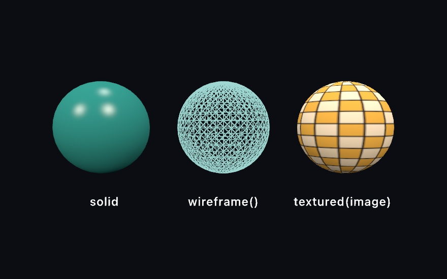

```swift
withState { fill(teal); material(.glossy); drawMesh(globe) }     // solid
withState { stroke(pale); wireframe(); drawMesh(globe) }         // edges only
withState { fill(.white); drawMesh(globe.textured(checker)) }    // wrapped in an image
```

**`wireframe()`** draws the mesh as its triangle edges instead of filled faces, taking the current `stroke` color and `strokeWeight`. It's how you see what a mesh is actually made of, which is genuinely useful when a generator gives you something odd. It's also just a look, the standard way to show a form that's still a proposal rather than a finished object. Because the faces are see-through, a wireframe doesn't light, so lights and materials have nothing to do.

**`textured(_:)`** returns a copy of a mesh wrapped in an `Image`. Texture coordinates decide where each part of the picture lands, and the sphere, the plane, and the parametric surfaces are the generators that carry them, which is why the checker above reads cleanly. The rest arrive without any, and the triplanar section below is what you reach for there. The squares stay square around the middle and narrow to slivers at the poles. That's what wrapping a flat rectangle onto a ball does, and you'll meet it whenever you texture a sphere. A textured mesh still lights normally, so it takes materials and shadows like any other surface. Keep the `fill` white unless you want the image tinted, the same rule as a loaded model.

One question comes with every texture: what happens where the picture runs out. A globe never asks it, since its coordinates run 0 to 1 and stop there. A floor asks it at once. Give a floor coordinates that run to 8 and it is asking for eight copies of the picture across its width, not one copy with its border smeared over the other seven.

```swift
var floor = Mesh.plane(width: 800, depth: 800)
floor.uvs = floor.uvs.map { $0 * 8 }                  // eight tiles across
drawMesh(floor.textured(planks, wrap: .tile))         // .clamp is the default
```

`.tile` starts the picture again, `.mirror` starts it flipped so copies always meet on the same pixels, and `.clamp`, the default, holds that last row of pixels forever. Inside 0 to 1 all three draw the same thing, so the choice only ever shows where you left the square. A model you load brings its file's own answer with it, which is why a floor somebody authored to tile arrives tiling.

Distance asks the second question. Send that floor off to the horizon and one screen pixel covers many of the picture's own pixels. Reading just one of them is the difference between a floor and a swarm of bees. So Ollin keeps every picture you load at half size, and half of that, down to a single pixel. It reads whichever copy matches what the screen pixel covers, and the far floor settles into the gray the checker really is. Nothing to switch on. And a floor is seen edge-on, so that screen pixel is not a square of the picture. It is a long thin sliver: many of the picture's pixels one way, hardly any the other. Ollin reads along the sliver rather than picking a copy big enough to cover all of it. The far floor stays a floor instead of going soft. One thing to know: a picture whose pixels you wrote yourself keeps only its full-size self. It goes up again on every frame it changes, so that one still swarms in the distance.

Both are ordinary drawing state, saved by `withState`, so one frame holds all three treatments (the figure is a single render).

### A scene you can take apart

Loading a scene keeps the file in charge. Re-export from the tool and the sketch picks up the change, which is what you want while the model is still moving. There is a moment when you want the opposite: the layout is settled, and now you want to *work* on it. For that, ask for the sketch itself.

```sh
ollin new Yard --from-scene yard.usdz
```

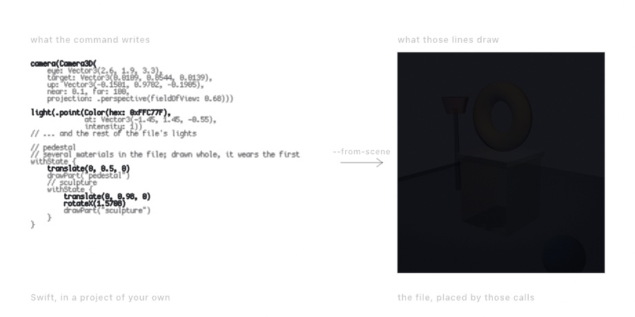

That writes a project whose `draw()` is the scene, spelled out. The camera is a `Camera3D` with its own numbers. Each light is the factory that makes it. Every node is a `withState` block holding the moves that put it where the tool put it, nested the way the file nests them.

What does not become source is the geometry. A mesh is not something anybody edits as text. The sketch reads the file once for its meshes and places them itself. That is what `drawPart` does. Materials ride their meshes for the same reason. No `fill` appears anywhere.

So this is the lossy direction, and it says what it lost. Animation stays behind, along with the skins and blend shapes that bend geometry, since nothing in a written-out placement drives them. A mesh wearing several materials draws in the first, and its block is marked. Everything else is a line in your own sketch now.

Both directions are worth having. `loadScene` is for a set that is still being built. This one is for the moment the file stops being the piece and becomes the material. [Bringing a scene over](../Docs/Tools/SceneImport.md) has the details.

## A shape that only exists in four dimensions

Here is a mesh you could not model, because the thing it draws does not fit in the room.

Take an ordinary sphere. Every single point on it stands for a whole *circle* living in a sphere-in-four-dimensions. Those circles fill that space completely, and not one of them ever touches another. Squash the whole arrangement down into three dimensions and this is what you get:

```swift
for fiber in hopfFibers(over: hopfBases(latitudes: 4, perCircle: 16)) {
    fill(color(for: fiber.base))
    drawTube(fiber.points, radius: 0.02, closed: !fiber.isStraight)
}
```

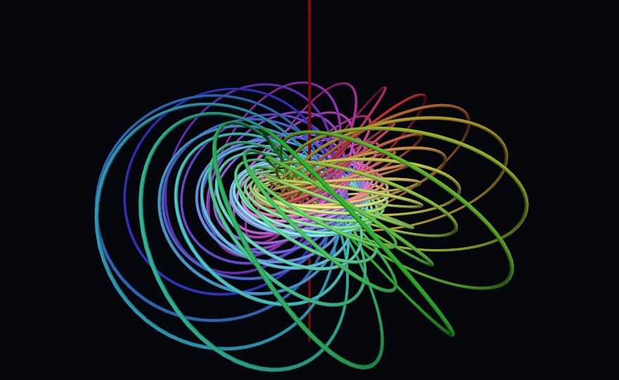

It is called the Hopf fibration, and the reason to draw it is not that it is pretty. **Pick any two rings in that picture, however far apart, and you could not pull them free of each other without cutting one.** That is true of every pair, all the way through. Nothing there is threaded by hand; it falls out of the arrangement.

Each `hopfFibers` result is one `HopfFiber`, holding the `points` of its circle and the `base` point on the sphere it came from. It is ordinary geometry from there, so `drawTube` sweeps it like any other path.

Three details separate a picture of this from a ball of wool.

**The base points have to be arranged.** The linking only reads when neighboring circles are neighbors, so `hopfBases(latitudes:perCircle:)` puts them on rings of latitude. Each ring lifts to one torus of circles, and the tori nest, which is the shape your eye can follow. Scatter the base points at random and you get exactly the same fibration and nothing you can see in it.

**The color has to come from the base point.** Hue running around the sphere, lightness running up it. That is what makes the tangle legible as a picture *of a sphere*. A rainbow handed out in draw order looks similar and says nothing.

**The straight one has to be drawn.** That red line through the middle is a fiber like all the others. Its base point sits at the bottom of the sphere. That is the one place the squashing-down sends to infinity, so its circle comes back as a line instead. It is the axis every other ring is threaded onto, and a picture without it has a hole where its middle should be:

```swift
let bases = hopfBases(latitudes: 4, perCircle: 16) + [Vector3(0, -1, 0)]
```

## Pictures that change the surface

The next three sections all hang a picture on a mesh, and none of them is about color. Each hands the renderer something it would otherwise need geometry for, and the geometry stays exactly as coarse as it was.

### Relief from a picture: normal maps

A texture changes a surface's color. A **normal map** changes how it catches light. Each texel stores a surface direction instead of a color, and at shading time the lighting normal bends by it. The result is relief without geometry.

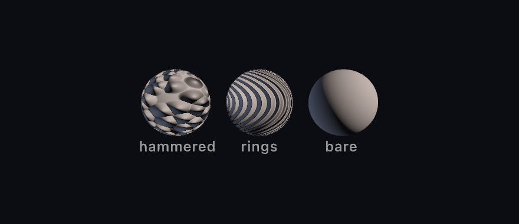

```swift
let hammered = Mesh.sphere(radius: 1).normalMapped(dents)
```

All three spheres are the same 96-segment sphere, and only the middle of the picture knows about dents and rings. Look at the silhouettes, which are perfect circles. That's the tell, and the trade. The bumps exist only in how the light lands, so they cost a texture sample instead of a million triangles. The edge of the object never learns about them. Games have leaned on this for twenty years, which is why a cobblestone street in one can be six polygons.

**`normalMapped(_:scale:)`** hangs a map on any mesh that carries texture coordinates. It quietly sets up the frame of reference the map's directions are expressed in, a *tangent basis*. It's the same standard one other tools bake maps against, so a map made elsewhere lights the same way here. `scale` is a relief dial, where 0 flattens it off, 1 is as authored, and more exaggerates. Loaded models bring their own normal maps along without being asked.

Where do maps come from? Anywhere images do, and one particularly satisfying place, which is math. Start with a height function, take its slopes, and encode them. The `3D/Materials/NormalMaps` example builds hammered metal, woven cloth, and engraved rings this way in a couple dozen lines, no files involved. One convention matters when authoring by hand. Green marks the slope that faces *up the image*. If a map from elsewhere lights upside down, its green channel is inverted, so flip it and it's home.

### What the surface is, per texel

A normal map changes how light lands. The rest of the standard map set changes what the surface *is* from texel to texel, and `surfaceMapped(...)` hangs any of them on a mesh:


```swift
let panel = Mesh.sphere(radius: 1)
    .textured(paint)
    .surfaceMapped(metallicRoughness: wear,   // roughness in g, metallic in b
                   occlusion: cavity,         // its red channel
                   emissive: seams)           // an ordinary color image
```

A **metallic-roughness map** packs two dials into one image, with roughness on green and metallic on blue, the packing every glTF exporter uses. Per pixel it multiplies the finish you draw under. `.physicallyBased` is the measured tier the last family of this chapter sets out. Both dials at 1 make it a blank the map can write on, so `material(.physicallyBased(metallic: 1, roughness: 1))` shows the map as authored. That multiply is the whole trick of the first sphere. One map says where the paint has rubbed through to bare polished metal, and the base texture colors the same patches silver.

An **occlusion map** is baked shadow for the crevices geometry doesn't have, and it dims only the *steady* light, the ambient and the environment. A lamp shining straight into a groove still lights it, which is exactly how real crevices behave and why the convention exists. The second sphere pairs it with a normal map made from the same height field, the usual recipe. The relief catches the light, and the occlusion keeps its grooves dark.

An **emissive map** makes texels give off light of their own, tinted and dimmed by an `emissiveColor` factor. It works with no lights at all, which is what the third sphere leans on, a nearly black shell whose engraved seams glow. Emission is the surface's own radiance, so fog veils it with distance like everything else. One line of housekeeping is worth knowing. A glowing surface doesn't light its neighbors unless global illumination is on, at which point it does.

Loaded glTF and USD models carry all of these in and out without being asked, and the round trip through `saveScene` keeps them. Like the normal maps above, every map in the figure is authored from a function in `setup()`. The `3D/Materials/SurfaceMaps` example is the worked version with a glow knob.

### Depth from a picture: height maps

A normal map tilts the light. A **height map** goes one further and stores the depth itself. The red channel is height, white is the surface, and darker is carved in below it. One image, and Ollin reads it two ways.

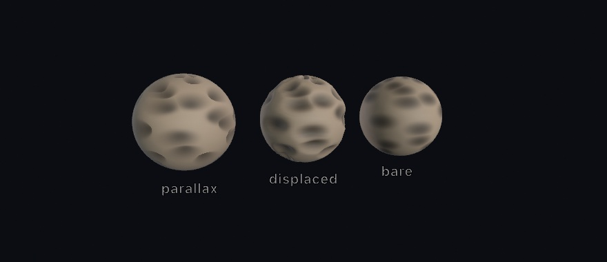

```swift
let moon = base.textured(dust).parallaxMapped(craterHeights, scale: 0.06)
let rock = base.displaced(by: craterHeights, scale: 0.13).textured(dust)
```

**`parallaxMapped(_:scale:)`** is the shading read. At every pixel the renderer marches your line of sight down into the height field and finds where it lands. Then it reads the base texture, the normal map, and every other map *there* instead of at the flat surface. Crevices sink, slide against their rims as the view moves, and hide their far walls, everything real carving does. And still not one vertex has moved. `scale` is the depth of the relief as a fraction of the picture's tile. It needs the same texture coordinates and tangent basis a normal map does, and it sets the basis up itself the same way.

**`displaced(by:scale:)`** is the geometry read. Every vertex really moves along its normal by the height at its spot on the picture, normals are recomputed, and the relief becomes true of the mesh, with `scale` now in the mesh's own units. It's honest work done once, so do it in `setup()` and keep the result. The detail you get is the *mesh's* to give, since a plane with more `segments` carves finer.

Look at the outlines in the figure, because they are the entire lesson. The parallax sphere's silhouette is a perfect circle however deep the craters read. The shading is fiction, and the outline, the cast shadow, and a mirror all keep telling the geometric truth. The displaced sphere's rim is genuinely cratered, in shadow and reflection too. Inside the outline the two are nearly twins, which is exactly why parallax is worth having, all of the depth and none of the triangles. When the edge matters, displace. When it doesn't, march.

White stays put in both readings, one convention doing quiet work. A height map's white regions *are* the authored surface, so the two spheres agree about where the relief lives, and you can hand one map to both calls. The `3D/Materials/Parallax` example is the worked version with the parallax depth on a knob. USD files carry the map in and out, since `saveScene` writes it to the preview surface's displacement slot, while glTF simply has no place to put one.

## Meshes made from other meshes

Two more ways to get geometry, and both start from a mesh you already have.

### Smooth from a cage

There is a third way to get a mesh, and it's the one character artists live in. Build something crude out of a few boxes and extrusions, then let the computer round it. `subdivided(levels:)` takes any mesh as a **control cage**, splits every face, and eases every vertex toward its neighbors, once per level.

```swift
let cage = Mesh.extrude(Profile.star(), depth: 0.75)
let smooth = cage.subdivided(levels: 2)
```


You model the cage, and the smoothness is computed. One level already turns the slab-sided star into something you'd want to hold. By two the form has melted well inside its cage, which is the thing to internalize. The smooth surface eases *toward the averages* of the cage, so it always sits inside it, and pointy features round off the fastest. If a shape comes out softer than you wanted, the fix is a chunkier cage, not fewer levels.

Any mesh works as a cage with no preparation. Take the primitives, an extrusion, a lathe, or a loaded model. `subdivided` welds their shared corners and recovers their intended faces before refining, so a box rounds as one closed surface rather than six drifting plates. Open sheets keep their rims, and a subdivided `plane` smooths along its edge instead of shrinking away from it. Triangle-native meshes like an icosphere or a marching-cubes blob have their own refinement rules a scheme argument away, `subdivided(.loop, levels: 2)`. The [reference page](../Docs/Generators/SubdivisionSurfaces.md) covers when to pick which.

This is `setup()`-shaped work: each level roughly quadruples the face count, so refine once, keep the mesh, and let `draw()` just draw it. Two or three levels is almost always enough.

### A surface that outgrows itself

Subdividing takes a shape you designed and smooths it. This does the opposite. It hands you a shape nobody designed, out of a rule you can say in one sentence.

Take a mesh. Push its vertices apart, and split any triangle that stretches so the triangles stay a fixed size. The surface now has more area than it started with, and here is the part that matters. **Nothing is pushing it outward.** The forces run along its own edges, and those lie in the surface. It cannot get bigger the way a balloon does. So the new area has to go somewhere, and the only direction left is sideways. It folds.

```swift
// setup(), and keep it:
growth = MeshGrowth(mesh: .icosphere(subdivisions: 3), driver: .uniform, seed: 7)

// draw():
growth.step()
drawMesh(growth.mesh)
```

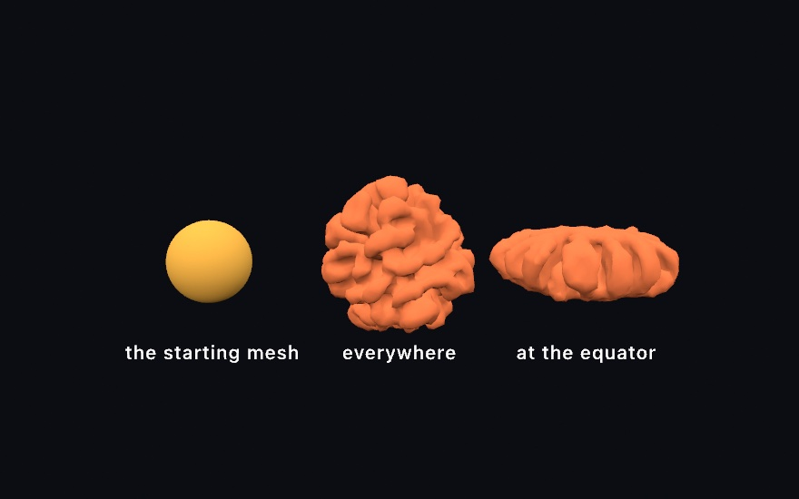

That middle one is a plain sphere that grew evenly, and it is worth sitting with, because nobody told it to make lobes. Grow a ball uniformly and it does not become a bigger ball. It becomes a brain. Every fold in it is the surface running out of room.

The `driver` decides *where* the growth is fastest, and since every driver folds, what you are really choosing is **where the folds go**:

```swift
MeshGrowth(mesh: seed, driver: .uniform)      // evenly, all over
MeshGrowth(mesh: seed, driver: .curvature)    // wherever it already bulges

// Only near the equator, the way a leaf grows along its margin.
MeshGrowth(mesh: seed, driver: .field { position, _ in
    1 - smoothstep(0.1, 0.5, abs(position.y))
})
```

The third panel is that last one. The poles never grew, so they stayed smooth, and everything the band made had to ruffle. It is the same rule as the lettuce leaf and the kale edge. They grow faster along the rim than through the middle, and they buckle for exactly this reason.

The two knobs worth knowing early. `edgeLength` is the triangle size, so it sets the finest fold the surface can hold and it is where the cost lives. `stiffness` is how much the surface resists bending, and it decides how *big* the folds come out. A sheet with no stiffness buckles at the smallest scale it can and reads as crumpled paper, while more of it gathers the same growth into broader waves. If a result looks like foil someone sat on, that is the knob.

There is a fourth driver, `.chemical`, that runs a reaction-diffusion pattern in the surface and grows where the pattern collects. The chemistry decides where to add area, and the new area gives the chemistry more room to spread. That is the branching-coral one, and the [reference page](../Docs/Generators/MeshGrowth.md) has it along with self-avoidance, open sheets that keep their rims, and the cost.

Growth is slow on purpose. A form takes hundreds of steps, and stepping once a frame while you watch it develop is most of the pleasure. `maxVertices` is the ceiling that keeps it interactive, and it also decides how far a form gets before it settles.

## More ways to put a picture on

These three do not work like the maps above. The first needs no texture coordinates at all, the second adds a scale of detail the base picture never carried, and the third does not belong to any one mesh in the first place.

### A picture from three sides: triplanar

The last two sections left you holding a small problem. A texture maps through uv coordinates, a little address on every vertex saying where on the picture it sits. The surfaces you just made have none. Nobody unwrapped the grown ball, a subdivided cage comes back without its uvs, and the raymarched blobs of [Chapter 26](26-SculptingWithFields.md) are the same way. `textured(_:)` has nothing to hold onto.

`triplanarTextured` sidesteps the question instead of answering it. Rather than asking the mesh where the picture goes, it projects the picture through the world three times, once along each axis, like three slide projectors aimed down x, y, and z. Every point on the surface blends the three by how squarely it faces each projector. A wall takes nearly everything from the projector facing it. A 45-degree slope takes half and half, and the handoff is gradual enough that you cannot find the line.

```swift
drawMesh(grown.triplanarTextured(stone, normal: veins, scale: 0.9))
```

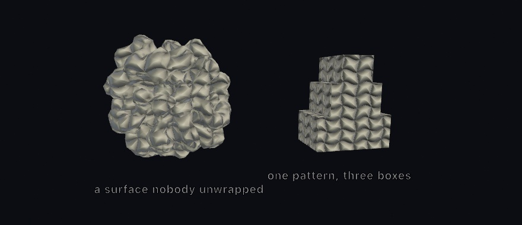

`scale` is the size of one tile in world units, and a `normal:` map rides the same projection. So the veins in the figure are engraved relief, not just darker paint. Notice what you did *not* do. There are no uvs, no tangent basis, and no unwrapping, and the projection works on any mesh you can make or load.

One thing the projection asks of you in return: **the picture has to tile.** It repeats across the whole surface, so if the left edge and the right edge of your map disagree, every wrap draws a straight line. Authoring a map with `fbm(u * 8, v * 8)` does exactly that, because the field at u=0 and the field at u=1 are unrelated. Use `tilingFbm` instead, which closes on itself in both directions:

```swift
// u and v run 0...1 across the map you are filling
let shade = Color(white: tilingFbm(u, v, detail: 5, octaves: 5))
```

`detail` is the frequency you would otherwise have multiplied in, so moving a map across is a straight swap. A mismatched *normal* map is the one that will catch you. The two sides of the join light differently, so the line reads as a crease in the stone rather than as a change of pattern. The bench at the end of this chapter wears its stone this way.

The picture stands still and the surface moves through it. That is the one thing to understand about triplanar, and it cuts both ways. The cairn is three separate boxes drawn one after another, and the pattern runs unbroken across all three, because they stand in the same standing field. That is why the technique is beloved for terrain and rockwork. But a mesh you animate through the transform stack slides through the pattern rather than carrying it along, so a body that travels should wear uvs. A form that grows or morphs in place, like the blob in the `3D/Materials/Triplanar` example, flows through the pattern like a shape turning under falling light, which is its own kind of beautiful.

The projection carries the base texture and a normal map, while the rest of the map set stays with uvs. The [reference page](../Docs/3D/3D.md#triplanar) has the edges of the envelope. The example puts the tile size and the relief on knobs.

### Texture that survives a close look

Every texture has a budget. A picture sized to cover a whole boulder spends all its texels on the big shapes. The moment the camera leans in, the surface runs out of information and dissolves into soft nothing. Real rock does not do that. Get closer and there is always another scale of grain waiting.

`detailMapped` fakes that second scale honestly. It tiles a much finer texture pair across the base one, a color map and a normal map. They repeat several times per base tile, so the close look finds grain the base never carried.

```swift
drawMesh(boulder
    .textured(rock)
    .normalMapped(rockBumps)
    .detailMapped(grain, normal: grainBumps, scale: 12))
```

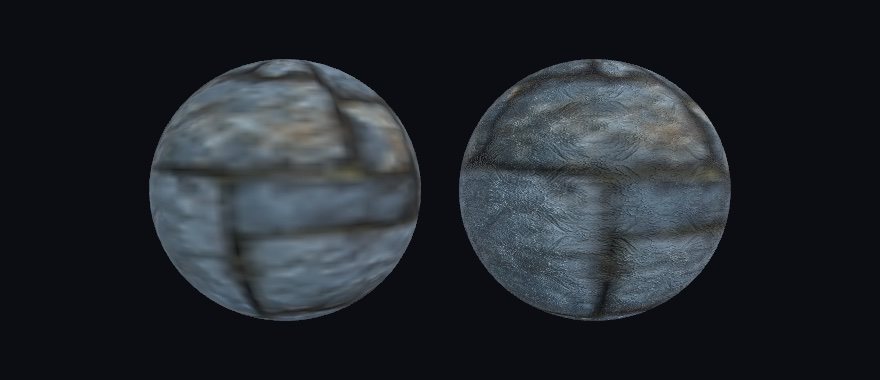

Two conventions make the pair behave. The detail color map multiplies the base with middle gray as its neutral, value 128 in the image. Darker speckles darken, lighter ones lighten, and a flat gray image changes nothing. Author it as texture swinging around gray and the overall tone of your surface holds. And the detail normal map is *reoriented onto* the base relief rather than replacing it. The fine bumps ride the large forms the base map already shaped, the way real grain follows the rock it is part of.

`scale` is how many times the pair repeats across the base, and `strength` fades it out, with zero the honest off switch. A pair tiled dozens of times over is the first thing that would break up in the distance, so those maps read their smaller copies like every other map does. Keep the scale in the range your framing actually shows, which is what the `3D/Materials/Detail` example is for. It puts the same base maps on two spheres, the detail pair on one of them, and the tile count and strength on knobs while the camera sways close.

### A picture stamped onto the scene: decals

Everything so far dressed one mesh. A sticker does not care about meshes. Slap it on a crate and it wraps whatever it lands on, the crate, the pallet under it, half of the wall behind.

A `Decal` works like that. Wrap an image once, then place it each frame as a small projection box. Every surface inside the box receives the picture, composited over the surface's own color before lighting, so it shades like paint rather than a glowing overlay.

```swift
let sticker = Decal(loadImage("label.png")!)!

override func draw() {
    // camera, lights, floor, crates ...
    decal(sticker, at: dropPoint, width: 140)   // projects straight down by default
}
```


The box has a direction, a width and height, and a depth. The placement is per-frame state like a light, which is the quietly powerful part. Move `at:` and the stamp slides across the scene, crossing from the floor up onto a crate and over its far edge, conforming to whatever it touches. Transparency in the image is honored, and later decals composite over earlier ones. A surface standing edge-on to the projection fades the stamp out instead of smearing it down the side, which is the failure you would otherwise get on every wall.

A decal is paint, so it takes the finish of the surface it lands on. Stamp a rough floor and the mark is matte. Stamp polished metal and it sits under the shine. The [reference page](../Docs/3D/3D.md#decals) has the envelope. That's eight per frame, which surfaces receive them, and what mirrors show. The `3D/Materials/Decals` example slides a roundel across floor and crates on a loop, with the size, a roll, and a see-through ring on knobs.

## Finishes you measure

[Chapter 21](21-3DGently.md) picked a finish by name: velvet, jade, toon. Each of those is a look somebody chose and tuned. The finishes in this family are picked by number instead, and the numbers are the ones a physicist would ask for. That sounds like more work and is usually less, because a surface described that way behaves correctly in light you have not set up yet.

They also want something the earlier chapters never needed, which is why they waited. Most of them have almost nothing to work with until the scene has surroundings, so the third section here is about giving it some.

### Two numbers for most real surfaces: PBR

The **physically based** finishes ask for two properties instead of a name, and the renderer works out from them how light should behave:

```swift
material(.metal(roughness: 0.12))         // a metal, nearly polished
material(.dielectric(roughness: 0.4))     // a non-metal, satin
```

**Metal or not** is the first question, and it's close to binary in the real world. Metals tint the light they reflect (gold reflects gold) and have no color of their own underneath. Everything else, called a *dielectric*, reflects white highlights and shows its own color through them. That covers plastic, glass, skin, paint, and stone. **Roughness** is the second, and it's the one you'll actually reach for. It sets how scattered the reflection is, from `0` for a mirror to `1` for chalk.


That is one material with one number changed. The leftmost sphere is a mirror, so what you see on it is mostly a reflection of the room it's standing in. That's why it's dark with one small bright highlight. As roughness grows, that reflection smears out into a wide sheen. By `1.0` it has spread so far that the sphere just reads as its average brightness. `fill` still sets the color, exactly as before, and roughness only decides how the surface handles light.

There are ready-made ones for the common cases, like `.polishedMetal`, `.smoothPlastic`, and `.roughPlastic`. They're the same two properties underneath. Watch the naming, though. Plain `.plastic` is one of the *stylized* finishes from [Chapter 21](21-3DGently.md), not a physically based one, so reach for `.smoothPlastic` when you want this family.

### A streak instead of a dot: anisotropy

Roughness sets how *wide* the highlight is. One more number sets its *shape*. Look at the base of a frying pan, or a laptop lid. The highlight there isn't a dot but a streak, because fine parallel grooves from brushing or machining cover the surface. **anisotropy** is that streak. It runs `-1…1`: `0` keeps the round highlight, and either end pulls it into a line. **anisotropyRotation** spins the line, in radians.

```swift
material(Material(shading: .physicallyBased, metallic: 1,
                  roughness: 0.4, anisotropy: 0.8))
```

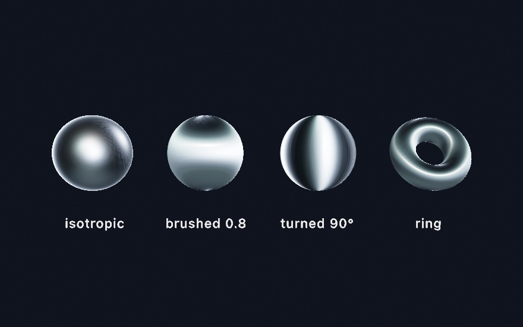

**The whole picture answers to one number.** The first two spheres are the same steel, and the streak is what `0.8` does to it. The reflections smear the same way, so under an environment a brushed metal drags what it mirrors into stripes. The ring at the end is the ready-made `.brushedMetal` preset. On a curved body the streak follows the surface around, exactly how a machined ring or a lathed bowl reads. One thing to keep in mind: the streak is stretched *roughness*, so a mirror at roughness `0` has nothing to stretch. Give it a little roughness first. The [`BrushedMetal` example](../Examples/3D/Materials/BrushedMetal/Sketch.swift) sweeps the strength and the rotation side by side.

Numbers you tune by hand want a way back into code, and every material has one. `swiftSource` prints the expression that rebuilds it, listing only what you changed, and a built-in prints as its own name. The [material explorer](../Examples/3D/Materials/Explorer/Sketch.swift) puts the whole library and every dial from this chapter on knobs, and its C key copies exactly that expression. Tune until it looks right, press C, paste. The knobs were never the artifact. The source is.

### Surroundings as the light: environments

Here's the catch the last two sections have been walking toward. A mirror reflects its surroundings, so **a physically based surface with no surroundings has almost nothing to work with** and goes dark and dull. Named lights don't fix it, because a point light is a point. It makes a highlight, not a reflection.

What fixes it is an **environment**: a photograph of a whole place, wrapped around your scene as a sphere, used as the light.

```swift
environment(.sunset)
material(.metal(roughness: 0.12))
drawMesh(body)
```

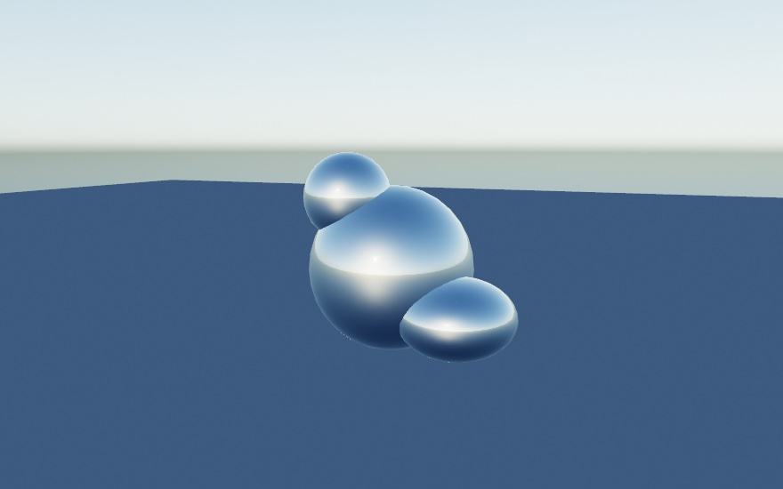


Those two images are the same solids, the same material, the same camera, and the same floor. The only difference is one word. Look at the left flank of the largest ball in the second picture and you can read the buildings in it. That's the whole idea in one glance. The surroundings *are* the reflection, and they are also the light. The floor is lit by the sky in the first and by an ochre evening in the second, without a single light being placed.

Twenty environments come curated. Eight of them are bundled, so they work offline and instantly. Those are `.studio`, `.city`, `.courtyard`, `.forest`, `.interior`, `.night`, `.sunrise`, and `.sunset`. The other twelve download the first time you use one and cache from then on. They range enormously in real brightness, so each is exposed to a consistent level for you. They also pair well with `toneMap(.aces)` from [Chapter 16](16-LayersAndEffects.md), for a filmic rolloff on the highlights.

The first image uses none of them. **`.sky(...)`** builds a daylight sky at runtime with nothing to load:

```swift
environment(.sky(sunElevation: 0.35))       // no asset, and the sun can move
```

It takes a sun elevation and a `turbidity` for how hazy the air is. Because it's computed rather than loaded, you can animate the sun and watch the whole scene's light follow. It's the one to reach for when you want good lighting and don't want to think about assets at all.

The sky can also carry weather. `.clouds(...)` marches real volumetric clouds into the same bake. The deck behind your scene, the light on every surface, and the picture in every reflection then agree about the sky:

```swift
environment(.sky(sunElevation: 0.5).clouds(.scattered))          // a preset deck
environment(.sky(sunElevation: 0.5).clouds(coverage: 0.9))       // a gray lid: the light goes soft
```


`coverage` runs from a few fair-weather puffs to overcast. Because the clouds live in the environment, sliding it dims and diffuses the whole scene the way a real gray day does. `tallness` trades flat sheets for building towers. `phase` is the wind's clock, so advance it and the weather drifts, deterministically, and an export plays the same sky. A still sky bakes once and costs nothing per frame. The `3D/Environments/Cloudscape` example puts all of it on knobs.

Two knobs come up immediately in practice. An environment paints itself **behind** your scene as a backdrop, which is usually what you want, since the reflections then match what you can see. When you'd rather keep your own `background(_:)`, `.lightingOnly()` keeps the light and drops the picture. And `.backgroundBlur(_:)` softens just the backdrop, which pushes it back behind the subject. Both figures above use a little.

### The room as the light: Environment.feed

Every environment so far was somewhere else: a Venice evening, a studio, a synthetic sky. `Environment.feed(...)` uses somewhere you already are. Hand it the webcam, and its latest frame becomes the surroundings. **The room you are sitting in lights the thing you are making.**

```swift
let camera = Camera()          // Chapter 30 introduces it properly; start it in setup()

func draw() {
    drawFrame(camera)              // the room as the picture
    environment(.feed(camera))     // the room as the light
    material(.polishedMetal)
    drawSphere(radius: 1)
}
```

Walk past the camera and the reflections move with you. Hold up something red and the whole scene warms. A webcam only brings a window, and lighting needs a whole sphere of surroundings, so the half the camera can't see is filled with the mirror image of the half it can. That's plausible rather than true, and plausible is exactly what lighting needs.

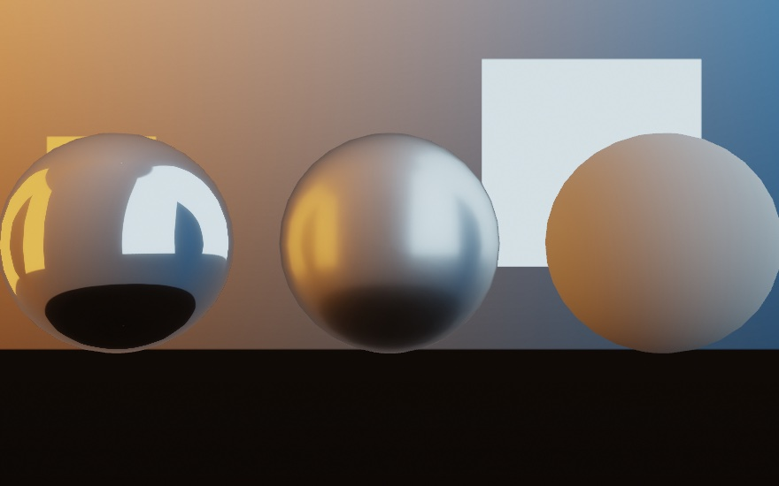

That figure fakes the webcam with one authored picture, so the guide reproduces; everything after the frame is the real path. The picture behind the spheres is also the light on them, which is the whole point: show the feed yourself with `drawFrame`, and the picture and the lighting stay one world. The feed deliberately never draws as its own backdrop the way an HDRI does, because the wrap is made for lighting, not for looking at. Any `VideoFeed` works the same way (a playing video, a screen capture, the phone's camera), and until the first frame arrives a neutral sky stands in. The `3D/Environments/LiveEnvironment` example is this section, live.

### Glass

There has been a way to make a surface see-through since [Chapter 21](21-3DGently.md): give the `fill` some alpha, and the surface fades. Glass is a different thing. The surface stays fully there, with its highlights and reflections, and the *light* comes through instead, bent and tinted on the way. That's transmission, and it's one material call:

```swift
environment(.studio)                  // something to transmit
fill(.white)
material(.glass(thickness: 1.8))      // a solid body: a sphere of radius 0.9
drawSphere(radius: 0.9)
```


The one distinction that matters is `thickness`. At `0` the body is a thin wall, a pane or a soap bubble. What's behind passes through nearly straight, just tinted by the `fill` and dimmed at the edges where the surface turns away. Give it a thickness and the body becomes solid, and a sphere's diameter is the natural number. Now the light refracts on the way in and again on the way out, so a solid ball shows the world behind it flipped and gathered, the crystal-ball look. **A solid ball is a lens, and a thin wall is a window.** The middle sphere in the figure adds the other solid-body knob, `attenuationColor` with an `attenuationDistance`. That's Beer-Lambert absorption under a friendlier name. You say what white light should become after traveling that far inside, and thicker paths get more of it. It's exactly why real bottle glass is palest at its center and deepest green at the rim.

Two more knobs do what you'd hope. `roughness` frosts the glass, so the view through it blurs into a glow. `ior` sets how strongly the body bends light, from `1.33` for water through `1.5` for glass to `2.42` for diamond.

Glass needs an `environment(_:)`, for the same reason a mirror did. There has to be something on the other side to show. On its own it refracts the environment, and that already reads as glass. Add the ray-traced reflections of [Chapter 26](26-SculptingWithFields.md) on a Mac that traces, and the view through the glass upgrades to the actual scene. That's what the figure shows, since those bars appear *through* the spheres because rays really pass through and hit them. One call upgrades mirrors and glass together.

And the one glass object everyone knows is a soap bubble, which is thin glass plus one more idea. A *film* whose thickness drains and swirls colors the surface with marbled interference bands that drift while you watch. That's the iridescence finish's soap-film mode, `iridescenceFlow`, composed straight onto the glass. `iridescencePhase` is the clock, and you drive it with `time`, so exports reproduce. The [`SoapBubble` example](../Examples/3D/Materials/SoapBubble/Sketch.swift) is a handful of them rising and wobbling.

Two honest edges, so they don't puzzle you later. Glass still casts a solid shadow. Glass seen *inside a mirror*, or through other glass, reads as a shiny opaque ball, because a traced ray doesn't re-enter the transmission math. Both are the standard real-time compromises, and both have follow-ups on the roadmap.

### Paint and cloth: clearcoat and sheen

Two more finishes are built by *layering* rather than by choosing numbers for one surface, because that's how the real things are made. Car paint is a metallic base under a thin polished lacquer. Velvet is a matte body under a haze of stray fibers. Each layer gets its own knob on the physically based material, and each has presets so you can start from the name.

```swift
fill(Color(hue: 0.99, saturation: 0.8, brightness: 0.7))
material(.carPaint(roughness: 0.45))    // a satin red metal under a polished coat

fill(Color(hue: 0.62, saturation: 0.6, brightness: 0.42))
material(.felt)                         // a dry, fuzzy blue
```

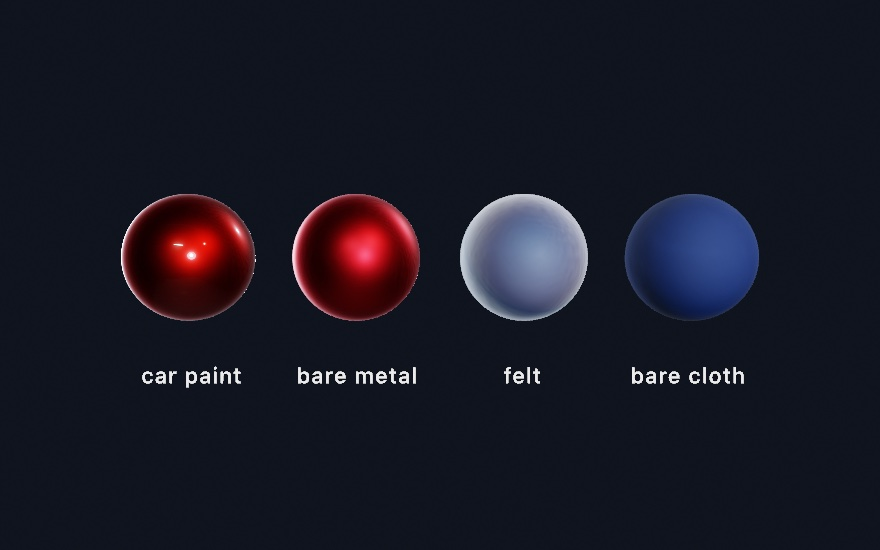

Look at the first pair. The bare metal has one soft satin highlight, the widest its roughness allows. The coated one keeps that satin body and adds a second, sharper reflection floating over it. **Two finishes on one surface, which no single roughness can make.** That's `clearcoat`, and the same idea covers piano lacquer and varnished wood. `.lacquer` is a near-black matte body under a deep gloss film. `clearcoatRoughness` sets the film's own polish, independent of the base. The base dims slightly under a coat, by exactly the light the film reflects away, so the layering never invents brightness. Add [Chapter 21](21-3DGently.md)'s glitter flecks on top of `.carPaint`, through the `sparkle` knob, and you have metal-flake paint.

Now the second pair. The felt sphere is the same blue as its neighbor, but its silhouette glows. Fabric is covered in fibers that lean every direction, and where the surface turns away from you those fibers catch the light edge-on. That's `sheen`. The face stays matte while the rim brightens, and the body gives up a little light to pay for it. `sheenRoughness` sets how tight the rim band is, so `.satin` pulls it close to the edge and `.felt` spreads it into a haze. `sheenColor` tints it. Leave it white for dusty cloth, or tint it away from the `fill` for shot fabric, the deep red velvet rimmed in orange that the [`CoatAndCloth` example](../Examples/3D/Materials/CoatAndCloth/Sketch.swift) ends on.

Both layers work under ordinary lights, under the area-light panels of [Chapter 21](21-3DGently.md), and from an environment. Under the ray-traced reflections of [Chapter 26](26-SculptingWithFields.md) the coat's reflection upgrades to the traced scene along with everything else. The one honest edge matches glass. Seen *inside a mirror*, a coated or fuzzed surface shows only its base there.

### Skin, wax, and stone: subsurface scattering

Every surface so far bounces light off its outside. Skin doesn't. Hold a flashlight against your fingers and the flesh glows red around it. Some of the light went *in*, wandered a little way under the surface, and came back out somewhere else. Marble, wax, milk, and jade all do this, and the eye is remarkably good at noticing when a render of them doesn't. **A surface without it reads as painted plastic no matter how carefully it's colored.**

```swift
fill(Color(red: 0.92, green: 0.72, blue: 0.62))
material(.skin(radius: 0.34))    // radius: how far light travels, world units
drawSphere(radius: 0.72)
```


Look at each pair at the line where light gives way to shadow. The bare balls cut off the way a painted surface does. The scattering ones carry light a little way past that line, because light that entered on the lit side is re-emerging on the dark one. On the skin ball the carried light is *red*. Red travels farthest through flesh, which is why shadow edges on faces are warm. That per-channel reach is the `scatteringColor`, and its default is the skin ratio. Near-equal channels give the neutral softening of `.marble`, and a green-dominant color makes a jade whose glow is green.

`scatteringRadius` is the one number you must set. It's in world units because it's a physical distance, how far light gets before it's absorbed. A head-sized form wants roughly 1% of its width. Make it too big and the material slides toward wax, then toward glowing from within, which is a nice dial to know about. `scattering` runs `0…1` and sets how much of the surface's light takes the trip at all. It layers on any material, needs no other calls, and costs nothing in a frame that doesn't use it. Two honest edges are worth knowing. It applies to solid meshes on the main canvas, so a raymarched field or a mesh inside a render target keeps its plain shading. And it's a different thing from the stylized `subsurface` glow [Chapter 21](21-3DGently.md)'s jade used, which fakes back-light cheaply and can still layer on top for ears and edges.

There's a second half, and it asks for one more call. Turn on `castShadows()` and the same material starts *transmitting*. Light that strikes the far side of a thin body comes through it, which is the flashlight-through-fingers trick from the top of this section done for real. It works because the shadow machinery already knows the one thing the material needs. A shadow map records where the light first landed, and the surface being shaded knows where it is. The gap between the two is how far the light traveled inside the body. **The shadow map was a thickness gauge all along.**


Put the light behind your subject and this carries the picture. A body about one `scatteringRadius` thick passes mostly red, the blood-red of a hand against the sun. The deep slab goes dark except at its rim, where the crossing is short. The ball keeps a warm crescent along its thinning edge. There are no new knobs, because the material already says everything. The radius sets what counts as thin, and `scatteringColor` decides what survives the trip. One edge to know is that only a shadow-casting light transmits, since its depth is the one that's known. Every light that casts does, and a directional, spot, or point caster all work.


## Putting it together: the bench

The finished piece is five specimens on a stone slab, and each one is here to carry a different part of the chapter. Make `MySketches/Bench.swift`. It comes in three parts: the pictures, the objects they dress, and the frame.

The first part is the pictures, and every one of them is written rather than loaded. A normal map is a height function read for its slopes, which is the recipe from the normal-map section. A color picture is a function of the tile's own coordinates. The two height functions under them are named `bareness`, which decides where paint has worn back to metal, and `device`, the wheel cut into the tile.

```swift
import Foundation
import Ollin

final class Bench: Sketch {

    // MARK: pictures authored in code

    /// A height function turned into a green-up normal map by its slopes.
    func normalMap(size: Int, strength: Double, height: (Double, Double) -> Double) -> Image {
        var bytes = [UInt8](repeating: 0, count: size * size * 4)
        let d = 1.0 / Double(size)
        for y in 0 ..< size {
            for x in 0 ..< size {
                let u = (Double(x) + 0.5) * d, v = (Double(y) + 0.5) * d
                let dx = (height(u + d, v) - height(u - d, v)) / (2 * d) * strength
                let dy = (height(u, v + d) - height(u, v - d)) / (2 * d) * strength
                let len = (dx * dx + dy * dy + 1).squareRoot()
                let i = (y * size + x) * 4
                bytes[i]     = UInt8((-dx / len * 0.5 + 0.5) * 255)
                bytes[i + 1] = UInt8((dy / len * 0.5 + 0.5) * 255)
                bytes[i + 2] = UInt8((1 / len * 0.5 + 0.5) * 255)
                bytes[i + 3] = 255
            }
        }
        return Image(width: size, height: size, premultipliedRGBA: bytes)!
    }

    /// A color picture from a function of the tile's own coordinates.
    func picture(size: Int, _ shade: (Double, Double) -> Color) -> Image {
        var bytes = [UInt8](repeating: 0, count: size * size * 4)
        for y in 0 ..< size {
            for x in 0 ..< size {
                let c = shade((Double(x) + 0.5) / Double(size), (Double(y) + 0.5) / Double(size))
                let i = (y * size + x) * 4
                bytes[i]     = UInt8((c.red * c.alpha * 255).rounded())
                bytes[i + 1] = UInt8((c.green * c.alpha * 255).rounded())
                bytes[i + 2] = UInt8((c.blue * c.alpha * 255).rounded())
                bytes[i + 3] = UInt8((c.alpha * 255).rounded())
            }
        }
        return Image(width: size, height: size, premultipliedRGBA: bytes)!
    }

    /// The example model this chapter has been loading all along. Found by walking
    /// up from the working directory, since a figure compiles from a copy of itself.
    var modelURL: URL {
        let tail = "Examples/3D/Geometry/LoadedMesh/model.obj"
        var directory = URL(fileURLWithPath: FileManager.default.currentDirectoryPath)
        while true {
            let candidate = directory.appendingPathComponent(tail)
            if FileManager.default.fileExists(atPath: candidate.path) { return candidate }
            let parent = directory.deletingLastPathComponent()
            if parent == directory { return candidate }
            directory = parent
        }
    }

    // MARK: the two height functions the pictures are made from

    /// How far the paint has worn back to bare metal at a point on the tile.
    func bareness(_ u: Double, _ v: Double) -> Double {
        smoothstep(0.46, 0.62, fbm(u * 4, v * 8, octaves: 4))
    }

    /// The coin's device, as a height: white is the face, darker is cut into it.
    func device(_ u: Double, _ v: Double) -> Double {
        let r = Vector2(u - 0.5, v - 0.5).length
        let a = atan2(v - 0.5, u - 0.5)
        let rays = smoothstep(0.25, 0.55, sin(a * 6) * 0.5 + 0.5)
        let band = smoothstep(0.3, 0.32, r) * (1 - smoothstep(0.37, 0.39, r))
        let hub = 1 - smoothstep(0.1, 0.25, r)
        return 1 - max(band, hub * rays) * 0.85
    }

```

The second part builds the objects. The slab has no texture coordinates worth having, so its stone is projected onto it three ways. The teal ball wears four maps at once: the paint, its scuffs, a metallic-roughness map that says where the paint has gone, and a detail pair for the close look. The tile's wheel is a height map on a flat plane. The cushion started life as a six-pointed slab. The crystal comes out of the same example model file the chapter opened with.

```swift
    // MARK: the parts

    var bench = Mesh(positions: [], indices: [])
    var worn = Mesh(positions: [], indices: [])
    var tile = Mesh(positions: [], indices: [])
    var star = Mesh(positions: [], indices: [])
    var specimen: Mesh?
    var mark: Decal?

    let plinth = Mesh.box(width: 0.86, height: 0.2, depth: 0.86)
    let cushion = Mesh.sphere(radius: 0.6, segments: 64, rings: 40)
    let egg = Mesh.sphere(radius: 0.34, segments: 48, rings: 32)

    override func setup() {
        seed(714)
        noiseSeed(714)

        // The bench has no uvs worth having, so its stone is projected, grain and all.
        // A projected picture repeats, so both of these have to tile, or the
        // stone draws a straight line wherever the picture wraps.
        let stone = picture(size: 512) { u, v in
            let grain = tilingFbm(u, v, detail: 5, octaves: 5)
            return Color.mix(Color(hex: 0x585A5C), Color(hex: 0x7C7B74), t: grain)
        }
        let stoneRelief = normalMap(size: 512, strength: 0.35) { u, v in
            tilingFbm(u, v, detail: 8, octaves: 5) * 0.5
        }
        bench = Mesh.box(width: 9, height: 0.5, depth: 5)
            .triplanarTextured(stone, normal: stoneRelief, scale: 2.6)

        // Painted metal, and a map that says where the paint has gone.
        let paint = picture(size: 512) { u, v in
            Color.mix(Color(hex: 0x1D5450), Color(hex: 0xC7BFB0), t: self.bareness(u, v))
        }
        let wear = picture(size: 512) { u, v in
            let b = self.bareness(u, v)
            return Color(red: 0, green: 0.7 - b * 0.5, blue: b)   // g roughness, b metallic
        }
        let scuffs = normalMap(size: 512, strength: 0.05) { u, v in
            fbm(u * 14, v * 14, octaves: 3) * 0.5
        }
        let grain = picture(size: 256) { u, v in
            let n = fbm(u * 30, v * 30, octaves: 3) * 0.5 + 0.5
            return Color(white: 0.5 + (n - 0.5) * 0.5)          // gray is the neutral
        }
        let grainBumps = normalMap(size: 256, strength: 0.06) { u, v in
            fbm(u * 30, v * 30, octaves: 3) * 0.5
        }
        worn = Mesh.sphere(radius: 0.5, segments: 96, rings: 48)
            .textured(paint)
            .normalMapped(scuffs)
            .surfaceMapped(metallicRoughness: wear)
            .detailMapped(grain, normal: grainBumps, scale: 6, strength: 0.5)

        // A tile whose device is carved by a height map rather than by geometry.
        let carved = picture(size: 512) { u, v in Color(white: self.device(u, v)) }
        let slate = picture(size: 512) { u, v in
            Color.mix(Color(hex: 0x3E4A52), Color(hex: 0x8FA0A8), t: self.device(u, v))
        }
        tile = Mesh.plane(width: 1.15, depth: 1.15)
            .textured(slate)
            .parallaxMapped(carved, scale: 0.09)

        // A crude cage, rounded by the computer.
        star = Mesh.extrude(Profile.star(points: 6, outerRadius: 0.46, innerRadius: 0.24), depth: 0.42)
            .subdivided(levels: 2)

        specimen = loadMesh(modelURL.path)?.normalized(scale: 1.15)

        // The bench is stamped where the maker signed it.
        mark = Decal(picture(size: 256) { u, v in
            let r = Vector2(u - 0.5, v - 0.5).length
            let ring = abs(r - 0.34) < 0.02 || abs(r - 0.29) < 0.009
            let bar = abs(v - 0.5) < 0.028 && abs(u - 0.5) < 0.18
            let stem = abs(u - 0.5) < 0.028 && abs(v - 0.5) < 0.18
            return Color(hex: 0x17130E, alpha: (ring || bar || stem) ? 0.7 : 0)
        })
    }

```

The third part is the frame. There is one directional light and one environment, and the environment is doing most of the work, because every finish here is a measured one.

```swift
    override func draw() {
        background(Color(hex: 0x0D0E12))
        camera(Camera3D(eye: Vector3(0.55, 2.35, 6.4), target: Vector3(0.15, 0.35, 0.2),
                        projection: .perspective(fieldOfView: .pi / 4.8)))
        environment(.interior.backgroundBlur(0.55))
        directionalLight(Color(kelvin: 4600), direction: Vector3(-0.5, -0.72, -0.5),
                         intensity: 0.85, softness: 0.22)
        castShadows()
        toneMap(.aces)

        // The bench, and the mark stamped into it.
        withState {
            translate(0, -0.25, 0)
            fill(.white)
            material(.dielectric(roughness: 0.85))
            drawMesh(bench)
        }
        if let mark { decal(mark, at: Vector3(-1.4, 0, 1.25), width: 0.7) }

        // The crystal on its lacquered plinth.
        withState {
            translate(-1.45, 0.1, -0.2)
            fill(Color(hex: 0x14100E))
            material(.lacquer)
            drawMesh(plinth)
            if let specimen {
                translate(0, 0.68, 0)
                rotateY(0.6)
                fill(Color(hex: 0xDCEEF6))
                var crystal = Material.glass(roughness: 0.03, ior: 1.48, thickness: 0)
                crystal.attenuationColor = Color(hex: 0xBBE0EC)
                crystal.attenuationDistance = 4
                material(crystal)
                drawMesh(specimen)
            }
        }

        // The cage the computer rounded, in brushed steel.
        withState {
            translate(-0.4, 0.24, 0.5)
            rotateX(-.pi / 2)
            rotateZ(0.5)
            fill(Color(hex: 0xBFC4C9))
            material(.brushedMetal)
            drawMesh(star)
        }

        // Painted iron, worn back to metal.
        withState {
            translate(0.8, 0.5, -0.45)
            rotateY(-0.5)
            fill(.white)
            material(.physicallyBased(metallic: 1, roughness: 1))
            drawMesh(worn)
        }

        // The tile, carved by a picture and by nothing else.
        withState {
            translate(0.1, 0.005, 1.1)
            rotateY(0.28)
            fill(.white)
            material(.dielectric(roughness: 0.55))
            drawMesh(tile)
        }

        // Wax on cloth: the light goes in, wanders, and comes back out.
        withState {
            translate(1.75, 0.12, 0.35)
            fill(Color(hex: 0x3A1018))
            var felt = Material.felt
            felt.sheenColor = Color(hex: 0xB9724F)
            material(felt)
            withState {
                scale(1.35, 0.36, 1.35)
                drawMesh(cushion)
            }
            translate(0, 0.45, 0)
            fill(Color(hex: 0xF2E3C0))
            var wax = Material.marble(radius: 0.12)
            wax.scatteringColor = Color(red: 1, green: 0.66, blue: 0.34)
            material(wax)
            scale(0.84, 1.2, 0.84)
            drawMesh(egg)
        }
    }
}
```


Five specimens, ten pictures, one light. Three of those specimens have no detail you could find in a vertex. The ball is a plain sphere, the tile is a single flat quad, and the slab is a box, and everything you can see on them was written into a picture.

Then make it yours:

- Set `parallaxMapped`'s `scale` on the tile to `0.2` and look along the slab. The carving deepens and still leaves the tile's outline perfectly straight, which is the trade the height-map section describes.
- Swap the tile's `parallaxMapped` for `displaced(by:scale:)` on a `Mesh.plane(width:depth:segments: 200)`. Now the edge is carved too, and you paid for it in triangles.
- Change `.marble(radius:)` on the egg to `.skin(radius:)` and watch the shadow terminator go warm.
- Give the cushion a `sheenColor` far from its `fill`, deep red under orange, for the two-tone velvet look.
- Point `modelURL` at a model of your own. `normalized(scale:)` fits it to the bench whatever units its author saved it in.

## Where this comes from

Normal mapping descends from Jim Blinn's 1978 bump mapping, which perturbed the shading normal instead of the surface, and the tangent-space map is how that idea reached every real-time engine. Parallax occlusion mapping is the marching read of the same picture, from the terrain and surface work of the mid-2000s. Triplanar projection is the three-axis world projection Ryan Geiss wrote up for terrain in *GPU Gems 3*, and the detail pair blends onto the base with the reoriented normal mapping of Colin Barré-Brisebois and Stephen Hill. Subdivision surfaces are Edwin Catmull and James Clark's 1978 scheme for quads and Charles Loop's 1987 one for triangles, the pair that character modeling has run on ever since.

The measured finishes are the Cook-Torrance microfacet model, in the metallic-roughness form Brent Burley presented for Disney in 2012 and the glTF specification wrote down. The anisotropic version follows Christopher Kulla and Alejandro Conty, the clear coat is the second lobe of Google's Filament documentation, and the sheen is Estevez and Kulla's production-friendly sheen. Lighting a scene from a picture of a place is Paul Debevec's idea, in the split-sum form Brian Karis published in 2013; the computed sky is Lukas Hosek and Alexander Wilkie's model, which ships inside Ollin. Subsurface scattering is the separable screen-space diffusion of Jorge Jimenez and colleagues, over the measured skin profile Eugene d'Eon and David Luebke fitted, with the backlit half from Jimenez's translucency work. Full credits are in the project's [attribution notes](../ATTRIBUTION.md).

## Go deeper

- [3D](../Docs/3D/3D.md): the full reference for every map (`normalMapped`, `surfaceMapped`, `parallaxMapped`, `displaced`, `triplanarTextured`, `detailMapped`, decals) and every material knob, with the exact envelope of each.
- [The Hopf fibration](../Docs/3D/HopfFibration.md): the base sets, taking the color from the base point, the straight one, and what it costs to draw.
- [Scenes](../Docs/3D/Scenes.md): the whole `loadScene` reference, what carries over from a glTF file (nodes, cameras, punctual lights, animations, skins, and morph targets) and from a USD file (nodes, cameras, its UsdLux lights, its transform animation, and its UsdSkel skins and blend shapes), how intensities are normalized, and building a `Scene` in code.
- [Bringing a scene over](../Docs/Tools/SceneImport.md): `ollin new --from-scene` writes the sketch instead of loading the file, so the camera, the lights and every placement become source you own. What it leaves behind, and why, is listed there.
- [Subdivision surfaces](../Docs/Generators/SubdivisionSurfaces.md): both schemes, what happens at an open boundary, and when to pick which.
- [Mesh growth](../Docs/Generators/MeshGrowth.md): the differential-growth and reaction-diffusion forms, their knobs, and how to keep a growth stable.
- [Environment lighting](../Docs/3D/3D.md#environment-lighting): all twenty curated environments listed by mood, which eight are bundled offline, `highRes` backdrops, loading your own `.exr` or `.hdr`, where downloads cache, and the full procedural-sky knobs.
- [Physically based materials](../Docs/3D/3D.md): the metallic-roughness model in full, plus the ready-made metals and dielectrics and how they combine with the stylized finishes.
- [Glass](../Docs/3D/3D.md#glass): every transmission knob with its units, the environment requirement, and the honest edges spelled out.
- [Subsurface scattering](../Docs/3D/3D.md#subsurface-scattering): the three scattering knobs, the presets, and the envelope; worked example [`Examples/3D/Materials/Subsurface`](../Examples/3D/Materials/Subsurface/Sketch.swift) (hold space to compare against the plain surfaces).
- [Combining 3D features](../Docs/3D/Combining.md): which finishes reach which kind of geometry, which is the table to check when a material you expected to apply does nothing.
- Worked examples, in [`Examples/3D/`](../Examples/3D/): `Geometry/LoadedMesh` and `Geometry/LoadedScene`, `Materials/NormalMaps`, `Materials/SurfaceMaps`, `Materials/Parallax`, `Materials/Triplanar`, `Materials/Detail`, `Materials/Decals`, `Materials/BrushedMetal`, `Materials/CoatAndCloth`, `Materials/SoapBubble`, and `Environments/Cloudscape` and `Environments/LiveEnvironment`.

---

[Contents](README.md#contents) · Previous: [Chapter 21, 3D, gently](21-3DGently.md) · Next: [Chapter 23, Landscapes and multitudes](23-Landscapes.md)
