#### <sup>[Ollin](../README.md) → [Guide](README.md) → Chapter 22</sup>

---

# 22. Sharing and performing


Twenty-one chapters of pieces have lived on your screen. This last chapter is about everywhere else they can go. Out as files, meaning a poster, a video, a GIF, or a plotter drawing. Out as live feeds, into a VJ rig or a video call. Out as light on a real rig. Up on a wall, running by itself for a week. And out on a stage, where writing the code is the performance. The piece above is the final state of a live-coded set you'll build in five evaluations. Every road out of the framework starts from the same place, the sketch you already have.

## Leaving as files

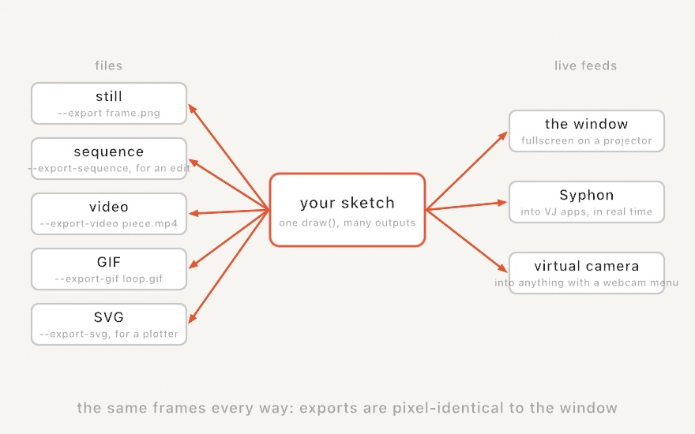

Every file export runs the sketch *headlessly*. No window opens, `setup()` runs, the clock advances to the frame you asked for, `draw()` runs, and the result is written. Because the offline clock is a fixed timestep, an export is deterministic. The same sketch, seed, and frame make the same file every time, however long the render takes. Sources follow the same clock. A video decodes by frame position, and an `AudioPlayer` feeds its analyzer the matching slice of its file each frame. Even an audio-reactive piece therefore exports with its beats in the same places. The flags live on any example's executable, and a loose sketch file gets the identical surface through the live host:

```sh
swift run OllinLive MySketches/Finale.swift --export poster.png --frame 200
swift run --package-path Examples Example-Motion-Breathing --export-sequence /tmp/out --seconds 5 --fps 60
```

`--export` writes one frame as a PNG, and `--export-sequence` writes every frame, lossless, ready for `ffmpeg` or an edit timeline. Exports default to the best render quality (`.detail`), since a file has no frame rate to protect. `--render-quality` dials that down when you want a fast draft.

### Rendering from code

Those flags are a command-line wrapper around one function, and the function is available to you directly:

```swift
if let frame = OllinApp.image(of: MySketch(), frame: 200) {
    // a CGImage, rendered with no window anywhere in sight
}
```

`OllinApp.image(of:frame:)` builds the sketch, runs `setup()`, advances the clock to the frame you asked for, renders, and hands back a `CGImage`. (`OllinApp.export` is that call plus a PNG writer, which is all `--export` is.)

This matters the moment you want to render *many* things, or render on your own terms:

- a contact sheet of twenty seeds,
- thumbnails for a catalog,
- a batch job over a folder of inputs,
- a test that checks a render hasn't changed.

All of them are a loop around this one call. None of them need a window, a display, or a person watching.


That figure is the call demonstrating itself. It's one sketch whose `draw()` renders a *different* sketch four times at four frames and lays out the results. A fresh instance is built per capture, so each render starts cleanly from `setup()`.

It's also how this guide is made. Every image you've seen in it is a committed sketch under `Guide/Figures/`. A small tool walks the folder and calls `OllinApp.image(of:frame:)` on each one. That's the reason nothing here can quietly rot. A listing that stops compiling fails the render. A figure that stops matching its prose is a file someone can open and run.

## Motion: video and GIF

For a file you can post, skip the stitching and encode directly:

```sh
swift run OllinLive MySketches/Finale.swift --export-video finale.mp4 --seconds 12
swift run OllinLive MySketches/Finale.swift --export-gif finale.gif --seconds 4 --gif-width 540
```

Reach for video first, because it's almost always the right choice. The default `h264` plays everywhere. `--codec hevc` is better quality per byte when the file needs to be smaller. The two ProRes profiles are for edit timelines rather than for sharing. `--bitrate` (in Mbit/s) is the file-size dial, and a 1080-square piece looks clean around 10 to 15 in `h264`. The GIF is for the short loop. It's palette-limited and heavy per second, so keep it a few seconds and downscale with `--gif-width`. A piece where *every* pixel changes every frame defeats GIF compression entirely and balloons the file. A drifting full-canvas field is that kind of piece. Chapter 3's perfectly looping phase tricks are exactly what a GIF wants.

## Vector: the plotter path

Chapter 13 promised that shapes held as geometry could leave as geometry, and `--export-svg` is that promise kept:

```sh
swift run OllinLive MySketches/Plot.swift --export-svg plot.svg
swift run OllinLive MySketches/Plot.swift --export-svg plot.svg --hatch
```

The exporter records each draw call at its own level, before any pixels exist. Circles become `<circle>`, polylines `<polyline>`, and shapes and outline text `<path>` with their fill rules. Transforms and opacity stay intact. The file opens in a browser, Inkscape, or Illustrator, and feeds a pen plotter's tooling directly. Since a pen has no fill, `--hatch` turns solid fills into parallel line work spaced by tone. Add `--cross-hatch`, or set `--hatch-spacing` and `--hatch-angle`. Stroke fonts and stroked geometry pass through as the single lines they already are. Images are the one thing that can't come along, because a vector file has no place for them.

The same recording writes as a **PDF** with `--export-pdf plot.pdf`, and that is the path to paper. One canvas pixel maps to one PDF point, so the paper presets on `CanvasSize` come out true to size. Declare `override var canvasSize: CanvasSize { .a4 }` and the exported page *is* that sheet, vector-sharp at any printer's resolution. `.usLetter` and `.a5` are there too, and `.landscape` turns the sheet. If the raster export should be print-grade too, `.a4.dpi(300)` renders the pixels at 300 dots per inch. The PDF page stays exactly A4. Everything the SVG carries, the PDF carries the same way, hatching included.

## Printing one ink at a time

Some presses can't print a full-color image at all. A risograph or a screen-printing rig lays down one ink per pass. It needs you to hand it a separate grayscale plate for each one. If you have never prepared work for that kind of press, the mental model is the useful part.

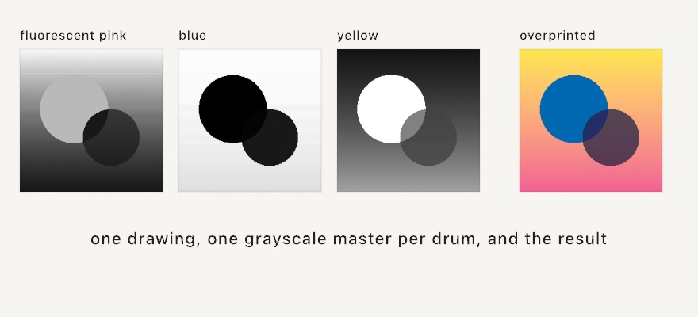

Each ink gets a **master**, a grayscale image where black means "lay down full ink here" and white means "leave the paper bare". The press runs the paper through once per master, and the inks stack up. Because printing inks are translucent rather than opaque, overlapping them mixes: pink over blue makes a purple neither drum could print alone. That's why the three plain-looking plates above produce a picture with more colors in it than three.

```swift
override var printInks: [Ink]? { [.fluorescentPink, .blue, .yellow] }
```

Declare that on your sketch, export with `--export-separations`, and you get one master per ink plus a preview with registration marks on it. That preview is the sheet you check before committing to paper. Working the other way round, `artwork.separated(into:)` does the same job to any `Image` in code. You can look at the plates while you compose.

The interesting part is what happens for a color no single ink can make. Ollin searches for the combination of ink coverages whose overprint comes closest. It judges the way your eye judges, rather than by raw numbers. The space is the same perceptual one Chapter 2's color mixing uses. Draw in an ink's own color and it separates exactly. Draw anything else, including gradients and photographs, and it lands on the nearest mix those drums can actually reach.

One practical note carries over from Chapter 7's halftone. A press cannot hold a dot smaller than about two percent coverage. Anything fainter drops to bare paper rather than becoming invisible speckle. `separation.halftoned(pitch:)` rotates each ink's dot grid to its own angle, so the drums overprint into a rosette instead of a moire. `separation.dithered()` is the grainier alternative. [Print separations](../Docs/Output/PrintSeparations.md) has the full ink catalog, plus the screening details. The catalog carries the community-measured colors of the standard risograph line.

## Something you can hold

A plotter turns a `Contour` into ink on paper. A 3D printer does the same job for a `Mesh`, and the call is just as short:

```swift
sculpture.normalized(scale: 60).write(to: "sculpture.3mf")
```

`normalized(scale: 60)` is doing the work that matters. A mesh carries bare numbers, and a printer needs millimeters. So this centers the shape on the origin, where a build platform wants it, and fits its longest side to 60 mm. The extension picks the format, and the file records that size.

Then there is the thing nobody warns you about, which is that a shape can look completely finished and still be unbuildable. A printer has to decide, for every point in space, whether it is inside the object or outside it. It can only answer that if the surface actually closes. Here are two copies of the same knot, one swept closed and one left open at its ends:

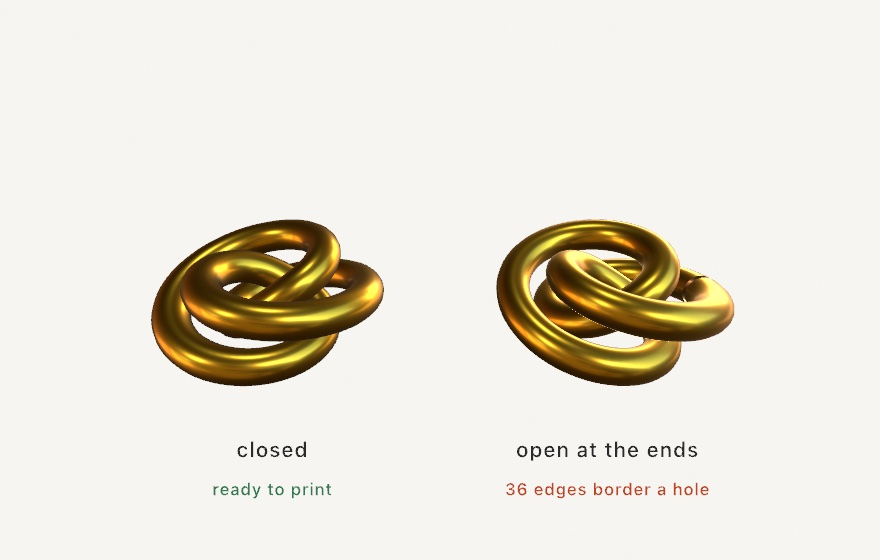

On screen an open surface is exactly as convincing as a closed one. A printer is the first thing that ever disagrees.

So ask before you commit to plastic:

```swift
let check = sculpture.printCheck()
print(check.summary)        // "9360 triangles, 60.00 x 52.50 x 26.02 units: ready to print"
```

`printCheck()` reports whether the surface closes and whether neighbouring triangles agree on which side is out. It also reports whether the whole thing is inside out, and how big the file says it is. When something is wrong, `problems` says so in words rather than numbers. A mesh that fails is still written, with a note. An open surface is a perfectly good thing to draw, and only fabrication needs it sealed.

Starting from a shape that closes by construction saves the repair work entirely. Chapter 17's metaballs and isosurfaces close by definition, since a field has an inside. So do the solid primitives and a tube swept with `closed: true`. A plane, or a lathe without caps, does not.

One last thing happens quietly on the way out. Ollin's meshes are flat-shaded. Every triangle carries its own three corners, so each face can hold its own normal, and neighbouring triangles share no vertex at all. Read as a solid, that is not a surface with a few holes in it, it is nothing but holes. The writers merge those duplicate corners first and settle the winding against the mesh's own normals. They also stand the model up on z. Ollin's world is y-up and a build platform is not. You get a solid without having to know any of that, which is the point. See [Fabrication](../Docs/Output/Fabrication.md) for the details. `Examples/3D/Geometry/Fabrication` is the knot above, with knobs.

## Something you can walk around

A printer takes one mesh. A whole 3D scene has somewhere else to go:

```sh
swift run Example-3D-Geometry-Solids --export-usdz piece.usdz
```

USDZ is the format Apple's platforms read without being asked. Double-click the file and Quick Look opens it. Send it in a message and it opens there too. Tap the AR button and the piece stands on the floor in front of you at whatever size the file says it is. Drop it into a visionOS app and it is already a model.

The thing to notice is what changed about the artifact. Every export so far in this chapter has been a *picture of* the sketch, taken from where the camera happened to be. This one is the scene itself. Whoever opens it picks their own angle.

Any `Scene` writes the same way, including one you loaded or built by hand:

```swift
scene.write(to: "piece.usdz")
```

And a frame becomes a scene when you ask for it:

```swift
let scene = OllinApp.spatialScene(of: sketch, frame: 120)
```

That hands back an ordinary `Scene`, the same kind [Chapter 17](17-3DGently.md) loaded from a file. You can look at what your own frame is made of, move a node, and write it out. One writer serves both paths, which is why the file and the frame cannot disagree.

Here is a frame drawn the ordinary way, beside the same frame written to a `.usdz` and opened again:

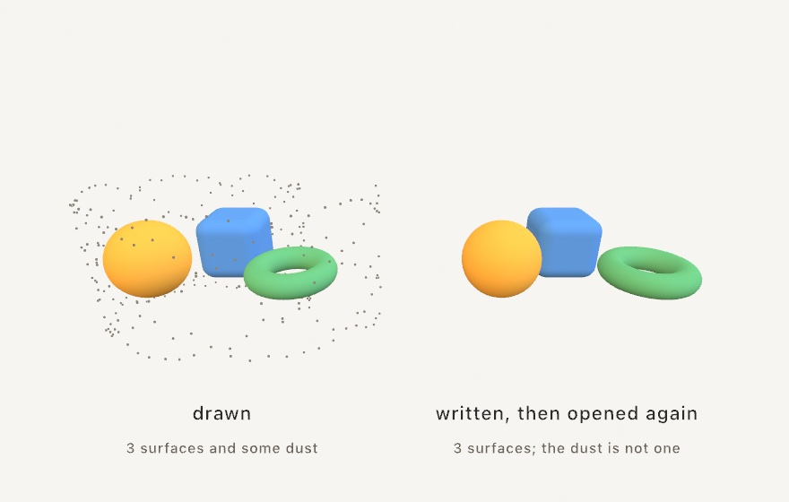

The surfaces come back exactly. The dust does not, and that is the rule worth carrying: **a model file holds surfaces**. Meshes travel, with their transforms, their colors, their textures, and as much of their finish as the format has a slot for. The camera and the lights travel too. A point cloud, a GPU particle system, and a raymarched field are not surfaces, so they stay behind. So does 2D drawing, which is why a labelled diagram arrives without its labels. Ollin prints one note for each thing it left, rather than letting you find out later.

If you want a field or a cloud to travel, give it a surface first. `isosurface(at:in:_:)` and `particleSurface(of:)` from Chapter 17 turn one into a mesh, and a mesh always goes.

One number decides whether the model is furniture or a paperweight:

```swift
scene.write(to: "piece.usdz", metersPerUnit: 0.05)
```

A model file records how big one scene unit is, and nothing is scaled on the way out. At the default of 1 a sphere of radius 1 arrives two meters across. Most 3D sketches work at unit scale. Something between `0.01` and `0.1` is usually what you want for a piece someone will set on a table.

Lighting is the one place a spatial export deliberately gives something up. The lights travel, but an [environment](../Docs/3D/3D.md#environment-lighting) does not. A viewer supplies its own, and in AR that viewer is a camera looking at your actual room. A metal surface exported this way reflects wherever it ends up, which is a better answer than the studio it was made in. [Spatial](../Docs/Output/Spatial.md) has the full list of what carries. `Examples/3D/Geometry/SpatialExport` is a ring of solids with a save key.

## Something you can look into

A model hands over a scene and lets someone choose an angle. That works because the scene is still. Motion cannot be handed over that way, so it gets handed over differently. It is recorded from two eyes at once, the way you already see the room you are sitting in.

```sh
swift run Example-3D-Geometry-SpatialVideo --export-spatial piece.mov --seconds 8
```

That writes **spatial video**, which is the format Apple's platforms record and play with real depth. Everything about the drive is the export you already know, the same fixed clock and the same determinism. The difference is that each frame is rendered twice, from two cameras a little way apart. The two views travel together in one file.

Two numbers decide what that looks like, and neither is a setting you get right or wrong. They are composition.

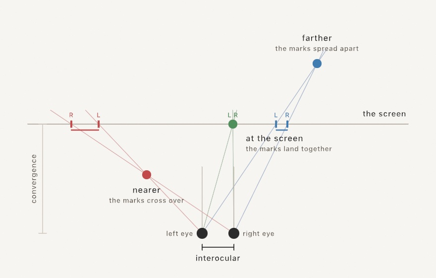

**Convergence** is the distance at which the two eyes agree, and the diagram is what that means. Follow a line from each eye through an object to the screen: those two landing places are where each eye sees it. For something sitting at the convergence distance they land together, so it appears *on* the screen. For something nearer, the lines have already crossed by the time they get there, and the marks come out the wrong way round. Your eyes read that as an object in front of the screen, poking out. Farther away, the marks spread apart the ordinary way and the object sits behind. So choosing the convergence distance is choosing what the viewer is looking *into* rather than *out at*.

**Interocular** is how far apart the eyes stand, in world units, and it is the depth dial. Half reads flatter. Twice reads deeper, then starts to hurt. Left alone, Ollin puts the eyes 1% of the frame width apart, and that rule has a reason. It works out to the far background separating by 1% of the frame too. That is less than a viewer's own eyes span, so nothing ever asks them to point outward. Pointing outward is the one thing stereo must never do.

A sketch declares both the way it declares a loop:

```swift
override var stereoGeometry: StereoGeometry {
    StereoGeometry(interocular: 0.1, convergence: 6)
}
```

Leave either one out and it is worked out from the camera. The convergence distance defaults to whatever the camera is already pointing at. The reasoning is that you are looking at the thing the piece is about. Either can also be overridden for one export with `--interocular` and `--convergence`, which is the fastest way to find out what they do. Push the near pillar of that example until it stops being pleasant, and you will have learned more than this section can tell you.

One detail is worth knowing because it explains something that could otherwise look like a bug. The frame is **drawn once and rendered twice**. Not drawn twice. Drawing again would roll the sketch's randomness a second time, and step every simulation a second time. Some of them are honest about not repeating exactly, so the two eyes would end up looking at different worlds. One draw, two cameras, and both eyes see the same instant.

The consequences of that are worth reading as rules. Anything the sketch already flattened while drawing keeps its one answer. A `project()`, a `depth(at:)` placement, and a billboard are all that kind of thing. Each lands flat on the screen plane in both eyes, which for captions and overlays is usually what you want. A 2D sketch has nothing to disagree about and comes out flat, and says so. So does an accumulating sketch, because its pile lives in one surface and there is only one of it.

Finally, the file records how far apart the eyes that shot it really were, so a player can scale the depth it shows. `--meters-per-unit` is how you say what a world unit is, exactly as for a model. [Spatial](../Docs/Output/Spatial.md#spatial-video) has the rest. `Examples/3D/Geometry/SpatialVideo` is a colonnade built to have depth worth recording, with both numbers on knobs.

## Reproducibility is part of the piece

A shared render is better when it can be *re-made*. Three habits from earlier chapters do the work here. Seed the randomness (`seed(…)` in `setup()`, Chapter 4), so the export and the re-export are the same artwork, not siblings. Copy tuned `@Param` values back into their declarations once they feel right, because a headless export reads the defaults written in code, not the inspector. And share the `.swift` file alongside the render when you can. In Ollin the sketch is the artifact. A reader holding the source holds the whole piece, seeds, knobs, and all.

The exports meet you halfway. Every PNG, SVG, PDF, and video Ollin writes carries a small **recipe** in its metadata. It holds the seeds the run used, the value of every `@Param`, and the git commit the code was at. The commit is marked dirty if you had uncommitted edits. It also records which frame at which rate produced it.

Image metadata has existed for decades, in the same place a camera writes its shutter speed and lens. Ollin puts something more useful there. Read it back with any metadata tool:

```sh
exiftool -Description poster.png
```

This matters when you need to recover a past render. You find an image from four months ago that you like. You have no memory of which of eleven variations produced it, and the sketch has changed since. The file tells you: seed 48213, these knob values, that commit. Check out the commit, pass the seed, and you have it back.

Two limits. GIF has no metadata slot in its format, so a GIF export carries nothing. And a recipe only takes you back to the code if the code still exists, which is another argument for committing your sketches. See [the details](../Docs/Output/Export.md#reproducibility-metadata) for every field.

## Saying what it shows

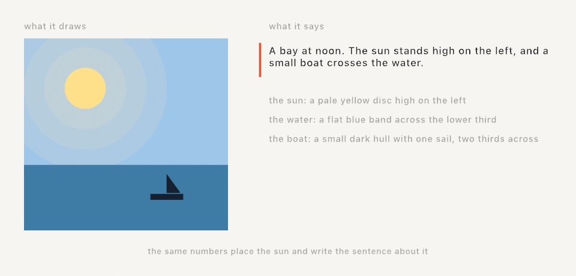

Everything so far has been about the picture. Somebody using a screen reader gets none of it. They arrive at your window, or your exported drawing, and find a rectangle with nothing to say for itself.

One line answers that:

```swift
describe("A bay at noon, with a small boat crossing the water.")
```

That sentence becomes the canvas's accessible name. Turn on VoiceOver with ⌘F5 and the window reads it out.

A piece with things in it can name them:

```swift
describe("the sun", as: "a pale yellow disc high on the left", in: sunBox)
describe("the boat", as: "a small dark hull with one sail", in: hullBox)
```

Each named part becomes something a screen reader can move to. The `in:` region is optional, and worth giving: with one, a part can be found by position rather than only in order.

Now the habit that makes this work. **Write the words from the same numbers that draw the picture.** The figure above is one sketch. The sun's position places the disc *and* writes "high on the left". A description written that way cannot drift out of date, because there is nothing to keep in step.

```swift
let p = Vector2(x, y)
drawCircle(center: p, radius: r)
describe("the sun", as: "a yellow disc \(p.y < height / 2 ? "high" : "low")")
```

Call `describe` every frame. Naming a part again replaces what you said, so the list never grows. Empty text takes a part out when it leaves the picture. Naming it again puts it back in the same place, so the reading order stays put.

Keep the parts few. Describe what is there rather than how it is made. Say "a red circle drifting left", not "a `drawCircle` driven by `sin(time)`". Texture is not a part: the glow around that sun is worth drawing and not worth naming.

The words travel with the work. An exported SVG carries them as `<title>` and `<desc>`, which is where a browser and a screen reader look. A PDF carries the summary as its document title. PNG, GIF and video have nowhere standard to put it, so they carry nothing.

One thing Ollin will not do is write the description for you. It could list your shapes, and a list of shapes is not a description of what they mean. Only you know which circle is the sun.

See [Accessibility](../Docs/Helpers/Accessibility.md) for the rest. `Examples/Basic/Describing` is a day passing over that bay, saying what it shows as it goes.

## Live feeds: into other apps

Some pieces shouldn't become files at all. They should stay alive and go *into* something. **Syphon** is the macOS standard for handing GPU frames between running apps, and one line makes a sketch a source every VJ tool can see:

```swift
import OllinSyphon

override func setup() {
    publishSyphon(name: "Ollin")     // every frame is now a Syphon source
}
```

Resolume, MadMapper, VDMX, and other creative-coding frameworks all read it live, pixel-identical to your window, with nothing touching disk. It works the other way too. `SyphonClient` subscribes to another app's feed and hands you each frame as an `Image`. Draw it, warp it, or feed it to Chapter 21's trackers. Pair it with Chapter 20 and the rig conversation goes both directions at once: visuals over Syphon, control over OSC or MIDI. The `Integration/SyphonLoopback` example runs both ends in one sketch, a video-feedback tunnel that watches itself. You can see the plumbing with no second app installed.

### The sketch as a webcam

Syphon is app-to-app, which means both ends have to have agreed to speak it. That covers the VJ world and misses everything else, including the one destination people ask about most: the browser. A web page asks the operating system for a *camera*, and no amount of Syphon will make it see one.

So the other publishing route makes the sketch an actual camera:

```swift
import Ollin
import OllinCamera

override func setup() {
    publishVirtualCamera()      // every frame now feeds a system-wide camera
}
```

After that, "Ollin Camera" is in the camera menu of every app on the machine. Zoom, Meet, QuickTime, OBS, Photo Booth, and any web page that asks for a camera can all take a sketch as their input. Your next video call can open on a reaction-diffusion field.

There's a one-time setup, and it's worth knowing why. A camera device is a piece of the operating system, not something a sketch can conjure. The device itself is a macOS **system extension**, installed by the Ollin Camera app in this repository. Launch it from `/Applications` and approve the extension in *System Settings ▸ General ▸ Login Items & Extensions ▸ Camera Extensions*. From then on the device exists whether or not any sketch is running. When nothing is publishing it shows a "no signal" test card. That is a friendlier thing for a video call to find than a black rectangle. If you publish without having installed it, nothing breaks: the sketch keeps drawing, and `isAvailable` and `unavailableReason` tell you what's missing.

Two facts about the frame will save you a confused minute:

- **The camera frame is a fixed 1280×720.** Your canvas is scaled to fit and centered. A square canvas therefore arrives with black bars down both sides. If a piece is destined for a call, `canvasSize = .size(1280, 720)` fills the frame exactly.
- **The camera runs at 30 fps.** A sketch running faster publishes every other frame. A slower one simply updates the camera at its own pace.

And when the picture looks wrong, suspect the *viewer* first. Photo Booth mirrors every camera preview like a selfie mirror. Text in your sketch reads backwards there, exactly as it would on the built-in camera. It also crops, because its preview pane isn't 16:9. Conferencing apps usually mirror your self-view while sending the unmirrored picture to everyone else. QuickTime's File ▸ New Movie Recording shows the frame as published, uncropped and unmirrored. It's the fastest way to see what other apps are really receiving.

## Light instead of pixels

A lighting rig is a display with very few, very bright pixels, and a sketch can render for it too. Stage lighting speaks **DMX**, the protocol that has told dimmers, LED pars, and moving heads what to do since 1986. It travels over ordinary Ethernet in two dialects, **Art-Net** and **sACN**. The model is small. A *universe* is 512 channels of one byte each. A *fixture* listens at an address and reads a few consecutive channels. What each channel means is printed in the fixture's manual, whether that is red, green, blue, a dimmer, or a pan motor. You fill 512 bytes, you send them, the room changes.

```swift
import OllinDMX

let dmx = DMXSender()                           // sACN multicast: zero config
let par = DMXFixture.rgb(at: 1)                 // an RGB par on channels 1-3

override func draw() {
    var rig = DMXUniverse()
    rig.set(par, color: Color(hue: fract(time * 0.1), saturation: 1, brightness: 1))
    dmx.send(rig)                               // universe 1, every frame
}
```

`DMXSender()` with no address multicasts sACN, which any listening node on the network picks up with no addressing at all. `DMXSender(artNet: "192.168.1.60")` unicasts Art-Net to a node that wants it. Either way you send every frame, like a second `draw()` aimed at the room. The sender handles the wire's own etiquette. It sends changed data only, caps near DMX's own refresh rate, and keeps alive while nothing moves. A 60 fps sketch therefore makes a perfectly polite lighting console. The fixture sugar keeps the addressing in one place. Patch a `DMXFixture` per lamp with the roles its manual lists, and chain them with `nextAddress`. Then `rig.set(par, color:)` lands on whatever channels the layout names.

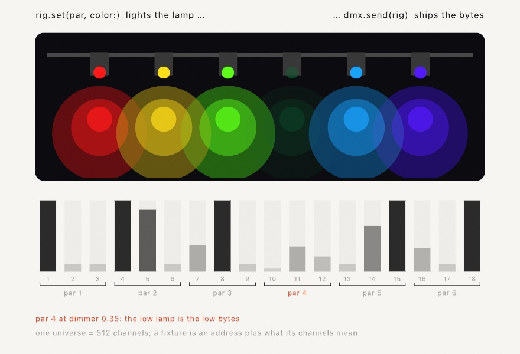

It works the other way around too. A `DMXReceiver` turns the sketch into a fixture. A real console fades channel 1, and `draw()` reads it as `dmx.level(1)`. Or `dmx.bind(channel: 1, to: $radius)` puts the fader on the same knob the inspector slider moves. That is exactly like Chapter 20's MIDI and OSC bindings. The `Integration/DMXLoopback` example runs both ends on `127.0.0.1`. A sender chases colors across a drawn rig, and the rig is lit from what the receiver reads back. The whole path runs with no console and no hardware. When you do reach for real lights, two practical notes matter. macOS asks once for Local Network permission, attributed to the terminal you launched from. A free sACN monitor app will show you every universe on the wire. Use it while you find your fixture's address.

The rig's big sibling is the LED wall, and for that you stop filling channels by hand. An `LEDMap` lays the fixtures over the canvas itself. A strip is a run of sample points along a line or a curve, and a matrix is a grid of them. Every frame the map reads the rendered pixels under each LED and ships them through a `DMXSender`. That read happens on the GPU, over a few hundred points, never as a whole-frame readback. The wall is just the canvas, somewhere else.

```swift
let dmx = DMXSender()                     // or unicast to your pixel controller
let leds = LEDMap(sender: dmx)

override func setup() {
    leds.addStrip(from: Vector2(100, 540), to: Vector2(980, 540), leds: 144)
    leds.addMatrix(in: Rectangle(x: 390, y: 150, width: 300, height: 300),
                   columns: 16, rows: 16, universe: 2)
    extend(leds)                          // from here on it feeds itself
}
```

After `extend(leds)` you draw as if the wall didn't exist. Whatever lands under the mapped points is what the wall shows. Each LED averages the little patch of canvas it stands for, so a strip over fine detail glows steadily instead of flickering. On the wire the map packs whole LEDs into universes, 170 RGB pixels per universe, with longer runs continuing on the next number up. That is exactly the layout pixel controllers expect. Patch yours to the numbers `leds.universes` reports and you're done. The `Integration/LEDMapping` example runs it all on loopback, the drawn strip and panel lit from what a receiver reads back off the wire.


## Adding behavior without touching the sketch

One more piece is worth knowing about once you have several sketches. It answers a question that comes up as soon as you want the same extra behavior in all of them. How do you add something to a sketch's life cycle without editing the sketch?

An **extension** is a small object that gets told when things happen. You register it once. From then on it hears about setup, and about each frame before and after the drawing. If it asks, it also hears about the finished rendered image.

```swift
extend(MyWatermark())
```

The reason this exists rather than you just adding lines to `draw()` is that some behavior isn't about the artwork. None of these belong in the piece, and all of them want to apply to every piece:

- a frame recorder,
- an on-screen readout of the frame rate,
- a guide overlay you toggle while composing,
- a logger that notes which seed produced which render.

Ollin's own frame-rate statistics work exactly this way, as an extension registered by the host rather than anything in your sketch.

One detail is worth flagging. Hearing about the rendered image is opt-in, through a property the extension sets. Reading pixels back from the GPU costs real time. An extension that only watches timing pays nothing. The [extension seam](../Docs/Core/Sketch.md#extensions) has the hook list.

## Giving it to somebody else

Say you have written a drawing call you keep copying between pieces. How does somebody else get it?

An Ollin extension is a Swift package that depends on Ollin. That is the whole format. Somebody adds your package, writes one `import`, and your call sits beside `drawCircle`.

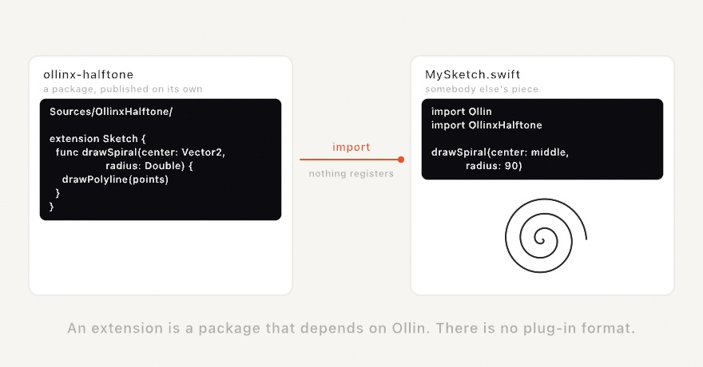

It is straightforward because `drawCircle` is a method on `Sketch`. Yours is too:

```swift
extension Sketch {
    public func drawSpiral(center: Vector2, radius: Double) {
        drawPolyline(points)
    }
}
```

The rest follows from `drawPolyline`. The current `stroke` applies. The transform stack applies. Clipping, `symmetry`, and SVG export apply. You write none of it.

The command that made your first folder makes this one too:

```sh
ollin new Halftone --kind extension
```

The package is named the shared way. The folder is `ollinx-halftone` and the module is `OllinxHalftone`. The prefix follows openFrameworks' addon naming and OPENRNDR's own. No enforcement exists, but with no catalog to look in, a shared prefix is how packages get found.

Inside is a worked starter, tests that check something real, and a list of what to fix before publishing. One item on that list catches everybody. The generated manifest points at the copy of Ollin on *your* machine.

Pick what the starter is built on with `--seam`. A drawing call, as above. A GPU effect, written as a shader and wrapped so `layer.filtered(.vignette())` reads like a built-in. A source of frames, which any tracker from Chapter 21 then accepts. Or a lifecycle extension, which is the section you have just read, packaged. See [writing an extension](../Docs/Tools/Extensions.md) for all four, and for the parts of Ollin that are deliberately closed.

## When it gets slow

A set is a bad time to discover that a piece runs at 24 frames a second. Sooner or later one will, and the useful question is not "is it slow" but "which half is slow".

Press **⌘/** for the inspector. Under the frame rate sit two bars and three counts.

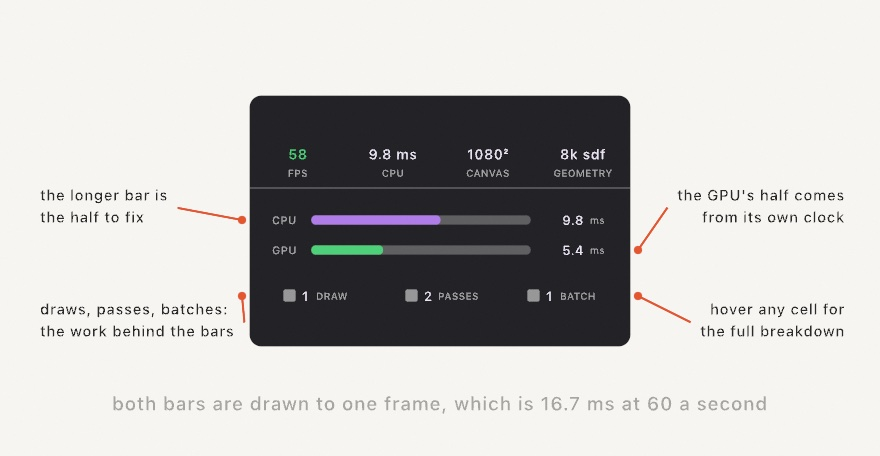

The **CPU** bar is your `draw()` plus the encoding that turns it into GPU commands. Tessellation lives there: every fill and every stroke is cut into triangles before the GPU sees it. The **GPU** bar is what the card spent on the frame, taken from its own clock.

Both bars are drawn to the same scale, which is the length of one frame. At 60 frames a second that is 16.7 ms. So the longer bar is your problem, and two short bars mean you have room.

They are not stacked into one bar on purpose. The CPU is already building the next frame while the GPU draws this one, so the two overlap in time rather than adding up.

The counts underneath say what the frame asked for. **Draws** is the draw calls. **Passes** is the render passes, which is two for a plain sketch and one more for every layer and filter. **Batches** is the runs the drawer recorded, and a run breaks whenever the blend mode, texture, or clip changes.

That last one is the surprise. Ten thousand circles in a row cost one draw call. Ten circles that each change the blend mode cost ten. If the batch count is close to the shape count, group the shapes that share a state.

The rest of the reading is short:

- **CPU bar long?** You are making geometry. Hover Draws for the vertex count. Static geometry belongs in a [retained batch](../Docs/Drawing/Batches.md), recorded once and replayed from the card.
- **GPU bar long?** You are filling pixels. Look at the pass count, and give soft layers a smaller `renderTarget(scale:)`.
- **Both short and still slow?** Something outside the drawing is holding the frame, like a file read in the middle of `draw()`.

When you need to know which pass, hand the frame to Xcode:

```sh
MTL_CAPTURE_ENABLED=1 ollin MySketch.swift
```

Then **View ▸ Capture GPU Frame (⌘⇧G)**, or `captureGPUFrame()` from your own code. Ollin writes a `.gputrace` file that opens in Xcode's GPU debugger, and prints the frame's passes in order on the way past. Often that printed list is the whole answer.

## Leaving it running

Some pieces are not files. They go on a wall, or in a shop window, and stay there for a week with nobody watching them.

That is a different job from a sketch at your desk, and different things end it. The screen saver comes on at midnight. The display sleeps. Somebody unplugs the monitor to borrow it. None of that is your drawing's fault, and all of it stops the show.

One line asks Ollin to hold it off:

```swift
override var installation: Installation { .on }
```

Now the window takes the whole screen with no title bar, the pointer disappears, and the display stays lit with the screen saver held off. Command-Q still quits, whatever the piece covers.

You do not have to edit a sketch to try this, or to get out of it:

```sh
swift run --package-path Examples Example-Motion-Orbits --installation                 # any sketch, up on the wall
swift run --package-path Examples Example-Installation-Unattended --no-installation    # back to a window to work in
```

A single file goes up the same way. It has no target of its own, and the host that usually runs it keeps the window. The flag hands the sketch one:

```sh
ollin piece.swift --installation
```

That host does not reload on save. On a wall that is what you want: the piece runs the code you started it with. Plain `ollin piece.swift` is still where you work on it.

### What actually breaks is the clock

The screen saver is the obvious enemy. The clock is the real one, and it goes wrong twice.

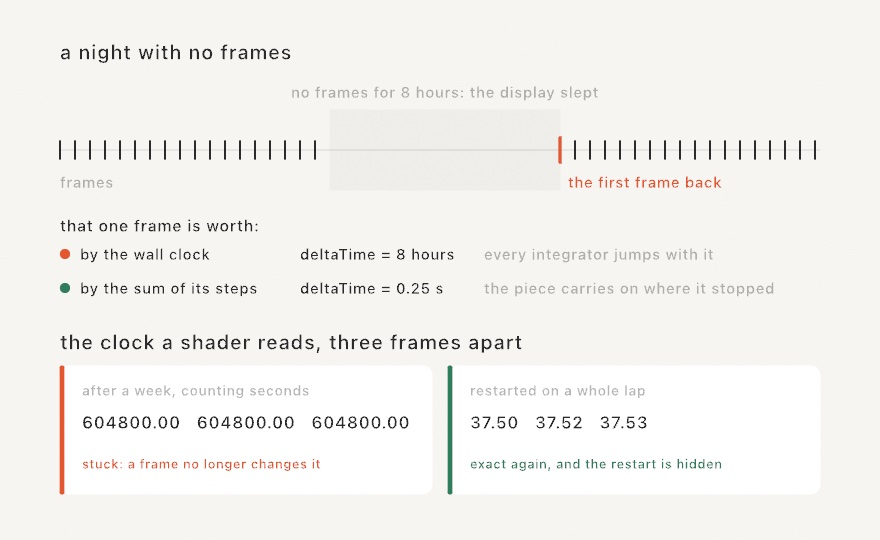

First, a gap. When the display sleeps, no frames are drawn, and the first frame back happened eight hours after the last one. Read from the wall clock, that is a `deltaTime` of eight hours. Hand that to anything that moves by `speed * deltaTime` and it leaves the canvas forever, in one step.

So the sketch clock is not the wall clock. It is the sum of its own frame steps, and each step is capped at a quarter of a second. A gap becomes a pause, and the piece carries on where it stopped. You get this whether or not you declared an installation, because a laptop lid closes in the middle of an afternoon too.

Second, precision. Your `time` is a 64-bit number and stays exact for centuries. The copy your shaders read is a 32-bit one, and it cannot count seconds for a week. After a day the steps go uneven. After a week, adding one frame to it changes nothing at all, and every motion written inside a shader stops dead.

The fix is to give the shaders a clock that starts over. It is only free if the restart lands where the piece repeats, so it is tied to the loop you declare:

```swift
override var installation: Installation { .on }
override var loopDuration: Double? { 120 }     // two minutes a lap
```

Nothing moves at the restart, because the piece is back at the start of a lap anyway. A sketch with no declared loop keeps counting, since there is no free moment to jump at. Say `Installation(clock: .restarting(every: 600))` if you know one, or leave it alone.

### Picking up where it left off

Some pieces are the same every launch, because everything they draw comes from the clock and the seed. Those need nothing here.

Others grow. A wall that fills in one tile at a time, a reef that adds a polyp an hour, a drawing that accumulates. Three days in, that piece is not something you can rebuild from its seed. Getting back there means running the three days again.

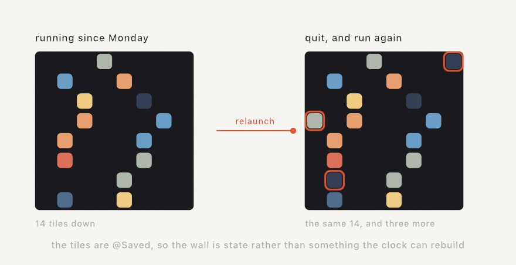

So write the state down. Two lines: how often, and what.

```swift
override var installation: Installation { Installation(checkpoint: .every(seconds: 60)) }

@Saved var tiles: [Tile] = []
```

Every `@Saved` property goes into the file on that cadence, along with the seed, the clock, and every `@Param` value. A relaunch puts them all back before your first frame draws. The piece carries on.

Anything `Codable` can be saved, which includes your own structs once you mark them `Codable`. What cannot is anything living on the GPU: an accumulated canvas, a feedback layer, a simulation field. Those are textures the framework owns, and the checkpoint does not reach them.

You will edit the sketch while an old file is still sitting there, so every mismatch is made to cost only itself. Rename a property and the old value finds nothing. Change its type and it fails alone, named in the log, while everything else still restores. Damage the file and it is ignored. A piece on a wall that will not start is worse than one that started over.

`--fresh` ignores the saved state for one run without deleting it. That is the one to reach for when a piece comes back in a state you do not want.

### When it falls over

A piece on a wall crashes at three in the morning and nobody is there. The wall stays dark until somebody notices, which is usually the next day.

```swift
override var installation: Installation {
    Installation(checkpoint: .every(seconds: 60), restarts: .onFailure)
}
```

The process you start becomes a small watch with no window of its own, and your piece runs inside it as a child. When a run ends badly, the watch starts another one. Pair it with a checkpoint, or the piece comes back at the beginning every time.

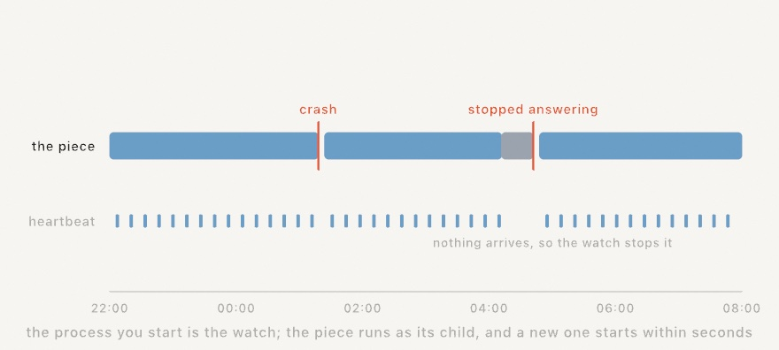

Two things end a run badly. A crash is the obvious one. The other is a frame that never finishes. The process stays perfectly healthy and the picture freezes, which is what a viewer actually sees. So the piece writes a heartbeat every couple of seconds from the thread that draws. A main thread stuck in a frame stops writing it, and that silence is the only sign there is.

Quitting is not falling over. Command-Q ends the whole thing, watch included.

A piece that fails one second after it starts will not be fixed by starting it again. So each try waits longer than the last. After five short runs the watch gives up and says so in the log. One run of any real length clears that record. A slow `setup()` is not a stall either: a piece gets at least two minutes to draw its first frame, whatever limit you set.

### Gallery hours

A piece on a wall is in a building, and buildings have hours.

```swift
Installation(schedule: .open(from: 10, to: 18))
```

Outside them the screen goes dark and the display is allowed to sleep. The frames stop with it, and the clock stops with them. In the morning the piece carries on from where it stopped, not from where the day got to.

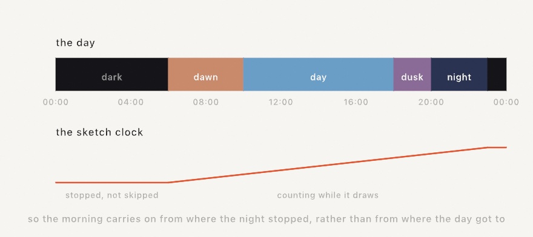

The other half is a piece that changes through the day. Name the parts of the day, and read the one you are in:

```swift
override var installation: Installation {
    Installation(schedule: [.from(6, "dawn"), .from(10, "day"),
                            .from(18, "dusk"), .from(20, "night")])
}

override func draw() {
    background(scheduledPeriod == "night" ? Color(white: 0.04) : .white)
}
```

Each part runs until the next one starts. The last one runs round to the first, which is how a night crosses midnight in one piece. `scheduledProgress` says how far through the current part you are, from 0 to 1, for a piece that slides rather than switches. The two halves are one list, so mix them: `.dark(from: 20)` is a part with nothing on screen.

Both readings work at your desk as well as on a wall. You can build a piece that changes at dusk without waiting for dusk.

### Fitting the wall

A projector is almost never square to what it is aimed at. It hangs off a beam, or sits on a shelf to one side, and your rectangle lands as a trapezoid.

So press **Command-K** on the running piece. Four handles appear on the corners. Drag each one onto the wall, and press Command-K again.


The numbers are kept under the display rather than under the sketch. The projector is out of true by the same amount whatever is playing. Line it up once and everything you show there opens square.

A wall longer than one projector takes two machines, each carrying a part of the canvas:

```swift
// The machine on the left.
Installation(projection: .init(shows: Rectangle(x: 0, y: 0, width: 0.6, height: 1),
                               blend: Insets(right: 0.2)))
```

The one on the right declares the mirror of that: `shows` starting at 0.4, and the same 0.2 fading in from its left. They are told the same number about the same band. Their two fades add up to one coat, so no bright bar runs down the join.

None of this reaches an export. A file has no wall to fit.

### Several displays, one machine

Two projectors do not have to mean two machines. A Mac with two outputs can carry both of them itself:

```swift
override var installation: Installation {
    Installation(displays: .spanning)
}
```

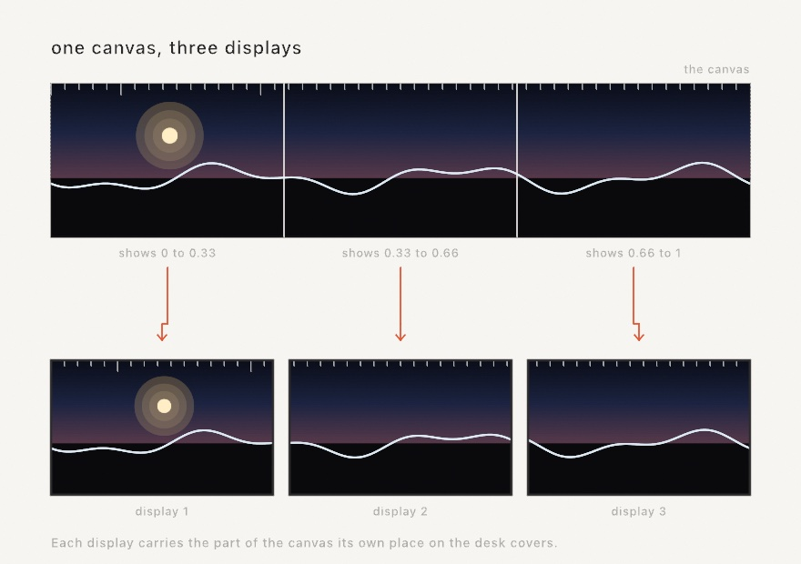

That spreads one canvas over every display the machine has, in the arrangement they are actually in. Two monitors side by side carry a half each. One above the other carries a band each. You declare no numbers at all, because the desk already says them.

The piece knows none of this. It draws one canvas, and the wall decides which part of that canvas each display carries. That is the same split as the two-machine wall above, with both parts on one machine.

For a wall that is not a plain row of monitors, declare the parts yourself. Two projectors overlapping in the middle is the usual case:

```swift
Installation(displays: .parts([
    .init(shows: Rectangle(x: 0, y: 0, width: 0.6, height: 1), blend: Insets(right: 0.2)),
    .init(shows: Rectangle(x: 0.4, y: 0, width: 0.6, height: 1), blend: Insets(left: 0.2)),
]))
```

Command-K raises the handles on every display at once, since a wall is lined up as one thing. The keys that move a corner go to the display you last clicked.

You will usually meet the wall for the first time in the room it is going up in. So look at it before then:

```sh
swift run --package-path Examples Example-Installation-ManyDisplays --rehearse 3
```

That opens one window per part on the desk you are at, side by side, each carrying its own part. It shows you the layout rather than the light. Two beams sharing a band add up to one coat; two windows sharing one would only hide each other.

The piece is drawn once a frame however many displays it goes on. What grows is the size it is drawn at, since each display wants its own part at its own resolution.

### Several windows, one world

A piece does not have to be one window. Run the same sketch three times and you have three windows on one desk, and they can look into one world rather than three.

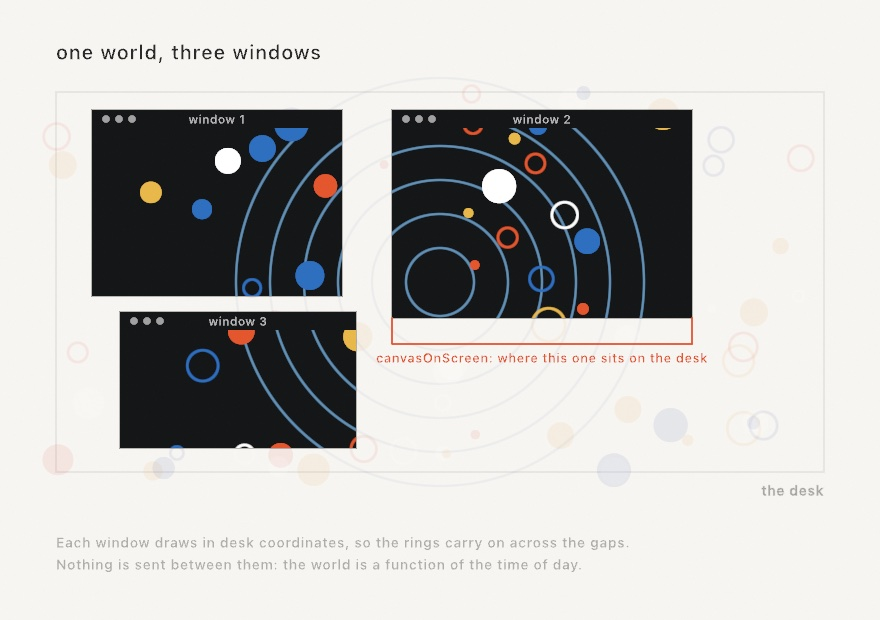

What each window needs is to know where it is. `canvasOnScreen` says where this canvas sits on the desk. It is measured the way the canvas is measured, so all three windows describe the same desk in the same numbers:

```swift
guard let mine = canvasOnScreen else { return }
let onCanvas = worldPoint - Vector2(mine.x, mine.y)      // the desk, seen from here
```

Then draw in desk coordinates and move each point into this canvas at the last moment. Drag a window and the next frame reads the new place, so the world stays where it is while the window slides over it.

The other half is that nothing here talks to anything. The windows are separate programs, and separate programs are hard to keep in step. So make the whole world a function of the time of day, which they all read the same, and they cannot disagree. That is worth reaching for before anything with a network in it. The `Installation/ManyWindows` example is the whole thing, in about eighty lines.

### The log

An unattended run prints a line when it starts, when it resumes, and when the machine wakes or the displays change. The hours and the watch print their own. Send it somewhere you can read on Monday:

```sh
swift run --package-path Examples Example-Installation-Unattended >> ~/piece.log 2>&1
```

```
Ollin installation [2026-08-15 08:41:45]: running unattended; Command-Q quits
Ollin installation [2026-08-15 08:41:45]: resumed the run saved at 2026-08-14 23:07:12 (frame 4098, 68s in)
Ollin installation [2026-08-15 18:00:04]: dark until 10:00
Ollin installation [2026-08-16 03:12:08]: the screens woke
```

## Performing the code itself

The last output is a stage. `swift run OllinLiveCoding` opens the performance host, where the sketch fills the window and the code rides over it as translucent text, part of the show:

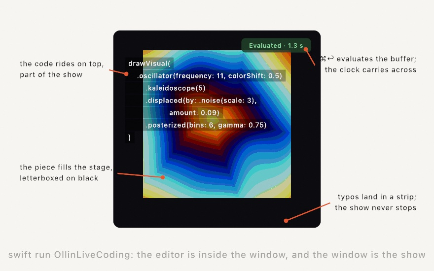

The loop is different from the live-reload host you've used since Chapter 1. There is no file watching and no separate editor, so you type in the window and press **⌘↩** to evaluate. The buffer compiles in the background while the running sketch keeps drawing. On success the new sketch swaps in with the clock carried across, so a phase-driven motion never jumps mid-set. Tuned `@Param` knobs (including ones bound over MIDI or OSC) carry across too. A typo can't stop the show. The last good sketch keeps playing, the errors land in a strip along the bottom, and you fix and evaluate again. When the code should get out of the way, **⌃⇧H** hides it and the visuals keep the whole stage. Fullscreen for the projector is **⌃⌘F**. For a real set, `Scripts/OllinLiveCoding` builds the host in release mode so the framework renders at full speed.

Evaluation never writes your file (⌘S does), so you can riff as recklessly as the room deserves and keep only what worked.

## Keeping the take

Every exporter in this chapter re-renders. That is their gift: a fixed clock, the same file every run, nothing left to chance. A performance is the opposite kind of thing. The knob you rode, the evaluation that landed at the right moment, the note that answered the room: none of it happens twice. An export remembers the sketch; a recording remembers the night.

So the host records. Press **⌘⇧R** and a red chip starts counting on the stage. Play the set. Press **⌘⇧R** again and the take is a movie in `~/Movies/Ollin/`, picture and sound together, named after the sketch and the moment. The recording rides through evaluations, so a set that changed its code twelve times is still one continuous movie.

A sketch can also record itself, anywhere, with one pair of calls:

```swift
override func keyPressed() {
    guard key == "r" else { return }
    if isRecording {
        stopRecording()
    } else {
        startRecording()
    }
}
```

The sound needs no wiring. The recorder finds the instruments the sketch is holding, the same way the offline soundtrack does, and what they play lands in the file's audio track in sync. When the music comes from outside the sketch, record the room instead: `startRecording(audio: .microphone)` asks for the microphone and listens to the air.

For a run filmed from its very first frame, the watcher host takes a flag:

```sh
swift run OllinLive MySketches/Finale.swift --record
```

Stopping is generous on purpose. Quitting the host finishes the movie first, and so does Control-C in the terminal, because a take that ends badly should still be a take. The working example is [`Examples/Export/Record`](../Examples/Export/Record/Sketch.swift), an instrument you drag to play; everything else lives in [Recording](../Docs/Output/Recording.md).

## Putting it together: a set in five evaluations

What you'll build here is a short performed set. Open the host with a fresh buffer. Build the chapter's finale the way an audience would watch it grow, one evaluation at a time. Chapter 15's `Visual` chains are the natural material for this kind of set, since every step is one added line:

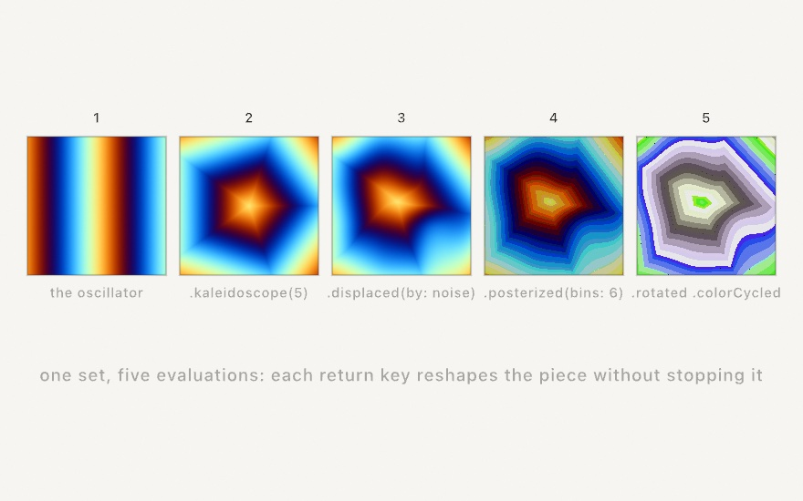

1. Start with breath. Type `drawVisual(.oscillator(frequency: 11, speed: 0.6, colorShift: 0.5))`, press ⌘↩, and drifting bands fill the stage.
2. Fold space by adding `.kaleidoscope(5)`, which turns the bands into a five-pointed mandala, still breathing.
3. Melt the fold with `.displaced(by: .noise(scale: 3, speed: 0.25), amount: 0.09)`.
4. Make it a print with `.posterized(bins: 6, gamma: 0.75)`, and the melt hardens into contour bands like a screen print.
5. Set it flying with `.rotated(time * 0.03)` and `.colorCycled(time * 0.04)`, a slow spin through the whole color wheel.

The finished buffer is the whole piece, and it's small enough to retype from memory, which is rather the point. The committed figure is [`Finale.swift`](Figures/22-SharingAndPerforming/Finale.swift):

```swift
import Ollin

final class Finale: Sketch {
    override func draw() {
        drawVisual(
            .oscillator(frequency: 11, speed: 0.6, colorShift: 0.5)
                .kaleidoscope(5)
                .displaced(by: .noise(scale: 3, speed: 0.25), amount: 0.09)
                .posterized(bins: 6, gamma: 0.75)
                .rotated(time * 0.03)
                .colorCycled(time * 0.04)
        )
    }
}
```


Then close the loop this chapter opened. Save the buffer with ⌘S. Render a shareable file with `swift run OllinLive MySketches/Finale.swift --export-video finale.mp4 --seconds 12`, or press ⌘⇧R before the first evaluation and keep the performed version instead, evaluations and all. And if a projector or a call is nearby, run `publishSyphon()` or `publishVirtualCamera()` while you perform. The same small sketch just walked out of every door this chapter opened.

Then make it yours:

- Play the set differently by reordering the moves, or swap step 2's fold for `.repeated(x: 3, y: 3)` and the mandala becomes wallpaper.
- Wire Chapter 20 in: `@Param` the oscillator frequency, bind it to a MIDI knob, and the set gets a second instrument.
- Feed it eyes: `.displaced(by: .layer(feed), amount: 0.1)` over a layer you draw the webcam into, and the audience melts the piece.
- Perform an old friend, since any finished piece from this guide runs in the host as-is. Try evaluating changes into Chapter 16's reaction-diffusion while it grows.

## Where this comes from

Live coding as a performance practice was organized by TOPLAP (founded 2004), whose manifesto demanded "show us your screens". The code-over-the-visuals layout of this host is that idea. Its most direct model is Olivia Jack's browser instrument Hydra, which made the pattern feel effortless. Alex McLean and the TidalCycles community built the musical wing of the same practice. Syphon is Tom Butterworth and Anton Marini's gift to the Mac's visual ecosystem, and the vendored framework carries their names. The pen-plotter revival that SVG export serves grew around the AxiDraw and the #plottertwitter community. They are heirs of the 1960s computer-art plotters this guide's recreations visit. Full credits are in the project's [attribution notes](../ATTRIBUTION.md).

## Go deeper

- [Export](../Docs/Output/Export.md): every flag, codec advice, GIF timing, SVG mapping, hatching.
- [Recording](../Docs/Output/Recording.md): recording a live run in real time, what the sound modes hear, and how a take survives an evaluation.
- [Print separations](../Docs/Output/PrintSeparations.md): the spot-ink model, the ink catalog, screening angles, and the overprint preview.
- [Fabrication](../Docs/Output/Fabrication.md): writing a mesh as STL, OBJ, or 3MF, real-world sizing, and what makes a surface printable.
- [Syphon](../Docs/Integration/Syphon.md): publishing, receiving, discovery, and the loopback.
- [Virtual camera](../Docs/Integration/VirtualCamera.md): the one-time install, publishing, the test card.
- [DMX](../Docs/Integration/DMX.md): universes and fixtures, Art-Net and sACN, the send cadence, and the console-drives-the-sketch direction.
- [Installation](../Docs/Output/Installation.md): leaving a piece running, what each part of the declaration turns on, the two clock defences, checkpoint and restore, and the log.
- [Profiling](../Docs/Tools/Profiling.md): reading the cost row, what to do about each answer, and capturing a frame for Xcode.
- [Live coding](../Docs/Tools/LiveCoding.md): the evaluate loop, errors, recovery, and the keyboard reference.
- [Writing an extension](../Docs/Tools/Extensions.md): the four seams, the naming convention, the publishing checklist, and what is deliberately closed.
- Worked examples: [`Examples/Installation/Unattended`](../Examples/Installation/Unattended/Sketch.swift), [`Examples/Installation/Resuming`](../Examples/Installation/Resuming/Sketch.swift), [`Examples/Export/VectorExport`](../Examples/Export/VectorExport/Sketch.swift), [`Examples/Export/Hatching`](../Examples/Export/Hatching/Sketch.swift), [`Examples/Integration/SyphonLoopback`](../Examples/Integration/SyphonLoopback/Sketch.swift), [`Examples/Integration/SyphonViewer`](../Examples/Integration/SyphonViewer/Sketch.swift), [`Examples/Integration/DMXLoopback`](../Examples/Integration/DMXLoopback/Sketch.swift), and [`Examples/Integration/VirtualCamera`](../Examples/Integration/VirtualCamera/Sketch.swift).

---

[Contents](README.md#contents) · Previous: [Chapter 21, Seeing](21-Seeing.md) · Next: [Appendix A, Just enough Swift](A-JustEnoughSwift.md)
