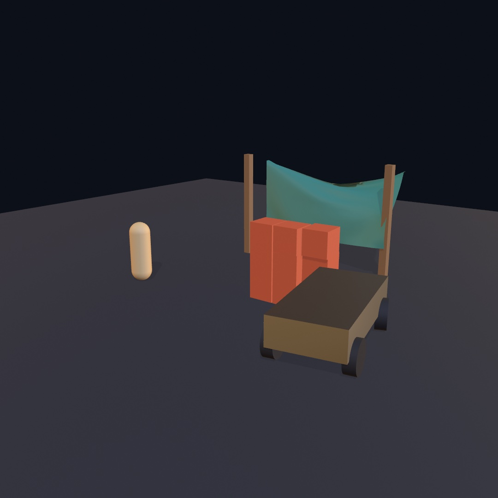
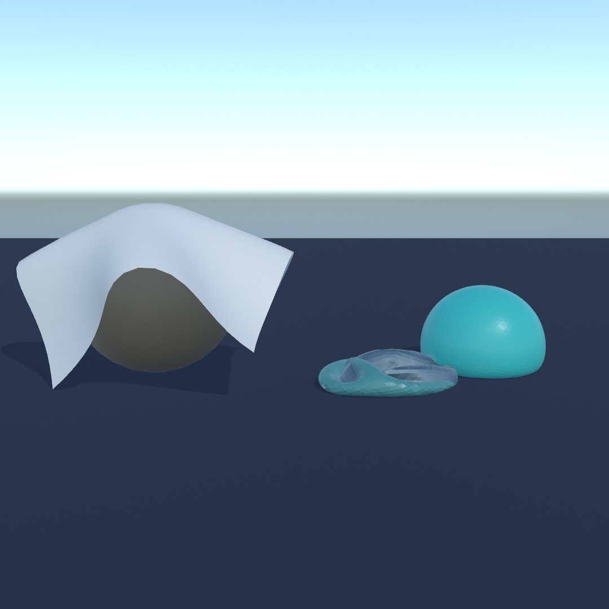
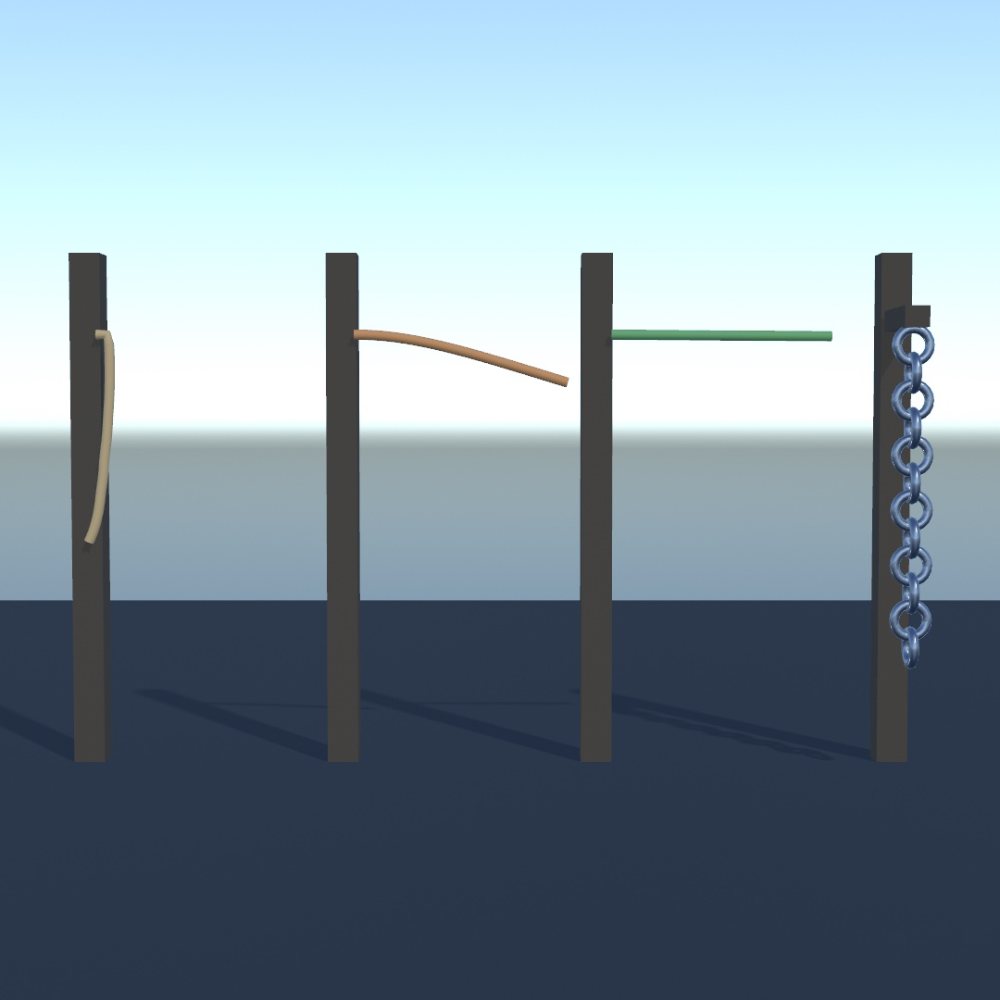

#### <sup>[Ollin](../README.md) → [Guide](README.md) → Chapter 23</sup>

---

# 23. Characters, vehicles, and cloth



A rigid body is a good model for a crate and a poor one for almost everything you care about. People do not tumble; they stay upright and walk. Wheels do not slide; they grip, spring, and steer. Cloth has no single position at all, because every point of it moves separately.

So the solver keeps three more kinds of thing, and each is held up differently. The yard above has one of each: a figure standing on its own two feet, a truck whose body rides on four springs, and a banner that is nothing but a mesh with its top corners pinned. By the end of the chapter you'll have built it, and you'll have met the ragdolls, ropes, and water that fill in the rest of the family.

## Someone to be in there

Everything in the last chapter you watch. A **character** is something you *are*. It's a figure that walks where you steer it, climbs what it can climb, and stops at what it can't.

You might reach for a body with a capsule collider and start pushing it around with forces. Don't. A body is at the mercy of the simulation, which is the whole point of a body and exactly wrong here. Shove it and it tips over. Land it awkwardly and it rolls away, and you spend the evening fighting torques to keep a person upright. A character is a different thing on purpose. It has a shape and it collides, but nothing tumbles it and nothing knocks it down. You hand it a direction and it goes.

```swift
walker = world.addCharacter(radius: 0.3, height: 1.8, at: Vector3(0, 2, 0))
```

Steering it is a `draw()` poll, like the mouse:

```swift
var east = 0.0, south = 0.0
if isKeyDown(.leftArrow)  { east -= 1 }
if isKeyDown(.rightArrow) { east += 1 }
if isKeyDown(.upArrow)    { south -= 1 }
if isKeyDown(.downArrow)  { south += 1 }

let heading = Vector3(east, 0, south)
walker.move(heading.length > 0 ? heading.normalized * 3 : .zero)
if isKeyDown(" ") { walker.jump() }

world.step(dt: deltaTime)
withCharacter(walker) { drawCapsule(radius: 0.3, height: 1.2) }
```

That's a walkable scene, eight lines and a `step`. The same `world.step` moves the character along with the crates, so there's no second update to forget. `move` sets the speed it's *trying* to walk at and keeps it until you say otherwise. Falling and jumping stay the world's business, which is why you only give it a horizontal direction. `jump` is granted only if it's on the ground when the step comes round, so holding the key hops rather than flies.


`withCharacter` is `withBody`'s twin, and it puts the origin at the character's **feet**. That's the detail that makes drawing one pleasant. Model your figure standing on the floor at the origin, and it stands on the floor in the world.

Three numbers decide what the scenery does to it, and each is worth meeting by breaking it:

```swift
walker.stepHeight = 0.4        // the tallest step it walks up: a kerb, a stair
walker.maxSlope = 50 * .pi / 180  // the steepest hill it can climb
walker.pushStrength = 100      // how hard it can shove a crate, in newtons
```

Set `stepHeight` to zero and the stairs in the figure become a wall it stands against forever. Wind `maxSlope` down and a hill it strolled up last run holds it halfway. Set `pushStrength` to zero and those two crates stop being scenery it walks through and start being furniture it walks around. None of that is scripted anywhere; it's the same walk meeting different limits.

Two velocities are worth telling apart. `walker.velocity` is what it's *trying* to do, and `walker.actualVelocity` is what the world let it do. Walk into a wall and the first still reads a brisk pace while the second reads nothing. Drive a walk cycle from the second and the legs stop when the figure stops. That's the difference between a character and a puppet skating on the spot:

```swift
let pace = Vector2(walker.actualVelocity.x, walker.actualVelocity.z).length
stride += pace * deltaTime * 3.4
```

One last thing, and it's the one that connects this section to the last. A character is swept through the world by hand rather than simulated, so strictly it isn't in the scene. It carries a stand-in that is: `walker.body`, an ordinary kinematic body riding inside the capsule. That's what lets everything else notice it, sensors included:

```swift
if lookout.isTouching(walker.body) { /* you're on the platform */ }
```

So the trigger you built for balls works for people, unchanged. The playable version, an eroded island with stairs up to a lookout that lights as you arrive, is the [`3D/Physics/Stroll`](../Examples/3D/Physics/Stroll/) example.

## Something to drive

A character walks. A **vehicle** is the other thing you operate: a body carried on sprung wheels, with an engine behind the pedal. Same idea as the character, one step further out. You don't push it and you don't steer it by force. You press things.

```swift
car = world.addVehicle(.box(width: 1.8, height: 0.7, depth: 4),
                       at: Vector3(0, 2, 0),
                       wheels: [
                           .wheel(at: Vector3( 0.9, -0.15,  1.3), steers: true),
                           .wheel(at: Vector3(-0.9, -0.15,  1.3), steers: true),
                           .wheel(at: Vector3( 0.9, -0.15, -1.3), driven: true, handBrake: true),
                           .wheel(at: Vector3(-0.9, -0.15, -1.3), driven: true, handBrake: true),
                       ])
```

Read that list once and you have the whole machine. Four wheels, bolted where you say, in the chassis's own coordinates. The front two turn. The back two are the ones the engine reaches, and the ones the hand brake grabs. Nothing else about a car needs saying, and the two flags you did say are the ones that decide how it feels.

Driving it is the same shape as walking:

```swift
car.throttle = isKeyDown(.upArrow) ? 1 : (isKeyDown(.downArrow) ? -1 : 0)
car.steering = (isKeyDown(.rightArrow) ? 1 : 0) - (isKeyDown(.leftArrow) ? 1 : 0)
car.handBrake = isKeyDown(" ") ? 1 : 0

world.step(dt: deltaTime)

withBody(car.body) { drawBox(width: 1.8, height: 0.7, depth: 4) }
for wheel in car.wheels {
    withWheel(wheel) { drawCylinder(radius: wheel.radius, height: wheel.width) }
}
```

`withWheel` is `withBody` for a wheel, and it knows where the suspension put it, how far it has rolled, and which way it is pointing. Draw a cylinder in that block and you get a tire, turned and spinning, without ever computing any of it.

Press the throttle and hold a full lock, and the thing you were about to type by hand happens on its own. The car leans, the inside front wheel goes light, the back tires start sliding, and it comes round. Pull the hand brake in the middle of it and only the back wheels lock, because they are the ones you gave a hand brake to. That's the figure below, one frame out of a scripted lap.


The glowing tire is one line. `wheel.slip` is how much that tire is sliding rather than rolling, and coloring by it turns a number into something you can feel.

```swift
fill(Color.mix(Color(hex: 0x232B36), Color(hex: 0xF2A93B),
               t: min(1, wheel.slip)))
```

The car drives along its chassis's **+z**, so model whatever you draw facing that way. Two settings are worth breaking things with. `suspensionFrequency` on each wheel is the spring, in hertz, where around 1.5 is a road car and at 3 you feel every stone. `topSpeed` is the gearing rather than a promise, the speed the machine tops out at on a flat straight. Wind it down and the car pulls harder off the line and runs out of legs sooner. Both can be changed while you drive, so put them on `@Param` sliders and feel the same corner three ways.

Two wheels work too. `balances: true` adds the controller that holds a motorcycle up and leans it into turns. The one thing it needs that a car doesn't is a raked front fork, `casterAngle` around 30°. Without the rake it flops over at the first correction. That is also true of real bicycles, and it is the nicest small piece of physics in this chapter.

The driveable version, a car over the same kind of eroded island the walker got, is the [`3D/Physics/Joyride`](../Examples/3D/Physics/Joyride/) example.

## Turning without steering

There is a third machine, and it is the same call again with `tracked: true`. The wheels stop being wheels and become road wheels, split into a left and a right band by which side of the hull you put them on. There is no list to keep in order and no pairs to declare. A wheel at positive x is on the left track, and that is the whole of it.

```swift
var wheels: [Wheel3D] = []
for side in [1.3, -1.3] {
    for i in 0 ..< 5 {
        wheels.append(.wheel(at: Vector3(side, -0.28, -1.8 + Double(i) * 0.9),
                             radius: 0.44, width: 0.6))
    }
}
let crawler = world.addVehicle(.box(width: 2, height: 0.9, depth: 5.2),
                               at: Vector3(0, 1.2, 0), wheels: wheels,
                               mass: 4200, topSpeed: 9, tracked: true)!
```

Throttle and brake mean exactly what they did. Steering is the interesting one, because a track has nothing to turn. Instead the number runs the inside band slower: at half lock it stops, and the machine turns about its own stopped track. At full lock it runs *backwards*, one band forward and one back, and the machine spins where it stands.

**A tracked machine steers with its drivetrain, so it needs throttle to turn at all.** Idle the engine and there is nothing to run one band against the other. That is true of the real thing too, and it is the first thing to try:

```swift
crawler.throttle = 1
crawler.steering = 1        // turn on the spot
```


The posts are there to say it stayed put. It drove up to the middle, then held the throttle with the stick over, and it is turning between them rather than driving past them. The colors are the two bands. `trackSpeed(.left)` and `trackSpeed(.right)` read how fast each one is running over the ground. Painting one warm when that number is positive and cool when it is negative makes a still picture of a turn readable.

```swift
for side in [Vehicle3D.TrackSide.left, .right] {
    fill(crawler.trackSpeed(side) < 0 ? Color(hex: 0x3F6FA8) : Color(hex: 0xC4622A))
    // …draw that band's links…
}
```

Those two numbers are also what you scroll a drawn track by. `wheels(on:)` hands you one band's road wheels, front first, to lay it around.

Most of what a wheel knows carries over. The suspension is the same suspension. Two things change meaning, and both are worth knowing. `driven` marks the **sprocket** its band is turned at rather than one of a driven pair, and with none marked each band takes its rearmost wheel. And `grip` scales a flat pair of numbers rather than a tire's slip curve, which is the real difference between a track and a wheel. A tire loses grip once it starts spinning, and a band does not. That is why a crawler walks up a bank a car would sit at the bottom of turning its wheels.

The machine on tracks working a quarry is the [`3D/Physics/Crawler`](../Examples/3D/Physics/Crawler/) example.

## Letting a figure fall

Back in "A mesh from a file" a skinned figure moved because a keyframe track told every joint where to be. That's animation, the same pose every time, whatever else is happening. A **ragdoll** is the other answer. Hand `addRagdoll` the same loaded scene and it reads the skeleton. It builds a rigid body for every joint, and hangs each one off its parent on a cone-limited ball joint. Then the world decides where the limbs go.

```swift
figure = loadScene("figure.gltf")!
ragdoll = world.addRagdoll(from: figure, at: Vector3(0, 3, 0))
```

Each limb's shape is fitted to the figure's own mesh rather than guessed from bone lengths. The vertices a joint pulls hardest on get gathered up, and a capsule is laid along the way they spread. That's why a torso comes out thick and a forearm thin, from two bones of similar length. You never say how wide anything is.

Then the loop, which is one line longer than an animation's:

```swift
world.step(dt: deltaTime)
figure.apply(ragdoll)     // the pose the solver just found
drawScene(figure)
```

`figure.apply(ragdoll)` is `apply(_:at:)` run backwards. Instead of a keyframe track posing the joints, the simulated bodies do. Everything downstream carries on as if a track had, including the skin, the materials, and the shadows. Drop the figure and it falls like something with weight in it, because it is.

That figure will lie where it lands forever, which is the thing people mean by "ragdoll" and also its limit. `drive(toward:)` is the other half:

```swift
target.apply(walk, at: time)             // where the animation wants the limbs
ragdoll.drive(toward: target, strength: effort)
world.step(dt: deltaTime)
figure.apply(ragdoll)                    // where they actually ended up
```

Every joint grows a motor pulling toward the pose the target scene is holding. Now the animation is a *request*, and the world gets a vote. Push the figure and it resists, gives, and comes back. The figure below is one drop, run twice, changing exactly one thing.


Keep two copies of the scene. The animation poses one, the target, and the solver poses the other, the drawn one. A `Scene` is a value type, so that's one assignment. It matters, because a figure driven toward the scene it was just posed from has nowhere left to pull.

`strength` is the knob to play with. It's the most torque a joint may use, in newton-metres. High, and the figure will not be moved. Low, and the heavy limbs sag out of the pose, which is how a figure reads as tired rather than switched off. Sweep it and you get a whole range of characters out of one number.

Nothing drives the root, so a powered figure still falls over as a whole. The motors hold its shape, not its place. Pin the hips (`ragdoll.limbs[0].body.kind = .kinematic`) and it stands there like a puppet on a hook, which is what the [`3D/Physics/Ragdoll`](../Examples/3D/Physics/Ragdoll/) example does. Press space there and the hips let go.

Two more things worth knowing. Every limb is an ordinary body, so you can grab one with the mouse and drag the figure around by an arm. And each figure gets its own collision group. A thigh never fights the pelvis it sits inside, while two figures still knock into each other properly.

## Cloth that finds its own shape

Everything in this chapter so far moves as one solid piece. A crate can be anywhere, but it is always crate-shaped. A **soft body** is the other kind of thing. Its mesh's vertices *are* the simulation, held to each other by springs, so it arrives at a shape rather than carrying one around.

You build one from any mesh you already know how to draw.

```swift
cloth = world.addSoftBody(from: .plane(width: 3, depth: 3, segments: 24),
                          at: Vector3(0, 3, 0))
```

Then the loop, which has one new call in it:

```swift
world.step(dt: deltaTime)
fill(.beige)
drawSoftBody(cloth)
```

`drawSoftBody` draws the mesh the simulation just arrived at. It is the same mesh you handed over, with new positions and new normals. Its uvs, its colors, and its material all carry through, and shadows and reflections treat it like any other mesh. Drop that sheet on a sphere and it drapes over it. A hundred particles each found somewhere to be, and the springs between them argued about it.

Two knobs decide what fabric it is, and they are separate for a good reason.

```swift
stiffness: 1     // how hard it resists being stretched
bend: 0          // how hard it resists being folded
```

A bedsheet barely stretches at all and folds freely, which is exactly `stiffness: 1, bend: 0` (the defaults). Card is stiff in both. A rubber sheet is the odd one, low stiffness and low bend. Reach for `bend` when a cloth is crumpling more than it should, and for `stiffness` when it is sagging like a net.

Nothing holds a sheet up unless you say so, and the way you say so is `pinned:`. It gets handed every vertex of the mesh, in the mesh's own coordinates, and answers yes or no:

```swift
pinned: { $0.z < -1.4 }      // hold the far edge, let the rest hang
```

That closure is the whole hanging story. Two corners make a flag, one edge makes a curtain, and a patch in the middle makes a handkerchief held up by its middle. You can change your mind later too, with `pin`, `unpin`, and `move(_:to:)`, which drags a particle to a point and lets the rest of the cloth follow.

A **closed** mesh can do something a sheet cannot. It holds air.

```swift
ball = world.addSoftBody(from: .icosphere(radius: 0.5, subdivisions: 3),
                         at: Vector3(0, 2, 0), pressure: 3)
```

`pressure` is in gravities. At `1` the air inside pushes out just hard enough to hold the ball's own weight up, and `2` to `4` reads as a firm ball that still dents when it lands. Zero is an empty bag. It is a live number, so a ball can deflate under your hand mid-frame. On a sheet it does nothing, since a sheet has no inside, and Ollin will say so once rather than quietly inventing a shape.



One last move, because a soft body has no single pose for a force to push on. Impulses do nothing to one. `applyForce` does, spread over all its particles, and it is how you make wind.

```swift
banner.applyForce(Vector3(0, 0, gust))
```

The [`3D/Physics/Drape`](../Examples/3D/Physics/Drape/) example puts all of it in one scene. There's a banner pegged to a washing line, a sheet thrown over a crate, and a ball you can let the air out of, all three draggable. One thing is worth knowing before you build on this. Soft bodies collide with the rigid world but not with each other or themselves, so a sheet folded double will pass through its own layers.

## A cape on someone's back

`pinned:` holds a corner of cloth *still*. A cape needs the other thing, held to something that is moving and left to hang off it. Your figure from a page ago already has the moving thing in it, a skeleton. So you can name which joint of it carries which part of the cloth.

```swift
cape = world.addSoftBody(from: sheet, at: Vector3(0, 0.85, -0.13),
                         rotation: .pi / 2, axis: Vector3(1, 0, 0),
                         pinned: { $0.z < -0.55 },      // clasped at the neck
                         skinnedTo: figure,
                         carriedBy: { _ in "chest" })
```

Then one call a frame, after the figure is posed and before the world steps:

```swift
figure.apply(ragdoll)
cape.follow(figure)
world.step(dt: deltaTime)
```

Nothing was painted in a modelling tool to make that work. **The pose the figure is standing in when you build the cloth is the bind pose.** So you hang the cape where it belongs and name the joints, and everything the figure does from then on is read as the motion since. `carriedBy:` is handed a vertex in the mesh's own coordinates, the same ones `pinned:` gets. It answers with a joint's name, or `nil` for a part that is just cloth.

Notice that `pinned:` is doing something new here without changing its meaning. **A pinned vertex is held by whatever holds it.** A joint carries it, so it is held to the figure. If no joint does, it is held to the world, exactly as your banner's top edge was.


Both figures there are walking the same path. The only difference between them is that one cape names a joint and the other does not.

Three numbers shape what the loose part may do, and all three are plain distances in world units:

```swift
sway: { 0.05 },        // how far from the skin it may get
backStop: 0.04,        // how far into the figure's back it may be pushed
maxStretch: 1.02       // how far it may reach from what holds it
```

`sway` is a leash. At `0` it welds that part to the skin, the default of `.infinity` lets it swing freely, and `0.05` really does mean five centimetres. `backStop` keeps the cape out of the back it hangs on without waiting for a collision to sort it out. `maxStretch` is the one worth remembering even for cloth no figure carries. A heavy sheet hung from one edge stretches under its own weight however stiff you make it, and `1`, its own rest length and no more, fixes that for almost nothing.

Two knobs work while it runs: `cape.swayScale` multiplies every leash at once, and `cape.followsSkin = false` drops the leashes entirely, leaving only the clasp. The [`3D/Physics/Cape`](../Examples/3D/Physics/Cape/) example has both on keys, and a figure you can knock over so the cape comes down with it.

## A line that knows how it is turned

Cloth is a surface. Plenty of what you want to hang in a scene is not one. A rope, a cable, a chain, a vine, or the stem of a plant are all curves, and you build one from a list of points.

```swift
let rope = world.addRope(through: (0 ..< 40).map { Vector3(0, -Double($0) * 0.1, 0) },
                         at: Vector3(0, 3, 0),
                         thickness: 0.04,
                         pinned: { $0.y > -0.001 })      // hung from the top
```

Anything that makes points makes a rope, so that list could as easily be a `Contour`, a sampled `Path`, a `randomWalk`, or a ridge you read off a `Heightfield`. The points become the particles one for one, so `pin`, `move(_:to:)`, and `positions` all speak in indices into the list you handed over. `drawSoftBody(rope)` sweeps a tube of `thickness` along it. Everything from the last few pages still applies. It lands on things, turns up in `world.contacts`, floats, takes `applyForce` for wind, and can be dragged with `grabSoftBody`.

Two knobs shape it, and both mean the same thing on a twig and on a mooring line:

```swift
stiffness: 1,      // how much it resists being stretched
bend: 0            // how much it resists being bent
```

`bend` is the one that decides what the rope *is*. At `0` it is limp rope. Around `0.5` a length sticking out sideways droops about a third of its own length, which reads as heavy cable. Near `1` it holds itself out like a stem.



The three on the left were built as the same straight line sticking out from their posts, and differ in that one number.

The fourth is where a rope stops being a line of points. **Every segment carries an orientation of its own**, which you read with `rope.segments`. `withSegment(_:)` stands the transform stack in the middle of one with +y running along the rope, the same way `withBody(_:)` stands it on a body. A cylinder or a capsule drawn inside the block already lies the right way:

```swift
for segment in chain.segments {
    withSegment(segment) {
        rotate(.pi / 2, axis: Vector3(1, 0, 0))       // lay the ring across the rope
        if segment.index.isMultiple(of: 2) {
            rotate(.pi / 2, axis: Vector3(0, 0, 1))   // roll every other link
        }
        drawTorus(radius: segment.length * 0.6, tube: 0.028)
    }
}
```

That second `rotate` is the whole point. Rolling every other link a quarter turn about the rope's own axis is what makes a chain interlock. You can only ask that of something that knows how it is rolled. **Three points in a row tell you which way a line is going and nothing about which way is up.** Leaves along a stem, rings on a flag, beads on a string, and it's the same move each time.

Two things worth knowing before you build something long. `maxStretch: 1` caps how far a rope may reach from what holds it, which stops a heavy one creeping longer under load. And stiffness travels one segment per solver pass, so a long rope divided finely needs more passes than the default five before a high `bend` really holds. Forty points over six units wants about twenty.

A rope does not collide with itself, so a coil passes through its own turns. It also has no surface for a ray to hit, so `raycast` and the other queries look straight through one, though the mouse still finds it. And it is a single strand, so a plant with three stems is three ropes. The [`3D/Physics/Rigging`](../Examples/3D/Physics/Rigging/) example has a rope, a chain, and a leafy vine hanging in the same wind.

## Water, and what it holds up

A world can have water the same way it has ground. One property, and nothing has to opt in.

```swift
world.water = Water(level: 0)
```

Everything already in the world starts floating. You do not mark a crate as floatable, and you do not pick how high it rides. You have already said it, in the `density` you built it with.

```swift
world.addBody(.box(width: 1, height: 1, depth: 1), at: Vector3(0, 4, 0),
              density: 0.3)   // cork
world.addBody(.box(width: 1, height: 1, depth: 1), at: Vector3(2, 4, 0),
              density: 3)     // stone
```

The cork bobs, the stone goes to the bottom, and the interesting part is what happens in between. A body of density `0.5` settles with exactly half of itself under the surface. One at `0.8` rides low with a fifth of it dry. **The waterline is not a setting, it is an answer.** A body sinks until the water it has pushed out of the way weighs the same as it does, which is the whole of buoyancy in one sentence.

Here are four identical crates that differ in nothing but that number.


`Water` has a `density` of its own, on the same scale, where `1` is water and also the default body material. Push it to `1.3` for brine and every crate in the scene rides higher, without touching any of them.

The knob you will actually reach for first is drag.

```swift
world.water = Water(level: 0, linearDrag: 0.5)   // the default
```

At `0` a crate dropped in oscillates about its waterline and never stops, which looks less like water than like a trampoline. The default dips, comes back, and settles in about a second. `angularDrag` does the same for turning, which is what stops a long shape rocking all afternoon after it lands.

Give the surface a shape and it carries whatever is riding it:

```swift
world.water = Water(level: 0, waves: Water.Waves(amplitude: 0.25,
                                                 wavelength: 8, speed: 1.5))
```

Now you have a problem you would have had to solve yourself, drawing water that matches the water. `waterMesh` hands back the surface the bodies are floating on, as an ordinary mesh. The swell you can see and the swell they ride are then the same one.

```swift
if let surface = world.waterMesh(extent: 40) {
    fill(Color(hex: 0x2C7C96))
    material(.dielectric(roughness: 0.3))
    drawMesh(surface)
}
```

`.dielectric` is the physically based tier's smooth nonmetal, the finish of water and varnish. It reflects more the flatter the view grazes it, and the next chapter opens the family up properly. Keep a little roughness in it. A perfect mirror reflects the lower half of the environment wherever a wave tilts the reflection below the horizon, which lays flat grey patches along the troughs. A sea is not a mirror anyway.

Two things worth knowing before you build on this. `world.water` is an ocean rather than a pool. Everything below `level` is water, out to the horizon, so a harbour is what you get by putting static walls in it. And the water does not reach everything, on purpose. Sensors, static bodies, and a walking character go where you put them rather than where the water would.

The [`3D/Physics/Flotsam`](../Examples/3D/Physics/Flotsam/) example is the whole thing in one scene. Crates from cork to nearly waterlogged ride a swell at their own depths, a stone anchor sits on the bottom, and a current carries the lot past. Drag one under and let go.

## A raft made of cloth

The sheet from two sections ago floats too. It is worth a section of its own because it is where the two halves of this chapter meet. The thing with no pose turns out to be an ordinary member of the world.

Floating it is one number.

```swift
raft.density = 0.3           // rides high; above 1 it sinks
```

That reads exactly like a crate's `density`, and it means the same thing, how heavy this is for its size against the water. A *closed* soft body does not even need telling, because a mass and a volume are all it takes and a beach ball has both. A sheet has no inside, so there is nothing to work it out from. It starts as heavy as water, lying awash in the surface the way a wet sheet does. The line above is what makes it a raft.


Cloth in water behaves like cloth. Its area for its weight is enormous, and drag is what measures that. So a heavy sheet sinks slowly, and a floating one is carried along by a current rather than left standing in it.

The second half is that a cloth turns up in `world.contacts`, the list from "Asking what hit what". A crate landing on the deck reports where it hit and how hard, exactly like a crate landing on the floor.

```swift
for contact in world.contacts where contact.phase == .began {
    splash(at: contact.point, size: contact.speed)
}
```

The one thing to notice is that a contact names `any Colliding3D`, not `Body3D`. That is deliberate, and it is the type telling you the truth. Either side may be a cloth, and a cloth is not something you can push with an impulse or hang a joint from. When you want to act on what you found, say which kind you were after.

```swift
if let crate = contact.other(than: raft) as? Body3D {
    crate.applyImpulse(Vector3(0, 3, 0))
}
```

Everything else about touching works the way it did. `raft.touching` is what is aboard, a sensor sees the raft sail into it, and `raycast` stops at cloth. So a curtain blocks a sightline, and a sounding line drops onto a deck.

One asymmetry is worth keeping in mind, because it is useful rather than annoying. A settled *pile of crates* falls asleep and stops reporting its touches, while a settled cloth keeps its list. The solver stops asking a sleeping soft body who it is against, which is not the same as it having let go.

The [`3D/Physics/Raft`](../Examples/3D/Physics/Raft/) example is the three of them in one scene. A cloth raft rides a swell with cargo on it, a sounding line shortens onto her deck when you sail her under it, and a harbour gate lights when she passes through. Drag the deck to steer.

## Putting it together: the yard

Now you can build the yard at the top. Three things stand in it and no two are held up the same way, which is the whole point of the piece. Make a new file, `MySketches/Yard.swift`:

```swift
import Foundation
import Ollin
import OllinPhysics

final class Yard: Sketch {
    @Param("Throttle", 0.0...1.0) var throttle = 0.55
    @Param("Steering", -1.0...1.0) var steering = -0.35
    @Param("Wind", 0.0...14.0) var wind = 7.0

    let world = World3D()
    let bannerMesh = Mesh.plane(width: 5, depth: 2.4, segments: 16)

    var truck: Vehicle3D?
    var pacer: Character3D?
    var banner: SoftBody3D?

    let clay = Color(hex: 0xD2603F)
    let timber = Color(hex: 0x8A6A4A)
    let teal = Color(hex: 0x3E8E86)

    override func setup() {
        world.ground = 0

        // A real floor body, not just `world.ground`. A character walks on
        // geometry rather than on the implicit plane, so without this one it
        // falls forever and never appears.
        let floor = world.addBody(.box(width: 34, height: 0.4, depth: 34),
                                  at: Vector3(0, -0.2, 0), kind: .static)
        floor.userData = Color(hex: 0x2C3340)

        // Four wheels: the front pair steers, the back pair is driven. The
        // spring is shorter than the default so the body sits down on its
        // wheels rather than up on stilts.
        let wheels = [Vector3(0.85, -0.28, 1.2), Vector3(-0.85, -0.28, 1.2),
                      Vector3(0.85, -0.28, -1.2), Vector3(-0.85, -0.28, -1.2)]
            .enumerated().map { index, mount -> Wheel3D in
                let wheel = Wheel3D.wheel(at: mount, radius: 0.38, width: 0.28,
                                          steers: index < 2, driven: index >= 2)
                wheel.suspensionLength = 0.26
                wheel.suspensionTravel = 0.2
                return wheel
            }
        truck = world.addVehicle(.box(width: 1.7, height: 0.7, depth: 3.4),
                                 at: Vector3(2.6, 1.3, 3.0), wheels: wheels,
                                 mass: 1400, engineTorque: 520, topSpeed: 16,
                                 rotated: .pi, axis: .unitY)

        pacer = world.addCharacter(radius: 0.3, height: 1.75, at: Vector3(-4.4, 1.0, 0.4))

        // A soft body is its mesh. Pinning the two top corners is what turns a
        // sheet into a banner rather than a dropped cloth.
        banner = world.addSoftBody(from: bannerMesh, at: Vector3(-1.2, 3.1, -4.2),
                                   mass: 1.2, stiffness: 0.7, damping: 0.2,
                                   pinned: { $0.z < -1.0 && abs($0.x) > 2.2 })

        for post in [-3.7, 1.3] {
            let p = world.addBody(.box(width: 0.22, height: 3.4, depth: 0.22),
                                  at: Vector3(post, 1.7, -4.2), kind: .static)
            p.userData = timber
        }

        for i in 0 ..< 9 {
            let crate = world.addBody(.box(width: 0.7, height: 0.7, depth: 0.7),
                                      at: Vector3(-0.6 + Double(i % 3) * 0.75,
                                                  0.4 + Double(i / 3) * 0.72, -1.0))
            crate.userData = clay
        }

        // Let the yard settle before anybody looks at it.
        for _ in 0 ..< 180 { world.step(dt: 1.0 / 60) }
    }

    override func draw() {
        background(Color(hex: 0x0C1018))
        environment(.courtyard.lightingOnly())
        lightingPreset(.studio)
        castShadows()
        perspective(eye: Vector3(7.4, 5.2, 10.4), target: Vector3(-1.1, 1.3, -0.8),
                    fieldOfView: 0.86)

        truck?.throttle = throttle
        truck?.steering = steering

        // `move` takes a velocity and the character keeps it, so a figure told
        // to walk one way walks that way until something stops it. Steering it
        // back toward a home point is what keeps this one in the yard.
        if let pacer {
            let home = Vector3(-4.4, pacer.position.y, 0.4)
            let back = home - pacer.position
            pacer.move(Vector3(back.x * 0.9, 0, back.z * 0.9 + sin(time * 0.8) * 0.9))
        }
        banner?.applyForce(Vector3(sin(time * 1.3) * wind, 0, wind * 0.4))
        world.step(dt: deltaTime)

        noStroke()
        for body in world.bodies where body !== truck?.body {
            fill((body.userData as? Color) ?? .white)
            material(.dielectric(roughness: 0.7))
            withBody(body) {
                if case .box(let w, let h, let d) = body.collider {
                    drawBox(width: w, height: h, depth: d)
                }
            }
        }

        if let truck {
            fill(Color(hex: 0xC7CDD6))
            material(.metal(roughness: 0.35))
            withBody(truck.body) { drawBox(width: 1.7, height: 0.7, depth: 3.4) }
            fill(Color(hex: 0x22262E))
            material(.dielectric(roughness: 0.8))
            for wheel in truck.wheels {
                withWheel(wheel) { drawCylinder(radius: 0.38, height: 0.28) }
            }
        }

        // A character is a swept capsule with no mesh of its own, so something
        // has to stand in for the body it is carrying.
        if let pacer {
            fill(Color(hex: 0xE0C089))
            material(.dielectric(roughness: 0.6))
            // `withCharacter` puts the origin at the character's feet, so
            // the capsule has to be lifted by half its own height.
            withCharacter(pacer) {
                translate(0, 0.875, 0)
                drawCapsule(radius: 0.3, height: 1.15)
            }
        }

        if let banner {
            fill(teal)
            material(.dielectric(roughness: 0.55))
            drawSoftBody(banner)
        }
    }
}
```

Run it, then drive. What each piece contributes, and two things that will bite you:

- **A character needs a floor to stand on.** `world.ground` is an implicit plane that rigid bodies rest on, and a character ignores it, because a character controller walks on geometry. Leave the floor body out and everything else in the yard looks perfect while the figure falls silently forever. There is no error, and nothing appears.
- **`move` sets a velocity and the character keeps it.** Tell it to walk one way and it keeps walking that way, out of the scene, past the horizon, for as long as the sketch runs. Steering back toward a home point is the cheapest way to keep a demo figure where you left it.
- `withCharacter` puts the origin at the figure's *feet*, which is what you want for standing a model on the ground and not what you want for a capsule measured from its middle.
- The truck's body is in `world.bodies` like everything else, so the generic loop has to skip it or it gets drawn twice, once as a plain crate and once as a truck.
- The banner is the only thing here with no position. `addSoftBody(from:)` takes a mesh and simulates every vertex, and `pinned:` is a test run over those vertices at build time. Two corners held, everything else free, and that is a banner.

Before moving on, make it yours:

- Widen the `pinned:` test to hold the whole top edge. The banner stops flapping and starts behaving like a wall.
- Give the truck a ramp made of a tilted static box and drive at it. The suspension is the part you will suddenly be glad is there.
- Swap the capsule for `drawScene` of a loaded figure, and the pacer stops being a placeholder.
- Drop a ragdoll into the yard with `addRagdoll(from:at:)` and drive into it.

## Where this comes from

Each of these three is a different admission that rigid bodies are not enough, and each has its own history. The character controller, a capsule that is moved rather than pushed, is a games convention rather than a physics result: it exists because a person simulated as a rigid body falls over, and players hate it. The raycast vehicle, where the chassis is one body and each wheel is a spring and a query rather than a rolling cylinder, comes from the same practical tradition and for the same reason, since simulating four real wheels well is much harder than simulating what a wheel *does*.

The cloth and the ropes are the one part with an academic line you can follow. Position-based dynamics, where the solver moves points directly to satisfy constraints instead of integrating forces, is the approach behind the soft bodies here, and Ollin's 2D side follows Thomas Jakobsen's *Advanced Character Physics* from GDC 2001, the talk that made the technique widely known. The 3D solver is [Jolt Physics](https://github.com/jrouwe/JoltPhysics) by Jorrit Rouwe, and its rope tier implements the discrete Cosserat rods of Tobias Kugelstadt and Elmar Schoemer (2016), which is what gives every segment of a rope an orientation of its own rather than just a position. Full credits are in the project's [attribution notes](../ATTRIBUTION.md).

## Go deeper

- [3D physics](../Docs/Simulation/Physics3D.md): the full reference for characters, vehicles, ragdolls, soft bodies, ropes and buoyancy, including every knob on the suspension and the cloth solver, and what a snapshot keeps for each.
- Appendix B draws what the solvers are doing: [Vectors, motion, and forces](B-JustEnoughMath.md#vectors-motion-and-forces), and [Local rules, global structure](B-JustEnoughMath.md#local-rules-global-structure) for the constraint relaxation.
- Worked examples, in [`Examples/3D/Physics/`](../Examples/3D/Physics/): `Stroll` and `Crawler` (a character and a tracked machine), `Joyride` (the vehicle with its knobs live), `Ragdoll` and `Cape` (a figure and the cloth on its back), `Drape`, `Raft` and `Rigging` (cloth, cloth on water, and ropes), `Chain` and `Bagatelle` (ropes and degrees of freedom), and `Yard`, which is this piece with a saved world, an animated figure, and rather more going on.

---

[Contents](README.md#contents) · Previous: [Chapter 22, Worlds with weight](22-WorldsWithWeight.md) · Next: [Chapter 24, Sculpting with fields](24-SculptingWithFields.md)
