#### <sup>[Ollin](../README.md) → [Guide](README.md) → Chapter 23</sup>

---

# 23. Simulations on a grid

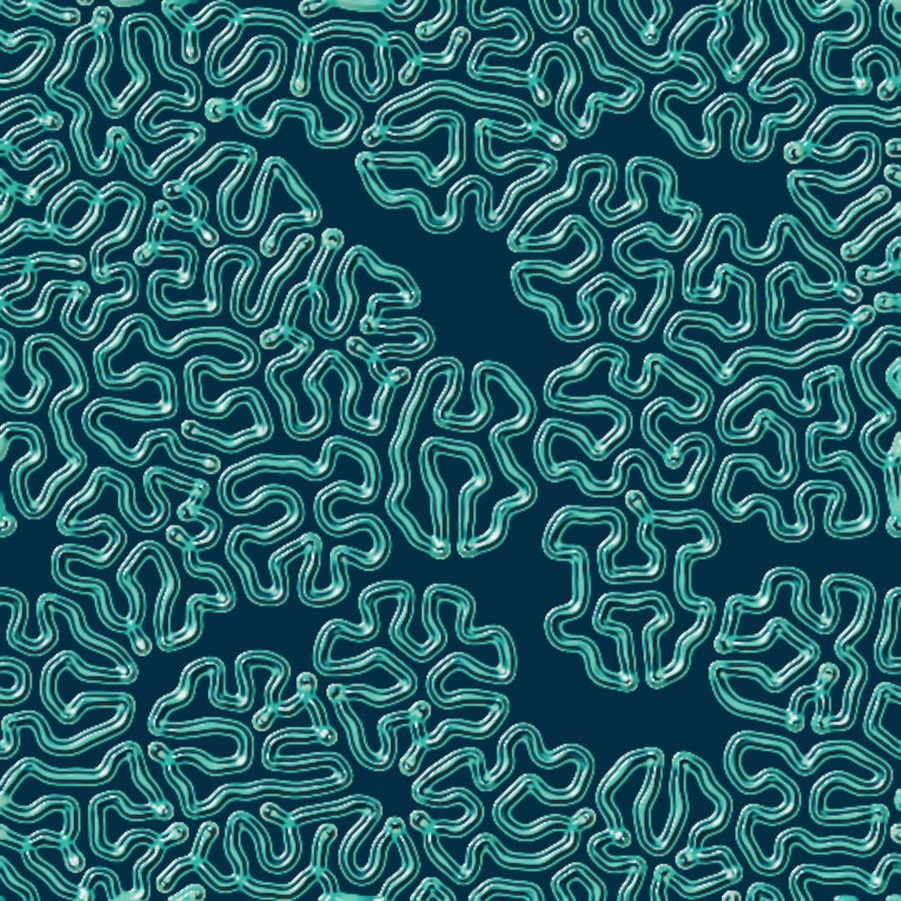

A simulation field is a grid of cells on the GPU, and every frame each cell changes by asking its neighbors. You seed one by drawing into it, and run rules on it from the Game of Life to reaction-diffusion. The corridors at the top grew from a scatter of dots, and whatever you draw while the sketch runs joins the chemistry. More chemistries, fields that move, materials, and a rule of your own come after the sketch, and [Chapter 24](24-Automata.md) holds more automata.

## State that lives on the GPU: SimField and withField

[Chapter 19](19-LayersAndEffects.md)'s feedback layer was the first taste of a picture fed its transformed self back in, frame after frame. A simulation field replaces "transform the whole picture" with something more local. Every cell of the field computes its next value *from its neighbors*, all at once, every frame. It is [Chapter 18](18-YourFirstShader.md)'s per-pixel function with one addition, memory.

In Ollin that is a `SimField`. Like `Feedback`, it persists, so make it once and keep it. You never write the kernel for the built-in ones. Pick a `Sim`, draw into the field to seed it, and composite its `image`:

```swift
var life: SimField?

override func draw() {
    if life == nil { life = makeSimField(.gameOfLife(), scale: 0.08) }   // once, then kept
    guard let life else { return }
    withField(life) {
        if mouseIsPressed { fill(.white); drawCircle(mouseX, mouseY, 20) }
    }
    drawImage(life.image, 0, 0)
}
```

The field is made on the first frame and held in a property, so every later frame steps the same field. `withField` works like [Chapter 19](19-LayersAndEffects.md#a-drawing-you-can-hold-render-targets)'s `withTarget`, and what a drawn mark *means* depends on the simulation. For the Game of Life, white means alive.

## The Game of Life: a first field

Conway's Game of Life is the classic proof that simple local rules make worlds. Each cell of a grid is alive or dead, and from one generation to the next it asks only about its eight neighbors:

<picture>
  <source media="(prefers-color-scheme: dark)" srcset="Images/23-GridSimulations/LifeRules-dark.jpg">
  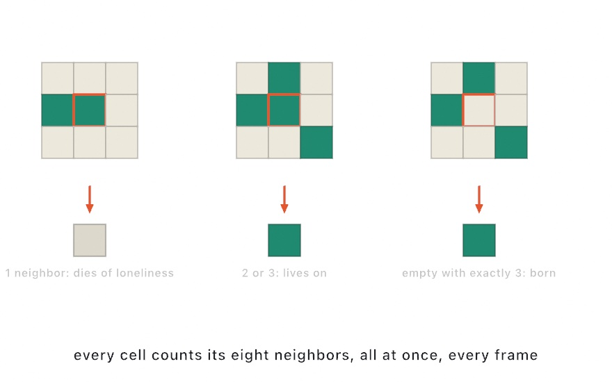
</picture>

That is the entire rule. No cell knows about the picture. Seed a field with a random soup anyway and structures appear. You get stable blocks, blinking pairs, and now and then a *glider* that walks off across the grid on its own:

```swift
withField(life) {
    noStroke()
    fill(.white)
    if frameCount == 1 {                       // a random soup, once
        for _ in 0 ..< 700 {
            drawCircle(width * 0.5 + random(-260, 260),
                       height * 0.5 + random(-260, 260), 7)
        }
    }
}
```

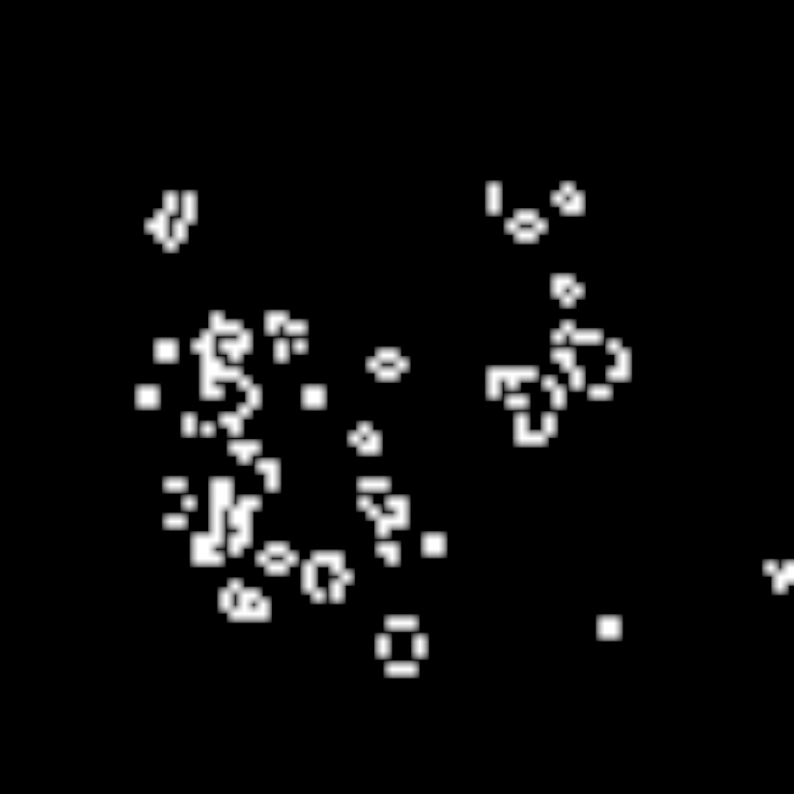

The `scale: 0.08` matters, because a sim field's `scale` sets its internal resolution. For a cellular automaton one texel is one cell, so a low scale gives cells you can see. For the other sims, a lower scale means broader, cheaper features.

## A field is data: gradientMap, levels, and relight

Life's `image` already reads as a picture, because a cell is black or white. Most fields do not. The raw field is *data*. Reaction-diffusion stores two chemicals as dim red and green. The ripple pool stores a height and a velocity, and the falling sand stores each cell's material as a gray level. `image` hands you that data as stored, which is useful for seeing what a field is doing and rarely what you want on the canvas. So you give a field a look by filtering it, through the same catalog [Chapter 19](19-LayersAndEffects.md#filters) used on a layer. Three filters do most of the work:

- `.gradientMap` reads each texel's brightness and looks a color up along a `Ramp` from [Chapter 2](02-Color.md), or a `Colormap` such as `.viridis` or `.magma`. One color per level is how an automaton's few states become a picture. A smooth ramp is how a chemical's concentration becomes skin.
- `.levels(blackPoint:whitePoint:)` stretches a narrow band of values to the full range. A field whose state sits in one narrow band maps to nearly one gray. Pull the band's two ends to black and white, and the structure inside it appears. Do this before the gradient map, so the ramp gets the full range to work with.
- `.relight` from [Chapter 20](20-PicturesRestyled.md) reads the field as height and lights it, which turns ridges into relief and a height field into water.

```swift
let inks = Ramp([Color(hex: 0x06131F), Color(hex: 0x3FA893)])
drawImage(life.filtered(.gradientMap(inks)).image, 0, 0)
```

Filters chain, so `.filtered(.levels(blackPoint: 0.16, whitePoint: 0.42)).filtered(.gradientMap(inks))` runs one after the other. The organism at the end of the spine stacks all three. The `.threshold` filter is there for hard ink. The raw `image` stays the view to reach for when a field is doing something you did not expect.

## Two chemicals: reaction-diffusion

Reaction-diffusion is the Game of Life's continuous cousin, and the engine of the organism. The idea comes from Alan Turing. Two chemicals spread through a surface and react, one feeding the pattern and one killing it. In the balance between those two rates, patterns *make themselves*. Ollin ships the two-chemical form as `.reactionDiffusion(feed:kill:)`, and those two numbers are the system's temperament:

<picture>
  <source media="(prefers-color-scheme: dark)" srcset="Images/23-GridSimulations/FeedKillMap-dark.jpg">
  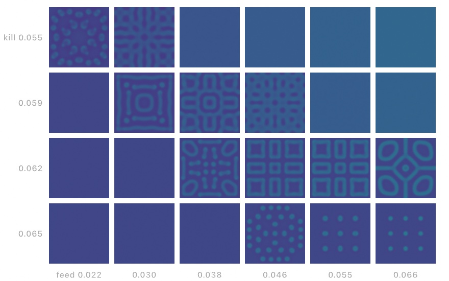
</picture>

About half the map is quiet. Patterns grow only in a band where feeding and killing balance, and each regime along that band has its own signature. There are dividing dots, and there are the worm mazes and coral walls the defaults grow. Put `feed` and `kill` on `@Param` parameters and you can walk the map live. The [`Simulation/GrayScott`](../Examples/Simulation/GrayScott/Sketch.swift) example runs the dish at the defaults, a place to start from.

The regime does not have to be one choice for the whole dish. Give the sim two settings, `.reactionDiffusion(feed: 0.046, kill: 0.065, toFeed: 0.055, toKill: 0.062)`, then attach any drawn or generated layer as `dish.modulation`. That layer's brightness picks the spot on the map for every texel: black runs the first pair, white the second. A picture can choose the chemistry, place by place. It stays one simulation, so the two patterns grow into each other instead of meeting at a mask's hard edge. The `Vision/TuringMirror` example draws the camera's person matte into that layer. The field grows maze walls on your silhouette and spots everywhere else, and it reorganizes as you move.

Here is the same idea with a drawn layer instead of a camera, so the boundary can be looked at:

<picture>
  <source media="(prefers-color-scheme: dark)" srcset="Images/23-GridSimulations/ChemistryByPicture-dark.jpg">
  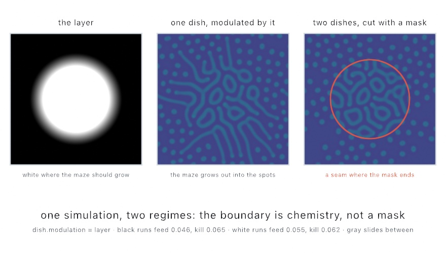
</picture>

The disc is the map. Inside it the field runs the maze pair, and outside it the spot pair. Across the soft edge the maze's walls thin out into dots instead of stopping. The right dish is what a mask gives instead: two separate simulations cut along the same circle, and the seam knows nothing about either. Draw the map every frame before you read the field, since a frame with no map runs the plain black-end pair.

Seeding is drawing, as it was for Life. Watch what one mark becomes:

<picture>
  <source media="(prefers-color-scheme: dark)" srcset="Images/23-GridSimulations/Seeding-dark.jpg">
  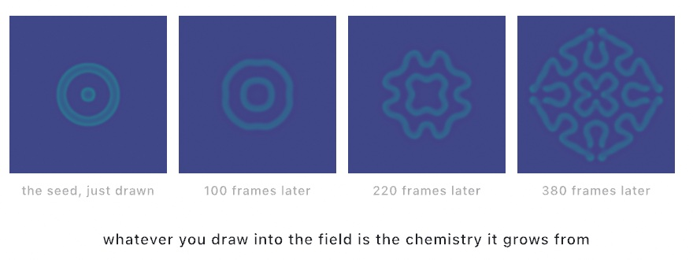
</picture>

## Putting it together: the organism

The finished sketch grows a culture. It composes the four steps above. A field is made once and held. A scatter of spores is drawn into it on the first frame, seeding a reaction-diffusion dish in its maze regime. Whatever you draw while it runs joins the chemistry. The display is the data step's pipeline: a levels stretch, a gradient map for the skin, and a liquid relight. The relight is what makes the ridges catch light. Make `MySketches/Organism.swift`:

```swift
import Ollin

final class Organism: Sketch {
    var dish: SimField?

    override func setup() {
        seed(7)
        toneMap(.aces, exposure: 1.15)
    }

    override func draw() {
        background(Color(hex: 0x04070B))
        if dish == nil { dish = makeSimField(.reactionDiffusion(feed: 0.055, kill: 0.062), scale: 0.5) }
        guard let dish else { return }

        withField(dish) {
            noStroke()
            fill(.white)
            if frameCount == 1 {                       // the culture's first spores
                for p in poissonDisk(radius: 170) { drawCircle(center: p, radius: 5) }
            }
            if mouseIsPressed {                        // and whatever you draw
                drawCircle(mouseX, mouseY, 9)
            }
        }

        let skin = Ramp([Color(hex: 0x06131F), Color(hex: 0x0E4C5C),
                         Color(hex: 0x3FA893), Color(hex: 0xF2E3C2)])
        drawImage(dish.filtered(.levels(blackPoint: 0.16, whitePoint: 0.42))
                      .filtered(.gradientMap(skin))
                      .filtered(.relight(.liquid, height: 1.4)).image, 0, 0)
    }
}
```

Run it live and draw. Your marks do not appear on the canvas. They enter the chemistry, and thirty frames later something is growing where your hand was. You set the conditions, and the picture grows from them. What each piece contributes:

- `poissonDisk(radius:)` from [Chapter 4](04-Randomness.md) scatters the spores evenly, and `seed(7)` in `setup()` makes the same scatter every run. `feed: 0.055` and `kill: 0.062` sit in the maze regime of the map above.
- The levels stretch pulls the dish's dim state, most of it between 0.16 and 0.42, out to the full range. The four-color ramp then paints it from the deep gaps to the pale ridges.
- `.relight(.liquid, height: 1.4)` reads the ramped picture as height and lights it wet. `toneMap(.aces, exposure: 1.15)` from [Chapter 19](19-LayersAndEffects.md#brighter-than-the-screen-tonemap) keeps the highlights from clipping.

Then make it yours:

- Walk the map by putting `feed` and `kill` on parameters, and steer the culture between mitosis, worms, and coral while it grows.
- Recolor the skin ramp. The same labyrinth reads as coral, lichen, or circuitry depending entirely on four colors.
- Seed with meaning. [Chapter 8](08-Words.md)'s `drawText` into the field grows a word into a labyrinth that slowly forgets it was a word.
- Swap `.relight(.liquid)` for `.relight(.metal, color:)` and the organism becomes an engraving.

A culture is best kept as it grows, so keep it as a video. The command `swift run OllinLive MySketches/Organism.swift --export-video organism.mp4 --seconds 20` records the first twenty seconds, from the spores on.

## Other chemistries: predator and prey, and multi-scale Turing

The organism's reaction-diffusion is one chemistry, two quantities feeding and consuming each other across a surface. The predator-prey field and the multi-scale Turing field run a rule of that kind. The first puts two species on a land instead of two chemicals. The second keeps a single substance and runs Turing's idea at several sizes at once.

### Two species: predator and prey

The **predator-prey field** puts prey and predators on one land and lets both wander. Prey breed toward what the land can hold. Predators eat them, but a full predator eats no faster, and predators die off at their own rate when the prey run out. It is for invasion fronts and the spiral waves that wind up behind them, the picture of spatial ecology. The model is the one Alfred Lotka wrote down in 1925 and Vito Volterra in 1926. It runs here in the form Michael Rosenzweig and Robert MacArthur gave it in 1963, with C. S. Holling's saturating response of 1959. Jonathan Sherratt, Mark Lewis, and Andrew Fowler described the spiral waves behind an invasion in 1995. Alexander Medvinsky and his colleagues made them the picture of spatial ecology in 2002. Ollin ships it as `.predatorPrey()`:

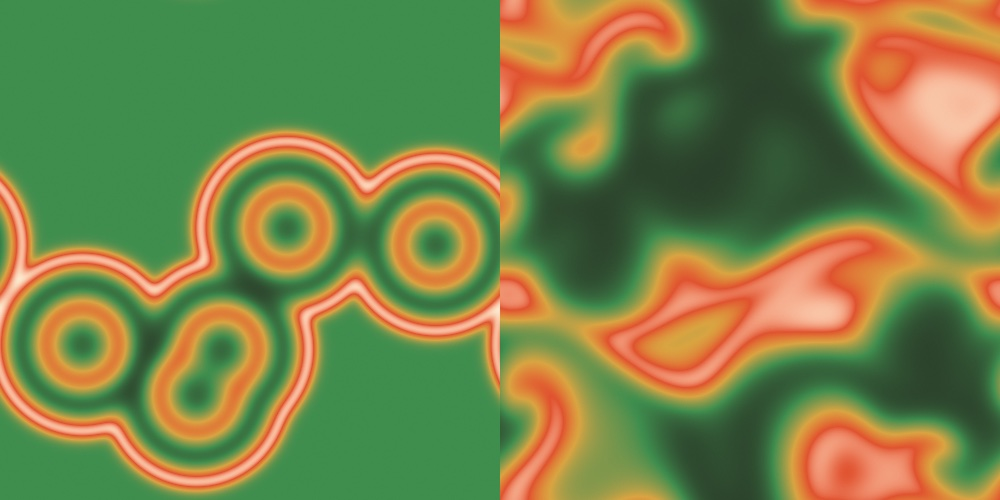

```swift
land = makeSimField(.predatorPrey(), scale: 0.5)
```

The field rests at full prey and no predators, and you draw green to release predators. Each release is a front, and the left map shows five of them: predators eat their way outward into full prey. Behind the front the prey crash, the predators starve, and the meadow grows back, ring after ring. Leave the land running and you get the right map. The fronts have met, and the wake behind them has broken into curling waves, spiral arms with no fixed center. Each patch of land runs the same boom-and-crash cycle a little out of step with its neighbors. A cycle that runs out of step across space *is* a rotating wave.

Three numbers set the ecology. `halfSaturation` is how much prey it takes to fill a predator, `predatorGrowth` how fast full predators multiply, and `predatorDeath` how fast they starve. The defaults sit past the model's oscillation threshold, which is what makes waves. Raise the death rate toward the growth rate, or the half saturation toward the land's capacity. The cycle then calms into a steady coexistence, and the waves die out. The [`Simulation/PredatorPrey`](../Examples/Simulation/PredatorPrey/Sketch.swift) example puts all three on parameters, so you can walk the field from spirals to calm and back.

The raw field is prey in red and predators in green, which already reads as a picture. The maps above run it through a gradient map instead. The map reads the *mix*: bare soil where both are gone, meadow where the prey stand alone, orange where the predators have arrived.

### The same rule at many sizes: multi-scale Turing

**Multi-scale Turing patterns** use one substance instead of two chemicals, and several scales instead of one. The single-scale rule is this: take an average of the field over a small disc, take another over a larger disc, and compare them. Where the small average is the greater, brighten the pixel a little, and otherwise darken it. The small disc is the *activator* and the large one the *inhibitor*. That one comparison, run over and over, grows the stripes on a zebra. Now run five of those rules side by side, with radii doubling from small to large, which is what `.ladder` names. At every pixel, every step, ask which of the five has its two averages closest together, and let only that one act. Jonathan McCabe's insight is that "closest together" means *this is the scale that has the least to say here*. Letting it act is what lets each part of the picture settle at its own size. The patterns are for pictures that look photographed under a microscope. They are McCabe's, from his 2010 Bridges paper "Cyclic Symmetric Multi-Scale Turing Patterns". The single rule is one `TuringScale`, and the left field below runs it alone:

```swift
field = makeSimField(.multiScaleTuring(scales: [TuringScale(activatorRadius: 4, inhibitorRadius: 8, amount: 0.02)]), scale: 0.5)
```

The right field runs the five:

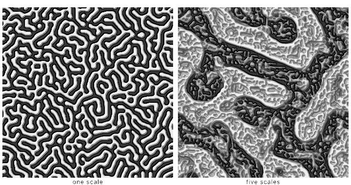

```swift
var field: SimField!

override func setup() {
    field = makeSimField(.multiScaleTuring(scales: .ladder), scale: 0.5)
}

override func draw() {
    background(.black)
    drawImage(field.filtered(.relight(height: 0.35)).image, 0, 0)
}
```

That is the whole sketch, and the missing piece is the point. There is no `withField` block, because this sim needs no seeding. It starts from noise and organizes itself, and reading the field is what keeps it stepping, so `drawImage` alone is enough. Draw into it if you want to *disturb* a settled pattern, and it heals around the mark.

For the look, try `.relight` before `.gradientMap`. The algorithm is flat and two-dimensional and knows nothing about light, yet the result reads like something photographed under a microscope. McCabe noticed this too, and the resemblance to electron micrographs of diatoms is what the pictures are known for.

Two arguments each make the difference between the pattern and a near miss. Keep the **amounts equal** across scales. Every step renormalizes the field to fill its range, so whichever scale pushes hardest sets that range. It squeezes the others toward mid gray, leaving one scale's pattern with the rest as a faint wash. And **`variationRadius`** decides how large a region a scale can claim, by setting how far each scale's disagreement is averaged before the scales are compared. Read at a single point, a fine scale's disagreement passes through zero along every contour of its own structure. Since *least* disagreement wins, it then takes a dense web of pixels across the field, burying the coarse scales entirely.

Add `symmetry` and the field folds around its center. `.rosette(n)` does it to every rung at once, which is where the diatom resemblance becomes hard to shake:

```swift
field = makeSimField(.multiScaleTuring(scales: .rosette(9)), scale: 0.5)
```

## Fields that move: fluid, ripples, and self-warp

The organism's dish, like every field so far, changes what each cell holds. The fluid, the ripple pool, and the self-warp move what they hold across the grid instead. A fluid carries dye along a flow, and a pool carries height as a wave. The self-warp carries the picture itself along its own motion.

### Water you can stir: fluid

The **fluid** sim is an incompressible flow that carries color. Marks inject dye, and `withField`'s `force:` pushes the flow where the marks land, so a moving brush stirs what it paints. It is for smoke, ink in water, and anything that should swirl. The real-time form descends from Jos Stam's 1999 *Stable Fluids* and the GPU formulation Mark Harris popularized:

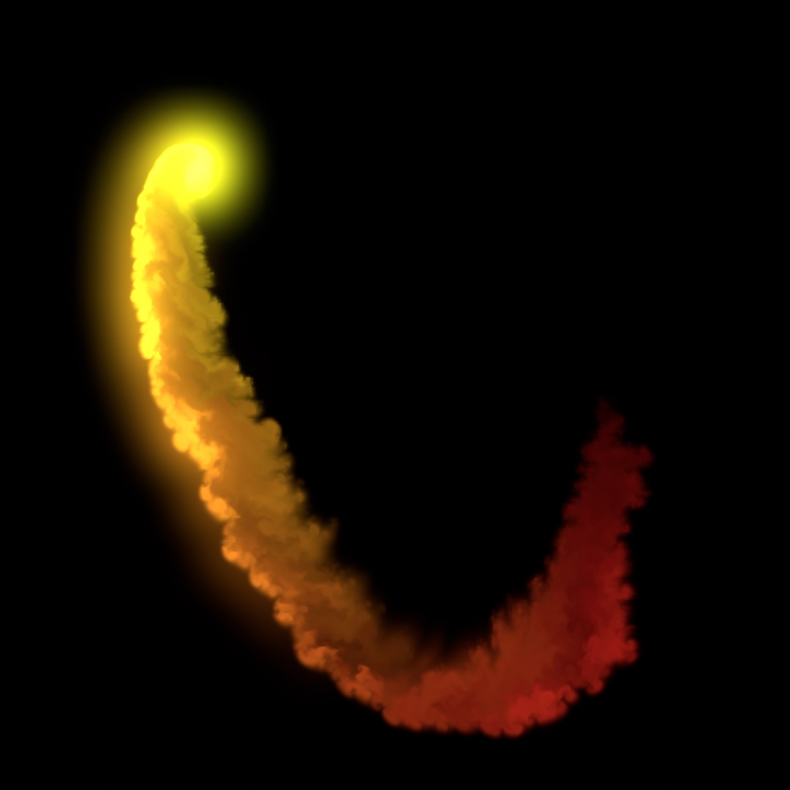

```swift
var fluid: SimField?

override func draw() {
    background(Color(hex: 0x05070C))
    if fluid == nil { fluid = makeSimField(.fluid(curl: 34), scale: 0.5) }
    guard let fluid else { return }

    let a = time * 1.4
    let brush = Vector2(width / 2 + cos(a) * width * 0.27,
                        height / 2 + sin(a * 1.3) * height * 0.27)
    let push = Vector2(-sin(a), cos(a * 1.3)) * 7      // along the brush's motion
    withField(fluid, force: push) {
        noStroke()
        fill(Color(hue: time * 0.07, saturation: 0.85, brightness: 1))
        drawCircle(center: brush, radius: 15)
    }
    drawImage(fluid.filtered(.bloom(threshold: 0.4, amount: 1.1, radius: 14)).image, 0, 0)
}
```

The `curl` argument sets how much fine swirling detail the flow keeps. The dissipation arguments set how fast motion and color fade. A mouse delta makes a good `force`.

### A pool you can drop things into: ripples

The **ripple pool** is water of a different kind, a surface that goes up and down. It is the 2D wave equation running on a height field, and it is for drops, rings, and reflections that answer the mouse directly. The wave equation is old, and Jean le Rond d'Alembert wrote it down for a vibrating string in 1747. The step here follows Evan Wallace's WebGL Water.

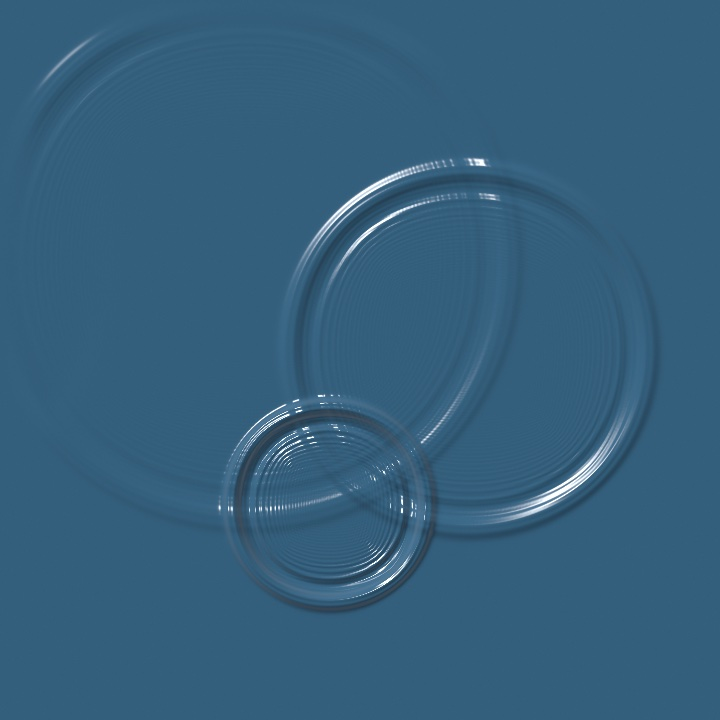

```swift
var pool: SimField!

override func setup() {
    pool = makeSimField(.ripples(damping: 0.995))
}

override func draw() {
    background(.black)
    withField(pool) {
        if mouseIsPressed { dab(mouseX, mouseY, radius: 16, strength: 0.5) }
    }
    let water = pool.filtered(.relight(.liquid, angle: -.pi * 0.7, elevation: 0.7,
                                       height: 9, intensity: 1.15,
                                       color: Color(hex: 0x3D6E8F)))
    drawImage(water.image, 0, 0)
}

func dab(_ x: Double, _ y: Double, radius: Double, strength: Double) {
    fill(.radial(center: Vector2(x, y), radius: radius,
                 [Color(white: 1, alpha: strength), Color(white: 1, alpha: 0)]))
    drawCircle(x, y, radius)
}
```

A mark you draw into this field does not set the surface. It *adds* to it. The brightness of what you draw becomes height poured onto the water, and that bump collapses under its own weight. Rings spread out, cross each other, reflect off a soft rim, and die away at the rate `damping` sets.

Two things about dropping follow from that. The drop should be **soft**, which is why `dab` fills a radial gradient fading to nothing, from [Chapter 2](02-Color.md#gradients-as-paint), rather than a plain circle. `Color(white:alpha:)` is a gray by one number with an alpha beside it. A hard-edged disc is a step in the surface, and a step contains every frequency at once. So it rings like a struck plate instead of splashing like a drop. And a drop should be **brief**. Holding an opaque mark in place pours water into the pool every frame, and the surface climbs away from you.

This field's raw `image` is not a picture of water. It stores height in the red channel and velocity in green, both signed, which makes it a debugging view. Shading it is a separate step, and `.relight` is the natural one because it reads the height as a surface and lights it.

### The picture dragging its past: self-warp

The **self-warp** field has no chemistry inside it. Its state is the picture itself. It watches what you draw, works out which way every part of it just moved, and carries everything it has already shown along that motion. Whatever moves smears, and whatever holds still stays sharp. It is for trails and ribbons that follow motion without any code naming a velocity. The motion measurement is Bruce Lucas and Takeo Kanade's 1981 least-squares optical flow, run coarse to fine. The history carry is the same step the fluid uses to move its dye.

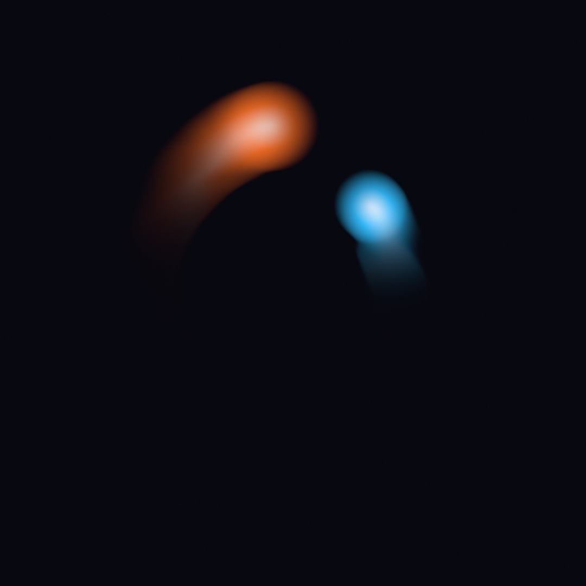

```swift
var warp: SimField!

override func setup() {
    warp = makeSimField(.selfWarp(amount: 0.55, refresh: 0.05))
}

override func draw() {
    withField(warp) {
        background(Color(hex: 0x08080F))
        noStroke()
        let c = bounds.center                    // the canvas middle
        orb(at: c + Vector2(cos(time * 1.15), sin(time * 1.15)) * 310,
            radius: 84, Color(red: 1.0, green: 0.45, blue: 0.15))
        orb(at: c + Vector2(cos(-time * 0.74 + 2.1), sin(-time * 0.74 + 2.1)) * 215,
            radius: 66, Color(red: 0.2, green: 0.75, blue: 1.0))
    }
    drawImage(warp.image, 0, 0)
}

func orb(at center: Vector2, radius: Double, _ color: Color) {
    fill(.radial(center: center, radius: radius,
                 [.white, color, color.withAlpha(0)]))
    drawCircle(center: center, radius: radius)
}
```

You draw the whole scene into the field, background and all, and composite the field instead of the scene. The measuring is the sim's job. It compares this frame's drawing with the last one, so anything that visibly moves, moves the history. The sketch never declares a velocity: the fluid needed a `force:`, and this field reads the push off the picture itself.

`amount` picks the look. At 1 the carried ghost lands back under whatever moved, and the effect nearly vanishes. Below 1 the picture outruns its history and stretches it into the ribbons above. Above 1 the history overshoots, and glitchy echoes race ahead of the motion. Negative drags the past against the motion. `refresh` is how much of the fresh drawing wins back each frame, so low values leave long-lived smears. `decay` a touch under 1 sinks old trails toward black.

The motion is measured from the picture's own shading, so the field reads best on content with soft gradients, edges, or texture. The gradient-cored orbs above are ideal. A camera or video frame drawn into the field works as well, smearing along whatever moves in it. A flat shape on a flat ground gives the fit nothing to hold.

## Materials: sand that falls and paint that behaves

The organism's rule fits in a sentence. Falling sand and watercolor model a material instead, one moving grains that fall, roll, and sink, and the other wet paint on rough paper.

### Sand that falls: the falling-sand automaton

The **falling-sand automaton** moves grains from cell to cell. Every cell holds one material: empty, water, sand, or wall. Each pass, the grid is cut into 2x2 blocks, and every block settles on its own. A grain over an empty cell falls into it. A grain over water swaps with it, so it sinks and the water rises. A grain that cannot fall straight down rolls into an empty cell diagonally below it. Water swaps with the empty cell beside it, so a pool spreads until it lies flat. A wall never moves. Then the blocks shift by one cell and the next pass runs, so what one block could not see, the next one settles. It is for heaps, slopes, and pools, and for the toy every falling-sand game has been since the early 2000s. It is a block automaton of the kind Tommaso Toffoli and Norman Margolus laid out in their 1987 book *Cellular Automata Machines*. Its roll and friction follow the pass-parallel rule Jonathan Devlin and Micah Schuster described in 2020.

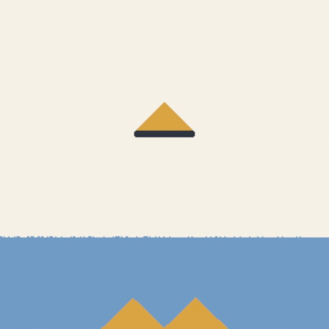

```swift
var sand: SimField!
let materials = Ramp(stops: [(0.000, Color(hex: 0xF5F1E6)),
                             (1 / 3, Color(hex: 0x6F9BC4)),
                             (2 / 3, Color(hex: 0xD9A441)),
                             (1.000, Color(hex: 0x2E3440))])

override func setup() {
    sand = makeSimField(.fallingSand(passes: 16, friction: 0.3), scale: 0.5)
}

override func draw() {
    background(Color(hex: 0xF5F1E6))
    withField(sand) {
        noStroke()
        if frameCount == 1 {                    // a shelf, and a pool below it
            fill(SandMaterial.wall.color)
            drawRect(width * 0.41, height * 0.4, width * 0.18, 8)
            fill(SandMaterial.water.color)
            drawRect(0, height * 0.74, width, height * 0.26)
        }
        if frameCount <= 480 {                  // one tap, open for a while
            fill(SandMaterial.sand.color)
            let wobble = sin(Double(frameCount) * 0.7) * 9 + sin(Double(frameCount) * 1.9) * 4
            drawCircle(width * 0.5 + wobble, 10, 2)
        }
    }
    drawImage(sand.filtered(.gradientMap(materials)).image, 0, 0)
}
```

> **Swift note.** `Ramp(stops:)` takes a list of pairs, each a position along the ramp and the color there. The pairs are written as the tuples [Chapter 9](09-Pictures.md) introduced. [Chapter 2](02-Color.md)'s `Ramp([...])` spaced its colors evenly; this form places each one.

Drawing pours a material. The field stores the four materials at four gray levels, and `SandMaterial` names them. So `fill(SandMaterial.water.color)` before a mark fills the mark with water. A black mark empties the cells under it. This sketch draws the walls and the pool once, then holds a tap open over the shelf. The tap wobbles on two sines, so the grains do not all land in one column. The stops `1 / 3` and `2 / 3` are the middle two gray levels, written as divisions so they land on the levels.

The cone on the shelf is not drawn. Grains land, roll down the slope, and stop where the slope is as steep as it can stand. Once the heap is wider than the shelf, grains slump off both ends and fall into the pool. They sink through it, heap up on the floor, and the water they push aside rises to the top. `friction` sets how steep a heap can stand. At 0 every grain that can roll does, and the heaps slump flat. At 1 no grain ever rolls, so the stream stacks straight up into a tower.

`passes` is the pacing dial, in passes per frame. A grain falls one cell every two passes, so the default moves it eight cells a frame. Drop it to slow the fall down and watch a single grain find its way. The [`Simulation/Automata`](../Examples/Simulation/Automata/Sketch.swift) example's sand rule is this sketch with a brush. Pour sand, water, or wall with the mouse and see what the rule does with it.

### Paint that behaves: watercolor

The **watercolor field** is a sheet of rough paper where water flows, carries pigment, and dries the way paint does. Every other field here is a system you seed and watch; this one is a material you paint with. You lay down wet paint, and the physics produces the look, with no filter imitating it. It is for washes, glazes, and blooms. The three-layer simulation is Cassidy Curtis, Sean Anderson, Joshua Seims, Kurt Fleischer, and David Salesin's, from their 1997 paper "Computer-Generated Watercolor". The twelve pigment presets carry the coefficients the paper measured.

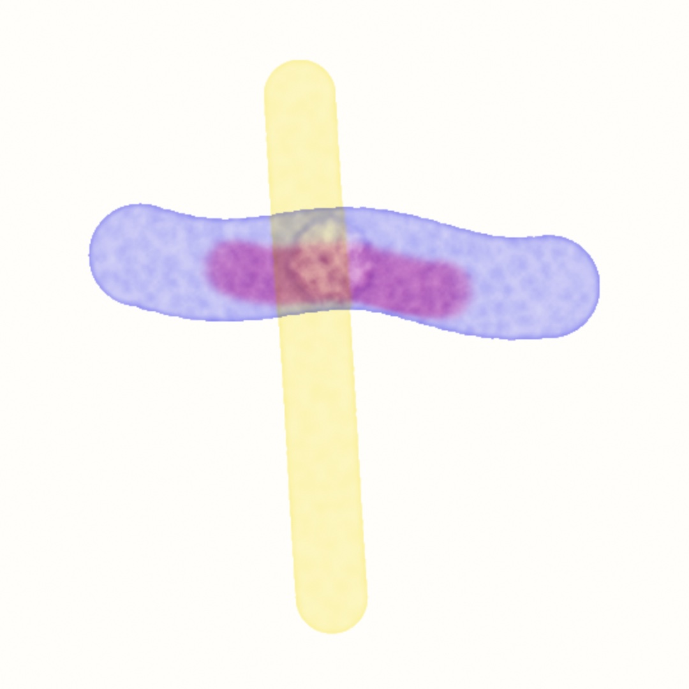

```swift
var paint: WatercolorField!

override func setup() {
    paint = watercolor(pigments: [.frenchUltramarine, .quinacridoneRose, .hansaYellow])
}

override func draw() {
    withField(paint) {
        noStroke()
        if mouseIsPressed { fill(paint.ink(0)); drawCircle(mouseX, mouseY, 24) }
    }
    drawImage(paint.image, 0, 0)
}
```

Painting is drawing into the field, with the palette held in the color channels. Red is the first pigment, green the second, blue the third, and **alpha is water**. `paint.ink(0)` builds the brush color for the first pigment, `paint.ink(2)` for the yellow, and `paint.water()` is a clean wet brush. `noStroke()` matters more than usual, because a stroked mark would ring every stamp with its stroke color. And black is water with no pigment in it.

Leave a stroke alone and its edge darkens on its own. The wet rim sheds water and the interior refills it, and that slow one-way traffic ferries pigment to the boundary. It is the dark rim every wet-on-dry stroke dries with. Paint a loaded stroke into a wash that is still wet and it spreads soft and feathery instead. Each pigment keeps its own habits along the way. Dense paints settle where you put them. Granulating ones like `.frenchUltramarine` collect in the paper's hollows and dry speckled, and staining ones grip and will not lift.

Two verbs manage the sheet between washes. `paint.dry()` bakes everything so far into a fixed glaze. The next wash paints over it without disturbing it, and the layers mix like light through stained glass rather than like ink. Hansa yellow over ultramarine makes the muted green those paints mix. `paint.blot()` lifts only the standing water and leaves the pigment sitting damp, which is the state a *backrun* wants. Hold a clean-water touch in a blotted wash and the water floods back through the damp paint. It shoves pigment ahead of it into a pale bloom with a dark branching rim. A single tap only nudges; holding the wet brush is what blooms. The water does the painting, and your job is deciding where it lands.

There are arguments for the paper too, on the longer form `watercolor(.watercolor(pigments: [.frenchUltramarine], dryBrush: 0.3))`. `dryBrush` above zero makes strokes skip across the raised tooth and break up, `grain` sizes the tooth, and `paperSeed` picks the sheet. A pigment you cannot find in the twelve presets you can invent by describing it. `WatercolorPigment(overWhite:overBlack:)` takes the color a layer shows over white and over black paper, and works out the optics from those two swatches. The full model, effect by effect, is on the [watercolor page](../Docs/Simulation/Watercolor.md).

## A rule of your own: Sim.shader

Every field so far ran a rule somebody else wrote. The catalog is long, but sooner or later you want a rule it does not have. It might be a heat that spreads, a wind that carries something, or an automaton with your own table. This entry is how you write one.

### Life rewritten as a kernel: Sim.shader

`Sim.shader` takes a kernel you write and runs it in the same loop as the catalog. The seeding by drawing, the `image`, and the memory from frame to frame are all the same. It is for the rule the catalog does not have. The kernel is a [`Shader`](18-YourFirstShader.md), and its `shade` returns the cell's **next state** from its neighborhood. `cell(info)` is the cell itself and `cell(info, dx, dy)` a neighbor, with `dy` positive downward like the canvas. Here is Life again, as a kernel:

```swift
let life = Sim.shader(Shader("""
float4 shade(float2 uv, ShaderInfo info) {
    float n = 0.0;
    for (int dy = -1; dy <= 1; dy++) {
        for (int dx = -1; dx <= 1; dx++) {
            if (dx != 0 || dy != 0) { n += step(0.5, cell(info, dx, dy).r); }
        }
    }
    float me = step(0.5, cell(info).r);
    float alive = (n == 3.0 || (me > 0.5 && n == 2.0)) ? 1.0 : 0.0;
    return float4(alive, alive, alive, 1.0);
}
"""))
```

> **Metal note.** `for (int dy = -1; dy <= 1; dy++)` is a counted loop written the C way. It has a starting value, a condition to keep going, and a step. Here the step is `dy++`, which adds one. `||` means or and `&&` means and, `!=` is not equal as in [Chapter 17](17-MarksAndMedia.md), and `condition ? 1.0 : 0.0` is the compact if from [Chapter 6](06-GridsAndRepetition.md). `step(0.5, x)` is [Chapter 18](18-YourFirstShader.md)'s step, 0 below the threshold and 1 above it, and `.r` reads the state's first channel.

It matches the built-in `.gameOfLife()` cell for cell, which is how you know the readers mean what they say. The state is *data*: nothing you return is treated as a color, and nothing you read has been. A cell can hold a temperature, a velocity, a count, whatever four numbers your rule needs.

The second kernel is how a drawn mark gets in. Without one, a mark lands the way it does for the catalog: laid onto the state by its alpha, white writing 1 and black 0. With `inject:`, your own shader runs where the marks landed, and it reads them through `mark(info)`. That second kernel is what turns a brush into a force. A mark can *add* heat instead of setting it. It can push a wind the way the mouse moved, with the motion handed in through the shader's `params`. The region it acts on is whatever the block drew. So a circle, a line, or a rectangle in `withField` is that shape stepped by your rule:

```swift
plate = makeSimField(.shader(heatStep, inject: addHeat, substeps: 4), scale: 0.5, edge: .clamped)
```

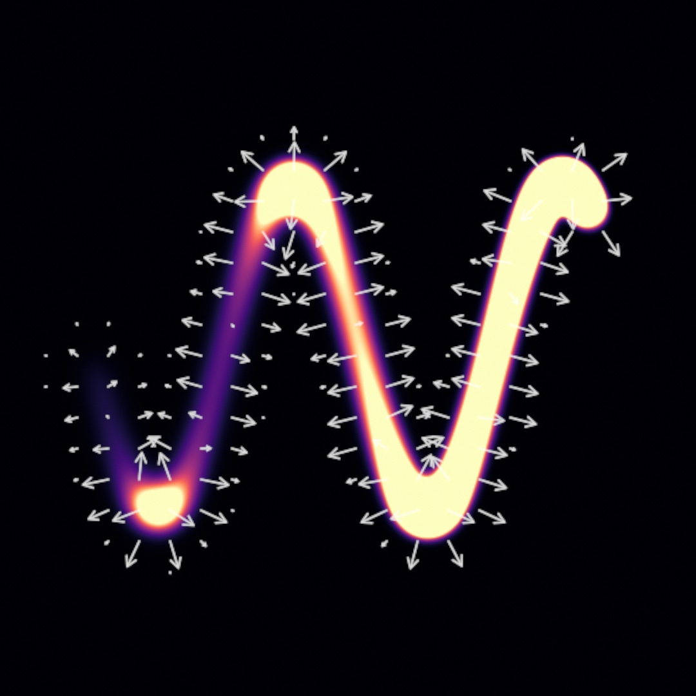

That line carries the two other choices a field of your own makes you think about. **`edge`** is what a cell on the border reads when it looks past the field. The default wraps, which is why a glider that leaves Life's right edge comes back on the left. `.clamped` puts walls there. A read past the edge returns the border cell, which for a diffusing quantity is an insulated boundary, so nothing leaks out of this plate. The catalog's neighbor-reading sims honor the same setting, so Life on a clamped field has corners. **`precision`** is how exactly a number keeps. Half float, the default, holds a whole number exactly only to about two thousand, so a rule that *counts* wants `.float32`.

Two more things round the kit out. A two-channel state reads as a picture through `.arrows`. That is what drew the white arrows above, from the heat's slope stored in the plate's first two channels. And `snapshot()` reads any field back to the CPU as numbers, every cell's four channels as stored, one frame late. A sketch can then hand a sum or a busiest cell to sound, to text, or to a plotter. The [`Simulation/Wind`](../Examples/Simulation/Wind/Sketch.swift) example puts all of it in one sketch. A wind carries dust, a drag pushes it, and a noise layer handed in as an `input` stirs it. The edge is switched live, the arrows are drawn over the dust, and the mean speed is read back twice a second.

## Where this comes from

The Game of Life is John Horton Conway's, from 1970, and reached the world through Martin Gardner's *Scientific American* column. It remains the standard demonstration that computation and life-like behavior need almost nothing to start. Reaction-diffusion begins with Alan Turing's 1952 paper *The Chemical Basis of Morphogenesis*. The two-chemical model Ollin ships is the Gray-Scott variant. The feed/kill map figure follows the territory John Pearson charted in his 1993 classification of its patterns. Karl Sims' interactive tutorial later made that map a creative-coding staple. The families after the organism name their own sources as they go. The chemistries name Lotka and Volterra, Rosenzweig and MacArthur, Holling, Sherratt and Lewis and Fowler, Medvinsky, and McCabe. The moving fields name Stam and Harris, d'Alembert and Wallace, and Lucas and Kanade. The materials name Toffoli and Margolus, Devlin and Schuster, and Curtis and his co-authors. Full credits are in the project's [attribution notes](../ATTRIBUTION.md).

## Go deeper

- [Simulation fields](../Docs/Drawing/Effects.md#simfield): the `Sim` catalog with every argument, seeding semantics, and field scale.
- [A simulation of your own](../Docs/Drawing/Effects.md#simfield-shader): the kernel contract, the readers, the inject, `edge`, `precision`, `inputs`, `.arrows`, and `snapshot()`.
- [Watercolor](../Docs/Simulation/Watercolor.md): the three layers of the wash, every pigment preset, the paper arguments, and the two verbs between washes.
- Appendix B draws this chapter's math, one picture per idea: [Local rules, global structure](B-JustEnoughMath.md#local-rules-global-structure) and [A parameter space is a map](B-JustEnoughMath.md#a-parameter-space-is-a-map).
- Worked examples: [`Examples/Simulation/GrayScott`](../Examples/Simulation/GrayScott/Sketch.swift), [`Examples/Simulation/Automata`](../Examples/Simulation/Automata/Sketch.swift) (thirteen rules on a picker, the Game of Life and the falling sand among them), [`Examples/Simulation/MultiScaleTuring`](../Examples/Simulation/MultiScaleTuring/Sketch.swift), [`Examples/Simulation/Fluid`](../Examples/Simulation/Fluid/Sketch.swift), [`Examples/Simulation/SelfWarp`](../Examples/Simulation/SelfWarp/Sketch.swift), [`Examples/Simulation/Ripples`](../Examples/Simulation/Ripples/Sketch.swift), [`Examples/Simulation/Watercolor`](../Examples/Simulation/Watercolor/Sketch.swift), [`Examples/Compute/CurlField`](../Examples/Compute/CurlField/Sketch.swift), and [`Examples/Compute/ReactionDiffusion`](../Examples/Compute/ReactionDiffusion/Sketch.swift).

---

[Contents](README.md#contents) · Previous: [Chapter 22, Iterated forms](22-IteratedForms.md) · Next: [Chapter 24, Automata](24-Automata.md)
