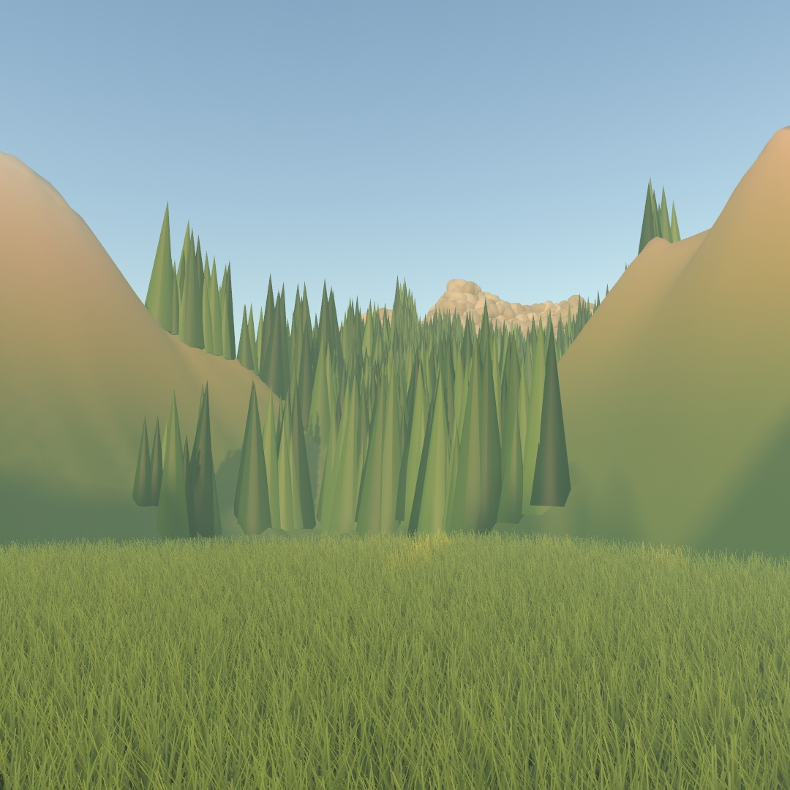
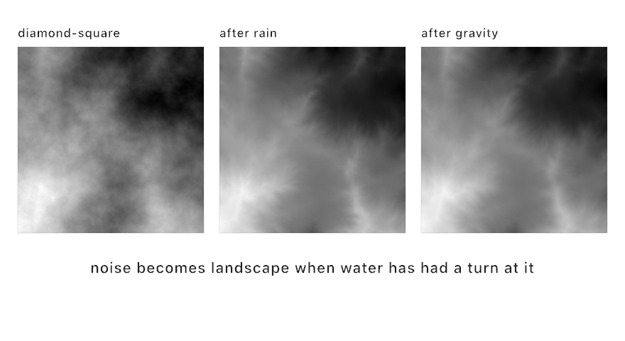
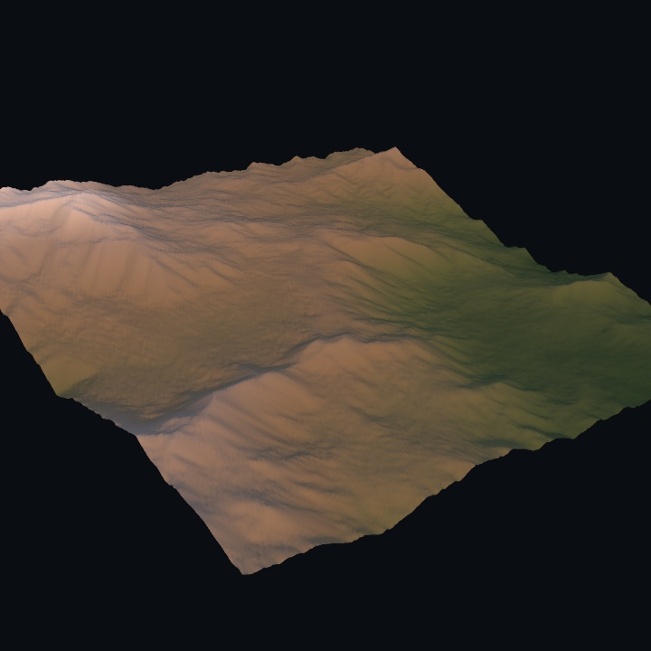
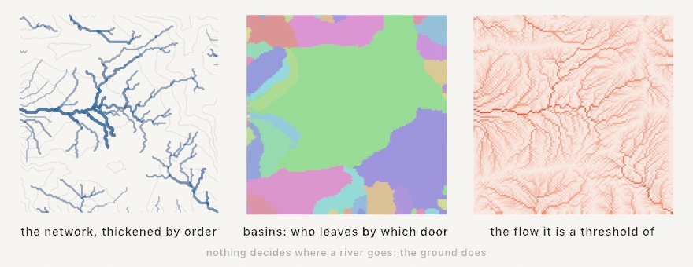
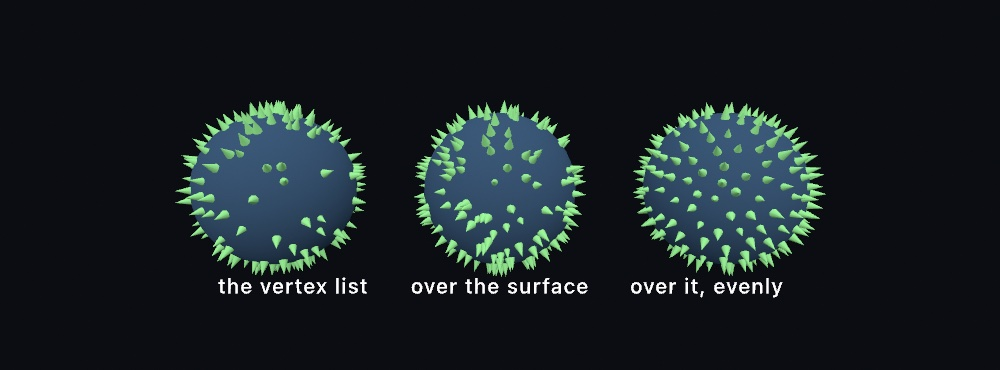

#### <sup>[Ollin](../README.md) → [Guide](README.md) → Chapter 23</sup>

---

# 23. Landscapes and multitudes



Nobody placed a tree in that picture. The ground grew out of noise and then had rain run over it for a while. Everything standing on it was scattered by asking the ground where a pine could take root. The grass in the foreground was never built at all. The GPU works it out while drawing it and keeps nothing afterwards.

[Chapter 22](22-Meshes.md) finished one object until it read as real. That is the far end of placing things one at a time, and it works on a scene you can hold in your head. Here there is too much to hold. A million particles riding one field, ten thousand copies of one mesh, a quarter of a million solids the camera trims for you, half a million blades of grass. It starts with the ground, because once you have a landscape you can ask it where everything else goes. Each step after that hands more of the work to the GPU.

## A landscape you grow

A mesh you load is a shape somebody else made. A mesh you generate is one nobody has seen, and terrain is the friendliest place to start. A landscape is just a height for every point on a grid, and Ollin has a type for exactly that.

```swift
let land = Heightfield.diamondSquare(size: 257, roughness: 0.55, seed: 7)
drawMesh(land.mesh(width: 10, depth: 10, height: 2.2))
```

A `Heightfield` holds heights between 0 and 1, and you can grow one from any field you like, including everything [Chapter 5](05-Noise.md) taught. `Heightfield(columns: 257, rows: 257) { u, v in fbm(u * 3, v * 3, octaves: 6) }` rolls hills, and swapping in `ridgedFbm` creases them into ridges. The `diamondSquare` form above is the classic terrain fractal instead. Set the four corners, then repeatedly fill in each square's center and each edge's midpoint with the average of its neighbors plus a random nudge. The grid step halves and the nudge shrinks each round. `roughness` controls how fast the nudges shrink, and around 0.55 reads as landscape. The `size` rounds up to the grid the subdivision needs, which is why it wants numbers like 129, 257, or 513.

Here is the thing that separates a terrain from a cloud of noise, though. Real land doesn't look the way it does because of the rock. It looks that way because water has been running down it for a very long time.

```swift
let weathered = land
    .eroded(.hydraulic(drops: 50_000), seed: 7)
    .eroded(.thermal(talus: 0.012, iterations: 30))
```

<picture>
  <source media="(prefers-color-scheme: dark)" srcset="Images/23-Landscapes/Erosion-dark.jpg">
  
</picture>

`.hydraulic` drops tens of thousands of simulated raindrops on the terrain. Each one lands somewhere random and rolls downhill. It picks up sediment while it's moving fast, and drops that sediment again as it slows down or dries out. No single drop does much. Fifty thousand of them agree with each other about where the valleys are. Branching drainage networks appear that no amount of layered noise will give you. The middle panel above is the whole argument for the technique.

`.thermal` is gravity's half of the job. Wherever two neighboring samples differ by more than `talus`, some of that excess slides to the lower one. Cliffs shed into scree slopes, and spikes settle to an angle they can actually hold. It's a smaller change than rain. The third panel shows a gentler version of the second rather than a different landscape, which is exactly what weathering looks like.



Once the field is shaped, it reads out three ways. `mesh(width:depth:height:)` gives you a solid mesh with proper normals. `image()` gives you the grayscale heightmap, which is what the three panels are. And `value(atU:v:)` samples any point for placing trees, routing a path, or driving something else entirely. The picture above wears a texture built by walking each height up a `Ramp` from valley green to snow, which is the whole coloring recipe.

One practical note carries all of this. Erosion is genuine work, tens of thousands of drops each walking dozens of steps, so it belongs in `setup()`. Grow the field, weather it, keep the mesh, and let `draw()` just draw it.

## Where the water goes

The rain that carved those valleys knew where to run. You can ask the finished landscape the same question, and get the rivers out as lines.

```swift
let water = land.drainage()
for river in water.rivers(minimumFlow: 140, in: mapFrame) {
    strokeWeight(0.7 + Double(river.order) * 0.9)
    drawPolyline(river.points)
}
```

<picture>
  <source media="(prefers-color-scheme: dark)" srcset="Images/23-Landscapes/WhereWaterGoes-dark.jpg">
  
</picture>

Nothing in there decides where a river should go. Water on any cell runs to whichever of its eight neighbors is steepest downhill, and the flow through a cell is the count of every cell that ends up running through it. A cell joins the network once enough ground drains through it. The branching is the ground's, which is why it looks like branching you have seen.

`minimumFlow` is the knob worth putting on a slider, and it means something real: the smallest catchment you are willing to call a river, counted in cells. Take it down and a fine tracery fills every crease. Take it up and a few trunks are left.

One thing has to happen before any of it works. A landscape is full of hollows with no way out, and water arriving in one has nowhere to go, so the network would stop dead there. Every hollow is filled first, up to the level it would brim over at, which is what a real basin does once it has filled. `drainage()` does that for you, and `land.filled()` is the same pass on its own.

The thickness above is Strahler's order rather than the flow. A headwater is 1, two of the same order meeting make the next one up, and an unequal pair keeps the larger. It counts how much of the branching upstream is behind a reach, and it strokes better than flow, which runs from 1 to tens of thousands across one picture.

The middle panel is the other thing that falls out for free. Every cell knows which outlet it eventually reaches, so coloring by `basin` splits the ground into catchments. The lines between them are the ridges, and nothing here ever went looking for a ridge.

What comes back is points, so a river network strokes, hatches, and plots like any other geometry. It is also, unlike most of this chapter, a 2D result: a map rather than a mesh.

## A million riding the same field

[Chapter 18](18-IteratedForms.md) plotted the flat attractors as ghosts of their own orbits and left the 3D ones, Lorenz and his relatives, waiting for a camera. Here they are. A continuous system like Lorenz is a **velocity field**. Hand it a point in space and it tells you which way that point is moving. `StrangeAttractor` integrates one starting point through that field and hands back the path, which you draw as a curve. That is the left half of the picture below.

The right half is the same field with six hundred thousand particles in it. Each follows it from wherever it happens to be, and all of them step every frame on the GPU.


```swift
var flow: AttractorFlow!

override func setup() {
    flow = attractorFlow(count: 1_000_000, .lorenz())
}

override func draw() {
    background(.black)
    blendMode(.add)
    toneMap(.aces)
    cameraShowcase(target: flow.center, radius: flow.extent * 3.4)
    updateAttractorFlow(flow)
    drawParticles(flow)
}
```

That is the whole thing. A flow is 3D and rides the camera like a point cloud, so `drawParticles` does nothing without one. A million particles step and draw at 55 frames a second on an M2, at two tenths of a millisecond of CPU work per frame. Every particle reads only its own position and nothing else, so there is no neighbor search here, unlike the flock in [Chapter 20](20-ParticleSimulations.md).

Notice what the sketch never says. It never says where the attractor is, how big it is, or how fast to run it. Lorenz spans about fifty units and Aizawa about three, and their natural clocks differ by more than an order of magnitude. Hard-coding any of that would tie the sketch to one system. Instead the flow integrates a single CPU orbit when you build it and reads the answers off that. It takes `center` and `extent` for the camera, a splat size, a color range, and a pace that crosses the attractor about once a second. Swap `.lorenz()` for `.aizawa()` and everything re-measures.

The colors are worth a sentence, because they carry a second fact. A particle's color comes from how fast it is moving, which is what separates the fast outer sweeps from the slow, crowded core. But the picture is drawn additively, so brightness already means *how many particles are here*. **Color is speed, brightness is crowd.** The default ramp shifts hue while holding its brightness roughly level, so those two facts stay on separate channels. A ramp that ran dark to light as well would make a slow crowded region and a fast empty one look the same.

One more decision shows in the picture. The particles start spread over the attractor itself, sampled from a settled orbit, and then nudged off it by a hair. The nudge is the part that matters. Sitting exactly on the orbit, every particle rides the same trajectory forever, and the picture can only ever be that one curve with dots sliding along it. A hair off, and chaos separates them within a few laps into a million trajectories, which is the whole reason to run this many. Sensitivity to initial conditions is usually the thing that makes chaotic systems hard to work with. Here it is the mechanism.

## Ten thousand of the same thing

The particles above are points. Sooner or later you want the same abundance out of *solids*: a plaza of columns, a hillside of trees, a scatter of ten thousand rocks. The loop you would naturally write, `drawMesh` inside a `for`, pays the mesh's full cost once per copy, every frame, on the CPU. Ten thousand copies of even a small mesh is millions of vertices rebuilt per frame, and the frame rate goes where you would expect.

Instancing is the escape. Hand `drawMesh` the mesh once and a list of **placements**, and the GPU puts every copy where it goes. **The mesh uploads once; only the placements travel.**


```swift
let pillar = Mesh.box(width: 0.16, height: 1, depth: 0.16)

override func draw() {
    background(Color(hex: 0x0E1016))
    cameraShowcase(target: Vector3(0, 0.9, 0), radius: 15)
    directionalLight(.white, direction: Vector3(-0.5, -0.85, -0.35))
    castShadows()

    var copies: [MeshInstance] = []
    for seat in seats {                              // built once in setup()
        let h = 0.25 + wave(at: seat) * 2.8          // the animation lives here
        copies.append(MeshInstance(position: Vector3(seat.x, h / 2, seat.z),
                                   scale: Vector3(1, h, 1),
                                   color: Color.mix(low, high, t: h / 3)))
    }
    drawMesh(pillar, instances: copies)              // one call, one draw
}
```

A `MeshInstance` is a position, a rotation, a scale, and an optional tint, applied in the order the names suggest: place it, turn it, size it. Rebuilding the list every frame is the normal way to animate a field. Twelve thousand small structs is nothing next to the twelve thousand mesh expansions it replaces. And the copies are not a special cheap kind of object. They take the current `fill` and material, the scene's lights, the environment, and the fog. They drop real shadows, and they stand in a mirror when one is nearby, exactly as if you had drawn each one yourself.

This is the same division of labor as the retained `Batch` in [Chapter 15](15-ShapesAsMaterial.md) and the particle flow above, applied to solid geometry. Keep the heavy thing on the GPU and send only what changed. The numbers land where you would hope. Recording this field costs the per-copy loop about 12 ms of CPU per frame on an M2, and the instanced call about a quarter of a millisecond, a 53x drop, while the GPU does the same work either way. The [`InstancedMesh`](../Examples/Rendering/InstancedMesh/Sketch.swift) example has a knob that flips between the two, so you can watch the inspector's CPU frame time tell the story. And when even the placement list is too much CPU, a compute kernel can write the placements into a buffer that never visits the CPU at all. The [instancing reference](../Docs/3D/Instancing.md) shows that form.

## Where the copies go

The pillars sat on a ring worked out by hand, which is fine for a ring. A hillside of trees is not a ring. The spots have to come from the shape itself, and the shape is a mesh.

The tempting shortcut is the vertex list. It is already a list of points on the surface, so pick a few hundred of them and plant a tree at each. What comes back is wrong in a way that is hard to unsee. A mesh puts its vertices where its *shape* needs them, not where its *area* is. A flat wall gets four. A rounded corner gets hundreds. The trees end up following the modeler's decisions instead of the ground.

`surfacePoints` picks over the skin instead. **A spot is as likely anywhere the surface holds the same area.**



```swift
let spots = surfacePoints(on: island, count: 400)

drawMesh(tree, instances: spots.map {
    MeshInstance(position: $0.position,
                 rotation: $0.alignment(spin: random(.tau)),
                 scale: 0.4)
})
```

Each spot is a `SurfaceSample`, and it knows more than where it landed. `normal` is the direction the surface faces there. `alignment` turns that into the angles a placement takes, so a tree stands up out of a slope instead of leaning with the rest. `spin` turns it about that direction, which is what stops a field of copies from reading as clones. `uv` is the texture coordinate, for reading a picture at that spot. `triangle` and `barycentric` are there to blend anything else the mesh carries per vertex.

By default the spots also keep away from each other. That is blue noise again, the even-but-organic spread you met on a flat rectangle in [Chapter 13](13-GrowingThings.md). Here you ask by count rather than by radius: ask for 400 and you get 400, spaced as widely as 400 can be on that much skin. Pass `scatter: .random` when clumping is the look you want, as it is for thrown seed or splatter. Ask by `spacing:` instead of `count:` when the density is what should hold still while the mesh changes size.

And because a sample knows the surface, a scatter can be filtered by what the surface is doing. Trees on the flat ground and nowhere else is one line:

```swift
let flat = surfacePoints(on: terrain, count: 800).filter { $0.normal.y > 0.85 }
```

## A world the camera trims

Rebuilding twelve thousand placements a frame is cheap. Rebuilding a quarter of a million is not, and drawing a quarter of a million is worse when the camera can only ever see a corner of them. That is what a **`MeshField`** is for: a world you build once and draw with one call, where the GPU itself decides, every frame, which copies the camera can see. **Place it once; the camera argues for the rest.**


```swift
let field = MeshField()

override func setup() {
    field.place(stone, at: stoneSpots)     // [MeshInstance], as before
    field.place(pine, at: pineSpots)       // any number of meshes
    field.place(boulder, at: boulderSpots)
}

override func draw() {
    camera(Camera3D(eye: eye, target: ahead, far: 110))
    drawMeshField(field)                   // one call for the whole world
}
```

The picture above holds 240,000 solids. Each frame, a small compute pass tests every copy's bounding sphere against the camera and writes the draws itself. The CPU issues one draw per *kind* of mesh and never meets a copy again. Point the camera at the ground and the rest of the plain simply is not drawn. The part worth trusting is that culling can never change the picture, because everything it skips was outside the view to begin with. The [`MeshField`](../Examples/Rendering/MeshField/Sketch.swift) example wires the culling to a knob so you can watch the frame rate move while the picture holds still, and the test suite pins exactly that.

A field bakes its colors when you place it (each copy's own tint on top), shades through whatever `material(_:)` is current, and still drops real shadows, including from copies *behind* you, which is the sort of detail you only notice when it is wrong. The shadow pass culls too, against the light's own view instead of yours. A field stands in a mirror as well, so a ray-traced reflection shows its copies like anything else. That part is bounded on purpose. A copy inside the traced scene costs real GPU time every frame. So a field larger than `tracedCopyBudget`, 20,000 copies by default, stays out of the traced passes and says so once. Raise it when a slow frame is a price you are happy to pay. On an M2, this world costs 18.5 ms of GPU per frame with culling on and 50.8 ms with it off, a 2.7x win, and the one `drawMeshField` call costs the CPU nothing worth printing. The [instancing reference](../Docs/3D/Instancing.md) has the field's fine print.

## Grass that was never built

One kind of geometry defeats every trick so far. A meadow needs half a million blades, and each blade needs its own curve: its own height, its own lean, its own bend along its length, its own sway in the wind. Instancing cannot do that. An instanced draw moves rigid copies of one fixed shape, and a blade's whole character is that it is *not* rigid. The answer is to stop storing geometry at all. A **`StrandField`** grows every blade inside the draw call itself. **The geometry is born inside the draw and gone when it ends.**


```swift
var meadow = StrandField(width: 90, depth: 90, count: 500_000)

override func draw() {
    camera(...)
    directionalLight(...)
    castShadows()
    drawStrands(meadow)        // half a million blades, zero buffers
}
```

There is no vertex buffer and no instance list behind that call, and `setup()` built nothing. A GPU stage looks at each tile of the patch, skips the ones the camera cannot see, and decides how much detail the rest deserve. A second stage synthesizes the visible ribbons from hashes of each blade's index, four segments near the camera and one far away. Where a blade roots, how it bends, how it sways on the sketch clock: all of it is arithmetic that happens during the draw and is never written down anywhere.

And the blades are not a special effect painted over the scene. They shade on the same lit path as every solid, so the boulders' cast shadows fall across the grass, the fog takes the far rows, and your `material(_:)` finish applies. The meadow above draws in about 22.5 ms on an M2, from zero bytes of geometry and zero per-frame CPU. The [`Grassland`](../Examples/Rendering/Grassland/Sketch.swift) example is that meadow with a knob on the distance grading. The [strand reference](../Docs/3D/Strands.md) has the blade knobs and the fine print (blades receive shadows but cast none; nothing exists for an exporter to record).

## Putting it together: the valley

The finished piece is a valley you could stand in, and every part of it is this chapter. The land is grown and weathered, the meadow is grass that does not exist between frames, the far world is a culled field, and the trees near the camera are an instanced draw the wind can reach. Make `MySketches/Valley.swift`. It is long enough to be worth taking in three parts.

The first part grows the ground. Ridged noise across the whole grid, rained on, then settled by gravity, with the lowest third of the heights held at one level so a meadow has somewhere flat to sit. The `Ramp` that becomes the terrain's texture starts at that flood plain rather than at zero, which is what keeps the low ground green while the ridges go pale.

```swift
import Ollin

final class Valley: Sketch {
    let span = 110.0           // world units across the terrain
    let relief = 26.0          // world units from flood plain to ridge
    let floorLevel = 0.3       // heights under this flatten into flood plain

    var field = Heightfield(columns: 2, rows: 2)
    var land = Mesh(positions: [], indices: [])
    let world = MeshField()
    var meadow = StrandField(width: 44, depth: 44, count: 420_000)

    let pine = Mesh.cone(radius: 0.5, height: 3.2, segments: 9)
    let boulder = Mesh.icosphere(radius: 0.6, subdivisions: 1)

    var clearing = Vector2.zero          // where the camera stands, in x/z
    var ridge = Vector2.zero             // what it looks at
    let standReach = 42.0
    var nearSeats: [(x: Double, z: Double, ground: Double, phase: Double)] = []

    override func setup() {
        seed(2_608)
        noiseSeed(2_608)
        growTheLand()
        clearing = findAClearing()
        ridge = findARidge(from: clearing)
        dressTheLand()
        meadow.bladeHeight = 0.6
        meadow.heightVariance = 0.5
        meadow.bladeWidth = 0.035
        meadow.lean = 0.36
        meadow.swayAmount = 0.16
        meadow.swayFrequency = 1.7
        meadow.lowColor = Color(hue: 0.26, saturation: 0.55, brightness: 0.16)
        meadow.tipColor = Color(hue: 0.17, saturation: 0.62, brightness: 0.74)
        meadow.detailNear = 14
        meadow.detailFar = 48
    }

    // MARK: the land

    func growTheLand() {
        let grown = Heightfield(columns: 257, rows: 257) { u, v in
            ridgedFbm(u * 3.4, v * 3.4, octaves: 6)
        }
        .normalized()
        .eroded(.hydraulic(drops: 60_000), seed: 2_608)
        .eroded(.thermal(talus: 0.014, iterations: 30))
        .normalized()
        // Rain carries material downhill and leaves it in the low ground. Holding
        // the lowest third at one level is the flood plain that gets the meadow.
        field = Heightfield(columns: grown.columns, rows: grown.rows,
                            values: grown.values.map { max($0, floorLevel) })

        let ramp = Ramp([Color(hex: 0x54703C), Color(hex: 0x5F7340),
                         Color(hex: 0x8A8452), Color(hex: 0xA69378),
                         Color(hex: 0xB3AEA6), Color(hex: 0xEDEAE3)])
        var pixels = [UInt8]()
        pixels.reserveCapacity(field.values.count * 4)
        for value in field.values {
            // The flood plain is the ramp's first color, the highest ridge its last.
            let t = (value - floorLevel) / (1 - floorLevel)
            let c = ramp.color(at: min(max(t, 0), 1))
            pixels.append(UInt8((c.red * 255).rounded()))
            pixels.append(UInt8((c.green * 255).rounded()))
            pixels.append(UInt8((c.blue * 255).rounded()))
            pixels.append(255)
        }
        let mesh = field.mesh(width: span, depth: span, height: relief)
        if let skin = Image(width: field.columns, height: field.rows,
                            premultipliedRGBA: pixels) {
            land = mesh.textured(skin)
        } else {
            land = mesh
        }
    }

    /// The ground height under a world x/z, in world units.
    func ground(atX x: Double, z: Double) -> Double {
        field.value(atU: x / span + 0.5, v: z / span + 0.5) * relief
    }

    /// How steeply the land climbs at a point, as rise over run.
    func steepness(atX x: Double, z: Double) -> Double {
        let step = span / 256
        let dx = ground(atX: x + step, z: z) - ground(atX: x - step, z: z)
        let dz = ground(atX: x, z: z + step) - ground(atX: x, z: z - step)
        return sqrt(dx * dx + dz * dz) / (step * 2)
    }

```

The second part reads the field back, which is the step that turns a landscape into a way of placing things. `findAClearing` walks a coarse grid and scores each spot by how much level ground surrounds it. Where the camera stands is something the terrain decides, not a number you typed. `findARidge` then picks the highest ground in the middle distance, on the side away from the sun. The shot faces lit land rather than a silhouette. `dressTheLand` throws four hundred thousand darts at the map and keeps the ones that landed somewhere a pine or a boulder belongs. Nothing grows on the flood plain, pines take the gentle mid slopes, and stones collect where it is steep. About 109,000 copies survive that filter and go into the field. The trees near the camera are kept in a list of their own, because they are the ones the wind has to move.

```swift
    // MARK: reading the land back

    /// Somewhere flat to stand, found by asking the field instead of guessing.
    func findAClearing() -> Vector2 {
        let floorY = floorLevel * relief
        var best = Vector2.zero, bestScore = -1.0
        for gz in stride(from: -30.0, through: 30.0, by: 3.0) {
            for gx in stride(from: -30.0, through: 30.0, by: 3.0) {
                var flat = 0.0
                for k in 0 ..< 60 {
                    let a = Double(k) / 60 * .tau * 7
                    let r = Double(k) / 60 * 30
                    if ground(atX: gx + cos(a) * r, z: gz + sin(a) * r) < floorY + 0.15 {
                        flat += 1
                    }
                }
                if flat > bestScore { bestScore = flat; best = Vector2(gx, gz) }
            }
        }
        return best
    }

    /// The highest ground in the middle distance, away from the sun, which is what
    /// the shot faces. The sky's sun rises toward +z, so looking the other way puts
    /// it behind the camera and lights the land instead of silhouetting it.
    func findARidge(from here: Vector2) -> Vector2 {
        var best = Vector2.zero, bestHeight = -1.0
        for a in stride(from: .pi * 0.6, to: .pi * 1.4, by: .tau / 180) {
            for r in stride(from: 52.0, through: 80.0, by: 2.0) {
                let p = Vector2(here.x + cos(a) * r, here.y + sin(a) * r)
                if abs(p.x) > span / 2 - 4 || abs(p.y) > span / 2 - 4 { continue }
                let h = ground(atX: p.x, z: p.y)
                if h > bestHeight { bestHeight = h; best = p }
            }
        }
        return best
    }

    // MARK: what stands on it

    func dressTheLand() {
        let floorY = floorLevel * relief
        var pines: [MeshInstance] = []
        var stones: [MeshInstance] = []
        let pineDark = Color(hue: 0.36, saturation: 0.6, brightness: 0.26)
        let pineLight = Color(hue: 0.26, saturation: 0.5, brightness: 0.5)
        let stoneGray = Color(hue: 0.09, saturation: 0.12, brightness: 0.55)
        let half = span / 2 - 1

        for _ in 0 ..< 400_000 {
            let x = random(-half, half), z = random(-half, half)
            let y = ground(atX: x, z: z)
            let slope = steepness(atX: x, z: z)
            // Nothing grows on the flood plain, and nothing grows on bare rock.
            if y < floorY + 0.5 { continue }
            if Vector2(x, z).distance(to: clearing) < standReach { continue }
            if slope < 0.8 && y < relief * 0.66 {
                let s = random(0.7, 1.5)
                pines.append(MeshInstance(position: Vector3(x, y + 1.6 * s, z),
                                          rotation: Vector3(0, random(.tau), 0),
                                          scale: Vector3(s, s * random(0.85, 1.5), s),
                                          color: Color.mix(pineDark, pineLight, t: random(1))))
            } else if slope > 1.0 && random(1) < 0.4 {
                let s = random(0.4, 1.4)
                stones.append(MeshInstance(position: Vector3(x, y + 0.25 * s, z),
                                           rotation: Vector3(random(.tau), random(.tau), random(.tau)),
                                           scale: Vector3(s, s * 0.7, s),
                                           color: Color.mix(stoneGray, Color(white: 0.68), t: random(1))))
            }
        }
        world.place(pine, at: pines)
        world.place(boulder, at: stones)

        // The stand around the camera, kept on the CPU so the wind can move it.
        for _ in 0 ..< 40_000 {
            let a = random(.tau), r = sqrt(random(1)) * standReach
            let x = clearing.x + cos(a) * r, z = clearing.y + sin(a) * r
            let y = ground(atX: x, z: z)
            if y < floorY + 0.5 || y > relief * 0.66 { continue }
            if steepness(atX: x, z: z) > 0.8 { continue }
            nearSeats.append((x, z, y, random(.tau)))
        }
    }

```

The third part is the frame. It draws the land, then the meadow, then the whole far world in one call, then rebuilds the near stand from scratch. Everything in that last loop is a placement, so the gust never touches a vertex.

```swift
    // MARK: the frame

    override func draw() {
        background(Color(hex: 0x2A2320))
        environment(.sky(turbidity: 2.6, sunElevation: 0.16))
        let eye = Vector3(clearing.x, ground(atX: clearing.x, z: clearing.y) + 2.4, clearing.y)
        let look = Vector3(ridge.x, ground(atX: ridge.x, z: ridge.y) * 0.72, ridge.y)
        camera(Camera3D(eye: eye, target: look, far: 190,
                        projection: .perspective(fieldOfView: .pi / 3.6)))
        lightingPreset(.goldenHour)
        castShadows()
        aerialPerspective(haziness: 0.12)

        specular(0.04)
        drawMesh(land)

        withState {
            translate(clearing.x, ground(atX: clearing.x, z: clearing.y), clearing.y)
            drawStrands(meadow)
        }

        specular(0.08)
        shininess(18)
        drawMeshField(world)

        // The near stand, rebuilt every frame: the wind lives in the placements.
        let pineDark = Color(hue: 0.36, saturation: 0.6, brightness: 0.26)
        let pineLight = Color(hue: 0.26, saturation: 0.5, brightness: 0.5)
        var stand: [MeshInstance] = []
        stand.reserveCapacity(nearSeats.count)
        for seat in nearSeats {
            let gust = sin(time * 0.9 + seat.phase + seat.x * 0.06) * 0.04
            let s = 0.8 + (sin(seat.phase * 3) * 0.5 + 0.5) * 0.8
            stand.append(MeshInstance(position: Vector3(seat.x, seat.ground + 1.6 * s, seat.z),
                                      rotation: Vector3(gust, seat.phase, gust * 0.6),
                                      scale: Vector3(s, s * 1.2, s),
                                      color: Color.mix(pineDark, pineLight,
                                                       t: sin(seat.phase * 5) * 0.5 + 0.5)))
        }
        drawMesh(pine, instances: stand)
    }
}
```


Four hundred and twenty thousand blades of grass, 109,000 solids in the field, and about 4,300 pines in the near stand, out of one `Heightfield` and three draw calls. The one number that never appears is a coordinate. Move the seed and the whole valley moves with it, camera included. Nothing in the sketch knows where anything is until it asks the ground.

Then make it yours:

- Change `seed(2_608)` in both places and run it again. You get a different valley, a different clearing, and a different ridge to look at, with no other edit.
- Raise `floorLevel` to 0.4 for a wetter world. The flats spread, the forest retreats uphill, and the meadow follows the flats out because it is placed from them.
- Take out the `.eroded(.hydraulic(...))` line. The land keeps its shape and loses its drainage, and the placement rules stop making sense, because there are no longer valleys for the trees to gather in.
- Set `world.cullingEnabled = false` and watch the inspector's frame time while the picture holds still.
- Swap `Mesh.cone` for a loaded tree model. Nothing else changes: a `MeshInstance` does not care what it is placing.

## Where this comes from

Diamond-square terrain comes from Alain Fournier, Don Fussell, and Loren Carpenter's 1982 paper on stochastic models. That is the same line of work that put fractal mountains in *Star Trek II*. The droplet erosion follows Hans Theobald Beyer's 2015 thesis on hydraulic erosion for procedural terrain. Thermal weathering is the talus-angle relaxation from Ken Musgrave, Craig Kolb, and Robert Mace's 1989 paper on eroded fractal terrains. The idea that a landscape is data you sample rather than a model you sculpt runs through all of that work. It is the reason the sketch can ask the ground where to plant a tree.

Picking a point evenly inside a triangle is older than any of this, and the version here folds the square's two halves together across the diagonal rather than taking a square root, which is Eric Heitz's 2019 note on the map between the two shapes. Spacing the spots out afterward is Cem Yuksel's 2015 elimination method, which is what lets an even scatter be asked for by count on a surface, where a radius has no obvious value.

Lorenz and his relatives come from Edward Lorenz's 1963 paper on deterministic nonperiodic flow. It was a weather model cut down until it would run on the computer he had. [Chapter 18](18-IteratedForms.md) draws the flat members of the same family. Drawing thousands of copies from one call, and letting the GPU decide which ones the camera can see, are practices the real-time industry arrived at together. Graphics chips outgrew the buses feeding them, and the work had to move. Growing grass inside the draw is that same instinct followed to its end. It became practical when GPUs gained a stage that can generate geometry on the way to the screen. Full credits are in the project's [attribution notes](../ATTRIBUTION.md).

## Go deeper

- [Drainage](../Docs/Generators/Drainage.md): the filling pass and its two visible details, flow, the network and its threshold, Strahler ordering, and basins. The [`Examples/Patterns/Rivers`](../Examples/Patterns/Rivers/Sketch.swift) example draws one as a contour map.
- [Terrain](../Docs/Generators/Terrain.md): building heightfields from noise or subdivision, every erosion knob, and reading a field out as a mesh, an image, or samples.
- [Instancing](../Docs/3D/Instancing.md): the whole `MeshInstance` surface, placements written by a compute kernel so they never visit the CPU, and the `MeshField` fine print (what the cull tests, what it does to shadow casters, what a placed color does to your `fill`).
- [Points on a surface](../Docs/Generators/SurfaceSampling.md): the whole `surfacePoints` surface, asking by spacing instead of count, what a `SurfaceSample` carries, `alignment(spin:)`, and `surfaceArea` for holding a density rather than a count.
- [Strands](../Docs/3D/Strands.md): every blade knob, the distance grading, and what a strand field cannot do (blades receive shadows and cast none, and nothing exists for an exporter to record).
- [Strange attractors](../Docs/Drawing/Attractors.md): all eight systems with their constants, the `AttractorFlow` knobs, and the velocity fields as [shader-library functions](../Docs/Shaders/ShaderLibrary.md#chaotic-systems-compute-only) you can ride in a compute kernel of your own.
- Appendix B draws two ideas this chapter leans on: [Layering scales](B-JustEnoughMath.md#layering-scales), which is what makes a heightfield look like land, and [The 3D world frame](B-JustEnoughMath.md#the-3d-world-frame).
- Worked examples: [`Examples/3D/Geometry/Terrain`](../Examples/3D/Geometry/Terrain/Sketch.swift), [`Examples/Rendering/InstancedMesh`](../Examples/Rendering/InstancedMesh/Sketch.swift) (a knob that flips between the loop and the instanced call), [`Examples/Rendering/MeshField`](../Examples/Rendering/MeshField/Sketch.swift), [`Examples/Rendering/Grassland`](../Examples/Rendering/Grassland/Sketch.swift), [`Examples/3D/Geometry/SurfaceScatter`](../Examples/3D/Geometry/SurfaceScatter/Sketch.swift) (the three ways to pick spots, side by side), and [`Examples/Simulation/Attractor`](../Examples/Simulation/Attractor/Sketch.swift).

---

[Contents](README.md#contents) · Previous: [Chapter 22, Meshes, maps, and materials](22-Meshes.md) · Next: [Chapter 24, Worlds with weight](24-WorldsWithWeight.md)
