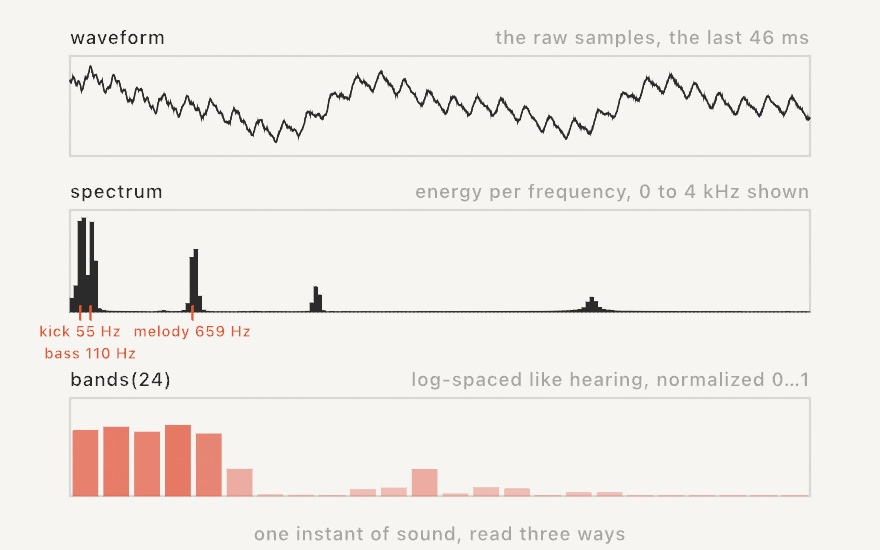
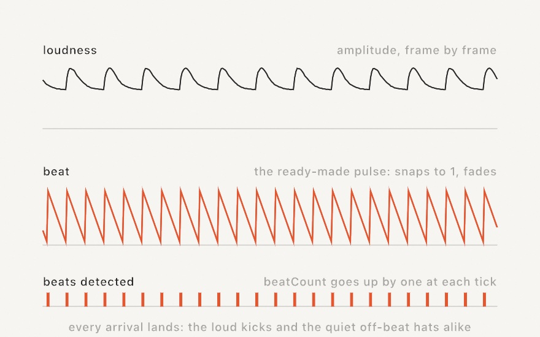
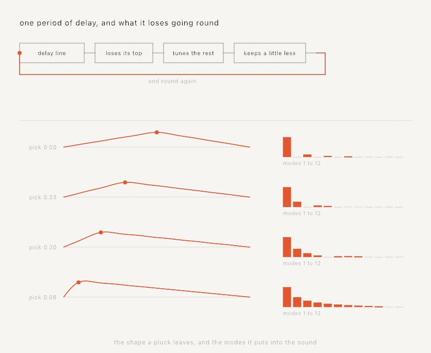
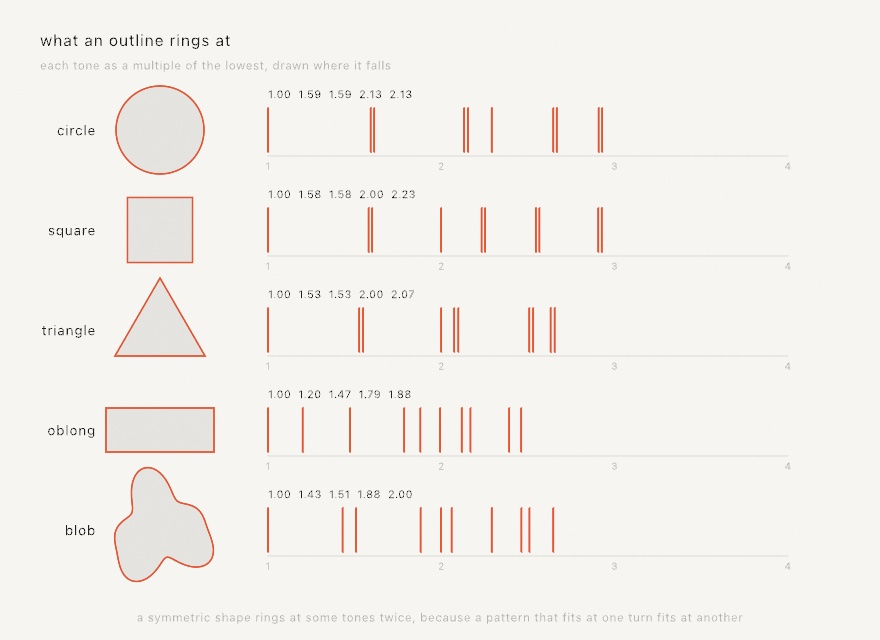
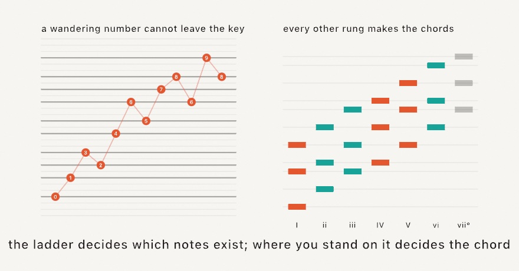
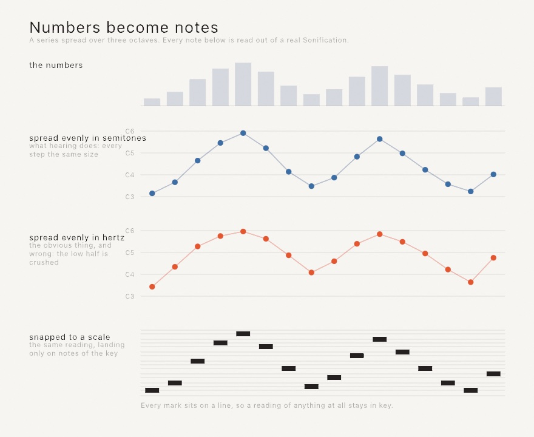
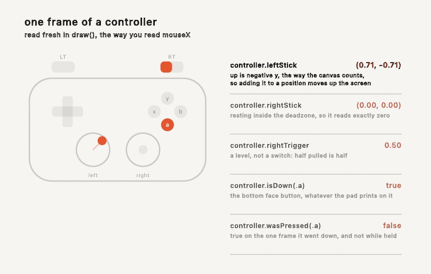

#### <sup>[Ollin](../README.md) → [Guide](README.md) → Chapter 23</sup>

---

# 23. Sound and control


Every sketch so far has listened to two things, the clock and the mouse. This chapter adds ears and hands. The ears come first. A microphone or a song becomes a handful of numbers you read in `draw()`, and the picture moves with the music. Then come the hands. A hardware knob, a phone fader, or the inspector slider drives the same parameters, and a running sketch becomes something you play. The piece above is doing both at once, and by the end you'll have built it.

## The first listening sketch

Sound reaches a sketch through `OllinAudio`, a small library you import alongside the framework. The simplest start is the microphone and one number, `amplitude`. That is how loud things are right now, roughly `0...1`, smoothed so it doesn't flicker.

```swift
import Ollin
import OllinAudio

final class Pulse: Sketch {
    let mic = AudioInput()

    override func setup() { try? mic.start() }

    override func draw() {
        background(.black)
        fill(.white)
        drawCircle(width / 2, height / 2, (60 + Double(mic.amplitude) * 700) * scale)
    }
}
```

Run it with `swift run OllinLive` like any sketch, say yes when macOS asks about the microphone (it asks once), and hum. The circle breathes with you. That's the whole shape of audio-reactive work: make a source in `setup()`, keep it in a property, read its values every frame. The rest of the chapter is just richer values to read.

> **Swift note.** `amplitude` is a `Float`, because audio hardware speaks 32-bit floats. Drawing wants `Double`, so you'll see `Double(mic.amplitude)` around every audio read. It's a conversion, not a calculation; nothing is lost that your eyes could see.

## A microphone we can print

A guide has a problem a live sketch doesn't. Every figure in these pages must render the same way on any machine, and no two rooms sound alike. [Chapter 22](22-DepthAndThePhone.md) solved this with a pretend depth camera, and this chapter fakes a microphone. `StageMic` is about thirty lines at the bottom of [`Anatomy.swift`](Figures/23-SoundAndControl/Anatomy.swift), the committed figure. It synthesizes a little band, then feeds the samples into a real `AudioAnalyzer`, the same analysis engine behind `AudioInput`. The band is a kick drum every half second and a hat between the kicks. Over that sit a held bass note, a slow four-note arpeggio, and a whisper of hiss. Every audio number in this chapter comes out of that analyzer, exactly as it would from the air. Only the air is missing. Swap `StageMic` for `AudioInput()` in any figure and it listens to your room instead.

The analyzer is worth meeting directly, because it's also the seam for sounds Ollin hasn't heard of. It's public, so anything that can produce a stream of samples can feed one.

## What the analyzer hears

Sound arrives as **samples**, which are measurements of air pressure, 44,100 of them per second. A microphone hands the analyzer that stream, and the analyzer answers three questions about the most recent instant.



The top panel is the **waveform**, the samples themselves. One big slow swell, the kick's low thump mid-decay, carries fast wiggles on it, which are the melody. It's the honest raw material, and mostly you'll draw it only when you want an oscilloscope look.

The middle panel is the **spectrum**, and it's the reason audio-reactive visuals work at all. Sound is vibration, and pitch is how fast the vibration is. A low note shakes the air few times a second, and a high note many more. The rate is measured in hertz, meaning cycles per second. The spectrum splits the instant into how much energy sits at each speed, like a prism splitting light into colors. Suddenly the mix is legible. The kick's 55 Hz thump, the bass note at 110 Hz, and the melody near 659 Hz each get their own spike. The tool that computes this split is the Fourier transform. The analyzer runs it for you every frame, and `spectrum` is the result, an array of magnitudes from low frequencies to high.

Raw spectra are awkward to draw, though. The values are unnormalized, and the interesting musical action crowds into the first few bins. That is because hearing is logarithmic, so every doubling of frequency sounds like one equal step. That step is what an octave is. So the bottom panel is the read you'll actually use, **`bands(_:)`**:

```swift
for (i, level) in source.bands(24).enumerated() {
    let h = Double(level) * 300 * scale           // level is already 0...1
    drawRect(Double(i) * 34 * scale, height - h, 30 * scale, h)
}
```

`bands(24)` gives 24 bars spread the way hearing is, log-spaced, so the bass isn't crammed into one bar. Each is normalized to roughly `0...1` by a gain that adapts to the material. Each rises fast and falls gently, so bars look alive instead of jittery. A bar's height becomes a plain map to pixels, no hand-tuned scaling. Ask once per frame, with a fixed count.

Between the raw spectrum and the shaped bands sit three named conveniences, `bass`, `mid`, and `treble`. They are the energy in the low, middle, and high ranges. There is also `magnitude(in: 40...120)` for a range you pick yourself. Those are unnormalized like the spectrum, so scale them to taste.

## Hearing the beat

Loudness and spectrum answer "how much", but the other thing music has is **arrivals**. A drum hit is a moment, not a level. A visual that flashes on the drum reads as listening in a way a level meter never does.



The detector behind this compares each instant's spectrum with the one just before and adds up the rises. A sudden brightening across many frequencies at once spikes that sum, and the analyzer counts it as a beat. A drum hit, a plucked string, and a note starting all do that. Three reads surface it:

```swift
source.beat            // a 0...1 pulse: snaps to 1 on each beat, fades over ~0.25 s
source.beatCount       // how many beats so far
source.timeSinceBeat   // seconds of audio since the last one
```

`beat` is the ready-made value, so multiply a radius by it and the picture throbs. `beatCount` is for firing something exactly once per beat, by comparing against a stored count, the way the finished piece spawns sparks. Look at the timeline, where every kick lands and so does the quiet off-beat hat, with the same confidence. That's what the detector really is. Onset detection hears *arrivals*, sudden changes in the sound, not loudness and not "the beat" a drummer would tap. A soft hat is as sudden as a loud kick, so both count. For most visuals that's exactly what you want. When it isn't, `beatSensitivity` is the knob, and a higher value asks for stronger arrivals before firing. The detector is deliberately steady the rest of the time, so held chords and drones don't drift into false triggers. The same recording always beats in the same places.

## Four places sound comes from

Everything above reads the same off any source, so choosing a source is one line:

```swift
let mic = AudioInput()                                         // the room
let song = try AudioPlayer(resource: "track", withExtension: "m4a", in: .module)
let tone = Tone(frequency: 220, waveform: .sine)               // a note of your own
let sound = Soundtrack(of: player)                             // a playing video's audio
```

`AudioInput` is the microphone, permission and all. `AudioPlayer` plays a file and analyzes it as it sounds, taking `.m4a`, `.mp3`, `.wav`, and friends. The `Audio/FilePlayer` example ships with a violin recording and shows the shape. It's also the source that survives export. During a headless render it follows the export clock through the file, so an audio-reactive piece writes the same frames every time. [Chapter 25](25-SharingAndPerforming.md) has the whole export story. `Tone` is a modest oscillator that both sounds and feeds the analyzer, which makes it the self-contained option. The `Audio/Spectrum` example generates a gliding sawtooth and draws its own harmonics, with no permission and no file. And `Soundtrack` taps the audio of a playing `VideoPlayer` from [Chapter 24](24-Seeing.md)'s territory, so footage can drive visuals with its own music. One habit applies to all four. An audio file you bundle follows the same license care as any asset, so credit what you ship.

## Words, and what that noise was

Everything so far reads sound as a shape: how loud, which frequencies, when the beat landed. A sketch can also ask what it is hearing. Two listeners answer that, and both attach to any of the four sources above.

```swift
let mic = AudioInput()
var speech: SpeechListener!
var ears: SoundClassifier!

override func setup() {
    speech = SpeechListener(of: mic)
    ears = SoundClassifier(of: mic)
    try? mic.start()
}
```

That is two things listening to one microphone, which is fine. The source is tapped once, and the audio goes to everything attached to it, a `Soundtrack` analyzer included.

`SpeechListener` turns talking into words. It runs on your Mac, nothing is uploaded, and it asks for no permission of its own. The microphone asks for its own the first time you start it. The first use of a language may install its model, which takes a moment, and until then `unavailableReason` says so.


The left half of that figure is the thing worth understanding before you write any of this. Recognition guesses early and corrects itself as it hears more. Each line there is the same recognizer handed a little more of the same sentence. Three quarters of the way through it was sure the fox jumped over the lace. It was not wrong to say so; it just had not heard the rest yet.

So a listener gives you two reads, and they are for different jobs:

```swift
drawText(speech.caption, at: center)              // the guess, which may change
for phrase in speech.phrases() {                  // what it committed to
    if phrase.text.lowercased().contains("red") { palette = .warm }
}
```

**Draw the guess, act on the commitment.** `caption` is the running best guess, tail and all. It is trimmed to its last handful of words, so it does not run off the canvas. `phrases()` drains what the recognizer has finished with, each phrase handed out once, which is what makes it safe to trigger from. Trigger from `caption` and you will act on a word that gets taken back.

The other listener names sounds. `SoundClassifier` knows three hundred everyday ones, from `clapping`, `dog_bark`, `knock`, `glass_breaking`, and `police_siren` through every instrument family to `silence`. It too splits into a level and a trigger:

```swift
let musical = ears.confidence(of: "music")                   // rises and falls
for event in ears.events() where event.label == "clapping" { // happens once
    marks.append(Mark(at: center))
}
```

An event fires when a label crosses the threshold from below. A sound that goes on is one event, not one per moment it is still going. `timeSinceHearing("clapping")` is the read for a mark that fades, since draining is destructive and fading is not.

The right half of the figure is the caution. Those three sounds are arithmetic, not recordings. They are a sine wave, a tap every quarter second, and bursts of noise. The classifier called them a tuning fork, a click, and a hammer, which is fair enough. But it always answers, whatever it hears, so a small number means very little. Read the top label, keep a threshold, and treat the rest as opinion.

Both of these are live only. Under an export nothing is playing, so nothing is heard, and both will tell you so instead of going quiet. When an exported piece needs words, work them out first:

```swift
override func setup() {
    caption = try? waitFor {
        try await SpeechListener.transcribe(resource: "voice", withExtension: "m4a", in: .module)
    }
}
```

That form is deterministic, which is the same promise the seed made in [Chapter 4](04-Randomness.md). The same audio gives the same words every time, so a captioned export renders identically on Tuesday. The `Audio/Listening` example is the live one, with a caption you can talk into and marks you can clap at.

## A sketch that plays

`Tone` sounds one note forever, which is enough to feed the analyzer and not much else. When you want the sketch to actually play something, the instrument is `Synth`, and asking it for a note is one line:

```swift
let synth = Synth(.pluck)

override func mousePressed() {
    synth.play("C4", for: 0.4)
}
```

Nothing was started. The first note starts the engine, because forgetting to is otherwise the most common way to end up staring at a silent sketch. Pitches are written however you already think of them. `"C4"` is a name, `60` a MIDI number, and `60.5` the quarter tone between the keys. And `for:` is how long to hold it, so the note ends without being told to again.

Notes that outlive one call are the other half, which is what a held key wants:

```swift
synth.noteOn("C4")     // sounds until told otherwise
synth.noteOff("C4")
```

A `Synth` plays several notes at once, sixteen by default, so chords and overlapping tails work without any bookkeeping from you. When they run out, the next note takes one from whatever is already fading, rather than from anything you are still holding. A melody over a held chord takes its voices from its own earlier notes.

**What a note is made of** is a `Voice`, and the presets are the quick way in: `.pluck`, `.bass`, `.pad`, `.bell`, `.stab`, `.breath`, `.sine`. Assigning a new one leaves sounding notes alone, so you can change instrument between notes:

```swift
synth.voice = .bell
```

Inside a voice, the part worth understanding first is the envelope. It is what makes a bell a bell and an organ an organ, using the same wave underneath.


Four numbers, and only three of them are times. `attack` is how long the note takes to arrive, and `decay` how long it takes to settle. `release` is how long it takes to go once let go. `sustain` is the odd one out. It is the *level* the note rests at while held, not a duration. Set it to zero and holding the key adds nothing at all, which is exactly what struck things do. That is why `.percussive` sounds like a drum however long you lean on it.

You can draw the shape you designed, which is what the figure above does:

```swift
Envelope.swell.level(at: 0.7, heldFor: 1.4)   // where a note has got to
```

The other half of a voice is the `filter`, and it is most of what people mean when they say something sounds like a synthesizer. A note that is bright when struck and darkens as it fades is not the wave changing. It is a filter closing over it. `Voice.Filter.sweep(from:by:)` is that gesture, and `.pluck` is built from it.

Finally, a `Synth` is an `AudioSource` like the microphone is, so everything earlier in this chapter reads off the sketch's own playing:

```swift
drawCircle(width / 2, height / 2, 100 + Double(synth.amplitude) * 900)
```

That closes the loop the chapter opened with. A sketch that listens to the room can listen to itself instead, and then the picture and the sound are the same decision made once. The `Audio/Synth` example is a playable keyboard doing exactly that.

## Building an instrument instead of choosing one

A `Voice` is a fixed chain. Something makes a wave, an envelope shapes it, and a filter takes part of it away. Every preset so far is that chain with different numbers in it. The tier underneath is where the wiring itself is the value.

```swift
let bell = Patch.tone(.sine)
    .modulated(by: .tone(.sine, ratio: 3.5), index: 4)

synth.voice = Voice(patch: bell, envelope: .percussive)
```

This is the same relationship the drawing side has had since [Chapter 1](01-HelloOllin.md). `drawCircle` sits on a `Drawer` that can do more, and the voice presets sit on this. Nothing about `Synth(.pluck)` changes because it exists.

An **operator** is one oscillator with a frequency, a level, and possibly something pushing it. Its frequency is a *ratio of the note* rather than a pitch, so a patch is an instrument and not a chord. Ratio 1 is the note, 2 the octave above, and 3.5 something that is not a note at all.

The reason to bother is one sentence. **A filter can only take harmonics away, and a sine has none to take.** Modulation puts them in. Turn `index` up on a sine being pushed by another sine and it becomes brass, and no amount of filtering would have got you there. Move the ratio off a whole number and it becomes metal. Its tones no longer land on the note's own harmonics, so they belong to no pitch in particular. That is the whole of why `.bell` uses 3.5.

`Examples/Audio/Patching` puts both knobs under your hand with the graph drawn as it is wired.

There is a constraint worth knowing about, because it explains the one number in the API that looks arbitrary. A patch travels to the audio thread inside a note, through a queue of slots that already exist. It has to be something copyable a word at a time, with no arrays, no references, and nothing to allocate. So the operators live in fixed lanes and there are eight. A patch that would need more comes back unchanged and says so, rather than quietly dropping one. A patch with a piece missing is a different instrument, and finding that out by ear is worse than reading it in the log.

### And the rest of the instrument

A patch says what the sound is made of. What happens to it afterwards is a chain, written the same way:

```swift
synth.effects = [
    .distortion(Distortion(.softClip, mix: 0.3)),
    .delay(Delay(time: 0.28, feedback: 0.5)),
    .reverb(Reverb(.hall, mix: 0.4)),
]
```

Order is the point, and it is the reason this is a list and not a pair of switches. An echo of a distorted sound and a distorted echo are different things: one repeats something dirty, the other dirties the repeats. Swap those two lines and you can hear which you have.

`synth.reverb = Reverb(.hall)` still works, and now means "put one room in the chain, or replace the one that is already there". Most sketches never need more than that, and the ones that do are not stuck with two slots.

Changing a setting costs nothing. Changing which effects are in the chain rewires it, and that happens on the running engine rather than around a stop. Measured on this wiring, reconnecting while it plays costs nothing you can hear.

## An instrument somebody recorded

Everything in this chapter so far is worked out as it goes. The other way round is to start from a recording.

```swift
synth.instrument = SampledInstrument.builtin
synth.voice = Voice(sampled: Sampled(), envelope: .plucked)
synth.play("C4", for: 1.5)
```

Ollin bundles one small instrument so you can hear this without downloading anything: a struck bar recorded at five pitches. Playing a note means finding the nearest recording and moving it.

Moving it is the whole model, and it is also the whole limitation. A recording plays at another pitch by being read faster or slower, which moves its pitch and its length *together*, exactly as a tape does. Move it far enough and the instrument audibly changes size. High notes go thin and hurried, and low ones slow and heavy. `Examples/Audio/Sampler` has a key that swaps five recordings for one stretched over everything, and the difference is not subtle. That is why real libraries ship hundreds of recordings rather than one, and why the nearest is always chosen.

There is a design detail here worth noticing, because it is the same constraint from a page ago wearing a different hat. The recordings are set on the **synth**, not inside the `Voice`:

```swift
synth.instrument = piano          // which recordings
synth.voice = Voice(sampled: ...) // how to play them
```

A `Voice` travels to the audio thread inside a note and has to be copyable a word at a time. That is why a struck body caps at sixteen tones and a patch at eight operators. Recordings are megabytes on the heap and cannot ride along at all. So they stay put and the note carries only a handful of numbers. The constraint did not go away. It decided the shape of the API.

To load a real instrument, the format is **SFZ**. It is a text file listing which audio file answers which notes, with the audio beside it.

```swift
let piano = SampledInstrument(sfz: "Piano.sfz", in: .module)
```

Where to find them, and the licences, are on the [Synthesis](../Docs/Helpers/Synthesis.md#where-to-find-instruments) page. Here is the short version. [VCSL](https://github.com/sgossner/VCSL) and [VSCO 2 Community Edition](https://versilian-studios.com/vsco-community/) are CC0, so you can do anything with them, including ship them. [Freesound](https://freesound.org/) is per-clip and mixes CC0 with non-commercial, so check each one. The [Philharmonia](https://philharmonia.co.uk/resources/sound-samples/) samples are free to make music with, but explicitly not free to pass on as a sampler instrument. That distinction is worth reading before you build something on them.

## A string, worked out rather than drawn: the plucked string

Every voice so far starts with a wave, a shape an oscillator traces over and over. You then carve it with an envelope and a filter until it sounds like something. That works, and it is what most synthesizers are. But it is a description of a result, and there is another way in.

```swift
let synth = Synth(.steel)
synth.play("E3", for: 3)
```

That is a string. Not a recording of one, and not a wave shaped to resemble one. It is a length of something under tension, with a disturbance running up and down it, worked out sample by sample as it goes.



The top of that picture is the whole model. A delay line one period long is the disturbance travelling. A filter in the loop is what the string loses at each end, taking more off the top than the bottom. And a little less comes back each time round than went out. Feed a burst of noise into it and it turns into a note by itself.

What makes this worth the trouble is what you get without asking. The note attacks like a string because that is what a disturbance settling into a loop does. It darkens as it rings, because the top is lost faster than the bottom, so a long note changes color with nothing moving. And it responds to *where you pluck it*:

```swift
var string = PluckedString.steel
string.pick = 0.5              // halfway along
synth.voice = Voice(string: string)
```

The lower half of the picture is why. A string held at a point cannot move there, so every mode with a node under your finger gets nothing. Pluck halfway along and every even mode is missing, which is the hollow tone in the top row's gaps. Pluck near the end and they are all there, thinly, which is the nasal sound of a guitar played by the bridge. The shape on the left and the bars on the right are the same fact drawn twice.

`Examples/Audio/Strings` is six strings you click on, wherever you want to pluck them, and the shape it draws on each one is those same modes.

Three more things are worth knowing. `hardness` is how quickly you let go, which decides how much of the string you set moving. `decay` is how long the note rings, and `damping` is how much sooner the bright part goes than the low part. And a string decides its own fade, so the envelope's job is to stay out of the way. Ask for a note long enough to let it finish, or the release will cut it off mid-ring.

The tuning is the part you would never think to check and would certainly hear. A loop has to come out exactly one period long, and a whole number of samples cannot do that. At the bottom of the keyboard the rounding error hides in a loop hundreds of samples long. At the top, where a period is ten samples, rounding is out by most of a semitone. So the fraction left over is handled by a filter that supplies a fraction of a sample. The loop filter's own delay is counted into the same budget, which is why turning `damping` up cannot pull the note flat.

## A shape you can hit: modal synthesis

A string is one length of one thing, and its model is one loop. Something struck is different. Hit a plate or a bell or a sheet of glass and it does not make a wave at all. It makes a handful of pure tones at once, each fading at its own rate.

Which tones is the interesting part, because it is decided by the object's shape and by nothing else.

```swift
let synth = Synth(.chime)
synth.play("C4", for: 4)
```

That is a bell, from a list of ratios a bell founder would recognize, and `.drum`, `.bar`, `.wood`, and `.glass` are beside it. But a list is not the point. The point is that the list can come from an outline you drew:

```swift
let outline = textToShapes("O").first!
let bell = StruckShape(outline)                 // once, in setup()

override func mousePressed() {
    synth.voice = Voice(body: bell!.body(struckAt: Vector2(mouseX, mouseY)))
    synth.play("C4", for: 3)
}
```



Nothing in that picture was chosen. Each row is the outline beside it, measured. The circle's ratios are the zeros of the Bessel functions, which is what a real drumhead rings at. They run 1, 1.59, 2.13, and 2.30 in turn. The square comes back at 1, 1.58, 2, 2.24, which is what a real square membrane rings at. The blob comes back at whatever a blob rings at, and nobody has a name for that.

The reason it works is simple. A flat thing held at its edge can only vibrate in the shapes that fit inside its outline, with nothing moving at the rim. Ask which those are and you have asked an eigenvalue problem, and the frequencies are the square roots of its answers. Ollin measures the outline onto a grid and solves it.

Look again at the pairs. The circle, the square, and the triangle each show most of their lines doubled up, and the blob shows none. That is symmetry. A pattern that fits a circle at one rotation fits it at another. So there are two of them, and they ring at the same frequency. An outline with no symmetry has nothing to double. A real drum does this too, and a real drum is never quite round. Its pairs sit fractionally apart and beat against each other, which is part of why a drum sounds alive.

Two practical things. **Measuring is the expensive part and striking is free**, so measure in `setup()` and keep the `StruckShape`. And **where you hit it decides which tones answer**. A tone that holds still under your finger gets nothing, which is the pick position again in a different costume. Hit a circle exactly in the middle and most of its tones stay silent. Most of them have a line of stillness straight through the center.

`Examples/Audio/StruckShapes` is six of these you can click, and the bars under each one move as you move where you hit it.

## A note you keep playing: bowed and blown

The string and the shape have something in common that is easy to miss. Both are set going once. You pluck, or you strike, and the whole note is decided at that instant. Everything after is the thing fading.

A bow is not like that, and neither is a breath. They keep happening, so the note has a middle, and the middle is yours.

```swift
let synth = Synth(.cello)
synth.noteOn("G2")

override func draw() {
    synth.drive = 0.3 + 0.5 * abs(sin(time * 2))   // still playing it
}
```

`drive` is how fast the bow is being drawn, or how hard the tube is being blown. It is read every sample, so moving it moves the note that is already sounding. At zero there is nothing to hear, because nothing is being done. This is the one thing an envelope cannot give you. An envelope is decided when the note starts, and this is whatever you are doing right now.

Two things fall out of the models rather than being settings. Both are the kind of detail that tells you a model is doing its job.

**Bow too fast for the force and the note breaks.** The string tears loose from the rosin twice per cycle instead of once, and it jumps to the octave. That is exactly what over-bowing sounds like on a real instrument, and nothing in the code puts it there. It is what the friction curve does when you push past it. Press harder or draw slower and it settles back.

**The clarinet has no even harmonics.** Nothing filters them out. The tube is stopped at the reed and open at the far end, so it fits a quarter of a wave rather than a half. A tube like that supports the odd harmonics and not the even ones, which is why it sounds hollow and woody. It also plays an octave and a fifth below an open tube of the same length, instead of an octave below. The whole of that is one line deciding the loop is half a period long rather than a whole one.

`Examples/Audio/Bowing` is both of them under the mouse. Hold to play, move up and down to lean on it, and press `B` to swap the bow for a reed.

## Music the sketch works out for itself

A synth answers what a note sounds like. It says nothing about which notes there are, or when. That half is the composition types, and the thing they have in common is that not one of them can tell the time.

Each answers a step number. Step 0, step 1, step 2, forever. Turning the sketch's clock into step numbers is one small counter's job:

```swift
var counter = StepCounter(perBeat: 4)

override func draw() {
    for step in counter.steps(upTo: time * 2) {     // 120 beats a minute
        synth.play(60, for: 0.1)
    }
}
```

It hands back a range rather than a single step. At any real tempo a frame lasts longer than a step, and a step that fell inside the frame still has to be played.

Keeping the clock outside is what makes the rest portable. `time * 2` today; a beat detected in whatever is playing in the room; a drum machine's own clock arriving over MIDI later in this chapter. None of what follows changes.

**`Rhythm` decides when.** Ask for a number of strikes over a number of steps and it spreads them as evenly as whole steps allow:

```swift
let rhythm = Rhythm(5, in: 16)
if rhythm[step] { synth.play(60, for: 0.1) }
```


Read the gaps column. However many strikes you divide over sixteen steps, the gaps come out in at most two lengths, and those two differ by one. That is the whole idea. What falls out of it is the surprise. `Rhythm(3, in: 8)` is the Cuban tresillo, and `Rhythm(5, in: 8)` the cinquillo. `Rhythm(7, in: 12)` begun three strikes in is the bell pattern played across west Africa and, after it, much of the Americas. An algorithm written for timing pulses in a particle accelerator turns out to produce the rhythms people were already playing.

The named ones are on the type, so you rarely have to remember which numbers. They are `.tresillo`, `.cinquillo`, `.bellPattern`, `.bossaNova`, `.samba`, `.aksak`, and a few more. Or write one out, which is what you want when the pattern is already in your head:

```swift
let clave: Rhythm = "x..x..x...x.x..."
```

**`Scale` decides which.** It turns whole numbers into notes, so a number arrived at any way at all stays in key:

```swift
let key = Scale(.minorPentatonic, root: "A3")
synth.play(key[step])
```

Degrees run past both ends: `key[5]` is an octave up, `key[-1]` the note below the root. This is the piece that does the most work for the least code. Feed a wandering number through a scale and it cannot play a wrong note.

Sometimes the number came from somewhere that is not music, like a mouse position or a sensor reading. Then `snap` moves it to the nearest note of the scale instead:

```swift
synth.play(key.snap(Pitch(40 + mouseY / 12)))
```

**`Chord` and `Arpeggio` decide what goes together.** A chord can be named, as `Chord("A3", .minorSeventh)`. It can also be built out of the scale, by taking every other note:

```swift
key.chord(on: 0)     // a triad on the root
key.chord(on: 1)     // a triad on the second degree
```

On a major scale those come out major and minor from the same call. That is the point of building a chord out of a key. The quality follows from where in the scale you started. Changing the key changes the chords along with it, rather than fighting them.



An `Arpeggio` plays a chord one note at a time, and like a rhythm it answers a step number:

```swift
let arp = Arpeggio(Chord("A3", .minorSeventh), .upDown, octaves: 2)
synth.play(arp[step], for: 0.1)
```

Read it at the step, rather than counting the notes you have played so far. That keeps the figure in its place in the bar, instead of restarting every time the rhythm strikes.

**`MarkovChain` decides what next.** Show it a phrase and it learns what tends to follow what:

```swift
var melody = MarkovChain(learning: [0, 2, 4, 2, 0, -3], seed: 4, loops: true)
melody.start(at: 0)

synth.play(key[melody.next() ?? 0])
```

`order` is how far back it looks. At 1 each element is picked from whatever followed the one before it. At 2 it looks at the last two, which tracks the source more closely and invents less. It is seeded, and it keeps its own generator rather than borrowing the sketch's. Adding one cannot shift anything else you were drawing at random.

Four small pieces, and together they are a piece of music:

```swift
for step in counter.steps(upTo: time * 104 / 60) {
    if pulse[step] { bass.play(key[melody.next() ?? 0], for: 0.34) }
    if figure[step] { chords.play(key.snap(arp[step]), velocity: 0.55, for: 0.22) }
}
```

That is `Examples/Audio/Generative`, drawn as three of those rings turning on one step count. The key, the figure, and the tempo are knobs you move while it plays. All of it repeats. The same seed gives the same melody, and the same two numbers give the same rhythm. A generated piece is something you can come back to, not something you had to be there to catch.

## Chords that come out of a key

The scale gave every number somewhere safe to land. Chords are the same idea one level up, and the useful way to write them down is as *degrees* rather than as names.

```swift
let changes = Progression("I vi IV V", in: Scale(.major, root: "C3"))

for step in counter.steps(upTo: time * 2) {
    pad.play(chord: changes.pitches(at: step), for: 1.8)
    bass.play(changes.root(at: step).transposed(by: -12), for: 1.6)
}
```

Degrees, because that is the fact that survives changing key. `I vi IV V` is the same progression in every key there is. Writing it this way means the qualities fall out of the scale, instead of having to be said. The same four numbers come out major in a major key and minor in a minor one, with nothing changed. `Examples/Audio/Changes` puts the key on a knob so you can hear that happen while it plays.

There are named ones (`.pop`, `.blues`, `.twoFiveOne`, `.andalusian`), and there is a way to leave the cycle:

```swift
let changes = Progression("I vi IV V ii V", in: key).wandering(32)
```

That is the Markov chain from a few pages back, learned off the progression's own moves. It only ever makes a move the original made. Two bars in, it is somewhere the original never went, having got there by steps the original took. Seeded per call, so a wander you like is one you can ask for again.

When the chords do not all come from one key, write them out instead:

```swift
let changes = Progression(symbols: "Dm7 G7 Cmaj7 Cmaj7")
let chord: Chord = "F#m7"
```

Symbols do not survive a change of key and degrees do, which is the whole trade between the two.

## Twelve is a choice: tunings

Everything so far has divided the octave into twelve, because almost all the music you are likely to make does. It is worth knowing that this is a decision and not a law.

```swift
let tuning = Tuning.just.rooted(at: "C3")
synth.play(tuning[degree])
```

A `Tuning` is a list of frequency ratios and the interval they repeat over. It has the same shape as a `Scale`, so indexing degrees and snapping stray pitches work the same way.

Equal temperament is a compromise: it makes every key equally usable by making every interval except the octave slightly wrong. Play a held triad in `.equalTemperament` and then the same triad in `.just` and you can hear what that costs. The equal one beats, slowly and audibly; the whole number one locks and sits still. A piece that never changes key gives up nothing by being tuned the second way.

Past that there are more steps rather than different ones, in `.nineteen`, `.thirtyOne`, and `.quarterTones`. Then there is `.bohlenPierce`, which divides a *third* into thirteen and so contains no octave at all. Doubling a frequency is so familiar that a tuning without it sounds wrong before it sounds strange, and then stops sounding wrong. It works because odd harmonics still line up, which is why it suits the clarinet from earlier in this chapter and suits almost nothing else.

## Playing along with the room: tempo sync

The beat detector at the start of this chapter told you *that* a beat happened. Getting from there to playing in time with one is a bit more:

```swift
lazy var room = BeatFollower(mic)
var counter = StepCounter(perBeat: 2)

override func draw() {
    room.update(at: time)
    for step in counter.steps(upTo: room.beats) {
        synth.play(scale[step % 5], for: 0.2)
    }
}
```

`room.beats` is musical time inferred from what it is hearing. The same `StepCounter` that ran off `time` now runs off the record playing in the room. `room.rhythm(steps: 16)` hands back the pattern it heard as a `Rhythm`, which you can then play against.

Two things it does that are easy to get wrong if you write this yourself. A detector that fires on every eighth note reports twice the tempo, which is the same music. So anything outside a believable range is halved or doubled until it lands inside one. And the tempo is the *middle* of the recent gaps rather than their average. One missed beat doubles a gap, and that moves an average where it does not move a middle.

It hears arrivals rather than the beat a drummer would tap. A steady loop is followed well, and rubato is followed badly. `room.steadiness` is how much to trust it.

## Numbers you can hear: sonification

Everything so far invents what it plays. The other way to fill a scale with notes is to already have the numbers, and read them out.

```swift
let readings = Sonification(table, column: "temperature",
                            in: Scale(.minorPentatonic, root: "A3"))

for step in counter.steps(upTo: time * 2) {
    synth.play(readings, step: step, tempo: 120)
}
```

That reads a column of a table. The same call reads a line across a terrain, `Sonification(land, row: 32)`, or a row of a picture, `Sonification(photo, row: 200)`, as brightness. It answers a step number and owns no clock, like everything else in this tier, so the counter you already have drives it.



Two decisions inside that call are worth pulling out, because neither is what you would write first and the figure is the argument for both.

**Pitch is spread evenly in semitones, not in hertz.** Hearing is logarithmic. The step from 220 Hz to 440 sounds like the step from 440 to 880, though the second is twice the size. Spread a series evenly in hertz and the whole bottom half of your data crushes into the top of the range. That is the middle row of the figure, the same numbers, unreadable. Spread it evenly in semitones and the shape survives.

**Snapping is what makes it music instead of a signal.** The bottom row is the same reading landing only on notes of the key. Nothing about the data changed; it simply cannot play a wrong note now. This is why `Scale` was worth having before there was anything to read.

One more piece, small and easy to skip:

```swift
marker.play(readings.reference(at: 20), tempo: 120)   // 20 degrees, sounded
```

A reference sounds one named value on exactly the same footing as the reading. Without one, a listener needs absolute pitch to know what any note means. With one, every note is heard as above or below something. It is a chart's grid line, in sound. It is the difference between a noise that rises and falls and a measurement you can actually read.

Which is the other reason this exists. A sketch that draws a column can read the same column out loud, from the same numbers, in one more line. `Examples/Audio/Sonification` does exactly that. A line across a landscape is drawn as a profile and played as a tune, with the playhead marking the note sounding. The picture and the sound are two views of one series, and one of them works for someone who is not looking.

## Spatial audio, and sound you can keep

Two things are left, and both are one line each.

A sound can come from a place in the 3D scene, with the camera as the ear:

```swift
cameraShowcase(.autoOrbit())
guard let eye = activeCamera else { return }

synth.place(at: Vector3(2, 0, -3), heardFrom: eye)
```

Both facts arrive in the same call because neither means anything on its own. A position says nothing until something is listening, and where the sketch is looking from is where it hears from. On headphones this is more than loudness. It is how much later the sound reaches one ear than the other, and what a head does to a sound arriving round it. Something behind you is behind you, rather than merely quiet. `Examples/Audio/Spatial` is three chimes standing still and one walking past them.

The other is that a sketch which plays carries its sound out of the window:

```sh
ollin Piece.swift --export-video piece.mp4 --frames 480
```

The file has the music in it. There is no record button and nothing to switch on.

This is worth a moment, because it is the one place in this chapter where an earlier decision is audible. The exporters drive a sketch on a fixed clock with no window and nothing playing. There are no speakers to send notes to, so the notes are written down as the frames are drawn. At the end the soundtrack is rendered through the same code that would have fed the speakers. The renderer could be used that way because it takes events and gives back samples and has no clock of its own. An export is that same code with the waiting taken out.

Which means the sound reproduces exactly the way the picture does. Export the same piece twice and the audio comes back sample for sample identical. A generated piece is something you can come back to, rather than something you had to be there to catch. That is the same promise the seed made in [Chapter 4](04-Randomness.md), arriving in a medium you cannot look at.

The two halves of this section meet, which is worth saying because it would be easy to assume they don't. Placing works by rewiring the audio graph, and an export has no audio graph to rewire. So where each instrument was and where it was heard from get written down as the frames are drawn, exactly the way the notes are. The finished soundtrack is rendered through a listener at the end. A chime that walks past your left ear on screen walks past your left ear in the file. Place from the first frame if you want that. The soundtrack machine is built once, and its shape is fixed then. An instrument that starts playing before it is ever placed will tell you so, rather than quietly coming out in the middle.

## Knobs from anywhere

The hands come next. Since [Chapter 1](01-HelloOllin.md) you've tuned sketches with `@Param` knobs in the inspector. The news here is that the inspector is only one of the hands that can hold those knobs.

**MIDI** is the protocol music hardware has spoken since 1983. Knob boxes, fader banks, pad grids, and keyboards all speak it. A controller sends small messages, and `OllinMIDI` reads them. A knob is a *control change* carrying a number `0...127`, and a pad is a *note* with a velocity:

```swift
import OllinMIDI

let midi = MIDIInput()
override func setup() { try? midi.start() }
override func draw() {
    let level = midi.controlValue(7, default: 0)          // a knob, 0...127
    if midi.isNoteOn(60) { flash() }                      // a held pad
    for message in midi.messages() where message.isNoteOn {
        spawn(message.note ?? 0)                           // each strike, once
    }
}
```

`start()` connects to every device on the system, including ones plugged in later. Which control sends what is the controller's business. So with new hardware, first run the `Integration/MIDIMonitor` example and touch everything. It draws each message as it arrives, and your controller introduces itself.

Knobs aren't the only thing MIDI carries. Gear with a play button also broadcasts its beat as *MIDI clock*. A DAW, a drum machine, and a DJ mixer all do. A `TempoClock` reads that into musical time, so motion lands on the beat instead of near it.

The wire itself is almost comically simple, and knowing that makes everything else make sense. A MIDI clock master sends one tick, twenty-four times per beat, forever. There is no tempo number in the message, no bar count, no position. Twenty-four ticks per beat is the entire protocol, and everything musical you want is derived by counting them.


```swift
lazy var clock = TempoClock(from: midi)
// in draw():
let throb = 1 + 0.3 * clock.beat     // snaps on each beat, eases off
let lap = clock.progress(over: 8)    // a 0...1 ramp every eight beats
```

Counting is why the grid can't drift. Each tick is exactly one twenty-fourth of a beat by definition, so the position is arithmetic rather than an estimate. A sketch left running for an hour is still on the beat. The tempo is estimated, because nobody sends it. That estimate only smooths motion *between* ticks, and never moves the grid itself.

The readers in the figure cover most of what you'll want. `beats` is the running count with a fraction, and `phase` is where you sit inside the current beat as `0...1`. `bar` and `barPhase` are the same idea one level up, over however many beats you declare a bar to be. `progress(over:)` is the one to reach for most. It gives you a ramp that resets every N beats, which is how you make a slow sweep that lands exactly on the downbeat.

`clock.beat` is the same ready-made pulse the analyzer's `beat` gave you earlier in this chapter. A beat-reactive sketch can swap between hearing the room and reading the wire. That is worth knowing when the room is loud and the wire is honest.

Two behaviors to expect from real gear. Pressing play on the master arms the clock, and it starts on the *next* tick rather than immediately. That is the MIDI convention, and it keeps the first beat exact. And some gear, DJ mixers especially, never sends a transport message at all and simply free-runs its clock. `TempoClock` then starts following from the first tick it hears. The `Integration/TempoSync` example rehearses all of this with no hardware, by having the sketch send clock to itself. [The MIDI reference](../Docs/Integration/MIDI.md#tempo-sync-tempoclock) has the full surface.

**OSC** is the networked cousin, the protocol of TouchOSC, Max/MSP, TouchDesigner, and most of the performance world. Messages are named by slash-paths and travel over the network, which means the fader can be a phone on the same Wi-Fi:

```swift
import OllinOSC

let osc = OSCReceiver(port: 8000)
override func setup() { try? osc.start() }
override func draw() {
    let level = osc.float("/fader1", default: 0)          // usually 0...1
}
```

Point TouchOSC (or anything that speaks OSC) at your Mac's IP and port 8000, and its controls land in the sketch. There's an `OSCSender` for the other direction, so a sketch can drive a mixer or a lighting desk too. And you can rehearse all of it with no hardware at all. The `Integration/MIDILoopback` and `Integration/OSCLoopback` examples send to themselves, so the round-trip is visible on any bare Mac.

## One knob, three hands

Reading `controlValue` every frame works, but there's a nicer arrangement. A `@Param` already is a named, ranged value with a control in the inspector. Binding wires an outside source straight onto it:

```swift
@Param(20...400) var radius = 120.0

override func setup() {
    try? midi.start(); try? osc.start()
    midi.bind(controlChange: 7, to: $radius)   // hardware knob, 0...127 → 20...400
    osc.bind("/radius", to: $radius)           // phone fader, 0...1 → 20...400
}
```


Each incoming value is mapped into the parameter's own range and assigned. The sketch keeps reading plain `radius`, without ever knowing who moved it. The inspector slider, the hardware, the phone, and plain assignment in code all stay live at once, and whichever moved most recently wins. One more line makes hardware feel good. Give the parameter a `smoothing:` and every source glides instead of stepping. `.eased(0.3)` is a fixed glide, and `.smoothed` is the adaptive filter that stays steady at rest and opens up under a moving hand. The softening belongs to the knob rather than to the wire.

## Something to hold: game controllers

A knob box is one kind of hand and a phone fader is another. A game controller is a third, and it's the one most people already own.

```swift
import OllinController

override func draw() {
    background(.white)
    ship += controller.leftStick * 6
    if controller.wasPressed(.a) { fire(from: ship) }
    drawCircle(center: ship, radius: 30)
}
```

`controller` is player one, read fresh each frame the way you read `mouseX`. No setup call, no `start()`, no permission.



Three kinds of question, three shapes of answer, and the split is the same one this chapter has been making all along. A stick is a **level**, a number you read every frame like a fader. A button press is a **moment**. `wasPressed` is true on the one frame it went down, and false while you keep holding. A sketch drops one thing per press without counting anything itself. A controller arriving or leaving is both, so `isConnected` is the state and `didConnect` is the moment.

There's no queue to drain here, unlike MIDI, and that's a decision rather than an omission. **A hand can't press and release a button between two frames.** A press lasts something like a tenth of a second, which is several frames. A drum machine can send faster than that, which is why MIDI has `messages()` and this doesn't.

With nothing plugged in, everything reads centered and nothing is pressed. The sketch still runs, so you can write it on a train and try it later. No check is needed at every call site. Ask `isConnected` when you actually want to say "plug one in".

Two things the figure is really about. The sticks read in canvas terms, so pushing up gives a *negative* y value. Then `position += controller.leftStick * speed` moves up the screen. And buttons are named by where they sit rather than by what's printed on them. Button `.a` is the bottom face button, whether the pad in your hands calls it cross or A. A sketch written on one controller works on the other.

Motion is worth knowing about before you plan around it. PlayStation and Switch controllers have gyros; Xbox controllers have no motion sensors at all and never will. The sensors also cost battery, so they stay off until you ask:

```swift
override func setup() { controllerMotion(true) }
// in draw():
if controller.hasMotion { rotate(controller.gravity.x * 0.5) }
```

`hasMotion` is false both when the hardware has none and when nothing has asked for it, so check it rather than assuming. A PlayStation pad also has a touchpad, under `touch` and `isTouching`.

Several people can play. `controller(2)` is player two, and a controller keeps its number while it stays connected. Unplugging player two doesn't turn player three into player two.

Because a controller is live input, an export reads it as centered and says so, the same way the microphone did earlier. The `Integration/ControllerInput` example turns a pad into a drawing instrument. A `map` knob draws every stick, trigger and button as it's read. That is the fastest way to tell whether a controller is talking to the machine at all. See [the controller reference](../Docs/Integration/Controller.md) for the rest, including the deadzone and running while another window is in front.

## Putting it together: a playable instrument

The finished piece wires the whole chapter together. `bands` is worn as a crown of spokes, and a core throbs on `beatCount`. Sparks are flung on each arrival, and two `@Param` knobs wait for whatever hands you have. Make `MySketches/Resonator.swift`, and bring `StageMic` along from [`Anatomy.swift`](Figures/23-SoundAndControl/Anatomy.swift). The committed figure with everything together is [`Resonator.swift`](Figures/23-SoundAndControl/Resonator.swift):

```swift
import Ollin
import OllinAudio

final class Resonator: Sketch {
    let mic = StageMic()

    @Param(24...96) var spokes = 56
    @Param(0.6...2.4) var brightness = 1.4

    struct Spark {
        var position: Vector2
        var velocity: Vector2
        var life: Double
    }

    var sparks: [Spark] = []
    var lastBeat = 0
    var pulse = 0.0

    /// Where the instrument sits: a touch below center, to leave the crown room.
    var mid: Vector2 { center + Vector2(0, 60 * scale) }

    override func setup() {
        seed(20)                              // the sparks re-fly the same way
    }

    override func draw() {
        mic.listen()
        let audio = mic.analyzer

        background(Color(hex: 0x06040E))
        toneMap(.aces)
        blendMode(.add)

        // The beat: snap the pulse up when a new one lands, let it fade.
        pulse *= exp(-deltaTime * 5)
        if audio.beatCount > lastBeat {
            lastBeat = audio.beatCount
            pulse = 1
            spawnSparks()
        }

        // The spectrum, worn as a ring of spokes: bass at the top, treble at
        // the bottom, mirrored left and right so the ring stays symmetric.
        let levels = audio.bands(spokes / 2 + 1)
        withState {
            translate(mid)
            rotate(time * 0.06)
            for i in 0 ..< spokes {
                let band = i <= spokes / 2 ? i : spokes - i
                let level = Double(levels[band])
                let angle = Double(i) / Double(spokes) * .tau - .pi / 2
                let dir = Vector2(cos(angle), sin(angle))
                let inner = 175 * scale
                let len = (14 + level * 290) * scale
                fill(Colormap.magma.color(at: 0.2 + level * 0.75)
                    .withAlpha(0.25 + level * 0.75 * brightness))
                drawOrientedBox(dir * inner, dir * (inner + len),
                                thickness: (3.5 + level * 9) * scale)
            }
        }

        // Sparks from past beats, flying and fading.
        for i in sparks.indices {
            sparks[i].position += sparks[i].velocity * deltaTime
            sparks[i].life -= deltaTime
        }
        sparks.removeAll { $0.life <= 0 }
        noStroke()
        for spark in sparks {
            let a = max(0, spark.life / 0.8)
            fill(Color(hue: 0.09, saturation: 0.5, brightness: 1).withAlpha(a * 0.9))
            drawCircle(spark.position.x, spark.position.y, (1.5 + a * 5) * scale)
        }

        // The core: a warm glow that swells on the beat, a hot center.
        let ember = Color(hex: 0xFFB65C)
        let glowRadius = (185 + pulse * 150) * scale
        fill(.radial(center: mid, radius: glowRadius,
                     Ramp([ember.withAlpha(0.3 + pulse * 0.5), ember.withAlpha(0)])))
        drawCircle(center: mid, radius: glowRadius)
        let coreRadius = (80 + pulse * 60) * scale
        fill(.radial(center: mid, radius: coreRadius,
                     Ramp([Color.white.withAlpha(0.95), Color.white.withAlpha(0)])))
        drawCircle(center: mid, radius: coreRadius)

        blendMode(.normal)
    }

    func spawnSparks() {
        for i in 0 ..< 14 {
            let angle = Double(i) / 14 * .tau + random(-0.15, 0.15)
            let speed = random(200, 380) * scale
            let dir = Vector2(cos(angle), sin(angle))
            sparks.append(Spark(position: mid + dir * 180 * scale,
                                velocity: dir * speed,
                                life: random(0.45, 0.8)))
        }
    }
}
```


Each spoke is a `drawOrientedBox`, which fills a thick bar between two points at whatever angle they happen to lie. A band level turns straight into a spike pointing out from the center. The additive blend and the ACES tone map from [Chapter 16](16-LayersAndEffects.md) are what make the glow feel like light instead of paint. The mirrored bands are an old trick that keeps a spectrum symmetric and calm. Watch it run and the crown breathes with the arpeggio while the core keeps time.

Then make it yours:

- Give it your ears by swapping `StageMic` for `AudioInput()`, starting it in `setup()`, and deleting the `mic.listen()` line (a live source feeds itself). Then play music at your Mac.
- Give it your hands: `midi.bind(controlChange: 7, to: $brightness)`, or bind `/brightness` over OSC and play it from a phone on the sofa.
- Give it your music with an `AudioPlayer` and a favorite track, then tune `beatSensitivity` until the sparks land on the drums.
- Rebuild the crown, since the spokes are only `bands` and trigonometry. Try concentric rings, a horizon of bars, or [Chapter 14](14-FieldsAndFlow.md)'s flow field with its strength driven by `bass`.

## Where this comes from

The idea that any sound splits into pure vibrations is Joseph Fourier's (1822). The fast algorithm that made it real-time, the FFT, is Cooley and Tukey's (1965), and Ollin runs Apple's implementation.

Detecting arrivals by spectral flux is a standard technique from music information retrieval. Bello and colleagues survey it well in their onset-detection tutorial (2005). The real-time recipe Ollin follows is Böck, Krebs, and Schedl's online method (2012).

Hearing a shape has a mathematical name, from Mark Kac's 1966 question "Can one hear the shape of a drum?". It also has an answer. Not always, since two different outlines can ring identically, but you can certainly hear a great deal of it. Working the frequencies out from the outline is modal synthesis. Jean-Marie Adrien set it out for sound, and Kees van den Doel and Dinesh Pai developed it for struck objects.

The plucked string is Kevin Karplus and Alex Strong's algorithm (1983), a discovery in the literal sense. They were building a wavetable synthesizer, and a bug which averaged the table as it played turned a burst of noise into a plucked string. They worked out afterwards why. David Jaffe and Julius Smith published the extensions the same year. It is their version, tuned by an allpass and plucked at a position, that Ollin implements. 
The even spread behind `Rhythm` is Eric Bjorklund's algorithm for timing pulses in a spallation neutron source. Godfried Toussaint connected it to musical timelines in 2005, along with the names of the rhythms it produces. MIDI was created in 1983 by Dave Smith and Ikutaro Kakehashi so rival instruments could talk to each other. It was a rare act of industry peace that still works four decades later. Open Sound Control came from Matt Wright and Adrian Freed at CNMAT, Berkeley (1997), built for the networked, higher-resolution rigs MIDI predates. And the audio-reactive visual itself has a long lineage. It runs from Oskar Fischinger's hand-drawn sound films through the oscilloscope and music-visualizer traditions to today's VJ and live-coding scenes. Full credits are in the project's [attribution notes](../ATTRIBUTION.md).

## Go deeper

- [Audio](../Docs/Helpers/Audio.md): every source and read, `bands`, beats, and feeding the `AudioAnalyzer` yourself.
- [Listening](../Docs/Helpers/Listening.md): the caption and transcript reads, phrases as triggers, languages and their models, the sound vocabulary and its threshold, bringing your own classifier, and the deterministic one-shot forms.
- [Synthesis](../Docs/Helpers/Synthesis.md): `Synth`, pitches, the `Voice` presets and what is inside one, envelopes, filters, delay and reverb.
- [Synthesis](../Docs/Helpers/Synthesis.md#patch): `Patch`, what an operator is, the named patches, and why eight.
- [Synthesis](../Docs/Helpers/Synthesis.md#sampled-instruments): loading an SFZ instrument, what a recording being moved costs, and where to find freely licensed libraries.
- [Synthesis](../Docs/Helpers/Synthesis.md#physical-models): all four models, their settings, why the tuning is exact, how a shape is measured, driving a bow or a breath, placing a sound, and what carries into an export.
- [Composition](../Docs/Helpers/Composition.md): rhythms, scales, chords, progressions, arpeggios, chains, tunings, following a beat, and the counter that joins them to time.
- [Sonification](../Docs/Helpers/Sonification.md): the four sources, how the ends of the data are decided, the reference note, and reading a second series as loudness.
- [MIDI](../Docs/Integration/MIDI.md): messages, the three reads, binding, and sending MIDI out.
- [OSC](../Docs/Integration/OSC.md): addresses and arguments, bundles, binding, and testing with a phone.
- [Parameters](../Docs/Helpers/Parameters.md): the typed `@Param` family, smoothing, and the binding surface.
- Appendix B draws this chapter's math, one picture per idea: [Sound as numbers](B-JustEnoughMath.md#sound-as-numbers).
- Worked examples: [`Examples/Audio/Synth`](../Examples/Audio/Synth/Sketch.swift) (a playable keyboard), [`Examples/Audio/Generative`](../Examples/Audio/Generative/Sketch.swift) (three Euclidean rings deciding what to play), [`Examples/Audio/Sonification`](../Examples/Audio/Sonification/Sketch.swift) (a landscape drawn and read out at once), [`Examples/Audio/Strings`](../Examples/Audio/Strings/Sketch.swift) (six strings you pluck where you click), [`Examples/Audio/StruckShapes`](../Examples/Audio/StruckShapes/Sketch.swift) (shapes that sound like the shape they are), [`Examples/Audio/Bowing`](../Examples/Audio/Bowing/Sketch.swift) (a bow and a reed you keep playing), [`Examples/Audio/Changes`](../Examples/Audio/Changes/Sketch.swift) (a progression whose key you change while it plays), [`Examples/Audio/Patching`](../Examples/Audio/Patching/Sketch.swift) (two operators wired live), [`Examples/Audio/Sampler`](../Examples/Audio/Sampler/Sketch.swift) (an instrument made of recordings), [`Examples/Audio/Spatial`](../Examples/Audio/Spatial/Sketch.swift) (sound placed in a 3D scene), [`Examples/Audio/SoundInAnExport`](../Examples/Audio/SoundInAnExport/Sketch.swift) (a piece that exports its own music), [`Examples/Audio/Spectrum`](../Examples/Audio/Spectrum/Sketch.swift) (self-contained tone analysis), [`Examples/Audio/Microphone`](../Examples/Audio/Microphone/Sketch.swift), [`Examples/Audio/Listening`](../Examples/Audio/Listening/Sketch.swift) (a caption you can talk into and marks you can clap at), [`Examples/Audio/FilePlayer`](../Examples/Audio/FilePlayer/Sketch.swift), [`Examples/Video/SoundReactive`](../Examples/Video/SoundReactive/Sketch.swift) (a video's own soundtrack), [`Examples/Integration/MIDILoopback`](../Examples/Integration/MIDILoopback/Sketch.swift), [`Examples/Integration/MIDIMonitor`](../Examples/Integration/MIDIMonitor/Sketch.swift), [`Examples/Integration/OSCLoopback`](../Examples/Integration/OSCLoopback/Sketch.swift), and [`Examples/Integration/OSCMonitor`](../Examples/Integration/OSCMonitor/Sketch.swift).

---

[Contents](README.md#contents) · Previous: [Chapter 22, Depth and the iPhone as a sensor](22-DepthAndThePhone.md) · Next: [Chapter 24, Seeing](24-Seeing.md)
