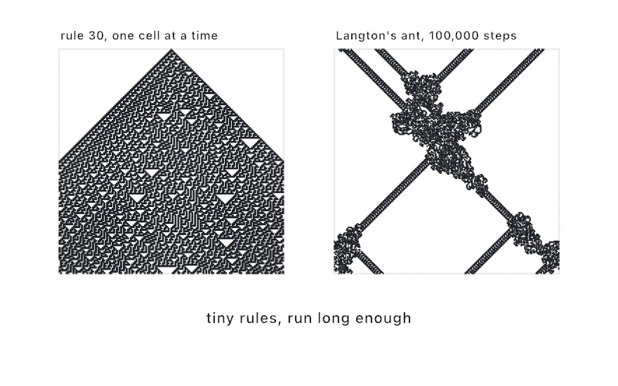
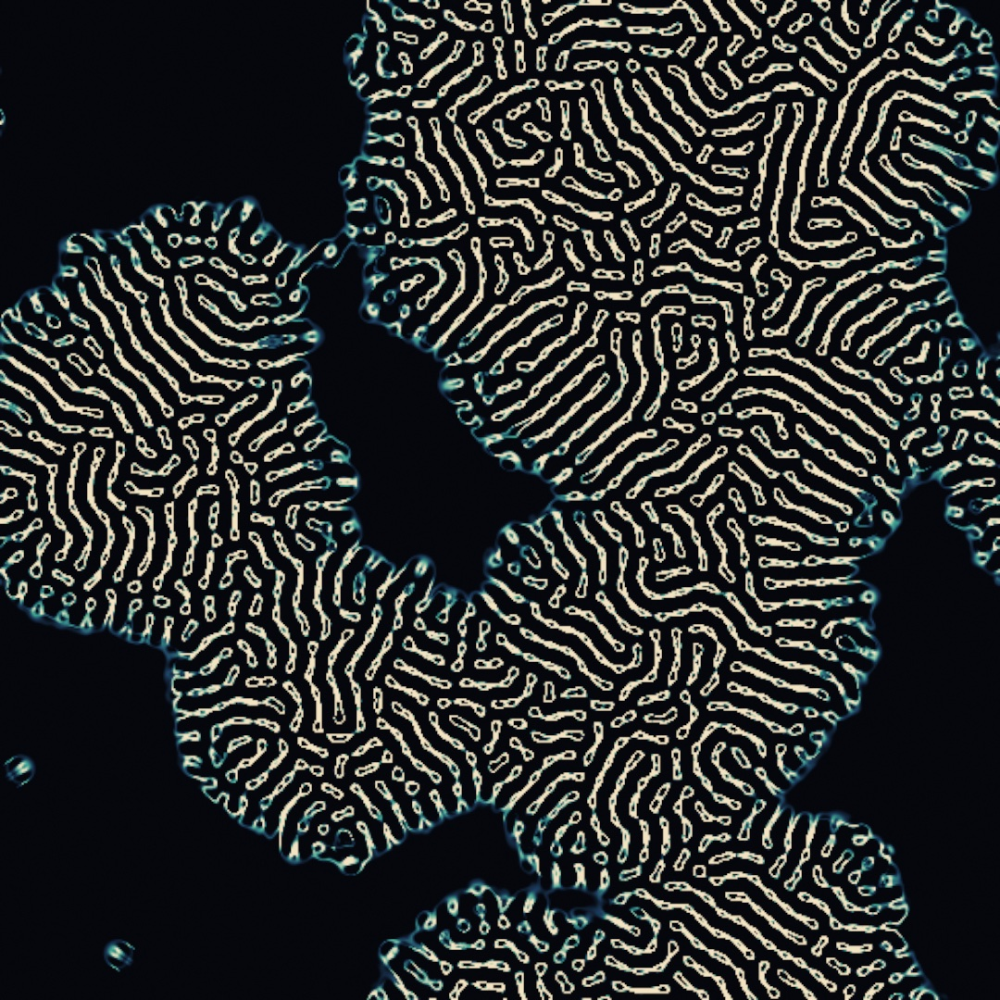
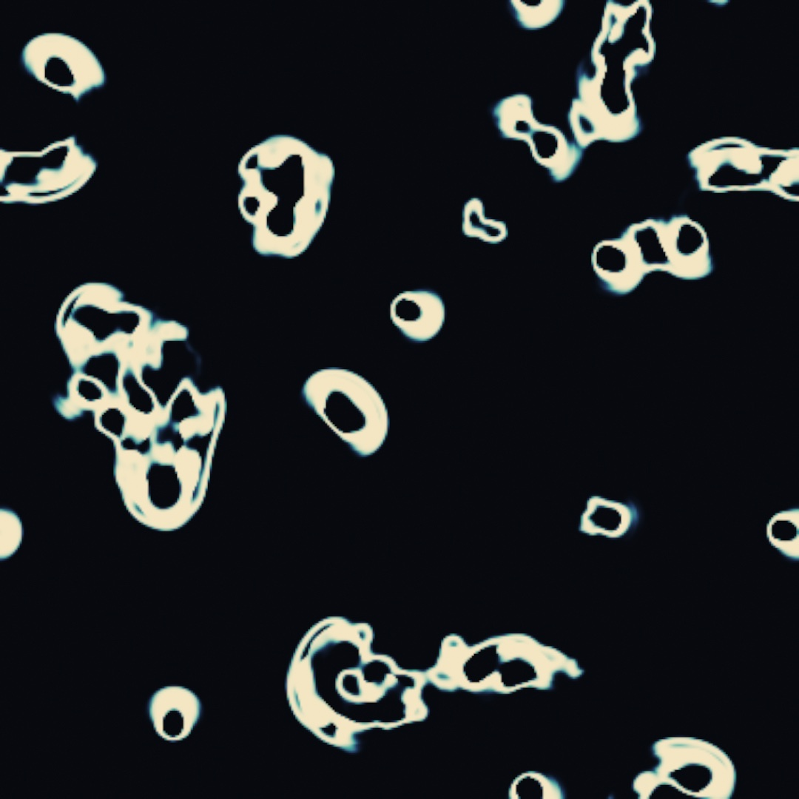
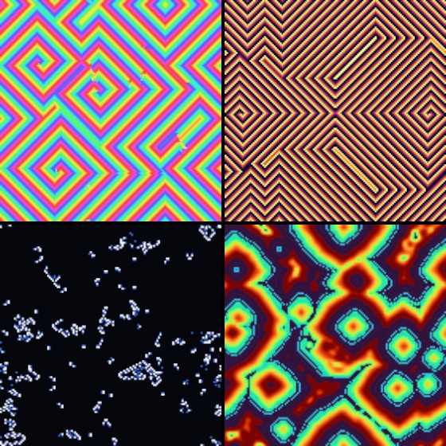
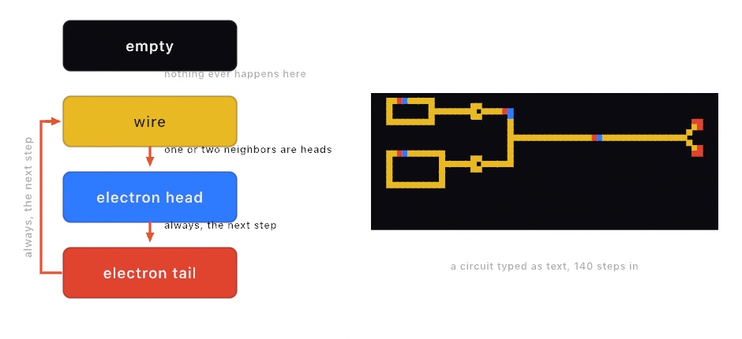
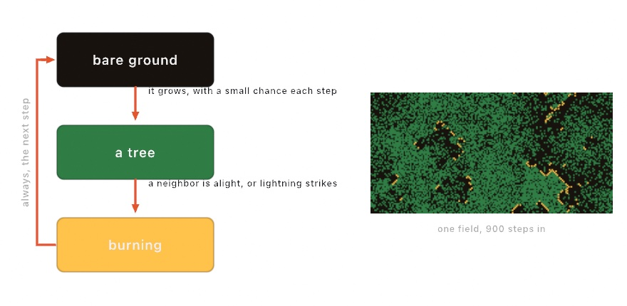
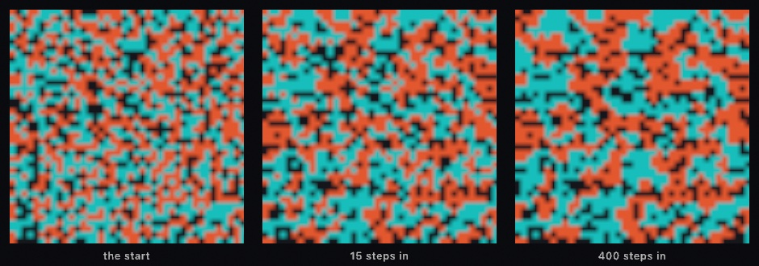
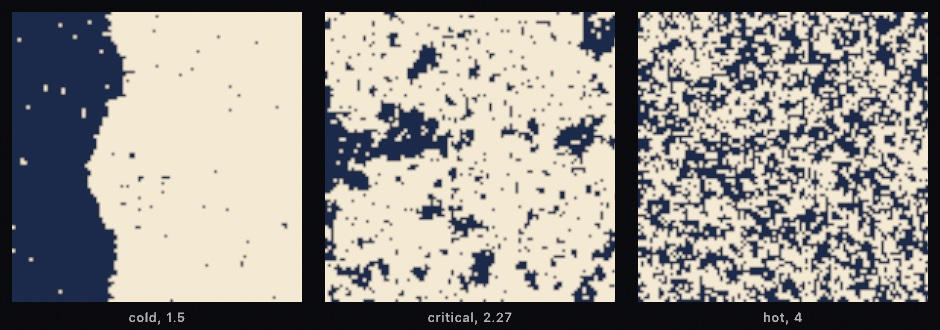

#### <sup>[Ollin](../README.md) → [Guide](README.md) → Chapter 24</sup>

---

# 24. Automata

Sand piles into avalanches, a crowd sorts itself, and a grid of wires carries signals, each from a rule every cell applies to its neighbors. A rule like that is a cellular automaton. Each one shows a local rule giving a global result, and several show that result appearing all at once past a threshold. The automata here run from Wolfram's rows to Wireworld, then come piles and fires, and crowds that cross a threshold together.

## More ways to be an automaton: elementary rules, turmites, Lenia, SmoothLife, excitable media, and Wireworld

[Chapter 23's first field](23-GridSimulations.md#the-game-of-life-a-first-field) was the Game of Life, one rule on one grid. It is the best known of a whole family of such rules, and Ollin ships several more. Two of them are cheap enough to run on the CPU, and they hand you plain arrays instead of a field. The rest are fields like Chapter 23's, each with a seed of its own kind.

### A single row of cells: Wolfram's elementary rules

An **elementary cellular automaton** shrinks the grid to a single row. Each cell looks only at itself and its two neighbors, so there are eight possible neighborhoods. A rule is nothing more than which of those eight leave a cell alive. That packs into one number from 0 to 255. Drawing each generation below the last turns a one-dimensional automaton into a two-dimensional picture. These rules are for that picture, which shows a whole history at once. Stephen Wolfram cataloged and numbered the 256 rules in 1983.

<picture>
  <source media="(prefers-color-scheme: dark)" srcset="Images/24-Automata/WolframAndTurmite-dark.jpg">
  
</picture>

```swift
let rows = elementaryCA(rule: 30, width: 161, generations: 161)
```

`elementaryCA` runs one rule and hands back a row per generation. Rule 30, on the left, is the famous one, because no rule that small should produce something that irregular. Wolfram used its middle column as a source of random numbers for years. Rule 90 draws the Sierpinski triangle, and rule 110 is complicated enough to compute anything a computer can. `totalisticCA` is the same idea with more colors, where a cell reads the *sum* of its neighborhood rather than the exact pattern.

### An ant on a grid: turmites

A **turmite** is an ant on a grid instead of a whole row of cells. It reads the color under it, writes a new one, turns, steps forward, and adopts a new state. That is all a turmite is, and it is for watching order arrive out of a rule that has none in it. Langton's ant, the classic, spends about ten thousand steps making a shapeless blot. Then, with no warning, it starts laying a regular diagonal highway and walks off along it. On a grid that wraps, as the right panel's does, the highway comes back around and the ant builds another blot where it lands. Why the highway appears has no satisfying explanation yet. Christopher Langton described the ant in 1986, and turmites generalize it. The right panel of the figure above is one. You hold it and step it, the way you held a `DifferentialGrowth` in [Chapter 13](13-GrowingThings.md):

```swift
let ant = Turmite(.langton, columns: 260, rows: 260)

// each frame:
ant.step(500)
for painted in ant.paintedCells { /* draw a cell */ }
```

### Life made continuous: Lenia

**Lenia** makes the Game of Life *continuous*. Instead of cells that are alive or dead, every texel carries a smooth mass between 0 and 1. And instead of counting eight neighbors, each texel weighs a soft ring of neighborhood around it. It then grows or starves, depending on how close that weight lands to a target. It is for colonies with soft glowing edges and, at the right settings, small self-contained creatures that swim. Bert Wang-Chak Chan published it in 2019. Ollin implements the exponential kernel and growth rule of his paper, with its Orbium creature as the defaults. It is a `Sim`, like the Game of Life in [Chapter 23](23-GridSimulations.md):



```swift
dish = makeSimField(.lenia(radius: 13), scale: 0.55)
```

The arguments are the model's personality. `radius` is how far the ring reaches. `growthCenter` is the target mass, and `growthWidth` is how forgiving the rule is about missing it. One thing to know before running it: **Lenia needs a dense seed**. Sparse mass starves and fades to nothing, so give it a generous soup of soft marks and a few hundred frames.

### Life with soft edges: SmoothLife

**SmoothLife** keeps Life's rule and changes only what a cell is. A cell is a disc rather than a texel, and its neighbors are the ring around that disc. Each step reads how full the disc is and how full the ring is. Life's "born on three, survive on two or three" becomes two intervals of ring filling, one for birth and one for survival. Their edges are soft instead of cliffs. It is the model for a glider that slides in any direction, since nothing in it knows about the grid. Stephan Rafler found that smooth glider in it, and published the model in 2011.



```swift
dish = makeSimField(.smoothLife(radius: 14), scale: 0.35)
```

The seed decides what grows, as density does for Lenia. A plain disc becomes a still ring or dies. A disc a little under the radius, with a notch bitten out of one side, becomes a glider that leads with the notch. The defaults are the paper's glider regime, so leave `birth` and `survival` alone at first. Play with `radius`, which sets how big a creature is in cells. Then play with the field's `scale`, which sets both what each step costs and how big a cell is on the canvas.

### The medium that has to rest: excitable media

An **excitable medium** is a family of automata built on one restriction: a cell that fires cannot fire again until it has rested. That restriction is how nerve fibers, heart muscle, and certain chemical reactions carry their signals. The medium remembers where a wave has just been, and that memory is what pushes the wave forward. A spark cannot spread back into the spent cells behind it, so it has nowhere to go but outward. It is for rings, spirals, and wave trains that run forever. The plainest member is the Greenberg-Hastings model of 1978, `.excitable`. Three relatives ship beside it: David Griffeath's cyclic automaton, Brian Silverman's Brian's Brain, and Martin Gerhardt and Heike Schuster's hodgepodge machine.



```swift
medium = makeSimField(.excitable(states: 5), scale: 0.25)

// in draw(), inside withField(medium) { }:
if mouseIsPressed { fill(.white); drawCircle(mouseX, mouseY, 8) }
```

In `.excitable` a resting cell fires when a neighbor is firing. A fired cell then climbs alone through a refractory tail, one step per frame, and comes back ready. The field starts at rest, so you draw to spark it. A dab makes a ring. Two rings erase each other where they meet, because each runs into the other's spent wake. The move to know is to grow one large ring, then wipe half the plane with black. The two cut ends have nothing spent behind them anymore, so they curl. You get a pair of counter-rotating spirals that turn forever, re-lighting the medium on every lap. The wave trains filling the top-right panel all pour out of one such pair.

`.cyclic` wires the same idea into a loop. Every cell is one of fourteen colors, and each color is eaten by the color after it. The order goes around a circle, with no rest state at all. Every color loses to the next one, forever. Like [Chapter 23's multi-scale Turing field](23-GridSimulations.md#the-same-rule-at-many-sizes-multi-scale-turing), it needs no seeding, so it fills itself with seeded random states. From there it plays four acts in order: colored static, growing droplets, the first spiral defects, and then spirals that own the field. That is the top-left panel.

`.briansBrain()` is the fastest of the family. A ready cell fires when *exactly two* of its eight neighbors are firing, rests for one step, and is ready again. Almost any loose sprinkle explodes into gliders that race the grid forever, which is the bottom-left panel's permanent traffic. A solid painted blob dies on the spot. Its interior rests all at once, and along a flat edge every outside cell sees three firing neighbors where a birth needs two. So sprinkle loose soup, never a disc.

`.hodgepodge` models an infection, in the bottom-right panel. Cells run from healthy to fully ill and back to healthy in one step. The healthy catch infection from sick neighbors, and the sick climb by their neighborhood's average plus a constant, `infectionRate`, the speed of infection. Turn it up and the field locks into curling waves that look like the Belousov-Zhabotinsky reaction. That reaction is the chemical clock the automaton was built to mimic. All four fields are one `makeSimField` call each, recolored through `.gradientMap` the way [Chapter 23's organism](23-GridSimulations.md#putting-it-together-the-organism) was.

### A circuit made of cells: Wireworld

**Wireworld** is an automaton built to compute with. It has four states: empty, wire, and the two halves of an electron, its head and its tail. A head becomes a tail. A tail becomes wire. Wire becomes a head when exactly one or two of its eight neighbors are heads. That last clause is the machine. One or two lets a signal run down a wire, and the tail behind it cannot be re-lit, so it never runs back. Three or more stops it, and that refusal is what a diode and every logic gate are built from. It is for circuits you can watch run. Brian Silverman made it in 1987, and it reached most people through A. K. Dewdney's *Scientific American* column in 1990.

<picture>
  <source media="(prefers-color-scheme: dark)" srcset="Images/24-Automata/Wireworld-dark.jpg">
  
</picture>

```swift
var board: SimField!
let circuit = ["#tH######.........",
               "#.......#.........",
               "#.......##########",
               "#.......#.........",
               "#########........."]
let legend: [Character: WireworldCell] = [".": .empty, "#": .conductor, "t": .tail, "H": .head]

override func setup() {
    board = makeSimField(.wireworld(), scale: 0.1)   // ten canvas pixels to a cell
}

override func draw() {
    background(.black)
    withField(board) {
        noStroke()
        if frameCount == 1 {                          // stamp the circuit once
            for (y, row) in circuit.enumerated() {
                for (x, ch) in row.enumerated() where ch != "." {
                    fill(legend[ch]!.color)
                    drawRect(Double(x) * 10, Double(y) * 10, 10, 10)
                }
            }
        }
    }
    drawImage(board.image, 0, 0)
}
```

> **Swift note.** `legend` is a dictionary, a table from one value to another, written as pairs in brackets. Its keys are `Character` values. The call `row.enumerated()` walks a string one character at a time, so `legend[ch]` looks the cell up by the letter. The dictionary is not called `key` because every sketch already has a `key`, the last key pressed. A stored property of that name would collide with it. The lookup answers an optional, since a letter might be missing, and the `!` takes the answer as [Chapter 14](14-FieldsAndFlow.md) did. `where ch != "."` on the loop is [Chapter 11](11-ForcesAndPhysics.md)'s filter, and `SimField!` is the same shape as [Chapter 12](12-FlocksAndSwarms.md)'s `Boids!`.

The field starts empty and you draw the circuit. The usual way in is text, one character per cell, which is how these circuits are usually shared. The block above stamps its rows on the first frame. That ring with one electron on it is a clock. The electron laps the ring, and each time it passes the tap on the right it sends a pulse down the wire. The ring is nine cells by five, twenty-four around. The electron laps it in twenty, because the eight-cell neighborhood lets it cut the corners. Put a second ring of another size on the same bus and the two pulse trains interleave. The figure's diode is the two-wide bar with a gap under it. What decides is how many heads the wire on the far side sees. Coming from the wire's side, the exit wire sees two heads and lights, so the signal crosses. Coming the other way, the exit wire sees three at once and stays dark, so the signal dies there. `WireworldCell` names the four grays, so a pen that lays wire is `fill(WireworldCell.conductor.color)` and one that places an electron is `.head.color`. Keep the cells large enough to read, since a circuit is a picture of its own wiring.

## Piles and fires: the sandpile and the forest fire

The automata above grow patterns and creatures, and carry waves and signals. Two more in the catalog are about things piling up and burning down instead, and both are known for the same discovery. Neither has a dial that sets how big its avalanches or its fires get, and each arranges itself so that they come in every size.

### A pile of sand: the Abelian sandpile

The **Abelian sandpile** drops grains of sand on a grid. A cell can hold three. The moment it holds four it topples, sending one grain to each of its four neighbors. A neighbor that was sitting at three is now at four, so it topples too. One grain landing in the wrong place can send an avalanche across the field. The order you process the topplings in does not matter, because the pile always settles into the same configuration. That theorem is what puts the *Abelian* in the name. It is also why Ollin can topple every unstable cell at once on the GPU. The pile is for lacework that comes from the rule alone, and for avalanches of every size. Per Bak, Chao Tang, and Kurt Wiesenfeld proposed it in 1987, and Deepak Dhar proved in 1990 that its topplings commute.


```swift
var pile: SimField!
let counts = Ramp(stops: [(0.00, Color(hex: 0xF5F1E6)),
                          (0.25, Color(hex: 0xA9C0CF)),
                          (0.50, Color(hex: 0xD9A441)),
                          (0.75, Color(hex: 0x2E3440)),
                          (1.00, Color(hex: 0xB3402A))])

override func setup() {
    pile = makeSimField(.sandpile(pour: 1024, topplings: 128), scale: 1)
}

override func draw() {
    background(Color(hex: 0xF5F1E6))
    withField(pile) {
        if frameCount == 1 {          // drop a mountain, once
            noStroke()
            fill(.white)
            drawCircle(width / 2, height / 2, 10)
        }
    }
    drawImage(pile.filtered(.gradientMap(counts)).image, 0, 0)
}
```

Drawing pours. A mark adds `pour` grains to every texel it covers, scaled by its brightness, every frame it is there. Nothing erases, because the only way sand leaves is by toppling off the field's open edge. This sketch pours on the first frame only, which is the classic protocol: drop a mountain on one spot and let it collapse. The state is the grain count in quarters, so a settled cell reads 0, ¼, ½, or ¾ gray, four flat levels. That is why the `Ramp` puts a color at each quarter, one per count, and saves the top of the ramp for cells caught mid-topple.

Everything in the figure came out of the rule. A mountain of identical grains and one threshold made the circle, the fourfold symmetry, and the lace of self-similar triangles. The picture was not the discovery, either. Bak, Tang, and Wiesenfeld noticed that a pile fed slowly organizes itself to the edge of collapse and stays there. The next grain might do nothing, or might set off an avalanche of any size, with the sizes following a power law. No dial had to be tuned to get there. They named the idea *self-organized criticality*. It became the standard first model for earthquakes, forest fires, and every other system that arranges its own instability.

`topplings` is the pacing dial. An avalanche front moves one cell per pass, so `.sandpile(topplings: 1)` lets you watch each wave roll across the pile. The block above uses 128, which hurries the collapse. The field runs at `scale: 1` here, one cell per canvas pixel, so the lace is as fine as the canvas. A mark you *hold* is a torrent rather than a drop. Its middle stays molten for as long as you keep pouring, with cells at four grains and above churning at the top of the ramp. It crystallizes into lacework when you stop. The [`Simulation/Automata`](../Examples/Simulation/Automata/Sketch.swift) example's sandpile rule is that sketch, a mountain collapsing in front of you, and a torrent wherever you hold the mouse.

### A forest that keeps burning: the forest fire

The **forest fire** is an automaton whose rule is three lines. Every cell is bare ground, a tree, or burning. A burning cell is bare ground next step. A tree catches from any burning neighbor, and otherwise catches on its own with a small chance, which is the lightning. Bare ground grows a tree with a small chance. It is for watching a system find its own critical density. The forest fire is the sandpile's self-organized criticality in a system that looks nothing like a sandpile. Barbara Drossel and Franz Schwabl published the model in 1992. They added the lightning to an earlier forest-fire model of Bak, Kan Chen, and Tang. The lightning is what puts the field at criticality.

<picture>
  <source media="(prefers-color-scheme: dark)" srcset="Images/24-Automata/ForestFire-dark.jpg">
  
</picture>

```swift
var woods: SimField!
let colors = Ramp(stops: [(0.0, Color(hex: 0x17120E)),     // bare ground
                          (0.5, Color(hex: 0x2F7D45)),     // a tree
                          (1.0, Color(hex: 0xFFC24A))])    // burning

override func setup() {
    woods = makeSimField(.forestFire(growth: 0.02, lightning: 0.00004), scale: 0.25)
}

override func draw() {
    background(.black)
    drawImage(woods.filtered(.gradientMap(colors)).image, 0, 0)
}
```

There is nothing to seed. The field starts bare and grows itself in, and that is the first thing to watch. Trees fill the map, the first strike takes a stand, another takes a bigger one, and after a while the density stops changing. Nothing in the rule names that density. It is the level where a stand is just connected enough for a fire to run through it. The fire then clears the crowd that got it there. Turn `growth` up and the forest closes faster, so fires get bigger. Turn `lightning` up toward `growth` and no tree lives long enough to have neighbors, which is the end of the forest.

The ratio between the two rates is the dial, so keep `lightning` far below `growth`. The block above sets it at five hundred to one, and the default is higher still. In that range fires come in every size, from one tree to most of the map, with no size more typical than another. Drawing works as it does everywhere else here. White sets cells burning, so you can start a fire where you want one. Black clears a firebreak, and the flames stop at it while the trees grow back into it. The `Simulation/Automata` example's forest rule is this sketch with both rates on parameters, which is the fastest way to feel what the ratio does.

## Crowds that cross a threshold: percolation, Schelling's board, the Ising model, and oscillators on a lattice

The forest settled at the density where a stand connects, and [Chapter 23's organism](23-GridSimulations.md#putting-it-together-the-organism) grew from a scatter into one connected labyrinth. Percolation, Schelling's board, the Ising model, and oscillators on a lattice are about that moment, a crowd of cells crossing a threshold together. Percolation is a grid of coin flips that suddenly spans. Schelling's board sorts itself, the Ising model is a magnet that freezes, and the lattice falls into step. Two of them run on the CPU and two are fields.

### When chance acts as a crowd: percolation

**Percolation** is a question asked of a whole grid at once. Fill the grid with cells, each one open with the same probability. Then ask whether the open cells connect from the top edge to the bottom. Each cell flips its coin alone, and no rule ever mentions a threshold. Yet near a probability of 0.5927, the grid's answer flips almost all at once. Below that value the open cells stay separate islands, however long you wait. A little above it, one giant cluster reaches across the whole grid. Physics calls a sudden collective change like this a phase transition, and this grid is its standard model. That is what percolation is for: a phase transition you can draw. It entered mathematics through Simon Broadbent and John Hammersley's 1957 paper on fluids seeping through porous stone. The square-lattice threshold used here is the value Mark Newman and Robert Ziff measured in 2000.

<picture>
  <source media="(prefers-color-scheme: dark)" srcset="Images/24-Automata/ChanceInCrowds-dark.jpg">
  
</picture>

```swift
seed(9)
let grid = percolation(columns: 48, rows: 48, probability: 0.6)
noStroke()
fill(Color(hex: 0xE8B44A))
for cell in grid.cellRects(of: 0, in: bounds) { drawRect(cell) }
```

`percolation` hands back the clusters largest first, so cluster `0` is always the giant. The property `grid.spans` answers the top-to-bottom question, and `spanningClusterIndex` names the cluster that did it. The method `outlines(of:in:)` traces any cluster's boundary as closed loops a plotter can draw. Unlike the fields in this chapter, `percolation` is one roll on the CPU, with no state that steps from frame to frame. The threshold lives in the API as `Percolation.criticalProbability`, so a sketch can move around it without hard-coding the number. [`Examples/Patterns/Percolation`](../Examples/Patterns/Percolation/Sketch.swift) sweeps back and forth through it, and the span snaps into place each time it crosses. The [percolation reference](../Docs/Generators/Percolation.md) has the full surface, including reading clusters off a grid you filled some other way.

### A neighborhood sorting itself: Schelling's board

**Schelling's board** holds agents of two kinds, with some cells left empty. Each agent has a mild wish: at least a third of its neighbors should be its own kind. Any agent that is not content moves to a nearby empty cell where it would be. The board is not about physics or chemistry. It is for a question about cities. The answer is the board sorting itself into solid blocks, sharply, from a wish nobody would call intolerant. Thomas Schelling, an economist, played it with coins in 1971. The rule here is a step to a nearby empty cell. That is his paper's move to the nearest satisfactory square, carried out one hop at a time. `.schelling` is that board on the GPU:



```swift
var board: SimField!

override func setup() {
    board = makeSimField(.schelling(preference: 0.3), scale: 0.25)
}
```

There is nothing to seed. The field starts as a random mix of the two kinds with a quarter of the cells empty. The empties are the point, since they are where the movers go. An agent that is not content steps into an empty cell nearby, one where it would be content if there is one within reach. It keeps stepping until it is. `preference` is the wish. At 0.3, the figure's setting, the board settles into patches, and at 0.5 it sorts hard. Raise it while the board is settled and it comes unsettled and sorts further. `mobility` is the pace, the chance an unhappy agent moves in a pass. At the default the sort takes a couple of seconds, which is the part to watch. At 1 it is over in a few frames.

The measure to watch is the share of an agent's neighbors that are its own kind. It starts at half, because the mix is random, and at a preference of 0.3 it climbs well past sixty percent. Each agent asked for a third and would have been content with it. The board is what all of those small wishes add up to. The gap between the wish and the result is what made the paper famous.

### Spins against the heat: the Ising model

The **Ising model** is a grid of atoms, each a small magnet pointing up or down. Each wants to agree with its neighbors, and all of them are shaken by heat. It is the oldest model of a magnet and the simplest system in physics with a phase transition. It is for a picture of order freezing out of noise, and of the critical point between. Wilhelm Lenz proposed it in 1920 and his student Ernst Ising solved the one-dimensional chain in his 1925 paper, finding no magnet in it. The two-dimensional grid has one, and Lars Onsager's 1944 solution located where it appears. The rule that runs it here is the Metropolis algorithm. Nicholas Metropolis, Arianna and Marshall Rosenbluth, and Augusta and Edward Teller published it in 1953. It was the first Monte Carlo method of its kind. `.ising` is that grid on the GPU:



```swift
var spins: SimField!

override func setup() {
    spins = makeSimField(.ising(temperature: 1.5), scale: 0.25)
}
```

Every cell is a spin, and the rule is a bargain with the heat. A spin whose flip would make it agree with more of its four neighbors flips. A spin whose flip would make it disagree flips anyway, with a chance that falls as the disagreement grows and rises with the `temperature`. That second clause is the model. Without it the field would freeze after a few sweeps. Cold, at a temperature of 1 or 1.5, the field magnetizes: patches of up and down grow and swallow each other until one wins. Hot, at 4, the heat wins and the field is noise. Onsager's critical temperature of about 2.27 lies between them, and it is the default, `Sim.isingCriticalTemperature`. At that temperature neither side wins, and clusters appear at every size, patches inside patches inside patches. That is what a phase transition looks like, and it is the middle panel.

There is nothing to seed. The field starts as a random mix, which is the field at infinite temperature, and cooling it is the picture. Drag the temperature down from the critical value while it runs and the clusters coarsen into domains. Drag it up and they dissolve. `field` is an outside magnet pulling every spin one way, and a small one is enough to decide which color wins a cold field. Draw a white patch and it magnetizes up, and draw a black one and it flips down; `IsingSpin` names the two. The heat then works on the patch. A run replays under its `seed`, because every coin the rule throws is a hash of the cell, the pass, and the seed. So an export never shows a frame the window did not.

### In step with the neighbors: oscillators on a lattice

The spins above agree with their neighbors about which way to point. The fireflies of [Chapter 12](12-FlocksAndSwarms.md#falling-into-step-kuramoto) agree about *when*, and each of them listens to the whole crowd. Put them on a grid and let each listen only to the cells beside it, and the agreement gets a geography. The lattice form of `Kuramoto` is for that geography. Patches fall into step and drift apart, a wave of agreement crosses the field, and `localCoherence` maps where it has locked. The model is Yoshiki Kuramoto's, the one [Chapter 12](12-FlocksAndSwarms.md#falling-into-step-kuramoto) credits, and the lattice is one layout of it. Make a `Kuramoto` with `columns` and `rows`, and the neighbors are the cells beside it on a square or hex lattice, listening `range` rings out:

```swift
var grid: HexGrid { hexGrid(columns: 24, rows: 20) }
let sync = Kuramoto(columns: 24, rows: 20, layout: .hex, coupling: 3, spread: 0.3, range: 1, seed: 7)

override func draw() {
    sync.advance()
    let locked = sync.localCoherence
    for (i, cell) in grid.enumerated() {
        fill(Color(hue: sync.phases[i] / .tau, saturation: locked[i], brightness: 0.9))
        drawPolygon(cell.corners)
    }
}
```

The crowd's site `i` is the cell `grid[i]`, because the lattice and the hex grid stagger their rows the same way. What you draw is what is coupled. Like percolation, this runs on the CPU rather than in a field on the GPU. The [`Simulation/Kuramoto`](../Examples/Simulation/Kuramoto/Sketch.swift) example is [Chapter 12](12-FlocksAndSwarms.md)'s meadow of fireflies, and a `Kuramoto` given `columns` and `rows` is this lattice. The lesson is the one this family keeps finding: a local rule, a global result, and a threshold where the result appears.

## Where this comes from

The Game of Life that this chapter grows from is John Horton Conway's, credited in [Chapter 23](23-GridSimulations.md#where-this-comes-from). Each entry here names its own sources as it goes. The automata name Wolfram, Langton, Chan, Rafler, Greenberg and Hastings, Griffeath, Silverman, Gerhardt and Schuster, and Dewdney. The piles and fires name Bak and Tang and Wiesenfeld, Dhar, Drossel and Schwabl, and Bak and Chen and Tang. The crowds name Broadbent and Hammersley, Newman and Ziff, Schelling, Lenz and Ising and Onsager, Metropolis and the Rosenbluths and the Tellers, and Kuramoto. Full credits are in the project's [attribution notes](../ATTRIBUTION.md).

## Go deeper

- [Cellular automata](../Docs/Generators/CellularAutomata.md): every elementary and totalistic rule, random start rows, the `Turmite` preset catalog, and writing your own rule table.
- [Simulation fields](../Docs/Drawing/Effects.md#simfield): the `Sim` catalog with every argument, including Lenia, SmoothLife, the excitable media, Wireworld, the sandpile, the forest fire, Schelling's board, and the Ising model.
- [Percolation](../Docs/Generators/Percolation.md): the crowd game in full, including the outline tracing and reading clusters off any boolean grid.
- [Coupled oscillators on a lattice](../Docs/Simulation/Oscillators.md#on-a-lattice): the square and hex layouts, `range`, the neighbors a site listens to, and [where the crowd has locked](../Docs/Simulation/Oscillators.md#local-coherence).
- Appendix B draws this chapter's math: [Local rules, global structure](B-JustEnoughMath.md#local-rules-global-structure).
- Worked examples: [`Examples/Simulation/Automata`](../Examples/Simulation/Automata/Sketch.swift) (thirteen rules on a picker, Wireworld, the sandpile, Schelling's board, and the Ising model among them), [`Examples/Patterns/Percolation`](../Examples/Patterns/Percolation/Sketch.swift), and [`Examples/Simulation/Kuramoto`](../Examples/Simulation/Kuramoto/Sketch.swift).

---

[Contents](README.md#contents) · Previous: [Chapter 23, Simulations on a grid](23-GridSimulations.md) · Next: [Chapter 25, Simulations made of particles](25-ParticleSimulations.md)
