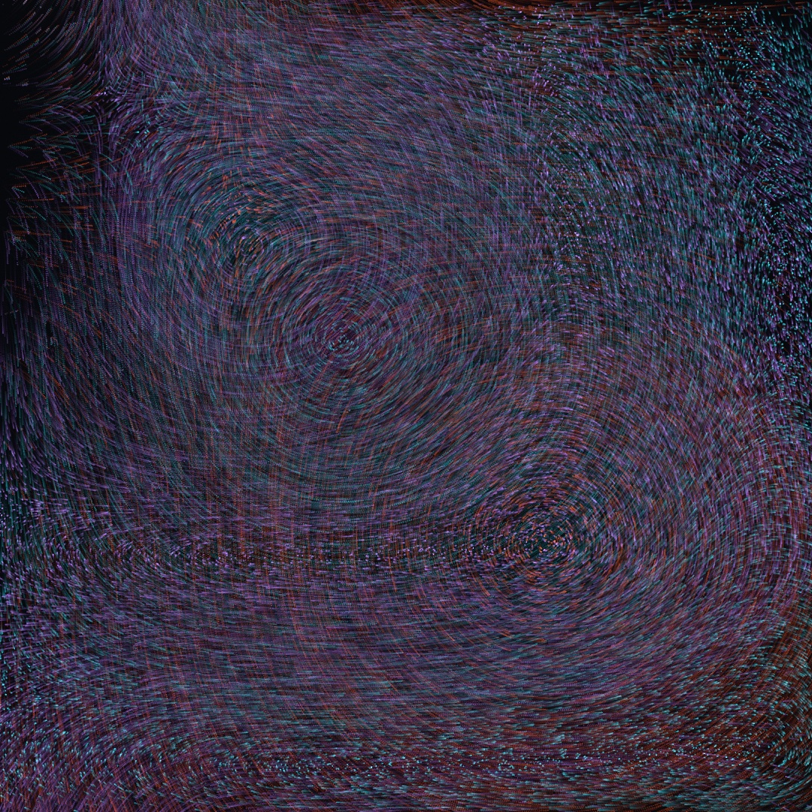
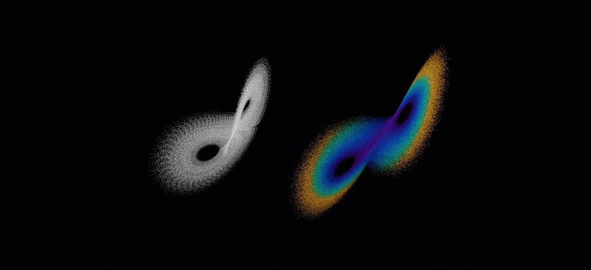
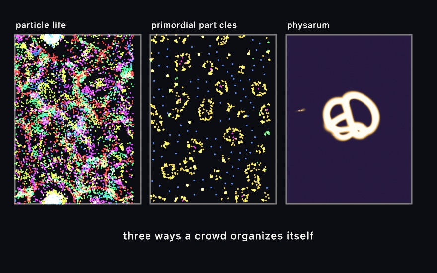
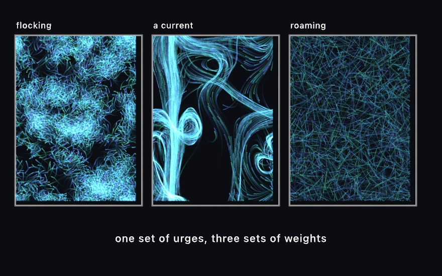
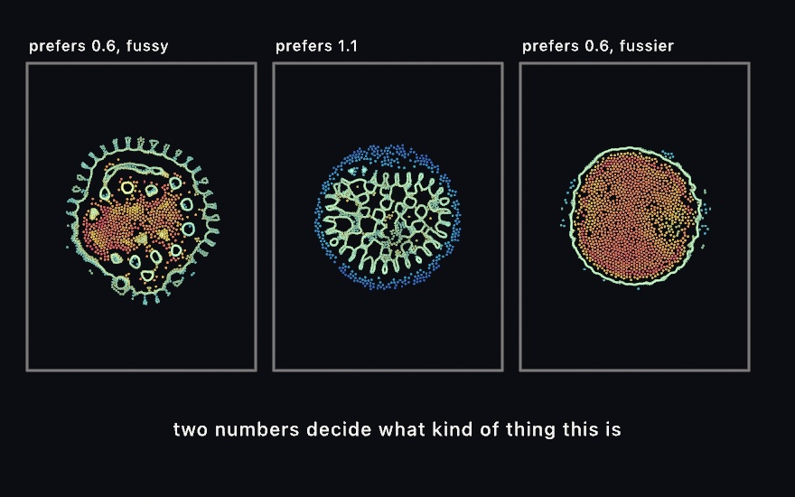
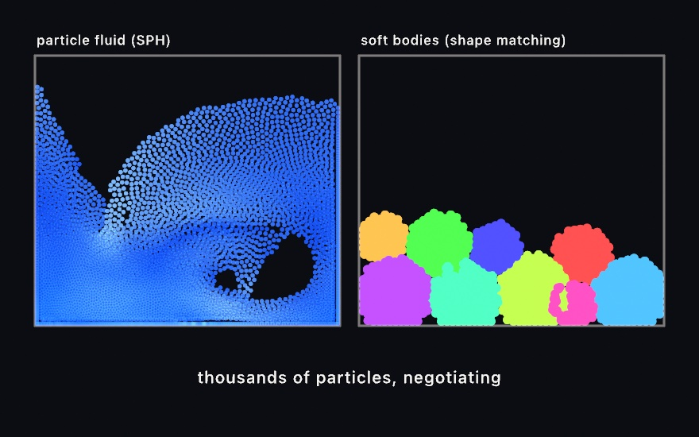
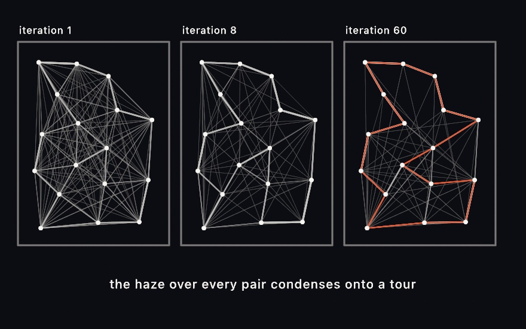
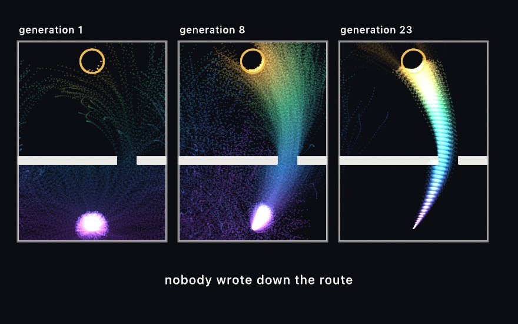
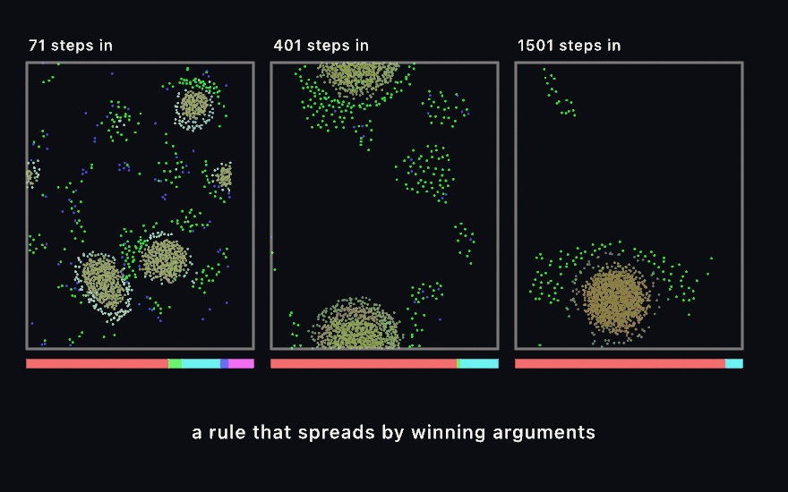

#### <sup>[Ollin](../README.md) → [Guide](README.md) → Chapter 24</sup>

---

# 24. Simulations made of particles



This chapter teaches simulations made of particles. A particle system is a buffer of hundreds of thousands of *individuals*, each carrying its own position, updated every frame by one small program that never touches the CPU. [Chapter 23](23-GridSimulations.md)'s fields evolved textures, where every cell sat still on a grid and asked its neighbors what to do. A particle moves, and it can carry more than a position. It can carry a species, so a rule treats its own kind differently from everyone else's. It can talk by leaving marks on the floor and reading them back. It can be scored, sorted, and bred. The drift above is the plainest case, and building it is the spine of the chapter. A quarter of a million particles read one field at three zooms and are summed as light on a canvas that keeps its past. After it come the systems that put particles to stranger work, in families. A million particles ride a strange attractor. Particle Life, the Primordial Particle System, Physarum, and the flock at GPU scale give particles neighbors. Particle Lenia, a particle fluid, and soft bodies make matter of them. And ant colony optimization, evolution, and swarm chemistry turn them into a search.

## A million grains: GPU particles

In Ollin a buffer of particles is `Particles`, and the update is a snippet of Metal, the same language as [Chapter 18](18-YourFirstShader.md)'s shaders. Here is the recipe, and everything else in the chapter is a variation on it:

```swift
lazy var sand = Particles(count: 1_000_000, step: """
    if (life <= 0.0) {                       // (re)spawn the dead
        position = hash22(float2(float(id), float(u.frameCount))) * u.resolution;
        life = 1.0;
    }
    position += curlNoise(position * 0.002 + u.time * 0.05) * 80.0 * u.dt;
    life -= u.dt;
    color = float4(0.6, 0.8, 1.0, 0.4);
    size = 1.4;
""")

override func draw() {
    background(.black)
    blendMode(.add)         // particles sum as light
    stepParticles(sand)   // one GPU simulation step
    drawParticles(sand)     // a million additive discs
}
```

The snippet runs once per particle per frame, and inside it a few names are that particle's own. `position`, `color`, `size`, and `life` are its state, yours to read and write, and whatever you leave in them is what the next frame starts from. `id` is the particle's number, from 0 up to the count, and it never changes. That is what makes `hash22(float2(float(id), float(u.frameCount)))` a fresh random point for each dead particle. `hash22` from the shader library turns any two numbers into two others that look random, and a particle's number paired with the frame's is different for every particle and every frame. `u` carries the frame. `u.dt` is the time since the last frame, so a speed multiplied by it moves the same distance a second at any frame rate. `u.time`, `u.resolution`, and `u.frameCount` are the sketch's own clock, canvas size, and frame number. The helpers you know from the shader library, `curlNoise` and `fbm` among them, are already in scope. So this step rides the curl field of [Chapter 14](14-FieldsAndFlow.md) without importing anything.

> **Swift note.** `lazy var` makes the property the first time it is read rather than when the sketch is created. That is what lets it be built from the count and the string in place. The string is a `"""` block from [Chapter 8](08-Words.md), holding Metal rather than text.

What does the count buy? What it looks like:


Each grain sheds the same faint light, and density does the drawing. At ten thousand you see individuals, at a million you see a *material*. Pair this with [Chapter 19](19-LayersAndEffects.md#the-canvas-that-keeps-everything-noclear)'s `noClear()` and `toneMap(.aces)`, and the grains deposit into the long-exposure sandpainting look.

A parameter reaches the step through `custom`. `stepParticles` takes four floats beside the buffer, and the snippet reads them as `custom.x` through `custom.w`. So a `@Param` drives the GPU by being packed into that slot each frame:

```swift
@Param("Speed", 40.0...260.0) var speed = 150.0

// in draw():
stepParticles(sand, custom: SIMD4<Float>(Float(speed), 0, 0, 0))
```

and inside the step, `custom.x` takes the place of the `80.0`. Everything a parameter changes has to arrive through those four floats. `SIMD4<Float>` is four floats packed together, and `Float(speed)` narrows the parameter's `Double` the way [Chapter 18](18-YourFirstShader.md) narrowed `sway`. The [compute reference](../Docs/Shaders/Compute.md) has the full snippet vocabulary, `.metal`-file loading, the multi-buffer dispatch, and the typed core underneath.

### Grains as light: the light style and the running mean

When the grains are meant as *light* rather than ink, draw them as light: `drawParticles(sand, style: .light)`. The default style is tuned for marks over a light ground. It lifts a dot that straddles a pixel corner to more than twice the light of one that lands on a center. A sum of a million dots then bakes that in. The light style deposits each grain's `color × alpha × area` wherever it falls, and a grain at or under one pixel costs one fragment instead of twenty-five. Put those into [Chapter 19](19-LayersAndEffects.md#converging-instead-of-brightening-the-running-mean)'s `Accumulator` and the picture converges instead of brightening:

```swift
withAccumulator(mean) {
    blendMode(.add)
    drawParticles(sand, style: .light)
}
drawImage(mean.developed(exposure: 20).image, 0, 0)
```

Grains drawn as light into a running mean are also how Ollin builds a lens that blurs by distance. [Chapter 31](31-TracedLight.md#a-lens-made-of-samples-depth-of-field-from-light) takes that up with the 3D camera.

## Putting it together: the drift

Now you can build the sketch at the top. It composes the step above. A buffer of particles runs a step body that respawns the dead by `id` and `hash22` and moves the rest by a field scaled by `u.dt`. Three parameters reach it packed into `custom`, and the additive blend lays it over a canvas that keeps its past. Three kinds of particle differ by a single number. Make a new file, `MySketches/Drift.swift`:

```swift
import Ollin

final class Drift: Sketch {
    @Param("Field scale", 0.0004...0.0030) var fieldScale = 0.0011
    @Param("Speed", 40.0...260.0) var speed = 150.0
    @Param("Lifespan", 1.0...12.0) var lifespan = 7.0
    @Param("Fade", 0.01...0.20) var fade = 0.13

    lazy var dust = Particles(count: 250_000, step: """
        uint kind = id % 3u;

        // Respawn the dead anywhere on the canvas, with a staggered lifespan
        // so the three kinds never pulse together.
        if (life <= 0.0) {
            position = hash22(float2(float(id), float(u.frameCount))) * u.resolution;
            life = custom.z * (0.35 + hash12(float2(float(id), 11.0)) * 0.9);
        }

        // One field, read at a different zoom per kind. That difference is the
        // whole of what separates them.
        float zoom = custom.x * (1.0 + float(kind) * 0.6);
        position += curlNoise(position * zoom + u.time * 0.03) * custom.y * u.dt;
        life -= u.dt;

        float3 tint = kind == 0u ? float3(0.98, 0.40, 0.20)
                    : kind == 1u ? float3(0.18, 0.80, 0.88)
                                 : float3(0.70, 0.50, 0.99);
        color = float4(tint, 0.055);
        size = 1.0;
    """)

    override func setup() {
        noClear()
        background(Color(hex: 0x07080C))
    }

    override func draw() {
        // The canvas keeps its own past, so a thin wash of the ground color is
        // what stops the trails filling in completely.
        blendMode(.normal)
        noStroke()
        fill(Color(hex: 0x07080C, alpha: fade))
        drawRect(0, 0, width, height)

        blendMode(.add)
        stepParticles(dust, custom: SIMD4<Float>(Float(fieldScale), Float(speed), Float(lifespan), 0))
        drawParticles(dust)
    }
}
```

> **Metal note.** `uint` is a whole number that is never negative, and `id % 3u` is the remainder from [Chapter 1](01-HelloOllin.md)'s `%`, so `kind` is 0, 1, or 2. The `u` on a literal marks it as that kind of number. The chained `? :` picks one of three colors, the compact if from [Chapter 6](06-GridsAndRepetition.md) used twice in a row. `hash12` is `hash22`'s sibling that turns two numbers into one.

Give it a few seconds to settle, then pull the fade down. What each part does:

- The step body is the entire simulation. Four lines of it are the physics, and the rest is birth and color. It runs a quarter of a million times per frame. Nothing in it can see any other particle, which is why it scales the way it does.
- `id % 3` is the species system. One number changes, and the three kinds read the same field at three zooms. That is enough to make them separate visually without any of them knowing the others exist.
- `custom` carries the three parameters to the GPU: the field scale in `x`, the speed in `y`, and the lifespan in `z`, with `w` unused.
- `noClear()` plus the wash is the trail, as it was for [Chapter 12](12-FlocksAndSwarms.md#roaming-wander-and-trails-from-noclear)'s wanderers. Without it you get confetti, because a particle's position tells you nothing and its *path* tells you everything. The wash sets how long the canvas remembers. Drop `Fade` to 0.02 and the trails run nearly forever.
- The additive blend is what turns overlapping trails into light rather than paint. Where many particles have crossed, the color climbs toward white, which is the same crowding-is-brightness idea the density plates of [Chapter 22](22-IteratedForms.md) used.

Before moving on, make it yours:

- Give each kind its own speed as well as its own zoom, by folding `kind` into the `custom.y` multiplier. They stop looking like one system in three colors.
- Replace `curlNoise` with `valueNoise` read as a height, and step along its slope instead. The character changes completely for a one-line edit.
- Push the count to a million and the alpha to 0.02. The picture gets quieter and much finer.
- Seed the respawn on a circle rather than the whole canvas, and watch the field carry the ring apart.

The drift is motion, so keep it as a video: `swift run OllinLive MySketches/Drift.swift --export-video drift.mp4 --seconds 15` records the first fifteen seconds, which is the trails filling in.

## One field, a million riders: attractor flow

The drift's particles rode a curl-noise field across the plane. The first family after it rides a different kind of field, a strange attractor. It is the one system here whose particles still never look at each other.

### A million riding the same field: attractor flow

An **attractor flow** puts a million particles into the velocity field of a strange attractor. A continuous system like Lorenz is a **velocity field**: hand it a point in space and it tells you which way that point is moving. [Chapter 22](22-IteratedForms.md#a-formula-that-folds-the-plane-chaotic-maps) plotted the flat maps as ghosts of their own orbits. The 3D systems, Lorenz and its relatives, live in space, so they need a camera. `StrangeAttractor` integrates one starting point through the field and hands back the path, which you draw as a curve. The flow follows the same field with six hundred thousand particles, all of them stepping every frame on the GPU. It is for the attractor seen as a crowd rather than a line, with a second fact, speed, in its color. The Lorenz system comes from Edward Lorenz's 1963 paper on deterministic nonperiodic flow, a weather model cut down until it would run on the computer he had. Its successors are collected at dynamicmath.xyz.



```swift
var flow: AttractorFlow!

override func setup() {
    flow = makeAttractorFlow(count: 600_000, .lorenz())
}

override func draw() {
    background(.black)
    blendMode(.add)
    toneMap(.aces)
    cameraShowcase(target: flow.center, radius: flow.extent * 3.4)
    stepAttractorFlow(flow)
    drawParticles(flow)
}
```

The left half of the picture is the single orbit, and the right half is the flow. [Chapter 25](25-3DGently.md) teaches cameras properly, and here one call, `cameraShowcase`, sets up a camera that circles the attractor slowly. A flow is 3D and draws through the camera, so `drawParticles` does nothing without one. A million particles step and draw at 55 frames a second on an M2, at two tenths of a millisecond of CPU work per frame. Every particle reads only its own position and nothing else, so there is no neighbor search here, unlike [the flock](#the-flock-a-thousand-times-bigger-swarm) later in this chapter.

Notice what the sketch never says. It never says where the attractor is, how big it is, or how fast to run it. Lorenz spans about fifty units and Aizawa about three, and their natural clocks differ by more than an order of magnitude. Hard-coding any of that would tie the sketch to one system. Instead the flow integrates a single CPU orbit when you build it and reads the answers off that. It takes `center` and `extent` for the camera, a splat size, a color range, and a pace that crosses the attractor about once a second. Swap `.lorenz()` for `.aizawa()` and everything re-measures.

The colors carry a second fact. A particle's color comes from how fast it is moving, which is what separates the fast outer sweeps from the slow, crowded core. But the picture is drawn additively, so brightness already means *how many particles are here*. Color is speed, and brightness is crowd. The default ramp shifts hue while holding its brightness roughly level, so those two facts stay on separate channels. A ramp that ran dark to light as well would make a slow crowded region and a fast empty one look the same.

One more decision shows in the picture. The particles start spread over the attractor itself, sampled from a settled orbit, and then nudged off it by a tiny distance. The nudge is the part that matters. Sitting on the orbit itself, every particle follows the same trajectory forever, and the picture can only ever be that one curve with dots sliding along it. A tiny distance off, chaos separates them within a few laps into as many trajectories as there are particles. That is the reason to run this many. Sensitivity to initial conditions is usually the thing that makes chaotic systems hard to work with. Here it is the mechanism.

## Particles that see their neighbors: Particle Life, the Primordial Particle System, Physarum, and the flock at scale

Neither the drift's grains nor the attractor's particles ever noticed each other. Making a hundred thousand particles *aware* of their neighbors is the harder problem. Asking "who is near me" the obvious way means comparing everyone against everyone, which is billions of comparisons a frame. The fix is the one [Chapter 12](12-FlocksAndSwarms.md#the-trick-that-keeps-it-cheap-spatialindex)'s `SpatialIndex` used on the CPU. Sort the particles into a grid of cells first, so each one only ever checks the nine cells around it. Ollin ships that sort on the GPU as `SpatialHash`, and it is public, so you can build your own neighbor-aware system on it. Four come already built: three from artificial life, and the flock.



### A few kinds and a table of attractions: Particle Life

**Particle Life** gives you a few *kinds* of particle and one attraction number for every ordered pair of kinds. That is the model. Red is drawn to green, green flees blue, and out of that asymmetry come membranes, cells, chasers, and worms that nobody designed. It is for life-like structure from the smallest possible rule table, and it descends from Jeffrey Ventrella's *Clusters*. The left panel above is one roll of it:

```swift
life = makeParticleLife(count: 24_000, kinds: 6, radius: 46)

// each frame:
stepParticleLife(life)
drawParticles(life)
```

The matrix is rolled at build, and `life.randomizeMatrix(seed:)` rolls a fresh one. Most rolls are dull and a few are alive, which makes this a seed-hunting system of the kind [Chapter 4](04-Randomness.md#finding-a-seed-to-keep) taught you to search.

### One rule, cells that divide: the Primordial Particle System

The **Primordial Particle System** is leaner than Particle Life. Each particle counts its neighbors and notices whether more of them sit to its left or its right. Then it turns toward the busier side, by a fixed amount plus a crowd-proportional one. From that single rule come cells that grow, divide, and die, which is what it is for: a picture of cell-like life from one line of behavior. Thomas Schmickl, Martin Stefanec, and Karl Crailsheim published it in *Scientific Reports* in 2016. The middle panel above is a few seconds in, with yellow marking the crowded cell walls and blue the free wanderers. It is `makePrimordialParticles(count:radius:)`, `stepPrimordialParticles`, and `drawParticles`, in the same shape as Particle Life's three lines.

### Agents that talk through the floor: Physarum

**Physarum** models slime mold, and it needs no neighbor search at all, because its agents talk through the floor instead of to each other. Each one sniffs three points ahead, turns toward the strongest trail, steps forward, and deposits a little trail of its own. The trail map blurs and fades a touch each frame. It is for branching transport networks, the kind real slime mold uses to solve mazes. The agents follow Jeff Jones's 2010 model of *Physarum polycephalum* transport networks. The right panel above is one:

```swift
slime = makePhysarum(agents: 220_000, resolution: 1024)

// each frame:
stepPhysarum(slime)
drawImage(slime.image, in: bounds)
```

These systems are chaotic, so a difference in the last bit of a number grows into a different picture within seconds. An export puts each cell's particles in a fixed order before the neighbors are summed. So two exports with the same seed match frame for frame on the same machine. A different GPU can still round a step another way and end up somewhere else.

### The flock, a thousand times bigger: Swarm

A **swarm** is [Chapter 12](12-FlocksAndSwarms.md)'s flock run on the GPU. That chapter gave one creature a short list of urges and let a few hundred of them flock. That work ran one agent at a time on the CPU, which is why the counts stayed small. `Swarm` is the same list of urges over the neighbor sort above, so the same rules carry tens or hundreds of thousands of agents. It is for flocks, currents, and crowds at a scale the CPU cannot reach, and the rules are Craig Reynolds's, the ones Chapter 12 credits.



Every behavior is a number, and a number of zero means that behavior is switched off:

```swift
swarm = makeSwarm(count: 30_000, perceptionRadius: 16)
swarm.separation = 1.5     // don't crowd
swarm.alignment = 1.5      // go the way your neighbors go
swarm.cohesion = 0.8       // stay with them

// each frame:
stepSwarm(swarm)
drawParticles(swarm)
```

That is the left panel. Turn those three off and turn on `flow` instead and a noise field carries everyone, which is the middle panel. Turn on `wander` alone and each agent roams by itself, which is the right one. `seek`, `flee`, and `arrive` steer at a `target` you can move with the mouse. Each behavior works out where it *wants* to be going, and subtracts where the agent is already going. The weighted total is capped before it moves anything, as in Chapter 12.

Three numbers are tied to each other, and a swarm that looks wrong is usually one of them rather than a weight. An agent should see about twenty others, which is what `perceptionRadius` decides against how crowded the canvas is. See far more and every agent is averaging over most of the swarm, so the structure washes out. `separationRadius` wants to be about the gap between neighbors, since a personal space larger than that means everyone shoves everyone forever. And the turning circle, `maxSpeed²/maxForce`, should be a few times the perception radius, or agents orbit inside their own neighborhood instead of traveling through it.

One more, which is not in the original model: `minSpeed`. Left to itself, a steering agent pushed at from every side stops. In a crowd the stopped ones become a wall the rest jam against, until the whole thing sets like concrete. A floor under the speed keeps it moving, on the grounds that a bird cannot hover.

A still frame of a swarm is a picture of where everyone is, not of how they are moving. That is why all three panels above are drawn as trails. Use `noClear()`, then a nearly transparent rectangle over the whole canvas each frame, so old marks fade instead of vanishing. Use a rectangle rather than `background`, which wipes the canvas outright no matter how little alpha its color carries.

## Particles as matter: Particle Lenia, SPH fluid, and soft bodies

The systems above are written as forces: something pushes, something pulls, and the drift's particles only ever followed. The same neighbor search carries three systems that behave like matter. One walks downhill on an energy, one is a liquid, and one is a jelly.

### Matter that decides what shape to be: Particle Lenia

**Particle Lenia** is written a different way from a force law, and the difference is the idea. There is no force. There is a landscape, and particles walk downhill on it. Each particle adds up a ring-shaped kernel over its neighbors to get one number, how crowded it is. A growth function scores that crowding: there is a level of company a particle likes, and the further from it in either direction, the worse things are. A repulsion term makes being stood on very bad. Add those into one energy, and a particle moves whichever way that energy improves. It is for matter that decides its own shape, a cell, a coral, or a body, from two numbers. It carries the continuous-automaton idea of Bert Wang-Chak Chan's Lenia onto moving individuals, in the energy-based form Alexander Mordvintsev, Eyvind Niklasson, and Ettore Randazzo gave it.



```swift
lenia = makeParticleLenia(count: 6000, spacing: 9)

// each frame:
stepParticleLenia(lenia)
drawParticles(lenia)
```

The three panels above are that same code. The only difference between them is which crowding the growth function is asking for and how fussy it is about getting it: `muG` and `sigmaG`. Two numbers are the difference between a cell with a fringed skin, a coral, and a smooth solid body.

Which term does what matters, because they pull against each other on the same thing. Growth is the only term that attracts, so with it switched off, particles drift apart. Repulsion is the only term with an opinion at very short range, so with *it* switched off, they end up standing on each other. The reason for that second one is the kernel's shape. It is a *ring*, so two particles in the same place add almost nothing to each other's crowding, and growth is content to let them coincide.

The color in those panels is the crowding itself, measured against what the rule asked for. That is why the membrane reads differently from the inside. Particles on the rim have nobody beyond them, so their field is permanently short of the target, however well the rule is working. The membrane is not a feature anybody wrote. It is where the population runs out.

One number you never set is the kernel's weight. It is whatever makes the kernel add up to one over the whole plane, so Ollin works it out from the ring you asked for. That is what keeps `muG` meaning the same crowding when you move the ring. It is also why the sketch above names no constants you would have to look up.

### Liquids and jellies: SPH and soft bodies

**`ParticleFluid`** is smoothed-particle hydrodynamics, a long name for a simple bargain. Represent a liquid as thousands of particles, have each one measure how crowded it is, and push it away from wherever it is crowded. Density becomes pressure, pressure becomes motion, and a free surface, splashes, and sloshing all come out without anyone modeling them. **`SoftBodies`** is the jelly counterpart, and it works by *shape matching*. Each body remembers the shape it was born with. Every step it works out where that shape would be now, its center and its rotation, and pulls its particles back toward those remembered positions. The two are for liquid and jelly you can grab and fling. The fluid is Matthias Müller and colleagues' 2003 particle-based formulation, with the near-density term Simon Clavet, Philippe Beaudoin, and Pierre Poulin added in 2005. The jellies use Müller's 2005 meshless shape matching.



```swift
fluid = makeParticleFluid(count: 26_000, radius: 12)

// each frame:
if mouseIsPressed { fluid.pull(at: Vector2(mouseX, mouseY)) }
stepParticleFluid(fluid)
drawParticles(fluid)
```

`gravity` tilts the box, and `stiffness` sets how hard the liquid resists being squeezed. `nearStiffness` is an extra short-range pressure that stops particles clumping, and gives the surface its tension. Grabbing a handful with `pull(at:)` and flinging it is the way to learn what the numbers do.

```swift
blobs = makeSoftBodies(bodies: 12, radius: 80)

// each frame:
stepSoftBodies(blobs)
drawParticles(blobs)
```

`squish` is how firmly a body pulls back toward its remembered shape, and that one parameter is the difference between a bouncing ball and a slime. Bodies collide with each other and flatten where they press together, which is the pile on the right. Both systems run fixed substeps against a clamped clock, so a dropped frame slows them down rather than detonating them. Both carry the same reproducibility caveat as [Physarum](#agents-that-talk-through-the-floor-physarum) and its neighbors.

## Searches you can watch: ant colony optimization, evolution, and swarm chemistry

Every system so far made a picture and nothing else. Three more use a crowd of particles to look for something. One looks for a short tour of a set of cities, one for a path to a target, and one for a rule that outlives the others. Two run on the GPU, and the first runs on the CPU and finishes.

### A search you can watch: ant colony optimization

**Ant colony optimization** points Physarum's trail at a task: visit every city once, briefly. Each `step()` the colony walks a tour, choosing the next city by trail strength and closeness. Then the map evaporates a little, and every ant lays trail along its route, more for shorter tours. It is for a search you can watch condense, from a haze of every possible edge to one tour. The method is the Ant System of Marco Dorigo, Vittorio Maniezzo, and Alberto Colorni, from their 1996 paper.



```swift
let colony = AntColony(cities: points, seed: 7)

// each frame:
colony.step()
for trail in colony.trails {
    stroke(Color.white.withAlpha(trail.strength * 0.8))
    drawLine(trail.a, trail.b)
}
drawPolyline(colony.bestTourPoints, closed: true)   // the answer so far
```

The three panels are one seeded search at three moments. After one iteration the map is a haze, because every ant's tour deposited somewhere. Edges that keep landing in short tours are walked again and grow stronger, and the rest fade. By iteration sixty the web has settled, and the best tour found so far rides on top in orange. Draw `trails` each frame and you watch that condensation happen live.

Two parameters set the search's temperament. `evaporation` is the forgetting rate: high keeps exploring, low commits early, sometimes to a rut. `elitism` re-lays the best tour every iteration, which sharpens the web onto the current answer. Unlike its GPU cousins this one runs on the CPU and reproduces exactly from its seed. `bestTour` never worsens, so you can stop whenever the web looks done. The [`Patterns/AntColony`](../Examples/Patterns/AntColony/Sketch.swift) example runs the whole search as a living sketch, and the [reference](../Docs/Generators/AntColony.md) has the rest of the parameters.

### Letting the sketch find it: evolution

**Evolution** searches by breeding where the ant colony searched by laying trails. Thirty thousand individuals set off from the same spot at the same moment. Each carries a genome, which here is a short list of pushes played back in order over a few seconds. A genome is a plan for a journey, and the flight is what the plan comes to. When the time is up, everyone is scored on how close they came to a target. The population is then replaced by the children of whoever did best, and then it happens again. It is for a route you never write down. The genetic algorithm is John Holland's, set out in 1975 in *Adaptation in Natural and Artificial Systems*. David Goldberg's 1989 book laid out crossover, mutation, and the roulette-wheel and tournament ways of choosing parents. The flying-toward-a-target version is the one Daniel Shiffman teaches as smart rockets in *The Nature of Code*, after an earlier sketch by Jer Thorp.



```swift
run = makeEvolution(count: 30_000, genes: 28,
                    from: Vector2(540, 990), to: Vector2(540, 110))
run.obstacles = [Rectangle(x: 0, y: 620, width: 640, height: 34),
                 Rectangle(x: 800, y: 620, width: 280, height: 34)]

// each frame:
stepEvolution(run)
drawParticles(run)
```

Nowhere in that do you say how to get there. You place a start, a target, and the walls. The route is the one thing you leave out, and the route is what comes back.

The three panels are the same search a few seconds apart. Generation 1 is a spray with no idea. By generation 8 a plume has found the gap and is pouring through it. By generation 23 the population is a single arc that threads the gap and ends in the ring. Nothing improved a genome. All that happened is that the ones that did badly had fewer children.

Choosing the parents is the interesting part. Each parent is picked by holding a small tournament: grab a few individuals at random, and keep whichever scored highest. The other common method gives a genome a share of the parents equal to its share of everyone's total score, and the tournament suits the GPU better for a reason. A tournament never adds anything up. It only ever asks *which of these two is higher*. So thirty thousand children can each pick their own parents at the same instant, with nothing to agree on and nothing to wait for, which is what a GPU does well. It also means the scale of a score is irrelevant. Only its order matters.

The pace comes out of the geometry rather than out of numbers you tune. Top speed crosses the distance to the target in about two seconds, and the trial is long enough to go the long way round. One gene pushes hard enough to reach top speed in a quarter of a trial. All of it is worked out from how far apart the two points are. That is why the sketch above names a population, a genome length, and two points, and nothing else. It is also why dragging the target re-paces the run.

The first generation decides whether any of this works. Pick every gene at random and a genome is a random walk, whose steps mostly cancel. The entire population would mill about the start, all of them equally hopeless, and selection would have nothing to tell apart for a very long time. So a genome starts as a smooth arc instead, a random heading with each gene a small turn from the one before. Generation 1 is then already a spray of paths going somewhere different, and evolution's job is to bend the promising ones, which takes a dozen generations rather than a hundred.

Mutation is what keeps that going. Each gene, as it is copied into a child, has a small chance of being nudged, by a random amount added to what the gene already held rather than a fresh random value. Turn mutation off and a run still improves for a while, on the variety generation 1 happened to contain. Then it stops, because copying can only ever narrow. Selection chooses. It never invents.

Evolution has a second half with no score at all, where a person picks and the picks breed. [Chapter 4](04-Randomness.md#sixteen-things-and-no-opinion-about-them-population) teaches it beside choosing a keeper among seeds.

### A rule that spreads by winning arguments: swarm chemistry

**Swarm chemistry** takes the generation away from evolution and sees what is left. Every particle carries its own copy of the rule it moves by, eight numbers called a recipe: how far it sees, the speed it likes, the speed it can reach, and then the strengths of cohesion, alignment, separation, random steering, and pace-keeping. When two particles touch, one recipe overwrites the other. Nothing is scored and nothing is aimed at. A recipe spreads because the particles holding it keep meeting particles holding something else and winning. It is for a contest you can watch with no judge in it. The model is Hiroki Sayama's swarm chemistry of 2009, and the heritable recipes follow his later work on open-ended evolution in it.



```swift
chem = makeSwarmChemistry(count: 4000, kinds: 6)

// each frame:
stepSwarmChemistry(chem)
drawParticles(chem)
```

The world opens with six random recipes shared out evenly, and the bars under the panels are who is left. Six lines, then two, then very nearly one. No one chose the winner, and no one could have said in advance which it would be.

`competition` is the one parameter that says what winning means, and it sets the character of a run. Under `.faster` the recipes that spread are the ones whose particles keep moving. Under `.slower` it is the ones that settle. Under `.majority`, whoever is already surrounded by more of its own kind, which makes the thing at stake territory. Setting `transmits` to false freezes every recipe, and gives you the model before any of this was added, a fixed mixture of six kinds.

Mutation here is a chance *per contact*, not per generation, and a particle in a crowd makes contact several times a second. So the rate is far below the one `Evolution` uses. Set it as high as a generational search would, and the recipes take dozens of nudges inside a single takeover. They arrive as noise, which you see at once. The structures dissolve, and the picture flattens into an even gas.

The color is the recipe itself, three of its numbers read as red, green, and blue. So a takeover reads as one color eating the others, and a mutation as a shift in shade rather than a new color. When one line has won and the picture keeps changing shade, that is the line still drifting inside itself.

## Where this comes from

GPU particle systems are a demoscene and games inheritance, and the additive rendering the drift uses is the long-exposure idea of [Chapter 19](19-LayersAndEffects.md) with a million sources of light. The families after the drift name their own sources as they go: Lorenz and the collection at dynamicmath.xyz, Ventrella, Schmickl and Stefanec and Crailsheim, Jones, Reynolds, Chan with Mordvintsev and Niklasson and Randazzo, Müller with Clavet and Beaudoin and Poulin, Dorigo and Maniezzo and Colorni, Holland and Goldberg with Shiffman and Thorp, and Sayama. Full credits are in the project's [attribution notes](../ATTRIBUTION.md).

## Go deeper

- [Compute and GPU particles](../Docs/Shaders/Compute.md): the full `Particles` snippet vocabulary, every local in scope, the `custom` parameters, dropping to a raw `ComputeKernel` when the built-in layout is not enough, binding up to ten buffers, and projecting through the sketch's camera from a kernel.
- [Depth of field from light](../Docs/Drawing/DepthOfField.md): the light particle style's deposit rules and the `develop` print, and the lens that [Chapter 31](31-TracedLight.md#a-lens-made-of-samples-depth-of-field-from-light) builds on them.
- [Strange attractors](../Docs/Drawing/Attractors.md): all eight systems with their constants, the `AttractorFlow` parameters, and the velocity fields as [shader-library functions](../Docs/Shaders/ShaderLibrary.md#chaotic-systems-compute-only) you can ride in a compute kernel of your own. [`Examples/Simulation/Attractor`](../Examples/Simulation/Attractor/Sketch.swift) runs the flow.
- [Artificial life](../Docs/Simulation/ArtificialLife.md): all three systems with every parameter, plus the matrix rolling and the reproducibility caveat.
- [Ant colony](../Docs/Generators/AntColony.md): the trail and closeness pulls, evaporation, elitism, and reading the best tour back out.
- [Swarm](../Docs/Simulation/Swarm.md): all eight steering behaviors, every parameter, and how to pick a temperament rather than a number.
- [Fluids and soft bodies](../Docs/Simulation/Fluids.md): the SPH and shape-matching parameters, grabbing with the mouse, and what each solver is and is not good for.
- [Evolution](../Docs/Simulation/Evolution.md): the scoring and selection in full, the pacing you can control, and the interactive form.
- Appendix B draws the idea underneath all of this: [Local rules, global structure](B-JustEnoughMath.md#local-rules-global-structure), and [Density as tone](B-JustEnoughMath.md#density-as-tone) for what a million faint marks add up to.
- Worked examples: [`Examples/Simulation/ParticleLife`](../Examples/Simulation/ParticleLife/Sketch.swift), [`PrimordialParticles`](../Examples/Simulation/PrimordialParticles/Sketch.swift), [`Physarum`](../Examples/Simulation/Physarum/Sketch.swift), [`ParticleLenia`](../Examples/Simulation/ParticleLenia/Sketch.swift), [`Swarm`](../Examples/Simulation/Swarm/Sketch.swift), [`SwarmChemistry`](../Examples/Simulation/SwarmChemistry/Sketch.swift), [`ParticleFluid`](../Examples/Simulation/ParticleFluid/Sketch.swift), [`SoftBodies`](../Examples/Simulation/SoftBodies/Sketch.swift), and [`Evolution`](../Examples/Simulation/Evolution/Sketch.swift).

---

[Contents](README.md#contents) · Previous: [Chapter 23, Simulations on a grid](23-GridSimulations.md) · Next: [Chapter 25, 3D, gently](25-3DGently.md)
