#### <sup>[Ollin](../README.md) → [Guide](README.md) → Chapter 24</sup>

---

# 24. Worlds with weight

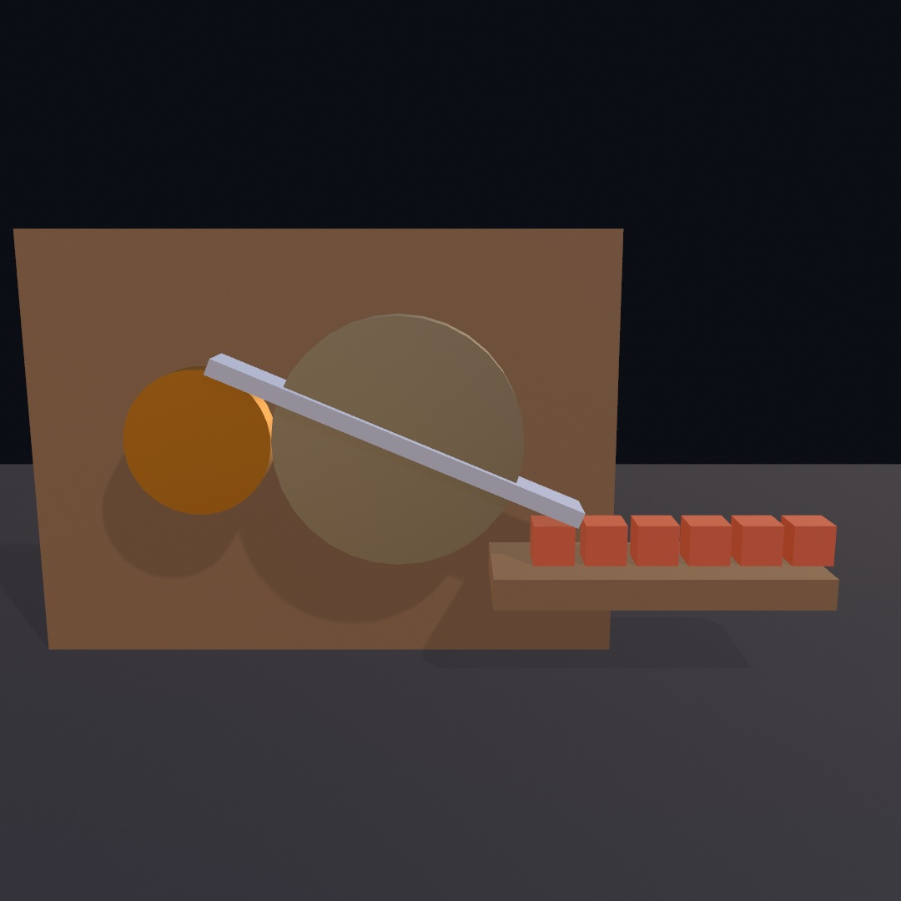

That machine has one motor in it. A gear link ties its hinge to a second, and everything after that is contact: the bar swings because it is bolted to a wheel, and the crates move because the bar arrives. Nothing there is animated. Take the motor away and the whole thing coasts to a stop on its own.

[Chapter 21](21-3DGently.md) built a scene you look at. This chapter gives it weight. Bodies fall, stack, and knock each other about; joints tie them into hinges, sliders, gears and ropes; queries let the sketch ask what a body would hit before it hits it; and a snapshot puts a settled arrangement in a file so it comes back exactly as it was. By the end you'll have built the contraption above.

## Things with weight

[Chapter 11](11-ForcesAndPhysics.md) dropped flat shapes into a physics world and let gravity do the animating. The same world exists in 3D, and it fits the scene the last chapter built. Crates stack, balls roll, and chains swing, with real contact response, under the same lights and shadows as everything else. It comes with `import OllinPhysics`, like its 2D sibling, and it keeps the shape you already know. Build a `World3D` once, add bodies, and step it every frame.

```swift
let world = World3D()

override func setup() {
    world.ground = 0                     // a static floor at y = 0
    for level in 0 ..< 6 {
        world.addBody(.box(width: 1, height: 1, depth: 1),
                      at: Vector3(0, 0.6 + Double(level) * 1.04, 0))
    }
}

override func draw() {
    background(.black)
    cameraShowcase()
    world.advance(by: deltaTime)
    for body in world.bodies {
        withBody(body) { drawBox(width: 1, height: 1, depth: 1) }
    }
}
```

The one new move is `withBody`. In [Chapter 11](11-ForcesAndPhysics.md) you drew a body by translating to its `position` and rotating by its `angle`. A 3D body's orientation is a full spatial rotation, not one number, so `withBody(body) { }` moves the whole transform stack to the body's pose and lets the block draw in body-local space. Whatever you draw there rides the body, whether that's a box matched to the collider, a loaded mesh, or a whole small assembly. It stays ordinary drawing, so materials, shadows, and export all apply untouched.

That orientation is one value, a `Rotation3D`, and you can read it, set it, or build on it. `body.rotation = Rotation3D(angle: .pi / 4, axis: .unitZ)` leans a crate before it drops, and `body.rotation = .aboutY(0.1) * body.rotation` turns it a tenth further round from wherever it is. The same value goes straight into `rotate(body.rotation)` when you pose something by hand rather than through `withBody`. The turn between two directions, and the turn part of the way toward another, are on the [geometry page](../Docs/Drawing/Geometry.md#rotation3d).

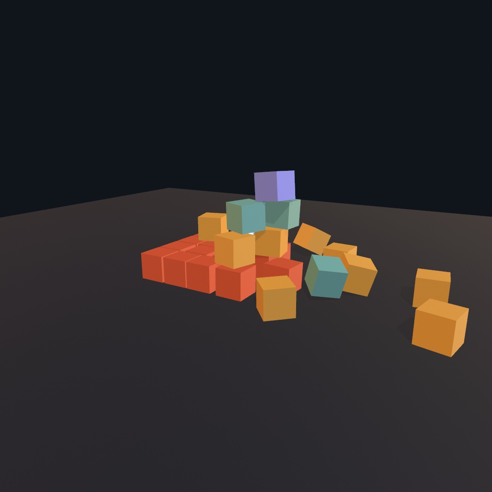

The figure is the whole idea in one frame. A crate pyramid is built in `setup()`, each crate one `addBody` with a `.box` collider. A dense steel ball is thrown at it with an opening `velocity`, and this is frame 92 of the collapse. Nothing in it is animated by hand, and nothing in it is random either. The solver is deterministic, so this exact wreck replays every run.

Colliders come from a small catalog: `.box`, `.sphere`, `.capsule`, `.cylinder`, their tapered cousins (`.cone`, `.taperedCylinder`, `.taperedCapsule`), a convex `.hull` of your own points, and a static `.mesh` for scenery a body can't be. `connect` links bodies with joints, the 2D kinds plus `.ball`, the free-swiveling socket a hanging chain is made of. And the cursor reaches through the camera. `grabBody(at:in:)` ray-picks the body under the mouse, and `dragGrab(_:to:)` slides it across the view at the depth it was picked; `dragBodies(in: world)` is the whole press-drag-release lifecycle as one polled call. That's how you rummage through a pile in a running sketch. Drawing runs the same way: `drawBody(body)` renders a body as the collider it really is, every case of the catalog included. A world draws as one loop with no switch of its own.

A body doesn't have to be one shape, either. `.compound` fuses several colliders into a single rigid body, each part posed in the body's local space. The mass, balance, and spin all come from the whole assembly:

```swift
var parts: [Collider3D.Part] = [
    .part(.cylinder(height: 0.2, radius: 0.32),
          rotated: .pi / 2, axis: .unitX, density: 2),   // the metal hub
]
for arm in 0 ..< 4 {
    let angle = Double(arm) * .pi / 2
    parts.append(.part(.box(width: 1.5, height: 0.26, depth: 0.08),
                       at: Vector3(cos(angle), sin(angle), 0) * 1.11,
                       rotated: angle, axis: .unitZ))    // a blade
}
let cross = world.addBody(.compound(parts), at: hubCenter)
```

That's a windmill's blade cross, five shapes in one body. A part's own `density` weighs it against the rest, which is how a hammer gets a head that leads its swing. `withBody` still draws the whole thing, so translate to each part's pose inside the block and draw its shape.

Hinges and sliders can also be *powered*. Give one `limits` when you connect it, measured from the pose it was built in, so 0 means "as built". The returned joint carries a small motor. `drive(at: 2.5)` turns it at a steady rate, `drive(to: 0)` is a spring servo that seeks a pose and holds it, `stopMotor()` cuts the power, and `friction` is the drag that winds a freewheeling hinge down. The servo's `strength` is a torque cap, and a weak one is a *character* parameter rather than a compromise. It's what makes a door closer something a thrown ball can still barge through.

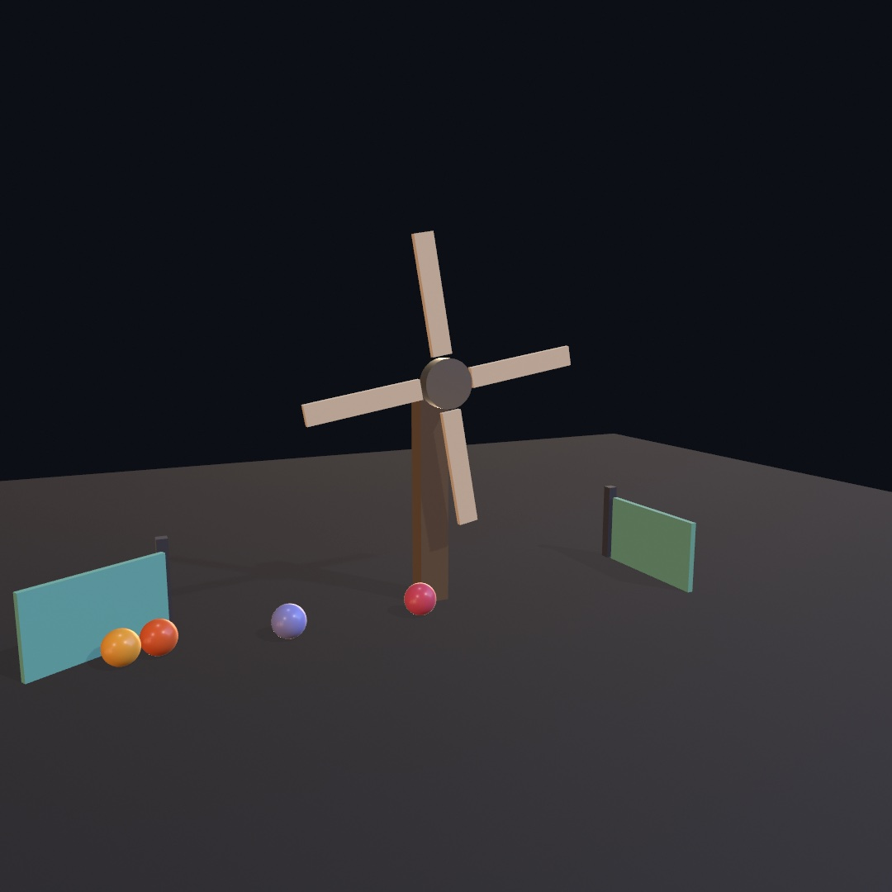

One motored hinge does all the animating here. The compound blade cross from above rides a `.revolute` driven at a constant rate. The balls it bats away shove through swing gates on either side, each a limited hinge with springy stops (`softenLimits`), held shut by a `drive(to: 0)` closer too weak to argue with a rolling ball. The interactive version is the [`3D/Physics/Windmill`](../Examples/3D/Physics/Windmill/) example, where the space bar cuts the motor and you can watch hinge friction coast the mill to a stop.

And the landscape you grew in [Chapter 23](23-Landscapes.md) can hold all of this up. `.heightfield` takes a `Heightfield` directly, sized exactly like its `mesh(width:depth:height:)`, so the collider and the drawn mesh trace one surface:

```swift
world.addBody(.heightfield(land, width: 14, depth: 14, height: 4.2),
              at: .zero, kind: .static)
```

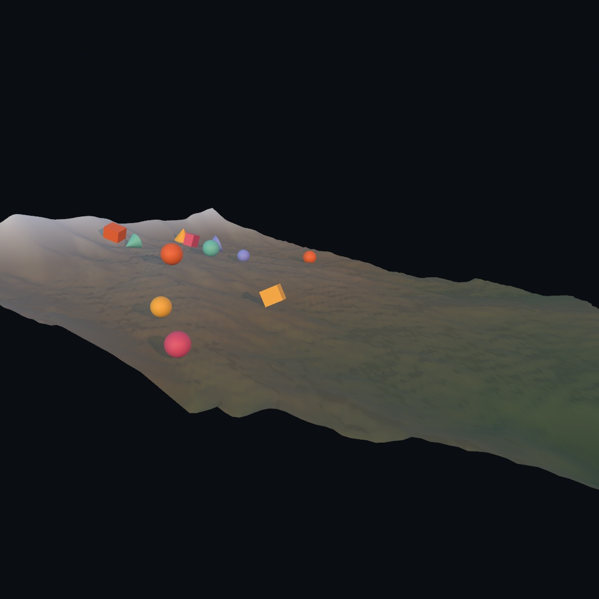

The rocks are spheres, boxes, and cones dropped along the ridge, and the ravines the rain carved are the same ravines that funnel them down. For scenery that arrives as a file instead of a field, `world.addStaticBodies(from: scene)` walks a loaded `Scene`. It turns every mesh into a static collider at its authored place, so a ball can roll through the hall you imported. The interactive slide, with its perpetual rock feed and a dice parameter that regrows the mountain, is the [`3D/Physics/Rockslide`](../Examples/3D/Physics/Rockslide/) example.

## Asking what hit what

So far the world has been something to watch. To make it something to *play*, you need to know when things happen. A ball reached the goal, a crate landed hard, or the plate has something on it. Ollin hands that over the way it hands over the mouse. Every `step` leaves a list on the world, and `draw()` reads it:

```swift
world.advance(by: deltaTime)
for contact in world.contacts where contact.phase == .began {
    knocks.append(Knock(at: contact.point, strength: contact.speed))
}
```

No callbacks, and nothing that fires at an awkward moment. It's just a list that belongs to the step that filled it. Each `Contact3D` says which two bodies met, as `a` and `b`, with `contact.other(than: ball)` to save you the guessing. It also says where, which way the surfaces faced, and `speed`, how fast they were closing when they met. That last one is the useful one. It's measured before the solver answers the collision, so it's the size of the *impact*. One number can then set the volume of a clink, the size of a spark, or the brightness of a flash. Touches are per pair of bodies, so a crate landing on a mesh floor is one arrival, not one per triangle it happens to rest on.

The other half is a body that isn't solid at all. Pass `isSensor: true` and you get a region. Things fall through it untouched, and it tells you who's inside.

```swift
let goal = world.addBody(.cylinder(height: 0.5, radius: 1),
                         at: hoopCenter, isSensor: true)

score += goal.arrivals.count           // crossed during this step
let crossing = !goal.touching.isEmpty // one is in there right now
```

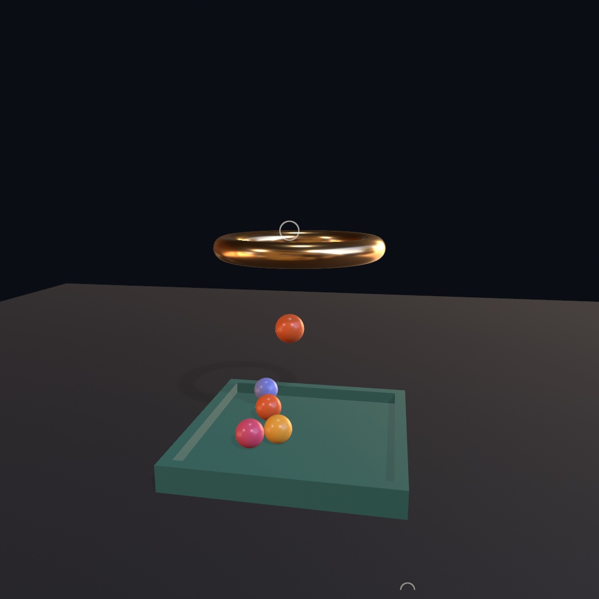

The hoop in the figure is two bodies in the same place, which is the trick worth stealing. There's a solid rim of beads a ball can clatter off, and a sensor disc filling the hole. Only a ball that gets *through* enters the sensor, so `goal.arrivals` is a scoreboard, and the ring lights while one is crossing. The tray below is a sensor too, and its color is `touching.count`.

That tray is also why sensors are built the way they are. A ball that settles in it stops moving, and the solver, sensibly, puts anything that has stopped moving to sleep to save the work. A sleeping body reports no contacts, so a still stack reads as touching nothing. A sensor never sleeps, so it goes on counting what's parked in it long after the balls have dozed off. Events are for the moment something happens, and a sensor is for the standing question of what's in here. The playable version, where you can drag a ball and post it through the hoop by hand, is the [`3D/Physics/Trigger`](../Examples/3D/Physics/Trigger/) example.

You don't animate a pile; you drop one.

## Asking what is there

Contacts tell you what the solver noticed while it was stepping. Often you want something it was never asked. Can the lamp see a crate? How far is the floor below a point in mid-air? What is standing inside a circle you just made up? It knows all of that, because working out what is where is what a collision solver does all day. You just have to ask, and you ask between steps.

Three questions, three calls. **A ray** is a line with a start and an end, and it comes back holding the first thing in the way.

```swift
if let hit = world.raycast(from: lamp, to: crate.position) {
    lit = hit.body === crate        // nothing got in first
}
```

That second line is the whole of line of sight. The crate is visible when the crate *is* what the ray found. Put a pillar between them and the ray comes back holding the pillar instead.

A `Hit3D` says which body it found and where it touched, the `point`. It says which way the surface faces there, the `normal`, which is what a bounce or a scorch mark is built from. And it says how far along the query the touch was, the `distance`. Aim the same call downward and that last one is the height of the drop:

```swift
let drop = world.raycast(from: p, to: p - Vector3(0, 20, 0))?.distance
```

**A sweep** is a ray with a body. It slides a whole shape along the line and reports what the shape runs into.

```swift
let below = world.sweep(.sphere(radius: 0.55), from: overhead, to: patrol)
```

A ray asks what is in the way, and a sweep asks whether something fits. That is usually the question you meant. A ray threads a gap a shoulder would never get through, and a ray drops between two crates onto the floor a drone would never have reached. Anything a body can wear works as the probe, turned however you like with `rotated:`. The two exceptions are the colliders that describe scenery rather than a thing, a mesh and a height field.

**An overlap** asks what is inside a region right now.

```swift
for caught in world.bodiesOverlapping(.sphere(radius: 4), at: blast) {
    guard let body = caught as? Body3D else { continue }   // only a solid takes one
    body.applyImpulse((body.position - blast).normalized * 12)
}
```

A blast radius in four lines, and the sphere it asked with never existed. You could build a sensor body there and read `touching` instead, and for a *standing* question, the pressure plate from the last section, you should. But a sensor has to exist before the moment, sit somewhere, and be cleared away after. An overlap is a question asked once, anywhere, with a shape invented on the spot. `bodiesContaining(point)` is the same question with no shape at all.

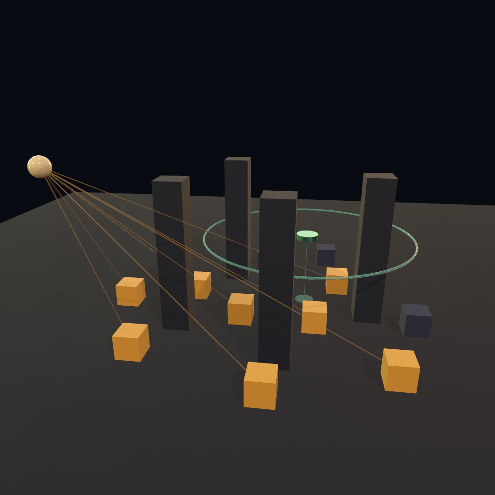

All three are in that yard. The beams are one ray per crate, so the two crates behind the pillars stay dark. The drone is holding its height with a sweep straight down, and the disc under it is where the sweep stopped. The ring is the sphere an overlap just asked with, drawn at its own radius as it fades. A pulse does not spread, and everything inside it was caught at once.

Three habits worth having early. Queries see solid bodies, so a sensor is invisible to them unless you pass `includingSensors: true`. So is a soft body, which has no single pose to hand back. `ignoring:` is how something casts from inside itself, which you will want the first time a robot's own chassis blocks its view. And none of this steps the world, so you can ask fourteen times a frame, once per crate, and find everything exactly where you left it.

The [`3D/Physics/Sightlines`](../Examples/3D/Physics/Sightlines/) example is the playable version, where you can drag a crate into cover and watch its beam go out.

A query is a question, not a move.

## Things that pass through each other

So far everything in a world collides with everything else, which is the honest default and is usually what you want. But a lot of scenes need the opposite of a wall somewhere. Sparks drift through the machine that threw them, a ghost walks through the door, confetti does not pile on itself, and a laser is stopped by only some things.

You could reach for that with logic, checking who touched what and undoing it. Ollin gives you the other way round. Put things in a named **group**, then tell the world that two groups never touch.

```swift
let bead = world.addBody(.sphere(radius: 0.2), at: p, group: "beads")
world.ignoreCollisions(between: "beads", and: "grating")
```

That is the whole thing. There's a word where you build something, and one sentence saying what it does not touch. Here are two identical tubes with identical gratings and the same beads poured into each. The only difference is that the right pour is in a group the grating was told to ignore.

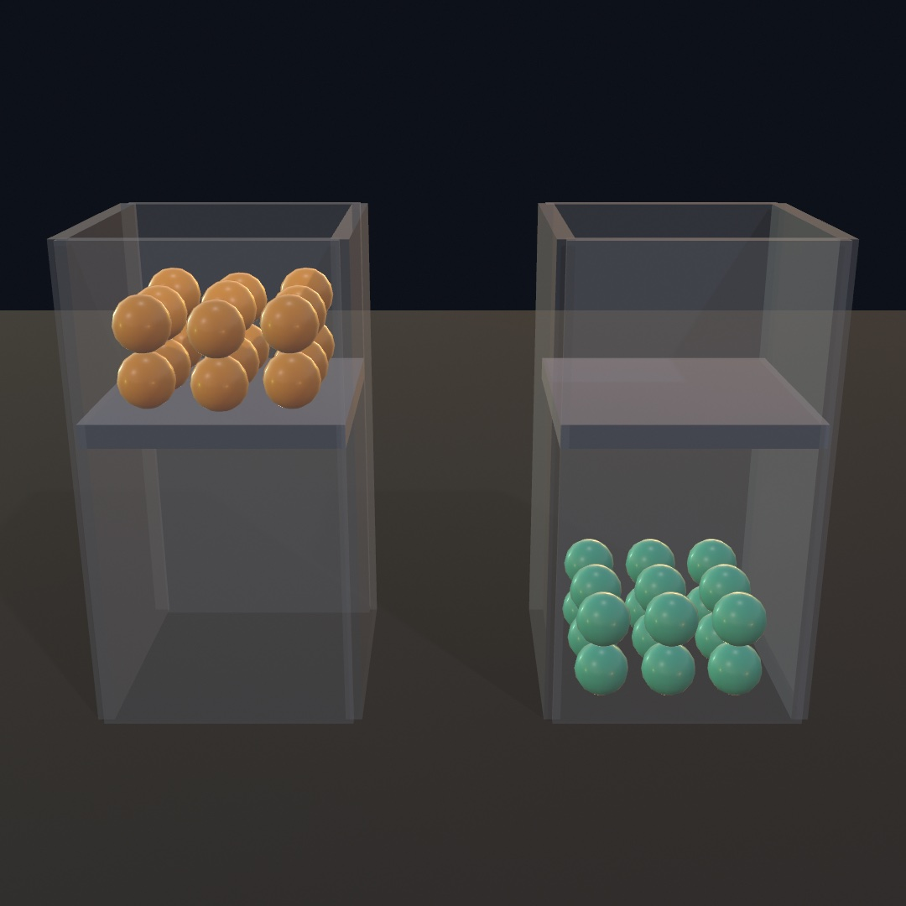

Three things about that sentence are worth having straight.

**It reads both ways.** `ignoreCollisions(between: "beads", and: "grating")` is a fact about a pair, not a direction. There is no version of this where the beads ignore the grating and the grating still stops the beads.

**Naming a group is not a rule.** A world where nobody has written an `ignoreCollisions` behaves exactly like a world with no groups at all. So you can tag things as you build them and decide later what any of it means. That also means a typo in a group name does nothing at all rather than something surprising. It is worth remembering when a rule seems to have been ignored. `world.collisionGroups` prints what the world actually heard.

**A group still collides with itself.** Two crates in one group stack normally. If you want confetti that drifts through its own drift, say so:

```swift
world.ignoreCollisions(between: "confetti", and: "confetti")
```

Everything you can add to a world takes a group, the same way it takes a density. That covers bodies, characters, vehicles, ragdolls, soft bodies, and the static scenery you import from a `Scene`. And a rule holds everywhere the pair could have met, which matters more than it sounds. A filtered pair does not collide, does not turn up in `contacts`, and is not seen by a sensor. It is walked through by a character, another character included, and is not felt by a vehicle's wheels. There is no corner of the world where the rule half-applies.

Groups also change what a question sees. Every query from earlier in this chapter takes `as:`, which asks it the way a body of that group would ask it:

```swift
world.ignoreCollisions(between: "bullets", and: "glass")

world.raycast(from: muzzle, to: target)                  // stops at the pane
world.raycast(from: muzzle, to: target, as: "bullets")   // goes right through
```

That is the piece that turns filtering from a physics trick into something you can aim with. Think of a sight line that ignores foliage, a ground probe that ignores the character doing the probing, or a targeting ray that only sees what its own shot would hit.

You can move something between groups while it runs, too. `body.group = "debris"` takes effect on the next step. Things already settled on each other are woken so the world looks at the pair again, which is how a crate that was scenery a moment ago becomes something to fall through.

The [`3D/Physics/Sieve`](../Examples/3D/Physics/Sieve/) example is a sorting machine built out of nothing else. Beads of three colors roll down one ramp with three windows set into it, and each window is told to ignore one color. Press space and the three rules are withdrawn, and the same machine stops sorting.

## Taking a direction away

A rigid body can do six things. It travels along three axes and turns about three. You can take any of them away.

That sounds like a small setting. The first thing it buys is not. A lot of sketches want a flat world, like a pin table, a side-on machine, or a puzzle of tiles that slide. Building one in 2D means giving up lighting, shadows, and solid shapes. Building it in 3D means every collision quietly pushes things toward and away from the camera until the whole thing stops reading as flat. So say the bodies may not go that way.

```swift
let bead = world.addBody(.sphere(radius: 0.2), at: p, freedom: .plane())
```

Below are two identical pin boards. The same beads are poured down each, one at a time, and every bead is given the same careless sideways nudge on the way down. The beads on the left are held to the board's plane. The ones on the right are not.

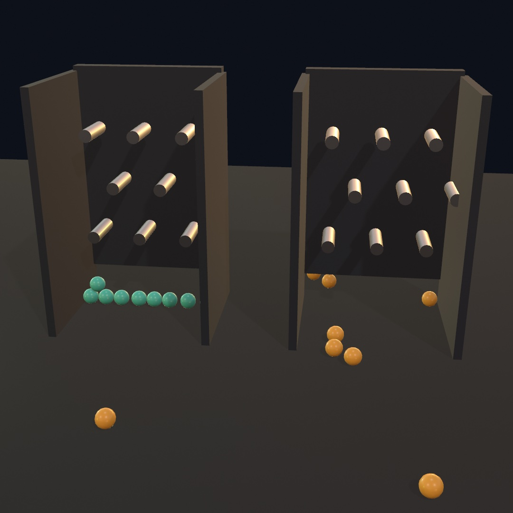

The left beads had nowhere to put that nudge, so they landed in one flat sheet. The right ones took it and left. **A locked direction is not a rule the body tries to obey. It is a direction the body no longer has.** Nothing can move it that way, not gravity, not a contact, not a joint, not even a velocity you set on it yourself.

There are names for the combinations worth wanting, and you can spell out anything else:

```swift
.all                        // the default
.plane()                    // travels in x and y, turns about z: a flat world
.plane(normal: .unitY)      // travels in x and z, turns about y: a top view
.upright                    // travels any way, turns only about up, never tips
.noTurning                  // slides and is shoved, never spins
.noMoving                   // spins where it is, never travels
[.moveX, .turnZ]
```

`.upright` is the other one you'll reach for. It suits a fridge on a dolly, a chess piece, or anything that should slide and turn without ever falling over. The one thing you cannot ask for is a tilted plane. What the solver takes away is whole world axes, so `.plane(normal:)` rounds its normal to the nearest one.

Two smaller parameters live next to it. **`gravityScale`** is how hard the world pulls on one body against the `1` everything else feels, which is a balloon and a feather in the same world:

```swift
balloon.gravityScale = -0.3      // rises
feather.gravityScale = 0.15      // falls a sixth as far in the same second
```

And **`checksPath`** is for things that are small and quick. A body that covers more than its own width between two steps can be in front of a thin wall at one step and past it at the next. It touched nothing on the way. Turn this on and the solver sweeps the body's shape along its whole path instead of only testing where it ended up:

```swift
let pellet = world.addBody(.sphere(radius: 0.05), at: muzzle, checksPath: true)
pellet.velocity = Vector3(0, 0, 120)
```

It is off by default because it is not free, though it is close. The check only runs once a body is actually moving fast for its size, so an ordinary throw lands in exactly the same spot either way. Turn it on for bullets, pellets, and anything you fire, and leave it alone for everything else.

All three can be set when you add a body and changed while it runs. The [`3D/Physics/Bagatelle`](../Examples/3D/Physics/Bagatelle/) example is a pin table with all three on a parameter. Flatten the balls or free them, make them heavy or weightless, and fire a shot quick enough to leave through a thin rail the moment you stop checking its path.

## Machines out of joints

A hinge and a slider will get you a door and a drawer. A machine wants more, and the joints left over are each one idea.

**A track.** Hand `.path` a ring of points and the second body is threaded onto the smooth curve through them, free to travel along it and nothing else. A rollercoaster car, a bead on a wire, a camera on a dolly rail:

```swift
let ride = world.connect(rails, cart,
                         .path(through: points, looping: true,
                               alignment: .followsPath))
ride.drive(at: 6)          // world units per second along the track
ride.progress              // 0 at the first point, 1 at the last
```

The curve runs *through* the points rather than between them, so a dozen of them describe a long smooth track. `alignment` decides how much of the body's turning the track takes over. `.free` leaves it tumbling, and `.followsPath` banks it into every bend. A flat `Contour` becomes a track on the ground in one call, so you can draw the route with the curve tools from [Chapter 15](15-ShapesAsMaterial.md) and then ride it.

**A rope over two hooks.** `.pulley` ties two bodies to one length of rope, so one side rising is the other falling. Read it the way you would trace it with a finger:

```swift
world.connect(tray, counterweight,
              .pulley(from: trayTop, over: leftHook,
                      and: rightHook, to: weightTop))
```

Rope behaves like rope. It resists being pulled longer and gives when it is let slack, so both ends can drop together but neither can stretch. `ratio: 2` threads the second side twice, which is a block and tackle. That side moves half as far and lifts twice as much.

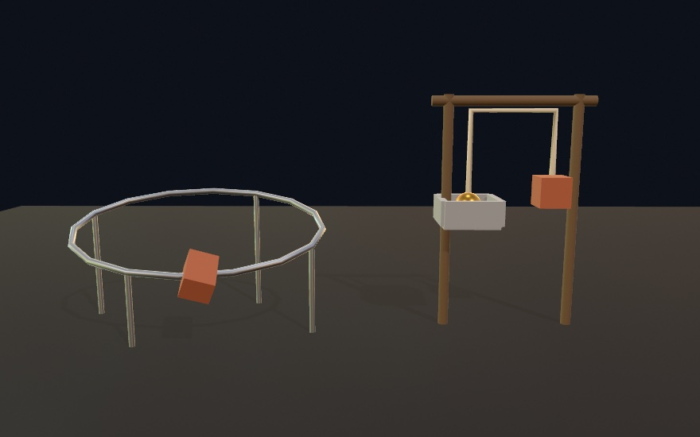

Both machines are the joint doing all the work. The cart is banked because `.followsPath` turned it into the bend, and the tray and counterweight are passing each other because one rope ties their motions together.

**The joint that is just a list of freedoms.** Every kind so far is a choice out of the six things a body can do, the same six the last section took away. When none of the named kinds fits, say which ones you're keeping:

```swift
// A post a platter rides: it may rise and it may spin, and nothing else.
world.connect(post, platter,
              .allowing([.moveY, .turnY], at: top, travel: 0...1.4))
```

`.allowing([])` is a weld. `.allowing([.turnX, .turnY, .turnZ])` is a ball joint. One turn with a range is a hinge. It is worth writing those three out once, because it shows what the whole set is made of.

**And two joints that tie other joints together.** Here is the shift worth slowing down for. **A gear does not connect two wheels. It connects two hinges.** What is tied together is not the bodies but the *motion the joints allow*, so that is what you name:

```swift
let small = world.connect(frame, pinion, .revolute(at: hub, axis: .unitZ))
let big = world.connect(frame, wheel, .revolute(at: farHub, axis: .unitZ))
world.connect(small, big, .gear(teeth: 20, and: 40))
```

Turn either hinge now and the other turns, the opposite way, at the ratio you asked for. Its sibling ties a hinge to a slider, so turning becomes sliding:

```swift
world.connect(big, rack, .rackAndPinion(travelPerTurn: 2 * .pi * pinionRadius))
```

`travelPerTurn` is how far the bar runs for one full turn of the pinion, which for a pinion of radius `r` is its own circumference. Both links compose: the machine below is one motor, two links, and four bodies.

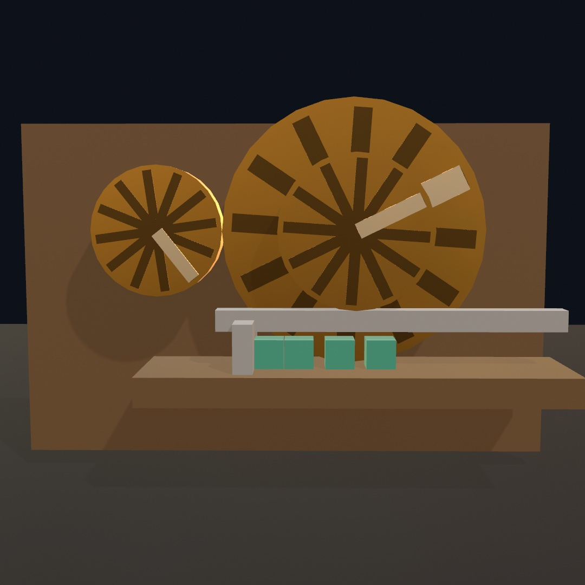

The motor only ever turns the small wheel. The big wheel is turning because the gear link says it must, half as fast and the other way. The bar is sliding because the rack link says a turn of that same shaft is a distance along the shelf. The pale spokes are there so you can see the two wheels are not at the same angle.

One gotcha will be your first one. Real gear teeth mesh, and plain cylinders just jam into each other. Tell them not to collide.

```swift
world.ignoreCollisions(between: "gears", and: "gears")
```

The [`3D/Physics/Contraption`](../Examples/3D/Physics/Contraption/) example is a workshop with one of each. There's that drive train, a hoist you can load, a platter allowed only to rise and spin, and a cart on a track. Drag any of it.

## Standing on cables

A tensegrity is a structure of struts that never touch. Cables hold them apart. Each strut pushes, the cables around it pull back just as hard, and the whole thing stands with nothing resting on anything. Kenneth Snelson built them as sculpture and Buckminster Fuller gave them the name. In the world, every part of one is a body or a joint you already know, plus one joint kind.

**The one new joint.** A `.distance` joint is a rod: it holds two anchors at a fixed spacing whichever way they are pushed. A `.cable` holds them no farther apart than its length and does nothing when they come closer. That is a rope, a tether, a guy line.

```swift
world.connect(mast, kite, .cable(from: mastTop, to: kiteNose, length: 4))
```

**The geometry comes first.** `Tensegrity` is a value: nodes, struts between nodes, and cables between nodes. Three forms come ready-made in their balanced shape. `prism(struts:)` is the simplest, `n` struts between two polygons twisted against each other. `icosahedron(strutLength:)` is the six-strut ball most people picture. `tower(levels:)` stacks prisms into a mast.

```swift
let ball = Tensegrity.icosahedron(strutLength: 1.75)
let mast = Tensegrity.tower(levels: 3, struts: 3, radius: 0.46, levelHeight: 0.95)
```

**Then it gets weight.** `addTensegrity` builds a form in the world: a capsule body per strut, a `.cable` per cable, and a `.ball` joint wherever two struts meet at a node. Set it down a little above the floor and step the world. It lands, bounces on its own cables, and stands.

```swift
let standing = world.addTensegrity(mast, at: Vector3(2.25, 0.4, 0))

// each frame:
world.advance(by: deltaTime)
fill(.white)
drawTensegrity(standing)
```

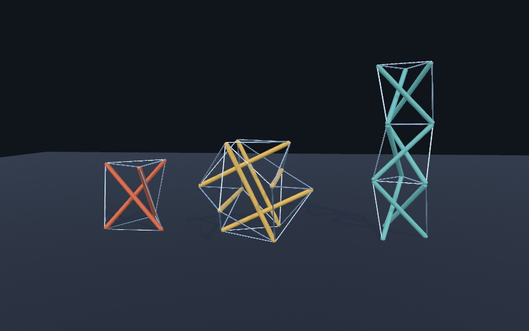

None of the three rests on a strut. Each stands on a few strut tips, and the cables carry everything in between. Drag any strut with `dragBodies(in:)` and the whole form follows, stretches, and rights itself when you let go.

**Why a prism twists by thirty degrees.** The top polygon of a prism has to turn against the bottom one. Only one angle works: a quarter turn less half the polygon's angle. Three struts want thirty degrees, four want forty-five. `imbalance` measures this. It reads near zero for the built-in forms and well above it for `prism(twist: 0.2)`. No set of taut cables can balance those struts. Build the wrong one anyway and watch it in the world. As it settles it turns toward thirty degrees on its own, since that is the only shape where every cable is taut.

**Prestress.** A real tensegrity is tightened after it is built. `prestress` does the same, making every cable a little shorter than its drawn length, two percent by default. The struts are rigid, so the cables cannot actually reach that length. They sit taut instead, and the form holds its shape through a landing. Take the prestress to zero and a hard landing can leave a cable loose.

The [`3D/Physics/Tensegrity`](../Examples/3D/Physics/Tensegrity/) example drops all three forms and lets you drag them. Space drops them again.

## Keeping what settled

Some arrangements you don't design, you find. A heap of stones tipped in one at a time and left to rock itself quiet is one of them. Four hundred steps of falling and leaning went into it, and there is no way to write it down as code. It only exists in the world's memory, and closing the sketch loses it.

So save it. `snapshot()` takes the whole world as it stands, and `restore(_:)` puts it back:

```swift
let settled = world.snapshot()      // once the heap has come to rest
// …knock it over, drag stones out of it, wreck it…
world.restore(settled)              // exactly the heap you had
```

A snapshot is a value you can keep, so it also goes to a file, which is how a heap survives quitting:

```swift
override func setup() {
    world.ground = 0
    if !world.load(contentsOf: file) {   // nothing there the first time
        buildTheHeap()
        try? world.save(to: file)
    }
}
```

Restoring is not "roughly where things were". Every body comes back in the same pose, moving at the same speed and spinning the same way. If it had gone to sleep it is still asleep, so a saved heap doesn't shudder back into shape as it arrives. A door saved standing half open is still half open, and still stops where it used to. A joint remembers the pose it was made in, and the snapshot remembers that too.

Now, you might reasonably ask why any of this is needed. If the code that built the heap is right there, why not run it again?

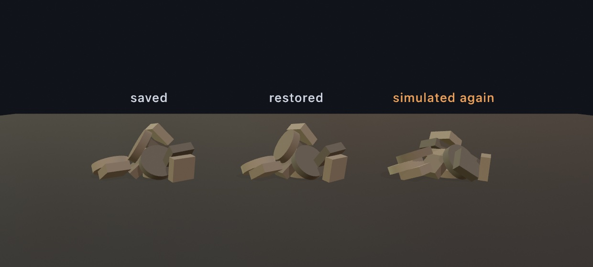

Three heaps, all from the same code. The first was simulated and captured. The second is that capture restored, which is exact. The third was simulated again with one stone released a ten-millionth of a unit higher, and that is the whole difference in the setup. Stones landing on stones magnify it: one lands a little differently, which tips the next, and by the twelfth you have a different heap.

That is not a bug, it is what falling stones are. It does mean the same code can give you a slightly different heap on a machine whose floating point rounds one bit differently. That is exactly the situation a committed figure, or a piece you want to keep, is in. **Simulating it again gives you *a* heap; only saving gives you *that* heap.**

A snapshot holds every body with its collider and all its parameters, every joint between them, gears and racks, and the collision groups and their rules. It holds the world's gravity, ground, bounce, and water. It also holds the things you built on top of those. A character comes back mid-stride. A vehicle comes back drivable and still under power, with its engine turning at the speed it was turning and its wheels already spinning. A truck restored at speed carries on rather than pulling away from rest. A ragdoll comes back where it fell.

That last one is worth a moment, because it is the one that looks impossible. A ragdoll was built from a skinned figure loaded off disk, and a file of physics has no business carrying a mesh. It doesn't. What the solver actually holds is a shape per limb, the tree they hang in, and how far each joint may bend. *That* is small enough to write down. The skin stays where it always was, your asset, in your sketch, loaded the ordinary way. So the snapshot and the sketch each keep the half they are good at, and `figure.apply(ragdoll)` puts them back together:

```swift
world.restore(saved)
if let ragdoll = world.ragdolls.first {   // the bodies are new ones
    figure.apply(ragdoll)                 // your mesh, over the restored pose
}
```

One thing to watch throughout. Restoring empties the world first, so any `Body3D`, `Vehicle3D`, or `Character3D` you were holding onto is gone. Take them from `world.bodies`, `world.vehicles`, and `world.characters` again. They come back in the order they were saved, and each body still knows its own `collider`, which is usually all a drawing loop needs.

There is one more thing worth saying about size, and it follows the same idea one step further. Almost everything in a world is small. A box is three numbers. But a terrain collider is thousands of samples, and a cloth is a whole mesh. Those get written into the file every single time you save. So name them instead:

```swift
island.assetName = "island"
banner?.assetName = "banner"
```

and say what the names mean on the way back in:

```swift
world.restore(saved) { name in
    name == "island" ? .heightfield(terrain) : .mesh(sheet)
}
```

On a yard with a terrain floor in it that is the difference between a hundred kilobytes and one. The trade is real, though, and it goes both ways. A snapshot that names nothing is self-contained, which is what lets you commit it beside the sketch and open it anywhere. So that stays the default. A name the resolver doesn't recognize costs you that one body and a note, not the restore. And a cloth needs a name to be saved at all, because a cloth is nothing but its mesh.

That is one direction, keeping a world you found. The other is picking up one somebody else made. A `.usd` file can say which of its prims are physical, and `world.addBodies(from: scene)` reads the lot. A sketch that loads such a file writes no physics of its own:

```swift
let scene = loadScene("yard.usda")!
world.addBodies(from: scene)
```

Bodies, colliders, joints, masses, materials, gravity. Reading it is lossy, and that is exactly why it works. A file's description of a body is a description, and anything it leaves out has a sensible answer waiting. Writing the same format would not be, which is why the two jobs use two formats. Import to pick up an arrangement, and snapshot to keep one.

The [`3D/Physics/Yard`](../Examples/3D/Physics/Yard/) example keeps a whole yard, with a truck in it, a figure pacing across, and another lying where it fell. Wreck it by dragging, then press R and it is back exactly. Press S, quit, and run it again, and the same yard is standing there. Its terrain floor and its banner are named by the file rather than held in it. And [`3D/Physics/Imported`](../Examples/3D/Physics/Imported/) goes the other way. Its `yard.usda` is hand-written, and the sketch is a camera and a drawing loop.

## Putting it together: the contraption

Now you can build the machine at the top. It is worth saying plainly what it is not: there is no animation anywhere in it, no keyframes, and nothing that knows what time it is. A motor turns one hinge at a steady rate. Everything else in the picture is a consequence. Make a new file, `MySketches/Contraption.swift`:

```swift
import Foundation
import Ollin
import OllinPhysics

final class Contraption: Sketch {
    @Param("Speed", 0.5...6.0) var speed = 2.6
    @Param("Teeth", 10...40) var bigTeeth = 34

    let world = World3D()
    var crank: Joint3D?
    var crates: [Body3D] = []

    let timber = Color(hex: 0x8A6A4A)
    let brass = Color(hex: 0xD9A441)
    let steel = Color(hex: 0xB9C2CE)
    let clay = Color(hex: 0xD2603F)

    // The hubs sit exactly the two radii apart, so the wheels look like they
    // mesh. The gear link does not care, but the reader does.
    let smallHub = Vector3(-1.5, 2.4, 0)
    let bigHub = Vector3(0.4, 2.4, 0)

    override func setup() {
        world.ground = 0
        world.restitution = 0.15

        // Gear teeth have to mesh, and two cylinders that touch would jam
        // instead. Nothing in the frame needs to collide with the rest of it.
        world.ignoreCollisions(between: "frame", and: "frame")

        let wall = world.addBody(.box(width: 6.0, height: 4.4, depth: 0.25),
                                 at: Vector3(-0.4, 2.2, -0.75), kind: .static,
                                 group: "frame")
        wall.userData = timber

        // A cylinder stands upright, so each wheel takes a quarter turn about
        // x to lay its axle along z, facing the camera.
        let small = world.addBody(.compound([
            .part(.cylinder(height: 0.3, radius: 0.7), rotated: .pi / 2, axis: .unitX, density: 3),
        ]), at: smallHub, group: "frame")
        small.userData = brass

        let big = world.addBody(.compound([
            .part(.cylinder(height: 0.3, radius: 1.2), rotated: .pi / 2, axis: .unitX, density: 3),
            .part(.box(width: 3.8, height: 0.16, depth: 0.5), density: 3),
        ]), at: bigHub, group: "frame")
        big.userData = steel

        let smallHinge = world.connect(wall, small, .revolute(at: smallHub, axis: .unitZ))
        let bigHinge = world.connect(wall, big, .revolute(at: bigHub, axis: .unitZ))
        world.connect(smallHinge, bigHinge, .gear(teeth: 20, and: bigTeeth))
        crank = smallHinge

        let shelf = world.addBody(.box(width: 3.2, height: 0.3, depth: 1.2),
                                  at: Vector3(2.9, 1.05, 0), kind: .static, group: "frame")
        shelf.userData = timber

        for i in 0 ..< 6 {
            let crate = world.addBody(.box(width: 0.4, height: 0.4, depth: 0.4),
                                      at: Vector3(1.9 + Double(i) * 0.5, 1.45, 0))
            crate.userData = clay
            crates.append(crate)
        }
    }

    override func draw() {
        background(Color(hex: 0x0B0E14))
        environment(.courtyard.lightingOnly())
        lightingPreset(.studio)
        castShadows()
        perspective(eye: Vector3(0.9, 4.2, 9.4), target: Vector3(0.9, 2.3, 0),
                    fieldOfView: 0.85)

        crank?.drive(at: speed, strength: 900)
        world.advance(by: deltaTime)

        // A crate swept off the shelf goes back on it, so the machine never
        // runs out of work to do.
        for (i, crate) in crates.enumerated() where crate.position.y < 0.6 {
            crate.position = Vector3(1.9 + Double(i) * 0.5, 1.7, 0)
            crate.velocity = .zero
            crate.angularVelocity = .zero
        }

        for body in world.bodies {
            withBody(body) { draw(body.collider, tint: body.userData as? Color) }
        }
    }

    // Bodies come back as colliders, so one recursive helper draws every kind
    // and a compound just draws its parts in their own local frames.
    func draw(_ collider: Collider3D, tint: Color?) {
        switch collider {
        case .box(let w, let h, let d):
            fill(tint ?? .white)
            material(.dielectric(roughness: 0.65))
            drawBox(width: w, height: h, depth: d)
        case .cylinder(let h, let r):
            fill(tint ?? steel)
            material(.metal(roughness: 0.38))
            drawCylinder(radius: r, height: h)
        case .compound(let parts):
            for part in parts {
                withState {
                    translate(part.position)
                    if part.angle != 0 { rotate(part.angle, axis: part.axis) }
                    draw(part.collider, tint: tint)
                }
            }
        default:
            break
        }
    }
}
```

Run it, then drag the tooth count. What each piece contributes:

- `ignoreCollisions(between:and:)` is what makes the machine possible at all. Two wheels that mesh have to overlap, and to the solver an overlap is a collision to push apart. Putting the whole frame in one group that ignores itself lets the geometry say "gear" while the joint does the actual work.
- The two `.revolute` joints are ordinary hinges. `.gear(teeth:and:)` then links the two *joints* rather than the two bodies, which is the part worth noticing: a joint is a thing you can hold and connect, not just a line in `setup`.
- `crank?.drive(at:strength:)` is a velocity motor. It asks for a rate and applies up to `strength` to get there, so a jammed machine stalls rather than tearing itself apart.
- The crates are the only bodies here with no joint at all. Everything that happens to them is contact, which is why they tumble differently on every run.
- `withBody(body) { ... }` puts the transform stack in that body's pose. The recursive `draw` helper then only has to know about shapes, and a compound draws its parts in their own local frames.

Before moving on, make it yours:

- Change `bigTeeth` and watch the ratio change without the drawn wheels changing at all. Then fix the drawing to match, which is the thing the joint was never going to do for you.
- Take out the `ignoreCollisions` line. The gears jam instantly, and the machine tears itself off the wall.
- Replace the gear link with `.pulley(from:over:and:to:ratio:taut:)` and hang a weight from each end.
- Add a `raycast` straight down from the end of the bar and draw where it lands, so the machine can see the shelf it is sweeping.

## Where this comes from

The 3D solver under this chapter is [Jolt Physics](https://github.com/jrouwe/JoltPhysics) by Jorrit Rouwe, vendored into the repository and wrapped behind Ollin's own API so the calls read like the 2D world from [Chapter 11](11-ForcesAndPhysics.md). Jolt is the engine behind *Horizon Forbidden West*, which is a fair indication of what it is built to survive. The impulse-solver approach it uses, where contacts and joints are satisfied by repeatedly correcting velocities rather than by solving one big system, is the line of work Erin Catto's Box2D made the standard vocabulary for, and Ollin's 2D side is Box2D for exactly that reason.

Gears, racks, pulleys and tracks as *links between joints* rather than between bodies is a constraint-solver idea rather than a graphics one. The machines it produces are much older: the gear train, the crank, and the cam are the vocabulary of mechanism design going back to Leonardo's notebooks and formalized by Franz Reuleaux in the 1870s, whose kinematic models are still the reference collection for what a linkage can do. Determinism, the promise that the same world stepped the same way lands in the same heap, is the property that makes a snapshot worth having at all. Full credits are in the project's [attribution notes](../ATTRIBUTION.md).

## Go deeper

- [3D physics](../Docs/Simulation/Physics3D.md): the whole `World3D` surface, every collider and joint kind, the query family, collision groups and layers, degrees of freedom, and [snapshots](../Docs/Simulation/Physics3D.md#snapshots) including what a saved world does and does not keep.
- [Tensegrity](../Docs/Generators/Tensegrity.md): the three ready-made forms, `imbalance`, and everything `addTensegrity` and `Tensegrity3D` take and read back.
- Appendix B draws the ideas the solver rests on: [Vectors, motion, and forces](B-JustEnoughMath.md#vectors-motion-and-forces), and [Into three dimensions](B-JustEnoughMath.md#into-three-dimensions).
- Worked examples, in [`Examples/3D/Physics/`](../Examples/3D/Physics/): `Stack` and `Tumble` (stacking and contact), `Rockslide` (a slope of debris), `Windmill` and `Contraption` (joints and linkages, the second much larger than the one here), `Trigger` and `Sightlines` (queries), `Sieve` and `Flotsam` (collision groups), and `Imported` (a world read out of a USD file).

---

[Contents](README.md#contents) · Previous: [Chapter 23, Landscapes and multitudes](23-Landscapes.md) · Next: [Chapter 25, Characters, vehicles, and cloth](25-CharactersAndCloth.md)
