#### <sup>[Ollin](../README.md) → [Guide](README.md) → Chapter 26</sup>

---

# 26. 3D, gently

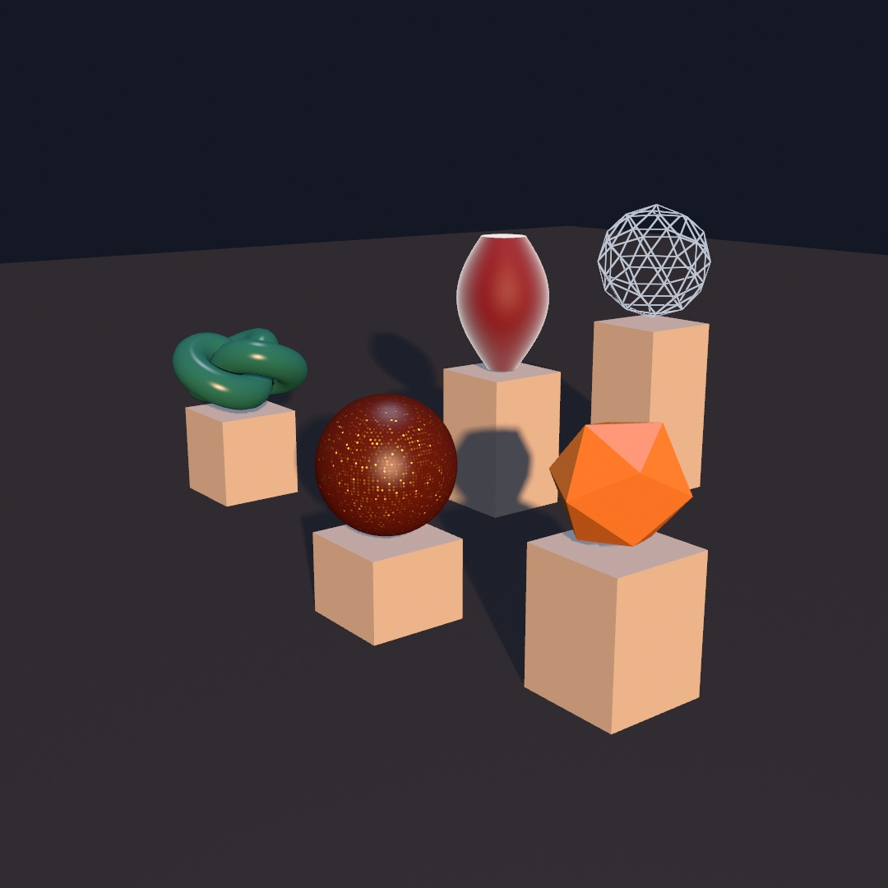

With a third axis, a sketch holds solids you can walk around, lit and shadowed like things on a table. This chapter keeps the same `draw()` and adds a camera, solids and the triangles they are made of, light, shadows, and finishes. The steps end in the sculpture court above, which you can grab and turn with the mouse. After it come area lights and contact shadows, visible air, the cartoon and matcap looks, more from depth, and type as a solid.

## A camera and a sphere

3D drawing happens in a world of its own, and a **camera** photographs that world onto the canvas each frame. A sketch becomes 3D by setting a camera, and the camera most sketches start with is one call:

```swift
import Ollin

final class FirstSphere: Sketch {
    override func draw() {
        background(Color(hex: 0x10141B))
        cameraShowcase(radius: 5)
        fill(Color(hex: 0xF25F5C))
        drawSphere(radius: 1)
    }
}
```

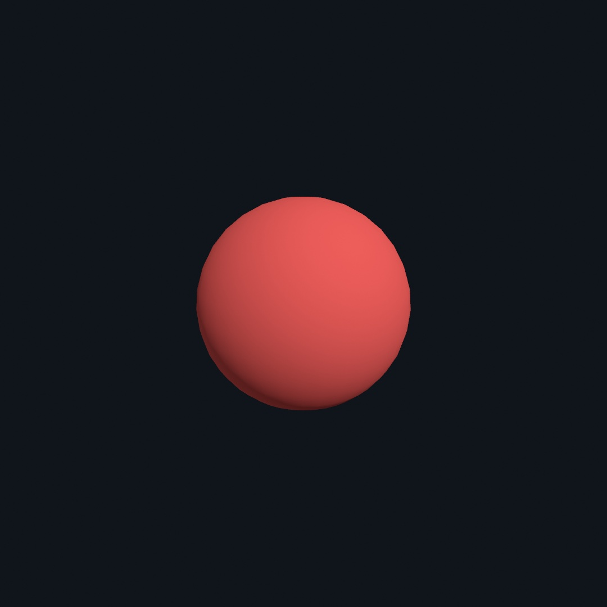

Run it live and drag. The sphere is a shaded ball, and the mouse orbits around it. `cameraShowcase` gives you the camera most 3D sketches want with no wiring at all. It circles the scene slowly on its own, and you can grab it any time. Drag to orbit, scroll to move closer or farther, and right-drag to slide the view. After ten seconds of being left alone it drifts back to the opening shot and resumes. That way a sketch on a wall keeps moving and a curious viewer can always explore. When you'd rather the camera hold still until you move it, `cameraControl()` gives you the same gestures without the automatic orbit.

Notice you set up no lights. Solids are lit by a default rig, a set of lights placed for you, so a shape looks three-dimensional from the first frame. We'll take the lights over ourselves in a few pages.

The camera's home position is three numbers. The picture to keep in mind is an eye moving over a sphere around a target:

<picture>
  <source media="(prefers-color-scheme: dark)" srcset="Images/26-3DGently/Orbit-dark.jpg">
  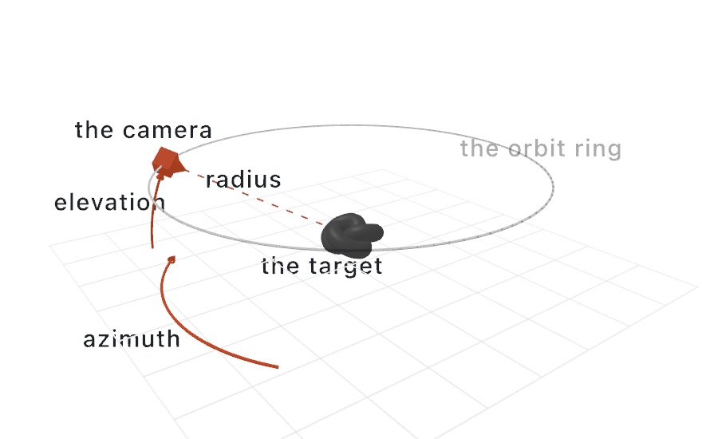
</picture>

**Radius** is how far away the eye sits. **Azimuth** is how far around it has walked, an angle in radians like every angle since [Chapter 1](01-HelloOllin.md). **Elevation** is how high it has climbed above the horizon. The automatic orbit and your drags change these three numbers, and a right-drag slides the target they circle. The fourth number is the lens. `fieldOfView` is the vertical angle the camera takes in, in radians. `fieldOfView: .focalLength(35)` frames a scene the way a 35 mm lens does on a full-frame camera, and a shorter lens sees wider. The camera is per-frame state, like the things you draw, so it's set inside `draw()`. On its first call, `cameraShowcase` takes your framing as its opening shot. After that the viewer and the auto-orbit own the pose, which is why passing the same numbers every frame doesn't fight the mouse.

> **Swift note.** `cameraShowcase(radius: 5)` leaves out the target, the elevation, and the lens, and each takes its default value. A call can skip any argument that has a default. So the same function answers to one argument here and to four later in the chapter.

Two other cameras place the eye without an orbit. `perspective(eye:target:)` puts the eye at one point and aims it at another. `ortho(eye:target:height:)` drops perspective altogether, so far things stay the size of near ones, the look of a plan or an isometric drawing.

### Keeping your bearings: views, the axis, and the ground grid

Once the camera moves, you need a way back to a known view, and the tools for that come built in. `cameraView(.front)` snaps the camera to a canonical angle, like front, top, left, or isometric, and `resetCamera()` returns to the opening shot. The host apps put the same snaps in a **Camera** menu, ⌘0 through ⌘7. They work on any running sketch without a line of code. Two more calls help while you build. `cameraAxis()` shows a small clickable x-y-z compass, and `groundGrid()` lays a faint reference floor. Both are development aids, drawn only in the live window and never in an export.

## Where things are in the world: Vector3 and world units

The sphere sat at the center of the world, which is where drawing starts. To place anything else you need the world's axes. There are three: x runs right, y runs **up**, and z runs toward you. Positions are `Vector3`s, which are [Chapter 10](10-Vectors.md)'s `Vector2` with a third number:

```swift
let p = Vector3(2, 1, -3)     // 2 right, 1 up, 3 away
```

The two types share one surface, called `Vector`. `length`, `normalized`, `distance(to:)`, `lerp(to:_:)`, `limited(to:)`, the arithmetic and the constants all belong to it, and so does `projected(onto:)`, which Chapter 10 left to its reference page. So everything Chapter 10 taught reads the same out here. It also means a helper you write once takes either kind of point:

```swift
func midpoint<V: Vector>(_ a: V, _ b: V) -> V { a.lerp(to: b, 0.5) }

let onCanvas = midpoint(Vector2(0, 0), Vector2(10, 4))
let inWorld = midpoint(Vector3(0, 0, 0), Vector3(10, 4, 2))
```

> **Swift note.** The `<V: Vector>` after the name says that `midpoint` works for any type `V` that is a `Vector`. Each call picks the type from its arguments. Swift calls this a generic function.

Some things need the third axis. A direction in space takes two angles rather than one, and a line has a ring of perpendiculars rather than a single one. One call works only here. `cross` takes two directions and hands back a third, perpendicular to both. The solids step below uses it to find the way a flat triangle faces.

Two habits from the canvas need resetting. First, in the world **y goes up**, the opposite of the canvas, where y grows downward, so a tower rises toward positive y. Second, there are no pixels here. World distances are **world units**, and a unit means whatever your scene wants it to mean. That's a meter for a room, or a sphere-width for an abstract scene. Sizes on screen come from where the camera stands.

## Depth that hides things: the depth test

One sphere showed you the camera. Place a few spheres at different distances and the next new thing appears:

```swift
override func draw() {
    background(Color(hex: 0x10141B))
    cameraShowcase(target: Vector3(0, 0.4, -1), radius: 13,
                   elevation: 0.3, fieldOfView: .pi / 4)

    fill(Color(white: 0.75))
    drawPlane(width: 40, depth: 40)

    for i in 0 ..< 6 {
        withState {
            translate(Double(i) * 0.9 - 2.1, 0.7, 2.4 - Double(i) * 2.0)
            fill(Color(hue: 0.55 + Double(i) * 0.06, saturation: 0.55, brightness: 0.95))
            drawSphere(radius: 0.7)
        }
    }
}
```

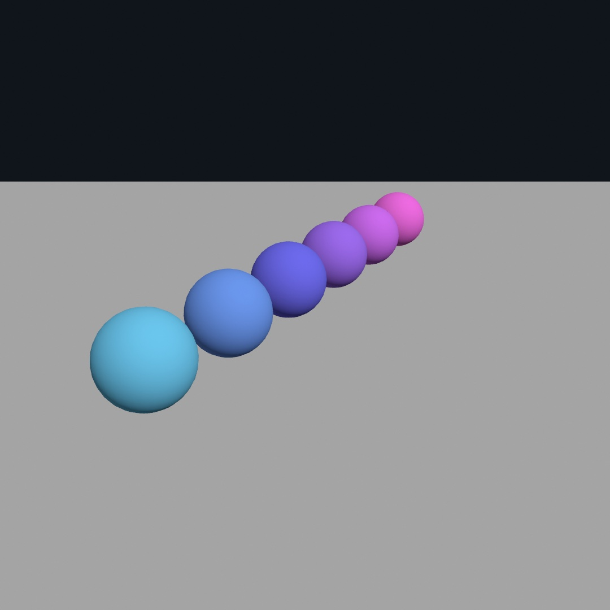

Three things happened at once. `translate` grew a third argument, so it moves things in space now. The spheres get smaller as they get farther away, because the camera has perspective. And each sphere *hides* the ones behind it. That hiding is the **depth test**, which means the renderer remembers, per pixel, how far away the nearest surface was, and anything farther loses. You never sort anything by hand. Draw in any order and the renderer works it out.

`drawPlane` is the floor, a flat sheet on the ground, and it's the stage most scenes stand on. Its sibling `drawGround()` is the same stage as a thin slab with its top at `y = 0`. It takes an optional color and material scoped to it. Reach for it once shadows and reflections should read a thickness. Smaller angles of `fieldOfView` are telephoto, which reads calm and flat and suits product shots. Bigger angles are wide-angle, dramatic and stretched at the edges. The default is 60 degrees, a fairly wide lens, so this sketch narrows it to 45 with `.pi / 4`.

## A catalog of solids

The sphere is one solid among many. Each of these is one call, shaded and depth-tested like everything else:

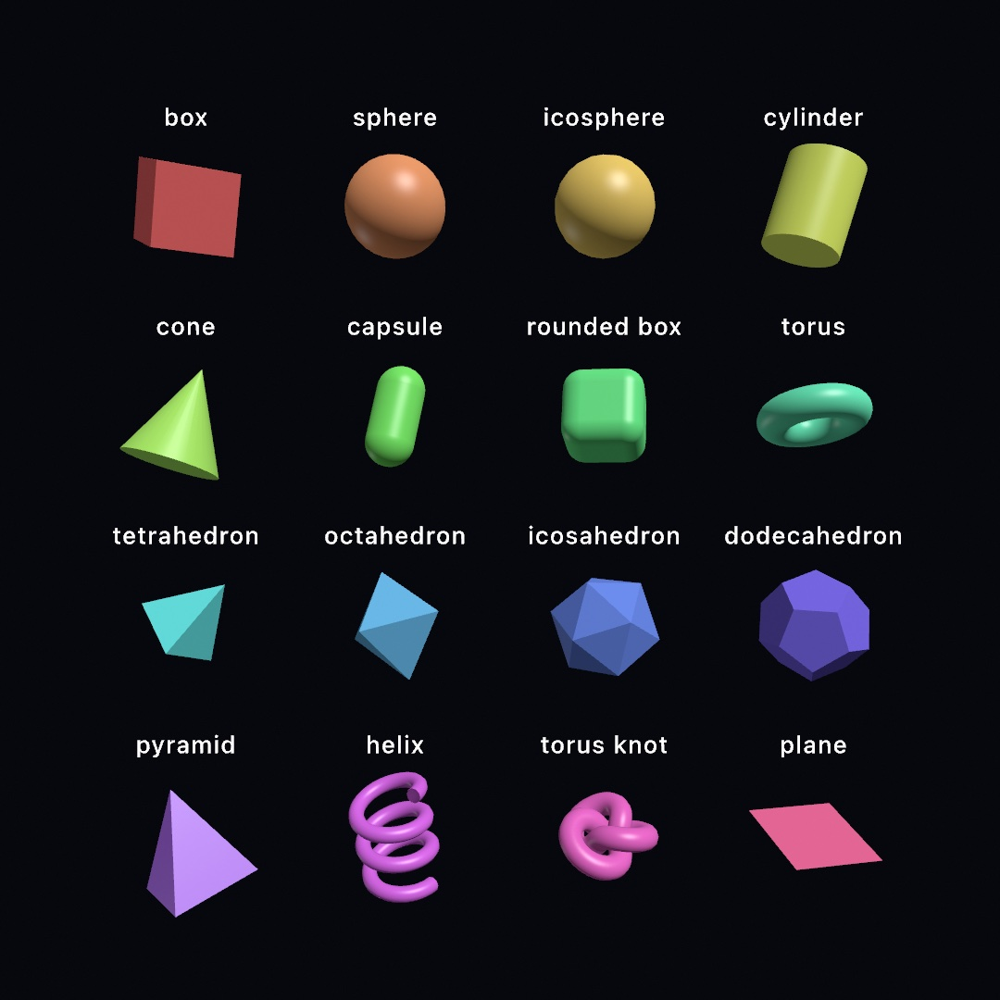

The names are what you'd guess: `drawBox(size: 1.5)`, `drawTorus(radius: 0.6, tube: 0.25)`, `drawCone(radius: 0.7, height: 1.5)`, and so on. Past the everyday ones there's also a small shape *factory*. `drawSupershape` and `drawSuperellipsoid` sweep whole families of organic and gem-like forms from a few numbers. `drawExtrude` pushes any flat 2D shape into depth. `drawLathe` revolves a side profile into a vase, and `drawTube` sweeps a tube along any 3D path. The `3D/Geometry/ShapeFactory` example is the tour.

Under every one of these calls is a **`Mesh`**, the shape as a set of triangles. Every 3D surface here is made of them. The `draw*` calls rebuild their mesh every frame, which is fine for a box and wasteful for a dense knot. The pattern for anything heavy is the one you know from images and fonts, build once, draw forever. The `segments` and `sides` below say how finely the knot is cut into triangles, along its length and around its tube:

```swift
let knot = Mesh.torusKnot(radius: 0.62, tube: 0.2, segments: 220, sides: 14)
// …each frame:
drawMesh(knot)
```

### What a solid is made of: triangles and normals

The lighting, the outlines, and the matcaps later in this chapter all read a mesh's triangles, so it helps to see them first. `wireframe()` shows them. It is drawing state like `fill`. From that call on, a mesh draws as the edges of its triangles, in the current `stroke` color and `strokeWeight`, with the faces see-through:

```swift
let ball = Mesh.icosphere(radius: 1, subdivisions: 1)   // built once
// …each frame:
wireframe()
stroke(Color(hex: 0xBFC7D5)); strokeWeight(1.5)
drawMesh(ball)
```

> **Swift note.** A semicolon lets two statements share a line. The listings use it for a pair that belongs together, like a stroke color and its weight.

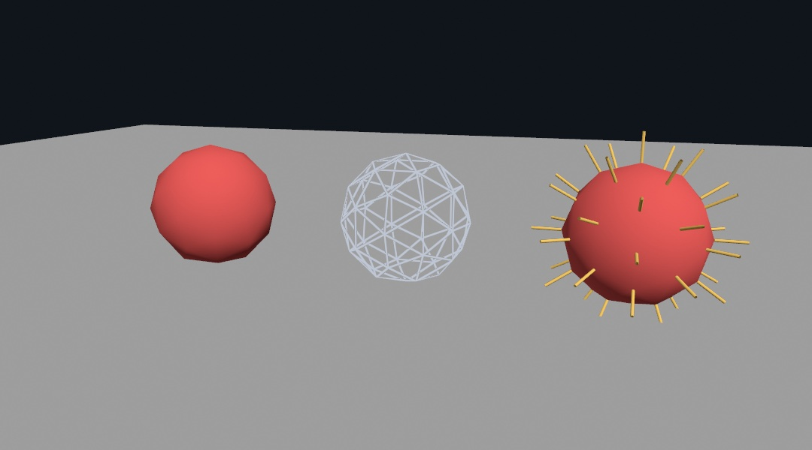

The middle ball is the same icosphere as the left one, drawn as its net. An icosphere is a ball made by splitting the twenty faces of an icosahedron, and `subdivisions` is how many times, so 1 is a coarse one. A wireframe takes no light, because there is no face to shade. It still takes the depth test, so a solid in front of it hides its lines. `wireframe(false)` goes back to solid, and `withState` scopes it like any other state. It is the look for a form still being worked out, and the finished sketch puts one on a plinth that way.

The right-hand ball shows the other thing every corner of the net carries. Besides its position, a vertex has a **normal**, the direction the surface faces at that point. The right-hand ball draws each one as a short tube standing straight out of the surface. Hold a ball and push a pin into it, and the pin points along the normal. On a sphere the normals point away from the center. On a box, every face's four corners share the face's own normal. So a corner position holds three normals, one for each face that meets there. For a flat face the normal is the `cross` of two of its edges. Name its corners `a`, `b`, and `c`, running counter-clockwise as you look at the face. Then `(b - a).cross(c - a).normalized` points straight out of it. Shading is a question asked of the normal. How squarely does this point face the light? A normal turned toward the light reads bright and one turned away reads dark. That falloff is what made the first sphere read as a ball. The icosphere's normals point away from its center even where its triangles are flat, which is why a coarse one shades round.

A mesh hands its normals back beside its positions, as two lists of the same length matched by index. `zip` from [Chapter 7](07-Tiles.md) pairs them:

```swift
fill(Color(hex: 0xFFD166))
for (p, n) in zip(ball.positions, ball.normals) {
    drawTube([p, p + n * 0.42], radius: 0.022, sides: 6)
}
```

`drawTube` sweeps a tube along a path of 3D points, and two points make a straight one. Every catalog shape comes with its normals, and later sections lean on them. The outline pushes a copy of the mesh out along them, and a matcap reads its color from where they point. [Chapter 27](27-Meshes.md#relief-from-a-picture-normal-maps) bends them with a picture without moving a single triangle.

## Placing things: transforms compose

You've been using `withState` and `translate` since [Chapter 6](06-GridsAndRepetition.md). In 3D they're joined by `rotateX`, `rotateY`, and `rotateZ`, each spinning around one axis, and by the same `scale`. The important idea hasn't changed: **every move builds on the moves before it**. In 3D that compounding is where structures come from:

```swift
override func draw() {
    background(Color(hex: 0x10141B))
    camera(.orbiting(target: Vector3(0, 4.4, 0), radius: 15,
                     azimuth: 0.7, elevation: 0.22, fieldOfView: .pi / 4))

    // The center post the treads wind around.
    withState {
        translate(0, 4.4, 0)
        fill(Color(white: 0.35))
        drawCylinder(radius: 0.22, height: 9.4)
    }

    for i in 0 ..< 26 {
        translate(0, 0.34, 0)          // each tread builds on the last:
        rotateY(0.34)                  // a step up and a turn
        withState {
            translate(1.25, 0, 0)      // out to the side, this tread only
            fill(Color(hue: 0.55 + Double(i) * 0.012, saturation: 0.5, brightness: 0.95))
            drawBox(width: 2.1, height: 0.15, depth: 0.85)
        }
    }
}
```

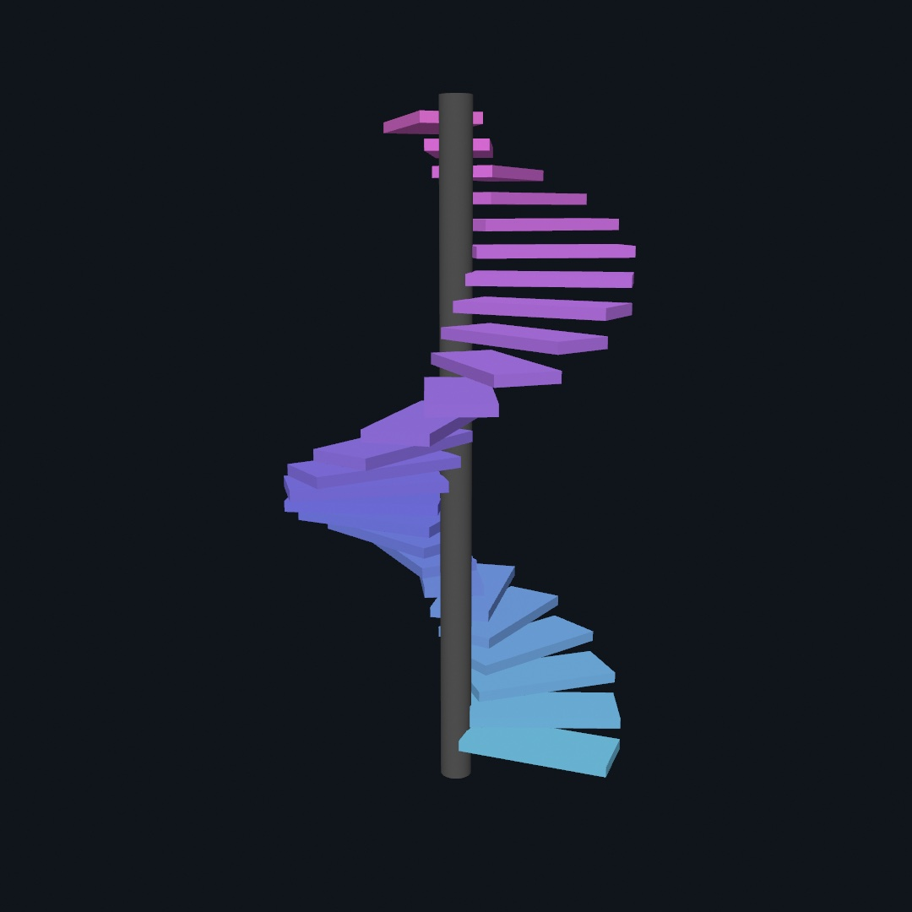

Read the loop closely, because it uses both halves of the tool. The climb and the turn sit *outside* any `withState`, so they accumulate, step after step, and that accumulation is the spiral. The sideways step to hang each tread off the post sits *inside* a `withState`, so it applies to one tread and is forgotten. One repeated move-and-turn builds the staircase.

This sketch also shows the plain `camera(.orbiting(...))` call, a fixed pose you specify completely, with no mouse involved. Reach for it when you want to compose a shot, and for `cameraShowcase` when you want the scene alive and explorable.

Nesting `withState` blocks builds solar systems. Translate to a planet and draw it, then translate again and draw its moon, and the moon inherits the planet's motion. The `3D/Geometry/Transforms` example is that, three transforms deep.

## Light: presets and the kinds of light

Everything so far wore the default lighting. Taking over is one call before you draw, and the fastest way to feel what lighting does is to swap whole moods:

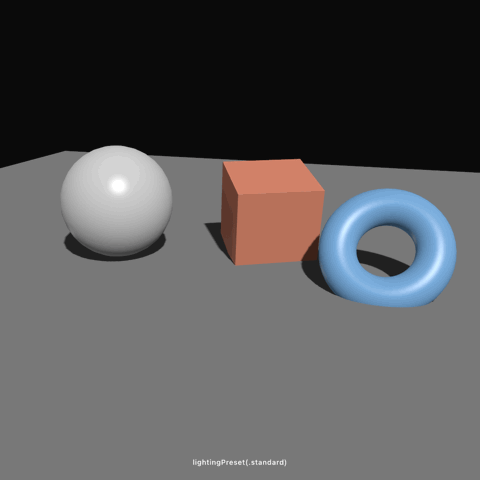

```swift
lightingPreset(.goldenHour)     // one call relights the whole scene
```

The six presets (`.standard`, `.threePoint`, `.goldenHour`, `.noir`, `.studio`, `.moonlight`) are each an ambient wash plus a few placed lights, tuned like film rigs. A film rig names its lights by their jobs. The key is the main light, the fill lifts the side the key leaves dark, and the rim comes from behind to edge the outline. Play with them first, because the mood of a 3D sketch is mostly its light. Put the preset on a parameter and step through them while the scene runs.

When you're ready to place your own, there are three kinds of light, and one scene can carry all of them:

```swift
ambientLight(Color(white: 0.1))                                     // a floor for the shadows
directionalLight(Color(hex: 0xFFD9A8), direction: Vector3(-0.6, -1, -0.35), intensity: 0.7)
pointLight(Color(hex: 0x39D8E8), at: Vector3(2.7, 1.7, 1.9), intensity: 0.9,
           castsShadow: false)
spotLight(Color(hex: 0xE85FD0), at: Vector3(-3.4, 4.6, 2.6),
          direction: Vector3(0, -1, 0), coneAngle: .pi / 5, penumbra: 0.4,
          intensity: 1.2)
castShadows()
```

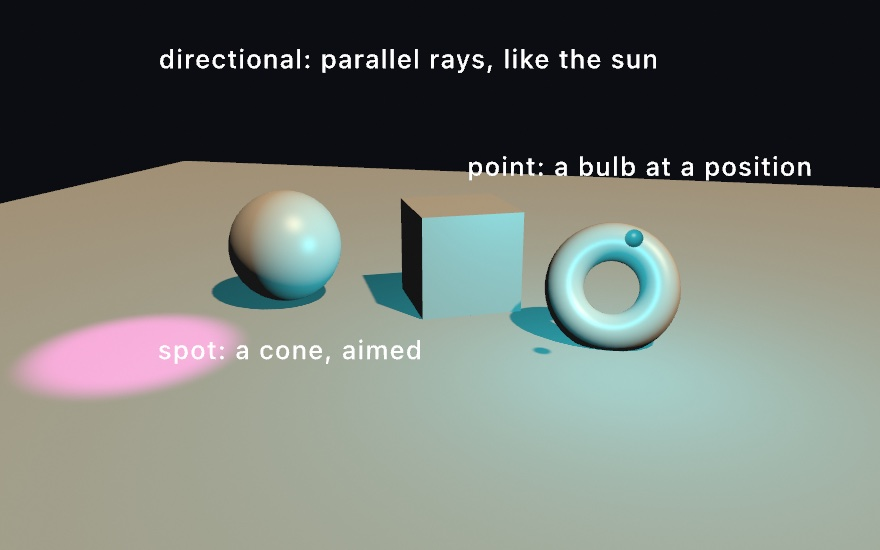

A **directional** light is the sun, parallel rays from a direction, with no position of its own, lighting everything evenly. A **point** light is a bulb at a place, so each surface catches it from its own direction. It reaches equally far forever unless you give it a `reach:`, which [Chapter 29](29-Landscapes.md#a-courtyard-of-lamps-many-lights) teaches. A **spot** is a point light narrowed to an aimed cone, with a `penumbra` for how soft its edge falls. The `ambientLight` is a flat wash added to every surface so the unlit sides aren't pure black. Each light takes an `intensity`, and in the figure each has its own color so you can see which light does what. The warm key shades everything, the cyan bulb lights the faces turned toward it, and the magenta cone pools on the floor. A small ball marks the bulb, so the bulb passes `castsShadow: false`, and the shadow step says why.

Lights can do two more things, and the reference covers each. A light can be shaped. An **IES profile** gives a point or spot light the measured throw of a real fixture. A **cookie** projects an image through a spot's cone. A stage light does the same through a cut metal plate called a gobo, which throws a pattern onto the set. The [light shaping reference](../Docs/3D/3D.md#light-shaping-ies-profiles-and-cookies) has the details. The `3D/Lighting/LightShaping` example puts a downlight, a batwing, a wallwasher, and a window over one floor. And since lights are drawing state, one frame can hold several rigs. `withLights` gives a block its own lamps, and `withoutLights` draws it flat. The [light sets reference](../Docs/3D/3D.md#light-sets) covers them, and the `3D/Lighting/LightSets` example is three rooms under three rigs.

Two smaller dials finish the surface's response to light. `specular(_:)` sets how strong the highlight is (0 is matte) and `specularSharpness(_:)` how tight. The materials step below sets both at once by name, so you will rarely touch them. The listing above has one more line than the lights, and it is the next step.

## Shadows, and what they tell you

**`castShadows()`** is what plants objects in a scene. Without it, a floating sphere and a resting sphere look the same, because nothing in the picture says where either one is. A shadow answers that.

```swift
directionalLight(.white, direction: Vector3(-0.22, -1, -0.16))
castShadows()
shadowSoftness(1)

drawPlane(width: 14, depth: 8)                                  // something to catch them
withState { translate(0, 3.9, 0); drawSphere(radius: 0.5) }     // and something to cast one
```

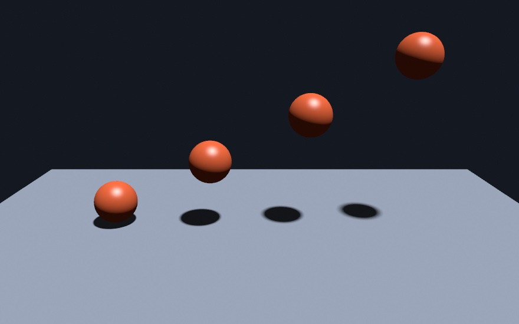

The figure has four identical spheres, one floor, and one light. The shadow is the only thing in the picture that says which sphere rests on the floor and which is highest. Two things change as a sphere climbs. The shadow drifts away from it, and the edge gets softer. The one on the left, touching down, has a tight ellipse with a crisp edge. The one on the right, three and a bit units up, has a dark ellipse whose edge fades softly into the floor.

That softening is what makes a rendered shadow read as real. Shadows here are **contact-hardening** by default, so they are sharp where an object meets a surface and softer as the shadow falls away. `shadowSoftness(_:)` sets how strong the effect is, from `0` for a hard edge, the classic look, through the `0.5` default to `1`. The figure asks for `1` so the difference is easy to see at this size. At the default it is subtler and usually what you want.

Some practical notes, in the order you meet them:

- **You need something to catch a shadow.** A sphere alone in space casts into nothing. A floor, or another object, is what makes the shadow visible.
- **Shadows are opt-in and per-frame.** A sketch that never calls `castShadows()` pays nothing at all, so shadows cost you only when you ask. Call it in `draw()` alongside the lights, and `noShadows()` turns it back off.
- **Every light casts**, up to four of them, and *Two lights, two shadows* below says what that means. The default rig's key light is directional, so a scene you haven't relit already works.
- **Nothing needs aiming.** The shadow's frame auto-fits around whatever the camera is looking at.

The three kinds of light cast by different routes, which mostly matters because it explains the cost. A directional or spot light renders the scene once from the light's own viewpoint. The result is a **shadow map**, a picture of how far the light can see. The light then darkens whatever that view can't see. A point light casts in every direction at once. So on Apple silicon it traces rays from each lit pixel toward the light. That is exact, with none of the small offsets a shadow map needs, and the most expensive of the three. On a GPU that can't trace rays it falls back to a depth map sampled by direction. Point shadows still work everywhere, and your sketch doesn't change either way.

If a penumbra looks grainy rather than smooth, that's the sample count, not the softness. `shadowQuality(.detail)` asks for more samples relative to whatever GPU is running, and `shadowSamples(16)` sets an exact number.

### Two lights, two shadows

Stand under a streetlight with a lit shop window behind you and you have two shadows. So does a sketch. `castShadows()` casts from every light in the frame, and each shadow lands where its own light puts it:

```swift
directionalLight(Color(hex: 0xFFD9A8), direction: Vector3(0.62, -0.72, -0.3))    // warm, from the left
directionalLight(Color(hex: 0xA8CCFF), direction: Vector3(-0.62, -0.72, -0.3))   // cool, from the right
castShadows()
```

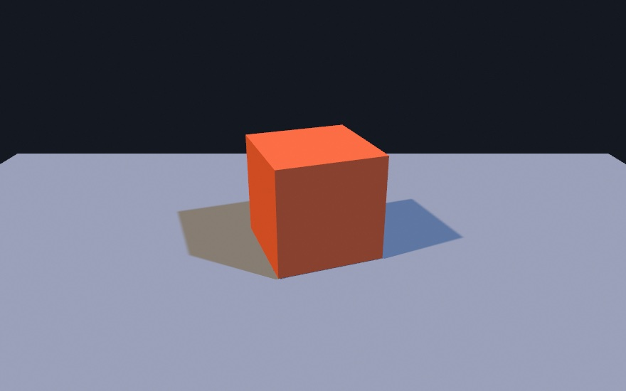

Each light throws its own shadow, and the two fan apart. Nothing chose between the lights. Now look at their color. The left shadow is warm and the right one is blue. A shadow is what is left when one light is blocked. The patch on the left has lost the cool light and kept the warm one. A second caster brings that color with it.

The dial you reach for most tells a light not to cast:

```swift
directionalLight(Color(white: 0.7), direction: Vector3(0, -1, 0.5), intensity: 0.25,
                 castsShadow: false)          // a fill: it lifts the dark faces and throws nothing
```

Reach for that on a fill light. A fill exists to open up the shadow side, so a shadow of its own works against it. The picture usually reads better with one clear shadow than with three faint ones fighting. It is also where the cost sits. Every caster renders the scene again from its own point of view, so three casters is three passes. The rigs `lightingPreset(_:)` installs already do this: the key casts, the fill and rim do not. That is why a preset gives you one clean shadow rather than several overlapping ones.

Mixing kinds is fine. A point light standing beside a directional key throws its own shadow, and so does a second point light beside the first:

```swift
directionalLight(Color(hex: 0xC9DBFF), direction: Vector3(-0.62, -0.78, -0.20),
                 intensity: 0.95)                               // a cool key from the right
pointLight(Color(hex: 0xFFC079), at: Vector3(-4.6, 3.2, 2.2), intensity: 1.5)   // a warm lamp on the left
castShadows()
```

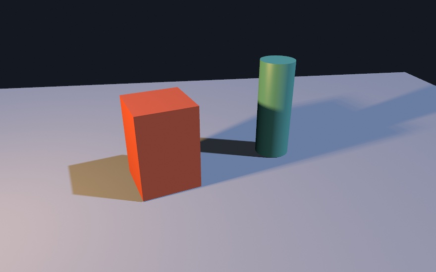

Read the colors again. The patch on the left is warm because the lamp still reaches it, and the band on the right is cool because the key does. Where the two cross, neither does.

A point light is the expensive kind, since it casts every way at once, and a frame can hold several of them. That cost is why a frame casts from **four** lights at most, the ones you set first. The rest still light the scene.

And the shadow on the floor is only the visible half. Everything else that reads a shadow follows every caster too, so a second caster adds work well beyond the floor. That is what the limit of four protects.

A point light has a position and no body, so nothing stops you drawing a small ball there to show where it sits. Do that with a casting point light and the ball wraps the light in its own shadow, and the scene goes dark. Either mark it with something the light stands clear of, or tell that light not to cast.

## Materials

The shadows planted the shapes on the floor. What each one seems to be made of is its **material**, the way its surface catches light, picked by name. The color still comes from `fill`, and the *finish* comes from `material`:

```swift
fill(Color(hex: 0x2C8C86))      // the color
material(.velvet)               // the finish
drawSphere(radius: 1)
```

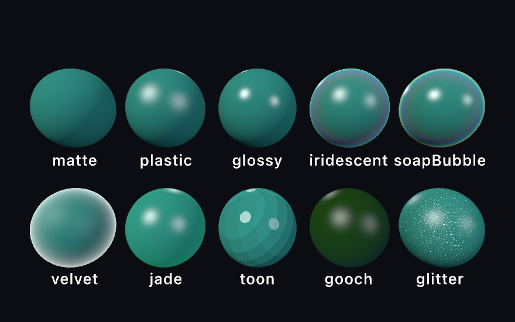

That's ten finishes on one color. The library runs from matte through glossy to the showpieces. `.iridescent` and `.soapBubble` shift hue as the view moves, `.velvet` glows at the edges, and `.jade` lets light through thin parts. `.toon` and `.gooch` are the stylized cartoon and warm-to-cool looks, and `.glitter` is full of tiny mirror flakes that flash as anything moves. `material(_:)` is drawing state like `fill`, saved by `withState`, so every shape in a frame can have its own.

A `Material` is also a plain value you can tweak. Car paint is the classic recipe, gold flakes over a deep red:

```swift
var paint = Material.glitter
paint.sparkleColor = Color(hue: 0.12, saturation: 0.75, brightness: 1)
material(paint)
fill(Color(hue: 0.02, saturation: 0.8, brightness: 0.4))
drawSphere(radius: 0.62)
```

> **Swift note.** `var paint = Material.glitter` copies the preset into a value you can change. The original stays as it was, because a `Material` is a value like a `Color`.

There's a further tier, the physically based metals and plastics (`material(.metal(roughness: 0.2))`), that needs surroundings to reflect. [Chapter 28](28-MaterialsAndSurroundings.md#finishes-you-measure-environments-and-physically-based-materials) teaches it, where environments light the scene.

One more thing to keep straight as you combine finishes. Ollin draws several *kinds* of 3D thing, and they reach the screen by different routes, so a finish applies unevenly. Solid meshes are the fullest citizens, taking materials, textures (pictures wrapped onto a surface, [Chapter 27](27-Meshes.md#a-picture-wrapped-around-it-textured)'s first subject), shadows, and reflections. A wireframe takes none of the light, as the solids step showed. The raymarched fields of [Chapter 32](32-SculptingWithFields.md) take materials, environments, and shadows by a route of their own. Point clouds, which [Chapter 35](35-Depth.md) draws, are dots that always face the camera, and they take neither lighting nor shadows. When something you expected to apply does nothing, the [combining reference](../Docs/3D/Combining.md) is a table of what stacks with what.

## Putting it together: the plaza

The finished sketch is a small sculpture court you curate yourself. There are five plinths and five pieces, each with a different finish, under golden-hour light with soft shadows. The camera orbits until you take over. Make `MySketches/Plaza.swift`:

```swift
import Ollin

final class Plaza: Sketch {
    // Built once; drawn every frame.
    let knot = Mesh.torusKnot(radius: 0.62, tube: 0.2, segments: 220, sides: 14)
    let vase = Mesh.lathe((0...24).map { i in
        let t = Double(i) / 24
        return Vector2(0.16 + 0.36 * sin(t * .pi * 0.92), (t - 0.5) * 1.5)
    }, segments: 44)
    let pearl = Mesh.sphere(radius: 0.62, segments: 48, rings: 32)
    let gem = Mesh.icosahedron(radius: 0.55)
    let sketchWork = Mesh.icosphere(radius: 0.66, subdivisions: 1)

    override func draw() {
        background(Color(hex: 0x141824))
        cameraShowcase(target: Vector3(0, 1.15, 0), radius: 12,
                       elevation: 0.26, fieldOfView: .pi / 4.4)
        lightingPreset(.goldenHour)
        castShadows()

        // The court floor.
        fill(Color(hex: 0x3A3D45))
        specular(0.05)
        drawPlane(width: 60, depth: 60)

        // Each piece: move to its plinth, draw the plinth, lift, spin, draw.
        withState {
            translate(-3.2, 0, 0.6); plinth(1.0)
            translate(0, 1.5, 0); rotateY(time * 0.24)
            material(.glossy); fill(Color(hex: 0x2C8C86))
            drawMesh(knot)
        }
        withState {
            translate(-1.0, 0, -1.6); plinth(1.55)
            translate(0, 2.32, 0)
            material(.velvet); fill(Color(hex: 0x8C1F35))
            drawMesh(vase)
        }
        withState {
            translate(1.0, 0, 1.4); plinth(0.75)
            translate(0, 1.4, 0)
            var paint = Material.glitter
            paint.sparkleColor = Color(hue: 0.12, saturation: 0.75, brightness: 1)
            material(paint); fill(Color(hue: 0.02, saturation: 0.8, brightness: 0.4))
            drawMesh(pearl)
        }
        withState {
            translate(3.3, 0, 0.9); plinth(1.2)
            translate(0, 1.7, 0); rotateY(time * 0.3); rotateX(0.15)
            material(.toon); fill(Color(hex: 0xE08A3C))
            drawMesh(gem)
        }
        withState {
            translate(-0.4, 0, -3.4); plinth(2.0)
            translate(0, 2.72, 0); rotateY(time * -0.2)
            wireframe()                       // one piece still being imagined
            stroke(Color(hex: 0xBFC7D5)); strokeWeight(1.2)
            drawMesh(sketchWork)
        }
    }

    // A stone block whose top lands at `height`.
    func plinth(_ height: Double) {
        withState {
            translate(0, height / 2, 0)
            material(.matte); fill(Color(white: 0.88))
            drawBox(width: 0.95, height: height, depth: 0.95)
        }
    }
}
```

The showcase camera from *A camera and a sphere* orbits the court and hands the view to the mouse. Its five meshes, a knot, a lathe, a sphere, an icosahedron, and a coarse icosphere, are built once from the catalog. `drawMesh` draws them every frame. The transform stack places each one. A block translates to its spot, draws the plinth, then keeps translating upward for the piece, and two of them turn on `time`. One preset lights the court and one `castShadows()` plants everything on the floor. Each sculpture has its own material, with the car-paint recipe from the materials step on the sphere. And the last piece is drawn with `wireframe()`, mesh edges only, for a form that's still a proposal.

> **Swift note.** `plinth(_:)` is a function of your own with an unlabeled argument, as [Chapter 17](17-MarksAndMedia.md)'s were. The vase's profile is built by a `map` whose closure has two statements. So it names its result with `return`, the way Chapter 17's returning functions did.

Then make it yours:

- Recast the show by swapping in a supershape or a lathe of your own profile on the tallest plinth. After [Chapter 27](27-Meshes.md), try a loaded model there.
- Relight it. `.noir` turns the court into a crime scene, and `.moonlight` into a garden at night. Put the preset on a `@Param` menu parameter.
- Give the pearl's plinth a slow `rotateY` of its own and let the whole pedestal turn.
- After *Shading from a picture* below, try `matcap(.chrome)` on the gem and notice what stops responding. Lights and shadows go quiet, and only the view still matters.

The court turns on its own, so keep it as a video. `swift run OllinLive MySketches/Plaza.swift --export-video plaza.mp4 --seconds 12` records the first twelve seconds of the orbit. For a print, `--export plaza.png --frame 210` keeps one frame as a still.

## More from the lights: area lights and contact shadows

The plaza lit its court with a preset, a rig of lights that are each a point or a direction, and one of them casting. More belongs to the same idea. A light can have a body, which changes how soft everything it touches becomes. And the shadow under a resting thing can be finished at the seam where a shadow map gives out.

### A light with a body: area lights

The lights in the lighting step have no size. A directional light is a direction, and a point or spot light sits at a single point. An **area light** gives light a body. `rectangleLight` is a glowing panel, a softbox or a window. `diskLight` is a glowing circle, and `tubeLight` is a glowing cylinder strung between two points, a neon. They are for the studio-photography look, where the size of the light is the softness of the picture. A small source gives hard shadows and a tight highlight, and a large one gives soft pools and a broad sheen. The shading under them is the linearly transformed cosines technique of Eric Heitz, Jonathan Dupuy, Stephen Hill, and David Neubelt (2016). It is how a renderer adds up the light from a whole glowing shape in real time, instead of from one point.

What a body buys you is easiest to see by changing its size and nothing else:

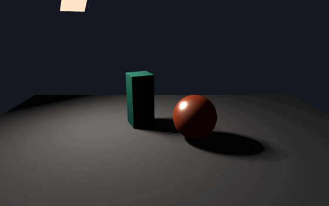

```swift
let side = 1.0 + pingPong(over: 6) * 2.2
let facing = Vector3(0.55, -0.58, 0.6)          // aimed down across the set
rectangleLight(Color(hue: 0.09, saturation: 0.22, brightness: 1.0),
          at: Vector3(-3.4, 4.8, -1.2), direction: facing,
          width: side, height: side, intensity: 70 / (side * side))
castShadows()
```

`intensity` means something different here. It is the glow of the surface itself, so brightness falls off with distance on its own. A bigger panel pours more light at the same glow. A thin tube is a small piece of sky, so it lights less than a panel at the same glow. The listing divides the panel's glow by its area as it grows. The light poured on the set never changes, so you can watch what size alone does. Three things move together. The highlight on the sphere is the panel's own reflection, so it grows from a small window into a broad sheen. The shading wraps further around each form, because more of each surface can see some part of the panel. And the cast shadows, sharp when the panel is small, spread into soft-edged pools. They stay crisp where the box meets the floor and widen the farther they fall. Here all three hang on one number.

Shadows work the way the shadow step said, with the panel's size standing in for a light's position. A rect or disk panel is picked as the caster when no directional, spot, or point light in the frame casts. Its penumbra comes from the panel's extent, with nothing to set. `shadowSoftness(_:)` scales that extent rather than some separate size. So `0` is hard, the `0.5` default is the panel's true size, and `1` is twice as soft. A tube never casts. It glows in every direction, so there is no side to draw a shadow from. Lights are invisible, so to show a panel, draw a prop a step *behind* the emitting plane. The glowing slab in the figure is drawn that way. A casting panel treats any geometry in front of that plane, a prop included, as an occluder.

The `3D/Lighting/AreaLights` example stages all three shapes over a glossy floor, its softbox breathing so the shadows harden and soften with it. Put it beside `3D/Lighting/Lighting` to compare a bulb with a panel.

### The seam under a resting thing: contact shadows

Even a good shadow map falls short in one place, the line where an object touches the ground. Those are the most important few pixels in the picture. A map has finite resolution, and it needs a small offset, the **bias**, or a surface shadows itself in speckles. That bias nudges its shadow slightly away from the caster. The last sliver of contact opens up, and a resting box can read as floating a hair above the floor. A **contact shadow** is the fine dark line that closes that seam. For each pixel the renderer walks a short ray toward each casting light through the scene's own depth. Where something nearby blocks the way, it darkens the pixel. It is for seating anything that rests on anything, and the wider your soft shadows, the more it does. The short screen-space march comes from production game renderers, where it is a standard pass beside the shadow map.

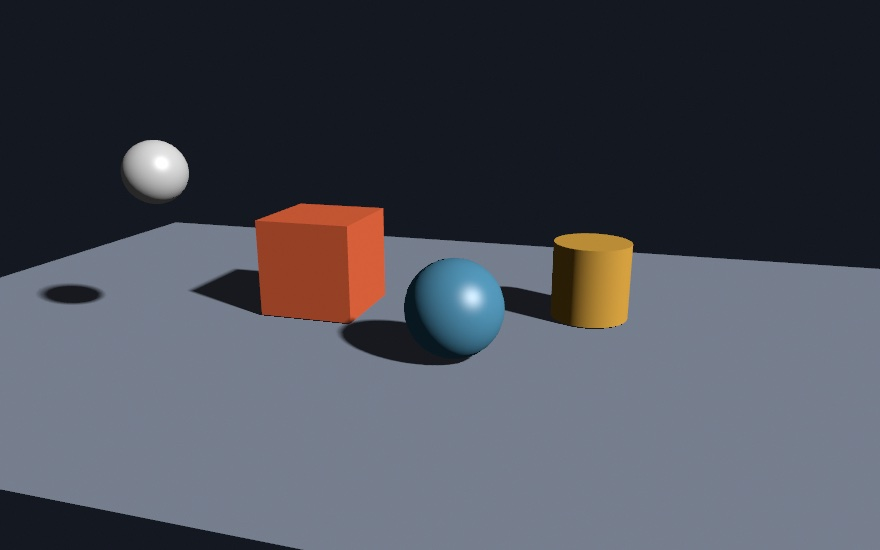

```swift
castShadows()
shadowSoftness(0.9)   // a wide, soft look, and every base goes loose
contactShadows()      // the short march that seats them again
```

The three resting solids each get the tight dark line at their base. The hovering sphere, the one thing off the ground, gets only the soft drifted blob a gap produces. That difference is the feature. It seats an object under every light that casts, works on any Mac, and takes one optional dial. `contactShadows(length: 8)` sets the ray's reach in world units, and with no length a short reach comes from the scene's own scale. The limit is that the march can only consult what the camera sees. Off-screen geometry casts no contact shadow, and a curved surface can pick up a touch of extra shading just inside its silhouette. For the seam under a resting thing, which is what it's for, it works.

## Air you can see: fog and volumetric light

The plaza's golden light shows only where it lands, on the plinths and the floor. Real air shows the light on its way. Dust and haze catch a beam mid-flight, which is why a projector's cone hangs visibly over a cinema audience. It's why sun through a window is a slanted block of bright air. Two calls give a scene that air.

```swift
fog(Color(hex: 0xB4BDC9), density: 0.16, heightFalloff: 0.55)
```

`fog` fades every surface toward its color with distance, so near things stay crisp while far things dissolve, and depth reads at a glance. `density` is the thickness. The `heightFalloff` thins it with altitude, which is the morning-mist look, mist pooling low while tall things rise clear of it. It costs almost nothing, since the fade is a formula rather than a blur pass, so animating the density is a number moving. The fog half of the `3D/Effects/Atmosphere` example is a colonnade standing in this mist. The density is a thickness per world unit. When you would rather say how much of the scene the air should take, hand `fog` a `Fog` value instead. `fog(.groundMist)` measures the veil against the camera's target distance, so it reads the same at any scene scale. The presets sit on the inspector's menu as a `@Param`.

Fog paints every distance toward one color, which is right for a room. Outdoor air also blues the far ridges and brightens toward the sun. That is **aerial perspective**, and it needs a sky to take its sun from, so [Chapter 28](28-MaterialsAndSurroundings.md#distant-air-aerial-perspective) teaches it after the environments. The second call here is the beam half, and it wants a little haze to live in:

```swift
castShadows()
volumetricLight(0.9, anisotropy: 0.45)      // how bright the beams are, and how far forward they throw
fog(Color(hex: 0x0A0E18), density: 0.02)   // a whisper of haze for the beams to live in
```

`volumetricLight()` is the beam half. It watches the air along every line of sight and adds the light the haze scatters toward you. Directional and spot lights become *visible in flight*. Everything a light already carries shapes its beam. The spot's cone becomes the projector cone. A cookie's panes read as tilted bars of bright air before they land as a window on the floor. An IES profile's throw shows its shape. And with `castShadows()` on, anything standing in the beam carves a dark shaft out of it, the crepuscular rays of a forest morning.

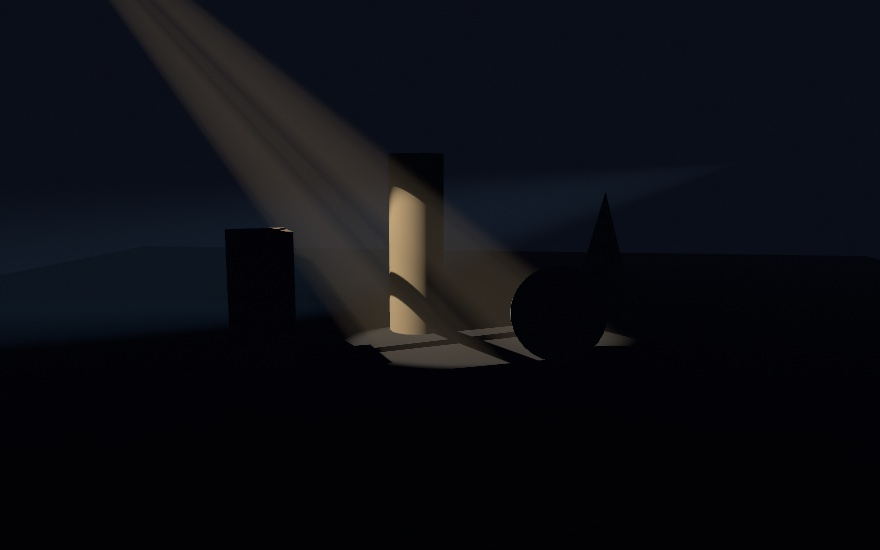

The `anisotropy` argument runs −1…1 and sets how strongly the haze throws light forward. Near 1, a beam flares when the view swings toward its source, the headlights-in-fog effect. At 0 it glows evenly from every side. And the two calls compose either way. With `fog`, the beams live in the fog's own thickness. Without it, the air stays clear and *only* the beams appear. The `3D/Lighting/VolumetricLight` example lights a dark stage with beams in a thin haze. The air is part of the scene, and light crossing it is something you can draw.

The beam march has a quality dial like the shadows do, `volumetricQuality` with three tiers. The default already does the right thing, frame-rate-safe live, lifted to full quality on export.

## More finishes: the cartoon look and matcaps

The plaza gave each sculpture a finish by name, from the material library. Some looks go further than a material can. A cartoon inks a line around a shape and lights it from the eye. A matcap paints the whole look, light and all, into one picture.

### The cartoon look: outlines, and a light that follows the camera

`.toon` on its own is only half a cartoon. The other half is the line. A drawn figure has an outline around it, and so a `.toon` sphere wants one too:

```swift
material(.toon)
outline(width: 3, color: Color(white: 0.08))   // three pixels of dark ink around every shape
fill(Color(hex: 0xE8553F))
drawSphere(radius: 1)
```

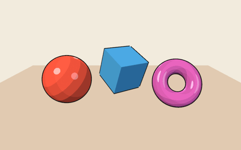

The line comes from an old trick, and the trick explains what you see. Ollin draws the mesh a second time, with every vertex pushed outward along its normal by the width you asked for. Then it throws away the faces that point at you. What survives of that slightly bigger, inside-out copy is the rim that peeks past the silhouette, in the ink color. Three things follow. The push is measured in screen pixels, like a pen, so the line holds its width as a shape moves away. A nearer shape hides a farther one's line, because the copy takes the depth test like any surface. And the box's corners show a small notch. Each face moved off along its own normal, and at a corner the three normals the solids step counted there part company. A smooth mesh takes a clean line. `outline` is drawing state like `material`, so some shapes can have it and others not, and `noOutline()` turns it off.

Now look at the bands in the figure while the view swings. They stay put on each shape. A world-space light would slide them. Under a sun, a sphere's lit side faces the sun wherever you stand, so as you orbit, the bands move around it. That is right for a sun and wrong for a cartoon, whose light belongs to the drawing rather than to the world. The figure's rig is the same `.threePoint` preset from earlier, read in the camera's frame:

```swift
lightingPreset(.threePoint.relativeTo(.camera))   // key, fill, and rim placed around the eye
```

`relativeTo(.camera)` says the light's numbers are measured from the eye: `x` to its right, `y` up, and `z` back toward it. So a light down `Vector3(0, 0, -1)` shines the way the camera looks. The numbers on the light stay the same, and Ollin reads them against the frame's camera each time it draws. So the rig follows an orbit, a showcase move, and a drag alike. The everyday use is the fill. A shape's far side under a sun is dark, and if the camera moves round to it the shape goes black. `headlight()` is a directional light from the eye down the view, read the same way. Whatever faces the camera is lit wherever the camera goes:

```swift
directionalLight(.white, direction: Vector3(-0.6, -1, -0.35))   // the sun, world space
headlight(Color(white: 0.5), intensity: 0.4)                    // a fill that follows the eye
```

It throws no shadow, and it needs none. Seen from the eye, every shadow a headlight would cast hides behind the thing that casts it. World space stays the default for everything else. A sun, a sky, and a product shot all want the light to stay put while you move. Reach for the camera's frame when the light belongs to the view, which is the cartoon's case and the fill's case.

### Shading from a picture: matcaps

The cartoon look read its light in the camera's frame. A **matcap** goes further and takes the lights away. It is the sculptors' shortcut. Instead of lights and materials, the whole look, lighting included, is painted into one photograph of a sphere. Every surface point borrows the color the sphere would have there.

```swift
matcap(.chrome)
drawMesh(knot)
```

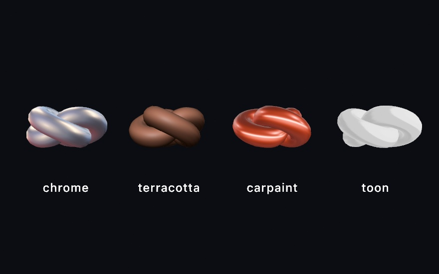

It takes one call and no lights, from chrome and clay to car paint and cel shading. It works by asking, for each point on the surface, which way that point faces relative to you. That is its normal, read in the camera's frame. Then it reads the color from the matching spot on the sphere picture. Point straight at the camera and you get the middle of the picture. Face away toward the edge and you get the rim. Because the picture was lit once, its lighting comes with it. The color is looked up by the way each point faces the camera, so as the view turns, the highlights move across the form.

The trade is the same fact seen from the other side. A matcap ignores your lights, your `material(_:)`, and your shadows, because it isn't lit at all. The light is a photograph. That makes matcaps a separate axis rather than another finish. They are the wrong choice when an object needs to belong to a scene, matched to its lighting and grounded by a shadow. They are the right one when you want a good-looking surface with no lighting work, such as while you sketch a form.

There are 26 built in, studio captures grouped by family. There are metals like `.chrome` and `.bronze`, clays like `.terracotta` and `.sage`, ceramics like `.pearl`, and translucents like `.wax`. Then there is the neutral studio set, `.toon` and `.toonDark`. A handful of diagnostic ones, `.checkNormal` and `.checkGradient`, are meant for reading geometry rather than looking good. Beyond those, `matcap(_:)` takes any sphere image you find or paint, loaded once with `loadImage` the way [Chapter 9](09-Pictures.md) loads a photograph. `Matcap.shaded(baseColor:metallic:roughness:)` bakes one on the spot with no asset at all. Reach for it when you want a specific color and don't want to ship a file.

Two smaller facts. The current `fill` tints the result, so keep it `.white` to see a matcap as captured. And `matcap(_:)` is drawing state like `fill`, so `withState` scopes it and `noMatcap()` returns to the lit path.

## More from the depth test: depth compositing, occlusion, and defocus

The plaza's sculptures hid each other by the depth test, with no sorting on your part. The test compares, at every pixel, how far away each surface is. Those distances have more uses than hiding solids. Flat drawing can join in, and effects can read the distances as a layer.

### Flat drawing that knows where it is: depth compositing

By default, 2D drawing lays over a 3D frame completely. That's right for a caption and wrong for a label, a tag, a halo, or a sprite that belongs in the scene. Given `anchor`, a point in the world at the middle of a pillar, three calls change it:

```swift
withState {
    depth(at: anchor)                        // this mark now sits at a world point's depth
    noFill()
    stroke(Color(hex: 0xF5F0E6))
    strokeWeight(7)
    if let screen = project(anchor) {        // and here is where that point lands on the canvas
        drawCircle(center: screen, radius: 96)
    }
}
```

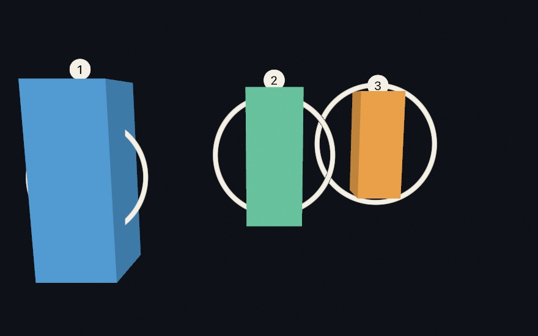

Those rings are `drawCircle`, flat 2D circles that were handed a depth. They are drawn with everything else, and hidden wherever a pillar stands nearer than they do.

The three calls divide the job, and each does one part of it:

- **`depth(at: worldPoint)`** sets the *depth* of subsequent 2D drawing, and nothing else. The mark still lands wherever its canvas coordinates say. `noDepth()` puts it back on top.
- **`project(worldPoint)`** answers the other half: where does this world point land on the canvas? It returns `nil` when the point is behind the camera, so handle that case with `if let` rather than force the value.
- **`withBillboard(at: worldPoint) { }`** does both at once and moves the origin there. Inside the block you draw around `(0, 0)`, and it lands on the point at the right depth. The numbered tags above are billboards. The labels in the catalog figure are billboards too.

The rings keep their size. All three have the same 96-point radius, because a 2D mark keeps its canvas size. Depth changes what hides it, not how big it is. That's usually what you want from a label, readable at any distance and correctly occluded. It also means a sprite drawn this way stays the same size at any distance.

Like the camera itself, all of this is per-frame, so it goes in `draw()` after the camera. Without a camera it quietly does nothing. A depth map from a camera can take 2D marks the same way, which [Chapter 35](35-Depth.md#drawing-inside-the-picture-a-depth-frame-as-a-stage) uses. The [depth compositing reference](../Docs/3D/DepthCompositing.md) covers both kinds of scene side by side.

### What the depth buffer is for: ambient occlusion and defocus

[Chapter 19](19-LayersAndEffects.md) filtered layers by their color. A 3D scene drawn into a layer carries something extra that a flat drawing never has. For every pixel, it knows how far away the thing at that pixel is. That's the **depth buffer**, and two of the effects that read it are here.

```swift
let scene = makeRenderTarget()
withTarget(scene) { /* your 3D scene */ }

let occluded = scene.combined(with: scene.depth, .ambientOcclusion(radius: 0.7, amount: 1.5))
let focused = scene.combined(with: scene.depth, .defocus(focus: 0.46, range: 0.13, maxBlur: 16))
drawImage(occluded.image, 0, 0)          // or focused.image
```

<picture>
  <source media="(prefers-color-scheme: dark)" srcset="Images/26-3DGently/DepthEffects-dark.jpg">
  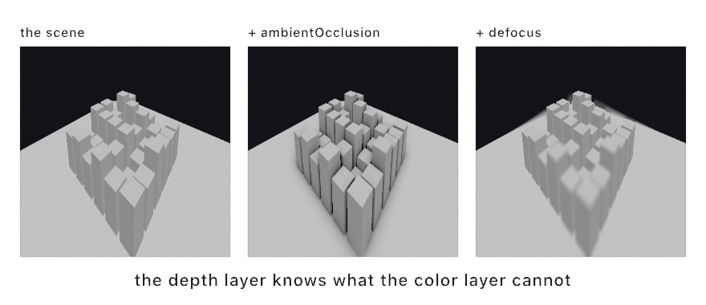
</picture>

`scene.depth` is an ordinary layer whose brightness is distance. So it feeds `combined(with:_:)` like any other layer, the call [Chapter 21](21-PicturesYouSolve.md#a-field-you-measure-the-distance-field) used to join two layers through one effect. The filters of [Chapter 19](19-LayersAndEffects.md) still apply to the result.

**`.ambientOcclusion`** darkens the places light struggles to reach. Those are crevices, the gaps between objects, and the line where something meets the ground. Compare the first two panels and the blocks stop floating. That single change is most of what makes a render read as solid rather than pasted together. It costs one line, because the depth layer already knows where the crevices are.

**`.defocus`** is a camera lens. It keeps a band of distance sharp, set by `focus` and `range`. Everything else blurs more the further it is from that band, up to `maxBlur`. It's how you point at one thing in a busy scene. Both `focus` and `range` are read against the depth layer's `0...1`. So they depend on the camera's `near` and `far`, the nearest and farthest distances it records. Set those so they bracket your scene, as in `camera(.orbiting(radius: 9, near: 3, far: 18))`, rather than leaving them enormous.

Both take a `quality` tier, `.performance`, `.default`, or `.detail`, which trades frame rate for smoothness. The tier is relative to your machine rather than an absolute setting. `.default` means "the balanced choice for this GPU", and it buys more samples on a faster one. Raising it to `.detail` for a final export is the usual move, since the export doesn't have to keep up with a display.

## A mesh from a word: type as a solid

The plaza built its sculptures from the catalog, and the catalog's `drawExtrude` pushes any flat shape into depth. A letter is a shape too. So a word can be a solid that catches the light and throws a shadow, like the sculptures on their plinths.

```swift
drawText3D("Ollin", size: 2, depth: 0.4)
```

One number needs care. `size` is measured in world units, not in the canvas points [`textSize`](08-Words.md) uses. It is the em, the height a font is measured by, so a capital stands about seven tenths of it. Everything else is what you would expect. The current fill colors it, and a material from the materials step finishes it. It sits centered on the origin, so you place it like a box.

For anything that draws every frame, reach past the convenience call to the two builders under it. `Mesh.text` gives you the whole word as one mesh, built once and kept. `Mesh.textGlyphs` gives you the same word a letter at a time, each letter still in its place. Every letter knows its own center, which is what lets one turn about itself instead of about the word. Translate to the pivot, turn, and translate back, and each letter turns in place:

```swift
let letters = Mesh.textGlyphs("Ollin", size: 1.5, depth: 0.3)   // a stored property, built once

for (i, glyph) in letters.enumerated() {                        // in draw()
    let pivot = glyph.center
    withState {
        translate(pivot)
        rotateX(sin(time * 1.4 + Double(i) * 0.7))
        translate(-pivot)
        drawMesh(glyph)
    }
}
```


The call exists because extruding the letter shapes yourself goes wrong in two ways. Text is laid out with y growing down the canvas, while the world counts y up, so a hand-rolled word arrives upside down. And a letter's curves are simplified against the size you ask for, so a letter one unit tall comes back as a lump. The call traces the outline large and scales it down, which is why a small letter is still a letter.

A letter with a hole keeps it. Its caps, the flat front and back, are cut into triangles the way every filled shape on the canvas is, hole and all. An extrusion has no map saying where each part of a picture goes, so a plain texture has nothing to hold on to. [Chapter 27](27-Meshes.md#a-picture-from-three-sides-triplanar) projects a picture onto a shape like this from three sides instead.

## Where this comes from

The camera-on-an-orbit model is the shared convention of 3D tools everywhere, from CAD turntables to the orbit controls of three.js. The lighting model under the materials is Blinn-Phong shading, Jim Blinn's 1977 refinement of Bui Tuong Phong's specular model. It was the workhorse of real-time graphics for decades. The toon and warm-to-cool finishes descend from the non-photorealistic rendering literature, notably Amy Gooch and colleagues' 1998 technical illustration shading. The soft, contact-hardening shadows are Randima Fernando's percentage-closer soft shadows. The fog is Inigo Quilez's closed-form fog, and the beams follow Balázs Tóth and Tamás Umenhoffer's volumetric light march. The ambient occlusion is the screen-space recipe Crytek introduced. The three-point lighting behind the presets is the prevailing convention of narrative film. Matcaps began as the lit sphere of Peter-Pike Sloan and colleagues in 2001. Their name comes from a tool in the sculpting program ZBrush, where artists bake a whole studio into one sphere image. The ones bundled here come from Blender's studio lights and Poly Haven, released to the public domain. The supershape formula is Johan Gielis's superformula (2003), while the lathe and extrude are as old as pottery and pasta. Area lights and contact shadows name their sources in place. Full credits are in the project's [attribution notes](../ATTRIBUTION.md).

## Go deeper

- [3D](../Docs/3D/3D.md): the full reference for cameras, primitives, meshes, lights, materials, matcaps, shadows, and loading models, including the environment lighting and ray-traced reflections this chapter only waved at.
- [Camera control](../Docs/3D/Camera.md): `cameraShowcase`, the cinematic move catalog, view snaps, and the input surface underneath.
- [Combining 3D features](../Docs/3D/Combining.md): the practical map of what stacks with what (which geometry takes materials, casts shadows, appears in reflections).
- Lens and grounding effects: draw a 3D scene into a render target and its depth layer feeds the combine effects [Chapter 21](21-PicturesYouSolve.md) introduced, `.defocus` for camera-like depth of field, `.ambientOcclusion` to darken contacts and crevices, `.screenSpaceReflections` for glossy floors on any Mac. See [Effects](../Docs/Drawing/Effects.md#combined) and the `3D/Effects/SceneDefocus` example.
- [Shadows in full](../Docs/3D/3D.md#shadows): how each caster kind works, the soft-shadow quality dials, and the frustum fitting you never have to touch.
- [Atmosphere](../Docs/3D/Atmosphere.md): the full fog and volumetric-light reference, what participates and what sits out, and the quality dial's exact step counts.
- [The 26 built-in matcaps](../Docs/3D/3D.md#the-built-in-matcaps), listed by family, plus `Matcap.shaded` for baking one from a color.
- Appendix B draws this chapter's math, one picture per idea: [Where things are](B-JustEnoughMath.md#where-things-are), [Moving the paper](B-JustEnoughMath.md#moving-the-paper), [Into three dimensions](B-JustEnoughMath.md#into-three-dimensions).
- Worked examples: [`Examples/3D/Geometry/Solids`](../Examples/3D/Geometry/Solids/Sketch.swift), [`Examples/3D/Geometry/ShapeFactory`](../Examples/3D/Geometry/ShapeFactory/Sketch.swift), [`Examples/3D/Geometry/Transforms`](../Examples/3D/Geometry/Transforms/Sketch.swift), [`Examples/3D/Lighting/LightingPresets`](../Examples/3D/Lighting/LightingPresets/Sketch.swift), [`Examples/3D/Lighting/Shadows`](../Examples/3D/Lighting/Shadows/Sketch.swift), [`Examples/3D/Materials/Materials`](../Examples/3D/Materials/Materials/Sketch.swift), [`Examples/3D/Materials/Matcap`](../Examples/3D/Materials/Matcap/Sketch.swift), and [`Examples/3D/Lighting/AreaLights`](../Examples/3D/Lighting/AreaLights/Sketch.swift).
- The Gego homage [`Reticularea`](../Examples/Recreations/Gego/Reticularea/Sketch.swift): a 3D thing drawn with no 3D drawing call at all. `project` turns each point of a hanging wire net into a place on the canvas. The lines between them are ordinary 2D strokes, thinner and paler the further off they are, laid down far to near.

---

[Contents](README.md#contents) · Previous: [Chapter 25, Simulations made of particles](25-ParticleSimulations.md) · Next: [Chapter 27, Meshes and maps](27-Meshes.md)
