#### <sup>[Ollin](../README.md) → [Guide](README.md) → Chapter 26</sup>

---

# 26. Meshes, maps, and materials

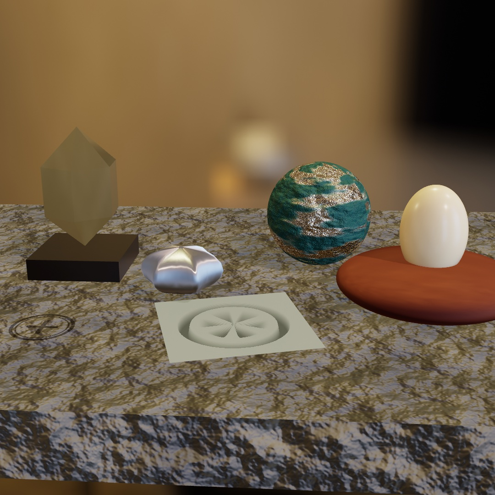

Each of those five gets its look from a different technique. The slab has no map for a picture, so its stone is projected onto it from three directions at once. The paint on the teal ball has worn back to metal because a picture says where. The wheel in the pale tile is a picture too, and the tile is flat. The crystal came out of a file, and the small silver form started as a crude six-pointed slab. The egg carries light a little way under its own surface before letting it back out.

This chapter teaches where else a mesh can come from, what a picture can do to its surface, and the finishes you set with numbers. A mesh can be loaded from a file and wrapped in a picture, or roughed out as a cage and rounded by the computer. A picture can also decide what a surface is from one point to the next: its relief, its wear and glow, and its depth. It can be projected from three sides, refined for a close look, or stamped across the scene. Then come the measured finishes, which start with the surroundings that light them. They cover metal and non-metal, the brushed streak, glass, coated paint and cloth, and skin. The steps end in the bench above. After it comes a whole scene loaded with its camera, its lights, and its motion. Then come more ways to make a mesh, clouds and distant air, and one more measured finish, the thin film.

## A mesh from a file

A generator hands you a shape the framework knows how to build. A file hands you a shape somebody drew. Any model you make in a 3D tool can join a sketch. `loadMesh` reads the common formats (`.usdz`, `.obj`, `.gltf`/`.glb`, `.stl`, `.ply`) into a `Mesh`, materials and textures included:

```swift
final class Loaded: Sketch {
    var model: Mesh?

    override func setup() {
        model = (try? loadMesh("/Users/you/Downloads/rubber-duck.usdz"))?.normalized(scale: 3)
    }

    override func draw() {
        background(Color(hex: 0x10141B))
        cameraShowcase(radius: 6)
        if let model {
            fill(.white)
            withState { rotateY(time * 0.3); drawMesh(model) }
        }
    }
}
```

One habit matters here: **`normalized(scale:)`**. A file arrives at whatever size and position its author saved, anywhere from millimeters to kilometers. Normalizing recenters it and scales its longest side to the world units you ask for. Keep the `fill` white so the model's own colors show, because a colored fill tints it. Models you build yourself are yours to ship. Downloaded ones carry licenses to check before you bundle them.

> **Swift note.** Loading can fail, and `loadMesh` throws when it does. As in [Chapter 2](02-Color.md), `try?` turns the throw into `nil`. So `(try? loadMesh(...))?.normalized(scale: 3)` stops at the `?.` when the file isn't there, and `model` stays `nil`. The `if let model` in `draw()` then skips drawing, so a missing file never crashes the sketch. Write `try!` instead to stop the sketch with the file's name and what was wrong with it.

## A picture wrapped around it: textured

The duck arrived with its own colors. Any mesh, from a file or a generator, can also be dressed with a picture of yours. [Chapter 25](25-3DGently.md#what-a-solid-is-made-of-triangles-and-normals) showed a mesh as a lit solid and as its wireframe net. The third way is to wrap it in an image:


```swift
withState { fill(teal); material(.glossy); drawMesh(globe) }     // solid
withState { stroke(pale); wireframe(); drawMesh(globe) }         // edges only
withState { fill(.white); drawMesh(globe.textured(checker)) }    // wrapped in an image
```

**`textured(_:)`** returns a copy of a mesh wrapped in an `Image`. **Texture coordinates**, called uvs, decide where each part of the picture lands. Each vertex carries a `u` across the picture and a `v` down it, from 0 to 1. The sphere and the plane are the generators that carry them, which is why the checker above reads cleanly. The rest arrive without any, and the triplanar step below is what you reach for there. The squares stay square around the middle and narrow to slivers at the poles. That's what wrapping a flat rectangle onto a ball does, and a textured sphere always shows it. A textured mesh still lights normally, so it takes materials and shadows like any other surface. Keep the `fill` white unless you want the image tinted, the same rule as a loaded model. All three treatments are ordinary drawing state, saved by `withState`, so one frame holds all of them.

One question comes with every texture: what happens where the picture runs out. A globe never asks it, since its coordinates run 0 to 1 and stop there. A floor asks it at once. Give a floor coordinates that run to 8, and it is asking for eight copies of the picture across its width.

```swift
var floor = Mesh.plane(width: 800, depth: 800)
floor.uvs = floor.uvs.map { $0 * 8 }                  // eight tiles across
drawMesh(floor.textured(planks, wrap: .tile))         // .clamp is the default
```

`.tile` starts the picture again, and `.mirror` starts it flipped so copies always meet on the same pixels. `.clamp`, the default, holds that last row of pixels forever. Inside 0 to 1 all three draw the same thing, so the choice only ever shows where you left the square. A model you load brings its file's own answer with it, which is why a floor somebody authored to tile arrives tiling.

Distance asks the second question. Send that floor off to the horizon and one screen pixel covers many of the picture's own pixels. Reading only one of them makes the far floor shimmer with noise. So Ollin keeps every picture you load at half size, and half of that, down to a single pixel. It reads whichever copy matches what the screen pixel covers. Nothing needs switching on.

A floor is also seen edge-on, so the patch of picture under one screen pixel is a long thin sliver. It spans many of the picture's pixels one way and hardly any the other. Ollin reads along the sliver, so the far floor keeps its detail along the view and does not go soft. A picture whose pixels you wrote yourself keeps only its full size, because it is uploaded again on every frame it changes. That one still shimmers in the distance.

## Smooth from a cage: subdivision surfaces

A file gives you a shape somebody finished, and a picture dresses it. The bench also uses a shape you rough out yourself and let the computer round, which is the way character artists work. Build something crude out of a few boxes and extrusions. Then `subdivided(levels:)` takes it as a **control cage**, splits every face, and eases every vertex toward its neighbors, once per level.

```swift
let cage = Mesh.extrude(Profile.star(), depth: 0.75)
let smooth = cage.subdivided(levels: 2)
```

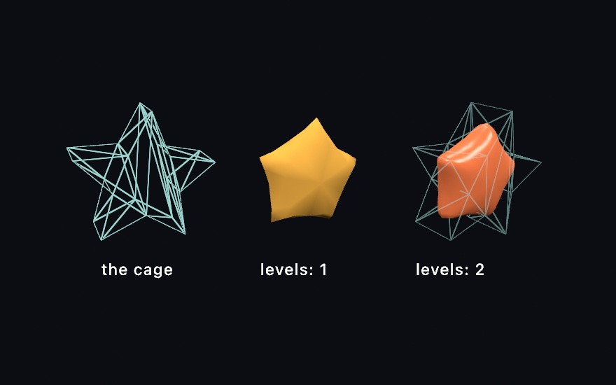

You model the cage, and the smoothness is computed. One level already rounds the slab-sided star. By two the form has melted well inside its cage at the points. The smooth surface eases *toward the averages* of the cage. Points pull in and notches fill out, and the pointy features round off the fastest. If a shape comes out softer than you wanted, the fix is a chunkier cage rather than fewer levels.

Any mesh works as a cage with no preparation: the primitives, an extrusion, a lathe, or a loaded model. `subdivided` welds their shared corners and recovers their intended faces before refining, so a box rounds as one closed surface rather than six drifting plates. Open sheets keep their rims, and a subdivided `plane` smooths along its edge instead of shrinking away from it. Triangle-native meshes like an icosphere or a marching-cubes blob have their own refinement rules a scheme argument away, `subdivided(.loop, levels: 2)`. The [reference page](../Docs/Generators/SubdivisionSurfaces.md) covers when to pick which.

This is `setup()`-shaped work. Each level roughly quadruples the face count, so refine once, keep the mesh, and let `draw()` draw it. Two or three levels is almost always enough.

## Pictures that change the surface: normal, surface, and height maps

The cage came out smooth, and the checker on the globe changed only its color. A picture on a mesh can change more than color. A normal map changes the direction a surface faces, and the surface maps change what it is made of from point to point. A height map changes its depth. Normal and height maps hand the renderer detail it would otherwise need geometry for, and the geometry stays as coarse as it was.

### Relief from a picture: normal maps

A texture changes a surface's color. A **normal map** changes how it catches light. Each texel, one pixel of a picture laid on a surface, stores a surface direction instead of a color. At shading time the lighting normal from [Chapter 25](25-3DGently.md#what-a-solid-is-made-of-triangles-and-normals) bends by it. The result is relief without geometry.


```swift
let hammered = Mesh.sphere(radius: 1).normalMapped(dents)
```

All three spheres are the same 96-segment sphere. Only the pictures the first two wear know about the dents and the rings. The silhouettes stay perfect circles. That's the tell, and the trade. The bumps exist only in how the light lands, so they cost a texture sample instead of a million triangles. The edge of the object never learns about them. Games have used this for twenty years, which is why a cobblestone street in one can be six polygons.

**`normalMapped(_:scale:)`** hangs a map on any mesh that carries texture coordinates. It sets up the frame of reference the map's directions are expressed in, a *tangent basis*. It's the same standard one other tools bake maps against, so a map made elsewhere lights the same way here. `scale` is a relief dial, where 0 flattens it off, 1 is as authored, and more exaggerates. Loaded models bring their own normal maps along without being asked.

Where do maps come from? Anywhere images do, and one place is math. Start with a height function, take its slopes, and encode them. The `3D/Materials/NormalMaps` example builds hammered metal, woven cloth, and engraved rings this way in a couple dozen lines, no files involved. One convention matters when authoring by hand. Green marks the slope that faces *up the image*. If a map from elsewhere lights upside down, its green channel is inverted, and flipping that channel fixes it.

### What the surface is, per texel: surface maps

A normal map changes how light lands. The rest of the standard map set changes what the surface *is* from texel to texel. `surfaceMapped(...)` hangs any of them on a mesh:


```swift
let panel = Mesh.sphere(radius: 1)
    .textured(paint)
    .surfaceMapped(metallicRoughness: wear,   // roughness in g, metallic in b
                   occlusion: cavity,         // its red channel
                   emissive: seams)           // an ordinary color image
```

A **metallic-roughness map** packs two dials into one image. Roughness is how scattered a surface's reflection is, and metallic is whether it reflects like a metal. Roughness goes on green and metallic on blue, the packing every glTF exporter uses. Per pixel it multiplies the finish you draw under. `.physicallyBased` is the measured tier [Finishes you measure](#finishes-you-measure-environments-and-physically-based-materials) sets out below. Both dials at 1 make it a blank the map can write on. So `material(.physicallyBased(metallic: 1, roughness: 1))` shows the map as authored. That multiply is what the first sphere does. One map says where the paint has rubbed through to bare polished metal, and the base texture colors the same patches silver.

An **occlusion map** is baked shadow for the crevices geometry doesn't have. It dims only the indirect light, the ambient and the environment. An environment is a photograph of a whole place used as light, and the finishes below begin with it. A lamp shining straight into a groove still lights it, which is how real crevices behave and why the convention exists. The second sphere pairs it with a normal map made from the same height field, the usual recipe. The relief catches the light, and the occlusion keeps its grooves dark.

An **emissive map** makes texels give off light of their own, tinted and dimmed by an `emissiveColor` factor. It works with no lights at all, which is how the third sphere, a nearly black shell, shows engraved seams that glow. Emission is the surface's own radiance, so fog veils it with distance like everything else. A glowing surface doesn't light its neighbors unless [Chapter 31](31-TracedLight.md#light-that-bounces-global-illumination)'s global illumination is on, or the frame is path-traced for export.

`emissiveColor` is one color for the whole mesh. A mesh can also carry a color at each vertex, and under `emissiveColor` those either wash toward white or take one tint. To make a surface glow in its **own** colors, the fill, the vertex colors, and the texture all included, give it an intensity instead:

```swift
drawMesh(ribbon.glowing(1.5))     // each vertex glows in its own hue
```

`Mesh.glowing(_:)` sets `emissiveIntensity` on a copy. At 1 it adds the surface's own color once as light, and more is brighter. A `bloom` filter turns the glow into a halo.

Loaded glTF and USD models carry all of these in and out without being asked. `saveScene`, which writes meshes out to a glTF or USD file, keeps them on the round trip. Like the normal maps above, every map in the figure is authored from a function in `setup()`. The `3D/Materials/SurfaceMaps` example is the worked version with a glow parameter.

### Depth from a picture: height maps

A normal map tilts the light. A **height map** stores the depth itself. The red channel is height, white is the surface, and darker is carved in below it. One image, and Ollin reads it two ways.


```swift
let moon = base.textured(dust).parallaxMapped(craterHeights, scale: 0.06)
let rock = base.displaced(by: craterHeights, scale: 0.13).textured(dust)
```

**`parallaxMapped(_:scale:)`** is the shading read. At every pixel the renderer marches your line of sight down into the height field and finds where it lands. Then it reads the base texture, the normal map, and every other map *there* instead of at the flat surface. Crevices sink, slide against their rims as the view moves, and hide their far walls, as carving does. And still not one vertex has moved. `scale` is the depth of the relief as a fraction of the picture's tile. It needs the same texture coordinates and tangent basis a normal map does, and it sets the basis up itself the same way.

**`displaced(by:scale:)`** is the geometry read. Every vertex moves along its normal by the height at its spot on the picture, and the normals are recomputed. The relief becomes true of the mesh, with `scale` now in the mesh's own units. It is work done once, so do it in `setup()` and keep the result. The detail you get is the *mesh's* to give, since a plane with more `segments` carves finer.

The outlines in the figure carry the lesson. The parallax sphere's silhouette is a perfect circle however deep the craters read. The shading is fiction, and the outline, the cast shadow, and a mirror all keep telling the geometric truth. The displaced sphere's rim is cratered, in shadow and reflection too. Inside the outline the two are nearly twins, so parallax gives you the depth without the triangles. When the edge matters, displace. When it doesn't, march.

White stays put in both readings. A height map's white regions *are* the authored surface. So the two spheres agree about where the relief lives, and you can hand one map to both calls. The `3D/Materials/Parallax` example is the worked version with the parallax depth on a parameter. USD files carry the map in and out, since `saveScene` writes it to the preview surface's displacement slot. glTF has no place to put one.

## More ways to put a picture on: triplanar, detail maps, and decals

The maps above all read a mesh's texture coordinates. Some meshes have none, some pictures need a finer scale than their coordinates carry, and some belong to no one mesh. Triplanar projection needs no texture coordinates at all. Detail maps add a finer scale on top of them. Decals stamp a picture across whatever stands in a box, whatever mesh it is.

### A picture from three sides: triplanar

The cage step left a small problem. A texture maps through uvs, and a subdivided cage comes back without them. So do the blobs [Chapter 30](30-SculptingWithFields.md) turns from a field into a mesh. `textured(_:)` has nothing to hold onto.

`triplanarTextured` sidesteps the question instead of answering it. Rather than asking the mesh where the picture goes, it projects the picture through the world three times, once along each axis. Picture three slide projectors aimed down x, y, and z. Every point on the surface blends the three by how squarely it faces each projector. A wall takes nearly everything from the projector facing it. A 45-degree slope takes half and half, and the handoff is gradual enough that you cannot find the line.

Here it is on `grown`, a folded ball with no uvs, made by the surface growth after the bench:

```swift
drawMesh(grown.triplanarTextured(tiles, normal: relief, scale: 2.2))
```


`scale` is the size of one tile in world units, and a `normal:` map rides the same projection. The figure's map is a photograph of glazed talavera, one of the pictures Ollin bundles. Its normal map is the slope of that photograph's own brightness, which is why the painted design reads as molded rather than printed on. The folded ball has no uvs and no tangent basis, and nobody cut its surface flat to lay a picture on it. The projection works on any mesh you can make or load.

The projection asks one thing of you in return: **the picture has to tile.** It repeats across the whole surface whatever any wrap setting says. If the left edge and the right edge of your map disagree, every wrap draws a straight line. A picture cut to whole repeats of its pattern joins up. A map authored with `fbm(u * 8, v * 8)` does not join. The field at u=0 and the field at u=1 are unrelated. Use `tilingFbm` instead, which closes on itself in both directions:

```swift
// u and v run 0...1 across the map you are filling
let shade = Color(white: tilingFbm(u, v, detail: 5, octaves: 5))
```

`detail` is the frequency you would otherwise have multiplied in, so moving a map across is a straight swap. A mismatched *normal* map is the one that shows most. The two sides of the join light differently, so the line reads as a crease in the stone rather than as a change of pattern. The bench the steps end in wears its stone this way.

The picture stands still and the surface moves through it, which helps in one case and hurts in another. The cairn is three separate boxes drawn one after another. The pattern runs unbroken across all three, because they stand in the same projected picture. That is why the technique is the usual choice for terrain and rockwork. But a mesh you animate through the transform stack slides through the pattern rather than carrying it along. So a body that travels should wear uvs. A form that grows or changes shape in place shows the pattern flowing across it, as the blob in the `3D/Materials/Triplanar` example does.

The projection carries the base texture and a normal map, while the rest of the map set stays with uvs. The [reference page](../Docs/3D/3D.md#triplanar) has the edges of the envelope. The example puts the tile size and the relief on parameters.

### Texture that survives a close look: detail maps

Triplanar repeats one picture at one size. Every texture has a budget, too. A picture sized to cover a whole boulder spends all its texels on the big shapes. The moment the camera leans in, the surface runs out of information and dissolves into soft nothing. Real rock does not do that. Get closer and there is always another scale of grain waiting.

`detailMapped` adds that second scale. It tiles a much finer texture pair across the base one, a color map and a normal map. They repeat several times per base tile, so the close look finds grain the base never carried.

```swift
drawMesh(boulder
    .textured(rock)
    .normalMapped(rockBumps)
    .detailMapped(grain, normal: grainBumps, scale: 12))
```


The left sphere wears only a base map at the resolution one map covering a whole form would have, so it is soft. The right one adds a detail pair, a patch of the same stone seen close. It is mirrored into a tile so it repeats without drawing a grid. Two conventions make the pair behave. The detail color map multiplies the base with middle gray as its neutral, value 128 in the image. Darker speckles darken, lighter ones lighten, and a flat gray image changes nothing. Author it as texture swinging around gray and the overall tone of your surface holds. And the detail normal map is *reoriented onto* the base relief rather than replacing it. The fine bumps ride the large forms the base map already shaped, the way real grain follows the rock it is part of.

`scale` is how many times the pair repeats across the base, and `amount` fades it out, with zero the off switch. A pair tiled dozens of times over is the first thing that would break up in the distance. A loaded picture reads its smaller copies there, but a pair you wrote from bytes has none to fall back on. Keep the scale in the range your framing shows, which is what the `3D/Materials/Detail` example is for. It puts the same base maps on two spheres and the detail pair on one of them. The tile count and amount sit on parameters while the camera sways close.

### A picture stamped onto the scene: decals

Everything so far dressed one mesh. A sticker does not care about meshes. Put it on a crate and it wraps whatever it lands on, the crate, the pallet under it, half of the wall behind.

A `Decal` works like that. Wrap an image once, then place it each frame as a small projection box. Every surface inside the box receives the picture, composited over the surface's own color before lighting. So it shades like paint rather than like a glowing overlay.

```swift
var sticker: Decal!

override func setup() {
    sticker = Decal(try! loadImage("label.png"))
}

override func draw() {
    // camera, lights, floor, crates ...
    drawDecal(sticker, at: dropPoint, width: 140)   // projects straight down by default
}
```

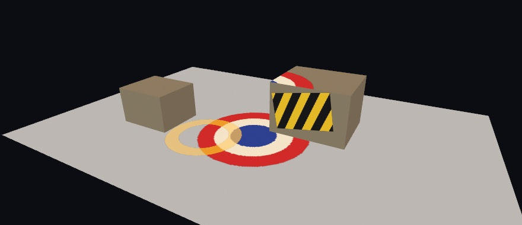

The box has a direction, a width and height, and a depth. The placement is per-frame state like a light. Move `at:` and the stamp slides across the scene. It crosses from the floor up onto a crate and over its far edge, conforming to whatever it touches. Transparency in the image is honored, and later decals composite over earlier ones. A surface standing edge-on to the projection fades the stamp out instead of smearing it down the side. Without that fade, every wall would show the smear.

A decal is paint, so it takes the finish of the surface it lands on. Stamp a rough floor and the mark is matte. Stamp polished metal and it sits under the shine. The [reference page](../Docs/3D/3D.md#decals) has the envelope: eight per frame, which surfaces receive them, and what mirrors show. The `3D/Materials/Decals` example slides a roundel across floor and crates on a loop, with the size, a roll, and a see-through ring on parameters.

## Finishes you measure: environments and physically based materials

The decal took the finish of whatever it landed on. So far those finishes came by name, from [Chapter 25](25-3DGently.md): velvet, jade, toon. Each of those is a look somebody chose and tuned. These finishes are picked by number instead, and the numbers are the ones a physicist would ask for. It is usually less work, because a surface described that way behaves correctly in light you have not set up yet.

They also want something the earlier chapters never needed, which is why they waited until now. Most of them have almost nothing to work with until the scene has surroundings, so the surroundings come first.

### Surroundings as the light: environments

A mirror reflects its surroundings, and so does every measured finish below. With nothing around it, such a surface goes dark and dull. The lights from Chapter 25 don't fix it, because a point light is a point. It makes a highlight but no reflection.

What fixes it is an **environment**: a photograph of a whole place, wrapped around your scene as a sphere, used as the light.

```swift
environment(.sunset)
material(.metal(roughness: 0.12))
drawMesh(ball)
```


Those two images are the same solids, the same material, the same camera, and the same floor. The only differences are one word and a touch of blur on the backdrop. In the second picture you can read the buildings in the left flank of the largest ball. The surroundings *are* the reflection, and they are also the light. The floor is lit by the sky in the first and by an ochre evening in the second, without a single light being placed.

Twenty environments come curated. Eight of them are bundled, so they work offline and at once. The other twelve download the first time you use one and cache from then on. The [environment lighting reference](../Docs/3D/3D.md#environment) lists them by mood. They differ greatly in brightness, so each is exposed to a consistent level for you. They also pair well with `toneMap(.aces)` from [Chapter 19](19-LayersAndEffects.md), for a filmic rolloff on the highlights.

Put the choice on a parameter and the inspector offers all twenty as a menu. You can then flip a scene from a studio to a dusk while it runs:

```swift
@Param var surroundings = Environment.studio
environment(surroundings)
```

The first image uses none of them. **`.sky(...)`** builds a daylight sky at runtime with nothing to load:

```swift
environment(.sky(sunElevation: 0.35))       // no asset, and the sun can move
```

It takes a sun elevation and a `turbidity` for how hazy the air is. Because it's computed rather than loaded, you can animate the sun and watch the whole scene's light follow. Reach for it when you want good lighting with no assets to load.

Two modifiers come up at once in practice. An environment paints itself **behind** your scene as a backdrop, which is usually what you want, since the reflections then match what you can see. When you'd rather keep your own `background(_:)`, `.lightingOnly()` keeps the light and drops the picture. And `.backgroundBlurred(_:)` softens only the backdrop, which pushes it back behind the subject.

### Two numbers for most real surfaces: PBR

With surroundings in place, the finishes have something to show. The **physically based** finishes ask for two properties instead of a name, and the renderer works out from them how light should behave:

```swift
material(.metal(roughness: 0.12))         // a metal, nearly polished
material(.dielectric(roughness: 0.4))     // a non-metal, satin
```

**Metal or not** is the first question, and it's close to binary in the real world. Metals tint the light they reflect (gold reflects gold) and have no color of their own underneath. Everything else, called a *dielectric*, reflects white highlights and shows its own color through them. That covers plastic, glass, skin, paint, and stone. **Roughness** is the second. It sets how scattered the reflection is, from `0` for a mirror to `1` for chalk.

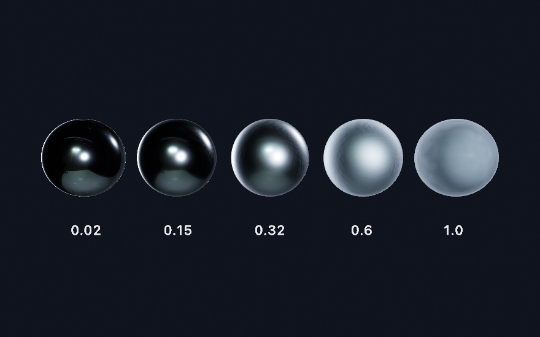

That is one material with one number changed. The leftmost sphere is a mirror, so what you see on it is mostly a reflection of the room it's standing in. That's why it's dark with one small bright highlight. As roughness grows, that reflection smears out into a wide sheen. By `1.0` it has spread so far that the sphere reads as its average brightness. `fill` still sets the color, as before, and roughness only decides how the surface handles light.

The [materials reference](../Docs/3D/3D.md#materials) lists ready-made ones for the common cases, the same two properties underneath. One naming trap: plain `.plastic` is one of the *stylized* finishes from [Chapter 25](25-3DGently.md), so reach for `.smoothPlastic` when you want this family.

### A streak instead of a dot: anisotropy

Roughness sets how *wide* the highlight is. One more number sets its *shape*. The base of a frying pan and a laptop lid show it. The highlight there is a streak rather than a dot, because fine parallel grooves from brushing or machining cover the surface. `anisotropy` is that streak. It runs `-1…1`: `0` keeps the round highlight, and either end pulls it into a line. `anisotropyRotation` spins the line, in radians.

```swift
material(Material(shading: .physicallyBased, metallic: 1,
                  roughness: 0.4, anisotropy: 0.8))
```


The streak is one number. The first two spheres are the same steel, and the band is what `0.8` does to it. The reflections smear the same way, so under an environment a brushed metal drags what it mirrors into stripes. The ring at the end is the ready-made `.brushedMetal` preset. On a curved body the streak follows the surface around, the way a machined ring or a lathed bowl reads. One thing to keep in mind: the streak is stretched *roughness*, so a mirror at roughness `0` has nothing to stretch. Give it a little roughness first. The [`BrushedMetal` example](../Examples/3D/Materials/BrushedMetal/Sketch.swift) sweeps the strength and the rotation side by side.

Numbers you tune by hand want a way back into code, and every material has one. `swiftSource` prints the expression that rebuilds it, listing only what you changed, and a built-in prints as its own name. The [material explorer](../Examples/3D/Materials/Explorer/Sketch.swift) puts the whole library and every dial from this chapter on parameters, and its C key copies that expression. The source is the artifact, so tune until it looks right, press C, and paste.

### Glass

There has been a way to make a surface see-through since [Chapter 1](01-HelloOllin.md). Give the `fill` some alpha, and in 3D the surface fades. Glass is a different thing. The surface stays fully there, with its highlights and reflections, and the *light* comes through instead, bent and tinted on the way. That's transmission, and it's one material call:

```swift
environment(.studio)                  // something to transmit
fill(.white)
material(.glass(thickness: 1.8))      // a solid body: a sphere of radius 0.9
drawSphere(radius: 0.9)
```


The main distinction is `thickness`. At `0` the body is a thin wall, a pane or a soap bubble. What's behind passes through nearly straight, tinted by the `fill` and dimmed at the edges where the surface turns away. Give it a thickness and the body becomes solid, and a sphere's diameter is the natural number. Now the light refracts on the way in and again on the way out. So a solid ball shows the world behind it flipped and gathered, the crystal-ball look. A solid ball is a lens, and a thin wall is a window. The middle sphere in the figure adds the other solid-body parameter, `attenuationColor` with an `attenuationDistance`. That's Beer-Lambert absorption under a friendlier name. You say what white light should become after traveling that far inside, and thicker paths get more of it. It is why real bottle glass is palest at its center and deepest green at the rim.

Three more parameters shape the glass. `roughness` frosts the glass, so the view through it blurs into a glow. `ior` sets how strongly the body bends light, and the [glass reference](../Docs/3D/3D.md#glass) lists the values for water, glass, and diamond. And `dispersion` bends each color by a slightly different amount, which is what a prism does. A solid body then fringes what shows through it, and a thin wall shows none of it, because it lets every color through parallel.

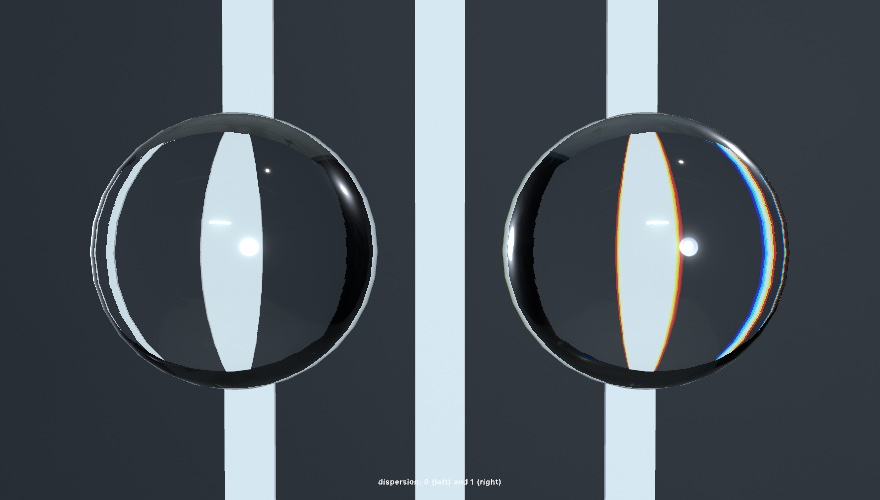

The figure puts the same bars behind a clear ball and a dispersive one. The red channel bends least, so its picture of each bar is the widest, and where only it reaches the edge reads red. Where red and green reach but blue has not yet, it reads yellow. Turn the bars dark on a bright wall and the fringes turn cyan and blue instead. A cheap camera lens does the same at the edge of the frame. So keep the parameter small. A touch reads as glass, and a lot reads as a prism.

Glass needs an `environment(_:)`, for the same reason a mirror did. There has to be something on the other side to show. On its own it refracts the environment, and that already reads as glass. Add the ray-traced reflections of [Chapter 31](31-TracedLight.md) on a Mac that traces, and the view through the glass upgrades to the scene itself. The bars in the figure show through the spheres that way. One call upgrades mirrors and glass together.

Refracting the environment alone has a catch once glass stands in front of your own scene. The scene isn't in it. The wall behind the bottle, the floor, the other objects, they all stop at the glass and the studio shows instead. A bottle standing in a room comes out empty. `sceneThroughGlass()` fills that in, and it needs no ray tracing at all, so it works on any Mac:

```swift
environment(.studio)                  // still needed
sceneThroughGlass()                   // and now the scene, too
```

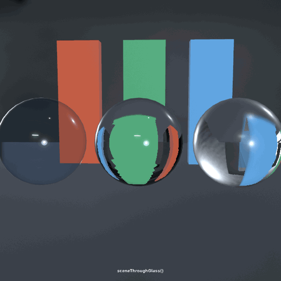

It works by drawing the frame a second time with every piece of glass taken out. Each body then looks up that picture along its own bent view ray. So a thin pane shows what is behind it, in place. A solid ball shows the floor and the far bars turned over, the way a glass of water does. A frosted body reads the picture blurred. Only what the camera drew can show through. The [reference](../Docs/3D/3D.md#scene-through-glass) lists what the lookup cannot show and where ray tracing takes over. Writing both calls is the right habit. Its cost is a second pass, since a frame with glass in it draws its scene twice.

A soap bubble is thin glass with a film of color on it. The thin film after the bench builds a measured one with `.soapFilm(thickness:)`. A quicker, stylized one composes the iridescence finish's soap-film mode, `iridescenceFlow`, onto thin glass, with `iridescencePhase` as its clock. Drive the clock with `time` and exports reproduce. The [`ThinFilm` example](../Examples/3D/Materials/ThinFilm/Sketch.swift) floats a handful of them. Glass still casts a solid shadow, and the [glass reference](../Docs/3D/3D.md#glass) lists the other edges, such as what glass seen inside a mirror shows.

### Paint and cloth: clearcoat and sheen

Two more finishes are built by *layering* rather than by choosing numbers for one surface, because that's how the real things are made. Car paint is a metallic base under a thin polished lacquer. Velvet is a matte body under a haze of stray fibers. Each layer gets its own parameter on the physically based material, and each has presets so you can start from the name.

```swift
fill(Color(hue: 0.99, saturation: 0.8, brightness: 0.7))
material(.carPaint(roughness: 0.45))    // a satin red metal under a polished coat

fill(Color(hue: 0.62, saturation: 0.6, brightness: 0.42))
material(.felt)                         // a dry, fuzzy blue
```

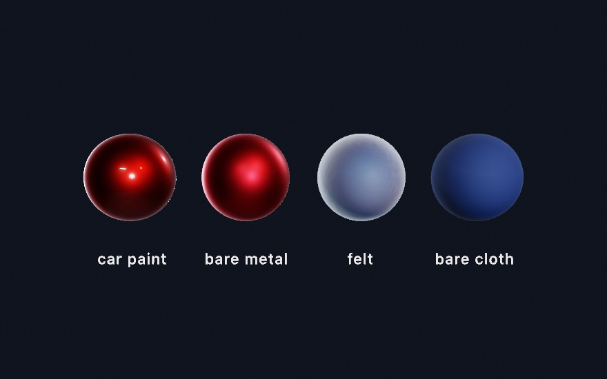

In the first pair, the bare metal has one soft satin highlight, the widest its roughness allows. The coated one keeps that satin body and adds a second, sharper reflection floating over it. Two finishes sit on one surface, which no single roughness can make. That's `clearcoat`, and the same idea covers piano lacquer and varnished wood. `.lacquer` is a deep gloss film over a matte body, and a near-black `fill` under it gives the piano look. `clearcoatRoughness` sets the film's own polish, independent of the base. The base dims slightly under a coat, by the light the film reflects away, so the layering never invents brightness. Add [Chapter 25](25-3DGently.md)'s glitter flecks on top of `.carPaint`, through the `sparkle` parameter, and you have metal-flake paint.

Now the second pair. The felt sphere is the same blue as its neighbor, but its silhouette glows. Fabric is covered in fibers that lean every direction, and where the surface turns away from you those fibers catch the light edge-on. That's `sheen`. The face stays matte while the rim brightens, and the body gives up a little light to pay for it. `sheenRoughness` sets how tight the rim band is, so `.satin` pulls it close to the edge and `.felt` spreads it into a haze. `sheenColor` tints it. Leave it white for dusty cloth, or tint it away from the `fill` for shot fabric. The [`CoatAndCloth` example](../Examples/3D/Materials/CoatAndCloth/Sketch.swift) ends on a deep red velvet rimmed in orange.

Both layers work under ordinary lights, under the area-light panels of [Chapter 25](25-3DGently.md#a-light-with-a-body-area-lights), and from an environment. Under the ray-traced reflections of [Chapter 31](31-TracedLight.md) the coat's reflection upgrades to the traced scene along with everything else. Seen in a mirror, a coated body keeps its film and a felted one its fuzz. Only the highlights a lamp puts on them stay out of the reflection. The [reference page](../Docs/3D/3D.md#clearcoat-sheen) has the details.

### Skin, wax, and stone: subsurface scattering

Every opaque surface so far bounces light off its outside. Skin doesn't. Hold a flashlight against your fingers and the flesh glows red around it. Some of the light went *in*, wandered a little way under the surface, and came back out somewhere else. Marble, wax, milk, and jade all do this, and the eye notices when a render of them lacks it. A surface without it reads as painted plastic however carefully it is colored.

```swift
fill(Color(red: 0.92, green: 0.72, blue: 0.62))
material(.skin(radius: 0.34))    // radius: how far light travels, world units
drawSphere(radius: 0.72)
```

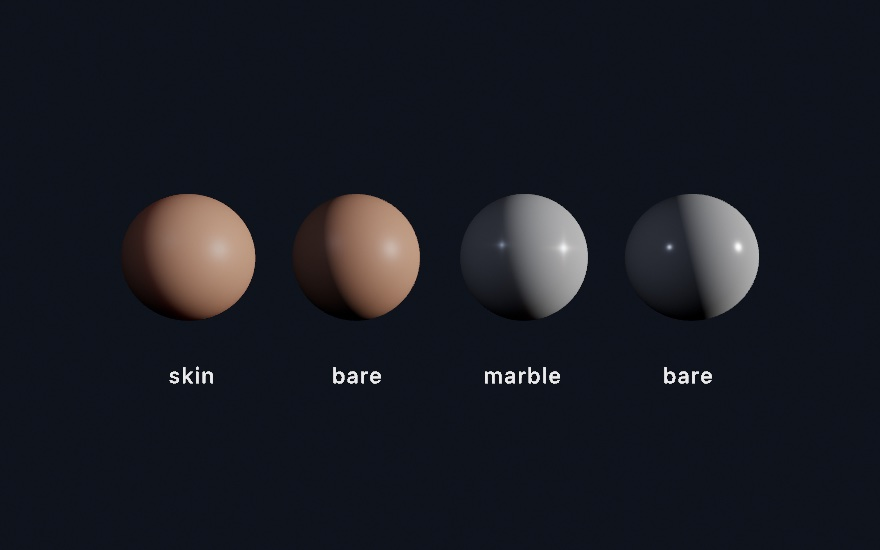

At the line where light gives way to shadow, the bare balls cut off the way a painted surface does. The scattering ones carry light a little way past that line, because light that entered on the lit side is re-emerging on the dark one. On the skin ball the carried light is *red*. Red travels farthest through flesh, which is why shadow edges on faces are warm. That per-channel reach is the `scatteringColor`, and its default is the skin ratio. Near-equal channels give the neutral softening of `.marble`, and a green-dominant color makes a jade whose glow is green.

You must set `scatteringRadius`. It's in world units because it's a physical distance, how far light gets before it's absorbed. A head-sized form wants roughly 1% of its width. The block above asks for far more, so the effect is easy to see on a small ball. Too big, and the material slides toward wax. `scattering` runs `0…1` and sets how much of the surface's light takes the trip at all. It layers on any material and needs no other calls to scatter, and a frame that doesn't use it pays nothing. It is a different thing from the stylized `subsurface` glow under [Chapter 25](25-3DGently.md)'s `.jade`. That one fakes back-light cheaply, and it can still layer on top for ears and edges. Where the measured one applies and where it does not is on the [reference page](../Docs/3D/3D.md#subsurface-scattering).

There's a second half, and it asks for one more call. Turn on `castShadows()` and the same material starts *transmitting*. Light that strikes the far side of a thin body comes through it. That is the flashlight-through-fingers trick from the top of this section. It works because the shadow machinery already knows what the material needs. A shadow map records where the light first landed, and the surface being shaded knows where it is. The gap between the two is how far the light traveled inside the body. The shadow map was a thickness gauge all along.

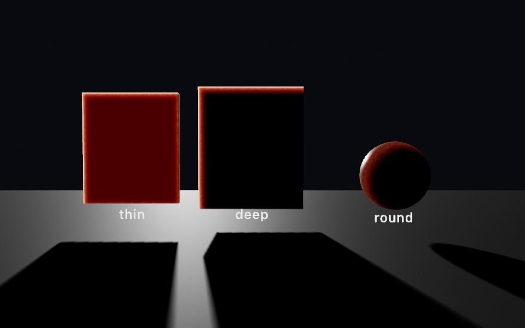

Put the light behind your subject and this carries the picture. A body about one `scatteringRadius` thick passes mostly red, the blood-red of a hand against the sun. The deep slab goes dark except at its rim, where the crossing is short. The ball keeps a warm crescent along its thinning edge. There are no new parameters, because the material already says everything. The radius sets what counts as thin, and `scatteringColor` decides what survives the trip. Only a shadow-casting light transmits, since its depth is the one that's known. Every light that casts does, and a directional, spot, or point caster all work.

## Putting it together: the bench

The finished sketch is five specimens on a stone slab, and each one is here to carry a different part of the chapter. Make `MySketches/Bench.swift`. It comes in three parts: the pictures, the objects they dress, and the frame.

The first part is the pictures, and every one of them is written rather than loaded. A normal map is a height function read for its slopes, which is the recipe from the normal-map step. A color picture is a function of the tile's own coordinates. Two functions sit under them. `bareness` says how far the paint has worn back to metal at a point. `device` is the height of the wheel cut into the tile.

```swift
import Foundation
import Ollin

final class Bench: Sketch {

    // MARK: pictures authored in code

    /// A height function turned into a green-up normal map by its slopes.
    func normalMap(size: Int, strength: Double, height: (Double, Double) -> Double) -> Image {
        var bytes = [UInt8](repeating: 0, count: size * size * 4)
        let d = 1.0 / Double(size)
        for y in 0 ..< size {
            for x in 0 ..< size {
                let u = (Double(x) + 0.5) * d, v = (Double(y) + 0.5) * d
                let dx = (height(u + d, v) - height(u - d, v)) / (2 * d) * strength
                let dy = (height(u, v + d) - height(u, v - d)) / (2 * d) * strength
                let len = (dx * dx + dy * dy + 1).squareRoot()
                let i = (y * size + x) * 4
                bytes[i]     = UInt8((-dx / len * 0.5 + 0.5) * 255)
                bytes[i + 1] = UInt8((dy / len * 0.5 + 0.5) * 255)
                bytes[i + 2] = UInt8((1 / len * 0.5 + 0.5) * 255)
                bytes[i + 3] = 255
            }
        }
        return Image(width: size, height: size, premultipliedRGBA: bytes)!
    }

    /// A color picture from a function of the tile's own coordinates.
    func picture(size: Int, _ shade: (Double, Double) -> Color) -> Image {
        var bytes = [UInt8](repeating: 0, count: size * size * 4)
        for y in 0 ..< size {
            for x in 0 ..< size {
                let c = shade((Double(x) + 0.5) / Double(size), (Double(y) + 0.5) / Double(size))
                let i = (y * size + x) * 4
                bytes[i]     = UInt8((c.red * c.alpha * 255).rounded())
                bytes[i + 1] = UInt8((c.green * c.alpha * 255).rounded())
                bytes[i + 2] = UInt8((c.blue * c.alpha * 255).rounded())
                bytes[i + 3] = UInt8((c.alpha * 255).rounded())
            }
        }
        return Image(width: size, height: size, premultipliedRGBA: bytes)!
    }

    /// The crystal: a model that ships in the LoadedMesh example's folder, found by
    /// walking up from the working directory until the path exists.
    var modelURL: URL {
        let tail = "Examples/3D/Geometry/LoadedMesh/model.obj"
        var directory = URL(fileURLWithPath: FileManager.default.currentDirectoryPath)
        while true {
            let candidate = directory.appendingPathComponent(tail)
            if FileManager.default.fileExists(atPath: candidate.path) { return candidate }
            let parent = directory.deletingLastPathComponent()
            if parent == directory { return candidate }
            directory = parent
        }
    }

    // MARK: the two height functions the pictures are made from

    /// How far the paint has worn back to bare metal at a point on the tile.
    func bareness(_ u: Double, _ v: Double) -> Double {
        smoothstep(0.46, 0.62, fbm(u * 4, v * 8, octaves: 4))
    }

    /// The coin's device, as a height: white is the face, darker is cut into it.
    func device(_ u: Double, _ v: Double) -> Double {
        let r = Vector2(u - 0.5, v - 0.5).length
        let a = atan2(v - 0.5, u - 0.5)
        let rays = smoothstep(0.25, 0.55, sin(a * 6) * 0.5 + 0.5)
        let band = smoothstep(0.3, 0.32, r) * (1 - smoothstep(0.37, 0.39, r))
        let hub = 1 - smoothstep(0.1, 0.25, r)
        return 1 - max(band, hub * rays) * 0.85
    }

```

> **Swift note.** Some things here are new. A picture is bytes, four per pixel. `[UInt8](repeating: 0, count:)` makes a list of that many zero bytes, and `UInt8(...)` narrows a number into one of them. `Image(width:height:premultipliedRGBA:)` builds a picture from those bytes. It hands back an optional, forced here with `!` because the sizes match by construction. `import Foundation` brings in `URL` and `FileManager`, which the model's path needs, and `while true` runs a loop until a `return` leaves it. The `// MARK:` lines are comments the editor lists in its jump bar, and nothing more. And `normalMap` takes a function as its last argument, `height: (Double, Double) -> Double`, which turns two numbers into one. It calls it as `height(u + d, v)`.

The second part builds the objects. The slab has no texture coordinates worth having, so its stone is projected onto it three ways. The teal ball wears four maps at once. They are the paint, its scuffs, a metallic-roughness map that says where the paint has gone, and a detail pair for the close look. The tile's wheel is a height map on a flat plane. The small silver form started life as a six-pointed slab, the `star` in the listing. The crystal is the `model.obj` file in the `3D/Geometry/LoadedMesh` example's folder, read from its file the way the chapter's first listing read a duck.

```swift
    // MARK: the parts

    var bench = Mesh(positions: [], indices: [])
    var worn = Mesh(positions: [], indices: [])
    var tile = Mesh(positions: [], indices: [])
    var star = Mesh(positions: [], indices: [])
    var specimen: Mesh?
    var mark: Decal?

    let plinth = Mesh.box(width: 0.86, height: 0.2, depth: 0.86)
    let cushion = Mesh.sphere(radius: 0.6, segments: 64, rings: 40)
    let egg = Mesh.sphere(radius: 0.34, segments: 48, rings: 32)

    override func setup() {
        seed(714)
        noiseSeed(714)

        // The bench has no uvs worth having, so its stone is projected, grain and all.
        // A projected picture repeats, so both of these have to tile, or the
        // stone draws a straight line wherever the picture wraps.
        let stone = picture(size: 512) { u, v in
            let grain = tilingFbm(u, v, detail: 5, octaves: 5)
            return Color.mix(Color(hex: 0x585A5C), Color(hex: 0x7C7B74), grain)
        }
        let stoneRelief = normalMap(size: 512, strength: 0.35) { u, v in
            tilingFbm(u, v, detail: 8, octaves: 5) * 0.5
        }
        bench = Mesh.box(width: 9, height: 0.5, depth: 5)
            .triplanarTextured(stone, normal: stoneRelief, scale: 2.6)

        // Painted metal, and a map that says where the paint has gone.
        let paint = picture(size: 512) { u, v in
            Color.mix(Color(hex: 0x1D5450), Color(hex: 0xC7BFB0), self.bareness(u, v))
        }
        let wear = picture(size: 512) { u, v in
            let b = self.bareness(u, v)
            return Color(red: 0, green: 0.7 - b * 0.5, blue: b)   // g roughness, b metallic
        }
        let scuffs = normalMap(size: 512, strength: 0.05) { u, v in
            fbm(u * 14, v * 14, octaves: 3) * 0.5
        }
        let grain = picture(size: 256) { u, v in
            let n = fbm(u * 30, v * 30, octaves: 3) * 0.5 + 0.5
            return Color(white: 0.5 + (n - 0.5) * 0.5)          // gray is the neutral
        }
        let grainBumps = normalMap(size: 256, strength: 0.06) { u, v in
            fbm(u * 30, v * 30, octaves: 3) * 0.5
        }
        worn = Mesh.sphere(radius: 0.5, segments: 96, rings: 48)
            .textured(paint)
            .normalMapped(scuffs)
            .surfaceMapped(metallicRoughness: wear)
            .detailMapped(grain, normal: grainBumps, scale: 6, amount: 0.5)

        // A tile whose device is carved by a height map rather than by geometry.
        let carved = picture(size: 512) { u, v in Color(white: self.device(u, v)) }
        let slate = picture(size: 512) { u, v in
            Color.mix(Color(hex: 0x3E4A52), Color(hex: 0x8FA0A8), self.device(u, v))
        }
        tile = Mesh.plane(width: 1.15, depth: 1.15)
            .textured(slate)
            .parallaxMapped(carved, scale: 0.09)

        // A crude cage, rounded by the computer.
        star = Mesh.extrude(Profile.star(points: 6, outerRadius: 0.46, innerRadius: 0.24), depth: 0.42)
            .subdivided(levels: 2)

        specimen = (try? loadMesh(modelURL.path))?.normalized(scale: 1.15)

        // The bench is stamped where the maker signed it.
        mark = Decal(picture(size: 256) { u, v in
            let r = Vector2(u - 0.5, v - 0.5).length
            let ring = abs(r - 0.34) < 0.02 || abs(r - 0.29) < 0.009
            let bar = abs(v - 0.5) < 0.028 && abs(u - 0.5) < 0.18
            let stem = abs(u - 0.5) < 0.028 && abs(v - 0.5) < 0.18
            return Color(hex: 0x17130E, alpha: (ring || bar || stem) ? 0.7 : 0)
        })
    }

```

> **Swift note.** `Mesh(positions: [], indices: [])` is an empty mesh standing in until `setup()` fills the property. The closures handed to `picture` take two arguments, `u` and `v`. Inside one, the sketch's own methods are reached through `self.`. Swift accepts `bareness(u, v)` here too, since the closure runs before `picture` returns. The listing spells `self.` to show whose function it is. `||` and `&&` are *or* and *and*, as in [Chapter 23](23-GridSimulations.md)'s Metal. `? :` is [Chapter 6](06-GridsAndRepetition.md)'s compact if.

The third part is the frame. There is one directional light and one environment, and the environment is doing most of the work, because every finish here is a measured one.

```swift
    override func draw() {
        background(Color(hex: 0x0D0E12))
        camera(Camera3D(eye: Vector3(0.55, 2.35, 6.4), target: Vector3(0.15, 0.35, 0.2),
                        projection: .perspective(fieldOfView: .pi / 4.8)))
        environment(.interior.backgroundBlurred(0.55))
        directionalLight(Color(kelvin: 4600), direction: Vector3(-0.5, -0.72, -0.5),
                         intensity: 0.85, softness: 0.22)
        castShadows()
        toneMap(.aces)

        // The bench, and the mark stamped into it.
        withState {
            translate(0, -0.25, 0)
            fill(.white)
            material(.dielectric(roughness: 0.85))
            drawMesh(bench)
        }
        if let mark { drawDecal(mark, at: Vector3(-1.4, 0, 1.25), width: 0.7) }

        // The crystal on its lacquered plinth.
        withState {
            translate(-1.45, 0.1, -0.2)
            fill(Color(hex: 0x14100E))
            material(.lacquer)
            drawMesh(plinth)
            if let specimen {
                translate(0, 0.68, 0)
                rotateY(0.6)
                fill(Color(hex: 0xDCEEF6))
                material(.glass(roughness: 0.03, ior: 1.48, thickness: 0))   // a thin wall
                drawMesh(specimen)
            }
        }

        // The cage the computer rounded, in brushed steel.
        withState {
            translate(-0.4, 0.24, 0.5)
            rotateX(-.pi / 2)
            rotateZ(0.5)
            fill(Color(hex: 0xBFC4C9))
            material(.brushedMetal)
            drawMesh(star)
        }

        // Painted iron, worn back to metal.
        withState {
            translate(0.8, 0.5, -0.45)
            rotateY(-0.5)
            fill(.white)
            material(.physicallyBased(metallic: 1, roughness: 1))
            drawMesh(worn)
        }

        // The tile, carved by a picture and by nothing else.
        withState {
            translate(0.1, 0.005, 1.1)
            rotateY(0.28)
            fill(.white)
            material(.dielectric(roughness: 0.55))
            drawMesh(tile)
        }

        // Wax on cloth: the light goes in, wanders, and comes back out.
        withState {
            translate(1.75, 0.12, 0.35)
            fill(Color(hex: 0x3A1018))
            var felt = Material.felt
            felt.sheenColor = Color(hex: 0xB9724F)
            material(felt)
            withState {
                scale(1.35, 0.36, 1.35)
                drawMesh(cushion)
            }
            translate(0, 0.45, 0)
            fill(Color(hex: 0xF2E3C0))
            var wax = Material.marble(radius: 0.12)
            wax.scatteringColor = Color(red: 1, green: 0.66, blue: 0.34)
            material(wax)
            scale(0.84, 1.2, 0.84)
            drawMesh(egg)
        }
    }
}
```

The bench is five specimens, ten pictures, and one light, and it composes most of the chapter's steps. The crystal is loaded from a file and normalized. The silver star is a cage rounded by two levels of subdivision. The ball wears a normal map, a metallic-roughness map, and a detail pair over its texture. The tile wears a height map read by parallax. The slab is textured from three sides and stamped with a decal. Every finish is a measured one, lit by an environment. The slab and the tile are dielectrics, the star is brushed metal, and the crystal is a thin wall of glass. The plinth is lacquer, the cloth under the egg is felt with its own sheen color, and the egg scatters light under its surface. The ball and the tile have no detail you could find in a vertex, and neither does the slab they stand on. The ball is a plain sphere, the tile a single flat quad, and the slab a box. Everything you can see on them was written into a picture.

The camera here is spelled out as a `Camera3D` with an eye, a target, and a projection. It holds one composed shot, where `camera(.orbiting(...))` placed the eye on an orbit. `Color(kelvin:)` names a light's color by its temperature, the way a bulb's box does.

Then make it yours:

- Set `parallaxMapped`'s `scale` on the tile to `0.2`. The carving deepens and the tile's outline stays straight, which is the trade the height-map step describes.
- Swap the tile's `parallaxMapped` for `displaced(by:scale:)` on `Mesh.plane(width: 1.15, depth: 1.15, segments: 200)`. The carving is now in the geometry, so it throws its own shadows, and you paid for it in triangles.
- Raise the egg's `.marble(radius: 0.12)` to `0.4`. The light wanders so far that the egg glows from within, which is the wax look.
- Set the felt's `sheenColor` to white, and the two-tone velvet under the egg turns to dusty cloth.
- Point `modelURL` at a model of your own. `normalized(scale:)` fits it to the bench whatever units its author saved it in.

The bench holds still, so keep it as a still. `swift run OllinLive MySketches/Bench.swift --export bench.png` writes the frame at the size the canvas is. [Chapter 38](38-FinishingASketch.md) says how to size one for a print.

## A whole scene from a file: its camera, its lights, and its motion

The bench loaded one mesh from a file and placed it itself. A file can hold more than one object. It can hold a whole set composed in the design tool, with a camera framing it and lights already placed. It can also remember how the set moves. This family is for loading that whole scene, and for taking it back into code once it settles.

### A scene with its camera and lights: loadScene

`loadMesh` flattens a file into one mesh you place yourself. `loadScene` keeps the file's structure instead of merging it. A **scene** is a tree of named nodes, each carrying a mesh, a light, the camera, or nothing but its children. It is for the case where the file *is* the placement. You composed a stage in a design tool. You want to draw it as it was saved while the sketch moves a part of it. Scene files are the interchange formats the 3D tools write, glTF and USD, and `loadScene` reads both.

<picture>
  <source media="(prefers-color-scheme: dark)" srcset="Images/26-Meshes/SceneTree-dark.jpg">
  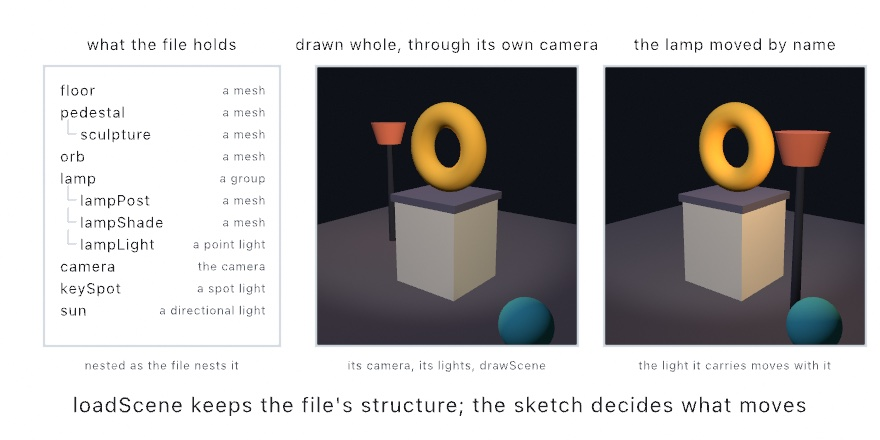
</picture>

```swift
stage = try! loadScene("Stage.gltf")            // in setup()

camera(stage.camera ?? .orbiting(radius: 6))   // the file's own framing
for l in stage.lights { light(l) }             // and its lighting
stage["sculpture"]?.rotate(deltaTime, axis: .unitY)
drawScene(stage)                               // every node, in its authored place
```

Everything unpacks into things you already know. The file's camera is a `Camera3D`, its lights are `Light`s, and each node's geometry is a `Mesh`. `drawScene` draws the whole layout where the tool put it. `stage["sculpture"]` reaches one node by name, so a single part moves while the rest holds still. Bring the set over from the design tool, and keep the choreography in the sketch. The tree on the left of the figure is the file as it was saved. Every node has its name, nested the way the tool nested it. `loadMesh` would have folded all of it into one shape. `drawScene` draws it as the middle panel, through the file's own camera and under its own lights. The right panel moves one node by name, `stage["lamp"]`. The lamp's light moves with it, because a light rides the node that carries it. Move a group and everything under it, meshes and lights alike, comes along. The `3D/Geometry/LoadedScene` example is a small stage to poke at, and [Scenes](../Docs/3D/Scenes.md) has the details.

> **Swift note.** [Chapter 8](08-Words.md)'s `??` hands back the value on its left when it is there. When the left is `nil`, it hands back the value on its right. So the sketch uses the file's camera, and falls back to an orbit without one. The subscript `stage["sculpture"]` also answers an optional, since a file may not hold a node of that name. The `?.` after it skips the rotate when it does not.

### Motion the file remembers: animations, skins, and morph targets

A file can carry motion as well as a layout. An **animation** is a set of keyframe tracks the tool recorded, and `stage.animations` holds them. It is for playing what the animator made, on the sketch's own clock, so the scene poses itself at whatever moment you ask for. The tracks come from the same glTF and USD files as the layout does.

```swift
if let spin = stage.animation("spin") {
    stage.apply(spin, at: time.truncatingRemainder(dividingBy: spin.duration))
}
```

The file remembers its motion, and the sketch decides when time passes. `apply` takes any time you hand it. Wrapping `time` loops the animation, `time * 0.5` plays it at half speed, and a parameter's value scrubs it. The `3D/Geometry/AnimatedScene` example plays a small orrery's authored spin this way, one seamless 8-second lap.

Tracks like the orrery's move whole nodes, rigid pieces on a hierarchy. A file can also carry motion that bends the geometry itself. A *skin* ties each vertex to a few joint nodes with blend weights. A blade of kelp or an arm then flexes smoothly as its joints turn. *Morph targets* store alternate shapes for a mesh, and the node's `weights` mix them, the way faces animate between expressions. Both play through the same `apply`, and `drawScene` poses them without any extra calls. The `3D/Geometry/SkinnedScene` example is a small tidepool doing both at once, kelp swaying on skins while an anemone pulses on two morph targets. And since `weights` is a node property, `tank["anemone"]?.weights = [1, 0]` poses a blend shape from any signal you like.

### A scene you can take apart: the scene written as source

Loading a scene keeps the file in charge, which is what you want while the model is still moving. **Writing the scene as source** turns the file into a sketch whose `draw()` places every node itself. It is for a layout that has settled, which you now want to change as code rather than in the design tool. It is one of the project generators of the `ollin` command [Chapter 1](01-HelloOllin.md#a-shorter-way-to-run-things) set up. `ollin new Yard --from-scene yard.usdz` writes the project. Its `draw()` has the camera, the lights, and a `withState` block for every node, while the meshes are still read from the file. [Bringing a scene over](../Docs/Tools/SceneImport.md) shows the result beside the scene it draws, and says what carries over and what stays behind.

## More ways to make a mesh: cuts, joins, shadow art, growth, and the Hopf fibration

The bench made one mesh from another when it rounded its cage, and loaded another from a file. There are more ways to get a mesh. One can be cut with a second solid or joined out of parts. One can be carved from the shadows you want it to throw, or grown from a rule until it folds. And one comes from a formula for a shape that does not fit in the room.

### Cutting one solid with another: mesh booleans

A **boolean** combines two solids the way a filled `Shape` combines two outlines on the plane, with the same combinations. It is for the shape that is hard to describe and easy to catch between two shapes that are not. A block with every edge rounded, a plate with a round hole, and a shell with a window cut out are all cuts. The operations are the constructive solid geometry of CAD tools. Ollin computes them by the method Bruce Naylor, John Amanatides, and William Thibault published in 1990. It holds each solid as a tree of its own face planes and sorts the other solid's surface into inside and outside.

```swift
let cube = Mesh.box(size: 1.3)
let ball = Mesh.sphere(radius: 0.88)

cube.union(ball)          // everything either one covers
cube.intersection(ball)   // only what both cover
cube.subtracting(ball)    // the cube, with the ball taken out of it
```

A fourth, `symmetricDifference`, keeps what only one of them covers.

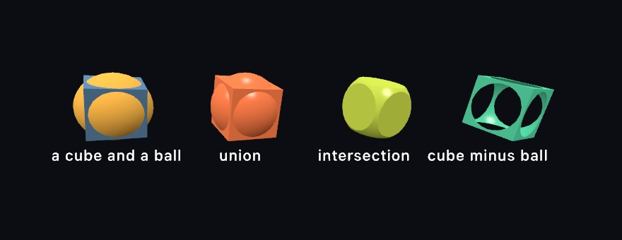

The third one is a cube and a ball. It is also a block with every edge and every corner rounded at once, which by hand means modeling twelve fillets.

What comes back is an ordinary mesh. It draws the same and takes a material and a shadow the same. It can be broken apart, handed to the physics solver, or written out for a printer. That makes this different from the `subtract` and `carve()` [Chapter 30](30-SculptingWithFields.md) works fields with. Those melt distance fields on the GPU while the frame is drawn, and leave no geometry behind. Reach for them when you want a blobby form that moves. Reach for these when you want the shape itself.

Before you cut, check these.

**Both sides have to close.** A boolean asks what is inside each solid, so a surface with a hole in it has no answer to give. What comes back is meaningless rather than merely ugly. Most built-in generators close, but a plane, a Möbius strip, and a cylinder without caps do not. If you are unsure, `printCheck()` will tell you, the same examination [Chapter 38](38-FinishingASketch.md) runs before it writes a mesh for a printer.

**A cutter has to be the right way out.** Mirroring a mesh turns it inside out. So does swapping two of its coordinates, or scaling an axis by a negative number. An inside-out cutter takes away everything it should have left. Turn it instead:

```swift
let shaft = Mesh.cylinder(radius: 0.2, height: 2)
block.subtracting(shaft.mapPositions { Vector3($0.y, -$0.x, $0.z) })   // a quarter turn
```

**Cut once.** This is work your processor does, not your graphics card. Solids of a few thousand triangles take a few tenths of a second, and denser ones take longer. So cut in `setup()`, or when a parameter moves, and keep the mesh for `draw()` to draw. That is the same advice as the cage, for the same reason.

### One mesh from several: joined and placed

Not every assembly needs a cut. **Joining** lays several meshes end to end as one mesh, each moved into place first, with no boolean and no change to any surface. It is for parts that only have to draw and cast a shadow together, as one draw call. A body and its wheels, or a table and its legs, are the usual cases. It is the plain merge every modeling tool has. `placed(_:)` bakes a placement into a copy of a part, and `Mesh.joined(_:)` lays the parts end to end:

```swift
let body = Mesh.box(width: 1, height: 0.5, depth: 2)
let wheel = Mesh.cylinder(radius: 0.25, height: 0.2)
let spots = [Vector3(0.6, -0.3, 0.7), Vector3(-0.6, -0.3, 0.7), Vector3(0.6, -0.3, -0.7), Vector3(-0.6, -0.3, -0.7)]
let car = Mesh.joined([body] + spots.map { wheel.placed(MeshInstance(position: $0, rotation: Vector3(0, 0, .pi / 2))) })
drawMesh(car)
```

The joined mesh renders the same as the parts drawn one by one, and it costs only the copy. Where two parts overlap, both surfaces stay inside, which is fine on screen and not for a printer. A printer wants `union`, which merges the overlap into one closed skin. The [reference](../Docs/3D/3D.md#join) says what rides along, and why a joined mesh wears one material.

### One solid, two shadows: shadow art

A cut keeps the part of one solid that lies inside or outside another. **Shadow art** carves a solid from pictures instead. You ask for the shadows you want it to throw, one per direction, and Ollin works out the largest solid that throws them. It is for the sculpture that reads as one thing from the front and another from the side. It suits any form that only has to be right in silhouette. Sculptures built to throw chosen shadows came first. The carving is the visual hull Aldo Laurentini named in 1994. Niloy Mitra and Mark Pauly set out shadow art as a computation in 2009. Ollin keeps the plain carve and skips their later adjustment step.

<picture>
  <source media="(prefers-color-scheme: dark)" srcset="Images/26-Meshes/TwoShadowsOneSolid-dark.jpg">
  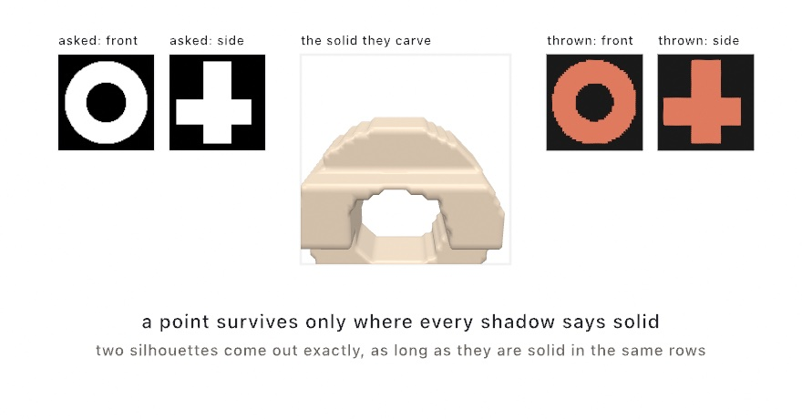
</picture>

```swift
let art = shadowArt(fromFront: ring, fromSide: cross, resolution: 56)
drawMesh(art.mesh)
```

A lit point casts its shadow along the light's direction. So a point can only be part of the solid if it lands inside the shadow in *every* direction it is lit from. Keep those points and no others, and what is left is the largest solid that could cast them. That is why a shape that looks like neither shadow throws both. The points are tested on a grid of small cubes, `resolution` across. The survivors are turned into a mesh the way [Chapter 30](30-SculptingWithFields.md#the-other-way-out-field-to-mesh) turns a field into one.

The shadows it really throws are never larger than the ones you asked for, and they can be smaller. The catch is that two views share an axis. The front view and the side view share the vertical axis, so their rows line up. A row that is empty in one shadow empties it in the other. Two silhouettes come out exact when they are solid in the same rows, which is why the classic circle-and-square works. Three agree far less often, and sculptures that throw three shadows are designed around that. `art.shadow(from: .front)` hands back what is really thrown. Where it differs from what you asked for, it is the one that is true.

Showing the solid beside flat panels has one trap. Lights are per-frame state rather than a property of each shape. `noLights()` turns every light off for the rest of the frame. Calling it after drawing the mesh, to keep the panels flat, unlights the mesh you already drew. Draw the flat panels inside `withoutLights { }` instead, which leaves the frame's lights on everything else.

### A surface that outgrows itself: differential growth

Subdividing takes a shape you designed and smooths it. **Differential growth** does the opposite. It hands you a shape nobody designed, out of a rule you can say in one sentence. Push a mesh's vertices apart, and split any triangle that stretches so the triangles stay a fixed size. It is for the folded, brain-like and leaf-like forms that no cage could hold, grown in front of you a step a frame. [Chapter 13](13-GrowingThings.md#growth-by-crowding-differential-growth) grew a line this way, and this is the same rule on a surface. The surface form follows the thin-shell growth the studio Nervous System describes in its *Floraform* project, and Anders Hoff's mesh growth. It keeps its triangles even with the remeshing of Mario Botsch and Leif Kobbelt (2004).

The surface gains area as its triangles split, but nothing pushes it outward. The forces run along its own edges, and those lie in the surface. It cannot get bigger the way a balloon does. So the new area has to go somewhere, and the only direction left is sideways. It folds.

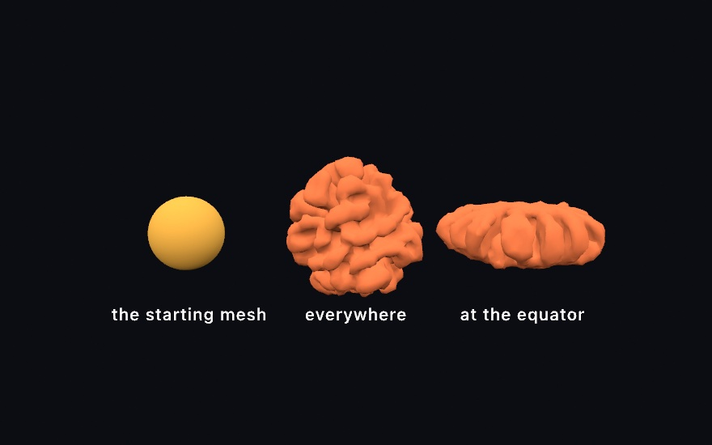

```swift
// setup(), and keep it:
growth = MeshGrowth(mesh: .icosphere(subdivisions: 3), driver: .uniform, seed: 7)

// draw():
growth.step()
drawMesh(growth.mesh)
```

That middle one is a plain sphere that grew evenly, and nobody told it to make lobes. A ball that grows evenly folds into a brain. Every fold in it is the surface running out of room.

The `driver` decides *where* the growth is fastest, and since every driver folds, what you are choosing is where the folds go:

```swift
MeshGrowth(mesh: ball, driver: .uniform)      // evenly, all over
MeshGrowth(mesh: ball, driver: .curvature)    // wherever it already bulges

// Only near the equator, the way a leaf grows along its margin.
MeshGrowth(mesh: ball, driver: .field { position, _ in
    1 - smoothstep(0.1, 0.5, abs(position.y))
})
```

The third panel is that last one. The poles never grew, so they stayed smooth, and everything the band made had to ruffle. It is the same rule as the lettuce leaf and the kale edge. They grow faster along the rim than through the middle, and they buckle for this reason.

Two parameters matter early. `edgeLength` is the triangle size, so it sets the finest fold the surface can hold and it is where the cost lives. `stiffness` is how much the surface resists bending, and it decides how *big* the folds come out. A sheet with no stiffness buckles at the smallest scale it can and reads as crumpled paper. More stiffness gathers the same growth into broader waves. If a result looks like foil someone sat on, that is the parameter.

There is a fourth driver, `.chemical`, that runs a reaction-diffusion pattern in the surface and grows where the pattern collects. The chemistry decides where to add area, and the new area gives the chemistry more room to spread. That is the branching-coral one, and the [reference page](../Docs/Generators/MeshGrowth.md) has it along with self-avoidance, open sheets that keep their rims, and the cost.

Growth is slow on purpose. A form takes hundreds of steps, and stepping once a frame lets you watch it develop. `maxVertices` is the ceiling that keeps it interactive, and it also decides how far a form gets before it settles.

### A shape from four dimensions: the Hopf fibration

One more mesh cannot be modeled at all, because the thing it draws does not fit in the room. The **Hopf fibration** is a sphere's worth of circles from four-dimensional space. No two of them meet, and every two of them are linked. Drawn as tubes, it makes a sculpture of linked rings. Heinz Hopf described it in 1931. `hopfFibers` hands them back as paths for `drawTube`, and `hopfBases` arranges the sphere's points so the linking can be seen. The [Hopf fibration page](../Docs/3D/HopfFibration.md) draws it and explains the three details that make it read, and [`Examples/3D/Geometry/HopfFibration`](../Examples/3D/Geometry/HopfFibration/Sketch.swift) turns it.

## More surroundings: clouds and distant air

The bench lit its specimens with a bundled interior. Outdoors, a computed sky can carry more than a sun. It can carry weather that lights the whole scene, and it can hand its sun to the air between you and far ground.

### Weather in the sky: clouds

**Volumetric clouds** have depth: they are marched through a volume and baked into the sky environment, rather than painted flat on it. They are for an outdoor scene whose light should follow its weather. The clouds behind the scene, the light on every surface, and the picture in every reflection then agree. The technique follows Andrew Schneider and Nathan Vos's real-time cloudscapes, presented at SIGGRAPH in 2015.


```swift
environment(.sky(sunElevation: 0.5).clouds(.scattered))          // a preset sky
environment(.sky(sunElevation: 0.5).clouds(coverage: 0.9))       // a gray lid: the light goes soft
```

`coverage` runs from a few fair-weather puffs to overcast. Because the clouds live in the environment, sliding it dims and diffuses the whole scene the way a gray day does. `tallness` trades flat sheets for building towers. `phase` is the wind's clock, so advance it and the weather drifts, deterministically, and an export plays the same sky. A still sky bakes once and costs nothing per frame. The `3D/Environments/Cloudscape` example puts all of it on parameters.

### Distant air: aerial perspective

[Chapter 25](25-3DGently.md#air-you-can-see-fog-and-volumetric-light) faded every distance toward one color with `fog`. **Aerial perspective** is the outdoor version. Distant ground loses the blue of its own light. It gains sunlight scattered into the path, blue from the side and brighter and whiter toward the sun. It is for ridgelines, mountains, and any outdoor scene deep enough that far things should read as far. Ollin follows Naty Hoffman and Arcot J. Preetham's real-time outdoor scattering (2002), and with a sky in place it is one call:

```swift
environment(.sky(turbidity: 2.4, sunElevation: 0.34))
aerialPerspective()
```

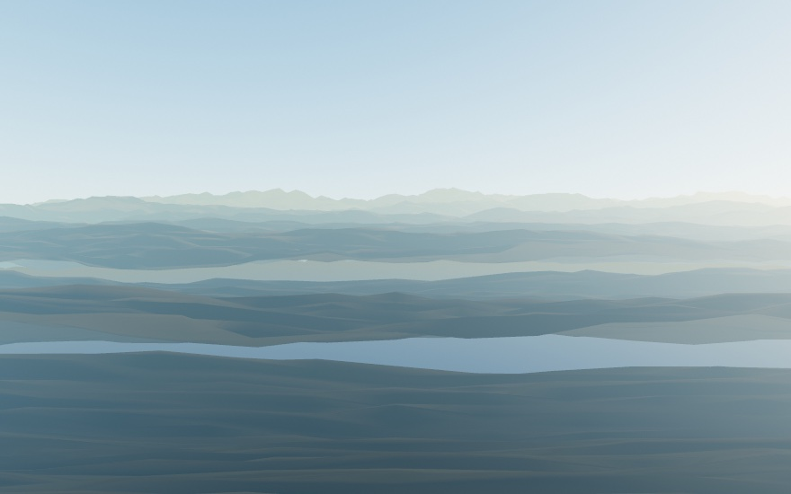

With a `.sky` environment it follows the sky's own sun, rotation and all, so dropping the sun to the horizon reddens the haze by itself. `density` is how much air the scene spans, and left unset it sizes itself to the camera framing. `haziness` trades the crisp blue of a clear day for the gray veil and sun halo of a humid one. It replaces `fog` for the frame, since the last call wins, and Chapter 25's volumetric beams ride it as they ride fog. The `3D/Effects/Atmosphere` example puts all of it on parameters (hold space to switch over from fog).

## More finishes you measure: the thin film

The bench's finishes were all picked by number. The thin film is the measured finish the bench did not need, and it colors a surface with a distance instead of a pigment.

### Color with no pigment: the thin film

Blow a soap bubble and it turns colors that were never in the soap. The wall of that bubble is a film a few hundred nanometers thick, and light reflects off both of its faces. The second reflection travels a little farther, so the two come back out of step. Where they line up a color gets brighter, and where they oppose each other it disappears. What is left is a color made by a distance. A **thin film** finish puts that film on any surface. It is for anodized titanium, oil on a wet road, the inside of a shell, and the bubble itself. The finish is Laurent Belcour and Pascal Barla's 2017 extension of the microfacet model, which adds up the light bouncing between a film's two faces.

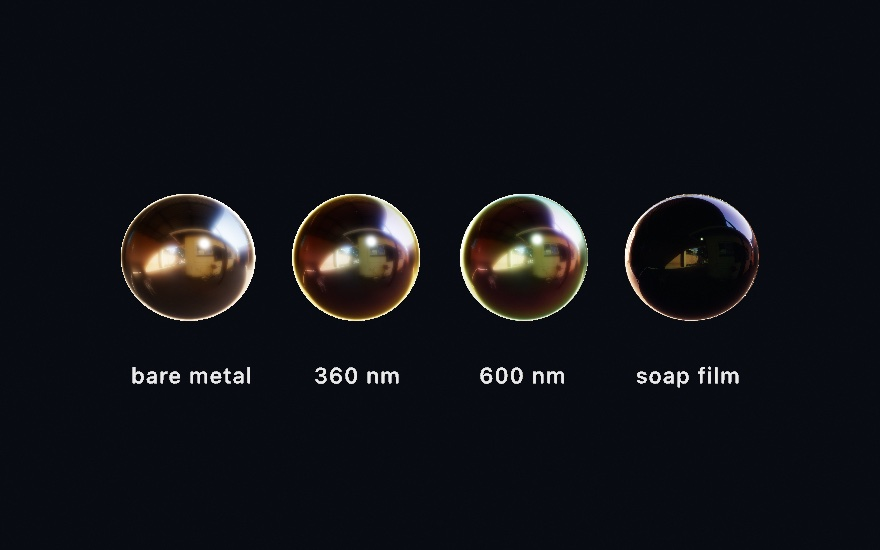

```swift
fill(Color(white: 0.75))
material(.anodized)                     // an oxide film over polished metal

var m = Material.metal(roughness: 0.16)
m.thinFilm = 1                          // how much of the reflection is the film's
m.thinFilmThickness = 480               // nanometers, and this is the color parameter
material(m)
```

The three metals are the same metal. Only the thickness of the film on them changes, and it sets their color. That number is in **nanometers**, which is light's own scale rather than the scene's. It is the only measurement in the material that is not in world units. So the same value works on a bubble and on a building. The 360 nm ball wears violet and gold, and the 600 nm one turns green and red. The [thin-film reference](../Docs/3D/3D.md#thin-film) walks the thickness through its bands.

Each filmed ball has one thickness, and yet its color changes from the middle of the ball to its edge. A slanted path through the film is a longer path. So the color walks as the surface turns away from you, and it walks again when you move. That is why a bubble's colors shift as you move. The surface *under* the film matters too, since the film's lower face is where the two meet. So the same film over metal and over a dark wet surface look nothing alike.

The fourth ball is the bubble itself. `.soapFilm(thickness:)` is [glass](#glass) and a film together, a wall you see through that is colored by its own thinness. A real bubble drains as it stands, thinning from the top until it goes black and pops. Walk the thickness down over time and yours will do the same. The reference lists the other presets. It differs from the `iridescence` under [Chapter 25](25-3DGently.md)'s `.iridescent` finish, which is a stylized rainbow at the rim. The thin film is measured, so it holds its color under a moving light the way the real surface does.

## Where this comes from

Normal mapping descends from Jim Blinn's 1978 bump mapping, which perturbed the shading normal instead of the surface. The tangent-space map is how that idea reached every real-time engine. Parallax occlusion mapping is the marching read of the same picture, from the terrain and surface work of the mid-2000s. Triplanar projection is the three-axis world projection Ryan Geiss wrote up for terrain in *GPU Gems 3*. The detail pair blends onto the base with the reoriented normal mapping of Colin Barré-Brisebois and Stephen Hill. Subdivision surfaces are Edwin Catmull and James Clark's 1978 scheme for quads and Charles Loop's 1987 one for triangles. Character modeling has run on the pair ever since. Projected decals follow the box projection of the real-time decal literature, notably Tiago Sousa and Jean Geffroy's 2016 talk on idTech 6.

The measured finishes are the Cook-Torrance microfacet model, in the metallic-roughness form Brent Burley presented for Disney in 2012 and the glTF specification wrote down. The anisotropic version follows Christopher Kulla and Alejandro Conty Estevez, who also wrote the production-friendly sheen used here. The clear coat is the second lobe of Google's Filament documentation. Lighting a scene from a picture of a place is Paul Debevec's idea, in the split-sum form Brian Karis published in 2013. The computed sky is Lukas Hosek and Alexander Wilkie's model, which ships inside Ollin. Subsurface scattering is the separable screen-space diffusion of Jorge Jimenez and colleagues. It runs over the measured skin profile Eugene d'Eon and David Luebke fitted, with the backlit half from Jimenez's translucency work. The entries after the bench name their own sources. Full credits are in the project's [attribution notes](../ATTRIBUTION.md).

## Go deeper

- [3D](../Docs/3D/3D.md): the full reference for every map (`normalMapped`, `surfaceMapped`, `parallaxMapped`, `displaced`, `triplanarTextured`, `detailMapped`, decals) and every material parameter, with the exact envelope of each.
- [The Hopf fibration](../Docs/3D/HopfFibration.md): the base sets, taking the color from the base point, the straight one, and what it costs to draw.
- [Scenes](../Docs/3D/Scenes.md): the whole `loadScene` reference, what carries over from a glTF file (nodes, cameras, punctual lights, animations, skins, and morph targets) and from a USD file (nodes, cameras, its UsdLux lights, its transform animation, and its UsdSkel skins and blend shapes), how intensities are normalized, and building a `Scene` in code.
- [Bringing a scene over](../Docs/Tools/SceneImport.md): `ollin new --from-scene` writes the sketch instead of loading the file, so the camera, the lights and every placement become source you own. What it leaves behind, and why, is listed there.
- [Cutting solids](../Docs/3D/3D.md#booleans): the four set operations on a `Mesh`, what has to be true of the two solids, what rides along with the result, and the two shapes that come out awkward.
- [Shadow art](../Docs/Generators/ShadowArt.md): the carving, what the solid really throws, and the rule for when two or three shadows can be cast at all.
- [Subdivision surfaces](../Docs/Generators/SubdivisionSurfaces.md): both schemes, what happens at an open boundary, and when to pick which.
- [Mesh growth](../Docs/Generators/MeshGrowth.md): the differential-growth and reaction-diffusion forms, their parameters, and how to keep a growth stable.
- [Environment lighting](../Docs/3D/3D.md#environment-lighting): all twenty curated environments listed by mood, which eight are bundled offline, `highResolution` backdrops, loading your own `.exr` or `.hdr`, where downloads cache, and the full procedural-sky parameters.
- [Atmosphere](../Docs/3D/Atmosphere.md): `aerialPerspective` with its `density` and `haziness`, how it follows a `.sky` environment's sun, and how it trades places with `fog`.
- [Physically based materials](../Docs/3D/3D.md#materials): the metallic-roughness model in full, plus the ready-made metals and dielectrics and how they combine with the stylized finishes.
- [Glass](../Docs/3D/3D.md#glass): every transmission parameter with its units, the environment requirement, and the edges spelled out.
- [Subsurface scattering](../Docs/3D/3D.md#subsurface-scattering): the three scattering parameters, the presets, and the envelope; worked example [`Examples/3D/Materials/Subsurface`](../Examples/3D/Materials/Subsurface/Sketch.swift) (hold space to compare against the plain surfaces).
- [Combining 3D features](../Docs/3D/Combining.md): which finishes reach which kind of geometry, which is the table to check when a material you expected to apply does nothing.
- The Farmanfarmaian homage [`MirrorFamily`](../Examples/Recreations/MonirFarmanfarmaian/MirrorFamily/Sketch.swift): a relief built as two meshes of flat triangles, one wearing a near-mirror metal and one a painted finish under a clear coat. Its reflections are traced against the room the sketch builds around it, which is where a mirror's look comes from.
- The Felguérez homages in [`Examples/Recreations/ManuelFelguerez/`](../Examples/Recreations/ManuelFelguerez/): `EspacioMultiple` pushes the flat outlines of a painting into slabs with `drawExtrude`, each to its own height. Then it pulls the slabs apart into a standing sculpture, so one point list is the painting, the relief and the sculpture. `RelieveLacado` raises a composed design in lacquered layers under a key light that circles slowly. With the lights off and the camera straight on it renders its own plan again, pixel for pixel, which is the check that the raising is right.
- The Bonačić homage [`GFE164`](../Examples/Recreations/VladimirBonacic/GFE164/Sketch.swift): 1,024 tubes of four lengths as two instanced draws, the tubes lit and their glass ends drawn inside `withoutLights`, so each lit glass is its own light. One point light for every block of sixteen tubes carries the color of what is lit there onto the tubes around it. A copy's color multiplies the `fill`, so the fill goes back to white first.
- Worked examples, in [`Examples/3D/`](../Examples/3D/): `Geometry/LoadedMesh` and `Geometry/LoadedScene`, `Materials/NormalMaps`, `Materials/SurfaceMaps`, `Materials/Parallax`, `Materials/Triplanar`, `Materials/Detail`, `Materials/Decals`, `Materials/BrushedMetal`, `Materials/CoatAndCloth`, `Materials/ThinFilm`, `Materials/SeeThrough`, `Materials/Explorer`, `Geometry/AnimatedScene`, `Geometry/SkinnedScene`, and `Environments/Cloudscape`.

---

[Contents](README.md#contents) · Previous: [Chapter 25, 3D, gently](25-3DGently.md) · Next: [Chapter 27, Landscapes and multitudes](27-Landscapes.md)
