#### <sup>[Ollin](../README.md) → [Guide](README.md) → Chapter 26</sup>

---

# 26. Sculpting with fields

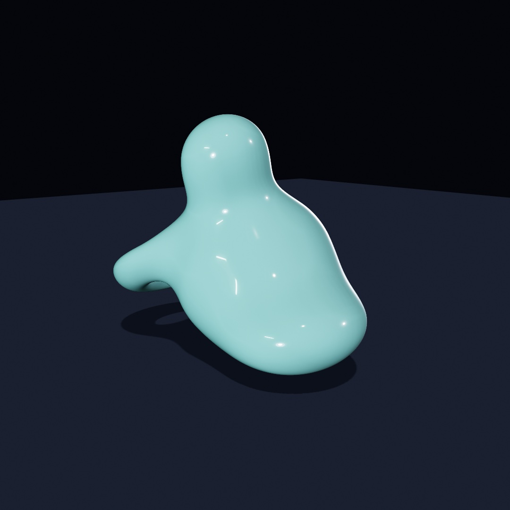

[Chapter 15](15-ShapesAsMaterial.md) treated shapes as outlines you cut and joined, like paper. This chapter treats them as something closer to wax. They melt into each other, carve each other, and hold together as one surface no matter how you push them. The tool is the **signed distance field**, an idea you've already met twice without the name. It ends in the sculpture above, one body made of four melted lobes, slowly breathing, orbitable with the mouse.

## A shape as a question

[Chapter 14](14-FieldsAndFlow.md) defined a field as an answer at every point. A **signed distance field** is a shape stored that way. Ask any point of the canvas and it answers with one number, *how far is the nearest surface*. The sign carries which side you're on. Positive is outside, negative is inside, and zero is exactly on the boundary.

<picture>
  <source media="(prefers-color-scheme: dark)" srcset="Images/26-SculptingWithFields/FieldMap-dark.jpg">
  
</picture>

That's the whole idea, and it's worth a slow look. The shape is not stored as an outline, and the *bold line* is only the places where the field happens to answer zero. [Chapter 17](17-YourFirstShader.md) used this trick per pixel (a circle was "all the points within `radius`", and `smoothstep` softened its edge). What's new here is what the representation makes possible, because if two shapes are each a distance function, then *combining the answers* combines the shapes.

## Melting

The everyday container for this is the `SDF` value type, and the first verb to learn is `smoothUnion`:

```swift
import Ollin

final class Melt: Sketch {
    override func draw() {
        background(Color(hex: 0x101318))
        noStroke()
        let k = 20 + (sin(time) * 0.5 + 0.5) * 90

        let blob = SDF.circle(radius: 130).colored(Color(hex: 0xE4572E))
            .smoothUnion(SDF.rect(width: 240, height: 140, cornerRadius: 28)
                .colored(Color(hex: 0x3A6EA5))
                .at(130, 40), k: k)

        drawSDF(blob.at(width / 2, height / 2))
    }
}
```

Run it and watch the seam. `SDF.circle` and `SDF.rect` are field *values*, like a `Shape` or a `Color`. From there `.at` moves one, `.colored` paints one, `.smoothUnion` merges two into a new field, and `drawSDF` rasterizes whatever field you hand it in a single pass. The parameter `k` is the width of the melt, in canvas points:

<picture>
  <source media="(prefers-color-scheme: dark)" srcset="Images/26-SculptingWithFields/MeltStrip-dark.jpg">
  
</picture>

At `k = 0` the union is hard, two shapes overlapping like [Chapter 15](15-ShapesAsMaterial.md). As `k` grows, the seam becomes a fillet, then a neck, then the pair is one body. Look at the colors. The smooth union blends the two operands' colors across the melt, and that is what makes the result read as one object rather than a trick. This one parameter is most of the medium, so put it on a `@Param` slider and you'll feel it immediately.

One habit is worth setting early, and it's that **order matters in the chain**. Every call wraps the field before it, so `circle.at(p).scaled(2)` scales the *moved* circle (it lands twice as far out), while `circle.scaled(2).at(p)` scales in place and then moves. Read chains inside out and they always make sense.

## The verbs

Melting is one verb of six:

<picture>
  <source media="(prefers-color-scheme: dark)" srcset="Images/26-SculptingWithFields/Verbs-dark.jpg">
  
</picture>

```swift
a.union(b)               // either
a.smoothUnion(b, k: 34)  // either, melted
a.subtract(b)            // a with b carved away
a.smoothSubtract(b, k: 34)
a.intersect(b)           // only the overlap
a.morph(b, amount: 0.5)  // a shape halfway between the two
```

These are [Chapter 15](15-ShapesAsMaterial.md)'s booleans reborn on fields, plus two things outlines can't do. The smooth forms are one. The other is `morph`, which blends the *boundary itself*, so at `0.5` you get a genuinely in-between shape rather than a crossfade. Two modifiers round out the kit. `.rounded(12)` inflates any field with soft corners, and `.onion(8)` hollows it into a shell. And past the melted family there's a whole *machined* family that shapes the seam like joinery instead of wax. It holds `chamferUnion`, `stairsUnion`, and `columnsUnion`, plus engrave, groove, tongue, and pipe detailing. The [combinators reference](../Docs/Drawing/Combinators.md#combining) has the full bench.

## Writing it like drawing

Building chains is precise, but sometimes you just want to draw. The block form captures ordinary draw calls and merges them:

```swift
translate(width / 2, height / 2)
fill(Color(hex: 0xE4572E))
smoothUnion(k: 18) {
    drawCircle(0, 0, 110)
    drawRect(center: Vector2(120, 30), width: 190, height: 80, cornerRadius: 20)
    drawNgon(-105, 40, 62, sides: 6)
}
```

Everything drawable with a fill can join a block, including shapes the `SDF` type doesn't name, like hearts, stars, and trapezoids. Each call's own `fill` becomes its color in the melt. It reads like normal drawing, and the block simply holds the shapes open until it closes, then merges them all.

## Into space

Everything above lifts into 3D nearly unchanged. `SDF3D` builds fields in space, and `drawSDF3D` draws the merged surface through [Chapter 21](21-3DGently.md)'s camera, lit by its lights, wearing its materials:

```swift
final class FirstMarch: Sketch {
    override func draw() {
        background(Color(hex: 0x0D1017))
        camera(.orbiting(target: .zero, radius: 5.2, azimuth: 0.5,
                         elevation: 0.3, fieldOfView: .pi / 4))
        material(.jade)

        let blob = SDF3D.sphere(radius: 1).colored(Color(hex: 0x39D0C8))
            .smoothUnion(SDF3D.sphere(radius: 0.72)
                .at(1.0, 0.42, 0.1)
                .colored(Color(hex: 0xFF4F97)), k: 0.5)
            .smoothSubtract(SDF3D.sphere(radius: 0.55).at(-0.45, 0.75, 0.5), k: 0.25)

        drawSDF3D(blob)
    }
}
```

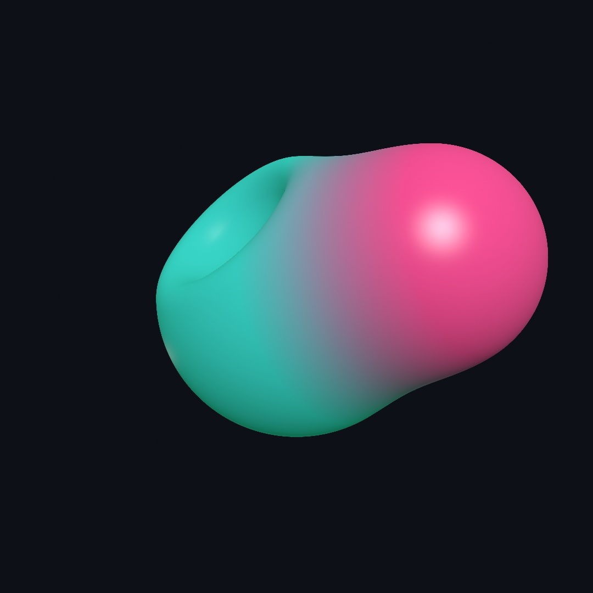

Try building that from triangle meshes and you'll appreciate what just happened. The two spheres aren't two surfaces joined at a seam. They are *one* surface, because the field underneath is one function. The leaf catalog matches the mesh primitives. Sphere, box, torus, capsule, cylinder, cone, octahedron, and more are all there. So is `line(from:to:radius:)`, a stroke between two points that's perfect for sketching limbs and branches for the melt to flesh out. Fields and meshes coexist in one scene and correctly hide each other. The [combinators reference](../Docs/Drawing/Combinators.md#fields-3d) has the whole catalog.

## How the picture gets made: sphere tracing

A mesh is triangles, and the GPU knows how to draw triangles. A field is just a function, so how does it become pixels? By *asking it the right question, repeatedly*. For each pixel, a ray leaves the camera, and the field is asked how far the nearest surface is. The answer is a promise, nothing is closer than this, so the ray can safely hop exactly that far. Ask again, hop again:

<picture>
  <source media="(prefers-color-scheme: dark)" srcset="Images/26-SculptingWithFields/MarchRay-dark.jpg">
  
</picture>

The hops shrink as the ray nears a surface and grow again in open space, so the ray lands on the surface without ever stepping through it. Watch them tighten as the ray passes over the lower shape. This is called **sphere tracing**, and it's the second big advantage of the representation. The same number that let shapes melt is what steers the rays that draw them.

You get all of this without writing any of it. The one practical parameter is `raymarchQuality(_:)`. Tracing costs by the pixel, so the live window traces at a resolution budget by default while exports always render at full quality. If a heavy field stutters while you sketch, `raymarchQuality(.performance)` loosens that budget further.

## The other way out: field to mesh

Everything so far turns a field into pixels. Sometimes you want it to turn into an object instead.

`isosurface` walks a grid of cubes through space, asks the field for a value at every cube corner, and stitches the crossings into triangles. What comes back is an ordinary `Mesh`, so it lights, takes materials and shadows, and exports like anything else you draw.

The field worth reaching for first is `Metaballs`: soft spheres whose values add up.

```swift
var blobs = Metaballs()
blobs.add(at: Vector3(-0.9, 0.25, 0), radius: 0.62)
blobs.add(at: Vector3(0.5, -0.2, 0.15), radius: 0.52)
blobs.add(at: Vector3(1.4, 0.45, -0.2), radius: 0.40)
drawMesh(blobs.mesh())
```


`radius` is the size a ball reads at on its own. Put two within reach of each other and the values in the gap add up to more than either one makes there. The surface swells across it, and the pair runs together. Move them apart and the bridge necks down and snaps. `level` is the value the surface is drawn at. Lowering it fattens everything and makes blobs merge from further away, and raising it thins them until they separate. A negative `strength` carves into a neighbor instead of joining it.

The right panel is that same form with `wireframe()` on, marched deliberately coarse so the cells show. The left one is the same coarse mesh, and it still looks smooth. The shading normals come from the field rather than from the flat faces.

Any field works here, not just metaballs. The one thing to know is which side it treats as solid. The surface wraps the region where the field runs *above* the level. So a distance function, which is negative inside, needs a minus sign in front of it.

A field with corners is where the grid shows. Marching cubes can only put a vertex on an edge of the grid. A corner that falls inside a cube therefore comes out as a bevel across it. A block reads as a pebble at any resolution you can afford. Ask for `method: .dualContouring` and each cube gets one vertex where the field's own normals say the surface is. Three faces meet at a corner, so the vertex lands on the corner, and a bored hole keeps its rim.

```swift
let block = isosurface(at: 0, in: box, resolution: 14, method: .dualContouring) { p in
    let q = Vector3(abs(p.x) - 1, abs(p.y) - 1, abs(p.z) - 1)
    let walls = Vector3(max(q.x, 0), max(q.y, 0), max(q.z, 0)).length + min(max(q.x, max(q.y, q.z)), 0)
    let bore = (p.x * p.x + p.y * p.y).squareRoot() - 0.5
    return -max(walls, -bore)
}
```

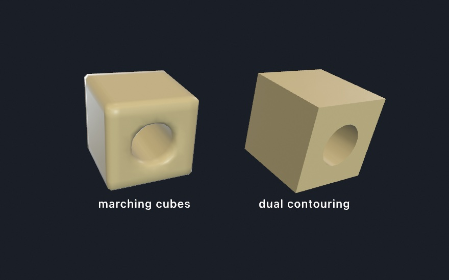

Both blocks come from the same fourteen cells across. Only where the vertices sit differs. It costs a dozen extra reads of the field at every crossing. Reach for it when the field has edges to keep.

So there are two ways out of a field, and they cost differently. `drawSDF3D` shades straight to pixels and pays by the pixel. `isosurface` makes geometry and pays by the volume, cubically in `resolution`. Reach for the mesh when you need a real object, and for the traced field when you just want it on screen.

## One solid, two shadows

Here is a use for a mesh carved out of a volume that has nothing to do with fields, and it is the best argument for paying by the volume rather than by the pixel.

<picture>
  <source media="(prefers-color-scheme: dark)" srcset="Images/26-SculptingWithFields/TwoShadowsOneSolid-dark.jpg">
  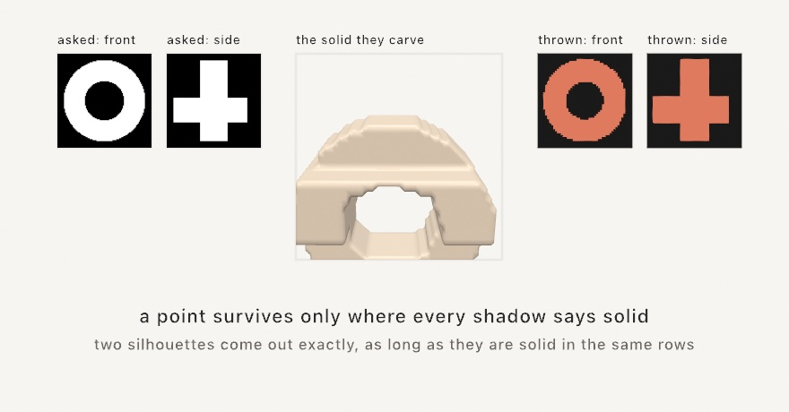
</picture>

```swift
let art = shadowArt(fromFront: ring, fromSide: cross, resolution: 56)
drawMesh(art.mesh)
```

A lit point casts its shadow along the light's direction. So a point can only be part of the solid if it lands inside the shadow in *every* direction it is lit from. Keep exactly those points and what is left is the largest solid that could cast them, which is why a shape that looks like neither shadow throws both.

**The shadows it really throws are never larger than the ones you asked for, and can be smaller.** The catch is that two views share an axis: the front and the side are seen from either end of the same vertical, so a row that is empty in one empties it in the other. Two silhouettes come out exact when they are solid in the same rows, which is why the classic circle-and-square works. Three agree far less often, and the famous three-shadow sculptures are designed around that rather than in spite of it. `art.shadow(from: .front)` hands back what is really thrown, and where it differs from what you asked for, it is the one that is true.

One practical trap if you show the solid beside flat panels, as the figure does. **Lights are per-frame state, not per-shape.** Calling `noLights()` after drawing the mesh, to keep the panels flat, unlights the mesh you already drew. Draw the flat things first, or leave the lights alone.

## Sculpting like clay

For forms you build up rather than compose, the `sculpt { }` block turns the operators into working state. Shapes `add()` on or `carve()` away, melting by the current `blend(_:)` amount, and the block reads top to bottom like a session at a potter's wheel:

```swift
sculpt {
    blend(0.3)                 // melt amount for what follows
    fill(Color(hex: 0xD96F4E))
    drawSphere(radius: 1.0)                                        // the body
    withState { translate(0, 0.95, 0)
                drawTorus(radius: 0.5, tube: 0.16) }               // a lip melts on
    carve()                    // now shapes cut away
    withState { translate(0, 1.1, 0); drawSphere(radius: 0.52) }   // the hollow
    add(); blend(0.05)         // back to adding, nearly hard
    withState { translate(0, 0.35, 1.05); rotateX(.pi / 2)
                drawTorus(radius: 0.34, tube: 0.09) }              // a handle
}
```

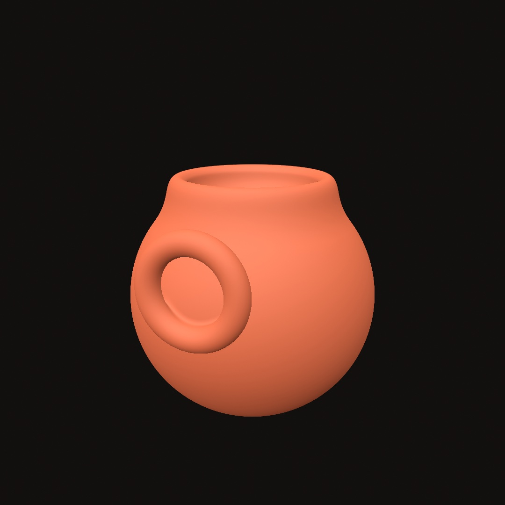

Flip one `add()` to `carve()` and a bump becomes a dent, which is exactly the kind of edit live coding thrives on. A further set of distortions bends whole forms. `.twisted(1.2)` screws a shape around its axis, `.bent(0.6)` curls it, and `.displaced` / `.roughened` ripple or roughen the surface, the rock look. They're all safe to stack, because the tracer compensates for the distortion on its own.

## Folding space: domain repetition

The last trick is the strangest one. Instead of copying a shape, you can fold the *space it lives in*, so one shape answers for many:

<picture>
  <source media="(prefers-color-scheme: dark)" srcset="Images/26-SculptingWithFields/DomainFold-dark.jpg">
  
</picture>

```swift
cluster.mirrored(x: true)                             // a facing pair
cluster.repeated(spacing: Vector2(88, 88), count: 1)  // a 3×3 tiling
petal.at(82, 0).repeatedRadially(count: 9)      // a rosette
```

There is still only one cluster. The domain operator rewrites each query point before the field answers, folding it across the mirror, wrapping it into a cell, or rotating it into a wedge. Copies are free, so a thousand-copy tiling costs what one copy costs. All three work in 3D too, where `repeatedRadially` fans a wedge around an axis and a mirrored melt becomes a symmetric creature. One honest caveat is worth knowing. The radial fold is exact when the repeated content is symmetric within its wedge. An asymmetric cluster can show a faint seam where the wedges meet, which is why the rosette panel uses a symmetric petal.

## Infinite detail: the fractal leaves

Every leaf so far had a distance you could write down. A sphere is the length of the point minus its radius, and the rest are a page of the same kind of algebra. Three leaves have no such formula at all:


```swift
SDF3D.mandelbulb(power: 8, iterations: 8, radius: 1.2)
SDF3D.mengerSponge(iterations: 3, size: 2.1)
SDF3D.mandelbox(scale: -1.5, iterations: 12, size: 2.2)
```

These three are fractals. Each one is a rule applied to a point over and over. The shape is the set of points the rule never flings away. There is no equation for that surface, so the field *estimates* its distance instead. It runs the rule a few times from the query point and watches how quickly the orbit escapes. A point about to be flung far must be far from the set. A point that keeps circling must be near it. That rate becomes a length the tracer can hop by. Everything else in this chapter then works unchanged. A fractal melts into a sphere. It carves a box. It mirrors and repeats.

`iterations` is the dial between detail and cost, since every hop runs the rule again. The bulb's `power` is its own shape. Eight is the classic. A fractional power is a different bulb, so sweeping it slowly gives the breathing animation people know it by. The box's `scale` plays the same role. One thing to expect: the finest detail you can see is set by the tracer, not by the fractal. To look deeper, make the leaf bigger and raise `iterations` rather than moving the camera in. The example `3D/Raymarching/RaymarchedFractals` puts each one's dial in the inspector.

## The light this needs

A field shades like a mesh, so the finishes of [Chapter 22](22-Meshes.md) reach it. `material(.jade)` gives a melt its glow, an `environment(_:)` lights it exactly as it lights a solid, and `castShadows()` grounds it. A field even self-shadows, and it trades shadows with the meshes around it. `material(.glass(...))` works on one too. A tinted interior deepens over the same distance it would inside the mesh of that shape. A green blob and a green ball come out the same green. What is left is the light itself: what it does when it bounces, what it does on its way through glass, and what a frame can borrow from the frames before it.

## Mirrors that see off screen: ray-traced reflections

[Chapter 21](21-3DGently.md) finished with screen-space reflections and an honest limit. They reflect what is on the screen, so they cannot show you anything the camera can't already see. `rayTracedReflections()` is the answer to that, and it works differently enough to be worth understanding.

Instead of searching the finished picture for what a reflection should show, it fires an actual ray off each reflective surface. It asks what the ray hits, using the real geometry. Off-screen objects appear. Hidden faces appear. The underside of a ball resting on a mirrored floor appears, because the ray goes there and looks. It integrates into the environment lighting rather than sitting on top as a post-process. A traced hit simply replaces what the environment would have contributed, and a ray that hits nothing shows the sky.

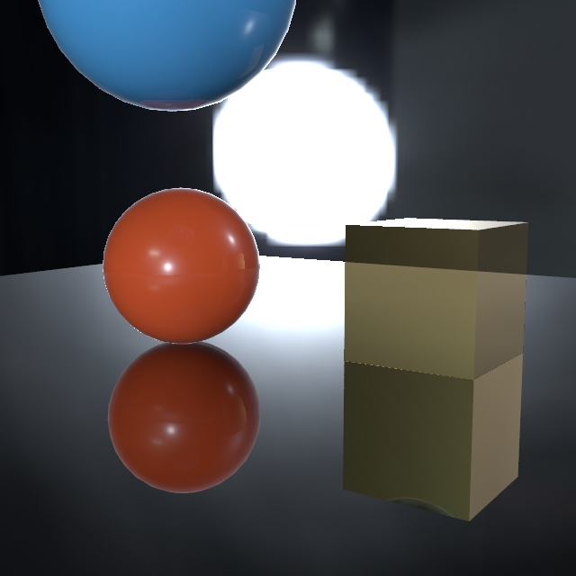

Look at the box's reflection rather than the sphere's. You can see its underside, the face resting toward the floor, which the camera never sees from where it stands. That face exists in the geometry, so a ray sent to it comes back with an answer. A screen-space reflection has no pixels of that face to borrow, because the picture simply doesn't contain it, and has to approximate.

```swift
environment(.studio)
rayTracedReflections()          // needs a ray-tracing GPU; a no-op elsewhere
material(.metal(roughness: 0.08))
```

Three conditions come with it. It needs an `environment(_:)` to fall back to, it only affects physically based materials, and it needs a GPU that can trace rays. Every Apple silicon Mac can. The M3 generation and later do it in dedicated hardware and earlier chips do it in software, so the same scene costs more frames on an M1 or M2. Anywhere it isn't available the call does nothing at all rather than failing. A sketch that asks for it still runs and simply looks plainer, which is why you can leave the call in.

Only the *reflecting* surface has to be physically based. What it shows can wear any finish you like. A ray shades whatever it hits the way that surface shades head on. A cel-shaded prop keeps its hard bands in the mirror, and a Gooch one its warm-to-cool ramp.

There's one behavior worth expecting rather than being puzzled by. Reflections are traced with a limited number of rays and cleaned up over time while the camera holds still. So a fresh view can look faintly noisy for a moment before it settles. Exports don't have that problem, because there Ollin averages several rays within each frame instead of across frames. That's also why a video export can't flicker.

Tracing a mirror is the most expensive thing in a reflective frame, so there is a dial for it, the same kind shadows have. If a mirrored scene stutters while you sketch, `reflectionQuality(.performance)` traces the reflection at half size and stretches it back. On an M2 that takes the example scene from 45 frames a second to 71. You pay for it where you would expect. A curved mirror gets blockier, and fine detail inside a mirror image softens. What you do not pay is the mirror itself: each surface keeps its own reflection right up to its edge. Exports take the fine end on their own.

There is a second dial, and it is about distance rather than detail. A traced reflection walks two surfaces by default: the one the ray finds, and whatever *that* surface reflects, which is the sky. A single mirror never needs more than that. Stand two mirrors face to face, though, and you have asked for something endless. **A tunnel of images is only as deep as the chain you paid for.** At two surfaces the tunnel stops at the third door and puts the environment in it:

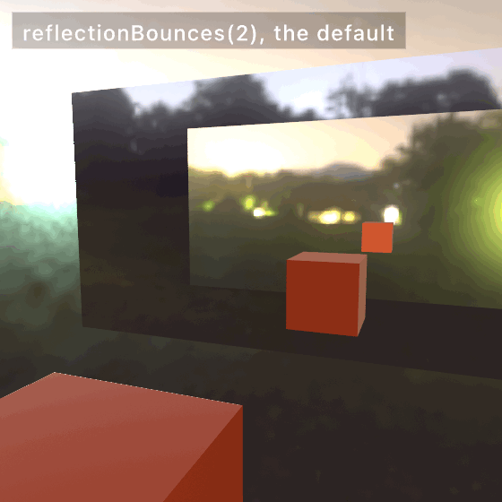

`reflectionBounces(4)` opens two more doors, and each step you add costs one more traced ray for every reflected pixel. The images dim quickly, because each mirror passes on only the fraction it reflects. Three or four is usually the end of what you can see. The count is clamped to the range 2 to 8, and it is persistent, so set it once.

### The floor that shows the room

There is a third dial, and it is the one that changes the most pictures. Every reflection so far has been a mirror's. A mirror sends every ray one way, so a single traced ray describes it exactly. Brushed steel does not. A satin floor, a waxed table, a bead-blasted panel: each sends every ray a slightly different way. What you see in one is the average of all of them.

One ray cannot be an average. So on its own, Ollin answers roughness by fading that ray into the blurred environment. The rougher the surface, the more of the environment you get. Stand a satin floor in a red room and it reflects a gray sky. **A rough surface should show you a blurred room, not a blurred sky.** `glossyReflections()` is the call that gets you one:

```swift
rayTracedReflections()
glossyReflections()                    // needs a ray-tracing GPU; a no-op elsewhere
material(.metal(roughness: 0.3))
```

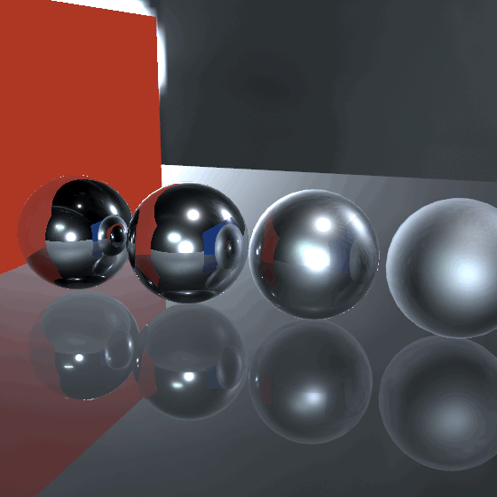

Watch the floor rather than the balls. With one ray it holds a hard little copy of each ball, which no satin floor has ever done. The walls arrive as a wedge with a crisp edge. With the lobe the reflections soften into the floor and the two colors spread out across it. The mirror ball on the left does not change at all, because a mirror was never the problem.

Two things are happening for you here. Each ray now leaves along a slightly different direction, picked from how rough the surface is. Each pixel also borrows the rays its neighbors just sent. That borrowing is the part that matters. A handful of scattered rays on their own would look like glitter, and the sharing is what turns them into a picture. A polished surface ignores its neighbors' rays automatically, which is why the mirror ball stays sharp with nothing said about it.

It reaches up to about three-quarters rough and hands back to the environment past that. By then the blur is wide enough that the sky really is the honest answer. It costs one more pass over the picture, so keep it for the sketches whose surfaces are actually satin. Like the others, it is persistent and does nothing at all on a GPU that cannot trace, so the call can stay in.

Meshes and fields differ in a few places over which finish applies to which. The [combining reference](../Docs/3D/Combining.md) is the table for that.

## Light that bounces: global illumination

Every light in the last two chapters worked the same way. It left the lamp, hit a surface, and stopped. Real light doesn't stop. The sun patch on your floor lights your ceiling from below. A red wall tints the white shelf beside it, and the dark side of everything in the room is filled in by light arriving second-hand. **Direct light only ever explains half a picture.** The other half has bounced at least once. One call turns that half on:

```swift
spotLight(.white, at: Vector3(0, 3.8, 0), direction: Vector3(0, -1, 0), intensity: 3)
castShadows()
globalIllumination()        // needs a ray-tracing GPU; a no-op elsewhere
```


Everything in this room except the pool itself is bounce. The spot never touches the ceiling, and the ceiling glows anyway, lit from below by the floor. The walls were never lit directly either, yet the orange one reads orange, because floor-light reached it and came back stained. The sphere's shadow side isn't black. It's filled by the bright floor beside it. Cover the figure with your hand except the pool, and you're looking at what the direct-only version showed.

Under the hood, Ollin scatters a grid of invisible **light probes** through the scene. Every frame it re-asks them what light is arriving from every direction, by firing rays at the actual geometry. Lit surfaces then read their neighborhood's probes for the light the lamps couldn't deliver directly. Because the probes are re-traced live, a swinging lamp or a moving shape keeps bouncing correctly, and nothing is baked ahead of time. Three practical notes fall out of that:

- **It composes with what you already know.** With `castShadows()` on, bounce respects the same shadows the direct light does, so light doesn't sneak through a wall on the second hop (a sealed box stays dark inside). With an `environment(_:)`, the probes carry the sky in *with occlusion*, so a room lit through a doorway darkens with distance from the door instead of glowing evenly, which the plain environment ambient can't do.
- **It's the diffuse half.** Matte surfaces gather bounce; a mirror's sharp image of the scene is `rayTracedReflections()`, the specular half from the previous section, and the two are made to run together.
- **`intensity` is an artistic dial, not a lie detector.** `1` is physical. The figure runs `1.6` because the picture wanted it, and that's the whole job of the parameter.

Like the reflections, the probe field settles over a few frames live, so a sudden lighting change fades in the way your eyes adjust. It converges fully inside each frame on export, so a still or a video reproduces exactly. And like the reflections, it needs a ray-tracing GPU and does nothing at all elsewhere, so the call can stay in the sketch.

The [`GlobalIllumination` example](../Examples/3D/Lighting/GlobalIllumination/Sketch.swift) is this room with the lamp swinging. The space bar toggles the bounce, which is the clearest before-and-after you can give yourself. The bounce follows the picture wherever it goes. A wall seen *inside a mirror* carries the same second-hand light as the wall itself, and a scene drawn into a layer for depth of field gathers it like the canvas does. If a heavy scene stutters while you sketch, `globalIlluminationQuality(.performance)` trades a grainier bounce for frame rate, the same kind of dial shadows have. Exports always take the fine end on their own. Scale isn't your problem either. On a terrain-sized scene the scene-wide probe grid would spread too thin, so finer probe volumes gather around the camera on their own and travel with it. The bounce near what you're looking at stays room-quality with nothing to configure.

## The light the glass takes, given back: caustics

Set a real glass on a sunlit table and look next to it. Inside its shadow there's a bright loop, brighter than the open table around it. The glass didn't destroy the light it blocked. It bent all of it into one small place. That focused light is a *caustic*, and one call turns it on:

```swift
directionalLight(.white, direction: Vector3(-0.3, -1, -0.2))
castShadows()
caustics()

fill(.white)
material(.glass(thickness: 1.8))
drawSphere(radius: 0.9)               // its bright spot lands inside its own shadow
```

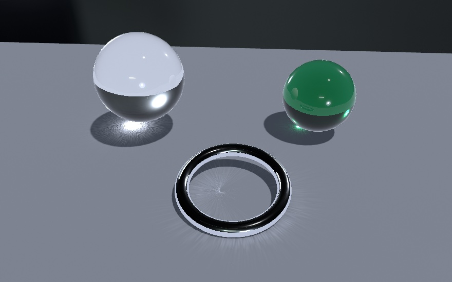

**A shadow is where light couldn't go; a caustic is where it went instead.** The renderer traces thousands of little parcels of light from the sun, through every glass and every polished metal, and draws each one where it lands. A clear ball throws a tight hot spot. A bottle-green ball throws a green one, because the parcels crossed the green interior. A chrome ring folds light into the curved fan a wedding band leaves beside itself. Nothing needs declaring: whatever transmits or mirrors, casts.

Two parameters. `caustics(intensity: 1.6)` turns the patterns up past physical, for drama. `caustics(dispersion: 1)` gives every parcel its own wavelength, so a prism's edge fans into a real rainbow and even a plain sphere's spot picks up red and blue fringes. If the patterns look coarse, `causticsQuality(.detail)` traces more parcels; exports always use the fine setting on their own. Like the other traced light, it needs a Mac that traces and quietly does nothing elsewhere, so the call can stay in the sketch. The [`Caustics` example](../Examples/3D/Lighting/Caustics/Sketch.swift) is the sunlit-table scene: two glass spheres and a chrome ring, with the space bar to compare.

## Edges that settle: temporal anti-aliasing

The last two sections shared a trick worth naming. Render a slightly different estimate every frame, and average. The reflections jitter their rays, and the probes rotate their fans. `temporalAntialiasing()` applies the same idea to **every edge in the 3D picture**:

```swift
camera(.orbiting(target: .zero, radius: 8, azimuth: time * 0.05, elevation: 0.3))
temporalAntialiasing()      // any Metal GPU; edges refine as frames accumulate
```

Every 3D frame already takes eight samples per pixel, but always at the *same* eight positions. So a thin bright edge at a shallow angle still lands as a fixed staircase, and the steps crawl when the camera drifts. With the call on, the camera's projection is nudged by a sub-pixel offset that changes every frame, and the frames fold into a running average. Each pixel has soon been sampled at dozens of positions instead of eight. The staircase melts into a gradient, the crawling stops, and the leftover shimmer of the traced effects above calms down with it. It follows the camera, so orbiting keeps the accumulated detail. It leaves 2D drawing untouched, since that path is already exact. And like everything in this chapter, an export doesn't wait for frames. It renders the scene several times at fixed offsets inside each frame and averages, so a still is finished immediately and a video can't flicker. Unlike the mirrors and the bounce, it doesn't need a ray-tracing GPU, and any Mac that runs Ollin can do it.

One thing the average can't know on its own is where a *moving object* was last frame. The camera's motion is followed automatically. A mesh spinning or flying through the scene on its own refreshes its history instead, so there are no ghost trails, at the price of its edges reading rawer mid-flight. Wrap its drawing in `withMotion { }` and Ollin remembers the block's placement from frame to frame. That hands the average each mover's exact screen motion, so its edges keep their refinement while they move. Name the block, as in `withMotion("rotor") { }`, if the code path that draws it changes between frames.

The [`TemporalAA` example](../Examples/3D/Effects/TemporalAA/Sketch.swift) is a trellis of thin tilted rods under a slow camera sway, with the toggle on a parameter. An orbiting bar has a `withMotion` parameter of its own. Flip them mid-motion and watch the edges stop crawling. The scenes where it makes the most difference are exactly that kind, so hairline geometry, high contrast, and movement.

## Highlights that hold still: specular anti-aliasing

The section above steadied the *edges* of things. Their highlights can crawl too, and jitter is not what fixes that.

A polished surface turns a light into one small bright spot. Where the surface curves tightly, or a normal map turns quickly, a single pixel covers a whole range of surface directions. The spot can end up narrower than that pixel. Ollin shades each pixel once. So the one sample either lands on the spot or misses it, and which of those happens changes from frame to frame. That is the sparkle running over a bed of small shiny balls, a metal roof in the distance, or a bumpy map. The eight samples per pixel do not help: they sample the *shape*, and the shading still happens once.

```swift
material(.metal(roughness: 0.1))
specularAntialiasing()      // the sparkle stops running
```

The call widens the roughness of each pixel by how far its own surface direction turns across it. A wider highlight is broader and dimmer. It fills the pixel instead of hiding inside it, so it stays where it is while the surface moves. The cost is two small measurements per pixel. There is no extra pass and no history to build up, and any Mac that runs Ollin can do it.

It finds the detail on its own. A flat wall holds one direction across every pixel of it, so it comes back exactly as it was. A ball a few pixels wide is widened a lot. Nothing is widened past a fixed limit, which keeps the pixels along a silhouette from turning matte. `strength` scales the whole effect. 1 is the standard amount, 2 gives up more of the finish for more calm, and below 1 keeps more of the original sharpness.

Two things it will not do. A highlight so bright that it has already gone flat white cannot be calmed, and widening it only spreads that white. Turn the strength down if a picture reads softer rather than steadier. The measurement also comes from the pixels next door, so detail far below one pixel is guessed rather than measured.

The [`SpecularAntialias` example](../Examples/3D/Effects/SpecularAntialias/Sketch.swift) is a bed of small polished balls under one hard light, with the toggle and the strength on parameters. The plate standing behind them is flat, so it never changes. Watch the balls at the back of the bed, where they are smallest.

## The streak a shutter leaves: motion blur

A rendered frame is an instant: everything in it is perfectly sharp, no matter how fast it was going. A film frame is not. A real camera's shutter stays open for a slice of each frame, and anything that moved during that slice smears along its path. Your eye has spent a lifetime learning that fast things streak. That's why rendered motion can feel like a strobe, since the picture keeps saying *is* when it should sometimes say *was going*. A sharp frame says where things are, and a streak says where they're going.

```swift
motionBlur()                 // the film-standard 180-degree shutter
withMotion {
    rotate(time * 2.5, axis: .unitY)
    translate(2.5, 1, 0)
    drawSphere(radius: 0.4)  // streaks along its orbit
}
```

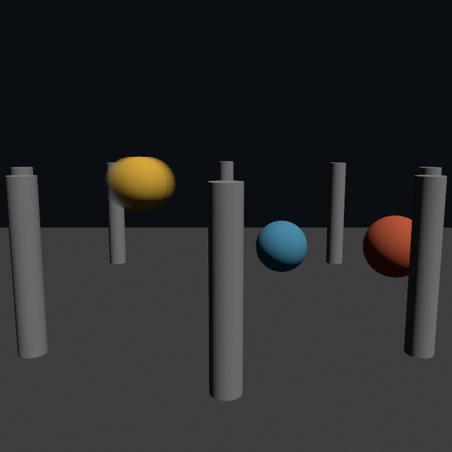

The figure is one still frame, and it already tells you who is moving and how fast. The fast sphere draws a long streak along its orbit, the middle one a short smear, the slow one barely softens, and the columns stay razor sharp. That's the whole contract. Each pixel streaks along *its own* motion. The camera's movement is read from the depth buffer with no declaration at all, so pan past a still scene and the whole scene smears by exactly how far it slid. An object moving on its own declares itself with the same `withMotion { }` block temporal AA already uses, one wrapper serving both systems.

`shutter` is the photographic dial. The default `0.5` is the film standard, the shutter open for half of each frame, the look every movie trained you on. Drop it toward `0.1` and motion turns crisp and staccato, the action-movie look. Raise it to `1` for a full frame of smear, and past it for a streak no real camera could make. Because the blur reads the motion *between frames*, an export carries it deterministically. Frame k streaks by exactly how things moved since frame k-1, a video export looks like the live window, and the very first frame, with nothing before it, is honestly sharp.

The [`MotionBlur` example](../Examples/3D/Effects/MotionBlur/Sketch.swift) is the figure's scene live, with the toggle and the shutter on parameters. Slide the shutter while the spheres orbit and watch the same motion go from strobe to smear. Captions, 2D overlays, and the environment backdrop never streak, so the interface stays still while the world moves.

## Light in the camera: lens flare

Everything else in this chapter is the light and the thing it lands on. A flare is the camera admitting that it is there.

A lens is supposed to bend light onto the sensor. Some of it does not. At every surface a little reflects instead of passing through, and light that reflects twice ends up going the right way again. It lands on the sensor, but in the wrong place. That misplaced light is a **ghost**. A row of ghosts, on the line from a bright source through the middle of the frame, is what a lens flare is.

```swift
var camera = Camera3D(eye: ..., target: ...)
camera.apertureBlades = 6            // the iris has six blades
self.camera(camera)

pointLight(.white, at: lamp, intensity: 20)
lensFlare()                          // the ghosts that lamp leaves in the lens
```

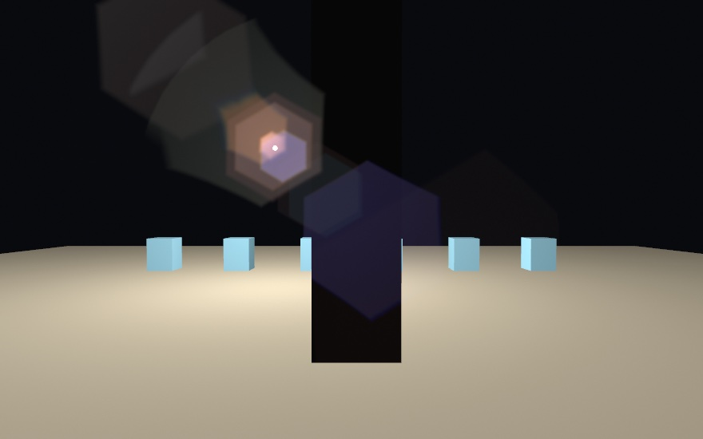

Both ghosts in the figure are hexagons, because the iris has six blades and a ghost is a picture of the opening its light came through. Their colors differ because each surface of the lens is coated for a different wavelength. A coating passes on whatever it fails to cancel. And look where the teal one is. It lies *over* the near black slab, not behind it. Nothing in the room is glowing. The light never reached that slab. It only reached the glass in front of the sensor.

That is one half of a flare. The other sits on the source itself.

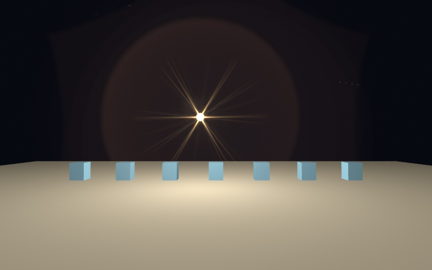

Those arms are light **bending at the edges of the iris**. Far from an opening, what its edges do to a wave is exactly the opening's own Fourier transform, so what lands on the sensor is a picture of the opening turned inside out. Six blades put six arms on the star for the same reason they put six sides on a ghost.

Three things follow from that, and all three are worth knowing:

- An **odd** number of blades gives **twice** as many arms. No two of its edges are parallel, so each throws its own.
- A **round** iris throws no arms at all, only a halo. Set `apertureBlades` to 0 and watch the arms go with the hexagons.
- **Stopping down grows the star** while it shrinks the ghosts. Light spreads more around a smaller opening, so a landscape shot at f/16 gets long rays and a portrait wide open gets almost none.

The arms fan into color at their tips because a longer wavelength bends further, so red reaches past blue. `star:` scales it, and `star: 0` leaves the ghosts alone without it, which is a real choice: they are two different effects and a piece may want one and not the other.

So the call asks for a lens, not for a look:

```swift
lensFlare(amount: 0.6, lens: .heliar.stopped(to: 11))
```

`Lens.heliar` is a real prescription, a 1950s portrait lens. Its nine surfaces decide how many ghosts there are, where each sits, how big it is, and what color it comes out. `stopped(to:)` closes the iris, and every ghost shrinks together. `multicoated()` coats each surface for a different wavelength, the way a modern lens is made. That is what puts the ghosts in different colors instead of all in one. Type in a different prescription and you get a different camera's flare.

`strength` is the honesty dial, and it is worth being honest about. A flare is a defect. Sometimes you want it, often you want a trace of it, and plenty of pieces want none. `0` removes it.

The last part is what keeps a flare from reading as a sticker stuck to the lens. Its strength follows how much of the source the camera can actually **see**. Walk something in front of the lamp and the flare fades as the lamp is covered. It does not switch off the moment the lamp's center goes behind. That is one of those details you never notice when it is right and cannot stop noticing when it is wrong.

The [`LensFlare` example](../Examples/3D/Effects/LensFlare/Sketch.swift) drifts a lamp back and forth behind a slab with the strength, the f-number, and the blade count on parameters. Watch the ghosts fade as the lamp goes behind, and watch them shrink together as you stop down.

## Rendering fewer pixels: temporal upscaling

Almost everything in this chapter charges by the pixel. The mirrors trace one ray per pixel, the fields march per pixel, and the bounce is gathered per pixel. When a scene gets heavy, the honest lever is to render fewer of them. `temporalUpscaling()` pulls it without giving up the full-size picture:

```swift
rayTracedReflections()
temporalUpscaling()      // render at two-thirds size, reconstruct the full canvas
```

The live window draws the whole frame at a fraction of the canvas. The platform's temporal scaler then rebuilds the full-size image from the same jittered history that "Edges that settle: temporal anti-aliasing" accumulates. You render fewer pixels, and the history remembers the rest. The tier picks how few. `.performance` renders at half size per side, a quarter of the pixels, `.default` at two-thirds, and `.detail` at three-quarters. It replaces `temporalAntialiasing()` while it runs, since it *is* that accumulation aimed at resolution. It reads the same `withMotion { }` declarations, so a mover reconstructs cleanly mid-flight. It needs Apple silicon, and anywhere else the call renders normally, with a note.

What you keep is never the preview. Exports and snapshots render at full resolution with the deterministic average. So upscaling is purely a live-window trade, and the same sketch previews fast and exports full. The [`Upscaling` example](../Examples/3D/Effects/Upscaling/Sketch.swift) is a mirror floor tracing a ring of columns, with the toggle and the tier on parameters. Watch the FPS readout while you flip them, since that scene runs about twice as fast at `.performance` on an M2. Like temporal AA, the win is temporal and a still can't show it, so the example carries the demonstration.

## Drawing fewer frames: the ones in between

Upscaling spends less on each frame. The other lever is to draw fewer frames and let the machine fill the gaps:

```swift
rayTracedReflections()
frameInterpolation()     // draw every other refresh, show a made frame between
```

`draw()` then runs on every other refresh. On the refresh between, the platform builds the picture that belongs in the middle out of the two frames either side of it, guided by the depth buffer and the same `withMotion { }` declarations everything else in this chapter reads. A scene that can hold thirty drawn frames a second moves at the display's sixty.

Your clock is untouched, which is the part that matters for a sketch. `time` still runs on real seconds, so the motion keeps its speed and only its sampling halves. The FPS readout counts frames you drew, so watch it fall to thirty while the picture on screen does not change pace. That gap between the two numbers *is* the feature.

Two things come with it. A drawn frame waits one refresh before it is shown, because the made frame belongs in front of it, so everything arrives about sixteen milliseconds later than it would; a piece steered by the mouse can feel that. And a made frame is a guess: where something moves further than the interpolator can follow, it repeats the drawn frame instead of smearing it. The first frame after it starts is repeated for the same reason, which is why turning it on shows nothing odd.

Exports never interpolate. What you keep is the frames you drew, so no file ever carries a guessed picture. The [`FrameInterpolation` example](../Examples/3D/Effects/FrameInterpolation/Sketch.swift) is a ring of orbiting blocks with a fast arm sweeping through them, with the toggle and a speed parameter. Turn the speed up until the arm stops keeping up, which is the honest edge of what this can do.

## Putting it together: molten

The finished sketch is a single body of four melted lobes, twisted a little. It's finished as glass under studio light, breathing slowly over a floor that catches its shadow. Make `MySketches/Molten.swift`:

```swift
import Ollin

final class Molten: Sketch {
    override func setup() { seed(9) }

    override func draw() {
        background(Color(hex: 0x0D1017))
        cameraShowcase(target: Vector3(0, 1.0, 0), radius: 6.4,
                       elevation: 0.2, fieldOfView: .pi / 4.2)
        environment(.studio.lightingOnly())
        toneMap(.aces, exposure: 1.05)
        directionalLight(Color(white: 0.85), direction: Vector3(-0.5, -1, -0.35),
                         intensity: 0.55)
        castShadows()

        // The floor that catches the sculpture's shadow.
        material(.matte)
        fill(Color(hex: 0x30343F))
        drawPlane(width: 30, depth: 30)

        // The glass: four lobes melting into one body, breathing.
        let breathe = 0.42 + signedNoise(time * 0.25) * 0.1
        let glass = Color(hex: 0x9FDCD3)
        let body = SDF3D.sphere(radius: 0.8).at(0, 0.85, 0)
            .smoothUnion(SDF3D.ellipsoid(radiusX: 0.62, radiusY: 0.4, radiusZ: 0.62)
                .at(0.72, 0.5, 0.25), k: breathe)
            .smoothUnion(SDF3D.torus(radius: 0.6, tube: 0.19)
                .at(-0.55, 1.25, -0.1).rotatedZ(0.5), k: 0.4)
            .smoothUnion(SDF3D.sphere(radius: 0.4).at(-0.2, 1.95, 0.3), k: 0.5)
            .twisted(0.3)
            .colored(glass)

        material(.dielectric(roughness: 0.07))
        drawSDF3D(body)
    }
}
```

The whole sculpture is four primitive lobes, three smooth unions, one twist, and a glassy finish. The breathing comes from `signedNoise` easing the first melt radius in and out. Notice the mesh floor and the traced field sharing the frame. The field drops its shadow onto the plane, and each would hide the other if they overlapped. That's the everyday reality of this chapter. Fields aren't a separate world, and they're one more kind of thing your scene draws.

Then make it yours:

- Replace a lobe with `SDF3D.line(from:to:radius:)` and grow the drop a limb. A few chained lines plus a big `k` is how creatures start.
- Wrap the body in `.repeatedRadially(count: 5)` (offset it from the axis first) and the drop becomes a chandelier.
- Trade the glass for `.metal(roughness: 0.15)` with `environment(.sunset)`, and add `rayTracedReflections()` if your Mac traces.
- Carve it, since one `smoothSubtract` of a big sphere turns the sculpture into a grotto.

## Where this comes from

Distance fields as a drawing medium are the craft of the demoscene and Shadertoy communities, and above all of Inigo Quilez. His catalogs of distance functions, the polynomial smooth minimum, and the raymarching articles underlie nearly everything here, and they are credited throughout Ollin's implementation. Sphere tracing was formalized by John C. Hart in 1996. The blobby, merging-spheres idea is much older, going back to Jim Blinn's 1982 "blobby model" and the metaballs of 1980s Japanese graphics research. The space-folding domain operators follow the hg_sdf library by the demogroup Mercury. The sculpt-block idea of building form by adding and carving under a melt radius is the working model of digital clay tools, studied from Shader Park's composable API. The lens flare is written from the matrix formulation of Sungkil Lee and Elmar Eisemann, and the color its coatings leave from the thin-film reflectance of Matthias Hullin and colleagues. Full credits are in the project's [attribution notes](../ATTRIBUTION.md). The three fractal leaves have their own lineage: the Mandelbulb is Daniel White and Paul Nylander's 2009 find, the Mandelbox is Tom Lowe's from 2010, and the trick of estimating a fractal's distance from its escape rate goes back to Hart, Sandin, and Kauffman in 1989.

## Go deeper

- [SDF combinators](../Docs/Drawing/Combinators.md): the complete reference, including the machined joint family, gradient paint on merged fields, per-axis stretching, the infinite plane, the fractal leaves, and the quality dials.
- [Shadow art](../Docs/Generators/ShadowArt.md): the carving, what the solid really throws, and the rule for when two or three shadows can be cast at all.
- [Isosurfaces and metaballs](../Docs/Generators/Isosurface.md): the mesh route in full, including all three merge parameters, how the marching handles the faces that could be joined two ways, and the resolution and cost rules.
- [Combining 3D features](../Docs/3D/Combining.md): what fields take (materials, shadows, environments) and where they differ from meshes.
- [The traced and temporal tiers](../Docs/3D/3D.md): ray-traced reflections, the global-illumination probe field, temporal anti-aliasing with `withMotion`, specular anti-aliasing, motion blur, and temporal upscaling, each with what it needs and what it costs.
- [Caustics](../Docs/3D/Caustics.md): what casts and what receives, the emitting light's priority, dispersion, the quality dial, and how the photon chain works.
- [Lens flare](../Docs/3D/LensFlare.md): the lens as a stack of interfaces, writing your own prescription, the iris and its blades, which sources flare, and how a flare follows what the camera can see.
- Appendix B draws this chapter's math, one picture per idea: [Per-pixel thinking and distance](B-JustEnoughMath.md#per-pixel-thinking-and-distance).
- Worked examples for this section: [`Examples/3D/Materials/PhysicalMaterials`](../Examples/3D/Materials/PhysicalMaterials/Sketch.swift), [`Examples/3D/Materials/Glass`](../Examples/3D/Materials/Glass/Sketch.swift) (hold space to drop the traced view through the glass), [`Examples/3D/Environments/ImageBasedLighting`](../Examples/3D/Environments/ImageBasedLighting/Sketch.swift), [`EnvironmentGallery`](../Examples/3D/Environments/EnvironmentGallery/Sketch.swift) (steps through all twenty), and [`ProceduralSky`](../Examples/3D/Environments/ProceduralSky/Sketch.swift).
- Worked example for the mesh route: [`Examples/3D/Geometry/Metaballs`](../Examples/3D/Geometry/Metaballs/Sketch.swift), a cluster that keeps fusing and parting, with the merge level and the grid detail on parameters.
- Worked examples: [`Examples/Shapes/Combinators`](../Examples/Shapes/Combinators/Sketch.swift) and [`CombinatorsGradient`](../Examples/Shapes/CombinatorsGradient/Sketch.swift) in 2D; in 3D, [`Examples/3D/Raymarching/RaymarchedSDF`](../Examples/3D/Raymarching/RaymarchedSDF/Sketch.swift), [`RaymarchedShapes`](../Examples/3D/Raymarching/RaymarchedShapes/Sketch.swift), [`RaymarchedSculpt`](../Examples/3D/Raymarching/RaymarchedSculpt/Sketch.swift), [`RaymarchedClay`](../Examples/3D/Raymarching/RaymarchedClay/Sketch.swift), [`RaymarchedDomain`](../Examples/3D/Raymarching/RaymarchedDomain/Sketch.swift), [`RaymarchedRadial`](../Examples/3D/Raymarching/RaymarchedRadial/Sketch.swift), [`RaymarchedPlane`](../Examples/3D/Raymarching/RaymarchedPlane/Sketch.swift), and [`RaymarchedEnvironment`](../Examples/3D/Raymarching/RaymarchedEnvironment/Sketch.swift).

---

[Contents](README.md#contents) · Previous: [Chapter 25, Characters, vehicles, and cloth](25-CharactersAndCloth.md) · Next: [Chapter 27, Depth and the iPhone as a sensor](27-DepthAndThePhone.md)
