#### <sup>[Ollin](../README.md) → [Guide](README.md) → Chapter 27</sup>

---

# 27. Depth and the iPhone as a sensor

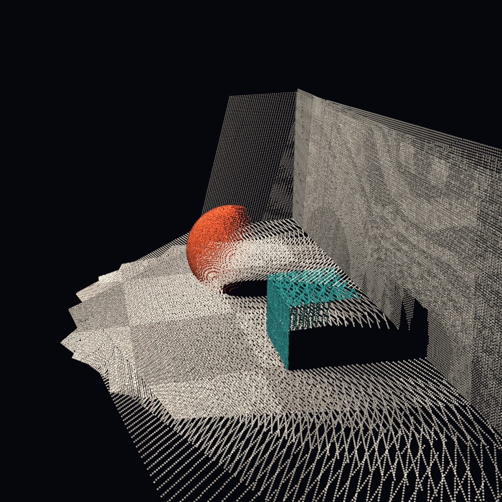

A camera flattens the world, while a depth camera keeps one more number per pixel, and that number is enough to un-flatten it. This chapter is about that number. The scan above was made by the chapter's own code, and every figure here runs on any Mac with no phone required. The phone is the upgrade, not the entry fee.

The road runs from what a depth frame is, through a flat picture standing up into a point cloud, to many pictures fusing into one scanned room. Then a tethered iPhone becomes a live 3D sensor for your sketches.

## What a depth camera sees

Every depth source hands you the same three things, whatever the hardware. First a color image, then a depth map holding one metric distance per pixel in meters. Last come the **intrinsics**, a handful of numbers describing the lens that took them.

<picture>
  <source media="(prefers-color-scheme: dark)" srcset="Images/27-DepthAndThePhone/Anatomy-dark.jpg">
  
</picture>

In Ollin that bundle is one value type, `RGBDFrame`, and there's nothing mysterious inside it. This is the entire construction:

```swift
RGBDFrame(color: color, depth: depths, confidence: nil,
          depthWidth: 240, depthHeight: 180, intrinsics: intrinsics)
```

Where did this chapter's frames come from, with no depth camera attached? We fake one. The committed figure [`Anatomy.swift`](Figures/27-DepthAndThePhone/Anatomy.swift) ends with `StageCamera`, under eighty lines of it. Those lines march rays through a tiny staged room, which is [Chapter 26](26-SculptingWithFields.md)'s sphere tracing run on the CPU. They fill exactly those arrays, colors from the scene and depths from how far each ray flew. It's a pretend camera, but the frame it produces is a real `RGBDFrame`. So everything else in this chapter treats it exactly as it would treat a LiDAR. That's the point of the type. Whatever fills the arrays, the rest of the pipeline doesn't care.

> **Swift note.** `depth` is a plain `[Float]`, row by row from the top left, `0` where the sensor had no answer. Real depth maps are full of those holes, especially along silhouettes, and the API that reads them is built to shrug holes off.

## Standing the picture up

One pixel plus one depth is a 3D point. The recipe is small enough to say in a sentence. Slide the pixel off the image center, scale by depth over focal length, and step out along the ray.

<picture>
  <source media="(prefers-color-scheme: dark)" srcset="Images/27-DepthAndThePhone/Unproject-dark.jpg">
  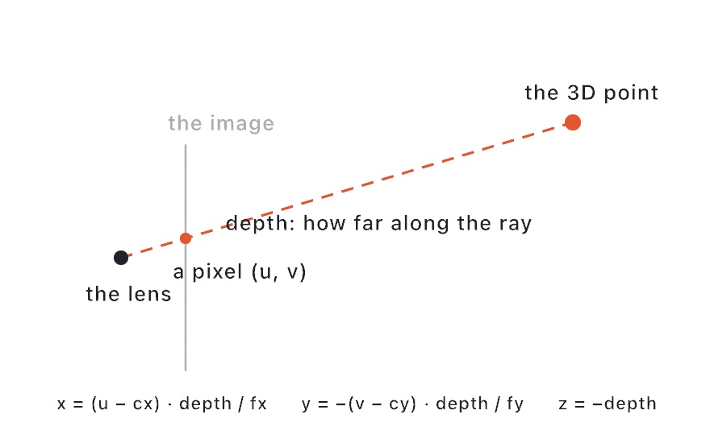
</picture>

That's called **unprojection**, and the intrinsics (`cx`, `cy` the image center, `fx`, `fy` the focal lengths) are exactly the numbers the recipe needs. You'll rarely do it per pixel yourself, because `RGBDFrame` does it wholesale. `pointCloud()` unprojects *every* valid depth pixel, colors each from the color image, and hands the result back as a `PointCloud`.

```swift
let frame = StageCamera.capture(eye: Vector3(0.2, 1.05, 1.7),
                                target: Vector3(0, 0.45, -1.1))
let cloud = frame.pointCloud(pointSize: 0.013)
// …each frame:
camera(.orbiting(target: Vector3(0, 0, -2.9), radius: 4.4,
                 azimuth: 0.85, elevation: 0.35, fieldOfView: .pi / 4))
drawPointCloud(cloud)
```

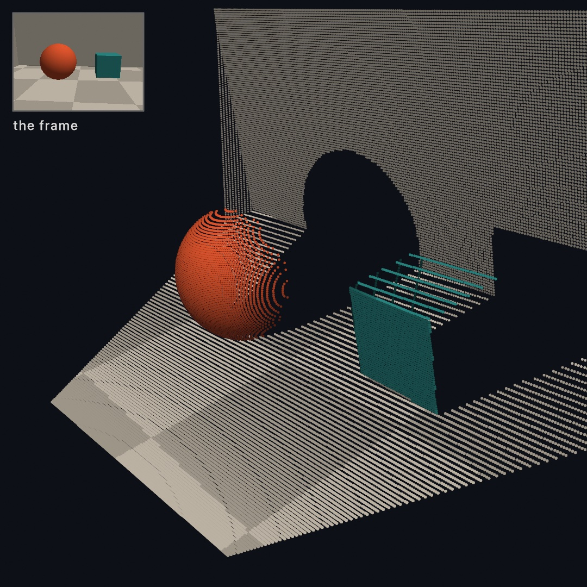

Look at what the new viewpoint reveals. The picture has become geometry you can orbit. Behind the ball and the crate hang black voids, the parts of the room the camera never saw. They are shadows cast not by light but by *not knowing*. Every real scan has these, and they're the honest signature of the medium. (For one point instead of all of them, `frame.unproject(normalized:)` lifts a single image position to its metric 3D spot. A median window keeps a stray hole from spoiling it. That's the tool that lifts a tracked 2D skeleton to true depth, and the [RGBD reference](../Docs/3D/RGBD.md) shows it paired with the body tracker.)

## Drawing inside the picture

A depth frame isn't only a source of geometry. It's also a *stage you can draw into*. `drawDepthScene(frame)` draws the color image as the backdrop, and writes the depth map into the depth buffer. A camera built from the frame's own lens, `camera(.intrinsic(...))`, puts your 3D drawing in the same metric space. So the scene occludes what you place behind it:

```swift
camera(.intrinsic(frame.intrinsics))
drawDepthScene(frame)

// A run of marbles marching into the room, in meters.
for i in 0 ..< 6 {
    withState {
        translate(-1.3 + Double(i) * 0.44, -0.32, -1.85 - Double(i) * 0.34)
        fill(Color(hue: 0.09 + Double(i) * 0.035, saturation: 0.75, brightness: 1))
        specular(0.5); shininess(60)
        drawSphere(radius: 0.12)
    }
}
```

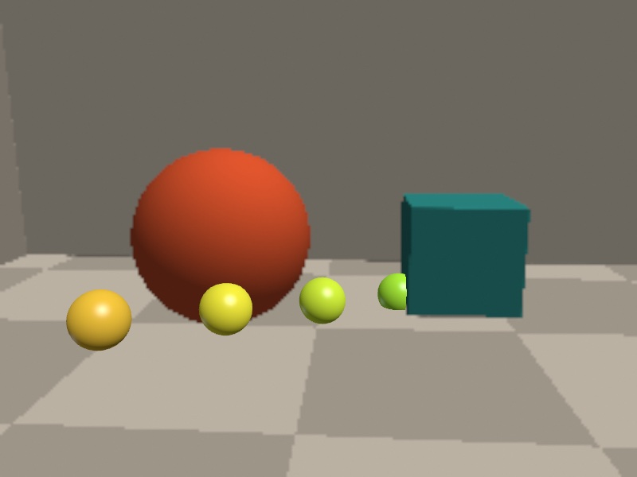

Count the marbles. Six were drawn, and the crate's depth swallows the last two and slices one mid-body. Nothing here is compositing trickery. The marbles are ordinary solids from [Chapter 21](21-3DGently.md), z-tested against depths that came from a camera. That camera is our pretend one here, and the real one with a phone.

## Flat drawing that knows where it is

Solids were the easy case, because they already live in space. The more useful trick is putting *2D* drawing into the same depth buffer. It's the one worth learning properly, because labels, tags, halos, and sprites are what you actually want to put into a scanned room.

By default, 2D drawing lays over a 3D frame completely. That's right for a caption and wrong for anything that belongs in the scene. Three calls change it:

```swift
withState {
    depth(at: anchor)                        // this mark now sits at a world point's depth
    if let screen = project(anchor) {        // and here is where that point lands on the canvas
        drawCircle(center: screen, radius: 96)
    }
}
```


Those rings are `drawCircle`. Not tubes, not meshes, but flat 2D circles that were handed a depth. They are now in the queue with everything else, hidden wherever a pillar stands nearer than they do.

The three calls divide the job cleanly, and keeping them separate in your head saves confusion later:

- **`depth(at: worldPoint)`** sets the *depth* of subsequent 2D drawing, and nothing else. The mark still lands wherever its canvas coordinates say. `noDepth()` puts it back on top.
- **`project(worldPoint)`** answers the other half: where does this world point land on the canvas? It returns `nil` when the point is behind the camera, which is a case worth handling rather than forcing.
- **`withBillboard(at: worldPoint) { }`** does both at once and moves the origin there, so inside the block you draw around `(0, 0)` and it lands on the point at the right depth. The numbered tags above are billboards, and it's the same call that labeled the shapes in [Chapter 21](21-3DGently.md)'s figures.

Notice what the rings do *not* do. They don't get smaller with distance. All three are 96 points across, because a 2D mark keeps its canvas size. Depth changes what hides it, not how big it is. That's usually exactly what you want from a label, readable at any distance and correctly occluded. It's also the thing to remember when a sprite refuses to shrink.

A depth *feed* is different from 3D geometry you drew. There's no world point to hand `depth(at:)`, so `depth(0.5)` takes a fraction of the map's own near-to-far range instead. Everything else behaves the same.

Like the camera itself, all of this is per-frame, so it goes in `draw()` after the camera, and without a camera it quietly does nothing. The [depth compositing reference](../Docs/3D/DepthCompositing.md) covers both scene kinds side by side.

## The real sensors

This is where real hardware comes in, and the reassuring part is that the code stays the same from here on. Only the source of the frames changes.

The gentlest entry is a **recorded clip**. The Record3D iPhone app records LiDAR (or TrueDepth) footage into `.r3d` files, and Ollin opens them directly, every frame an `RGBDFrame`:

```swift
import Ollin
import OllinRecord3D

final class Replay: Sketch {
    var scan: Record3DRecording?

    override func setup() {
        scan = try? Record3DRecording(path: "/path/to/scan.r3d")
    }

    override func draw() {
        background(Color(white: 0.04))
        guard let scan, scan.frameCount > 0 else { return }
        let i = Int(time * 30) % scan.frameCount
        guard let cloud = try? scan.pointCloud(at: i) else { return }
        camera(.orbiting(radius: 2.5, azimuth: time * 0.3, elevation: 0.2))
        drawPointCloud(cloud)
    }
}
```

A recorded clip is depth footage you can edit against, re-render, and export deterministically. It's the medium the "volumetric filmmaking" scene works in. The same app also streams **live over USB**. Plug the phone in and `Record3DDevice` delivers `latestFrame` continuously, so the person in front of the phone becomes a live point cloud in your sketch.

The deeper option is **Ollin Capture**, Ollin's own iPhone app. It runs ARKit on the phone and streams typed results the sketch reads like any other input. Those are a 3D **body skeleton**, up to three **faces**, each a deforming mesh plus 52 expression values, and up to four **hands**, each a 21-joint skeleton. There is also rear-LiDAR **world depth** with the camera's own position and orientation, a **person segmentation** matte (rear camera, or mirrored from the front like a selfie), and **device motion**:

```swift
import OllinPhone

let device = PhoneDevice()
device.start()                  // in setup()
// …in draw():
device.latestBody               // a skeleton in meters
device.latestFrame         // an RGBDFrame from the LiDAR
device.latestPose               // where the phone is, and which way it looks
```

Everything these produce lands in types you've already used this chapter, and that's the design. The phone is a sensor array, and the sketch never knows or cares which sensor filled the frame. The [Record3D](../Docs/3D/Record3D.md) and [Phone](../Docs/3D/Phone.md) references cover the setup (both need only a cable), and the `3D/Depth` and `3D/Phone` example groups are live starting points for each stream.

## One world from many frames

A single frame is a slice of the world, whatever the lens saw plus voids. The way past that is the heart of the chapter, and it needs one new ingredient. That is the **pose**, where the camera stood and which way it looked, written as a transform. Given a frame's cloud in camera space, and its pose, `transformed(by:)` places the points where they really are in the room. `WorldCloud` accumulates those placed points, thinning duplicates so overlapping frames don't pile up:

```swift
var world = WorldCloud(voxelSize: 0.02)

let frame = StageCamera.capture(eye: eye, target: room)
world.add(frame.pointCloud(pointSize: 0.016),
          transformedBy: StageCamera.pose(eye: eye, target: room))
// …repeat from other eyes, then:
drawPointCloud(world.cloud)
```


Each capture is tinted coral, green, or blue, so you can see who saw what. Three partial views, one room. The small spheres are the three camera positions, and the walls each frame couldn't see are filled in by the frames that could. On a real phone this is exactly the `PhoneWorldScan` example. ARKit supplies the pose in `device.latestPose`, you sweep the room, and the slices stack into a scan.

### When the camera loses its place

Sweep for a minute and the scan starts to fog. The camera's estimate of where it stands is a little wrong in every frame. Those errors never cancel. They pile up. A wall seen early and seen again late lands in two places.

`add(_:correcting:)` is the answer. It slides and turns each arriving frame onto the surfaces already fused, then merges it:

```swift
world.add(cloud, correcting: reportedPose)
```

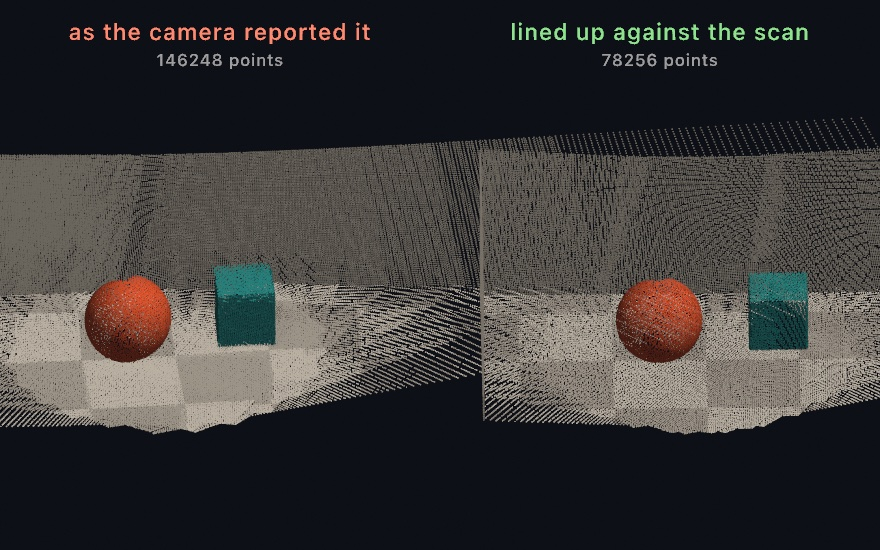

Both halves are the same nine captures, seen from the same angle. On the left the ball is drawn several times over. On the right it is drawn once. The corrected scan also holds half as many points. A smeared wall fills twice the space a wall does.

The correction that worked is kept. The next frame starts from it, so the fit only has to find the newest error. That is why it costs so little. Apply `world.correction` to anything else the camera reports in that space.

One thing it will not do. A frame that finds too little to match is held back rather than guessed at, and `fix.applied` says so.

### Coming back to where you started

There is a second thing it cannot do, and it takes a walk to see. Correcting a frame fixes the newest error. It never revises the poses already laid down. So each frame agrees with the frame before it, the chain of them comes out smooth, and the whole chain can still lean. Go all the way around a room and back to the door, and the far wall is a good way from where it really is.

**`ScanGraph`** is the answer to that one. It fuses and corrects exactly as `WorldCloud` does. It also keeps a **keyframe** every so often: a pose, and a thinned copy of what that frame saw. When a new keyframe lands where an old one stood, the two are matched against each other. That match ties a late pose to an early one, so the chain becomes a loop that does not quite close. The difference is then shared out over every pose in between:

```swift
var scan = ScanGraph(voxelSize: 0.025)

let update = scan.add(cloud, correcting: reportedPose)
if let loop = update.loop {
    print("been here before: the map moved \(loop.moved) m")
}
drawPointCloud(scan.cloud)
```

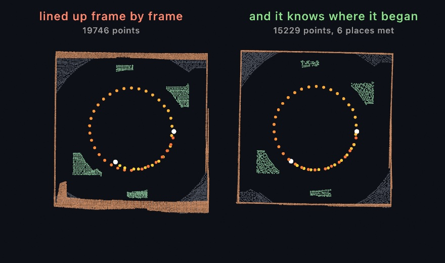

Both halves are the same walk, seen from straight above, because from overhead a wall is a line and a scan that leaned draws that line twice. The dots are where each half thinks the camera stood; the white ones are the first and the last. On the left the walk closes as a spiral and the walls double. On the right the walk closes as a ring, the walls are single, and the scan holds a quarter fewer points. A smeared wall fills more space than a wall.

What you get from this is a scan that agrees with itself. That is a different thing from a scan that is in exactly the right place, and worth being clear about. One match pulls the two ends of a walk together and shares the difference along everything between them. It earns most of what it earns at the point of return. In a small room, where nearly every frame can see something already fused, the frame-by-frame fit has taken most of the drift out before the walk ever gets back, and there is little left to find.

Two limits are worth knowing. A place is recognized by standing near it, so a scan that has drifted further than `searchRadius` before it comes back is out of its own reach, and the match is refused rather than guessed. And a camera facing one bare wall can slide along that wall and fit it exactly as well every time, so a match made there would record drift as though it had been measured. Neither the overlap nor the leftover error can see that; only the fit's own conditioning can, which is why a room with things standing about in it is easier to scan than an empty corridor.

Run it for yourself with `swift run --package-path Examples Example-3D-Depth-ClosedLoopScan`, which walks a made-up hall twice side by side with the true walls drawn over both.

## From the cloud to a surface

A fused cloud is still dust. It is beautiful, but nothing in it has a face, a shadow, or a material. **`reconstructSurface`** turns the sweep into a solid. It fits a small plane to every point's neighborhood. Then it uses the sweep's own camera positions to decide which side of each plane faces the room. Last it pulls one mesh out of the whole thing:

```swift
let mesh = reconstructSurface(of: world.cloud, spacing: world.voxelSize * 2,
                              orientedToward: eyes)
material(.dielectric(roughness: 0.55))
drawMesh(mesh)
```


The torn rim is the honest part. Where no camera reached, the surface simply stops, and nothing is guessed. That honesty is the one rule worth carrying to a real scan. **The mesh can only be as complete as the sweep.** A body you only arc in front of keeps an unobserved back, and the rebuilt surface frays just past where its data stops. So walk around the things you care about. When a sweep falls short anyway, `fitting: .robust` swaps the nearest-plane distance for a robust blend of all the nearby samples. That blend re-weights away whatever disagrees with the local consensus. It smooths noise, keeps creases, and trims away nearly all of the fraying that the plane fit sheds at open edges. Doorways and windows stay open either way, which is the truthful shape of a room.

The camera path does double duty here. Every fitted plane has two sides, and the reconstruction turns each toward the cameras that plausibly saw it. So pass the sweep's positions in `orientedToward:` whenever you have them. They are the same `eyes` the capture loop already collects. Without them, orientation propagates point to point across the cloud. That works on a smooth single surface, and struggles exactly where a camera would have known better.

Because the sketch handed over a `PointCloud` rather than bare positions, the colors ride along. Each mesh vertex takes its nearest sample's color, so the room comes back in the colors the camera saw. Per-vertex colors multiply the `fill`, which is the texture contract. That is why the default white fill shows them untouched, and `fill(Color(white: 0.5))` dims the whole scan without touching its hues. The same trick paints any mesh, via `colored(from:)` for a cloud or `colored(by:)` for a rule.

What comes back is an ordinary `Mesh`, so everything [Chapter 21](21-3DGently.md) taught applies. That means materials, lighting, cast shadows, even `subdivided(_:)` to soften the scan. Sometimes points are their own material rather than a scan. A splash, say, or a swarm dense enough to read as a body. The sibling `particleSurface` skins them as one blended form, with no cameras involved. The [reference page](../Docs/Generators/SurfaceReconstruction.md) covers both, and the `3D/Geometry/SurfaceFromPoints` example puts the two side by side on one cloud.

## The phone's other streams

World depth and its pose carried the scan, and they are one entry on Ollin Capture's menu. The rest of the phone's streams land the same way, as typed values in meters read in `draw()`. Take the tour in any order.

### A surface the phone already built

That whole last section rebuilt a surface on the Mac, out of points you swept and fused yourself. A LiDAR phone can hand you one directly. ARKit reconstructs the room as you walk, on the device, and Ollin Capture streams the result. Tap **Room** and what arrives already has faces and normals, and every triangle already knows what it is.

```swift
var room = Mesh(positions: [], indices: [])
var built: Int?

override func draw() {
    if device.sceneMeshVersion != built {      // only when a block changed
        built = device.sceneMeshVersion
        room = device.sceneMesh.mesh
    }
    drawMesh(room)
}
```

That gate is the one thing to get right. The room arrives in **blocks**. ARKit cuts the space into pieces and keeps improving each piece as you look at it again. So a piece turns up many times, and the newest reading replaces the last. `sceneMeshVersion` changes whenever that happens. A scanned room reaches hundreds of thousands of triangles, and `draw()` runs sixty times a second. Rebuilding the mesh every frame is the mistake to avoid here.

Then the labels. Every triangle carries a `PhoneSurface`, one of wall, floor, ceiling, table, seat, window, door, or unclassified. So the same room can be asked for three ways:

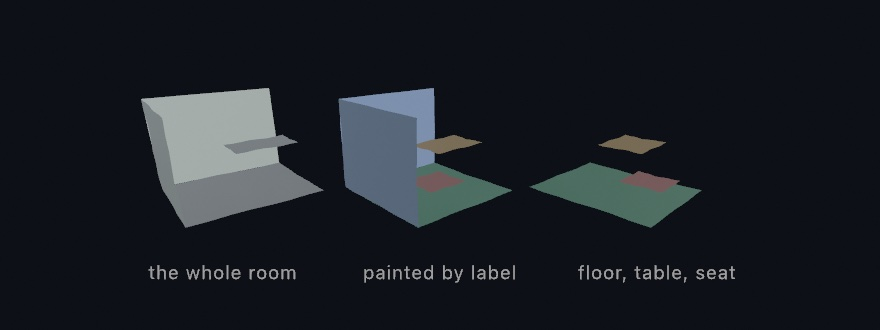

```swift
let scan = device.sceneMesh
scan.mesh                          // all of it, one mesh
scan.mesh { $0 == .floor ? .green : .white }    // a color per triangle
scan.mesh(of: .floor, .table)      // only the labels you ask for
```

The blocks in that picture are staged rather than scanned, so it renders without a phone, but the calls are the real ones. A real scan has the same shape and far more blocks.

Early in a scan almost everything reads `unclassified`, because ARKit only decides what a surface is once it has seen enough of it. That is the truth of a scan in progress rather than a fault. `foundSurfaces` tells you which labels have appeared so far, so a sketch that keys off labels can say so while the room fills in.

So which do you want, points or a surface? Both come off the same sensor. **Points are what the camera saw; the mesh is what the phone decided was there.** Take the points when you want to scatter, drift, or reconstruct them yourself. Take the mesh when you want something to light, to hide things behind, or to bounce something off. The `3D/Phone/PhoneRoomMesh` example is the room painted by label, with a key to keep only the flat things you could set something down on.

### Somewhere to stand, and the light in the room

The mesh is the whole shape of the room, clutter and all. Most of the time you want far less than that: one flat surface to put something on.

Room mode reports those too. ARKit finds a floor, a table top, or a wall as a single flat patch, and grows it as you look around. This half needs no LiDAR, so it works on any phone that runs the app.

```swift
if let ground = device.planes.floor {
    withState {
        translate(ground.center + ground.normal * 0.15)
        drawSphere(radius: 0.15)
    }
}
```

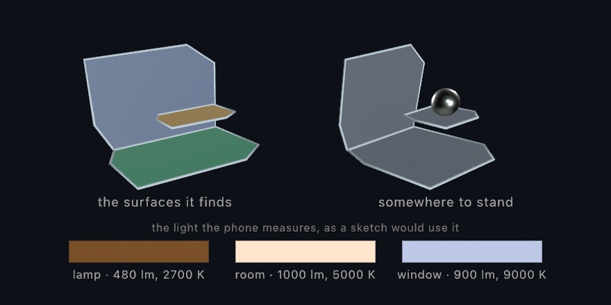

`floor` is the one to reach for, because it answers early. It gives you the labeled floor once ARKit has decided, and the lowest flat surface until then. `largest` picks by real area, measured on the outline rather than on the box around it, so a long thin shelf never wins.

Every surface carries that outline: a convex polygon around everything the phone has seen of it. `plane.mesh` fills it in, and `plane.outline` is the same loop closed, ready for `drawTube`.

Then the light. The phone measures how bright and how warm the room is, in every mode, a few times a second.

```swift
ambientLight(device.latestLight?.ambient ?? Color(white: 0.4))
```

`ambient` is the room's own white, turned down by how bright the room is. The three swatches under the picture are three readings: a lamp, a working room, a window. Switch a lamp on and the sketch warms with it.

One catch. Only Face mode knows *where* the light comes from, because ARKit works that out from the shading on a face. A world-facing camera has no face to read, so Room mode gives you brightness and color, and you aim your own key light.

### A pose you can dress in solids

`latestBody` is more than dots. Every joint arrives with an orientation beside its position, so a solid part can sit at a joint and turn with it. `modelTransform(_:)` composes the two into one pose, and `transform(_:)` puts that pose onto the transform stack in a single call. String `drawCapsule(from:to:radius:)` between the joints and the skeleton grows bones you can light:

```swift
for (a, b) in body.bones() {
    drawCapsule(from: a, to: b, radius: 0.03)
}
if let pose = body.modelTransform(.head) {
    withState { transform(pose); drawSphere(radius: 0.11) }
}
```

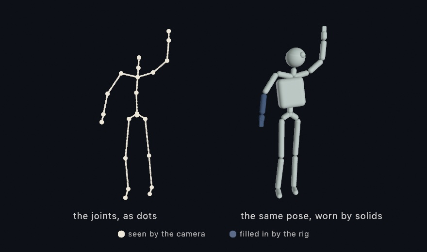

The blue forearm is the stream being honest. The camera never saw those joints, the rig filled them in, and `isJointTracked(_:)` says so, part by part. Two more readings ride along. `scaleFactor` sizes the figure to the person in front of the camera. And `worldTransform` stands the whole skeleton where the person really is, in the same ARKit world as the swept cloud and the room mesh, so walking across the room walks the figure across the sketch. The `3D/Phone/PhoneBodyFigure` example is this section live: a mannequin that follows you around the room.

### A hand you can reach in with

The body stream draws a whole person. The hand stream leans in close. In **Hands** mode the phone finds up to four hands, each as 21 joints: the wrist, then four joints along every finger. On a LiDAR phone every joint also carries a real position in meters. It stands in the same world as the swept cloud and the room mesh. A hand is the part of you that points, pinches, and conducts, so this is the stream gestures come from:

```swift
for hand in device.latestHands {
    for (a, b) in hand.bones() {
        drawCapsule(from: a, to: b, radius: 0.006)
    }
    if let pinch = hand.pinchDistance, pinch < 0.02 {
        // thumb and index are touching: a click, made of air
    }
}
```

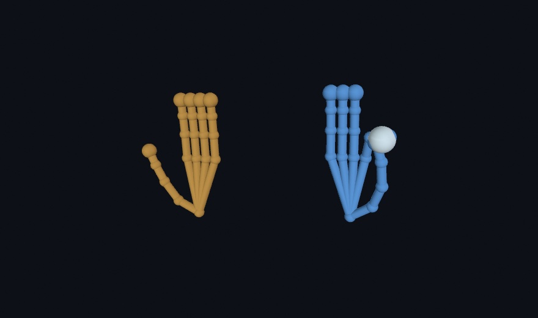

The orange hand is a right hand and the blue one a left, straight from `chirality`. The white bead sits where the blue hand pinches. `pinchDistance` measures thumb tip to index tip in meters. Under about two centimeters, the fingers are touching. That one number is a whole instrument. A pinch can pluck a note, a spread can stretch a shape, a fingertip can draw a ribbon through the room. A joint the model could not see simply stays absent. On a phone with no LiDAR, the same hands arrive flat, ready to map over the canvas with `point(_:in:)`. The `3D/Phone/PhoneHands` example is this section live: hold up a hand and it stands in the room as a small solid skeleton.

### Where a look lands

The face stream carries more than expression. Each face arrives with its two eyes and one extra point: `lookAtPoint`, where those eyes converge. The head says where you face. The eyes say where you look. Those are different things, and the difference is the interesting part. Every reader has a world twin, so three calls draw the whole idea:

```swift
if let face = device.latestFace {
    let target = face.worldLookAtPoint
    for eye in PhoneEye.allCases {
        drawCapsule(from: face.worldEyePosition(eye), to: target, radius: 0.002)
    }
}
```

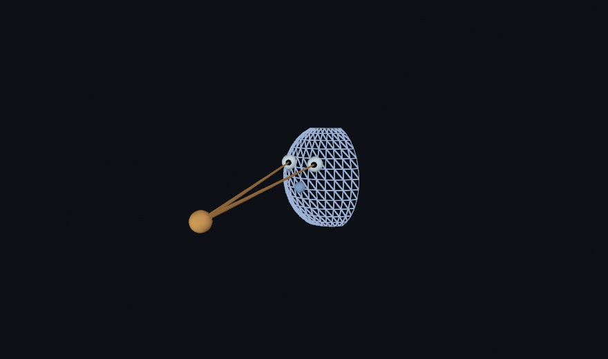

The shell is the face mesh drawn under `headTransform`. It stands where the head is and turns the way the head turns. The head points one way. The eyes look another, and both beams land on the same warm bead. That point is a cursor you steer without hands. Park a creature there, or steer a brush with a glance. The blink blendshapes pair naturally with the eyes: `.eyeBlinkLeft` is the left lid closing over `worldEyePosition(.left)`. The mesh also carries its texture coordinates, the same mapping on every face. A painted mask keeps its place while the face deforms. The `3D/Phone/PhoneGaze` example is this section live: look past the phone and the bead lands where you look.

### The words on the wall

The phone can also read. In **Text** mode it runs the on-device recognizer over the rear camera. It streams every line it can make out: a sign, a book spine, a note on a door. Each line arrives as a `PhoneText` with its string and the reader's confidence. On a LiDAR phone its four corners carry real positions in meters, and `worldTransform` folds them into one matrix. Stand a drawing on that matrix and it hangs where the sign hangs:

```swift
for line in device.latestTexts {
    guard let placement = line.worldTransform else { continue }
    withState {
        transform(placement)   // x along the words, y up the line, z off the surface
        drawCapsule(from: Vector3(-line.worldWidth / 2, -line.worldHeight / 2, 0),
                    to: Vector3(line.worldWidth / 2, -line.worldHeight / 2, 0),
                    radius: 0.004)   // an underline, drawn on the world
    }
}
```

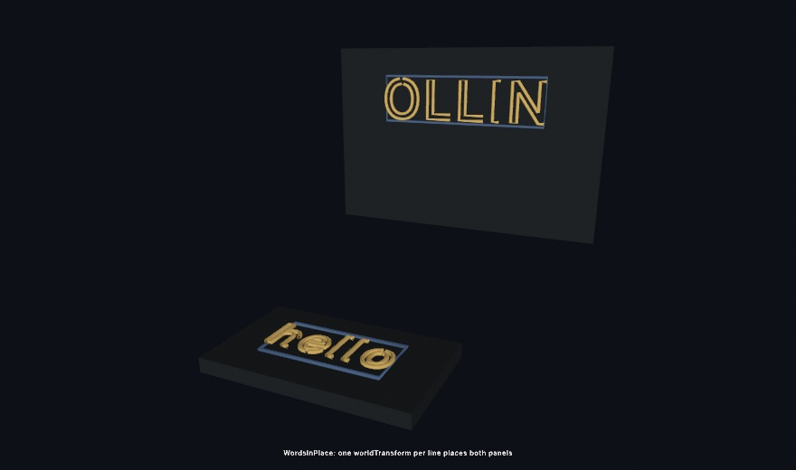

The upright word stands on a wall and the flat one lies on a table, and neither needed different code. Each panel is the line's own quad, and the type inside it is `textToShapes` run through `drawTube`, scaled by `worldWidth`. The frame does the placing. A line lifts all four corners or none, so `worldTransform` is either a real place or `nil`. The flat fallback draws the same lines over the canvas with `corners(in:)`. Underline a read word, replace it, translate it, or move it off its wall. The `3D/Phone/PhoneWorldText` example is this section live: aim the phone at anything readable and the words stand in the room.

### A picture it knows

Reading is one way to recognize something. Knowing it by sight is the other. Give the capture app a picture and it will find that picture in the room. Drop the file into the app's own folder over the cable, in Finder, under Files, then Ollin Capture. Say how wide you printed it in the file's name, `poster@30cm.png`. ARKit places a print by its real width, and no image file carries one. Tap **Markers** and the phone starts looking.

Each find arrives as a `PhoneMarker`, and `placement` is the whole of it. The frame stands at the middle of the print: x runs across the width, y up the height, z straight off the paper toward you. So the drawing code never mentions walls or tables:

```swift
for marker in device.latestMarkers where marker.isTracked {
    withState {
        transform(marker.placement)                 // the print is now the x-y plane
        drawBox(width: marker.width, height: marker.height, depth: 0.002)
        translate(0, 0, 0.08)
        drawBox(size: 0.06)                         // a cube floating off the paper
    }
}
```

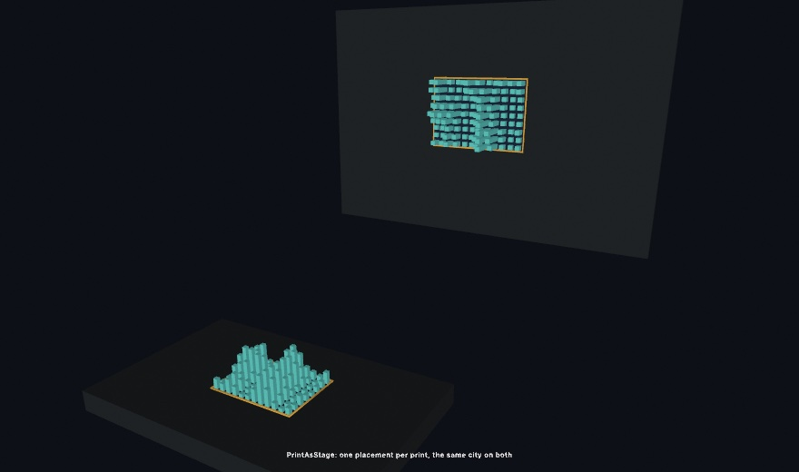

The card lies flat and the poster hangs upright, and one loop drew both cities. `width` and `height` are meters, so a piece written for a business card fits a poster by itself. Two things are worth knowing before you print. A picture is found by its detail, so a photograph or a dense drawing works where a flat logo does not. The app checks each reference as it loads, and says on its own screen when one is too plain. And a scanned object, an `.arobject` file in the same folder, is *found* once rather than followed. It marks a place, where a picture marks a moving thing. The `3D/Phone/PhoneMarkers` example is this section live.

### Pointing at it with the phone

Everything so far has the phone looking at the room and telling you what it saw. Turn that around. The phone knows where it is in the room. So it also knows where it is *pointing*, and that makes it a wand: something you aim at your own sketch. Tap **Wand**. It needs no LiDAR, since plain world tracking is enough to know your own place.

```swift
guard let wand = device.latestWand, wand.isTracked else { return }
```

A `PhoneWand` is a place, a direction, and a button. `wand.position` is where the phone is, in the same meters as everything else in this chapter. `wand.ray` is the line out of the back of it, the end you point at things:

```swift
for (i, ball) in balls.enumerated() {
    if let distance = wand.ray.hit(sphereAt: ball, radius: 0.13) {
        aimed = (i, distance)                    // how far along the beam it sits
    }
}
```

That `hit` is a [`Ray3`](../Docs/Drawing/Geometry.md#ray3), the small value type that answers what a line runs into. It knows about a ball, a box standing square to the world, and a flat surface. It counts only what is **in front of** the origin. That is what separates pointing from drawing a line and hoping.

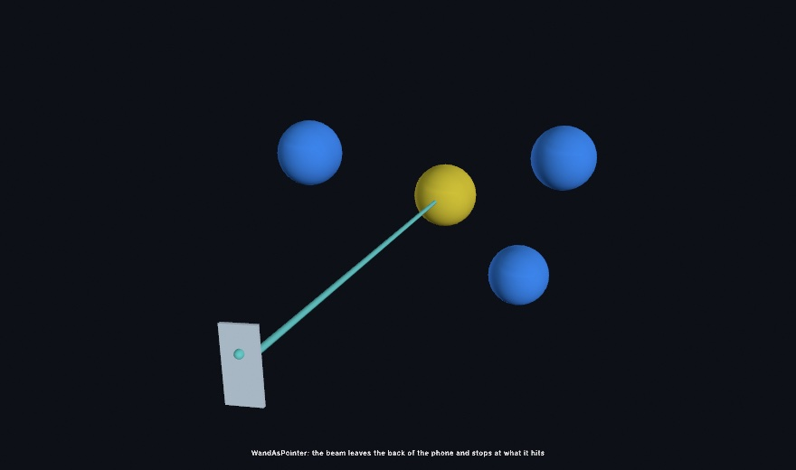

The beam stops where it lands, because the hit told it how far to go: `wand.point(at: distance)`. Draw the phone itself through `wand.placement` and it leans in your hand the way the real one does.

The button is the screen, and it arrives twice. `wand.isPressed` is whether a finger is down now, which is what a drag reads. `wand.pressCount` only ever rises, so a tap that landed and left between two `draw()` calls is still there to find:

```swift
if wand.pressCount > lastPressCount, held == nil { held = aimed?.index }
lastPressCount = wand.pressCount
```

Keeping last frame's number and comparing is the habit worth taking from this. Any counter that only rises tells you *something happened* without asking you to be watching at the moment it did.

`wand.touch` is where the thumb sits while it is down, `-1` to `1` across and up. The pad is a few centimeters and the room is not. So read it as a speed rather than a place: `distance += touch.y * 0.8 * deltaTime` pushes a held thing away and pulls it back. The `3D/Phone/PhonePointer` example is this section live, with a ball you can pick up, carry, push out, and drop.

One thing to set up before you build on it. The room's origin is wherever the phone stood when Wand mode began. Lay your scene out in front of that spot, or expect to walk to it.

## Putting it together: the ghost room

The finished piece turns the sweep itself into the artwork. Nine frames of the staged room join the world one per second, drawn as additive light while the camera orbits. It reads as a room scanning itself into existence. Make `MySketches/GhostRoom.swift` (bring `StageCamera` along from [`Anatomy.swift`](Figures/27-DepthAndThePhone/Anatomy.swift), plus the `pose` helper from [`GhostRoom.swift`](Figures/27-DepthAndThePhone/GhostRoom.swift), the committed figure with the complete listing):

```swift
import Ollin
import simd

final class GhostRoom: Sketch {
    let room = Vector3(-0.1, 0.4, -1.2)
    var world = WorldCloud(voxelSize: 0.012)
    var fused = 0

    override func draw() {
        background(Color(hex: 0x05070C))

        // One more frame of the sweep joins the world every 60 frames.
        let due = min(9, frameCount / 60 + 1)
        while fused < due {
            let a = -1.15 + Double(fused) * 0.29
            let eye = Vector3(room.x + sin(a) * 3.0, 1.1 + Double(fused % 3) * 0.25,
                              room.z + cos(a) * 3.0)
            let frame = StageCamera.capture(eye: eye, target: room)
            world.add(frame.pointCloud(pointSize: 0.011),
                      transformedBy: StageCamera.pose(eye: eye, target: room))
            fused += 1
        }

        cameraShowcase(target: room + Vector3(0, 0.2, 0), radius: 5.8,
                       elevation: 0.4, fieldOfView: .pi / 4)
        blendMode(.add)
        drawPointCloud(world.cloud)
        blendMode(.normal)
    }
}
```


The woven texture is the scan lines of nine viewpoints interleaving. The solid patches are where many frames agree, and the voids are what no camera reached. Watch it run live and the room knits itself together, then the orbit lets you wander what was scanned.

Then make it yours:

- Point it at reality. With a LiDAR iPhone, swap `StageCamera` for `device.latestFrame` and `device.latestPose` and sweep your actual room (the `3D/Phone/PhoneWorldScan` example is this piece with the pretend camera removed).
- Restage the set. `StageCamera.scene` is a distance field, so everything [Chapter 26](26-SculptingWithFields.md) taught works in it, and you can melt a blob into the room and scan that.
- Color by height instead of by image, rebuilding the cloud with each point tinted by its `y`, and the scan becomes a contour map.
- Slow the reveal to one frame every five seconds and export a video, because the assembly is the piece.
- Rebuild it solid. Hand the finished world cloud to `reconstructSurface(of:spacing:orientedToward:)` with the nine eyes, and the ghost becomes a room you can light, shadow, and walk a camera through.

## Where this comes from

Depth capture entered art practice when the Microsoft Kinect shipped in 2010 and was promptly opened up by hackers. The point-cloud look it popularized was seeded two years earlier by Radiohead's *House of Cards* video. James Frost directed it with the data artist Aaron Koblin, and it was shot entirely with lidar and structured light. Tools like the RGBDToolkit, by James George and Jonathan Minard, and the volumetric-film work that followed turned depth footage into an editable medium. That is the spirit of the `.r3d` clip workflow here, and Record3D is Marek Šimoník's iPhone app. The unprojection math is the pinhole camera model, the foundation stone of photogrammetry and computer vision. Fusing posed depth frames into one model descends from SLAM research and KinectFusion, by Newcombe and colleagues in 2011. `WorldCloud`'s voxel accumulation is the gentlest possible relative of it. Full credits are in the project's [attribution notes](../ATTRIBUTION.md).

## Go deeper

- [RGBD frames](../Docs/3D/RGBD.md): the frame type, unprojection, depth-lifted pose (a 2D-tracked skeleton placed at its true depth).
- [3D](../Docs/3D/3D.md#point-clouds): `PointCloud` itself, its point sizing and colors, and how it sits beside the rest of the 3D path.
- [Record3D](../Docs/3D/Record3D.md): recorded `.r3d` clips and the live USB stream, frame by frame.
- [The iPhone capture app](../Docs/3D/Phone.md): body, faces, world depth with pose, the room mesh, the flat surfaces, the room's light, segmentation, motion, and world fusion.
- [Depth compositing](../Docs/3D/DepthCompositing.md): `depth(at:)`, billboards, `drawDepthScene`, and the metric camera.
- [Surface reconstruction](../Docs/Generators/SurfaceReconstruction.md): rebuilding a scanned cloud as a mesh, skinning particle sets, and the holes and orientation details.
- Appendix B draws this chapter's math, one picture per idea: [Where things are](B-JustEnoughMath.md#where-things-are), [Into three dimensions](B-JustEnoughMath.md#into-three-dimensions).
- Worked examples: [`Examples/3D/Depth/DepthCloud`](../Examples/3D/Depth/DepthCloud/Sketch.swift) (a webcam depth model, no phone needed), [`Examples/3D/Depth/DriftCorrectedScan`](../Examples/3D/Depth/DriftCorrectedScan/Sketch.swift) and [`Examples/3D/Depth/ClosedLoopScan`](../Examples/3D/Depth/ClosedLoopScan/Sketch.swift) (both staged, no phone needed), [`Examples/3D/Depth/Record3DCloud`](../Examples/3D/Depth/Record3DCloud/Sketch.swift), [`Examples/3D/Depth/Record3DLiveCloud`](../Examples/3D/Depth/Record3DLiveCloud/Sketch.swift), [`Examples/3D/Depth/DepthLiftedPose`](../Examples/3D/Depth/DepthLiftedPose/Sketch.swift), [`Examples/3D/Phone/PhoneDepthCloud`](../Examples/3D/Phone/PhoneDepthCloud/Sketch.swift), [`Examples/3D/Phone/PhoneWorldScan`](../Examples/3D/Phone/PhoneWorldScan/Sketch.swift), [`Examples/3D/Phone/PhoneRoomMesh`](../Examples/3D/Phone/PhoneRoomMesh/Sketch.swift), [`Examples/3D/Phone/PhoneRoomPlanes`](../Examples/3D/Phone/PhoneRoomPlanes/Sketch.swift), [`Examples/3D/Geometry/SurfaceFromPoints`](../Examples/3D/Geometry/SurfaceFromPoints/Sketch.swift), and [`Examples/3D/Depth/DepthOcclusion`](../Examples/3D/Depth/DepthOcclusion/Sketch.swift).

---

[Contents](README.md#contents) · Previous: [Chapter 26, Sculpting with fields](26-SculptingWithFields.md) · Next: [Chapter 28, Sound and control](28-SoundAndControl.md)
