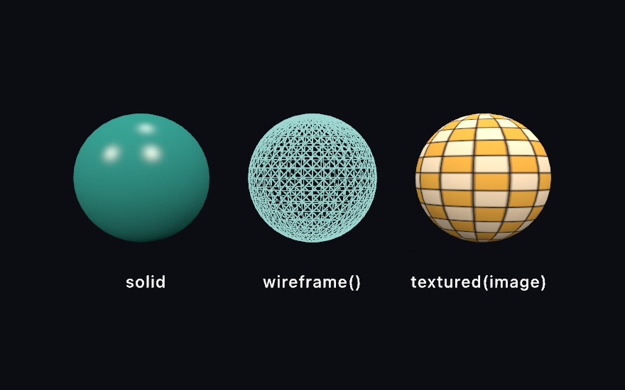
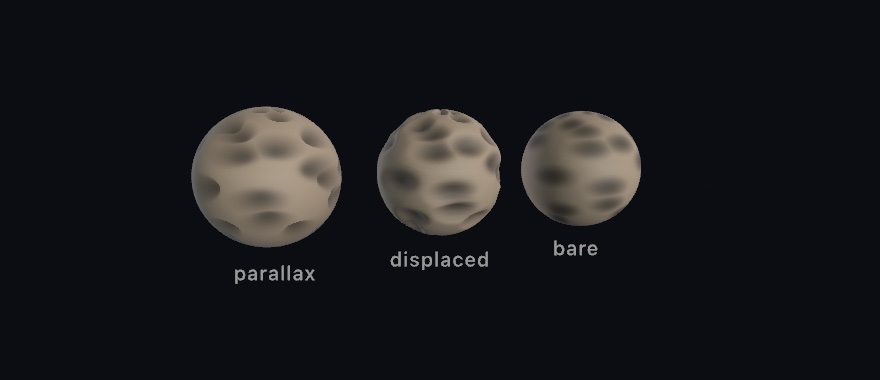
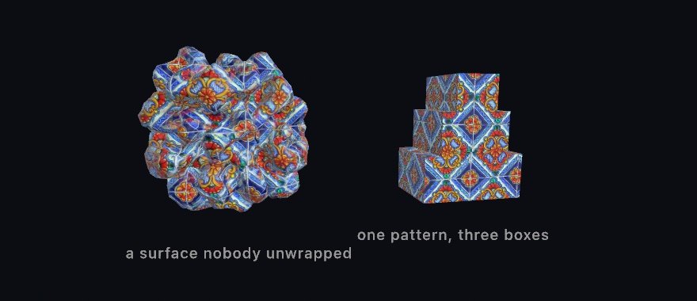
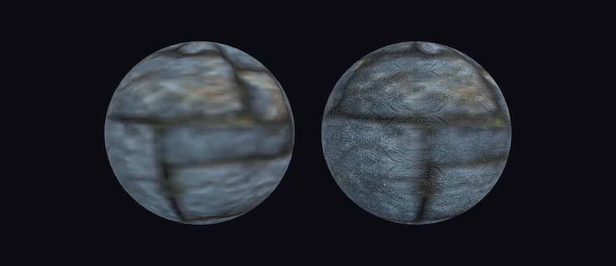
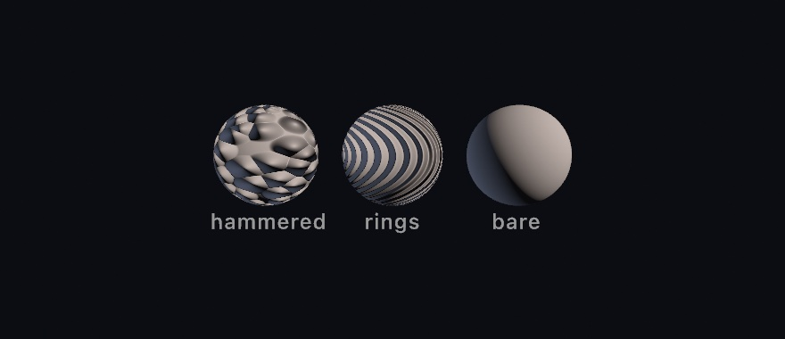
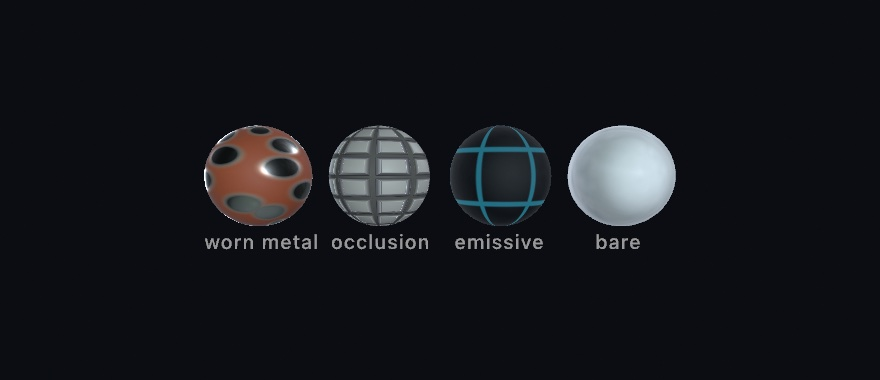
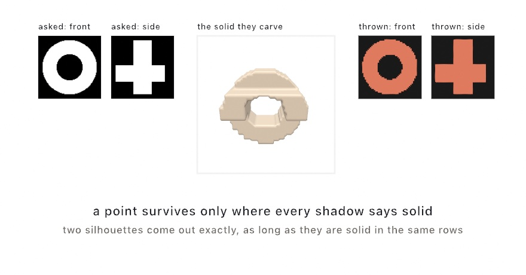
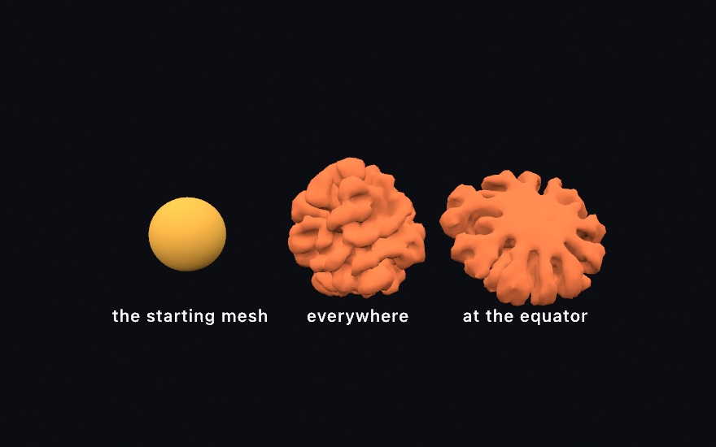

#### <sup>[Ollin](../README.md) → [Guide](README.md) → Chapter 27</sup>

---

# 27. Meshes and maps


A mesh can come from a file and take a picture for its color, or start as a rough cage you round. More pictures give it depth and grain, and with them a plain solid can pass for stone, sand, or worn paint. The raked garden at the top rounds stones from boxes, presses grooves in from a picture, and drifts red leaves over sand and stone. After it come maps that tilt the light and set the material, whole scenes from a file, and more ways to make a mesh.

## A mesh from a file

A generator, one of the `Mesh` builders from [Chapter 26](26-3DGently.md#a-catalog-of-solids)'s catalog, hands you a shape the framework knows how to build. A file hands you a shape somebody drew. Any model you make in a 3D tool can join a sketch. `loadMesh` reads the common formats (`.usdz`, `.obj`, `.gltf`/`.glb`, `.stl`, `.ply`) into a `Mesh`, materials and textures included:

```swift
final class Loaded: Sketch {
    var model: Mesh?

    override func setup() {
        model = (try? loadMesh("/Users/you/Downloads/rubber-duck.usdz"))?.normalized(scale: 3)
    }

    override func draw() {
        background(Color(hex: 0x10141B))
        cameraShowcase(radius: 6)
        if let model {
            fill(.white)
            withState { rotateY(time * 0.3); drawMesh(model) }
        }
    }
}
```

One habit matters here: **`normalized(scale:)`**. A file arrives at whatever size and position its author saved, anywhere from millimeters to kilometers. Normalizing recenters it and scales its longest side to the world units you ask for. Keep the `fill` white so the model's own colors show, because a colored fill tints it. Models you build yourself are yours to ship. Downloaded ones carry licenses to check before you bundle them.

> **Swift note.** Loading can fail, and `loadMesh` throws when it does. As in [Chapter 2](02-Color.md), `try?` turns the throw into `nil`. So `(try? loadMesh(...))?.normalized(scale: 3)` stops at the `?.` when the file isn't there, and `model` stays `nil`. The `if let model` in `draw()` then skips drawing, so a missing file never crashes the sketch. Write `try!` instead to stop the sketch with the file's name and what was wrong with it.

## A picture wrapped around it: textured

The duck arrived with its own colors. Any mesh, from a file or a generator, can also be dressed with a picture of yours. [Chapter 26](26-3DGently.md#what-a-solid-is-made-of-triangles-and-normals) showed a mesh as a lit solid and as its wireframe net. The third way is to wrap it in an image:



```swift
withState { fill(teal); material(.glossy); drawMesh(globe) }     // solid
withState { stroke(pale); wireframe(); drawMesh(globe) }         // edges only
withState { fill(.white); drawMesh(globe.textured(checker)) }    // wrapped in an image
```

**`textured(_:)`** returns a copy of a mesh wrapped in an `Image`. **Texture coordinates**, called uvs, decide where each part of the picture lands. Each vertex carries a `u` across the picture and a `v` down it, from 0 to 1. The sphere and the plane are the generators that carry them, which is why the checker above reads cleanly. The rest arrive without any, and the triplanar step below is what you reach for there. The squares stay square around the middle and narrow to slivers at the poles. That's what wrapping a flat rectangle onto a ball does, and a textured sphere always shows it. A textured mesh still lights normally, so it takes materials and shadows like any other surface. Keep the `fill` white unless you want the image tinted, the same rule as a loaded model. All three treatments are ordinary drawing state, saved by `withState`, so one frame holds all of them.

One question comes with every texture: what happens where the picture runs out. A globe never asks it, since its coordinates run 0 to 1 and stop there. A floor asks it at once. Give a floor coordinates that run to 8, and it is asking for eight copies of the picture across its width.

```swift
var floor = Mesh.plane(width: 800, depth: 800)
floor.uvs = floor.uvs.map { $0 * 8 }                  // eight tiles across
drawMesh(floor.textured(planks, wrap: .tile))         // .clamp is the default
```

`.tile` starts the picture again, and `.mirror` starts it flipped so copies always meet on the same pixels. `.clamp`, the default, holds that last row of pixels forever. Inside 0 to 1 all three draw the same thing, so the choice only ever shows where you left the square. A model you load brings its file's own answer with it, which is why a floor somebody authored to tile arrives tiling.

Distance asks the second question. Send that floor off to the horizon and one screen pixel covers many of the picture's own pixels. Reading only one of them makes the far floor shimmer with noise. So Ollin keeps every picture you load at half size, and half of that, down to a single pixel. It reads whichever copy matches what the screen pixel covers. Nothing needs switching on.

A floor is also seen edge-on, so the patch of picture under one screen pixel is a long thin sliver. It spans many of the picture's pixels one way and hardly any the other. Ollin reads along the sliver, so the far floor keeps its detail along the view and does not go soft. A picture whose pixels you wrote yourself keeps only its full size, because it is uploaded again on every frame it changes. That one still shimmers in the distance.

## Smooth from a cage: subdivision surfaces

A file gives you a shape somebody finished, and a picture dresses it. You can also rough out a shape yourself and let the computer round it, which is the way character artists work. Build something crude out of a few boxes and extrusions. Then `subdivided(levels:)` takes it as a **control cage**, splits every face, and eases every vertex toward its neighbors, once per level.

```swift
let cage = Mesh.extrude(Profile.star(), depth: 0.75)
let smooth = cage.subdivided(levels: 2)
```


`Profile.star()` is the star outline [Chapter 6](06-GridsAndRepetition.md#drawing-inside-a-shape-withclip) handed to `Shape`, here with its default proportions, and `Mesh.extrude` pushes it into depth. You model the cage, and the smoothness is computed. One level already rounds the slab-sided star. By two the form has melted well inside its cage at the points. The smooth surface eases *toward the averages* of the cage. Points pull in and notches fill out, and the pointy features round off the fastest. If a shape comes out softer than you wanted, the fix is a chunkier cage rather than fewer levels.

Any mesh works as a cage with no preparation: the primitives, an extrusion, a lathe, or a loaded model. `subdivided` welds their shared corners and recovers their intended faces before refining, so a box rounds as one closed surface rather than six drifting plates. Open sheets keep their rims, and a subdivided `plane` smooths along its edge instead of shrinking away from it. Triangle-native meshes have their own refinement rules a scheme argument away, `subdivided(.loop, levels: 2)`. An icosphere is one, and so is a blob [Chapter 32](32-SculptingWithFields.md#the-other-way-out-field-to-mesh) turns from a field into a mesh. The [reference page](../Docs/Generators/SubdivisionSurfaces.md) covers when to pick which.

This is `setup()`-shaped work. Each level roughly quadruples the face count, so refine once, keep the mesh, and let `draw()` draw it. Two or three levels is almost always enough.

## Depth from a picture: height maps

The cage gave you a smooth form, and the pictures so far only colored a surface. A **height map** gives a surface depth. The red channel is height, white is the surface, and darker is carved in below it. One image, and Ollin reads it two ways.



```swift
let moon = base.textured(dust).parallaxMapped(craterHeights, scale: 0.06)
let rock = base.displaced(by: craterHeights, scale: 0.13).textured(dust)
```

**`parallaxMapped(_:scale:)`** is the shading read. At every pixel the renderer marches your line of sight down into the height field and finds where it lands. Then it reads the base texture, and every other map on the mesh, *there* instead of at the flat surface. Crevices sink, slide against their rims as the view moves, and hide their far walls, as carving does. And still not one vertex has moved. `scale` is the depth of the relief as a fraction of the picture's tile. It needs the mesh's texture coordinates. At each point it also has to know which way the picture's u and v run across the surface. That frame is the *tangent basis*, and `parallaxMapped` builds it for you.

**`displaced(by:scale:)`** is the geometry read. Every vertex moves along its normal by the height at its spot on the picture, and the normals are recomputed. The relief becomes true of the mesh, with `scale` now in the mesh's own units. It is work done once, so do it in `setup()` and keep the result. The detail you get is the *mesh's* to give, since a plane with more `segments` carves finer.

The outlines in the figure carry the lesson. The parallax sphere's silhouette is a perfect circle however deep the craters read. The shading is fiction, and the outline, the cast shadow, and a mirror all keep telling the geometric truth. The displaced sphere's rim is cratered, in shadow and reflection too. Inside the outline the two are nearly twins, so parallax gives you the depth without the triangles. When the edge matters, displace. When it doesn't, march.

White stays put in both readings. A height map's white regions *are* the authored surface. So the two spheres agree about where the relief lives, and you can hand one map to both calls. The `3D/Materials/Parallax` example is the worked version with the parallax depth on a parameter. A USD file carries the map in, and `saveScene`, which writes meshes out to a glTF or USD file, writes it back out. glTF has no place to put one.

## A picture from three sides: triplanar

The cage step left a small problem. A texture maps through uvs, and a subdivided cage comes back without them. So do the blobs [Chapter 32](32-SculptingWithFields.md) turns from a field into a mesh. `textured(_:)` has nothing to hold onto.

`triplanarTextured` sidesteps the question instead of answering it. Rather than asking the mesh where the picture goes, it projects the picture through the world three times, once along each axis. Picture three slide projectors aimed down x, y, and z. Every point on the surface blends the three by how squarely it faces each projector. A wall takes nearly everything from the projector facing it. A 45-degree slope takes half and half, and the handoff is gradual enough that you cannot find the line.

Here it is on `grown`, a folded ball with no uvs, made by the [surface growth](#a-surface-that-outgrows-itself-differential-growth) later in this chapter:

```swift
drawMesh(grown.triplanarTextured(tiles, normal: relief, scale: 2.2))
```



`scale` is the size of one tile in world units. The `normal:` argument takes a **normal map**, a picture that stores which way the surface faces at each point. It tilts the light to show relief without moving the surface, and it uses the same projection. [Its own entry](#relief-from-a-picture-normal-maps) after the finished sketch says more. The figure's map is a photograph of glazed talavera, one of the pictures Ollin bundles. Its normal map is the slope of that photograph's own brightness, which is why the painted design reads as molded rather than printed on. The folded ball has no uvs and no tangent basis, and nobody cut its surface flat to lay a picture on it. The projection works on any mesh you can make or load.

The projection asks one thing of you in return: **the picture has to tile.** It repeats across the whole surface whatever any wrap setting says. If the left edge and the right edge of your map disagree, every wrap draws a straight line. A picture cut to whole repeats of its pattern joins up. A map authored with `fbm(u * 8, v * 8)` does not join. The field at u=0 and the field at u=1 are unrelated. Use `tilingFbm` instead, which closes on itself in both directions:

```swift
// u and v run 0...1 across the map you are filling
let shade = Color(white: tilingFbm(u, v, detail: 5, octaves: 5))
```

`detail` is the frequency you would otherwise have multiplied in, so moving a map across is a straight swap. A mismatched *normal* map is the one that shows most. The two sides of the join light differently, so the line reads as a crease in the stone rather than as a change of pattern. The bench in [Chapter 28](28-MaterialsAndSurroundings.md#putting-it-together-the-bench) gets its stone this way.

The picture stands still and the surface moves through it, which helps in one case and hurts in another. The cairn is three separate boxes drawn one after another. The pattern runs unbroken across all three, because they stand in the same projected picture. That is why the technique is the usual choice for terrain and rockwork. But a mesh you animate through the transform stack slides through the pattern rather than carrying it along. So a body that travels should have uvs. A form that grows or changes shape in place shows the pattern flowing across it, as the blob in the `3D/Materials/Triplanar` example does.

The projection carries the base texture and a normal map. Every other map still reads uvs, the height map among them. The [reference page](../Docs/3D/3D.md#triplanar) has the edges of the envelope. The example puts the tile size and the relief on parameters.

## Texture that survives a close look: detail maps

Triplanar repeats one picture at one size. Every texture has a budget, too, and it is counted in texels, the pixels of a picture laid on a surface. A picture sized to cover a whole boulder spends all its texels on the big shapes. The moment the camera leans in, the surface runs out of information and dissolves into soft nothing. Real rock does not do that. Get closer and there is always another scale of grain waiting.

`detailMapped` adds that second scale. It tiles a much finer texture pair across the base one, a color map and a normal map. They repeat several times per base tile, so the close look finds grain the base never carried.

```swift
drawMesh(boulder
    .textured(rock)
    .normalMapped(rockBumps)
    .detailMapped(grain, normal: grainBumps, scale: 12))
```



The left sphere has only a base map at the resolution one map covering a whole form would have, so it is soft. The right one adds a detail pair, a patch of the same stone seen close. It is mirrored into a tile so it repeats without drawing a grid. Two conventions make the pair behave. The detail color map multiplies the base with middle gray as its neutral, value 128 in the image. Darker speckles darken, lighter ones lighten, and a flat gray image changes nothing. Author it as texture swinging around gray and the overall tone of your surface holds. The boulder also carries a base normal map, hung on with `normalMapped`, which [its entry](#relief-from-a-picture-normal-maps) after the finished sketch covers. The detail normal map is *reoriented onto* that base relief rather than replacing it. The fine bumps sit on the large forms the base map already shaped, the way real grain follows the rock it is part of.

`scale` is how many times the pair repeats across the base, and `amount` fades it out, with zero the off switch. A pair tiled dozens of times over is the first thing that would break up in the distance. A loaded picture reads its smaller copies there, but a pair you wrote from bytes has none to fall back on. Keep the scale in the range your framing shows, which is what the `3D/Materials/Detail` example is for. It puts the same base maps on two spheres and the detail pair on one of them. The tile count and amount sit on parameters while the camera sways close.

## A picture stamped onto the scene: decals

Everything so far dressed one mesh. A sticker does not care about meshes. Put it on a crate and it wraps whatever it lands on, the crate, the pallet under it, half of the wall behind.

A `Decal` works like that. Wrap an image once, then place it each frame as a small projection box. Every surface inside the box receives the picture, composited over the surface's own color before lighting. So it shades like paint rather than like a glowing overlay.

```swift
var sticker: Decal!

override func setup() {
    sticker = Decal(try! loadImage("label.png"))
}

override func draw() {
    // camera, lights, floor, crates ...
    drawDecal(sticker, at: dropPoint, width: 140)   // projects straight down by default
}
```


The box has a direction, a width and height, and a depth. The placement is per-frame state like a light. Move `at:` and the stamp slides across the scene. It crosses from the floor up onto a crate and over its far edge, conforming to whatever it touches. Transparency in the image is honored, and later decals composite over earlier ones. A surface standing edge-on to the projection fades the stamp out instead of smearing it down the side. Without that fade, every wall would show the smear.

A decal is paint, so it takes the finish of the surface it lands on. Stamp a rough floor and the mark is matte. Stamp polished metal and it sits under the shine. The [reference page](../Docs/3D/3D.md#decals) has the envelope: eight per frame, which surfaces receive them, and what mirrors show. The `3D/Materials/Decals` example slides a roundel across floor and crates on a loop, with the size, a roll, and a see-through ring on parameters.

## Putting it together: the raked garden

The garden's sand is a plane [textured](#a-picture-wrapped-around-it-textured) with a picture, carved by a [height map](#depth-from-a-picture-height-maps) read as geometry, and given grain by a [detail map](#texture-that-survives-a-close-look-detail-maps). Its stones are boxes rounded by [subdivision](#smooth-from-a-cage-subdivision-surfaces), their granite put on by a [triplanar](#a-picture-from-three-sides-triplanar) projection, and its leaves are one [decal](#a-picture-stamped-onto-the-scene-decals) placed three times. Every picture is written in code, so the sketch needs no files. Make `MySketches/RakedGarden.swift`:

```swift
import Ollin

final class RakedGarden: Sketch {
    // Each stone: where it sits, the box its cage starts as, and how far it is turned.
    let stones: [(x: Double, z: Double, size: Vector3, turn: Double)] = [
        (-1.7, 0.3, Vector3(1.9, 0.62, 1.3), 0.3),
        (-0.2, -1.4, Vector3(0.8, 1.5, 0.75), -0.2),
        (2.4, 1.2, Vector3(1.0, 0.5, 0.75), 0.9),
    ]
    var sand = Mesh(positions: [], indices: [])
    var pebbles: [Mesh] = []
    var leaf: Decal?

    /// A square picture from a function of its own coordinates, u across and v down.
    func picture(size: Int, _ shade: (Double, Double) -> Color) -> Image {
        let image = Image(width: size, height: size)
        for y in 0 ..< size {
            for x in 0 ..< size {
                image[x, y] = shade((Double(x) + 0.5) / Double(size), (Double(y) + 0.5) / Double(size))
            }
        }
        return image
    }

    /// The rake's height at a point of the bed: rings around the stones, lines elsewhere.
    func rake(_ u: Double, _ v: Double) -> Double {
        let p = Vector2((u - 0.5) * 10, (v - 0.5) * 9)       // the point's x and z on the bed
        var gap = 99.0                                       // how far to the nearest stone
        for s in stones {
            gap = min(gap, p.distance(to: Vector2(s.x, s.z)) - (s.size.x + s.size.z) * 0.25 - 0.1)
        }
        let across = gap < 0.9 ? max(gap, 0) : p.y
        return 0.5 + 0.5 * cos(across * .tau / 0.2)          // one groove every 0.2 units
    }

    override func setup() {
        noiseSeed(27)

        // The sand: a picture wrapped on, the rake carved in, and grain for a close look.
        let heights = picture(size: 800) { u, v in Color(white: rake(u, v)) }
        let tone = picture(size: 200) { u, v in Color(white: 0.7 + 0.2 * fbm(u * 9, v * 8)) }
        let grain = picture(size: 64) { u, v in                  // gray is the neutral
            Color(white: 0.3 + 0.4 * tilingFbm(u, v, detail: 16, octaves: 2))
        }
        sand = Mesh.plane(width: 10, depth: 9, segments: 400)
            .displaced(by: heights, scale: 0.04)
            .textured(tone)
            .detailMapped(grain, scale: 18)

        // Boxes rounded into stones. They come back with no uvs, so the granite is projected.
        let granite = picture(size: 256) { u, v in
            let n = smoothstep(0.3, 0.7, tilingFbm(u, v, detail: 5, octaves: 5))
            return Color.mix(Color(hex: 0x3D3F42), Color(hex: 0x9C988F), n)
        }
        pebbles = stones.map { s in
            Mesh.box(width: s.size.x, height: s.size.y, depth: s.size.z)
                .subdivided(levels: 3)
                .triplanarTextured(granite, scale: 1.4)
        }

        // A leaf: five pointed lobes, and clear everywhere outside them.
        leaf = Decal(picture(size: 128) { u, v in
            let x = u - 0.5, y = v - 0.5
            let r = (x * x + y * y).squareRoot()
            let lobe = abs(sin(atan2(x, -y) * 2.5))           // 0 along a lobe, 1 between two
            let inside = 1 - smoothstep(-0.01, 0.01, r - 0.45 + 0.27 * lobe)
            return Color.mix(Color(hex: 0xEC7C2F), Color(hex: 0xA3201A), r / 0.45).withAlpha(inside)
        })
    }

    override func draw() {
        background(Color(hex: 0x1B2024))
        cameraShowcase(target: Vector3(0, 0.2, 0), radius: 9, elevation: 0.8, fieldOfView: .pi / 4.2)
        ambientLight(Color(hex: 0x30363F))
        directionalLight(Color(hex: 0xFFD4A0), direction: Vector3(0.55, -0.5, 0.65), intensity: 1.15)
        headlight(Color(hex: 0x9DB2D6), intensity: 0.25)     // lifts the sides turned from the sun
        castShadows()

        material(.matte)
        fill(Color(hex: 0x323E27))                           // moss around the bed
        withState { translate(0, -0.05, 0); drawPlane(width: 40, depth: 40) }
        fill(.white)
        drawMesh(sand)

        for (s, pebble) in zip(stones, pebbles) {
            withState { translate(s.x, s.size.y * 0.3, s.z); rotateY(s.turn); drawMesh(pebble) }
        }

        // Three leaves drift across on the breeze, over sand and stone alike.
        if let leaf {
            for (i, lane) in [0.35, 2.4, -2.2].enumerated() {
                let along = (time * 0.03 + 0.37 + Double(i) * 0.17).truncatingRemainder(dividingBy: 1)
                drawDecal(leaf, at: Vector3(-6 + 12 * along, 0.5, lane), width: 0.42, depth: 3,
                          roll: time * 0.2 + Double(i) * 2)
            }
        }
    }
}
```

> **Swift note.** `stones` holds tuples, several values carried together as one, and their parts have names. So a stone reads as `s.x` and `s.size` rather than `s.0` and `s.2`. The type after `stones:` names the parts, so each entry lists its values in order without them. `picture`'s last argument is a function named `shade`, of type `(Double, Double) -> Color`, which turns two numbers into a color. Each call hands it a closure after the parentheses, and `picture` calls that closure once for every pixel. `.squareRoot()` is the square root of the number before it. `Mesh(positions: [], indices: [])` is an empty mesh that holds the property's place until `setup()` fills it.

Here is what each part does:

- **The rake.** `rake` is the function the height map is drawn from. It turns the picture's `u` and `v` into a point `p` on the bed, which is 10 units wide and 9 deep. A `Vector2` calls its second part `y`, so `p.y` is the bed's z. `gap` is roughly how far `p` is from the edge of the nearest stone. Within 0.9 of a stone the grooves follow `gap`, so they run in rings. Everywhere else they follow `p.y` and run straight across. The cosine turns either distance into a wave between 0 and 1, one groove every 0.2 units. Where two stones' rings meet, the nearer stone wins.
- **The sand.** White is the surface and dark is carved in, so `displaced(by: heights, scale: 0.04)` presses each furrow 0.04 deep. Displacement can only move the vertices a mesh has, so the plane gets 400 segments a side, eight or nine to a groove. `tone` is the sand's color, soft `fbm` between two light grays. `grain` swings around middle gray, since a detail color map multiplies and middle gray changes nothing. It comes from `tilingFbm` because it repeats 18 times across the bed. `fill(.white)` before the sand keeps its pictures untinted.
- **The stones.** Three levels of subdivision round each box and leave it with no uvs, which is why the granite is projected. A projected picture has to tile, so the granite is built on `tilingFbm`. `smoothstep` pushes that noise toward its two grays, and the stone comes out mottled in soft patches. Rounding also pulls each stone in from its box, so a lift of half the box's height would leave it floating. `s.size.y * 0.3` sets it a little way into the sand instead. `material(.matte)` sets the matte [finish](26-3DGently.md#materials) once, and it covers the moss, the sand, and the stones.
- **The leaf.** `r` is the distance from the middle of the leaf's picture. `lobe` is 0 at five angles around the middle and 1 halfway between them. So the leaf's edge reaches almost to the picture's border at five points and pulls in between them. Everything outside it is clear. A picture that lives only on the graphics card cannot become a decal, so `Decal(_:)` can fail, and `if let leaf` unwraps it.
- **The drift.** Each frame places the one decal three times, once in each lane. `along` runs from 0 to 1 and starts over, carrying a leaf 12 units across, from beyond one edge of the bed to beyond the other. `roll` turns it as it goes. The box is 3 units deep, so it reaches from higher than the tallest stone down past the sand. A decal does not know what hides what. So a leaf crossing a stone's rounded rim can show twice for a moment, on the stone and on the sand under the rim.

Then make it yours:

- Stand a model of your own in the garden. Load it in `setup()` as the listing in [A mesh from a file](#a-mesh-from-a-file) did, with `normalized(scale: 1)`, and when it loads, assign it to `pebbles[2]`. It takes the small stone's place and keeps its rings, since the rake reads `stones` rather than the meshes. Its lift still comes from that stone's `size.y`, so raise that number until the model stands on the sand.
- Rake wider rings. Change `gap < 0.9` to `gap < 1.6`, and each stone gathers about eight rings before the straight grooves take over.
- Let more leaves fall. Add a z position to `[0.35, 2.4, -2.2]` for each new lane. A frame holds eight decals, so eight lanes is the most that will show.

The garden moves on its own, because the camera circles and the leaves drift, so keep it as a video. `swift run OllinLive MySketches/RakedGarden.swift --export-video raked-garden.mp4 --seconds 24` records one full turn of the camera. `--export raked-garden.png` keeps the opening frame as a still.

## Pictures that change the surface: normal and surface maps

The garden pressed its rake in with a height map read as geometry, and every other picture in it set a color. The parallax sphere and the triplanar step's normal map already changed a surface without moving a vertex. Here the normal map gets its own entry, and the surface maps say what the surface is made of, point by point.

### Relief from a picture: normal maps

A texture changes a surface's color, and a normal map changes how it catches light. Each texel stores a surface direction instead of a color. At shading time the lighting normal from [Chapter 26](26-3DGently.md#what-a-solid-is-made-of-triangles-and-normals) bends by it. The result is relief without geometry.



```swift
let hammered = Mesh.sphere(radius: 1).normalMapped(dents)
```

All three spheres are the same 96-segment sphere. Only the pictures on the first two know about the dents and the rings. The silhouettes stay perfect circles. That's the tell, and the trade. The bumps exist only in how the light lands, so they cost a texture sample instead of a million triangles. The edge of the object never learns about them. Games have used this for twenty years, which is why a cobblestone street in one can be six polygons.

**`normalMapped(_:scale:)`** hangs a map on any mesh that carries texture coordinates. It sets up the frame the map's directions are measured in, the *tangent basis* that [parallax](#depth-from-a-picture-height-maps) builds too. It's the same standard one other tools bake maps against, so a map made elsewhere lights the same way here. `scale` is a relief dial, where 0 flattens it off, 1 is as authored, and more exaggerates. Loaded models bring their own normal maps along without being asked.

Where do maps come from? Anywhere images do, and one place is math. Start with a height function, take its slopes, and encode them. The `3D/Materials/NormalMaps` example builds hammered metal, woven cloth, and engraved rings this way in a couple dozen lines, no files involved. One convention matters when authoring by hand. Green marks the slope that faces *up the image*. If a map from elsewhere lights upside down, its green channel is inverted, and flipping that channel fixes it.

### What the surface is, per texel: surface maps

A normal map changes how light lands. The rest of the standard map set changes what the surface *is* from texel to texel. `surfaceMapped(...)` hangs any of them on a mesh:



```swift
let panel = Mesh.sphere(radius: 1)
    .textured(paint)
    .surfaceMapped(metallicRoughness: wear,   // roughness in g, metallic in b
                   occlusion: cavity,         // its red channel
                   emissive: seams)           // an ordinary color image
```

A **metallic-roughness map** packs two dials into one image. Roughness is how scattered a surface's reflection is, and metallic is whether it reflects like a metal. Roughness goes on green and metallic on blue, the packing every glTF exporter uses. Per pixel it multiplies the finish you draw under. `.physicallyBased` is the measured tier that [Chapter 28](28-MaterialsAndSurroundings.md#finishes-you-measure-environments-and-physically-based-materials) sets out. Both dials at 1 make it a blank the map can write on. So `material(.physicallyBased(metallic: 1, roughness: 1))` shows the map as authored. That multiply is what the first sphere does. One map says where the paint has rubbed through to bare polished metal, and the base texture colors the same patches silver.

An **occlusion map** is baked shadow for the crevices geometry doesn't have. It dims only the indirect light, the ambient and the environment. An environment is a photograph of a whole place used as light, and [Chapter 28](28-MaterialsAndSurroundings.md#surroundings-as-the-light-environments) begins with it. A lamp shining straight into a groove still lights it, which is how real crevices behave and why the convention exists. The second sphere pairs it with a normal map made from the same height field, the usual recipe. The relief catches the light, and the occlusion keeps its grooves dark.

An **emissive map** makes texels give off light of their own, tinted and dimmed by an `emissiveColor` factor. It works with no lights at all, which is how the third sphere, a nearly black shell, shows engraved seams that glow. Emission is the surface's own radiance, so fog veils it with distance like everything else. A glowing surface doesn't light its neighbors unless [Chapter 33](33-TracedLight.md#light-that-bounces-global-illumination)'s global illumination is on, or the frame is path-traced for export.

`emissiveColor` is one color for the whole mesh. A mesh can also carry a color at each vertex, and under `emissiveColor` those either wash toward white or take one tint. To make a surface glow in its **own** colors, the fill, the vertex colors, and the texture all included, give it an intensity instead:

```swift
drawMesh(ribbon.glowing(1.5))     // each vertex glows in its own hue
```

`Mesh.glowing(_:)` sets `emissiveIntensity` on a copy. At 1 it adds the surface's own color once as light, and more is brighter. A `bloom` filter turns the glow into a halo.

Loaded glTF and USD models carry all of these in and out without being asked. `saveScene` keeps them on the round trip too. Like the normal maps above, every map in the figure is authored from a function in `setup()`. The `3D/Materials/SurfaceMaps` example is the worked version with a glow parameter.

## A whole scene from a file: its camera, its lights, and its motion

The duck at the start of this chapter came from a file as one mesh, and the sketch placed it itself. A file can hold more than one object. It can hold a whole set composed in the design tool, with a camera framing it and lights already placed. It can also remember how the set moves. This family is for loading that whole scene, and for taking it back into code once it settles.

### A scene with its camera and lights: loadScene

`loadMesh` flattens a file into one mesh you place yourself. `loadScene` keeps the file's structure instead of merging it. A **scene** is a tree of named nodes, each carrying a mesh, a light, the camera, or nothing but its children. It is for the case where the file *is* the placement. You composed a stage in a design tool. You want to draw it as it was saved while the sketch moves a part of it. Scene files are the interchange formats the 3D tools write, glTF and USD, and `loadScene` reads both.

<picture>
  <source media="(prefers-color-scheme: dark)" srcset="Images/27-Meshes/SceneTree-dark.jpg">
  
</picture>

```swift
stage = try! loadScene("Stage.gltf")            // in setup()

camera(stage.camera ?? .orbiting(radius: 6))   // the file's own framing
for l in stage.lights { light(l) }             // and its lighting
stage["sculpture"]?.rotate(deltaTime, axis: .unitY)
drawScene(stage)                               // every node, in its authored place
```

Everything unpacks into things you already know. The file's camera is a `Camera3D`, the kind of value `camera(_:)` takes, and its lights are `Light`s, which `light(_:)` adds to the frame one at a time. A node's `rotate(_:axis:)` turns it by an angle about an axis, here `.unitY`, the world's up axis. Each node's geometry is a `Mesh`. `drawScene` draws the whole layout where the tool put it. `stage["sculpture"]` reaches one node by name, so a single part moves while the rest holds still. Bring the set over from the design tool, and keep the choreography in the sketch. The tree on the left of the figure is the file as it was saved. Every node has its name, nested the way the tool nested it. `loadMesh` would have folded all of it into one shape. `drawScene` draws it as the middle panel, through the file's own camera and under its own lights. The right panel moves one node by name, `stage["lamp"]`. The lamp's light moves with it, because a light belongs to the node that carries it. Move a group and everything under it, meshes and lights alike, comes along. The `3D/Geometry/LoadedScene` example is a small stage to poke at, and [Scenes](../Docs/3D/Scenes.md) has the details.

> **Swift note.** [Chapter 8](08-Words.md)'s `??` hands back the value on its left when it is there. When the left is `nil`, it hands back the value on its right. So the sketch uses the file's camera, and falls back to an orbit without one. The subscript `stage["sculpture"]` also answers an optional, since a file may not hold a node of that name. The `?.` after it skips the rotate when it does not.

### Motion the file remembers: animations, skins, and morph targets

A file can carry motion as well as a layout. An **animation** is a set of keyframe tracks the tool recorded, and `stage.animations` holds them. It is for playing what the animator made, on the sketch's own clock, so the scene poses itself at whatever moment you ask for. The tracks come from the same glTF and USD files as the layout does.

```swift
if let spin = stage.animation("spin") {
    stage.apply(spin, at: time.truncatingRemainder(dividingBy: spin.duration))
}
```

The file remembers its motion, and the sketch decides when time passes. `apply` takes any time you hand it. Wrapping `time` loops the animation, `time * 0.5` plays it at half speed, and a parameter's value scrubs it. The `3D/Geometry/AnimatedScene` example plays a small orrery's authored spin this way, one seamless 8-second lap.

Tracks like the orrery's move whole nodes, rigid pieces on a hierarchy. A file can also carry motion that bends the geometry itself. A *skin* ties each vertex to a few joint nodes with blend weights. A blade of kelp or an arm then flexes smoothly as its joints turn. *Morph targets* store alternate shapes for a mesh, and the node's `weights` mix them, the way faces animate between expressions. Both play through the same `apply`, and `drawScene` poses them without any extra calls. The `3D/Geometry/SkinnedScene` example is a small tidepool doing both at once, kelp swaying on skins while an anemone pulses on two morph targets. And since `weights` is a node property, `tank["anemone"]?.weights = [1, 0]` poses a blend shape from any signal you like.

### A scene you can take apart: the scene written as source

Loading a scene keeps the file in charge, which is what you want while the model is still moving. **Writing the scene as source** turns the file into a sketch whose `draw()` places every node itself. It is for a layout that has settled, which you now want to change as code rather than in the design tool. It is one of the project generators of the `ollin` command [Chapter 1](01-HelloOllin.md#a-shorter-way-to-run-things) set up. `ollin new Yard --from-scene yard.usdz` writes the project. Its `draw()` has the camera, the lights, and a `withState` block for every node, while the meshes are still read from the file. [Bringing a scene over](../Docs/Tools/SceneImport.md) shows the result beside the scene it draws, and says what carries over and what stays behind.

## More ways to make a mesh: cuts, joins, shadow art, growth, and the Hopf fibration

The garden rounded its stones from boxes, and the chapter opened on a mesh loaded from a file. There are more ways to get a mesh. One can be cut with a second solid or joined out of parts. One can be carved from the shadows you want it to throw, or grown from a rule until it folds. And one comes from a formula for a shape that does not fit in the room.

### Cutting one solid with another: mesh booleans

A **boolean** combines two solids the way a filled `Shape` combines two outlines on the plane in [Chapter 15](15-ShapesAsMaterial.md#shape-arithmetic-the-booleans), with the same combinations. It is for the shape that is hard to describe and easy to catch between two shapes that are not. A block with every edge rounded, a plate with a round hole, and a shell with a window cut out are all cuts. The operations are the constructive solid geometry of CAD tools. Ollin computes them by the method Bruce Naylor, John Amanatides, and William Thibault published in 1990. It holds each solid as a tree of its own face planes and sorts the other solid's surface into inside and outside.

```swift
let cube = Mesh.box(size: 1.3)
let ball = Mesh.sphere(radius: 0.88)

cube.union(ball)          // everything either one covers
cube.intersection(ball)   // only what both cover
cube.subtracting(ball)    // the cube, with the ball taken out of it
```

A fourth, `symmetricDifference`, keeps what only one of them covers.


The third one is a cube and a ball. It is also a block with every edge and every corner rounded at once, which by hand means modeling twelve fillets.

What comes back is an ordinary mesh. It draws the same and takes a material and a shadow the same. It can be broken apart, handed to the physics solver, or written out for a printer. That makes this different from the `subtract` and `carve()` [Chapter 32](32-SculptingWithFields.md) works fields with. Those melt distance fields on the GPU while the frame is drawn, and leave no geometry behind. Reach for them when you want a blobby form that moves. Reach for these when you want the shape itself.

Before you cut, check these.

**Both sides have to close.** A boolean asks what is inside each solid, so a surface with a hole in it has no answer to give. What comes back is meaningless rather than merely ugly. Most built-in generators close, but a plane, a Möbius strip, and a cylinder without caps do not. If you are unsure, `printCheck()` will tell you, the same examination [Chapter 42](42-MakingItPhysical.md#something-you-can-hold-a-3d-print) runs before it writes a mesh for a printer.

**A cutter has to be the right way out.** Mirroring a mesh turns it inside out. So does swapping two of its coordinates, or scaling an axis by a negative number. An inside-out cutter takes away everything it should have left. Turn it instead. `mapPositions` hands you every vertex position and keeps what the closure returns, so swapping two coordinates with one sign flipped is a quarter turn:

```swift
let shaft = Mesh.cylinder(radius: 0.2, height: 2)
block.subtracting(shaft.mapPositions { Vector3($0.y, -$0.x, $0.z) })   // a quarter turn
```

**Cut once.** This is work your processor does, not your graphics card. Solids of a few thousand triangles take a few tenths of a second, and denser ones take longer. So cut in `setup()`, or when a parameter moves, and keep the mesh for `draw()` to draw. That is the same advice as the cage, for the same reason.

### One mesh from several: joined and placed

Not every assembly needs a cut. **Joining** lays several meshes end to end as one mesh, each moved into place first, with no boolean and no change to any surface. It is for parts that only have to draw and cast a shadow together, as one draw call. A body and its wheels, or a table and its legs, are the usual cases. It is the plain merge every modeling tool has. `placed(_:)` bakes a placement into a copy of a part. The placement is a `MeshInstance`, a position, a rotation as three angles about x, y, and z, and a scale, each with a default. `Mesh.joined(_:)` then lays the parts end to end:

```swift
let body = Mesh.box(width: 1, height: 0.5, depth: 2)
let wheel = Mesh.cylinder(radius: 0.25, height: 0.2)
let spots = [Vector3(0.6, -0.3, 0.7), Vector3(-0.6, -0.3, 0.7), Vector3(0.6, -0.3, -0.7), Vector3(-0.6, -0.3, -0.7)]
let car = Mesh.joined([body] + spots.map { wheel.placed(MeshInstance(position: $0, rotation: Vector3(0, 0, .pi / 2))) })
drawMesh(car)
```

The joined mesh renders the same as the parts drawn one by one, and it costs only the copy. Where two parts overlap, both surfaces stay inside, which is fine on screen and not for a printer. A printer wants `union`, which merges the overlap into one closed skin. The [reference](../Docs/3D/3D.md#join) says what comes along, and why a joined mesh has one material.

### One solid, two shadows: shadow art

A cut keeps the part of one solid that lies inside or outside another. **Shadow art** carves a solid from pictures instead. You ask for the shadows you want it to throw, one per direction, and Ollin works out the largest solid that throws them. It is for the sculpture that reads as one thing from the front and another from the side. It suits any form that only has to be right in silhouette. Sculptures built to throw chosen shadows came first. The carving is the visual hull Aldo Laurentini named in 1994. Niloy Mitra and Mark Pauly set out shadow art as a computation in 2009. Ollin keeps the plain carve and skips their later adjustment step.

<picture>
  <source media="(prefers-color-scheme: dark)" srcset="Images/27-Meshes/TwoShadowsOneSolid-dark.jpg">
  
</picture>

```swift
let art = shadowArt(fromFront: ring, fromSide: cross, resolution: 56)
drawMesh(art.mesh)
```

A lit point casts its shadow along the light's direction. So a point can only be part of the solid if it lands inside the shadow in *every* direction it is lit from. Keep those points and no others, and what is left is the largest solid that could cast them. That is why a shape that looks like neither shadow throws both. The points are tested on a grid of small cubes, `resolution` across. The survivors are turned into a mesh the way [Chapter 32](32-SculptingWithFields.md#the-other-way-out-field-to-mesh) turns a field into one.

The shadows it really throws are never larger than the ones you asked for, and they can be smaller. The catch is that two views share an axis. The front view and the side view share the vertical axis, so their rows line up. A row that is empty in one shadow empties it in the other. Two silhouettes come out exact when they are solid in the same rows, which is why the classic circle-and-square works. Three agree far less often, and sculptures that throw three shadows are designed around that. `art.shadow(from: .front)` hands back what is really thrown. Where it differs from what you asked for, it is the one that is true.

Showing the solid beside flat panels has one trap. Lights are per-frame state rather than a property of each shape. `noLights()` turns every light off for the rest of the frame. Calling it after drawing the mesh, to keep the panels flat, unlights the mesh you already drew. Draw the flat panels inside `withoutLights { }` instead, which leaves the frame's lights on everything else.

### A surface that outgrows itself: differential growth

Subdividing takes a shape you designed and smooths it. **Differential growth** does the opposite. It hands you a shape nobody designed, out of a rule you can say in one sentence. Push a mesh's vertices apart, and split any triangle that stretches so the triangles stay a fixed size. It is for the folded, brain-like and leaf-like forms that no cage could hold, grown in front of you a step a frame. [Chapter 13](13-GrowingThings.md#growth-by-crowding-differential-growth) grew a line this way, and this is the same rule on a surface. The surface form follows the thin-shell growth the studio Nervous System describes in its *Floraform* project, and Anders Hoff's mesh growth. It keeps its triangles even with the remeshing of Mario Botsch and Leif Kobbelt (2004).

The surface gains area as its triangles split, but nothing pushes it outward. The forces run along its own edges, and those lie in the surface. It cannot get bigger the way a balloon does. So the new area has to go somewhere, and the only direction left is sideways. It folds.



```swift
// setup(), and keep it:
growth = MeshGrowth(mesh: .icosphere(subdivisions: 3), driver: .uniform, seed: 7)

// draw():
growth.step()
drawMesh(growth.mesh)
```

That middle one is a plain sphere that grew evenly, and nobody told it to make lobes. A ball that grows evenly folds into a brain. Every fold in it is the surface running out of room.

The `driver` decides *where* the growth is fastest, and since every driver folds, what you are choosing is where the folds go:

```swift
MeshGrowth(mesh: ball, driver: .uniform)      // evenly, all over
MeshGrowth(mesh: ball, driver: .curvature)    // wherever it already bulges

// Only near the equator, the way a leaf grows along its margin.
MeshGrowth(mesh: ball, driver: .field { position, _ in
    1 - smoothstep(0.1, 0.5, abs(position.y))
})
```

The third panel is that last one. The poles never grew, so they stayed smooth, and everything the band made had to ruffle. It is the same rule as the lettuce leaf and the kale edge. They grow faster along the rim than through the middle, and they buckle for this reason.

Two properties matter early. `edgeLength` is the triangle size, so it sets the finest fold the surface can hold and it is where the cost lives. `stiffness` is how much the surface resists bending, and it decides how *big* the folds come out. A sheet with no stiffness buckles at the smallest scale it can and reads as crumpled paper. More stiffness gathers the same growth into broader waves. If a result looks like foil someone sat on, that is the property.

There is a fourth driver, `.chemical`, that runs a reaction-diffusion pattern in the surface and grows where the pattern collects. The chemistry decides where to add area, and the new area gives the chemistry more room to spread. That is the branching-coral one, and the [reference page](../Docs/Generators/MeshGrowth.md) has it along with self-avoidance, open sheets that keep their rims, and the cost.

Growth is slow on purpose. A form takes hundreds of steps, and stepping once a frame lets you watch it develop. `maxVertices` is the ceiling that keeps it interactive, and it also decides how far a form gets before it settles.

### A shape from four dimensions: the Hopf fibration

One more mesh cannot be modeled at all, because the thing it draws does not fit in the room. The **Hopf fibration** is a sphere's worth of circles from four-dimensional space. No two of them meet, and every two of them are linked. Drawn as tubes, it makes a sculpture of linked rings. Heinz Hopf described it in 1931. `hopfFibers` hands them back as paths for `drawTube`, and `hopfBases` arranges the sphere's points so the linking can be seen. The [Hopf fibration page](../Docs/3D/HopfFibration.md) draws it and explains the three details that make it read, and [`Examples/3D/Geometry/HopfFibration`](../Examples/3D/Geometry/HopfFibration/Sketch.swift) turns it.

## Where this comes from

Normal mapping descends from Jim Blinn's 1978 bump mapping, which perturbed the shading normal instead of the surface. The tangent-space map is how that idea reached every real-time engine. Moving the surface itself is displacement mapping, from Robert Cook's 1984 paper on shade trees. Parallax occlusion mapping is the marching read of the same picture, from Zoe Brawley and Natalya Tatarchuk's 2004 chapter in *ShaderX3*. Triplanar projection is the three-axis world projection Ryan Geiss wrote up for terrain in *GPU Gems 3*. The detail pair blends onto the base with the reoriented normal mapping of Colin Barré-Brisebois and Stephen Hill. Subdivision surfaces are Edwin Catmull and James Clark's 1978 scheme for quads and Charles Loop's 1987 one for triangles. Character modeling has run on the pair ever since. Projected decals follow the box projection of the real-time decal literature, notably Tiago Sousa and Jean Geffroy's 2016 talk on idTech 6. Loading a scene follows the glTF specification Khronos publishes and the structure of Pixar's OpenUSD. The cuts, shadow art, growth, and the Hopf fibration name their own sources. Full credits are in the project's [attribution notes](../ATTRIBUTION.md).

## Go deeper

- [3D](../Docs/3D/3D.md): the full reference for every map (`normalMapped`, `surfaceMapped`, `parallaxMapped`, `displaced`, `triplanarTextured`, `detailMapped`, decals), with the exact envelope of each.
- [The Hopf fibration](../Docs/3D/HopfFibration.md): the base sets, taking the color from the base point, the straight one, and what it costs to draw.
- [Scenes](../Docs/3D/Scenes.md): the whole `loadScene` reference, what carries over from a glTF file (nodes, cameras, punctual lights, animations, skins, and morph targets) and from a USD file (nodes, cameras, its UsdLux lights, its transform animation, and its UsdSkel skins and blend shapes), how intensities are normalized, and building a `Scene` in code.
- [Bringing a scene over](../Docs/Tools/SceneImport.md): `ollin new --from-scene` writes the sketch instead of loading the file, so the camera, the lights and every placement become source you own. What it leaves behind, and why, is listed there.
- [Cutting solids](../Docs/3D/3D.md#booleans): the four set operations on a `Mesh`, what has to be true of the two solids, what carries over to the result, and the two shapes that come out awkward.
- [Shadow art](../Docs/Generators/ShadowArt.md): the carving, what the solid really throws, and the rule for when two or three shadows can be cast at all.
- [Subdivision surfaces](../Docs/Generators/SubdivisionSurfaces.md): both schemes, what happens at an open boundary, and when to pick which.
- [Mesh growth](../Docs/Generators/MeshGrowth.md): the differential-growth and reaction-diffusion forms, their arguments and properties, and how to keep a growth stable.
- The Felguérez homage [`EspacioMultiple`](../Examples/Recreations/ManuelFelguerez/EspacioMultiple/Sketch.swift) pushes the flat outlines of a painting into slabs with `drawExtrude`, each to its own height. Then it pulls the slabs apart into a standing sculpture, so one point list is the painting, the relief and the sculpture.
- The Bonačić homage [`GFE164`](../Examples/Recreations/VladimirBonacic/GFE164/Sketch.swift): 1,024 tubes of four lengths as two instanced draws. The tubes are lit, and their glass ends are drawn inside `withoutLights`, so each lit glass is its own light. One point light for every block of sixteen tubes carries the color of what is lit there onto the tubes around it. A copy's color multiplies the `fill`, so the fill goes back to white first.
- Worked examples, in [`Examples/3D/`](../Examples/3D/): `Geometry/LoadedMesh` and `Geometry/LoadedScene`, `Materials/NormalMaps`, `Materials/SurfaceMaps`, `Materials/Parallax`, `Materials/Triplanar`, `Materials/Detail`, `Materials/Decals`, `Geometry/AnimatedScene`, and `Geometry/SkinnedScene`.

---

[Contents](README.md#contents) · Previous: [Chapter 26, 3D, gently](26-3DGently.md) · Next: [Chapter 28, Materials and surroundings](28-MaterialsAndSurroundings.md)
