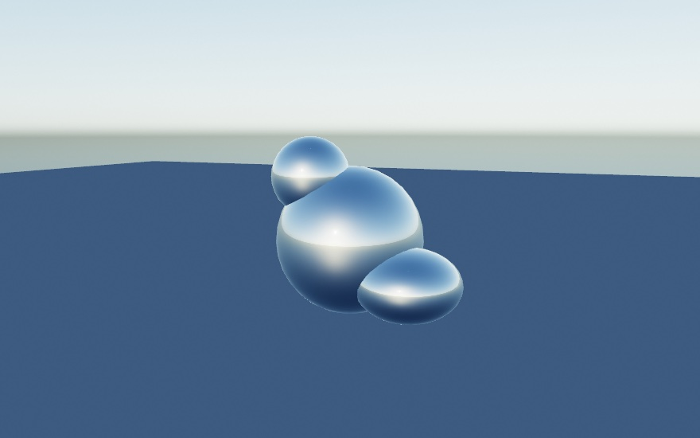
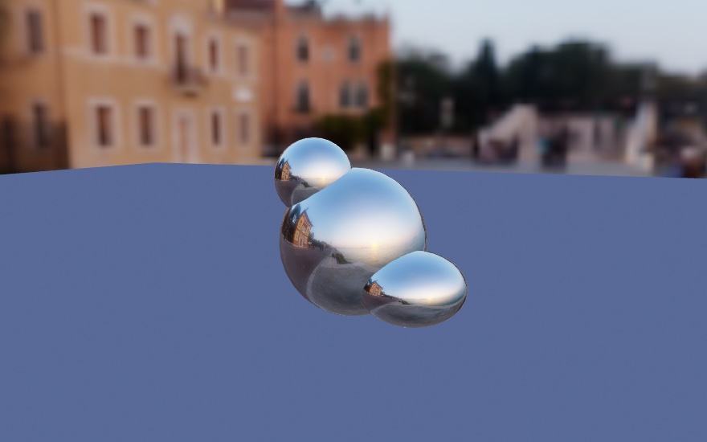
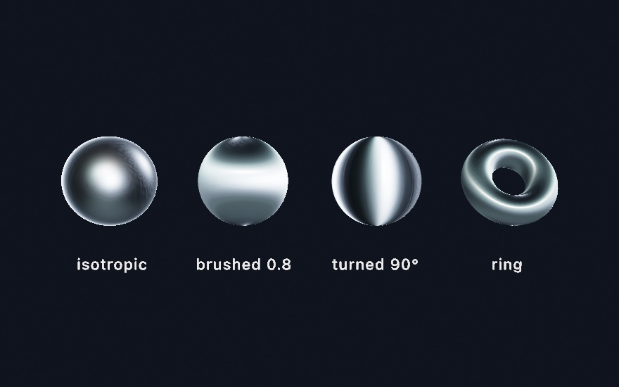
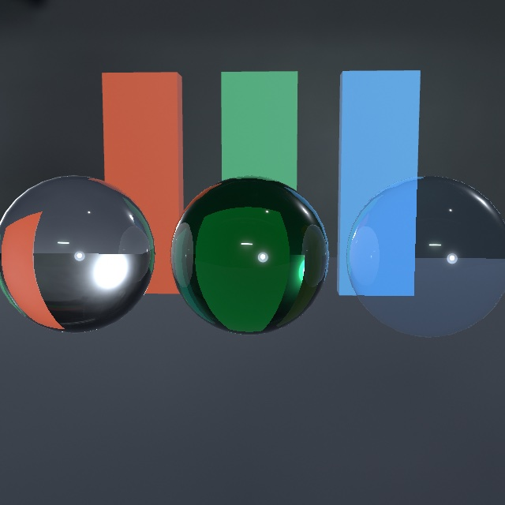
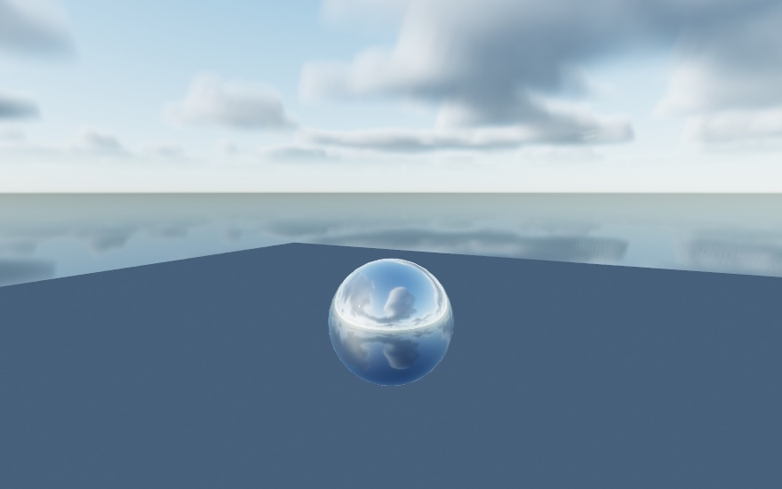

#### <sup>[Ollin](../README.md) → [Guide](README.md) → Chapter 28</sup>

---

# 28. Materials and surroundings


A few numbers a physicist would ask for can make a mesh metal, glass, or skin. A finish set with them looks right in any light, so you start with the light that comes from a scene's surroundings. Each object on the bench shows a different technique, from the worn paint of [Chapter 27](27-Meshes.md) to an egg that carries light under its surface. Clouds, the haze over distant ground, and the thin film follow the bench.

## Finishes you measure: environments and physically based materials

In [Chapter 27](27-Meshes.md#a-picture-stamped-onto-the-scene-decals), a decal took the finish of whatever it landed on. So far those finishes came by name, from [Chapter 26](26-3DGently.md): velvet, jade, toon. Each of those is a look somebody chose and tuned. These finishes are picked by number instead, and the numbers are the ones a physicist would ask for. It is usually less work, because a surface described that way behaves correctly in light you have not set up yet.

They also want something the earlier chapters never needed, which is why they waited until now. Most of them have almost nothing to work with until the scene has surroundings, so the surroundings come first.

### Surroundings as the light: environments

A mirror reflects its surroundings, and so does every measured finish below. With nothing around it, such a surface goes dark and dull. The lights from Chapter 26 don't fix it, because a point light is a point. It makes a highlight but no reflection.

What fixes it is an **environment**: a photograph of a whole place, wrapped around your scene as a sphere, used as the light.

```swift
environment(.sunset)
material(.metal(roughness: 0.12))
drawMesh(ball)
```





Those two images are the same solids, the same material, the same camera, and the same floor. The only differences are one word and a touch of blur on the backdrop. In the second picture you can read the buildings in the left flank of the largest ball. The surroundings *are* the reflection, and they are also the light. The floor is lit by the sky in the first and by the evening in the second, without a single light being placed.

Twenty environments come curated. Eight of them are bundled, so they work offline and at once. The other twelve download the first time you use one and cache from then on. The [environment lighting reference](../Docs/3D/3D.md#environment) lists them by mood. They differ greatly in brightness, so each is exposed to a consistent level for you. They also pair well with `toneMap(.aces)` from [Chapter 19](19-LayersAndEffects.md), for a filmic rolloff on the highlights.

Put the choice on a parameter and the inspector offers all twenty as a menu. You can then flip a scene from a studio to a dusk while it runs:

```swift
@Param var surroundings = Environment.studio
environment(surroundings)
```

The first image uses none of them. **`.sky(...)`** builds a daylight sky at runtime with nothing to load:

```swift
environment(.sky(sunElevation: 0.35))       // no asset, and the sun can move
```

It takes a sun elevation and a `turbidity` for how hazy the air is. Because it's computed rather than loaded, you can animate the sun and watch the whole scene's light follow. Reach for it when you want good lighting with no assets to load.

Two modifiers come up at once in practice. An environment paints itself **behind** your scene as a backdrop, which is usually what you want, since the reflections then match what you can see. When you'd rather keep your own `background(_:)`, `.lightingOnly()` keeps the light and drops the picture. And `.backgroundBlurred(_:)` softens only the backdrop, which pushes it back behind the subject.

### Two numbers for most real surfaces: PBR

With surroundings in place, the finishes have something to show. The **physically based** finishes ask for two properties instead of a name, and the renderer works out from them how light should behave:

```swift
material(.metal(roughness: 0.12))         // a metal, nearly polished
material(.dielectric(roughness: 0.4))     // a non-metal, satin
```

**Metal or not** is the first question, and it's close to binary in the real world. Metals tint the light they reflect (gold reflects gold) and have no color of their own underneath. Everything else, called a *dielectric*, reflects white highlights and shows its own color through them. That covers plastic, glass, skin, paint, and stone. **Roughness** is the second. It sets how scattered the reflection is, from `0` for a mirror to `1` for chalk.


That is one material with one number changed. The leftmost sphere is a mirror, so what you see on it is mostly a reflection of the room it's standing in. That's why it's dark with two small bright highlights. As roughness grows, that reflection smears out into a wide sheen. By `1.0` it has spread so far that the sphere reads as its average brightness. `fill` still sets the color, as before, and roughness only decides how the surface handles light.

The [materials reference](../Docs/3D/3D.md#materials) lists ready-made ones for the common cases, the same two properties underneath. One naming trap: plain `.plastic` is one of the *stylized* finishes from [Chapter 26](26-3DGently.md), so reach for `.smoothPlastic` when you want this family.

### A streak instead of a dot: anisotropy

Roughness sets how *wide* the highlight is. One more number sets its *shape*. The base of a frying pan and a laptop lid show it. The highlight there is a streak rather than a dot, because fine parallel grooves from brushing or machining cover the surface. `anisotropy` is that streak. It runs `-1…1`: `0` keeps the round highlight, and either end pulls it into a line. `anisotropyRotation` spins the line, in radians.

```swift
material(Material(shading: .physicallyBased, metallic: 1,
                  roughness: 0.4, anisotropy: 0.8))
```

A material can also be built from its fields, as here. `shading: .physicallyBased` picks this family, and `metallic: 1` answers the metal-or-not question of the step above with a number.



The streak is one number. The first two spheres are the same steel, and the band is what `0.8` does to it. The reflections smear the same way, so under an environment a brushed metal drags what it mirrors into stripes. The ring at the end is the ready-made `.brushedMetal` preset. On a curved body the streak follows the surface around, the way a machined ring or a lathed bowl reads. One thing to keep in mind: the streak is stretched *roughness*, so a mirror at roughness `0` has nothing to stretch. Give it a little roughness first. The [`BrushedMetal` example](../Examples/3D/Materials/BrushedMetal/Sketch.swift) sweeps the strength and the rotation side by side.

Numbers you tune by hand want a way back into code, and every material has one. `swiftSource` prints the expression that rebuilds it, listing only what you changed, and a built-in prints as its own name. The [material explorer](../Examples/3D/Materials/Explorer/Sketch.swift) puts the whole library on parameters, with this chapter's dials for metal, roughness, anisotropy, glass, clearcoat, and sheen. Its C key copies that expression. The source is the artifact, so tune until it looks right, press C, and paste.

### Glass

There has been a way to make a surface see-through since [Chapter 1](01-HelloOllin.md). Give the `fill` some alpha, and in 3D the surface fades. Glass is a different thing. The surface stays fully there, with its highlights and reflections, and the *light* comes through instead, bent and tinted on the way. That's transmission, and it's one material call:

```swift
environment(.studio)                  // something to transmit
fill(.white)
material(.glass(thickness: 1.8))      // a solid body: a sphere of radius 0.9
drawSphere(radius: 0.9)
```



The main distinction is `thickness`. At `0` the body is a thin wall, a pane or a soap bubble. What's behind passes through nearly straight, tinted by the `fill` and dimmed at the edges where the surface turns away. Give it a thickness and the body becomes solid, and a sphere's diameter is the natural number. Now the light refracts on the way in and again on the way out. So a solid ball shows the world behind it flipped and gathered, the crystal-ball look. A solid ball is a lens, and a thin wall is a window. The middle sphere in the figure adds the other solid-body argument, `attenuationColor` with an `attenuationDistance`. That's Beer-Lambert absorption under a friendlier name. You say what white light should become after traveling that far inside, and thicker paths get more of it. It is why real bottle glass is palest at its center and deepest green at the rim.

Three more arguments shape the glass. `roughness` frosts the glass, so the view through it blurs into a glow. `ior`, short for index of refraction, sets how strongly the body bends light, and the [glass reference](../Docs/3D/3D.md#glass) lists the values for water, glass, and diamond. And `dispersion` bends each color by a slightly different amount, which is what a prism does. A solid body then fringes what shows through it, and a thin wall shows none of it, because it lets every color through parallel.


The figure puts the same bars behind a clear ball and a dispersive one. The red channel bends least, so its picture of each bar is the widest, and where only it reaches the edge reads red. Where red and green reach but blue has not yet, it reads yellow. Turn the bars dark on a bright wall and the fringes turn cyan and blue instead. A cheap camera lens does the same at the edge of the frame. So keep `dispersion` small. A touch reads as glass, and a lot reads as a prism.

Glass needs an `environment(_:)`, for the same reason a mirror did. There has to be something on the other side to show. On its own it refracts the environment, and that already reads as glass. Add the ray-traced reflections of [Chapter 33](33-TracedLight.md) on a Mac that traces, and the view through the glass upgrades to the scene itself. The bars in the figure show through the spheres that way. One call upgrades mirrors and glass together.

Refracting the environment alone has a catch once glass stands in front of your own scene. The scene isn't in it. The wall behind the bottle, the floor, the other objects, they all stop at the glass and the studio shows instead. A bottle standing in a room comes out empty. `sceneThroughGlass()` fills that in, and it needs no ray tracing at all, so it works on any Mac:

```swift
environment(.studio)                  // still needed
sceneThroughGlass()                   // and now the scene, too
```


It works by drawing the frame a second time with every piece of glass taken out. Each body then looks up that picture along its own bent view ray. So a thin pane shows what is behind it, in place. A solid ball shows the floor and the far bars turned over, the way a glass of water does. A frosted body reads the picture blurred. Only what the camera drew can show through. The [reference](../Docs/3D/3D.md#scene-through-glass) lists what the lookup cannot show and where ray tracing takes over. Writing both calls is the right habit. Its cost is a second pass, since a frame with glass in it draws its scene twice.

A soap bubble is thin glass with a film of color on it. The thin film after the bench builds a measured one with `.soapFilm(thickness:)`. A quicker, stylized one composes the iridescence finish's soap-film mode, `iridescenceFlow`, onto thin glass, with `iridescencePhase` as its clock. Drive the clock with `time` and exports reproduce. The [`ThinFilm` example](../Examples/3D/Materials/ThinFilm/Sketch.swift) floats a handful of them. Glass still casts a solid shadow, and the [glass reference](../Docs/3D/3D.md#glass) lists the other edges, such as what glass seen inside a mirror shows.

### Paint and cloth: clearcoat and sheen

Two more finishes are built by *layering* rather than by choosing numbers for one surface, because that's how the real things are made. Car paint is a metallic base under a thin polished lacquer. Velvet is a matte body under a haze of stray fibers. Each layer gets its own argument on the physically based material, and each has presets so you can start from the name.

```swift
fill(Color(hue: 0.99, saturation: 0.8, brightness: 0.7))
material(.carPaint(roughness: 0.45))    // a satin red metal under a polished coat

fill(Color(hue: 0.62, saturation: 0.6, brightness: 0.42))
material(.felt)                         // a dry, fuzzy blue
```


In the first pair, the bare metal has one soft satin highlight, the widest its roughness allows. The coated one keeps that satin body and adds a second, sharper reflection floating over it. Two finishes sit on one surface, which no single roughness can make. That's `clearcoat`, and the same idea covers piano lacquer and varnished wood. `.lacquer` is a deep gloss film over a matte body, and a near-black `fill` under it gives the piano look. `clearcoatRoughness` sets the film's own polish, independent of the base. The base dims slightly under a coat, by the light the film reflects away, so the layering never invents brightness. Add [Chapter 26](26-3DGently.md)'s glitter flecks on top of `.carPaint`, through the `sparkle` argument, and you have metal-flake paint.

Now the second pair. The felt sphere has the same `fill` as its neighbor, yet it reads paler all over and brightest at its silhouette. Fabric is covered in fibers that lean every direction, and where the surface turns away from you those fibers catch the light edge-on. That's `sheen`. The face stays matte while the rim brightens, and the body gives up a little light to pay for it. `sheenRoughness` sets how tight the rim band is, so `.satin` pulls it close to the edge and `.felt` spreads it into a haze. `sheenColor` tints it. Leave it white for dusty cloth, or tint it away from the `fill` for shot fabric. The [`CoatAndCloth` example](../Examples/3D/Materials/CoatAndCloth/Sketch.swift) ends on a deep red velvet rimmed in orange.

Both layers work under ordinary lights, under the area-light panels of [Chapter 26](26-3DGently.md#a-light-with-a-body-area-lights), and from an environment. Under the ray-traced reflections of [Chapter 33](33-TracedLight.md) the coat's reflection upgrades to the traced scene along with everything else. Seen in a mirror, a coated body keeps its film and a felted one its fuzz. Only the highlights a lamp puts on them stay out of the reflection. The [reference page](../Docs/3D/3D.md#clearcoat-sheen) has the details.

### Skin, wax, and stone: subsurface scattering

Every opaque surface so far bounces light off its outside. Skin doesn't. Hold a flashlight against your fingers and the flesh glows red around it. Some of the light went *in*, wandered a little way under the surface, and came back out somewhere else. Marble, wax, milk, and jade all do this, and the eye notices when a render of them lacks it. A surface without it reads as painted plastic however carefully it is colored.

```swift
fill(Color(red: 0.92, green: 0.72, blue: 0.62))
material(.skin(radius: 0.34))    // radius: how far light travels, world units
drawSphere(radius: 0.72)
```


At the line where light gives way to shadow, the bare balls cut off the way a painted surface does. The scattering ones carry light a little way past that line. Light that entered on the lit side is re-emerging on the dark one. On the skin ball the carried light is *red*. Red travels farthest through flesh, which is why shadow edges on faces are warm. That per-channel reach is the `scatteringColor`, and its default is the skin ratio. Near-equal channels give the neutral softening of `.marble`, and a green-dominant color makes a jade whose glow is green.

You must set `scatteringRadius`. It's in world units because it's a physical distance, how far light gets before it's absorbed. A head-sized form wants roughly 1% of its width. The block above asks for far more, so the effect is easy to see on a small ball. Too big, and the material slides toward wax. `scattering` runs `0…1` and sets how much of the surface's light takes the trip at all. It layers on any material and needs no other calls to scatter, and a frame that doesn't use it pays nothing. It is a different thing from the stylized `subsurface` glow under [Chapter 26](26-3DGently.md)'s `.jade`. That one fakes back-light cheaply, and it can still layer on top for ears and edges. Where the measured one applies and where it does not is on the [reference page](../Docs/3D/3D.md#subsurface-scattering).

There's a second half, and it asks for one more call. Turn on `castShadows()` and the same material starts *transmitting*. Light that strikes the far side of a thin body comes through it. That is the flashlight-through-fingers trick from the top of this section. It works because the shadow machinery already knows what the material needs. A shadow map records where the light first landed, and the surface being shaded knows where it is. The gap between the two is how far the light traveled inside the body. The shadow map was a thickness gauge all along.


Put the light behind your subject and this carries the picture. A body about one `scatteringRadius` thick passes mostly red, the blood-red of a hand against the sun. The deep slab goes dark except at its rim, where the crossing is short. The ball keeps a warm crescent along its thinning edge. There are no new arguments, because the material already says everything. The radius sets what counts as thin, and `scatteringColor` decides what survives the trip. Only a shadow-casting light transmits, since its depth is the one that's known. Every light that casts does, and a directional, spot, or point caster all work.

## Putting it together: the bench

The finished sketch is five specimens on a stone slab, each carrying a different part of [Chapter 27](27-Meshes.md) and this chapter. Make `MySketches/Bench.swift`. It comes in three parts: the pictures, the objects they dress, and the frame.

The first part is the pictures, and every one of them is written rather than loaded. A normal map is a height function read for its slopes, which is the recipe from [Chapter 27's normal maps](27-Meshes.md#relief-from-a-picture-normal-maps). A color picture is a function of the tile's own coordinates. Two functions sit under them. `bareness` says how far the paint has worn back to metal at a point. `device` is the height of the wheel cut into the tile. A device is a coin maker's word for the design stamped into a face, and the listing borrows it.

```swift
import Foundation
import Ollin

final class Bench: Sketch {

    // MARK: pictures authored in code

    /// A height function turned into a green-up normal map by its slopes.
    func normalMap(size: Int, strength: Double, height: (Double, Double) -> Double) -> Image {
        var bytes = [UInt8](repeating: 0, count: size * size * 4)
        let d = 1.0 / Double(size)
        for y in 0 ..< size {
            for x in 0 ..< size {
                let u = (Double(x) + 0.5) * d, v = (Double(y) + 0.5) * d
                let dx = (height(u + d, v) - height(u - d, v)) / (2 * d) * strength
                let dy = (height(u, v + d) - height(u, v - d)) / (2 * d) * strength
                let len = (dx * dx + dy * dy + 1).squareRoot()
                let i = (y * size + x) * 4
                bytes[i]     = UInt8((-dx / len * 0.5 + 0.5) * 255)
                bytes[i + 1] = UInt8((dy / len * 0.5 + 0.5) * 255)
                bytes[i + 2] = UInt8((1 / len * 0.5 + 0.5) * 255)
                bytes[i + 3] = 255
            }
        }
        return Image(width: size, height: size, premultipliedRGBA: bytes)!
    }

    /// A color picture from a function of the tile's own coordinates.
    func picture(size: Int, _ shade: (Double, Double) -> Color) -> Image {
        var bytes = [UInt8](repeating: 0, count: size * size * 4)
        for y in 0 ..< size {
            for x in 0 ..< size {
                let c = shade((Double(x) + 0.5) / Double(size), (Double(y) + 0.5) / Double(size))
                let i = (y * size + x) * 4
                bytes[i]     = UInt8((c.red * c.alpha * 255).rounded())
                bytes[i + 1] = UInt8((c.green * c.alpha * 255).rounded())
                bytes[i + 2] = UInt8((c.blue * c.alpha * 255).rounded())
                bytes[i + 3] = UInt8((c.alpha * 255).rounded())
            }
        }
        return Image(width: size, height: size, premultipliedRGBA: bytes)!
    }

    /// The crystal: a model that ships in the LoadedMesh example's folder, found by
    /// walking up from the working directory until the path exists.
    var modelURL: URL {
        let tail = "Examples/3D/Geometry/LoadedMesh/model.obj"
        var directory = URL(fileURLWithPath: FileManager.default.currentDirectoryPath)
        while true {
            let candidate = directory.appendingPathComponent(tail)
            if FileManager.default.fileExists(atPath: candidate.path) { return candidate }
            let parent = directory.deletingLastPathComponent()
            if parent == directory { return candidate }
            directory = parent
        }
    }

    // MARK: the two height functions the pictures are made from

    /// How far the paint has worn back to bare metal at a point on the tile.
    func bareness(_ u: Double, _ v: Double) -> Double {
        smoothstep(0.46, 0.62, fbm(u * 4, v * 8, octaves: 4))
    }

    /// The coin's device, as a height: white is the face, darker is cut into it.
    func device(_ u: Double, _ v: Double) -> Double {
        let r = Vector2(u - 0.5, v - 0.5).length
        let a = atan2(v - 0.5, u - 0.5)
        let rays = smoothstep(0.25, 0.55, sin(a * 6) * 0.5 + 0.5)
        let band = smoothstep(0.3, 0.32, r) * (1 - smoothstep(0.37, 0.39, r))
        let hub = 1 - smoothstep(0.1, 0.25, r)
        return 1 - max(band, hub * rays) * 0.85
    }

```

> **Swift note.** Some things here are new. A picture is bytes, four per pixel. `[UInt8](repeating: 0, count:)` makes a list of that many zero bytes, and `UInt8(...)` narrows a number into one of them. `Image(width:height:premultipliedRGBA:)` builds a picture from those bytes. Premultiplied means each color channel is already multiplied by its alpha, which is why `picture` multiplies by `c.alpha`. It hands back an optional, forced here with `!` because the sizes match by construction. `import Foundation` brings in `URL` and `FileManager`, which the model's path needs, and `while true` runs a loop until a `return` leaves it. The `// MARK:` lines are comments the editor lists in its jump bar, and nothing more. And `normalMap` takes a function as its last argument, `height: (Double, Double) -> Double`, which turns two numbers into one. It calls it as `height(u + d, v)`.

The second part builds the objects. The slab has no texture coordinates worth having, so its stone is projected onto it three ways. The teal ball carries four maps at once. They are the paint, its scuffs, a metallic-roughness map that says where the paint has gone, and a detail pair for the close look. The tile's wheel is a height map on a flat plane. The small silver form started life as a six-pointed slab, the `star` in the listing. The crystal is the `model.obj` file in the `3D/Geometry/LoadedMesh` example's folder, loaded the way the first listing of [Chapter 27](27-Meshes.md#a-mesh-from-a-file) loaded a duck.

```swift
    // MARK: the parts

    var bench = Mesh(positions: [], indices: [])
    var worn = Mesh(positions: [], indices: [])
    var tile = Mesh(positions: [], indices: [])
    var star = Mesh(positions: [], indices: [])
    var specimen: Mesh?
    var mark: Decal?

    let plinth = Mesh.box(width: 0.86, height: 0.2, depth: 0.86)
    let cushion = Mesh.sphere(radius: 0.6, segments: 64, rings: 40)
    let egg = Mesh.sphere(radius: 0.34, segments: 48, rings: 32)

    override func setup() {
        seed(714)
        noiseSeed(714)

        // The bench has no uvs worth having, so its stone is projected, grain and all.
        // A projected picture repeats, so both of these have to tile, or the
        // stone draws a straight line wherever the picture wraps.
        let stone = picture(size: 512) { u, v in
            let grain = tilingFbm(u, v, detail: 5, octaves: 5)
            return Color.mix(Color(hex: 0x585A5C), Color(hex: 0x7C7B74), grain)
        }
        let stoneRelief = normalMap(size: 512, strength: 0.35) { u, v in
            tilingFbm(u, v, detail: 8, octaves: 5) * 0.5
        }
        bench = Mesh.box(width: 9, height: 0.5, depth: 5)
            .triplanarTextured(stone, normal: stoneRelief, scale: 2.6)

        // Painted metal, and a map that says where the paint has gone.
        let paint = picture(size: 512) { u, v in
            Color.mix(Color(hex: 0x1D5450), Color(hex: 0xC7BFB0), self.bareness(u, v))
        }
        let wear = picture(size: 512) { u, v in
            let b = self.bareness(u, v)
            return Color(red: 0, green: 0.7 - b * 0.5, blue: b)   // g roughness, b metallic
        }
        let scuffs = normalMap(size: 512, strength: 0.05) { u, v in
            fbm(u * 14, v * 14, octaves: 3) * 0.5
        }
        let grain = picture(size: 256) { u, v in
            let n = fbm(u * 30, v * 30, octaves: 3) * 0.5 + 0.5
            return Color(white: 0.5 + (n - 0.5) * 0.5)          // gray is the neutral
        }
        let grainBumps = normalMap(size: 256, strength: 0.06) { u, v in
            fbm(u * 30, v * 30, octaves: 3) * 0.5
        }
        worn = Mesh.sphere(radius: 0.5, segments: 96, rings: 48)
            .textured(paint)
            .normalMapped(scuffs)
            .surfaceMapped(metallicRoughness: wear)
            .detailMapped(grain, normal: grainBumps, scale: 6, amount: 0.5)

        // A tile whose device is carved by a height map rather than by geometry.
        let carved = picture(size: 512) { u, v in Color(white: self.device(u, v)) }
        let slate = picture(size: 512) { u, v in
            Color.mix(Color(hex: 0x3E4A52), Color(hex: 0x8FA0A8), self.device(u, v))
        }
        tile = Mesh.plane(width: 1.15, depth: 1.15)
            .textured(slate)
            .parallaxMapped(carved, scale: 0.09)

        // A crude cage, rounded by the computer.
        star = Mesh.extrude(Profile.star(points: 6, outerRadius: 0.46, innerRadius: 0.24), depth: 0.42)
            .subdivided(levels: 2)

        specimen = (try? loadMesh(modelURL.path))?.normalized(scale: 1.15)

        // The bench is stamped where the maker signed it.
        mark = Decal(picture(size: 256) { u, v in
            let r = Vector2(u - 0.5, v - 0.5).length
            let ring = abs(r - 0.34) < 0.02 || abs(r - 0.29) < 0.009
            let bar = abs(v - 0.5) < 0.028 && abs(u - 0.5) < 0.18
            let stem = abs(u - 0.5) < 0.028 && abs(v - 0.5) < 0.18
            return Color(hex: 0x17130E, alpha: (ring || bar || stem) ? 0.7 : 0)
        })
    }

```

> **Swift note.** `Mesh(positions: [], indices: [])` is an empty mesh standing in until `setup()` fills the property. The closures handed to `picture` take two arguments, `u` and `v`. Inside one, the sketch's own methods are reached through `self.`. Swift accepts `bareness(u, v)` here too, since the closure runs before `picture` returns. The listing spells `self.` to show whose function it is. `||` and `&&` are *or* and *and*, as in [Chapter 23](23-GridSimulations.md)'s Metal. `? :` is [Chapter 6](06-GridsAndRepetition.md)'s compact if.

The third part is the frame. There is one directional light and one environment, and the environment is doing most of the work, because every finish here is a measured one. The light's `softness:` argument wraps its shading a little past the edge where light gives way to shadow, for a gentler falloff.

```swift
    override func draw() {
        background(Color(hex: 0x0D0E12))
        camera(Camera3D(eye: Vector3(0.55, 2.35, 6.4), target: Vector3(0.15, 0.35, 0.2),
                        projection: .perspective(fieldOfView: .pi / 4.8)))
        environment(.interior.backgroundBlurred(0.55))
        directionalLight(Color(kelvin: 4600), direction: Vector3(-0.5, -0.72, -0.5),
                         intensity: 0.85, softness: 0.22)
        castShadows()
        toneMap(.aces)

        // The bench, and the mark stamped into it.
        withState {
            translate(0, -0.25, 0)
            fill(.white)
            material(.dielectric(roughness: 0.85))
            drawMesh(bench)
        }
        if let mark { drawDecal(mark, at: Vector3(-1.4, 0, 1.25), width: 0.7) }

        // The crystal on its lacquered plinth.
        withState {
            translate(-1.45, 0.1, -0.2)
            fill(Color(hex: 0x14100E))
            material(.lacquer)
            drawMesh(plinth)
            if let specimen {
                translate(0, 0.68, 0)
                rotateY(0.6)
                fill(Color(hex: 0xDCEEF6))
                material(.glass(roughness: 0.03, ior: 1.48, thickness: 0))   // a thin wall
                drawMesh(specimen)
            }
        }

        // The cage the computer rounded, in brushed steel.
        withState {
            translate(-0.4, 0.24, 0.5)
            rotateX(-.pi / 2)
            rotateZ(0.5)
            fill(Color(hex: 0xBFC4C9))
            material(.brushedMetal)
            drawMesh(star)
        }

        // Painted iron, worn back to metal.
        withState {
            translate(0.8, 0.5, -0.45)
            rotateY(-0.5)
            fill(.white)
            material(.physicallyBased(metallic: 1, roughness: 1))
            drawMesh(worn)
        }

        // The tile, carved by a picture and by nothing else.
        withState {
            translate(0.1, 0.005, 1.1)
            rotateY(0.28)
            fill(.white)
            material(.dielectric(roughness: 0.55))
            drawMesh(tile)
        }

        // Wax on cloth: the light goes in, wanders, and comes back out.
        withState {
            translate(1.75, 0.12, 0.35)
            fill(Color(hex: 0x3A1018))
            var felt = Material.felt
            felt.sheenColor = Color(hex: 0xB9724F)
            material(felt)
            withState {
                scale(1.35, 0.36, 1.35)
                drawMesh(cushion)
            }
            translate(0, 0.45, 0)
            fill(Color(hex: 0xF2E3C0))
            var wax = Material.marble(radius: 0.12)
            wax.scatteringColor = Color(red: 1, green: 0.66, blue: 0.34)
            material(wax)
            scale(0.84, 1.2, 0.84)
            drawMesh(egg)
        }
    }
}
```

The bench is five specimens, ten pictures, and one light, and it composes most of the steps of [Chapter 27](27-Meshes.md) and this chapter. The crystal is loaded from a file and normalized. The silver star is a cage rounded by two levels of subdivision. The ball carries a normal map, a metallic-roughness map, and a detail pair over its texture. The tile carries a height map read by parallax. The slab is textured from three sides and stamped with a decal. Every finish is a measured one, lit by an environment. The slab and the tile are dielectrics, the star is brushed metal, and the crystal is a thin wall of glass. The plinth is lacquer, the cloth under the egg is felt with its own sheen color, and the egg scatters light under its surface. The ball and the tile have no detail you could find in a vertex, and neither does the slab they stand on. The ball is a plain sphere, the tile a single flat quad, and the slab a box. Everything you can see on them was written into a picture.

The camera here is spelled out as a `Camera3D` with an eye, a target, and a projection. It holds one composed shot, where `camera(.orbiting(...))` placed the eye on an orbit. `Color(kelvin:)` names a light's color by its temperature, the way a bulb's box does.

Then make it yours:

- Set `parallaxMapped`'s `scale` on the tile to `0.2`. The carving deepens and the tile's outline stays straight, which is the trade the height-map step of [Chapter 27](27-Meshes.md#depth-from-a-picture-height-maps) describes.
- Swap the tile's `parallaxMapped` for `displaced(by:scale:)` on `Mesh.plane(width: 1.15, depth: 1.15, segments: 200)`. The carving is now in the geometry, so it throws its own shadows, and you paid for it in triangles.
- Raise the egg's `.marble(radius: 0.12)` to `0.4`. The light wanders so far that the egg glows from within, which is the wax look.
- Set the felt's `sheenColor` to white, and the two-tone velvet under the egg turns to dusty cloth.
- Point `modelURL` at a model of your own. `normalized(scale:)` fits it to the bench whatever units its author saved it in.

The bench holds still, so keep it as a still. `swift run OllinLive MySketches/Bench.swift --export bench.png` writes the frame at the size the canvas is. [Chapter 41](41-FinishingASketch.md) says how to size one for a print.

## More surroundings: clouds and distant air

The bench lit its specimens with a bundled interior. Outdoors, a computed sky can carry more than a sun. It can carry weather that lights the whole scene, and it can hand its sun to the air between you and far ground.

### Weather in the sky: clouds

**Volumetric clouds** have depth: they are marched through a volume and baked into the sky environment, rather than painted flat on it. They are for an outdoor scene whose light should follow its weather. The clouds behind the scene, the light on every surface, and the picture in every reflection then agree. The technique follows Andrew Schneider and Nathan Vos's real-time cloudscapes, presented at SIGGRAPH in 2015.



```swift
environment(.sky(sunElevation: 0.5).clouds(.scattered))          // a preset sky
environment(.sky(sunElevation: 0.5).clouds(coverage: 0.9))       // a gray lid: the light goes soft
```

`coverage` runs from a few fair-weather puffs to overcast. Because the clouds live in the environment, sliding it dims and diffuses the whole scene the way a gray day does. `tallness` trades flat sheets for building towers. `phase` is the wind's clock, so advance it and the weather drifts, deterministically, and an export plays the same sky. A still sky bakes once and costs nothing per frame. The `3D/Environments/Cloudscape` example puts all of it on parameters.

### Distant air: aerial perspective

[Chapter 26](26-3DGently.md#air-you-can-see-fog-and-volumetric-light) faded every distance toward one color with `fog`. **Aerial perspective** is the outdoor version. Distant ground loses the blue of its own light. It gains sunlight scattered into the path, blue from the side and brighter and whiter toward the sun. It is for ridgelines, mountains, and any outdoor scene deep enough that far things should read as far. Ollin follows Naty Hoffman and Arcot J. Preetham's real-time outdoor scattering (2002), and with a sky in place it is one call:

```swift
environment(.sky(turbidity: 2.4, sunElevation: 0.34))
aerialPerspective()
```


With a `.sky` environment it follows the sky's own sun, rotation and all, so dropping the sun to the horizon reddens the haze by itself. `density` is how much air the scene spans, and left unset it sizes itself to the camera framing. `haziness` trades the crisp blue of a clear day for the gray veil and sun halo of a humid one. It replaces `fog` for the frame, since the last call wins, and Chapter 26's volumetric beams show in it as they show in fog. The `3D/Effects/Atmosphere` example puts all of it on parameters (hold space to switch over from fog).

## More finishes you measure: the thin film

The bench's finishes were all picked by number. The thin film is the measured finish the bench did not need, and it colors a surface with a distance instead of a pigment.

### Color with no pigment: the thin film

Blow a soap bubble and it turns colors that were never in the soap. The wall of that bubble is a film a few hundred nanometers thick, and light reflects off both of its faces. The second reflection travels a little farther, so the two come back out of step. Where they line up a color gets brighter, and where they oppose each other it disappears. What is left is a color made by a distance. A **thin film** finish puts that film on any surface. It is for anodized titanium, oil on a wet road, the inside of a shell, and the bubble itself. The finish is Laurent Belcour and Pascal Barla's 2017 extension of the microfacet model. It adds up the light bouncing between a film's two faces.


```swift
fill(Color(white: 0.75))
material(.anodized)                     // an oxide film over polished metal

var m = Material.metal(roughness: 0.16)
m.thinFilm = 1                          // how much of the reflection is the film's
m.thinFilmThickness = 480               // nanometers, and this is the color parameter
material(m)
```

The three metals are the same metal. Only the thickness of the film on them changes, and it sets their color. That number is in **nanometers**, which is light's own scale rather than the scene's. It is the only measurement in the material that is not in world units. So the same value works on a bubble and on a building. The 360 nm ball shows violet and gold, and the 600 nm one turns green and red. The [thin-film reference](../Docs/3D/3D.md#thin-film) walks the thickness through its bands.

Each filmed ball has one thickness, and yet its color changes from the middle of the ball to its edge. A slanted path through the film is a longer path. So the color walks as the surface turns away from you, and it walks again when you move. That is why a bubble's colors shift as you move. The surface *under* the film matters too, since the film's lower face is where the two meet. So the same film over metal and over a dark wet surface look nothing alike.

The fourth ball is the bubble itself. `.soapFilm(thickness:)` is [glass](#glass) and a film together, a wall you see through that is colored by its own thinness. A real bubble drains as it stands, thinning from the top until it goes black and pops. Walk the thickness down over time and yours will do the same. The reference lists the other presets. It differs from the `iridescence` under [Chapter 26](26-3DGently.md)'s `.iridescent` finish, which is a stylized rainbow at the rim. The thin film is measured, so it holds its color under a moving light the way the real surface does.

## Where this comes from

The measured finishes are the Cook-Torrance microfacet model. Their form is the metallic-roughness one that Brent Burley presented for Disney in 2012 and that the glTF specification wrote down. The anisotropic version follows Christopher Kulla and Alejandro Conty Estevez, who also wrote the production-friendly sheen used here. The clear coat is the second lobe of Google's Filament documentation. Lighting a scene from a picture of a place is Paul Debevec's idea, in the split-sum form Brian Karis published in 2013. The computed sky is Lukas Hosek and Alexander Wilkie's model, which ships inside Ollin. Subsurface scattering is the separable screen-space diffusion of Jorge Jimenez and colleagues. It runs over the measured skin profile Eugene d'Eon and David Luebke fitted, with the backlit half from Jimenez's translucency work. The entries after the bench name their own sources. Full credits are in the project's [attribution notes](../ATTRIBUTION.md).

## Go deeper

- [Environment lighting](../Docs/3D/3D.md#environment-lighting): all twenty curated environments listed by mood, which eight are bundled offline, `highResolution` backdrops, loading your own `.exr` or `.hdr`, where downloads cache, and the full procedural-sky arguments.
- [Atmosphere](../Docs/3D/Atmosphere.md): `aerialPerspective` with its `density` and `haziness`, how it follows a `.sky` environment's sun, and how it trades places with `fog`.
- [Physically based materials](../Docs/3D/3D.md#materials): the metallic-roughness model in full, plus the ready-made metals and dielectrics and how they combine with the stylized finishes.
- [Glass](../Docs/3D/3D.md#glass): every transmission argument with its units, the environment requirement, and the edges spelled out.
- [Subsurface scattering](../Docs/3D/3D.md#subsurface-scattering): the three scattering arguments, the presets, and the envelope; worked example [`Examples/3D/Materials/Subsurface`](../Examples/3D/Materials/Subsurface/Sketch.swift) (hold space to compare against the plain surfaces).
- [Combining 3D features](../Docs/3D/Combining.md): which finishes reach which kind of geometry, which is the table to check when a material you expected to apply does nothing.
- The Farmanfarmaian homage [`MirrorFamily`](../Examples/Recreations/MonirFarmanfarmaian/MirrorFamily/Sketch.swift): a relief built as two meshes of flat triangles. One has a near-mirror metal finish, and the other a painted finish under a clear coat. Its reflections are traced against the room the sketch builds around it, which is where a mirror's look comes from.
- The Felguérez homage [`RelieveLacado`](../Examples/Recreations/ManuelFelguerez/RelieveLacado/Sketch.swift) raises a composed design in lacquered layers under a key light that circles slowly. With the lights off and the camera straight on, it renders its own plan again, pixel for pixel. That is the check that the raising is right.
- Worked examples, in [`Examples/3D/`](../Examples/3D/): `Materials/BrushedMetal`, `Materials/CoatAndCloth`, `Materials/ThinFilm`, `Materials/SeeThrough`, `Materials/Explorer`, and `Environments/Cloudscape`.

---

[Contents](README.md#contents) · Previous: [Chapter 27, Meshes and maps](27-Meshes.md) · Next: [Chapter 29, Landscapes and multitudes](29-Landscapes.md)
