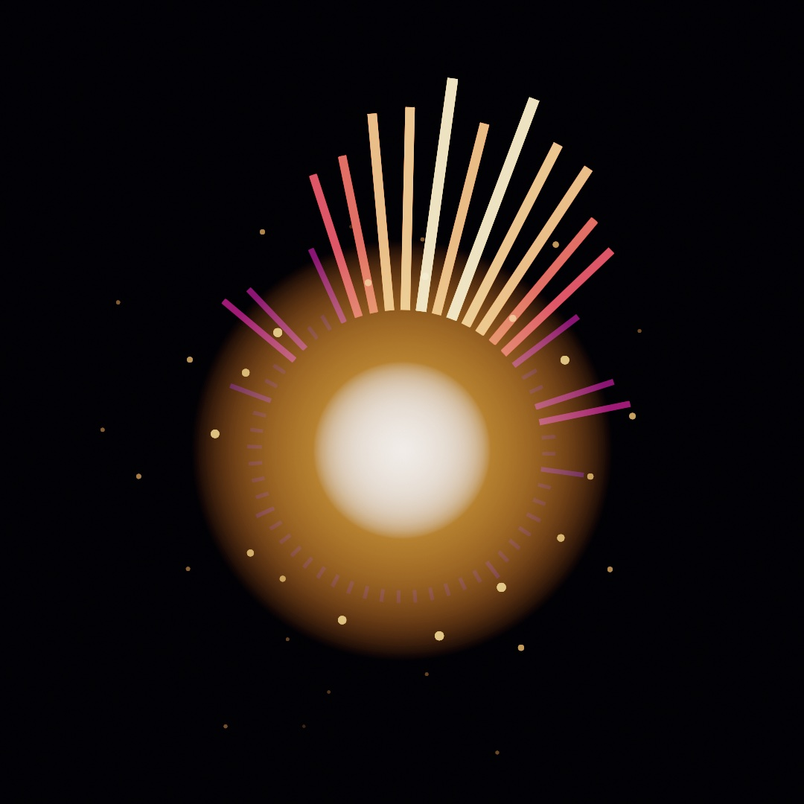
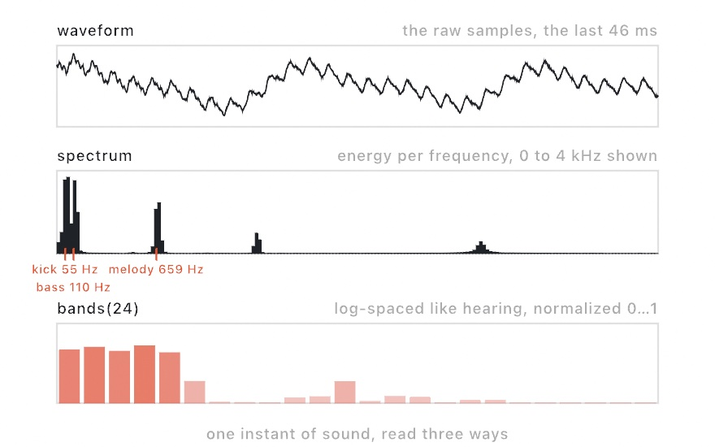
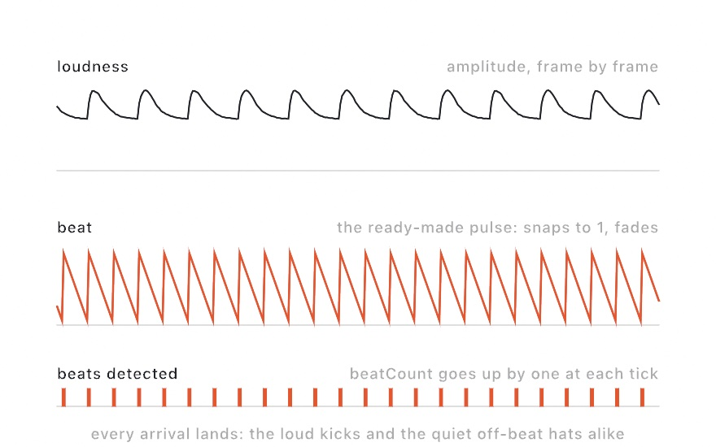
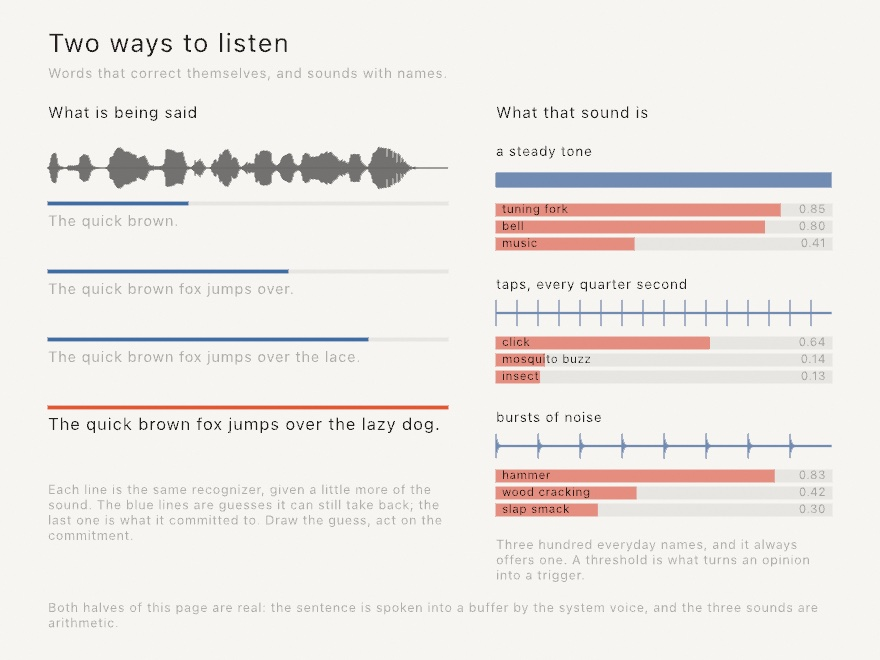
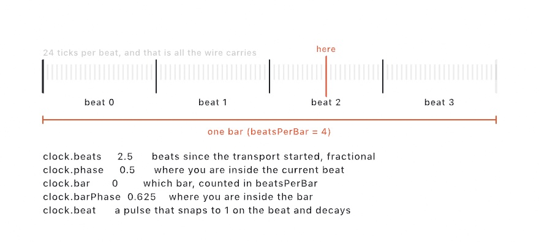
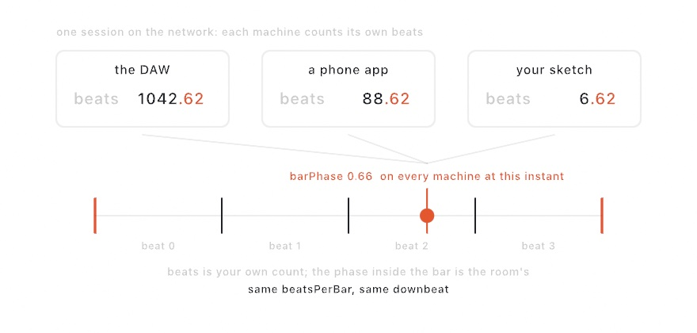
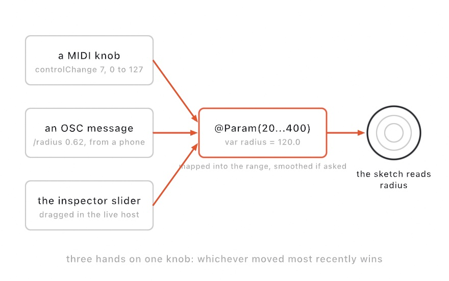
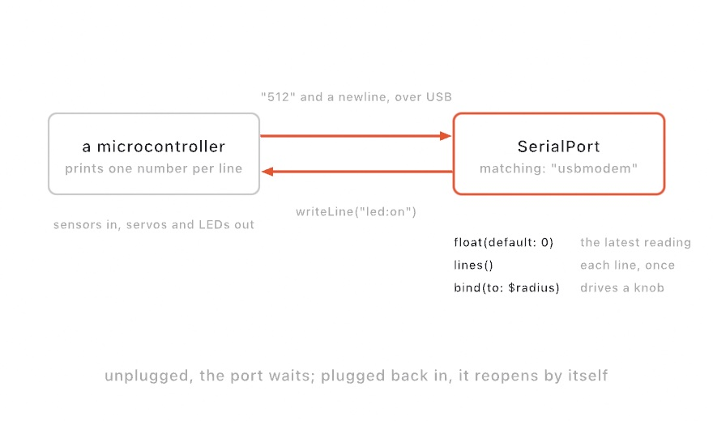
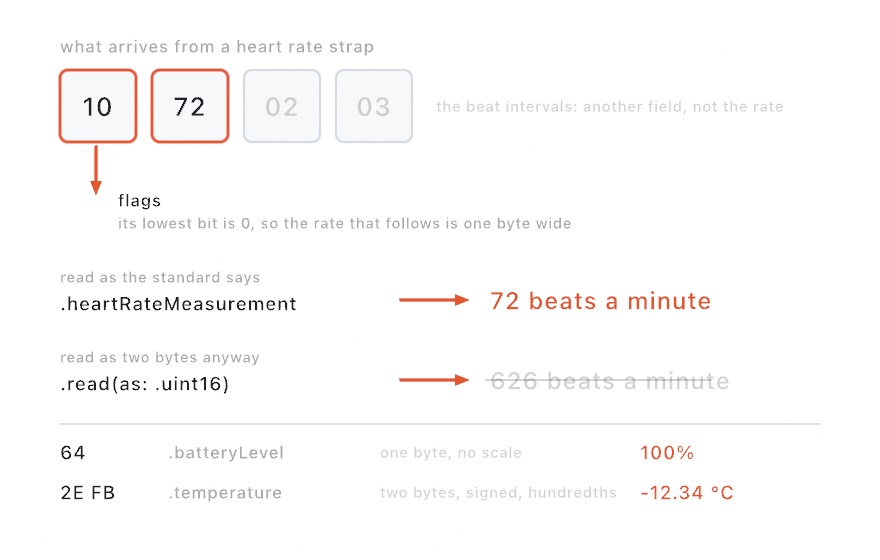

#### <sup>[Ollin](../README.md) → [Guide](README.md) → Chapter 28</sup>

---

# 28. Sound and control



Every sketch so far has listened to two things, the clock and the mouse. This chapter adds ears and hands. The ears come first. A microphone or a song becomes a handful of numbers you read in `draw()`, and the picture moves with the music. Then come the hands. A hardware knob, a phone fader, the inspector slider, or a sensor you wired yourself drives the same parameters. A running sketch becomes something you play. The piece above is doing both at once, and by the end you'll have built it. Making sound rather than hearing it is [Chapter 29](29-MakingSound.md), which picks up where the ears leave off.

## The first listening sketch

Sound reaches a sketch through `OllinAudio`, a small library you import alongside the framework. The simplest start is the microphone and one number, `amplitude`. That is how loud things are right now, roughly `0...1`, smoothed so it doesn't flicker.

```swift
import Ollin
import OllinAudio

final class Pulse: Sketch {
    let mic = AudioInput()

    override func setup() { try? mic.start() }

    override func draw() {
        background(.black)
        fill(.white)
        drawCircle(width / 2, height / 2, (60 + Double(mic.amplitude) * 700) * scale)
    }
}
```

Run it with `swift run OllinLive` like any sketch, say yes when macOS asks about the microphone (it asks once), and hum. The circle breathes with you. That's the whole shape of audio-reactive work: make a source in `setup()`, keep it in a property, read its values every frame. The rest of the chapter is just richer values to read.

> **Swift note.** `amplitude` is a `Float`, because audio hardware speaks 32-bit floats. Drawing wants `Double`, so you'll see `Double(mic.amplitude)` around every audio read. It's a conversion, not a calculation; nothing is lost that your eyes could see.

## A microphone we can print

A guide has a problem a live sketch doesn't. Every figure in these pages must render the same way on any machine, and no two rooms sound alike. [Chapter 27](27-DepthAndThePhone.md) solved this with a pretend depth camera, and this chapter fakes a microphone. `StageMic` is about thirty lines at the bottom of [`Anatomy.swift`](Figures/28-SoundAndControl/Anatomy.swift), the committed figure. It synthesizes a little band, then feeds the samples into a real `AudioAnalyzer`, the same analysis engine behind `AudioInput`. The band is a kick drum every half second and a hat between the kicks. Over that sit a held bass note, a slow four-note arpeggio, and a whisper of hiss. Every audio number in this chapter comes out of that analyzer, exactly as it would from the air. Only the air is missing. Swap `StageMic` for `AudioInput()` in any figure and it listens to your room instead.

The analyzer is worth meeting directly, because it's also the seam for sounds Ollin hasn't heard of. It's public, so anything that can produce a stream of samples can feed one.

## What the analyzer hears

Sound arrives as **samples**, which are measurements of air pressure, 44,100 of them per second. A microphone hands the analyzer that stream, and the analyzer answers three questions about the most recent instant.

<picture>
  <source media="(prefers-color-scheme: dark)" srcset="Images/28-SoundAndControl/Anatomy-dark.jpg">
  
</picture>

The top panel is the **waveform**, the samples themselves. One big slow swell, the kick's low thump mid-decay, carries fast wiggles on it, which are the melody. It's the honest raw material, and mostly you'll draw it only when you want an oscilloscope look.

The middle panel is the **spectrum**, and it's the reason audio-reactive visuals work at all. Sound is vibration, and pitch is how fast the vibration is. A low note shakes the air few times a second, and a high note many more. The rate is measured in hertz, meaning cycles per second. The spectrum splits the instant into how much energy sits at each speed, like a prism splitting light into colors. Suddenly the mix is legible. The kick's 55 Hz thump, the bass note at 110 Hz, and the melody near 659 Hz each get their own spike. The tool that computes this split is the Fourier transform. The analyzer runs it for you every frame, and `spectrum` is the result, an array of magnitudes from low frequencies to high.

Raw spectra are awkward to draw, though. The values are unnormalized, and the interesting musical action crowds into the first few bins. That is because hearing is logarithmic, so every doubling of frequency sounds like one equal step. That step is what an octave is. So the bottom panel is the read you'll actually use, **`bands(_:)`**:

```swift
for (i, level) in source.bands(24).enumerated() {
    let h = Double(level) * 300 * scale           // level is already 0...1
    drawRect(Double(i) * 34 * scale, height - h, 30 * scale, h)
}
```

`bands(24)` gives 24 bars spread the way hearing is, log-spaced, so the bass isn't crammed into one bar. Each is normalized to roughly `0...1` by a gain that adapts to the material. Each rises fast and falls gently, so bars look alive instead of jittery. A bar's height becomes a plain map to pixels, no hand-tuned scaling. Ask once per frame, with a fixed count.

Between the raw spectrum and the shaped bands sit three named conveniences, `bass`, `mid`, and `treble`. They are the energy in the low, middle, and high ranges. There is also `magnitude(in: 40...120)` for a range you pick yourself. Those are unnormalized like the spectrum, so scale them to taste.

## Hearing the beat

Loudness and spectrum answer "how much", but the other thing music has is **arrivals**. A drum hit is a moment, not a level. A visual that flashes on the drum reads as listening in a way a level meter never does.

<picture>
  <source media="(prefers-color-scheme: dark)" srcset="Images/28-SoundAndControl/BeatTimeline-dark.jpg">
  
</picture>

The detector behind this compares each instant's spectrum with the one just before and adds up the rises. A sudden brightening across many frequencies at once spikes that sum, and the analyzer counts it as a beat. A drum hit, a plucked string, and a note starting all do that. Three reads surface it:

```swift
source.beat            // a 0...1 pulse: snaps to 1 on each beat, fades over ~0.25 s
source.beatCount       // how many beats so far
source.timeSinceBeat   // seconds of audio since the last one
```

`beat` is the ready-made value, so multiply a radius by it and the picture throbs. `beatCount` is for firing something exactly once per beat, by comparing against a stored count, the way the finished piece spawns sparks. Look at the timeline, where every kick lands and so does the quiet off-beat hat, with the same confidence. That's what the detector really is. Onset detection hears *arrivals*, sudden changes in the sound, not loudness and not "the beat" a drummer would tap. A soft hat is as sudden as a loud kick, so both count. For most visuals that's exactly what you want. When it isn't, `beatSensitivity` is the knob, and a higher value asks for stronger arrivals before firing. The detector is deliberately steady the rest of the time, so held chords and drones don't drift into false triggers. The same recording always beats in the same places.

## Four places sound comes from

Everything above reads the same off any source, so choosing a source is one line:

```swift
let mic = AudioInput()                                         // the room
let song = try AudioPlayer(resource: "track", withExtension: "m4a", in: .module)
let tone = Tone(frequency: 220, waveform: .sine)               // a note of your own
let sound = Soundtrack(of: player)                             // a playing video's audio
```

`AudioInput` is the microphone, permission and all. `AudioPlayer` plays a file and analyzes it as it sounds, taking `.m4a`, `.mp3`, `.wav`, and friends. The `Audio/FilePlayer` example ships with a violin recording and shows the shape. It's also the source that survives export. During a headless render it follows the export clock through the file, so an audio-reactive piece writes the same frames every time. [Chapter 31](31-SharingAndPerforming.md) has the whole export story. `Tone` is a modest oscillator that both sounds and feeds the analyzer, which makes it the self-contained option. The `Audio/Spectrum` example generates a gliding sawtooth and draws its own harmonics, with no permission and no file. And `Soundtrack` taps the audio of a playing `VideoPlayer` from [Chapter 30](30-Seeing.md)'s territory, so footage can drive visuals with its own music. One habit applies to all four. An audio file you bundle follows the same license care as any asset, so credit what you ship.

## Words, and what that noise was

Everything so far reads sound as a shape: how loud, which frequencies, when the beat landed. A sketch can also ask what it is hearing. Two listeners answer that, and both attach to any of the four sources above.

```swift
let mic = AudioInput()
var speech: SpeechListener!
var ears: SoundClassifier!

override func setup() {
    speech = SpeechListener(of: mic)
    ears = SoundClassifier(of: mic)
    try? mic.start()
}
```

That is two things listening to one microphone, which is fine. The source is tapped once, and the audio goes to everything attached to it, a `Soundtrack` analyzer included.

`SpeechListener` turns talking into words. It runs on your Mac, nothing is uploaded, and it asks for no permission of its own. The microphone asks for its own the first time you start it. The first use of a language may install its model, which takes a moment, and until then `unavailableReason` says so.



The left half of that figure is the thing worth understanding before you write any of this. Recognition guesses early and corrects itself as it hears more. Each line there is the same recognizer handed a little more of the same sentence. Three quarters of the way through it was sure the fox jumped over the lace. It was not wrong to say so; it just had not heard the rest yet.

So a listener gives you two reads, and they are for different jobs:

```swift
drawText(speech.caption, at: center)              // the guess, which may change
for phrase in speech.phrases() {                  // what it committed to
    if phrase.text.lowercased().contains("red") { palette = .warm }
}
```

**Draw the guess, act on the commitment.** `caption` is the running best guess, tail and all. It is trimmed to its last handful of words, so it does not run off the canvas. `phrases()` drains what the recognizer has finished with, each phrase handed out once, which is what makes it safe to trigger from. Trigger from `caption` and you will act on a word that gets taken back.

The other listener names sounds. `SoundClassifier` knows three hundred everyday ones, from `clapping`, `dog_bark`, `knock`, `glass_breaking`, and `police_siren` through every instrument family to `silence`. It too splits into a level and a trigger:

```swift
let musical = ears.confidence(of: "music")                   // rises and falls
for event in ears.events() where event.label == "clapping" { // happens once
    marks.append(Mark(at: center))
}
```

An event fires when a label crosses the threshold from below. A sound that goes on is one event, not one per moment it is still going. `timeSinceHearing("clapping")` is the read for a mark that fades, since draining is destructive and fading is not.

The right half of the figure is the caution. Those three sounds are arithmetic, not recordings. They are a sine wave, a tap every quarter second, and bursts of noise. The classifier called them a tuning fork, a click, and a hammer, which is fair enough. But it always answers, whatever it hears, so a small number means very little. Read the top label, keep a threshold, and treat the rest as opinion.

Both of these are live only. Under an export nothing is playing, so nothing is heard, and both will tell you so instead of going quiet. When an exported piece needs words, work them out first:

```swift
override func setup() {
    caption = try? waitFor {
        try await SpeechListener.transcribe(resource: "voice", withExtension: "m4a", in: .module)
    }
}
```

That form is deterministic, which is the same promise the seed made in [Chapter 4](04-Randomness.md). The same audio gives the same words every time, so a captioned export renders identically on Tuesday. The `Audio/Listening` example is the live one, with a caption you can talk into and marks you can clap at.

## Knobs from anywhere

The hands come next. Since [Chapter 1](01-HelloOllin.md) you've tuned sketches with `@Param` knobs in the inspector. The news here is that the inspector is only one of the hands that can hold those knobs.

**MIDI** is the protocol music hardware has spoken since 1983. Knob boxes, fader banks, pad grids, and keyboards all speak it. A controller sends small messages, and `OllinMIDI` reads them. A knob is a *control change* carrying a number `0...127`, and a pad is a *note* with a velocity:

```swift
import OllinMIDI

let midi = MIDIInput()
override func setup() { try? midi.start() }
override func draw() {
    let level = midi.controlValue(7, default: 0)          // a knob, 0...127
    if midi.isNoteOn(60) { flash() }                      // a held pad
    for message in midi.messages() where message.isNoteOn {
        spawn(message.note ?? 0)                           // each strike, once
    }
}
```

`start()` connects to every device on the system, including ones plugged in later. Which control sends what is the controller's business. So with new hardware, first run the `Integration/MIDIMonitor` example and touch everything. It draws each message as it arrives, and your controller introduces itself.

Knobs aren't the only thing MIDI carries. Gear with a play button also broadcasts its beat as *MIDI clock*. A DAW, a drum machine, and a DJ mixer all do. A `TempoClock` reads that into musical time, so motion lands on the beat instead of near it.

The wire itself is almost comically simple, and knowing that makes everything else make sense. A MIDI clock master sends one tick, twenty-four times per beat, forever. There is no tempo number in the message, no bar count, no position. Twenty-four ticks per beat is the entire protocol, and everything musical you want is derived by counting them.

<picture>
  <source media="(prefers-color-scheme: dark)" srcset="Images/28-SoundAndControl/MusicalTime-dark.jpg">
  
</picture>

```swift
lazy var clock = TempoClock(from: midi)
// in draw():
let throb = 1 + 0.3 * clock.beat     // snaps on each beat, eases off
let lap = clock.progress(over: 8)    // a 0...1 ramp every eight beats
```

Counting is why the grid can't drift. Each tick is exactly one twenty-fourth of a beat by definition, so the position is arithmetic rather than an estimate. A sketch left running for an hour is still on the beat. The tempo is estimated, because nobody sends it. That estimate only smooths motion *between* ticks, and never moves the grid itself.

The readers in the figure cover most of what you'll want. `beats` is the running count with a fraction, and `phase` is where you sit inside the current beat as `0...1`. `bar` and `barPhase` are the same idea one level up, over however many beats you declare a bar to be. `progress(over:)` is the one to reach for most. It gives you a ramp that resets every N beats, which is how you make a slow sweep that lands exactly on the downbeat.

`clock.beat` is the same ready-made pulse the analyzer's `beat` gave you earlier in this chapter. A beat-reactive sketch can swap between hearing the room and reading the wire. That is worth knowing when the room is loud and the wire is honest.

Two behaviors to expect from real gear. Pressing play on the master arms the clock, and it starts on the *next* tick rather than immediately. That is the MIDI convention, and it keeps the first beat exact. And some gear, DJ mixers especially, never sends a transport message at all and simply free-runs its clock. `TempoClock` then starts following from the first tick it hears. The `Integration/TempoSync` example rehearses all of this with no hardware, by having the sketch send clock to itself. [The MIDI reference](../Docs/Integration/MIDI.md#tempo-sync-tempoclock) has the full surface.

**OSC** is the networked cousin, the protocol of TouchOSC, Max/MSP, TouchDesigner, and most of the performance world. Messages are named by slash-paths and travel over the network, which means the fader can be a phone on the same Wi-Fi:

```swift
import OllinOSC

let osc = OSCReceiver(port: 8000)
override func setup() { try? osc.start() }
override func draw() {
    let level = osc.float("/fader1", default: 0)          // usually 0...1
}
```

Point TouchOSC (or anything that speaks OSC) at your Mac's IP and port 8000, and its controls land in the sketch. There's an `OSCSender` for the other direction, so a sketch can drive a mixer or a lighting desk too. And you can rehearse all of it with no hardware at all. The `Integration/MIDILoopback` and `Integration/OSCLoopback` examples send to themselves, so the round-trip is visible on any bare Mac.

## One beat for the whole room

MIDI clock needs a cable, or at least a virtual one. Most music software today shares its beat over the network instead, through a protocol called Link. Every app that joins the session agrees on one tempo and lands the same downbeat. That includes a DAW, a drum machine app on a phone, and another sketch on another Mac. Nothing is configured. Being on the same network is the whole setup.

```swift
import OllinLink

let link = LinkClock(tempo: 120)
override func setup() { link.start() }
override func draw() {
    let throb = 1 + 0.3 * link.beat      // the same pulse the MIDI clock gave you
    let lap = link.progress(over: 8)     // a 0...1 ramp every eight beats
}
```

The reads are the ones `TempoClock` just taught you: `tempo`, `beats`, `phase`, `beat`, `bar`, `barPhase`, `progress(over:)`. A sketch written against one moves to the other unchanged. Two things are new, and both come from how the session works.

First, every machine counts its own beats. Your `beats` might read 6.62 while the DAW's reads 1042.62. What the session shares is the place inside the bar:

<picture>
  <source media="(prefers-color-scheme: dark)" srcset="Images/28-SoundAndControl/SharedDownbeat-dark.jpg">
  
</picture>

`beatsPerBar` doubles as the session's *quantum*, the bar length the phase alignment works over. Set it to 4, and every other participant set to 4 lights its downbeat at the same instant as yours. So `barPhase` is the read to build on when the point is moving together.

Second, the beat never stops. A Link session has no transport freeze: `beats` always advances, and `isPlaying` is a shared flag that apps with a play button honor. Setting it starts or stops everyone who listens to it. `tempo` is writable too. Setting it proposes a new tempo to the whole session, and the latest proposal wins, whoever makes it.

Alone, the clock free-runs at its own tempo, so the sketch behaves the same on a train as on stage. `peerCount` says which is happening. The `Integration/LinkTempo` example puts all of this on screen; run two copies and they pulse together. [The Link reference](../Docs/Integration/Link.md) has the full surface, and how the session works underneath.

## One knob, three hands

Reading `controlValue` every frame works, but there's a nicer arrangement. A `@Param` already is a named, ranged value with a control in the inspector. Binding wires an outside source straight onto it:

```swift
@Param(20...400) var radius = 120.0

override func setup() {
    try? midi.start(); try? osc.start()
    midi.bind(controlChange: 7, to: $radius)   // hardware knob, 0...127 → 20...400
    osc.bind("/radius", to: $radius)           // phone fader, 0...1 → 20...400
}
```

<picture>
  <source media="(prefers-color-scheme: dark)" srcset="Images/28-SoundAndControl/BindingFlow-dark.jpg">
  
</picture>

Each incoming value is mapped into the parameter's own range and assigned. The sketch keeps reading plain `radius`, without ever knowing who moved it. The inspector slider, the hardware, the phone, and plain assignment in code all stay live at once, and whichever moved most recently wins. One more line makes hardware feel good. Give the parameter a `smoothing:` and every source glides instead of stepping. `.eased(0.3)` is a fixed glide, and `.smoothed` is the adaptive filter that stays steady at rest and opens up under a moving hand. The softening belongs to the knob rather than to the wire.

A panel that grows past a dozen knobs starts to hide the one you want behind the ones that don't matter yet. A *show-rule* trims it: tell a knob to appear only while another knob gives it something to do, and the inspector tucks the row away the rest of the time.

```swift
override func setup() {
    $echoAmount.show(when: $echo) { $0 }        // the depth knob waits for the toggle
    $bands.show(when: $style) { $0 == .spokes } // spokes have a count; rings don't
}
```

The rule reads the other knob live, so flipping the toggle brings the row back, and a group whose rows are all hidden drops its whole card. Hiding is display only. The knob keeps its value, keeps persisting across reloads, and a MIDI or OSC binding keeps driving it while it's out of sight. The heaviest panel in the repo, [`Examples/3D/Materials/Explorer`](../Examples/3D/Materials/Explorer/Sketch.swift), runs a show-rule on every dependent finish scalar, which is why its glass knobs only appear under the shading model that reads them.

## Something to hold: game controllers

A knob box is one kind of hand and a phone fader is another. A game controller is a third, and it's the one most people already own.

```swift
import OllinController

override func draw() {
    background(.white)
    ship += controller.leftStick * 6
    if controller.wasPressed(.a) { fire(from: ship) }
    drawCircle(center: ship, radius: 30)
}
```

`controller` is player one, read fresh each frame the way you read `mouseX`. No setup call, no `start()`, no permission.

<picture>
  <source media="(prefers-color-scheme: dark)" srcset="Images/28-SoundAndControl/ReadingAPad-dark.jpg">
  
</picture>

Three kinds of question, three shapes of answer, and the split is the same one this chapter has been making all along. A stick is a **level**, a number you read every frame like a fader. A button press is a **moment**. `wasPressed` is true on the one frame it went down, and false while you keep holding. A sketch drops one thing per press without counting anything itself. A controller arriving or leaving is both, so `isConnected` is the state and `didConnect` is the moment.

There's no queue to drain here, unlike MIDI, and that's a decision rather than an omission. **A hand can't press and release a button between two frames.** A press lasts something like a tenth of a second, which is several frames. A drum machine can send faster than that, which is why MIDI has `messages()` and this doesn't.

With nothing plugged in, everything reads centered and nothing is pressed. The sketch still runs, so you can write it on a train and try it later. No check is needed at every call site. Ask `isConnected` when you actually want to say "plug one in".

Two things the figure is really about. The sticks read in canvas terms, so pushing up gives a *negative* y value. Then `position += controller.leftStick * speed` moves up the screen. And buttons are named by where they sit rather than by what's printed on them. Button `.a` is the bottom face button, whether the pad in your hands calls it cross or A. A sketch written on one controller works on the other.

Motion is worth knowing about before you plan around it. PlayStation and Switch controllers have gyros; Xbox controllers have no motion sensors at all and never will. The sensors also cost battery, so they stay off until you ask:

```swift
override func setup() { controllerMotion(true) }
// in draw():
if controller.hasMotion { rotate(controller.gravity.x * 0.5) }
```

`hasMotion` is false both when the hardware has none and when nothing has asked for it, so check it rather than assuming. A PlayStation pad also has a touchpad, under `touch` and `isTouching`.

Several people can play. `controller(2)` is player two, and a controller keeps its number while it stays connected. Unplugging player two doesn't turn player three into player two.

Because a controller is live input, an export reads it as centered and says so, the same way the microphone did earlier. The `Integration/ControllerInput` example turns a pad into a drawing instrument. A `map` knob draws every stick, trigger and button as it's read. That is the fastest way to tell whether a controller is talking to the machine at all. See [the controller reference](../Docs/Integration/Controller.md) for the rest, including the deadzone and running while another window is in front.

## A wire to the physical world: serial

The last hand is the one you solder. A light sensor, a bend sensor, or a homemade button doesn't arrive as a finished controller. It arrives as a bare component wired to a microcontroller board. The board reads it and prints numbers, and the sketch reads the numbers. Hardware people call that loop physical computing, and it runs over a serial port.

The firmware side stays as simple as it gets: read the sensor, print it, one number per line, thirty-ish times a second. The sketch side is `OllinSerial`:

```swift
import OllinSerial

let serial = SerialPort(matching: "usbmodem", baudRate: 9600)

override func setup() { serial.open() }
override func draw() {
    let level = Double(serial.float(default: 0)) / 1023      // the latest reading
    for line in serial.lines() where line == "pressed" {     // each event, once
        flash()
    }
}
```

<picture>
  <source media="(prefers-color-scheme: dark)" srcset="Images/28-SoundAndControl/SerialLoop-dark.jpg">
  
</picture>

The two reads are the level-and-moment split this chapter has now made three times. `float(default:)` is the latest value, read fresh each frame, for a continuous sensor. `lines()` hands you every line since the last frame, once each, for discrete events. And the third read you can guess by now: `serial.bind(to: $radius)` wires the stream onto a `@Param`, mapped in from the `0...1023` an analog pin classically reads. A potentiometer on a breadboard drives the same knob the inspector slider does.

`matching:` is worth a word. Serial devices live at paths like `/dev/cu.usbmodem101`, and the number changes between plugs. The match re-runs on every connection attempt, so the port finds the board wherever it lands. It even works when the board is plugged in after the sketch launches. The connection is patient by design too: `open()` doesn't fail, it waits. Unplug the board mid-performance and `isOpen` goes false while the port quietly retries; plug it back in and the values resume. A firmware re-flash mid-session heals the same way.

The wire runs both directions. `serial.writeLine("led:on")` sends a line back, and firmware that reads lines can drive LEDs, servos, and motors from the sketch. Sensors in, movement out: the whole loop.

No board in the house? The `Integration/SerialLoopback` example runs both ends of the wire itself: a fake device prints values into a real `SerialPort`. Clicking writes a line back that flips the wave. With a real board, `Integration/SerialMonitor` is the introduction ritual, the way `MIDIMonitor` was. It lists every device, opens the first USB one, and scrolls whatever the board prints. [The serial reference](../Docs/Integration/Serial.md) has the full surface.

## The same loop, without the wire: Bluetooth

Cut the cable and the loop still holds. A heart rate strap, a weather sensor, a button on a keyring, a board of your own. Anything that speaks Bluetooth Low Energy announces itself to the Mac several times a second, and `OllinBluetooth` reads it the same three ways.

```swift
import OllinBluetooth

let strap = BluetoothDevice(service: .heartRate)

override func setup() { strap.connect() }
override func draw() {
    let beats = strap.number(.heartRateMeasurement, default: 60)   // the latest reading
    for reading in strap.readings() { mark(reading.time) }         // each arrival, once
}
```

Three things differ from the wire, and each is worth a sentence.

**A device is found, not plugged in.** `BluetoothDevice(named: "strap")` takes part of the name a device advertises. `BluetoothDevice(service: .heartRate)` takes the first device offering a kind of value, whatever it calls itself. `BluetoothDevice(id:)` takes one exact device. Prefer the service form for standard gear. Prefer the identifier form once a person has picked a device, so your sketch does not connect to a neighbor's strap. To find out what is around you at all, `BluetoothScan` is the room, strongest signal first, and the `Integration/BluetoothRoom` example draws it. That one needs no gear of your own. A room is already full of phones and watches and earphones announcing themselves.

**The system asks first.** macOS asks the person once, per app, before a program may use Bluetooth. Until that question is answered the radio reports nothing at all: not off, not refused, simply silence. Under `swift run` the question is asked of the terminal, exactly as the microphone is. Two habits follow. Draw `device.unavailableReason` somewhere, because it is a finished sentence naming what is wrong. And remember that a locked screen cannot show the question. A sketch left running on a locked Mac waits there for as long as you leave it. That state is the one most often mistaken for a broken sketch.

**Bytes have no meaning until a value says so.** Serial hands you a line of text and the number is right there. Bluetooth hands you bytes, and what they are is part of the characteristic:

<picture>
  <source media="(prefers-color-scheme: dark)" srcset="Images/28-SoundAndControl/BytesIntoValues-dark.jpg">
  
</picture>

The catalog already knows the standard values, so `.heartRateMeasurement`, `.batteryLevel`, `.temperature`, and the rest read themselves. For a board of your own you say it once, `BluetoothCharacteristic(myUUID, as: .float32)`, and everything downstream reads it that way. And `.uart` is the de facto serial line over Bluetooth that most maker boards speak. A wireless board ends up looking almost exactly like the wired one above.

The rest is familiar. `strap.bind(.heartRateMeasurement, to: $radius, from: 50...180)` puts a pulse on a knob. `strap.write("led on\n", to: .uartOut)` sends something back. `connect()` waits rather than failing, so a strap carried out of the room and back is picked up again by itself. `Integration/BluetoothSensor` is the introduction ritual for a device you own: type part of its name into a knob and watch everything it offers arrive. [The Bluetooth reference](../Docs/Integration/Bluetooth.md) has the full surface.

## Putting it together: a playable instrument

The finished piece wires the whole chapter together. `bands` is worn as a crown of spokes, and a core throbs on `beatCount`. Sparks are flung on each arrival, and two `@Param` knobs wait for whatever hands you have. Make `MySketches/Resonator.swift`, and bring `StageMic` along from [`Anatomy.swift`](Figures/28-SoundAndControl/Anatomy.swift). The committed figure with everything together is [`Resonator.swift`](Figures/28-SoundAndControl/Resonator.swift):

```swift
import Ollin
import OllinAudio

final class Resonator: Sketch {
    let mic = StageMic()

    @Param(24...96) var spokes = 56
    @Param(0.6...2.4) var brightness = 1.4

    struct Spark {
        var position: Vector2
        var velocity: Vector2
        var life: Double
    }

    var sparks: [Spark] = []
    var lastBeat = 0
    var pulse = 0.0

    /// Where the instrument sits: a touch below center, to leave the crown room.
    var mid: Vector2 { center + Vector2(0, 60 * scale) }

    override func setup() {
        seed(20)                              // the sparks re-fly the same way
    }

    override func draw() {
        mic.listen()
        let audio = mic.analyzer

        background(Color(hex: 0x06040E))
        toneMap(.aces)
        blendMode(.add)

        // The beat: snap the pulse up when a new one lands, let it fade.
        pulse *= exp(-deltaTime * 5)
        if audio.beatCount > lastBeat {
            lastBeat = audio.beatCount
            pulse = 1
            spawnSparks()
        }

        // The spectrum, worn as a ring of spokes: bass at the top, treble at
        // the bottom, mirrored left and right so the ring stays symmetric.
        let levels = audio.bands(spokes / 2 + 1)
        withState {
            translate(mid)
            rotate(time * 0.06)
            for i in 0 ..< spokes {
                let band = i <= spokes / 2 ? i : spokes - i
                let level = Double(levels[band])
                let angle = Double(i) / Double(spokes) * .tau - .pi / 2
                let dir = Vector2(cos(angle), sin(angle))
                let inner = 175 * scale
                let len = (14 + level * 290) * scale
                fill(Colormap.magma.color(at: 0.2 + level * 0.75)
                    .withAlpha(0.25 + level * 0.75 * brightness))
                drawOrientedBox(dir * inner, dir * (inner + len),
                                thickness: (3.5 + level * 9) * scale)
            }
        }

        // Sparks from past beats, flying and fading.
        for i in sparks.indices {
            sparks[i].position += sparks[i].velocity * deltaTime
            sparks[i].life -= deltaTime
        }
        sparks.removeAll { $0.life <= 0 }
        noStroke()
        for spark in sparks {
            let a = max(0, spark.life / 0.8)
            fill(Color(hue: 0.09, saturation: 0.5, brightness: 1).withAlpha(a * 0.9))
            drawCircle(spark.position.x, spark.position.y, (1.5 + a * 5) * scale)
        }

        // The core: a warm glow that swells on the beat, a hot center.
        let ember = Color(hex: 0xFFB65C)
        let glowRadius = (185 + pulse * 150) * scale
        fill(.radial(center: mid, radius: glowRadius,
                     Ramp([ember.withAlpha(0.3 + pulse * 0.5), ember.withAlpha(0)])))
        drawCircle(center: mid, radius: glowRadius)
        let coreRadius = (80 + pulse * 60) * scale
        fill(.radial(center: mid, radius: coreRadius,
                     Ramp([Color.white.withAlpha(0.95), Color.white.withAlpha(0)])))
        drawCircle(center: mid, radius: coreRadius)

        blendMode(.normal)
    }

    func spawnSparks() {
        for i in 0 ..< 14 {
            let angle = Double(i) / 14 * .tau + random(-0.15, 0.15)
            let speed = random(200, 380) * scale
            let dir = Vector2(cos(angle), sin(angle))
            sparks.append(Spark(position: mid + dir * 180 * scale,
                                velocity: dir * speed,
                                life: random(0.45, 0.8)))
        }
    }
}
```


Each spoke is a `drawOrientedBox`, which fills a thick bar between two points at whatever angle they happen to lie. A band level turns straight into a spike pointing out from the center. The additive blend and the ACES tone map from [Chapter 16](16-LayersAndEffects.md) are what make the glow feel like light instead of paint. The mirrored bands are an old trick that keeps a spectrum symmetric and calm. Watch it run and the crown breathes with the arpeggio while the core keeps time.

Then make it yours:

- Give it your ears by swapping `StageMic` for `AudioInput()`, starting it in `setup()`, and deleting the `mic.listen()` line (a live source feeds itself). Then play music at your Mac.
- Give it your hands: `midi.bind(controlChange: 7, to: $brightness)`, or bind `/brightness` over OSC and play it from a phone on the sofa.
- Give it your music with an `AudioPlayer` and a favorite track, then tune `beatSensitivity` until the sparks land on the drums.
- Rebuild the crown, since the spokes are only `bands` and trigonometry. Try concentric rings, a horizon of bars, or [Chapter 14](14-FieldsAndFlow.md)'s flow field with its strength driven by `bass`.

## Where this comes from

The idea that any sound splits into pure vibrations is Joseph Fourier's (1822). The fast algorithm that made it real-time, the FFT, is Cooley and Tukey's (1965), and Ollin runs Apple's implementation.

Detecting arrivals by spectral flux is a standard technique from music information retrieval. Bello and colleagues survey it well in their onset-detection tutorial (2005). The real-time recipe Ollin follows is Böck, Krebs, and Schedl's online method (2012).

MIDI was created in 1983 by Dave Smith and Ikutaro Kakehashi so rival instruments could talk to each other. It was a rare act of industry peace that still works four decades later. Open Sound Control came from Matt Wright and Adrian Freed at CNMAT, Berkeley (1997), built for the networked, higher-resolution rigs MIDI predates. The shared network beat is Ableton Link (2016), now the common tongue of tempo across music apps. Ollin speaks its session protocol through an independent implementation, written from published protocol documentation. The print-a-number serial loop is physical computing's lingua franca. Tom Igoe and Dan O'Sullivan's *Physical Computing* taught it. Wiring and then Arduino put a serial-printing board in every art student's hands. And the audio-reactive visual itself has a long lineage. It runs from Oskar Fischinger's hand-drawn sound films through the oscilloscope and music-visualizer traditions to today's VJ and live-coding scenes. Full credits are in the project's [attribution notes](../ATTRIBUTION.md).

## Go deeper

- [Audio](../Docs/Helpers/Audio.md): every source and read, `bands`, beats, and feeding the `AudioAnalyzer` yourself.
- [Listening](../Docs/Helpers/Listening.md): the caption and transcript reads, phrases as triggers, languages and their models, the sound vocabulary and its threshold, bringing your own classifier, and the deterministic one-shot forms.
- [Synthesis](../Docs/Helpers/Synthesis.md): `Synth` and its voices, which [Chapter 29](29-MakingSound.md) is about, since a sketch that listens usually ends up playing too.
- [MIDI](../Docs/Integration/MIDI.md): messages, the three reads, binding, and sending MIDI out.
- [Link](../Docs/Integration/Link.md): the network tempo session in full, tempo and transport, the quantum, and what discovery and clock sync do underneath.
- [OSC](../Docs/Integration/OSC.md): addresses and arguments, bundles, binding, and testing with a phone.
- [Serial](../Docs/Integration/Serial.md): finding a board, the three reads, writing lines back, and staying connected through unplugs.
- [Bluetooth](../Docs/Integration/Bluetooth.md): the room in range, the three ways to name a device, the formats that turn bytes into values, and the permission the first run has to get past.
- [Parameters](../Docs/Helpers/Parameters.md): the typed `@Param` family, smoothing, show-rules, and the binding surface.
- Appendix B draws this chapter's math, one picture per idea: [Sound as numbers](B-JustEnoughMath.md#sound-as-numbers).
- Worked examples: [`Examples/Audio/Listening`](../Examples/Audio/Listening/Sketch.swift), [`Examples/Audio/Spectrum`](../Examples/Audio/Spectrum/Sketch.swift), [`Examples/Audio/Microphone`](../Examples/Audio/Microphone/Sketch.swift), and the MIDI, OSC, serial, and controller examples in [`Examples/Integration/`](../Examples/Integration/).

---

[Contents](README.md#contents) · Previous: [Chapter 27, Depth and the iPhone as a sensor](27-DepthAndThePhone.md) · Next: [Chapter 29, Making sound](29-MakingSound.md)
