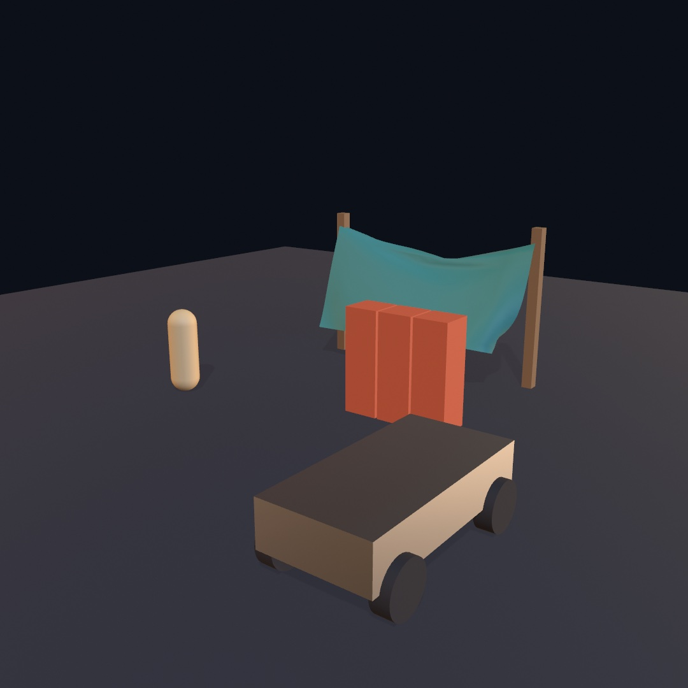
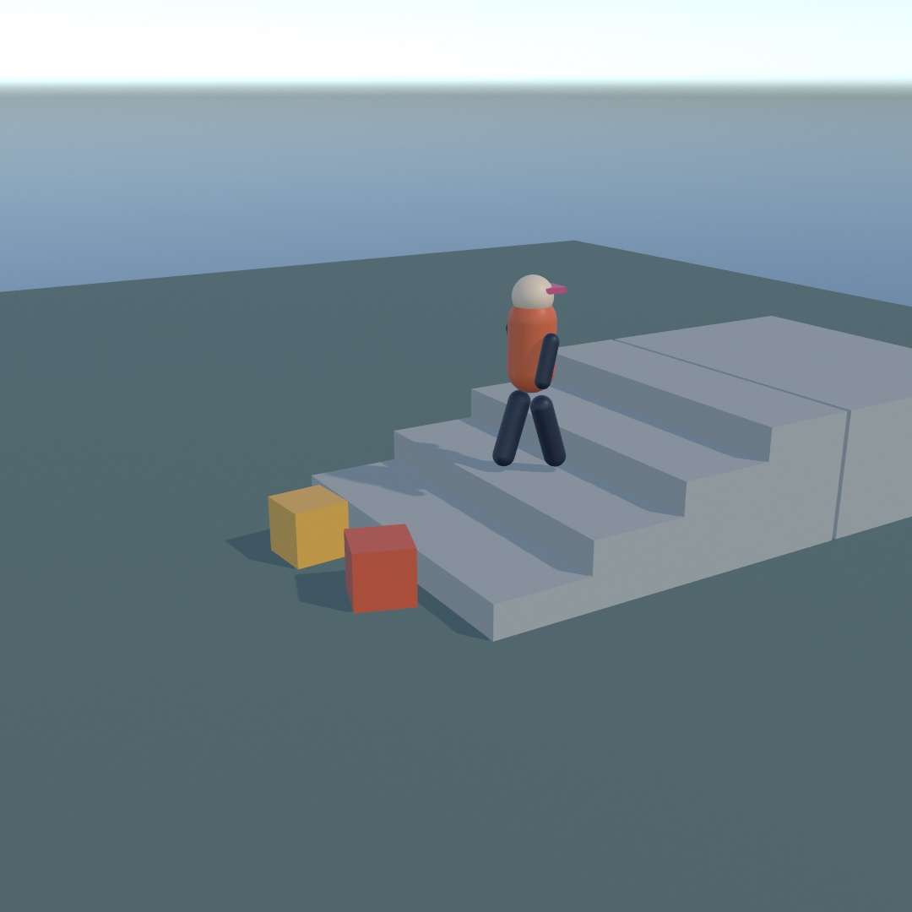
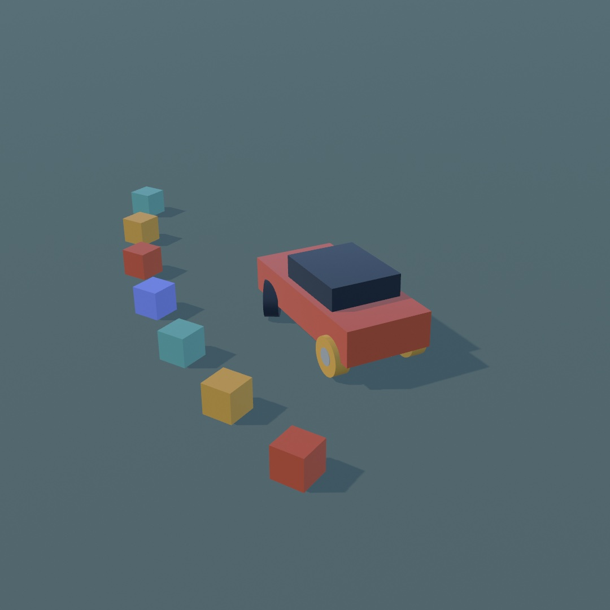
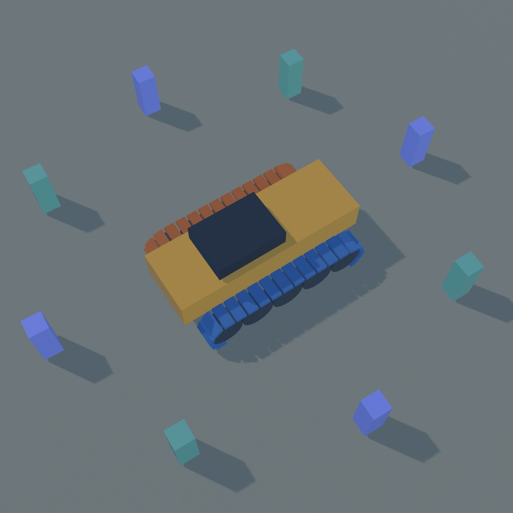
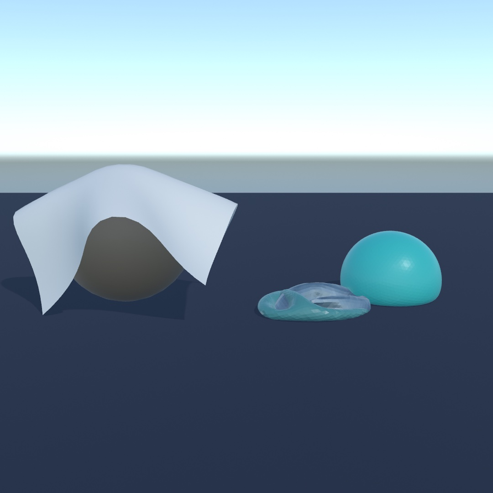
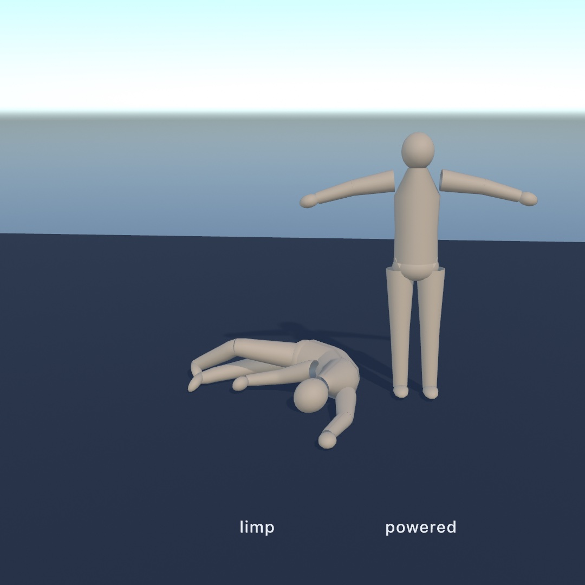
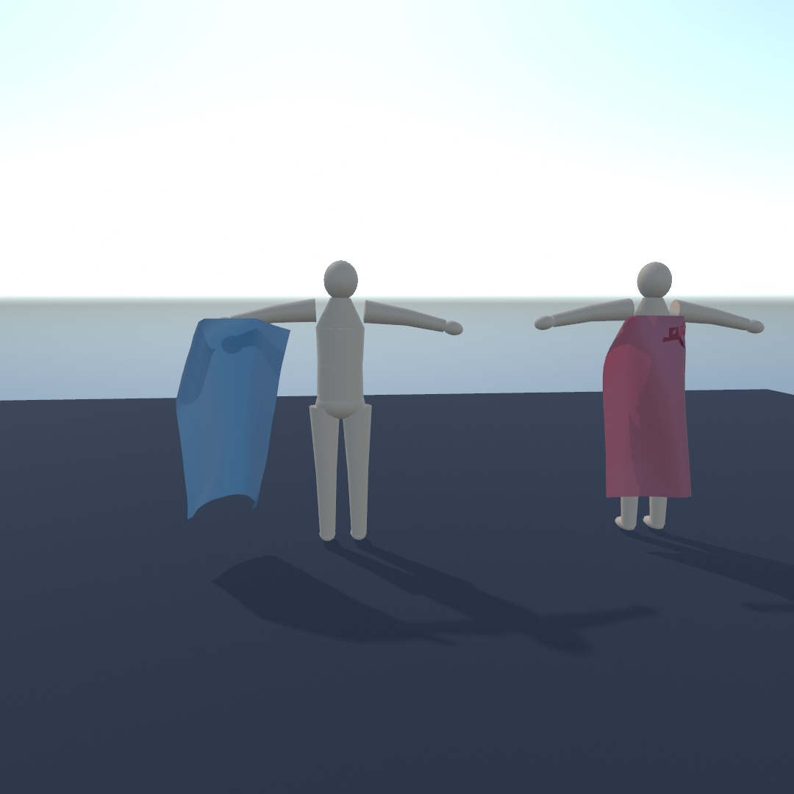
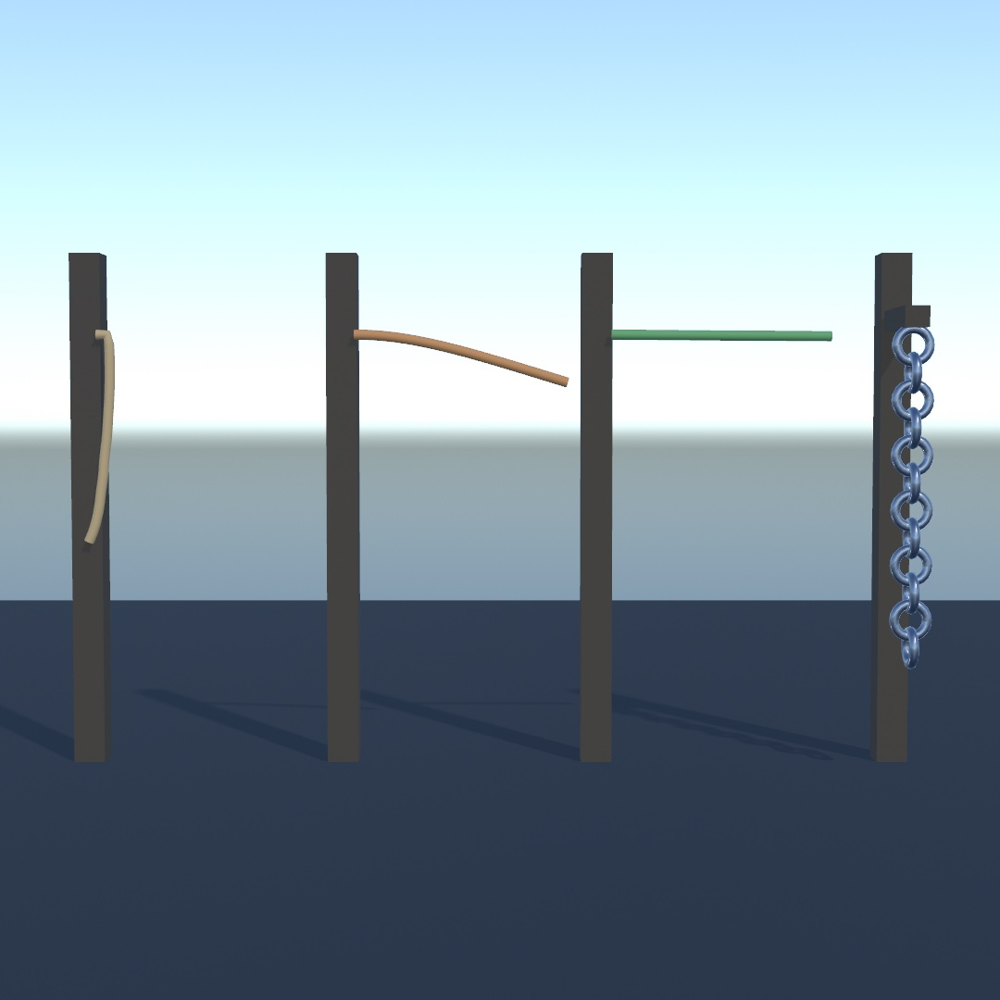
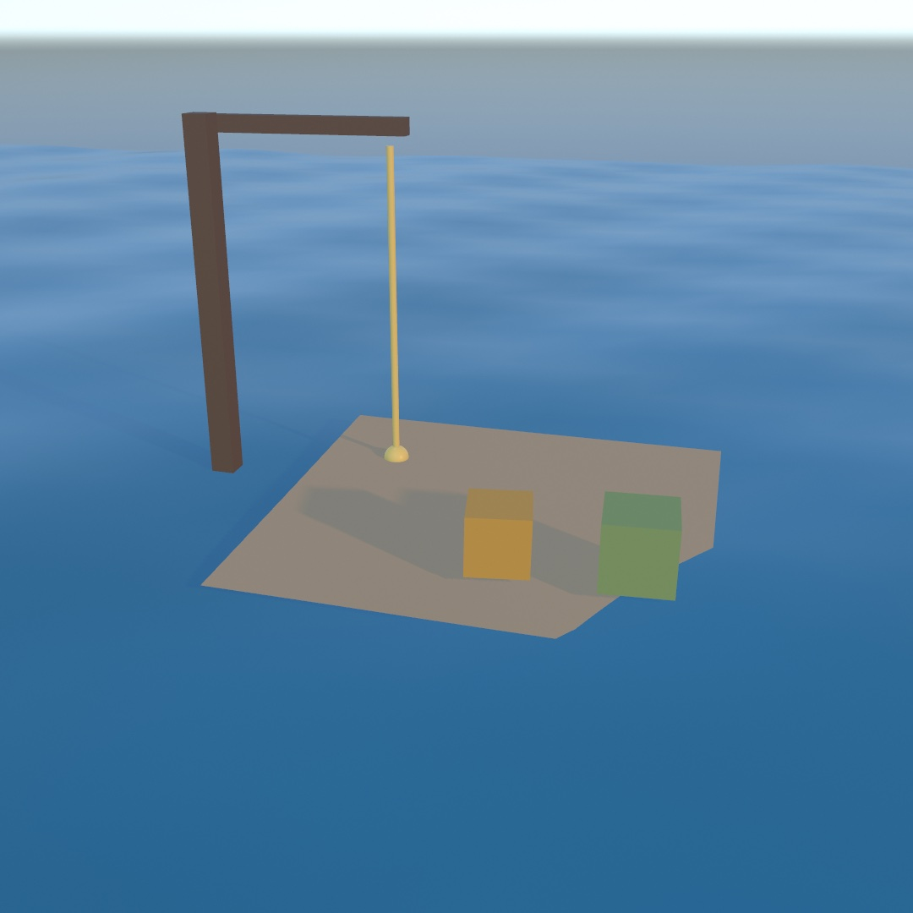

#### <sup>[Ollin](../README.md) → [Guide](README.md) → Chapter 29</sup>

---

# 29. Characters, vehicles, and cloth



This chapter covers three things a rigid body models badly: a person who walks, a vehicle on sprung wheels, and cloth. A rigid body is a good model for a crate. People stay upright and walk instead of tumbling. Wheels grip, spring, and steer instead of sliding. Cloth has no single position at all, because every point of it moves separately. So the solver keeps three more kinds of thing, and each one is held up in its own way.

The yard above has one of each. You walk a figure with the keys, drawn as a plain capsule, and drive the truck with the arrows. The banner is a mesh with two corners pinned. The steps build those three, with a machine on tracks beside the truck. After the yard come their relatives. A figure falls as a ragdoll, a skeleton carries a cape, and a rope knows how it is turned. Then the three kinds join the contacts, the water, and the snapshots of [Chapter 28](28-WorldsWithWeight.md).

## Someone to be in there: the character controller

Everything in [Chapter 28](28-WorldsWithWeight.md) was something you watch. A **character** is something you steer. It is a figure that walks where you send it, climbs what it can climb, and stops at what it can't.

A body with a capsule collider, pushed by forces, does not work for this. A body goes wherever the simulation sends it. Shove it and it tips over, and land it awkwardly and it rolls away. A character is a different kind of thing. It has a shape and it collides, but nothing tumbles it or knocks it down. You hand it a direction and it goes. Game engines call this a character controller, and it is how the people in most 3D games get about.

```swift
walker = world.addCharacter(radius: 0.3, height: 1.8, at: Vector3(0, 2, 0))
```

Steering it is a poll in `draw()`, like the mouse. `moveAxis` reads the W, A, S, and D keys and the arrows as one direction. Each axis runs from -1 to 1, and up on the keys is `(0, -1)`, the way up is on the canvas. `isKeyDown` asks whether one key is held right now, where [Chapter 4](04-Randomness.md)'s `keyPressed()` ran once per press:

```swift
let heading = Vector3(moveAxis.x, 0, moveAxis.y)
walker.walk(at: heading.length > 0 ? heading.normalized * 3 : .zero)
if isKeyDown(" ") { walker.jump() }

world.advance(by: deltaTime)
withCharacter(walker) {
    translate(0, 0.9, 0)          // a capsule is drawn from its middle
    drawCapsule(radius: 0.3, height: 1.2)
}
```

Up on the keys becomes -z, away from a camera that looks down the z axis. The same `world.advance(by:)` moves the character along with the crates, so there is no second update to forget. `walk(at:)` sets the speed it is trying to walk at, and it keeps that speed until you say otherwise. Falling and jumping stay the world's business, which is why you only give it a horizontal direction. `jump` is granted only if the character is on the ground when the step comes round, so holding the key hops rather than flies.



`withCharacter` is `withBody`'s twin, and it puts the origin at the character's **feet**. That makes a figure easy to draw. Model it standing on the floor at the origin, and it stands on the floor in the world. A capsule is the exception, because `drawCapsule` draws from the capsule's middle. Its `height` is the straight part, so the capsule above is 1.8 tall with its round ends. The block lifts it by half of that.

Three numbers decide what the scenery does to it. The values below are the defaults, and the way to learn each one is to break it:

```swift
walker.stepHeight = 0.4           // the tallest step it walks up: a kerb, a stair
walker.maxSlope = .degrees(50)    // the steepest hill it can climb
walker.pushStrength = 100         // how hard it can shove a crate, in newtons
```

Set `stepHeight` to zero and the stairs in the picture become a wall it stands against. Turn `maxSlope` down and a hill it climbed last run stops it halfway. Set `pushStrength` to zero and the two crates it shoved aside stay put, so it stops against them. None of that is scripted. It is the same walk meeting different limits.

A character has two velocities. `walker.velocity` is what it is trying to do, and `walker.actualVelocity` is what the world let it do. Walk into a wall and the first still reads a brisk pace while the second reads nothing. Drive a walk cycle from the second, and the legs stop when the figure stops:

```swift
let pace = Vector2(walker.actualVelocity.x, walker.actualVelocity.z).length
stride += pace * deltaTime * 3.4
```

A character is swept through the world by hand rather than simulated, so strictly it is not in the scene. It carries a stand-in that is: `walker.body`, an ordinary kinematic body inside the capsule. That is what lets everything else notice it, including the sensors of [Chapter 28](28-WorldsWithWeight.md#a-region-that-counts-what-is-inside-sensors):

```swift
if lookout.isTouching(walker.body) { /* you're on the platform */ }
```

So a sensor built for balls works for people, unchanged. The [`3D/Physics/Stroll`](../Examples/3D/Physics/Stroll/) example is an eroded island with stairs up to a lookout that lights as you arrive.

## Something to drive: the vehicle

A character walks. A **vehicle** is a body carried on sprung wheels, with an engine behind the pedal. You don't push it and you don't steer it by force. You press things, as you did for the character.

```swift
car = try world.addVehicle(.box(width: 1.8, height: 0.7, depth: 4),
                           at: Vector3(0, 2, 0),
                           wheels: [
                               .wheel(at: Vector3( 0.9, -0.15,  1.3), steers: true),
                               .wheel(at: Vector3(-0.9, -0.15,  1.3), steers: true),
                               .wheel(at: Vector3( 0.9, -0.15, -1.3), driven: true, handBrake: true),
                               .wheel(at: Vector3(-0.9, -0.15, -1.3), driven: true, handBrake: true),
                           ])
```

That list describes the machine. There are four wheels, placed where you say in the chassis's own coordinates. The front two turn. The back two are the ones the engine reaches and the ones the hand brake grabs. The car drives along its chassis's **+z**, so model whatever you draw facing that way. Game physics calls this a raycast vehicle. Each wheel is a spring with a probe down to the ground rather than a solid that rolls. Ollin's probe is a short swept cylinder by default.

Driving it is the same shape as walking:

```swift
car.throttle = isKeyDown(.upArrow) ? 1 : (isKeyDown(.downArrow) ? -1 : 0)
car.steering = (isKeyDown(.rightArrow) ? 1 : 0) - (isKeyDown(.leftArrow) ? 1 : 0)
car.handBrake = isKeyDown(" ") ? 1 : 0

world.advance(by: deltaTime)

withBody(car.body) { drawBox(width: 1.8, height: 0.7, depth: 4) }
for wheel in car.wheels {
    withWheel(wheel) { drawCylinder(radius: wheel.radius, height: wheel.width) }
}
```

`withWheel` is `withBody` for a wheel. It knows where the suspension put the wheel, how far it has rolled, and which way it is pointing. Draw a cylinder in that block and you get a tire, turned and spinning, without computing any of it.

Press the throttle and hold a full lock, and the car does what a car does. It leans, the inside front wheel goes light, the back tires start sliding, and it comes round. Pull the hand brake as you turn and only the back wheels lock. They are the ones you gave a hand brake to.



The glowing tires are one line. `wheel.slip` is how much a tire is sliding rather than rolling, whether it is spinning or locked. Coloring by it turns a number into something you can see:

```swift
fill(Color.mix(Color(hex: 0x232B36), Color(hex: 0xF2A93B),
               min(1, wheel.slip)))
```

Two settings change how it drives. `suspensionFrequency` on each wheel is the spring, in hertz: around 1.5 is a road car, and at 3 you feel every stone. `topSpeed` is the gearing rather than a promise, the speed the machine tops out at on a flat straight. Turn it down and the car pulls harder off the line and runs out of speed sooner. Both can be changed while you drive, so put them on parameters and drive the same corner three ways. A two-wheeler takes a balancing controller and a raked front fork, and the [reference](../Docs/Simulation/Physics3D.md) has its settings.

The [`3D/Physics/Joyride`](../Examples/3D/Physics/Joyride/) example is a car over an eroded island like the walker's.

### Turning without steering: tracks

A machine on tracks has nothing to turn, so it steers by running one track slower than the other. This is skid steering, the way a tank or a digger turns. It is for heavy machines and anything that should turn on the spot. In Ollin it is the same `addVehicle` call with `isTracked: true`. The wheels become road wheels, split into a left and a right band by which side of the hull you put them on. A wheel at positive x is on the left track.



The ring of posts shows that the machine turned where it stood rather than driving past them. The colors are the two bands:

```swift
var wheels: [Wheel3D] = []
for side in [1.3, -1.3] {
    for i in 0 ..< 5 {
        wheels.append(.wheel(at: Vector3(side, -0.28, -1.8 + Double(i) * 0.9),
                             radius: 0.44, width: 0.6))
    }
}
let crawler = try world.addVehicle(.box(width: 1.75, height: 0.85, depth: 5.2),
                                   at: Vector3(0, 1.2, -3), wheels: wheels,
                                   mass: 4200, engineTorque: 520, topSpeed: 9,
                                   isTracked: true)
```

Throttle and brake mean what they did. Steering runs the inside band slower. At half lock that band stops, and the machine turns about its stopped track. At full lock it runs backwards, one band forward and one back, and the machine spins where it stands. A tracked machine steers with its drivetrain, so it needs throttle to turn at all:

```swift
crawler.throttle = 1
crawler.steering = 1        // turn on the spot
```

`trackSpeed(.left)` and `trackSpeed(.right)` read how fast each band is running over the ground. Painting one warm when that number is positive and cool when it is negative makes a still picture of a turn readable:

```swift
for side in [Vehicle3D.TrackSide.left, .right] {
    fill(crawler.trackSpeed(side) < 0 ? Color(hex: 0x3F6FA8) : Color(hex: 0xC4622A))
    // …draw that band's links…
}
```

Those two numbers are also what you scroll a drawn track by. `wheels(on:)` hands you one band's road wheels, front first, to lay the band around. A tire loses grip once it starts spinning, and a band does not. So a crawler climbs a bank that a car would sit at the bottom of. The reference covers which wheel turns each band, and the [`3D/Physics/Crawler`](../Examples/3D/Physics/Crawler/) example works a quarry on tracks.

## Cloth that finds its own shape: soft bodies

Everything so far moves as one solid piece. A crate can be anywhere, but it is always crate-shaped. A **soft body** is the other kind of thing. The vertices of its mesh are the simulation, held to each other by springs, so it arrives at a shape rather than carrying one around. It is for cloth, flags, balloons, and anything that sags or drapes.

You build one from any mesh you already know how to draw:

```swift
cloth = try world.addSoftBody(from: .plane(width: 3, depth: 3, segments: 24),
                              at: Vector3(0, 3, 0))
```

Then the loop, which has one new call in it:

```swift
world.advance(by: deltaTime)
fill(.beige)
drawSoftBody(cloth)
```

`drawSoftBody` draws the mesh the simulation just arrived at. It is the mesh you handed over, with new positions and new normals. Its texture coordinates, its colors, and its material all carry through, and shadows and reflections treat it like any other mesh. `segments: 24` makes a grid of 25 by 25 vertices, so that sheet is 625 particles. Drop it on a sphere and it drapes over it, each particle finding somewhere to be while the springs between them pull.



Two parameters decide what fabric it is, and they are separate for a good reason:

```swift
stiffness: 1     // how hard it resists being stretched
bend: 0          // how hard it resists being folded
```

A bedsheet barely stretches and folds freely, which is `stiffness: 1, bend: 0`, the defaults. Card is stiff in both. A rubber sheet is low in both. Reach for `bend` when a cloth crumples more than it should, and for `stiffness` when it sags like a net.

Nothing holds a sheet up unless you say so, and the way you say so is `pinned:`. It is handed every vertex of the mesh, in the mesh's own coordinates, and answers yes or no:

```swift
pinned: { $0.z < -1.4 }      // hold the far edge, let the rest hang
```

That closure decides how a sheet hangs. Two corners make a flag, one edge makes a curtain, and a patch in the middle makes a handkerchief held up by its middle. You can change your mind later with `pin` and `unpin`. `move(_:to:)` drags a particle to a point and lets the rest of the cloth follow.

A **closed** mesh can do something a sheet cannot. It holds air:

```swift
ball = try world.addSoftBody(from: .icosphere(radius: 0.5, subdivisions: 3),
                             at: Vector3(0, 2, 0), pressure: 3)
```

`pressure` is in gravities. At `1` the air inside pushes out just hard enough to hold the ball's own weight up. From `2` to `4` it reads as a firm ball that still dents when it lands. Zero is an empty bag, like the slumped ball in the picture. It is a live number, so a ball can go flat while you watch. On a sheet it does nothing, since a sheet has no inside, and Ollin says so once.

A soft body has no single pose for a push to act on, so it has no `applyImpulse`. `applyForce` pushes it, spread over all its particles, and it is how you make wind:

```swift
banner.applyForce(Vector3(0, 0, gust))
```

Soft bodies collide with the rigid world but not with each other or with themselves, so a sheet folded double passes through its own layers. The [`3D/Physics/Drape`](../Examples/3D/Physics/Drape/) example has a banner on a washing line, a sheet over a crate, and a ball you can let the air out of. You can drag all three.

## Putting it together: the yard

The yard at the top of the chapter uses all three steps. The figure is a character you walk with W, A, S, and D. The truck is a vehicle you drive with the arrows. The banner is a soft body pinned at two corners, with the wind on it. Make a new file, `MySketches/Yard.swift`:

```swift
import Foundation
import Ollin
import OllinPhysics

final class Yard: Sketch {
    @Param("Wind", 0.0...14.0) var wind = 7.0

    let world = World3D()
    let bannerMesh = Mesh.plane(width: 5, depth: 2.4, segments: 16)

    var truck: Vehicle3D?
    var pacer: Character3D?
    var banner: SoftBody3D?

    let clay = Color(hex: 0xD2603F)
    let timber = Color(hex: 0x8A6A4A)
    let teal = Color(hex: 0x3E8E86)

    override func setup() {
        world.ground = 0

        // A floor body for the drawing loop to draw. `world.ground` already
        // holds everything up, but it stays out of `world.bodies`, so the
        // loop below would never see it.
        let floor = world.addBody(.box(width: 34, height: 0.4, depth: 34),
                                  at: Vector3(0, -0.2, 0), kind: .static)
        floor.userData = Color(hex: 0x2C3340)

        // Four wheels: the front pair steers, the back pair is driven and
        // takes the hand brake. The spring is shorter than the default so the
        // body sits down on its wheels rather than up on stilts.
        let wheels = [Vector3(0.85, -0.28, 1.2), Vector3(-0.85, -0.28, 1.2),
                      Vector3(0.85, -0.28, -1.2), Vector3(-0.85, -0.28, -1.2)]
            .enumerated().map { index, mount -> Wheel3D in
                let wheel = Wheel3D.wheel(at: mount, radius: 0.38, width: 0.28,
                                          steers: index < 2, driven: index >= 2,
                                          handBrake: index >= 2)
                wheel.suspensionLength = 0.26
                wheel.suspensionTravel = 0.2
                return wheel
            }
        truck = try? world.addVehicle(.box(width: 1.7, height: 0.7, depth: 3.4),
                                 at: Vector3(2.6, 1.3, 3.0), wheels: wheels,
                                 mass: 1400, engineTorque: 520, topSpeed: 16,
                                 rotated: .pi, axis: .unitY)

        pacer = world.addCharacter(radius: 0.3, height: 1.75, at: Vector3(-4.4, 1.0, 0.4))

        // A soft body is its mesh. Pinning the two top corners is what turns a
        // sheet into a banner rather than a dropped cloth.
        banner = try? world.addSoftBody(from: bannerMesh, at: Vector3(-1.2, 3.1, -4.2),
                                   mass: 1.2, stiffness: 0.7, damping: 0.2,
                                   pinned: { $0.z < -1.0 && abs($0.x) > 2.2 })

        for post in [-3.7, 1.3] {
            let p = world.addBody(.box(width: 0.22, height: 3.4, depth: 0.22),
                                  at: Vector3(post, 1.7, -4.2), kind: .static)
            p.userData = timber
        }

        for i in 0 ..< 9 {
            let crate = world.addBody(.box(width: 0.7, height: 0.7, depth: 0.7),
                                      at: Vector3(-0.6 + Double(i % 3) * 0.75,
                                                  0.4 + Double(i / 3) * 0.72, -1.0))
            crate.userData = clay
        }

        // Let the yard settle before anybody looks at it.
        for _ in 0 ..< 180 { world.advance(by: 1.0 / 60) }
    }

    override func draw() {
        background(Color(hex: 0x0C1018))
        environment(.courtyard.lightingOnly())
        lightingPreset(.studio)
        castShadows()
        perspective(eye: Vector3(7.4, 5.2, 10.4), target: Vector3(-1.1, 1.3, -0.8),
                    fieldOfView: 0.86)

        // The arrows drive the truck, and space pulls its hand brake.
        if let truck {
            truck.throttle = isKeyDown(.upArrow) ? 1 : (isKeyDown(.downArrow) ? -1 : 0)
            truck.steering = (isKeyDown(.rightArrow) ? 1 : 0) - (isKeyDown(.leftArrow) ? 1 : 0)
            truck.handBrake = isKeyDown(" ") ? 1 : 0
        }

        // W, A, S and D walk the figure. `walk(at:)` keeps the velocity it is
        // given, so letting go of the keys has to hand it zero.
        if let pacer {
            let ahead = (isKeyDown("w") ? 1.0 : 0) - (isKeyDown("s") ? 1.0 : 0)
            let across = (isKeyDown("d") ? 1.0 : 0) - (isKeyDown("a") ? 1.0 : 0)
            let heading = Vector3(across, 0, -ahead)
            pacer.walk(at: heading.length > 0 ? heading.normalized * 2.5 : .zero)
        }
        banner?.applyForce(Vector3(sin(time * 1.3) * wind, 0, wind * 0.4))
        world.advance(by: deltaTime)

        noStroke()
        for body in world.bodies where body !== truck?.body {
            fill((body.userData as? Color) ?? .white)
            material(.dielectric(roughness: 0.7))
            withBody(body) {
                if case .box(let w, let h, let d) = body.collider {
                    drawBox(width: w, height: h, depth: d)
                }
            }
        }

        if let truck {
            fill(Color(hex: 0xC7CDD6))
            material(.metal(roughness: 0.35))
            withBody(truck.body) { drawBox(width: 1.7, height: 0.7, depth: 3.4) }
            fill(Color(hex: 0x22262E))
            material(.dielectric(roughness: 0.8))
            for wheel in truck.wheels {
                withWheel(wheel) { drawCylinder(radius: 0.38, height: 0.28) }
            }
        }

        // A character is a swept capsule with no mesh of its own, so something
        // has to stand in for the body it is carrying.
        if let pacer {
            fill(Color(hex: 0xE0C089))
            material(.dielectric(roughness: 0.6))
            // `withCharacter` puts the origin at the character's feet, so
            // the capsule has to be lifted by half its own height.
            withCharacter(pacer) {
                translate(0, 0.875, 0)
                drawCapsule(radius: 0.3, height: 1.15)
            }
        }

        if let banner {
            fill(teal)
            material(.dielectric(roughness: 0.55))
            drawSoftBody(banner)
        }
    }
}
```

Run it, click the canvas so it has the keys, and drive. Here is how the steps show up in it:

- **The character controller.** The figure is `addCharacter`, walked by `walk(at:)` and drawn inside `withCharacter`. It stands on `world.ground` like everything else. The floor body at the same height is there to be drawn, since the ground stays out of `world.bodies`.
- **The vehicle.** The truck is `addVehicle` with four wheels, the front pair steering and the back pair driven and braked. It reads the arrows as the vehicle step did, and it is drawn with `withBody` for the chassis and `withWheel` for each tire. `suspensionLength` and `suspensionTravel` shorten each spring and how far it moves, so the body sits down on its wheels. `mass` is the truck's weight and `engineTorque` how hard the engine pulls. `rotated:axis:` turns it half a turn to face into the yard.
- **Soft bodies.** The banner is `addSoftBody(from:)` over a plane. `pinned:` holds the two top corners, and `applyForce` is the wind, swinging from side to side with `sin(time * 1.3)`.
- The figure reads W, A, S, and D with `isKeyDown` rather than `moveAxis`. `moveAxis` reads the arrows too, and the arrows belong to the truck. `walk(at:)` keeps the velocity it is given, so the figure is handed zero when no key is held.
- The truck's body is in `world.bodies` like everything else, so the loop over bodies skips it with `!==`. Otherwise it would be drawn twice, once as a plain box and once as a truck.
- `withCharacter` puts the origin at the figure's feet. That suits a model standing on the ground, and a capsule measured from its middle has to be lifted by half its height.

> **Swift note.** `[...].enumerated().map { index, mount -> Wheel3D in ... }` builds the four wheels from the four mounts. [Chapter 2](02-Color.md)'s `enumerated()` hands each mount its position in the list. The closure names its result type, as [Chapter 15](15-ShapesAsMaterial.md)'s typed closures did, and `return` hands the finished wheel back. `if case .box(let w, let h, let d) = body.collider` is the one-case form of [Chapter 28](28-WorldsWithWeight.md)'s `switch`. It runs its block only for a box, with the three sizes named. `!==` asks whether two names point at different objects, the opposite of `===`.

Before moving on, make it yours:

- Widen the `pinned:` test to hold the whole top edge, and the banner hangs like a curtain in the wind.
- Give the truck a ramp made of a tilted static box, and drive at it.
- Put `stepHeight` and `maxSlope` on the figure, and walk it up a stack of static boxes.

The yard waits for you to drive it, so film it while you play. `swift run OllinLive MySketches/Yard.swift --record` records from the first frame until you quit, keys and all. An export such as `--export-video` steps on its own clock with nobody at the keys, so it keeps only the banner in the wind. [Chapter 39](39-Performing.md#keeping-the-take) covers recording in full.

## A figure that falls: ragdolls

The yard's figure is a character, and nothing ever knocks a character over. Sometimes a figure should fall. A ragdoll is a figure built from rigid bodies, one for each part of its skeleton, so it falls like something with weight in it.

### Letting a figure fall: the ragdoll

In [Chapter 26](26-Meshes.md#motion-the-file-remembers-animations-skins-and-morph-targets) a skinned mesh moved because keyframe tracks told its joints where to be. That is animation, the same pose every time, whatever else is happening. A **ragdoll** is the other answer, and the world decides where the limbs go. It is for a figure that is hit, thrown, or dropped. Thomas Jakobsen's 2001 talk *Advanced Character Physics* described the one in the game *Hitman: Codename 47*. There a body fell differently depending on where it was hit.



Hand `addRagdoll` the same loaded scene and it reads the skeleton. It builds a rigid body for every joint and hangs each one off its parent on a ball joint with a cone-shaped limit:

```swift
figure = try! loadScene("figure.gltf")
ragdoll = try world.addRagdoll(from: figure, at: Vector3(0, 3, 0))
```

Each limb's shape is fitted to the figure's own mesh rather than guessed from bone lengths. The vertices a joint pulls hardest on are gathered up, and a capsule is laid along the way they spread. So a torso comes out thick and a forearm thin, from two bones of similar length. You never say how wide anything is.

The loop is one line longer than an animation's:

```swift
world.advance(by: deltaTime)
figure.apply(ragdoll)     // the pose the solver just found
drawScene(figure)
```

`figure.apply(ragdoll)` is `apply(_:at:)` run backwards. Instead of a keyframe track posing the joints, the simulated bodies do. Everything after that carries on as if a track had, including the skin, the materials, and the shadows. Drop the figure and it falls like something with weight in it, because it is. The left figure in the picture is that fall.

Every limb is an ordinary body, so you can grab one with the mouse and drag the figure around by an arm. The limbs of one figure never collide with each other, so a thigh does not fight the pelvis it sits inside. Two figures still knock into each other.

### A figure that tries to stand: powered ragdolls

A plain ragdoll lies where it lands forever. A powered ragdoll has a motor in every joint pulling toward a pose, so an animation becomes a request the world can refuse. It is for a figure you can push that pushes back. The right figure in the picture is the same drop with the motors on. They pull at a `strength` of 260 toward the pose it was built in, so it lands and stands.

```swift
var target = figure                      // a second copy, for the animation to pose
if let walk = figure.animation("walk") {
    target.apply(walk, at: time.truncatingRemainder(dividingBy: walk.duration))
}                                        // where the animation wants the limbs
ragdoll.drive(toward: target, strength: 140)
world.advance(by: deltaTime)
figure.apply(ragdoll)                    // where they actually ended up
```

Push the figure and it resists, gives, and comes back. Keep two copies of the scene. The animation poses one, the target, and the solver poses the other, the one you draw. A `Scene` is a value type, so the copy is one assignment. A figure driven toward the scene it was just posed from has nowhere left to pull.

`strength` is the parameter to play with. It is the most torque a joint may use. Set high, it holds the figure in the pose however it is pushed. Set low, the heavy limbs sag out of the pose, and the figure reads as tired rather than switched off.

Nothing drives the root, so a powered figure still falls over as a whole. The motors hold its shape, not its place. Make the hips kinematic, with `ragdoll.limbs[0].body.kind = .kinematic`, and it hangs there like a puppet on a hook. The [`3D/Physics/Ragdoll`](../Examples/3D/Physics/Ragdoll/) example does this, and space lets the hips go.

## More cloth: a cape and a rope

The yard's banner is a sheet held still at two corners. Cloth can also be carried by a moving figure, and a soft body can be a line instead of a sheet.

### A cape on someone's back: cloth a skeleton carries

A carried cloth is held to the joints of a moving figure instead of to fixed points in the world. The rest of it hangs off them. It is for capes, skirts, and banners carried by a figure. Games tie cloth to a character's skeleton this way, so the cloth follows the body without colliding its way along. The ragdoll's skinned figure already has the moving thing in it, a skeleton, so you name which joint carries which part of the cloth:



```swift
let sheet = Mesh.plane(width: 0.8, depth: 1.2, segments: 18)
cape = try world.addSoftBody(from: sheet, at: Vector3(0, 0.875, -0.13),
                             rotated: .pi / 2, axis: Vector3(1, 0, 0),
                             pinned: { $0.z < -0.55 && abs($0.x) < 0.2 },   // a clasp at the neck
                             skinnedTo: figure,
                             carriedBy: { _ in "chest" })
```

Both figures in the picture are carried along the same path. The only difference is that the right cape names a joint and the left one does not. Then one call a frame, after the figure is posed and before the world steps:

```swift
figure.apply(ragdoll)
cape.follow(figure)
world.advance(by: deltaTime)
```

Nothing was painted in a modeling tool to make that work. The pose the figure is standing in when you build the cloth is the bind pose, the pose everything after is measured from. So you hang the cape where it belongs and name the joints. Everything the figure does after that is read as motion away from that pose. `carriedBy:` is handed a vertex in the mesh's own coordinates, the same ones `pinned:` gets. It answers with a joint's name, or `nil` for a part that is just cloth.

`pinned:` keeps its meaning here. A pinned vertex is held by whatever holds it. When a joint carries it, it is held to the figure. When no joint does, it is held to the world, as the banner's corners were.

Three settings shape what the loose part may do:

```swift
sway: { _ in 0.05 },   // how far from the skin each vertex may get
backStop: 0.05,        // how far into the figure's back it may be pushed
maxStretch: 1.02       // how far it may reach, as a multiple of its rest length
```

`sway` is a leash, a distance in world units that the closure can vary from vertex to vertex. At `0` it holds that part to the skin, and `0.05` means five centimeters. Left out, the leash is endless and the cloth swings freely. `backStop` is a distance too. `backStop` keeps the cape out of the back it hangs on without waiting for a collision to sort it out. `maxStretch` helps even for cloth no figure carries. It is a long-range attachment, the method of Tae-Yong Kim, Nuttapong Chentanez, and Matthias Müller-Fischer for cloth that must not stretch. A heavy sheet hung from one edge stretches under its own weight, however stiff you make it. A `maxStretch` of `1`, its own rest length and no more, stops that.

Two settings work while it runs. `cape.swayScale` multiplies every leash at once, and `cape.followsSkin = false` drops the leashes, leaving only the clasp. The [`3D/Physics/Cape`](../Examples/3D/Physics/Cape/) example puts `followsSkin` on the F key, with a figure you can knock over so the cape comes down with it.

### A line that knows how it is turned: ropes

A rope is a soft body built from a line of points instead of a sheet. It is for anything long and thin that hangs or bends: a rope, a cable, a chain, a vine, or the stem of a plant. Each of its segments carries an orientation of its own. That comes from the discrete Cosserat rods of Tobias Kugelstadt and Elmar Schoemer (2016), which the solver implements.



You build one from a list of points:

```swift
let rope = try world.addRope(through: (0 ..< 40).map { Vector3(0, -Double($0) * 0.1, 0) },
                             at: Vector3(0, 3, 0),
                             radius: 0.02,
                             pinned: { $0.y > -0.001 })      // hung from the top
```

Anything that makes points makes a rope. That list could come from a `Contour`, a sampled `Path`, a `randomWalk`, or a ridge you read off a `Heightfield`. The points become the particles one for one, so `pin`, `move(_:to:)`, and `positions` all speak in indices into the list you handed over. `drawSoftBody(rope)` sweeps a tube of that `radius` along it. It lands on things, takes `applyForce` for wind, and can be dragged with `grabSoftBody`.

Two parameters shape it, and both mean the same thing on a twig and on a mooring line:

```swift
stiffness: 1,      // how much it resists being stretched
bend: 0            // how much it resists being bent
```

`bend` decides what the rope is. At `0` it is limp rope. Around `0.5` a length sticking out sideways droops about a quarter of its own length, which reads as heavy cable. Near `1` it holds itself out like a stem. The three lines on the left of the picture were built as the same straight line sticking out from their posts. They differ in that one number.

The fourth line is where a rope stops being a line of points. You read each segment's orientation with `rope.segments`. `withSegment(_:)` stands the transform stack in the middle of one, with +y running along the rope. It is the rope's `withBody(_:)`. A cylinder or a capsule drawn inside the block already lies the right way:

```swift
for segment in chain.segments {
    withSegment(segment) {
        rotate(.pi / 2, axis: Vector3(1, 0, 0))       // lay the ring across the rope
        if segment.index.isMultiple(of: 2) {
            rotate(.pi / 2, axis: Vector3(0, 0, 1))   // roll every other link
        }
        drawTorus(radius: segment.length * 0.6, tube: 0.028)
    }
}
```

That second `rotate` makes the chain. Rolling every other link a quarter turn about the rope's own axis is what makes the links interlock. You can only ask that of something that knows how it is rolled. Three points in a row tell you which way a line is going, and nothing about which way is up. Leaves along a stem, rings on a flag, and beads on a string all use the same move.

Before you build something long, two settings help. `maxStretch: 1` caps how far a rope may reach from what holds it, which stops a heavy one creeping longer under load. Stiffness travels one segment per solver pass, so a long rope divided finely needs more passes than the default five before a high `bend` holds. Forty points over six units wants about twenty.

A rope does not collide with itself, so a coil passes through its own turns. It also has no surface for a ray to hit, so `raycast` and the other queries look straight through one. The mouse still finds it. It is a single strand, so a plant with three stems is three ropes. The [`3D/Physics/Rigging`](../Examples/3D/Physics/Rigging/) example has a rope, a chain, and a leafy vine hanging in the same wind.

## The rest of the world: contacts, water, and snapshots

The yard never asks its world what touched what, never floats anything, and never saves itself. [Chapter 28](28-WorldsWithWeight.md)'s families did all three for rigid bodies. The figures, vehicles, cloth, and ropes of this chapter take part in each of them too.

### A cloth among the contacts

A cloth is an ordinary member of the world when something touches it. It turns up in `world.contacts`, the list from [Chapter 28](28-WorldsWithWeight.md#what-hit-what-contacts). A crate landing on a sheet reports where it hit and how hard, like a crate landing on the floor:

```swift
for contact in world.contacts where contact.phase == .began {
    splash(at: contact.point, size: contact.speed)
}
```

A contact names `any Colliding3D`, not `Body3D`. Either side may be a cloth, and a cloth is not something you can push with an impulse or hang a joint from. When you want to act on what you found, say which kind you were after:

```swift
if let crate = contact.other(than: cloth) as? Body3D {
    crate.applyImpulse(Vector3(0, 3, 0))
}
```

Everything else about touching works as it does for a crate. `cloth.touching` is what is lying on it, and a sensor sees the cloth pass into it. `raycast` stops at cloth, so a curtain blocks a sight line. One difference is useful to know. A settled pile of crates falls asleep and stops reporting its touches, while a settled cloth keeps its list.

### A raft made of cloth: soft bodies that float

The sheet you draped floats too, in the water [Chapter 28](28-WorldsWithWeight.md#water-and-what-it-holds-up-buoyancy) put into the world. It is for rafts, lily pads, and sails on the sea. Floating it is one number:



```swift
raft.density = 0.25          // rides high; above 1 it sinks
```

That reads like a crate's `density`, and it means the same thing: how heavy the thing is for its size, against the water. A closed soft body works its own out, because a mass and a volume are all it takes and a beach ball has both. A sheet has no inside, so there is nothing to work it out from. It starts as heavy as water, lying awash in the surface the way a wet sheet does, and the line above makes it a raft.

Cloth in water behaves like cloth. Its area for its weight is large, and drag is what measures that. So a heavy sheet sinks slowly, and a floating one is carried along by a current rather than left standing in it. The [`3D/Physics/Raft`](../Examples/3D/Physics/Raft/) example puts a cloth raft on a swell with cargo on it. A sounding line shortens onto her deck when you sail her under it, and a harbor gate lights when she passes through. Drag the deck to steer.

### Snapshots of figures, vehicles, and cloth

[Chapter 28](28-WorldsWithWeight.md#keeping-what-settled-snapshots) saved a settled heap with `snapshot()` and brought it back exact. The things in this chapter come back too. A character comes back mid-stride. A vehicle comes back drivable and still under power, with its engine turning at the speed it was turning and its wheels already spinning. A ragdoll comes back where it fell.

A ragdoll was built from a skinned figure loaded off disk, and the snapshot does not carry that mesh. What the solver holds is a shape per limb, the tree they hang in, and how far each joint may bend. All of that is small enough to write down. The skin stays your asset, in your sketch, loaded the ordinary way. `figure.apply(ragdoll)` puts the two halves back together:

```swift
try world.restore(saved)
if let ragdoll = world.ragdolls.first {   // the bodies are new ones
    figure.apply(ragdoll)                 // your mesh, over the restored pose
}
```

Restoring empties the world first, so a `Vehicle3D` or a `Character3D` you were holding onto is gone, like the bodies. Take them from `world.vehicles` and `world.characters` again.

A cloth needs one more step. It is nothing but its mesh, so it is saved only under a name, the way [Chapter 28](28-WorldsWithWeight.md#a-large-collider-saved-by-name-assetname) named a terrain collider:

```swift
banner?.assetName = "banner"
```

The resolver then hands the mesh back on the way in:

```swift
try world.restore(saved) { name in
    name == "banner" ? .mesh(sheet) : nil
}
```

The [`3D/Physics/Yard`](../Examples/3D/Physics/Yard/) example keeps a whole yard, with a truck in it, a figure pacing across, and another lying where it fell. Wreck it by driving the truck through it with the arrow keys, then press R and it is back exactly. Press S, quit, and run it again, and the same yard is standing there. Its terrain floor and its banner are named by the file rather than held in it.

## Where this comes from

Each of the three kinds on the spine exists because a rigid body is not enough. The character controller, a capsule that is moved rather than pushed, comes from games, where a person simulated as a rigid body falls over. The raycast vehicle comes from the same practice. Its chassis is one body, and each wheel is a spring and a ray. Simulating what a wheel does is much easier than simulating four real wheels well. Both run on [Jolt Physics](https://github.com/jrouwe/JoltPhysics) by Jorrit Rouwe, the solver under [Chapter 28](28-WorldsWithWeight.md), whose vehicle follows Marco Monster's *Car Physics for Games*.

The soft bodies have an academic line you can follow. Position-based dynamics moves points directly to satisfy constraints instead of integrating forces. Ollin's 2D particles in [Chapter 11](11-ForcesAndPhysics.md) follow Thomas Jakobsen's *Advanced Character Physics* from 2001, the talk that made the technique widely known. The 3D soft bodies are solved with its extended form, XPBD, as Matthias Müller presents it in his *Ten Minute Physics* lessons. The entries after the yard name their own sources, and the full credits are in the project's [attribution notes](../ATTRIBUTION.md).

## Go deeper

- [3D physics](../Docs/Simulation/Physics3D.md): the full reference for characters, vehicles (the two-wheeler and the tracked machine's sprocket included), ragdolls, soft bodies, ropes, and buoyancy, with every parameter on the suspension and the cloth solver, and what a snapshot keeps for each.
- Appendix B draws what the solvers are doing: [Vectors, motion, and forces](B-JustEnoughMath.md#vectors-motion-and-forces), and [Local rules, global structure](B-JustEnoughMath.md#local-rules-global-structure) for the constraint relaxation.
- Worked examples, in [`Examples/3D/Physics/`](../Examples/3D/Physics/): `Stroll` and `Crawler` (a character and a tracked machine), `Joyride` (the vehicle with its parameters live), `Ragdoll` and `Cape` (a figure and the cloth on its back), `Drape`, `Raft`, and `Rigging` (cloth, cloth on water, and ropes), `Chain` (capsule links on ball joints), and `Yard`, which is this sketch with a saved world, an animated figure, and more going on.
- The Gego homage [`Reticularea`](../Examples/Recreations/Gego/Reticularea/Sketch.swift): a soft body whose mesh the sketch builds rather than loads. It is an irregular net of triangles, held at eight of its vertices and left to hang. Each frame `move(_:to:)` holds those eight points, drifting a little, so the air moves the whole net. `positions` is read back to draw the net as lines.

---

[Contents](README.md#contents) · Previous: [Chapter 28, Worlds with weight](28-WorldsWithWeight.md) · Next: [Chapter 30, Sculpting with fields](30-SculptingWithFields.md)
