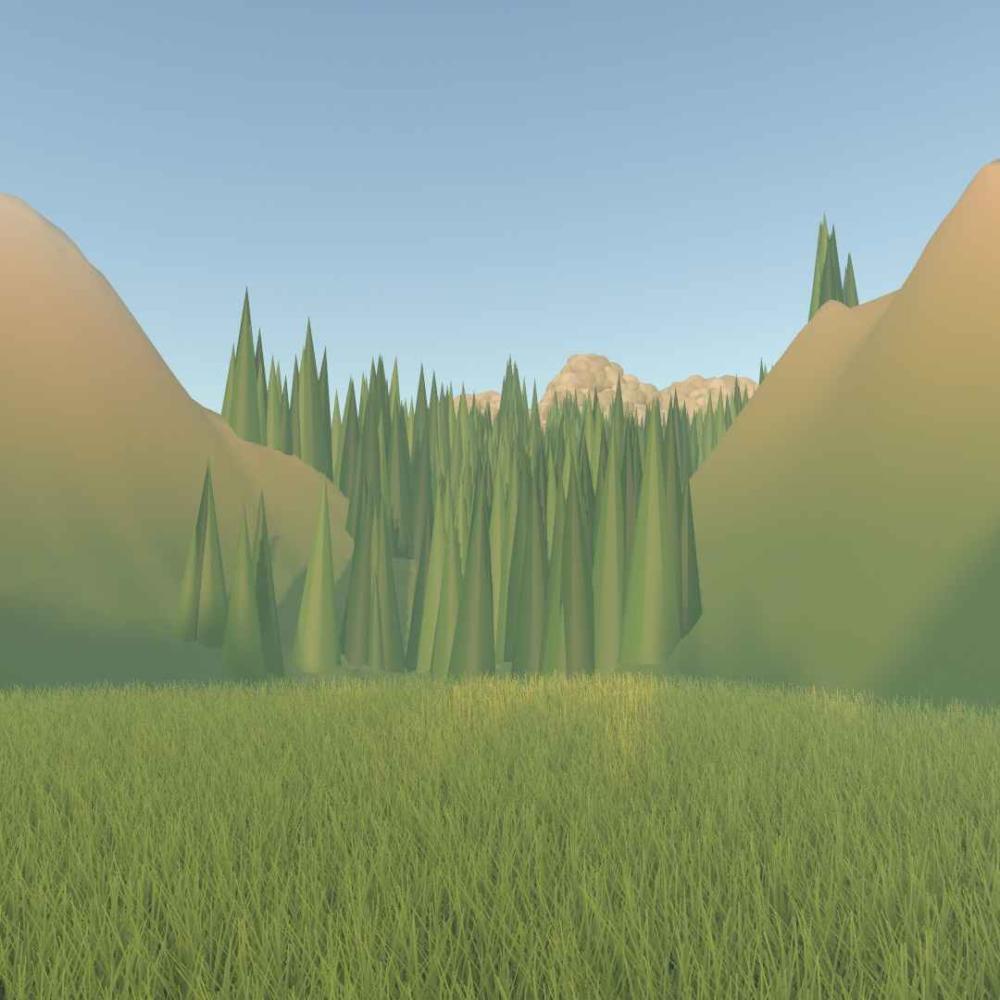
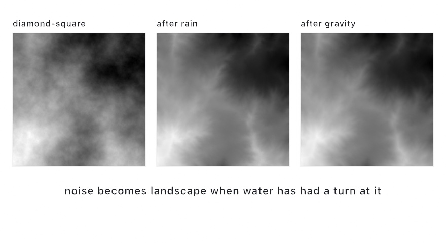
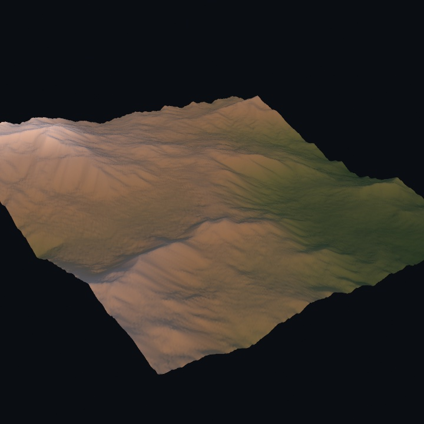
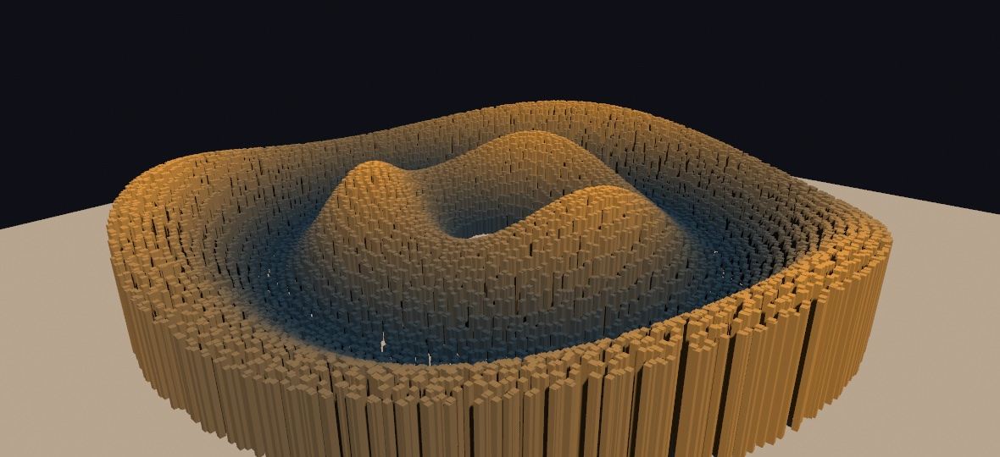
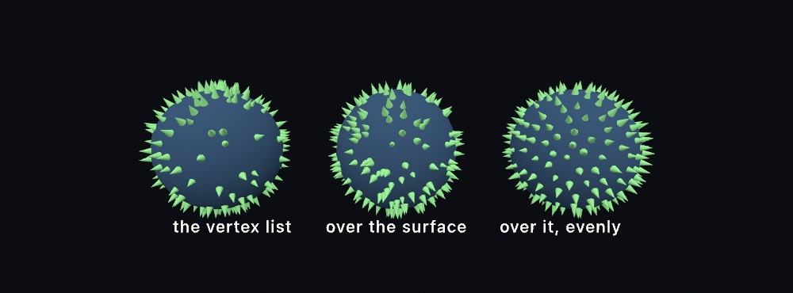
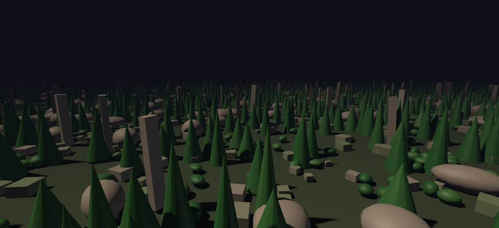
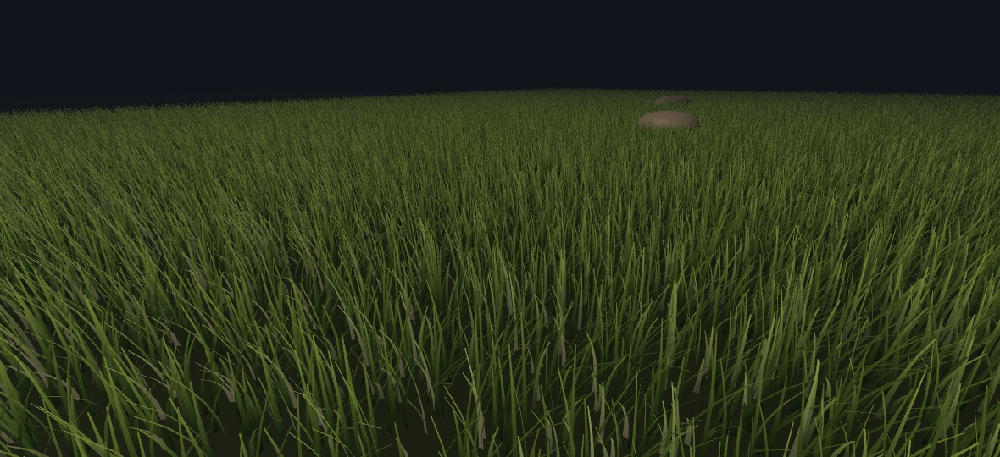
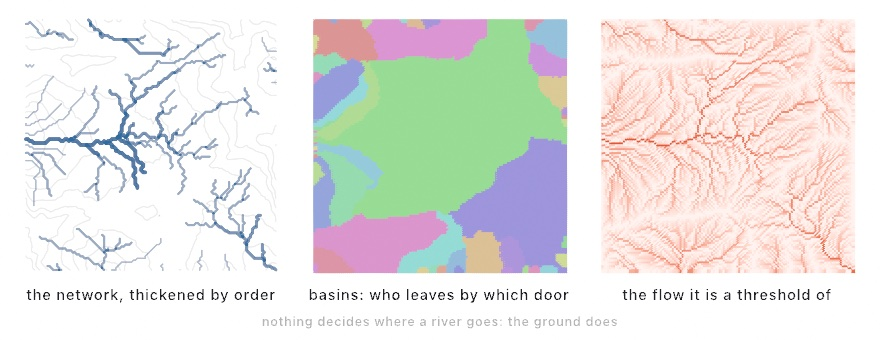
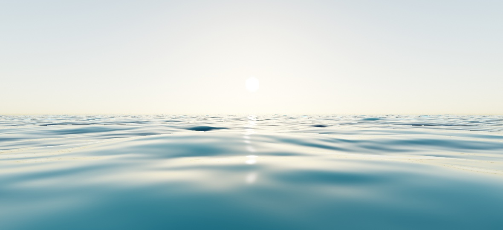
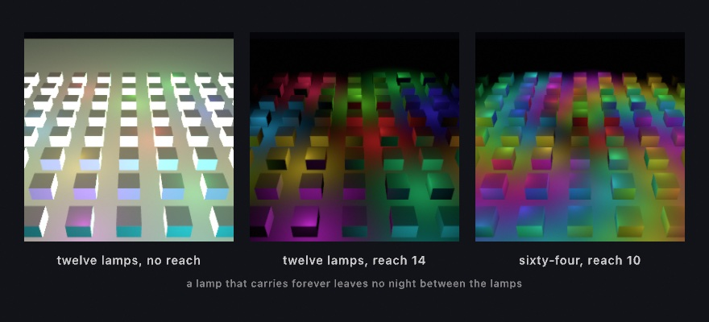

#### <sup>[Ollin](../README.md) → [Guide](README.md) → Chapter 29</sup>

---

# 29. Landscapes and multitudes



A landscape holds more than you could arrange yourself, so you grow the ground from noise and rain and hand the placing to the GPU. Ten thousand copies of a mesh go down in one call, a world is cut to the view, and grass is never built. No tree in the valley above was placed by hand. Rivers, a sea, and a courtyard of lamps that each light only their own corner follow it.

## A landscape you grow: heightfields and erosion

A mesh you load is a shape somebody else made. A mesh you generate is one nobody has seen, and terrain is the friendliest place to start. A landscape is a height for every point on a grid, and Ollin has a type for that.

```swift
let land = Heightfield.diamondSquare(size: 257, roughness: 0.55, seed: 7)
drawMesh(land.mesh(width: 10, depth: 10, height: 2.2))
```

A `Heightfield` holds heights between 0 and 1, and you can grow one from any field you like, including everything [Chapter 5](05-Noise.md) taught. `Heightfield(columns: 257, rows: 257) { u, v in fbm(u * 3, v * 3, octaves: 6) }` makes rolling hills. Swapping in `ridgedFbm` creases them into ridges. The `diamondSquare` form above is the classic terrain fractal instead. Set the four corners. Then fill in each square's center and each edge's midpoint with the average of its neighbors plus a random nudge, and repeat. The grid step halves and the nudge shrinks each round. `roughness` controls how fast the nudges shrink, and values around 0.5, the default, read as landscape. The `size` rounds up to the grid the subdivision needs, which is why it wants numbers like 129, 257, or 513.

Noise alone gives you a cloud of heights rather than land. Land looks the way it does because water has been running down it for a very long time.

```swift
let weathered = land
    .eroded(.hydraulic(drops: 50_000), seed: 7)
    .eroded(.thermal(talus: 0.012, iterations: 30))
```

<picture>
  <source media="(prefers-color-scheme: dark)" srcset="Images/29-Landscapes/Erosion-dark.jpg">
  
</picture>

`.hydraulic` drops tens of thousands of simulated raindrops on the terrain. Each one lands somewhere random and rolls downhill. It picks up sediment while it's moving fast, and drops that sediment again as it slows down or dries out. No single drop does much. Fifty thousand of them agree with each other about where the valleys are, and branching drainage networks appear that layered noise does not give you. The middle panel above shows the difference.

`.thermal` is gravity's half of the job. Wherever two neighboring samples differ by more than `talus`, some of that excess slides to the lower one. Cliffs shed into scree slopes, and spikes settle to an angle they can hold. It's a smaller change than rain. The third panel shows a gentler version of the second rather than a different landscape, which is what weathering looks like.



Once the field is shaped, it reads out three ways. `mesh(width:depth:height:)` gives you a solid mesh with smooth normals. `image()` gives you the grayscale heightmap, which is what the three panels are. And `value(u:v:)` samples any point, for placing trees, routing a path, or driving something else entirely. The mesh in the picture above has a texture built by walking each height up a `Ramp` from valley green to snow. That is the coloring recipe, and `coloredMesh(width:depth:height:_:in:)` does it in one call, handing back the mesh already colored by the ramp. `in:` says which band of heights the ramp spans. Build it when the field changes, not per frame.

Erosion is work, tens of thousands of drops each walking dozens of steps, so it belongs in `setup()`. Grow the field, weather it, keep the mesh, and let `draw()` draw it.

## Ten thousand of the same thing: instancing

Once there is ground, you want many things standing on it: a plaza of columns, a hillside of trees, a scatter of ten thousand rocks. The first loop to write, `drawMesh` inside a `for`, pays the mesh's full cost once per copy, every frame, on the CPU. Ten thousand copies of even a small mesh are hundreds of thousands of vertices rebuilt per frame, and the frame rate drops accordingly.

**Instancing** avoids that. Hand `drawMesh` the mesh once and a list of **placements**, and the GPU puts every copy where it goes. The mesh uploads once, and only the placements travel.



```swift
let pillar = Mesh.box(width: 0.11, height: 1, depth: 0.11)

override func draw() {
    // the camera, the lights, and the floor, as in Chapter 26
    let low = Color(hex: 0x27435F)
    let high = Color(hex: 0xF2B75C)
    var copies: [MeshInstance] = []
    for seat in seats {                              // rings of seats, laid out in setup()
        let crest = sin(seat.r * 1.15 - time * 1.6) * 0.5 + 0.5   // a wave running outward
        let swirl = sin(seat.a * 3 + time * 0.7) * 0.5 + 0.5      // and one running around
        let h = 0.25 + crest * (1.4 + swirl * 1.1)
        copies.append(MeshInstance(position: Vector3(seat.x, h / 2, seat.z),
                                   scale: Vector3(1, h, 1),
                                   color: Color.mix(low, high, (h - 0.25) / 2.5)))
    }
    drawMesh(pillar, instances: copies)              // one call, one draw
}
```

Each seat holds a place on the floor, `x` and `z`, with the radius `r` and the angle `a` it sits at. The height of each pillar is the animation.

A `MeshInstance` is a position, a rotation, a scale, and an optional tint. They apply in the order the names suggest: place it, turn it, size it. Rebuilding the list every frame is the normal way to animate a field. Ten thousand small structs cost little next to the ten thousand mesh expansions they replace. And the copies are ordinary objects. They take the current `fill` and material, the scene's lights, the environment, and the fog. They drop shadows, and they stand in a mirror when one is nearby, as if you had drawn each one yourself.

This is the division of labor behind the retained `Batch` in [Chapter 19](19-LayersAndEffects.md#record-it-once-batches) and the attractor flow in [Chapter 25](25-ParticleSimulations.md#a-million-following-the-same-field-attractor-flow). Here it applies to solid geometry. Keep the heavy thing on the GPU and send only what changed. The [`InstancedMesh`](../Examples/Rendering/InstancedMesh/Sketch.swift) example has a parameter that flips between the loop and the instanced call. Watch the inspector's CPU frame time fall when it flips. When even the placement list is too much for the CPU, a compute kernel can write the placements into a buffer the CPU never touches. The [instancing reference](../Docs/3D/Instancing.md) shows that form, and it has the measured costs of both.

## Where the copies go: points on a surface

The pillars sat on rings worked out by hand, which is fine for rings. A hillside of trees is not a ring. The spots have to come from the shape itself, and the shape is a mesh.

The tempting shortcut is the vertex list. It is already a list of points on the surface, so pick a few hundred of them and plant a tree at each. What comes back is visibly wrong. A mesh puts its vertices where its *shape* needs them, not where its *area* is. A flat wall gets four. A rounded corner gets hundreds. The trees end up following the modeler's decisions instead of the ground.

`surfacePoints` picks over the skin instead. A spot is as likely anywhere the surface holds the same area.



```swift
let spots = surfacePoints(on: island, count: 400)

drawMesh(tree, instances: spots.map {
    MeshInstance(position: $0.position,
                 rotation: $0.alignment(spin: random(.tau)),
                 scale: 0.4)
})
```

Each spot is a `SurfaceSample`, and it knows more than where it landed. `normal` is the direction the surface faces there, the normal from [Chapter 26](26-3DGently.md#what-a-solid-is-made-of-triangles-and-normals). `alignment` turns that into the angles a placement takes, so a copy stands straight out of the surface, square to the slope it grows on. Leave the rotation out for a tree that should stay upright. `spin` turns it about that direction, which is what stops a field of copies from reading as clones. `uv` is the texture coordinate, for reading a picture at that spot. `triangle` is the triangle the spot landed in. `barycentric` is how near it sits to each of that triangle's three corners, for blending anything else the mesh carries per vertex.

By default the spots also keep away from each other. That is blue noise again, the even spread [Chapter 4](04-Randomness.md#chance-spread-evenly-blue-noise-and-low-discrepancy-sequences) threw on a flat rectangle. Here you ask by count rather than by radius. Ask for 400 and you get 400, spaced as widely as 400 can be on that much skin. Pass `scatter: .random` when clumping is the look you want, as it is for thrown seed or splatter. Ask by `spacing:` instead of `count:` when the density is what should hold still while the mesh changes size.

And because a sample knows the surface, a scatter can be filtered by what the surface is doing. The flatter the ground, the closer its normal's `y` comes to 1, so trees on the flat ground and nowhere else is one line:

```swift
let flat = surfacePoints(on: terrain, count: 800).filter { $0.normal.y > 0.85 }
```

## A world the camera trims: MeshField

A hillside scattered this way can run to a quarter of a million copies. Rebuilding that many placements every frame is not cheap. Drawing them all is worse when the camera can only ever see a corner of them. A **`MeshField`** is for that case. You build the world once and draw it with one call, and every frame the GPU itself decides which copies the camera can see.



```swift
let field = MeshField()

override func setup() {
    field.place(stone, at: stoneSpots)     // [MeshInstance], as before
    field.place(pine, at: pineSpots)       // any number of meshes
    field.place(boulder, at: boulderSpots)
}

override func draw() {
    camera(Camera3D(eye: eye, target: ahead, far: 110))
    drawMeshField(field)                   // one call for the whole world
}
```

The picture above holds 240,000 solids. `far:` is how far the camera sees, and nothing past it is drawn. Each frame, a small program on the GPU tests every copy against the camera and writes the draws itself. It tests the smallest sphere that holds the copy. The CPU issues one draw per *kind* of mesh and never meets a copy again. Point the camera at the ground and the rest of the plain is not drawn. That test is called **culling**. Culling never changes the picture, because everything it skips was outside the view to begin with. The [`MeshField`](../Examples/Rendering/MeshField/Sketch.swift) example wires the culling to a parameter, so you can watch the frame rate move while the picture stays the same.

A field bakes its colors when you place it, each copy's own tint on top, and it shades through whatever `material(_:)` is current. It still drops shadows, including from copies *behind* you, because the shadow pass culls against the light's own view instead of yours. The [instancing reference](../Docs/3D/Instancing.md) has the rest. It covers how a field appears in a ray-traced mirror and the budget that keeps a large one out of it. It also says what culling saves on an M2.

## Grass that was never built: strand fields

One kind of geometry needs something instancing cannot give. A meadow needs half a million blades, and each blade needs its own curve. It has its own height, its own lean, its own bend along its length, and its own sway in the wind. Instancing cannot do that. An instanced draw moves rigid copies of one fixed shape, and a blade bends along its whole length. The answer is to stop storing geometry at all. A **`StrandField`** grows every blade inside the draw call itself, and the geometry is gone when the draw ends.



```swift
var meadow = StrandField(width: 90, depth: 90, count: 500_000)

override func draw() {
    camera(...)
    directionalLight(...)
    castShadows()
    drawStrands(meadow)        // half a million blades, zero buffers
}
```

There is no vertex buffer and no instance list behind that call, and `setup()` built nothing. One step on the GPU looks at each square tile of the patch and skips the ones the camera cannot see. It decides how much detail the rest need. A second step builds the visible ribbons from a hash of each blade's index, four segments near the camera and one far away. A hash is a fixed scramble of a number, the same idea as [Chapter 18](18-YourFirstShader.md#the-shader-library-fbm-hash12-palette-and-the-distance-functions)'s `hash12`, so a blade always comes out the same. Where a blade roots, how it bends, and how it sways on the sketch clock are all arithmetic. It happens during the draw and is never written down anywhere.

The blades shade on the same lit path as every solid. The boulders' cast shadows fall across the grass, the fog veils the far rows, and your `material(_:)` finish applies. The meadow draws from zero bytes of geometry and costs the CPU nothing per frame. The [`Grassland`](../Examples/Rendering/Grassland/Sketch.swift) example is that meadow with a parameter on the distance grading. The [strand reference](../Docs/3D/Strands.md) has the blade properties, the cost, and the fine print. Blades receive shadows but cast none. A still or a video records them, while the SVG export and the spatial (USDZ) export of [Chapter 42](42-MakingItPhysical.md#something-you-can-walk-around-usdz) skip them.

## Putting it together: the valley

The finished sketch is a valley you could stand in. It composes the chapter's steps. The land is grown and weathered, and then read back to find where the camera stands and what it looks at. The far world is scattered over the land's own surface with `surfacePoints` and drawn as one culled `MeshField`. The trees near the camera are an instanced draw the wind can reach, and the meadow is grass that does not exist between frames. Make `MySketches/Valley.swift`. It comes in three parts.

The first part grows the ground. Ridged noise across the grid is rained on, then settled by gravity. `.normalized()` stretches the heights to span 0 to 1, before the weathering and after it. Every height below 0.3 is then held at 0.3, through `Heightfield(columns:rows:values:)`, so a meadow has somewhere flat to sit. `coloredMesh` takes a `Ramp` that starts at that flood plain rather than at zero, which keeps the low ground green while the ridges go pale. `ground(atX:z:)` reads the field's height under any world point. `steepness(atX:z:)` compares the heights on either side of it to get the slope.

```swift
import Ollin

final class Valley: Sketch {
    let span = 110.0           // world units across the terrain
    let relief = 26.0          // world units from flood plain to ridge
    let floorLevel = 0.3       // heights under this flatten into flood plain

    var field = Heightfield(columns: 2, rows: 2)
    var land = Mesh(positions: [], indices: [])
    let world = MeshField()
    var meadow = StrandField(width: 44, depth: 44, count: 420_000)

    let pine = Mesh.cone(radius: 0.5, height: 3.2, segments: 9)
    let boulder = Mesh.icosphere(radius: 0.6, subdivisions: 1)

    var clearing = Vector2.zero          // where the camera stands, in x/z
    var ridge = Vector2.zero             // what it looks at
    let standReach = 42.0
    var nearSeats: [(x: Double, z: Double, ground: Double, phase: Double)] = []

    override func setup() {
        seed(2_608)
        noiseSeed(2_608)
        growTheLand()
        clearing = findAClearing()
        ridge = findARidge(from: clearing)
        dressTheLand()
        meadow.bladeHeight = 0.6
        meadow.heightVariance = 0.5
        meadow.bladeWidth = 0.035
        meadow.lean = 0.36
        meadow.swayAmplitude = 0.16
        meadow.swayFrequency = 1.7
        meadow.lowColor = Color(hue: 0.26, saturation: 0.55, brightness: 0.16)
        meadow.tipColor = Color(hue: 0.17, saturation: 0.62, brightness: 0.74)
        meadow.detailNear = 14
        meadow.detailFar = 48
    }

    // MARK: the land

    func growTheLand() {
        let grown = Heightfield(columns: 257, rows: 257) { u, v in
            ridgedFbm(u * 3.4, v * 3.4, octaves: 6)
        }
        .normalized()
        .eroded(.hydraulic(drops: 60_000), seed: 2_608)
        .eroded(.thermal(talus: 0.014, iterations: 30))
        .normalized()
        // Rain carries material downhill and leaves it in the low ground. Holding
        // every height under 0.3 at one level is the flood plain that gets the meadow.
        field = Heightfield(columns: grown.columns, rows: grown.rows,
                            values: grown.values.map { max($0, floorLevel) })

        let ramp = Ramp([Color(hex: 0x54703C), Color(hex: 0x5F7340),
                         Color(hex: 0x8A8452), Color(hex: 0xA69378),
                         Color(hex: 0xB3AEA6), Color(hex: 0xEDEAE3)])
        // The flood plain is the ramp's first color, the highest ridge its last.
        land = field.coloredMesh(width: span, depth: span, height: relief,
                                 ramp, in: floorLevel...1)
    }

    /// The ground height under a world x/z, in world units.
    func ground(atX x: Double, z: Double) -> Double {
        field.value(u: x / span + 0.5, v: z / span + 0.5) * relief
    }

    /// How steeply the land climbs at a point, as rise over run.
    func steepness(atX x: Double, z: Double) -> Double {
        let step = span / 256
        let dx = ground(atX: x + step, z: z) - ground(atX: x - step, z: z)
        let dz = ground(atX: x, z: z + step) - ground(atX: x, z: z - step)
        return sqrt(dx * dx + dz * dz) / (step * 2)
    }

```

The second part reads the field back, which is the step that turns a landscape into a way of placing things. `findAClearing` walks a coarse grid and scores each spot by how much level ground surrounds it. Where the camera stands is something the terrain decides. `findARidge` then picks the highest ground in the middle distance, on the side away from the sun. So the shot faces lit land rather than a silhouette. `dressTheLand` scatters four hundred thousand spots over the land mesh with `surfacePoints`, by area, and passes `scatter: .random`. At this density the pines overlap into one canopy anyway, and the even spacing would take far longer to work out. It keeps the spots that landed somewhere a pine or a boulder belongs, and a spot's normal says how steep the ground is there. Nothing grows on the flood plain or within 42 units of the clearing. Pines take the gentle mid slopes, and stones collect where it is steep.

The trees near the camera are kept in a list of their own, because they are the ones the wind has to move. They come from darts thrown in a disc around the clearing, since they have to stand near the camera rather than all over the land. They skip steep ground too. The square root of `random(1)` as the distance spreads the darts evenly over the disc. A plain `random` would crowd them at its center.

```swift
    // MARK: reading the land back

    /// Somewhere flat to stand, found by asking the field instead of guessing.
    func findAClearing() -> Vector2 {
        let floorY = floorLevel * relief
        var best = Vector2.zero, bestScore = -1.0
        for gz in stride(from: -30.0, through: 30.0, by: 3.0) {
            for gx in stride(from: -30.0, through: 30.0, by: 3.0) {
                var flat = 0.0
                for k in 0 ..< 60 {
                    let a = Double(k) / 60 * .tau * 7
                    let r = Double(k) / 60 * 30
                    if ground(atX: gx + cos(a) * r, z: gz + sin(a) * r) < floorY + 0.15 {
                        flat += 1
                    }
                }
                if flat > bestScore { bestScore = flat; best = Vector2(gx, gz) }
            }
        }
        return best
    }

    /// The highest ground in the middle distance, away from the sun, which is what
    /// the shot faces. The golden-hour key light shines from +x, so looking toward -x
    /// puts it behind the camera and lights the land instead of silhouetting it.
    func findARidge(from here: Vector2) -> Vector2 {
        var best = Vector2.zero, bestHeight = -1.0
        for a in stride(from: .pi * 0.6, to: .pi * 1.4, by: .tau / 180) {
            for r in stride(from: 52.0, through: 80.0, by: 2.0) {
                let p = Vector2(here.x + cos(a) * r, here.y + sin(a) * r)
                if abs(p.x) > span / 2 - 4 || abs(p.y) > span / 2 - 4 { continue }
                let h = ground(atX: p.x, z: p.y)
                if h > bestHeight { bestHeight = h; best = p }
            }
        }
        return best
    }

    // MARK: what stands on it

    func dressTheLand() {
        let floorY = floorLevel * relief
        var pines: [MeshInstance] = []
        var stones: [MeshInstance] = []
        let pineDark = Color(hue: 0.36, saturation: 0.6, brightness: 0.26)
        let pineLight = Color(hue: 0.26, saturation: 0.5, brightness: 0.5)
        let stoneGray = Color(hue: 0.09, saturation: 0.12, brightness: 0.55)

        // Spots spread by area over the land's own surface, then kept or passed
        // over by what the ground does there. A spot's normal says how steep it is.
        // At this density the pines overlap anyway, so the cheap random scatter
        // serves, where blue noise would take far longer.
        for spot in surfacePoints(on: land, count: 400_000, scatter: .random) {
            let p = spot.position
            // Nothing grows on the flood plain, and nothing grows on bare rock.
            if p.y < floorY + 0.5 { continue }
            if Vector2(p.x, p.z).distance(to: clearing) < standReach { continue }
            if spot.normal.y > 0.78 && p.y < relief * 0.66 {
                let s = random(0.7, 1.5)
                pines.append(MeshInstance(position: Vector3(p.x, p.y + 1.6 * s, p.z),
                                          rotation: Vector3(0, random(.tau), 0),
                                          scale: Vector3(s, s * random(0.85, 1.5), s),
                                          color: Color.mix(pineDark, pineLight, random(1))))
            } else if spot.normal.y < 0.71 && random(1) < 0.4 {
                let s = random(0.4, 1.4)
                stones.append(MeshInstance(position: Vector3(p.x, p.y + 0.25 * s, p.z),
                                           rotation: Vector3(random(.tau), random(.tau), random(.tau)),
                                           scale: Vector3(s, s * 0.7, s),
                                           color: Color.mix(stoneGray, Color(white: 0.68), random(1))))
            }
        }
        world.place(pine, at: pines)
        world.place(boulder, at: stones)

        // The stand around the camera, kept on the CPU so the wind can move it.
        for _ in 0 ..< 40_000 {
            let a = random(.tau), r = sqrt(random(1)) * standReach
            let x = clearing.x + cos(a) * r, z = clearing.y + sin(a) * r
            let y = ground(atX: x, z: z)
            if y < floorY + 0.5 || y > relief * 0.66 { continue }
            if steepness(atX: x, z: z) > 0.8 { continue }
            nearSeats.append((x, z, y, random(.tau)))
        }
    }

```

> **Swift note.** `nearSeats` holds tuples with named parts, `(x:, z:, ground:, phase:)`, so a seat reads as `seat.x` rather than `seat.0`. [Chapter 27](27-Meshes.md#putting-it-together-the-raked-garden)'s stones were the same kind of tuple. `var best = Vector2.zero, bestScore = -1.0` declares two variables on one line, as [Chapter 11](11-ForcesAndPhysics.md) did with constants. `stride(from:through:by:)` counts from one value to another in steps and includes the last, as [Chapter 14](14-FieldsAndFlow.md)'s stride did. The `to:` form stops short of it. `continue` skips to the next spot, as in [Chapter 11](11-ForcesAndPhysics.md).

The third part is the frame. It draws the land, then the meadow, then the whole far world in one call, then rebuilds the near stand from scratch. Everything in that last loop is a placement, so the gust never touches a vertex.

```swift
    // MARK: the frame

    override func draw() {
        background(Color(hex: 0x2A2320))
        environment(.sky(turbidity: 2.6, sunElevation: 0.16))
        let eye = Vector3(clearing.x, ground(atX: clearing.x, z: clearing.y) + 2.4, clearing.y)
        let look = Vector3(ridge.x, ground(atX: ridge.x, z: ridge.y) * 0.72, ridge.y)
        camera(Camera3D(eye: eye, target: look, far: 190,
                        projection: .perspective(fieldOfView: .pi / 3.6)))
        lightingPreset(.goldenHour)
        castShadows()
        aerialPerspective(haziness: 0.12)

        specular(0.04)
        drawMesh(land)

        withState {
            translate(clearing.x, ground(atX: clearing.x, z: clearing.y), clearing.y)
            drawStrands(meadow)
        }

        specular(0.08)
        specularSharpness(18)
        drawMeshField(world)

        // The near stand, rebuilt every frame: the wind lives in the placements.
        let pineDark = Color(hue: 0.36, saturation: 0.6, brightness: 0.26)
        let pineLight = Color(hue: 0.26, saturation: 0.5, brightness: 0.5)
        var stand: [MeshInstance] = []
        stand.reserveCapacity(nearSeats.count)
        for seat in nearSeats {
            let gust = sin(time * 0.9 + seat.phase + seat.x * 0.06) * 0.04
            let s = 0.8 + (sin(seat.phase * 3) * 0.5 + 0.5) * 0.8
            stand.append(MeshInstance(position: Vector3(seat.x, seat.ground + 1.6 * s, seat.z),
                                      rotation: Vector3(gust, seat.phase, gust * 0.6),
                                      scale: Vector3(s, s * 1.2, s),
                                      color: Color.mix(pineDark, pineLight,
                                                       sin(seat.phase * 5) * 0.5 + 0.5)))
        }
        drawMesh(pine, instances: stand)
    }
}
```

The valley holds 420,000 blades of grass, a far world scattered from 400,000 spots, and a stand of pines near the camera. All of it comes from one `Heightfield` and four draw calls. No object's position is typed in. Move the seed and the valley moves with it, camera included. Nothing in the sketch knows where anything is until it asks the ground.

Then make it yours:

- Change `seed(2_608)`, `noiseSeed(2_608)`, and the erosion's `seed: 2_608` and run it again. You get a different valley, a different clearing, and a different ridge to look at, with no other edit.
- Raise `floorLevel` to 0.4 for a wider flood plain. The flats spread and the forest retreats uphill, since nothing is placed on the flood plain.
- Set `world.isCullingEnabled = false` in `setup()` and watch the inspector's frame time while the picture stays the same.

The valley moves only where the wind reaches the near pines and the grass. Keep it as a still, or as a short video for the sway. `swift run OllinLive MySketches/Valley.swift --export valley.png --frame 180` writes the still, and `--export-video valley.mp4 --seconds 8` records the wind.

## Water on the land: rivers and the sea

The valley's rain carved the drainage into the ground and then left no water behind. Water belongs to the land in other ways too. The finished ground can be asked where its rivers run. And a sea is a surface of its own, made from the waves on it rather than from a height at every point.

### Where the water goes: drainage

**Drainage** reads the rivers off a heightfield. It is for maps and contour plates that need rivers where the ground would put them. It also splits land into catchments, the areas that drain to one outlet. The method is the standard chain of map hydrology. Water on each cell runs to its steepest neighbor, John O'Callaghan and David Mark's 1984 method. A filling pass for hollows comes first, the Priority-Flood of Richard Barnes and colleagues (2014), and a paragraph below says why it is needed.

<picture>
  <source media="(prefers-color-scheme: dark)" srcset="Images/29-Landscapes/WhereWaterGoes-dark.jpg">
  
</picture>

```swift
let water = weathered.drainage()
for river in water.rivers(minFlow: 140, in: mapFrame) {
    strokeWeight(0.7 + Double(river.order) * 0.9)
    drawPolyline(river.points)
}
```

Nothing in there decides where a river should go. Water on any cell runs to whichever of its eight neighbors is steepest downhill. The flow through a cell is the count of every cell that ends up running through it. A cell joins the network once enough ground drains through it. The branching is the ground's, which is why it looks like a river map.

`minFlow` is the argument to put on a slider. It is the smallest catchment you are willing to call a river, counted in cells. Take it down and a fine tracery fills every crease. Take it up and a few trunks are left.

One thing has to happen before any of it works. A landscape is full of hollows with no way out. Water arriving in one has nowhere to go, so the network would end there. Every hollow is filled first, up to the level where water would spill out of it, as a basin does once it has filled. `drainage()` does that for you, and `weathered.filled()` is the same pass on its own.

The stroke width above follows Strahler's order rather than the flow. A headwater is 1, two of the same order meeting make the next one up, and an unequal pair keeps the larger. It counts how much of the branching upstream is behind a stretch of river. It strokes better than flow, which runs from 1 to tens of thousands across one picture. Arthur Strahler set out the ordering in 1957, refining Robert Horton's earlier scheme.

The middle panel comes with the same pass. Every cell knows which outlet it eventually reaches, so coloring by `basin` splits the ground into catchments. The lines between them are the ridges, and nothing here ever went looking for a ridge.

What comes back is points, so a river network strokes, hatches, and plots like any other geometry. It is also, unlike most of this chapter, a 2D result, a map rather than a mesh. The [`Examples/Patterns/Rivers`](../Examples/Patterns/Rivers/Sketch.swift) example draws one as a contour map.

### The sea, from what a sea is made of: an ocean spectrum

The rivers were lines read off a height. The sea is a surface, and it moves everywhere at once, so it needs a description of its own. An **ocean** here is described by its **spectrum**: how much water stands at each wavelength and heading for a given wind. That description is how oceanographers write down a sea state. It is for open water with waves of every size crossing each other. The spectrum is O. M. Phillips's 1957 model of wind-driven waves. Ollin uses it as Jerry Tessendorf presented it for rendering in his *Simulating Ocean Water* notes.

Placing waves one by one cannot keep up with a sea. The surface has waves at every size, from a swell that takes eight seconds to pass to the ripple on its back. The spectrum is a small, smooth description instead. One inverse Fourier transform ([Chapter 21](21-PicturesYouSolve.md#a-picture-read-as-waves-the-fourier-transform)) turns the whole of it into the surface in one step.



```swift
let sea = makeOceanField(.breeze)              // the transform runs here
drawOcean(sea, segments: 320, tiles: 5)
```

Neither half of that stores geometry. The field is a layer the GPU wrote. At each texel it holds how far the water has moved sideways, how high it stands, and how hard it is folding over there. The draw then works out its grid from vertex indices alone, the way the grass did. It reads the field for where each corner has gone. Nothing is uploaded.

`waveHeight` is the argument to set first. It is in world units, and it means what a sailor means: the average height of the tallest third of the waves. Ask for 3 and the water stands 3, whatever the wind or the grid resolution is doing. The scale is worked out from the spectrum's own arithmetic.

```swift
let sea = makeOceanField(Ocean(waveHeight: 3, windSpeed: 18, choppiness: 1.3))
```

`windSpeed` then decides *which* waves carry that height. It moves the energy between short chop and long swell without changing how tall the sea stands. `choppiness` moves water sideways toward the crests, which makes them narrow and the troughs wide. Past about 1.5 they fold through themselves, which is where the foam comes from. `WaterSurface` is the look on top of all that: the color of the body, what it reflects, and how the sun glitters off it. `drawOcean(sea, water: .dusk)` passes one of its presets.

The motion comes from the waves themselves. Each wave turns at the speed its own wavelength travels at, and long waves travel faster than short ones. That is why a sea reads as a sea rather than as a shaking sheet. Set `loopSeconds` and every wave is nudged to a frequency that closes on that period, so a recording loops with no seam.

Some things it does not do. There is nothing under the water, so there is no refraction and nothing floats. The surface is not in the shadow map or a vector export, since it exists only inside the draw. And a wide sea is one period laid out again and again, which a still can show if the patch is small. The [ocean reference](../Docs/3D/Ocean.md) has the rest.

## More lights than a frame can shade: reach and screen tiles

The valley was lit by one preset, a sun and its fill. The field and the grass trimmed their copies to what the camera sees. Lights run into the same problem once there are many of them, and they have a look problem of their own.

### A courtyard of lamps: many lights

A **light with a reach** stops at a set distance, and a frame can carry many of them. It is for lamps that come in numbers, each lighting only its own corner. Lanterns in a courtyard and a string of bulbs along a street are the usual cases. [Chapter 26](26-3DGently.md#light-presets-and-the-kinds-of-light) lit its scenes with a handful of lights placed by hand. Giving each square of the screen its own short list of lights is called Forward+. Takahiro Harada, Jay McKee, and Jason C. Yang presented it in 2012.

A courtyard wants dozens of lamps, and two things go wrong at once. The first is a look. A point light in Ollin reaches equally far forever. That is what a key light or a sun wants, and it means sixty-four lamps are sixty-four washes laid over each other. The courtyard goes pale and even, and the night you were lighting is gone. The fix is one argument, `reach:`. The figure shows twelve lamps without it, the same twelve with it, and sixty-four with it:



```swift
for i in 0 ..< 64 {
    let turn = Double(i) * 2.399963                   // the golden angle, so any count spreads
    let radius = 4.0 + 22.0 * (Double(i) / 63).squareRoot()
    pointLight(Color(hue: (Double(i) * 0.137).truncatingRemainder(dividingBy: 1),
                     saturation: 0.8, brightness: 1),
               at: Vector3(cos(turn) * radius, 3.0, sin(turn) * radius),
               intensity: 1.7, reach: 10)
}
```

`reach:` is how far a light carries, in world units. Inside it the lamp is full strength at the source and a quarter of that halfway out. At `reach` and beyond it is nothing at all, so the dark between the pools has no light in it. Real light thins as the inverse square of the distance, a curve that never ends and that blows up at the source. This is the same shape with both ends made usable. Every light with a position takes a reach, the area lights included. `Light.reaching(_:)` sets or clears it on a light you have already built. Leave it off and the light is what it was before.

The second thing that goes wrong is cost. Forward lighting shades every pixel against every light, which is why the plain path stops at eight lights. A frame carries up to 256. Past eight, the renderer divides the screen into small squares and works out, once per square, which lamps can possibly arrive there. A pixel then shades against the four or five standing over it instead of the sixty-four in the courtyard. You write the same calls either way, and the picture is identical either way.

The `reach` is what makes that work. A lamp with no bound can arrive anywhere, so it stays in every square and every pixel shades against it. A hundred unbounded lights are a hundred lights on every pixel. The number that makes the courtyard read is the same number that makes it affordable. The [reach reference](../Docs/3D/3D.md#reach) has what it saves on an M2.

A few things stay on the frame's first eight lights on purpose. Shadows are the main one. A frame casts from at most four lights, chosen among those eight, because each caster is its own pass over the whole scene. Visible air, the bounced light of [Chapter 33](33-TracedLight.md#light-that-bounces-global-illumination), and the path-traced export read those same eight. [`3D/Lighting/ManyLights`](../Examples/3D/Lighting/ManyLights/Sketch.swift) is a courtyard at night with the count and the reach on sliders. Pull the reach down until the lamps are fireflies and up until the courtyard floods, and you can see what `reach:` does.

## Where this comes from

Diamond-square terrain comes from Alain Fournier, Don Fussell, and Loren Carpenter's 1982 paper on stochastic models. That is the same line of work that put fractal mountains in *Star Trek II*. The droplet erosion follows Hans Theobald Beyer's 2015 thesis on hydraulic erosion for procedural terrain. Thermal weathering is the talus-angle relaxation from Ken Musgrave, Craig Kolb, and Robert Mace's 1989 paper on eroded fractal terrains. The idea that a landscape is data you sample rather than a model you sculpt runs through all of that work. It is the reason the sketch can ask the ground where to plant a tree.

Picking a point evenly inside a triangle is older than any of this. The version here folds the square's two halves together across the diagonal rather than taking a square root. That is Eric Heitz's 2019 note on the map between the two shapes. Spacing the spots out afterward is Cem Yuksel's 2015 elimination method. It is what lets an even scatter be asked for by count on a surface, where a radius has no obvious value.

The real-time industry came to draw thousands of copies from one call. It came at the same time to let the GPU decide which ones the camera can see. Graphics chips outgrew the buses feeding them, and the work had to move. Growing grass inside the draw is that same instinct followed to its end. It became practical when GPUs gained a stage that can generate geometry on the way to the screen. The entries after the valley name their own sources. Full credits are in the project's [attribution notes](../ATTRIBUTION.md).

## Go deeper

- [Terrain](../Docs/Generators/Terrain.md): building heightfields from noise or subdivision, every erosion argument, and reading a field out as a mesh, an image, or samples.
- [Instancing](../Docs/3D/Instancing.md): the whole `MeshInstance` surface, placements written by a compute kernel so they never visit the CPU, the measured costs, and the `MeshField` fine print (what the cull tests, what it does to shadow casters, the traced-copy budget, what a placed color does to your `fill`).
- [Points on a surface](../Docs/Generators/SurfaceSampling.md): the whole `surfacePoints` surface, asking by spacing instead of count, what a `SurfaceSample` carries, `alignment(spin:)`, and `surfaceArea` for holding a density rather than a count.
- [Strands](../Docs/3D/Strands.md): every blade property, the distance grading, what a meadow costs, and what a strand field cannot do (blades receive shadows and cast none, and nothing exists for an exporter to record).
- [Drainage](../Docs/Generators/Drainage.md): the filling pass and its visible details, flow, the network and its threshold, Strahler ordering, and basins. The [`Examples/Patterns/Rivers`](../Examples/Patterns/Rivers/Sketch.swift) example draws one as a contour map.
- [The ocean](../Docs/3D/Ocean.md): the sea state, the field a transform writes, every look argument, what it costs, and what it will not do.
- [How far a light carries](../Docs/3D/3D.md#reach): `reach:`, `Light.reaching(_:)`, the tiles, and the measured saving.
- Appendix B draws two ideas this chapter leans on: [Layering scales](B-JustEnoughMath.md#layering-scales), which is what makes a heightfield look like land, and [The 3D world frame](B-JustEnoughMath.md#the-3d-world-frame).
- Worked examples: [`Examples/3D/Geometry/Ocean`](../Examples/3D/Geometry/Ocean/Sketch.swift), [`Examples/3D/Geometry/Terrain`](../Examples/3D/Geometry/Terrain/Sketch.swift), [`Examples/Rendering/InstancedMesh`](../Examples/Rendering/InstancedMesh/Sketch.swift) (a parameter that flips between the loop and the instanced call), [`Examples/Rendering/MeshField`](../Examples/Rendering/MeshField/Sketch.swift), [`Examples/Rendering/Grassland`](../Examples/Rendering/Grassland/Sketch.swift), [`Examples/3D/Geometry/SurfaceScatter`](../Examples/3D/Geometry/SurfaceScatter/Sketch.swift) (the three ways to pick spots, side by side), and [`Examples/3D/Lighting/ManyLights`](../Examples/3D/Lighting/ManyLights/Sketch.swift).

---

[Contents](README.md#contents) · Previous: [Chapter 28, Materials and surroundings](28-MaterialsAndSurroundings.md) · Next: [Chapter 30, Worlds with weight](30-WorldsWithWeight.md)
