#### <sup>[Ollin](../README.md) → [Guide](README.md) → Chapter 29</sup>

---

# 29. Making sound

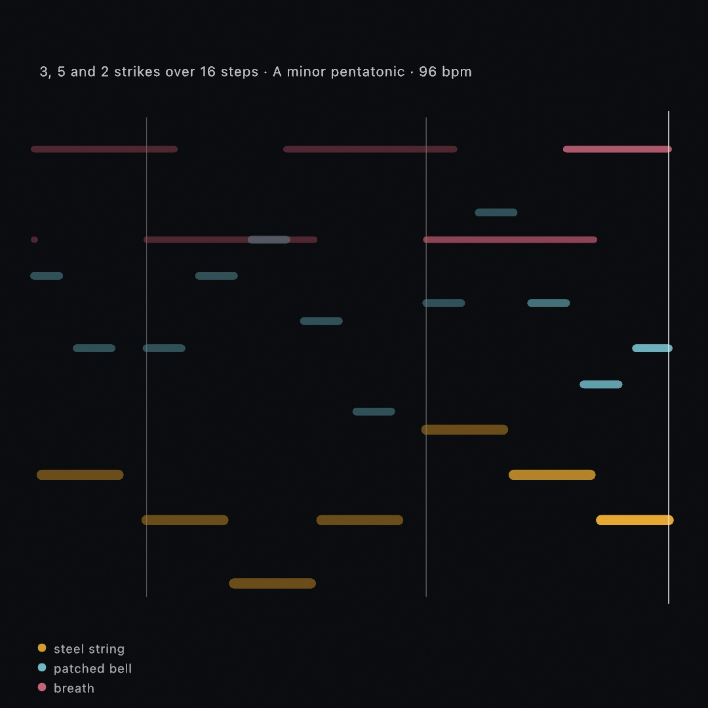

That picture is a record rather than a design. The piece drew it while playing it, one mark per note, and nobody wrote the notes down anywhere. Three rhythms decide when, a scale decides which, and a small chain that learned an eight-note motif decides where the low line wanders next.

[Chapter 28](28-SoundAndControl.md) listened. This chapter plays. It starts with one note and ends with a piece that runs on its own, and the middle is the two halves of that: what a note is made of, and how a sketch decides which notes there are. Nothing here needs a microphone, a controller, or a file. Run it and you will hear it.

## A sketch that plays

[Chapter 28](28-SoundAndControl.md)'s `Tone` sounds one note forever, which is enough to feed an analyzer and not much else. When you want the sketch to actually play something, the instrument is `Synth`, and asking it for a note is one line:

```swift
let synth = Synth(.pluck)

override func mousePressed() {
    synth.play("C4", for: 0.4)
}
```

Nothing was started. The first note starts the engine, because forgetting to is otherwise the most common way to end up staring at a silent sketch. Pitches are written however you already think of them. `"C4"` is a name, `60` a MIDI number, and `60.5` the quarter tone between the keys. And `for:` is how long to hold it, so the note ends without being told to again.

Notes that outlive one call are the other half, which is what a held key wants:

```swift
synth.noteOn("C4")     // sounds until told otherwise
synth.noteOff("C4")
```

A `Synth` plays several notes at once, sixteen by default, so chords and overlapping tails work without any bookkeeping from you. When they run out, the next note takes one from whatever is already fading, rather than from anything you are still holding. A melody over a held chord takes its voices from its own earlier notes.

**What a note is made of** is a `Voice`, and the presets are the quick way in: `.pluck`, `.bass`, `.pad`, `.bell`, `.stab`, `.breath`, `.sine`. Assigning a new one leaves sounding notes alone, so you can change instrument between notes:

```swift
synth.voice = .bell
```

Inside a voice, the part worth understanding first is the envelope. It is what makes a bell a bell and an organ an organ, using the same wave underneath.

<picture>
  <source media="(prefers-color-scheme: dark)" srcset="Images/29-MakingSound/Voices-dark.jpg">
  
</picture>

Four numbers, and only three of them are times. `attack` is how long the note takes to arrive, and `decay` how long it takes to settle. `release` is how long it takes to go once let go. `sustain` is the odd one out. It is the *level* the note rests at while held, not a duration. Set it to zero and holding the key adds nothing at all, which is exactly what struck things do. That is why `.percussive` sounds like a drum however long you lean on it.

You can draw the shape you designed, which is what the figure above does:

```swift
Envelope.swell.level(at: 0.7, heldFor: 1.4)   // where a note has got to
```

The other half of a voice is the `filter`, and it is most of what people mean when they say something sounds like a synthesizer. A note that is bright when struck and darkens as it fades is not the wave changing. It is a filter closing over it. `Voice.Filter.sweep(from:by:)` is that gesture, and `.pluck` is built from it.

Finally, a `Synth` is an `AudioSource` like the microphone is, so every read in [Chapter 28](28-SoundAndControl.md) works on the sketch's own playing:

```swift
drawCircle(width / 2, height / 2, 100 + Double(synth.amplitude) * 900)
```

That closes the loop the last chapter opened. A sketch that listens to the room can listen to itself instead, and then the picture and the sound are the same decision made once. The `Audio/Synth` example is a playable keyboard doing exactly that.

## Building an instrument instead of choosing one

A `Voice` is a fixed chain. Something makes a wave, an envelope shapes it, and a filter takes part of it away. Every preset so far is that chain with different numbers in it. The tier underneath is where the wiring itself is the value.

```swift
let bell = Patch.tone(.sine)
    .modulated(by: .tone(.sine, ratio: 3.5), index: 4)

synth.voice = Voice(patch: bell, envelope: .percussive)
```

This is the same relationship the drawing side has had since [Chapter 1](01-HelloOllin.md). `drawCircle` sits on a `Drawer` that can do more, and the voice presets sit on this. Nothing about `Synth(.pluck)` changes because it exists.

An **operator** is one oscillator with a frequency, a level, and possibly something pushing it. Its frequency is a *ratio of the note* rather than a pitch, so a patch is an instrument and not a chord. Ratio 1 is the note, 2 the octave above, and 3.5 something that is not a note at all.

The reason to bother is one sentence. **A filter can only take harmonics away, and a sine has none to take.** Modulation puts them in. Turn `index` up on a sine being pushed by another sine and it becomes brass, and no amount of filtering would have got you there. Move the ratio off a whole number and it becomes metal. Its tones no longer land on the note's own harmonics, so they belong to no pitch in particular. That is the whole of why `.bell` uses 3.5.

<picture>
  <source media="(prefers-color-scheme: dark)" srcset="Images/29-MakingSound/Modulation-dark.jpg">
  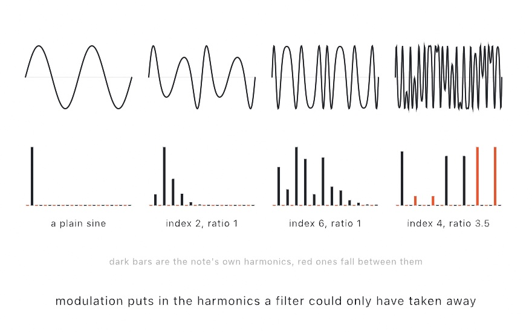
</picture>

The picture is that sentence measured. Each column is the arithmetic one operator pushing another does, with the wave on top and, below it, how much of the wave sits at each multiple of half the note. The plain sine has one bar and nothing else to take. Turn the index up and a run of harmonics grows out of it. Move the ratio to 3.5 and the bars stop landing on the note's own harmonics and fall between them, which is the difference between a tone and a clang.

`Examples/Audio/Patching` puts both parameters under your hand with the graph drawn as it is wired.

There is a constraint worth knowing about, because it explains the one number in the API that looks arbitrary. A patch travels to the audio thread inside a note, through a queue of slots that already exist. It has to be something copyable a word at a time, with no arrays, no references, and nothing to allocate. So the operators live in fixed lanes and there are eight. A patch that would need more comes back unchanged and says so, rather than quietly dropping one. A patch with a piece missing is a different instrument, and finding that out by ear is worse than reading it in the log.

### And the rest of the instrument

A patch says what the sound is made of. What happens to it afterwards is a chain, written the same way:

```swift
synth.effects = [
    .distortion(Distortion(.softClip, mix: 0.3)),
    .delay(Delay(time: 0.28, feedback: 0.5)),
    .reverb(Reverb(.hall, mix: 0.4)),
]
```

Order is the point, and it is the reason this is a list and not a pair of switches. An echo of a distorted sound and a distorted echo are different things: one repeats something dirty, the other dirties the repeats. Swap those two lines and you can hear which you have.

`synth.reverb = Reverb(.hall)` still works, and now means "put one room in the chain, or replace the one that is already there". Most sketches never need more than that, and the ones that do are not stuck with two slots.

Changing a setting costs nothing. Changing which effects are in the chain rewires it, and that happens on the running engine rather than around a stop. Measured on this wiring, reconnecting while it plays costs nothing you can hear.

### An effect nobody wrote for you

The built-in kinds in the chain are the classics. The last is a closure, and you write it:

```swift
synth.effects = [
    .custom("fold") { sound in
        for i in 0..<sound.frameCount {
            sound.left[i] = sin(sound.left[i] * 4)
            sound.right[i] = sin(sound.right[i] * 4)
        }
    },
    .reverb(Reverb(.hall, mix: 0.3)),
]
```

The closure is handed each block of samples on its way to the speakers and rewrites them in place. That is all an audio effect is. This one is a wavefolder: push a sample past the top and it comes back down. That fills a plain tone with harmonics no filter could put there. `sound.left` and `sound.right` are the two channels, `sound.sampleRate` is what a frequency means, and `sound.time` is a clock for anything that moves. It sits anywhere in the chain, so the reverb above hears the folded sound. It reaches an export like every other link.

An effect that has to remember something between blocks takes its memory as `state:` and gets it back on every block. That is how a filter, an envelope follower, or an echo of your own carries itself from one block to the next. The closure runs on the audio thread with the speakers waiting. Keep it to arithmetic over the samples: no allocating, no locking, no reaching back into the sketch. `state:` exists because the thread rule also means the closure cannot write into a captured variable.

`Examples/Audio/Shaping` is three of these behind one parameter: a wavefolder, a crush that remembers each held sample in `state:`, and a wobble that breathes on `sound.time`. The sound going in is drawn dim, and the sound coming out bright.

### A room you can draw

The reverb in that chain is one of four rooms somebody else built. Here is what a room is, so you can bring your own.

Clap once in a stairwell. What comes back is the stairwell: every surface and every distance, all at once, in the order the sound reached them. Record that and you have the room written down, as its answer to a single click. Play an instrument through the recording and it is heard in the stairwell. Every sample of the sound starts its own copy of the click's answer, and the answers add up. That is a convolution, and a reverb built this way is a convolution reverb.

```swift
let stairwell = ImpulseResponse.resource("stairwell", withExtension: "wav", in: .module)!
synth.reverb = Reverb(stairwell, mix: 0.4)
```

The room does not have to be real. A room is a rule over time, so you can draw one the way you draw anything else:

```swift
let hall = ImpulseResponse.decay(seconds: 3, damping: 0.6)                     // fading noise
let backward = hall.reversed()                                                // swelling toward the click
let humming = ImpulseResponse(seconds: 2) { t, _ in exp(-3 * t) * sin(2 * .pi * 220 * t) }
```

<picture>
  <source media="(prefers-color-scheme: dark)" srcset="Images/29-MakingSound/Rooms-dark.jpg">
  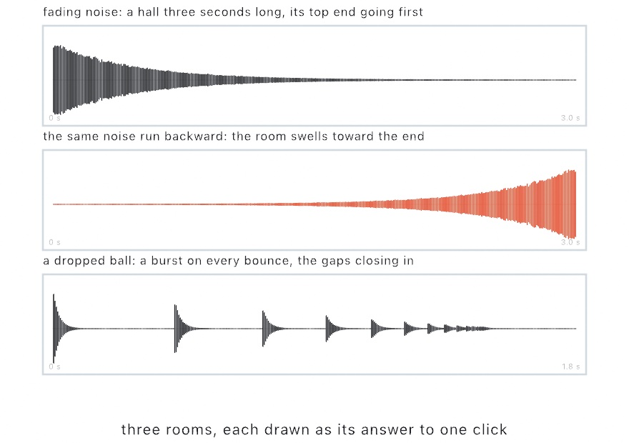
</picture>

Fading noise is the plainest room there is. Real rooms lose their top end first, which is what `damping` does. Run the same noise backward and the room swells toward the click instead of fading from it, a sound records have used for sixty years. The third room in the picture is a dropped ball: a burst on every bounce, the gaps closing by a fixed ratio. A rule that ignores the noise it is handed gives a resonator instead. That is a room that hums at one pitch, and it tunes everything you play into it.

Every room is brought to the same level on the way in, so `mix` means one thing whether the recording was quiet or loud. Turn `mix` on a room that is sounding and the tail keeps going. Change the room itself, or its `preDelay`, and a fresh one starts. `Examples/Audio/Rooms` draws five rooms from rules and plays through each, with the room's answer to a click drawn above the instrument's trace.

### Something that moves: chorus, flanger, phaser, tremolo

The effects so far leave a sound where it is. Four more move it. Each is one slow wave and the thing it moves, and the wave's `rate` and `depth` are the two settings they all share.

```swift
synth.effects = [.chorus(Chorus(rate: 0.8, depth: 0.5))]
synth.effects = [.flanger(Flanger(rate: 0.25, depth: 0.7, feedback: 0.5))]
synth.effects = [.phaser(Phaser(rate: 0.4, stages: 4))]
synth.effects = [.tremolo(Tremolo(rate: 5, depth: 0.6))]
```

<picture>
  <source media="(prefers-color-scheme: dark)" srcset="Images/29-MakingSound/Movement-dark.jpg">
  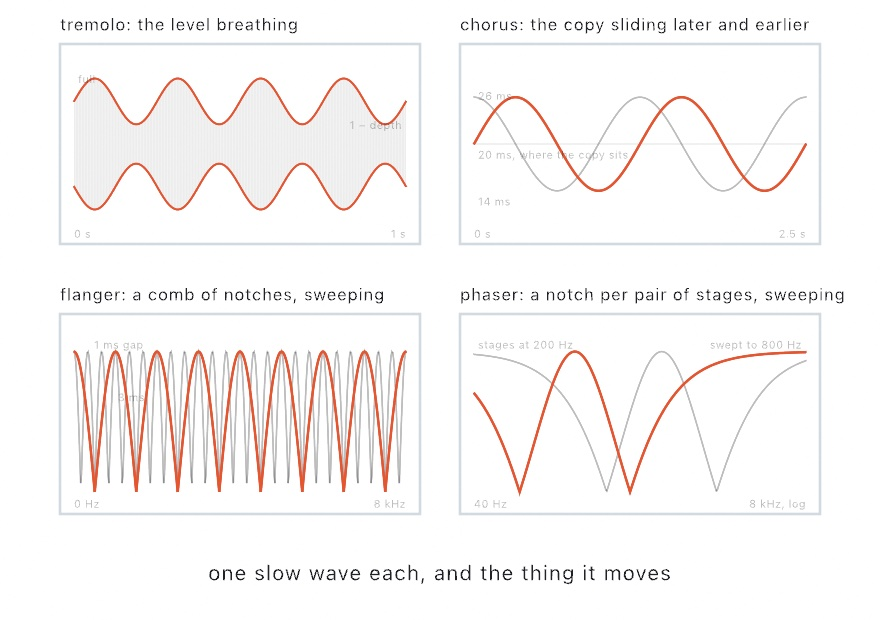
</picture>

A **tremolo** moves the level. It rises and falls with the wave, from full down to whatever `depth` leaves, and nothing else changes. It is the plainest of the four and the one a guitar amplifier had a knob for. Set `spread` to 1 and the two sides breathe in opposite turns, so the sound swings from side to side.

A **chorus** moves a copy of the sound. The copy sits about twenty milliseconds behind, and the wave slides it later and earlier. A copy that is always sliding is never quite in tune with the original, and two voices that can never agree read as several. That is the whole trick, and the name. The two sides slide a quarter turn apart, which is why a chorus is wide by itself.

A **flanger** is the same copy brought in close, a millisecond or so behind. That close, you no longer hear a second voice. The copy and the original cancel at every frequency where the gap is half a wavelength, which cuts a comb of notches through the spectrum. The wave sweeps the gap, so the comb sweeps, and that is the jet-plane whoosh every record has used. `feedback` sends the copy back to be copied again, which sharpens the teeth. Make it negative and the comb turns inside out.

A **phaser** makes fewer notches, and makes them differently. The sound goes through a row of stages that each turn its phase without touching its level. Added back to the original, the turned parts cancel at one frequency for every two stages. The wave sweeps those notches up and down the spectrum. Four stages give two notches, which is the usual count, and the result is the softer swirl of the four.

None of them invents a sound. Each is the sound and a copy of itself, or the sound and a wave, so a `mix` of 0 is the plain sound exactly. Turn a setting while the sound plays and the motion carries on from where it was. [`Examples/Audio/Movement`](../Examples/Audio/Movement/Sketch.swift) plays one phrase through each of the four, every setting on a parameter, with the wave drawn over the trace.

### Something that holds a level: compressor, limiter, gate

Those four move a sound. Three more watch how loud it is and act on that.

```swift
synth.effects = [.compressor(Compressor(threshold: -18, ratio: 4, makeup: 6))]
synth.effects = [.gate(Gate(threshold: -40, hold: 0.08)), .limiter(Limiter())]
```

<picture>
  <source media="(prefers-color-scheme: dark)" srcset="Images/29-MakingSound/Levels-dark.jpg">
  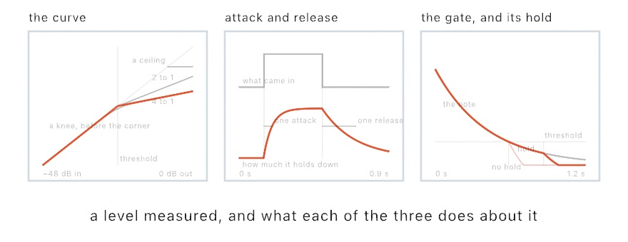
</picture>

Every threshold here is in decibels below full scale, where 0 is as loud as a sample can be. It is a scale worth getting used to: a level you would mix at sits somewhere under -12, and a difference of 6 is a halving.

A **compressor** works on what is over its `threshold`. A `ratio` of 4 means four decibels over the line arrive as one. The first panel is the whole of it: below the threshold nothing happens, above it the curve tilts. What that buys is not a quieter sound but a narrower one, which is why `makeup` matters, since it brings the whole thing back up with the loud parts still held. A `knee` bends the corner, so the holding starts before the threshold rather than at it, and that is most of what makes a compressor hard to hear working.

`attack` and `release` are the other half, and the second panel is them: how long the holding takes to come on, and how long it takes to let go. A fast attack catches the very front of a note, which is where a plucked or struck sound has most of its level. A slow release keeps holding through the notes after the loud one, so the whole phrase breathes together. Neither is right; they are the difference between a phrase that keeps its shape and one that pumps.

A **limiter** is a promise rather than a shape. Nothing leaves above its `ceiling`, whatever arrives. It gets there by turning the level down the instant a peak asks for it, so a single loud note ducks the sound around it for a `release` rather than tearing. It belongs last in a chain, after a distortion or anything else that can hand it more than it bargained for.

A **gate** works on what is under its threshold, and turns it down by `depth`. That takes hiss, hum, and room out of the gaps between notes. The catch is a decaying note, which passes under the threshold long before it is finished, and `hold` is the answer: how long the gate stays open after the level drops. The third panel is a note with the hold and without it, and the one without is missing its tail.

The level is read from both sides at once, so a loud note on one side pulls the other down with it and the sound stays where you put it. Turn a setting while it plays and the gain carries on from where it is. One thing is not here: a key from somewhere else, the trick where one sound ducks another, needs a detector on one instrument listening to a different one, and each `Synth` runs its own engine. [`Examples/Audio/Levels`](../Examples/Audio/Levels/Sketch.swift) plays a phrase with accents in it through each of the three, with the threshold drawn across the meter so you can watch the accents meet it.

## An instrument somebody recorded

Everything in this chapter so far is worked out as it goes. The other way round is to start from a recording.

```swift
synth.instrument = SampledInstrument.builtIn
synth.voice = Voice(sampled: Sampler(), envelope: .plucked)
synth.play("C4", for: 1.5)
```

Ollin bundles one small instrument so you can hear this without downloading anything: a struck bar recorded at five pitches. Playing a note means finding the nearest recording and moving it.

Moving it is the whole model, and it is also the whole limitation. A recording plays at another pitch by being read faster or slower, which moves its pitch and its length *together*, exactly as a tape does. Move it far enough and the instrument audibly changes size. High notes go thin and hurried, and low ones slow and heavy. `Examples/Audio/Sampler` has a key that swaps five recordings for one stretched over everything, and the difference is not subtle. That is why real libraries ship hundreds of recordings rather than one, and why the nearest is always chosen.

There is a design detail here worth noticing, because it is the same constraint from a page ago wearing a different hat. The recordings are set on the **synth**, not inside the `Voice`:

```swift
synth.instrument = piano          // which recordings
synth.voice = Voice(sampled: ...) // how to play them
```

A `Voice` travels to the audio thread inside a note and has to be copyable a word at a time. That is why a struck body caps at sixteen tones and a patch at eight operators. Recordings are megabytes on the heap and cannot ride along at all. So they stay put and the note carries only a handful of numbers. The constraint did not go away. It decided the shape of the API.

To load a real instrument, the format is **SFZ**. It is a text file listing which audio file answers which notes, with the audio beside it.

```swift
let piano = SampledInstrument(sfz: "Piano.sfz", in: .module)
```

Where to find them, and the licenses, are on the [Synthesis](../Docs/Helpers/Synthesis.md#where-to-find-instruments) page. Here is the short version. [VCSL](https://github.com/sgossner/VCSL) and [VSCO 2 Community Edition](https://versilian-studios.com/vsco-community/) are CC0, so you can do anything with them, including ship them. [Freesound](https://freesound.org/) is per-clip and mixes CC0 with non-commercial, so check each one. The [Philharmonia](https://philharmonia.co.uk/resources/sound-samples/) samples are free to make music with, but explicitly not free to pass on as a sampler instrument. That distinction is worth reading before you build something on them.

## A wave you can draw: wavetables

An oscillator traces one shape. A patch pushes a few shapes into each other. A wavetable is the plain third way: several cycles side by side, any shapes at all, and a note reads the blend of the two its position lands between.

```swift
synth.wavetable = .basic                                     // sine, triangle, sawtooth, square
synth.voice = Voice(wavetable: WavetableScan(position: 0.3))
synth.play("C3", for: 2)
```

<picture>
  <source media="(prefers-color-scheme: dark)" srcset="Images/29-MakingSound/WavetableFrames-dark.jpg">
  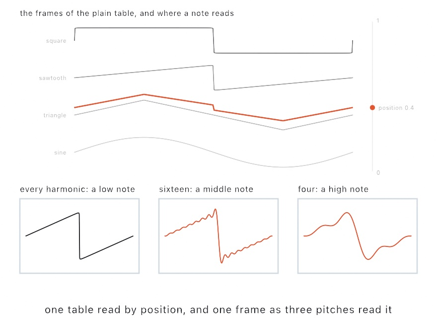
</picture>

The top of that picture is the whole idea. The position runs up the stack, and the colored cycle is what a note at 0.4 reads: mostly triangle, a little sawtooth. Move the position and the wave changes shape. That is the part an envelope and a filter cannot do, and it is what makes a held note travel:

```swift
synth.voice = .morph     // struck to the square end, settling back toward the sine
```

A `WavetableScan` carries the position, and a `sweep` with its own envelope moves it over the note. `morph` starts at the first frame, jumps to the last as the note strikes, and slides most of the way back while it sounds. Give the sweep a slow attack instead and a note opens up as it is held. `Examples/Audio/Wavetable` puts the position under the pointer and the sweep on a parameter, with the frames stacked on screen and the cycle the next note reads drawn over them.

The table is set on the synth, not inside the voice, for the reason you met a page ago. A voice has to be copyable a word at a time, and a table is hundreds of kilobytes. Three are built in. `.basic` is the four plain shapes, `.pulse` a square narrowing to a spike, and `.vowels` five mouth shapes a note sings through. Making your own is one line:

```swift
synth.wavetable = Wavetable(name: "bend", frameCount: 8) { phase, frame in
    sin(2 * .pi * pow(phase, 1 + 2 * frame))     // a sine bent harder in every frame
}
```

The bottom of the picture is the quiet part of the design. A sawtooth has a corner, and a corner holds harmonics past any sampling limit. Read it fast enough and those fold back down as a gritty ring that gets *worse* as the note goes up. So every frame is kept at eleven strengths, each with half the harmonics of the one before, and a note reads the strongest one whose top harmonic still fits under half the sample rate. The three panels are the same sawtooth as a low, a middle, and a high note read it. The corner softens and the note stays clean. Every strength is built from the same harmonics, so nothing shifts when a note moves from one to the next.

## A string, worked out rather than drawn: the plucked string

Every voice so far starts with a wave, a shape an oscillator traces over and over. You then carve it with an envelope and a filter until it sounds like something. That works, and it is what most synthesizers are. But it is a description of a result, and there is another way in.

```swift
let synth = Synth(.steel)
synth.play("E3", for: 3)
```

That is a string. Not a recording of one, and not a wave shaped to resemble one. It is a length of something under tension, with a disturbance running up and down it, worked out sample by sample as it goes.

<picture>
  <source media="(prefers-color-scheme: dark)" srcset="Images/29-MakingSound/PluckedString-dark.jpg">
  
</picture>

The top of that picture is the whole model. A delay line one period long is the disturbance traveling. A filter in the loop is what the string loses at each end, taking more off the top than the bottom. And a little less comes back each time round than went out. Feed a burst of noise into it and it turns into a note by itself.

What makes this worth the trouble is what you get without asking. The note attacks like a string because that is what a disturbance settling into a loop does. It darkens as it rings, because the top is lost faster than the bottom, so a long note changes color with nothing moving. And it responds to *where you pluck it*:

```swift
var string = PluckedString.steel
string.position = 0.5          // halfway along
synth.voice = Voice(plucked: string)
```

The lower half of the picture is why. A string held at a point cannot move there, so every mode with a node under your finger gets nothing. Pluck halfway along and every even mode is missing, which is the hollow tone in the top row's gaps. Pluck near the end and they are all there, thinly, which is the nasal sound of a guitar played by the bridge. The shape on the left and the bars on the right are the same fact drawn twice.

`Examples/Audio/Strings` is six strings you click on, wherever you want to pluck them, and the shape it draws on each one is those same modes.

Three more things are worth knowing. `hardness` is how quickly you let go, which decides how much of the string you set moving. `decay` is how long the note rings, and `damping` is how much sooner the bright part goes than the low part. And a string decides its own fade, so the envelope's job is to stay out of the way. Ask for a note long enough to let it finish, or the release will cut it off mid-ring.

The tuning is the part you would never think to check and would certainly hear. A loop has to come out exactly one period long, and a whole number of samples cannot do that. At the bottom of the keyboard the rounding error hides in a loop hundreds of samples long. At the top, where a period is ten samples, rounding is out by most of a semitone. So the fraction left over is handled by a filter that supplies a fraction of a sample. The loop filter's own delay is counted into the same budget, which is why turning `damping` up cannot pull the note flat.

## A shape you can hit: modal synthesis

A string is one length of one thing, and its model is one loop. Something struck is different. Hit a plate or a bell or a sheet of glass and it does not make a wave at all. It makes a handful of pure tones at once, each fading at its own rate.

Which tones is the interesting part, because it is decided by the object's shape and by nothing else.

```swift
let synth = Synth(.chime)
synth.play("C4", for: 4)
```

That is a bell, from a list of ratios a bell founder would recognize, and `.drum`, `.bar`, `.wood`, and `.glass` are beside it. But a list is not the point. The point is that the list can come from an outline you drew:

```swift
let outline = textToShapes("O").first!
let bell = StruckShape(outline)                 // once, in setup()

override func mousePressed() {
    synth.voice = Voice(struck: bell!.body(struckAt: Vector2(mouseX, mouseY)))
    synth.play("C4", for: 3)
}
```

<picture>
  <source media="(prefers-color-scheme: dark)" srcset="Images/29-MakingSound/StruckShapes-dark.jpg">
  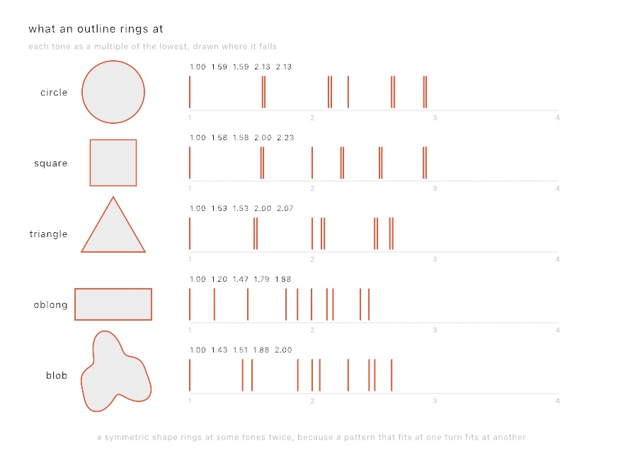
</picture>

Nothing in that picture was chosen. Each row is the outline beside it, measured. The circle's ratios are the zeros of the Bessel functions, which is what a real drumhead rings at. They run 1, 1.59, 2.13, and 2.30 in turn. The square comes back at 1, 1.58, 2, 2.24, which is what a real square membrane rings at. The blob comes back at whatever a blob rings at, and nobody has a name for that.

The reason it works is simple. A flat thing held at its edge can only vibrate in the shapes that fit inside its outline, with nothing moving at the rim. Ask which those are and you have asked an eigenvalue problem, and the frequencies are the square roots of its answers. Ollin measures the outline onto a grid and solves it.

Look again at the pairs. The circle, the square, and the triangle each show most of their lines doubled up, and the blob shows none. That is symmetry. A pattern that fits a circle at one rotation fits it at another. So there are two of them, and they ring at the same frequency. An outline with no symmetry has nothing to double. A real drum does this too, and a real drum is never quite round. Its pairs sit fractionally apart and beat against each other, which is part of why a drum sounds alive.

Two practical things. **Measuring is the expensive part and striking is free**, so measure in `setup()` and keep the `StruckShape`. And **where you hit it decides which tones answer**. A tone that holds still under your finger gets nothing, which is the pick position again in a different costume. Hit a circle exactly in the middle and most of its tones stay silent. Most of them have a line of stillness straight through the center.

`Examples/Audio/StruckShapes` is six of these you can click, and the bars under each one move as you move where you hit it.

## A note you keep playing: bowed and blown

The string and the shape have something in common that is easy to miss. Both are set going once. You pluck, or you strike, and the whole note is decided at that instant. Everything after is the thing fading.

A bow is not like that, and neither is a breath. They keep happening, so the note has a middle, and the middle is yours.

```swift
let synth = Synth(.cello)
synth.noteOn("G2")

override func draw() {
    synth.pressure = 0.3 + 0.5 * abs(sin(time * 2))   // still playing it
}
```

`drive` is how fast the bow is being drawn, or how hard the tube is being blown. It is read every sample, so moving it moves the note that is already sounding. At zero there is nothing to hear, because nothing is being done. This is the one thing an envelope cannot give you. An envelope is decided when the note starts, and this is whatever you are doing right now.

Two things fall out of the models rather than being settings. Both are the kind of detail that tells you a model is doing its job.

**Bow too fast for the force and the note breaks.** The string tears loose from the rosin twice per cycle instead of once, and it jumps to the octave. That is exactly what over-bowing sounds like on a real instrument, and nothing in the code puts it there. It is what the friction curve does when you push past it. Press harder or draw slower and it settles back.

**The clarinet has no even harmonics.** Nothing filters them out. The tube is stopped at the reed and open at the far end, so it fits a quarter of a wave rather than a half. A tube like that supports the odd harmonics and not the even ones, which is why it sounds hollow and woody. It also plays an octave and a fifth below an open tube of the same length, instead of an octave below. The whole of that is one line deciding the loop is half a period long rather than a whole one.

`Examples/Audio/Bowing` is both of them under the mouse. Hold to play, move up and down to lean on it, and press `B` to swap the bow for a reed.

## Music the sketch works out for itself

A synth answers what a note sounds like. It says nothing about which notes there are, or when. That half is the composition types, and the thing they have in common is that not one of them can tell the time.

Each answers a step number. Step 0, step 1, step 2, forever. Turning the sketch's clock into step numbers is one small counter's job, and a `Tempo` says how fast that clock runs:

```swift
let tempo: Tempo = 120
var counter = StepCounter(perBeat: 4)

override func draw() {
    for step in counter.steps(upTo: tempo.beats(at: time)) {
        synth.play(60, for: tempo.seconds(of: .sixteenth))
    }
}
```

It hands back a range rather than a single step. At any real tempo a frame lasts longer than a step, and a step that fell inside the frame still has to be played.

Keeping the clock outside is what makes the rest portable. `tempo.beats(at: time)` today, a beat detected in whatever is playing in the room, or a drum machine's own clock. That one arrives over the MIDI wiring of [Chapter 28](28-SoundAndControl.md). None of what follows changes.

**`Tempo` is the one value that knows a second.** Everything else in this half of the chapter counts beats. `tempo.beats(at: time)` is `time * 120 / 60`, written once and named. The same value answers the other question, how long a note lasts. A note's length is a `NoteLength`, in beats, with the names from the stave: `.whole` down to `.thirtySecond`. `.dotted` and `.triplet` derive the rest, and `tempo.seconds(of: .quarter.dotted)` is what to hand a synth's `for:`. Put the tempo on a `@Param` and it is a slider in beats per minute. A MIDI knob or an OSC address drives it like any other number.

<picture>
  <source media="(prefers-color-scheme: dark)" srcset="Images/29-MakingSound/NoteLengths-dark.jpg">
  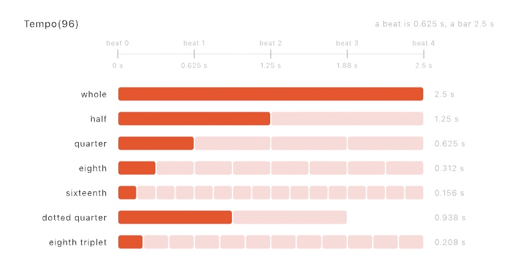
</picture>

Read it across. At 96 beats a minute a beat is 0.625 seconds. A whole note holds for 2.5 and a sixteenth for 0.156. Two dotted quarters leave a beat over. That is why a dotted rhythm leans. Three eighth triplets fit where two eighths did. Every width and every number in the figure is read off the two types, so the picture is what they compute.

**`Rhythm` decides when.** Ask for a number of strikes over a number of steps and it spreads them as evenly as whole steps allow:

```swift
let rhythm = Rhythm(5, in: 16)
if rhythm[step] { synth.play(60, for: 0.1) }
```

<picture>
  <source media="(prefers-color-scheme: dark)" srcset="Images/29-MakingSound/Euclidean-dark.jpg">
  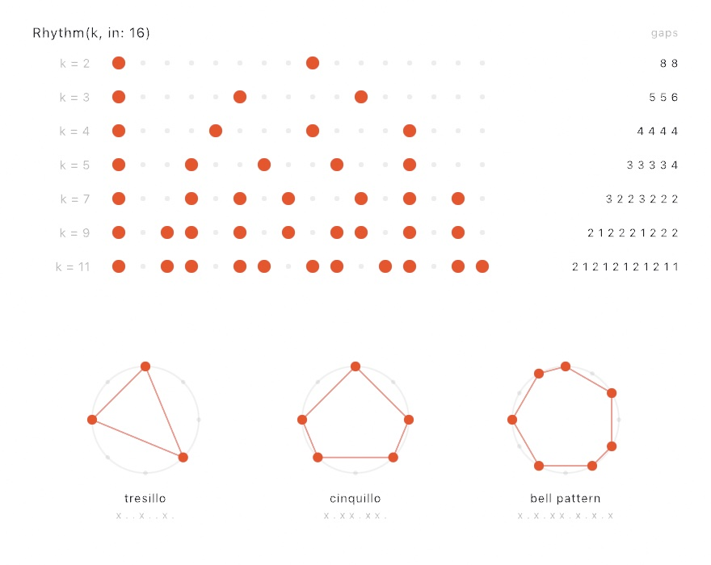
</picture>

Read the gaps column. However many strikes you divide over sixteen steps, the gaps come out in at most two lengths, and those two differ by one. That is the whole idea. What falls out of it is the surprise. `Rhythm(3, in: 8)` is the Cuban tresillo, and `Rhythm(5, in: 8)` the cinquillo. `Rhythm(7, in: 12)` begun three strikes in is the bell pattern played across west Africa and, after it, much of the Americas. An algorithm written for timing pulses in a particle accelerator turns out to produce the rhythms people were already playing.

The named ones are on the type, so you rarely have to remember which numbers. They are `.tresillo`, `.cinquillo`, `.bellPattern`, `.bossaNova`, `.samba`, `.aksak`, and a few more. Or write one out, which is what you want when the pattern is already in your head:

```swift
let clave: Rhythm = "x..x..x...x.x..."
```

**`Scale` decides which.** It turns whole numbers into notes, so a number arrived at any way at all stays in key:

```swift
let key = Scale(.minorPentatonic, root: "A3")
synth.play(key[step])
```

Degrees run past both ends: `key[5]` is an octave up, `key[-1]` the note below the root. This is the piece that does the most work for the least code. Feed a wandering number through a scale and it cannot play a wrong note.

Sometimes the number came from somewhere that is not music, like a mouse position or a sensor reading. Then `snap` moves it to the nearest note of the scale instead:

```swift
synth.play(key.snap(Pitch(40 + mouseY / 12)))
```

**`Chord` and `Arpeggio` decide what goes together.** A chord can be named, as `Chord("A3", .minorSeventh)`. It can also be built out of the scale, by taking every other note:

```swift
key.chord(on: 0)     // a triad on the root
key.chord(on: 1)     // a triad on the second degree
```

On a major scale those come out major and minor from the same call. That is the point of building a chord out of a key. The quality follows from where in the scale you started. Changing the key changes the chords along with it, rather than fighting them.

<picture>
  <source media="(prefers-color-scheme: dark)" srcset="Images/29-MakingSound/ScaleLadder-dark.jpg">
  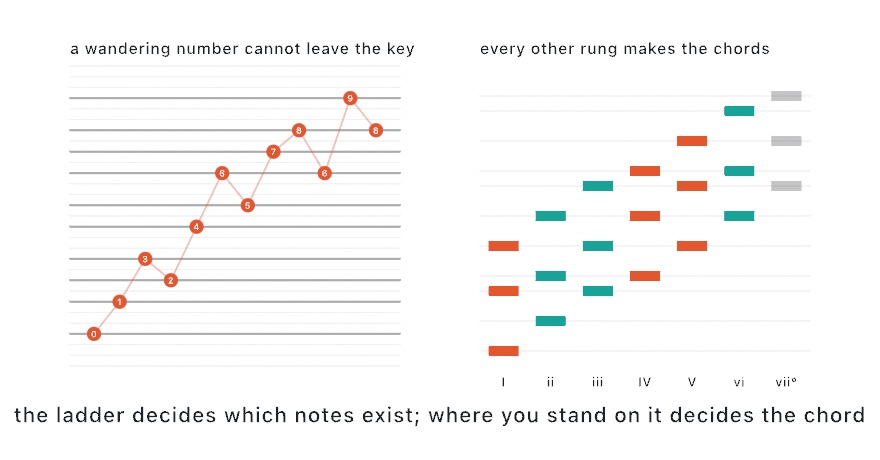
</picture>

An `Arpeggio` plays a chord one note at a time, and like a rhythm it answers a step number:

```swift
let arp = Arpeggio(Chord("A3", .minorSeventh), .upDown, octaves: 2)
synth.play(arp[step], for: 0.1)
```

Read it at the step, rather than counting the notes you have played so far. That keeps the figure in its place in the bar, instead of restarting every time the rhythm strikes.

**`MarkovChain` decides what next.** Show it a phrase and it learns what tends to follow what:

```swift
var melody = MarkovChain(learning: [0, 2, 4, 2, 0, -3], seed: 4, loops: true)
melody.start(at: 0)

synth.play(key[melody.next() ?? 0])
```

`order` is how far back it looks. At 1 each element is picked from whatever followed the one before it. At 2 it looks at the last two, which tracks the source more closely and invents less. It is seeded, and it keeps its own generator rather than borrowing the sketch's. Adding one cannot shift anything else you were drawing at random.

Four small pieces, and together they are a piece of music:

```swift
for step in counter.steps(upTo: time * 104 / 60) {
    if pulse[step] { bass.play(key[melody.next() ?? 0], for: 0.34) }
    if figure[step] { chords.play(key.snap(arp[step]), velocity: 0.55, for: 0.22) }
}
```

That is `Examples/Audio/Generative`, drawn as three of those rings turning on one step count. The key, the figure, and the tempo are parameters you move while it plays. All of it repeats. The same seed gives the same melody, and the same two numbers give the same rhythm. A generated piece is something you can come back to, not something you had to be there to catch.

## Chords that come out of a key

The scale gave every number somewhere safe to land. Chords are the same idea one level up, and the useful way to write them down is as *degrees* rather than as names.

```swift
let changes = Progression("I vi IV V", in: Scale(.major, root: "C3"))

for step in counter.steps(upTo: time * 2) {
    pad.play(chord: changes.pitches(at: step), for: 1.8)
    bass.play(changes.root(at: step).transposed(by: -12), for: 1.6)
}
```

Degrees, because that is the fact that survives changing key. `I vi IV V` is the same progression in every key there is, and writing it this way means the qualities fall out of the scale instead of having to be said.

<picture>
  <source media="(prefers-color-scheme: dark)" srcset="Images/29-MakingSound/Changes-dark.jpg">
  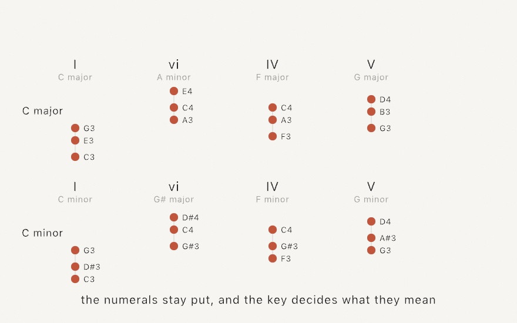
</picture>

Those are the notes `pitches(at:)` actually hands back, in two keys, with nothing else changed. Every chord comes out different, and each one is whatever the scale's own notes make of that degree. Watch the second column, which is minor in the major key and major in the minor one. That is not a special case. It is what happens when the numeral only ever meant "start here and take every other note". `Examples/Audio/Changes` puts the key on a parameter so you can hear this happen while it plays. One thing about the labels. Ollin names every black key with a sharp, so the minor row's `G#` is the A flat a score would print. It is the same pitch either way.

There are named ones (`.pop`, `.blues`, `.twoFiveOne`, `.andalusian`), and there is a way to leave the cycle:

```swift
let changes = Progression("I vi IV V ii V", in: key).wandering(32)
```

That is the Markov chain from a few pages back, learned off the progression's own moves. It only ever makes a move the original made. Two bars in, it is somewhere the original never went, having got there by steps the original took. Seeded per call, so a wander you like is one you can ask for again.

When the chords do not all come from one key, write them out instead:

```swift
let changes = Progression(symbols: "Dm7 G7 Cmaj7 Cmaj7")
let chord: Chord = "F#m7"
```

Symbols do not survive a change of key and degrees do, which is the whole trade between the two.

## Twelve is a choice: tunings

Everything so far has divided the octave into twelve, because almost all the music you are likely to make does. It is worth knowing that this is a decision and not a law.

```swift
let tuning = Tuning.just.rooted(at: "C3")
synth.play(tuning[degree])
```

A `Tuning` is a list of frequency ratios and the interval they repeat over. It has the same shape as a `Scale`, so indexing degrees and snapping stray pitches work the same way.

Equal temperament is a compromise: it makes every key equally usable by making every interval except the octave slightly wrong. Play a held triad in `.equalTemperament` and then the same triad in `.just` and you can hear what that costs. The equal one beats, slowly and audibly; the whole number one locks and sits still. A piece that never changes key gives up nothing by being tuned the second way.

Past that there are more steps rather than different ones, in `.nineteen`, `.thirtyOne`, and `.quarterTones`. Then there is `.bohlenPierce`, which divides a *third* into thirteen and so contains no octave at all. Doubling a frequency is so familiar that a tuning without it sounds wrong before it sounds strange, and then stops sounding wrong. It works because odd harmonics still line up, which is why it suits the clarinet from earlier in this chapter and suits almost nothing else.

## Playing along with the room: tempo sync

[Chapter 28](28-SoundAndControl.md)'s beat detector told you *that* a beat happened. Getting from there to playing in time with one is a bit more:

```swift
lazy var room = BeatFollower(mic)
var counter = StepCounter(perBeat: 2)

override func draw() {
    room.update(at: time)
    for step in counter.steps(upTo: room.beats) {
        synth.play(scale[step % 5], for: 0.2)
    }
}
```

`room.beats` is musical time inferred from what it is hearing. The same `StepCounter` that ran off `time` now runs off the record playing in the room. `room.rhythm(steps: 16)` hands back the pattern it heard as a `Rhythm`, which you can then play against.

Two things it does that are easy to get wrong if you write this yourself. A detector that fires on every eighth note reports twice the tempo, which is the same music. So anything outside a believable range is halved or doubled until it lands inside one. And the tempo is the *middle* of the recent gaps rather than their average. One missed beat doubles a gap, and that moves an average where it does not move a middle.

It hears arrivals rather than the beat a drummer would tap. A steady loop is followed well, and rubato is followed badly. `room.steadiness` is how much to trust it.

## Numbers you can hear: sonification

Everything so far invents what it plays. The other way to fill a scale with notes is to already have the numbers, and read them out.

```swift
let readings = Sonification(table, column: "temperature",
                            in: Scale(.minorPentatonic, root: "A3"))

for step in counter.steps(upTo: time * 2) {
    synth.play(readings, step: step, tempo: 120)
}
```

That reads a column of a table. The same call reads a line across a terrain, `Sonification(land, row: 32)`, or a row of a picture, `Sonification(photo, row: 200)`, as brightness. It answers a step number and owns no clock, like everything else in this tier, so the counter you already have drives it.

<picture>
  <source media="(prefers-color-scheme: dark)" srcset="Images/29-MakingSound/Sonification-dark.jpg">
  
</picture>

Two decisions inside that call are worth pulling out, because neither is what you would write first and the figure is the argument for both.

**Pitch is spread evenly in semitones, not in hertz.** Hearing is logarithmic. The step from 220 Hz to 440 sounds like the step from 440 to 880, though the second is twice the size. Spread a series evenly in hertz and the whole bottom half of your data crushes into the top of the range. That is the middle row of the figure, the same numbers, unreadable. Spread it evenly in semitones and the shape survives.

**Snapping is what makes it music instead of a signal.** The bottom row is the same reading landing only on notes of the key. Nothing about the data changed; it simply cannot play a wrong note now. This is why `Scale` was worth having before there was anything to read.

One more piece, small and easy to skip:

```swift
marker.play(readings.reference(at: 20), tempo: 120)   // 20 degrees, sounded
```

A reference sounds one named value on exactly the same footing as the reading. Without one, a listener needs absolute pitch to know what any note means. With one, every note is heard as above or below something. It is a chart's grid line, in sound. It is the difference between a noise that rises and falls and a measurement you can actually read.

Which is the other reason this exists. A sketch that draws a column can read the same column out loud, from the same numbers, in one more line. `Examples/Audio/Sonification` does exactly that. A line across a landscape is drawn as a profile and played as a tune, with the playhead marking the note sounding. The picture and the sound are two views of one series, and one of them works for someone who is not looking.

## Spatial audio, and sound you can keep

Two things are left, and both are one line each.

A sound can come from a place in the 3D scene, with the camera as the ear:

```swift
cameraShowcase(.autoOrbit())
guard let eye = activeCamera else { return }

synth.place(at: Vector3(2, 0, -3), heardFrom: eye)
```

Both facts arrive in the same call because neither means anything on its own. A position says nothing until something is listening, and where the sketch is looking from is where it hears from. On headphones this is more than loudness. It is how much later the sound reaches one ear than the other, and what a head does to a sound arriving round it. Something behind you is behind you, rather than merely quiet. `Examples/Audio/Spatial` is three chimes standing still and one walking past them.

The other is that a sketch which plays carries its sound out of the window:

```sh
ollin Piece.swift --export-video piece.mp4 --frames 480
```

The file has the music in it. There is no record button and nothing to switch on.

This is worth a moment, because it is the one place in this chapter where an earlier decision is audible. The exporters drive a sketch on a fixed clock with no window and nothing playing. There are no speakers to send notes to, so the notes are written down as the frames are drawn. At the end the soundtrack is rendered through the same code that would have fed the speakers. The renderer could be used that way because it takes events and gives back samples and has no clock of its own. An export is that same code with the waiting taken out.

Which means the sound reproduces exactly the way the picture does. Export the same piece twice and the audio comes back sample for sample identical. A generated piece is something you can come back to, rather than something you had to be there to catch. That is the same promise the seed made in [Chapter 4](04-Randomness.md), arriving in a medium you cannot look at.

The two halves of this section meet, which is worth saying because it would be easy to assume they don't. Placing works by rewiring the audio graph, and an export has no audio graph to rewire. So where each instrument was and where it was heard from get written down as the frames are drawn, exactly the way the notes are. The finished soundtrack is rendered through a listener at the end. A chime that walks past your left ear on screen walks past your left ear in the file. Place from the first frame if you want that. The soundtrack machine is built once, and its shape is fixed then. An instrument that starts playing before it is ever placed will tell you so, rather than quietly coming out in the middle.


## Putting it together: the music box

The finished piece plays by itself and draws what it plays. Three voices, one clock, three rhythms, one key. Make `MySketches/MusicBox.swift` and run it, because the picture is the smaller half of this one.

The first part is the piece. The bell is patched by hand rather than picked from the presets, the string is the model from earlier, and the breath is a preset. Everything about *when* comes from three Euclidean rhythms read at the same step number, and everything about *which* comes from the scale, so no note in it can be out of key. The low line's degrees come from the chain, which was taught an eight-note motif and now wanders inside its habits.

```swift
import Ollin
import OllinAudio

final class MusicBox: Sketch {

    // MARK: what plays

    let string = Synth(.steel, polyphony: 6)
    let bell = Synth(polyphony: 10)
    let air = Synth(.breath, polyphony: 4)

    let steps = 16
    let tempo: Tempo = 96
    var counter = StepCounter(perBeat: 4)
    var motif = MarkovChain<Int>(seed: 4)

    /// Every note the piece has played: when it started, in beats, how long it
    /// holds, which voice sang it, and how hard.
    struct Played {
        var beat: Double
        var pitch: Double
        var beats: Double
        var voice: Int
        var velocity: Double
    }
    var score: [Played] = []

    override func setup() {
        seed(4)
        // The bell is patched rather than picked: one sine bent by another at a
        // ratio that is nowhere near a whole number, which is what makes metal.
        bell.voice = Voice(patch: Patch.tone(.sine)
                                .modulated(by: .tone(.sine, ratio: 3.47), index: 4.2),
                           envelope: .percussive)
        string.gain = 0.5
        bell.gain = 0.3
        air.gain = 0.14
        bell.reverb = Reverb(.hall, mix: 0.3)
        air.reverb = Reverb(.hall, mix: 0.45)

        motif.learn([0, 2, 4, 2, 0, -3, 0, 4], loops: true)
        motif.start(at: 0)
    }

    // MARK: the piece

    override func draw() {
        background(Color(hex: 0x0B0C10))

        let key = Scale(.minorPentatonic, root: "A2")
        let low = Rhythm(3, in: steps)          // three strikes, as evenly as sixteen allows
        let mid = Rhythm(5, in: steps)
        let high = Rhythm(2, in: steps)

        let beats = tempo.beats(at: time)
        for step in counter.steps(upTo: beats) {
            let at = Double(step) / 4
            if low[step] {
                let degree = motif.next() ?? 0
                play(string, key[degree], at: at, beats: 1.1, voice: 0, velocity: 0.9)
            }
            if mid[step] {
                let chord = Chord(key[0].transposed(by: 12), .minorSeventh)
                let figure = Arpeggio(chord, .upDown, octaves: 2)
                play(bell, key.snap(figure[step]), at: at, beats: 0.5, voice: 1, velocity: 0.55)
            }
            if high[step] {
                let inBar = ((step % steps) + steps) % steps
                let breath = Pitch(76 + Double(inBar % 3) * 5)
                play(air, key.snap(breath), at: at, beats: 2.4,
                     voice: 2, velocity: 0.35)
            }
        }

        drawScore(now: beats)
    }

    func play(_ synth: Synth, _ pitch: Pitch, at beat: Double, beats: Double,
              voice: Int, velocity: Double) {
        synth.play(pitch, velocity: velocity, for: tempo.seconds(beats: beats))
        score.append(Played(beat: beat, pitch: pitch.midi, beats: beats,
                            voice: voice, velocity: velocity))
    }

```

The second part is the drawing, and it knows nothing about sound. Every note the piece played was written into `score` as it went, so the picture is a read of that list: time across, pitch up, how long it holds as the length of the mark, how hard it was struck as its weight.

```swift
    // MARK: the score it leaves behind

    let window = 9.0                            // beats visible at once
    let voiceColors = [Color(hex: 0xF2B134), Color(hex: 0x7FD1E0), Color(hex: 0xE0728A)]

    func x(ofBeat beat: Double, now: Double) -> Double {
        map(beat, now - window, now, 60, width - 60)
    }

    func y(ofPitch pitch: Double) -> Double {
        map(pitch, 38, 88, height - 190, 200)
    }

    func drawScore(now: Double) {
        // The bar lines, so the pattern's period is visible rather than implied.
        stroke(Color(white: 1, alpha: 0.09))
        strokeWeight(1)
        var bar = (now - window - 4).rounded(.down)
        while bar < now {
            if bar.truncatingRemainder(dividingBy: 4) == 0 {
                let px = x(ofBeat: bar, now: now)
                if px > 40 { drawLine(px, 180, px, height - 170) }
            }
            bar += 1
        }

        // Every note as the length of time it holds, at the height of its pitch.
        strokeCap(.round)
        for note in score {
            let x0 = x(ofBeat: note.beat, now: now)
            let x1 = x(ofBeat: note.beat + note.beats, now: now)
            if x1 < 50 { continue }
            let age = now - (note.beat + note.beats)
            let fade = 1 - smoothstep(0, 2.5, max(age, 0))
            let ahead = note.beat > now
            stroke(voiceColors[note.voice].withAlpha((ahead ? 0.12 : 0.35 + note.velocity * 0.6) * max(fade, 0.18)))
            strokeWeight(6 + note.velocity * 10)
            drawLine(max(x0, 52), y(ofPitch: note.pitch), min(x1, width - 60), y(ofPitch: note.pitch))
        }

        // Where now is, and what is sounding under it.
        stroke(Color(white: 1, alpha: 0.5))
        strokeWeight(1.5)
        let head = x(ofBeat: now, now: now)
        drawLine(head, 170, head, height - 160)

        noStroke()
        fill(Color(white: 1, alpha: 0.55))
        textFont(OutlineFont.system)
        textSize(21)
        textAlign(.left, .top)
        drawText("3, 5 and 2 strikes over 16 steps · A minor pentatonic · 96 bpm", 60, 96)
        fill(Color(white: 1, alpha: 0.32))
        textSize(19)
        for (i, name) in ["steel string", "patched bell", "breath"].enumerated() {
            fill(voiceColors[i].withAlpha(0.75))
            drawCircle(64, Double(height) - 92 + Double(i) * 30, 6)
            fill(Color(white: 1, alpha: 0.4))
            drawText(name, 82, Double(height) - 102 + Double(i) * 30)
        }
    }
}
```


Read the picture back against the code and every part of the chapter is in it. The gold marks land on three of the sixteen steps, as far apart as sixteen lets them be. The blue ones walk up and back down because an arpeggio is read at the step rather than restarted. The pink ones hold for two and a half beats each, which is why they overlap.

Then make it yours:

- Change the three strike counts. `Rhythm(7, in: 16)` under the string turns the floor into something you have to count.
- Give the bell a whole-number ratio, `3` instead of `3.47`. It stops being metal and becomes an organ pipe, and nothing else in the sketch changes.
- Swap `Scale(.minorPentatonic, root: "A2")` for `.hirajoshi` or `.blues`. Every wandering degree stays in the new key, because that is the one thing a scale guarantees.
- Put the tempo on a `@Param`, as `@Param(60 ... 160) var tempo: Tempo = 96`, and drag its slider while it runs. A MIDI knob binds to it the same way.
- Feed the same step number to something you draw in 3D, and let the piece move a scene rather than a score.

## Where this comes from

Frequency modulation as a way of making sound is John Chowning's, worked out at Stanford in the late 1960s and published in 1973. It reached most people as the Yamaha DX7, whose bells and electric pianos are the sound of a decade. The plucked string is Kevin Karplus and Alex Strong's algorithm (1983), a discovery in the literal sense. They were building a wavetable synthesizer, and a bug which averaged the table as it played turned a burst of noise into a plucked string. They worked out afterwards why. David Jaffe and Julius Smith published the extensions the same year, and it is their version, tuned by an allpass and plucked at a position, that Ollin implements.

Playing a sound through a recorded room is convolution, and it was too slow to be useful until Thomas Stockham showed in 1966 that the fast Fourier transform made it cheap. William Gardner worked out in 1995 how to do it with no delay at all, by running the first stretch of the room directly and the rest through the transform, which is the arrangement Ollin uses.

Hearing a shape has a mathematical name, from Mark Kac's 1966 question "Can one hear the shape of a drum?". It also has an answer. Not always, since two different outlines can ring identically, but you can certainly hear a great deal of it. Working the frequencies out from the outline is modal synthesis. Jean-Marie Adrien set it out for sound, and Kees van den Doel and Dinesh Pai developed it for struck objects.

The even spread behind `Rhythm` is Eric Bjorklund's algorithm for timing pulses in a spallation neutron source. Godfried Toussaint connected it to musical timelines in 2005, along with the names of the rhythms it produces. Writing changes as numerals rather than names is figured bass and Roman numeral analysis, which is how music theory has written harmony down for centuries and for the same reason: the numbers are what survives a change of key. Full credits are in the project's [attribution notes](../ATTRIBUTION.md).

## Go deeper

- [Synthesis](../Docs/Helpers/Synthesis.md): `Synth`, pitches, the `Voice` presets and what is inside one, envelopes, filters, delay and reverb, [a room of your own](../Docs/Helpers/Synthesis.md#a-room-of-your-own), [the four that move](../Docs/Helpers/Synthesis.md#the-four-that-move), and the whole effects chain.
- [Patches](../Docs/Helpers/Synthesis.md#patch): what an operator is, the named patches, and why eight.
- [Sampled instruments](../Docs/Helpers/Synthesis.md#sampled-instruments): loading an SFZ instrument, what a recording being moved costs, and where to find instruments you are allowed to ship.
- [Wavetables](../Docs/Helpers/Synthesis.md#wavetables): the built-in tables, making one from harmonics, drawn cycles, or a rule, and why a high note reads a softer copy.
- [Physical models](../Docs/Helpers/Synthesis.md#physical-models): all four models, their settings, why the tuning is exact, and how a shape is measured for its modes.
- [Composition](../Docs/Helpers/Composition.md): rhythms, scales, chords, progressions, arpeggios, chains, tunings, following a beat, and the step counter under all of them.
- [Sonification](../Docs/Helpers/Sonification.md): the four sources, how the ends of the data are decided, the reference note, and reading a series by ear.
- [Spatial audio](../Docs/Helpers/Synthesis.md#placing-a-sound): placing a source in the room, the listener, and what an export writes.
- Appendix B draws the idea this chapter rests on: [Sound as numbers](B-JustEnoughMath.md#sound-as-numbers).
- Worked examples, in [`Examples/Audio/`](../Examples/Audio/): `Synth` (a playable keyboard), `Patching` (the graph drawn as it is wired), `Sampler`, `OwnSampler` (an instrument made from your own `.sfz`), `Wavetable` (a row of cycles read by position, the frames stacked on screen), `Strings`, `StruckShapes`, `Bowing`, `Generative` (this chapter's piece with parameters), `Changes`, `ChordSymbols` (the same changes written as symbols instead of degrees), `Tunings` (one triad held through all seven), `PlayAlong` (a beat followed off the microphone), `Sonification`, `Spatial`, and `SoundInAnExport`.

---

[Contents](README.md#contents) · Previous: [Chapter 28, Sound and control](28-SoundAndControl.md) · Next: [Chapter 30, Seeing](30-Seeing.md)
