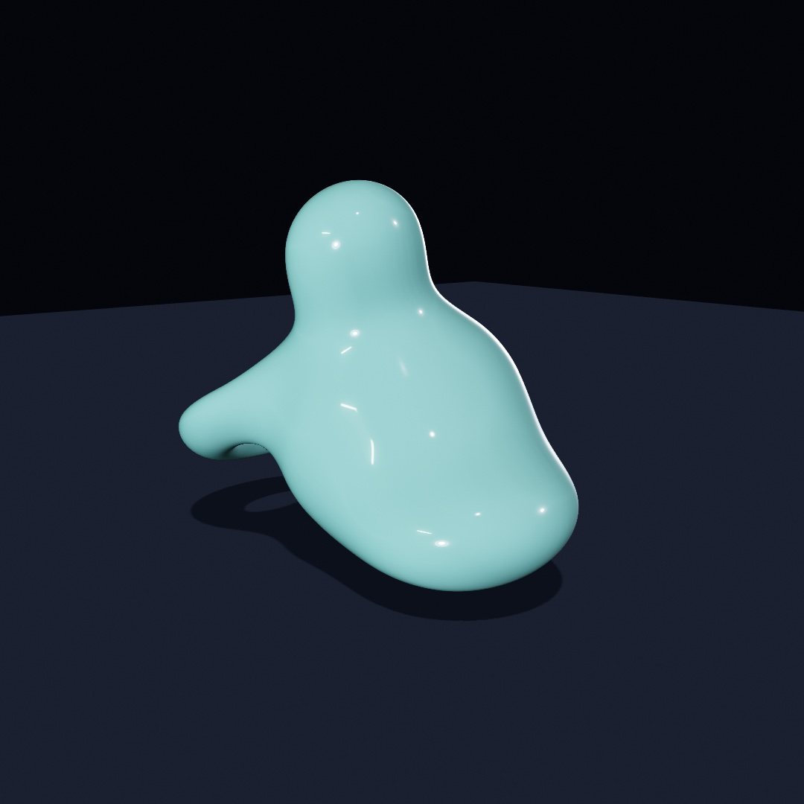
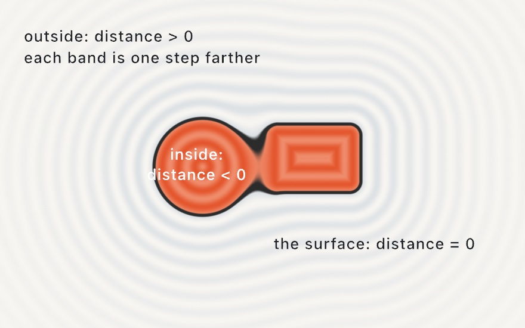
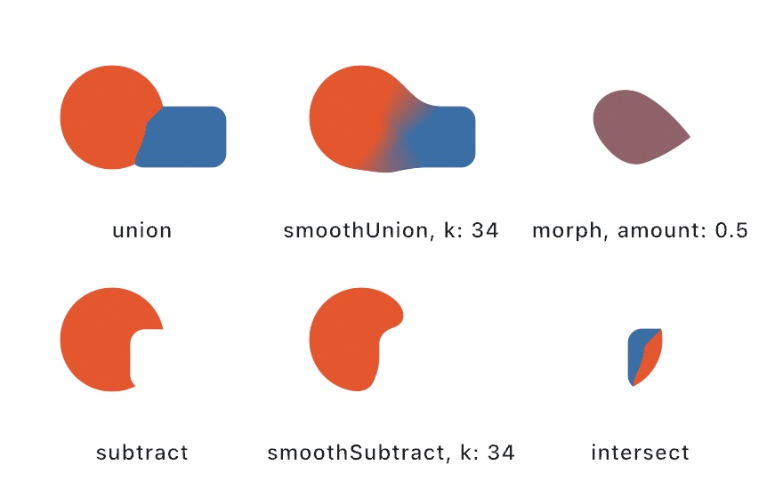
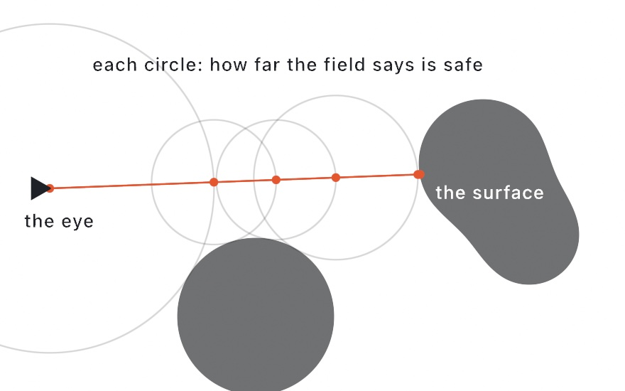
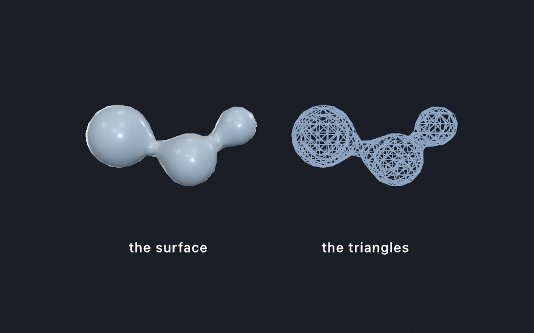
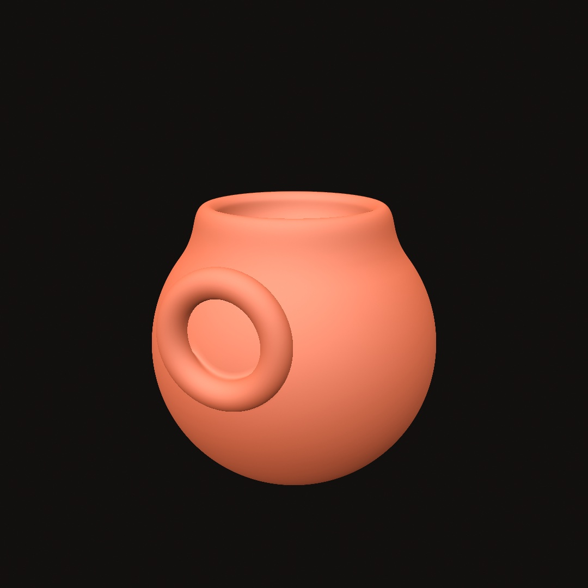
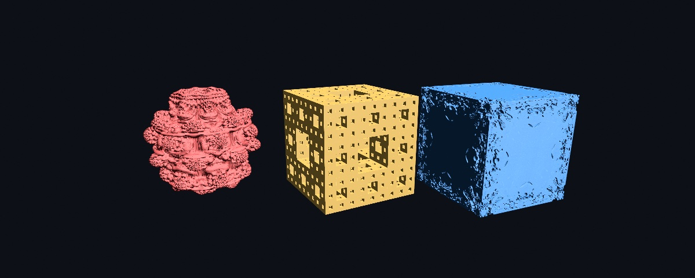

#### <sup>[Ollin](../README.md) → [Guide](README.md) → Chapter 30</sup>

---

# 30. Sculpting with fields



[Chapter 15](15-ShapesAsMaterial.md) treated shapes as outlines you cut and joined, like paper. This chapter treats them as something closer to wax. They melt into each other, carve each other, and hold together as one surface no matter how you push them. The tool is the **signed distance field**, an idea you've already met twice without the name. It ends in the sculpture above, one body made of four melted lobes, slowly breathing, orbitable with the mouse.

## A shape as a question

[Chapter 14](14-FieldsAndFlow.md) defined a field as an answer at every point. A **signed distance field** is a shape stored that way. Ask any point of the canvas and it answers with one number, *how far is the nearest surface*. The sign carries which side you're on. Positive is outside, negative is inside, and zero is exactly on the boundary.

<picture>
  <source media="(prefers-color-scheme: dark)" srcset="Images/30-SculptingWithFields/FieldMap-dark.jpg">
  
</picture>

That's the whole idea, and it's worth a slow look. The shape is not stored as an outline, and the *bold line* is only the places where the field happens to answer zero. [Chapter 18](18-YourFirstShader.md) used this trick per pixel (a circle was "all the points within `radius`", and `smoothstep` softened its edge). What's new here is what the representation makes possible, because if two shapes are each a distance function, then *combining the answers* combines the shapes.

## Melting

The everyday container for this is the `SDF` value type, and the first verb to learn is `smoothUnion`:

```swift
import Ollin

final class Melt: Sketch {
    override func draw() {
        background(Color(hex: 0x101318))
        noStroke()
        let k = 20 + (sin(time) * 0.5 + 0.5) * 90

        let blob = SDF.circle(radius: 130).colored(Color(hex: 0xE4572E))
            .smoothUnion(SDF.rect(width: 240, height: 140, cornerRadius: 28)
                .colored(Color(hex: 0x3A6EA5))
                .at(130, 40), k: k)

        drawSDF(blob.at(width / 2, height / 2))
    }
}
```

Run it and watch the seam. `SDF.circle` and `SDF.rect` are field *values*, like a `Shape` or a `Color`. From there `.at` moves one, `.colored` paints one, `.smoothUnion` merges two into a new field, and `drawSDF` rasterizes whatever field you hand it in a single pass. The parameter `k` is the width of the melt, in canvas points:

<picture>
  <source media="(prefers-color-scheme: dark)" srcset="Images/30-SculptingWithFields/MeltStrip-dark.jpg">
  
</picture>

At `k = 0` the union is hard, two shapes overlapping like [Chapter 15](15-ShapesAsMaterial.md). As `k` grows, the seam becomes a fillet, then a neck, then the pair is one body. Look at the colors. The smooth union blends the two operands' colors across the melt, and that is what makes the result read as one object rather than a trick. This one parameter is most of the medium, so put it on a `@Param` slider and you'll feel it immediately.

One habit is worth setting early, and it's that **order matters in the chain**. Every call wraps the field before it, so `circle.at(p).scaled(2)` scales the *moved* circle (it lands twice as far out), while `circle.scaled(2).at(p)` scales in place and then moves. Read chains inside out and they always make sense.

## The verbs

Melting is one verb of six:

<picture>
  <source media="(prefers-color-scheme: dark)" srcset="Images/30-SculptingWithFields/Verbs-dark.jpg">
  
</picture>

```swift
a.union(b)               // either
a.smoothUnion(b, k: 34)  // either, melted
a.subtract(b)            // a with b carved away
a.smoothSubtract(b, k: 34)
a.intersect(b)           // only the overlap
a.morph(b, amount: 0.5)  // a shape halfway between the two
```

These are [Chapter 15](15-ShapesAsMaterial.md)'s booleans reborn on fields, plus two things outlines can't do. The smooth forms are one. The other is `morph`, which blends the *boundary itself*, so at `0.5` you get a genuinely in-between shape rather than a crossfade. Two modifiers round out the kit. `.rounded(12)` inflates any field with soft corners, and `.onion(8)` hollows it into a shell. And past the melted family there's a whole *machined* family that shapes the seam like joinery instead of wax. It holds `chamferUnion`, `stairsUnion`, and `columnsUnion`, plus engrave, groove, tongue, and pipe detailing. The [combinators reference](../Docs/Drawing/Combinators.md#combining) has the full bench.

## Writing it like drawing

Building chains is precise, but sometimes you just want to draw. The block form captures ordinary draw calls and merges them:

```swift
translate(width / 2, height / 2)
fill(Color(hex: 0xE4572E))
smoothUnion(k: 18) {
    drawCircle(0, 0, 110)
    drawRect(center: Vector2(120, 30), width: 190, height: 80, cornerRadius: 20)
    drawNgon(-105, 40, 62, sides: 6)
}
```

Everything drawable with a fill can join a block, including shapes the `SDF` type doesn't name, like hearts, stars, and trapezoids. Each call's own `fill` becomes its color in the melt. It reads like normal drawing, and the block simply holds the shapes open until it closes, then merges them all.

## Into space

Everything above lifts into 3D nearly unchanged. `SDF3D` builds fields in space, and `drawSDF3D` draws the merged surface through [Chapter 25](25-3DGently.md)'s camera, lit by its lights, wearing its materials:

```swift
final class FirstMarch: Sketch {
    override func draw() {
        background(Color(hex: 0x0D1017))
        camera(.orbiting(target: .zero, radius: 5.2, azimuth: 0.5,
                         elevation: 0.3, fieldOfView: .pi / 4))
        material(.jade)

        let blob = SDF3D.sphere(radius: 1).colored(Color(hex: 0x39D0C8))
            .smoothUnion(SDF3D.sphere(radius: 0.72)
                .at(1.0, 0.42, 0.1)
                .colored(Color(hex: 0xFF4F97)), k: 0.5)
            .smoothSubtract(SDF3D.sphere(radius: 0.55).at(-0.45, 0.75, 0.5), k: 0.25)

        drawSDF3D(blob)
    }
}
```


Try building that from triangle meshes and you'll appreciate what just happened. The two spheres aren't two surfaces joined at a seam. They are *one* surface, because the field underneath is one function. The leaf catalog matches the mesh primitives. Sphere, box, torus, capsule, cylinder, cone, octahedron, and more are all there. So is `line(from:to:radius:)`, a stroke between two points that's perfect for sketching limbs and branches for the melt to flesh out. Fields and meshes coexist in one scene and correctly hide each other. The [combinators reference](../Docs/Drawing/Combinators.md#fields-3d) has the whole catalog.

## How the picture gets made: sphere tracing

A mesh is triangles, and the GPU knows how to draw triangles. A field is just a function, so how does it become pixels? By *asking it the right question, repeatedly*. For each pixel, a ray leaves the camera, and the field is asked how far the nearest surface is. The answer is a promise, nothing is closer than this, so the ray can safely hop exactly that far. Ask again, hop again:

<picture>
  <source media="(prefers-color-scheme: dark)" srcset="Images/30-SculptingWithFields/MarchRay-dark.jpg">
  
</picture>

The hops shrink as the ray nears a surface and grow again in open space, so the ray lands on the surface without ever stepping through it. Watch them tighten as the ray passes over the lower shape. This is called **sphere tracing**, and it's the second big advantage of the representation. The same number that let shapes melt is what steers the rays that draw them.

You get all of this without writing any of it. The one practical parameter is `raymarchQuality(_:)`. Tracing costs by the pixel, so the live window traces at a resolution budget by default while exports always render at full quality. If a heavy field stutters while you sketch, `raymarchQuality(.performance)` loosens that budget further.

## The other way out: field to mesh

Everything so far turns a field into pixels. Sometimes you want it to turn into an object instead.

`isosurface` walks a grid of cubes through space, asks the field for a value at every cube corner, and stitches the crossings into triangles. What comes back is an ordinary `Mesh`, so it lights, takes materials and shadows, and exports like anything else you draw.

The field worth reaching for first is `Metaballs`: soft spheres whose values add up.

```swift
var blobs = Metaballs()
blobs.add(at: Vector3(-0.9, 0.25, 0), radius: 0.62)
blobs.add(at: Vector3(0.5, -0.2, 0.15), radius: 0.52)
blobs.add(at: Vector3(1.4, 0.45, -0.2), radius: 0.40)
drawMesh(blobs.mesh())
```



`radius` is the size a ball reads at on its own. Put two within reach of each other and the values in the gap add up to more than either one makes there. The surface swells across it, and the pair runs together. Move them apart and the bridge necks down and snaps. `level` is the value the surface is drawn at. Lowering it fattens everything and makes blobs merge from further away, and raising it thins them until they separate. A negative `strength` carves into a neighbor instead of joining it.

The right panel is that same form with `wireframe()` on, marched deliberately coarse so the cells show. The left one is the same coarse mesh, and it still looks smooth. The shading normals come from the field rather than from the flat faces.

Any field works here, not just metaballs. The one thing to know is which side it treats as solid. The surface wraps the region where the field runs *above* the level. So a distance function, which is negative inside, needs a minus sign in front of it.

A field with corners is where the grid shows. Marching cubes can only put a vertex on an edge of the grid. A corner that falls inside a cube therefore comes out as a bevel across it. A block reads as a pebble at any resolution you can afford. Ask for `method: .dualContouring` and each cube gets one vertex where the field's own normals say the surface is. Three faces meet at a corner, so the vertex lands on the corner, and a bored hole keeps its rim.

```swift
let block = isosurface(at: 0, in: box, resolution: 14, method: .dualContouring) { p in
    let q = Vector3(abs(p.x) - 1, abs(p.y) - 1, abs(p.z) - 1)
    let walls = Vector3(max(q.x, 0), max(q.y, 0), max(q.z, 0)).length + min(max(q.x, max(q.y, q.z)), 0)
    let bore = (p.x * p.x + p.y * p.y).squareRoot() - 0.5
    return -max(walls, -bore)
}
```


Both blocks come from the same fourteen cells across. Only where the vertices sit differs. It costs a dozen extra reads of the field at every crossing. Reach for it when the field has edges to keep.

So there are two ways out of a field, and they cost differently. `drawSDF3D` shades straight to pixels and pays by the pixel. `isosurface` makes geometry and pays by the volume, cubically in `resolution`. Reach for the mesh when you need a real object, and for the traced field when you just want it on screen.

## One solid, two shadows

Here is a use for a mesh carved out of a volume that has nothing to do with fields, and it is the best argument for paying by the volume rather than by the pixel.

<picture>
  <source media="(prefers-color-scheme: dark)" srcset="Images/30-SculptingWithFields/TwoShadowsOneSolid-dark.jpg">
  
</picture>

```swift
let art = shadowArt(fromFront: ring, fromSide: cross, resolution: 56)
drawMesh(art.mesh)
```

A lit point casts its shadow along the light's direction. So a point can only be part of the solid if it lands inside the shadow in *every* direction it is lit from. Keep exactly those points and what is left is the largest solid that could cast them, which is why a shape that looks like neither shadow throws both.

**The shadows it really throws are never larger than the ones you asked for, and can be smaller.** The catch is that two views share an axis: the front and the side are seen from either end of the same vertical, so a row that is empty in one empties it in the other. Two silhouettes come out exact when they are solid in the same rows, which is why the classic circle-and-square works. Three agree far less often, and the famous three-shadow sculptures are designed around that rather than in spite of it. `art.shadow(from: .front)` hands back what is really thrown, and where it differs from what you asked for, it is the one that is true.

One practical trap if you show the solid beside flat panels, as the figure does. **Lights are per-frame state, not per-shape.** Calling `noLights()` after drawing the mesh, to keep the panels flat, unlights the mesh you already drew. Draw the flat things first, or leave the lights alone.

## Sculpting like clay

For forms you build up rather than compose, the `sculpt { }` block turns the operators into working state. Shapes `add()` on or `carve()` away, melting by the current `blend(_:)` amount, and the block reads top to bottom like a session at a potter's wheel:

```swift
sculpt {
    blend(0.3)                 // melt amount for what follows
    fill(Color(hex: 0xD96F4E))
    drawSphere(radius: 1.0)                                        // the body
    withState { translate(0, 0.95, 0)
                drawTorus(radius: 0.5, tube: 0.16) }               // a lip melts on
    carve()                    // now shapes cut away
    withState { translate(0, 1.1, 0); drawSphere(radius: 0.52) }   // the hollow
    add(); blend(0.05)         // back to adding, nearly hard
    withState { translate(0, 0.35, 1.05); rotateX(.pi / 2)
                drawTorus(radius: 0.34, tube: 0.09) }              // a handle
}
```



Flip one `add()` to `carve()` and a bump becomes a dent, which is exactly the kind of edit live coding thrives on. A further set of distortions bends whole forms. `.twisted(1.2)` screws a shape around its axis, `.bent(0.6)` curls it, and `.displaced` / `.roughened` ripple or roughen the surface, the rock look. They're all safe to stack, because the tracer compensates for the distortion on its own.

## Folding space: domain repetition

The last trick is the strangest one. Instead of copying a shape, you can fold the *space it lives in*, so one shape answers for many:

<picture>
  <source media="(prefers-color-scheme: dark)" srcset="Images/30-SculptingWithFields/DomainFold-dark.jpg">
  
</picture>

```swift
cluster.mirrored(x: true)                             // a facing pair
cluster.repeated(spacing: Vector2(88, 88), count: 1)  // a 3×3 tiling
petal.at(82, 0).repeatedRadially(count: 9)      // a rosette
```

There is still only one cluster. The domain operator rewrites each query point before the field answers, folding it across the mirror, wrapping it into a cell, or rotating it into a wedge. Copies are free, so a thousand-copy tiling costs what one copy costs. All three work in 3D too, where `repeatedRadially` fans a wedge around an axis and a mirrored melt becomes a symmetric creature. One honest caveat is worth knowing. The radial fold is exact when the repeated content is symmetric within its wedge. An asymmetric cluster can show a faint seam where the wedges meet, which is why the rosette panel uses a symmetric petal.

## Infinite detail: the fractal leaves

Every leaf so far had a distance you could write down. A sphere is the length of the point minus its radius, and the rest are a page of the same kind of algebra. Three leaves have no such formula at all:



```swift
SDF3D.mandelbulb(power: 8, iterations: 8, radius: 1.2)
SDF3D.mengerSponge(iterations: 3, size: 2.1)
SDF3D.mandelbox(scale: -1.5, iterations: 12, size: 2.2)
```

These three are fractals. Each one is a rule applied to a point over and over. The shape is the set of points the rule never flings away. There is no equation for that surface, so the field *estimates* its distance instead. It runs the rule a few times from the query point and watches how quickly the orbit escapes. A point about to be flung far must be far from the set. A point that keeps circling must be near it. That rate becomes a length the tracer can hop by. Everything else in this chapter then works unchanged. A fractal melts into a sphere. It carves a box. It mirrors and repeats.

`iterations` is the dial between detail and cost, since every hop runs the rule again. The bulb's `power` is its own shape. Eight is the classic. A fractional power is a different bulb, so sweeping it slowly gives the breathing animation people know it by. The box's `scale` plays the same role. One thing to expect: the finest detail you can see is set by the tracer, not by the fractal. To look deeper, make the leaf bigger and raise `iterations` rather than moving the camera in. The example `3D/Raymarching/RaymarchedFractals` puts each one's dial in the inspector.

## The light this needs

A field shades like a mesh, so the finishes of [Chapter 26](26-Meshes.md) reach it. `material(.jade)` gives a melt its glow, an `environment(_:)` lights it exactly as it lights a solid, and `castShadows()` grounds it. A field even self-shadows, and it trades shadows with the meshes around it. `material(.glass(...))` works on one too. A tinted interior deepens over the same distance it would inside the mesh of that shape. A green blob and a green ball come out the same green. What is left is the light itself: what it does when it bounces, what it does on its way through glass, and what a frame can borrow from the frames before it. Those are [Chapter 31](31-TracedLight.md)'s subject.

## Putting it together: molten

The finished sketch is a single body of four melted lobes, twisted a little. It's finished as a polished glaze, a smooth `.dielectric` rather than glass, under studio light, breathing slowly over a floor that catches its shadow. Make `MySketches/Molten.swift`:

```swift
import Ollin

final class Molten: Sketch {
    override func setup() { seed(9) }

    override func draw() {
        background(Color(hex: 0x0D1017))
        cameraShowcase(target: Vector3(0, 1.0, 0), radius: 6.4,
                       elevation: 0.2, fieldOfView: .pi / 4.2)
        environment(.studio.lightingOnly())
        toneMap(.aces, exposure: 1.05)
        directionalLight(Color(white: 0.85), direction: Vector3(-0.5, -1, -0.35),
                         intensity: 0.55)
        castShadows()

        // The floor that catches the sculpture's shadow.
        material(.matte)
        fill(Color(hex: 0x30343F))
        drawPlane(width: 30, depth: 30)

        // The glass: four lobes melting into one body, breathing.
        let breathe = 0.42 + signedNoise(time * 0.25) * 0.1
        let glass = Color(hex: 0x9FDCD3)
        let body = SDF3D.sphere(radius: 0.8).at(0, 0.85, 0)
            .smoothUnion(SDF3D.ellipsoid(radiusX: 0.62, radiusY: 0.4, radiusZ: 0.62)
                .at(0.72, 0.5, 0.25), k: breathe)
            .smoothUnion(SDF3D.torus(radius: 0.6, tube: 0.19)
                .at(-0.55, 1.25, -0.1).rotatedZ(0.5), k: 0.4)
            .smoothUnion(SDF3D.sphere(radius: 0.4).at(-0.2, 1.95, 0.3), k: 0.5)
            .twisted(0.3)
            .colored(glass)

        material(.dielectric(roughness: 0.07))
        drawSDF3D(body)
    }
}
```

The whole sculpture is four primitive lobes, three smooth unions, one twist, and a glassy finish. The breathing comes from `signedNoise` easing the first melt radius in and out. Notice the mesh floor and the traced field sharing the frame. The field drops its shadow onto the plane, and each would hide the other if they overlapped. That's the everyday reality of this chapter. Fields aren't a separate world, and they're one more kind of thing your scene draws.

Then make it yours:

- Replace a lobe with `SDF3D.line(from:to:radius:)` and grow the drop a limb. A few chained lines plus a big `k` is how creatures start.
- Wrap the body in `.repeatedRadially(count: 5)` (offset it from the axis first) and the drop becomes a chandelier.
- Trade the glass for `.metal(roughness: 0.15)` with `environment(.sunset)`, and add `rayTracedReflections()` if your Mac traces.
- Carve it, since one `smoothSubtract` of a big sphere turns the sculpture into a grotto.

## Where this comes from

Distance fields as a drawing medium are the craft of the demoscene and Shadertoy communities, and above all of Inigo Quilez. His catalogs of distance functions, the polynomial smooth minimum, and the raymarching articles underlie nearly everything here, and they are credited throughout Ollin's implementation. Sphere tracing was formalized by John C. Hart in 1996. The blobby, merging-spheres idea is much older, going back to Jim Blinn's 1982 "blobby model" and the metaballs of 1980s Japanese graphics research. The space-folding domain operators follow the hg_sdf library by the demogroup Mercury. The sculpt-block idea of building form by adding and carving under a melt radius is the working model of digital clay tools, studied from Shader Park's composable API. Full credits are in the project's [attribution notes](../ATTRIBUTION.md). The three fractal leaves have their own lineage: the Mandelbulb is Daniel White and Paul Nylander's 2009 find, the Mandelbox is Tom Lowe's from 2010, and the trick of estimating a fractal's distance from its escape rate goes back to Hart, Sandin, and Kauffman in 1989.

## Go deeper

- [SDF combinators](../Docs/Drawing/Combinators.md): the complete reference, including the machined joint family, gradient paint on merged fields, per-axis stretching, the infinite plane, the fractal leaves, and the quality dials.
- [Shadow art](../Docs/Generators/ShadowArt.md): the carving, what the solid really throws, and the rule for when two or three shadows can be cast at all.
- [Isosurfaces and metaballs](../Docs/Generators/Isosurface.md): the mesh route in full, including all three merge parameters, how the marching handles the faces that could be joined two ways, and the resolution and cost rules.
- [Combining 3D features](../Docs/3D/Combining.md): what fields take (materials, shadows, environments) and where they differ from meshes.
- Appendix B draws this chapter's math, one picture per idea: [Per-pixel thinking and distance](B-JustEnoughMath.md#per-pixel-thinking-and-distance).
- Worked examples for this section: [`Examples/3D/Materials/PhysicalMaterials`](../Examples/3D/Materials/PhysicalMaterials/Sketch.swift), [`Examples/3D/Materials/Glass`](../Examples/3D/Materials/Glass/Sketch.swift) (hold space to drop the traced view through the glass), [`Examples/3D/Environments/ImageBasedLighting`](../Examples/3D/Environments/ImageBasedLighting/Sketch.swift), [`EnvironmentGallery`](../Examples/3D/Environments/EnvironmentGallery/Sketch.swift) (steps through all twenty), and [`ProceduralSky`](../Examples/3D/Environments/ProceduralSky/Sketch.swift).
- Worked example for the mesh route: [`Examples/3D/Geometry/Metaballs`](../Examples/3D/Geometry/Metaballs/Sketch.swift), a cluster that keeps fusing and parting, with the merge level and the grid detail on parameters.
- Worked examples: [`Examples/Shapes/Combinators`](../Examples/Shapes/Combinators/Sketch.swift) and [`CombinatorsGradient`](../Examples/Shapes/CombinatorsGradient/Sketch.swift) in 2D; in 3D, [`Examples/3D/Raymarching/RaymarchedSDF`](../Examples/3D/Raymarching/RaymarchedSDF/Sketch.swift), [`RaymarchedShapes`](../Examples/3D/Raymarching/RaymarchedShapes/Sketch.swift), [`RaymarchedSculpt`](../Examples/3D/Raymarching/RaymarchedSculpt/Sketch.swift), [`RaymarchedClay`](../Examples/3D/Raymarching/RaymarchedClay/Sketch.swift), [`RaymarchedDomain`](../Examples/3D/Raymarching/RaymarchedDomain/Sketch.swift), [`RaymarchedRadial`](../Examples/3D/Raymarching/RaymarchedRadial/Sketch.swift), [`RaymarchedPlane`](../Examples/3D/Raymarching/RaymarchedPlane/Sketch.swift), and [`RaymarchedEnvironment`](../Examples/3D/Raymarching/RaymarchedEnvironment/Sketch.swift).

---

[Contents](README.md#contents) · Previous: [Chapter 29, Characters, vehicles, and cloth](29-CharactersAndCloth.md) · Next: [Chapter 31, Traced light](31-TracedLight.md)
