#### <sup>[Ollin](../README.md) → [Guide](README.md) → Chapter 30</sup>

---

# 30. Worlds with weight

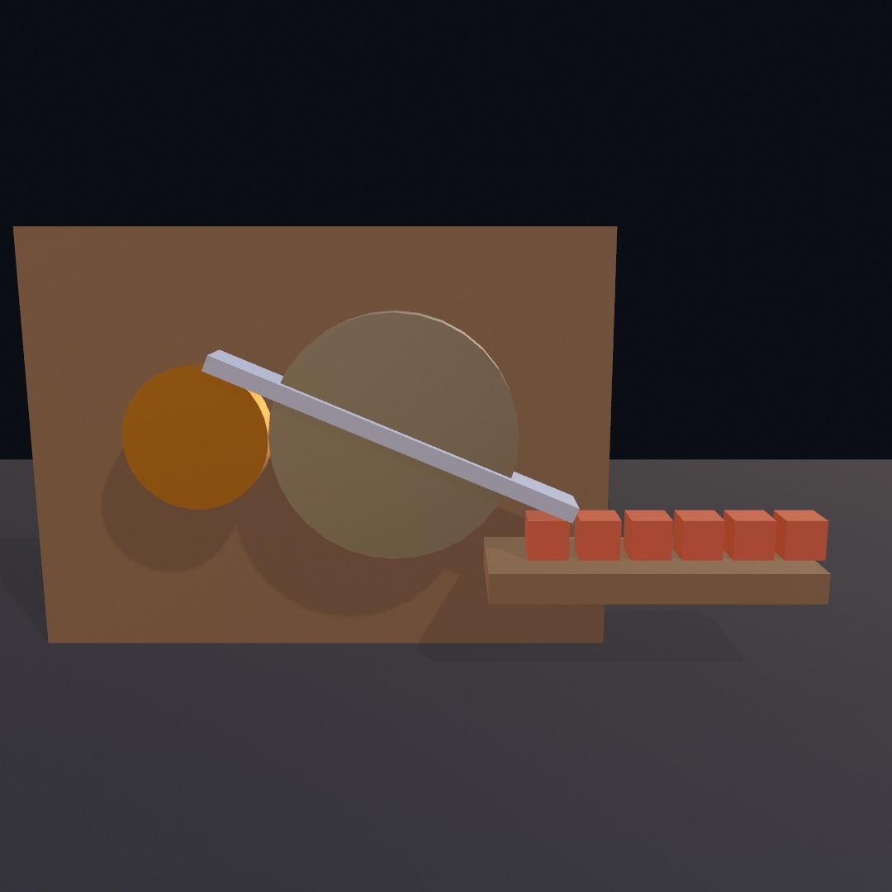

Weight turns a 3D scene into a machine: bodies fall and knock into each other, and joints let one motor run them. This chapter teaches bodies, joints with a motor and a gear, and groups of bodies that pass through each other. The contraption above runs on one motor with no keyframes, and its crates move only where the bar reaches them. The families after it cover contacts and queries, bodies held back, more joints, water and terrain, and snapshots of a settled world.

## Things with weight: `World3D` and bodies

[Chapter 11](11-ForcesAndPhysics.md) dropped flat shapes into a physics world and let gravity do the animating. The same world exists in 3D, and it fits the scenes [Chapter 26](26-3DGently.md) taught you to build. Crates stack, balls roll, and chains swing under the same lights and shadows as everything else. The 3D world comes with `import OllinPhysics`, like the 2D one, and it keeps the shape you already know. You build a `World3D` once, add bodies to it, and step it every frame.

```swift
let world = World3D()

override func setup() {
    world.ground = 0                     // a static floor at y = 0
    for level in 0 ..< 6 {
        world.addBody(.box(width: 1, height: 1, depth: 1),
                      at: Vector3(0, 0.6 + Double(level) * 1.04, 0))
    }
}

override func draw() {
    background(.black)
    cameraShowcase()
    world.advance(by: deltaTime)
    for body in world.bodies {
        withBody(body) { drawBox(width: 1, height: 1, depth: 1) }
    }
}
```

The one new move is `withBody`. In [Chapter 11](11-ForcesAndPhysics.md) you drew a body by translating to its `position` and rotating by its `angle`. A 3D body can turn about any axis in space, and one number cannot hold that. So `withBody(body) { }` moves the transform stack to the body's pose, and the block draws in the body's own space. Whatever you draw there moves with the body: a box the size of its collider, a loaded mesh, or a small assembly. It stays ordinary drawing, so materials, shadows, and export all apply.

That orientation is one value, a `Rotation3D`, and you can read it, set it, or build on it. `body.rotation = Rotation3D(angle: .pi / 4, axis: .unitZ)` leans a crate before it drops. `.unitZ` is the z axis as a `Vector3` of length one, and `.unitX` and `.unitY` name the other two. `body.rotation = .aboutY(0.1) * body.rotation` turns it a tenth of a radian further from wherever it is. The same value goes into `rotate(body.rotation)` when you pose something by hand rather than through `withBody`. The turn between two directions, and the turn part of the way toward another, are on the [geometry page](../Docs/Drawing/Geometry.md#rotation3d).

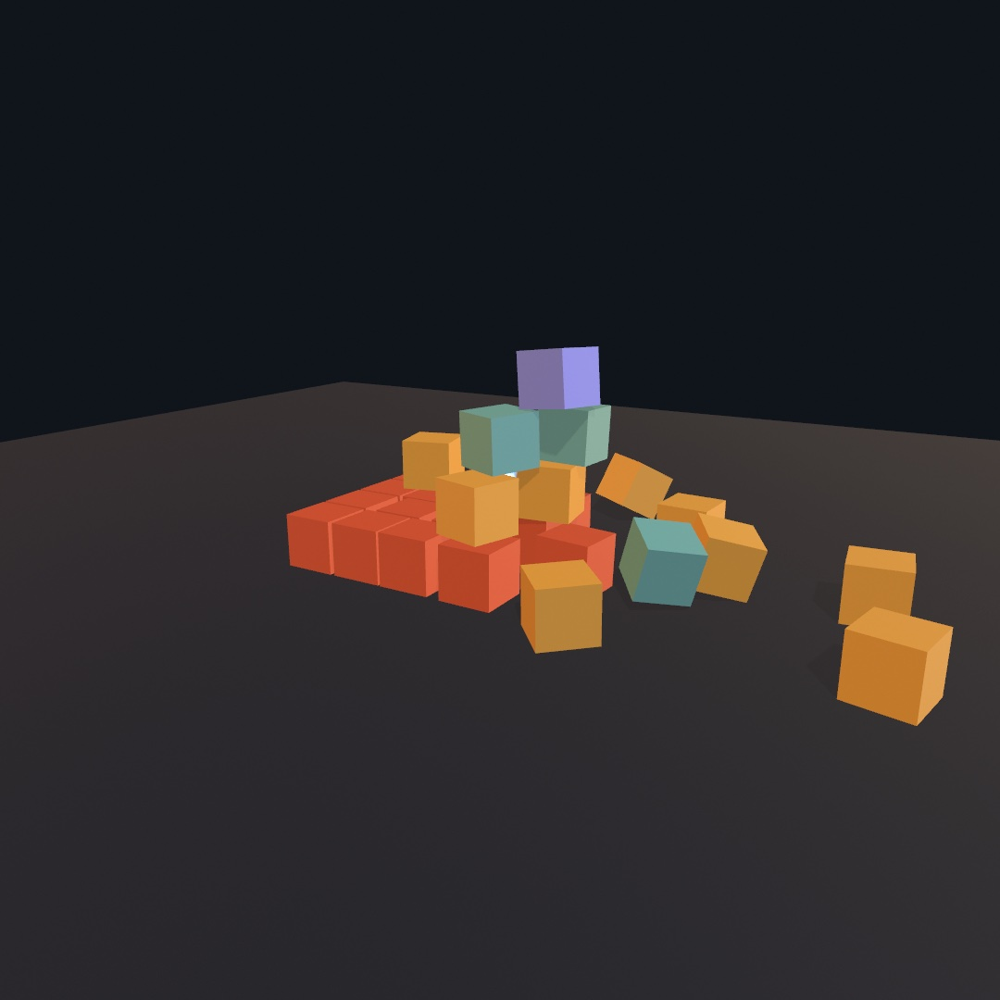

That pyramid is built the same way. Each crate is one `addBody` with a `.box` collider. A heavy steel ball is one more body, given a starting `velocity` that throws it into the pile. Nothing in the collapse is animated by hand, and nothing in it is random. The solver is deterministic, so the same steps on the same machine give the same wreck. An export steps on a fixed clock, so it replays the same collapse every run.

Colliders come from a small catalog. There are `.box`, `.sphere`, `.capsule`, and `.cylinder`, and their tapered relatives `.cone`, `.taperedCylinder`, and `.taperedCapsule`. A `.hull` wraps a convex solid around points of your own, and a static `.mesh` is for scenery that never moves. `connect` links bodies with joints. [Chapter 11](11-ForcesAndPhysics.md#hinges-and-a-handle-revolute-and-grab) showed the `.revolute` hinge and pointed to the slider, the weld, and the rod. 3D adds `.ball`, the free-swiveling socket a hanging chain is made of.

The cursor reaches through the camera too. `grabBody(at:in:)` finds the body under the mouse, and `dragGrab(_:to:)` slides it across the view at the depth it was picked. `dragBodies(in: world)` does the whole press, drag, and release as one call in `draw()`. It lets you dig through a pile in a running sketch. `drawBody(body)` draws a body as its collider, in the current fill and material. It knows every kind of collider, so a whole world can draw as one loop.

A body doesn't have to be one shape, either. `.compound` joins several colliders into a single rigid body, each part posed in the body's own space. The mass, the balance, and the spin all come from the whole assembly:

```swift
var parts: [Collider3D.Part] = [
    .part(.cylinder(height: 0.2, radius: 0.32),
          rotated: .pi / 2, axis: .unitX, density: 2),   // the metal hub
]
for arm in 0 ..< 4 {
    let angle = Double(arm) * .pi / 2
    parts.append(.part(.box(width: 1.5, height: 0.26, depth: 0.08),
                       at: Vector3(cos(angle), sin(angle), 0) * 1.11,
                       rotated: angle, axis: .unitZ))    // a blade
}
let cross = world.addBody(.compound(parts), at: hubCenter)
```

The result is a windmill's blade cross, five shapes in one body. A cylinder stands upright, so the hub takes a quarter turn about x to face the camera. A part's own `density` weighs it against the rest, which is how a hammer gets a head that leads its swing. `withBody` still draws the compound as one body, so inside the block you translate to each part's pose and draw its shape.

## Machines out of joints: motors, gears, and racks

A world of loose bodies is a pile. Joints make it a machine. [Chapter 11](11-ForcesAndPhysics.md#hinges-and-a-handle-revolute-and-grab) pinned two flat bodies together at one point with a `.revolute` hinge. In 3D a hinge also needs the line it turns about, its `axis`:

```swift
let mill = world.connect(tower, cross, .revolute(at: hubCenter, axis: .unitZ))
```

A hinge about `.unitZ` turns in the plane you face, like a wheel on a wall. A hinge about `.unitY` turns like a door. The slider is `.prismatic(at:axis:)`, which lets the second body travel along the axis and nothing else, like a drawer. Both take `limits`, a range measured from the pose they were built in, so 0 means "as built". A hinge's range is an angle in radians, and a slider's is a distance.

Hinges and sliders can be powered, and that is where a machine starts. The joint that `connect` hands back carries a small motor. `mill.drive(at: 2.5, strength: 500)` turns the windmill's hinge at a steady 2.5 radians a second. `drive(to: 0)` is a spring servo that seeks a pose and holds it there. `stopMotor()` cuts the power, and `friction` is the drag that slows a free-turning hinge down. `strength` caps how hard the motor may push. A weak servo holds its pose until something pushes harder, so a door closer set weak still lets a thrown ball push through.

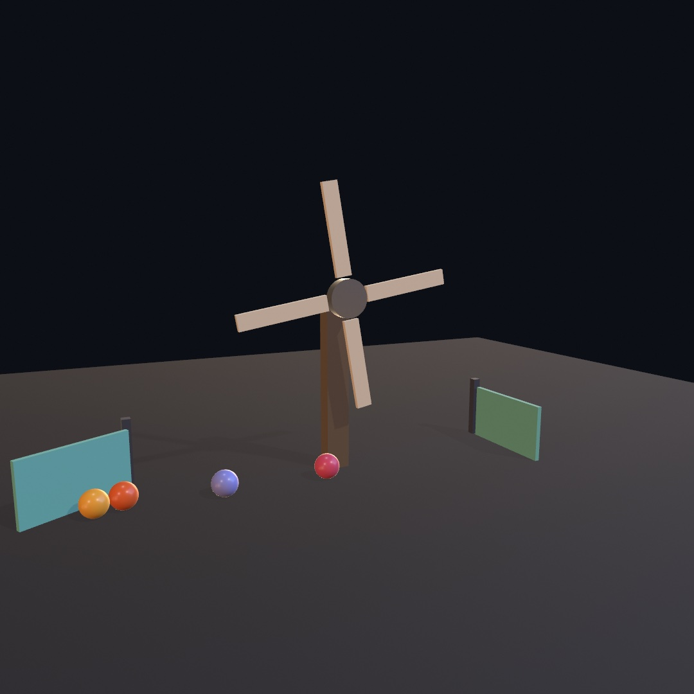

One motored hinge does all the turning here. The blade cross built above turns on a `.revolute` driven at a constant rate. The balls it knocks away roll toward swing gates on either side, and the left gate has swung open under two of them. Each gate is a hinge about `.unitY` with limits, and `softenLimits` makes its stops springy. A `drive(to: 0)` servo holds it shut, too weak to stop a rolling ball. The [`3D/Physics/Windmill`](../Examples/3D/Physics/Windmill/) example is the version to play with. The space bar cuts the motor, and hinge friction slows the mill to a stop.

A machine also needs one motion to cause another. A gear does that by connecting two hinges. What it ties together is the turning each hinge allows, so `connect` takes the two joints here rather than the two wheels:

```swift
let crankHinge = world.connect(wall, small, .revolute(at: smallHub, axis: .unitZ))
let bigHinge = world.connect(wall, big, .revolute(at: bigHub, axis: .unitZ))
world.connect(crankHinge, bigHinge, .gear(teeth: 20, and: 40))
```

Turn either hinge now and the other turns the opposite way, at the ratio of the teeth. Twenty teeth against forty is two to one, so the big wheel turns half as fast. The wheels themselves need no teeth, because the link does the meshing.

The gear's sibling is the rack and pinion. It ties a hinge to a slider, so that turning becomes sliding. The bar below slides on a `.prismatic` joint, and the link ties that slider to the big wheel's hinge:

```swift
let slide = world.connect(wall, bar,
                          .prismatic(at: barCenter, axis: .unitX,
                                     limits: -0.02 ... 1.5))
world.connect(bigHinge, slide,
              .rackAndPinion(travelPerTurn: 2 * .pi * pinionRadius))
```

The slider's range has to include 0, the pose it was built in, which is why this one starts just below it.

A pinion is a small toothed wheel that drives a toothed bar, the rack. Here it is a smaller disc fixed to the front of the big wheel. `travelPerTurn` is how far the bar runs for one full turn of the pinion. For a pinion of radius `r` that is its circumference, `2 * .pi * r`. The two links combine, and the machine below has one motor, two links, and three moving parts: two wheels and a bar.

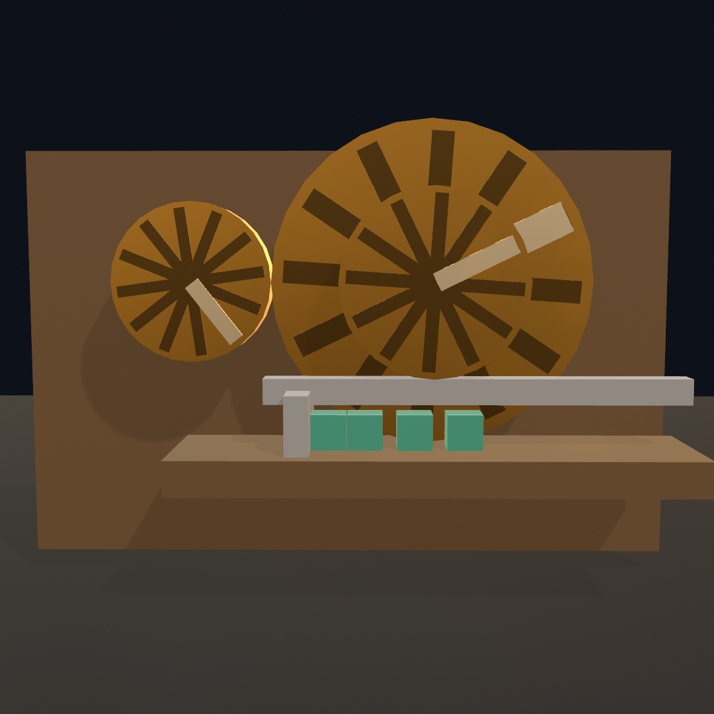

The motor only ever turns the small wheel. The big wheel turns because the gear link says it must, half as fast and the other way. The bar slides because the rack link turns the big wheel's turning into a distance along the shelf. Its paddle pushes the blocks ahead of it. Each wheel carries one pale spoke, so you can see the two are at different angles.

Those wheels touch at their rims, as meshed gears do. To the solver, two solids that touch are a collision to push apart, so plain cylinders set rim to rim jam against each other. The next step is the one line that lets them turn.

## Things that pass through each other: collision groups

Until now everything in a world has collided with everything else. Usually you want that, and the gears are the exception. Many scenes need a few exceptions like it. Sparks fly through the machine that threw them, a ghost walks through a door, and a laser stops at only some things.

You could do this with logic, checking who touched what and undoing it. Ollin has you name the rule instead. You put bodies in a named **group** when you build them, and then tell the world that two groups never touch:

```swift
let bead = world.addBody(.sphere(radius: 0.17), at: p, group: "passing")
world.ignoreCollisions(between: "passing", and: "grating")
```

You write a word where you build something, and one sentence saying what it does not touch. The picture below has two identical tubes, each with a solid shelf as its grating, and the same beads poured into each. The only difference is that the right pour is in a group the grating was told to ignore.

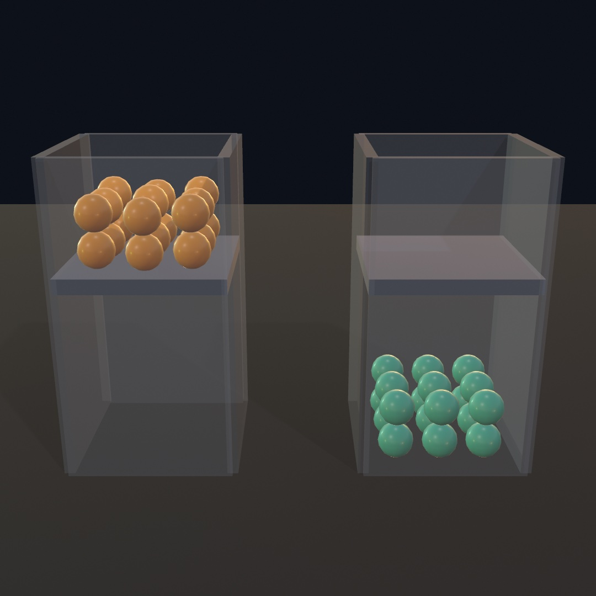

The rule has a few consequences.

**It reads both ways.** `ignoreCollisions(between: "passing", and: "grating")` states a fact about a pair. The beads cannot ignore the grating while the grating still stops the beads.

**A group name alone changes nothing.** A world where nobody has written an `ignoreCollisions` behaves like a world with no groups. So you can tag things as you build them and decide later what the tags mean. It also means a typo in a group name does nothing, which is the first thing to check when a rule seems to be ignored. `world.collisionGroups` lists every group the world has heard of, so a misspelled name shows up there as a group of its own.

**A group still collides with itself.** Two crates in one group stack normally. For confetti that drifts through itself, say so:

```swift
world.ignoreCollisions(between: "confetti", and: "confetti")
```

That same line is what lets the gears touch. Put every part of the machine's frame in one group and tell the group to ignore itself. The wheels then turn rim to rim while the gear link does the work.

Everything you can add to a world takes a group, the same way `addBody` takes a density. That covers bodies, soft bodies, and the static scenery that [the scenes and USD entry](#scenery-and-bodies-from-a-file-scenes-and-usd-physics) imports from a `Scene`. It also covers the characters, vehicles, and ragdolls of [Chapter 31](31-CharactersAndCloth.md). A rule holds everywhere the pair could meet. A filtered pair does not collide, and it does not turn up in the world's list of contacts or in a sensor. [The contacts and sensors entries](#asking-the-world-contacts-sensors-and-queries) explain those two. A character walks through it, another character included, and a vehicle's wheels do not feel it.

You can move a body between groups while it runs. `body.group = "debris"` takes effect on the world's next step, and the body is woken so the world looks at it again. A crate resting on a shelf drops through it once it joins a group the shelf ignores.

The [`3D/Physics/Sieve`](../Examples/3D/Physics/Sieve/) example is a sorting machine built from nothing else. Beads of three colors roll down one ramp with three windows set into it, and each window ignores one color. Press space and the three rules are withdrawn, and the same machine stops sorting.

## Putting it together: the contraption

The machine at the top of the chapter is built from the steps above. A motor turns one hinge at a steady rate, and a gear link turns the second. There are no keyframes in it, and no code that knows what time it is. Make a new file, `MySketches/Contraption.swift`:

```swift
import Foundation
import Ollin
import OllinPhysics

final class Contraption: Sketch {
    @Param("Speed", 0.5...6.0) var speed = 2.6
    @Param("Teeth", 10...40) var bigTeeth = 34

    let world = World3D()
    var crank: Joint3D?
    var crates: [Body3D] = []

    let timber = Color(hex: 0x8A6A4A)
    let brass = Color(hex: 0xD9A441)
    let steel = Color(hex: 0xB9C2CE)
    let clay = Color(hex: 0xD2603F)

    // The hubs sit exactly the two radii apart, so the wheels look like they
    // mesh. The gear link does not care, but the reader does.
    let smallHub = Vector3(-1.5, 2.4, 0)
    let bigHub = Vector3(0.4, 2.4, 0)

    override func setup() {
        world.ground = 0
        world.restitution = 0.15

        // Gear teeth have to mesh, and two cylinders that touch would jam
        // instead. Nothing in the frame needs to collide with the rest of it.
        world.ignoreCollisions(between: "frame", and: "frame")

        let wall = world.addBody(.box(width: 6.0, height: 4.4, depth: 0.25),
                                 at: Vector3(-0.4, 2.2, -0.75), kind: .static,
                                 group: "frame")
        wall.userData = timber

        // A cylinder stands upright, so each wheel takes a quarter turn about
        // x to lay its axle along z, facing the camera.
        let small = world.addBody(.compound([
            .part(.cylinder(height: 0.3, radius: 0.7), rotated: .pi / 2, axis: .unitX, density: 3),
        ]), at: smallHub, group: "frame")
        small.userData = brass

        let big = world.addBody(.compound([
            .part(.cylinder(height: 0.3, radius: 1.2), rotated: .pi / 2, axis: .unitX, density: 3),
            .part(.box(width: 3.8, height: 0.16, depth: 0.5), density: 3),
        ]), at: bigHub, group: "frame")
        big.userData = steel

        let smallHinge = world.connect(wall, small, .revolute(at: smallHub, axis: .unitZ))
        let bigHinge = world.connect(wall, big, .revolute(at: bigHub, axis: .unitZ))
        world.connect(smallHinge, bigHinge, .gear(teeth: 20, and: bigTeeth))
        crank = smallHinge

        let shelf = world.addBody(.box(width: 3.2, height: 0.3, depth: 1.2),
                                  at: Vector3(2.9, 1.05, 0), kind: .static, group: "frame")
        shelf.userData = timber

        for i in 0 ..< 6 {
            let crate = world.addBody(.box(width: 0.4, height: 0.4, depth: 0.4),
                                      at: Vector3(1.9 + Double(i) * 0.5, 1.45, 0))
            crate.userData = clay
            crates.append(crate)
        }
    }

    override func draw() {
        background(Color(hex: 0x0B0E14))
        environment(.courtyard.lightingOnly())
        lightingPreset(.studio)
        castShadows()
        perspective(eye: Vector3(0.9, 4.2, 9.4), target: Vector3(0.9, 2.3, 0),
                    fieldOfView: 0.85)

        crank?.drive(at: speed, strength: 900)
        world.advance(by: deltaTime)

        // A crate swept off the shelf goes back on it, so the machine never
        // runs out of work to do.
        for (i, crate) in crates.enumerated() where crate.position.y < 0.6 {
            crate.position = Vector3(1.9 + Double(i) * 0.5, 1.7, 0)
            crate.velocity = .zero
            crate.angularVelocity = .zero
        }

        // A floor for the shadows to land on. It is drawn rather than added
        // to the world, because `world.ground` is already the plane bodies
        // rest on and a second one would only fight it.
        noStroke()
        fill(Color(hex: 0x2A2F3A))
        material(.dielectric(roughness: 0.9))
        withState {
            translate(0, -0.1, 0)
            drawBox(width: 26, height: 0.2, depth: 20)
        }

        for body in world.bodies {
            withBody(body) { draw(body.collider, tint: body.userData as? Color) }
        }
    }

    // Bodies come back as colliders, so one recursive helper draws the kinds
    // this machine uses, and a compound draws its parts in their own frames.
    func draw(_ collider: Collider3D, tint: Color?) {
        switch collider {
        case .box(let w, let h, let d):
            fill(tint ?? .white)
            material(.dielectric(roughness: 0.65))
            drawBox(width: w, height: h, depth: d)
        case .cylinder(let h, let r):
            fill(tint ?? steel)
            material(.metal(roughness: 0.38))
            drawCylinder(radius: r, height: h)
        case .compound(let parts):
            for part in parts {
                withState {
                    translate(part.position)
                    if part.angle != 0 { rotate(part.angle, axis: part.axis) }
                    draw(part.collider, tint: tint)
                }
            }
        default:
            break
        }
    }
}
```

Run it, then drag the speed. Here is how the steps show up in it:

- **Things with weight.** The world has a `ground` and a little bounce, `restitution` as in [Chapter 11](11-ForcesAndPhysics.md). The wall and the shelf are `.static`, so nothing moves them. Each wheel is a `.compound` whose cylinder takes a quarter turn about x, and the big wheel's second part is the bar. Each body keeps its color in `userData`, the way Chapter 11's bricks did.
- **Machines out of joints.** Two `.revolute` hinges hold the wheels to the wall, and `.gear(teeth:and:)` links the two joints. `crank?.drive(at:strength:)` asks the small hinge for a rate every frame. It pushes up to `strength` to get it, so a jammed machine stalls. The Teeth parameter is read once, in `setup()`, so it takes effect on the next save rather than while you drag it.
- **Collision groups.** The wall, the wheels, and the shelf are all in `"frame"`, which ignores itself. The wheels touch rim to rim, and the bar passes over the small wheel and the end of the shelf without striking them. The crates are in no group, so the bar and the shelf still stop them.
- **Contact.** The crates are the only moving bodies with no joint at all. Everything that happens to them is contact, and a crate that falls off the shelf is put back on it. They tumble differently on every live run, because each live step is as long as the frame took.
- `withBody(body) { ... }` puts the transform stack in each body's pose, and the helper only has to know about shapes. `drawBody` would draw every shape in one fill and material. The helper gives the cylinders a metal finish and the boxes a matte one, and a compound draws its parts in their own frames.

> **Swift note.** `crank` is optional because `setup()` fills it, so `crank?.drive(...)` is the optional chaining of [Chapter 9](09-Pictures.md). The helper is also named `draw`. Swift tells two functions apart by their arguments, so `draw(_:tint:)` and the sketch's own `draw()` never mix. Its `switch` works like [Chapter 22](22-IteratedForms.md)'s switch over a number, with one addition. A case such as `.box(let w, let h, let d)` matches a box and names the three sizes it carries. `body.userData as? Color` and `tint ?? .white` read the color back as Chapter 11's bricks did.

Before moving on, make it yours:

- Change `bigTeeth`'s default and save, so `setup()` builds the gear again. The ratio changes and the drawn wheels do not, because the link knows nothing about their size. Then change the big wheel's radius and hub to match.
- Take out the `ignoreCollisions` line. The bar now strikes the small wheel and the shelf on its way round, and the motor stalls against them.
- Keep `big` in a property, so `draw()` can reach it. The end of the bar is `big.position + Vector3(1.9, 0, 0).rotated(by: big.rotation)`. `rotated(by:)` turns a vector by a rotation. Cast a `raycast` straight down from there and draw where it lands. The queries in the family after this explain the call.

The machine runs on its own, so keep it as a video. `swift run OllinLive MySketches/Contraption.swift --export-video contraption.mp4 --seconds 12` records the first twelve seconds. An export steps the world on a fixed clock, so the crates fall the same way every time you record it.

## Asking the world: contacts, sensors, and queries

The contraption never asks its world anything. It puts a crate back by reading the crate's height, and it never learns that the bar touched it. A world can tell you when two things meet, keep count of what is inside a region, and answer questions about what is where. Together they let a sketch react to its world.

### What hit what: contacts

A contact is the world's record that two bodies met during a step. It is for the moments a sketch should answer. A ball reached the goal, a crate landed hard, or two cars touched, and a sound, a spark, or a score follows. Every rigid-body solver finds these contacts to push the bodies apart. Ollin keeps them as a list after each `advance(by:)`, and `draw()` reads the list the way it reads the mouse:

```swift
world.advance(by: deltaTime)
for contact in world.contacts where contact.phase == .began {
    guard contact.speed > 1.4 else { continue }   // too soft to hear
    knocks.append(Knock(at: contact.point, strength: contact.speed))
}
```

Nothing interrupts your code in the middle of a step. The list belongs to the step that filled it. Each `Contact3D` names the two bodies that met, as `a` and `b`. `contact.other(than: ball)` hands back the one that is not the ball. It also says where they met, which way the surfaces faced, and `speed`, how fast they were closing. The speed is measured before the solver answers the collision, so it is the size of the impact. That one number can set the volume of a clink, the size of a spark, or the brightness of a flash. Contacts are per pair of bodies, so a crate landing on a mesh floor is one arrival rather than one for each triangle under it.

Solids can break on impact, too, the way flat shapes broke in [Chapter 11](11-ForcesAndPhysics.md#breaking-things). `Mesh.fractured(into:around:seed:)` cuts a 3D mesh into convex cells, and `world.addBody(.hull(cell.positions), at: …)` makes each cell a body. A contact's `speed` is the thing to read for the moment to break it. The [`3D/Physics/Burst`](../Examples/3D/Physics/Burst/) example throws solids up and breaks each one at the top of its arc.

### A region that counts what is inside: sensors

A sensor is a body that is not solid. Things pass through it untouched, and it tells you who is inside. It is for goals, pressure plates, and zones, anywhere the question is "what is in here?". Game engines call such a region a trigger or a sensor, and Jolt, the solver under this chapter, calls it a sensor. The picture shows a hoop that scores and a tray that counts.

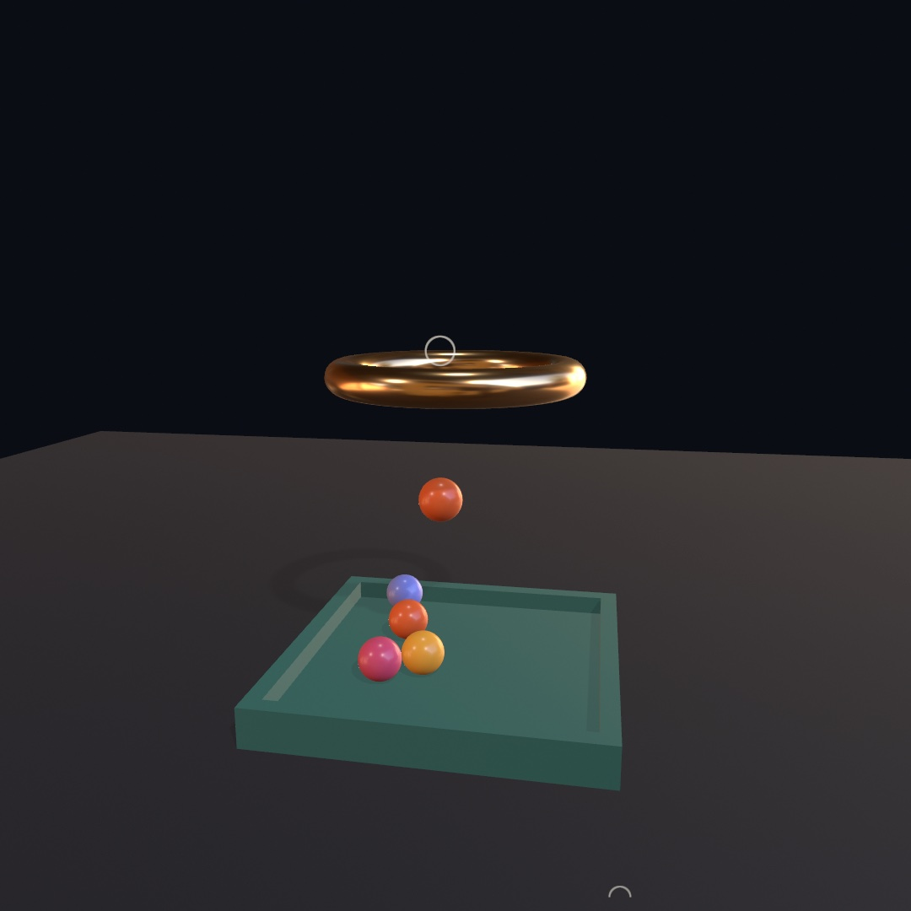

You make one with `isSensor: true`:

```swift
let goal = world.addBody(.cylinder(height: 0.5, radius: 0.93),
                         at: hoopCenter, isSensor: true)

score += goal.arrivals.count           // entered during this step
let crossing = !goal.touching.isEmpty // one is in there right now
```

The hoop is two bodies in the same place. There is a solid rim of beads a ball can bounce off, and a sensor disc filling the hole. Only a ball that gets through enters the sensor, so `goal.arrivals` works as a scoreboard, and the ring lights while a ball is crossing. The tray below is a sensor too, and its color comes from `touching.count`.

The tray also shows why sensors are built the way they are. A ball that settles in it stops moving, and the solver puts anything that has stopped moving to sleep to save the work. A sleeping body reports no contacts, so a still stack reads as touching nothing. A sensor never sleeps, so it goes on counting the balls parked in it long after they have stopped. Contacts are for the moment something happens, and a sensor is for the standing question of what is inside. In the [`3D/Physics/Trigger`](../Examples/3D/Physics/Trigger/) example you can drag a ball and post it through the hoop by hand.

### What is in the way: rays, sweeps, and overlaps

Contacts tell you what the solver noticed while it was stepping. Often you want something it was never asked. Can the lamp see a crate? How far is the floor below a point in the air? What is standing inside a circle you just made up? A query asks the world such a question between steps. It is how game engines give their characters line of sight, footing, and a blast radius, and Jolt calls the moving kinds casts. The yard below uses all three kinds.

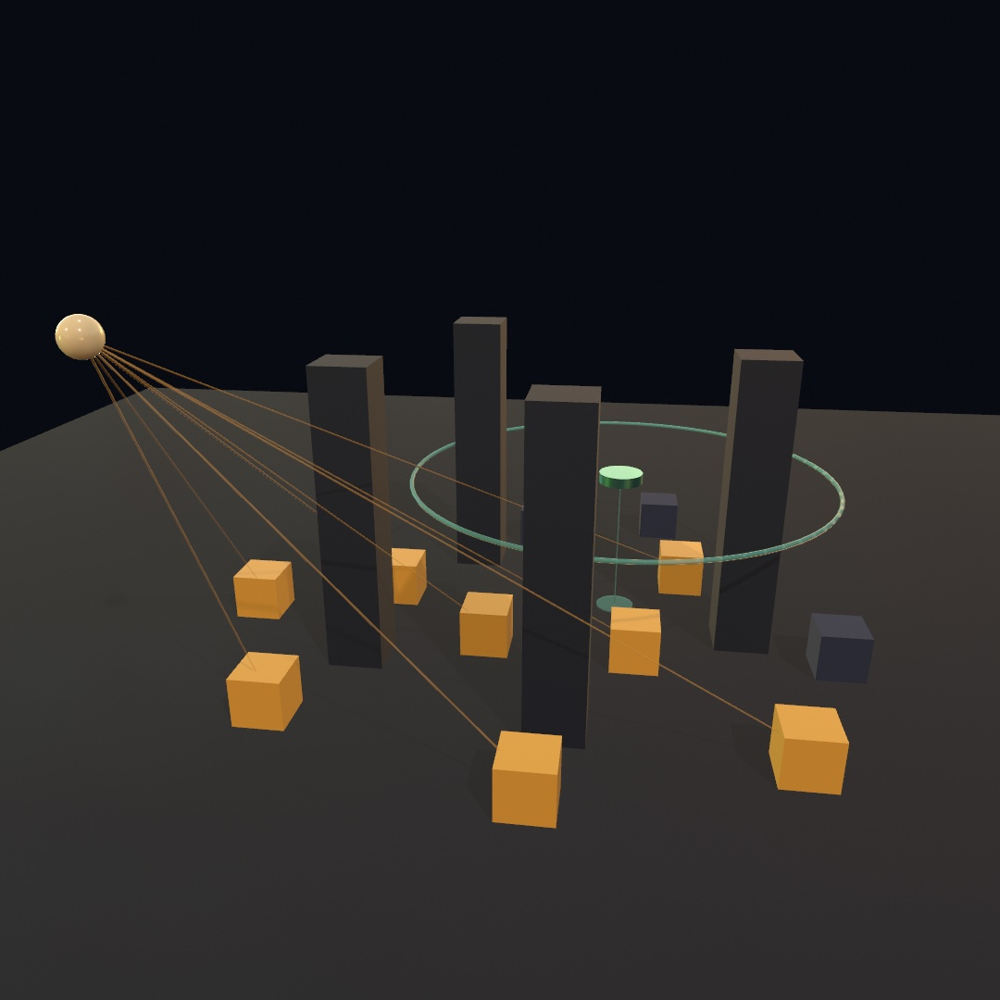

The beams are one ray per crate, so the two crates behind the pillars stay dark. The drone holds its height with a sweep straight down, and the disc under it is where the sweep stopped. The ring is the sphere an overlap asked with, drawn at its own radius as it fades.

**A ray** is a line with a start and an end, and it comes back holding the first thing in the way:

```swift
if let hit = world.raycast(from: lamp, to: crate.position) {
    lit = hit.body === crate        // nothing got in first
}
```

That second line is line of sight. The crate is visible when the crate is what the ray found. Put a pillar between them and the ray comes back holding the pillar. `===` asks whether two names point at the same body, rather than at two bodies that look alike.

A `Hit3D` says which body it found and the `point` where it touched. It gives the `normal`, which way the surface faces there, and that is what a bounce or a scorch mark is built from. It also gives the `distance`, how far along the query the touch was. Aim the same call downward and the distance is the height of the drop:

```swift
let drop = world.raycast(from: p, to: p - Vector3(0, 20, 0))?.distance
```

**A sweep** is a ray with a body. It slides a whole shape along the line and reports what the shape runs into:

```swift
let below = world.sweep(.sphere(radius: 0.55), from: overhead, to: patrol)
```

A ray asks what is in the way, and a sweep asks whether something fits. A sweep is often the better question. A ray threads a gap a shoulder would never get through, and it drops between two crates onto a floor a drone could never reach. Any collider shape a body can have works as the probe, turned however you like with `rotated:` and `axis:`. The two exceptions are the colliders that describe scenery, a mesh and a heightfield.

**An overlap** asks what is inside a region right now:

```swift
for caught in world.bodiesOverlapping(.sphere(radius: 3.2), at: blast) {
    guard let body = caught as? Body3D else { continue }   // only a solid takes one
    let away = body.position - blast
    let falloff = 1 - min(1, away.length / 3.2)
    body.applyImpulse((away.normalized + Vector3(0, 0.6, 0)) * (2.4 + 5 * falloff))
}
```

Those few lines are a blast radius, and the sphere they asked with never existed. `applyImpulse` is a kick: a change of speed handed over in one step, where a force would act over time. The push points away from the blast and a little upward, and it is strongest near the middle. You could build a sensor there and read `touching` instead, and for a standing question, like the tray's, you should. But a sensor has to exist before the moment and be cleared away after. An overlap is a question asked once, anywhere, with a shape made up in that line. `bodiesContaining(point)` asks the same question with no shape at all.

A few habits help. Queries skip sensors unless you pass `includingSensors: true`. They do see soft bodies, so a hanging sheet blocks a ray. `ignoring:` lets something cast from inside itself, which is how a robot looks out past its own body. None of this steps the world, so you can ask once per crate every frame and find everything where you left it.

Groups change what a query sees, too. Every query takes `as:`, which asks it the way a body of that group would ask it:

```swift
world.ignoreCollisions(between: "bullets", and: "glass")

world.raycast(from: muzzle, to: target)                  // stops at the pane
world.raycast(from: muzzle, to: target, as: "bullets")   // goes right through
```

That turns filtering into something you can aim with. A sight line can ignore foliage, and a ground probe can ignore the character doing the probing. A targeting ray can see only what its own shot would hit. In the [`3D/Physics/Sightlines`](../Examples/3D/Physics/Sightlines/) example you can drag a crate into cover and watch its beam go out.

## A body held back on its own: degrees of freedom, gravity scale, and path checks

The contraption's wheels can only turn, because their hinges allow nothing else. Every other body in it moves any way a push sends it, and falls as hard as the rest. The world also tests each body only where a step leaves it. Those three things can be set on a body directly, with no joint at all.

### Taking a direction away: degrees of freedom

A rigid body can do six things. It travels along three axes and turns about three, and mechanics calls these its six degrees of freedom. You can take any of the six away. Taking one away is for flat worlds, like a pin table, a machine seen from the side, or a puzzle of sliding tiles. Building one in 2D gives up the lighting, the shadows, and the solid shapes. Building it in 3D lets every collision push things toward and away from the camera, until the world stops reading as flat. So you tell the bodies they may not go that way.

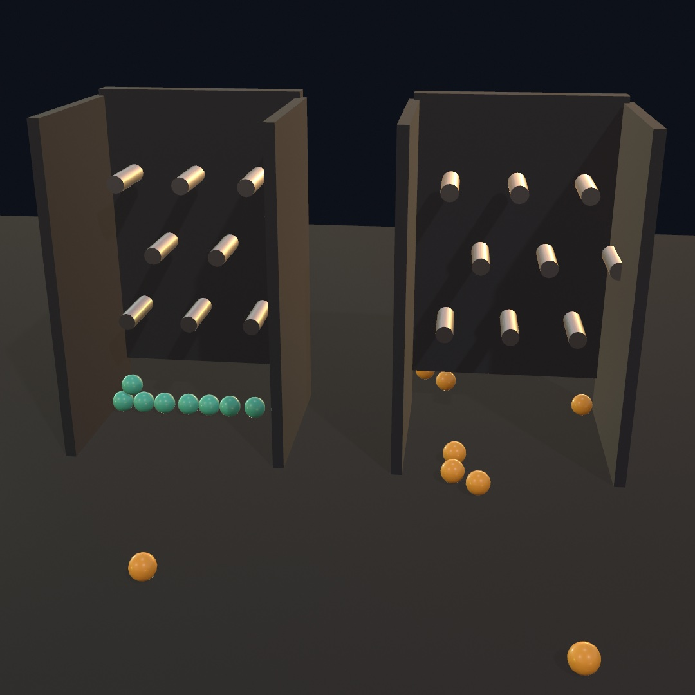

Those are two identical pin boards. The same beads are poured down each, one at a time. Most beads get a nudge toward or away from the camera on the way down. Both boards get the same nudges. The beads on the left are held to the board's plane, and the ones on the right are not:

```swift
let bead = world.addBody(.sphere(radius: 0.17), at: p, freedom: .plane())
```

The left beads had nowhere to put that nudge, so they landed in one flat row. The right ones took it, and most rolled out of the open front. A locked direction is gone from the body. Gravity, a contact, a joint, and a velocity you set yourself all fail to move it that way.

The useful combinations have names, and you can spell out anything else:

<!-- snippet: skip a list of the named values to choose from, not code to type -->
```swift
.all                        // the default
.plane()                    // travels in x and y, turns about z: a flat world
.plane(normal: .unitY)      // travels in x and z, turns about y: a top view
.upright                    // travels any way, turns only about up, never tips
.noTurning                  // slides and is shoved, never spins
.noMoving                   // spins where it is, never travels
[.moveX, .turnZ]
```

`.upright` is the other common one. It suits a fridge on a dolly, a chess piece, or anything that should slide and turn without falling over. A tilted plane is the one thing you cannot ask for. The solver takes away whole world axes, so `.plane(normal:)` rounds its normal to the nearest one.

### A pull of its own: `gravityScale`

`gravityScale` is how hard the world pulls on one body, against the `1` everything else feels. It is for a balloon and a feather in the same world as a crate. Rigid-body engines keep this as a gravity factor on each body.

```swift
balloon.gravityScale = -0.3      // rises
feather.gravityScale = 0.15      // falls about a seventh as far in the same second
```

### Too fast for a thin wall: `checksPath`

`checksPath` makes the solver test a body's whole path through a step, not only where the step leaves it. It is for things that are small and quick. A body can cover more than its own width in one step. It can then be in front of a thin wall at one step and past it at the next, having touched nothing. Engines answer this with continuous collision detection, which tests the whole motion rather than where it ended. Turn it on and the solver sweeps the body's shape along its path:

```swift
let pellet = world.addBody(.sphere(radius: 0.05), at: muzzle, checksPath: true)
pellet.velocity = Vector3(0, 0, 120)
```

It is off by default because it costs a little. The check only runs once a body is moving fast for its size, so an ordinary throw lands in the same spot either way. Turn it on for bullets, pellets, and anything you fire.

All three settings can be passed when you add a body and changed while it runs. The [`3D/Physics/Bagatelle`](../Examples/3D/Physics/Bagatelle/) example is a pin table with all three on parameters. You can flatten the balls or free them, and make them heavy or weightless. A shot fired fast enough leaves through a thin rail the moment you stop checking its path.

## More joints: a track, a pulley, a list of freedoms, and cables

The contraption is two hinges and a gear link. A machine can want other kinds of joint. A car follows a track, and a rope lifts one thing as another falls. A mount allows exactly the motions you name, and a cable only pulls.

### A cart on a track: the path joint

A path joint threads the second body onto a smooth curve through a list of points. The body can travel along the curve and nothing else. It is for a rollercoaster car, a bead on a wire, or a camera on a dolly rail. Physics engines call this a path constraint, and Jolt's, with a curve that passes through every point, is the one under it. The picture shows a cart banked into a bend on the left, and a pulley on the right, the next entry's joint.

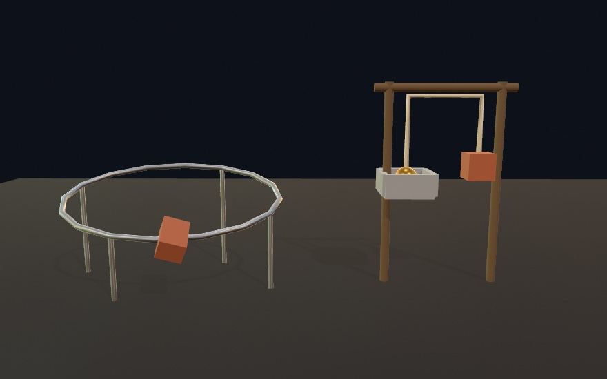

Hand `.path` the points, and the returned joint drives along it like any other:

```swift
let track = world.connect(rails, cart,
                          .path(through: points, looping: true,
                                alignment: .followsPath))
track.drive(at: 3.9, strength: 400)   // world units per second along the track
track.progress              // 0 at the first point, 1 at the last
```

The curve runs through the points rather than between them, so a dozen of them describe a long smooth track. `alignment` decides how much of the body's turning the track takes over. `.free` leaves it tumbling, and `.followsPath` banks it into every bend, which is why the cart in the picture leans. A flat `Contour` becomes a track on the ground in one call, `.path(contour, atHeight: 0.3)`. So you can draw the route with the curve tools from [Chapter 16](16-CurvesAndFigures.md) and then send a body along it.

### A rope over two hooks: the pulley

A pulley ties two bodies to one length of rope, so one side rising is the other falling. It is for a lift, a counterweight, or a hoist. The pulley is one of the oldest machines, and the block and tackle, a rope threaded more than once, trades distance for force. `.pulley` reads the way you would trace the rope with a finger:

```swift
world.connect(tray, counterweight,
              .pulley(from: trayTop, over: leftHook,
                      and: rightHook, to: weightTop))
```

A rope resists being pulled longer and goes slack when it is let go. So both ends can drop together, but the rope never stretches. In the picture above, the tray and the counterweight pass each other because the rope ties their motions together. `ratio: 2` threads the second side twice, which is a block and tackle. That side moves half as far and lifts twice as much.

### The joint that is a list of freedoms: `.allowing`

Every joint so far keeps some of the six things a body can do, the degrees of freedom from the family before this one. When none of the named kinds fits, `.allowing` says which ones you are keeping. Game engines call this a six-degree-of-freedom joint, since each of the six is a separate choice.

```swift
// A post a platter turns on: it may rise and it may spin, and nothing else.
world.connect(post, platter,
              .allowing([.moveY, .turnY], at: top, travel: 0...1.4))
```

`.allowing([], at: p)` is a weld. `.allowing([.turnX, .turnY, .turnZ], at: p)` is a ball joint. One turn with a range is a hinge. Writing those three out once shows what the named joints are made of.

The [`3D/Physics/Contraption`](../Examples/3D/Physics/Contraption/) example is a workshop with one of each. It has a drive train, a hoist you can load, a platter allowed only to rise and spin, and a cart on a track. You can drag any of it.

### Standing on cables: tensegrity

A tensegrity is a structure of struts that never touch. Cables hold them apart. Each strut pushes, the cables around it pull back just as hard, and the structure stands with no strut resting on another. It is for sculpture, masts, and forms that look like they should fall. Kenneth Snelson built them as sculpture, and Buckminster Fuller gave them their name. Gego hung rods on joints with no cables at all, and the homage in Go deeper is that structure in this chapter's world. The six-strut ball is Børge Jessen's icosahedron from 1967. The stacked mast follows Robert Skelton and Mauricio de Oliveira's stacking of prisms from 2009.

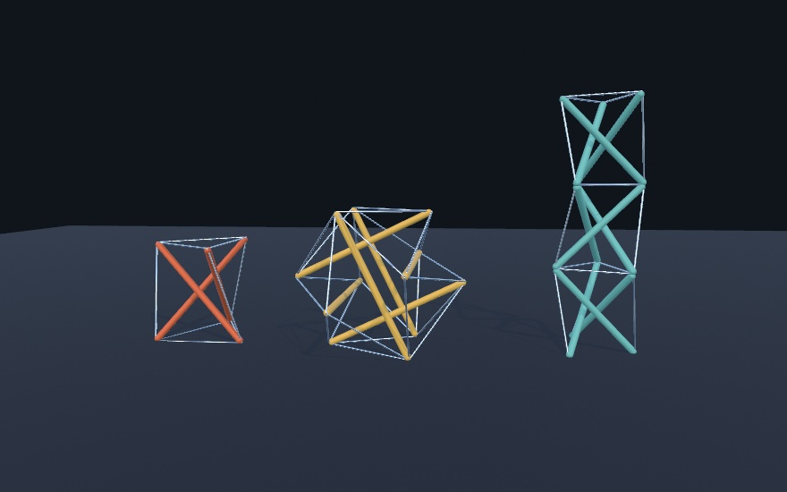

In the prism and the ball no strut touches another. Each form stands on a few strut tips, and the cables carry everything in between. Every part of one is a body or a joint you already know, plus one joint kind.

**The cable.** A `.distance` joint is a rod. It holds two anchors at a fixed spacing whichever way they are pushed. A `.cable` holds them no farther apart than its length and does nothing when they come closer. That is a rope, a tether, or a guy line:

```swift
world.connect(pole, kite, .cable(from: poleTop, to: kiteNose, length: 4))
```

**The geometry.** `Tensegrity` is a value: nodes, struts between nodes, and cables between nodes. Three forms come ready-made in their balanced shape. `prism(struts:)` is the simplest, `n` struts between two polygons twisted against each other. `icosahedron(strutLength:)` is the six-strut ball most people picture. `tower(levels:)` stacks prisms into a mast.

```swift
let ball = Tensegrity.icosahedron(strutLength: 1.75)
let mast = Tensegrity.tower(levels: 3, struts: 3, radius: 0.46, levelHeight: 0.95)
```

**The weight.** `addTensegrity` builds a form in the world. It makes a capsule body for each strut, a `.cable` for each cable, and a `.ball` joint wherever two struts meet at a node. Set it down a little above the floor and step the world. It lands, bounces on its own cables, and stands.

```swift
let standing = try! world.addTensegrity(mast, at: Vector3(2.25, 0.35, 0),
                                        strutRadius: 0.038, friction: 0.7)

// each frame:
world.advance(by: deltaTime)
fill(.white)
drawTensegrity(standing)
```

`addTensegrity` throws only for a form it cannot build, so the ready-made forms can take [Chapter 2](02-Color.md)'s `try!`. `drawTensegrity` draws the struts and cables in one fill and material. To color the struts, draw each with `drawBody` in its own fill, and each cable as a thin capsule between its two `nodes`. Drag any strut with `dragBodies(in:)` and the whole form follows, stretches, and rights itself when you let go.

**The twist.** The top polygon of a prism has to turn against the bottom one. Only one angle works. It is a quarter turn minus half a turn divided by the number of struts. Three struts want thirty degrees, and four want forty-five. Robert Connelly and Maria Terrell proved that rule in 1995. `imbalance` measures how far a form is from balance. It reads near zero for the built-in forms and well above it for `prism(twist: 0.2)`. No set of taut cables can balance that prism's struts. Build that one anyway and watch it in the world. As it settles it turns toward thirty degrees on its own, since that is the only shape where every cable is taut.

**The prestress.** A built tensegrity is tightened after it goes up. `prestress` does the same, making every cable a little shorter than its drawn length, two percent by default. The struts are rigid, so the cables cannot reach that length. They sit taut instead, and the form holds its shape through a landing. With the prestress at zero, a hard landing can leave a cable loose.

The [`3D/Physics/Tensegrity`](../Examples/3D/Physics/Tensegrity/) example drops all three forms and lets you drag them, and space drops them again.

## Water and ground from elsewhere: buoyancy, terrain, scenes, and USD

The contraption stands on a flat `ground` at zero, and every other surface in it is a box you placed. A world can also float its bodies in water, stand them on a landscape, or take its scenery and its bodies from a file.

### Water, and what it holds up: buoyancy

Water in a world holds up whatever is lighter than it and lets the rest sink. It is for harbors, flotsam, and anything that bobs. The rule is Archimedes' principle, from his *On Floating Bodies* in the third century BC. A body sinks until the water it pushes aside weighs the same as the body. [Chapter 29](29-Landscapes.md#the-sea-from-what-a-sea-is-made-of-an-ocean-spectrum) built a sea to look at. This one holds bodies up.


Those four crates differ in one number. Their densities run from 0.2 on the left to 0.8 on the right. Water takes one property, like `ground`, and nothing has to opt in:

```swift
world.water = Water(level: 0)
```

Everything already in the world starts floating. You do not mark a crate as floatable, and you do not pick how high it floats. You already said that in the `density` you built it with:

```swift
world.addBody(.box(width: 1, height: 1, depth: 1), at: Vector3(0, 4, 0),
              density: 0.3)   // cork
world.addBody(.box(width: 1, height: 1, depth: 1), at: Vector3(2, 4, 0),
              density: 3)     // stone
```

The cork bobs and the stone goes to the bottom. A body of density `0.5` settles with half of itself under the surface. One at `0.8` floats low, with a fifth of it dry. The waterline comes from the density, so you never set it.

`Water` has a `density` of its own, on the same scale, where `1` is water and also the default body material. Push it to `1.3` for brine, and every crate in the scene floats higher without you touching any of them.

The first argument to know is drag:

```swift
world.water = Water(level: 0, linearDrag: 0.5)   // the default
```

At `0`, a crate dropped in bounces about its waterline for a long time, like a ball on a trampoline. The default dips, comes back, and settles in a second or two. `angularDrag` does the same for turning, which stops a long shape rocking for minutes after it lands.

Give the surface a shape and it carries whatever floats on it:

```swift
world.water = Water(level: 0, waves: Water.Waves(amplitude: 0.25,
                                                 wavelength: 8, speed: 1.5))
```

Now the water you draw has to match the water they float on. `waterMesh` hands back that surface as an ordinary mesh, so the swell you see is the swell they float on. `extent` is how far it reaches in world units, and `resolution` how many cells it has along each side:

```swift
if let surface = world.waterMesh(extent: 30, resolution: 40) {
    fill(Color(hex: 0x2C7C96))
    material(.dielectric(roughness: 0.3))
    drawMesh(surface)
}
```

`.dielectric` is the smooth nonmetal of [Chapter 28](28-MaterialsAndSurroundings.md#two-numbers-for-most-real-surfaces-pbr)'s measured finishes, the finish of water and varnish. Keep a little roughness in it. Where a wave tilts a perfect mirror's reflection below the horizon, it reflects the lower half of the environment. That lays flat gray patches along the troughs.

`world.water` is an ocean rather than a pool. Everything below `level` is water, out to the horizon, so a harbor is what you get by putting static walls in it. The water also leaves some things alone. Sensors, static bodies, and the walking characters of [Chapter 31](31-CharactersAndCloth.md) go where you put them rather than where the water would.

The [`3D/Physics/Flotsam`](../Examples/3D/Physics/Flotsam/) example puts it in one scene. Crates from cork to nearly waterlogged float on a swell at their own depths. A stone anchor sits on the bottom, and a current carries them all past. Drag one under and let go.

### Ground from a landscape: the heightfield collider

A heightfield collider is ground made from a grid of heights. It is for terrain, so that bodies roll down the same slopes you drew. Game engines keep terrain this way because a grid of heights is smaller than the same surface stored as triangles. The heights here are the `Heightfield` of [Chapter 29](29-Landscapes.md), grown and weathered.

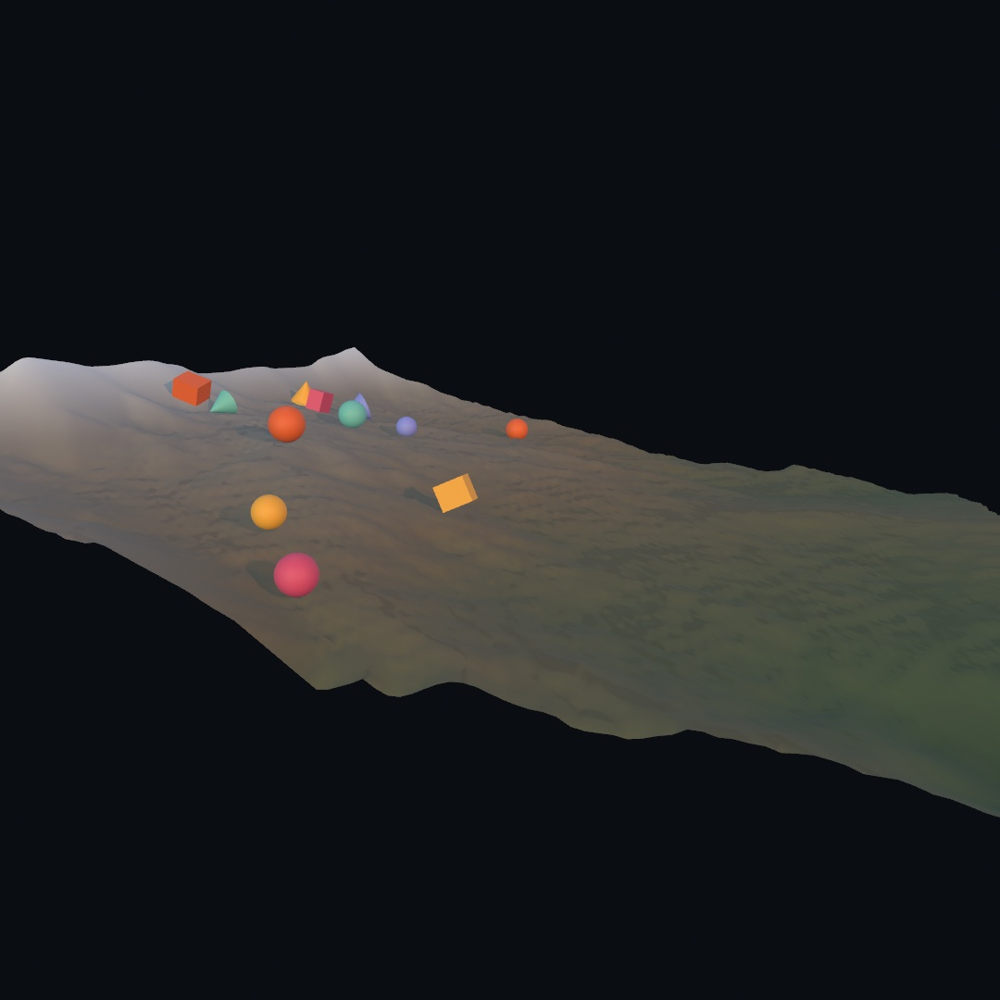

The rocks are spheres, boxes, and cones dropped along the ridge, and the ravines the rain carved funnel them down. `.heightfield` takes the `Heightfield` directly, sized like its `mesh(width:depth:height:)`, so the collider and the drawn mesh trace one surface:

```swift
let island = world.addBody(.heightfield(land, width: 14, depth: 14, height: 4.2),
                           at: .zero, kind: .static, friction: 0.55)
```

The [`3D/Physics/Rockslide`](../Examples/3D/Physics/Rockslide/) example is the slide to play with. Rocks keep arriving, and a dice parameter grows the mountain again.

### Scenery and bodies from a file: scenes and USD physics

A world can take its surfaces from a scene file, and a USD file can bring its bodies and joints too. It is for a hall you modeled somewhere else, or a physical arrangement drawn up in another program. USD's physics schema, which Pixar's OpenUSD publishes, is the part of the format that says which parts of the scene are bodies. USD calls those parts prims. It also says what shape they collide as and how they are joined.

For scenery, `world.addStaticBodies(from: scene)` walks a loaded `Scene`. It turns every mesh into a static collider at its authored place, so a ball can roll through the hall you imported. A `.usd` file can also say which of its prims are physical, and `world.addBodies(from: scene)` reads them all. A sketch that loads such a file writes no physics of its own:

```swift
let scene = try! loadScene("yard.usda")
world.addBodies(from: scene)
```

The import covers bodies, colliders, joints, masses, and the friction and bounce of the file's physics materials. The file's gravity is read only when you pass `usesSceneGravity: true`. Reading it is lossy, and that is on purpose. It keeps what this world understands and leaves out articulations, joint drives, and the file's own collision groups. Anything a file leaves unsaid about a body gets a sensible default.

The [`3D/Physics/Imported`](../Examples/3D/Physics/Imported/) example is this import. Its `yard.usda` is written by hand, and the sketch is a camera and a drawing loop.

## Keeping what settled: snapshots

Everything the contraption does, it does again from `setup()` every run. Some arrangements cannot be made that way. Picture a heap of stones tipped in one at a time and left to rock itself quiet. It took over a thousand steps of falling and leaning, and no line of code says where each stone ended up. It exists only in the world's memory, and closing the sketch loses it.

### A world saved as it stands: `snapshot` and `restore`

A snapshot is the world captured at one moment. It is for an arrangement you found rather than designed, so you can put it back after you wreck it, or keep it past quitting. Physics engines save their state like this to replay a moment, and a snapshot is Ollin's own file for it. You might ask why the heap needs saving at all, when the code that built it is right there. The picture answers that.

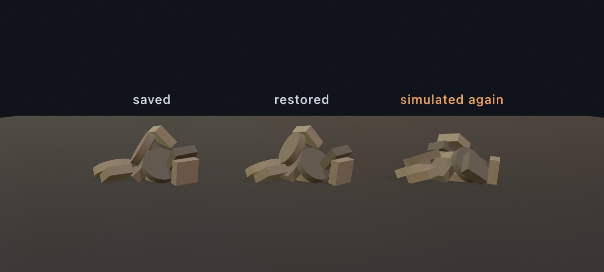

All three heaps come from the same code. The first was simulated and captured, and the second is that capture restored, stone for stone. The third was simulated again with one stone released a ten-millionth of a unit higher, and nothing else in the setup changed. Stones landing on stones magnify the difference. One lands a little differently, which tips the next, and by the twelfth you have a different heap. [Chapter 22](22-IteratedForms.md#the-classic-chaos-machine-doublependulum)'s double pendulum showed the same sensitivity. So the same code can give a slightly different heap on a machine whose arithmetic rounds one bit differently. Running the code again gives you a heap, and only a snapshot gives you that heap.

`snapshot()` takes the world as it stands, and `restore(_:)` puts it back:

```swift
let settled = world.snapshot()      // once the heap has come to rest
// …knock it over, drag stones out of it, wreck it…
try? world.restore(settled)             // the heap you had, exactly
```

A snapshot is a value you can keep, so it can also go to a file, and a file survives quitting:

```swift
let file = URL(fileURLWithPath: "heap.physics")

override func setup() {
    world.ground = 0
    do {
        try world.load(contentsOf: file)
    } catch {                              // nothing there the first time
        buildTheHeap()
        try? world.save(to: file)
    }
}
```

> **Swift note.** `URL(fileURLWithPath:)` names a file on disk, as in [Chapter 28](28-MaterialsAndSurroundings.md#putting-it-together-the-bench). `do` runs the lines inside it, and `catch` runs when one of them throws. So the first run builds the heap and saves it. A plain `try` works only inside a `do` like this one, or in a function marked `throws`. Everywhere else, [Chapter 2](02-Color.md)'s `try?` runs the call and drops the error.

Restoring puts things back exactly. Every body returns in the same pose, moving at the same speed and spinning the same way. A body that had gone to sleep is still asleep, so a saved heap does not shudder back into shape as it arrives. A door saved standing half open is still half open. It still stops where it used to, because the snapshot remembers the pose each joint was made in.

A snapshot holds every body with its collider and all its settings. It holds every joint between them, gears and racks included, and the collision groups with their rules. It holds the world's gravity, ground, bounce, and water. It also holds the characters, vehicles, and ragdolls of [Chapter 31](31-CharactersAndCloth.md#snapshots-of-figures-vehicles-and-cloth), which says how each one comes back.

Restoring empties the world first, so any `Body3D` you were holding onto is gone. Take the bodies from `world.bodies` again. They come back in the order they were saved, and each still knows its own `collider`. `userData` is not saved, so a color kept there, as the contraption keeps its colors, comes back empty.

### A large collider saved by name: `assetName`

`assetName` stores a name in the snapshot in place of a collider's geometry. It is for the few colliders that are large. Almost everything in a world is small, and a box is three numbers. A terrain collider is thousands of samples, and they go into the file every time you save. Scene files keep large data out of the same way, pointing at a texture by name rather than holding its pixels. Here the name goes on the terrain body from [the heightfield entry](#ground-from-a-landscape-the-heightfield-collider):

```swift
island.assetName = "island"
```

On the way back in, you say what the name means:

```swift
try? world.restore(settled) { name in
    name == "island" ? .heightfield(land) : nil
}
```

The reference measured a world with a terrain, a five-thousand-vertex mesh, and twenty crates. Naming the two large colliders took its file from about a hundred kilobytes to about one. The trade goes both ways. A snapshot that names nothing is self-contained, so you can commit it beside the sketch and open it anywhere, and that stays the default. A name the resolver does not recognize costs you that one body and a note, and the rest of the restore goes ahead.

A snapshot is Ollin's own format rather than USD. Reading USD is lossy, and writing it back would lose things too. So the two jobs use two formats: import to pick up an arrangement somebody else made, and snapshot to keep one you found.

## Where this comes from

The 3D solver under this chapter is [Jolt Physics](https://github.com/jrouwe/JoltPhysics) by Jorrit Rouwe. It is bundled in the repository and wrapped behind Ollin's own API, so the calls read like the 2D world of [Chapter 11](11-ForcesAndPhysics.md). Jolt runs the physics of the game *Horizon Forbidden West*. Jolt satisfies contacts and joints by correcting velocities over and over, a little at a time, rather than solving one large system at once. This is the impulse-solver approach Erin Catto's Box2D made familiar, and Box2D is the rigid-body solver under Chapter 11's 2D world.

Tying the motions of two joints together is how Jolt builds its gear and rack-and-pinion constraints. The machines they build are much older. The gear train, the crank, and the cam fill Leonardo da Vinci's notebooks, and Franz Reuleaux formalized them in the 1870s. The entries after the contraption name their own sources, and the full credits are in the project's [attribution notes](../ATTRIBUTION.md).

## Go deeper

- [3D physics](../Docs/Simulation/Physics3D.md): the whole `World3D` surface, every collider and joint kind, the query family, collision groups, degrees of freedom, and [snapshots](../Docs/Simulation/Physics3D.md#snapshots), including what a saved world does and does not keep.
- [Tensegrity](../Docs/Generators/Tensegrity.md): the three ready-made forms, `imbalance`, and everything `addTensegrity` and `Tensegrity3D` take and read back.
- Appendix B draws the ideas the solver rests on: [Vectors, motion, and forces](B-JustEnoughMath.md#vectors-motion-and-forces), and [Into three dimensions](B-JustEnoughMath.md#into-three-dimensions).
- Worked examples, in [`Examples/3D/Physics/`](../Examples/3D/Physics/): `Stack` and `Tumble` (stacking and contact), `Windmill` and `Contraption` (joints and linkages, the second much larger than the one here), `Sieve` (collision groups), `Trigger` and `Sightlines` (contacts, sensors, and queries), `Burst` (solids that break), `Bagatelle` (degrees of freedom and path checks), `Tensegrity`, `Flotsam` (water), `Rockslide` (a slope of debris), and `Imported` (a world read out of a USD file).
- The Gego homage [`Chorro`](../Examples/Recreations/Gego/Chorro/Sketch.swift): about a hundred and fifty capsules on ball joints and nothing else. Each rod is one `addBody`, and each hook one `connect` with a `.ball` at the loop. The plate is a `.kinematic` body, a sphere the sketch moves by hand as the air would, and the floor is `ground`. The sketch draws no body as a solid. It draws each rod as a line between its hooks, with small circles at the hooks and a shadow line on the floor. The settling on the floor is what the solver does with the slack.

---

[Contents](README.md#contents) · Previous: [Chapter 29, Landscapes and multitudes](29-Landscapes.md) · Next: [Chapter 31, Characters, vehicles, and cloth](31-CharactersAndCloth.md)
