#### <sup>[Ollin](../README.md) → [Guide](README.md) → Chapter 31</sup>

---

# 31. Sharing and performing

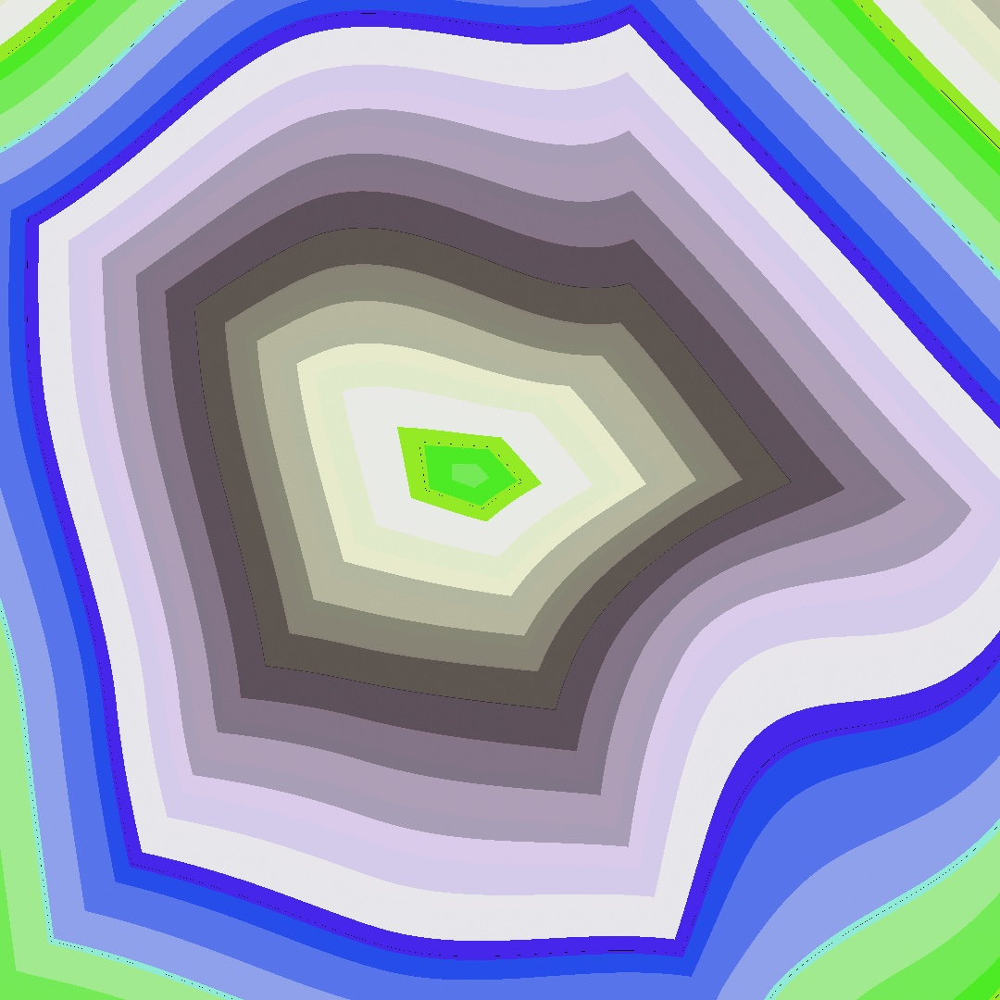

Thirty chapters of pieces have lived on your screen. This chapter is about handing them over. Out as files, meaning a poster, a video, a GIF, a plotter drawing, a print, or something you can hold. Out as live feeds, into a VJ rig or a video call. Out as a package somebody else can build on. And out on a stage, where writing the code is the performance. The piece above is the final state of a live-coded set you'll build in five evaluations. Every road out of the framework starts from the same place, the sketch you already have. The one road that does not leave, a piece that stays where it is and runs for a month, is [Chapter 32](32-Installations.md).

## Leaving as files

<picture>
  <source media="(prefers-color-scheme: dark)" srcset="Images/31-SharingAndPerforming/ExportMap-dark.jpg">
  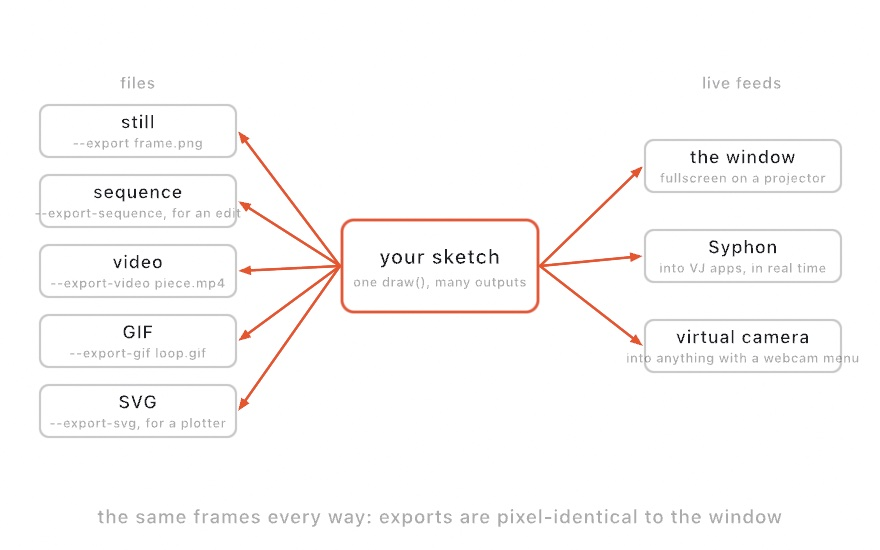
</picture>

Every file export runs the sketch *headlessly*. No window opens, `setup()` runs, the clock advances to the frame you asked for, `draw()` runs, and the result is written. Because the offline clock is a fixed timestep, an export is deterministic. The same sketch, seed, and frame make the same file every time, however long the render takes. Sources follow the same clock. A video decodes by frame position, and an `AudioPlayer` feeds its analyzer the matching slice of its file each frame. Even an audio-reactive piece therefore exports with its beats in the same places. The flags live on any example's executable, and a loose sketch file gets the identical surface through the live host:

```sh
swift run OllinLive MySketches/Finale.swift --export poster.png --frame 200
swift run --package-path Examples Example-Basic-HelloCircle --export-sequence /tmp/out --seconds 5 --fps 60
```

`--export` writes one frame as a PNG, and `--export-sequence` writes every frame, lossless, ready for `ffmpeg` or an edit timeline. Exports default to the best render quality (`.detail`), since a file has no frame rate to protect. `--render-quality` dials that down when you want a fast draft.

### Drawing finer than you save

Quality has a second dial, and it runs the opposite way from the first. `--render-scale 2` draws the frame at twice the width and twice the height. Then it averages every block of four samples back into one pixel. The file that lands is the size it always was. What changed is how much looking went into each pixel.

<picture>
  <source media="(prefers-color-scheme: dark)" srcset="Images/31-SharingAndPerforming/SamplingFiner-dark.png">
  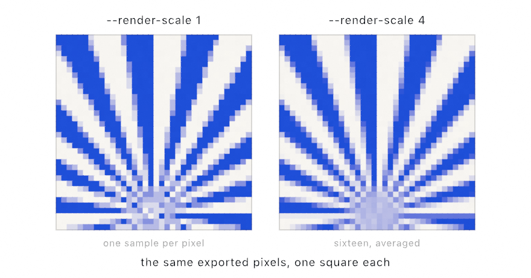
</picture>

The difference lives along the edges of filled shapes and the letters of outline text. Those reach the screen as triangles. Every pixel along an edge has to decide how much of one it covers, and more samples means a finer decision. Circles, rectangles, arcs, and every stroked line work their coverage out by formula instead. They are already as crisp as they will get, so the dial does nothing for them.

The cost is what the geometry says it is: four times the pixels at 2, sixteen at 4, which is the ceiling. That is a bad trade for a window that owes you a frame every sixteen milliseconds. It is a good one for a poster you will look at for a year.

```sh
swift run OllinLive MySketches/Finale.swift --export poster.png --render-scale 2
```

One thing the dial leaves strictly alone: a blur, a flare, and anything else you asked for with `postProcess` still measure in canvas pixels. A `.gaussianBlur(radius: 12)` is twelve pixels wide at every scale. A quality parameter that quietly resized your blur would not be a quality parameter.

### The slow render that pays for itself

A 3D scene has one more way out of the window. Add `--path-traced` to a still, sequence, or video export and the frame renders by *tracing light* instead of rasterizing. Shadows from an area light sharpen at contact and melt with distance. Color bleeds between neighboring surfaces. Every polished thing mirrors the scene, including the other mirrors. A `.glass` material becomes real glass. The view bends through a solid body, and a colored one tints the light crossing it. Even the shadow glows with what got through instead of going black. A mesh with an emissive material becomes a lamp with a shape, lighting its neighbors as smoothly as a softbox. A textured surface keeps its picture in reflections and bounces. The copies of [Chapter 23](23-Landscapes.md) are in there as well, so a field of ten thousand pebbles shadows and mirrors like ten thousand hand-placed ones. The other maps ride along too: a normal map's relief, a roughness map's wear, a glow map's shape all reach the traced light. And the camera gains a real lens. Set `aperture` and `focusDistance` on your `Camera3D`, and the export has true depth of field while the live window stays pinhole-sharp for framing.

```sh
swift run OllinLive MySketches/StillLife.swift --export poster.png --path-traced 512
```

The number is light paths per pixel; more is smoother, and takes longer in step. The live window is the viewfinder, and the flag is the film back. Tune fast, then let the machine take its time. It needs an Apple-silicon Mac, and [the reference](../Docs/Output/PathTraced.md) lists exactly what the traced frame adds and what stays with the raster pipeline.

Your light rig comes over as you left it. Here the tracer follows the light itself, so it needs no `castShadows()` and every lamp in the frame throws one. A light you told not to throw still throws nothing, which matters because the fill in a preset rig is exactly such a light. The shadows in the file are the shadows you framed.

There is one more thing you can ask for before the file is written. What is left of the error in a traced render is grain. Buying it away costs the square: four times the paths for half the speckle. `--denoise` filters it out instead. The useful trick is that the tracer wrote down what it *hit*, not only what it saw. It kept the first surface's own color, the way it faces, and how far off it is. It also kept how much the pixel's own samples disagreed. The filter divides the light by that color, smooths the light alone, and multiplies the color back. A texture keeps its edges and a silhouette keeps its line, because neither was ever in the part being smoothed. And since the strength comes from the disagreement, a thin render is smoothed hard and a nearly finished one only a little. On the example scene, 64 filtered samples land about where 240 raw ones would have. It holds at the deep end too: even a 2048-sample render comes out closer to the truth, not merely smoother. It is off unless you ask, because a raw render is the honest one to hand you, and a real sparkle reads softer once the filter has been over it.

### Rendering from code

Those flags are a command-line wrapper around one function, and the function is available to you directly:

```swift
if let frame = OllinApp.image(of: MySketch(), frame: 200) {
    // a CGImage, rendered with no window anywhere in sight
}
```

`OllinApp.image(of:frame:)` builds the sketch, runs `setup()`, advances the clock to the frame you asked for, renders, and hands back a `CGImage`. (`OllinApp.export` is that call plus a PNG writer, which is all `--export` is.)

This matters the moment you want to render *many* things, or render on your own terms:

- a contact sheet of twenty seeds,
- thumbnails for a catalog,
- a batch job over a folder of inputs,
- a test that checks a render hasn't changed.

All of them are a loop around this one call. None of them need a window, a display, or a person watching.

<picture>
  <source media="(prefers-color-scheme: dark)" srcset="Images/31-SharingAndPerforming/HeadlessCapture-dark.jpg">
  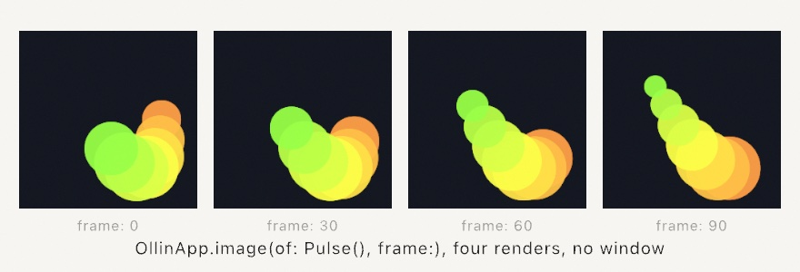
</picture>

That figure is the call demonstrating itself. It's one sketch whose `draw()` renders a *different* sketch four times at four frames and lays out the results. A fresh instance is built per capture, so each render starts cleanly from `setup()`.

It's also how this guide is made. Every image you've seen in it is a committed sketch under `Guide/Figures/`. A small tool walks the folder and calls `OllinApp.image(of:frame:)` on each one. That's the reason nothing here can quietly rot. A listing that stops compiling fails the render. A figure that stops matching its prose is a file someone can open and run.

## Motion: video and GIF

For a file you can post, skip the stitching and encode directly:

```sh
swift run OllinLive MySketches/Finale.swift --export-video finale.mp4 --seconds 12
swift run OllinLive MySketches/Finale.swift --export-gif finale.gif --seconds 4 --gif-width 540
```

Reach for video first, because it's almost always the right choice. The default `h264` plays everywhere. `--codec hevc` is better quality per byte when the file needs to be smaller. The two ProRes profiles are for edit timelines rather than for sharing. `--bitrate` (in Mbit/s) is the file-size dial, and a 1080-square piece looks clean around 10 to 15 in `h264`. The GIF is for the short loop. It's palette-limited and heavy per second, so keep it a few seconds and downscale with `--gif-width`. A piece where *every* pixel changes every frame defeats GIF compression entirely and balloons the file. A drifting full-canvas field is that kind of piece. [Chapter 3](03-MotionAndTime.md)'s perfectly looping phase tricks are exactly what a GIF wants.

## Slower than it happened

Some pieces move faster than the eye can follow. A collision, a burst, the half-second where the whole thing resolves. On screen you can only watch it again. In a file you can slow it down:

```sh
swift run OllinLive MySketches/Finale.swift --export-video slow.mp4 --seconds 4 --slow-motion 4
```

That renders four seconds of the sketch's own time and writes sixteen seconds of video. Nothing about the file changes: it still plays at its `--fps`. What changes is how many frames cover the run. The clock steps four times finer, so the sketch is asked for the moments in between. The motion then takes four times as long to play.

<picture>
  <source media="(prefers-color-scheme: dark)" srcset="Images/31-SharingAndPerforming/SlowerThanItHappened-dark.jpg">
  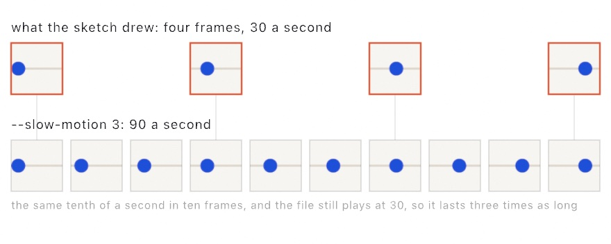
</picture>

`--seconds` still counts the sketch's own time, as it always has. The export prints both numbers so you never have to work it out.

There is one trap, and it is worth knowing before you reach for this. **Motion measured in seconds slows down. Motion measured in frames does not.** A radius built from `sin(time)` is a function of the clock, so a finer clock slows it. So is a position advanced by `speed * deltaTime`. But a position advanced by a fixed step once per `draw()`, with no `deltaTime` in it, moves the same amount per frame however fast the clock runs. Give it more frames and it simply arrives at the same place at the same time. If your slow-motion export came out at ordinary speed, that is why, and [Chapter 3](03-MotionAndTime.md)'s `deltaTime` is the fix.

There is a second way, for when the first is too slow or your motion is measured in frames:

```sh
swift run OllinLive MySketches/Finale.swift --export-video half.mp4 --seconds 4 --slow-motion 2 --made-frames
```

`--made-frames` draws the frames it would have drawn anyway, and asks the GPU to build the ones in between out of the pair on either side. It is the same interpolator a live window can use. It hands you pictures your sketch never drew, so it says so on the console and writes `"madeFrames":true` into the file's own recipe. It needs a 3D scene under a perspective camera, and it does half speed only. Use it when a frame is expensive to draw, and use the drawn form the rest of the time. The full comparison is in [`Docs/Output/Export.md`](../Docs/Output/Export.md#slow-motion).

## Settled, then written

One more dial belongs beside these two, for the pictures that are not finished by one draw. A running mean, the `Accumulator` from [Chapter 16](16-LayersAndEffects.md) or a `LineSpray` through a lens, starts grainy and settles as the frames pile up, and it starts over the moment the camera moves. In a video of a turning scene every frame has a new camera, so every frame is the grainy first one. `--settle N` draws each written frame N times with the clock held, and writes the last:

```sh
swift run --package-path Examples Example-Rendering-LineSpray --export-video turn.mp4 --seconds 10 --settle 40
```

The clock does not move during the held draws, so a camera written against `time` stays put while the mean converges underneath it, and then the clock steps on. It costs N times a plain export, which is what a settled frame costs. The [export reference](../Docs/Output/Export.md#settled-frames) has what it refuses (a take, made frames) and why a piling `noClear` canvas is the one thing it does not settle.

## Vector: the plotter path

[Chapter 15](15-ShapesAsMaterial.md) promised that shapes held as geometry could leave as geometry, and `--export-svg` is that promise kept:

```sh
swift run OllinLive MySketches/Plot.swift --export-svg plot.svg
swift run OllinLive MySketches/Plot.swift --export-svg plot.svg --hatch
```

The exporter records each draw call at its own level, before any pixels exist. Circles become `<circle>`, polylines `<polyline>`, and shapes and outline text `<path>` with their fill rules. Transforms and opacity stay intact. The file opens in a browser, Inkscape, or Illustrator, and feeds a pen plotter's tooling directly. Since a pen has no fill, `--hatch` turns solid fills into parallel line work spaced by tone. Add `--cross-hatch`, or set `--hatch-spacing` and `--hatch-angle`. Stroke fonts and stroked geometry pass through as the single lines they already are. Images are the one thing that can't come along, because a vector file has no place for them.

The same recording writes as a **PDF** with `--export-pdf plot.pdf`, and that is the path to paper. One canvas pixel maps to one PDF point, so the paper presets on `CanvasSize` come out true to size. Declare `override var canvasSize: CanvasSize { .a4 }` and the exported page *is* that sheet, vector-sharp at any printer's resolution. `.usLetter` and `.a5` are there too, and `.landscape` turns the sheet. If the raster export should be print-grade too, `.a4.dpi(300)` renders the pixels at 300 dots per inch. The PDF page stays exactly A4. Everything the SVG carries, the PDF carries the same way, hatching included.

## A page that plays it

A video carries pixels, and a page can carry what made them. `--export-web` records what the sketch draws over a duration, frame by frame at a fixed rate. It writes a page that plays the recording back in a browser:

```sh
swift run OllinLive MySketches/Ring.swift --export-web ring.html
swift run OllinLive MySketches/Ring.swift --export-web ring.html --inline
```

The recorder writes down the shape records the renderer would have received each frame. Nothing is rendered on the Mac, so nothing GPU-specific lands in the file. The page draws those records with the framework's own shape shader, carried from Metal to GLSL. The rewriter that does it is the one that brings [somebody else's shader](17-YourFirstShader.md#somebody-elses-shader) the other way. A frame on the page is the frame `--export` would have given you. A sketch that declares `loopDuration`, as [Chapter 3](03-MotionAndTime.md) taught, records one lap with no length given, and the page wraps it without a seam. On a lap, each motion is fitted to the sines it is made of, so the page evaluates it at any time from a few numbers. A parameter driven by a [formula](../Docs/Helpers/Formula.md) crosses as the formula, worked out live on the page's own clock and pointer. What fits neither travels as samples, and the page interpolates between them, so a slow motion records well at ten frames a second.

The first form is one self-contained file: open it, host it, drop it in an `iframe`. The second, `--inline`, is the canvas and one script block with no page around them, for a page you already have. Paste the two together where the picture belongs. The script leaves a handle on the canvas, `canvas.ollin`, that plays, pauses, and seeks. A reader whose system asks for less motion sees the first frame, still.

What crosses today is the closed analytic shapes, with their fills, strokes, and transforms. The layered effects of [Chapter 16](16-LayersAndEffects.md) cross too: a layer drawn off-screen, every generator, the filters and combines that are one pass, a blur, and a bloom. So does a shader of your own from [Chapter 17](17-YourFirstShader.md), running live on the page's clock and pointer, and a `Visual` chain with it. A feedback layer keeps its state on the page, and so does a field like the reaction-diffusion of [Chapter 19](19-GridSimulations.md), which steps there. The fragment behind each effect is cut out of the framework's Metal with everything it reaches and rewritten to GLSL, so the page's blur is the framework's blur. A stroked path, a filled polygon, text, a picture, a gradient, or a 3D scene stops the export before a file is written. So does an effect that is a solve on the Mac. The message names the call and the frame it was met at, and those sketches leave as video. The page's own reference is [`Docs/Output/Web.md`](../Docs/Output/Web.md).

## Driving the machine itself: G-code

An SVG hands your drawing to a machine's own tooling. Many machines skip the tooling: hobby plotters, laser cutters, and CNC routers run on G-code, a program of moves in millimeters. `--export-gcode` writes one from the same recorded frame:

```sh
swift run OllinLive MySketches/Plot.swift --export-gcode plot.gcode
swift run OllinLive MySketches/Plot.swift --export-gcode cut.gcode --gcode-machine laser
```

A machine needs real units, so the export asks for a physical width, the way a 3D print asks for its size. The flag maps the canvas to 150 mm wide unless `--gcode-width` says otherwise. In code, `GCode(.plotter(), width: 150)` carries the finer parameters: the pen lift, a laser's power and passes, a mill's depth per pass. Only line work travels. A stroke plots along its centerline and a fill contributes its outline, with `--hatch` shading fills exactly as it does for SVG.

The exporter plans the route before it writes a move. Open paths whose ends touch merge, so the pen stays down across them. Then a nearest-neighbor walk reorders the paths to keep the pen-up hops short:

<picture>
  <source media="(prefers-color-scheme: dark)" srcset="Images/31-SharingAndPerforming/MachineRoute-dark.jpg">
  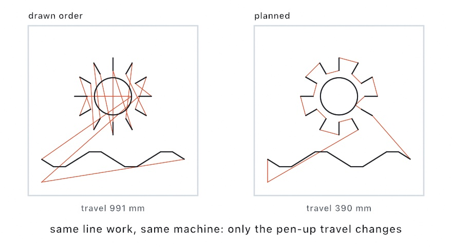
</picture>

The planner is public. `GCode.toolpath(_:in:)` returns the route as plain contours, with the drawn and travel lengths measured in millimeters. The `Export/Toolpath` example draws its own route and walks a pen along it at machine speed. One habit applies to a program from any tool: give it a dry run first, pen out, laser disarmed, cutter above the stock. [G-code](../Docs/Output/GCode.md) has the three machine profiles and every parameter.

## Drawing with light: a show laser

A laser draws with one moving dot. Two mirrors steer the beam. A fixed clock decides how often they are told where to point, and at each of those points the beam is lit or dark. Nothing in a laser holds a picture. What you see is one dot going round a loop fast enough that your eye keeps the whole shape.

That makes the geometry from [Chapter 15](15-ShapesAsMaterial.md) exactly the right material. `import OllinLaser` sends it:

```swift
import OllinLaser

let laser = LaserProjector(etherDream: "192.168.1.50")

override func setup() {
    laser.connect()
    laser.arm()                       // nothing goes out before this
}

override func draw() {
    background(.black)
    var frame = LaserFrame(canvas: bounds)
    frame.add(ring, color: .green)
    laser.send(frame)
    drawLaserPreview(laser.stream)    // watch it on screen too
}
```

A frame holds paths in canvas coordinates, the same numbers every drawing call takes. A `Shape` contributes its outlines. There are no fills in a laser, so shade a region with `Hatching`, the way the plotter does.

Between that frame and the projector sits the part worth understanding:

<picture>
  <source media="(prefers-color-scheme: dark)" srcset="Images/31-SharingAndPerforming/BeamPath-dark.jpg">
  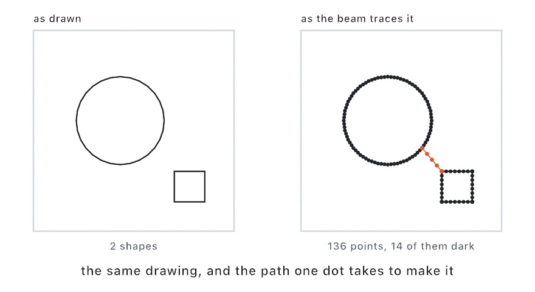
</picture>

Points are spread evenly along each line, so the beam moves at a steady speed and the line looks even. A few points are held at a sharp corner, because the mirrors have mass and would round it off otherwise. Between two shapes the beam goes dark and the mirrors travel. Points are held at both ends of that jump too. Otherwise the beam lights while the mirrors still move, and drags a tail across the gap. The shapes themselves are then visited near to near, since dark travel is time that buys nothing.

Time is the whole budget. The point rate divided by the frame rate is every point a frame can hold. At 20,000 points a second and 30 frames a second, that is about 660. Past it the frame still plays whole and repeats more slowly, which the eye reads as flicker. `stream.isOverBudget` says when you are there. Draw less, or set `spacing` wider.

The last part is not about pictures at all. A projector puts real power into a beam, and the mirrors are the only thing spreading it. So **a `LaserProjector` sends nothing until you call `arm()`**. Under that gate the brightness starts at half. A beam that stops moving is blanked, and so is a frame the sketch stopped feeding. Give the first run the same courtesy you give a cutter: low power, pointed at a wall, nobody in the beam.

The **LaserPreview** example is that preview with the parameters attached, and it runs with no hardware at all. [Laser](../Docs/Integration/Laser.md) has the rest, including the ILDA file that reaches a rig this library does not talk to directly.

## Printing one ink at a time: separations

Some presses can't print a full-color image at all. A risograph or a screen-printing rig lays down one ink per pass. It needs you to hand it a separate grayscale plate for each one. If you have never prepared work for that kind of press, the mental model is the useful part.

<picture>
  <source media="(prefers-color-scheme: dark)" srcset="Images/31-SharingAndPerforming/Separations-dark.jpg">
  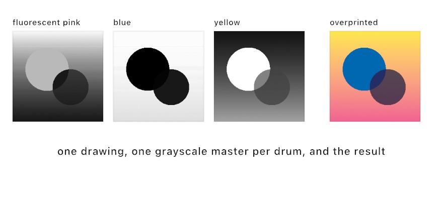
</picture>

Each ink gets a **master**, a grayscale image where black means "lay down full ink here" and white means "leave the paper bare". The press runs the paper through once per master, and the inks stack up. Because printing inks are translucent rather than opaque, overlapping them mixes: pink over blue makes a purple neither drum could print alone. That's why the three plain-looking plates above produce a picture with more colors in it than three.

```swift
override var printInks: [Ink]? { [.fluorescentPink, .blue, .yellow] }
```

Declare that on your sketch, export with `--export-separations`, and you get one master per ink plus a preview with registration marks on it. That preview is the sheet you check before committing to paper. Working the other way round, `artwork.separated(into:)` does the same job to any `Image` in code. You can look at the plates while you compose.

The interesting part is what happens for a color no single ink can make. Ollin searches for the combination of ink coverages whose overprint comes closest. It judges the way your eye judges, rather than by raw numbers. The space is the same perceptual one [Chapter 2](02-Color.md)'s color mixing uses. Draw in an ink's own color and it separates exactly. Draw anything else, including gradients and photographs, and it lands on the nearest mix those drums can actually reach.

One practical note carries over from [Chapter 8](08-Words.md)'s halftone. A press cannot hold a dot smaller than about two percent coverage. Anything fainter drops to bare paper rather than becoming invisible speckle. `separation.halftoned(pitch:)` rotates each ink's dot grid to its own angle, so the drums overprint into a rosette instead of a moire. `separation.dithered()` is the grainier alternative. [Print separations](../Docs/Output/PrintSeparations.md) has the full ink catalog, plus the screening details. The catalog carries the community-measured colors of the standard risograph line.

## Seeing the print before you print it

A screen makes color with light. A press makes it with ink on paper, and the screen wins. The electric cyan you picked in [Chapter 2](02-Color.md) is not a color four inks can lay down. It reaches the press and comes back as the nearest thing ink can do.

You can find that out on paper, a week later, at your own expense. Or you can ask first.

<picture>
  <source media="(prefers-color-scheme: dark)" srcset="Images/31-SharingAndPerforming/ProofBeforePrint-dark.jpg">
  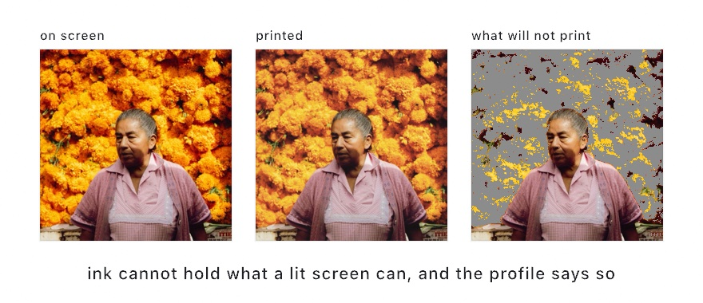
</picture>

A **profile** is a file that describes what one device does with color. Your shop hands you theirs for the press and paper the job will run on. Ollin carries a generic four-ink one for when you have not asked yet:

```swift
var press = SoftProof(.genericCMYK)     // or ICCProfile(contentsOf: theShopsFile)
postProcess(.softProof(press))          // the canvas, as it will print
```

That is a **soft proof**. Every color on the canvas is carried into the press's profile and back out again. Whatever comes home changed is exactly what the press is going to change. It runs on the GPU, so you can leave it on while you work and watch the piece the way the paper will hold it.

Two things always move on that trip. Saturated colors come back duller, because ink covers less ground than a lit screen. Blacks come back lighter, because ink on paper is not as dark as a black pixel. Ollin shows you both rather than flattering the picture. Paper color is the third, and you have to ask for it: `press.simulatesPaper = true`. A proof of cream stock reads as a wrong-looking white until you are expecting it.

The proof shows what changes. The **gamut check** names what is unreachable at all, which is the third panel above:

```swift
postProcess(.softProof(press, warning: .magenta, amount: 0))   // flag it, change nothing
artwork.outOfGamutFraction(press)                              // 0…1, how much is at risk
```

Print that fraction while you tune a palette. A few percent is ordinary. A third of the canvas means you are drawing in colors that will not survive, and it is easier to hear that now.

When the piece is ready, the same profile splits it into **plates**, one grayscale image per ink, black where that ink lands:

```swift
override var printProfile: ICCProfile? { .genericCMYK }
```

Declare that and `--export-plates poster.png` writes the four plates plus the proof, with registration marks, exactly as `--export-separations` does for spot inks. The separation also reports **total ink**, the sum of all four coverages at the heaviest spot. Ask your shop what they will take. Around 300% is usual for coated paper, and newsprint gives up sooner.

Both paths lead to a press, and the profile is what tells them apart. Spot separations are for a shop printing one named ink at a time, where no profile exists and Ollin has to model the overprint. Plates are for a press whose behavior has actually been measured, where there is nothing to model and the profile answers directly. [Print color](../Docs/Output/PrintColor.md) has the intents, the installed-profile lookup, and the screening.

## Something you can hold: a 3D print

A plotter turns a `Contour` into ink on paper. A 3D printer does the same job for a `Mesh`, and the call is just as short:

```swift
sculpture.normalized(scale: 60).write(to: "sculpture.3mf")
```

`normalized(scale: 60)` is doing the work that matters. A mesh carries bare numbers, and a printer needs millimeters. So this centers the shape on the origin, where a build platform wants it, and fits its longest side to 60 mm. The extension picks the format, and the file records that size.

Then there is the thing nobody warns you about, which is that a shape can look completely finished and still be unbuildable. A printer has to decide, for every point in space, whether it is inside the object or outside it. It can only answer that if the surface actually closes. Here are two copies of the same knot, one swept closed and one left open at its ends:

<picture>
  <source media="(prefers-color-scheme: dark)" srcset="Images/31-SharingAndPerforming/Fabrication-dark.jpg">
  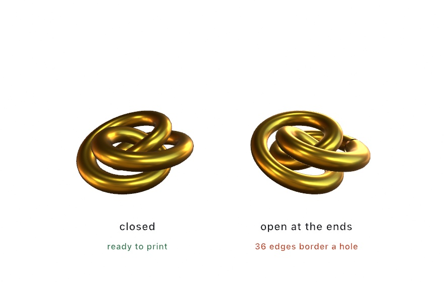
</picture>

On screen an open surface is exactly as convincing as a closed one. A printer is the first thing that ever disagrees.

So ask before you commit to plastic:

```swift
let check = sculpture.printCheck()
print(check.summary)        // "9360 triangles, 60.00 x 52.50 x 26.02 units: ready to print"
```

`printCheck()` reports whether the surface closes and whether neighboring triangles agree on which side is out. It also reports whether the whole thing is inside out, and how big the file says it is. When something is wrong, `problems` says so in words rather than numbers. A mesh that fails is still written, with a note. An open surface is a perfectly good thing to draw, and only fabrication needs it sealed.

Starting from a shape that closes by construction saves the repair work entirely. [Chapter 26](26-SculptingWithFields.md)'s metaballs and isosurfaces close by definition, since a field has an inside. So do the solid primitives and a tube swept with `closed: true`. A plane, or a lathe without caps, does not.

One last thing happens quietly on the way out. Ollin's meshes are flat-shaded. Every triangle carries its own three corners, so each face can hold its own normal, and neighboring triangles share no vertex at all. Read as a solid, that is not a surface with a few holes in it, it is nothing but holes. The writers merge those duplicate corners first and settle the winding against the mesh's own normals. They also stand the model up on z. Ollin's world is y-up and a build platform is not. You get a solid without having to know any of that, which is the point. See [Fabrication](../Docs/Output/Fabrication.md) for the details. `Examples/3D/Geometry/Fabrication` is the knot above, with parameters.

## Something you can walk around: USDZ

A printer takes one mesh. A whole 3D scene has somewhere else to go:

```sh
swift run Example-3D-Geometry-Solids --export-usdz piece.usdz
```

USDZ is the format Apple's platforms read without being asked. Double-click the file and Quick Look opens it. Send it in a message and it opens there too. Tap the AR button and the piece stands on the floor in front of you at whatever size the file says it is. Drop it into a visionOS app and it is already a model.

The thing to notice is what changed about the artifact. Every export so far in this chapter has been a *picture of* the sketch, taken from where the camera happened to be. This one is the scene itself. Whoever opens it picks their own angle.

Any `Scene` writes the same way, including one you loaded or built by hand:

```swift
scene.write(to: "piece.usdz")
```

And a frame becomes a scene when you ask for it:

```swift
let scene = OllinApp.spatialScene(of: sketch, frame: 120)
```

That hands back an ordinary `Scene`, the same kind [Chapter 22](22-Meshes.md) loaded from a file. You can look at what your own frame is made of, move a node, and write it out. One writer serves both paths, which is why the file and the frame cannot disagree.

Here is a frame drawn the ordinary way, beside the same frame written to a `.usdz` and opened again:

<picture>
  <source media="(prefers-color-scheme: dark)" srcset="Images/31-SharingAndPerforming/SpatialExport-dark.jpg">
  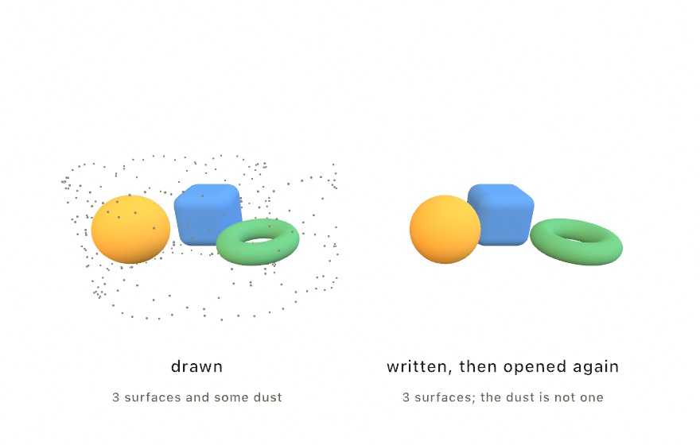
</picture>

The surfaces come back exactly. The dust does not, and that is the rule worth carrying: **a model file holds surfaces**. Meshes travel, with their transforms, their colors, their textures, and as much of their finish as the format has a slot for. The camera and the lights travel too. A point cloud, a GPU particle system, and a raymarched field are not surfaces, so they stay behind. So does 2D drawing, which is why a labeled diagram arrives without its labels. Ollin prints one note for each thing it left, rather than letting you find out later.

If you want a field or a cloud to travel, give it a surface first. [Chapter 26](26-SculptingWithFields.md)'s `isosurface(at:in:_:)` and [Chapter 27](27-DepthAndThePhone.md)'s `particleSurface(of:)` turn one into a mesh, and a mesh always goes.

One number decides whether the model is furniture or a paperweight:

```swift
scene.write(to: "piece.usdz", metersPerUnit: 0.05)
```

A model file records how big one scene unit is, and nothing is scaled on the way out. At the default of 1 a sphere of radius 1 arrives two meters across. Most 3D sketches work at unit scale. Something between `0.01` and `0.1` is usually what you want for a piece someone will set on a table.

Lighting is the one place a spatial export deliberately gives something up. The lights travel, but an [environment](../Docs/3D/3D.md#environment-lighting) does not. A viewer supplies its own, and in AR that viewer is a camera looking at your actual room. A metal surface exported this way reflects wherever it ends up, which is a better answer than the studio it was made in. [Spatial](../Docs/Output/Spatial.md) has the full list of what carries. `Examples/3D/Geometry/SpatialExport` is a ring of solids with a save key.

## Something you can look into: spatial video

A model hands over a scene and lets someone choose an angle. That works because the scene is still. Motion cannot be handed over that way, so it gets handed over differently. It is recorded from two eyes at once, the way you already see the room you are sitting in.

```sh
swift run Example-3D-Geometry-SpatialVideo --export-spatial piece.mov --seconds 8
```

That writes **spatial video**, which is the format Apple's platforms record and play with real depth. Everything about the drive is the export you already know, the same fixed clock and the same determinism. The difference is that each frame is rendered twice, from two cameras a little way apart. The two views travel together in one file.

Two numbers decide what that looks like, and neither is a setting you get right or wrong. They are composition.

<picture>
  <source media="(prefers-color-scheme: dark)" srcset="Images/31-SharingAndPerforming/StereoPair-dark.jpg">
  
</picture>

**Convergence** is the distance at which the two eyes agree, and the diagram is what that means. Follow a line from each eye through an object to the screen: those two landing places are where each eye sees it. For something sitting at the convergence distance they land together, so it appears *on* the screen. For something nearer, the lines have already crossed by the time they get there, and the marks come out the wrong way round. Your eyes read that as an object in front of the screen, poking out. Farther away, the marks spread apart the ordinary way and the object sits behind. So choosing the convergence distance is choosing what the viewer is looking *into* rather than *out at*.

**Interocular** is how far apart the eyes stand, in world units, and it is the depth dial. Half reads flatter. Twice reads deeper, then starts to hurt. Left alone, Ollin puts the eyes 1% of the frame width apart, and that rule has a reason. It works out to the far background separating by 1% of the frame too. That is less than a viewer's own eyes span, so nothing ever asks them to point outward. Pointing outward is the one thing stereo must never do.

A sketch declares both the way it declares a loop:

```swift
override var stereoGeometry: StereoGeometry {
    StereoGeometry(interocular: 0.1, convergence: 6)
}
```

Leave either one out and it is worked out from the camera. The convergence distance defaults to whatever the camera is already pointing at. The reasoning is that you are looking at the thing the piece is about. Either can also be overridden for one export with `--interocular` and `--convergence`, which is the fastest way to find out what they do. Push the near pillar of that example until it stops being pleasant, and you will have learned more than this section can tell you.

One detail is worth knowing because it explains something that could otherwise look like a bug. The frame is **drawn once and rendered twice**. Not drawn twice. Drawing again would roll the sketch's randomness a second time, and step every simulation a second time. Some of them are honest about not repeating exactly, so the two eyes would end up looking at different worlds. One draw, two cameras, and both eyes see the same instant.

The consequences of that are worth reading as rules. Anything the sketch already flattened while drawing keeps its one answer. A `project()`, a `depth(at:)` placement, and a billboard are all that kind of thing. Each lands flat on the screen plane in both eyes, which for captions and overlays is usually what you want. A 2D sketch has nothing to disagree about and comes out flat, and says so. So does an accumulating sketch, because its pile lives in one surface and there is only one of it.

Finally, the file records how far apart the eyes that shot it really were, so a player can scale the depth it shows. `--meters-per-unit` is how you say what a world unit is, exactly as for a model. [Spatial](../Docs/Output/Spatial.md#spatial-video) has the rest. `Examples/3D/Geometry/SpatialVideo` is a colonnade built to have depth worth recording, with both numbers on parameters.

## Reproducibility is part of the piece

A shared render is better when it can be *re-made*. Three habits from earlier chapters do the work here. Seed the randomness (`seed(…)` in `setup()`, [Chapter 4](04-Randomness.md)), so the export and the re-export are the same artwork, not siblings. Copy tuned `@Param` values back into their declarations once they feel right, because a headless export reads the defaults written in code, not the inspector. A value you want for one render only can ride the command line instead, which is the next section. And share the `.swift` file alongside the render when you can. In Ollin the sketch is the artifact. A reader holding the source holds the whole piece, seeds, parameters, and all.

The exports meet you halfway. Every PNG, SVG, PDF, and video Ollin writes carries a small **recipe** in its metadata. It holds the seeds the run used, the value of every `@Param`, and the git commit the code was at. The commit is marked dirty if you had uncommitted edits. It also records which frame at which rate produced it.

Image metadata has existed for decades, in the same place a camera writes its shutter speed and lens. Ollin puts something more useful there. Read it back with any metadata tool:

```sh
exiftool -Description poster.png
```

This matters when you need to recover a past render. You find an image from four months ago that you like. You have no memory of which of eleven variations produced it, and the sketch has changed since. The file tells you: seed 48213, these parameter values, that commit. Check out the commit, pass the seed, and you have it back.

One limit stays. GIF has no metadata slot in its format, so a GIF export carries nothing.

The other one has a fix. A recipe takes you back to the code only if that code still exists. Uncommitted edits often do not: the commit is marked dirty, and the next save overwrites what you rendered. Add `--capture-source` to any export and the code is kept for you.

```sh
swift run --package-path Examples Example-Randomness-Variations --export keeper.png --capture-source
```

Your working tree goes into the repository as a commit that sits on no branch, and the file is named after it. `keeper.png` becomes `keeper-93ae989.png`. Nothing you own moves: your branch, your index, and your edits are exactly where you left them. Months later the file name is enough to get the code back.

```sh
git show 93ae989:Sketch.swift
```

See [the details](../Docs/Output/Export.md#reproducibility-metadata) for every field the recipe holds, and [captures that know their source](../Docs/Output/Export.md#captures-that-know-their-source) for the rest of that flag.

### Passing the parameters back in

Reading a recipe is half of it. The other half is handing those values back to a run.

`--param name=value` sets one declared parameter for this run. It repeats, so a run carries as many parameters as you need.

```sh
swift run --package-path Examples Example-Live-Parameters --export keeper.png --param radius=40 --param paper=#101018
```

Each value is read against its own parameter. A number stays a number. A color is a hex string. A vector is two numbers with a comma between them. A menu choice is its name, spelled loosely: `easeOut`, `ease-out` and `"Ease Out"` all find the same one. The [Export page](../Docs/Output/Export.md#setting-a-parameter-for-the-run) lists every kind.

The value lands after `setup()` and before the first frame. So it wins over a value the sketch sets for itself, and the new file's recipe names it. A frame can be rendered again from its own recipe, with the sketch on disk untouched.

Ask for a parameter the sketch does not have, or a value its kind cannot read, and the run stops and says so. It never renders something you did not ask for.

## Saying what it shows: describable output

<picture>
  <source media="(prefers-color-scheme: dark)" srcset="Images/31-SharingAndPerforming/SayingWhatItShows-dark.jpg">
  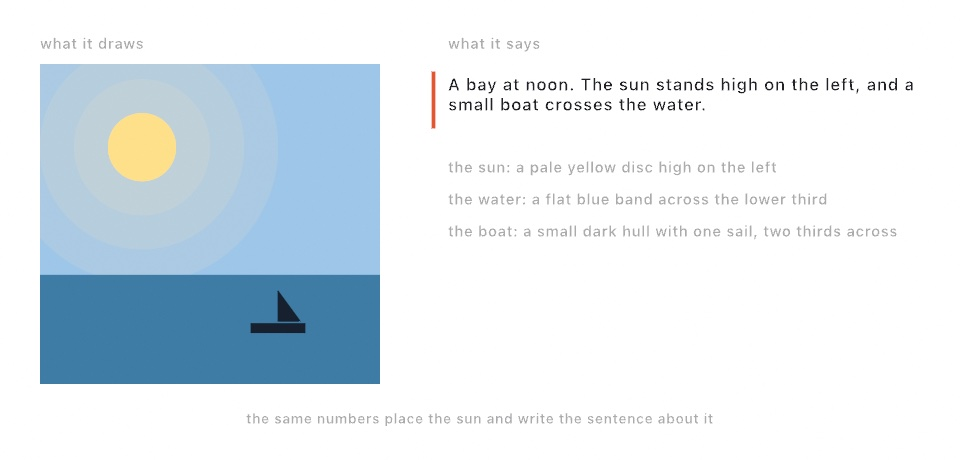
</picture>

Everything so far has been about the picture. Somebody using a screen reader gets none of it. They arrive at your window, or your exported drawing, and find a rectangle with nothing to say for itself.

One line answers that:

```swift
describe("A bay at noon, with a small boat crossing the water.")
```

That sentence becomes the canvas's accessible name. Turn on VoiceOver with ⌘F5 and the window reads it out.

A piece with things in it can name them:

```swift
describe("the sun", as: "a pale yellow disc high on the left", in: sunBox)
describe("the boat", as: "a small dark hull with one sail", in: hullBox)
```

Each named part becomes something a screen reader can move to. The `in:` region is optional, and worth giving: with one, a part can be found by position rather than only in order.

Now the habit that makes this work. **Write the words from the same numbers that draw the picture.** The figure above is one sketch. The sun's position places the disc *and* writes "high on the left". A description written that way cannot drift out of date, because there is nothing to keep in step.

```swift
let p = Vector2(x, y)
drawCircle(center: p, radius: r)
describe("the sun", as: "a yellow disc \(p.y < height / 2 ? "high" : "low")")
```

Call `describe` every frame. Naming a part again replaces what you said, so the list never grows. Empty text takes a part out when it leaves the picture. Naming it again puts it back in the same place, so the reading order stays put.

Keep the parts few. Describe what is there rather than how it is made. Say "a red circle drifting left", not "a `drawCircle` driven by `sin(time)`". Texture is not a part: the glow around that sun is worth drawing and not worth naming.

The words travel with the work. An exported SVG carries them as `<title>` and `<desc>`, which is where a browser and a screen reader look. A PDF carries the summary as its document title. PNG, GIF and video have nowhere standard to put it, so they carry nothing.

One thing Ollin will not do is write the description for you. It could list your shapes, and a list of shapes is not a description of what they mean. Only you know which circle is the sun.

See [Accessibility](../Docs/Helpers/Accessibility.md) for the rest. `Examples/Basic/Describing` is a day passing over that bay, saying what it shows as it goes.

## Live feeds: into other apps

Some pieces shouldn't become files at all. They should stay alive and go *into* something. **Syphon** is the macOS standard for handing GPU frames between running apps, and one line makes a sketch a source every VJ tool can see:

```swift
import OllinSyphon

override func setup() {
    publishSyphon(name: "Ollin")     // every frame is now a Syphon source
}
```

Resolume, MadMapper, VDMX, and other creative-coding frameworks all read it live, pixel-identical to your window, with nothing touching disk. It works the other way too. `SyphonClient` subscribes to another app's feed and hands you each frame as an `Image`. Draw it, warp it, or feed it to [Chapter 30](30-Seeing.md)'s trackers. Pair it with [Chapter 28](28-SoundAndControl.md) and the rig conversation goes both directions at once: visuals over Syphon, control over OSC or MIDI. The `Integration/SyphonLoopback` example runs both ends in one sketch, a video-feedback tunnel that watches itself. You can see the plumbing with no second app installed.

### The sketch as a webcam

Syphon is app-to-app, which means both ends have to have agreed to speak it. That covers the VJ world and misses everything else, including the one destination people ask about most: the browser. A web page asks the operating system for a *camera*, and no amount of Syphon will make it see one.

So the other publishing route makes the sketch an actual camera:

```swift
import Ollin
import OllinCamera

override func setup() {
    publishVirtualCamera()      // every frame now feeds a system-wide camera
}
```

After that, "Ollin Camera" is in the camera menu of every app on the machine. Zoom, Meet, QuickTime, OBS, Photo Booth, and any web page that asks for a camera can all take a sketch as their input. Your next video call can open on a reaction-diffusion field.

There's a one-time setup, and it's worth knowing why. A camera device is a piece of the operating system, not something a sketch can conjure. The device itself is a macOS **system extension**, installed by the Ollin Camera app in this repository. Launch it from `/Applications` and approve the extension in *System Settings ▸ General ▸ Login Items & Extensions ▸ Camera Extensions*. From then on the device exists whether or not any sketch is running. When nothing is publishing it shows a "no signal" test card. That is a friendlier thing for a video call to find than a black rectangle. If you publish without having installed it, nothing breaks: the sketch keeps drawing, and `isAvailable` and `unavailableReason` tell you what's missing.

Two facts about the frame will save you a confused minute:

- **The camera frame is a fixed 1280×720.** Your canvas is scaled to fit and centered. A square canvas therefore arrives with black bars down both sides. If a piece is destined for a call, `canvasSize = .size(1280, 720)` fills the frame exactly.
- **The camera runs at 30 fps.** A sketch running faster publishes every other frame. A slower one simply updates the camera at its own pace.

And when the picture looks wrong, suspect the *viewer* first. Photo Booth mirrors every camera preview like a selfie mirror. Text in your sketch reads backwards there, exactly as it would on the built-in camera. It also crops, because its preview pane isn't 16:9. Conferencing apps usually mirror your self-view while sending the unmirrored picture to everyone else. QuickTime's File ▸ New Movie Recording shows the frame as published, uncropped and unmirrored. It's the fastest way to see what other apps are really receiving.

## Touch as an output: haptics

A sketch already leaves the machine as pixels and as sound. There is a third way out, and the Mac has had it under your hand the whole time. The trackpad can knock.

```swift
import OllinHaptics

override func draw() {
    background(.white)
    if ball.justLanded { playHaptic(.tap(intensity: 0.9, sharpness: 0.8)) }
    drawCircle(ball.position, radius: 24)
}
```

A `HapticPattern` is a value, like a color. It holds taps and hums on a little timeline of its own. Two numbers describe each one, both running 0 to 1: `intensity` is how strong it feels, and `sharpness` runs from a dull thud to a tight click. A hum also takes a length, and a `fadeIn` and `fadeOut` in seconds.

Patterns join the way words make a sentence:

```swift
let heartbeat = HapticPattern.tap(intensity: 1, sharpness: 0.7)
    .then(.silence(0.12))
    .then(.tap(intensity: 0.55, sharpness: 0.5))

playHaptic(heartbeat.repeated(4, every: 0.85))
```

`then` puts one piece after another, `over` starts two together, and `delayed`, `repeated`, `scaled`, `speed`, and `reversed` do what they say. Nothing here reads your canvas and guesses. Touch is designed, the way the picture is.

Now the part that decides how a piece should be written. A trackpad is not a small speaker. It has three fixed feelings and exactly one strength, and it gives them one at a time. So a pattern is translated before it is played:

<picture>
  <source media="(prefers-color-scheme: dark)" srcset="Images/31-SharingAndPerforming/FeltPattern-dark.jpg">
  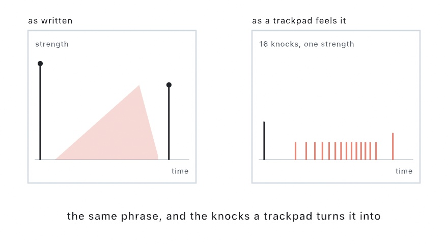
</picture>

Sharpness picks which of the three feelings each event asks for. Strength turns into *density*. A strong hum arrives as a fast run of knocks and a weak one as a slow run, and a fade thins the run instead of lowering it. The hand reads a faster run as a stronger buzz, which is why this works. Anything under a floor is dropped, so a pattern that fades away ends in silence rather than one last stray knock.

Two habits follow from that. Play at the moment something happens, not every frame: touch marks events, the way a drum marks a bar. And if a piece leans on strength alone, it will read flat on a trackpad. Ask `hapticHardware` and give that case fewer, crisper marks instead.

The `Integration/HapticRidges` example is three strips of ridges you drag across. It draws the plan along its bottom edge, so you can see what your pattern really asked the hardware for. On a machine with nothing to feel, and in every export, all of this quietly does nothing and the sketch runs on.

## Adding behavior without touching the sketch: SketchExtension

One more piece is worth knowing about once you have several sketches. It answers a question that comes up as soon as you want the same extra behavior in all of them. How do you add something to a sketch's life cycle without editing the sketch?

An **extension** is a small object that gets told when things happen. You register it once. From then on it hears about setup, and about each frame before and after the drawing. If it asks, it also hears about the finished rendered image.

```swift
extend(MyWatermark())
```

The reason this exists rather than you just adding lines to `draw()` is that some behavior isn't about the artwork. None of these belong in the piece, and all of them want to apply to every piece:

- a frame recorder,
- an on-screen readout of the frame rate,
- a guide overlay you toggle while composing,
- a logger that notes which seed produced which render.

Ollin's own frame-rate statistics work exactly this way, as an extension registered by the host rather than anything in your sketch.

One detail is worth flagging. Hearing about the rendered image is opt-in, through a property the extension sets. Reading pixels back from the GPU costs real time. An extension that only watches timing pays nothing. The [extension seam](../Docs/Core/Sketch.md#extensions) has the hook list.

## Giving it to somebody else

Say you have written a drawing call you keep copying between pieces. How does somebody else get it?

An Ollin extension is a Swift package that depends on Ollin. That is the whole format. Somebody adds your package, writes one `import`, and your call sits beside `drawCircle`.

<picture>
  <source media="(prefers-color-scheme: dark)" srcset="Images/31-SharingAndPerforming/ExtensionShape-dark.jpg">
  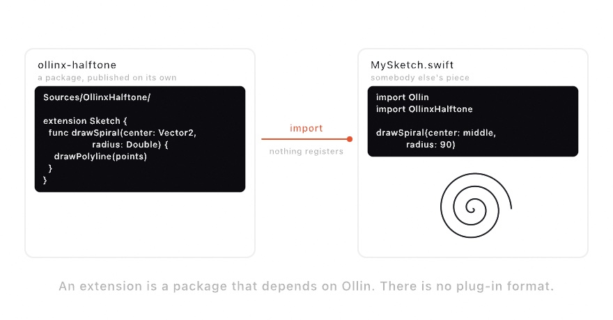
</picture>

It is straightforward because `drawCircle` is a method on `Sketch`. Yours is too:

```swift
extension Sketch {
    public func drawSpiral(center: Vector2, radius: Double) {
        drawPolyline(points)
    }
}
```

The rest follows from `drawPolyline`. The current `stroke` applies. The transform stack applies. Clipping, `symmetry`, and SVG export apply. You write none of it.

The command that made your first folder makes this one too:

```sh
ollin new Halftone --kind extension
```

The package is named the shared way. The folder is `ollinx-halftone` and the module is `OllinxHalftone`. The prefix follows openFrameworks' addon naming and OPENRNDR's own. No enforcement exists, but with no catalog to look in, a shared prefix is how packages get found.

Inside is a worked starter, tests that check something real, and a list of what to fix before publishing. One item on that list catches everybody. The generated manifest points at the copy of Ollin on *your* machine.

Pick what the starter is built on with `--seam`. A drawing call, as above. A GPU effect, written as a shader and wrapped so `layer.filtered(.vignette())` reads like a built-in. A source of frames, which any tracker from [Chapter 30](30-Seeing.md) then accepts. Or a lifecycle extension, which is the section you have just read, packaged. See [writing an extension](../Docs/Tools/Extensions.md) for all four, and for the parts of Ollin that are deliberately closed.

The generator window from [Chapter 1](01-HelloOllin.md) makes the same package. Pick **Extension package** from its kind menu. The seams take the place of the templates. The stage shows the starter's source instead of a running sketch, checked against the framework. A seam that stopped compiling says so before you press Create.

## In your pocket: the sketch on the phone

A sketch written for the desk runs on a phone as it is. The renderer is the same, and so is `draw()`. A finger is the pointer, so `mouseX` and `mouseIsPressed` read the touch. Working on it is one command:

```sh
ollin phone Apps/OllinSketchApp/Sources/TouchRings.swift
```

The rings appear on the phone. Save the file, and under ten seconds later the phone shows the new version. The app writes its state down every second and reads it back when it launches. A save keeps the animation's phase and every value you tuned. It is `--keep-clock`, kept on the phone.

A phone runs only code signed inside its app, so nothing can be swapped into it while it runs. Each save is a small build and a reinstall. That sounds slow and is not. The framework builds once, and after that a save recompiles one file.

The phone's parameters open in a browser on the Mac, live in both directions. It is the [remote surface](../Docs/Integration/Remote.md) an installation is tuned from, pointed the other way.

Two limits are the phone's. It has to be unlocked for the Mac to open the app. And it has to be on the cable, or awake on the same network. [The sketch on the phone](../Docs/Tools/OnThePhone.md) says what comes along, what stays on the desk, and how to write the app by hand.

## Performing the code itself

The last output is a stage. `swift run OllinLiveCoding` opens the performance host, where the sketch fills the window and the code rides over it as translucent text, part of the show:

<picture>
  <source media="(prefers-color-scheme: dark)" srcset="Images/31-SharingAndPerforming/StageDiagram-dark.jpg">
  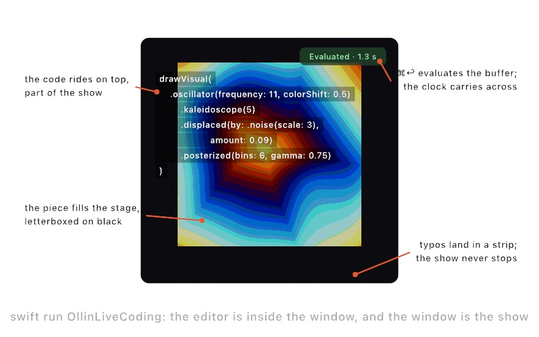
</picture>

The loop is different from the live-reload host you've used since [Chapter 1](01-HelloOllin.md). There is no file watching and no separate editor, so you type in the window and press **⌘↩** to evaluate. The buffer compiles in the background while the running sketch keeps drawing. On success the new sketch swaps in with the clock carried across, so a phase-driven motion never jumps mid-set. Tuned `@Param` values (including ones bound over MIDI or OSC) carry across too. A typo can't stop the show. The last good sketch keeps playing, the errors land in a strip along the bottom, and you fix and evaluate again. When the code should get out of the way, **⌃⇧H** hides it and the visuals keep the whole stage. Fullscreen for the projector is **⌃⌘F**. For a real set, `Scripts/OllinLiveCoding` builds the host in release mode so the framework renders at full speed.

Evaluation never writes your file (⌘S does), so you can riff as recklessly as the room deserves and keep only what worked.

## Keeping the take

Every exporter in this chapter re-renders. That is their gift: a fixed clock, the same file every run, nothing left to chance. A performance is the opposite kind of thing. The parameter you rode, the evaluation that landed at the right moment, the note that answered the room: none of it happens twice. An export remembers the sketch; a recording remembers the night.

So the host records. Press **⌘⇧R** and a red chip starts counting on the stage. Play the set. Press **⌘⇧R** again and the take is a movie in `~/Movies/Ollin/`, picture and sound together, named after the sketch and the moment. The recording rides through evaluations, so a set that changed its code twelve times is still one continuous movie.

A sketch can also record itself, anywhere, with one pair of calls:

```swift
override func keyPressed() {
    guard key == "r" else { return }
    if isRecording {
        stopRecording()
    } else {
        startRecording()
    }
}
```

The sound needs no wiring. The recorder finds the instruments the sketch is holding, the same way the offline soundtrack does, and what they play lands in the file's audio track in sync. When the music comes from outside the sketch, record the room instead: `startRecording(audio: .microphone)` asks for the microphone and listens to the air.

For a run filmed from its very first frame, the watcher host takes a flag:

```sh
swift run OllinLive MySketches/Finale.swift --record
```

Stopping is generous on purpose. Quitting the host finishes the movie first, and so does Control-C in the terminal, because a take that ends badly should still be a take. The working example is [`Examples/Export/Record`](../Examples/Export/Record/Sketch.swift), an instrument you drag to play; everything else lives in [Recording](../Docs/Output/Recording.md).

## Playing the night again: replay

A movie remembers what the performance looked like. A *take* remembers the performance itself: the seed the run rolled, the clock it followed, every pointer move, every parameter you adjusted. It is one small JSON file, and playing it back walks the sketch through the same frames, pixel for pixel.

```sh
swift run OllinLive MySketches/Finale.swift --record-take take.json   # play; quitting writes the file
swift run OllinLive MySketches/Finale.swift --replay take.json        # the run, again, exactly
```

During a replay your mouse belongs to the recording, so the keyboard becomes a transport. Space pauses. The arrows step one frame; with shift held they jump thirty. Home rewinds, End jumps to the last frame, and space at the end starts the night over. Stepping backward re-runs the sketch from the start up to the frame you asked for, which determinism makes exact. Finding the one frame worth keeping becomes arrow keys instead of luck.

The best part is what a take turns into afterwards. `--replay` composes with every exporter in this chapter:

```sh
swift run OllinLive MySketches/Finale.swift --replay take.json --export-video night.mov
swift run OllinLive MySketches/Finale.swift --replay take.json --export still.png --frame 412
swift run OllinLive MySketches/Finale.swift --replay take.json --path-traced --export-video film.mov
```

A replayed video needs no `--seconds`; it renders the whole take. So the set you played live at sixty frames a second can re-render overnight at seconds per frame, exactly as performed. And `--seed` beside `--replay` keeps your gestures while `random()` walks a different world, so one good performance can audition many variations.

What replays is what drives the sketch: time, input, parameters, randomness. A camera feed or a microphone keeps playing live during a replay. A piece leaning on the room follows your recorded hands, not the recorded room. The whole contract, and the `Take` type under the flags, lives in [Replay](../Docs/Core/Replay.md).

## Directing the parameters: keyframes

A take remembers what you did. Keyframes say what should happen. You already have parameters: the `@Param` properties from [Chapter 1](01-HelloOllin.md). An *automation* moves them for you. A value is placed at one moment, another later, and a curve carries the first into the second.

```swift
override func setup() {
    automate($radius) { track in
        track.key(at: 0, 40)
        track.key(at: 2, 320, curve: .easeInOut)
        track.key(at: 4, 40)
    }
    automation?.loops = true
}
```

That is the whole idea. Every frame, before your `draw()` runs, the parameter is set to whatever its curve holds at the sketch clock. You stop adjusting the parameter and start writing down what it does.

Each key carries the curve that *leaves* it, so the last key's curve is never read. Five of them are named, and one is drawn:

<picture>
  <source media="(prefers-color-scheme: dark)" srcset="Images/31-SharingAndPerforming/ParameterOnACurve-dark.jpg">
  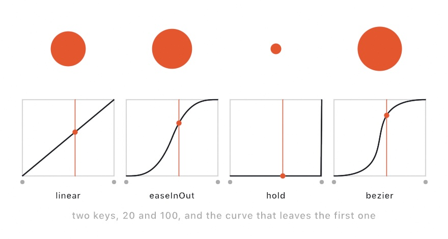
</picture>

`.linear` is the straight line. `.easeIn`, `.easeOut`, and `.easeInOut` are the eases from [Chapter 3](03-MotionAndTime.md). `.hold` sits still and then jumps. `.bezier(x1:y1:x2:y2:)` is the one you shape by hand. Its two handles bend the clock as well as the value, the way a curve dragged in an editor does.

Not every parameter can travel. A number, a color, a point, or a range has values in between two settings, so it moves along the curve. A switch, a menu choice, and a piece of text have nothing in between. They step instead, holding what they were given until the next key takes over. That is the honest behavior, and it is why a fill toggle on a track blinks rather than fades.

How a pass plays is three properties. `loops` wraps at the end. `speed` scales the clock, so `2` runs twice as fast, and a negative speed runs the piece backwards from a `start` at the end. `length` holds past the last key before the wrap comes around, which is how you leave a beat of stillness in a loop.

Here is why keyframes sit in this chapter. The tracks read the sketch clock, and every exporter drives that clock at a fixed step. So the piece you directed renders exactly as it played:

```sh
swift run --package-path Examples Example-Motion-Automation --export-video directed.mp4 --seconds 12
```

An automation is plain data as well, which means a sketch can read its own tracks back and draw them. The [Automation example](../Examples/Motion/Automation/Sketch.swift) plots each of its four tracks under the stage, playhead and all. And `--automation file.json` drives the same parameters from a file instead of from code. The full surface is in [Automation](../Docs/Core/Automation.md).

### Directing by hand: the timeline panel

You do not have to write keys as code. In OllinLive, the timeline panel places them for you, at the moment you are looking at.

Click **Timeline** in the title bar, or press **⌘T**, and a floating panel opens with a ruler, a transport, and one lane per track. Try it on the Automation example:

```sh
swift run OllinLive Examples/Motion/Automation/Sketch.swift
```

The loop has three moves. Scrub the ruler, or step a frame at a time, and the picture follows the playhead. Adjust a parameter in the inspector until the frame looks right. Then click the small diamond in that parameter's row, and a key lands at the playhead holding that value. A hollow diamond starts a track; a filled one already has one; clicking on a key takes it away.

The lanes draw what will happen. A number lane plots its curve, a color lane shows the blend as a band, and a switch steps. Drag a key to move it in time. Click one to pick the curve that leaves it, and a Bezier grows two handles you shape by eye. The loop button repeats a stretch while you work on it, and that region never touches the piece itself.

Everything you place lands in `Sketch.automation.json` beside the sketch, the same file `--automation` and every export read. The live host reads it back on launch and across every reload, so the direction survives the edit loop. One rule to hold: a track your `setup()` writes for the same parameter wins that parameter, because the code is the artifact. The full tour is in [The parameter timeline](../Docs/Tools/Timeline.md).

## Writing the parameter as a rule

Keys say where a parameter is at a few moments. Sometimes you do not want moments. You want to say what the parameter *is*, and have it be that at every moment:

```swift
override func setup() {
    drive($radius, "190 + sin(time * tau / 6) * 80")
}
```

<picture>
  <source media="(prefers-color-scheme: dark)" srcset="Images/31-SharingAndPerforming/ParameterAsARule-dark.jpg">
  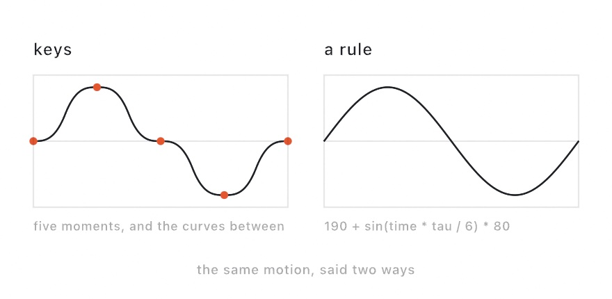
</picture>

That is a *formula*, and the thing to notice is the quotation marks. The rule is text, not Swift source. Text can arrive at runtime. It can be typed into a field, read out of a file, or changed while the piece is playing. None of that needs a recompile. That is the whole reason this exists beside the curves.

The arithmetic is the arithmetic you already write. `sin`, `clamp`, `lerp`, `smoothstep`, `noise`, `pi` and `tau`, spelled and ordered exactly as they are in `draw()` and in a shader. A formula reads `time`, which is where the pass stands, plus `frame`, `width`, `height`, `mouseX`, `mouseY`, and any of your other parameters by name:

```swift
drive($radius, "190 + sin(time * tau / 6) * 80")
drive($count, "8 + round(sin(time * tau / 12) * 5)")   // a whole number rounds
drive($edge, "radius / 22")                            // worked out from another parameter
drive($filled, "time % 6 < 3")                         // a switch, on when it is not zero
```

`edge` is the interesting line. It reads *this* frame's radius, not last frame's, because the parameter a formula names is always set first. That ordering is not a nicety. It is what keeps a formula a plain function of the clock. The same second gives the same picture whether the window runs at 60 a second or an export steps at 30.

The price of that promise is that two parameters cannot name each other, and a parameter cannot name itself. `"n + 1"` never settles on one frame. Ollin says so and leaves that parameter alone, rather than play a value that would drift with the frame rate. For a number that builds on itself, keep a plain property and step it in `draw()`, the way [Chapter 3](03-MotionAndTime.md) does.

A formula is a track like any keyed one. It loops, it plays at any speed, and it renders frame for frame through every export. It travels in the same `--automation` file too, written down as the text you typed. The [Formula example](../Examples/Motion/Formula/Sketch.swift) drives six parameters this way and prints the rule driving each one under the picture. The whole vocabulary is in [Formula](../Docs/Helpers/Formula.md).

Two spellings will catch you once. `-2^2` is `-4`, because a power binds tighter than a minus sign, the way a calculator reads it. And `-1 % 3` is `2`, not `-1`, because the remainder wraps rather than reflects, which is what makes a phase continuous as it crosses zero.

### A parameter that holds more than one number

A point holds two numbers. A color holds four. A rectangle holds four of its own. Each part takes its own rule, named where you write it:

```swift
drive($frame, width: "620 + sin(time * tau / 7) * 220")
drive($eye, x: "frame.x + frame.width / 2", y: "height / 2")
```

<picture>
  <source media="(prefers-color-scheme: dark)" srcset="Images/31-SharingAndPerforming/ParameterParts-dark.jpg">
  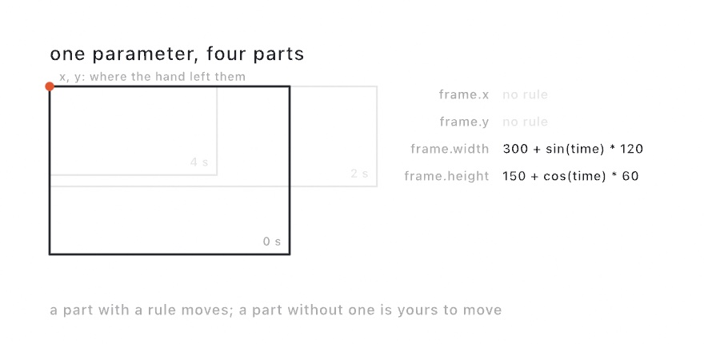
</picture>

The part you leave out is the part you keep. That rectangle changes size while its `x` and `y` stay wherever you dragged them, and you can go on dragging them while the size plays. That is the reason to write a rule for one part rather than for a whole parameter.

One part of a parameter is a name too, spelled `parameter.part`. That is how `eye` above follows the rectangle it sits in. The name works whether keys carry that part or another rule works it out.

Three things to know before you write one. One call carries the whole parameter, so give every part at once, because a second call replaces the first. A pair of ends stays ordered, so a `lower` that climbs past `upper` lifts it along. And a color's parts are the plain 0-to-1 numbers with nothing holding them there, so write `saturate(...)` where you want a limit.

The [FormulaParts example](../Examples/Motion/FormulaParts/Sketch.swift) drives four such parameters and prints the rule driving each part under the picture.

## Putting it together: a set in five evaluations

What you'll build here is a short performed set. Open the host with a fresh buffer. Build the chapter's finale the way an audience would watch it grow, one evaluation at a time. [Chapter 17](17-YourFirstShader.md)'s `Visual` chains are the natural material for this kind of set, since every step is one added line:

<picture>
  <source media="(prefers-color-scheme: dark)" srcset="Images/31-SharingAndPerforming/SetSteps-dark.jpg">
  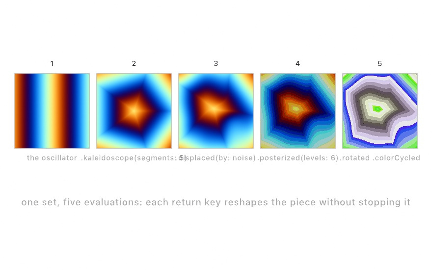
</picture>

1. Start with breath. Type `drawVisual(.oscillator(frequency: 11, speed: 0.6, colorShift: 0.5))`, press ⌘↩, and drifting bands fill the stage.
2. Fold space by adding `.kaleidoscope(5)`, which turns the bands into a five-pointed mandala, still breathing.
3. Melt the fold with `.displaced(by: .noise(scale: 3, speed: 0.25), amount: 0.09)`.
4. Make it a print with `.posterized(levels: 6, gamma: 0.75)`, and the melt hardens into contour bands like a screen print.
5. Set it flying with `.rotated(time * 0.03)` and `.colorCycled(time * 0.04)`, a slow spin through the whole color wheel.

The finished buffer is the whole piece, and it's small enough to retype from memory, which is rather the point. The committed figure is [`Finale.swift`](Figures/31-SharingAndPerforming/Finale.swift):

```swift
import Ollin

final class Finale: Sketch {
    override func draw() {
        drawVisual(
            .oscillator(frequency: 11, speed: 0.6, colorShift: 0.5)
                .kaleidoscope(5)
                .displaced(by: .noise(scale: 3, speed: 0.25), amount: 0.09)
                .posterized(levels: 6, gamma: 0.75)
                .rotated(time * 0.03)
                .colorCycled(time * 0.04)
        )
    }
}
```


Then close the loop this chapter opened. Save the buffer with ⌘S. Render a shareable file with `swift run OllinLive MySketches/Finale.swift --export-video finale.mp4 --seconds 12`, or press ⌘⇧R before the first evaluation and keep the performed version instead, evaluations and all. And if a projector or a call is nearby, run `publishSyphon()` or `publishVirtualCamera()` while you perform. The same small sketch just walked out of every door this chapter opened.

Then make it yours:

- Play the set differently by reordering the moves, or swap step 2's fold for `.repeated(x: 3, y: 3)` and the mandala becomes wallpaper.
- Wire [Chapter 28](28-SoundAndControl.md) in: `@Param` the oscillator frequency, bind it to a MIDI parameter, and the set gets a second instrument.
- Feed it eyes: `.displaced(by: .layer(feed), amount: 0.1)` over a layer you draw the webcam into, and the audience melts the piece.
- Perform an old friend, since any finished piece from this guide runs in the host as-is. Try evaluating changes into [Chapter 19](19-GridSimulations.md)'s reaction-diffusion while it grows.

## Where this comes from

Live coding as a performance practice was organized by TOPLAP (founded 2004), whose manifesto demanded "show us your screens". The code-over-the-visuals layout of this host is that idea. Its most direct model is Olivia Jack's browser instrument Hydra, which made the pattern feel effortless. Alex McLean and the TidalCycles community built the musical wing of the same practice. Syphon is Tom Butterworth and Anton Marini's gift to the Mac's visual ecosystem, and the vendored framework carries their names. The pen-plotter revival that SVG export serves grew around the AxiDraw and the #plottertwitter community. They are heirs of the 1960s computer-art plotters this guide's recreations visit. Full credits are in the project's [attribution notes](../ATTRIBUTION.md).

## Go deeper

- [Export](../Docs/Output/Export.md): every flag, codec advice, GIF timing, SVG mapping, hatching.
- [Web page](../Docs/Output/Web.md): the flag and its length, what crosses and what stops the export, the two forms, the handle on the canvas, and what the page weighs.
- [Recording](../Docs/Output/Recording.md): recording a live run in real time, what the sound modes hear, and how a take survives an evaluation.
- [Print separations](../Docs/Output/PrintSeparations.md): the spot-ink model, the ink catalog, screening angles, and the overprint preview.
- [Fabrication](../Docs/Output/Fabrication.md): writing a mesh as STL, OBJ, or 3MF, real-world sizing, and what makes a surface printable.
- [Syphon](../Docs/Integration/Syphon.md): publishing, receiving, discovery, and the loopback.
- [Virtual camera](../Docs/Integration/VirtualCamera.md): the one-time install, publishing, the test card.
- [Haptics](../Docs/Integration/Haptics.md): writing and composing a pattern, the two kinds of hardware, and the four rules that turn a pattern into knocks.
- [Live coding](../Docs/Tools/LiveCoding.md): the evaluate loop, errors, recovery, and the keyboard reference.
- [Writing an extension](../Docs/Tools/Extensions.md): the four seams, the naming convention, the publishing checklist, and what is deliberately closed.
- [Formula](../Docs/Helpers/Formula.md): the whole arithmetic vocabulary a parameter's rule speaks, what it can name, and what it reports rather than throws.
- Worked examples: [`Examples/Export/`](../Examples/Export/), [`Examples/Live/`](../Examples/Live/), and [`Examples/Integration/SyphonLoopback`](../Examples/Integration/SyphonLoopback/Sketch.swift).

---

[Contents](README.md#contents) · Previous: [Chapter 30, Seeing](30-Seeing.md) · Next: [Chapter 32, Installations](32-Installations.md)
