#### <sup>[Ollin](../README.md) → [Guide](README.md) → Chapter 31</sup>

---

# 31. Traced light

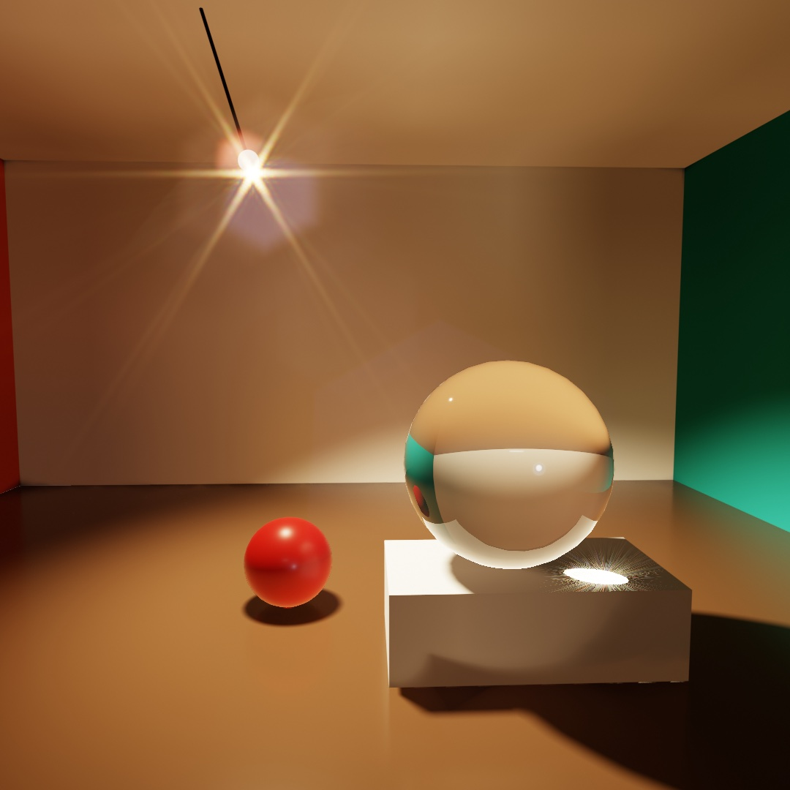

Light in most 3D frames stops at the first surface it hits, and here you follow it further. Mirrors see off screen, light bounces from wall to wall, and a glass ball focuses it into a spot. Then comes what the camera does with each frame: edges settle, a moving ball streaks, and a lamp flares in the lens. Each is a line or two added to a scene, and together they make the lamplit room above. Past it come the path-traced still, mirror tunnels, the shape of a blur, and ways to draw fewer pixels and frames.

## Mirrors that see off screen: ray-traced reflections

The room's waxed floor shows the lamp and the walls in its sheen. A scene's depth layer, from [Chapter 25](25-3DGently.md#what-the-depth-buffer-is-for-ambient-occlusion-and-defocus), can already make a reflection like that, and it is where reflections start.

**`.screenSpaceReflections`** makes a floor glossy by reflecting the scene in it, and it runs on any Mac. It works from the finished picture. For each pixel of the floor, it follows the reflected direction across the picture and its depth layer. It stops where it finds what the floor should show. A picture does not contain the back of anything, though. The true reflection can show a surface the camera cannot see, such as the underside of a ball resting on the floor. There it can only approximate. That shows as a soft zone right at the contact.

`rayTracedReflections()` makes the reflection another way. Instead of searching the finished picture, it sends a ray off each reflective surface and asks what the ray hits, using the real geometry. Off-screen objects appear, and so do hidden faces. The underside of a ball resting on a mirrored floor appears, because the ray goes there and looks. The traced hit takes the place of what the environment would have given that pixel. A ray that hits nothing shows the sky.

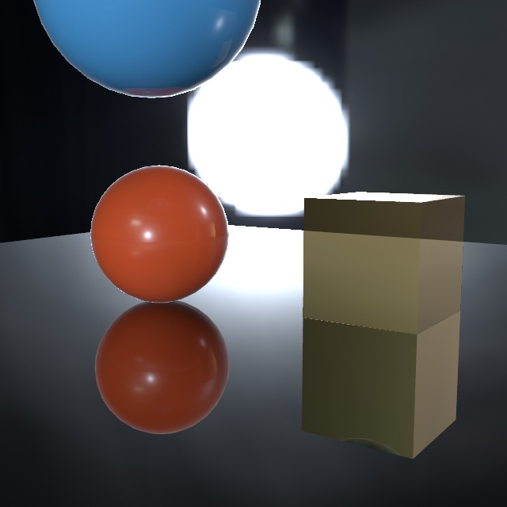

Look at the orange ball's reflection, where it meets the floor. It shows the underside of the ball, the part turned toward the floor, which the camera never sees from where it stands. That part exists in the geometry, so a ray sent to it comes back with an answer. A screen-space reflection has no pixels of that part to borrow.

```swift
environment(.studio)
rayTracedReflections()          // needs a ray-tracing GPU; a no-op elsewhere
material(.metal(roughness: 0.12))
```

It needs three things. There has to be an `environment(_:)` to fall back to. Only physically based materials reflect this way. And the GPU has to trace rays. Every Apple silicon Mac can. The M3 generation and later trace in dedicated hardware, and earlier chips trace in software. So the same scene runs slower on an M1 or M2. Where tracing isn't available, the call does nothing. The sketch still runs and looks plainer, so you can leave the call in.

Only the reflecting surface has to be physically based. What it shows can have any finish, because a ray shades whatever it hits the way that surface shades head on. So a `.toon` prop keeps its hard bands in the mirror, and a `.gooch` one its warm-to-cool shading, both finishes from [Chapter 25](25-3DGently.md#materials).

Reflections are traced with a limited number of rays and cleaned up over time while the camera holds still. So a fresh view can look faintly noisy for a moment before it settles. An export averages several rays within each frame instead of across frames, so a still is finished at once and a video cannot flicker.

Tracing the mirror is the most expensive part of a reflective frame, so it has a quality setting, like the one shadows have. If a mirrored scene stutters while you sketch, `reflectionQuality(.performance)` traces the reflection at half size in each direction and stretches it back. A curved mirror gets blockier, and fine detail inside a mirror image softens. Each surface still keeps its own reflection right up to its edge. An export raises `.default` to `.detail`, but it keeps `.performance` if you asked for it, so take that out before a final export.

### The floor that shows the room: glossy reflections

The room's floor is not a mirror, and every reflection so far has been a mirror's. A mirror sends every ray one way, so a single traced ray describes it completely. A satin floor, a waxed table, or a brushed steel panel sends each ray a slightly different way. What you see in one is the average of all of them.

One ray cannot be an average. So on its own, Ollin handles roughness by fading that one ray into a blurred copy of the environment, more as the surface gets rougher. A satin floor in a red room then reflects a gray sky, where it should reflect a blurred red room. `glossyReflections()` sends each ray along a slightly different direction, picked from how rough the surface is. The spread of those directions is called the **lobe**.

```swift
rayTracedReflections()
glossyReflections()                    // needs a ray-tracing GPU; a no-op elsewhere
material(.metal(roughness: 0.3))
```

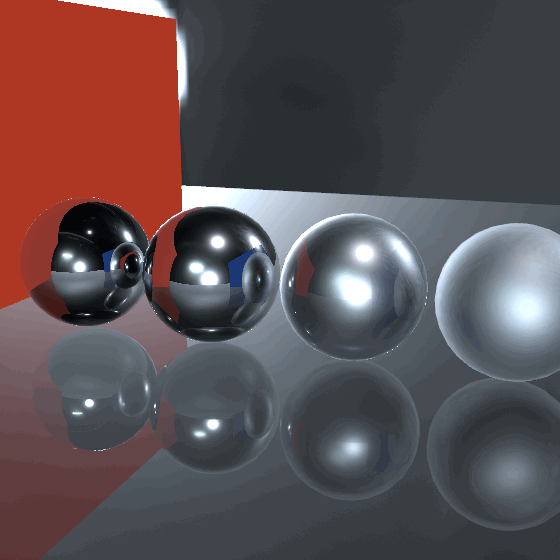

Watch the floor. With one ray it holds a hard little copy of each ball, which a satin floor never shows. The wall arrives as a wedge with a crisp edge. With the lobe the reflections soften into the floor, and the red wall's color spreads across it. The mirror ball on the left does not change, because a mirror was never the problem.

Each pixel also borrows the rays its neighbors just sent. A handful of scattered rays on their own would look like glitter, and sharing them turns the glitter into a soft reflection. A polished surface ignores its neighbors' rays, which is why the mirror ball stays sharp without anything said about it.

The lobe works up to about three-quarters rough. Past that it hands back to the environment, because the blur is so wide that the blurred sky looks the same. It costs one more pass over the picture, so keep it for sketches with satin surfaces. It persists once set, and it does nothing on a GPU that cannot trace. Meshes and fields differ in a few places over which finish applies to which, and the [combining reference](../Docs/3D/Combining.md) has the table.

## Light that bounces: global illumination

The floor now shows the room, and the room's walls also light each other. Every light since [Chapter 25](25-3DGently.md) left the lamp, hit a surface, and stopped. Real light keeps going. A sun patch on the floor lights the ceiling from below, and a red wall tints the white shelf beside it. The dark side of everything in a room is filled in by light arriving second-hand. That second-hand light is called bounce light, or **global illumination**, and one call turns it on:

```swift
spotLight(.white, at: Vector3(0.5, 3.8, 0.9), direction: Vector3(0.05, -1, -0.02),
          coneAngle: .pi / 3.2, penumbra: 0.5, intensity: 3.4)
castShadows()
globalIllumination(intensity: 1.6)   // needs a ray-tracing GPU; a no-op elsewhere
```

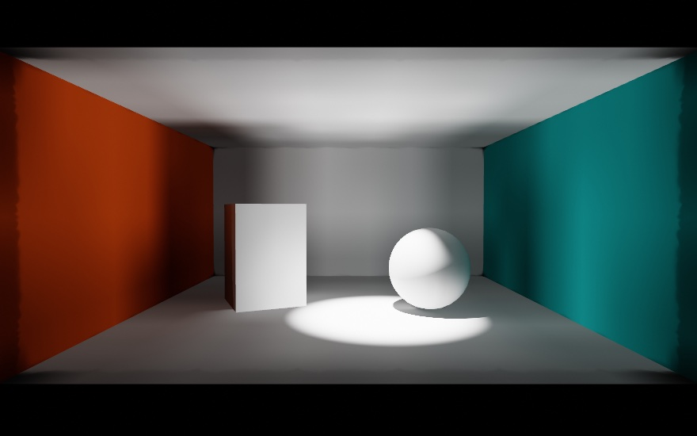

Everything in this room except the pool and the lit side of the sphere is bounce. The spot never touches the ceiling, and the ceiling glows anyway, lit from below by the floor. The walls were never lit directly either, yet the orange one reads orange, because floor light reached it and came back tinted. The sphere's shadow side is filled by the bright floor beside it. With direct light alone, all of that would be black.

Inside, Ollin scatters a grid of invisible **light probes** through the scene. Every frame it asks them again what light arrives from each direction, by firing rays at the geometry. Lit surfaces then read their neighborhood's probes for the light the lamps could not deliver directly. The probes are traced again live, so a swinging lamp or a moving shape keeps bouncing correctly, and nothing is worked out ahead of time. Three practical notes follow from that:

- **It works with shadows and environments.** With `castShadows()` on, bounce respects the same shadows the direct light does. Light doesn't pass through a wall on the second hop, and a sealed box stays dark inside. With an `environment(_:)`, the probes bring the sky in only where it can reach. A room lit through a doorway then darkens with distance from the door, which the plain environment light cannot do.
- **It covers matte surfaces.** A mirror's sharp image of the scene comes from `rayTracedReflections()`, and the two are made to run together.
- **Its `intensity` scales the bounce.** `1` is physical. Raise it when you want the bounce to read more strongly than a real room would give, as the block does with `1.6`.

Like the reflections, the probe field settles over a few frames live, so a sudden change of light fades in the way your eyes adjust. An export converges fully inside each frame, so every run of it writes the same pictures. It also needs a ray-tracing GPU and does nothing elsewhere.

The [`GlobalIllumination` example](../Examples/3D/Lighting/GlobalIllumination/Sketch.swift) is this room with the lamp swinging. The space bar turns the bounce on and off, so you can compare the two. The bounce reaches everything the picture shows. A wall seen inside a mirror carries the same second-hand light as the wall itself. A scene drawn into a layer for depth of field gathers it too.

If a heavy scene stutters while you sketch, `globalIlluminationQuality(.performance)` trades a grainier bounce for frame rate, with the same export rule as the reflections. Large scenes need nothing extra. On a terrain-sized scene, the scene-wide probe grid would spread too thin. So finer probe volumes gather around the camera and move with it. The bounce near what you look at stays as fine as in a room.

## The light the glass takes, given back: caustics

The room's glass ball throws a bright spot inside its own shadow. Set a real glass on a sunlit table and look beside it. Inside its shadow there is a bright loop, brighter than the open table around it. The glass did not destroy the light it blocked. It bent that light into one small place. Focused light like that is a **caustic**, and one call turns it on:

```swift
environment(.studio.intensified(to: 0.55).backgroundBlurred(0.6))
directionalLight(.white, direction: Vector3(-0.35, -1, -0.2), intensity: 2.2)
castShadows()
caustics()

fill(.white)
material(.glass(thickness: 2.4))
drawSphere(radius: 1.2)               // its bright spot lands inside its own shadow
```

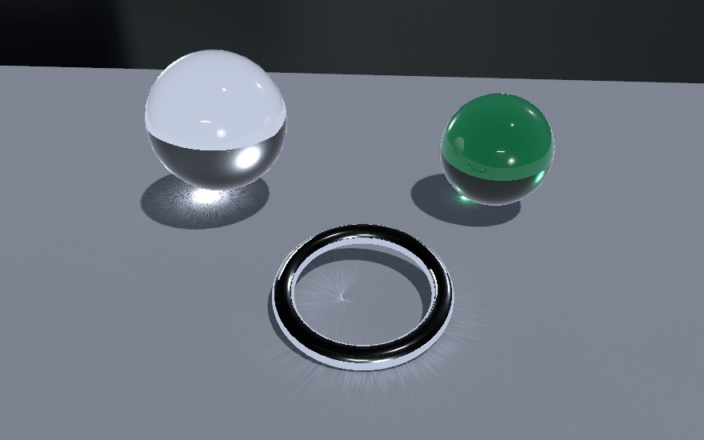

A shadow is where the light could not go, and a caustic is where it went instead. The renderer traces thousands of small parcels of light, called **photons**, from the sun through every glass and every polished metal. It draws each one where it lands. A clear ball throws a tight bright spot. A bottle-green ball throws a green one, because its photons crossed the green glass. A chrome ring lying almost flat folds light into a fan across its middle. You declare nothing, because whatever lets light through or mirrors it casts a caustic.

The call takes two settings. `caustics(intensity: 1.6)` turns the patterns up past physical. `caustics(dispersion: 1)` gives every photon its own wavelength, so a prism's edge fans into a rainbow. Even a plain sphere's spot picks up red and blue fringes. If the patterns look coarse, `causticsQuality(.detail)` traces more photons. Like the other traced light, it needs a Mac that traces and does nothing elsewhere. The [`Caustics` example](../Examples/3D/Lighting/Caustics/Sketch.swift) sets a sunlit table like the figure's, with its ring standing nearly upright, and the space bar to compare.

## Edges that settle: temporal anti-aliasing

The reflections and the bounce share a method. Each renders a slightly different estimate every frame, and the frames are averaged. The reflections vary their rays, and the probes turn the set of directions they trace. `temporalAntialiasing()` applies the same idea to every edge in the 3D picture:

```swift
camera(.orbiting(target: .zero, radius: 8, azimuth: time * 0.05, elevation: 0.3))
temporalAntialiasing()      // any Metal GPU; edges refine as frames accumulate
```

<picture>
  <source media="(prefers-color-scheme: dark)" srcset="Images/31-TracedLight/SettledEdges-dark.jpg">
  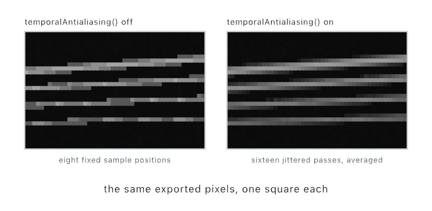
</picture>

Every 3D frame already takes several samples per pixel, eight on most Macs, but always at the same positions. So a thin bright edge at a shallow angle lands as a fixed staircase, and the steps crawl when the camera drifts. With the call on, the camera's projection moves by a different fraction of a pixel every frame. The frames fold into a running average. Soon each pixel has been sampled at dozens of positions instead of a fixed few. The staircase smooths into a gradient, the crawling stops, and the leftover shimmer of the traced effects above calms down with it.

The average follows the camera, so an orbit keeps the detail it has gathered. It leaves 2D drawing untouched, since that path already smooths its own edges. An export doesn't wait for frames. It renders the scene several times at fixed offsets inside each frame and averages them, so an exported frame needs no frames before it. Unlike the traced calls, it needs no ray-tracing GPU, and any Mac that runs Ollin can do it.

Each panel of the figure shows the pixels of a frame, magnified so that one square is one pixel. The four rods are from half a pixel to two pixels thick and tilted a few degrees, which is the case fixed positions handle worst. On the left, a rod catches two of the eight samples in one pixel and none in the next. It comes out as uneven dashes, and the thick one climbs in visible steps. On the right, sixteen shifted passes were averaged, so each pixel carries its true share of the rod. The dashes join into an even line, and the steps soften into a ramp. In a live window, the left rod would crawl as the camera drifts, and the right one would hold still.

The frames the average has gathered so far are its **history**. The average cannot know on its own where a moving object was in the last frame, though it follows the camera's motion by itself. A mesh that spins or flies through the scene on its own starts its history over each frame instead. So it leaves no smeared trail, but its edges read rougher while it moves. Wrap its drawing in `withMotion { }` and Ollin remembers the block's placement from one frame to the next. That gives the average each mover's exact motion on screen, so its edges stay smooth while it moves. Name the block, as in `withMotion("rotor") { }`, if the line of code that draws it can change between frames.

The [`TemporalAA` example](../Examples/3D/Effects/TemporalAA/Sketch.swift) is a trellis of thin tilted rods under a slow camera sway, with the toggle on a parameter. An orbiting bar has a `withMotion` parameter of its own. Flip them while things move and watch the edges stop crawling. Thin geometry, high contrast, and movement are where it changes the picture most.

## The streak a shutter leaves: motion blur

The average smooths a moving edge, and the edge stays sharp. A rendered frame is an instant, so everything in it is sharp, however fast it was going. A camera works differently. Its shutter stays open for part of each frame, and anything that moved during that time smears along its path. Your eye expects fast things to streak. A render without the streak can look like a strobe, a row of sharp copies instead of one moving thing.

```swift
motionBlur(shutter: 1)       // the shutter open for the whole frame
withMotion {
    rotate(time * 7.5, axis: .unitY)
    translate(2.2, 1.9, 0)
    drawSphere(radius: 0.3)  // smears along its orbit
}
```

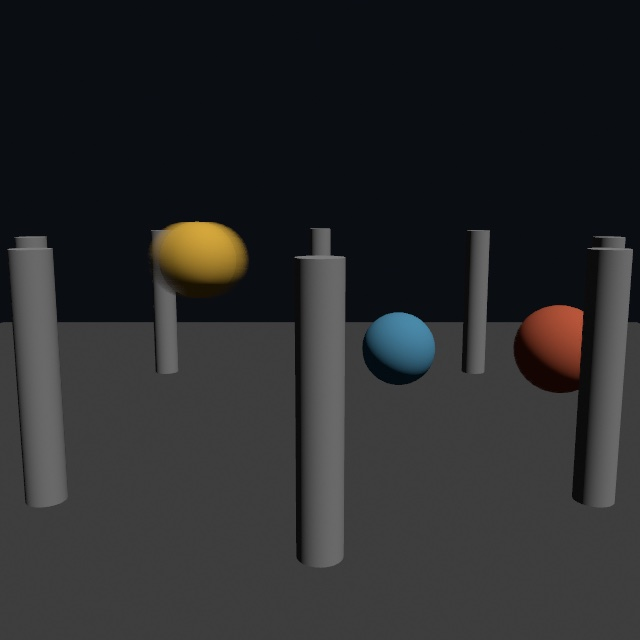

The figure is one frame, and it already shows which sphere moves fastest. The fast one smears into a soft oval along its orbit, the middle one barely softens, and the slow one stays crisp, like the columns. Each pixel streaks along its own motion. The camera's motion is read from the depth layer with nothing declared. Pan past a still scene, and all of it smears along the way it slid. An object that moves on its own declares itself with the same `withMotion { }` block the edge average reads, so one wrapper serves both.

`shutter` sets how long the shutter stays open, as a share of each frame. The block opens it for the whole frame, so the smear is easy to see. The default, `0.5`, is the film standard, open for half of each frame. Filmmakers call it a 180-degree shutter, after the half disc that spins in front of the film. Toward `0.1`, motion turns crisp and choppy, each frame a sharp snapshot. At `1` it smears for a full frame, and past `1` it makes a streak no real camera could.

The blur reads the motion between frames, so an export carries it the same way every time. Frame k streaks by how far things moved since frame k-1, so a video export looks like the live window. The first frame has nothing before it, so it comes out sharp.

The [`MotionBlur` example](../Examples/3D/Effects/MotionBlur/Sketch.swift) is a scene like the figure's, with the camera turning as well, and the toggle and the shutter on parameters. Slide the shutter while the spheres orbit and watch the same motion go from strobe to smear. Captions, 2D overlays, and the environment backdrop never streak, so text stays still while the scene moves.

## Light in the camera: lens flare

The shutter is one part of the camera a render can imitate. The lens is another, and a flare is light that lands in the wrong place inside it.

A lens is meant to bend light onto the sensor, and most of it does. At every glass surface a little light reflects instead of passing through, and light that reflects twice ends up going the right way again. It reaches the sensor, but in the wrong place. That misplaced light is a **ghost**. A row of ghosts, on the line from a bright source through the middle of the frame, is a lens flare.

A camera's **iris** is the ring of thin metal blades that opens and closes to let in more or less light. `apertureBlades` says how many blades it has, and it defaults to 0, a round iris. `lensFlare` turns the flare on, and a `LensFlare` value holds its settings. Here `star: 0` leaves out the star on the lamp, which the next picture adds. The lens and the source's size are explained later in this step:

```swift
var lens = Camera3D(eye: Vector3(0, 1.5, 7.2), target: Vector3(0, 1.4, 0),
                    projection: .perspective(fieldOfView: .pi / 3.4))
lens.apertureBlades = 6              // the iris has six blades
camera(lens)

let lamp = Vector3(-1.52, 2.8, -1.6)
pointLight(Color(hex: 0xFFF0D0), at: lamp, intensity: 20)
lensFlare(LensFlare(lens: .doubleGauss.multicoated().stopped(to: 11),
                    star: 0, sourceSize: 0.004))   // the ghosts that lamp leaves in the lens
```

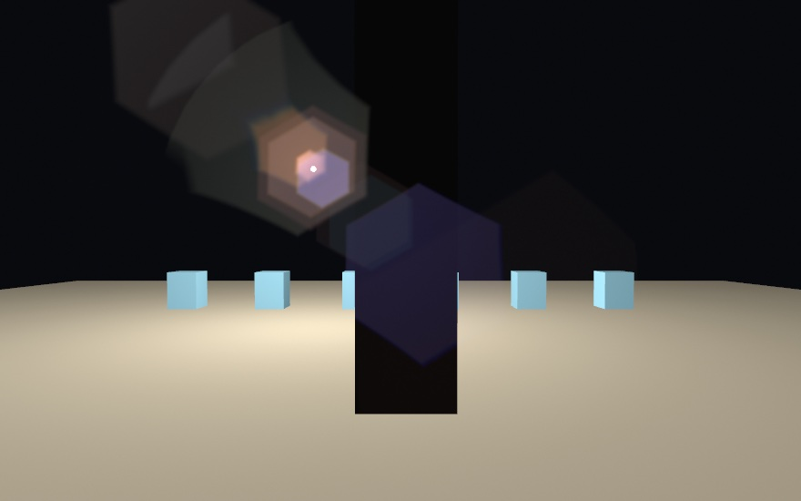

Every ghost in the figure is a hexagon. The iris has six blades, and a ghost is a picture of the opening its light came through. The ghosts sit on one line, from the lamp through the middle of the frame. Some are on the lamp's side of the middle and some across it. Their colors differ because each glass surface is coated to cancel reflections at a different wavelength. A coating passes on whatever it fails to cancel. Look where the violet-blue one is. It lies over the near black slab. Nothing in the room glows there, and the lamp's light never reached that slab. It reached only the glass in front of the sensor.

None of the ghosts is quite a regular hexagon. Each one comes from following rays through the lens's glass. A curved surface bends rays near its rim a little more than rays near its middle. So a ghost's sides stretch a little, more the further the lamp sits from the middle. Where a ghost ends in a curve, the round barrel of the lens stopped rays the iris let past. A bright rim along one side is a caustic, where neighboring rays landed on top of one another.

The ghosts are one half of a flare. The other half sits on the source itself. In the next figure the lens is opened wider, to f/5.6, and its ghosts spread into a faint round veil around the lamp. A lens near wide open throws ghosts so broad that they read as haze, which leaves the star to see.

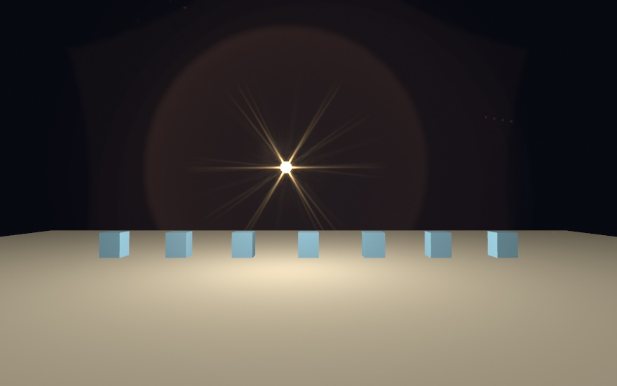

Those arms are light bending at the edges of the iris. Far from an opening, the pattern its edges make is the opening's Fourier transform, the picture read as waves from [Chapter 21](21-PicturesYouSolve.md#a-picture-read-as-waves-the-fourier-transform). Each straight edge throws a line of light across itself. A hexagon's six edges come in three parallel pairs, and each pair throws one line through the source, so the star has six arms. Three things follow:

- An **odd** number of blades gives **twice** as many arms. No two of its edges are parallel, so each edge throws its own line.
- A **round** iris throws no arms at all, only a soft glow around the source. Set `apertureBlades` to 0 and the arms go, along with the hexagon ghosts.
- **Closing the iris grows the star** while it shrinks the ghosts, because light spreads more around a smaller opening. Photographers measure the opening as an f-number, where a higher number is a smaller opening. So a landscape shot at f/16 gets long rays, and a portrait taken wide open gets almost none.

The arms fan into color at their tips because a longer wavelength bends further, so red reaches past blue. A `LensFlare`'s `star` scales the star, and `0` leaves the ghosts without it, as the ghost-chain figure did. They are two different effects, and a sketch may want only one.

Each arm is also a close pair of lines, a little frayed. That comes from `wear`, which sets how worn the opening is, from 0 to 1, with 0.5 as the default. The blades of a used lens do not sit quite evenly, and specks and fine scratches lie across the glass. Each of those bends a little light of its own. `wear: 0` gives the perfect star of a perfect iris, which a real lens does not make.

`amount` scales the flare, and `0` removes it. A flare is a flaw of real lenses. Sometimes you want a strong one, often only a trace, and many sketches want none.

The flare also depends on which lens it comes from. Ollin describes a lens by its **prescription**, the list of its glass surfaces. The surfaces decide how many ghosts there are, where each one sits, and what color it comes out. With no lens named, you get `Lens.standard`, a common design called a double Gauss. Each of its surfaces is coated for a different wavelength, and its iris is closed to f/8. `stopped(to:)` closes any lens's iris to an f-number, and its ghosts shrink and brighten:

```swift
lensFlare(amount: 0.6, lens: .heliar.stopped(to: 11))
```

That asks for a Heliar-type portrait lens from the 1950s, at f/11. The [lens reference](../Docs/3D/LensFlare.md#lens) has `Lens.doubleGauss` uncoated, the coatings, and a wide-screen front group. It also shows how to type in a prescription of your own.

A `LensFlare`'s `sourceSize` describes the scene rather than the lens. It says how big the light is, as the radius of the disc it fills in fractions of the frame height. So the ghost chain's `0.004` is a small lamp. Every point of a wide lamp throws its own copy of each ghost, a little shifted. So a wide lamp gives soft ghosts, and a distant street light gives hard ones. A `LensFlare` also has three extras that the lens's own surfaces don't make. They are a streak from cylindrical glass, dirt on the front element, and a halo. All three are off until you ask, and the [reference](../Docs/3D/LensFlare.md#extras) describes them.

A flare's strength follows how much of the source the camera can see. Move something in front of the lamp and the flare fades as the lamp is covered. It does not switch off the moment the lamp's center goes behind. A flare that switched off at once would read as a sticker on the lens.

The [`LensFlare` example](../Examples/3D/Effects/LensFlare/Sketch.swift) moves a lamp back and forth behind a slab. The lens, the amount, the f-number, the blade count, the source's size, and the wear are parameters. A streak, dirt, and a halo can be turned on too. Watch the ghosts fade as the lamp goes behind, and watch them shrink together as you close the iris.

## Putting it together: the lamplit room

The lamplit room is one lamp swinging over a waxed floor. Nearly everything in the frame is that lamp's light after it has landed somewhere. It bounces off the floor onto the ceiling and shows in the floor's sheen. A glass ball focuses it into a spot, a red ball rolls through it, and the lamp flares in the lens. Make `MySketches/LamplitRoom.swift`:

```swift
import Ollin

final class LamplitRoom: Sketch {
    let bulb = Image(width: 1, height: 1, color: Color(hex: 0xFFF1D6))
    let pivot = Vector3(-0.9, 4.0, -0.6)

    override func draw() {
        background(.black)
        var lens = Camera3D(eye: Vector3(0.2, 1.8, 3.8), target: Vector3(0.4, 1.4, -1),
                            projection: .perspective(fieldOfView: .pi / 2.8))
        lens.apertureBlades = 6
        camera(lens)
        toneMap(.aces, exposure: 1.2)

        // The lamp swings on its cord, and its light points down the cord.
        let swing = 0.3 * sin(time * 1.2)
        let down = Vector3(sin(swing), -cos(swing), 0)
        let lamp = pivot + down * 1.1
        spotLight(Color(hex: 0xFFE2B8), at: lamp, direction: down,
                  coneAngle: 2.0, penumbra: 0.6, intensity: 4)

        // What the light does once it lands.
        environment(.studio.intensified(to: 0.12))
        castShadows()
        globalIllumination()
        rayTracedReflections()
        glossyReflections()
        caustics(dispersion: 0.3)

        // What the camera does with it.
        temporalAntialiasing()
        motionBlur()
        lensFlare(amount: 0.5)

        // The room: a waxed floor, a white ceiling and back wall, one
        // terracotta wall and one teal one.
        withState {
            material(.dielectric(roughness: 0.2))
            fill(Color(hex: 0x7A5E48))
            translate(0, -0.1, 0)
            drawBox(width: 8.4, height: 0.2, depth: 8.4)
        }
        fill(Color(white: 0.86))
        withState { translate(0, 4.1, 0); drawBox(width: 8.4, height: 0.2, depth: 8.4) }
        withState { translate(0, 2, -4.3); drawBox(width: 8.4, height: 4.4, depth: 0.2) }
        withState { fill(Color(hex: 0xC8603A)); translate(-4.3, 2, 0); drawBox(width: 0.2, height: 4.4, depth: 8.4) }
        withState { fill(Color(hex: 0x2A8C8C)); translate(4.3, 2, 0); drawBox(width: 0.2, height: 4.4, depth: 8.4) }

        // A glass ball on a white plinth, wide enough that the lamp's light
        // comes to its focus on the plinth's top rather than spreading again
        // on the floor beyond it.
        withState { translate(1.1, 0.25, 0.2); drawBox(width: 1.6, height: 0.5, depth: 0.9) }
        withState {
            material(.glass(thickness: 1.2))
            fill(.white)
            translate(1.0, 1.1, 0.2)
            drawSphere(radius: 0.6)
        }

        // A red ball rolling around the plinth.
        withMotion("ball") {
            withState {
                material(.dielectric(roughness: 0.35))
                fill(Color(hex: 0xC8302C))
                translate(1.0, 0.3, 0.2)
                rotate(time * 1.8, axis: .unitY)
                translate(1.5, 0, 0)
                drawSphere(radius: 0.3)
            }
        }

        // The cord and the bulb. The bulb sits a little up the cord from the
        // light, so it never stands between the light and the room.
        withMotion("lamp") {
            withState {
                fill(Color(white: 0.1))
                translate(pivot)
                rotateZ(swing)
                translate(0, -0.475, 0)
                drawCylinder(radius: 0.012, height: 0.95)
            }
            withState {
                translate(lamp - down * 0.08)
                fill(.white)
                matcap(bulb)
                drawSphere(radius: 0.07)
            }
        }
    }
}
```

The room uses the traced reflections with the glossy floor, the bounce, the caustic, the edge average, the motion blur, and the flare. It sets up its light in three groups.

The first group is the lamp. A spot light hangs at the end of the cord, `pivot + down * 1.1`, and points down it. `down` is the cord's direction, an arrow turned `swing` radians from straight down, built from the `sin` and `cos` of [Chapter 3](03-MotionAndTime.md#the-circle-behind-sin). So as `swing` rocks the lamp, its pool of light moves across the floor with it.

The second group is what the light does once it lands. The bounce comes from `globalIllumination()`, so the floor lights the ceiling and the two colored walls tint what faces them. The floor shows the room rather than the sky through `rayTracedReflections()` and `glossyReflections()`, blurred by its roughness of 0.2. The spot comes from `caustics(dispersion: 0.3)`, which sends the lamp's light through the glass ball and lands it on the plinth. The dispersion splits a little of the spot's color apart at its edge.

Shadows hold those three together. With `castShadows()` on, the bounce respects the shadows, and the spot lands inside the glass ball's own shadow. With one light in the room, the light that casts the shadows is also the one the photons leave from. The `environment(_:)` is dim on purpose. The reflections need a sky to fall back to, but the room should be lit by its lamp.

The third group is the camera. The edges settle under `temporalAntialiasing()`, what moves streaks under `motionBlur()`, and `lensFlare(amount: 0.5)` puts the lamp's flare in the lens. The ghosts come out as hexagons and the star with six arms, because the camera was given `apertureBlades = 6`. The red ball is drawn inside `withMotion("ball")`, and the cord and bulb inside `withMotion("lamp")`. The average and the blur learn from them how each one moved, so the ball's edges stay settled while it rolls. `lens` is the sketch's `Camera3D`, named for the lens settings it carries. It is a different thing from the `Lens` value a flare can take.

The bulb uses `bulb` as its matcap, from [Chapter 25](25-3DGently.md#shading-from-a-picture-matcaps). A matcap takes its look from a picture instead of the lights. A picture one pixel across is one flat warm color, so the bulb glows the same from every side. It is drawn a little way up the cord, not where the light is. A shape drawn right where a light sits stands between that light and everything it shines on. With `castShadows()` on, it would shade the whole room. Up the cord, the bulb is behind the light, which points down. The flare checks what covers the light from a point a little in front of it, so the bulb doesn't dim the flare either.

The traced parts need a ray-tracing GPU, which every Apple silicon Mac has. Elsewhere those calls do nothing, and the room still draws with its direct light, its shadows, and its flare. If it stutters on your Mac, try `reflectionQuality(.performance)` and `globalIlluminationQuality(.performance)` first. [What else reads the motion](#what-else-reads-the-motion-a-changing-mesh-fewer-pixels-and-fewer-frames) then renders fewer pixels or draws fewer frames, and neither changes what an export writes.

Then make it yours:

- Color the glass. Give it `material(.glass(thickness: 1.2, attenuationColor: Color(hex: 0xD08A2E), attenuationDistance: 1.2))`, and the ball and the spot it throws both turn amber. Or turn the caustics' `dispersion` up to 1, and the red and blue at the spot's edge spread wider.
- Close the iris. `lensFlare(amount: 0.5, lens: .standard.stopped(to: 16))` shrinks and brightens the ghosts and grows the star. Set `apertureBlades` to 5 as well, and the star has ten arms, since an odd count doubles them.
- Sway the camera. Build `lens` with `Camera3D.orbiting`, around the glass at a radius of 3.6, with `elevation: 0.2` and `fieldOfView: .pi / 2.8`, and let its `azimuth` follow `sin(time * 0.4) * 0.3`. The motion blur and the edge average read the camera's motion on their own, with no `withMotion` needed.

This one moves, so keep it as a movie. This writes twelve seconds of it:

```sh
swift run OllinLive MySketches/LamplitRoom.swift --export-video lamplit-room.mp4 --seconds 12
```

An export doesn't wait for anything to settle. Each frame averages its own shifted passes and gathers its bounce in full. So each frame is finished when it is written, and the file cannot flicker. A still of the room can go one step further, traced path by path, and [the slow render](#the-slow-render-path-tracing) shows how.

## The slow render: path tracing

The room draws its surfaces the usual way, triangle by triangle, filling each one in pixel by pixel. That is called **rasterizing**. The room adds its mirrors, its bounce, and its caustic on top, each worked out on its own, fast enough for a live window. A still can go one step further and trace the whole frame, light path by light path.

### Light followed path by path: the path-traced export

A **path tracer** renders a frame by following light. For each pixel it sends many paths into the scene. Each one bounces from surface to surface until it reaches a light, and the pixel is the average of what they bring back. It is for the finished still, where shadows, bounces, glass, and mirrors all have to agree. It goes back to James Kajiya's 1986 paper *The Rendering Equation*. The paper wrote all the light in a scene as one equation and introduced path tracing to estimate it.

<picture>
  <source media="(prefers-color-scheme: dark)" srcset="Images/31-TracedLight/TracedLight-dark.jpg">
  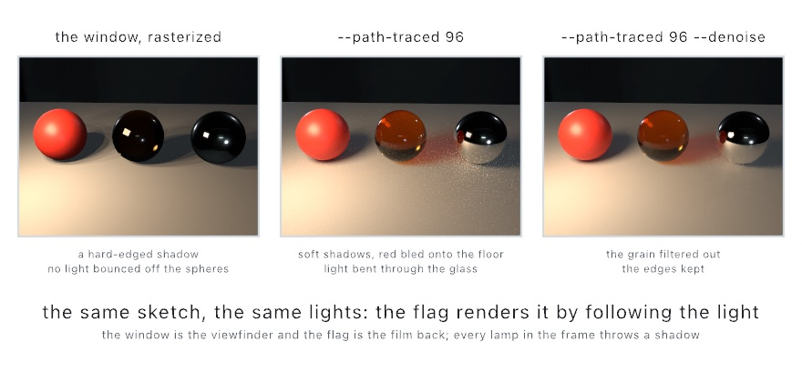
</picture>

The figure is one small set rendered three ways. Rasterized, the softbox throws a hard-edged shadow, and the floor is lit by the softbox alone. The glass sphere is a tinted shell, and the chrome one is a dark ball with a highlight. Traced at 96 paths a pixel, the shadows soften as they fall away from each sphere. The red sphere warms the floor beside it. The light goes through the amber glass and lands as a tinted pool where the first panel had a black shadow. The chrome shows the set. What is left at 96 is grain, and the third panel is the same trace through the grain filter of the next entry.

Add `--path-traced` to an image or video export:

```sh
swift run OllinLive MySketches/LamplitRoom.swift --export room.png --path-traced 512
```

The number is light paths per pixel. More is smoother, and it takes proportionally longer. So you frame and tune in the live window, then let the export take its time.

The traced frame adds what the live one leaves out. Shadows from an area light sharpen at contact and soften with distance. Color bleeds between neighboring surfaces. Every polished surface mirrors the scene, including the other mirrors. A `.glass` material bends the view through a solid body. A colored one tints the light crossing it, so even its shadow glows with the light that got through. A mesh with an emissive material becomes a lamp with a shape and lights its neighbors like a softbox. Textures, normal maps, surface maps, and emissive maps all reach the traced light. So do the copies of [Chapter 27](27-Landscapes.md#ten-thousand-of-the-same-thing-instancing), so a field of ten thousand pebbles shadows and mirrors like ten thousand placed by hand.

The camera also gains a real lens. Set `aperture` and `focusDistance` on your `Camera3D`, and the export has true depth of field, while the live window stays sharp for framing.

Your light rig comes over as you left it. The tracer follows the light itself, so it needs no `castShadows()`, and every lamp in the frame throws a shadow. A light you told not to cast one still casts none, which matters because the fill light in a preset rig is such a light. It needs an Apple silicon Mac, and [the reference](../Docs/Output/PathTraced.md) lists what the traced frame adds and what stays with the usual drawing.

### Grain filtered out: denoising

What is left of the error in a traced render is grain. Taking it away by adding paths costs the square: four times the paths for half the grain. `--denoise` filters it out instead, for a clean still at a fraction of the time. Its filter is the edge-avoiding wavelet of Holger Dammertz and colleagues, from 2010. The variance-guided weights of Christoph Schied and colleagues, from 2017, steer it.

The tracer wrote down what it hit, not only what it saw. It kept the first surface's own color, the way it faces, and how far off it is. It also kept how much each pixel's samples disagreed. The filter divides the light by that color, smooths the light alone, and multiplies the color back. A texture keeps its edges and a silhouette keeps its line, because neither was ever in the part being smoothed. The strength comes from the disagreement, so a thin render is smoothed hard and a nearly finished one only a little. On the scene of the [`PathTraced` example](../Examples/3D/Effects/PathTraced/Sketch.swift), 64 filtered samples land about where 240 raw ones would.

It is off unless you ask. A raw render shows only what was traced, and a real sparkle reads softer once the filter has been over it. The lamplit room makes a still this way. Give its camera a real lens with `lens.aperture = 0.05` and `lens.focusDistance = 3.7`, after `lens.apertureBlades = 6` and before `camera(lens)`, then trace it:

```sh
swift run OllinLive MySketches/LamplitRoom.swift --export lamplit-room.png --path-traced 512 --denoise
```

The traced frame has true depth of field, focused on the glass, and its out-of-focus highlights are hexagons for the same six blades. The focused spot under the glass does not carry over. It comes from the live `caustics()`, so in the traced frame the glass throws a plain, paler shadow instead.

## More for polished surfaces: reflection chains and specular anti-aliasing

The room's floor reflects the room once, and its surfaces are large enough on screen that each highlight covers many pixels. Two things change when that isn't so. Mirrors that face each other ask for reflections of reflections. A polished surface that is far away or tightly curved makes highlights smaller than a pixel.

### Mirrors facing mirrors: reflectionBounces

A traced reflection shades two surfaces by default. It shades the one the ray finds and that surface's own reflection, which then ends at the environment. A single mirror never needs more. Two mirrors face to face ask for a tunnel of images without end, and `reflectionBounces(_:)` sets how deep it goes. Rays that spawn further rays at each mirror go back to Turner Whitted's ray tracer of 1980. At two surfaces the tunnel stops at the third frame and puts the environment in it:

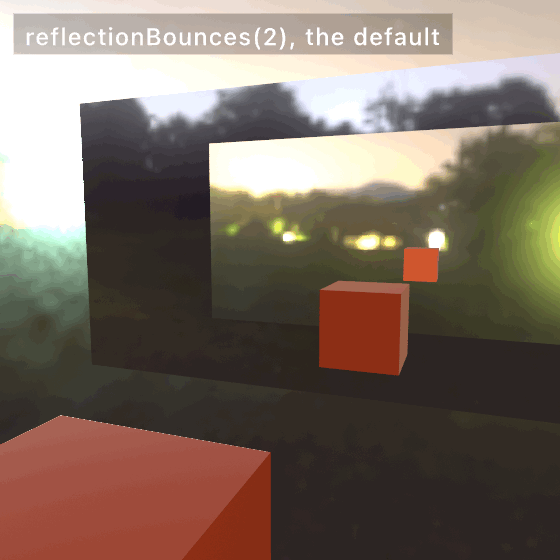

```swift
reflectionBounces(4)
```

That opens two more frames, and each surface you add costs one more traced ray for every reflected pixel. The images dim quickly, because each mirror passes on only the share of light it reflects. Three or four is usually as deep as you can see. The count is clamped to the range 2 to 8, and the setting persists, so set it once.

### Highlights that hold still: specular anti-aliasing

Temporal anti-aliasing steadies the edges of things. Their highlights can crawl too, and moving the samples does not fix that.

A polished surface turns a light into one small bright spot. Where the surface curves tightly, or a normal map turns quickly, a single pixel covers a whole range of surface directions. The spot can end up narrower than that pixel. Ollin shades each pixel once, so the one sample either lands on the spot or misses it. Which one happens changes from frame to frame. That is the sparkle running over a bed of small shiny balls, a metal roof in the distance, or a bumpy normal map. The eight samples per pixel do not help, because they sample the shape, and the shading still happens once. `specularAntialiasing()` calms it by widening the highlight, which is the normal-distribution filtering of Anton Kaplanyan, Stephen Hill, Anjul Patney, and Aaron Lefohn, from 2016.

<picture>
  <source media="(prefers-color-scheme: dark)" srcset="Images/31-TracedLight/HeldHighlights-dark.jpg">
  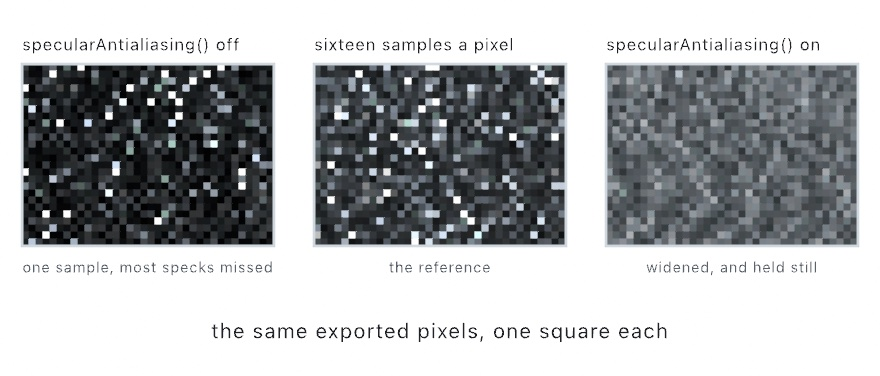
</picture>

The figure is a bed of balls a few pixels across each, magnified the same way, one square to a pixel. On the left the call is off. Most balls show nothing and a few show one hard white pixel, because the one shading sample either hits the highlight or misses it. The middle crop is the reference, the same frame at sixteen samples a pixel. It shows what the surface scatters, a highlight on every ball, most of them faint. On the right the call is on. Every ball carries a broader, dimmer highlight, and the bed reads calm. It also reads a touch brighter than the reference, because a widened highlight spreads further than the surface does. The call gives up a little accuracy for steadiness. As the balls turn, the left crop would change from frame to frame, and the right one would not.

```swift
material(.metal(roughness: 0.1))
specularAntialiasing()      // the sparkle stops running
```

The call widens the roughness of each pixel by how far its own surface direction turns across it. A wider highlight is broader and dimmer. It fills the pixel instead of hiding inside it, so it stays where it is while the surface moves. The cost is two small measurements per pixel, with no extra pass and no history to build up. Any Mac that runs Ollin can do it.

It finds the detail on its own. A flat wall holds one direction across every pixel of it, so it comes back as it was. A ball a few pixels wide is widened a lot. Nothing is widened past a fixed limit, which keeps the pixels along a silhouette from turning matte. `strength` scales the effect. 1 is the standard amount, and 2 gives up more of the finish for more calm. Below 1 keeps more of the original sharpness.

It has two limits. A highlight so bright that it has already gone flat white cannot be calmed, and widening it only spreads that white. Turn the strength down if a picture reads softer rather than steadier. The measurement also comes from the pixels next door, so detail far below one pixel is guessed rather than measured.

The [`SpecularAntialias` example](../Examples/3D/Effects/SpecularAntialias/Sketch.swift) is a bed of small polished balls under one hard light, with the toggle and the strength on parameters. The plate standing behind them is flat, so it never changes. Watch the balls at the back of the bed, where they are smallest.

## The blur a lens makes: bokeh and depth of field from light

The room's six blades shaped its ghosts and its star. The same opening shapes a blur. Out of focus, a point of light spreads into a picture of the opening its light came through. [Chapter 25](25-3DGently.md#what-the-depth-buffer-is-for-ambient-occlusion-and-defocus)'s `.defocus` blurs a scene by its depth, and it can take that opening's shape. A blur can also be built another way, from samples of light that each pass through a lens.

### The shape of a blur: bokeh

Photographers call the look of out-of-focus light **bokeh**, from a Japanese word for blur. A point of light out of focus becomes a copy of the lens's opening. So a lens with six blades turns every blurred highlight into a hexagon. Near the corners of the frame, the lens barrel clips the opening from one side, and the highlight narrows into a lemon shape. That clipped shape is called a cat's eye, and the barrel's clip is called optical vignetting. Lawrence McIntosh, Bernhard Riecke, and Steve DiPaola showed in 2012 how a blur worked out from a finished frame can carry a polygon opening. Craig Kolb, Don Mitchell, and Pat Hanrahan reproduced that vignetting in 1995 by tracing rays through a whole lens.

<picture>
  <source media="(prefers-color-scheme: dark)" srcset="Images/31-TracedLight/TheOpening-dark.jpg">
  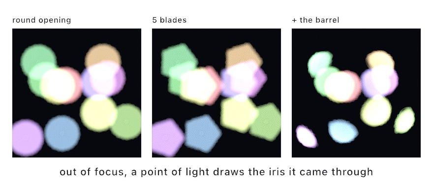
</picture>

Hand `.defocus` a `blades` count and every highlight becomes a polygon of that many sides. `catsEye` adds the barrel. At full strength its round opening trims even the middle highlights, as the third panel shows, and toward the corners they clip into lemons. Add both to [Chapter 25](25-3DGently.md#what-the-depth-buffer-is-for-ambient-occlusion-and-defocus)'s `.defocus` line:

```swift
let focused = scene.combined(with: scene.depth,
                             .defocus(focus: 0.46, range: 0.13, maxBlur: 16, blades: 5, catsEye: 1))
```

Leave `blades` out, and a scene defocused by its own depth takes the count from the camera that drew it. So one line, `lens.apertureBlades = 6`, shapes this blur, the flare ghosts of [the lens flare](#light-in-the-camera-lens-flare), and the path-traced export together. Name `blades` at the call only for a blur no camera knows about, such as one over a depth ramp you drew by hand. The blur gathers a fixed number of samples. A light smaller than the space between them shows the pattern of the gather instead of a clean edge. So keep a light a few pixels across, or raise `quality`.

### A lens made of samples: depth of field from light

`.defocus` blurs a finished frame by reading each pixel's depth. A second route builds the blur out of light. [Chapter 24](24-ParticleSimulations.md#a-million-grains-gpu-particles) drew a million grains with `style: .light` into [Chapter 19](19-LayersAndEffects.md#converging-instead-of-brightening-the-running-mean)'s `Accumulator`, and the picture converged instead of brightening. Send each sample through a lens on its way in, and the running mean converges to a photograph with depth of field. It is for scenes made of many thin lines or points, where each sample can carry its own blur. It follows Anders Hoff's depth-of-field essays at inconvergent.net, and Domenico Bruzzese's Blurry library was read for its shape.

The lens is a `Bokeh`, with a `focalDistance`, where things are sharp, and a `strength`, how fast the blur grows with distance from that plane. Here is a sphere of rings through three of them:

<picture>
  <source media="(prefers-color-scheme: dark)" srcset="Images/31-TracedLight/ThroughALens-dark.jpg">
  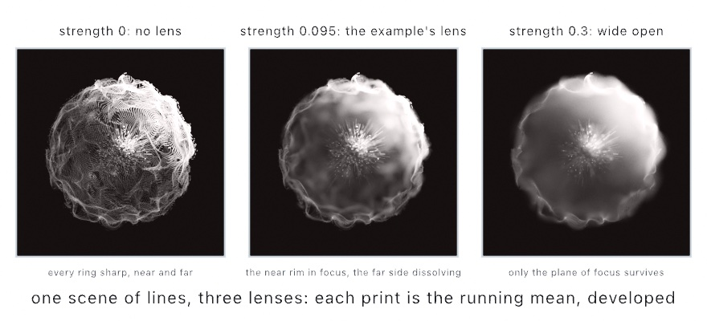
</picture>

With the strength at zero every ring is sharp, near and far, and the sphere reads as a wire model. At the example's own setting, the near rim stays crisp while the far side dissolves, as it would in a photograph. Opened wide, only the plane of focus stays sharp. Each sample lands in a disc sized by its own distance from the plane of focus. The running mean adds those discs up until the bokeh appears. So a print takes a few hundred passes to settle, and an exported frame wants `--settle`, which [Chapter 38](38-FinishingASketch.md#settled-then-written-a-running-mean-in-a-video) explains.

For a scene made of lines, `LineSpray` is that pipeline in one call. `makeLineSpray` takes the lines once in `setup()`, with a `Bokeh` as the lens, and `drawLineSpray` adds a few passes each frame:

```swift
spray = makeLineSpray(lines, sampling: .perLine(10), passesPerFrame: 5,
                      bokeh: Bokeh(focalDistance: 49.19, strength: 0.095, minSize: 0.015))
// …each frame, with a camera set:
drawLineSpray(spray)
```

The `Rendering/LineSpray` example is the sphere of a hundred and fifty rings. The rings are bent by `curlNoise`, the three-coordinate relative of [Chapter 14](14-FieldsAndFlow.md)'s `curlField`. A curl never gathers or drains, so the rings wave as if a current had passed through the sphere, without tearing. The `Rendering/DepthOfField` example does the same from a kernel of its own, with millions of samples a frame over any geometry. The [depth of field page](../Docs/Drawing/DepthOfField.md) has the lens and the rules.

## What else reads the motion: a changing mesh, fewer pixels, and fewer frames

The room drew its ball and its lamp inside `withMotion`, so the edge average and the blur knew how each one moved. A mesh that changes shape, upscaling, and frame interpolation read that same motion. A mesh that changes shape hands over its own history, since it has no single placement to remember. And when a scene gets heavy, upscaling and frame interpolation both use the motion to spend less. One renders fewer pixels, and the other draws fewer frames.

### A mesh that changes shape: drawMesh(_:previous:)

`withMotion` remembers a block's placement, which covers anything that moves as one piece. A mesh that changes shape has no single placement. A ribbon you rebuild every frame, a marching-cubes surface, or a cloth moves vertex by vertex. The edge average and the blur read motion as a small arrow per pixel, called a **motion vector**. It says how far that bit of surface moved on screen since the last frame. Brian Karis's temporal average and Morgan McGuire's blur filter both read it. For a changing mesh, it comes from each vertex's last position. Here `ribbon` is a mesh your sketch rebuilds each frame:

```swift
drawMesh(ribbon, previous: lastPositions)   // last frame's positions, same count and order
lastPositions = ribbon.positions
```

Keep the array from one frame to the next. Draw with last frame's positions, then store this frame's for the next one. On the first frame the array is still empty, so its count does not match. Ollin notes that once and draws the mesh with its placement's motion alone. A bending ribbon then keeps its edges settled and streaks where it bent.

### Rendering fewer pixels: temporal upscaling

Almost everything in this chapter costs something for every pixel, and so do the fields of [Chapter 30](30-SculptingWithFields.md). The mirrors trace one ray per pixel, the fields march per pixel, and the bounce is gathered per pixel. When a scene gets heavy, you can render fewer of them. `temporalUpscaling()` draws each live frame at a fraction of the canvas and rebuilds the full-size picture from the frames before it. It drives Apple's MetalFX temporal scaler.

<picture>
  <source media="(prefers-color-scheme: dark)" srcset="Images/31-TracedLight/FewerPixels-dark.jpg">
  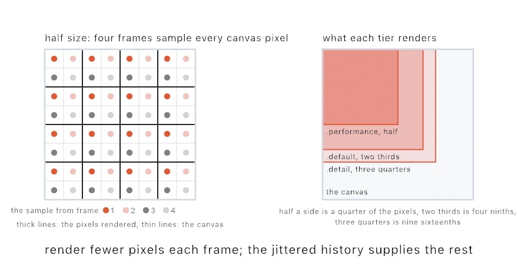
</picture>

The left panel of the figure is why that works. At half size, one rendered pixel covers four canvas pixels. The projection moves a different way each frame, so the sample lands in a different one of the four each time. After four frames, every canvas pixel has been sampled once. The history holds those frames, and the scaler reads the full-size picture out of them. The right panel is how much each setting renders. Half a side is a quarter of the pixels, two thirds is four ninths, and three quarters is nine sixteenths.

```swift
rayTracedReflections()
temporalUpscaling()      // render at two-thirds size, reconstruct the full canvas
```

The setting picks how few. `.performance` renders at half size per side, `.default` at two-thirds, and `.detail` at three-quarters. It replaces `temporalAntialiasing()` while it runs, since it is that same average aimed at resolution. It reads the same `withMotion { }` declarations, so a mover rebuilds cleanly while it moves. It needs Apple silicon, and anywhere else the call renders normally, with a note.

What you keep is never the preview. Exports render at full resolution with the average taken inside each frame. So upscaling only changes the live window, and the same sketch previews fast and exports in full. The [`Upscaling` example](../Examples/3D/Effects/Upscaling/Sketch.swift) is a mirror floor tracing a ring of columns, with the toggle and the setting on parameters. Watch the frame rate in the inspector, which ⌘/ opens as in [Chapter 3](03-MotionAndTime.md#when-a-frame-takes-too-long), while you flip them. An export never upscales, so the frame rate, not a still, is where the difference shows.

### Drawing fewer frames: frame interpolation

Upscaling spends less on each frame. Frame interpolation draws fewer frames, and the GPU makes the frames between them. It drives Apple's MetalFX frame interpolator, which builds a frame between two drawn ones:

<picture>
  <source media="(prefers-color-scheme: dark)" srcset="Images/31-TracedLight/EveryOtherRefresh-dark.jpg">
  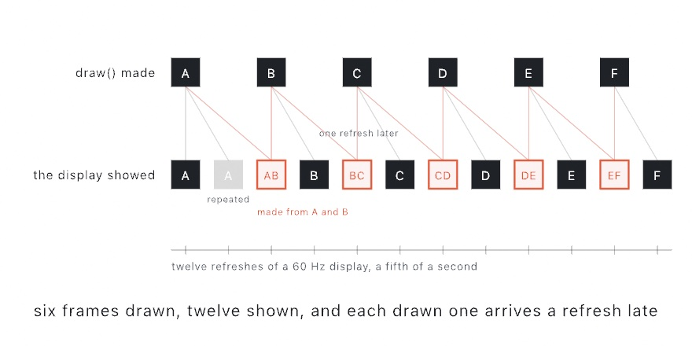
</picture>

```swift
rayTracedReflections()
frameInterpolation()     // draw every other refresh, show a made frame between
```

`draw()` then runs on every other refresh. On the refresh between, the platform builds the picture that belongs in the middle out of the two frames either side of it. The depth layer and the same `withMotion { }` declarations guide it. A scene that can hold thirty drawn frames a second moves at the display's sixty.

The figure is a fifth of a second of that, refresh by refresh. The top row is what `draw()` made, six frames, one on every other refresh. The bottom row is what the display showed, and it has twelve. Each made frame sits on the refresh its second source was drawn, built from that frame and the one before it. Each drawn frame is shown on the refresh after its own, which is the wait described below. The first frame has nothing to pair with, so it is shown at once and then repeated.

Your clock does not change. `time` still runs on real seconds, so the motion keeps its speed and only its sampling halves. The FPS readout counts frames you drew, so it falls to thirty while the picture on screen keeps its pace.

It has two costs. A drawn frame waits one refresh before it is shown, because the made frame belongs in front of it. So everything arrives about sixteen milliseconds later than it would, and a sketch steered by the mouse can feel that. A made frame is also a guess. Where something moves further than the interpolator can follow, it repeats the drawn frame instead of smearing it. The first frame after it starts has nothing to pair with, so it is repeated, and turning it on shows nothing odd.

An ordinary export never interpolates, so a still or a video carries only the frames you drew. A slow-motion export can ask for made frames on purpose, which [Chapter 38](38-FinishingASketch.md#slower-than-it-happened-slow-motion) covers. The [`FrameInterpolation` example](../Examples/3D/Effects/FrameInterpolation/Sketch.swift) is a ring of orbiting blocks with a fast arm sweeping through them, with the toggle and a speed parameter. Turn the speed up until the arm stops keeping up, which is where the made frames fail.

## Where this comes from

The light in this chapter rebuilds published methods. The screen-space reflections march the depth layer as Morgan McGuire and Michael Mara described in 2014. The traced mirrors follow the hybrid rendering Apple describes for Metal ray tracing. It draws the surfaces as usual and traces one ray from each reflective pixel. The glossy lobe draws each ray with Eric Heitz's sampling of the visible normals, from 2018. It shares the neighbors' rays the way Tomasz Stachowiak's stochastic reflections do, from 2015. Global illumination is the dynamic diffuse irradiance field of Zander Majercik, Jean-Philippe Guertin, Derek Nowrouzezahrai, and Morgan McGuire, from 2019. The caustics are Xueqing Yang and Yaobin Ouyang's adaptive anisotropic photon scattering, from 2021.

The camera's side is written the same way. Temporal anti-aliasing is written from Brian Karis's 2014 treatment of temporal supersampling. Motion blur is the reconstruction filter of Morgan McGuire, Padraic Hennessy, Michael Bukowski, and Brian Osman, from 2012. The lens flare follows the physically based lens flare of Matthias Hullin, Elmar Eisemann, Hans-Peter Seidel, and Sungkil Lee, from 2011. It traces each ghost through the lens, colors it by its coatings, and draws the star from the iris. Sungkil Lee and Elmar Eisemann's matrix formulation, from 2013, finds the ghosts. The entries after the room name their own sources. Full credits are in the project's [attribution notes](../ATTRIBUTION.md).

## Go deeper

- [Depth effects](../Docs/Drawing/Effects.md#combined): `.screenSpaceReflections` and `.defocus`, with the iris `blades` and `catsEye` that shape a blur.
- [The traced and temporal tiers](../Docs/3D/3D.md): ray-traced and glossy reflections and their depth, the global-illumination probe field, temporal anti-aliasing with `withMotion` and `drawMesh(_:previous:)`, specular anti-aliasing, motion blur, temporal upscaling, and frame interpolation, each with what it needs and what it costs.
- [Lights](../Docs/3D/3D.md#lights) and [which sources flare](../Docs/3D/LensFlare.md#sources): the spot light the room hangs, and a glowing body drawn where a light sits.
- [Caustics](../Docs/3D/Caustics.md): what casts and what receives, the emitting light's priority, dispersion, the quality setting, and how the photon chain works.
- [Lens flare](../Docs/3D/LensFlare.md): the lens as a stack of glass surfaces, the bundled prescriptions and writing your own, the iris and its blades, which sources flare, and how a flare follows what the camera can see.
- [Depth of field from light](../Docs/Drawing/DepthOfField.md): `LineSpray` and the `Bokeh` lens, sampling lines by length or per line, the running mean underneath, and the same pipeline from a kernel over any geometry.
- [Path-traced export](../Docs/Output/PathTraced.md): what the traced frame adds and what stays raster, the sample count and its timings, the real lens, and the grain filter.
- Worked examples: [`Examples/3D/Effects/ScreenSpaceReflections`](../Examples/3D/Effects/ScreenSpaceReflections/Sketch.swift), [`RayTracedReflections`](../Examples/3D/Effects/RayTracedReflections/Sketch.swift), [`Examples/3D/Lighting/GlobalIllumination`](../Examples/3D/Lighting/GlobalIllumination/Sketch.swift), [`Caustics`](../Examples/3D/Lighting/Caustics/Sketch.swift), [`Examples/3D/Effects/TemporalAA`](../Examples/3D/Effects/TemporalAA/Sketch.swift), [`SpecularAntialias`](../Examples/3D/Effects/SpecularAntialias/Sketch.swift), [`MotionBlur`](../Examples/3D/Effects/MotionBlur/Sketch.swift), [`LensFlare`](../Examples/3D/Effects/LensFlare/Sketch.swift), [`SceneDefocus`](../Examples/3D/Effects/SceneDefocus/Sketch.swift), [`Upscaling`](../Examples/3D/Effects/Upscaling/Sketch.swift), [`FrameInterpolation`](../Examples/3D/Effects/FrameInterpolation/Sketch.swift), [`PathTraced`](../Examples/3D/Effects/PathTraced/Sketch.swift), and the lens made of samples in [`Examples/Rendering/DepthOfField`](../Examples/Rendering/DepthOfField/Sketch.swift) and [`LineSpray`](../Examples/Rendering/LineSpray/Sketch.swift).

---

[Contents](README.md#contents) · Previous: [Chapter 30, Sculpting with fields](30-SculptingWithFields.md) · Next: [Chapter 32, Seeing](32-Seeing.md)
